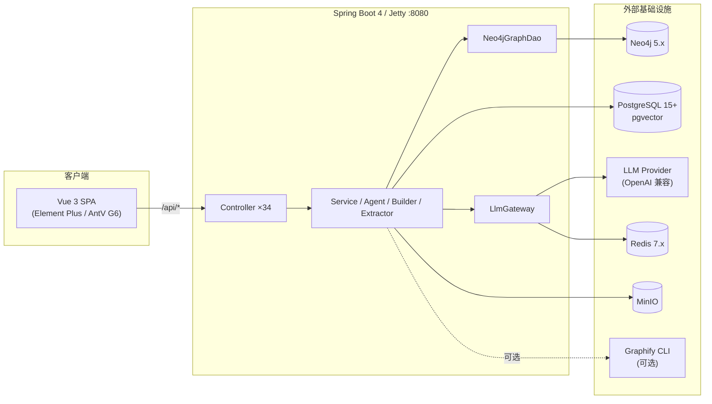

# LegacyGraph — 系统 AI 知识图谱分析平台

[](https://spring.io/projects/spring-boot)
[](https://openjdk.org/projects/jdk/21/)
[](https://v3.vuejs.org/)
[](LICENSE)

## 项目简介

**LegacyGraph** 是一个企业级系统分析与知识图谱平台，通过大语言模型（LLM）、图数据库（Neo4j）、向量检索（pgvector）和 Redis 缓存技术，把代码库、数据库、文档、前端页面连接成一张可追溯、可验证、可审核的统一知识网络；并可选集成 [Graphify](#graphify-集成) CLI 做外部代码图谱分析与差异比对。

核心理念：**静态分析给事实，LLM 做归纳与补全，自动测试负责反证，人工审核兜底**。

## 应用场景

- 👥 **新人快速上手**：自然语言问答「用户注册涉及哪些表？」「修改密码经过哪些模块？」
- 🔍 **架构审计**：识别代码异味、技术债务、N+1 查询、不合理依赖
- 📊 **影响分析**：基于图谱依赖链评估变更影响范围
- 🧪 **测试增强**：AI 自动生成 API/E2E/DB 测试用例，执行结果回写置信度
- 🔁 **跨仓库联邦**：多仓库图谱关联与跨仓影响传播（Graphify 联邦）

## 核心能力

### 三类图谱

| 图谱 | 内容 | 数据来源 |
|---|---|---|
| 代码图谱 | Controller/Service/Mapper/SQL/表/字段调用链 | Java AST + MyBatis XML + JDBC 元数据 |
| 功能图谱 | 页面/按钮/API/权限/菜单 → 后端接口映射 | Vue 组件 + axios 调用 + Controller 注解 |
| 业务图谱 | 业务域/流程/角色/对象/规则/状态流转 | 文档 AI 抽取 + 人工确认 |

所有节点和关系均带 `evidence`（文件、行号、SQL、文档片段）、`confidence`（0–1）、`status`（CONFIRMED/PENDING_CONFIRM/REJECTED）。节点类型以 `NodeType.java` 为准，关系类型以 `EdgeType.java` 为准。

### LLM Agent 体系

Agent 位于 `agent` 包，统一经 `LlmGateway` 调用——支持多模型动态路由、Prompt 模板渲染、PII 脱敏、结构化校验、`lg_prompt_run` 审计（token/latency/inputHash）和 Redis 结果缓存（TTL 7d）。主要 Agent：`CodeFactAgent`、`DocUnderstandingAgent`、`FeatureMappingAgent`、`GraphMergeAgent`、`TestCaseAgent`、`ReviewAgent`、`QaAgent`/`EnhancedQaAgent`、`SqlAdvisorAgent`、`TestFailureAnalysisAgent`、`ReportInsightAgent`、`RefactorAgent`、`ChangeImpactAgent`、`MigrationAgent`、`PrDescriptionAgent`、`DbSchemaAnalysisAgent`、`CodeUnderstandingAgent`。

### RAG 问答

五段式检索增强生成：查询改写/HyDE → pgvector 向量召回 → Neo4j 图邻域扩展 → 重排序 → LLM 生成。回答带 `usedEvidence`、`relatedNodeKeys` 和 `confidence`。`EnhancedQaController` 暴露 `/qa/ask/stream` 流式问答。

### 扫描后 AI 编排

`ProjectScanner` 扫描完成后由 `AiScanOrchestrator` 自动执行 AI 子任务：文档分片 → 业务事实抽取 → 业务图谱构建；前端 API ↔ 后端接口映射；高价值 API 测试用例生成；低置信节点审核任务生成。

### 测试闭环

从功能节点出发，沿 `Feature → Page → API → Service → SQL → Table` 链路生成测试；API 用 REST Assured、E2E 用 Playwright、断言覆盖 HTTP/JSONPath/SQL/状态；结果回写图谱置信度（PASS +0.10，FAIL −0.20，人工审核通过 +0.15）。

### Graphify 集成

可选集成外部 [Graphify](https://github.com) CLI：在源码目录执行 `graphify` 生成 `graph.json`，经兼容性校验、规范化映射后导入 Neo4j，并支持版本差异（diff）、回滚、质量评测、跨仓联邦与规则化评审。配置项 `legacygraph.graphify.enabled`，默认关闭。详见 [架构设计文档](doc/整体技术文档/架构设计文档.md#graphify-集成)。

### Redis 缓存体系

全链路容错缓存——Redis 不可用时静默降级回源。覆盖 LLM 结果缓存（7d）、JWT 登出黑名单、扫描进度缓存、图谱视图/报告缓存、配置/字典/Prompt/Provider 缓存、向量检索缓存等。统一前缀 `lg:`，黑名单前缀 `auth:blacklist:`。

### 报告与度量

迁移就绪度评估、五维图谱质量度量（覆盖率/证据完备度/待审核比例/测试通过率/运行时验证比例）、AI 行动建议（按优先级排序、带证据来源的可执行清单）。

## 技术架构



**四段式架构**：`静态事实层 → 检索增强层 → Agent 编排层 → 验证回写层`。LLM 不放在最前面，而是放在事实库、向量检索与图谱构建之间。

### 技术栈

| 层 | 选型 |
|---|---|
| 后端框架 | Spring Boot 4.0.7 + Java 21（Jetty，排除 Tomcat） |
| AI 集成 | Spring AI 2.0.0 + LlmGateway（多模型路由） |
| 关系数据库 | PostgreSQL 15+ + jsonb + GIN 索引 |
| 向量检索 | pgvector（HNSW 索引） |
| 图数据库 | Neo4j 5.x（Java Driver 5.26.0，图谱独占存储） |
| 缓存 | Redis 7.x（Lettuce） |
| 对象存储 | MinIO |
| ORM | MyBatis-Plus 3.5.16 |
| 数据库迁移 | Flyway（手动 `FlywayConfig`，V1–V36） |
| 代码/SQL/文档解析 | JavaParser / JSqlParser 4.9 / Apache Tika |
| 认证 | JWT + Redis 黑名单 |
| 前端框架 | Vue 3.4.21 + TypeScript 5.4.2 + Vite 5.1.6 |
| UI 组件 | Element Plus 2.14.2 |
| 图可视化 | @antv/G6 5.x、@vue-flow/core 1.33 |
| 状态管理 | Pinia 2.1.7 |
| 国际化 | Vue I18n 9.10 |
| 可观测性 | Prometheus + Grafana（compose 内置） |

### 模型支持

所有兼容 OpenAI 接口的模型均可接入（配置 `endpoint` + `api-key`，存于 `lg_llm_provider` 表）。默认占位 DeepSeek；Embedding 默认 `text-embedding-3-small`（768 维），可切换 bge-m3（Ollama，1024 维）。

## 项目规模

| 类别 | 数量 |
|---|---:|
| 后端 Controller | 34 |
| 后端 Entity | 52 |
| 数据库表 | ~44 活跃表（V1–V36；另含 2 张已废弃 `lg_graph_node/edge`） |
| Vue 页面 | 56 |
| 后端测试类 | 223（`mvn test`） |
| Flyway 迁移 | V1–V36 |

## 快速开始

### 环境要求

- Node.js ≥ 20、JDK ≥ 21、Maven ≥ 3.8
- PostgreSQL ≥ 15（需 pgvector 扩展）
- Neo4j ≥ 5.x、Redis ≥ 7.x、MinIO
- Docker（可选；compose 含前后端 + Prometheus + Grafana，外部依赖经 `.env` 注入）

### Docker 启动

```bash
git clone https://github.com/loveliunian/LegacyGraph.git
cd LegacyGraph/deploy
cp .env.example .env    # 填写外部 PostgreSQL/Neo4j/Redis/MinIO 连接信息
docker compose up -d --build
```

数据库表由 Flyway 在后端启动时自动迁移（V1–V36），**无需手动执行 init.sql**（仓库不再提供 `docs/sql/init.sql`）。

### 本地开发

```bash
# 后端
cd backend
mvn clean test          # 223 个测试类
mvn spring-boot:run     # http://localhost:8080/api

# 前端
cd frontend
npm install
npm run dev             # http://localhost:5173
npm run type-check      # 类型门禁
```

## 项目结构

```
LegacyGraph/
├── backend/src/main/java/io/github/legacygraph/
│   ├── agent/          # LLM Agent
│   ├── builder/        # 图谱构建器（GraphBuilder/FrontendGraphBuilder/EvidenceGraphWriter）
│   ├── common/         # Result/PageResult/NodeType/EdgeType/枚举
│   ├── config/         # Security/Redis/Flyway/Neo4j/MinIO/MyBatis/Async
│   ├── controller/     # REST API（34 个）
│   ├── dao/            # Neo4jGraphDao
│   ├── deployment/     # Graphify 部署/健康/运维监控
│   ├── dto/            # 数据传输对象
│   ├── entity/         # 数据库实体（52 个）
│   ├── eval/           # Graphify 质量评测
│   ├── event/          # 领域事件
│   ├── federation/     # 跨仓库图谱联邦
│   ├── governance/     # Graphify 访问治理/脱敏
│   ├── graphify/       # Graphify 作业/快照/差异/回滚
│   ├── integration/graphify/  # Graphify CLI 集成（Runner/Parser/Import/兼容性）
│   ├── llm/            # LlmGateway + Prompt 加载 + PII 脱敏
│   ├── plugin/         # 插件注册
│   ├── query/ review/ security/  # Graphify 问答/评审/安全
│   ├── repository/     # MyBatis-Plus Mapper
│   ├── service/        # 业务逻辑（scan/graph/qa/report/system/...）
│   ├── task/           # 扫描编排（ProjectScanner/AiScanOrchestrator）
│   ├── tenant/         # 多租户配额
│   ├── test/           # 测试执行器（Api/E2e/Db）
│   ├── understanding/  # 代码理解编排 + 工具路由
│   └── util/           # JWT 等工具
├── frontend/src/
│   ├── views/          # 56 个页面（dashboard/project/source/scan/graph/fact/review/
│   │                   #        test/report/migration/system/audit/agent/change/
│   │                   #        understanding/vector/workbench/graphify）
│   ├── api/            # 19 个 API 模块
│   ├── components/ constants/ router/ stores/ styles/ types/ utils/ locales/
├── deploy/             # docker-compose.yml + Dockerfile + Prometheus/Grafana 配置
└── doc/整体技术文档/    # 架构/数据库/部署/运维/开发规范文档
```

## API 端点

| 端点 | 说明 |
|---|---|
| `/api/lg/auth/*` | JWT 认证（登录/登出/刷新/当前用户） |
| `/api/lg/projects/*` | 项目、数据源、扫描、图谱、事实、测试、报告、理解、graphify |
| `/api/lg/graph/diff` | 图谱版本差异 |
| `/api/lg/graphify/jobs` `/diff` `/questions` | Graphify 作业/差异/问答 |
| `/api/qa/*` `/qa/ask/stream` | 自然语言问答（含流式） |
| `/api/agents/*` `/api/agents/runs` | Agent 运行与运行记录 |
| `/api/llm/providers` `/api/lg/admin/prompts` | LLM Provider + Prompt 模板 |
| `/api/lg/system` `/api/lg/audit` `/api/lg/notifications` `/api/lg/plugins` `/api/lg/quota` | 系统/审计/通知/插件/配额 |
| `/api/lg/evidence-conflicts` `/api/lg/validation` | 证据冲突 / 图谱验证 |
| `/api/reports` `/api/lg/vector/*` `/api/trace/*` | 报告导出 / 向量检索 / 运行时链路 |

> 后端 context-path 为 `/api`，业务接口多以 `/lg/...` 声明，故外部访问路径通常是 `/api/lg/...`。

## 设计文档

详细设计见 [`doc/整体技术文档/`](doc/整体技术文档/)：

- [架构设计文档](doc/整体技术文档/架构设计文档.md)
- [数据库设计文档](doc/整体技术文档/数据库设计文档.md)
- [部署文档](doc/整体技术文档/LegacyGraph%20部署文档.md)
- [运维手册](doc/整体技术文档/运维手册.md)
- [开发规范文档](doc/整体技术文档/开发规范文档.md)

## 许可证

Apache 2.0 — 详见 [LICENSE](LICENSE)。
