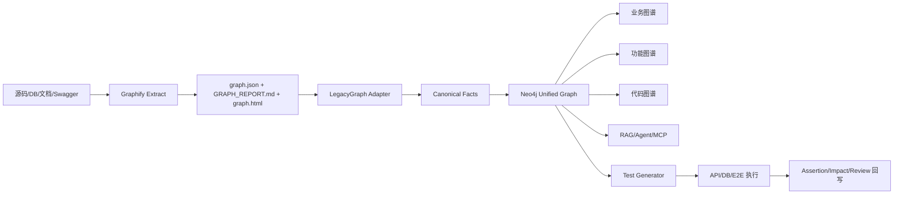
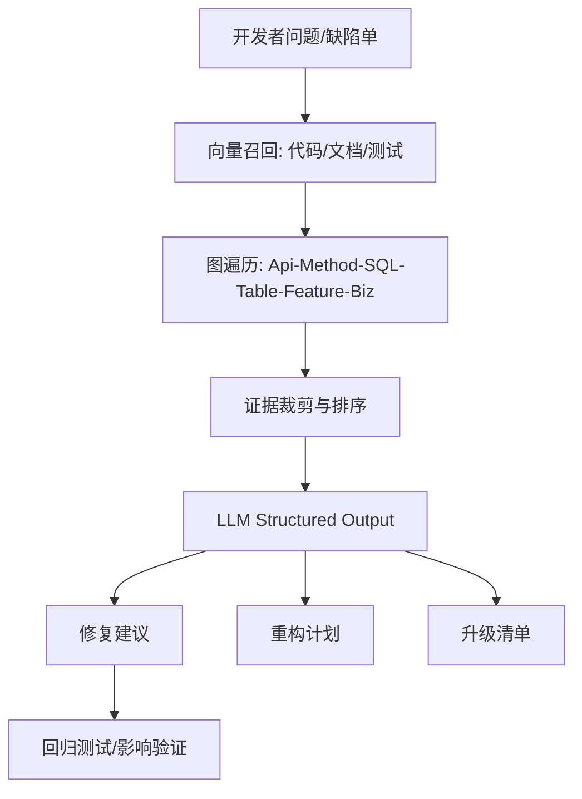

# Graphify 与 LegacyGraph 融合详细设计文档

## Executive Summary

将 Graphify-Labs/graphify 与 loveliunian/LegacyGraph 融合，**技术上可行，且最合理的路径不是“二选一替换”，而是“Graphify 负责广覆盖抽取与 AI 工具接入，LegacyGraph 负责三类图谱语义归一、证据治理、测试验证与工程闭环”**。Graphify 已经提供了从代码、SQL、文档、PDF、图像、音视频到统一知识图的提取能力，产物包括 `graph.json`、`GRAPH_REPORT.md`、`graph.html`，并可导出 Neo4j/FalkorDB、暴露 MCP 服务、供 Claude Code/Codex/Cursor/Gemini CLI 等助手优先查询图；而现有 LegacyGraph 设计强调“代码/数据库/文档 → 业务/功能/代码三类图谱 → 测试生成 → 断言验证 → 人工审核”的治理链条，这两者能力互补明显。

更具体地说，Graphify 的官方架构是 `detect → extract → build_graph → cluster → analyze → report → export`，其抽取输出模式是“节点/边 + source\_file/source\_location + confidence(EXTRACTED/INFERRED/AMBIGUOUS)”；这非常适合做 LegacyGraph 的**通用抽取前置层**。但它的官方模型更偏“通用知识图 + 社区聚类 + 助手查询”，并不直接提供 LegacyGraph 所需的“业务图谱/功能图谱/代码图谱”三视图、测试断言、低置信度复核工作流、图谱回写测试结果等企业治理能力，因此必须在其上增加**领域归一层、图谱投影视图层、验证闭环层**。

从让 AI 更快、更准地修 bug、做重构、做升级的角度，真正的差距不在“有没有图”，而在**图是否带证据、是否可按影响范围检索、是否能把变更建议落成补丁并用自动化测试回归验证**。Neo4j 官方 GraphRAG for Python 已提供向量检索、VectorCypherRetriever、HybridRetriever、Text2CypherRetriever 等一整套图 + 向量联合检索接口；OpenAI 官方文档则明确建议用 embeddings、向量数据库、Structured Outputs 与 function calling 来获得结构化、可验证的输出；OpenRewrite 则适合作为 Java 侧自动重构/升级执行器。把这些与 LegacyGraph 的测试生成器、验证器结合，才能形成“图谱驱动的 AI 工程闭环”。

因此，本报告给出的落地方案是：**以 Neo4j 作为统一图谱底座，以 Graphify 作为通用抽取/MCP 接入层，以 LegacyGraph 作为领域建模与验证引擎，以 OpenAI/Neo4j GraphRAG/LangChain 或等价编排作为 RAG/Agent 层，以 Playwright + API/DB 测试 + Testcontainers 形成验证闭环**。第一阶段先打通 Java/Spring + Vue + MyBatis + PostgreSQL + Swagger/OpenAPI 的 MVP；MyBatis XML、业务规则抽取、证据回写与人工校核是最需要自定义的部分。

## 现状与可行性判断

### 核心判断

Graphify 官方已支持本项目所需的大部分输入源：`.java`、`.vue`、`.sql`、`pom.xml`、Markdown/HTML/TXT/YAML、Office、PDF、图片、音视频，以及**直接对 PostgreSQL 做 live introspection**；同时支持 `graphify query`、`path`、`explain`、`merge-graphs`、`export callflow-html`、`--wiki`、`--neo4j-push` 与 MCP server。这意味着它非常适合承担“老项目原始输入的统一采样与初始知识图生成”工作。

LegacyGraph 当前可确认的设计重点则是：输入层—扫描层—抽取层—事实层—图谱层—AI 层—验证层—展示层；并已规划 CodeFactAgent、DBFactAgent、DocUnderstandingAgent、FeatureMappingAgent、GraphMergeAgent、TestCaseAgent、AssertionAgent、ReviewAgent，以及 LLM 路由、向量库、缓存、成本监控、质量评估与审核闭环。这说明 LegacyGraph 已经站在“企业治理、验证与落地”这一侧，但仍缺一个覆盖面更广、与 AI Coding Assistant 原生整合更强的底层抽取器。

因此，融合的结论是：**可行，且建议采用“Graphify 前置 + LegacyGraph 中台化”的方式落地**。其中，Graphify 不替代 LegacyGraph，而是作为“抽取器/MCP 接口层/快速 Markdown 初稿层”；LegacyGraph 则接收 `graph.json` 与原始证据，构造成三类图谱、测试用例、变更影响分析与回归闭环。

### 关键属性与维度

| 维度        | Graphify                                                                                                                    | LegacyGraph 现状                                                  | 融合结论                                  |
| --------- | --------------------------------------------------------------------------------------------------------------------------- | --------------------------------------------------------------- | ------------------------------------- |
| 输入类型      | 代码、SQL schema、文档、Office、PDF、图片、音视频、URL、PostgreSQL live schema；支持 `.java/.vue/.sql/pom.xml` 等。 | 后端代码、前端代码、DB schema、迁移脚本、产品文档、接口文档已纳入设计范围。 | Graphify 做通用摄取，LegacyGraph 做领域精炼。     |
| 支持技术栈     | Java、Vue、SQL、pom.xml、PostgreSQL 已明确；MyBatis **未在官方 README 明确列出**。                 | Java/Spring/Vue/MyBatis/Postgres 为目标主栈。    | MyBatis XML 需自定义 extractor/adapter。   |
| 图谱模型      | Node/Edge，带 `source_file`、`source_location`、`relation`、`confidence`。                                                        | 节点/关系/证据/置信度/状态/测试结果。                                           | 以 LegacyGraph 模型为规范，Graphify 模型做入站映射。 |
| 证据追溯      | 官方 schema 已含 source file/location。                                                                                          | 明确要求所有 AI 输出带证据链、可回写验证。                                         | 直接兼容，需扩展证据类型。                         |
| 向量索引与语义检索 | Graphify 支持 query/explain/path，文档/PDF/图像经模型语义抽取；可暴露 MCP。                                                                    | 已设计向量库、缓存、RAG 类能力。                                              | 建议统一到 Neo4j Vector + GraphRAG。        |
| 自动测试      | 未提供企业级 API/DB/E2E 验证框架。                                                                                                     | 已规划 TestCase/Assertion/Validator。                               | 保留 LegacyGraph 测试闭环。                  |
| 人工确认      | 官方以 `AMBIGUOUS` 标记不确定关系。                                                                                                    | 已设计 Review 队列与审核建议。                                             | 将 `AMBIGUOUS` 直接变成审核任务。               |
| 安全/权限     | 本地分析、MCP、路径校验、URL 校验、Prompt 注入缓解、HTML/XSS 防护均已说明。                                                                           | 安全/权限机制已提到，但细粒度实现未指定。                                           | 继承 Graphify 安全基线，再补企业 RBAC。           |
| 部署与运维     | CLI、本地/HTTP MCP、Docker、API key、watch/update 已提供。                                                                            | 部署环境、并发规模、HA 要求未指定。                                             | 需补企业部署规范。                             |
| 目标 LLM 型号 | Graphify 可接 OpenAI/Anthropic/Azure/Ollama/Bedrock 等。                                                                        | 未指定。                                                            | 统一标注“未指定”，先做 provider 抽象。             |

## 项目对比与融合原则

### 两个项目能力对比

| 能力项           | Graphify                                                                | LegacyGraph                             | 结论                         |
| ------------- | ----------------------------------------------------------------------- | --------------------------------------- | -------------------------- |
| 快速知识图生成       | 强：`/graphify .` 直接出 `graph.json / GRAPH_REPORT.md / graph.html`。        | 弱到中：更偏设计态。                              | 用 Graphify 做快速启动。          |
| 三类图谱投影        | 无明确“业务/功能/代码”三分法。                                                       | 强：三图谱是核心目标。                             | 用 LegacyGraph 做视图层。        |
| AI 助手接入       | 强：支持 Claude/Codex/Cursor/Gemini/Copilot 等，且有静默 hook 或规则文件。              | 未指定。                                    | 直接复用 Graphify 助手接入。        |
| MCP / Tool 接口 | 强：官方 MCP server，含 `query_graph/get_node/get_neighbors/shortest_path` 等。 | 未指定。                                    | LegacyGraph 增加 MCP façade。 |
| 测试与验证         | 弱：偏图查询与报告。                                                              | 强：测试生成、断言、验证回写是核心。 | 保留 LegacyGraph 为主。         |
| 安全基线          | 强：本地分析、路径/URL/Prompt 注入/XSS 防护均已公开。                   | 中：方向明确，细节未指定。      | 采用 Graphify 安全策略作为底线。      |

### 插件接口差异

| 维度   | Graphify                                                                                     | LegacyGraph 材料现状                                    | 适配建议                                                                               |
| ---- | -------------------------------------------------------------------------------------------- | --------------------------------------------------- | ---------------------------------------------------------------------------------- |
| 调用方式 | CLI、hook、MCP、HTTP MCP。                                          | 外部插件 contract 未指定。             | 先定义 `ExtractorPlugin / RetrieverPlugin / ExporterPlugin / ValidatorPlugin` 四类 SPI。 |
| 数据交换 | `graph.json`、`GRAPH_REPORT.md`、HTML、cypher.txt、wiki。 | 事实表/图谱表/测试表为主，文档导出能力有设计但协议未指定。 | 统一中间格式 `LegacyGraph Canonical Graph JSON`。                                         |
| 置信度  | `EXTRACTED/INFERRED/AMBIGUOUS`。                                             | 数值置信度 + 审核流程。                  | 做枚举到数值映射。                                                                          |
| 证据   | 文件/行号级。                                                                     | 文件/SQL/文档/测试四类证据。              | 扩展 `evidence_type`。                                                                |

融合原则很明确：**抽取不过度魔改 Graphify，规范不过度侵入 LegacyGraph**。工程上应通过 adapter 把 Graphify 产物吸收到 LegacyGraph 的事实库与 Neo4j 规范图中，而不是直接在 Graphify 内部硬改三类图谱逻辑，否则未来升级 Graphify 版本会非常痛苦。

## 目标架构与数据模型

### 目标架构



Graphify 的官方导出链已经覆盖 `graph.json`、Markdown 报告、HTML、wiki、Neo4j push 与 MCP；Neo4j 官方则提供向量索引、GraphRAG 检索器与 Graph + Vector 联合检索能力。因此目标架构的关键不是“再造抽取器”，而是把 Graphify 输出**转换为 LegacyGraph 的规范事实层**，再统一写入 Neo4j，并在其上做三图谱投影、RAG、测试与修复闭环。

### 数据模型映射

| Graphify                       | LegacyGraph Canonical                         | Neo4j 标签/关系                            | 说明                                                        |
| ------------------------------ | --------------------------------------------- | -------------------------------------- | --------------------------------------------------------- |
| `node.id`                      | `node_key`                                    | `:Entity {node_key}`                   | 作为全局唯一键。                                 |
| `node.label`                   | `node_name`                                   | `name`                                 | 人类可读名。                                   |
| 未显式类型                          | `node_type`                                   | `:Code/:Api/:Table/:Doc/:Feature/:Biz` | 由 adapter 结合后缀、关系、LLM 分类补齐。 |
| `source_file/source_location`  | `evidence[]`                                  | `(:Evidence)-[:SUPPORTS]->(:Entity)`   | 统一证据抽象。                                  |
| `edge.relation`                | `edge_type`                                   | `:CALLS/:USES/:IMPLEMENTS/...`         | 关系枚举标准化。                                 |
| `EXTRACTED/INFERRED/AMBIGUOUS` | `confidence=0.95/0.75/0.45` + `review_status` | `confidence/review_status`             | 建议映射。                                    |
| `GRAPH_REPORT.md`              | `summary_doc`                                 | `(:Document)`                          | 用于导出 MD 与 RAG 摘要。                        |
| 无测试节点                          | `TestCase/Assertion/Run`                      | `(:TestCase)-[:VERIFIES]->(:Entity)`   | LegacyGraph 自建。                      |

### 推荐的统一图谱规范

以 Neo4j 为主库，因为其官方已把向量索引、Cypher `SEARCH`、GraphRAG Python 包、VectorCypherRetriever、HybridRetriever、Text2CypherRetriever 都纳入一线方案，适合“结构关系 + 语义检索 + 图遍历”一体化实现。向量索引建议显式声明维度与相似度函数；Neo4j 官方建议文本 embedding 通常优先 `cosine`，并说明向量查询是 approximate nearest neighbor search。

## 接口适配、RAG 架构与 LLM 共建流程

### 适配方案

Graphify 官方既支持 Neo4j push，也支持 MCP server；但为了保留 LegacyGraph 的业务语义与测试闭环，建议**不直接把 Graphify 生成的图当最终图**，而是先走一个 Adapter。

```python
class GraphifyAdapter:
    def import_graphify_json(self, graph_json):
        for n in graph_json["nodes"]:
            upsert_entity(
                node_key=n["id"],
                node_name=n["label"],
                node_type=infer_type(n),
                evidence=[{
                    "type": "file",
                    "path": n.get("source_file"),
                    "loc": n.get("source_location")
                }],
                confidence=map_confidence("EXTRACTED")
            )
        for e in graph_json["edges"]:
            upsert_edge(
                from_key=e["source"],
                to_key=e["target"],
                edge_type=normalize_relation(e["relation"]),
                confidence=map_confidence(e["confidence"]),
                review_status="PENDING" if e["confidence"] == "AMBIGUOUS" else "AUTO"
            )
```

同时增加两个插件面：其一是 `GraphifyMcpFacade`，把 Graphify 的 `query_graph/get_node/get_neighbors/shortest_path` 暴露给 AI；其二是 `LegacyGraphMcpFacade`，补充 `get_feature_graph/get_business_graph/generate_tests/run_validation/get_impact` 等企业接口。这样，AI 编程助手可以对“通用图”与“三类图谱”进行双通道访问。

### RAG 架构

LangChain 官方把检索架构分为 2-Step RAG、Agentic RAG、Hybrid RAG；Neo4j GraphRAG 官方则提供 VectorRetriever、VectorCypherRetriever、HybridRetriever、Text2CypherRetriever。对本场景，建议选择**Hybrid + Agentic**：先向量召回代码/文档/证据，再做图遍历扩展，再让 Agent 决定是否调用测试、影响分析、补丁生成工具。



OpenAI 官方文档明确建议：语义检索用 embeddings + 向量数据库；需要稳定 JSON 时使用 Structured Outputs 而非普通 JSON mode；模型接应用动作时使用 function calling/tool calling。这三点非常适合用于“事实抽取 JSON”“影响分析 JSON”“修复计划 JSON”“测试用例 JSON”。

### LLM 共建流程

1. **规则抽取优先**：Graphify/CodeQL/Semgrep 抽取确定事实。CodeQL 官方支持 Java/Kotlin/JavaScript/TypeScript 等，Semgrep 官方对 Java/JavaScript/TypeScript 提供 cross-file dataflow 与 framework-specific 控制流。
2. **LLM 做归纳与补全**：业务流程、功能映射、命名归一、弱关系推断。
3. **Structured Outputs 固化**：所有 agent 输出 JSON schema。
4. **测试反向验证**：通过 API/DB/E2E 结果提升或降低置信度。
5. **人工审核闭环**：`AMBIGUOUS` 和低置信节点转待审核。 

## Markdown 导出与 AI 修 bug、重构、升级加速方案

### 从图谱导出 Markdown

Graphify 已能直接输出 `GRAPH_REPORT.md`、wiki 和 Mermaid callflow HTML；LegacyGraph 应进一步支持“按业务/功能/代码三视图导出 Markdown”，内容至少包含：摘要、Mermaid 图、关键节点、证据片段、接口/表/测试关联、待确认项。

导出步骤建议如下：

```bash
graphify extract ./repo --postgres "$PG_DSN"
graphify export callflow-html
legacygraph import graphify-out/graph.json
legacygraph project build-views --project demo
legacygraph export md --project demo --view business --out docs/business.md
legacygraph export md --project demo --view feature  --out docs/feature.md
legacygraph export md --project demo --view code     --out docs/code.md
```

导出的 Markdown 片段建议长这样：

````md
## 工单派发

```mermaid
graph TD
  A[派发按钮] --> B[POST /ticket/dispatch]
  B --> C[TicketService.dispatch]
  C --> D[update t_ticket]
````

### 节点详情

- 功能：工单派发
- 接口：POST /ticket/dispatch
- 表：t\_ticket
- 置信度：0.92

### 证据

- `TicketController.java:L42-L56`
- `TicketMapper.xml:L18-L31`
- `产品手册.md: 工单派发`

````

### 如何让 AI 更快更准

核心不是“把全部代码塞给 LLM”，而是让 AI 只看**与当前问题强相关、带图关系、带证据、带测试上下文**的子图。Neo4j 的 VectorCypherRetriever 能把向量相似召回与图遍历结合；Text2CypherRetriever 则适合回答“这个字段变更会影响哪些功能”“某个 bug 涉及哪些 SQL/页面/服务”这类问题。

真正能明显提高修复/重构/升级速度的动作有五个：第一，基于图谱做**变更影响分析**；第二，输出**结构化补丁建议**；第三，调用 OpenRewrite 对 Java 做批量 API 升级、依赖迁移、Spring/Testing/Modernize 规则改造；第四，自动生成与执行回归测试；第五，失败后把错误回写到图谱，更新问题热区。OpenRewrite 官方文档显示其 Java recipe catalog 覆盖 Spring、Testing、Modernize、Dependencies、Search 等类别，非常适合作为升级执行器。

### 五个可复用 Prompt 模板

```text
事实抽取
你是代码事实抽取器。输入代码/SQL/Swagger 片段，输出 JSON：
{entities:[], relations:[], evidence:[], confidence:0-1}
只保留可从输入直接证明的事实；不确定项输出 uncertain_reason。

功能映射
你是功能映射分析师。输入页面、按钮、接口、权限、文档描述，输出：
{feature, page, action, api, permission, evidence[], confidence}
如仅名称相似，relation_type=GUESS。

业务流程抽取
你是业务分析师。输入产品文档与相关接口/表信息，输出：
{process_name, roles[], steps[], rules[], state_flow[], evidence[], confidence}
严禁编造未在证据中出现的规则。

测试用例生成
你是测试架构师。输入功能节点子图，输出：
{cases:[{name,type,preconditions,steps,api_assertions,db_assertions,e2e_assertions,need_human_input[]}]}

RAG 问答调优
你是图谱问答助手。只基于给定 context 回答；若证据不足，明确说“证据不足”。
先引用相关节点/边，再给结论；输出：
{answer, used_nodes[], used_edges[], evidence[], followup_tests[]}
````

## 测试验证闭环与交付要求

### 测试与断言模板

Playwright 官方同时覆盖 E2E、API testing、Codegen、Trace Viewer；Testcontainers 官方支持 JUnit 5 与 PostgreSQL/Neo4j 等容器化依赖。因此建议测试栈采用：**API 用 REST Assured 或 Playwright API、E2E 用 Playwright、环境编排用 Testcontainers、图查询验证用 Neo4j Test 数据集**。

```json
{
  "name": "工单派发成功",
  "type": "API+DB+E2E",
  "preconditions": ["存在 WAIT_DISPATCH 工单", "有有效 handlerId"],
  "steps": ["调用 POST /ticket/dispatch", "打开详情页刷新"],
  "api_assertions": ["status=200", "$.code=0"],
  "db_assertions": [
    "t_ticket.status='PROCESSING'",
    "t_ticket.handler_id='${handlerId}'"
  ],
  "e2e_assertions": ["页面状态显示 处理中"]
}
```

### 前端页面与 UX 要求清单

前端至少应有：项目总览、三类图谱画布、节点详情抽屉、证据面板、测试中心、审核工作台、变更影响分析、Markdown 导出预览。图谱节点必须支持“一键查看证据”“一键查看相邻子图”“一键查看关联测试”“一键生成修复建议”。这些要求来自 LegacyGraph 的“证据化、审核、验证回写”定位，而不是 Graphify 默认页面；Graphify 的 `graph.html` 更适合作为原始图浏览器。 

### CI/CD 与回滚策略

| 环节    | 建议做法                                                                                      | 目的            |
| ----- | ----------------------------------------------------------------------------------------- | ------------- |
| PR 前  | `graphify extract --update` + LegacyGraph adapter 增量入图。     | 更新图谱与影响面。     |
| PR 中  | AI 读取子图，生成补丁/重构计划/升级建议。                                     | 提升修复质量。       |
| PR 校验 | API/DB/E2E/图断言全跑；失败项回写图谱。  | 保证图谱、代码、行为一致。 |
| 回滚    | 保留“前一版本 graph snapshot + md snapshot + recipe plan + test baseline”。                      | 回退代码时同步回退知识图。 |

## 风险、差距、MVP 与八周实施计划

### 仍然存在的差距

最大差距有四类：**MyBatis/XML/动态 SQL 的专项抽取**、**业务语义归一能力**、**测试结果回写图谱**、**针对 AI 助手的稳定插件 contract**。其中第一项最现实，因为 Graphify 官方 README 明确支持 `.sql` 与 PostgreSQL，但未明确列出 MyBatis；第二项与第三项是 LegacyGraph 真正的核心壁垒；第四项则决定能否稳定服务 Codex/Cursor/Claude 之类工具。 

### 集成风险矩阵

| 风险           | 等级 | 触发原因                                          | 缓解                                  |
| ------------ | -- | --------------------------------------------- | ----------------------------------- |
| MyBatis 关系漏抽 | 高  | 官方未声明专门支持。      | 新建 `mybatis-xml-extractor`，并以测试反证。  |
| 图谱污染         | 高  | LLM 对业务关系过度推断。  | 只允许 Structured Output + 证据 + 低置信审核。 |
| 检索延迟         | 中  | 图+向量多跳查询复杂。     | 子图缓存、预计算热点路径、限制 hop。                |
| 安全泄露         | 中  | 代码/文档进入模型上下文。   | 本地优先、脱敏、私有模型、最小上下文。                 |
| 升级维护成本       | 中  | 直接改 Graphify 内核。 | 坚持 adapter，不 fork 核心逻辑。             |

### MVP 范围与验收标准

MVP 建议只覆盖 **Java/Spring Boot + Vue + MyBatis + PostgreSQL + Swagger/OpenAPI**；LLM 型号、部署环境、并发规模均为**未指定**，因此第一版应做 provider 抽象，不绑定单一模型。验收标准建议为：接口—SQL—表链路抽取准确率 ≥ 85%，页面—接口映射准确率 ≥ 80%，三类 Markdown 文档可自动导出，针对 10 个历史 bug 的 AI 修复建议人工可接受率 ≥ 70%，自动回归通过后方可提升图谱置信度。 

### 八周实施计划

| 周次  | 里程碑                  | 交付物                                                                                    |
| --- | -------------------- | -------------------------------------------------------------------------------------- |
| 第一周 | 仓库接入与基线扫描            | Graphify 接入脚本、原始 `graph.json`、输入清单。                      |
| 第二周 | Adapter 与规范图入库       | `graphify -> canonical -> Neo4j` 映射、置信度映射。                |
| 第三周 | MyBatis/Swagger 专项插件 | XML/动态 SQL/OpenAPI extractor。                                                          |
| 第四周 | 三类图谱投影与前端画布          | 业务/功能/代码图谱页面、证据抽屉、审核队列。                                           |
| 第五周 | RAG/Agent/MCP 联通     | VectorCypherRetriever、Text2CypherRetriever、助手侧插件。        |
| 第六周 | Markdown 导出与补丁建议     | `export md`、修复建议 JSON、影响分析。                               |
| 第七周 | 自动测试与回写              | Playwright/API/DB/Testcontainers 集成，图谱置信度回写。 |
| 第八周 | 试点收口与验收              | 10 个历史 bug、1 次小版本升级、1 次重构试点，形成验收报告。                                                    |

这一路径的本质是：**先把“可抽取”做稳，再把“可解释”做好，最后把“可执行、可验证、可回滚”补齐**。做到这一点后，Graphify 会成为 LegacyGraph 的高覆盖输入引擎，LegacyGraph 会成为 Graphify 在企业老项目场景下的“验证型知识中台”，而 AI 修 bug、重构、升级就不再是“看运气的对话”，而是“基于证据图谱的工程动作”。 
