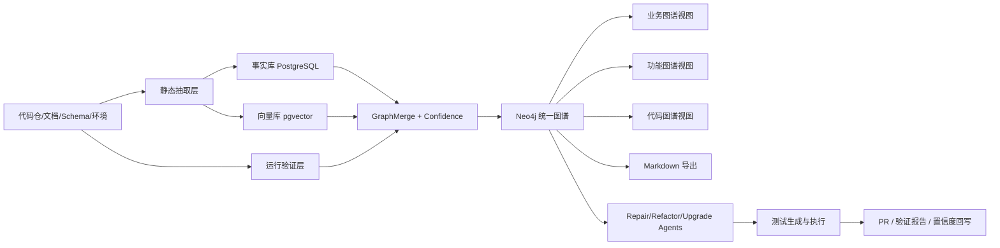
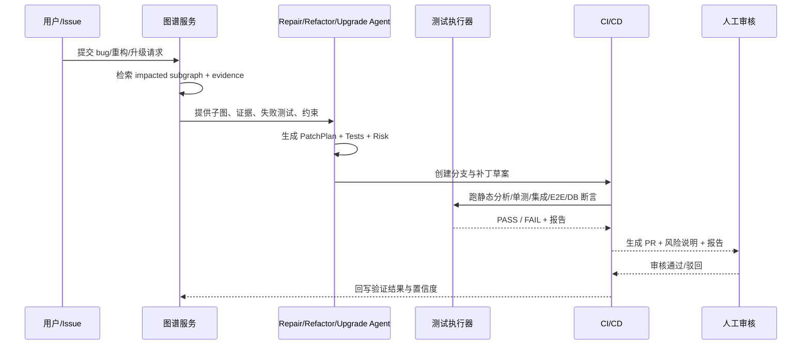

# LegacyGraph 三类图谱共建、Markdown 导出与 AI 修复重构升级的可实施详细设计与落地方案

## Executive Summary

这份方案的核心判断是：**三类图谱本身并不等于“全面理解老项目”**。真正能支撑后续自动修复 bug、重构系统、升级依赖与框架的，不只是业务图谱、功能图谱、代码图谱，还必须补上**证据层、置信度层、测试验证层、运行链路层、版本与变更层**。否则图谱只能“好看”，不能“可信”，更不能成为 AI 生成补丁与 PR 的可靠上下文。现有 LegacyGraph 方案已经明确了输入层→扫描层→抽取层→事实层→图谱层→AI 层→验证层→展示层的整体架构，也已经列出了 CodeFactAgent、DocUnderstandingAgent、FeatureMappingAgent、GraphMergeAgent、TestCaseAgent、ReviewAgent 等基础角色，这为下一步引入 LLM 与静态分析共建三类图谱提供了很好的起点。

从工程实现角度，最稳妥的路线不是“把仓库直接丢给 LLM”，而是先用**JavaParser/CodeQL/Semgrep/JDBC/OpenAPI/前端 AST 抽取器**提取可验证事实，再让 LLM 在这些事实之上完成业务归纳、功能映射、图谱合并、测试生成、修复策略生成。这样可以把幻觉风险压缩到语义层，而把“路径、类、方法、SQL、表、字段、调用链”等硬事实交给静态分析与运行验证。CodeQL 官方文档显示其支持 Java、Kotlin、JavaScript、TypeScript、Python、Go、C# 等语言；对 Java/Kotlin 还内建了 MyBatis、JPA、JDBC、Spring MVC 等框架支持。Semgrep 官方文档则说明 Java、JavaScript、TypeScript 都支持跨文件数据流，且 Java/JS/TS 还支持框架相关控制流分析。JavaParser 提供 Java 代码 AST，适合做轻量级源码结构抽取。

图谱存储方面，建议采用 **Neo4j + PostgreSQL/pgvector** 的双存储方案：Neo4j 负责显式节点关系、路径查询和可视化；PostgreSQL 负责事实表、证据表、任务表、测试结果表；pgvector 负责文档片段、代码片段和历史修复知识的向量检索。Neo4j 官方文档说明向量索引支持相似性搜索，也可与全文搜索等结果源组合形成混合检索；pgvector 上游仓库说明它支持在 Postgres 中存储向量，并提供精确与近似最近邻搜索。OpenAI 官方文档说明 Responses API 原生支持 built-in tools、file search、web search 与 function calling；function calling 可用 JSON Schema 定义工具接口，strict 模式下会对模式不满足的请求直接拒绝；embeddings 用于度量文本相关性。citeturn23view0turn24view6turn16view0turn23view7turn23view8

修复 bug、重构、升级这三类“AI 变更任务”必须和图谱联动，但不能直接跳过验证。建议把自动化闭环设计成：**问题进入 → 图谱定位子图 → LLM 生成补丁与测试 → 静态分析/单测/集成/E2E/DB 断言 → 形成 PR → 人工审核 → 合并与回滚保护**。Playwright 官方文档说明其是面向现代 Web 应用的端到端测试框架，支持 Chromium、WebKit、Firefox，并适合在 CI 中运行；Testcontainers for Java 提供轻量、即弃型数据库与浏览器容器，方便集成测试；REST Assured 专门用于 Java 中测试和验证 REST 服务；OpenRewrite 官方文档则将自己定位为开源自动重构生态，支持大规模消除技术债，并提供 Java/Spring/Testing/Modernize 等配方；GitHub Actions 文档说明其可以在仓库内自动化执行完全自定义的 CI/CD 工作流。citeturn23view4turn23view5turn18view0turn23view6turn24view5turn23view9

需要先说明一个实际限制：本次研究过程中，你给出的 GitHub 仓库地址 `https://github.com/loveliunian/LegacyGraph` 在当前浏览会话中无法直接抓取，仓库首页与 README 均未命中可读缓存，因此**无法在本报告里对仓内目录、依赖版本、是否已有 Swagger、CI 配置、前后端框架做文件级确认**。因此，凡是“以仓库实际为准”的内容，我都明确标记为“首周在仓复核项”；本方案仍然给出了完整的实施路径、命令、数据模型和接口设计，落地时只需要把首轮仓库盘点结果灌入这些模板即可。citeturn21view0turn26view0turn26view1

## 研究边界与输入输出清单

本方案的研究输入优先级建议固定为四层。第一层是**真实仓库与运行产物**，包括代码仓、配置、数据库 schema、迁移脚本、日志与测试环境；第二层是**官方工具文档**，用于确定抽取器、图谱、Agent、测试和 CI/CD 的能力边界；第三层是**你已有的方案文档**，尤其是已定义的多 Agent 架构、Prompt、质量阈值与阶段性落地思路；第四层才是 LLM 生成的归纳结论。这样的优先级可以最大限度减少“图谱看似合理、实际不可验证”的问题。已有方案文档已经明确将“结果可验证、结果可追踪、失败可降级、成本可监控”作为 LLM 接入原则。fileciteturn0file0

下面是第一版项目接入时必须收集的**输入清单**。其中凡是仓库未必已有、或本次会话无法从仓库核实的项目，我都保留了“未提供则启用替代策略”的列。

| 输入项                                         |   是否必须 | 优先来源                          | 若未提供的替代策略                                                                                                                            |
| ------------------------------------------- | -----: | ----------------------------- | ------------------------------------------------------------------------------------------------------------------------------------ |
| 后端代码仓                                       |     必须 | Git 仓库                        | 无替代，必须拉取                                                                                                                             |
| 前端代码仓                                       |     必须 | Git 仓库                        | 无替代，必须拉取                                                                                                                             |
| `pom.xml` / `build.gradle` / `package.json` |     必须 | 仓库根目录                         | 通过目录扫描推断，但精度下降                                                                                                                       |
| 数据库 schema / `CREATE TABLE` / 迁移脚本          |     必须 | SQL、Flyway、Liquibase          | 直连测试库，用 JDBC 元数据抽取。Oracle JDBC 教程说明 JDBC 可建立连接、执行 SQL、获取结果集。citeturn24view4                                                       |
| 产品文档、需求文档、操作手册                              |   强烈建议 | Word/PDF/Markdown             | 无文档时只做“代码/功能图谱”，业务图谱进入人工确认模式                                                                                                         |
| OpenAPI / Swagger                           |     可选 | `openapi.yaml/json`、springdoc | 若未提供，则从 Controller 注解与前端调用逆向抽取。OpenAPI 规范定义了 API 表面的正式描述；OpenAPI Generator 可据此生成文档、SDK 和 server stubs。citeturn24view8turn24view7 |
| 测试环境地址与账号                                   |   强烈建议 | 环境配置                          | 无环境时只做静态图谱与离线单测生成                                                                                                                    |
| 样例数据 / 测试数据初始化脚本                            |   强烈建议 | SQL、fixtures                  | 无样例时由 TestCaseAgent 生成最小测试数据草案，人工补齐                                                                                                  |
| 日志 / Trace / APM                            | 可选但很值钱 | ELK、SkyWalking、OTel           | 无时退回静态调用链；有时可补运行链路图                                                                                                                  |
| CI/CD 配置                                    |     可选 | GitHub Actions / GitLab CI    | 若未提供，则按本方案新建基线流水线。GitHub Actions 可在仓库内自定义 CI/CD。citeturn23view9                                                                   |

对应的**输出清单**应当不是单一图谱，而是一组可审计产物：

| 输出项             | 说明                           | 交付形式                              |
| --------------- | ---------------------------- | --------------------------------- |
| Neo4j 统一图谱      | 业务/功能/代码三视图，加证据、置信度、测试状态     | Neo4j DB                          |
| 事实库             | 原始抽取事实、证据、向量 chunk、任务与结果     | PostgreSQL + pgvector             |
| 结构化 Markdown 文档 | 面向人阅读与审计的项目说明、功能说明、证据说明、测试说明 | `docs/generated/*.md`             |
| 测试资产            | 单测/集成/API/E2E/DB 断言          | `tests/`、`postman/`、`playwright/` |
| 测试与验证报告         | 图谱验证通过率、失败原因、证据缺口            | Allure / HTML / Markdown          |
| 修复/重构/升级任务清单    | 可执行 backlog 与优先级             | `tasks/*.md` 或 issue 列表           |
| 自动补丁与 PR        | 受保护分支上的 AI 生成补丁              | Git branch + PR                   |
| 差距分析报告          | 当前系统 vs 目标系统的功能/数据/流程差距      | `gap-report.md`                   |

如果要在本地先做**仓库盘点**，建议首日就执行以下命令。这里因为仓库页面当前无法在线抓取，首轮必须在你自己的开发环境里执行这些命令，结果再回灌给图谱平台。citeturn21view0

```bash
git clone https://github.com/loveliunian/LegacyGraph.git
cd LegacyGraph

# 基础盘点
find . -maxdepth 3 -type f | sort > inventory.txt

# 后端线索
rg -n "@RestController|@Controller|@RequestMapping|@GetMapping|@PostMapping|Mapper|Service|Repository|MyBatis|JPA|Flyway|Liquibase" .

# 前端线索
rg -n "createRouter|routers:|axios|fetch\\(|request\\(|useQuery|useMutation|playwright|cypress" .

# API/协议线索
rg -n "openapi|swagger|springdoc|Swagger" .

# CI/CD 线索
rg -n "github/workflows|gitlab-ci|Jenkinsfile|Dockerfile|docker-compose|compose.yaml|k8s|helm" .
```

## 目标架构与数据模型

建议把系统设计成一个“**统一知识图谱平台**”，而不是三套彼此割裂的图。三类图谱只是展示视图，底层仍然是一张统一图，外加一个事实层和一个验证层。这样才能让“业务规则 → 功能点 → 前端页面 → API → Service → SQL → 表 → 字段 → 测试断言 → 修复任务”形成可追踪链路。Neo4j 适合显式关系和路径查询；Neo4j 官方还提供向量索引，支持相似性搜索与混合检索。对于文本片段、代码片段、历史修复经验，Postgres 上的 pgvector 很合适，因为它允许在既有业务库体系里直接做向量存储与最近邻检索。citeturn23view0turn24view6



统一图谱至少需要以下**节点类型**与**关系类型**。其中最关键的一条规则是：**所有节点和边都必须挂载 Evidence，且没有 Evidence 的结论不能超过候选级置信度**。这和你现有方案中“所有 LLM 输出必须有证据链和置信度”的设计是一致的。fileciteturn0file0

```json
{
  "nodeTypes": [
    "Project", "Repository", "Module", "Package", "Class", "Method",
    "ApiEndpoint", "SqlStatement", "Table", "Column",
    "Page", "Menu", "Button", "Feature", "Permission",
    "BusinessDomain", "BusinessProcess", "BusinessRule", "BusinessObject",
    "Document", "DocChunk", "Evidence", "TestCase", "Assertion",
    "Issue", "Patch", "PullRequest", "Dependency", "VersionRisk"
  ],
  "edgeTypes": [
    "CONTAINS", "IMPLEMENTS", "CALLS", "READS", "WRITES", "USES",
    "EXPOSES", "TRIGGERS", "GUARDS", "DOCUMENTS", "EVIDENCED_BY",
    "VERIFIED_BY", "AFFECTS", "FIXED_BY", "MIGRATES_TO", "DEPENDS_ON"
  ]
}
```

建议的**证据模型**与**置信度规则**如下。与现有方案保持一致，但更适合工程落地：

```json
{
  "evidence": {
    "id": "evd-20260701-001",
    "sourceType": "CODE|SQL|DOC|TRACE|TEST|HUMAN_REVIEW",
    "sourceUri": "backend/src/main/java/com/acme/TicketController.java",
    "locator": {"lineStart": 42, "lineEnd": 58},
    "snippetHash": "sha256:...",
    "excerpt": "@PostMapping(\"/ticket/dispatch\")",
    "capturedAt": "2026-07-01T10:20:00+08:00"
  },
  "confidence": {
    "staticScore": 0.45,
    "runtimeScore": 0.10,
    "docScore": 0.10,
    "testScore": 0.15,
    "llmConsistency": 0.10,
    "humanReview": 0.10,
    "final": 0.90,
    "status": "CONFIRMED"
  }
}
```

推荐采用下面这套**硬规则**：

| 规则            | 含义                      |
| ------------- | ----------------------- |
| 无证据           | `final <= 0.59`，只能进待确认区 |
| 单一静态证据        | 默认 `0.60~0.74`          |
| 静态证据 + 文档对齐   | 默认 `0.75~0.84`          |
| 静态证据 + 测试验证通过 | 默认 `0.85~0.94`          |
| 加人工确认         | 可升到 `0.95+`             |
| 测试失败          | 至少降 `0.20`              |
| 人工驳回          | 至少降 `0.25`              |
| 代码与文档矛盾       | 自动挂红并进入 ReviewAgent     |

Neo4j 中可以这样表示一个“已被验证的功能关系”：

```cypher
MERGE (f:Feature {key:'feature:ticket_dispatch', name:'工单派发'})
MERGE (a:ApiEndpoint {key:'api:POST:/ticket/dispatch', method:'POST', path:'/ticket/dispatch'})
MERGE (t:Table {key:'table:t_ticket', name:'t_ticket'})
MERGE (e1:Evidence {id:'evd-code-001', sourceType:'CODE', sourceUri:'TicketController.java', lineStart:42, lineEnd:58})
MERGE (e2:Evidence {id:'evd-test-001', sourceType:'TEST', sourceUri:'tests/api/ticket_dispatch_success.java'})
MERGE (f)-[:USES {confidence:0.93, status:'CONFIRMED'}]->(a)
MERGE (a)-[:WRITES {confidence:0.91, status:'CONFIRMED'}]->(t)
MERGE (f)-[:EVIDENCED_BY]->(e1)
MERGE (a)-[:EVIDENCED_BY]->(e1)
MERGE (a)-[:VERIFIED_BY]->(e2)
```

为了让“从图谱到文档、再到修复与升级”真正可行，建议事实库最少有以下几张表：

```sql
create table lg_project (
  id bigserial primary key,
  project_code varchar(128) not null unique,
  project_name varchar(255) not null,
  repo_url text,
  default_branch varchar(128),
  tech_stack jsonb,
  created_at timestamptz default now()
);

create table lg_source_file (
  id bigserial primary key,
  project_id bigint not null references lg_project(id),
  path text not null,
  file_type varchar(64) not null,
  sha256 varchar(64) not null,
  lang varchar(64),
  metadata jsonb,
  created_at timestamptz default now()
);

create table lg_fact (
  id bigserial primary key,
  project_id bigint not null references lg_project(id),
  fact_type varchar(64) not null,
  fact_key varchar(512) not null,
  fact_json jsonb not null,
  confidence numeric(5,4) not null default 0,
  status varchar(32) not null default 'CANDIDATE',
  created_at timestamptz default now()
);

create table lg_evidence (
  id bigserial primary key,
  project_id bigint not null references lg_project(id),
  source_type varchar(32) not null,
  source_uri text not null,
  locator jsonb,
  excerpt text,
  snippet_hash varchar(64),
  created_at timestamptz default now()
);

create table lg_fact_evidence (
  fact_id bigint not null references lg_fact(id),
  evidence_id bigint not null references lg_evidence(id),
  primary key (fact_id, evidence_id)
);

create table lg_test_case (
  id bigserial primary key,
  project_id bigint not null references lg_project(id),
  case_key varchar(256) not null unique,
  feature_key varchar(256),
  case_type varchar(32) not null,
  case_json jsonb not null,
  status varchar(32) not null default 'DRAFT',
  created_at timestamptz default now()
);

create table lg_test_run (
  id bigserial primary key,
  project_id bigint not null references lg_project(id),
  test_case_id bigint not null references lg_test_case(id),
  result varchar(16) not null,
  report_uri text,
  metrics jsonb,
  executed_at timestamptz default now()
);

create table lg_change_task (
  id bigserial primary key,
  project_id bigint not null references lg_project(id),
  task_type varchar(32) not null, -- BUGFIX / REFACTOR / UPGRADE
  title varchar(255) not null,
  input_issue jsonb,
  impacted_subgraph jsonb,
  proposal jsonb,
  risk_level varchar(16),
  status varchar(32) not null default 'OPEN',
  created_at timestamptz default now()
);
```

## 实施步骤与工具链

这部分给出**从接入到验证闭环**的可执行实施步骤。由于仓库还未在本次会话中完成在线抓取，所以所有命令都按“落地时在你自己的构建环境执行”为前提。仓库、目录结构、实际语言栈、依赖和运行要求需要在 Sprint 1 的“在仓复核”中确认。citeturn21view0

**第一步是仓库接入与项目清单生成。** 建议新建一个 `Project Scanner` 服务，进入仓库后生成 `project-manifest.json`。对于 Spring Boot 项目，Spring 官方文档强调其适合构建独立、可运行、生产级 Spring 应用，且大多数应用只需很少配置；这意味着通过 `pom.xml` / `application.yml` / `@SpringBootApplication` / `@RequestMapping` 进行盘点通常是高可行度的。citeturn24view3

```json
{
  "projectName": "LegacyGraph",
  "repoUrl": "https://github.com/loveliunian/LegacyGraph.git",
  "branch": "main",
  "backend": {
    "language": "java",
    "build": "maven",
    "framework": "spring-boot",
    "rootPath": "./backend"
  },
  "frontend": {
    "language": "typescript",
    "framework": "vue-or-react",
    "rootPath": "./frontend"
  },
  "database": {
    "type": "postgresql-or-mysql",
    "schemaFiles": ["./db/schema.sql", "./db/migration"]
  },
  "docs": ["./docs", "./README.md"]
}
```

**第二步是后端静态抽取。** JavaParser 提供 AST；CodeQL 负责更深的调用链、数据流和框架理解；Semgrep 负责快速扫描与规则补齐。官方文档表明 JavaParser 可把 Java 源码转成 AST，便于程序化分析；CodeQL 支持 Java 7–26，且对 MyBatis、JPA、JDBC、Spring MVC 有内建理解；Semgrep 对 Java 提供跨文件数据流与框架专用控制流分析。citeturn24view0turn23view1turn23view3

推荐的后端抽取执行顺序：

1. JavaParser：抽取类、方法、注解、接口路径、DTO、Service/Mapper 引用。
2. CodeQL：补调用链、数据流、潜在反射/动态代理/框架跳转。
3. Semgrep：补权限注解、事务注解、危险模式、缺失调用关系。
4. SQL 解析：MyBatis XML、注解 SQL、JPA query、JdbcTemplate 原生 SQL。
5. JDBC Metadata：补表、字段、索引、主外键等元数据。Oracle JDBC 教程说明 JDBC 可建立连接、处理 SQL、使用事务和 Prepared Statements。citeturn24view4

示例命令：

```bash
# Java 结构抽取前置构建
./mvnw -q -DskipTests package || mvn -q -DskipTests package

# CodeQL 建库与分析
codeql database create .codeql-db \
  --language=java-kotlin \
  --command="./mvnw -q -DskipTests package"

codeql database analyze .codeql-db \
  codeql/java-queries:codeql-suites/java-security-and-quality.qls \
  --format=sarifv2.1.0 \
  --output=reports/codeql-java.sarif

# Semgrep
semgrep scan \
  --config p/java \
  --json \
  --output reports/semgrep-java.json
```

**第三步是前端抽取。** 第一版建议支持 Vue/React 的路由、页面、组件、按钮事件、表单字段、权限指令、API 调用与状态管理。Semgrep 官方文档显示 JavaScript 与 TypeScript 也具备跨文件数据流与框架相关控制流分析；这非常适合补足仅做 AST 时“页面按钮 → 方法 → API 调用”的链路。Playwright 可在后续验证阶段补真实 UI 行为。citeturn23view3turn23view4

```bash
# JS/TS 快速线索
rg -n "createRouter|routes\\s*=|axios.create|fetch\\(|request\\(|useQuery|useMutation|defineStore|createSlice" src/

# Semgrep 前端扫描
semgrep scan \
  --config p/javascript \
  --config p/typescript \
  --json \
  --output reports/semgrep-frontend.json
```

前端抽取结果建议统一成下面的事实格式：

```json
{
  "type": "FrontendActionFact",
  "page": "TicketDetail.vue",
  "buttonText": "派发",
  "eventHandler": "dispatch",
  "apiCall": {
    "method": "POST",
    "path": "/ticket/dispatch"
  },
  "permission": "ticket:dispatch",
  "evidence": [
    {"sourceUri": "src/views/TicketDetail.vue", "lineStart": 31, "lineEnd": 48},
    {"sourceUri": "src/api/ticket.ts", "lineStart": 7, "lineEnd": 16}
  ],
  "confidence": 0.87
}
```

**第四步是数据库与 SQL 抽取。** 对于 Postgres/MySQL 项目，建议同时支持两条路径：一条是读 SQL 文件/迁移历史；另一条是在测试环境中直连数据库用 JDBC 提取 metadata。这样即使仓内只有迁移脚本没有清晰 schema，也能恢复“表—字段—索引—约束—注释”信息。CodeQL 对 JDBC/MyBatis/JPA 的内建支持，可以帮助把“方法 → SQL → 表/字段”链路补齐。citeturn23view1turn24view4

**第五步是文档抽取与术语标准化。** 当存在 Word、PDF、操作手册、需求文档时，先把文档切为 chunk，再做结构化抽取，最后写回 BusinessProcess、BusinessRule、Feature、Permission 等节点。向量部分建议存入 pgvector，便于后续做术语召回、证据召回和“历史审核相似案例”召回；OpenAI embeddings 可以用于相关性计算。citeturn24view6turn23view8

**第六步是图谱合并与置信度计算。** 这一步不该由一个“大而全 Prompt”完成，而要用 GraphMergeAgent 结合规则与 LLM 协同完成：规则先做同名、同路径、同类签名的硬合并；LLM 只处理别名、近义词、跨文档语义对齐、业务抽象和弱关系推断。OpenAI function calling 文档说明，工具可以通过 JSON Schema 定义；因此 GraphMergeAgent、ReviewAgent、RepairAgent 都应以严格 JSON 输出，而不是自然语言段落。citeturn23view7

下面是推荐的**工具选型表**。其中“现成工具”和“需新建服务”尽量分开，便于团队排期。

| 领域        | 现成工具                                                                                        | 需新建                         | 推荐原因                                |
| --------- | ------------------------------------------------------------------------------------------- | --------------------------- | ----------------------------------- |
| Java 语法抽取 | JavaParser citeturn24view0                                                               | `backend-ast-extractor`     | AST 简洁，适合 Controller/Service/DTO 抽取 |
| 深度静态分析    | CodeQL citeturn23view1                                                                   | `codeql-orchestrator`       | 多语言 + 框架级理解，适合调用链/数据流               |
| 规则补齐      | Semgrep citeturn23view3                                                                  | `semgrep-rules-legacygraph` | 快速规则化扫描，适合权限/危险点/调用线索               |
| 图数据库      | Neo4j citeturn23view0                                                                    | `graph-writer`              | 关系建模与路径查询强                          |
| 向量检索      | pgvector citeturn24view6                                                                 | `chunk-embedder`            | 与事实库共栈，简化运维                         |
| LLM 平台接入  | OpenAI Responses / function calling / embeddings citeturn16view0turn23view7turn23view8 | `llm-gateway`               | 工具调用、结构化输出、检索增强                     |
| API 描述    | OpenAPI Spec / Generator citeturn24view8turn24view7                                     | `openapi-reverse-generator` | 有 spec 时直接复用，无 spec 时逆向生成           |
| API 测试    | REST Assured citeturn18view0                                                             | `test-runner-api`           | Java 项目实现与断言成本低                     |
| E2E 测试    | Playwright citeturn23view4                                                               | `test-runner-e2e`           | 现代前端 E2E 稳定性高                       |
| 集成测试环境    | Testcontainers citeturn23view5                                                           | `env-bootstrap`             | 即弃数据库/中间件容器，适合集成验证                  |
| 自动重构      | OpenRewrite citeturn23view6turn24view5                                                  | `rewrite-plan-runner`       | 支持 Java/Spring/Testing/Modernize 配方 |
| CI/CD     | GitHub Actions / GitLab CI citeturn23view9turn20view1                                   | `pipeline-templates`        | 便于标准化自动执行                           |

## LLM Agent、Markdown 导出与自动修复闭环

你的现有方案已经定义了 LLM 接入的总体方向，包括多 Agent、Prompt 模板管理、质量校验、置信度动态调整、ReviewAgent、自然语言问答和测试生成增强。下一步最关键的是把这些 Agent 的**输入/输出 schema 固化**，并把“人工回退流程”前置，而不是等生成错误之后再补救。fileciteturn0file0

下面给出建议的 Agent 设计。为了利于落地，我把每个 Agent 压缩成一个可实现表项；真正实现时，每个 Agent 都建议走 OpenAI Responses API 的结构化 JSON 输出，结合 function calling 调工具。OpenAI 文档明确说明 function calling 允许模型连接应用提供的动作与数据，且可用 JSON Schema 约束严格输出。citeturn16view0turn23view7

| Agent               | 输入 schema                                                           | 输出 schema                                           |          置信度阈值 | 回退人工流程              | 示例 prompt 摘要                                         |
| ------------------- | ------------------------------------------------------------------- | --------------------------------------------------- | -------------: | ------------------- | ---------------------------------------------------- |
| CodeFactAgent       | `CodeChunk[]`, `BuildMeta`, `FrameworkHints`                        | `CodeFact[]`                                        |  `>=0.90` 自动入库 | `<0.90` 进 Review 队列 | “仅基于源码片段与 AST 事实，抽取接口/方法/调用/副作用；必须绑定 evidence，不可猜测。” |
| DocAgent            | `DocChunk[]`, `Glossary?`, `ExistingFacts[]`                        | `BusinessFact[]`, `Glossary[]`                      |       `>=0.75` | `<0.75` 人工审核业务术语    | “从文档抽取业务流程、规则、角色，输出 JSON，不确定内容标低分。”                  |
| FeatureMappingAgent | `FrontendFacts[]`, `ApiFacts[]`, `DocFacts[]`                       | `FeatureMapping[]`                                  |       `>=0.80` | 页面/API 未对齐时由产品或开发确认 | “把页面、按钮、API、权限、文档动作做映射；若仅为命名相似，标记 POSSIBLE\_MATCH。”  |
| GraphMergeAgent     | `Facts[]`, `CandidatePairs[]`, `Evidence[]`                         | `MergeDecision[]`, `GraphNode[]`, `GraphEdge[]`     |       `>=0.85` | 合并争议走双人复核           | “判断节点是否应合并，输出 shouldMerge、reason、confidence、risk。”   |
| TestCaseAgent       | `FeatureNode`, `ApiNode`, `Rules[]`, `Schema`, `ReadWriteTables[]`  | `TestCase[]`, `Assertion[]`                         |       `>=0.80` | 数据不足时生成待补字段列表       | “覆盖正常/异常/权限/边界，输出前置数据、操作步骤、接口断言、DB 断言。”              |
| RepairAgent         | `Issue`, `ImpactedSubgraph`, `FailingTests`, `Evidence[]`           | `PatchPlan`, `PatchFiles[]`, `NewTests[]`           | `>=0.70` 仅生成草案 | 必须人工审核 PR           | “先定位根因，再给最小补丁；禁止扩大改动面；必须补测试。”                        |
| RefactorAgent       | `HotspotSubgraph`, `Duplication`, `Complexity`, `ArchitectureRules` | `RefactorPlan`, `RewriteRecipe?`, `PRChunkPlan`     |       `>=0.75` | 架构负责人审批             | “保持行为不变，优先小步重构；若可由 OpenRewrite recipe 表达，优先 recipe。” |
| UpgradeAgent        | `DependencyGraph`, `VersionRisk[]`, `BreakingChanges[]`, `Tests[]`  | `UpgradePlan`, `MigrationChecklist`, `RollbackPlan` |       `>=0.75` | 基础架构负责人审批           | “输出升级顺序、破坏性变更点、迁移脚本、回滚路径和验证步骤。”                      |
| ReviewAgent         | `LowConfidenceFacts[]`, `ConflictSet[]`, `HumanFeedback[]`          | `ReviewTask[]`, `Decision[]`                        |            不适用 | 人工闭环核心入口            | “总结强证据、反证、缺失证据，并给出建议动作。”                             |

建议统一所有 Agent 的**输入/输出骨架**为如下 JSON：

```json
{
  "taskMeta": {
    "projectCode": "legacygraph",
    "agent": "FeatureMappingAgent",
    "traceId": "trc-20260701-001"
  },
  "input": {},
  "constraints": {
    "mustUseEvidence": true,
    "outputFormat": "json",
    "noFabrication": true
  },
  "output": {},
  "confidence": 0.0,
  "uncertainReasons": []
}
```

所有 Agent 共用的**系统 Prompt 基线**建议如下：

```text
你是 LegacyGraph 平台中的 {AgentName}。
你的任务不是“猜测正确答案”，而是“基于输入事实生成可验证结论”。
硬约束：
1. 只能依据输入数据与 evidence 作答。
2. 必须输出严格 JSON，字段不得缺失。
3. 每条关系都要给 evidence 引用。
4. 如果无法确认，降低 confidence，并把 uncertainReasons 写清楚。
5. 没有 evidence 的结论不得输出为 CONFIRMED。
```

从图谱到 **Markdown 导出** 时，建议不要只导出“漂亮图”，而应导出“**可读、可审计、可回放**”的结构化文档。Markdown 导出模板建议固定成下面这样：

```markdown
# 功能说明书：工单派发

## 概览
- 功能键：feature:ticket_dispatch
- 状态：CONFIRMED
- 置信度：0.93

## 关联节点
- 页面：TicketDetail.vue
- 按钮：派发
- 接口：POST /ticket/dispatch
- 服务：TicketService.dispatch
- 表：t_ticket

## 关系链
1. 页面按钮触发 dispatch()
2. dispatch() 调用 POST /ticket/dispatch
3. Controller -> Service -> Mapper
4. SQL 更新 t_ticket.handler_id / status

## 证据
- CODE: TicketController.java:42-58
- CODE: ticket.ts:7-16
- SQL: TicketMapper.xml:81-92
- TEST: ticket_dispatch_success

## 测试结果
- API：PASS
- DB 断言：PASS
- E2E：PASS

## 风险
- 文档中“通知处理人”未在代码中发现直接证据，待确认

## 建议
- 若后续修复该功能，必须同时回归状态流转与权限校验
```

系统内的 Markdown 导出 API 可设计为：

```http
POST /api/export/markdown
Content-Type: application/json

{
  "projectCode": "legacygraph",
  "scope": {
    "type": "feature",
    "keys": ["feature:ticket_dispatch"]
  },
  "template": "feature_v1",
  "includeEvidence": true,
  "includeTests": true,
  "includeSuggestions": true
}
```

对应返回值：

```json
{
  "taskId": "exp-20260701-001",
  "status": "QUEUED",
  "outputPath": "docs/generated/feature-ticket-dispatch.md"
}
```

真正把图谱接到 **bug 修复、重构、升级** 上时，建议引入一个“变更任务管道”。这部分是当前三类图谱方案与理想目标之间最大的差距所在：图谱做出来只是信息资产，**只有变成“任务定位器 + 补丁生成器 + 验证器”才会对维护效率产生实质影响**。OpenRewrite 适合做确定性重构与升级；RepairAgent 更适合做 bug fix；UpgradeAgent 更适合做依赖/EOL/框架升级；所有变更都要走测试闭环。citeturn23view6turn24view5turn23view4turn23view5turn18view0



引入自动补丁时，必须坚持以下**安全与回滚策略**：

| 控制点    | 要求                                               |
| ------ | ------------------------------------------------ |
| 分支保护   | AI 只能创建 feature branch，不能直推 `main/master`        |
| 补丁范围约束 | 默认只允许改动 impacted subgraph 覆盖到的文件；超范围改动必须人工确认     |
| 测试门禁   | 至少通过静态扫描、单测、核心 API 集成测试；涉及 UI 的改动建议再跑 Playwright |
| 数据库变更  | 升级任务的 DDL 必须生成 forward/backward 脚本与备份检查点         |
| 风险等级   | HIGH 风险任务只允许输出方案与草拟 PR，不自动提交补丁                   |
| 审核点    | bugfix 1 人、upgrade 2 人、涉及 schema 变更必须 DBA 审核     |
| 回滚     | PR 合并后仍保留回滚脚本、回滚标签与环境镜像版本                        |

## 差距分析、前端页面、CI/CD 与里程碑

当前方案距离“图谱驱动 AI 修复、重构、升级”的理想状态，核心差距不在单个 Agent，而在**五个缺口**：一是**仓库事实层还未在真实仓库上跑通**；二是**运行验证层不足**，三张图多来自静态视角；三是**Markdown 导出还未标准化为审计模板**；四是**变更任务管道未落到 PR 级自动化**；五是**缺少持续评估基线与验收指标**。这和你已有方案中的分阶段思路是一致的：先建 LLM 基础设施，再增强图谱构建，再增强测试生成，再补自然语言交互与自治能力。

更具体地说，仅靠三类图谱还缺以下**六个支撑层**：

| 缺口层     | 为什么缺它就不够                         |
| ------- | -------------------------------- |
| 证据图层    | 没证据的图谱不能审计，也不能做 PR 审核依据          |
| 运行链路图层  | 静态链路看不到反射、动态 SQL 分支、配置驱动行为       |
| 测试图层    | 没有“图谱节点↔测试断言”映射，无法用结果反证图谱        |
| 缺陷与变更图层 | 无法把历史 bug、PR、回滚、热修经验沉淀为可复用知识     |
| 版本与依赖图层 | 升级建议需要知道依赖树、EOL、Breaking Changes |
| 时间版本图层  | 老项目理解必须区分“当前逻辑”和“历史逻辑”           |

前端方面，建议至少建设四个页面。你之前已经要求过前端详细设计，而在这一版里，页面要与图谱、审计、变更任务直接耦合，而不是只有图可视化。Playwright 适合作为前端验证的配套工具。

```text
┌──────────────────────── 项目总览 ────────────────────────┐
│ 项目: LegacyGraph   分支: main   最新扫描: 2026-07-01     │
│ 图谱完整度 78%   已验证关系 1,248   待审核 137            │
│ 风险: 高 12 / 中 31 / 低 94                              │
│ [重新扫描] [导出MD] [创建修复任务] [创建升级任务]         │
└────────────────────────────────────────────────────────┘

┌──────────────────────── 图谱工作台 ───────────────────────┐
│ 左侧过滤：业务/功能/代码/证据/测试/问题                 │
│ 中间画布：节点关系图                                     │
│ 右侧详情：节点属性 / 证据 / 测试 / 变更建议              │
│ 底部时间线：最近扫描、最近PR、最近失败测试               │
└────────────────────────────────────────────────────────┘

┌──────────────────────── 证据审核台 ───────────────────────┐
│ 候选关系: 工单派发 -> POST /ticket/dispatch              │
│ 置信度: 0.74                                             │
│ 强证据: code + api call                                  │
│ 缺口: 文档未命中 / 测试未验证                            │
│ [通过] [驳回] [补充证据]                                 │
└────────────────────────────────────────────────────────┘

┌──────────────────────── 变更任务中心 ─────────────────────┐
│ 任务: BUGFIX-2031 工单派发状态错误                        │
│ 子图范围: 8节点 / 11边                                    │
│ 建议补丁: 3文件                                           │
│ 建议测试: 单测2 / API2 / DB1                              │
│ [生成分支] [查看补丁] [运行验证] [生成PR]                 │
└────────────────────────────────────────────────────────┘
```

前端 API 建议最少包括这些：

| API                                         | 作用                            |
| ------------------------------------------- | ----------------------------- |
| `POST /api/projects/import`                 | 导入仓库与基本配置                     |
| `POST /api/scan/start`                      | 启动扫描                          |
| `GET /api/scan/{taskId}`                    | 查询任务进度                        |
| `GET /api/graph/query`                      | 图谱查询                          |
| `GET /api/node/{key}`                       | 节点详情、证据、测试、任务                 |
| `POST /api/review/decision`                 | 人工通过/驳回/补证                    |
| `POST /api/export/markdown`                 | 导出 MD                         |
| `POST /api/change-task/create`              | 创建 bugfix/refactor/upgrade 任务 |
| `POST /api/change-task/{id}/generate-patch` | 生成补丁草案                        |
| `POST /api/change-task/{id}/run-validation` | 执行验证                          |
| `POST /api/change-task/{id}/create-pr`      | 创建 PR                         |

CI/CD 建议以 GitHub Actions 为默认模板；若你的企业环境是 GitLab，也可平移到 GitLab CI。GitHub Actions 官方文档强调其可在仓库中自动化与组合 CI/CD 工作流，GitLab CI 也提供同类能力；Docker Compose 与 Kubernetes 文档可作为本地/集群部署选项。

推荐的流水线顺序：

```yaml
name: legacygraph-ci

on:
  pull_request:
  workflow_dispatch:

jobs:
  inventory:
    runs-on: ubuntu-latest
    steps:
      - checkout
      - build
      - scan-static

  graph-build:
    runs-on: ubuntu-latest
    needs: inventory
    steps:
      - extract-facts
      - embed-chunks
      - merge-graph
      - export-md

  validate:
    runs-on: ubuntu-latest
    needs: graph-build
    steps:
      - run-unit-tests
      - run-rest-assured
      - run-testcontainers-integration
      - run-playwright-if-needed
      - publish-report

  ai-change:
    if: github.event_name == 'workflow_dispatch'
    runs-on: ubuntu-latest
    needs: validate
    steps:
      - generate-patch
      - run-regression
      - create-pr
```

最后给出一份**差距与里程碑表**。这部分直接对应你要求的短期 4 周 MVP、3 个月与 6 个月目标。

| 里程碑 |   时间 | 目标                                                                | 验收指标                                                     |
| --- | ---: | ----------------------------------------------------------------- | -------------------------------------------------------- |
| MVP |  4 周 | 跑通 Java/Vue 主路径：静态抽取 → 三图初版 → Markdown 导出 → API/DB 测试闭环           | 至少 1 个真实项目接入；接口抽取正确率 > 90%；功能映射准确率 > 75%；图谱验证通过率 > 70%   |
| 可用版 | 3 个月 | 增加 ReviewAgent、RepairAgent、RefactorAgent、UpgradeAgent；支持 PR 草案与回写 | 自动生成 PR 草案成功率 > 60%；高优 bug 修复任务首轮建议可用率 > 50%；待审核关系减少 40% |
| 规模版 | 6 个月 | 增加运行链路、版本图层、多项目知识复用和模型评估基线                                        | 多项目复用命中率 > 30%；升级方案自动生成覆盖 3 类框架；图谱相关任务平均定位时间下降 50%       |

主要风险与缓解措施如下：

| 风险         | 表现              | 缓解                                                  |
| ---------- | --------------- | --------------------------------------------------- |
| 仓库实际栈与预设不符 | 抽取器跑不通          | 把 Sprint 1 的仓库盘点设为强制门槛；用可替换抽取器架构                    |
| LLM 幻觉     | 生成错误业务关系或错误补丁   | 无 evidence 不入主图；所有补丁必须过测试门禁                         |
| 运行环境不可复现   | 集成测试经常失败        | 用 Testcontainers 固化依赖环境；对外部系统使用 mock                |
| 文档缺失或过时    | 业务图谱质量低         | 明确“无文档则业务图谱必须审核”；优先依赖代码与测试反证                        |
| 成本过高       | 向量化和 LLM 调用成本上升 | 建 chunk cache、prompt cache、embedding cache，简单任务用小模型 |
| 变更风险高      | 自动补丁破坏系统        | 仅允许小范围补丁自动 PR；升级任务必须有回滚计划与双人审核                      |

明确的**下一步行动清单**如下，这部分建议你直接转成项目管理任务。

| 动作                        | 负责人/角色        |  估时 | 验收标准                                                       |
| ------------------------- | ------------- | --: | ---------------------------------------------------------- |
| 在仓复核与清单生成                 | 架构师 + 后端负责人   | 1 天 | 产出 `project-manifest.json`、`inventory.txt`、技术栈确认表          |
| 建事实库与 Neo4j 基线            | 后端平台工程师       | 2 天 | 表结构创建完成，能写入 sample facts / nodes / edges                   |
| 打通 Java/前端/DB 抽取器 MVP     | 后端工程师 + 前端工程师 | 5 天 | 能抽出 API、页面、按钮、SQL、表关系                                      |
| 建立 Evidence/Confidence 规则 | 架构师 + 测试负责人   | 2 天 | 规则固化入库，低置信度关系进入审核池                                         |
| 接入 OpenAI/LLM Gateway     | 平台工程师         | 3 天 | CodeFactAgent、FeatureMappingAgent、TestCaseAgent 跑通 JSON 输出 |
| 建立 Markdown 导出模板          | 后端工程师 + 技术写作者 | 2 天 | 能按功能/业务/模块导出结构化 MD                                         |
| 建 API/DB 验证闭环             | 测试工程师         | 4 天 | REST Assured + Testcontainers 跑通；通过率回写图谱                   |
| 建修复任务与 PR 草案链路            | 平台工程师 + 后端负责人 | 5 天 | 能从 Issue 生成补丁草案、测试、PR 描述                                   |
| 建前端审核与任务页面                | 前端工程师         | 5 天 | 图谱工作台、证据审核台、变更任务中心可用                                       |
| 接入 CI/CD                  | DevOps        | 2 天 | PR 自动触发扫描、导出、验证、报告发布                                       |

如果只用一句话概括落地顺序，那就是：**先把“事实—证据—图谱—测试”这条链做硬，再把“LLM—Markdown—修复/重构/升级”这条链接上去；不要反过来。** 这样做出来的 LegacyGraph，才不是“会解释代码的演示系统”，而是真正能帮助团队持续维护老项目、修复 bug、重构系统并安全升级的工程平台。
