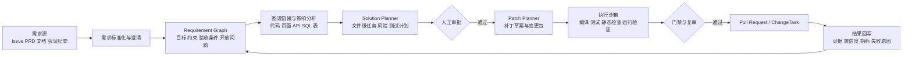

# LegacyGraph 与图谱及需求到编码工具的差距调研报告

## 执行摘要

LegacyGraph 不是一个“代码问答小工具”，而是一个已经具备较完整雏形的**遗留系统理解与知识图谱平台**：它把代码、前端页面、数据库、文档、证据、需求、方案、测试和审计放进同一套系统里，并明确采用“静态事实 + 图谱 + 向量检索 + LLM + 测试回写 + 人工审核”的路线。这一定位明显强于常见的“纯代码搜索”或“纯聊天式代码助手”，也是它最有价值的地方。仓库公开资料显示，它已经提供三类核心图谱、需求结构化、方案生成、影响分析、测试增强、Graphify 可选集成、QA 反馈与图谱质量门禁等能力。

但如果把目标提高到“建立图谱以指导/加速从需求到编码；自动分析需求并给出可落地方案”，LegacyGraph 当前更准确的评价应是：**它已经具备‘需求到方案’的中间层能力，但尚未完成‘方案到补丁/PR/可部署变更’的工程闭环**。公开 API 能看到需求分析、需求保存、影响分析、方案生成、方案校验、审批和桥接为 ChangeTask，但没有看到一个明确、稳定、对外说明充分的“直接生成补丁并提交 PR”的主路径；同时，仓库虽出现 Patch、PullRequest、PatchPlanAgent、AddColumnPatchAgent 等概念，但公开文档与接口层并未把这些能力串成成熟的生产工作流。

与市面工具相比，LegacyGraph 的**优势在“证据化、图谱化、可追溯、可审核”**，而明显短板在于**需求入口连接器、代码写回执行层、可量化 benchmark、工程化安全基线**。Sourcegraph、Greptile、Joern 这类系统在“代码图谱/代码理解/上下文检索”上更成熟；GitHub Copilot、Cursor、OpenHands 这类工具在“Issue/Ticket 到 PR/代码修改/自动执行”上更强。LegacyGraph 的机会点并不是去复制一个 IDE 助手，而是把自己定位成**“有证据的需求—架构—代码变更中枢”**，再补上补丁生成、沙箱验证、PR 工作流与基准评估。

本次审阅的最严重问题，不是模型能力，而是**安全卫生**。公开仓库中可直接看到开发环境连接信息与多类密钥被提交到版本库；同时后端默认 profile 设为 `dev`，存在公开 QA 流式接口、Swagger 对外开放、CORS 过宽等问题。这意味着如果不先做安全整改，任何“需求到编码自动化”都会放大风险，而不是放大效率。

## 调研范围与方法

本报告主要基于 LegacyGraph 仓库的 README、架构文档、数据库设计文档、关键配置文件、关键控制器和依赖清单进行审阅；竞品部分优先采用各产品的官方文档、官方官网、官方 GitHub 仓库与官方定价页面。LegacyGraph 侧的核心证据包括：README、`backend/pom.xml`、`frontend/package.json`、架构设计文档、数据库设计文档、`application.yml`、`application-dev.yml`、`.env.local`、`SecurityConfig`、`EnhancedQaController`、`RequirementController` 与 `SolutionController`。

需要说明的是，这份报告**没有在本次环境中对仓库进行完整构建、运行、压测或渗透测试**，因此凡是仓库文档与代码中未明确、或只能通过运行态确认的内容，我都标注为“未说明”，并给出建议的验证方法。这样的处理方式比直接猜测更适合投资判断、项目立项或技术路线评审。

从仓库成熟度外观来看，LegacyGraph 当前公开仓库显示 84 次提交、0 star、0 fork、无 release；这通常意味着它更接近**正在快速演进的概念验证/内部原型向产品化过渡阶段**，而不是已有大规模外部采用的稳定开源项目。与此同时，README 与文档体系相对完整，说明作者在产品结构化表达上投入明显。

## LegacyGraph 仓库技术审阅

### 总体定位与系统边界

README 将 LegacyGraph 定义为“系统 AI 知识图谱分析平台”，核心理念是“静态分析给事实，LLM 做归纳与补全，自动测试负责反证，人工审核兜底”。它不是只做代码图，而是同时覆盖**代码图谱、功能图谱、业务图谱**，并把文档、前端页面、数据库元数据和运行时/测试反馈纳入统一知识网络。架构设计文档进一步把它扩展成代码图谱、业务图谱、功能图谱、数据血缘、运行时图谱和统一图谱。这个边界定义说明，它的目标是“遗留系统理解与迁移分析平台”，而不是通用 IDE 插件。

从仓库规模看，公开文档列出后端 48 个 Controller、73 个 Entity、34 个一级子包、21 个 Agent、63 个前端页面、24 个前端 API 模块、83 个 Flyway 脚本和 291 个后端测试类；前端页面目录中已经明确包含 `requirement` 与 `solution` 视图。这说明项目并不是单一 demo，而是已经具备较厚的后台管理、图谱浏览、需求与方案工作台、系统管理、审计与测试界面。

不过，成熟度的另一面也很明显：仓库根目录出现 `.env.local`、`.pnpm-store`、`.home/.agent-browser` 等开发或本地运行痕迹，说明代码托管和工程卫生还没有达到成熟开源项目的治理标准。对外部团队而言，这会直接影响复现实验、构建可信度和安全性评价。

### 架构、数据模型与关键模块

LegacyGraph 采用典型的前后端分离架构：前端为 Vue 3 + TypeScript + Vite，图可视化使用 AntV G6 与 VueFlow；后端为 Spring Boot 4 + Java 21，显式使用 Jetty 而不是 Tomcat；主业务元数据与向量数据存于 PostgreSQL + pgvector，图谱关系主存储在 Neo4j，缓存与黑名单在 Redis，对象文件在 MinIO，LLM 通过 OpenAI 兼容接口接入。文档还强调其分层是“静态事实层 → 检索增强层 → Agent 编排层 → 验证回写层”。这套架构非常适合做“证据化知识层”，也比把 LLM 直接放在最前面的方案更稳。

数据模型是 LegacyGraph 的强项。节点类型除了传统的 Project、Page、ApiEndpoint、Service、Table、Column 之外，还显式包含 Requirement、RequirementItem、AcceptanceCriterion、Constraint、Assumption、OpenQuestion、Solution、SolutionStep、ChangeTask、Patch、PullRequest、VersionRisk 等面向需求与变更闭环的实体；边类型也不仅有 CALLS、READS、WRITES、MAPS_TO，还包括 AFFECTS、SATISFIES、STEP_OF、VALIDATED_BY、REVISED_BY、HAS_ACCEPTANCE_CRITERION 等需求—方案关系。与此同时，文档明确要求节点和关系带有 `evidence`、`confidence`、`status`。这让 LegacyGraph 天生更适合“解释为什么建议这样改”，而不仅是“猜一个答案”。

数据库设计显示，图谱节点与边当前**由 Neo4j 独占存储**，PostgreSQL 中早期的 `lg_graph_node`/`lg_graph_edge` 已退化为历史兼容；PostgreSQL 现在承担的是项目、事实、证据、需求、方案、QA 会话、缓存、审计和工作流状态等管理型数据。数据库设计文档还显示：`lg_requirement`、`lg_requirement_item`、`lg_acceptance_criterion`、`lg_acceptance_verification`、`lg_solution`、`lg_solution_step`、`lg_solution_audit`、`lg_solution_embedding`、`lg_graph_release`、`lg_file_snapshot` 等表已经存在，这说明“需求 → 方案 → 评审 → 图谱发布”的元数据底座是相当完整的。

关键模块方面，README 和包结构都表明后端核心集中在 `agent`、`analysis`、`builder`、`extractors`、`llm`、`task`、`understanding`、`service`、`plugin`、`graphify` 和 `federation`。其中最值得注意的是：`ProjectScanner`、`AiScanOrchestrator` 负责扫描编排与异步 AI 增强；`LlmGateway` 负责多模型路由、Prompt 渲染、PII 脱敏与 PromptRun 审计；`RequirementController` 和 `SolutionController` 把需求结构化、影响分析、方案生成与审批桥接做成了系统级接口，而不是散落在脚本里。

### 接口、依赖、扩展性与可演进性

接口层面，仓库公开了相当丰富的 REST 路由：认证、项目与图谱、QA、Agent、LLM Provider、Prompt 管理、系统审计、证据冲突、验证、运行时链路、代码属性图、契约管理、需求结构化、方案生成、影响分析、跨仓影响等都已有路由说明，同时开启了 `/v3/api-docs` 和 `/swagger-ui.html`。这意味着 LegacyGraph 更像一个平台，而不是封闭应用。

依赖栈也说明它在“可落地性”上是认真的。后端依赖包含 Spring AI、MyBatis-Plus、Neo4j Java Driver、Flyway、JavaParser、JSqlParser、Tika、POI、PDFBox、MinIO、JWT、MapStruct、REST Assured、Prometheus 等；前端则包含 axios、Element Plus、ECharts、G6、VueFlow、Pinia、Vitest、Playwright 等。这意味着它已经具备企业系统常见的解析、可视化、测试、观测和对象存储基础，而不是只围绕 LLM SDK 写了一层包装。

扩展性方面，LegacyGraph 的设计是有潜力的。仓库结构中存在 `plugin`、`McpPluginAdapter`、`federation`、`integration/graphify`；配置文件中又能看到对 MCP、本地工具、Codex、Claude Code、zread、Graphify CLI 的适配开关与命令模板，还支持 OpenAI 兼容模型的动态 provider 配置。这说明团队已经意识到：长期可用的系统，不应把“理解能力”绑定在单一厂商模型上。

但它的扩展性目前仍偏向“分析与规划层”，而不是“执行层”。公开资料能看到 Requirement → Impact → Solution → Verify → Approve → Bridge(ChangeTask) 的链路，却没有看到等价成熟度的 Patch 生成、代码修改沙箱、自动提交 PR、回滚分支管理、合并后发布回写工作流。也就是说，设计上已经有变更闭环概念，但系统主战场仍停留在**理解与决策辅助**。

### 性能、安全性与未说明项

性能与可扩展性上，LegacyGraph 已经做了一些正确选择：使用 Java 21 虚拟线程作为异步与测试执行基础；PostgreSQL 使用 jsonb + GIN、pgvector、HNSW；Neo4j 和 Hikari 均有连接池参数；Redis 提供全链路缓存与故障降级；文档扫描支持结构感知切块；`ProjectScanner` 实现了并行发现和增量扫描逻辑；但默认配置却把 `legacygraph.scan.incremental.enabled` 设为 `false`，说明当前默认策略更偏向准确性而非吞吐。与此同时，公开资料没有披露任何标准化的吞吐、延迟、成本或大仓库规模 benchmark。我的判断是：系统**具备中等规模项目可用的工程基础**，但尚未形成能说服市场的性能证据。

安全性方面，正反两面非常鲜明。正面是：系统有 JWT + Redis 黑名单、PII 脱敏、Prompt 审计、SecretScanService、图谱发布门禁、QA graph-release 过滤、审批与角色约束，这些都说明作者重视治理与审计。反面则是：公开仓库里提交了开发环境连接信息和密钥，`application.yml` 默认激活 `dev` profile、带有公开的 JWT fallback secret，`SecurityConfig` 暴露公开 QA 流式端点并使用 `allowedOriginPatterns("*")` 与 `allowCredentials(true)` 的过宽 CORS 组合，`docker-compose.yml` 中 Grafana 管理密码也为默认明文。综合判断：**系统有安全设计意识，但当前代码仓治理与默认配置远未达到可安全对外试用的程度**。

下面这张表把“仓库里已证实的能力”和“尚未说明、需要验证的内容”分开列出：

| 审阅维度 | 已能从仓库与文档确认的现状 | 仍属“未说明” | 建议验证方式 |
|---|---|---|---|
| 功能范围 | 三类核心图谱、需求结构化、影响分析、方案生成、QA、测试增强、Graphify 可选集成 | 端到端“自动改代码并提交 PR”的正式路径 | 做一次从需求文本到 PR 的演示用例，要求全链路日志与证据回写 |
| 数据模型 | Requirement/Solution/Patch/PR 等实体已入 NodeType/数据库表 | Patch/PR 实体的运行态状态机与审计规则 | 导出 ER 图、状态图，并补充接口用例 |
| 性能 | 向量检索、缓存、虚拟线程、并发扫描、连接池、增量扫描代码存在 | 吞吐、p95 延迟、成本、最大仓规模 | 建立 50k/200k/1M LOC 三档压测基线 |
| 安全 | JWT、审计、PII 脱敏、图谱发布门禁 | 密钥治理、租户隔离、SBOM、SAST/DAST、备份恢复 | Secret 扫描、依赖漏洞扫描、渗透测试、灾备演练 |
| 可靠性 | AI 编排异步任务、部分步骤独立容错 | 失败补偿、幂等性、回滚策略、RPO/RTO | 故障注入与 chaos 测试 |
| 可维护性 | 文档较完整，Flyway 迁移和模块边界清晰 | 覆盖率、架构约束自动校验结果、CI 质量门禁 | 接入 JaCoCo、ArchUnit 报告、CI 徽章与发布流程 |

表中“已确认现状”来自仓库 README、架构/数据库文档、关键控制器与配置文件；“未说明”部分是基于这些资料未能找到明确证据后做出的保守标注。

## 与竞品和参考系统的对比

从市场上看，最接近 LegacyGraph 的并不是某一个单品，而是两类产品的组合：一类是**代码/图谱/上下文平台**，如 Sourcegraph、Greptile、Joern；另一类是**从工单/需求到代码变更的执行型 agent**，如 GitHub Copilot、Cursor、OpenHands。LegacyGraph 的独特之处，在于它试图把“证据型代码图谱”和“需求/方案建模”放在一套系统里；但市场领先者已经把 PR、代码执行、工单驱动、自动 review 等执行环节做得更深。

| 系统 | 官网 / GitHub | 核心能力 | 优势 | 局限 | 技术栈 / 集成 | 许可与商业模式 |
|---|---|---|---|---|---|---|
| Sourcegraph | 官网、文档、MCP 页面  | Code Search、Deep Search、MCP、代码导航、Batch Changes、Insights | 企业级大仓上下文、SCIP 精确索引、可 self-host / 单租户云、对 agent 友好 | 对“需求建模”不是其主线；更强在代码上下文而非需求图谱 | 官方披露有 Code Search、Deep Search、SCIP、MCP、REST/GraphQL/CLI；底层完整实现未完全公开  | 商业化企业平台，起价约 $16K，支持单租户云与自托管  |
| GitHub Copilot | 官网、Docs、Code Search、Pricing  | 代码补全、Cloud Agent、Code Review、Issue 到 PR、GitHub 原生工作流 | 离代码托管/Issue/PR 最近，执行闭环强，协作门槛低 | 需求结构化与证据图谱能力弱；解释性依赖 GitHub 自身上下文 | 官方强调与 GitHub Issues、Actions、Code Search、PR Review 深度集成；内部实现未完全公开  | 商业订阅，个人与企业多档计划，2026 年起进一步转向使用量/AI credits 计费  |
| Cursor | 官网、Docs、Cloud Agents、CLI、Pricing  | IDE 内 agent、Cloud Agents、CLI、自动化、GitHub/Slack/Linear/网页入口 | 从“想法到代码”交互非常顺滑，云代理与多入口能力强 | 图谱证据层、审计和需求正式建模不如 LegacyGraph 强 | 官方披露支持 Agent、Rules、MCP、Skills、CLI、Cloud Agents；Cursor 3 说明其为面向 agent 的统一工作区，底层完整实现未公开  | 专有商业产品，个人约 $20/月起，团队约 $40/用户/月起，并存在用量计费能力  |
| OpenHands | GitHub、Docs、GitHub Action、PR Review、Cloud 许可  | 自托管 agent 控制中心、SDK/CLI/GUI、GitHub Action、Issue/PR 自动化、Agent Canvas | 开源可控、可自托管、工作流自动化强，适合做执行层 | 代码图谱与证据关系模型不是长板；系统知识层比 LegacyGraph 更弱 | 官方披露为 self-hosted developer control center，支持本地/远程/云后端与 GitHub 工作流；技术细节并未完整公开  | 核心工作多为 MIT，enterprise/ 与 cloud 部分另有商业/试用许可  |
| Greptile | 官网、Docs、Pricing、Self-host、Security  | 全仓图上下文 AI code review、规则学习、Runtime Validation、GitHub/GitLab | 在 PR 评审和“代码图上下文”上非常聚焦，学习团队规则能力强 | 不以需求结构化/方案建模为主，更多是 review/test 层工具 | 官方强调完整代码图、PR review、TREX 运行代码、可 self-host；内部实现未完全公开  | 商业产品，约 $30/seat/月起，自托管提供企业化交付  |
| Joern | 官网、Docs、GitHub  | Code Property Graph、跨语言静态分析、数据流/污点分析、HTTP server、图导出 | 在程序静态分析和图查询表达力上很强，适合作为底层分析引擎参考 | 不面向需求到编码闭环，产品化协作与业务图谱薄弱 | 官方披露 Scala DSL、多语言 frontend、图导出、server 模式；仓库说明 v4 已从 overflowdb 迁往 flatgraph  | Apache-2.0 开源；文档同时提及其 commercial brother Ocular  |

如果只看“图谱层”，LegacyGraph 最接近 **Greptile + Joern + 一部分 Sourcegraph** 的交集：它比 Greptile 更强调需求与方案，比 Joern 更强调平台与业务建模，但在大仓检索成熟度、静态分析深度和市场验证上暂时不如这几者。

如果只看“从需求到编码”，LegacyGraph 又更像 **GitHub Copilot / Cursor / OpenHands** 的上游规划层：它在“把需求解释清楚、链接到系统证据、形成变更计划”上比多数执行型 agent 更严谨，但在“自动改代码、运行、提交 PR、持续迭代”上明显落后。

## 从需求到编码能力差距评估

把“从需求到编码”拆成八个环节来看，LegacyGraph 当前最强的是**需求理解后的结构化建模、影响分析、证据追溯和人审治理**，最弱的是**代码生成与执行闭环**。这不是缺点中的偶然，而是产品定位使然：它原本更偏向“系统理解平台”，再向需求/方案延伸，而市场上最强的 Copilot、Cursor、OpenHands 则天然从“写代码/跑流程/出 PR”出发。

| 流程能力 | LegacyGraph 当前判断 | 市场最佳实践参考 | 差距判断 |
|---|---|---|---|
| 需求理解 | 中上：支持 LLM 结构化抽取、开放问题澄清、验收条件落库 | Copilot/OpenHands/Cursor 均能直接消费 Issue/Ticket 并进入执行 | LegacyGraph 需要更强的原生需求入口连接器 |
| 需求建模 | 高：Requirement / Item / Constraint / Acceptance / Solution 数据模型明确 | 多数编码 agent 没有这么强的正式模型 | 这是 LegacyGraph 的护城河，应继续强化 |
| 系统映射与影响分析 | 中上：要求把需求条目链接到现有图谱并抽取子图 | Sourcegraph/Greptile 更强于代码上下文检索，Joern 更强于静态程序关系 | LegacyGraph 需要 benchmark 证明其影响分析优于纯检索 |
| 方案生成 | 中：已有 SolutionPlanner、verify、approve、bridge | Cursor/Copilot/OpenHands 强在“可执行任务拆解” | LegacyGraph 需要把方案变成文件级任务与补丁计划 |
| 代码生成 | 偏低：公开路径未见成熟 patch/PR 主工作流 | Copilot、Cursor、OpenHands 在 issue→code→PR 更成熟 | 这是当前最大差距 |
| 可落地性 | 中：有测试闭环、方案审核、桥接变更任务 | Greptile/TREX、Copilot cloud agent、Cursor cloud agents 有更强执行层 | 还缺沙箱、回滚、PR、CI 集成闭环 |
| 自动化程度 | 中：扫描与 AI 编排自动化较高 | 执行型 agent 的自动化更完整 | 需要把自动化从“分析”推进到“修改+验证+提交” |
| 可解释性与人机协作 | 高：evidence、confidence、status、feedback、审批链都存在 | 市面很多工具仍偏“黑盒建议” | 继续保持，并作为市场差异化卖点 |

上表中的“高/中/低”是综合官方资料后的分析性判断，不是仓库自报分数。支撑这张表的事实基础包括：LegacyGraph 的 Requirement/Solution 控制器与数据库表、Sourcegraph 的代码检索与 MCP、GitHub Copilot 的 Cloud Agent 与 Code Review、Cursor 的 Cloud Agents 与 Automations、OpenHands 的 GitHub Action 与 PR Review。

我对这一节的结论是：**LegacyGraph 最该做的不是“更会聊天”，而是“把已经很强的需求/图谱/证据层，继续打通到 patch/PR/验证流水线”**。一旦这个闭环补上，它会比通用 coding agent 更适合复杂遗留系统的变更场景。

## 改进方向、功能清单与里程碑

团队规模目前**未说明**。以下时间线按一个**小型团队**估算：约 4 人（2 名后端、1 名前端、1 名 AI/平台工程师兼测试与运维），以连续 6–9 个月的产品化推进为假设。这不是对现团队现状的判断，而是为了给出一个可执行的节奏参照。

### 建议的目标架构



这张图不是仓库现状截图，而是我基于现有 Requirement → Impact → Solution → ChangeTask 主链，外加你项目已经具备的测试回写、证据模型、图谱发布门禁能力，推导出的**最合理目标架构**：它保留 LegacyGraph 的证据和治理优势，只把当前缺失的 Patch/PR/执行沙箱补齐。

### 优先级功能清单

| 优先级 | 建议功能 | 预期价值 | 实现难度 | 关键组件 |
|---|---|---|---|---|
| P0 | 立即清理密钥、重写 Git 历史、收口默认配置 | 先消除最严重安全阻断项，否则无法进入企业试点 | 中 | Secret 扫描、仓库清理、配置分层、密钥轮换 |
| P0 | 建立“需求标准件”模式 | 把自然语言需求沉淀为目标、约束、验收、开放问题、风险模板 | 中 | 结构化抽取器、Schema 校验、审批表单 |
| P0 | 建立 benchmark 与评测基线 | 把“看起来很强”变成“可以量化对比” | 中 | 基准数据集、黄金标注、评测脚本、仪表板 |
| P1 | 方案输出改成文件级/符号级变更计划 | 从“方案摘要”升级成“开发可执行任务单” | 中 | SolutionPlanner 增强、文件定位、符号映射 |
| P1 | 新增 Patch Draft 层 | 让 Solution 与代码修改之间有明确中间产物与审计对象 | 中高 | Patch 实体、Diff 模型、 AST/模板变更器 |
| P1 | 增加 GitHub/GitLab/Issue/Confluence/Jira 连接器 | 把需求与代码工作流真正接起来 | 中高 | 仓库连接器、工单连接器、文档同步器 |
| P1 | 建立执行沙箱 | 自动运行编译、测试、lint、契约验证、回归校验 | 高 | 隔离执行环境、任务编排、缓存、资源配额 |
| P2 | 方案到 PR 的自动桥接 | 与 Copilot/OpenHands/Cursor 形成正面竞争能力 | 高 | 分支管理、PR 模板、评论审计、回滚策略 |
| P2 | 图谱驱动的多代理协作 | Planner / Coder / Reviewer / Verifier 分工，减少黑盒一次性输出 | 高 | agent orchestration、共享 memory、任务状态机 |
| P3 | 跨仓/跨系统需求影响分析产品化 | 放大 LegacyGraph 的差异化场景价值 | 高 | federation、ownership、跨仓 ACL、跨图检索 |

这些优先级不是按“技术上最酷”排序，而是按“最先决定产品能否进入真实试点”排序。之所以把密钥治理和 benchmark 放到 P0，是因为当前公开仓库已出现明显安全问题，而现有文档又没有能支撑商业采纳的标准化性能/准确性评估。

### 里程碑时间线与代码建议

按小团队估算，一个更现实的节奏是：**前两个月做安全与评测基线，第三到四个月把方案粒度收敛到文件级变更计划，第五到六个月补上 patch draft 与执行沙箱，第七到九个月接通 PR 流水线并做两轮真实项目试点**。如果目标是先拿到“可售前演示”，六个月足够；如果目标是“企业内可控试点”，九个月更稳妥。

一个非常值得尽快补上的，是把 Solution 和未来的代码修改层之间插入一个显式接口，而不是让 LLM 直接写文件。下面是我建议的一个最小化后端接口雏形：

```java
public interface PatchDraftService {
    PatchDraft createDraft(String projectId, String versionId, String solutionId);
    PatchValidationReport validateDraft(String patchDraftId);
    ChangePackage materialize(String patchDraftId);
}
```

这个接口的意义在于：它把“方案”与“真正写代码”之间强制分层，让每一步都有证据、审计、验证和回放能力。对 LegacyGraph 来说，这种分层比直接模仿 IDE agent 更符合你现有的架构哲学，也更容易利用 Requirement、Solution、Evidence、ValidationGate 这些现成对象。

## 风险与限制

技术风险里，最大的不是 LLM 本身，而是**作用域膨胀**。LegacyGraph 现在横跨静态分析、知识图谱、RAG、需求工程、方案生成、测试生成、审计治理、Graphify 联邦和插件/MCP 体系；这种“全都想做”的策略在早期很强，但到了产品化阶段，极容易造成模块耦合过重、测试成本上升和性能边界不清。尤其在没有 benchmark 的情况下，系统很难证明“统一平台”一定优于“几个更轻的专用工具组合”。

数据风险主要来自**图谱不完整、证据冲突、文档过期和需求歧义**。仓库虽然已经设计了 evidence、confidence、status、evidence conflict、clarify、acceptance verification 等机制，这比多数产品好很多；但如果进入真实项目，最常见的问题仍会是：代码能解析，文档不可信；文档可信，术语不统一；需求已变更，图谱还没重扫。也就是说，图谱层的正确性永远是一个持续运营问题，而不是“一次扫描永久完成”。

伦理与法律风险集中在**代码与文档里的敏感信息处理、第三方模型调用、许可证污染和越权自动修改**。LegacyGraph 已经提到 PII 脱敏与 Secret 扫描，但公开仓库自身提交了敏感密钥，说明流程执行明显弱于机制设计；一旦未来接入外部工单、文档或仓库并自动生成补丁，这类风险会被进一步放大。正确做法不是“少做自动化”，而是把权限、审计、审批和最小可执行单元做得更硬。

部署成本也不低。LegacyGraph 的基础设施至少包含 PostgreSQL、Neo4j、Redis、MinIO、LLM Provider，以及可选的 Graphify、Prometheus、Grafana；这对企业不算夸张，但对中小团队而言，已经明显高于只装一个 IDE agent 或只上一个 PR review bot 的门槛。若商用化目标是“中大型遗留系统改造”，这个成本是合理的；若目标是通用开发者工具，则会处于明显不利位置。

## 验证与评估方法

如果目标是证明 LegacyGraph 能“指导/加速从需求到编码”，我建议把验证分成四层：**抽取层、图谱层、规划层、执行层**。抽取层评估需求结构化结果是否稳定；图谱层评估链接和影响分析是否准确；规划层评估方案是否可执行；执行层评估 patch/PR 是否真正缩短交付时间并降低缺陷率。LegacyGraph 配置里已经预留了 RAGAS 脚本、图谱发布门禁、QA 反馈、测试执行与回写能力，这些都可以直接成为评测底座。

推荐的测试用例不要只做“问答 demo”，而要做真实工程情境，至少覆盖六类：新增字段/列、API 参数变更、权限规则变更、前端页面改动、跨仓依赖调用、旧数据库表迁移。每个用例都应提供真实需求说明、人工黄金答案、涉及文件清单、预期受影响节点、验收条件和回归测试。这样才能判断系统是在“理解系统”，还是在“输出看起来合理的话”。这类设计也与 Joern、Sourcegraph、Greptile、OpenHands 等产品常见的真实代码工作流更可比。

指标方面，我建议至少跟踪以下几类：需求抽取 F1、图谱链接 Precision/Recall、影响分析 Precision@K、方案可执行率、自动生成 patch 的构建通过率、测试通过率、人工修改率、PR 接受率、问答 groundedness、证据覆盖率、p95 延迟、单次任务 token/成本。LegacyGraph README 已明确提出覆盖率、证据完备度、待审核比例、测试通过率、运行时验证比例等质量维度，因此完全可以在现有设计上扩展成更硬的评测体系。

用户研究建议分角色做：让**架构师**评估图谱与方案是否可信，让**开发者**评估文件级计划是否可执行，让**QA**评估验收条件与测试建议是否覆盖关键风险，让**新成员**评估是否真正加快系统上手。这比只看“模型答得像不像”更有业务意义。特别是对 LegacyGraph 而言，真正的商业价值很可能来自“复杂系统共识形成”，而不仅是“多写几行代码”。

A/B 测试可以设计成四组：A 组只用代码搜索/文档；B 组用通用 coding agent；C 组用 LegacyGraph 仅做理解与方案；D 组用 LegacyGraph + patch/PR 闭环。主要比较完成时间、返工次数、缺陷逃逸率、人工 reviewer 满意度和变更解释充分性。只有这样，才能真正回答“知识图谱是否在需求到编码链路上创造了独立价值”这个问题。

## 结论与下一步行动清单

综合来看，LegacyGraph 的方向是成立的，而且方向本身是有差异化的。它已经具备比大多数“AI coding 工具”更扎实的需求、证据、图谱和治理底座；也已经比大多数“代码图谱工具”更接近需求与方案层。但它当前仍然**更像一个优秀的“遗留系统理解与变更规划平台”**，还不是一个成熟的“从需求直接到可合并代码”的闭环平台。其最短板不是功能想象力，而是安全基线、执行闭环和量化证明。

我建议下一步行动按下面顺序推进：

- **先做安全止血**：立刻轮换并撤除仓库中已暴露的连接信息与密钥，重写 Git 历史，并把默认 profile、默认 secret、CORS 和公开端点策略重新梳理。
- **建立可复现实验基线**：挑选两到三个真实遗留系统场景，固化黄金数据集、评价指标和对照基线。
- **把方案粒度下沉到文件级**：让 Solution 不只输出摘要，而是输出受影响文件、符号、动作类型、测试计划与回滚计划。
- **引入 Patch Draft 中间层**：不要让 LLM 直接写仓库，而是先产出可审计、可验证、可回放的补丁草案。
- **补上执行沙箱与 PR 流水线**：把 ChangeTask 真正桥接到分支、编译、测试、PR、审阅与回写。
- **增加原生需求连接器**：优先接入工单与文档系统，让需求入口不再局限于手工文本粘贴。当前公开资料中尚未看到这类原生连接。
- **把“证据化”做成市场卖点**：继续强化 evidence、confidence、status、feedback、approval 这些能力，因为这正是它区别于通用 coding agent 的核心价值。

如果你要我用一句话概括这份调研的判断，那就是：**LegacyGraph 最值得投资的不是“再加一个更强模型”，而是“把现有图谱与证据中台，升级成有安全边界、有评测基线、能产出 patch/PR 的需求到编码执行平台”。**