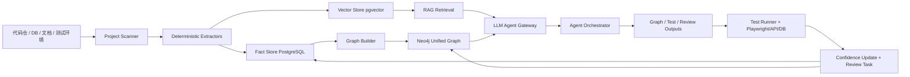
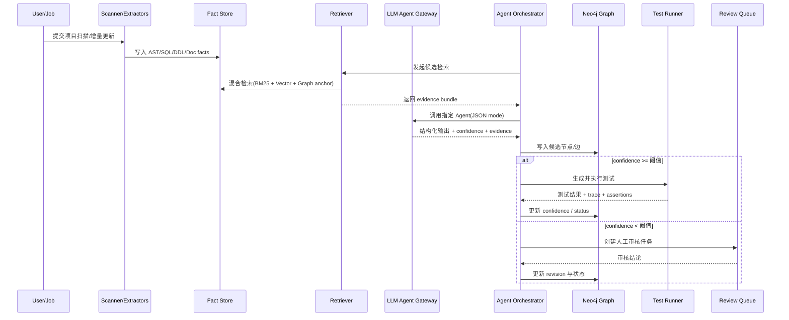
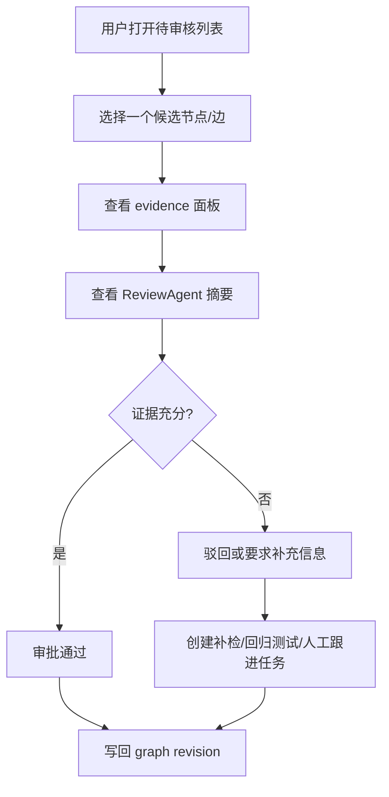

# LegacyGraph 平台引入 LLM 增强的实施蓝图

## 目录

- [Executive Summary](#executive-summary)
- [范围、输入输出与关键假设](#范围输入输出与关键假设)
- [目标架构与模型工具选型](#目标架构与模型工具选型)
- [Agent 体系与提示模板](#agent-体系与提示模板)
- [RAG、证据溯源与多轮编排](#rag证据溯源与多轮编排)
- [安全合规、测试闭环与平台接口](#安全合规测试闭环与平台接口)
- [前端对接、实施里程碑与验收](#前端对接实施里程碑与验收)

## Executive Summary

LegacyGraph 现有落地方案已经具备“扫描层—抽取层—事实层—图谱层—验证层”的骨架，并已预设 CodeFactAgent、DocUnderstandingAgent、FeatureMappingAgent、GraphMergeAgent、TestCaseAgent、AssertionAgent、ReviewAgent 等 AI 角色。这意味着平台下一阶段的重点，不应再是“是否引入 LLM”，而是把 LLM 从一个零散的提示词能力，升级为**有证据、有版本、有回退、有测试闭环的生产级推理层**。换句话说，LLM 在 LegacyGraph 中最合理的位置，不是取代 AST、SQL 解析、数据库元数据抽取，而是站在这些确定性事实之上，完成语义理解、跨源对齐、低置信度补全、测试生成与人工审核辅助。fileciteturn0file0

本报告的核心结论是：**LegacyGraph 的最优演进路线是“静态事实优先 + 检索增强生成 + 图谱回写验证 + 人工审核兜底”**。静态分析层由 CodeQL、Semgrep、SQL 解析器、数据库元数据扫描器提供确定事实；检索层由 pgvector 或 Weaviate/FAISS 提供向量召回，并辅以 Neo4j 图邻域与全文搜索做混合检索；LLM 只在“理解、归纳、匹配、生成、解释”环节发力；最终再用 Playwright/API 测试、数据库断言与人工确认反向验证图谱。Neo4j 官方文档明确支持向量索引，并指出向量搜索可与全文检索等排序源组合做混合搜索；pgvector 官方项目也明确支持精确和近似最近邻搜索，并支持 HNSW、IVFFlat 等索引方式。citeturn3view0turn3view2turn3view3turn3view4turn3view5

从模型选型看，如果项目强调**中文能力、代码理解、Agent 工具调用与可私有部署**，首选组合应是“**Qwen 自部署 + GLM/DeepSeek API 作为弹性推理层**”。Qwen 官方文档显示其支持本地运行、vLLM/TGI/SGLang 部署，并具备工具使用与 Agent 能力；GLM-4.5 官方文档则强调其针对智能体、代码、工具调用、JSON 结构化输出、上下文缓存而设计；DeepSeek API 官方文档给出了 1M 上下文、JSON Output、Tool Calls 和公开价格与并发限制，这非常适合做按任务路由的多模型网关。citeturn21view0turn21view3turn12view1turn19view0

在实施层面，最可落地的方案不是一步到位构造“万能智能体”，而是分三层建设。第一层先把证据链打通：文件、行号、SQL、URL、哈希、版本号一并入库。第二层引入七类核心 Agent，统一要求 JSON Schema 输出、evidence 引用、confidence 评分、可重试、可回退。第三层把测试闭环纳入图谱主流程：TestCaseAgent 自动生成测试，AssertionAgent 自动生成断言，Test Runner 执行后将结果回写图谱，并按预先定义的分值规则更新节点和边的置信度。Playwright 官方文档明确支持 API testing、前后置服务状态校验，以及 Trace Viewer、DOM snapshots、network logs 等能力，正好可以作为“图谱真实性验证”的运行时证据。citeturn5view0turn6view0turn6view3

因此，本报告的总体建议是：在未来 3 个月内，把 LegacyGraph 的 LLM 接入目标定义为**一个可审计、可验证、可灰度、可私有部署的 Agent 编排系统**，而不是单点接入某一家模型 API。这样做的收益，不仅是图谱生成自动化率提升，更重要的是把 LegacyGraph 从“老项目理解工具”升级为“面向改造、回归测试、影响分析、知识沉淀的工程平台”。支持这一演进的底层工具选型——CodeQL、Semgrep、Neo4j、pgvector、Playwright、Qwen/GLM/DeepSeek——都已经在官方文档中提供了与该目标高度匹配的能力边界。citeturn17view0turn18view1turn3view0turn3view3turn5view0turn12view1turn19view0turn21view0

## 范围、输入输出与关键假设

本报告面向一个已经有基础扫描与图谱能力的 LegacyGraph 平台，目标是引入 LLM 增强其“理解老项目、构建三类图谱、生成测试、辅助人工审核”的能力。这里所说的“引入 LLM”，不是孤立的聊天能力，而是把大模型整合进事实库、图谱、测试和前端审核流程之中。现有方案文件中已经提出 Router、Memory Chain、Tool Chain、Code/Doc/Graph Query 等分层思路，本文在此基础上扩展到可实施的工程蓝图。fileciteturn0file0

### 输入输出与未指定项假设

| 类别 | 已知输入 | 期望输出 | 本报告中的假设 |
|---|---|---|---|
| 代码 | 前端代码、后端代码、配置、依赖文件 | 结构化事实、调用链、页面/API/SQL 关系 | 代码仓可完整拉取，至少能在只读模式扫描 |
| 数据库 | DDL、迁移脚本、在线元数据、样例数据 | 表/字段/索引/关系、状态流、读写证据 | 有测试库或只读库；若无法直连则用 schema dump 替代 |
| 文档 | 产品文档、接口文档、操作手册、流程图 | 流程、角色、业务对象、规则、术语别名 | 文档允许被解析；若为扫描件可接受 OCR 误差 |
| 事实库 | AST 结果、SQL 解析结果、文档分片 | 统一 fact schema、evidence、向量索引 | PostgreSQL 可用，允许新增 pgvector 扩展 |
| 图谱 | 业务图谱、功能图谱、代码图谱 | 图节点、关系、证据链、置信度 | 允许引入 Neo4j；若组织不接受图数据库，可退化到关系表 + 物化视图 |
| 测试环境 | API 地址、测试账号、测试数据库、Mock 能力 | 自动化测试结果、运行痕迹、断言结果 | 至少有一个可重复执行的集成测试环境 |
| 人工确认 | 审核人、业务方、研发负责人 | 审核意见、驳回原因、规则学习样本 | 平台可分配 Review Task，并允许记录审批日志 |
| 未指定项 | LLM 预算、私有/公有部署、合规等级、保留期 | 成本方案、部署蓝图、安全策略 | 报告按“可私有优先、可公有扩展、默认需审计”设计 |

在预算方面，本文默认采用**混合部署假设**：基础抽取与低成本批量任务优先走私有部署模型或小模型；复杂审阅、跨文档映射与高难推理任务可路由到外部 API 模型。若企业要求“代码与文档不可出网”，则所有高敏推理任务都应切到自部署模型，仅允许脱敏后的摘要或公开资料进入外部模型。OpenAI Business 页面显示其 Business/Enterprise 方案默认不使用业务数据训练模型，但对 LegacyGraph 这类平台级后台服务而言，真正的控制点仍然在“提示上下文出网边界”和“数据脱敏管道”上。citeturn8view0

在合规方面，报告按“**最小必要暴露**”假设设计：上传到 LLM 的上下文必须经过敏感信息识别和脱敏；任何结论若缺乏 code line、SQL、文档片段、URL 等证据，不允许直接进入正式图谱。这一假设与现有方案“所有 LLM 输出必须有证据链和置信度”的方向一致，也与后文设计的审计签名、人工阈值审批和测试回写机制相互配套。fileciteturn0file0

## 目标架构与模型工具选型

### 目标架构

LegacyGraph 在引入 LLM 之后，建议形成“**静态事实层、检索增强层、Agent 编排层、验证回写层**”四段式架构。静态事实层由 CodeQL、Semgrep、AST/SQL/DDL 解析器输出确定性事实；检索增强层负责对文本、代码、表结构、历史审核与测试记录做向量化与重排序；Agent 编排层负责面向具体任务选择模型、组织提示与工具调用；验证回写层负责把测试、审核、Trace、断言结果写回事实库与图谱库。CodeQL 官方文档说明其支持 Java、Kotlin、JavaScript、TypeScript、Python、C# 等语言，并对 Java 生态中的 iBatis/MyBatis、JPA、JDBC、Spring JDBC、Spring MVC 提供内建支持；Semgrep 官方文档则说明 Java、JavaScript、Python、TypeScript 等语言已达到 GA 水平，并支持 cross-file dataflow 与 framework-specific control flow analysis。citeturn17view0turn17view2turn17view3turn17view4turn18view1turn18view3turn18view4



Neo4j 官方文档指出，向量索引可用于相似性检索，也可以与全文搜索等排序源组合做 hybrid search；其向量索引支持维度约束与 cosine 相似度函数，并建议为文本 embedding 显式设置维度。pgvector 官方项目明确支持 exact 与 approximate nearest neighbor search，并给出 HNSW 与 IVFFlat 的索引与参数设置示例。对于 LegacyGraph 来说，这意味着最务实的做法是：**事实和审核日志进 PostgreSQL，向量分片先用 pgvector，图关系进 Neo4j，等规模再考虑 FAISS 或 Weaviate 分库拆分。** citeturn3view0turn3view2turn3view3turn3view4turn3view5

### 向量、图谱与检索组件选型

| 组件 | 推荐级别 | 适用场景 | 优点 | 局限 |
|---|---|---|---|---|
| pgvector | 高 | 中小规模、与事实库强耦合 | 与 PostgreSQL 同库同事务，支持 exact / ANN，支持 HNSW/IVFFlat | 超大规模下运维与分片策略更复杂 |
| Neo4j Vector | 高 | 图邻域 + 语义混合查询 | 天然适合“图关系 + 向量 + 全文”联合检索 | 更适合图驱动场景，不宜替代主事实库 |
| Weaviate | 中 | 大规模多租户、命名向量、多索引 | 支持 vectorizer 集成、named vectors、threshold、MMR rerank | 新增一套基础设施，团队学习成本更高 |
| FAISS | 中 | 超大离线索引、GPU 检索 | 高性能、支持 GPU、支持 PQ/HNSW 等 | 不是完整数据库，需要自行处理元数据与一致性 |
| 仅 Neo4j | 低 | 早期 Demo | 快速验证图库玩法 | 不适合作为全部 fact 与 embedding 主存储 |
| 仅 PostgreSQL | 中 | 强调简化架构 | 最容易落地 | 图查询与复杂路径分析不如 Neo4j 直观 |

Weaviate 官方文档说明其支持 `hnsw`、`flat`、`dynamic` 向量索引、named vectors、阈值过滤与 MMR reranking，并强调向量检索必须结合 limit、threshold 与 filters 才能避免“总会返回一个最近邻但未必相关”的问题；FAISS 官方文档则说明其是面向任意规模 dense vector 的高效相似检索库，支持 GPU，并基于 IVF、PQ、HNSW 等多年研究成果。这个对比决定了 LegacyGraph 的推荐架构：**MVP 用 PostgreSQL + pgvector + Neo4j；项目数、分片数、租户规模显著增大后，再评估 Weaviate 或 FAISS。** citeturn14view0turn15view1turn15view2

### 模型与工具对比

| 类型 | 候选 | 推荐角色 | 关键优点 | 成本口径 | 适用结论 |
|---|---|---|---|---|---|
| 开源大模型 | Qwen3 / Qwen3-Instruct / Qwen3-Thinking | 私有部署主模型、中文理解、代码/Agent | 支持本地运行与 vLLM/TGI/SGLang 部署；支持 100+ 语言；强调 coding、tool-use、agent capabilities | 自建 GPU/CPU，不按 token 计费 | 适合高敏数据与长期沉淀场景 citeturn21view0turn21view3turn21view4 |
| 商用中文模型 | GLM-4.5 / GLM-4.5-Air | 复杂推理、结构化输出、Agent | 官方文档强调代码、工具调用、JSON 结构化输出、MCP、128K 上下文；公开给出 API 价格与速度描述 | 公开 API 单价，适合弹性路由 | 适合复杂中文业务与工具协同 citeturn12view1 |
| 商用高性价比 | DeepSeek-V4-Flash / Pro | 批量抽取、FeatureMapping、低成本推理 | 公开 1M context、JSON Output、Tool Calls、价格、并发限制 | 按 token 公开计费 | 适合大批量中等复杂任务 citeturn19view0turn19view1 |
| 工作台 SaaS | OpenAI Business / Enterprise | 辅助研究、内部知识工作台 | Business $20/用户/月；默认不使用业务数据训练；企业级安全与数据驻留能力 | 按席位或定制 | 更像运营工作台，不宜直接替代平台后端模型层 citeturn8view0 |
| 静态分析 | CodeQL | 后端/前端/框架事实抽取 | 多语言、多框架支持，适合调用链与数据流 | 规则与查询成本 | 作为事实优先层核心工具 citeturn17view0turn17view4 |
| 规则扫描 | Semgrep | 轻量规则抽取与补洞 | Java/JS/Python/TS 为 GA；支持跨文件数据流 | 规则维护成本较低 | 适合补充框架约定式分析 citeturn18view1 |
| 自动测试 | Playwright | API/E2E/Trace 证据 | 支持 API testing、前后置条件、Trace Viewer、DOM snapshots、network logs | 测试环境和执行时长成本 | 作为运行时验证主工具 citeturn5view0turn6view0turn6view3 |

### 成本估算建议

如果按“**每月 100k tokens，总量按 50k 输入 + 50k 输出**”做粗估，GLM-4.5 依据官方文档中“输入 0.8 元/百万 tokens、输出 2 元/百万 tokens”的价格，约为 **0.14 元人民币/月**；DeepSeek-V4-Flash 依据公开价格“cache miss 输入 $0.14/百万、输出 $0.28/百万”，则约为 **$0.021/月**。需要特别说明的是，这两个数字只是说明“token 级调用的理论边际成本非常低”，实际成本更多来自**请求数量、并发、缓存命中率、长上下文召回与重试次数**，而不是这 100k token 本身。DeepSeek 官方同时指出价格会调整，GLM 官方也强调模型与路线会持续迭代，因此生产环境应把价格视为可配置参数，而不是硬编码。citeturn19view0turn12view1

对于私有部署的 Qwen，自部署成本不适合用 token 公式去算，更合理的口径是“**单项目月均 GPU 小时数 + 峰值并发 + 模型尺寸**”。Qwen 官方文档给出了从本地 `llama.cpp`/Ollama 到 vLLM/TGI/SGLang 的部署路径，这意味着企业可以先用 8B/14B 级模型承担抽取与审校，再把少量高复杂任务转发给更大的外部模型。这样的混合路由比“全量走大模型 API”更符合 LegacyGraph 的长期成本结构。citeturn21view0

### 优先参考来源

```text
https://codeql.github.com/docs/codeql-overview/supported-languages-and-frameworks/
https://docs.semgrep.dev/supported-languages
https://neo4j.com/docs/cypher-manual/current/indexes/semantic-indexes/vector-indexes/
https://github.com/pgvector/pgvector
https://docs.weaviate.io/weaviate/concepts/search/vector-search
https://faiss.ai/
https://playwright.dev/docs/api-testing
https://playwright.dev/docs/trace-viewer
https://qwen.readthedocs.io/en/latest/
https://docs.bigmodel.cn/cn/guide/models/text/glm-4.5
https://api-docs.deepseek.com/quick_start/pricing
https://openai.com/business/pricing/
```

## Agent 体系与提示模板

### Agent 职责总表

| Agent | 核心目标 | 主要输入 | 主要输出 | 推荐模型 | 并发建议 | 失败回退 |
|---|---|---|---|---|---|---|
| CodeFactAgent | 代码语义事实抽取 | AST、调用链、SQL、文件行号 | 结构化代码事实 | Qwen 私有 / DeepSeek Flash | 8–16 并发/项目，单批 10–20 chunk | 回退到规则引擎与静态分析结果 |
| DocUnderstandingAgent | 文档业务流程与规则抽取 | 文档分片、OCR 结果、术语词典 | 流程、对象、规则、别名 | GLM / Qwen | 4–8 并发，单批 6–10 chunk | 退回抽取型模板 + 人工确认 |
| FeatureMappingAgent | 页面/按钮/API/权限映射 | 前端事实、后端接口、文档功能点 | 功能映射边 | DeepSeek / GLM | 6–10 并发 | 回退到名称相似 + 调用证据打分 |
| GraphMergeAgent | 去重合并、关系裁决 | 候选节点/边、相似度结果、图邻域 | merged nodes / rejected edges | GLM / Qwen Thinking | 2–4 并发 | 回退到规则合并或 Review Task |
| TestCaseAgent | 生成测试场景 | 功能节点、状态流、接口和表 | 测试用例 JSON | GLM / Qwen | 4–6 并发 | 回退到模板用例工厂 |
| AssertionAgent | 生成断言与校验 SQL | API 定义、SQL 读写、业务规则 | HTTP/DB/Trace 断言 | DeepSeek / Qwen | 8–12 并发 | 回退到固定断言模板 |
| ReviewAgent | 审核建议与差异解释 | 低置信度结论、冲突证据、失败测试 | 审核摘要、推荐动作 | GLM / Qwen Thinking | 2–4 并发 | 直接生成人工任务而不出结论 |

上表的推荐并发不是供应商硬限制，而是 LegacyGraph 内部网关建议值。真正的上限还要叠加供应商的并发和速率约束。DeepSeek 官方文档已经公开给出 v4-flash 和 v4-pro 的并发限制；对于其他模型，建议在平台层统一实现 RPM、TPM、并发令牌桶和项目级配额。citeturn19view0

### 公共输入与公共证据对象

所有 Agent 都应共享统一的输入外壳与证据对象，避免上下游 schema 漂移。

```json
{
  "$id": "CommonAgentInput",
  "type": "object",
  "required": ["agent", "project_id", "task_id", "input_payload", "evidence_catalog", "context"],
  "properties": {
    "agent": { "type": "string" },
    "project_id": { "type": "string" },
    "task_id": { "type": "string" },
    "input_payload": { "type": "object" },
    "evidence_catalog": {
      "type": "array",
      "items": { "$ref": "#/$defs/EvidenceRef" }
    },
    "context": {
      "type": "object",
      "properties": {
        "prompt_version": { "type": "string" },
        "model_name": { "type": "string" },
        "model_mode": { "type": "string", "enum": ["fast", "reasoning", "json"] },
        "graph_revision": { "type": "string" },
        "retrieval_snapshot": { "type": "string" }
      }
    }
  },
  "$defs": {
    "EvidenceRef": {
      "type": "object",
      "required": ["evidence_id", "source_type", "source_uri", "locator"],
      "properties": {
        "evidence_id": { "type": "string" },
        "source_type": { "type": "string", "enum": ["file", "sql", "doc", "url", "trace", "db"] },
        "source_uri": { "type": "string" },
        "locator": {
          "type": "object",
          "properties": {
            "path": { "type": "string" },
            "line_start": { "type": "integer" },
            "line_end": { "type": "integer" },
            "sql_id": { "type": "string" },
            "page": { "type": "integer" },
            "chunk_id": { "type": "string" }
          }
        },
        "checksum_sha256": { "type": "string" }
      }
    }
  }
}
```

所有 Agent 输出也应强制带统一元数据。

```json
{
  "$id": "CommonAgentOutputMeta",
  "type": "object",
  "required": ["agent", "task_id", "confidence", "evidence", "needs_review", "output_hash"],
  "properties": {
    "agent": { "type": "string" },
    "task_id": { "type": "string" },
    "confidence": { "type": "number", "minimum": 0, "maximum": 1 },
    "evidence": {
      "type": "array",
      "items": { "type": "string", "description": "evidence_id list" }
    },
    "needs_review": { "type": "boolean" },
    "reasoning_summary": { "type": "string", "description": "禁止输出详细 chain-of-thought，仅保留简短依据摘要" },
    "output_hash": { "type": "string" }
  }
}
```

### CodeFactAgent

CodeFactAgent 的职责是把“静态抽取出来但还缺乏业务语义”的代码块翻译成可读、可合并、可追溯的事实。它不负责发明调用链，而负责解释调用链。CodeQL 已能覆盖 Java/Spring MVC/MyBatis/JDBC 等框架，Semgrep 又能补充跨文件规则扫描，所以 CodeFactAgent 的输入应以“确定性结构 + 少量代码片段”组成，而不是整个仓库原文。citeturn17view0turn18view1

**输入 Schema**

```json
{
  "$id": "CodeFactAgentInputPayload",
  "type": "object",
  "required": ["symbols", "call_edges", "sql_links"],
  "properties": {
    "symbols": {
      "type": "array",
      "items": {
        "type": "object",
        "required": ["symbol_id", "kind", "signature", "code_excerpt_evidence_ids"],
        "properties": {
          "symbol_id": { "type": "string" },
          "kind": { "type": "string", "enum": ["controller", "service", "method", "mapper", "component"] },
          "signature": { "type": "string" },
          "code_excerpt_evidence_ids": { "type": "array", "items": { "type": "string" } }
        }
      }
    },
    "call_edges": { "type": "array", "items": { "type": "object" } },
    "sql_links": { "type": "array", "items": { "type": "object" } }
  }
}
```

**输出 Schema**

```json
{
  "$id": "CodeFactAgentOutput",
  "allOf": [{ "$ref": "CommonAgentOutputMeta" }],
  "type": "object",
  "required": ["facts"],
  "properties": {
    "facts": {
      "type": "array",
      "items": {
        "type": "object",
        "required": ["fact_type", "symbol_id", "summary", "evidence", "confidence"],
        "properties": {
          "fact_type": { "type": "string", "enum": ["semantic_purpose", "side_effect", "business_rule_hint", "external_dependency"] },
          "symbol_id": { "type": "string" },
          "summary": { "type": "string" },
          "write_tables": { "type": "array", "items": { "type": "string" } },
          "read_tables": { "type": "array", "items": { "type": "string" } },
          "evidence": { "type": "array", "items": { "type": "string" } },
          "confidence": { "type": "number" }
        }
      }
    }
  }
}
```

**中文 Prompt 示例**

```text
你是 LegacyGraph 的代码事实分析代理。你的任务不是猜测，而是基于给定代码片段、调用链和 SQL 证据，提取“可验证”的业务含义。

要求：
1. 只输出 JSON，不要输出 Markdown。
2. 每条结论必须引用 evidence_id。
3. 如果结论无法从代码直接支持，confidence 不得高于 0.60。
4. 严禁凭经验补全不存在的方法、表、状态或业务规则。
5. reasoning_summary 只能给出简短依据摘要，不要输出详细思维过程。

请分析：
- symbols: {{symbols}}
- call_edges: {{call_edges}}
- sql_links: {{sql_links}}
- evidence_catalog: {{evidence_catalog}}

输出字段：
facts[].fact_type
facts[].symbol_id
facts[].summary
facts[].read_tables
facts[].write_tables
facts[].evidence
facts[].confidence
confidence
needs_review
reasoning_summary
output_hash
```

**置信度计算规则**

`confidence = 0.45*evidence_coverage + 0.20*cross_source_agreement + 0.20*symbol_specificity + 0.15*sql_binding_strength`

其中 `evidence_coverage` 指结论引用的文件/SQL 证据数量和覆盖率；`cross_source_agreement` 指代码与 SQL 是否相互印证；`symbol_specificity` 指方法名、注解、参数类型是否足以支撑含义；`sql_binding_strength` 指是否存在明确 mapper/statement/table 绑定。若没有 SQL 或上游 AST 丢失，则上限限制为 0.72。

**重试、回退与速率建议**

结构不合法先做 1 次 JSON 修复重试；证据不足时自动触发补充检索，最多 1 次；再失败则回退到“仅静态事实入库，不生成语义事实”。建议使用 fast/json 模式模型，单模型副本 8–16 并发，40–80 RPM。

### DocUnderstandingAgent

DocUnderstandingAgent 负责把 PRD、操作手册、流程文档、扫描件 OCR 结果转成“业务流程、角色、对象、规则、状态流”。它生成的多半是中等置信度事实，因此默认进入“待验证”或“快速审核”队列，而不是直接写入正式图谱。fileciteturn0file0

**输入 Schema**

```json
{
  "$id": "DocUnderstandingAgentInputPayload",
  "type": "object",
  "required": ["doc_chunks", "term_dictionary"],
  "properties": {
    "doc_chunks": {
      "type": "array",
      "items": {
        "type": "object",
        "required": ["chunk_id", "text_evidence_id"],
        "properties": {
          "chunk_id": { "type": "string" },
          "title": { "type": "string" },
          "text_evidence_id": { "type": "string" }
        }
      }
    },
    "term_dictionary": { "type": "array", "items": { "type": "string" } }
  }
}
```

**输出 Schema**

```json
{
  "$id": "DocUnderstandingAgentOutput",
  "allOf": [{ "$ref": "CommonAgentOutputMeta" }],
  "type": "object",
  "required": ["processes", "terms"],
  "properties": {
    "processes": {
      "type": "array",
      "items": {
        "type": "object",
        "required": ["name", "actors", "steps", "rules", "evidence", "confidence"],
        "properties": {
          "name": { "type": "string" },
          "actors": { "type": "array", "items": { "type": "string" } },
          "business_objects": { "type": "array", "items": { "type": "string" } },
          "steps": { "type": "array", "items": { "type": "string" } },
          "rules": { "type": "array", "items": { "type": "string" } },
          "state_transitions": { "type": "array", "items": { "type": "string" } },
          "evidence": { "type": "array", "items": { "type": "string" } },
          "confidence": { "type": "number" }
        }
      }
    },
    "terms": {
      "type": "array",
      "items": {
        "type": "object",
        "required": ["canonical", "aliases", "evidence", "confidence"],
        "properties": {
          "canonical": { "type": "string" },
          "aliases": { "type": "array", "items": { "type": "string" } },
          "evidence": { "type": "array", "items": { "type": "string" } },
          "confidence": { "type": "number" }
        }
      }
    }
  }
}
```

**中文 Prompt 示例**

```text
你是遗留系统业务文档理解代理。

输入是文档分片，不保证文档完整，也可能存在 OCR 噪声。你的目标是提取“文档中明确出现或可直接归纳”的流程、角色、业务对象、规则和术语别名。

硬性要求：
1. 只输出 JSON。
2. 所有流程和术语都必须带 evidence_id。
3. 没有直接文字证据的流程，不得把 confidence 设到 0.75 以上。
4. 如果同一流程在不同分片存在冲突，请同时输出冲突摘要并标记 needs_review=true。
5. 不要补写产品经理没有写过的流程。

输入：
{{doc_chunks}}
{{term_dictionary}}
{{evidence_catalog}}
```

**置信度计算规则**

`confidence = 0.35*text_clarity + 0.25*multi_chunk_consistency + 0.20*term_match + 0.20*structure_completeness`

如果步骤链不完整、缺少动作主体或缺少前后状态，则单流程置信度上限 0.68。

**重试、回退与速率建议**

首轮输出冲突过多时，自动以术语词典做一次二次提示；仍冲突则生成 review task，不再强行统一。建议 4–8 并发，20–40 RPM。

### FeatureMappingAgent

FeatureMappingAgent 把页面、按钮、表单、接口、权限、菜单与文档功能点映射为完整功能图谱，是 LegacyGraph 全链条可理解性的核心。它依赖前端 API 调用事实、后端接口事实和文档中的动作语言三类输入。Semgrep 在 JavaScript/TypeScript 上支持 cross-file dataflow 与 framework-specific control flow analysis，CodeQL 也支持 `.vue`、`.js`、`.ts` 等文件类型，这使得前后端连接点更适合由“静态事实 + LLM 裁决”完成，而不适合纯名称模糊匹配。citeturn17view4turn18view1

**输入 Schema**

```json
{
  "$id": "FeatureMappingAgentInputPayload",
  "type": "object",
  "required": ["frontend_actions", "api_endpoints", "doc_features"],
  "properties": {
    "frontend_actions": { "type": "array", "items": { "type": "object" } },
    "api_endpoints": { "type": "array", "items": { "type": "object" } },
    "doc_features": { "type": "array", "items": { "type": "object" } }
  }
}
```

**输出 Schema**

```json
{
  "$id": "FeatureMappingAgentOutput",
  "allOf": [{ "$ref": "CommonAgentOutputMeta" }],
  "type": "object",
  "required": ["mappings"],
  "properties": {
    "mappings": {
      "type": "array",
      "items": {
        "type": "object",
        "required": ["feature_key", "page", "api", "relation_type", "evidence", "confidence"],
        "properties": {
          "feature_key": { "type": "string" },
          "page": { "type": "string" },
          "button": { "type": "string" },
          "api": { "type": "string" },
          "permission": { "type": "string" },
          "relation_type": { "type": "string", "enum": ["CONFIRMED_CALL", "LIKELY_MATCH", "POSSIBLE_MATCH"] },
          "evidence": { "type": "array", "items": { "type": "string" } },
          "confidence": { "type": "number" }
        }
      }
    }
  }
}
```

**中文 Prompt 示例**

```text
你是 LegacyGraph 的功能映射代理。

请把页面、按钮、前端 API 调用、后端接口和文档功能描述关联起来。你只能基于现有证据做匹配，不允许因为名称像就直接合并。

判定规则：
- 前端代码里存在明确 request/url/method 且能对应接口，relation_type=CONFIRMED_CALL。
- 只有文档动作词和接口语义接近，relation_type=LIKELY_MATCH 或 POSSIBLE_MATCH。
- 证据不足时 needs_review=true。

输入：
frontend_actions={{frontend_actions}}
api_endpoints={{api_endpoints}}
doc_features={{doc_features}}
evidence_catalog={{evidence_catalog}}

只输出 JSON。
```

**置信度计算规则**

`confidence = 0.40*frontend_backend_binding + 0.25*doc_action_similarity + 0.20*permission_alignment + 0.15*historical_pattern_match`

**重试、回退与速率建议**

优先走低成本模型；若单组候选映射超过 12 个，会先做 embedding 预筛再调用 LLM。失败时回退到“只保留 CONFIRMED_CALL，不生成语义 feature_label”。建议 6–10 并发。

### GraphMergeAgent

GraphMergeAgent 是最容易产生误合并风险的 Agent，因此必须使用更高阶模型或 reasoning 模式，并把“保守合并”作为默认策略。其工作不是“尽量合并”，而是“尽量减少错误合并”。fileciteturn0file0

**输出 Schema**

```json
{
  "$id": "GraphMergeAgentOutput",
  "allOf": [{ "$ref": "CommonAgentOutputMeta" }],
  "type": "object",
  "required": ["decisions"],
  "properties": {
    "decisions": {
      "type": "array",
      "items": {
        "type": "object",
        "required": ["candidate_group_id", "decision", "evidence", "confidence"],
        "properties": {
          "candidate_group_id": { "type": "string" },
          "decision": { "type": "string", "enum": ["MERGE", "KEEP_SEPARATE", "DEFER_REVIEW"] },
          "canonical_node_key": { "type": "string" },
          "merge_strategy": { "type": "string" },
          "conflicts": { "type": "array", "items": { "type": "string" } },
          "evidence": { "type": "array", "items": { "type": "string" } },
          "confidence": { "type": "number" }
        }
      }
    }
  }
}
```

**中文 Prompt 示例**

```text
你是图谱合并裁决代理。你的目标是降低错误合并，不是提高合并率。

请对每组候选节点给出 MERGE / KEEP_SEPARATE / DEFER_REVIEW 决策。

合并必须同时考虑：
1. 名称与业务语义
2. 上下游关系是否一致
3. 来源证据是否互相支持
4. 是否会导致功能或流程语义丢失

如果你不能证明它们是同一个实体，请默认 KEEP_SEPARATE 或 DEFER_REVIEW。
输出必须包含 evidence 和 confidence。
```

**置信度计算规则**

`confidence = 0.30*name_semantic_similarity + 0.30*neighbor_overlap + 0.20*source_consistency + 0.20*conflict_penalty_adjusted`

如存在冲突字段、相反状态流或来源时序差异，直接触发 `DEFER_REVIEW`。

**重试、回退与速率建议**

不做自动二次重试，避免不同轮次输出互相污染；只允许补充检索后再跑一次。建议 2–4 并发。

### TestCaseAgent

TestCaseAgent 以图谱中的功能节点、业务规则、状态流与接口定义为输入，生成可直接进入 Test Runner 的结构化测试用例。Playwright 提供 API testing 与 UI/E2E 同时校验前后置状态的能力，因此建议 TestCaseAgent 在输出中显式区分 `api`、`e2e`、`db`、`hybrid` 四类用例。citeturn5view0

**输出 Schema**

```json
{
  "$id": "TestCaseAgentOutput",
  "allOf": [{ "$ref": "CommonAgentOutputMeta" }],
  "type": "object",
  "required": ["test_cases"],
  "properties": {
    "test_cases": {
      "type": "array",
      "items": {
        "type": "object",
        "required": ["name", "case_type", "preconditions", "steps", "assertion_refs", "confidence"],
        "properties": {
          "name": { "type": "string" },
          "case_type": { "type": "string", "enum": ["api", "e2e", "db", "hybrid"] },
          "preconditions": { "type": "array", "items": { "type": "string" } },
          "steps": { "type": "array", "items": { "type": "string" } },
          "request_template": { "type": "object" },
          "assertion_refs": { "type": "array", "items": { "type": "string" } },
          "need_human_input": { "type": "array", "items": { "type": "string" } },
          "evidence": { "type": "array", "items": { "type": "string" } },
          "confidence": { "type": "number" }
        }
      }
    }
  }
}
```

**中文 Prompt 示例**

```text
你是测试场景生成代理。请根据功能图谱节点生成“可执行”的测试用例，而不是测试建议。

覆盖要求：
- 正常流
- 权限流
- 非法输入
- 状态边界
- 回归关键路径

限制：
1. 没有证据支持的业务规则不要写进测试。
2. 无法确定的测试数据必须放到 need_human_input。
3. 每个用例都要有 evidence 和 confidence。
4. 只输出 JSON。
```

**置信度计算规则**

`confidence = 0.30*feature_completeness + 0.25*state_rule_quality + 0.25*api_schema_quality + 0.20*db_binding_quality`

**重试、回退与速率建议**

若缺少状态流则只生成 smoke + contract tests；若缺少 DB 写入关系则不生成 db 断言。建议 4–6 并发。

### AssertionAgent

AssertionAgent 负责把“测试意图”转换成可执行断言，包括 HTTP 响应、JSONPath、数据库 SQL、图谱状态校验与 Trace 校验。Playwright 文档明确支持在 API 测试中建立前置状态、执行请求后再做服务端 post-conditions 验证；Trace Viewer 能进一步提供 source、action、network 与 snapshots 等证据，因此 AssertionAgent 可以把这类运行时痕迹纳入断言来源。citeturn5view0turn6view0turn6view3

**输出 Schema**

```json
{
  "$id": "AssertionAgentOutput",
  "allOf": [{ "$ref": "CommonAgentOutputMeta" }],
  "type": "object",
  "required": ["assertions"],
  "properties": {
    "assertions": {
      "type": "array",
      "items": {
        "type": "object",
        "required": ["assertion_type", "expression", "evidence", "confidence"],
        "properties": {
          "assertion_type": { "type": "string", "enum": ["http", "jsonpath", "sql", "trace", "graph"] },
          "expression": { "type": "string" },
          "expected": {},
          "target": { "type": "string" },
          "evidence": { "type": "array", "items": { "type": "string" } },
          "confidence": { "type": "number" }
        }
      }
    }
  }
}
```

**中文 Prompt 示例**

```text
你是断言生成代理。请根据测试用例、SQL 读写关系、接口定义和业务规则，生成机器可执行的断言。

要求：
- 首选精确断言，不要使用模糊文字。
- 有 DB 写入证据时优先生成 SQL 断言。
- 有 Playwright trace 时可以生成 trace/networks 断言。
- 不要生成无法执行的“建议类断言”。

只输出 JSON。
```

**置信度计算规则**

`confidence = 0.40*executability + 0.25*schema_alignment + 0.20*db_trace_support + 0.15*rule_specificity`

**重试、回退与速率建议**

先做 JSON/schema 校验，不合法时自动重试一次；仍失败则回落到固定模板。建议 8–12 并发。

### ReviewAgent

ReviewAgent 不负责自动批准，它负责“解释为什么低置信度、为什么失败、人工该看什么”。这个 Agent 对一线审核效率的提升通常比“多一个抽取 Agent”更明显。fileciteturn0file0

**输出 Schema**

```json
{
  "$id": "ReviewAgentOutput",
  "allOf": [{ "$ref": "CommonAgentOutputMeta" }],
  "type": "object",
  "required": ["review_summary", "recommendation", "actions"],
  "properties": {
    "review_summary": { "type": "string" },
    "recommendation": { "type": "string", "enum": ["APPROVE", "REJECT", "NEED_MORE_INFO"] },
    "risk_level": { "type": "string", "enum": ["LOW", "MEDIUM", "HIGH"] },
    "actions": { "type": "array", "items": { "type": "string" } },
    "contradictions": { "type": "array", "items": { "type": "string" } }
  }
}
```

**中文 Prompt 示例**

```text
你是人工审核辅助代理。请基于冲突证据、失败测试和图谱候选结果，给审核人一个可以直接执行的审阅建议。

要求：
1. 不要直接替审核人做最终裁决。
2. 明确列出支持证据、反证、缺失证据。
3. recommendation 只能是 APPROVE / REJECT / NEED_MORE_INFO。
4. 输出必须包含 evidence 与 confidence。
5. reasoning_summary 只保留摘要，不输出完整推理过程。
```

**置信度计算规则**

`confidence = 0.30*conflict_localization + 0.30*evidence_balance + 0.20*test_signal_strength + 0.20*actionability`

**重试、回退与速率建议**

ReviewAgent 输出不做自动多轮优化，避免审核话术漂移；若证据不全，直接生成 `NEED_MORE_INFO`。建议 2–4 并发。

## RAG、证据溯源与多轮编排

### 分片与向量化策略

LegacyGraph 不适合把整个项目一次性喂给大模型。更合理的策略是把不同信息源按“**可验证的最小业务单元**”进行分片。代码建议按 AST 语义边界切分：Controller 方法、Service 方法、Mapper 方法、Vue 组件方法、Router 节点分别作为主粒度，每片控制在 **80–150 行代码或一个完整 AST 子树**，重叠保持 10–20 行；SQL 建议按“单 statement”切分，复杂动态 SQL 则按 if/choose 分支拆解；数据库表结构建议按“单表 + 字段 + 注释 + 索引 + 约束”切分；文档建议按 **500–800 中文字 / 300–500 英文词** 为主粒度，overlap 80–120 中文字。这样做的目的是让 Evidence ID 能稳定指向一个文件和一个行号范围，而不是一整页模糊上下文。pgvector 与 Weaviate 都支持向量检索；Weaviate 还强调应利用 threshold、limit、filters 约束结果，避免“最近邻但不相关”的误召回。citeturn3view3turn14view0

向量模型方面，建议将**文本/文档/业务术语**与**代码/SQL/表结构**分开嵌入。一个实用配置是：文档与术语使用中文/多语 embedding，代码与 SQL 使用代码友好 embedding，最终都写入带 `embedding_model`、`embedding_dim`、`chunk_type` 元数据的统一索引。若采用 Qwen 体系，可优先考虑 Qwen embedding 或 Qwen 主模型语义生成再蒸馏；若强调多语言和长文档，可考虑 BGE-M3 或同类模型。Qwen 官方文档说明 Qwen3 系列具备长上下文、多语言、coding 与 tool-use 能力，而 Qwen3 Embedding 研究也以多语言、代码检索和 reranking 为重点。citeturn21view3turn20academia1turn20academia0

**推荐向量字段设计**

| 字段 | 说明 |
|---|---|
| `chunk_id` | 唯一分片 ID |
| `source_uri` | 文件路径 / URL / SQL ID |
| `source_type` | code / doc / sql / schema / trace |
| `project_id` | 项目标识 |
| `chunk_hash` | SHA-256 |
| `symbol_key` | 代码符号或实体键 |
| `embedding_model` | 模型名 |
| `embedding_dim` | 维度 |
| `embedding` | 向量 |
| `lexical_tsv` | 全文索引字段 |
| `graph_anchor` | 对应图节点 key |

### 检索增强生成流程

推荐采用“**规则过滤 → 向量召回 → 图邻域扩展 → 重排序 → LLM 生成**”五段式 RAG，而不是单步 embedding 检索。Neo4j 文档已经明确向量检索可与全文搜索组合做 hybrid；Weaviate 也提供 MMR reranking 与 threshold 机制；因此在 LegacyGraph 中，应把**符号级精确匹配**、**BM25 文本检索**与**向量相似性**放在同一流水线里。citeturn3view0turn14view0

**推荐流程参数**

| 阶段 | 默认参数 | 说明 |
|---|---|---|
| 规则过滤 | top exact 20 | 先按 symbol/path/API/table 精确命中 |
| 向量召回 | topK 30 | 文档/代码分别召回 30 |
| 图邻域扩展 | depth 1–2 | 加入上游/下游关键边节点 |
| 首轮融合 | 规则 0.45 / 向量 0.35 / 图邻域 0.20 | 打初始分 |
| 重排序 | top 12 → rerank top 6 | 交给 reranker 或 cross-encoder |
| 传入 LLM | 最多 6 个证据块 | 避免上下文污染 |

**建议阈值**

- 文档相似召回阈值：`cosine >= 0.68`
- 代码语义召回阈值：`cosine >= 0.72`
- 符号名精确 / 半精确：优先级高于向量分
- rerank 通过阈值：`>= 0.55`
- 若最优候选低于阈值但规则命中强，则进入 `needs_review=true`

这些阈值不是官方标准，而是工程起步值，必须通过离线评估集做校准。Weaviate 文档对阈值、limit 和 reranking 的必要性有明确说明；Neo4j 与 pgvector 则为具体索引执行提供底座。citeturn14view0turn3view2turn3view4turn3view5

### 去重、合并与冲突裁决规则

图谱合并不应该完全交给 GraphMergeAgent。更安全的规则是先做一轮**强规则合并**，再做一轮**LLM 裁决合并**。

强规则合并包括：

1. 完全相同的接口签名、路径、HTTP method。
2. 完全相同的数据库对象名。
3. 完全相同的文件路径 + 符号签名。
4. 同一 source hash 的重复导入。

LLM 裁决合并只用于：

1. 文档术语别名与代码实体对齐。
2. 页面名与业务功能名对齐。
3. 历史系统和新系统对象名映射。
4. 同名异义、异名同义的风险判定。

GraphMergeAgent 的默认裁决应是“宁拆勿并”。凡是影响正式图谱主视图的合并，若 confidence < 0.85，则进入人工审核。

### 证据溯源链路设计

每一条最终事实、图边、测试用例和审核结论，都必须能追溯到如下链路：

```text
原始源文件 / SQL / 文档 / Trace
  -> chunk_id / line range / sql_id / page
  -> extractor_job_id
  -> evidence_id
  -> retrieval_snapshot_id
  -> llm_call_id
  -> agent_output_id
  -> graph_revision_id
  -> test_run_id / review_task_id
  -> final_status
```

建议每个 Agent 输出都做 `SHA-256` 哈希，并对“正式入图”的输出再加 `HMAC-SHA256` 签名，签名原文应包含 `model_name + model_version + prompt_version + input_hash + output_hash + timestamp`。这样做的目的是：后续若模型升级、Prompt 升级、证据集变化，可以精确回答“**为什么这个结论在 revision-42 成立，在 revision-57 被推翻**”。

### 低置信度补检与多轮交互流程

当 Agent 输出满足以下任一条件时，自动触发二轮补检：

- top1 与 top2 候选分差 < 0.08
- evidence 少于 2 个来源
- 输出 confidence < 0.70
- 存在相互矛盾的状态流 / SQL 读写
- 历史测试结果与当期结论不一致

二轮补检顺序建议为：

1. 追加图邻域检索。
2. 回溯上游文件与调用方代码片段。
3. 检索历史审核案例与失败测试。
4. 重新调用同 Agent，但缩窄任务边界。
5. 若仍冲突，创建人工 Review Task。

### Prompt 管道与上下文版本化

Prompt 不应直接塞进大量原文，而应由以下层次组成：

- `system template`: 角色、边界、输出约束。
- `task template`: 本次任务结构和输出 schema。
- `retrieved evidence`: 最多 6 个高质量证据块。
- `known facts`: 已确认事实、图节点锚点、禁用词。
- `review feedback`: 历史驳回原因与高频错误列表。

同时，平台要把以下版本信息写入每次调用：

| 字段 | 说明 |
|---|---|
| `model_name` | 模型名 |
| `model_version` | 供应商/镜像版本 |
| `prompt_version` | 模板版本 |
| `retrieval_snapshot_id` | 本次检索快照 |
| `graph_revision_id` | 图谱版本 |
| `embedding_version` | 向量模型版本 |
| `ruleset_version` | 静态规则版本 |

关于 “chain-of-thought 限制”，平台建议采用**不可见推理、可见摘要**模式：要求模型只输出 `reasoning_summary` 而不是完整中间推理；若需要自我校验，则通过第二个 critique prompt 由系统内部消化其结果，最终对用户和审核人只展示证据、结论、冲突点、下一步动作。这样既能减少幻觉式自由发挥，也能避免把冗长中间推理当成事实沉淀。

### Agent 调用与数据流时序图



## 安全合规、测试闭环与平台接口

### 安全与合规策略

LegacyGraph 接入 LLM 后，最大的新增风险不是“模型回答不够聪明”，而是**源代码、数据库结构、账号信息、业务文档、测试数据被越权暴露**。因此安全策略必须前置到“进入 LLM 之前”。建议实施三层控制：

第一层是**敏感识别**。扫描器和事实库写入前先跑规则与模型双重识别，对密钥、token、AK/SK、数据库连接串、手机号、身份证、邮箱、客户名、金额等字段进行标注。Semgrep 社区和商业规则可用于 Secrets 与模式级检测，平台还应为 Java/YAML/Env/SQL 补充自定义 secret 规则。citeturn18view0turn18view3

第二层是**脱敏与最小披露**。对于发往外部模型的上下文，默认只发送必要证据摘录，不发送整文件；标识符可做一致性脱敏，例如把真实客户名映射为 `CUST_42`，把手机号映射为 `PHONE_HASH_xxx`。如果任务只需要“判断某页面是否调用某接口”，就不应把整段 Service 逻辑一并送出。

第三层是**审计与审批**。所有 LLM 请求与响应都需要记录审计日志，包括 `who / when / model / prompt_version / data_scope / token_usage / output_hash / decision`。对高敏项目，应启用“出网审批阈值”：当上下文包含 PII、生产配置片段、外部系统凭据线索时，必须经过人工批准，或强制切换到私有模型。OpenAI Business 页面对默认不使用业务数据训练、企业级加密与数据驻留做了公开说明，但这并不能替代企业自身的数据分级与出网控制。citeturn8view0

### 自动化测试闭环与置信度更新

Playwright 文档说明其可以直接测试 REST API、在 UI 测试过程中建立服务端前置状态，并在动作后验证服务端 post-conditions；同时 Trace Viewer 可以保留 action snapshots、DOM snapshots、network logs、source code location 等调试证据。对 LegacyGraph 而言，最重要的不是“自动化测试数量”，而是把这些结果写回图谱，形成**事实—推理—验证—修正**的闭环。citeturn5view0turn6view0turn6view3

**置信度更新分值规则**

| 事件 | 节点/边置信度变化 | 说明 |
|---|---:|---|
| 静态事实存在单一强证据 | +0.05 | 如明确代码行、SQL 和表绑定 |
| 跨源一致 | +0.08 | 代码、文档、SQL 三方一致 |
| API 测试通过 | +0.10 | 与功能/接口关系相关 |
| DB 断言通过 | +0.12 | 与写表/状态流相关 |
| Playwright E2E 通过 | +0.12 | 与页面/按钮/流程相关 |
| Trace 中 network/source 对齐 | +0.05 | 强化前后端映射 |
| 人工审核通过 | +0.15 | 进入正式图谱的关键加分 |
| 人工审核驳回 | -0.25 | 直接降级并标记冲突 |
| 自动测试失败 | -0.20 | 先打回候选态 |
| 证据源失效或 hash 变化 | -0.10 | 触发重新检索和再验证 |

**建议阈值**

- `>= 0.90`：正式图谱，默认展示
- `0.80–0.89`：正式图谱，但标记“已验证部分”
- `0.65–0.79`：候选图谱，展示置信度和待核验提醒
- `< 0.65`：不进主视图，只进审核队列

### 失败处理流程与人工任务模板

当测试失败时，不应直接把 LLM 输出视为错误，而应按“证据错误、映射错误、环境错误、断言错误”四类分流：

1. **证据错误**：抽取层源片段不完整或版本过旧。
2. **映射错误**：FeatureMappingAgent 或 GraphMergeAgent 判断失真。
3. **环境错误**：测试环境数据、权限、依赖异常。
4. **断言错误**：AssertionAgent 生成了不可执行或过强断言。

**Review Task 模板**

```json
{
  "task_type": "GRAPH_VALIDATION_REVIEW",
  "priority": "HIGH",
  "project_id": "legacy-ticket",
  "graph_revision_id": "rev_20260627_42",
  "entity_key": "feature:ticket_dispatch",
  "summary": "工单派发功能的状态流断言失败，疑似文档规则与代码实现不一致",
  "supporting_evidence": ["E101", "E188", "TRACE_223"],
  "conflicting_evidence": ["E205"],
  "failed_tests": ["TC_dispatch_success"],
  "recommended_actions": [
    "核对 TicketService.dispatch 的状态迁移代码",
    "核对产品文档中“派发后状态”的描述",
    "确认测试环境工单初始状态字典是否与生产一致"
  ]
}
```

### API 设计

下表给出建议的 REST 接口清单。GraphQL 可用于前端聚合查询，而写操作建议仍以 REST 为主。

| 服务 | 路径 | 方法 | 作用 |
|---|---|---|---|
| Project Scanner | `/api/projects` | POST | 创建项目与扫描任务 |
| Project Scanner | `/api/projects/{id}/scan` | POST | 触发全量或增量扫描 |
| Fact Store | `/api/facts/batch` | POST | 批量写入事实 |
| LLM Agent Gateway | `/api/llm/dispatch` | POST | 调度 Agent 执行 |
| Graph Builder | `/api/graph/rebuild` | POST | 生成图谱 revision |
| Test Runner | `/api/test-runs` | POST | 执行测试任务 |
| Review Task | `/api/review-tasks` | POST | 创建审核任务 |
| Review Task | `/api/review-tasks/{id}` | PATCH | 审核通过/驳回 |
| Query | `/graphql` | POST | 聚合查询图谱、证据、测试 |

**Project Scanner 示例**

```json
POST /api/projects
{
  "project_code": "legacy-ticket",
  "display_name": "老工单系统",
  "repos": [
    {"type": "backend", "url": "git@example.com:ticket-backend.git", "branch": "main"},
    {"type": "frontend", "url": "git@example.com:ticket-web.git", "branch": "main"}
  ],
  "db_sources": [
    {"type": "postgresql", "jdbc": "jdbc:postgresql://db-test/ticket", "schema": "public"}
  ],
  "documents": [
    {"name": "产品说明.docx", "uri": "oss://docs/prd.docx"}
  ]
}
```

```json
{
  "project_id": "proj_1001",
  "status": "CREATED",
  "next_action": "SCAN_READY"
}
```

**Fact Store 示例**

```json
POST /api/facts/batch
{
  "project_id": "proj_1001",
  "facts": [
    {
      "fact_type": "API_ENDPOINT",
      "fact_key": "POST:/ticket/dispatch",
      "payload": {
        "controller": "TicketController",
        "handler": "dispatch"
      },
      "evidence": [
        {
          "source_uri": "backend/src/main/java/.../TicketController.java",
          "line_start": 42,
          "line_end": 56
        }
      ]
    }
  ]
}
```

```json
{
  "accepted": 1,
  "rejected": 0,
  "fact_revision": "fact_rev_20260627_01"
}
```

**LLM Agent Gateway 示例**

```json
POST /api/llm/dispatch
{
  "agent": "FeatureMappingAgent",
  "project_id": "proj_1001",
  "task_id": "task_8899",
  "model_policy": {
    "preferred": ["deepseek-v4-flash", "glm-4.5-air"],
    "privacy_level": "internal"
  },
  "input_payload": {
    "frontend_actions": [{"page": "TicketDetail.vue", "button": "派发"}],
    "api_endpoints": [{"method": "POST", "path": "/ticket/dispatch"}],
    "doc_features": [{"name": "工单派发"}]
  }
}
```

```json
{
  "job_id": "llm_job_201",
  "status": "QUEUED"
}
```

**Graph Builder 示例**

```json
POST /api/graph/rebuild
{
  "project_id": "proj_1001",
  "fact_revision": "fact_rev_20260627_01",
  "mode": "incremental",
  "include_candidates": true
}
```

```json
{
  "graph_revision": "graph_rev_20260627_09",
  "status": "BUILDING"
}
```

**Test Runner 示例**

```json
POST /api/test-runs
{
  "project_id": "proj_1001",
  "graph_revision": "graph_rev_20260627_09",
  "suite": ["feature:ticket_dispatch"],
  "runner": {
    "api": "playwright",
    "db_assertion": true,
    "trace": "retain-on-failure"
  }
}
```

```json
{
  "test_run_id": "tr_3008",
  "status": "RUNNING"
}
```

**Review Task 示例**

```json
POST /api/review-tasks
{
  "project_id": "proj_1001",
  "entity_key": "edge:feature_ticket_dispatch->api_post_ticket_dispatch",
  "reason": "LOW_CONFIDENCE",
  "evidence": ["E101", "E205"],
  "graph_revision": "graph_rev_20260627_09"
}
```

```json
{
  "review_task_id": "rv_7781",
  "status": "OPEN"
}
```

**GraphQL 查询示例**

```graphql
query FeatureEvidence($projectId: ID!, $featureKey: String!) {
  feature(projectId: $projectId, key: $featureKey) {
    key
    name
    confidence
    pages { key name confidence }
    apis { method path confidence }
    evidence {
      evidenceId
      sourceType
      sourceUri
      locator { path lineStart lineEnd sqlId }
    }
    latestTests {
      testRunId
      status
      assertions { type passed }
    }
  }
}
```

## 前端对接、实施里程碑与验收

### 前端页面与组件建议

已存在的前端详细设计中应已经覆盖图谱页、审核页、测试页等基础骨架；在引入 LLM 后，建议把前端重点改造为“**证据可见、置信度可比、版本可切换、审核可闭环**”的操作界面，而不只是一个图谱浏览器。fileciteturn0file0

**核心页面组件清单**

| 页面 | 关键组件 | 需要新增的 LLM 能力展示 |
|---|---|---|
| 项目总览 | 扫描状态卡、图谱统计卡、任务队列 | 模型调用成本、成功率、待审核量 |
| 图谱画布 | 节点卡、边权重、过滤器、版本切换 | 节点 confidence 色阶、LLM 生成来源标记 |
| 节点详情抽屉 | 基本属性、关系链、时间轴 | evidence 列表、source line、LLM reasoning_summary |
| 证据面板 | 文件预览、SQL 预览、Trace 预览 | chunk 命中原因、检索分数、模型版本 |
| 审核工作台 | 待审列表、差异对比、审批按钮 | ReviewAgent 建议、冲突证据、历史审批案例 |
| 测试执行面板 | 用例树、执行日志、断言结果 | 由 TestCaseAgent/AssertionAgent 生成的测试来源 |
| LLM 调用日志页 | 任务筛选、Prompt/Response 结构化回放 | prompt_version、token_usage、output_hash、重试链路 |

### 关键交互流程

图谱节点应至少展示三种状态：`已验证`、`候选`、`待审核`。节点 hover 提示中显示当前 confidence、最近验证时间、证据数量和最后一次测试状态。点击节点后，右侧抽屉需能按页签切换到“关系”“证据”“测试”“审核记录”“LLM 调用日志”。

审核工作流建议如下：



测试执行面板上，建议把 Playwright Trace 的关键信息直接做成可点击卡片，而不是只给下载链接。Playwright 的 Trace Viewer 支持 actions、screenshots、snapshots、source、console、network、attachments 等标签页，LegacyGraph 完全可以把其中最有价值的 `source + network + screenshot + error` 摘要转存并前端展示。citeturn6view0turn6view3

### 里程碑与交付物

下表给出 3 个月可交付 MVP 及其后续迭代建议。

| 周期 | 里程碑 | 关键交付物 | 验收标准 | 主要风险 |
|---|---|---|---|---|
| 第一个月前半段 | 事实与检索底座 | 统一 fact schema、evidence schema、pgvector 分片、Neo4j revision 模型 | 能导入代码/SQL/文档证据并检索 | 分片不合理导致召回差 |
| 第一个月后半段 | LLM Gateway 与三类基础 Agent | Model Router、Prompt Registry、CodeFactAgent、DocUnderstandingAgent、FeatureMappingAgent | 可稳定输出 JSON；失败可重试/回退 | JSON 漂移、上下文字段不统一 |
| 第二个月前半段 | 图谱合并与审核工作流 | GraphMergeAgent、ReviewAgent、审核列表和证据抽屉 | 审核人可基于 evidence 完成批准/驳回 | 错误合并风险高 |
| 第二个月后半段 | 测试生成与回写闭环 | TestCaseAgent、AssertionAgent、Test Runner、confidence update engine | 至少能完成 API + DB 断言闭环 | 测试环境与数据准备成本高 |
| 第三个月前半段 | 前端 LLM 可视化 | 图谱 confidence 展示、LLM 调用日志、Trace 摘要集成 | 用户能看见“结论来自哪里” | 前端信息过载 |
| 第三个月后半段 | 试点项目验收 | 一个真实老项目全流程跑通 | 三图谱 + 测试 + 审核 + revision 完整可追踪 | 业务文档质量不齐、环境不稳定 |

### MVP 范围建议

3 个月内可交付的 MVP 不应覆盖“所有语言、所有框架、全部自动化”，而应该限定在：

- 后端：Java / Spring Boot / MyBatis
- 前端：Vue 3 / TypeScript
- 数据库：PostgreSQL / MySQL
- 图谱：业务图谱、功能图谱、代码图谱
- 验证：API 测试 + DB 断言 + 部分 Playwright E2E
- 模型路由：Qwen 私有 + DeepSeek/GLM 弹性

这套范围与 CodeQL、Semgrep、Playwright、Neo4j、pgvector 的官方能力边界高度契合，也最容易形成可复用模板。citeturn17view0turn18view1turn5view0turn3view0turn3view3

### 验收指标

**质量指标**

| 指标 | MVP 目标 | 三个月后优化目标 |
|---|---:|---:|
| CodeFactAgent 有效事实准确率 | ≥ 88% | ≥ 92% |
| 文档流程抽取准确率 | ≥ 80% | ≥ 86% |
| 功能映射准确率 | ≥ 82% | ≥ 88% |
| 图谱候选经审核通过率 | ≥ 70% | ≥ 80% |
| 自动生成测试可执行率 | ≥ 75% | ≥ 85% |

**效率指标**

| 指标 | MVP 目标 | 三个月后优化目标 |
|---|---:|---:|
| 首次扫描到首版图谱产出时间 | ≤ 4 小时 | ≤ 2 小时 |
| 单次审核平均耗时 | ≤ 8 分钟 | ≤ 4 分钟 |
| 测试闭环回写时延 | ≤ 30 分钟 | ≤ 10 分钟 |
| 低置信度节点人工占比 | ≤ 35% | ≤ 20% |

**可靠性与成本指标**

| 指标 | MVP 目标 | 三个月后优化目标 |
|---|---:|---:|
| LLM 调用成功率 | ≥ 98.5% | ≥ 99.5% |
| JSON Schema 合法率 | ≥ 95% | ≥ 99% |
| 缓存命中率 | ≥ 40% | ≥ 60% |
| 单项目月度 LLM 成本可见性 | 100% | 100% |
| 每次正式图谱修订的 evidence 完整率 | ≥ 95% | ≥ 99% |

### 最终建议

最值得立即启动的工作，不是先挑哪一家模型，而是先落三件事。第一，把统一 evidence schema、revision、output hash、review task 打通；第二，把 LLM Gateway 与 Prompt Registry 做成平台能力，而不是散落在若干服务中的 prompt 字符串；第三，把测试闭环接到图谱 revision 上，让任何一个图谱结论都能回答“它依据什么生成、何时被验证、为何被推翻”。只要这三件事做对，Qwen、GLM、DeepSeek、甚至未来的新模型，都只是 Gateway 层的可替换部件；如果这三件事没做对，再强的模型也只会让 LegacyGraph 变成一个难以审计的“黑盒图谱生成器”。这一判断，与现有方案中“结果可验证、调用可追踪、失败可降级、安全可保障”的原则完全一致。fileciteturn0file0