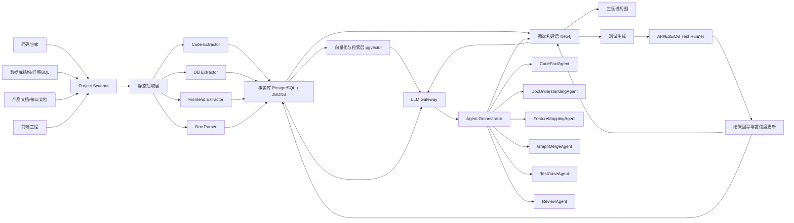
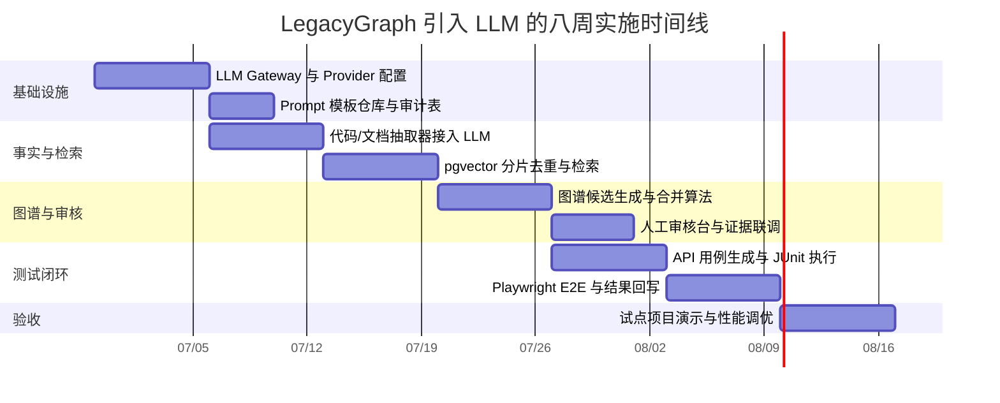
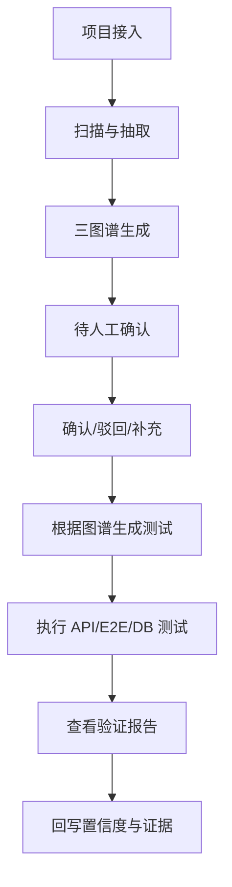
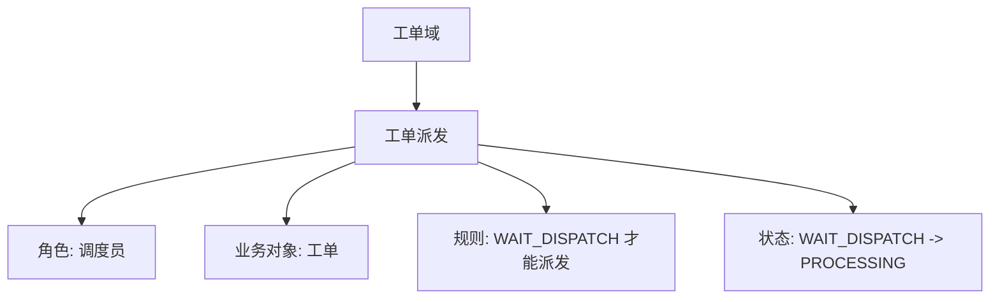
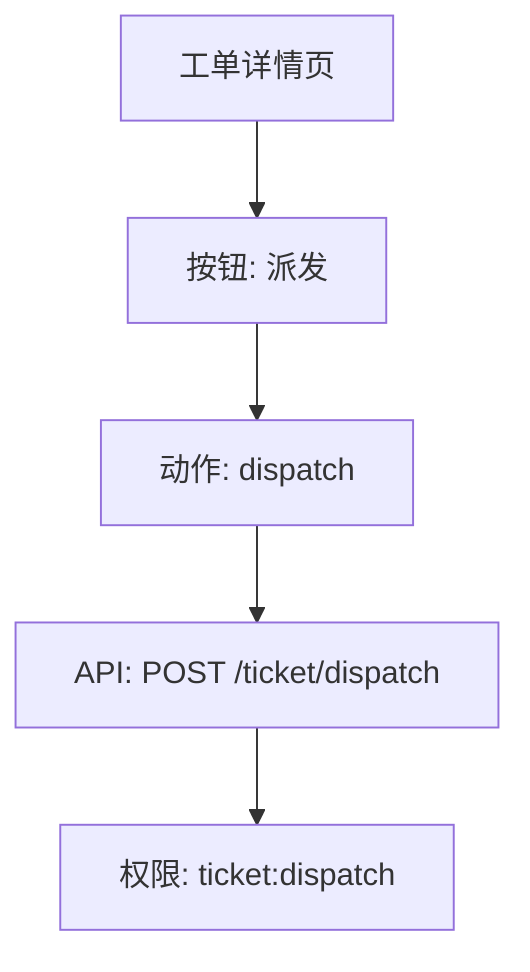
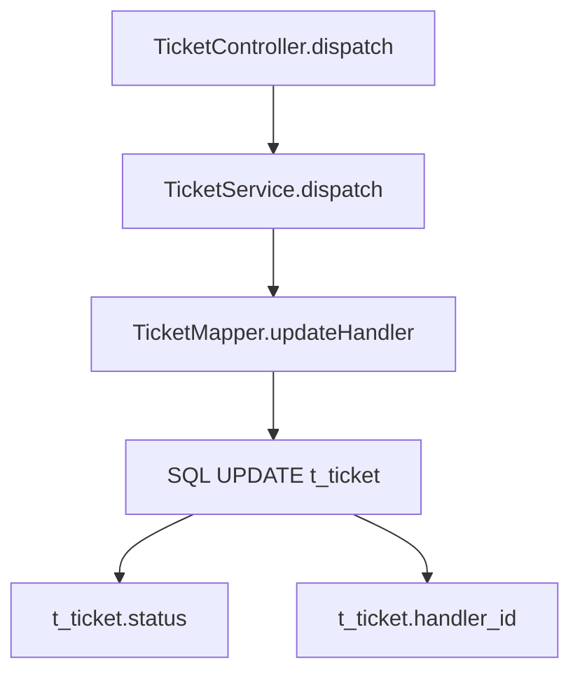

# LegacyGraph 引入 LLM 的可实施详细设计文档

## 执行摘要

本方案是在你现有 LegacyGraph 落地思路之上，把 LLM 从“辅助总结器”升级为“受控编排的语义层”，但仍坚持**静态分析给事实、LLM 做归纳与补全、自动测试负责反证**的原则。这样既能提升对老项目的理解深度，又能避免模型直接“猜业务”带来的图谱污染。fileciteturn0file0

设计上，推荐采用 **Spring Boot + Spring AI / LangGraph 编排 + PostgreSQL/pgvector + Neo4j + Vue/G6** 的双存储架构。Spring AI 当前官方提供多模型、Structured Outputs、向量数据库、工具调用与观测能力，LangGraph 官方则强调持久化、Human-in-the-loop、流式与长时状态工作流，非常适合“抽取—合并—审核—验证”的代理流水线。citeturn15view0turn15view1turn20view2turn13view0

在检索层，推荐将**事实库**与**向量库**分开治理：事实库落 PostgreSQL `jsonb`，向量存 `pgvector`，图谱存 Neo4j；这样既保留关系查询与审计能力，也能利用向量相似检索与图遍历共存。PostgreSQL 当前官方手册以 18 为 Current，`jsonb` 更适合高频处理并支持索引；`pgvector` 支持精确与近似近邻、余弦/内积/L2 等距离；Neo4j 官方案例强调向量索引与图查询联合使用。citeturn20view0turn4view5turn16view5turn20view3turn4view1

测试闭环不再是可选项，而是图谱可信度的核心来源。建议用 REST Assured + JUnit 做 API 校验，用 Playwright 做前端 E2E，用 Testcontainers 或测试环境做依赖隔离，结果回写图谱置信度。这样三张图谱是否“真的理解了项目”，最终由运行结果而不是模型自信心决定。citeturn4view3turn16view4turn16view2turn4view4

## 设计目标与核心原则

### 目标与价值

本次改造不是简单“把大模型接进来”，而是要把 LegacyGraph 从“图谱生成平台”增强为“**事实驱动、证据可追溯、测试可反证、人工可纠偏**”的老项目理解平台。你希望输出业务图谱、功能图谱、代码图谱，并据此自动生成测试、执行断言，再把验证结果回写到图谱。这个方向与已上传的《LLM 接入改造方案》中提出的多 Agent、Prompt 外置、证据链、缓存、审核闭环是一致的；本文将其细化为可编码、可部署、可验收的设计。fileciteturn0file0

对一个 Java Spring Boot + Vue + PostgreSQL 的遗留项目，这套体系的核心价值有四个。第一，降低“新人靠问老人、靠猜业务”的成本。第二，把代码、数据库、文档、页面和测试连接成同一张知识网络。第三，让后续重构、迁移、回归测试有稳定的依据。第四，通过证据和验证机制控制 LLM 幻觉，把模型能力用在语义理解而不是事实伪造。Spring AI 官方把这类问题表达为“把企业数据与 API 连接到 AI 模型”的工程问题，而非单纯聊天问题；这与本方案高度一致。citeturn15view0

### 核心原则

本方案坚持五条原则。

其一，**代码事实优先于模型解释**。Controller、Service、SQL、表结构、前端调用、接口定义等都应先由静态解析器与元数据抽取器产出；LLM 只在“命名归一、业务解释、缺失映射、低置信关系补全”中发挥作用。CodeQL 官方支持 Java、Kotlin、JavaScript、TypeScript 等多语言分析，Semgrep 官方支持 Java、JavaScript、TypeScript 的跨文件分析，JavaParser 与 Spoon 则提供 Java AST 与源码分析能力；这类工具应构成事实层的第一道来源。citeturn18view0turn19view1turn19view2turn19view3turn19view4

其二，**所有 LLM 输出必须结构化**。推荐统一要求模型以 JSON Schema 输出，而不是自然语言自由发挥。OpenAI 官方 Structured Outputs 明确支持按提供的 JSON Schema 约束输出，并建议优先于传统 JSON mode；Spring AI 官方也把 Structured Output 作为一等能力。citeturn11view2turn11view3turn15view0turn15view1

其三，**所有节点和关系都必须可追溯证据**。证据至少要回到文件、行号、表、SQL、页面、接口或测试结果。PostgreSQL 的 `jsonb` 适合存放这类半结构化证据与属性，而 `jsonb` 配合 GIN 索引适合做证据过滤、路径检索和全文辅助约束。citeturn4view5turn16view5

其四，**图谱置信度必须由多源证据与运行验证共同决定**。名称相似、向量相似、邻居结构相似都只是候选；真正让边从“可能存在”升级为“可信存在”的，是接口测试、数据库断言、E2E 行为和人工审核。

其五，**安全默认开启**。源代码、SQL、配置文件、账号、连接串、手机号、身份证号、邮箱、工号等应在进入外部模型前脱敏；敏感项目允许采用“本地模型看全量源码，云模型只看脱敏摘要”的双通道模式。Spring Security 提供认证、授权与常见攻击防护，PostgreSQL Row-Level Security 可把事实与审核数据按项目、租户、角色做行级隔离。citeturn9view2turn8view0

## 总体架构与组件设计

### 总体架构

当前官方站点可见 Spring Boot 文档版本为 4.1.0，Spring AI 为 2.0.0，Spring Security 为 7.1.0，PostgreSQL Current 手册为 18；本文不强绑定小版本，但设计会尽量贴近这些官方能力边界。前端建议继续采用 Vue 3 生态，G6 官网将其定位为“专注关系数据的图可视化引擎”，适合作为三图谱画布层。citeturn2view1turn15view0turn9view2turn20view0turn14view1turn14view0



这张组件图的关键，不是把 LLM 放在最前面，而是把它放在**事实库、向量检索与图谱构建之间**。LangGraph 官方强调它面向长运行、状态化、持久化、可中断的人机协同代理流程；在这里，它最适合承担“任务路由、状态保存、人工审核插入点、失败恢复”的职责。citeturn13view0

### 组件职责

`LLM Gateway` 负责模型路由、缓存、重试、配额、脱敏、审计和 Structured Output 校验。`Agent Orchestrator` 负责任务状态机。`事实库`存经过静态分析或 LLM 结构化输出后的事实。`向量层`负责语义召回。`Neo4j` 负责统一知识图谱与三张视图。`Test Runner` 负责基于图谱自动执行验证。Spring AI 官方文档明确覆盖模型提供方、Structured Outputs、工具调用、RAG、向量数据库与可观测性，适合在 Java 后端中承担模型适配层；Neo4j 官方则说明向量索引可以为节点或关系上的 embedding 属性建立索引，并建议显式设置向量维度与相似度函数。citeturn15view0turn15view1turn4view1

### 模型与工具推荐

生成模型建议采用“双轨制”。

在**开源/私有化轨**，优先推荐 Qwen3 与 GLM-4。Qwen3 官方仓库说明其支持 dense 与 MoE 多尺寸、思考/非思考双模式、工具能力，并支持 100+ 语言与方言；GLM-4 官方仓库将其定位为开源多语言多模态对话模型，同时保留商业服务入口。二者都适合中文主场景、企业私有部署或混合部署。citeturn7view0turn11view5turn10view4turn11view6

在**云上高质量轨**，可引入 OpenAI GPT-5.5 作为复杂推理与代码理解模型，GPT-5.4 或更小型号用于低延迟批处理。OpenAI 官方模型页建议在复杂推理与编码场景使用 GPT-5.5，并给出了输入/输出价格、上下文窗口和工具能力；这使得“复杂任务用强模型，批量任务用便宜模型”的路由策略有明确依据。citeturn11view4

向量与本地服务方面，生产私有化推荐 vLLM 作为推理服务层。vLLM 官方强调其是面向 LLM 推理与服务的快速易用库，并支持连续批处理、前缀缓存与量化，适合作为本地开源模型的高吞吐服务端。citeturn9view3

## Agent 职责、输入输出与 Prompt 体系

### Agent 分工

建议把 Agent 拆成六类，而不是一个总控大提示词。

`CodeFactAgent` 负责理解方法业务语义、补全动态 SQL 分支、解释复杂调用链。  
`DocUnderstandingAgent` 负责从产品文档中抽取业务流程、角色、对象、规则和状态流转。  
`FeatureMappingAgent` 负责把页面、按钮、前端 API 调用、后端接口、权限点与业务动作对齐。  
`GraphMergeAgent` 负责节点去重、别名归一、边去噪、关系补全与置信度计算。  
`TestCaseAgent` 负责生成 API / E2E / DB 断言用例。  
`ReviewAgent` 负责输出人工审核摘要、支持证据、冲突证据与建议动作。  
这与已上传文档中“多层 Agent + 审核闭环”的方向一致，但这里进一步把 I/O 契约与库表落下来。fileciteturn0file0

### Agent 输入输出规范

LLM 统一采用 `JSON Schema + strict` 输出。OpenAI Structured Outputs 官方明确表示该能力会让模型输出遵循你提供的 JSON Schema；Spring AI 也支持将模型输出映射到 POJO。对 Java 后端来说，这意味着可以直接把 Agent 输出落成 DTO，再进入校验、入库和图谱构建过程。citeturn11view2turn11view3turn15view0

下面给出三个关键 JSON Schema。

#### `FactExtractionResult` Schema

```json
{
  "$schema": "https://json-schema.org/draft/2020-12/schema",
  "title": "FactExtractionResult",
  "type": "object",
  "required": ["factType", "projectId", "items"],
  "properties": {
    "factType": {
      "type": "string",
      "enum": [
        "API_ENDPOINT",
        "SERVICE_METHOD",
        "SQL_STATEMENT",
        "TABLE_SCHEMA",
        "PAGE_ACTION",
        "BUSINESS_PROCESS"
      ]
    },
    "projectId": { "type": "string" },
    "items": {
      "type": "array",
      "items": {
        "type": "object",
        "required": ["key", "name", "evidence", "confidence"],
        "properties": {
          "key": { "type": "string" },
          "name": { "type": "string" },
          "attributes": { "type": "object", "additionalProperties": true },
          "evidence": {
            "type": "array",
            "items": {
              "type": "object",
              "required": ["sourceType", "sourceUri"],
              "properties": {
                "sourceType": { "type": "string" },
                "sourceUri": { "type": "string" },
                "lineStart": { "type": "integer" },
                "lineEnd": { "type": "integer" },
                "excerpt": { "type": "string" }
              }
            }
          },
          "confidence": { "type": "number", "minimum": 0, "maximum": 1 }
        }
      }
    }
  }
}
```

#### `GraphMergeDecision` Schema

```json
{
  "type": "object",
  "required": ["candidateA", "candidateB", "decision", "score"],
  "properties": {
    "candidateA": { "type": "string" },
    "candidateB": { "type": "string" },
    "decision": {
      "type": "string",
      "enum": ["AUTO_MERGE", "REVIEW", "REJECT"]
    },
    "score": { "type": "number", "minimum": 0, "maximum": 1 },
    "reasons": {
      "type": "array",
      "items": { "type": "string" }
    },
    "positiveEvidenceIds": {
      "type": "array",
      "items": { "type": "string" }
    },
    "negativeEvidenceIds": {
      "type": "array",
      "items": { "type": "string" }
    }
  }
}
```

#### `GeneratedTestCase` Schema

```json
{
  "type": "object",
  "required": ["featureKey", "caseName", "caseType", "steps", "assertions"],
  "properties": {
    "featureKey": { "type": "string" },
    "caseName": { "type": "string" },
    "caseType": {
      "type": "string",
      "enum": ["API", "E2E", "DB", "HYBRID"]
    },
    "preconditions": {
      "type": "array",
      "items": { "type": "string" }
    },
    "steps": {
      "type": "array",
      "items": { "type": "string" }
    },
    "request": { "type": "object", "additionalProperties": true },
    "assertions": {
      "type": "array",
      "items": {
        "type": "object",
        "required": ["type", "expression"],
        "properties": {
          "type": {
            "type": "string",
            "enum": ["HTTP", "JSON_PATH", "SQL", "STATE", "UI"]
          },
          "expression": { "type": "string" }
        }
      }
    },
    "needHumanInput": {
      "type": "array",
      "items": { "type": "string" }
    }
  }
}
```

### Prompt 模板设计

Prompt 必须版本化、场景化、可回放。推荐将 Prompt 拆成四层：`system`、`domain`、`task`、`output_schema`。已上传改造文档提出“Prompt 模板仓库、版本管理、示例层”，这里保留这一思路，并把它绑定到数据库表与运行日志中。fileciteturn0file0

#### 示例一：业务流程抽取模板

```text
[system]
你是企业级遗留系统业务分析师。
你只能根据输入证据输出结论。
不允许编造未被证据支持的流程。
输出必须严格符合 JSON Schema。

[domain]
项目领域：工单系统
标准术语：
- 派发 = 指定处理人并变更工单状态
- 调度员 = 拥有分派权限的角色

[task]
输入包括：产品文档片段、前端页面动作、后端接口定义、相关 SQL、表结构。
请抽取业务流程、参与角色、业务对象、规则与状态流转。
对每条结论附 evidence 引用。

[output_schema]
BusinessProcessExtractionResult
```

#### 示例二：功能映射模板

```text
[system]
你是功能映射专家。
你的任务是将页面、按钮、接口、权限和业务动作建立可追溯关系。

[task]
输入：
1. Vue 页面组件代码
2. axios/request 定义
3. Spring Controller 接口
4. 权限注解
5. 产品文档功能清单

输出：
- 已确认映射
- 可能映射
- 未匹配项
- 每条关系的证据、置信度、冲突点
```

#### 示例三：测试用例生成模板

```text
[system]
你是测试架构师。
你必须同时生成操作步骤、接口断言、数据库断言与状态断言。
不确定的数据请显式标记 needHumanInput。

[task]
输入：
- 功能节点：工单派发
- API：POST /ticket/dispatch
- 请求参数与 DTO
- 相关写表：t_ticket
- 规则：只有 WAIT_DISPATCH 才能派发；成功后应变更为 PROCESSING

输出：
- 正常场景
- 权限场景
- 状态非法场景
- 数据不存在场景
- 并发重试场景
```

## 检索、事实库与图谱算法

### 向量检索与 Embedding 策略

Embedding 的目标不是替代事实，而是为**召回候选证据与候选实体**服务。OpenAI 官方 Embeddings 文档说明，embedding 是浮点向量，向量距离衡量文本相关性；其最新模型 `text-embedding-3-small` 与 `text-embedding-3-large` 支持更高多语言能力，并允许通过 `dimensions` 参数缩短向量维度。`text-embedding-3-small` 默认 1536 维，`text-embedding-3-large` 默认 3072 维。citeturn21view3turn11view1turn11view0

因此推荐以下策略。

在线召回层，使用一个**小向量、低成本、高吞吐**模型，例如 `text-embedding-3-small` 并把向量压缩到 512 或 768 维。OpenAI 官方示例说明 `dimensions` 可用于减少维度，同时维持较好的表征能力；对大多数代码/文档召回任务，512～768 已足够。citeturn21view3

离线高质量重建层，使用**大向量**进行一次性离线重算，例如 `text-embedding-3-large` 保留 1024 或更高维度，用于大项目重建、疑难合并与跨文档概念对齐。OpenAI 文档给出 `text-embedding-3-large` 在 MTEB 上高于 small 的示例性能，并指出向量越大，成本、存储与计算也越高。citeturn21view3

若项目对源码隐私要求高，则本地化方案可采用开源模型 + vLLM 服务。Qwen3 官方支持 Agent 与多语言，GLM-4 官方有开源与商业双入口，vLLM 官方强调其适用于高吞吐推理与服务；因此“本地开源生成模型 + 私有 embedding + 云上强模型仅做审核/兜底”是合理的企业落地路径。citeturn11view5turn11view6turn9view3

### 分片、去重与存储

代码分片应按**结构边界**，而不是按字数硬切。建议类级摘要、方法级主体、SQL 语句块、配置块分别成 chunk；每块 300–800 tokens，重叠 50–100 tokens。文档分片按标题层级、表格、流程步骤切分；数据库元数据按“表 + 字段 + 约束 + 注释”整体成块。这样做可以让向量内容更符合语义边界，也更利于证据回溯。

去重分两层。第一层是**精确去重**：对规范化内容做 SHA-256。第二层是**近似去重**：同项目、同类型 chunk 若 embedding cosine > 0.995 且正文字数差异小于 3%，则判为重复候选。对日志、编译输出、自动生成代码要设强过滤白名单。

存储建议采用 PostgreSQL + `pgvector`。`pgvector` 官方说明它支持精确与近似近邻搜索、支持 L2/inner product/cosine/L1 等距离，并可以与 PostgreSQL 原有 ACID、JOIN、PITR 等能力共同使用，这非常适合“向量 + 事务事实”的组合场景。citeturn20view3

下面给出向量表结构示例。由于 PostgreSQL `jsonb` 更适合高频查询与索引，元数据建议用 `jsonb` 存储。citeturn4view5turn16view5

```sql
create extension if not exists vector;

create table lg_vector_document (
    id bigserial primary key,
    project_id bigint not null,
    chunk_type varchar(50) not null,      -- code/doc/db/ui
    source_uri text not null,
    source_hash char(64) not null,
    chunk_index int not null,
    content text not null,
    content_sha256 char(64) not null,
    meta jsonb not null default '{}'::jsonb,
    embedding vector(768),
    embedding_model varchar(100) not null,
    embedding_dim int not null,
    created_at timestamp not null default now()
);

create index idx_lg_vector_document_project_type
    on lg_vector_document(project_id, chunk_type);

create index idx_lg_vector_document_meta_gin
    on lg_vector_document using gin(meta);

-- 近似检索索引名称可按实际 provider 和运维策略创建
```

### 事实库设计

事实库是“LLM 之外的真相底座”。建议新增以下表，并对已有 `lg_fact`、`lg_graph_node`、`lg_graph_edge` 做增强。

```sql
create table lg_prompt_template (
    id bigserial primary key,
    template_code varchar(100) not null unique,
    version varchar(30) not null,
    scene varchar(50) not null,          -- code/doc/merge/test/review
    system_prompt text not null,
    domain_prompt text,
    task_prompt text not null,
    output_schema jsonb not null,
    is_active boolean not null default true,
    created_at timestamp not null default now()
);

create table lg_llm_provider (
    id bigserial primary key,
    provider_code varchar(50) not null unique, -- openai/qwen/glm/local
    model_id varchar(100) not null,
    endpoint text,
    deployment_mode varchar(20) not null,      -- cloud/private/hybrid
    api_config jsonb not null default '{}'::jsonb,
    created_at timestamp not null default now()
);

create table lg_prompt_run (
    id bigserial primary key,
    project_id bigint not null,
    task_type varchar(50) not null,
    provider_code varchar(50) not null,
    model_id varchar(100) not null,
    template_code varchar(100) not null,
    template_version varchar(30) not null,
    input_hash char(64) not null,
    masked_input jsonb not null,
    raw_output jsonb,
    parsed_output jsonb,
    prompt_tokens int,
    completion_tokens int,
    latency_ms int,
    status varchar(20) not null,              -- success/failed/review
    created_by varchar(100),
    created_at timestamp not null default now()
);

create table lg_evidence (
    id bigserial primary key,
    project_id bigint not null,
    evidence_type varchar(50) not null,       -- code/sql/doc/ui/test
    source_uri text not null,
    line_start int,
    line_end int,
    excerpt text,
    source_hash char(64),
    ast_path text,
    sql_hash char(64),
    chunk_id bigint,
    meta jsonb not null default '{}'::jsonb,
    created_at timestamp not null default now()
);

alter table lg_fact
    add column if not exists evidence_ids jsonb not null default '[]'::jsonb,
    add column if not exists extractor_name varchar(100),
    add column if not exists extractor_version varchar(30),
    add column if not exists prompt_run_id bigint,
    add column if not exists pii_masked boolean not null default false,
    add column if not exists review_status varchar(20) default 'pending',
    add column if not exists verified_by_test boolean not null default false;

alter table lg_graph_node
    add column if not exists alias_names jsonb not null default '[]'::jsonb,
    add column if not exists evidence_ids jsonb not null default '[]'::jsonb,
    add column if not exists semantic_vector_ref bigint,
    add column if not exists verified_score numeric(5,4) default 0;

alter table lg_graph_edge
    add column if not exists evidence_ids jsonb not null default '[]'::jsonb,
    add column if not exists relation_status varchar(20) default 'candidate',
    add column if not exists verified_score numeric(5,4) default 0;
```

### 图谱模型与 Cypher 示例

Neo4j 中建议的核心节点类型包括：`Project`、`BusinessProcess`、`Feature`、`Page`、`Button`、`ApiEndpoint`、`Controller`、`Service`、`SqlStatement`、`Table`、`Column`、`TestCase`、`Evidence`。Neo4j 官方向量索引支持在节点或关系上对单一向量属性建立索引，且推荐显式设置维度与相似度函数；文本 embedding 一般优先余弦。citeturn4view1

```cypher
CREATE (p:Project {key:'legacy-ticket'})
CREATE (bp:BusinessProcess {key:'bp.ticket.dispatch', name:'工单派发'})
CREATE (f:Feature {key:'feature.ticket.dispatch', name:'工单派发'})
CREATE (page:Page {key:'page.ticket.detail', name:'工单详情'})
CREATE (api:ApiEndpoint {key:'POST /ticket/dispatch', method:'POST', path:'/ticket/dispatch'})
CREATE (svc:Service {key:'TicketService.dispatch'})
CREATE (sql:SqlStatement {key:'TicketMapper.updateHandler'})
CREATE (t:Table {key:'t_ticket', name:'t_ticket'})
CREATE (tc:TestCase {key:'tc.ticket.dispatch.success', name:'工单派发成功'})
CREATE (ev:Evidence {key:'ev.controller.42-56', sourceUri:'backend/.../TicketController.java', lineStart:42, lineEnd:56})

CREATE (p)-[:CONTAINS]->(bp)
CREATE (bp)-[:IMPLEMENTED_BY]->(f)
CREATE (f)-[:EXPOSED_BY]->(page)
CREATE (page)-[:CALLS]->(api)
CREATE (api)-[:CALLS]->(svc)
CREATE (svc)-[:EXECUTES]->(sql)
CREATE (sql)-[:WRITES]->(t)
CREATE (f)-[:VERIFIED_BY]->(tc)
CREATE (api)-[:HAS_EVIDENCE]->(ev);
```

### 图谱合并与置信度计算

图谱合并不要做“一步到位”的模糊匹配。建议采用三阶段算法。

第一阶段，**候选生成**。  
按 `node_type + project_id` 分桶；再用规范化名称、别名、路径、主键字段、接口 path、页面文件名做 blocking；同时结合向量 ANN 检索召回 Top-K 候选。

第二阶段，**特征打分**。  
对每对候选计算五类特征：

- `name_score`：名称与别名相似度  
- `semantic_score`：向量余弦  
- `struct_score`：字段/参数/属性重叠度  
- `neighbor_score`：邻居关系相似度  
- `evidence_score`：证据来源数量、独立性与质量

第三阶段，**决策与审核**。  
`score >= 0.92` 自动合并；`0.75 <= score < 0.92` 进入人工审核；低于 `0.75` 不合并。

可实施的边置信度公式如下：

```text
evidence_weight(e) =
  source_weight(e.source_type)
  * extractor_weight(e.extractor)
  * quality_weight(e)
  * independence_weight(e)

support = 1 - Π(1 - evidence_weight(e_i))
conflict = 1 - Π(1 - evidence_weight(c_j))

final_confidence =
  clamp(
    0, 1,
    0.50 * support +
    0.15 * semantic_score +
    0.15 * struct_score +
    0.10 * neighbor_score +
    0.05 * runtime_verified +
    0.05 * human_review -
    0.35 * conflict
  )
```

建议初始权重如下：

| 证据来源 | source_weight |
|---|---:|
| 编译可解析代码/Ast | 0.95 |
| SQL/数据库元数据 | 0.95 |
| 前端静态调用 | 0.90 |
| OpenAPI/Swagger | 0.90 |
| 产品文档正文 | 0.75 |
| 页面文案/按钮名称 | 0.65 |
| LLM 语义推断 | 0.55 |
| 运行测试通过 | runtime_verified = 1 |
| 人工审核通过 | human_review = 1 |

合并伪代码如下：

```python
def merge_candidate(a, b):
    name_score = sim_name(a, b)
    semantic_score = cosine(a.embedding, b.embedding)
    struct_score = overlap(a.attributes, b.attributes)
    neighbor_score = graph_neighbor_similarity(a, b)
    evidence_score = evidence_overlap(a.evidence_ids, b.evidence_ids)

    score = (
        0.30 * name_score +
        0.25 * semantic_score +
        0.20 * struct_score +
        0.15 * neighbor_score +
        0.10 * evidence_score
    )

    if score >= 0.92:
        return "AUTO_MERGE", score
    elif score >= 0.75:
        return "REVIEW", score
    else:
        return "REJECT", score
```

## 测试闭环、安全治理与关键接口

### 自动测试闭环

测试闭环建议拆成四步：生成、执行、断言、回写。

生成阶段，从**已确认或高置信功能节点**出发，沿 `Feature -> Page -> API -> Service -> SQL -> Table` 链路生成测试模板；再结合业务规则补全正常、异常、权限、边界、幂等和并发场景。

执行阶段，API 测试建议采用 REST Assured；JUnit 负责测试组织、标签与执行；E2E 采用 Playwright；依赖数据库、缓存、中间件建议优先在现成测试环境中运行，若需隔离环境则用 Testcontainers。REST Assured 官网强调其目标是把 Java 中 REST 测试写得更简单；Playwright 官方强调其自带 runner、assertions、isolation、parallelization 和 rich tooling；Testcontainers 官方强调它提供临时、轻量的数据库和其他依赖容器。citeturn4view3turn16view2turn16view4turn4view4

断言阶段应同时覆盖四类断言：

- HTTP 断言：状态码、响应码、JSON Path  
- DB 断言：写表行数变化、字段变化、状态变化  
- 状态断言：业务状态流转是否符合规则  
- UI 断言：按钮可见性、流程跳转、提示文案

结果回写阶段应遵循固定规则：

```text
测试 PASS：
  edge.verified_score += 0.10
  node.verified_score += 0.05
  relation_status = 'verified' if final_confidence >= 0.85

测试 FAIL：
  edge.verified_score -= 0.20
  relation_status = 'review'
  创建 review_task，附失败请求、响应、SQL 快照、截图/trace
```

### “工单派发”测试用例示例

```json
{
  "featureKey": "feature.ticket.dispatch",
  "caseName": "工单派发成功",
  "caseType": "HYBRID",
  "preconditions": [
    "插入一条 status=WAIT_DISPATCH 的工单",
    "准备有效 handlerId"
  ],
  "steps": [
    "打开工单详情页",
    "点击派发按钮",
    "选择处理人并确认",
    "触发 POST /ticket/dispatch"
  ],
  "request": {
    "ticketId": "${ticketId}",
    "handlerId": "${handlerId}"
  },
  "assertions": [
    {"type":"HTTP","expression":"status == 200"},
    {"type":"JSON_PATH","expression":"$.code == 0"},
    {"type":"SQL","expression":"select status from t_ticket where id=${ticketId} == 'PROCESSING'"},
    {"type":"SQL","expression":"select handler_id from t_ticket where id=${ticketId} == ${handlerId}"}
  ]
}
```

### 安全与隐私

安全治理建议同时覆盖“输入前、调用中、落库后”三个阶段。

输入前，做源码与文档脱敏。规则包括密钥、token、数据库连接串、手机号、邮箱、身份证、银行卡、工号与 IP 白名单。对于 classpath 配置和 YAML，优先用规则引擎预脱敏，避免把原始凭据送进模型。

调用中，采用 RBAC + 项目级隔离。Spring Security 官方提供认证、授权和常见攻击防护；PostgreSQL RLS 可把 `project_id`、`tenant_id`、`owner` 等放到策略表达式中，默认 deny 未授权数据行。citeturn9view2turn8view0

落库后，要保存 Prompt Run 审计轨迹，但只保存**脱敏输入**与**结构化输出**，不默认保存外部模型明文上下文。必要时开启 `raw_output` 加密列，且只允许审计管理员访问。

推荐权限模型如下：

| 角色 | 权限范围 |
|---|---|
| `PROJECT_ADMIN` | 项目接入、Provider 配置、发布图谱 |
| `ANALYST` | 查看图谱、发起扫描、人工审核 |
| `TEST_ENGINEER` | 生成与执行测试、查看回写 |
| `AUDITOR` | 查看 Prompt Run、审计日志、脱敏策略 |
| `VIEWER` | 只读查询与图谱浏览 |

### 关键 API 列表

| 方法 | 接口 | 用途 | 关键输入 | 关键输出 |
|---|---|---|---|---|
| POST | `/api/projects/import` | 导入项目清单 | `projectManifest` | `projectId` |
| POST | `/api/scan-jobs` | 发起扫描任务 | `projectId`,`scanScope` | `jobId` |
| GET | `/api/scan-jobs/{jobId}` | 查询扫描状态 | path `jobId` | 进度、错误 |
| POST | `/api/extract/facts/code` | 代码事实抽取 | 文件引用/路径 | `FactExtractionResult` |
| POST | `/api/extract/facts/doc` | 文档事实抽取 | chunk 列表 | `FactExtractionResult` |
| POST | `/api/vector/upsert` | 写入向量分片 | chunk + embedding | `vectorIds` |
| POST | `/api/retrieval/search` | 语义检索 | query, filters | 证据候选 |
| POST | `/api/agents/run` | 运行指定 Agent | `agentType`,`inputRef` | `promptRunId`,`parsedOutput` |
| POST | `/api/graph/merge` | 图谱候选合并 | node ids | `GraphMergeDecision` |
| POST | `/api/review/decisions` | 人工审核提交 | 审核动作 + 理由 | 更新后的 confidence |
| POST | `/api/tests/generate` | 根据功能/流程生成用例 | `featureKey` | `GeneratedTestCase[]` |
| POST | `/api/tests/execute` | 执行测试 | `testCaseIds` | `executionId` |
| POST | `/api/tests/results/callback` | 回写执行结果 | 报告、断言结果 | 更新的节点/边 |
| GET | `/api/graph/views/{type}` | 查询三图谱视图 | `business/feature/code` | 图数据 |
| GET | `/api/evidence/{id}` | 查看证据详情 | `evidenceId` | 文件、片段、行号 |

### 运维与监控

Prometheus 官方说明其以时间序列采集与存储指标，Grafana OSS 官方说明其可对 metrics、logs、traces 做查询、可视化与告警；因此推荐以 `Micrometer -> Prometheus -> Grafana` 作为默认监控链。citeturn9view0turn9view1

关键指标建议覆盖：

| 指标 | 目标 |
|---|---|
| `lg_prompt_run_success_rate` | > 99% |
| `lg_prompt_run_p95_latency_ms` | 交互查询 < 3000ms |
| `lg_vector_search_p95_ms` | < 200ms |
| `lg_graph_merge_auto_accept_rate` | 30%–60% |
| `lg_review_backlog_count` | 可控，不连续两周上升 |
| `lg_test_generated_count` | 每日/每项目统计 |
| `lg_test_pass_rate` | 用于反映图谱可信度 |
| `lg_provider_token_input_total` | 按 provider/model/project 统计 |
| `lg_provider_cost_estimated_usd` | 每日/月预算 |
| `lg_pii_mask_hit_rate` | 脱敏命中率 |

告警建议包括：

- 连续 5 分钟 LLM 成功率 < 95%
- 任一 provider 平均延迟上涨 3 倍
- 单项目 token 消耗超预算阈值
- 图谱验证失败率单日超阈值
- 审核积压超过 SLA
- embedding 写入失败率高于 1%

回滚策略分三层：

- Prompt 回滚：模板版本切回上一个稳定版本  
- 图谱回滚：对节点/边采用版本快照与软删除  
- Provider 回滚：从云模型切回本地模型或从强模型切回便宜模型

## 落地步骤、前端交互与完整示例

### 分周里程碑与验收标准

| 周次 | 主题 | 交付物 | 验收标准 |
|---|---|---|---|
| 第 1 周 | LLM 基础设施 | `LLM Gateway`、Provider 配置、Prompt 表、Prompt Run 审计表 | 能完成一次结构化输出调用并落库 |
| 第 2 周 | 事实层增强 | 代码/文档抽取器接入 LLM；`lg_evidence` 落地 | 能输出带证据的 API/SQL/业务流程 JSON |
| 第 3 周 | 检索层与向量库 | `pgvector` 表、chunker、去重器、向量检索 API | 支持 query -> evidence topK |
| 第 4 周 | 图谱合并 | 候选生成、合并算法、人工审核页 | 可自动合并一部分节点，剩余进入 review |
| 第 5 周 | 测试生成 | 用例生成 API、JUnit/REST Assured 执行器 | 能从功能节点生成并执行 API 用例 |
| 第 6 周 | E2E 与回写 | Playwright、结果回写、置信度更新 | 至少一个完整场景实现 PASS/FAIL 回写 |
| 第 7 周 | 前端整合 | 三图谱页、证据抽屉、审核页、报告页 | 用户能浏览、审核、执行、回看 |
| 第 8 周 | 试点验收 | “工单派发”端到端演示、文档与运维面板 | 完成试点项目验收 |

时间线建议如下：



### 性能与成本估算

交互查询建议分成“同步查询”和“异步构建”两类。同步查询包括图谱问答、证据检索、节点详情，不应触发大规模重建；目标是 P95 小于 3 秒。异步构建包括批量抽取、重算 embedding、图谱合并、批量测试，由作业队列执行。

成本上建议使用**分层模型路由**：

- 高频批量抽取：GPT-5.4 / 本地开源模型
- 复杂歧义合并、难例审核：GPT-5.5
- embedding：`text-embedding-3-small` 默认，小部分疑难数据离线切 `large`

OpenAI 官方给出 GPT-5.5 输入 $5 / 百万 token、输出 $30 / 百万 token；GPT-5.4 输入 $2.5 / 百万 token、输出 $15 / 百万 token。Embedding 官方示例给出，在按约 800 tokens/页估算时，`text-embedding-3-small` 约 62,500 页/美元、`text-embedding-3-large` 约 9,615 页/美元；换算下来 small 约等于 **5,000 万 tokens / 美元**，即约 **$0.02 / 百万 token**，large 约为 **769.2 万 tokens / 美元**，即约 **$0.13 / 百万 token**。这里的 embedding 单价是根据官方“pages per dollar”示例换算得到的工程估算值。citeturn11view4turn21view3turn22calculator0turn22calculator1turn22calculator2turn22calculator3

若以单项目首轮重建为例，假设：

- 1,200 次批量抽取调用，平均每次 2,000 输入 tokens、500 输出 tokens，走 GPT-5.4
- 200 次复杂合并/审核调用，平均每次 5,000 输入 tokens、1,000 输出 tokens，走 GPT-5.5
- embedding 总量 2,000 万 tokens，走 `text-embedding-3-small`

则估算成本约为 **US$26.4 / 项目首轮**。这是基于上述官方价格与换算示例的工程推算，不含自建 GPU、人力与测试环境成本。citeturn11view4turn21view3turn23calculator0

### 前端交互设计要点

前端建议延续 Vue 3；Vue 中文官网将其定位为“渐进式 JavaScript 框架”，适合在现有系统中分步接入。图谱画布层建议使用 G6，G6 官网将其定位为专注关系数据的图可视化引擎。citeturn14view1turn14view0

核心交互流程如下：



页面建议包含：

| 页面 | 关键能力 |
|---|---|
| 项目总览 | 任务状态、图谱概览、Provider 消耗 |
| 业务图谱页 | 业务域、流程、规则、角色、状态流转 |
| 功能图谱页 | 菜单、页面、按钮、接口、权限 |
| 代码图谱页 | Controller、Service、SQL、表、字段 |
| 证据抽屉 | 文件片段、SQL、文档段落、测试报告 |
| 人工审核页 | 候选合并、冲突证据、批准/驳回 |
| 测试中心 | 用例列表、执行记录、失败原因 |
| 验证报告页 | 整体置信度变化、失败热点、最近回写 |

G6 数据示例如下：

```javascript
const graphData = {
  nodes: [
    { id: 'bp.ticket.dispatch', label: '工单派发', type: 'process' },
    { id: 'feature.ticket.dispatch', label: '派发功能', type: 'feature' },
    { id: 'api.dispatch', label: 'POST /ticket/dispatch', type: 'api' },
    { id: 'table.ticket', label: 't_ticket', type: 'table' }
  ],
  edges: [
    { source: 'bp.ticket.dispatch', target: 'feature.ticket.dispatch', label: 'IMPLEMENTED_BY' },
    { source: 'feature.ticket.dispatch', target: 'api.dispatch', label: 'CALLS' },
    { source: 'api.dispatch', target: 'table.ticket', label: 'WRITES' }
  ]
}
```

### 风险与缓解

| 风险 | 表现 | 缓解 |
|---|---|---|
| LLM 幻觉污染事实 | 生成不存在的流程、关系 | 结构化输出、证据强制、低置信审核、测试反证 |
| 代码隐私泄露 | 配置与凭据进入外部模型 | 预脱敏、本地优先、摘要出境、Provider 白名单 |
| 图谱合并过度 | 不同功能被合并成一个节点 | 阈值分层、结构特征、人工审核、回滚 |
| 成本失控 | 批量构建 token 爆涨 | 小模型批量、大模型难例、缓存、预算告警 |
| 召回不足 | 文档与代码对不上 | 双向检索、chunk 优化、别名词典、人工补标 |
| 测试环境不稳定 | 结果回写波动大 | 稳定测试数据、幂等回放、隔离环境/容器 |

### 示例用例

以下以“工单派发”为例，给出从代码、前端、数据库、文档到三图谱、测试用例、执行结果回写的完整流程。

#### 事实输入

后端控制器证据：

```java
@PostMapping("/ticket/dispatch")
public Result dispatch(@RequestBody DispatchReq req) {
    return ticketService.dispatch(req);
}
```

前端页面证据：

```vue
<el-button @click="dispatch">派发</el-button>
```

前端 API 证据：

```js
export function dispatchTicket(data) {
  return request({
    url: '/ticket/dispatch',
    method: 'post',
    data
  })
}
```

SQL 证据：

```sql
update t_ticket
set handler_id = #{handlerId},
    status = 'PROCESSING'
where id = #{ticketId}
  and status = 'WAIT_DISPATCH';
```

文档证据：

```text
只有待派发状态的工单可以派发；派发后状态变为处理中，并通知处理人。
```

#### 三图谱产出

业务图谱：



功能图谱：



代码图谱：



#### 图谱回写与验证结果

当“工单派发成功”用例执行通过后，系统生成如下回写事件：

```json
{
  "projectId": "legacy-ticket",
  "featureKey": "feature.ticket.dispatch",
  "testCaseKey": "tc.ticket.dispatch.success",
  "result": "PASS",
  "verifiedRelations": [
    "Page(page.ticket.detail)-[:CALLS]->ApiEndpoint(POST /ticket/dispatch)",
    "ApiEndpoint(POST /ticket/dispatch)-[:EXECUTES]->SqlStatement(TicketMapper.updateHandler)",
    "SqlStatement(TicketMapper.updateHandler)-[:WRITES]->Table(t_ticket)"
  ],
  "dbAssert": [
    "t_ticket.status = PROCESSING",
    "t_ticket.handler_id = ${handlerId}"
  ],
  "confidenceUpdate": {
    "before": 0.84,
    "after": 0.94
  }
}
```

若失败，则不仅降低边置信度，还要挂起对应业务规则。例如若接口返回成功，但数据库状态未变，则说明可能存在事务、分支 SQL、异步事件、触发器、副本延迟或错误断言，需要进入 Review 队列。

### 最终推荐技术栈

| 层 | 推荐 |
|---|---|
| Java 后端 | Spring Boot + Spring AI + Spring Security |
| Agent 编排 | LangGraph |
| 事实库 | PostgreSQL 18 + `jsonb` + GIN |
| 向量库 | `pgvector` |
| 图谱库 | Neo4j |
| 静态分析 | JavaParser / Spoon / CodeQL / Semgrep / SQLGlot |
| 模型服务 | OpenAI / Qwen3 / GLM-4 / vLLM |
| 测试 | JUnit + REST Assured + Playwright + Testcontainers |
| 前端 | Vue 3 + G6 |
| 观测 | Prometheus + Grafana |

这一组合的原因是：Spring AI 已经把多模型、Structured Outputs、向量库、工具调用和观测整合进 Java 应用层；LangGraph 适合持久化与人机协同代理流程；PostgreSQL `jsonb`、GIN 与 `pgvector` 适合事实+向量一体化；Neo4j 适合显式关系图；Playwright、REST Assured、JUnit 与 Testcontainers 共同构成了从接口到前端到运行依赖的验证闭环。citeturn15view0turn15view1turn20view2turn13view0turn4view5turn16view5turn20view3turn4view1turn4view3turn16view2turn4view4turn14view1turn14view0

如果只给一个落地建议，那就是：**先把“结构化事实 + 证据追溯 + 测试回写”做对，再把 LLM 放进命名、映射、摘要和疑难合并；这样 LegacyGraph 才会越来越可信，而不是越来越会说。**