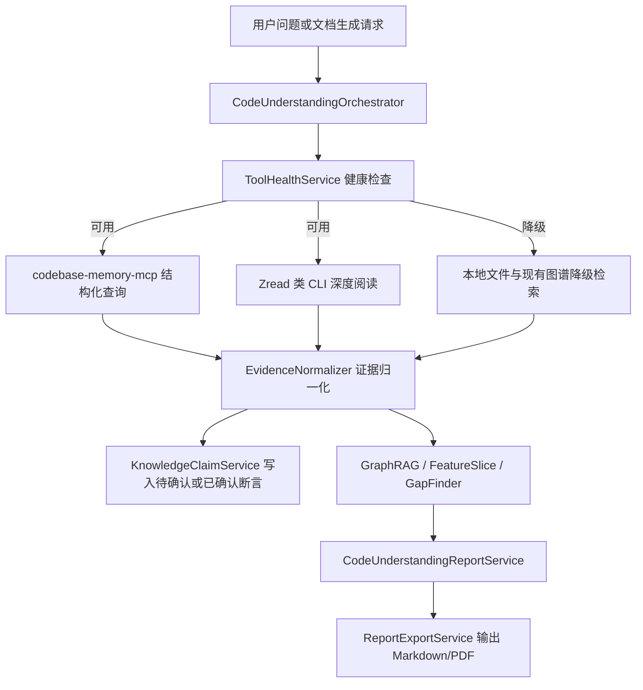
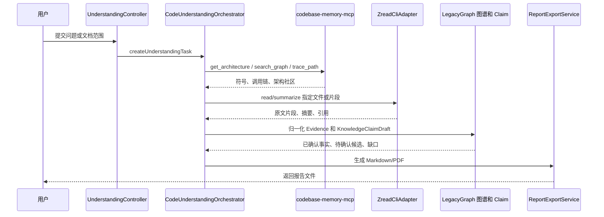

# codebase-memory-mcp 与 Zread 类工具辅助代码理解和文档生成方案

> 研究时间：2026-07-02  
> 适用范围：LegacyGraph 对代码、文档、数据库资料的理解、图谱增强、问答和报告生成链路  
> 关联文档：`doc/资料扫描到三类图谱构建流程与AI优化研究.md`

## 1. 结论

可以结合现有 `codebase-memory-mcp` 和 Zread CLI 这类工具，让系统更好地理解代码并输出文档，但它们不应该替代 LegacyGraph 已有的扫描和图谱构建主链路。更合理的定位是：

1. `codebase-memory-mcp` 作为“结构化代码图谱入口”，负责符号发现、调用链、架构社区、影响面、跨文件关系。
2. Zread 类 CLI 作为“长上下文阅读入口”，负责读取大文件、非索引文件、文档片段、代码上下文摘要和局部深读。
3. LegacyGraph 自身作为“证据归档和知识生产系统”，继续负责证据入库、KnowledgeClaim 状态管理、Feature Slice 合成、Gap 识别和报告导出。
4. AI Agent 负责规划、归纳、对齐术语、发现缺口、生成可读文档，但不能直接把推断结果写成已确认事实。

最佳效果不是“让 AI 多读一点代码”，而是建立一个可追溯的工具编排流程：



本次本地检查结论：

- `codebase-memory-mcp` 工具已能被发现，但实际调用 `list_projects` / `search_graph` 返回 `Transport closed`，需要在产品中加入健康检查和降级策略。
- `zread` / `Zread` 当前不在本机 `PATH` 中，不能假设已安装；应按“可选外部工具”接入，并通过适配器隔离命令、版本和输出格式差异。
- 当前仓库已有 `QaAgent`、`GraphRagPlannerAgent`、`FeatureSliceSynthesizer`、`KnowledgeClaimService`、`ReportExportService`，足以承接这类工具的结果。

## 2. 当前系统可复用基础

### 2.1 扫描主流程

现有扫描主链路已经覆盖代码、文档、数据库：

- `backend/src/main/java/io/github/legacygraph/task/ProjectScanner.java`
  - 负责扫描任务编排。
  - 通过 `scanAssetsWithAdapters` 调用 Adapter 体系。
  - 扫描后进入数据库扫描、图谱写入、AI 编排等阶段。
- `backend/src/main/java/io/github/legacygraph/extractors/adapter/ExtractionAdapterRegistry.java`
  - 管理多种资料抽取 Adapter。
  - 适合继续扩展为“外部理解工具 Adapter”的统一入口。
- `backend/src/main/java/io/github/legacygraph/task/AiScanOrchestrator.java`
  - 负责扫描后的 AI 任务串联。
  - 可以新增“代码理解报告生成”或“外部工具增强 Claim”阶段。

这说明 MCP 和 Zread 不需要重建扫描系统，而应作为新的证据源和理解工具接入。

### 2.2 知识断言与证据状态

`backend/src/main/java/io/github/legacygraph/service/KnowledgeClaimService.java` 已经明确了证据状态策略：

- AI 来源如 `DOC_AI`、`CODE_AI`、`AI_INFERENCE` 默认 `PENDING_CONFIRM`。
- `CODE`、`DB`、`RUNTIME`、`TEST` 且置信度足够高时，可以进入 `CONFIRMED`。
- 重复 upsert 时合并 `evidenceIds`，并取更高置信度。

因此外部工具接入后应区分两类结果：

| 外部工具结果 | 建议 sourceType | 建议状态 |
| --- | --- | --- |
| MCP 基于新鲜索引返回的符号、调用链、文件位置 | `CODE_GRAPH` | 可按确定性证据处理 |
| Zread 返回的原文片段、文件路径、行号、内容 hash | `CODE` / `DOC` | 可按确定性证据处理 |
| Zread 或 AI 生成的自然语言摘要 | `TOOL_SUMMARY` / `AI_INFERENCE` | 默认 `PENDING_CONFIRM` |
| MCP 服务异常、索引过期后的降级结果 | `TOOL_DEGRADED` | 默认 `PENDING_CONFIRM` |

关键原则：只有“可定位到文件、行号、hash、图谱节点或数据库对象”的结果可以进入高置信度事实；摘要和推断只能作为候选 Claim。

### 2.3 现有问答与报告能力

可直接复用的模块：

- `QaAgent`
  - 现有流程是“文档向量召回 -> 图谱节点相似召回 -> 一跳邻域扩展 -> LLM 生成回答”。
  - 适合升级为“先 MCP 结构化查询，再向量和本地图谱补充”的多源 RAG。
- `GraphRagPlannerAgent`
  - 已经能基于问题和 `KnowledgeClaim` 生成多步 GraphRAG 查询计划。
  - 适合增加 MCP 查询步骤，如 `search_graph`、`trace_path`、`get_code_snippet`。
- `FeatureSliceSynthesizer`
  - 已经从 `KnowledgeClaim` 和 Neo4j 合成功能切片。
  - MCP/Zread 产生的证据可以增强入口、实现、数据、规则、验证、缺口。
- `ReportExportService`
  - 已支持 Markdown、PDF、Excel。
  - 范围级报告已经有 `FEATURE_SLICE` 和 `CHANGE_TASK`。
  - 可新增 `CODE_UNDERSTANDING` 或通过新的 scoped report 输出模块理解文档。

## 3. 工具定位

| 工具 | 强项 | 不适合做的事 | LegacyGraph 中的推荐角色 |
| --- | --- | --- | --- |
| `codebase-memory-mcp` | 结构化符号发现、调用链、架构概览、影响面分析、复杂图查询 | 读取未索引文件、解释业务语义、替代证据状态管理 | 代码结构查询器和影响面分析器 |
| Zread 类 CLI | 长文件阅读、局部上下文压缩、文档和代码混合阅读、非索引内容补足 | 直接写已确认 Claim、绕过安全和脱敏策略、替代 AST 图谱 | 深度阅读器和摘要候选生成器 |
| LegacyGraph 内部图谱 | 多源证据归档、三类图谱沉淀、Claim 状态、Feature Slice、Gap | 实时索引所有外部工作区、长上下文临时阅读 | 事实库、证据库和报告生产系统 |
| LLM / Agent | 问题拆解、跨术语对齐、摘要、缺口建议、文档组织 | 作为事实源、跳过引用、覆盖确定性证据 | 研究助理和报告撰写器 |

二者结合的价值在于互补：

- MCP 解决“代码之间怎么连”的问题。
- Zread 解决“这段代码和文档到底在说什么”的问题。
- LegacyGraph 解决“哪些结论可追溯、可复核、可沉淀”的问题。

## 4. 推荐总流程

### 4.1 面向一次代码理解请求



### 4.2 面向扫描后增强

扫描完成后增加一个可选阶段：

1. `ProjectScanner` 完成 Adapter 扫描、数据库扫描、基础图谱写入。
2. `AiScanOrchestrator` 调用 `CodeUnderstandingOrchestrator`。
3. Orchestrator 根据扫描结果挑选高价值目标：
   - 高入度 Controller / Service。
   - 无业务描述但有复杂调用链的模块。
   - Feature Slice 缺少实现、数据、规则或测试的节点。
   - GapFinder 标记的高风险缺口。
4. 对每个目标先查 MCP，再用 Zread 深读关键文件。
5. 输出候选 Claim、缺口解释、模块文档草稿。
6. 进入人工复核或报告导出。

这种模式可以避免每次全仓库盲读，优先处理“图谱已经证明重要但语义不足”的部分。

## 5. 建议新增后端组件

### 5.1 工具适配接口

新增统一接口，避免业务服务直接依赖 MCP 或 CLI 细节：

```java
public interface CodeUnderstandingToolAdapter {
    String toolName();

    ToolHealth checkHealth();

    ToolResult search(ToolQuery query);

    ToolResult trace(ToolTraceRequest request);

    ToolResult read(ToolReadRequest request);
}
```

建议实现：

- `CodebaseMemoryMcpAdapter`
  - `search` 映射到 `search_graph`。
  - `trace` 映射到 `trace_path`。
  - `read` 映射到 `get_code_snippet`。
  - `architecture` 映射到 `get_architecture`。
  - 如果返回 `Transport closed`，工具状态设为 `UNAVAILABLE`，并把错误写入工具运行记录。
- `ZreadCliAdapter`
  - 用进程调用封装 `zread` / `Zread`。
  - 支持超时、最大输出字节、工作目录白名单、文件路径校验。
  - 输出优先要求 JSON；不支持 JSON 时再解析 Markdown。
  - 当前本机未发现命令，因此默认状态应为 `NOT_INSTALLED`。
- `LocalFallbackAdapter`
  - 当 MCP 和 Zread 不可用时，使用现有文件读取、向量召回、Neo4j 查询和 `KnowledgeClaim` 检索。
  - 保证报告生成能力不被外部工具可用性卡住。

### 5.2 编排服务

新增 `CodeUnderstandingOrchestrator`：

职责：

1. 接收问题、范围、报告类型、输出格式。
2. 检查工具状态。
3. 调用 `GraphRagPlannerAgent` 拆解问题。
4. 根据计划选择 MCP、Zread 或本地降级工具。
5. 将结果归一化为 Evidence 和 ClaimDraft。
6. 调用 `FeatureSliceSynthesizer`、`GapFinderService`、`QaAgent` 形成分析结论。
7. 交给 `CodeUnderstandingReportService` 生成 Markdown。

### 5.3 报告服务

新增 `CodeUnderstandingReportService`，不要把复杂文档生成逻辑塞进 `ReportExportService`：

- `ReportExportService` 继续作为导出格式入口。
- `CodeUnderstandingReportService` 负责 Markdown 结构和内容装配。
- 后续可以把它注册为新的 `ReportType.CODE_UNDERSTANDING`。

推荐报告结构：

1. 背景和问题。
2. 工具运行状态。
3. 架构视图。
4. 关键模块和调用链。
5. 数据访问和外部依赖。
6. 已确认事实。
7. AI 推断和待确认候选。
8. 缺口、风险和验证建议。
9. 证据索引。

## 6. 建议数据模型

### 6.1 工具运行记录

新增 `lg_tool_run`：

| 字段 | 说明 |
| --- | --- |
| `id` | 工具运行 ID |
| `project_id` | 项目 ID |
| `version_id` | 版本 ID |
| `tool_name` | `codebase-memory-mcp` / `zread` / `local-fallback` |
| `tool_version` | 工具版本，无法获取时为空 |
| `operation` | `search` / `trace` / `read` / `architecture` |
| `query_hash` | 查询参数 hash，避免保存过长 prompt |
| `status` | `SUCCESS` / `FAILED` / `UNAVAILABLE` / `TIMEOUT` |
| `exit_code` | CLI 工具退出码 |
| `elapsed_ms` | 耗时 |
| `stdout_sha256` | 输出 hash |
| `stdout_excerpt` | 截断后的安全摘要 |
| `error_excerpt` | 错误摘要 |
| `created_at` | 创建时间 |

### 6.2 工具证据记录

新增 `lg_tool_evidence`：

| 字段 | 说明 |
| --- | --- |
| `id` | 证据 ID |
| `tool_run_id` | 来源工具运行 |
| `evidence_type` | `SYMBOL` / `CALL_PATH` / `SOURCE_SNIPPET` / `DOC_CHUNK` / `SUMMARY` |
| `source_path` | 文件路径或文档路径 |
| `symbol_qn` | qualified name |
| `line_start` / `line_end` | 行号范围 |
| `content_sha256` | 原文 hash |
| `excerpt` | 安全截断片段 |
| `graph_node_key` | 可关联的 LegacyGraph 节点 key |
| `confidence` | 证据置信度 |
| `privacy_level` | `PUBLIC` / `INTERNAL` / `SENSITIVE` |

原则：

- 不默认保存完整外部工具 stdout。
- 只保存 hash、摘要和必要引用。
- 需要全文复核时回源到文件或 Neo4j/Postgres。

## 7. 报告生成算法

建议采用“先证据，后文档”的流程：

1. 生成报告计划：
   - 输入问题、范围、报告模板。
   - `GraphRagPlannerAgent` 生成子问题和查询路径。
2. 采集结构化证据：
   - MCP 查架构、符号、调用链、影响面。
   - 本地图谱查 Feature、API、Table、BusinessRule、Gap。
3. 深读关键材料：
   - Zread 读取大文件、复杂类、文档片段。
   - 限制读取预算，只读计划命中的文件。
4. 证据归一化：
   - 结构化结果进入 `ToolEvidence`。
   - 可确认结果进入 `KnowledgeClaimService`。
   - 摘要和推断进入待确认 Claim。
5. 分章节生成：
   - 每个章节必须带证据列表。
   - 章节没有证据时只能写“现有证据不足”，不能猜测。
6. 自检：
   - 检查每个关键结论是否有证据 ID。
   - 检查 AI 推断是否单独标注。
   - 检查工具异常是否在报告中披露。
7. 导出：
   - Markdown 作为主格式。
   - PDF 复用现有 flexmark -> openhtmltopdf 管线。

## 8. AI 更深入介入的效果与边界

### 8.1 效果好的场景

AI 增强在以下场景会明显有效：

- 复杂模块初读：根据 MCP 架构社区和调用链，生成“先看哪些文件”的阅读顺序。
- 跨术语对齐：把代码里的 Controller/Service/Mapper 与文档里的业务名词对齐。
- Feature Slice 补全：根据代码路径、页面、SQL、表结构推断功能边界，但输出为待确认候选。
- 影响面报告：用户提出“改某个接口会影响什么”，MCP 查调用链，AI 组织为可读风险列表。
- 迁移和重构文档：把代码事实、数据库事实、缺口和验证建议组合成研究报告。
- 文档质量提升：把零散证据组织成模块说明、数据血缘、接口说明、测试建议。

### 8.2 效果差或风险高的场景

以下场景不能让 AI 单独决策：

- 无证据确认业务规则。
- 根据变量名猜数据库含义。
- MCP 索引过期时仍输出确定性调用链。
- Zread 摘要没有路径、行号或原文 hash。
- 把 AI 生成的报告反向写成 `CONFIRMED` Claim。
- 在未脱敏情况下把源码片段交给外部模型或外部 CLI。

### 8.3 推荐证据策略

保留现有原则：AI 只能辅助，不直接成为事实源。

| 结论类型 | AI 权限 | 状态 |
| --- | --- | --- |
| 文件中明确存在的类、方法、注解、SQL | 可整理 | 可确认 |
| 调用链、依赖链、影响面 | 可解释 | 依赖 MCP 索引新鲜度 |
| 业务意图、规则含义 | 可提出候选 | 待确认 |
| 缺口和风险 | 可生成建议 | 待人工复核 |
| 文档措辞和章节组织 | 可直接生成 | 不作为事实源 |

## 9. 健康检查和降级设计

必须把外部工具不可用作为常态处理。

### 9.1 MCP 健康检查

检查项：

- MCP 连接是否可用。
- 是否能 `list_projects`。
- 当前 project 是否存在。
- 索引时间是否晚于最近扫描时间。
- `search_graph` 是否可返回基本符号。

状态：

- `READY`：可参与确定性分析。
- `STALE`：可参考，但关键结论降级为待确认。
- `UNAVAILABLE`：不调用，报告中披露。
- `ERROR`：记录错误摘要，进入 fallback。

### 9.2 Zread 健康检查

检查项：

- `zread` 或配置的命令是否在 `PATH`。
- 版本是否符合要求。
- 是否支持 JSON 输出。
- 是否能在工作目录白名单内读取文件。
- 最大输出和超时是否生效。

状态：

- `READY`：可用于深读。
- `NO_JSON_MODE`：可读，但输出解析置信度降低。
- `NOT_INSTALLED`：跳过。
- `UNSAFE_CONFIG`：禁止调用。

### 9.3 降级链路

推荐降级顺序：

1. MCP + Zread。
2. MCP + 本地文件读取。
3. 本地图谱 + Zread。
4. 本地图谱 + 向量召回。
5. 仅本地图谱和已有 Claim。
6. 证据不足，生成缺口报告。

降级不是失败；报告中明确写出工具状态即可。

## 10. API 设计建议

### 10.1 生成代码理解报告

```http
POST /api/projects/{projectId}/understanding/reports
Content-Type: application/json
```

请求体：

```json
{
  "versionId": "v1",
  "question": "订单创建功能涉及哪些接口、服务、SQL 和表？",
  "scope": {
    "paths": ["backend/src/main/java"],
    "symbols": ["OrderController"],
    "featureKeys": ["订单创建"]
  },
  "reportType": "FEATURE_CODE_UNDERSTANDING",
  "format": "MD",
  "toolPolicy": {
    "preferMcp": true,
    "preferZread": true,
    "allowAiInference": true,
    "maxFilesToRead": 20,
    "maxOutputBytes": 200000
  }
}
```

返回：

```json
{
  "taskId": "task-xxx",
  "status": "RUNNING",
  "toolStatus": {
    "codebaseMemoryMcp": "READY",
    "zread": "NOT_INSTALLED"
  }
}
```

### 10.2 查询工具健康状态

```http
GET /api/projects/{projectId}/understanding/tool-health
```

返回：

```json
{
  "codebaseMemoryMcp": {
    "status": "UNAVAILABLE",
    "message": "Transport closed"
  },
  "zread": {
    "status": "NOT_INSTALLED",
    "message": "command not found"
  },
  "localFallback": {
    "status": "READY"
  }
}
```

## 11. 可产出的文档类型

| 文档类型 | 主要证据 | 适合工具 |
| --- | --- | --- |
| 模块理解文档 | 架构社区、包结构、核心类、调用链 | MCP + Zread |
| 功能切片说明 | Feature、Page、API、Method、SQL、Table、Rule、Test | LegacyGraph + MCP |
| 变更影响报告 | 调用链、跨服务调用、数据读写、测试覆盖 | MCP + FeatureSlice |
| API 和数据血缘文档 | Controller、Mapper、SQL、Table、Column | LegacyGraph + Zread |
| 迁移就绪度补充报告 | 已确认 Claim、待确认 Claim、Gap、风险 | LegacyGraph + AI |
| 代码问答证据包 | 问题、命中节点、文件片段、推断边界 | QaAgent + MCP |

## 12. 实施路线

### 阶段 0：工具健康检查和降级

目标：不改变现有扫描结果，只增加可观测性。

任务：

1. 新增 `ToolHealthService`。
2. 检查 MCP 连接、项目索引状态、Zread 命令可用性。
3. 前端或接口返回工具状态。
4. 报告中加入“工具运行状态”章节。

验收：

- MCP `Transport closed` 时接口不报 500。
- Zread 未安装时报告仍可由本地图谱生成。
- 工具错误可在任务日志和报告中定位。

### 阶段 1：只读工具编排

目标：支持一次性代码理解报告。

任务：

1. 新增 `CodeUnderstandingToolAdapter`。
2. 实现 `CodebaseMemoryMcpAdapter` 和 `ZreadCliAdapter`。
3. 新增 `CodeUnderstandingOrchestrator`。
4. 新增 `CodeUnderstandingReportService`。
5. Markdown 先落地，PDF 复用现有导出链路。

验收：

- 用户输入一个 Controller、Feature 或自然语言问题，可以生成 Markdown 报告。
- 报告列出证据路径、符号、调用链和工具状态。
- 没有证据的结论不会被写成确定语气。

### 阶段 2：接入 KnowledgeClaim 和 Feature Slice

目标：让外部工具结果沉淀到现有知识体系。

任务：

1. 新增 `lg_tool_run` 和 `lg_tool_evidence`。
2. 工具结果归一化为 `KnowledgeClaimDraft`。
3. 可确认事实走 `CONFIRMED`，摘要和推断走 `PENDING_CONFIRM`。
4. `FeatureSliceSynthesizer` 可以消费新增 Claim。
5. `GapFinderService` 使用工具证据解释缺口。

验收：

- 代码理解报告中的关键证据能回查到 Claim 或 ToolEvidence。
- Feature Slice 的入口、实现、数据和规则覆盖率提升。
- AI-only Claim 数量可统计、可复核。

### 阶段 3：扫描后自动增强

目标：扫描完成后自动挑选高价值模块深读，并生成候选文档。

任务：

1. 在 `AiScanOrchestrator` 后置阶段加入增强任务。
2. 根据复杂度、入度、缺口、业务重要性选择目标。
3. 限制每次扫描的工具预算。
4. 生成模块文档草稿和缺口建议。
5. 引入人工确认入口。

验收：

- 大项目不会因外部工具调用导致扫描时间失控。
- 自动生成内容有明确状态：草稿、待确认、已确认。
- 失败任务可重试，不影响基础图谱构建。

## 13. 优化空间

### 13.1 索引新鲜度门禁

MCP 的结构化查询价值很高，但前提是索引新鲜。建议：

- 保存 MCP 索引时间和当前扫描版本时间。
- 当索引早于代码扫描版本时，所有 MCP 结论降级为 `STALE_REFERENCE`。
- 报告中显示“索引新鲜度”。

### 13.2 检索预算控制

Zread 类工具容易输出过长内容。建议：

- 每个报告限制最大文件数、最大 token、最大 stdout 字节。
- 先由 MCP 或本地图谱选文件，再让 Zread 深读。
- 禁止从根目录盲读。

### 13.3 行号和 hash 引用

高质量文档必须能复核。建议：

- 所有代码片段保留 `source_path`、`line_start`、`line_end`。
- 保存 `content_sha256`。
- 文档中的关键结论引用证据 ID。

### 13.4 矛盾检测

当 MCP、Zread、本地图谱、数据库证据冲突时：

- 优先级：当前源码和数据库 > 当前本地图谱 > MCP 新鲜索引 > 文档 > AI 推断。
- 冲突不自动消解，应进入报告“矛盾和待确认”章节。

### 13.5 安全和脱敏

Zread 类工具如果可能调用外部模型，必须先确认运行模式。建议：

- 默认只允许本地读取模式。
- 源码、配置、数据库连接信息经过 `SecretScanService` 或同等脱敏策略。
- 禁止把密钥、连接串、token 原文写入工具运行记录和报告。

## 14. 对现有三类图谱的增益

### 14.1 代码图谱

增益：

- MCP 提供更快的符号定位、调用链和影响面。
- Zread 补充复杂文件语义摘要。
- LegacyGraph 将外部结果归档为证据和 Claim。

建议：

- 将 MCP 调用链结果映射为 `CALLS`、`DEPENDS_ON`、`IMPLEMENTS` 等边的候选证据。
- 只有索引新鲜且可回源到文件时才提高置信度。

### 14.2 功能图谱

增益：

- AI 可以根据代码和文档把 Feature 名称与页面、API、Service、SQL 对齐。
- Zread 可深读业务文档和大类，辅助补全规则。
- GapFinder 可更准确地区分“确实缺失”和“已有但未关联”。

建议：

- 新增“功能候选映射报告”。
- 人工确认后再把 Feature 关系提升为已确认 Claim。

### 14.3 业务图谱

增益：

- Zread 对业务文档、注释、枚举、SQL 条件的语义归纳更有价值。
- MCP 帮助定位业务规则实际落在哪些方法和调用链。
- AI 适合提出“规则候选”和“术语候选”。

建议：

- 业务规则默认待确认。
- 把“规则原文片段”和“代码实现片段”同时作为证据，避免只凭摘要确认。

## 15. 最小可行版本建议

优先做一个低风险 MVP：

1. 不改现有扫描主流程。
2. 新增工具健康检查。
3. 新增只读 `CodeUnderstandingReportService`。
4. 支持输入 `projectId`、`versionId`、问题、路径范围。
5. 输出 Markdown。
6. 报告中必须包含：
   - 工具状态。
   - 使用的证据列表。
   - 已确认事实。
   - AI 推断。
   - 待确认问题。

MVP 的判断标准不是“AI 写得是否像专家”，而是：

- 报告能否指向具体代码和图谱节点。
- 结论能否被复核。
- 工具不可用时是否稳定降级。
- 输出是否能反哺 Feature Slice、Gap 和后续迁移评估。

## 16. 建议优先级

| 优先级 | 项目 | 原因 |
| --- | --- | --- |
| P0 | 工具健康检查和降级 | 当前 MCP 有 `Transport closed`，Zread 未安装，必须先解决可用性边界 |
| P0 | Markdown 报告生成 | 复用现有导出链路，价值直接可见 |
| P1 | ToolEvidence 数据模型 | 让外部工具结果可追溯、可审计 |
| P1 | MCP 查询编排 | 对调用链、影响面、架构理解收益最大 |
| P1 | Zread 深读适配 | 对大文件、文档、复杂业务规则有增益 |
| P2 | Claim 自动归档 | 需要严格状态策略，不能过早自动确认 |
| P2 | 扫描后自动增强 | 价值高，但要先解决成本和失败隔离 |

## 17. 最终建议

建议采用“外部工具辅助理解，LegacyGraph 负责沉淀和复核”的路线：

1. 先把 `codebase-memory-mcp` 和 Zread 类 CLI 封装成可选工具，而不是硬依赖。
2. 先生成文档，不急于把所有外部工具结果写入核心图谱。
3. 把工具输出统一归一化为 Evidence，再由 `KnowledgeClaimService` 管理状态。
4. 把 AI 的价值集中在规划、摘要、缺口发现和文档组织上。
5. 把事实确认权留给确定性证据和人工复核。

这样做可以显著提升代码理解和文档生成质量，同时不破坏 LegacyGraph 当前最重要的设计原则：图谱中的事实必须可追溯、可复核、可降级。
