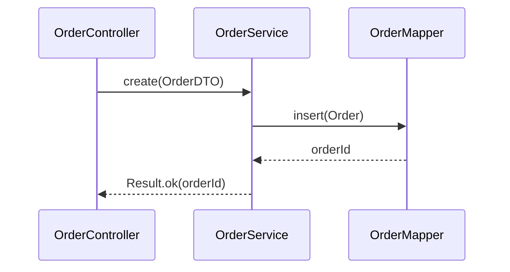

# QA 问答能力加强清单

> 文档版本：v6.0
> 创建日期：2026-07-09
> 更新日期：2026-07-10（v6.0 追加 K~O 五类，对标市面产品能力）
> 适用范围：LegacyGraph QA 问答模块 — 覆盖十五大类问题：
>   - A 类：变更影响分析（"加/删/改字段影响哪些功能、需改哪些地方"）
>   - B 类：需求实现方案（"做 XX 需求/修改/功能，给一个可执行方案"）
>   - C 类：权限与角色问答（"新建 XX 任务需要什么权限、谁能办"）
>   - D 类：业务流程操作问答（"在 XX 里开户如何操作、提交哪些资料"）
>   - E 类：数据血缘与流转（"这笔订单数据从哪里来、流到哪些报表"）
>   - F 类：测试影响与覆盖（"改了 XX 方法要跑哪些测试"）
>   - G 类：异常与日志排查（"下单接口可能抛什么异常、怎么排查"）
>   - H 类：架构与依赖理解（"系统有哪些模块、模块间依赖关系"）
>   - I 类：接口契约查询（"XX 接口的参数是什么、返回什么格式"）
>   - J 类：配置项查询（"XX 配置项的值是什么、谁在用"）
>   - K 类：技术债嗅探（"系统有哪些循环依赖、哪些类过大该拆、有没有架构违规"）【v6.0 新增】
>   - L 类：安全审计问答（"XX 接口有没有 SQL 注入风险、哪些地方硬编码了密钥"）【v6.0 新增】
>   - M 类：事务与并发分析（"XX 方法的事务边界是什么、有没有并发风险"）【v6.0 新增】
>   - N 类：动态可视化（"画一下 XX 下单流程的时序图、画一下订单模块的依赖图"）【v6.0 新增】
>   - O 类：精准测试生成（"帮 XX 方法生成单元测试、根据变更点生成测试用例"）【v6.0 新增】
> 前置文档：`doc/项目升级计划/QA问答优化方案.md`、`doc/项目升级计划/QA变更影响问答打通详细设计.md`
> 对标产品：Sourcegraph Cody（代码图谱 + blast radius）、Deepwiki（时序图/架构图自动生成）、
>   CodeGraph/GitNexus（调用链/影响分析）、得物技术（技术债嗅探）、Google Agent Skills（security-hardening）、Diffblue Cover（测试生成）

---

## 一、目标与现状

### 1.1 目标问题

本清单覆盖两大类问题：

**A 类：变更影响分析** — 给定一个结构化变更，分析影响范围

> "给 lg_order 表加 status 字段，影响哪些功能？需要改哪些地方？"
> "修改 user 表的 phone 字段长度，有哪些 SQL 和 Service 受影响？"
> "删除 t_order 表的 remark 字段，前端哪些页面要改？"

**B 类：需求实现方案** — 给定一个需求/功能，生成可执行方案

> "做一个订单导出功能，怎么实现？"
> "加一个用户权限管理模块，需要改哪些地方？"
> "实现一个数据字典 CRUD 需求，给个方案"

**C 类：权限与角色问答** — 给定一个业务操作，查询所需权限和可办角色

> "新建任务需要什么权限？"
> "在订单模块里审批订单，需要什么角色的人能办？"
> "哪些用户可以删除项目？"

**D 类：业务流程操作问答** — 给定一个业务场景，查询操作步骤和所需资料

> "我要在系统里开个账户，如何操作？提交哪些资料？"
> "保证金项目立项流程是什么？需要走哪些审批？"
> "怎么发起一个变更申请？需要准备什么材料？"

**E 类：数据血缘与流转** — 追踪数据的来源和去向

> "这笔订单数据从哪里来、流到哪些报表？"
> "lg_order 表的数据被哪些接口读取？"
> "报表数据的数据源链路是什么？"

**F 类：测试影响与覆盖** — 评估代码变更的测试影响

> "改了 orderService.create 方法要跑哪些测试？"
> "XX 功能的测试覆盖率怎么样？"
> "哪些测试用例覆盖了 OrderController？"

**G 类：异常与日志排查** — 异常场景与日志追踪

> "下单接口可能抛什么异常？"
> "XX 接口报 500 怎么排查？日志在哪里？"
> "哪些方法可能抛 BusinessException？"

**H 类：架构与依赖理解** — 模块划分与依赖关系

> "系统有哪些模块？模块间依赖关系是什么？"
> "XX 模块依赖哪些模块？"
> "如果要拆分微服务，该怎么拆？"

**I 类：接口契约查询** — 接口参数与返回格式

> "POST /api/order/create 接口的参数是什么？返回什么格式？"
> "XX 接口需要传什么请求体？"
> "分页接口的响应结构是什么？"

**J 类：配置项查询** — 配置值与使用方

> "order.timeout 配置项的值是什么？默认值是多少？"
> "哪些类用了 @Value 注解读取配置？"
> "XX 功能依赖什么配置项？"

**K 类：技术债嗅探** — 识别代码坏味道与架构债务

> "系统有哪些循环依赖？"
> "哪些类/方法过大、该拆分？"
> "有没有 Controller 直接调用 DAO 的架构违规？"
> "哪些方法是死代码、从未被调用？"
> "哪些模块的扇入扇出过高、耦合严重？"

**L 类：安全审计问答** — 安全漏洞与敏感数据追溯

> "XX 接口有没有 SQL 注入风险？"
> "哪些地方硬编码了密钥、密码、Token？"
> "哪些接口缺少权限校验？"
> "敏感数据（身份证/手机号）有没有脱敏？在哪里处理？"
> "有没有用了不安全的反序列化？"

**M 类：事务与并发分析** — 事务边界与并发风险

> "XX 方法的事务边界是什么？传播行为是哪个？"
> "这个操作跨了多个 Service，事务会失效吗？"
> "哪些方法有 @Async、会不会有竞态条件？"
> "XX 业务有没有并发安全问题？锁用对了吗？"
> "哪些方法 self-invocation 导致 @Transactional 失效？"

**N 类：动态可视化** — 按需生成调用链/时序图/依赖图

> "画一下下单流程的调用时序图"
> "画一下订单模块的依赖关系图"
> "画一下 orderService.create 的调用链"
> "画一下 Table→Service→ApiEndpoint 的数据流图"
> "画一下 BusinessDomain→BusinessProcess→ApiEndpoint 的业务链路图"

**O 类：精准测试生成** — 结合变更点和调用链自动生成测试

> "帮 orderService.create 方法生成单元测试"
> "改了 XX 方法，帮我生成回归测试"
> "XX 接口的契约测试怎么写？"
> "根据这次变更点，帮我补齐缺失的测试用例"
> "哪些方法还没有被任何 TestCase 覆盖、帮我生成？"

### 1.2 当前能力

QA 已有专门链路（`EnhancedQaAgent` + `ChangeImpactQuestionParser` + `ImpactSubgraphService` + `ChangeImpactAgent`），能处理"加/改字段"类问题。链路为：

```
用户问题 → ChangeImpactQuestionParser 解析表名/字段名
→ resolveTableNodeId 查 Table 节点
→ ImpactSubgraphService.extractByNodeMultiHop(TABLE_REVERSE, depth)
   多跳反查 Table ← SQL ← Mapper ← Service ← ApiEndpoint
→ ChangeImpactAgent.analyze（LLM 生成受影响清单/回归范围）
→ appendChangeImpactContext 拼装上下文
→ LLM 流式生成"①受影响清单 ②执行步骤 ③建议"
```

### 1.3 准确性瓶颈

**A 类（变更影响）瓶颈**：

| 瓶颈 | 影响 | 代码位置 |
|------|------|----------|
| 只识别 `lg_` 前缀表名 | 非 lg_ 表整个变更分支跳过 | `ChangeImpactQuestionParser.java:33` |
| 字段级精度缺失 | 加 status 和加 priority 返回相同影响子图 | `EnhancedQaAgent` 以 Table 为起点 |
| 200 表上限隐患 | 超过 200 张表时目标表可能查不到 | `EnhancedQaAgent.java:813` limit=200 |
| Column nodeKey 不一致 | DB schema 和 SQL 解析建出两套 Column 节点 | `GraphBuilder.java:548` vs `:906` |
| 前端链路断 | 反查到 ApiEndpoint 不继续到 Page | `TraversalDirection.java:17` 不含 CALLS |
| LLM 输出结构不稳定 | prompt 模板未对齐执行步骤结构 | `change-impact` prompt 模板 |

**B 类（需求实现方案）瓶颈**：

| 瓶颈 | 影响 | 代码位置 |
|------|------|----------|
| 没有 IMPLEMENTATION_PLAN 意图 | "做一个 XX 功能"被归到 FACT_LOOKUP/EXPLANATION，走通用检索 | `QueryIntent.java:8-15`（7 种意图无此类型） |
| 没有方案生成 prompt 模板 | LLM 只能基于召回代码片段泛泛描述，不输出分层方案 | `resources/prompts/`（27 个模板无方案生成） |
| 项目约定/规范未入库 | 方案不知道项目用什么技术栈、分层规范、命名约定 | `Project.techStack` 字段只存不用 |
| 可复用组件无标记 | 方案不知道有哪些基类/工具类可复用（BaseEntity/PageResult/Result） | `NodeType.java`（30 种无 UTILITY/BASE_CLASS） |
| QueryRewriter 无需求拆解 | "做一个订单导出"只做同义词替换，不拆成各层检索 | `query-rewriter.txt`（3 种通用策略） |
| HyDE 无需求类假设 | HyDE 生成泛泛技术描述，召回到的是语义相近代码而非分层改动证据 | `HyDEGenerator.java:25-48` |

**C 类（权限与角色）瓶颈**：

| 瓶颈 | 影响 | 代码位置 |
|------|------|----------|
| Role ↔ Permission 无关联边 | 最大缺口，两座孤岛。EdgeType 无 GRANTS/HAS_PERMISSION | `common/EdgeType.java`（无 GRANTS） |
| 没有 User 节点 | NodeType 30 种无 User，无法回答"哪些用户能办" | `common/NodeType.java:6-44` |
| 数据库角色表没被扫描成图谱 | sys_role/sys_user_role 停留在关系库，无 Builder 引用 | `SysRoleRepository`/`SysUserRoleRepository` 无图谱引用 |
| 没有 PERMISSION_LOOKUP 意图 | 走通用 GraphRAG 碰运气，无权限专属检索 | `QueryIntent.java:8-15`（7 种意图无权限类） |
| QA 不消费 FeatureSlice.permissionIds | FeatureSliceBuilder 聚合了权限但 EnhancedQaAgent 不引用 | `FeatureSliceBuilder.java:154-161` |
| 后端权限注解扫描不全 | 漏 @Secured/@RolesAllowed/@HasPermission | `JavaControllerExtractor.java:292-324` |
| @PreAuthorize 重复扫描语义冲突 | JavaControllerExtractor 当 Permission，RbacRoleExtractor 当 Role，同一注解生成两类无关联节点 | `JavaControllerExtractor.java:300-304` + `RbacRoleExtractor.java:128-140` |
| 前后端 Permission nodeKey 不统一 | 前端取 meta.permission 原值，后端 SpEL 处理粗暴，同一权限生成不同 nodeKey | `FrontendGraphBuilder.java:119` vs `JavaControllerExtractor.java:329-341` |
| dead code 不一致 | buildFrontendButtonPermissionGraph 从未被调用且用 REQUIRES 而非 REQUIRES_PERMISSION | `GraphBuilder.java:2850-2970` |

**D 类（业务流程操作）瓶颈**：

| 瓶颈 | 影响 | 代码位置 |
|------|------|----------|
| 没有资料类节点 | 无法回答"提交哪些资料"。NodeType 无 Form/Material/RequiredDocument | `common/NodeType.java:6-44` |
| BusinessProcess 无 materials 字段 | LLM 抽取业务事实时不抽资料清单 | `DocUnderstandingAgent.java:57-68` |
| ApiEndpoint 无业务语义 | description 只是路径拼接"API接口: POST /api/account/open"，无法关联到"开户" | `GraphBuilder.java:88-104` |
| 不解析 Swagger 注解 | @Operation/@ApiOperation summary 丢失，接口业务含义丢失 | `JavaControllerExtractor.java`（无 summary 解析） |
| BusinessProcess 是孤立节点 | BusinessProcess↔BusinessDomain 无边，BusinessProcess→ApiEndpoint 无直接边 | `BusinessGraphBuilder.java:138-139` |
| 没有 PROCEDURE_LOOKUP 意图 | 走通用 GraphRAG，无操作指南专用链路 | `QueryIntent.java:8-15`（7 种意图无操作类） |
| BusinessDomain→ApiEndpoint 断链 | mapBusinessDomainsToCode 只连 Controller/Service，不连 ApiEndpoint | `BusinessGraphBuilder.java:567-617` |

**E 类（数据血缘与流转）瓶颈**：

| 瓶颈 | 影响 | 代码位置 |
|------|------|----------|
| 无正向遍历入口 | TraversalDirection 三方向全是 INBOUND，无法正向查 Table→下游消费方 | `common/TraversalDirection.java:12-30` |
| 无 DATA_FLOW 边 | EdgeType 没有 DATA_FLOW/FORWARD 边类型 | `common/EdgeType.java` |
| RELATIONAL 走无向路径 | GraphRagPlanExecutor 走无向有界路径，不是有向数据流 | `GraphRagPlanExecutor.java:25` |

**F 类（测试影响与覆盖）瓶颈**：

| 瓶颈 | 影响 | 代码位置 |
|------|------|----------|
| VERIFIED_BY 边只到类不到方法 | 不能回答"改了 XX 方法要跑哪些测试" | `GraphBuilder.java:2817-2818` |
| inferTestedClassKey 仅后缀剥离 | XxxTest→Xxx 推断被测类，方法级关联缺失 | `GraphBuilder.java:2383-2394` |

**G 类（异常与日志排查）瓶颈**：

| 瓶颈 | 影响 | 代码位置 |
|------|------|----------|
| 无 Exception 节点 | NodeType 无 Exception/Error 类型 | `common/NodeType.java` |
| 无 catch/throw 扫描 | 没有 ExceptionExtractor 扫 CatchClause/ThrowStmt/throws 声明 | extractors 目录无实现 |
| 无日志调用点入库 | log.error/warn 调用点未入图谱 | — |

**H 类（架构与依赖理解）瓶颈**：

| 瓶颈 | 影响 | 代码位置 |
|------|------|----------|
| 无 Package/Module 节点 | NodeType 无 Package/Module 类型 | `common/NodeType.java` |
| DEPENDS_ON 边定义但零使用 | EdgeType 有 DEPENDS_ON 但全代码库无任何 builder 用它建边 | `common/EdgeType.java:41` |
| STRUCTURAL 走无向路径 | 无模块级依赖边可走 | `GraphRagPlanExecutor.java` |

**I 类（接口契约查询）瓶颈**：

| 瓶颈 | 影响 | 代码位置 |
|------|------|----------|
| ApiEndpoint 节点未写入契约信息 | params/requestBody/responseType 在 ApiFact 抽取了但创建节点时丢弃 | `GraphBuilder.java:60-188`（无 .properties()） |

**J 类（配置项查询）瓶颈**：

| 瓶颈 | 影响 | 代码位置 |
|------|------|----------|
| ConfigItem 节点未存 value/defaultValue | 只存 sourceType，配置值被丢弃 | `GraphBuilder.java:2401-2446` |

**K 类（技术债嗅探）瓶颈**：

| 瓶颈 | 影响 | 代码位置 |
|------|------|----------|
| 无循环依赖检测算法 | appendArchitectureContext prompt 只提了一句"循环依赖风险"，无实际图算法检测环 | `EnhancedQaAgent.java:1925` |
| 无扇入/扇出统计 | 无法回答"哪些模块耦合严重"，GraphNode.properties 无 fanIn/fanOut 字段 | `Neo4jGraphDao` 无聚合查询 |
| 无架构违规扫描 | Controller 直连 DAO、Service 跨层调用等违规无识别 | 无 ArchitectureViolationScanner |
| 无死代码识别 | 从未被 CALLS/READS 的节点无 isolated 标记，GraphNode.properties 无 usageCount | — |
| 无过大类/方法识别 | 行数/方法数/圈复杂度未统计入节点 properties | `JavaStructureExtractor` 只抽类信息不统计规模 |

**L 类（安全审计问答）瓶颈**：

| 瓶颈 | 影响 | 代码位置 |
|------|------|----------|
| 无安全扫描器 | 完全缺失。无 SQL 注入检测、无硬编码密钥扫描、无反序列化风险识别 | extractors 目录无 SecurityExtractor |
| 无敏感数据流向追踪 | 身份证/手机号/银行卡等敏感字段无 SENSITIVE 标记，无法追溯脱敏点 | Column 节点无 sensitivity 字段 |
| 无权限校验缺失检测 | ApiEndpoint 无 @PreAuthorize 的接口无法批量识别 | 需对比 REQUIRES_PERMISSION 边覆盖率 |
| 无 SecurityRisk 节点类型 | NodeType 无安全相关类型 | `common/NodeType.java` |

**M 类（事务与并发分析）瓶颈**：

| 瓶颈 | 影响 | 代码位置 |
|------|------|----------|
| @Transactional 仅标记不分析 | BusinessProcessExtractor 只识别注解有无，不分析传播行为/事务边界/失效场景 | `BusinessProcessExtractor.java:86` |
| 无事务边界节点 | 事务范围（哪些方法在同一事务内）未入图谱，无法回答"这个操作跨几个事务" | 无 TransactionScope 节点 |
| 无并发注解扫描 | @Async/@Lock/synchronized/ReentrantLock 未扫描入库 | 无 ConcurrencyExtractor |
| 无 self-invocation 检测 | 同类内方法调用导致 @Transactional 失效的场景无识别 | 需分析 CALLS 边 + 注解 |

**N 类（动态可视化）瓶颈**：

| 瓶颈 | 影响 | 代码位置 |
|------|------|----------|
| 仅静态 mermaid graph LR | SystemOverviewService 只有固定模板的 LR 图，不按问题动态生成 | `SystemOverviewService.java:498` |
| QA 链路不生成时序图 | 用户问"画时序图"走通用 LLM，无法从图谱调用链生成 mermaid sequence diagram | EnhancedQaAgent 无 appendDiagramContext |
| 无调用链→时序图转换 | 图谱有 CALLS 边但无算法把调用链转成时序图参与者+消息序列 | — |
| 无依赖图/数据流图生成 | 图谱有 DEPENDS_ON/DATA_FLOW 边但无按需可视化输出 | — |

**O 类（精准测试生成）瓶颈**：

| 瓶颈 | 影响 | 代码位置 |
|------|------|----------|
| 无测试代码生成能力 | 只能回答"要跑哪些测试"（F 类），不能生成新测试代码 | 无 TestGenerationAgent |
| 无覆盖率缺口分析 | 知道哪些方法有 VERIFIED_BY 边，但不统计哪些方法没有、不推荐优先补测 | 需反查全量 Method 节点 |
| 无契约测试模板 | ApiEndpoint.properties 有契约信息但无契约测试生成模板 | 无 contract-test 模板 |
| 无变更点→测试用例推导 | 变更影响分析能列出受影响方法，但不生成对应测试用例 | ChangeImpactAgent 只分析不生成 |

---

## 二、已有图谱基础（不要重复建设）

**A 类已有基础**：

| 能力 | 状态 | 代码位置 |
|------|------|----------|
| Column 节点扫描 | ✅ 已扫，892 个 | `DatabaseMetadataExtractor.java:188-210` |
| Table → Column 的 HAS_COLUMN 边 | ✅ 已建 | `GraphBuilder.java:567-579` |
| SqlStatement → Column 的 READS/WRITES 边 | ✅ 已建 | `GraphBuilder.java:460-491` |
| Page/Button → ApiEndpoint 的 CALLS 边 | ✅ 已建 | `FrontendGraphBuilder.java:148-171, 232-245` |
| TABLE_REVERSE 多跳反查 | ✅ 已实现 | `ImpactSubgraphService.extractByNodeMultiHop` |
| ChangeImpactQuestionParser 字段名解析 | ✅ 已实现 | `ChangeImpactQuestionParser.java:79-83` |

**B 类已有基础**：

| 能力 | 状态 | 代码位置 |
|------|------|----------|
| 意图分类框架 | ✅ 已有（7 种意图） | `QueryIntent.java` + `QueryIntentClassifier.java` |
| GraphRAG Planner 规划执行 | ✅ 已有 | `GraphRagPlannerAgent` + `GraphRagPlanExecutor` |
| 多路召回 + ReRank + 图扩展 | ✅ 已有 | `HybridRetrievalService` + `ReRankingService` + `expandGraph` |
| LLM 流式生成 | ✅ 已有 | `LlmGateway.callStream` + `qa-answer-enhanced` |
| Project.techStack 元数据字段 | ✅ 已有 | `Project.java:23`（但只存不用） |
| GraphNode.properties JSON 扩展字段 | ✅ 已有 | `GraphNode.java:34`（可放任意 KV） |

**C 类已有基础**：

| 能力 | 状态 | 代码位置 |
|------|------|----------|
| ApiEndpoint → Permission 的 REQUIRES_PERMISSION 边 | ✅ 已建 | `GraphBuilder.java:158-184` |
| 前端 Menu/Button → Permission 的 REQUIRES_PERMISSION 边 | ✅ 已建 | `FrontendGraphBuilder.java:119-144, 204-229` |
| 后端 @PreAuthorize/@RequiresPermissions 注解扫描 | ✅ 已扫 | `JavaControllerExtractor.java:292-324` |
| Role 节点扫描（@PreAuthorize/@RequiresRoles） | ✅ 已扫 | `RbacRoleExtractor.java` + `GraphBuilder.buildRbacRoleGraph` |
| Role → Service/Controller 的 USES 边 | ✅ 已建 | `GraphBuilder.java:3108-3127` |
| sys_role/sys_user_role 表已有数据 | ✅ 已有 | `V1__initial_schema.sql:618,641` |
| FeatureSlice 第 7 层聚合 permissionIds | ✅ 已有 | `FeatureSliceBuilder.java:154-161` |
| LLM 推断 REQUIRES_PERMISSION Claim | ✅ 已有 | `FeatureMappingAgent.java:89-91` |

**D 类已有基础**：

| 能力 | 状态 | 代码位置 |
|------|------|----------|
| BusinessProcess 节点扫描 | ✅ 已扫（从 Service 编排方法推断） | `BusinessProcessExtractor.java:28-110` |
| 文档 LLM 抽取 BusinessProcess（含 steps/roles/objects/rules） | ✅ 已有 | `DocUnderstandingAgent.java:57-68` |
| BusinessProcess → Service 的 CALLS 边 | ✅ 已建 | `GraphBuilder.java:3277-3312` |
| BusinessDomain 节点扫描 | ✅ 已扫（从 @RequestMapping/@Service/@Tag 推断） | `BusinessDomainExtractor.java:29-195` |
| BusinessDomain → Controller/Service 的 CONTAINS 边 | ✅ 已建 | `BusinessGraphBuilder.java:567-617` |
| 文档向量化（chunkType=DOC） | ✅ 已有 | `DocExtractStep.java:143` |
| 文档 LLM 抽取业务事实入库 lg_fact | ✅ 已有 | `DocExtractStep.java:87-231` |
| GraphRAG Planner + 多路召回 + LLM | ✅ 已有 | 通用链路 |

**E 类已有基础**：

| 能力 | 状态 | 代码位置 |
|------|------|----------|
| 反向血缘遍历（Table→上游 API/Feature） | ✅ 已能 | `TraversalDirection.TABLE_REVERSE`（INBOUND） |
| 基础设施支持 OUTBOUND | ✅ 已有 | `Neo4jGraphDao.findPathsDirected`（:170-175）+ `FlowDirection.OUTBOUND` |
| RELATIONAL 意图 + GraphRAG Planner | ✅ 已有 | 通用链路 |
| Table↔SqlStatement 的 READS/WRITES 边 | ✅ 已建 | `GraphBuilder.java:460-491` |

**F 类已有基础**：

| 能力 | 状态 | 代码位置 |
|------|------|----------|
| TestCase/Assertion 节点 | ✅ 已扫 | `NodeType.java:35-36` |
| TestCaseAdapter 扫描 src/test/java | ✅ 已扫 | `TestCaseAdapter.java:29-33` |
| TestCase → Assertion 的 CONTAINS 边 | ✅ 已建 | `GraphBuilder.java:2804-2810` |
| Service 类 → TestCase 的 VERIFIED_BY 边 | ✅ 已建（类级） | `GraphBuilder.java:2817-2818` |

**G 类已有基础**：

| 能力 | 状态 | 代码位置 |
|------|------|----------|
| — | ❌ 完全空白 | 无 Exception 节点、无扫描器、无日志点入库 |

**H 类已有基础**：

| 能力 | 状态 | 代码位置 |
|------|------|----------|
| DEPENDS_ON 边类型已定义 | ✅ 已定义（但零使用） | `common/EdgeType.java:41` |
| FeatureModule 节点 | ✅ 已有（业务功能模块，非代码包） | `NodeType.java` |
| STRUCTURAL 意图 | ✅ 已有 | `QueryIntent.java` |
| JavaClassInfo.packageName 字段 | ✅ 已抽（但未建 Package 节点） | `JavaStructureExtractor.java:90-101` |

**I 类已有基础**：

| 能力 | 状态 | 代码位置 |
|------|------|----------|
| ApiFact 含 params/requestBody/responseType | ✅ 已抽 | `ApiFact.java:11-27` |
| ApiEndpoint 节点存在 | ✅ 已建 | `GraphBuilder.java:60-188` |
| GraphNode.properties JSON 扩展字段 | ✅ 已有 | `GraphNode.java:34` |
| FACT_LOOKUP 意图 | ✅ 已有 | `QueryIntent.java` |

**J 类已有基础**：

| 能力 | 状态 | 代码位置 |
|------|------|----------|
| ConfigItem 节点类型 | ✅ 已有 | `NodeType.java:30` |
| ConfigItemAdapter 扫 yml/properties/java | ✅ 已扫 | `ConfigItemAdapter.java:29-34` |
| ConfigItemFact 含 key/value/defaultValue | ✅ 已抽 | `ConfigItemExtractor.java:162-173` |
| Class → ConfigItem 的 USES 边 | ✅ 已建 | `GraphBuilder.java:2433-2439` |

**K 类已有基础**：

| 能力 | 状态 | 代码位置 |
|------|------|----------|
| Package 节点 + DEPENDS_ON 边 | ✅ 已建（P6-29） | `GraphBuilder.buildPackageGraph` |
| CALLS 边（方法/类间调用） | ✅ 已建 | `GraphBuilder` / `JavaMemberCallResolver` |
| EXTENDS/IMPLEMENTS 边 | ✅ 已建 | `GraphBuilder` |
| GraphNode.properties JSON 扩展字段 | ✅ 已有 | `GraphNode.java:34` |
| Neo4j 图数据库原生环检测支持 | ✅ Cypher `SHORTEST path` 可检环 | `Neo4jGraphDao` |
| appendArchitectureContext 骨架 | ✅ 已有（H 类链路） | `EnhancedQaAgent` |

**L 类已有基础**：

| 能力 | 状态 | 代码位置 |
|------|------|----------|
| ApiEndpoint → Permission 的 REQUIRES_PERMISSION 边 | ✅ 已建 | `GraphBuilder.java:158-184` |
| Column 节点（可标记敏感字段） | ✅ 已扫 892 个 | `DatabaseMetadataExtractor` |
| @PreAuthorize 注解扫描 | ✅ 已扫 | `RbacRoleExtractor` |
| GraphNode.properties JSON 扩展字段 | ✅ 可存 riskLevel/riskType | `GraphNode.java:34` |
| SqlStatement 节点（可分析 SQL 注入风险） | ✅ 已有 | `GraphBuilder.buildSqlStatementNodes` |

**M 类已有基础**：

| 能力 | 状态 | 代码位置 |
|------|------|----------|
| @Transactional 注解识别 | ✅ 已识别（仅标记有无） | `BusinessProcessExtractor.java:86` |
| CALLS 边（可追溯方法调用链，判断 self-invocation） | ✅ 已建 | `GraphBuilder` / `JavaMemberCallResolver` |
| Method 节点（可挂载事务/并发属性） | ✅ 已有 | `NodeType.Method` |
| GraphNode.properties JSON（可存 propagation/isolation/async 等） | ✅ 已有 | `GraphNode.java:34` |

**N 类已有基础**：

| 能力 | 状态 | 代码位置 |
|------|------|----------|
| SystemOverviewService mermaid 生成 | ✅ 有简单 LR 图 | `SystemOverviewService.java:498` |
| CALLS 边（可生成调用时序图） | ✅ 已建 | `GraphBuilder` |
| DEPENDS_ON 边（可生成依赖图） | ✅ 已建 | `GraphBuilder.buildPackageGraph` |
| DATA_FLOW / READS/WRITES 边（可生成数据流图） | ✅ 已建 | `GraphBuilder.buildDatabaseGraph` |
| LLM 流式生成（可生成 mermaid 代码块） | ✅ 已有 | `LlmGateway.callStream` |

**O 类已有基础**：

| 能力 | 状态 | 代码位置 |
|------|------|----------|
| TestCase 节点 + VERIFIED_BY 边（方法级） | ✅ 已建（P6-27） | `GraphBuilder.buildTestCaseGraph` |
| Method 节点全量扫描 | ✅ 已扫 | `JavaStructureExtractor` |
| ApiEndpoint.properties 契约信息 | ✅ 已写入（P6-30） | `GraphBuilder.buildApiNodes` |
| ChangeImpactAgent 变更影响分析 | ✅ 已有 | `ChangeImpactAgent` |
| LLM 代码生成能力 | ✅ 已有 | `LlmGateway` |

**结论：核心数据已在图谱里，缺的是"用起来"的链路。**

---

## 三、加强清单（按优先级）

### P0-1：表名识别放开 `lg_` 前缀限制

**问题**：`TABLE_PATTERN = Pattern.compile("(lg_[a-z0-9_]+)")` 只匹配 lg_ 前缀。非 lg_ 表名（如 `user`、`t_order`）→ `tableName=null` → 整个变更影响分支跳过。

**改法**：
1. 主正则放开为 `(?:表|table)\s+([a-zA-Z_][a-zA-Z0-9_]*)` 匹配"给 xxx 表加字段"
2. 兜底：解析不出表名时，从图谱 `queryNodes("Table")` 取全量 nodeName 做模糊匹配（substring contains）

**文件**：`backend/src/main/java/io/github/legacygraph/agent/ChangeImpactQuestionParser.java`
- 行 33：`TABLE_PATTERN` 正则放开
- 行 71-76：`parseByRegex` 增加图谱兜底逻辑（需注入 `Neo4jGraphDao`）

**验收**：问"给 user 表加 phone 字段"能识别 tableName=user 并触发变更影响链路。

---

### P0-2：`resolveTableNodeId` 查询效率与上限

**问题**：当前 `queryNodes("Table", ..., 200)` 取前 200 个后内存过滤 `nodeName`。超过 200 张表时目标表可能落在 limit 之外静默失效。

**改法**：
1. `Neo4jGraphDao` 新增 `findNodeByName(projectId, versionId, nodeType, nodeName)` 方法，Cypher `WHERE n.nodeName = $nodeName` 精确查
2. `resolveTableNodeId` 改用此方法，去掉 200 limit
3. `GraphPathReadModel.getTableImpact`（`:70-83`）同样有此问题，一并改造

**文件**：
- `backend/src/main/java/io/github/legacygraph/dao/Neo4jGraphDao.java` — 新增 `findNodeByName`
- `backend/src/main/java/io/github/legacygraph/agent/EnhancedQaAgent.java:810-820` — 改用 `findNodeByName`
- `backend/src/main/java/io/github/legacygraph/service/graph/GraphPathReadModel.java:70-83` — 同步改造

**验收**：表数量超过 200 时仍能正确定位目标表。

---

### P1-3：字段级反查链路（Column 起点）

**问题**：当前 `extractByNodeMultiHop` 以 Table 为起点，加"status"字段和加"priority"字段返回相同影响子图。图谱里已有 `SqlStatement → Column` 的 READS/WRITES 边，但变更影响链路没用上。

**改法**：
1. `common/TraversalDirection` 新增 `COLUMN_REVERSE`：`Column ← READS/WRITES ← SqlStatement ← EXECUTES ← Mapper ← CALLS ← Service ← HANDLED_BY ← ApiEndpoint`
2. `ImpactSubgraphService.extractByNodeMultiHop` 已支持按 `targetNodeId` 反查，无需改方法本身，只需在调用方传入 Column 节点 ID
3. `EnhancedQaAgent` 新增 `resolveColumnNodeId(projectId, versionId, tableName, columnName)`：按 `{table}.{column}` 格式查 Column 节点
4. `EnhancedQaAgent.answerStream` 中 `columnName` 非空时优先走 Column 起点反查，否则回退到 Table 起点反查

**文件**：
- `backend/src/main/java/io/github/legacygraph/common/TraversalDirection.java` — 新增 `COLUMN_REVERSE`
- `backend/src/main/java/io/github/legacygraph/agent/EnhancedQaAgent.java:150-198` — 变更影响分支增加 Column 起点

**预期效果**："加 status 字段"只返回真正引用 status 列的 SQL/Mapper/Service，精度从表级提升到字段级。

**验收**：问"给 lg_order 加 status 字段"和"加 priority 字段"返回不同的影响子图。

---

### P1-4：Column nodeKey 不一致修复

**问题**：
- DB schema 扫描建出来的 Column nodeKey = `{schema}.{table}.{column}`（`GraphBuilder.java:548`）
- SQL 解析建出来的 Column nodeKey = `{tableName.lower}.{column.lower}`（`GraphBuilder.java:906`）

两套 key 产生**两套 Column 节点而非合并**，导致字段级反查时 DB schema 的 Column 和 SQL 引用的 Column 对不上。

**改法**：
1. 统一 nodeKey 生成逻辑为 `{tableName.lower}.{column.lower}`（去 schema 前缀）
2. `GraphBuilder.java:548` 的 `buildDatabaseGraph` 中 Column nodeKey 改为 `{tableName.lower}.{column.lower}`
3. `findOrCreateColumnNode`（`:904-925`）保持不变（已是此格式）
4. 重新扫描后旧的 schema 前缀 Column 节点会变为孤立节点，需清理或标记 STALE

**文件**：`backend/src/main/java/io/github/legacygraph/builder/GraphBuilder.java:548`

**验收**：DB schema 扫描和 SQL 解析建出的 Column 节点能 MERGE 为同一节点。

---

### P2-5：前端影响链路补全

**问题**：`TABLE_REVERSE.edgeTypes()` 含 `IMPLEMENTED_BY` 止于 Controller/ApiEndpoint。前端 Page→ApiEndpoint 边存在，但反查到 ApiEndpoint 后不会继续到 Page（`TABLE_REVERSE` 不含 `CALLS` 的反方向）。

**改法**：`TraversalDirection.TABLE_REVERSE.edgeTypes()` 追加 `CALLS`，使反查链路完整为：

```
Table ← READS/WRITES ← SqlStatement ← EXECUTES ← Mapper ← CALLS ← Service
     ← HANDLED_BY ← ApiEndpoint ← CALLS ← Page/Button
```

**文件**：`backend/src/main/java/io/github/legacygraph/common/TraversalDirection.java:17`

**预期效果**：反查结果包含前端 Page/Button 节点，`impactedFiles` 能列出前端文件路径。

**验收**：问"加字段影响哪些前端"能列出受影响的 Page/Button 和对应文件。

---

### P2-6：LLM 输出"需改哪些地方"的执行步骤结构

**问题**：当前 `ChangeImpactAgent` 用 LLM 生成 `impactedNodes`/`regressionScope`，但 prompt 模板没有"按 DDL→实体→Mapper→Service→Controller→前端→测试 的执行步骤"输出结构，导致 LLM 输出不稳定。

**改法**：在 `change-impact` prompt 模板（`prompts/change-impact.txt` 或 `lg_prompt_template` 表）追加输出要求：

```
输出结构：
1. 受影响清单（按 表→SQL→Mapper→Service→Controller→前端 分层）
2. 执行步骤（DDL→实体→Mapper→Service→Controller→前端→测试，每步列出具体文件路径和方法名）
3. 风险等级与回归范围
```

**文件**：
- `backend/src/main/resources/prompts/change-impact.txt`（若存在）
- `backend/src/main/resources/db/migration/V*.sql`（`change-impact` 模板行）
- `EnhancedQaAgent.java:863-865` 已在上下文里要求此结构，prompt 模板侧对齐即可

**验收**：LLM 稳定输出分层受影响清单和执行步骤，而非自由叙述。

---

### P3-7：新增 `IMPLEMENTATION_PLAN` 意图

**问题**：问"做一个订单导出功能"会被归到 FACT_LOOKUP/EXPLANATION，走通用检索，LLM 只能给代码片段摘要，不输出实现方案。

**改法**：
1. `QueryIntent.java` 新增 `IMPLEMENTATION_PLAN` 枚举值，`requiresPlanner=true`、`requiresChangeImpact=false`、`recommendedGraphDepth=3`
2. `intent-classifier.txt` 增加识别规则：关键词"做一个/实现/开发/新增 XX 功能/需求/模块/接口"
3. `EnhancedQaAgent.answerStream` 新增 IMPLEMENTATION_PLAN 处理分支（详见 P3-10）

**文件**：
- `backend/src/main/java/io/github/legacygraph/agent/QueryIntent.java:8-15`
- `backend/src/main/resources/prompts/intent-classifier.txt`

**验收**：问"做一个订单导出功能"被识别为 IMPLEMENTATION_PLAN 而非 FACT_LOOKUP。

---

### P3-8：新增方案生成 Prompt 模板 `implementation-plan`

**问题**：现有 27 个 prompt 模板无方案生成类。最接近的 add-column-patch/patch-plan/change-impact 都要求"基于给定影响子图"，不接受开放需求输入。

**改法**：新建 `implementation-plan.txt`，输出结构为分层方案：

```
## 需求分解
- 需求1：xxx
- 需求2：xxx

## 实现方案（按分层）
### 1. 数据库层
- DDL：CREATE TABLE ... / ALTER TABLE ...
### 2. 实体层
- 新增类：OrderExport.java（继承 BaseEntity）
- 路径：io.github.legacygraph.entity
### 3. Mapper 层
- 新增方法：selectForExport
- SQL：SELECT ... FROM ...
### 4. Service 层
- 新增类：OrderExportService
- 方法：export(DateRange)
### 5. Controller 层
- 新增接口：POST /api/order/export
### 6. 前端层
- 新增页面/组件：OrderExport.vue

## 可复用组件
- BaseEntity、PageResult、Result<T>（已有）

## 风险与注意事项
- 事务边界：...
- 性能：大数据量导出需分批

## 实施步骤
1. 建 DDL → 2. 实体 → 3. Mapper → 4. Service → 5. Controller → 6. 前端 → 7. 测试
```

**文件**：
- `backend/src/main/resources/prompts/implementation-plan.txt`（新建）
- `backend/src/main/resources/db/migration/V*.sql`（新增种子数据，`prompt_code=implementation-plan`）

**验收**：LLM 稳定输出分层实现方案，而非自由叙述。

---

### P3-9：项目约定知识入库

**问题**：一个"可执行方案"必须知道项目的技术栈、分层规范、命名约定。当前 `Project.techStack` 字段只存不用，没有服务把它作为可检索知识入库。

**改法**：新增 `ProjectConventionIngestService`，扫描完成后把以下知识向量化到 pgvector，`chunkType=PROJECT_CONVENTION`：

| 知识 | 来源 | 内容 |
|------|------|------|
| 技术栈 | `Project.techStack` | Spring Boot 版本、MyBatis-Plus 版本、Vue 版本 |
| 分层规范 | 扫描时从包结构推导 | controller/service/mapper/entity 标准分层 |
| 命名约定 | 扫描时从已有代码统计 | 类名后缀 Controller/Service/Mapper、方法命名规范 |
| 可复用基类 | 扫描时标记（见 P3-10） | `BaseEntity`/`PageResult`/`Result<T>` 等 |

触发点：`ProjectScanner` 扫描完成后调用，与 `ScanArtifactPublisher` 并列。

**文件**：
- `backend/src/main/java/io/github/legacygraph/service/scan/ProjectConventionIngestService.java`（新建）
- `backend/src/main/java/io/github/legacygraph/task/ProjectScanner.java`（追加触发）

**验收**：QA 问"项目用什么技术栈/分层规范是什么"能召回 PROJECT_CONVENTION 向量。

---

### P3-10：可复用组件标记

**问题**：方案需要告诉用户"有哪些基类/工具类可复用"。当前 `NodeType` 30 种类型无 UTILITY/BASE_CLASS 标记，`GraphNode.properties` JSON 里也没有 `reusable` 字段。

**改法**：
1. 扫描时统计每个类被继承/引用的次数（已有 `EXTENDS` 边可统计）
2. 超过阈值（如被继承≥3 次）的类，在 `GraphNode.properties` JSON 里标记：
   ```json
   {
     "reusable": true,
     "reuseType": "BASE_ENTITY | UTIL | RESULT_WRAPPER | CONFIG",
     "usageCount": 42
   }
   ```
3. `HybridRetrievalService` 新增"可复用组件优先召回"策略：properties.reusable=true 的节点 boost 权重

**文件**：
- `backend/src/main/java/io/github/legacygraph/builder/GraphBuilder.java`（扫描时标记 reusable）
- `backend/src/main/java/io/github/legacygraph/service/qa/HybridRetrievalService.java`（boost 权重）

**验收**：问"做一个 XX 功能"方案里能列出可复用的 BaseEntity/PageResult 等。

---

### P3-11：QueryRewriter 需求拆解改写

**问题**：问"做一个订单导出功能"，QueryRewriter 只做同义词替换，不拆成各层检索查询。

**改法**：在 `query-rewriter.txt` 增加：当 intent=IMPLEMENTATION_PLAN 时，改写策略为"分层拆解"：

```
原始问题："做一个订单导出功能"
改写变体：
1. "订单 导出 Controller ApiEndpoint"（找已有类似接口）
2. "订单 Service 查询 分页"（找已有 Service 模式）
3. "BaseEntity PageResult Result 工具类"（找可复用组件）
4. "导出 Excel CSV 文件下载"（找已有导出实现）
```

**文件**：`backend/src/main/resources/prompts/query-rewriter.txt`

**验收**：IMPLEMENTATION_PLAN 意图的查询变体是分层检索查询，而非同义词替换。

---

### P3-12：EnhancedQaAgent 新增 IMPLEMENTATION_PLAN 处理链路

**问题**：当前 `answerStream` 只有 CHANGE_IMPACT 专用链路，IMPLEMENTATION_PLAN 走通用链路。

**改法**：在 `answerStream` 中新增 IMPLEMENTATION_PLAN 分支（与 CHANGE_IMPACT 并列）：

```
1. QueryRewriter 分层拆解（P3-11）
2. HybridRetrievalService 多路召回（已有，queryVariants 是分层查询）
3. expandGraph 图扩展（已有，深度=3）
4. 额外召回 PROJECT_CONVENTION 向量（P3-9）+ reusable 节点（P3-10）
5. 拼装上下文：分层代码证据 + 项目约定 + 可复用组件
6. LLM 流式生成（用 implementation-plan 模板，P3-8）
```

**文件**：`backend/src/main/java/io/github/legacygraph/agent/EnhancedQaAgent.java:150-198`

**验收**：问"做一个订单导出功能"输出分层实现方案，包含可复用组件和实施步骤。

---

### P4-13：新增 `PERMISSION_LOOKUP` 意图

**问题**：问"新建任务需要什么权限"会被归到 FACT_LOOKUP/RELATIONAL，走通用 GraphRAG 碰运气，无权限专属检索。

**改法**：
1. `QueryIntent.java` 新增 `PERMISSION_LOOKUP` 枚举值，`requiresPlanner=true`、`requiresChangeImpact=false`、`recommendedGraphDepth=2`
2. `intent-classifier.txt` 增加识别规则：关键词"需要什么权限/谁能/谁可以/有权限/角色/权限校验/鉴权"
3. `EnhancedQaAgent.answerStream` 新增 PERMISSION_LOOKUP 处理分支（详见 P4-18）

**文件**：
- `backend/src/main/java/io/github/legacygraph/agent/QueryIntent.java:8-15`
- `backend/src/main/resources/prompts/intent-classifier.txt`

**验收**：问"新建任务需要什么权限"被识别为 PERMISSION_LOOKUP 而非 FACT_LOOKUP。

---

### P4-14：新增 `GRANTS` 边类型，打通 Role ↔ Permission

**问题**：Role 和 Permission 在图谱里是两座孤岛。EdgeType 枚举无 GRANTS/HAS_PERMISSION。`RbacRoleExtractor` 抽的 Role 和 `JavaControllerExtractor` 抽的 Permission 之间无任何边。

**改法**：
1. `common/EdgeType.java` 新增 `GRANTS("授予")` 边类型
2. 扫描 `sys_role` 表（或从代码注解）时，建立 `Role --GRANTS--> Permission` 边
3. 扫描入口：`RbacRoleAdapter` 或新增 `RbacPermissionAdapter`，在 `buildRbacRoleGraph` 后补建 GRANTS 边
4. 数据来源：若项目有 `sys_role_permission` 表则扫描；若无，则从 `@PreAuthorize("hasRole('ADMIN') and hasAuthority('task:create')")` 这种 SpEL 中同时抽取 Role 和 Permission 并建立 GRANTS 关联

**文件**：
- `backend/src/main/java/io/github/legacygraph/common/EdgeType.java` — 新增 GRANTS
- `backend/src/main/java/io/github/legacygraph/builder/GraphBuilder.java:3078-3132` — `buildRbacRoleGraph` 追加 GRANTS 边
- `backend/src/main/java/io/github/legacygraph/extractors/RbacRoleExtractor.java` — 解析 SpEL 时同时抽 Role+Permission 并关联

**预期效果**：反查链路从 `ApiEndpoint → Permission`（断点）延伸到 `ApiEndpoint → Permission ← GRANTS ← Role`。

**验收**：问"task:create 权限哪些角色有"能反查到 Role 节点。

---

### P4-15：新增 `User` 节点类型和 `ASSIGNED_TO` 边，打通 Role → User

**问题**：NodeType 30 种无 User，无法回答"哪些用户能办"。`sys_user_role` 表有数据但没被扫描成图谱。

**改法**：
1. `common/NodeType.java` 新增 `User("用户")` 类型
2. `common/EdgeType.java` 新增 `ASSIGNED_TO("分配给")` 边类型
3. 新增 `RbacUserAdapter` 或在 `RbacRoleAdapter` 中追加：扫描 `sys_user` / `sys_user_role` 表，创建 User 节点，建立 `Role --ASSIGNED_TO--> User` 边
4. User 节点 properties 存 `username`/`displayName`/`email`，不含敏感字段（密码 hash 不入图谱）

**文件**：
- `backend/src/main/java/io/github/legacygraph/common/NodeType.java` — 新增 User
- `backend/src/main/java/io/github/legacygraph/common/EdgeType.java` — 新增 ASSIGNED_TO
- `backend/src/main/java/io/github/legacygraph/extractors/adapter/RbacRoleAdapter.java` — 追加 User 节点和 ASSIGNED_TO 边
- `backend/src/main/java/io/github/legacygraph/builder/GraphBuilder.java` — 新增 `buildRbacUserGraph` 方法

**预期效果**：反查链路完整为 `ApiEndpoint → Permission ← GRANTS ← Role --ASSIGNED_TO--> User`。

**验收**：问"哪些用户可以删除项目"能反查到 User 节点列表。

---

### P4-16：修复 @PreAuthorize 重复扫描语义冲突

**问题**：`@PreAuthorize("hasRole('ADMIN')")` 被两个抽取器处理：`JavaControllerExtractor.resolvePermissions()` 当 Permission，`RbacRoleExtractor.parseRoleString()` 当 Role，同一注解生成两类无关联节点。

**改法**：
1. 统一由 `RbacRoleExtractor` 处理 `@PreAuthorize` SpEL：解析出 Role 和 Permission，并建立 GRANTS 关联（与 P4-14 配合）
2. `JavaControllerExtractor.resolvePermissions()` 不再处理 `@PreAuthorize`（只处理 `@RequiresPermissions`），避免重复
3. 或保留 `JavaControllerExtractor` 抽 Permission，但 `RbacRoleExtractor` 抽 Role 后补建 GRANTS 边

**文件**：
- `backend/src/main/java/io/github/legacygraph/extractors/JavaControllerExtractor.java:292-324` — 移除 @PreAuthorize 处理或与 RbacRoleExtractor 协调
- `backend/src/main/java/io/github/legacygraph/extractors/RbacRoleExtractor.java:128-140` — 解析 SpEL 时建立 Role→Permission GRANTS 关联

**验收**：同一 `@PreAuthorize` 注解只生成一组 Role+Permission 且有 GRANTS 边关联。

---

### P4-17：统一前后端 Permission nodeKey

**问题**：前端取 `meta.permission` 原值（如 `task:create`），后端从 SpEL 抽取处理粗暴（如 `hasAuthority('task:write')` → `task:write`），同一权限可能生成不同 nodeKey，导致前后端 Permission 无法合并。

**改法**：
1. 定义 Permission nodeKey 规范：统一为权限标识原值（如 `task:create`），小写化
2. `JavaControllerExtractor.extractPermissionValue()`（:329-341）增强 SpEL 解析：正确处理 `hasAuthority(...)`/`hasPermission(...)`/`@PreAuthorize` 表达式
3. `FrontendGraphBuilder`（:119）保持原值但统一小写化
4. 扫描后做一次 Permission 节点 MERGE：相同 nodeKey 的 Permission 合并，REQUIRES_PERMISSION 边去重

**文件**：
- `backend/src/main/java/io/github/legacygraph/extractors/JavaControllerExtractor.java:329-341`
- `backend/src/main/java/io/github/legacygraph/builder/FrontendGraphBuilder.java:119`
- `backend/src/main/java/io/github/legacygraph/builder/GraphBuilder.java` — Permission 节点 MERGE 逻辑

**验收**：前端 `task:create` 和后端 `hasAuthority('task:create')` 生成同一 Permission 节点。

---

### P4-18：EnhancedQaAgent 新增 PERMISSION_LOOKUP 处理链路

**问题**：当前 `answerStream` 只有 CHANGE_IMPACT 专用链路，权限类走通用链路，且不消费 `FeatureSlice.permissionIds`。

**改法**：在 `answerStream` 中新增 PERMISSION_LOOKUP 分支（与 CHANGE_IMPACT 并列）：

```
1. 解析业务操作关键词（"新建任务"→定位 ApiEndpoint: POST /api/task）
2. 图谱反查：ApiEndpoint --REQUIRES_PERMISSION--> Permission
3. 图谱反查：Permission <--GRANTS-- Role（P4-14 建的边）
4. 图谱反查：Role --ASSIGNED_TO--> User（P4-15 建的边）
5. 拼装上下文：权限链路证据 + 前端按钮权限 + 数据库角色列表
6. LLM 流式生成，输出结构：
   ## 所需权限
   - 权限标识：task:create
   - 权限来源：后端 @RequiresPermissions + 前端 v-permission
   ## 授予角色
   - 角色：ADMIN、PROJECT_MANAGER
   ## 可办用户
   - 用户列表（或"共 N 人"）
   ## 前端按钮
   - 页面/按钮路径 + 权限标识
```

**文件**：
- `backend/src/main/java/io/github/legacygraph/agent/EnhancedQaAgent.java:150-198` — 新增 PERMISSION_LOOKUP 分支
- `backend/src/main/java/io/github/legacygraph/agent/EnhancedQaAgent.java:645-680` — `detectListingNodeType` 支持权限链路反查

**验收**：问"新建任务需要什么权限、谁能办"输出完整权限链路（权限标识→角色→用户）。

---

### P5-19：新增 `PROCEDURE_LOOKUP` 意图

**问题**：问"在系统里开户如何操作"会被归到 EXPLANATION/FACT_LOOKUP，走通用 GraphRAG，无操作指南专用链路。

**改法**：
1. `QueryIntent.java` 新增 `PROCEDURE_LOOKUP` 枚举值，`requiresPlanner=true`、`requiresChangeImpact=false`、`recommendedGraphDepth=2`
2. `intent-classifier.txt` 增加识别规则：关键词"如何操作/怎么操作/操作流程/流程是什么/需要提交什么资料/需要准备什么/怎么办理/如何申请"
3. `EnhancedQaAgent.answerStream` 新增 PROCEDURE_LOOKUP 处理分支（详见 P5-25）

**文件**：
- `backend/src/main/java/io/github/legacygraph/agent/QueryIntent.java:8-15`
- `backend/src/main/resources/prompts/intent-classifier.txt`

**验收**：问"在系统里开户如何操作"被识别为 PROCEDURE_LOOKUP 而非 EXPLANATION。

---

### P5-20：新增 `RequiredDocument` 节点类型，扫描资料清单

**问题**：NodeType 无 Form/Material/RequiredDocument 节点，无法回答"提交哪些资料"。DocUnderstandingAgent.BusinessProcess 无 materials 字段，LLM 抽取时不抽资料清单。

**改法**：
1. `common/NodeType.java` 新增 `RequiredDocument("所需资料")` 类型
2. `DocUnderstandingAgent.BusinessProcess` 新增 `materials` 字段（`List<String>`，如 `["身份证复印件","营业执照","开户申请表"]`）
3. 文档 LLM 抽取时，prompt 追加"抽取该流程所需的资料/材料/文件清单"
4. `BusinessGraphBuilder` 创建 RequiredDocument 节点，建立 `BusinessProcess --REQUIRES_DOCUMENT--> RequiredDocument` 边
5. `common/EdgeType.java` 新增 `REQUIRES_DOCUMENT("需要资料")` 边类型

**文件**：
- `backend/src/main/java/io/github/legacygraph/common/NodeType.java` — 新增 RequiredDocument
- `backend/src/main/java/io/github/legacygraph/common/EdgeType.java` — 新增 REQUIRES_DOCUMENT
- `backend/src/main/java/io/github/legacygraph/agent/DocUnderstandingAgent.java:57-68` — BusinessProcess 新增 materials 字段
- `backend/src/main/resources/prompts/doc-understanding.txt` — LLM 抽取 prompt 追加资料清单要求
- `backend/src/main/java/io/github/legacygraph/builder/BusinessGraphBuilder.java` — 创建 RequiredDocument 节点和 REQUIRES_DOCUMENT 边

**预期效果**：图谱中有资料节点，可反查"开户流程需要哪些资料"。

**验收**：上传开户操作手册后扫描，图谱中有 RequiredDocument 节点（身份证复印件等）。

---

### P5-21：ApiEndpoint 补充业务语义（Swagger 注解扫描）

**问题**：ApiEndpoint description 只是路径拼接"API接口: POST /api/account/open"，无法关联到"开户"业务动作。JavaControllerExtractor 不解析 @Operation/@ApiOperation summary。

**改法**：
1. `ApiFact` 模型新增 `summary` 字段（来自 @Operation(summary) 或 @ApiOperation(value)）
2. `JavaControllerExtractor` 新增 Swagger 注解解析：`@Operation`（SpringDoc/OpenAPI 3）、`@ApiOperation`（SpringFox/Swagger 2）、`@Tag`
3. `GraphBuilder.buildApiGraph` 把 summary 写入 ApiEndpoint 节点的 description 和 properties.summary
4. 向量化时 summary 作为额外文本片段，提升语义召回率

**文件**：
- `backend/src/main/java/io/github/legacygraph/model/ApiFact.java:11-27` — 新增 summary 字段
- `backend/src/main/java/io/github/legacygraph/extractors/JavaControllerExtractor.java` — 新增 Swagger 注解解析
- `backend/src/main/java/io/github/legacygraph/builder/GraphBuilder.java:88-104` — ApiEndpoint description 改用 summary

**预期效果**：ApiEndpoint 节点有业务语义描述（如"开户接口"），能通过语义检索关联到业务动作。

**验收**：扫描后 ApiEndpoint 节点 description 含 Swagger summary，而非纯路径拼接。

---

### P5-22：打通 BusinessProcess ↔ BusinessDomain ↔ ApiEndpoint 链路

**问题**：BusinessProcess 是孤立节点（`BusinessGraphBuilder.java:138-139` 注释确认），与 BusinessDomain 无边，与 ApiEndpoint 无直接边。BusinessDomain 只连 Controller/Service，不连 ApiEndpoint。

**改法**：
1. `BusinessGraphBuilder` 移除"流程节点保持孤立"的注释和逻辑
2. 建立 `BusinessDomain --CONTAINS--> BusinessProcess` 边（按名称相似度匹配）
3. `mapBusinessDomainsToCode`（:567-617）追加 `BusinessDomain --CONTAINS--> ApiEndpoint` 边（按 Controller 归属）
4. 建立 `BusinessProcess --IMPLEMENTS--> ApiEndpoint` 边（通过 Process→Service→Controller→ApiEndpoint 链路推导）

**文件**：
- `backend/src/main/java/io/github/legacygraph/builder/BusinessGraphBuilder.java:138-139` — 移除孤立逻辑，建 CONTAINS 边
- `backend/src/main/java/io/github/legacygraph/builder/BusinessGraphBuilder.java:567-617` — 追加 Domain→ApiEndpoint 边
- `backend/src/main/java/io/github/legacygraph/builder/GraphBuilder.java:3277-3312` — 追加 Process→ApiEndpoint 边

**预期效果**：链路打通为 `BusinessDomain → BusinessProcess → ApiEndpoint`，可从"开户"定位到具体接口。

**验收**：图谱中 BusinessProcess 不再孤立，有 CONTAINS/IMPLEMENTS 边连接到 Domain 和 ApiEndpoint。

---

### P5-23：新增操作指南 Prompt 模板 `procedure-guide`

**问题**：现有 27 个 prompt 模板无操作指南类。问"如何开户"LLM 只能基于召回文档自由回答，无结构化输出。

**改法**：新建 `procedure-guide.txt`，输出结构为：

```
## 业务流程
- 流程名称：开户
- 所属业务域：账户管理

## 操作步骤
### 步骤1：提交开户申请
- 操作：填写开户申请表
- 接口：POST /api/account/open
- 所需资料：身份证复印件、营业执照
### 步骤2：审核
- 操作：等待审核
- 接口：GET /api/account/{id}/status
### 步骤3：激活账户
- 操作：账户激活
- 接口：POST /api/account/{id}/activate

## 所需资料清单
1. 身份证复印件（ RequiredDocument 节点）
2. 营业执照副本
3. 开户申请表

## 相关接口
- POST /api/account/open — 开户接口
- GET /api/account/{id}/status — 查询状态

## 注意事项
- 审核周期：3-5 个工作日
- 资料需加盖公章
```

**文件**：
- `backend/src/main/resources/prompts/procedure-guide.txt`（新建）
- `backend/src/main/resources/db/migration/V*.sql`（新增种子数据，`prompt_code=procedure-guide`）

**验收**：LLM 稳定输出结构化操作指南，而非自由叙述。

---

### P5-24：QueryRewriter 业务流程拆解改写

**问题**：问"在系统里开户如何操作"，QueryRewriter 只做同义词替换，不拆成流程/资料/接口多维检索。

**改法**：在 `query-rewriter.txt` 增加：当 intent=PROCEDURE_LOOKUP 时，改写策略为"多维拆解"：

```
原始问题："在系统里开户如何操作"
改写变体：
1. "开户 流程 步骤 审批"（找流程文档）
2. "开户 所需资料 材料 清单"（找资料要求）
3. "开户 接口 API account open"（找后端接口）
4. "开户 页面 表单 填写"（找前端操作页面）
```

**文件**：`backend/src/main/resources/prompts/query-rewriter.txt`

**验收**：PROCEDURE_LOOKUP 意图的查询变体是流程/资料/接口多维检索，而非同义词替换。

---

### P5-25：EnhancedQaAgent 新增 PROCEDURE_LOOKUP 处理链路

**问题**：当前 `answerStream` 无操作指南专用链路，走通用 GraphRAG 碰运气。

**改法**：在 `answerStream` 中新增 PROCEDURE_LOOKUP 分支（与 CHANGE_IMPACT 并列）：

```
1. QueryRewriter 多维拆解（P5-24）
2. 图谱反查：BusinessProcess 节点（按名称匹配"开户"）
3. 图谱扩展：Process → REQUIRES_DOCUMENT → RequiredDocument（P5-20 建的边）
4. 图谱扩展：Process → IMPLEMENTS → ApiEndpoint（P5-22 建的边）
5. 向量召回：上传的业务文档（chunkType=DOC）补充操作细节
6. 拼装上下文：流程步骤 + 资料清单 + 相关接口 + 文档片段
7. LLM 流式生成（用 procedure-guide 模板，P5-23）
```

**文件**：
- `backend/src/main/java/io/github/legacygraph/agent/EnhancedQaAgent.java:150-198` — 新增 PROCEDURE_LOOKUP 分支
- `backend/src/main/java/io/github/legacygraph/agent/EnhancedQaAgent.java:645-680` — `detectListingNodeType` 支持流程链路反查

**验收**：问"在系统里开户如何操作、提交哪些资料"输出结构化操作指南，含步骤、资料清单、相关接口。

---

### P6-26：新增 `TABLE_FORWARD` 正向遍历方向（E 类）

**问题**：TraversalDirection 三方向全是 INBOUND，无法正向查 Table→下游消费方。基础设施层已支持 OUTBOUND 但对外没暴露。

**改法**：
1. `common/TraversalDirection.java` 新增 `TABLE_FORWARD`，`flow()` 返回 `FlowDirection.OUTBOUND`
2. `EdgeType` 新增 `DATA_FLOW("数据流转")` 边类型（语义化）
3. `ImpactSubgraphService.extractByNodeMultiHop` 支持正向遍历
4. `EnhancedQaAgent` 在 RELATIONAL 意图中，若问题含"流到/流向/下游/消费方/报表"关键词，走正向遍历

**文件**：
- `backend/src/main/java/io/github/legacygraph/common/TraversalDirection.java` — 新增 TABLE_FORWARD
- `backend/src/main/java/io/github/legacygraph/common/EdgeType.java` — 新增 DATA_FLOW（可选，也可复用现有 READS/WRITES）
- `backend/src/main/java/io/github/legacygraph/service/change/ImpactSubgraphService.java` — 支持正向

**预期效果**：问"lg_order 表的数据流到哪些报表"能正向遍历到下游消费方。

**验收**：正向遍历能从 Table 节点找到下游 SqlStatement/Service/ApiEndpoint。

---

### P6-27：VERIFIED_BY 边下沉到方法级（F 类）

**问题**：VERIFIED_BY 边只到 Service 类不到 Method，不能回答"改了 XX 方法要跑哪些测试"。`inferTestedClassKey` 仅按类名后缀剥离。

**改法**：
1. `GraphBuilder.buildTestCaseGraph`（:2750-2848）解析 TestCase 内对被测方法的调用（`mock(...)`/`when(...)`/直接 `service.xxx()`）
2. 建立 `Method --VERIFIED_BY--> TestCase` 边（下沉到方法级）
3. `inferTestedClassKey` 增强为 `inferTestedMethodKey`：解析 TestCase 方法体内的方法调用，匹配到被测 Method 节点

**文件**：
- `backend/src/main/java/io/github/legacygraph/builder/GraphBuilder.java:2750-2848` — VERIFIED_BY 边下沉到方法级
- `backend/src/main/java/io/github/legacygraph/builder/GraphBuilder.java:2383-2394` — inferTestedMethodKey

**预期效果**：问"改了 orderService.create 方法要跑哪些测试"能反查到方法级 TestCase。

**验收**：图谱中 Method 节点有 VERIFIED_BY 边指向具体 TestCase 节点。

---

### P6-28：新增 Exception 节点和异常扫描（G 类）

**问题**：完全空白。无 Exception 节点、无 catch/throw 扫描、无日志调用点入库。

**改法**：
1. `common/NodeType.java` 新增 `Exception("异常")` 类型
2. 新增 `ExceptionExtractor`：扫 `CatchClause`（catch 块异常类型）、`ThrowStmt`（throw 语句）、方法 `throws` 声明
3. 新增 `ExceptionAdapter` 注册到扫描流程
4. `GraphBuilder.buildExceptionGraph`：创建 Exception 节点，建 `Method --THROWS--> Exception` 和 `Method --CATCHES--> Exception` 边
5. `common/EdgeType.java` 新增 `THROWS("抛出")` 和 `CATCHES("捕获")` 边类型
6. `EnhancedQaAgent` 在 EXPLANATION 意图中，若问题含"异常/报错/抛出/排查/日志"关键词，反查 Method→THROWS→Exception

**文件**：
- `backend/src/main/java/io/github/legacygraph/common/NodeType.java` — 新增 Exception
- `backend/src/main/java/io/github/legacygraph/common/EdgeType.java` — 新增 THROWS/CATCHES
- `backend/src/main/java/io/github/legacygraph/extractors/ExceptionExtractor.java`（新建）
- `backend/src/main/java/io/github/legacygraph/extractors/adapter/ExceptionAdapter.java`（新建）
- `backend/src/main/java/io/github/legacygraph/builder/GraphBuilder.java` — 新增 buildExceptionGraph

**预期效果**：问"下单接口可能抛什么异常"能反查到 Exception 节点列表。

**验收**：图谱中有 Exception 节点和 THROWS/CATCHES 边。

---

### P6-29：新增 Package 节点和 DEPENDS_ON 边接线（H 类）

**问题**：无 Package/Module 节点，DEPENDS_ON 边定义但零使用。

**改法**：
1. `common/NodeType.java` 新增 `Package("代码包")` 类型
2. `JavaStructureExtractor` 产出 Package 节点 + `Class --BELONGS_TO--> Package` 边
3. 扫描 import 语句建 `Package --DEPENDS_ON--> Package` 边（接线已定义的 EdgeType.DEPENDS_ON）
4. `common/EdgeType.java` 新增 `BELONGS_TO("属于")` 边类型
5. `EnhancedQaAgent` 在 STRUCTURAL 意图中，按 Package 维度聚合依赖关系

**文件**：
- `backend/src/main/java/io/github/legacygraph/common/NodeType.java` — 新增 Package
- `backend/src/main/java/io/github/legacygraph/common/EdgeType.java` — 新增 BELONGS_TO
- `backend/src/main/java/io/github/legacygraph/extractors/JavaStructureExtractor.java:90-101` — 产出 Package 节点和 DEPENDS_ON 边
- `backend/src/main/java/io/github/legacygraph/builder/GraphBuilder.java` — 新增 buildPackageGraph

**预期效果**：问"系统有哪些模块、XX 模块依赖哪些模块"能反查到 Package 节点和 DEPENDS_ON 边。

**验收**：图谱中有 Package 节点和 DEPENDS_ON/BELONGS_TO 边。

---

### P6-30：ApiEndpoint 节点写入契约信息（I 类）

**问题**：ApiFact 抽取了 params/requestBody/responseType，但 GraphBuilder.buildApiNodes 创建节点时没写入 properties。

**改法**：在 `buildApiNodes` 创建 ApiEndpoint 节点时补 `.properties(Map.of(...))`：

```java
findOrCreateNode(... NodeType.ApiEndpoint.name(), apiNodeKey,
    displayName, displayName, "API接口: " + displayName,
    SourceType.CODE_AST.name(), api.getSourcePath(), ...)
    .properties(JSON.serialize(Map.of(
        "httpMethod", api.getHttpMethod(),
        "path", api.getFullPath(),
        "params", api.getRequestParams(),
        "requestBody", api.getRequestBody(),
        "responseType", api.getResponseType(),
        "annotations", api.getAnnotations()
    )));
```

**文件**：`backend/src/main/java/io/github/legacygraph/builder/GraphBuilder.java:60-188`

**预期效果**：问"POST /api/order/create 接口的参数是什么"能从 ApiEndpoint.properties 读出契约信息。

**验收**：ApiEndpoint 节点 properties 含 params/requestBody/responseType。

---

### P6-31：ConfigItem 节点存入 value/defaultValue（J 类）

**问题**：ConfigItemFact 抽取了 value/defaultValue/className/fieldName，但 buildConfigItemGraph 创建节点时只存 sourceType，配置值被丢弃。

**改法**：在 `buildConfigItemGraph` 创建 ConfigItem 节点时补 `.properties(Map.of(...))`：

```java
findOrCreateNode(... NodeType.ConfigItem.name(), item.getKey(), ...)
    .properties(JSON.serialize(Map.of(
        "value", item.getValue(),
        "defaultValue", item.getDefaultValue(),
        "sourceType", item.getSourceType(),
        "className", item.getClassName(),
        "fieldName", item.getFieldName()
    )));
```

**文件**：`backend/src/main/java/io/github/legacygraph/builder/GraphBuilder.java:2401-2446`

**预期效果**：问"order.timeout 配置项的值是什么"能从 ConfigItem.properties 读出 value 和 defaultValue。

**验收**：ConfigItem 节点 properties 含 value/defaultValue。

---

### P6-32：新增 LogPoint 节点和日志调用扫描（G 类扩展）

**问题**：log.error/warn 调用点未入图谱，无法回答"XX 接口的日志在哪里"。

**改法**：
1. `common/NodeType.java` 新增 `LogPoint("日志点")` 类型
2. `ExceptionExtractor` 扩展为同时扫描 `log.error(...)`/`log.warn(...)`/`logger.error(...)` 调用
3. 建 `Method --LOGS--> LogPoint` 边
4. `common/EdgeType.java` 新增 `LOGS("记录日志")` 边类型

**文件**：
- `backend/src/main/java/io/github/legacygraph/common/NodeType.java` — 新增 LogPoint
- `backend/src/main/java/io/github/legacygraph/common/EdgeType.java` — 新增 LOGS
- `backend/src/main/java/io/github/legacygraph/extractors/ExceptionExtractor.java` — 扩展扫描日志调用
- `backend/src/main/java/io/github/legacygraph/builder/GraphBuilder.java` — 建 LogPoint 节点和 LOGS 边

**预期效果**：问"XX 接口报 500 怎么排查、日志在哪里"能反查到 LogPoint 节点和 sourcePath。

**验收**：图谱中有 LogPoint 节点和 LOGS 边。

---

### P6-33：新增 DATA_FLOW 意图和正向血缘 Prompt（E 类）

**问题**：数据血缘类问题没有专用意图和 prompt 模板，走 RELATIONAL 通用链路。

**改法**：
1. `QueryIntent.java` 新增 `DATA_LINEAGE("数据血缘")` 意图（或复用 RELATIONAL 但特化处理）
2. `intent-classifier.txt` 增加识别规则：关键词"数据从哪里来/流向/血缘/下游/报表/数据源"
3. `EnhancedQaAgent` 在 DATA_LINEAGE 意图中走 `TABLE_FORWARD` 正向遍历（P6-26）
4. 可选：新建 `data-lineage.txt` prompt 模板，输出结构为"数据源→处理链路→消费方"

**文件**：
- `backend/src/main/java/io/github/legacygraph/agent/QueryIntent.java` — 新增 DATA_LINEAGE（可选）
- `backend/src/main/resources/prompts/intent-classifier.txt` — 增加血缘类规则

**预期效果**：问"这笔订单数据从哪里来、流到哪些报表"输出正向数据流链路。

**验收**：正向数据流链路含 Table→SqlStatement→Service→ApiEndpoint 全链路。

---

### P6-34：新增 TEST_IMPACT 意图（F 类）

**问题**：测试影响类问题没有专用意图，走 EXPLANATION/FACT_LOOKUP 通用链路。

**改法**：
1. `QueryIntent.java` 新增 `TEST_IMPACT("测试影响")` 意图
2. `intent-classifier.txt` 增加识别规则：关键词"要跑哪些测试/测试覆盖/回归测试/测试影响"
3. `EnhancedQaAgent` 在 TEST_IMPACT 意图中反查 `Method --VERIFIED_BY--> TestCase`（P6-27 建的方法级边）

**文件**：
- `backend/src/main/java/io/github/legacygraph/agent/QueryIntent.java` — 新增 TEST_IMPACT
- `backend/src/main/resources/prompts/intent-classifier.txt` — 增加测试类规则

**预期效果**：问"改了 orderService.create 方法要跑哪些测试"输出方法级 TestCase 列表。

**验收**：能反查到方法级 TestCase 节点和文件路径。

---

### P7-35：新增 `TECH_DEBT` 意图（K 类）

**问题**：问"系统有哪些循环依赖、哪些类过大"走 STRUCTURAL 通用链路，无技术债专属检索和算法。

**改法**：
1. `QueryIntent.java` 新增 `TECH_DEBT("技术债")` 意图，`requiresPlanner=false`、`requiresChangeImpact=false`、`recommendedGraphDepth=3`
2. `intent-classifier.txt` 增加识别规则：关键词"循环依赖/过大/过载/该拆/架构违规/死代码/未调用/扇入扇出/耦合/技术债/坏味道"
3. `EnhancedQaAgent.answerStream` 新增 TECH_DEBT 处理分支（详见 P7-41）

**文件**：
- `backend/src/main/java/io/github/legacygraph/agent/QueryIntent.java`
- `backend/src/main/resources/prompts/intent-classifier.txt`

**验收**：问"系统有哪些循环依赖"被识别为 TECH_DEBT 而非 STRUCTURAL。

---

### P7-36：循环依赖检测（图算法）（K 类）

**问题**：appendArchitectureContext 的 prompt 只提了一句"循环依赖风险"，无实际检测算法。

**改法**：
1. `Neo4jGraphDao` 新增 `detectCircularDependencies(projectId, versionId, nodeType, depth)` 方法，用 Cypher `MATCH p = shortestPath((n:{nodeType})-[:DEPENDS_ON|CALLS*]->(n)) RETURN p LIMIT 50` 检测环
2. 同时检测 CALLS 边的环（方法/类级循环调用）和 DEPENDS_ON 边的环（包级循环依赖）
3. 结果以 List<List<GraphNode>> 返回，每条 List 是一个环路径

**文件**：
- `backend/src/main/java/io/github/legacygraph/dao/Neo4jGraphDao.java` — 新增 `detectCircularDependencies`
- `backend/src/main/java/io/github/legacygraph/repository/Neo4jQueryRepository.java` — Cypher 查询实现

**验收**：问"系统有哪些循环依赖"能列出环路径（Package/Class/Method 级）。

---

### P7-37：扇入扇出统计与过大类识别（K 类）

**问题**：无 fanIn/fanOut 统计，无过大类/方法识别，GraphNode.properties 无规模指标。

**改法**：
1. `Neo4jGraphDao` 新增 `computeFanInOut(projectId, versionId, nodeType)`：聚合 CALLS/READS/WRITES 边统计每个节点的入度/出度
2. `JavaStructureExtractor` 扫描时统计每个类的行数/方法数/字段数，写入 Class 节点 properties：`{lineCount, methodCount, fieldCount, complexity}`
3. 扫描时计算每个节点的 fanIn/fanOut，写入 properties：`{fanIn, fanOut}`
4. 阈值规则（可配置）：lineCount > 1000 / methodCount > 30 / fanOut > 20 → 标记 `techDebt: true`

**文件**：
- `backend/src/main/java/io/github/legacygraph/dao/Neo4jGraphDao.java` — 新增 `computeFanInOut`
- `backend/src/main/java/io/github/legacygraph/extractors/JavaStructureExtractor.java` — 统计规模指标
- `backend/src/main/java/io/github/legacygraph/builder/GraphBuilder.java` — 写入 properties

**验收**：问"哪些类过大该拆"能列出 lineCount/methodCount 超阈值的 Class 节点。

---

### P7-38：架构违规扫描与死代码识别（K 类）

**问题**：无架构违规检测（Controller 直连 DAO）、无死代码识别（从未被调用的方法）。

**改法**：
1. 新增 `ArchitectureViolationScanner`：扫描图谱中 Controller → Mapper（跳过 Service）的 CALLS 边，标记为架构违规
2. 死代码识别：`Neo4jGraphDao` 新增 `findIsolatedNodes(projectId, versionId, nodeType)`：查 fanIn=0 且非入口节点（非 ApiEndpoint/Page）的 Method/Class 节点
3. 违规/死代码结果写入对应节点 properties：`{violationType, violationDetail}` / `{deadCode: true, lastUsedVersion}`

**文件**：
- `backend/src/main/java/io/github/legacygraph/service/scan/ArchitectureViolationScanner.java`（新建）
- `backend/src/main/java/io/github/legacygraph/dao/Neo4jGraphDao.java` — 新增 `findIsolatedNodes`

**验收**：问"Controller 有没有直接调 DAO"能列出违规边；问"哪些方法是死代码"能列出 fanIn=0 的 Method 节点。

---

### P7-39：技术债 Prompt 模板 `tech-debt-report`（K 类）

**问题**：无技术债报告专用 prompt 模板。

**改法**：新建 `tech-debt-report.txt`，输出结构：

```
## 循环依赖
- PackageA → PackageB → PackageA（环路径）
## 过大类/方法
- OrderService（1500 行 / 45 方法，建议拆分为 OrderQueryService + OrderUpdateService）
## 架构违规
- OrderController → OrderMapper（跳过 Service 层，共 3 处）
## 死代码
- OldPaymentService.processLegacyPayment（fanIn=0，从未被调用）
## 高耦合模块
- order 模块 fanOut=25，建议拆分
## 优先级建议
1. 立即修复：循环依赖（阻断编译/部署）
2. 近期重构：过大类（影响可维护性）
3. 长期清理：死代码
```

**文件**：
- `backend/src/main/resources/prompts/tech-debt-report.txt`（新建）
- `backend/src/main/resources/db/migration/V*.sql`（新增种子数据，`prompt_code=tech-debt-report`）

**验收**：问"系统有哪些技术债"输出结构化技术债报告。

---

### P7-40：QueryRewriter 技术债多维拆解（K 类）

**问题**：问"系统有哪些技术债"，QueryRewriter 不拆成循环依赖/过大类/违规/死代码多维检索。

**改法**：在 `query-rewriter.txt` 增加：当 intent=TECH_DEBT 时，改写策略为"多维拆解"：

```
原始问题："系统有哪些技术债"
改写变体：
1. "循环依赖 DEPENDS_ON CALLS 环"（找循环依赖）
2. "过大类 行数 方法数 复杂度"（找过大类）
3. "架构违规 Controller Mapper 跳层"（找违规）
4. "死代码 未调用 fanIn=0 isolated"（找死代码）
```

**文件**：`backend/src/main/resources/prompts/query-rewriter.txt`

**验收**：TECH_DEBT 意图的查询变体是技术债多维检索。

---

### P7-41：EnhancedQaAgent 新增 TECH_DEBT 处理链路（K 类）

**问题**：当前 `answerStream` 无技术债专属链路。

**改法**：在 `answerStream` 中新增 TECH_DEBT 分支：

```
1. QueryRewriter 多维拆解（P7-40）
2. 图谱反查：detectCircularDependencies（P7-36）
3. 图谱反查：fanIn/fanOut 超阈值的节点（P7-37）
4. 图谱反查：架构违规边 + 死代码节点（P7-38）
5. 拼装上下文：循环依赖路径 + 过大类列表 + 违规边 + 死代码
6. LLM 流式生成（用 tech-debt-report 模板，P7-39）
```

**文件**：
- `backend/src/main/java/io/github/legacygraph/agent/EnhancedQaAgent.java` — 新增 TECH_DEBT 分支 + `appendTechDebtContext` 方法

**验收**：问"系统有哪些循环依赖、哪些类过大"输出结构化技术债报告。

---

### P8-42：新增 `SECURITY_AUDIT` 意图（L 类）

**问题**：无安全审计专属意图。

**改法**：
1. `QueryIntent.java` 新增 `SECURITY_AUDIT("安全审计")` 意图
2. `intent-classifier.txt` 增加识别规则：关键词"SQL 注入/安全漏洞/密钥/密码/Token/硬编码/脱敏/敏感数据/反序列化/权限校验/安全风险"
3. `EnhancedQaAgent.answerStream` 新增 SECURITY_AUDIT 处理分支（详见 P8-48）

**文件**：
- `backend/src/main/java/io/github/legacygraph/agent/QueryIntent.java`
- `backend/src/main/resources/prompts/intent-classifier.txt`

**验收**：问"XX 接口有没有 SQL 注入风险"被识别为 SECURITY_AUDIT。

---

### P8-43：新增 `SecurityExtractor` 安全扫描器（L 类）

**问题**：完全缺失。无 SQL 注入检测、无硬编码密钥扫描、无反序列化风险识别。

**改法**：
1. 新增 `SecurityExtractor`：扫描以下风险模式：
   - SQL 注入：`${}` 拼接 SQL（MyBatis）、Statement 拼接、`createQuery(String)` 拼接
   - 硬编码密钥：`password = "xxx"`、`secret = "xxx"`、`apiKey = "xxx"` 等字符串赋值
   - 不安全反序列化：`ObjectInputStream.readObject`、`XMLDecoder` 无限制
   - XSS：`response.getWriter().write` 无转义
   - 路径遍历：`new File(userInput)` 无校验
2. 新增 `NodeType.SecurityRisk("安全风险")` 节点类型
3. 建 `Method --HAS_RISK--> SecurityRisk` 边，SecurityRisk 节点 properties 存 `{riskType, severity, detail, line}`
4. 注册 `SecurityAdapter` 到扫描流程

**文件**：
- `backend/src/main/java/io/github/legacygraph/common/NodeType.java` — 新增 SecurityRisk
- `backend/src/main/java/io/github/legacygraph/common/EdgeType.java` — 新增 HAS_RISK
- `backend/src/main/java/io/github/legacygraph/extractors/SecurityExtractor.java`（新建）
- `backend/src/main/java/io/github/legacygraph/extractors/adapter/SecurityAdapter.java`（新建）
- `backend/src/main/java/io/github/legacygraph/builder/GraphBuilder.java` — 新增 buildSecurityGraph

**验收**：扫描后图谱中有 SecurityRisk 节点和 HAS_RISK 边。

---

### P8-44：敏感数据标记与脱敏追踪（L 类）

**问题**：Column 节点无 sensitivity 标记，无法追溯脱敏点。

**改法**：
1. `DatabaseMetadataExtractor` 扫描时按列名规则标记敏感字段：`id_card/passport/phone/mobile/bank_card/email/address` → properties.sensitive=true
2. 新增 `EdgeType.MASKED_AT("脱敏于")` 边类型
3. 扫描 `@JsonSerialize(using = DesensitizeSerializer.class)` / `DesensitizedUtil` 调用点
4. 建 `Column --MASKED_AT--> Method` 边，表示该敏感字段在某方法中脱敏

**文件**：
- `backend/src/main/java/io/github/legacygraph/extractors/DatabaseMetadataExtractor.java` — 标记 sensitive
- `backend/src/main/java/io/github/legacygraph/common/EdgeType.java` — 新增 MASKED_AT
- `backend/src/main/java/io/github/legacygraph/builder/GraphBuilder.java` — 建脱敏边

**验收**：问"身份证号在哪里脱敏"能反查到 Column --MASKED_AT--> Method。

---

### P8-45：权限校验缺失检测（L 类）

**问题**：无法批量识别哪些 ApiEndpoint 缺少权限校验。

**改法**：
1. `Neo4jGraphDao` 新增 `findUnprotectedApiEndpoints(projectId, versionId)`：查没有 REQUIRES_PERMISSION 边的 ApiEndpoint 节点
2. 结果写入 ApiEndpoint.properties：`{unprotected: true}`
3. 扫描时统计覆盖率：有权限边 / 全量 ApiEndpoint

**文件**：
- `backend/src/main/java/io/github/legacygraph/dao/Neo4jGraphDao.java` — 新增 `findUnprotectedApiEndpoints`

**验收**：问"哪些接口缺少权限校验"能列出 unprotected ApiEndpoint 节点。

---

### P8-46：安全审计 Prompt 模板 `security-audit-report`（L 类）

**问题**：无安全审计报告专用 prompt 模板。

**改法**：新建 `security-audit-report.txt`，输出结构：

```
## SQL 注入风险
- OrderMapper.xml selectByCondition 使用 ${} 拼接（高危）
## 硬编码密钥
- AppConfig.java:45 password = "admin123"（严重）
## 敏感数据处理
- sys_user.id_card 已标记敏感
- 脱敏位置：UserController.getUserInfo（DesensitizeUtil.fixedPhone）
## 权限校验缺失
- POST /api/export/data 无 @PreAuthorize（共 3 个接口）
## 反序列化风险
- LegacyUtil.deserialize 使用 ObjectInputStream（中危）
## 修复建议
1. 立即修复：硬编码密钥 → 改为环境变量
2. 高危：SQL 注入 → 改为 #{} 参数化
3. 中危：补齐权限校验
```

**文件**：
- `backend/src/main/resources/prompts/security-audit-report.txt`（新建）
- `backend/src/main/resources/db/migration/V*.sql`（新增种子数据）

**验收**：问"系统有哪些安全风险"输出结构化安全审计报告。

---

### P8-47：QueryRewriter 安全审计多维拆解（L 类）

**问题**：安全类问题不拆成注入/密钥/脱敏/权限多维检索。

**改法**：在 `query-rewriter.txt` 增加：当 intent=SECURITY_AUDIT 时，改写策略为"安全维度拆解"：

```
改写变体：
1. "SQL 注入 ${} Statement query 拼接"
2. "password secret apiKey token 硬编码"
3. "敏感数据 id_card phone bank 脱敏 DesensitizeUtil"
4. "权限校验 @PreAuthorize REQUIRES_PERMISSION 缺失"
```

**文件**：`backend/src/main/resources/prompts/query-rewriter.txt`

**验收**：SECURITY_AUDIT 意图的查询变体是安全多维检索。

---

### P8-48：EnhancedQaAgent 新增 SECURITY_AUDIT 处理链路（L 类）

**问题**：当前 `answerStream` 无安全审计专属链路。

**改法**：在 `answerStream` 中新增 SECURITY_AUDIT 分支：

```
1. QueryRewriter 安全维度拆解（P8-47）
2. 图谱反查：SecurityRisk 节点 + HAS_RISK 边（P8-43）
3. 图谱反查：sensitive=true 的 Column + MASKED_AT 边（P8-44）
4. 图谱反查：unprotected ApiEndpoint（P8-45）
5. 向量召回：安全相关代码片段（硬编码密钥等）
6. 拼装上下文：风险列表 + 敏感数据 + 脱敏链路 + 未保护接口
7. LLM 流式生成（用 security-audit-report 模板，P8-46）
```

**文件**：
- `backend/src/main/java/io/github/legacygraph/agent/EnhancedQaAgent.java` — 新增 SECURITY_AUDIT 分支 + `appendSecurityAuditContext` 方法

**验收**：问"系统有哪些安全漏洞"输出结构化安全审计报告。

---

### P9-49：新增 `CONCURRENCY` 意图（M 类）

**问题**：无事务/并发专属意图。

**改法**：
1. `QueryIntent.java` 新增 `CONCURRENCY("事务与并发")` 意图
2. `intent-classifier.txt` 增加识别规则：关键词"事务/传播/隔离级别/并发/线程安全/竞态/锁/@Async/@Transactional/self-invocation"
3. `EnhancedQaAgent.answerStream` 新增 CONCURRENCY 处理分支（详见 P9-53）

**文件**：
- `backend/src/main/java/io/github/legacygraph/agent/QueryIntent.java`
- `backend/src/main/resources/prompts/intent-classifier.txt`

**验收**：问"XX 方法的事务边界是什么"被识别为 CONCURRENCY。

---

### P9-50：新增 `ConcurrencyExtractor` 事务/并发扫描器（M 类）

**问题**：@Transactional 仅标记不分析，@Async/synchronized 未扫描。

**改法**：
1. 新增 `ConcurrencyExtractor`：
   - 解析 `@Transactional` 的 propagation（REQUIRED/REQUIRES_NEW/NESTED 等）和 isolation（READ_COMMITTED/SERIALIZABLE 等）
   - 扫描 `@Async`、`synchronized`、`ReentrantLock`、`@Lock` 注解
   - 检测 self-invocation：同类内方法 A 调用方法 B（B 有 @Transactional），标记事务失效风险
2. 结果写入 Method 节点 properties：`{transactional: true, propagation: "REQUIRED", isolation: "READ_COMMITTED", async: false, lockType: null}`
3. self-invocation 风险写入 properties：`{txFailureRisk: true, reason: "self-invocation to @Transactional method"}`

**文件**：
- `backend/src/main/java/io/github/legacygraph/extractors/ConcurrencyExtractor.java`（新建）
- `backend/src/main/java/io/github/legacygraph/extractors/adapter/ConcurrencyAdapter.java`（新建）
- `backend/src/main/java/io/github/legacygraph/builder/GraphBuilder.java` — 新增 buildConcurrencyGraph

**验收**：扫描后 Method 节点 properties 含 propagation/isolation/async 等事务属性。

---

### P9-51：事务边界图谱建模（M 类）

**问题**：事务范围未入图谱，无法回答"这个操作跨几个事务"。

**改法**：
1. 新增 `NodeType.TransactionScope("事务范围")` 节点类型
2. 新增 `EdgeType.BOUND_BY("受事务约束")` 边类型
3. `@Transactional` 标注的方法建 `Method --BOUND_BY--> TransactionScope` 边
4. TransactionScope 节点 properties 存 `{propagation, isolation, ownerMethod, ownerClass}`
5. 同一事务内的方法可通过 TransactionScope 节点聚合查询

**文件**：
- `backend/src/main/java/io/github/legacygraph/common/NodeType.java` — 新增 TransactionScope
- `backend/src/main/java/io/github/legacygraph/common/EdgeType.java` — 新增 BOUND_BY
- `backend/src/main/java/io/github/legacygraph/builder/GraphBuilder.java` — 建事务边界节点和边

**验收**：问"这个操作跨几个事务"能通过 TransactionScope 节点聚合统计。

---

### P9-52：事务并发 Prompt 模板 `concurrency-analysis`（M 类）

**问题**：无事务/并发分析专用 prompt 模板。

**改法**：新建 `concurrency-analysis.txt`，输出结构：

```
## 事务边界
- OrderService.create：@Transactional(propagation=REQUIRED, isolation=READ_COMMITTED)
- 同事务内方法：OrderMapper.insert, InventoryMapper.deduct
## 事务传播链路
- Controller.create → Service.create (REQUIRED, 加入外层事务)
  → Service.validate (REQUIRES_NEW, 新开事务)
## 潜在风险
- @Transactional self-invocation：OrderService.create 直接调用 this.validate
  导致 @Transactional 失效（非代理调用）
- @Async 无返回值检查：OrderService.notifyAsync 可能丢失异常
## 并发安全
- OrderService.cancelStock 使用 synchronized，但集群环境无效（建议改分布式锁）
## 修复建议
1. self-invocation → 拆分到独立 Bean 或用 AopContext.currentProxy()
2. synchronized → 改 Redis 分布式锁
```

**文件**：
- `backend/src/main/resources/prompts/concurrency-analysis.txt`（新建）
- `backend/src/main/resources/db/migration/V*.sql`（新增种子数据）

**验收**：问"XX 方法的事务边界、有没有并发风险"输出结构化事务并发分析。

---

### P9-53：EnhancedQaAgent 新增 CONCURRENCY 处理链路（M 类）

**问题**：当前 `answerStream` 无事务/并发专属链路。

**改法**：在 `answerStream` 中新增 CONCURRENCY 分支：

```
1. 图谱反查：目标 Method 节点的 properties（propagation/isolation/async）
2. 图谱反查：Method --BOUND_BY--> TransactionScope（P9-51 建的边）
3. 图谱反查：同 TransactionScope 下的其他 Method
4. 图谱反查：CALLS 边检测 self-invocation（同类内调用 @Transactional 方法）
5. 图谱反查：@Async/synchronized/lock 节点
6. 拼装上下文：事务边界 + 传播链路 + self-invocation 风险 + 并发风险
7. LLM 流式生成（用 concurrency-analysis 模板，P9-52）
```

**文件**：
- `backend/src/main/java/io/github/legacygraph/agent/EnhancedQaAgent.java` — 新增 CONCURRENCY 分支 + `appendConcurrencyContext` 方法

**验收**：问"XX 方法的事务边界、有没有并发风险"输出结构化事务并发分析。

---

### P10-54：新增 `VISUALIZATION` 意图（N 类）

**问题**：无可视化专属意图。

**改法**：
1. `QueryIntent.java` 新增 `VISUALIZATION("可视化")` 意图
2. `intent-classifier.txt` 增加识别规则：关键词"画/画图/时序图/流程图/依赖图/调用链图/数据流图/架构图/mermaid/可视化"
3. `EnhancedQaAgent.answerStream` 新增 VISUALIZATION 处理分支（详见 P10-58）

**文件**：
- `backend/src/main/java/io/github/legacygraph/agent/QueryIntent.java`
- `backend/src/main/resources/prompts/intent-classifier.txt`

**验收**：问"画一下下单流程的时序图"被识别为 VISUALIZATION。

---

### P10-55：调用链→时序图转换器（N 类）

**问题**：图谱有 CALLS 边但无算法把调用链转成时序图。

**改法**：
1. 新增 `DiagramGenerator` 服务，支持从图谱生成 mermaid 图表：
   - `generateSequenceDiagram(projectId, versionId, entryMethodId, depth)`：从入口方法沿 CALLS 边遍历，生成 mermaid sequence diagram（参与者=类，消息=方法调用）
   - `generateDependencyGraph(projectId, versionId, packageId)`：沿 DEPENDS_ON 边生成 mermaid graph LR
   - `generateCallChain(projectId, versionId, methodId, direction)`：沿 CALLS 边正向/反向生成调用链图
   - `generateDataFlowDiagram(projectId, versionId, tableId)`：沿 READS/WRITES/DATA_FLOW 边生成数据流图
   - `generateBusinessFlowDiagram(projectId, versionId, processId)`：沿 CONTAINS/IMPLEMENTS/REQUIRES_DOCUMENT 边生成业务链路图
2. 输出 mermaid 代码块，前端可直接渲染

**文件**：
- `backend/src/main/java/io/github/legacygraph/service/viz/DiagramGenerator.java`（新建）
- `backend/src/main/java/io/github/legacygraph/service/viz/SequenceDiagramBuilder.java`（新建）

**验收**：问"画一下 orderService.create 的调用链"生成 mermaid 调用链图。

---

### P10-56：可视化 Prompt 模板 `visualization`（N 类）

**问题**：无可视化专用 prompt 模板。

**改法**：新建 `visualization.txt`，指示 LLM：

```
用户请求可视化图表。根据图谱反查结果，生成 Mermaid 代码块：

## 时序图（sequenceDiagram）
- 参与者：从调用链中提取的类/服务
- 消息：方法调用（含方法名和参数）
- 示例：


## 依赖图（graph LR）
- 节点：Package/Module
- 边：DEPENDS_ON

## 调用链图（graph TD）
- 正向：入口方法 → 下游调用
- 反向：目标方法 → 上游调用方

## 数据流图（graph LR）
- Table → SqlStatement → Service → ApiEndpoint

输出要求：
1. 生成 ```mermaid 代码块
2. 附文字说明：图表展示了什么
3. 如图谱数据不足，说明缺失部分
```

**文件**：
- `backend/src/main/resources/prompts/visualization.txt`（新建）
- `backend/src/main/resources/db/migration/V*.sql`（新增种子数据）

**验收**：问"画一下 XX 流程的时序图"输出 mermaid 时序图代码块。

---

### P10-57：QueryRewriter 可视化拆图策略（N 类）

**问题**：可视化类问题不区分时序图/依赖图/调用链/数据流图。

**改法**：在 `query-rewriter.txt` 增加：当 intent=VISUALIZATION 时，按关键词细分：

```
- 含"时序图/sequence" → 生成时序图，检索 CALLS 边
- 含"依赖图/架构图" → 生成依赖图，检索 DEPENDS_ON 边
- 含"调用链" → 生成调用链图，检索 CALLS 边
- 含"数据流" → 生成数据流图，检索 READS/WRITES/DATA_FLOW 边
- 含"业务流程/操作流程" → 生成业务链路图，检索 CONTAINS/IMPLEMENTS 边
```

**文件**：`backend/src/main/resources/prompts/query-rewriter.txt`

**验收**：问"画时序图"和"画依赖图"触发不同图类型的生成。

---

### P10-58：EnhancedQaAgent 新增 VISUALIZATION 处理链路（N 类）

**问题**：当前 `answerStream` 无可视化专属链路。

**改法**：在 `answerStream` 中新增 VISUALIZATION 分支：

```
1. QueryRewriter 按图类型拆解（P10-57）
2. 识别图类型：时序图/依赖图/调用链/数据流图/业务链路图
3. 调用 DiagramGenerator 生成 mermaid 代码（P10-55）
4. 拼装上下文：mermaid 代码 + 图谱节点说明
5. LLM 流式生成（用 visualization 模板，P10-56）
6. 输出包含 mermaid 代码块，前端可渲染
```

**文件**：
- `backend/src/main/java/io/github/legacygraph/agent/EnhancedQaAgent.java` — 新增 VISUALIZATION 分支 + `appendVisualizationContext` 方法

**验收**：问"画一下下单流程的时序图"输出 mermaid 时序图代码块。

---

### P11-59：新增 `TEST_GENERATION` 意图（O 类）

**问题**：无测试生成专属意图。

**改法**：
1. `QueryIntent.java` 新增 `TEST_GENERATION("测试生成")` 意图
2. `intent-classifier.txt` 增加识别规则：关键词"生成测试/写测试/补测试/测试用例/单元测试/契约测试/回归测试"
3. `EnhancedQaAgent.answerStream` 新增 TEST_GENERATION 处理分支（详见 P11-63）

**文件**：
- `backend/src/main/java/io/github/legacygraph/agent/QueryIntent.java`
- `backend/src/main/resources/prompts/intent-classifier.txt`

**验收**：问"帮 XX 方法生成单元测试"被识别为 TEST_GENERATION。

---

### P11-60：覆盖率缺口分析（O 类）

**问题**：知道哪些方法有 VERIFIED_BY 边，但不统计哪些方法没有、不推荐优先补测。

**改法**：
1. `Neo4jGraphDao` 新增 `findUncoveredMethods(projectId, versionId)`：查没有 VERIFIED_BY 边的 Method 节点
2. 按优先级排序：被 CALLS 次数多（fanIn 高）的优先补测
3. 输出覆盖率统计：covered / total Method 节点数

**文件**：
- `backend/src/main/java/io/github/legacygraph/dao/Neo4jGraphDao.java` — 新增 `findUncoveredMethods`

**验收**：问"哪些方法没有测试覆盖"能列出未覆盖 Method 节点，按 fanIn 排序。

---

### P11-61：新增 `TestGenerationAgent` 测试代码生成（O 类）

**问题**：无测试代码生成能力。

**改法**：
1. 新增 `TestGenerationAgent`，输入目标 Method 节点 + 调用链上下文，输出 JUnit 测试代码
2. 生成策略：
   - 从 Method 节点 properties 获取方法签名、参数类型
   - 从 CALLS 边获取依赖（需 mock 的对象）
   - 从 ApiEndpoint.properties 获取契约信息（契约测试场景）
   - 从变更影响分析获取受影响方法（回归测试场景）
3. 输出测试代码模板：包含 @ExtendWith(MockitoExtension.class)、@Mock、@InjectMocks、测试方法
4. LLM 基于 method + 上下文生成完整测试类

**文件**：
- `backend/src/main/java/io/github/legacygraph/agent/TestGenerationAgent.java`（新建）

**验收**：问"帮 orderService.create 方法生成单元测试"输出完整 JUnit 测试类代码。

---

### P11-62：测试生成 Prompt 模板 `test-generation`（O 类）

**问题**：无测试生成专用 prompt 模板。

**改法**：新建 `test-generation.txt`，输出结构：

```
## 测试目标
- 方法：OrderService.create(OrderDTO)
- 依赖：OrderMapper, InventoryService
## 测试场景
1. 正常创建：参数合法，返回 orderId
2. 参数校验失败：quantity=0，抛 IllegalArgumentException
3. 库存不足：InventoryService.deduct 抛异常
4. 事务回滚：Mapper.insert 成功但 InventoryService 失败
## 测试代码
```java
@ExtendWith(MockitoExtension.class)
class OrderServiceTest {
    @Mock OrderMapper orderMapper;
    @Mock InventoryService inventoryService;
    @InjectMocks OrderService orderService;

    @Test
    void create_validInput_returnsOrderId() { ... }

    @Test
    void create_quantityZero_throwsException() { ... }
}
```
## 覆盖建议
- 建议补充：异常边界、并发场景
```

**文件**：
- `backend/src/main/resources/prompts/test-generation.txt`（新建）
- `backend/src/main/resources/db/migration/V*.sql`（新增种子数据）

**验收**：问"帮 XX 方法生成单元测试"输出完整测试类代码。

---

### P11-63：EnhancedQaAgent 新增 TEST_GENERATION 处理链路（O 类）

**问题**：当前 `answerStream` 无测试生成专属链路。

**改法**：在 `answerStream` 中新增 TEST_GENERATION 分支：

```
1. 识别目标方法：从问题文本解析方法名，图谱定位 Method 节点
2. 图谱反查：Method 的 CALLS 边（获取依赖，确定 mock 对象）
3. 图谱反查：Method --VERIFIED_BY--> TestCase（检查现有测试，避免重复）
4. 图谱反查：ApiEndpoint.properties（契约测试场景）
5. 调用 TestGenerationAgent 生成测试代码（P11-61）
6. LLM 流式生成（用 test-generation 模板，P11-62）
```

**文件**：
- `backend/src/main/java/io/github/legacygraph/agent/EnhancedQaAgent.java` — 新增 TEST_GENERATION 分支 + `appendTestGenerationContext` 方法

**验收**：问"帮 XX 方法生成单元测试"输出完整测试类代码，含多个测试场景。

---

## 四、优先级总览

| 优先级 | 项 | 类型 | 工作量 | 效果 |
|--------|-----|------|--------|------|
| P0 | 1. 表名识别放开 lg_ 前缀 | A 类 | 小 | 解锁非 lg_ 表的变更影响问答 |
| P0 | 2. resolveTableNodeId 效率与上限 | A 类 | 小 | 解锁 200+ 表项目 |
| P1 | 3. 字段级反查链路（Column 起点） | A 类 | 中 | 从"表级"精度提升到"字段级" |
| P1 | 4. Column nodeKey 统一 | A 类 | 小 | 字段级反查能正确 MERGE 节点 |
| P2 | 5. 前端影响链路 | A 类 | 小 | 回答"需改哪些前端文件" |
| P2 | 6. LLM 执行步骤输出结构 | A 类 | 小 | 稳定输出"需改哪些地方" |
| P3 | 7. 新增 IMPLEMENTATION_PLAN 意图 | B 类 | 小 | 解锁需求方案类问题识别 |
| P3 | 8. 方案生成 Prompt 模板 | B 类 | 小 | LLM 输出分层方案而非自由叙述 |
| P3 | 9. 项目约定知识入库 | B 类 | 中 | 方案知道技术栈/规范/约定 |
| P3 | 10. 可复用组件标记 | B 类 | 中 | 方案能列出可复用的基类/工具类 |
| P3 | 11. QueryRewriter 需求拆解 | B 类 | 小 | 检索从同义词替换升级为分层拆解 |
| P3 | 12. EnhancedQaAgent 方案链路 | B 类 | 中 | 端到端打通需求方案生成 |
| P4 | 13. 新增 PERMISSION_LOOKUP 意图 | C 类 | 小 | 解锁权限类问题识别 |
| P4 | 14. 新增 GRANTS 边打通 Role↔Permission | C 类 | 中 | 最大缺口：权限→角色反查链路 |
| P4 | 15. 新增 User 节点和 ASSIGNED_TO 边 | C 类 | 中 | 打通角色→用户反查链路 |
| P4 | 16. 修复 @PreAuthorize 重复扫描冲突 | C 类 | 小 | 消除孤岛节点 |
| P4 | 17. 统一前后端 Permission nodeKey | C 类 | 小 | 前后端权限合并为同一节点 |
| P4 | 18. EnhancedQaAgent 权限链路 | C 类 | 中 | 端到端打通权限问答 |
| P5 | 19. 新增 PROCEDURE_LOOKUP 意图 | D 类 | 小 | 解锁业务流程类问题识别 |
| P5 | 20. 新增 RequiredDocument 节点扫描资料 | D 类 | 中 | 能回答"提交哪些资料" |
| P5 | 21. ApiEndpoint 补充 Swagger 业务语义 | D 类 | 小 | 接口可关联到业务动作 |
| P5 | 22. 打通 Process↔Domain↔ApiEndpoint 链路 | D 类 | 中 | 流程不再孤立，可定位接口 |
| P5 | 23. 操作指南 Prompt 模板 | D 类 | 小 | LLM 输出结构化操作指南 |
| P5 | 24. QueryRewriter 流程拆解 | D 类 | 小 | 检索从同义词升级为多维拆解 |
| P5 | 25. EnhancedQaAgent 流程链路 | D 类 | 中 | 端到端打通操作指南问答 |
| P6 | 26. 新增 TABLE_FORWARD 正向遍历 | E 类 | 小 | 解锁正向数据血缘遍历 |
| P6 | 27. VERIFIED_BY 边下沉到方法级 | F 类 | 中 | 从类级精度提升到方法级 |
| P6 | 28. 新增 Exception 节点和异常扫描 | G 类 | 大 | 解锁异常排查问答 |
| P6 | 29. 新增 Package 节点和 DEPENDS_ON 接线 | H 类 | 中 | 解锁架构依赖问答 |
| P6 | 30. ApiEndpoint 写入契约信息 | I 类 | 小 | 解锁接口契约查询 |
| P6 | 31. ConfigItem 存入 value/defaultValue | J 类 | 小 | 解锁配置值查询 |
| P6 | 32. 新增 LogPoint 节点和日志扫描 | G 类 | 中 | 解锁日志排查问答 |
| P6 | 33. 新增 DATA_LINEAGE 意图 | E 类 | 小 | 解锁数据血缘类问题识别 |
| P6 | 34. 新增 TEST_IMPACT 意图 | F 类 | 小 | 解锁测试影响类问题识别 |
| P7 | 35. 新增 TECH_DEBT 意图 | K 类 | 小 | 解锁技术债类问题识别 |
| P7 | 36. 循环依赖检测（图算法） | K 类 | 中 | 从 prompt 提及升级为实际检测 |
| P7 | 37. 扇入扇出统计与过大类识别 | K 类 | 中 | 回答"哪些类过大该拆" |
| P7 | 38. 架构违规扫描与死代码识别 | K 类 | 中 | 回答"架构违规""死代码" |
| P7 | 39. 技术债 Prompt 模板 | K 类 | 小 | LLM 输出结构化技术债报告 |
| P7 | 40. QueryRewriter 技术债多维拆解 | K 类 | 小 | 检索拆解为循环/过大/违规/死代码 |
| P7 | 41. EnhancedQaAgent 技术债链路 | K 类 | 中 | 端到端打通技术债问答 |
| P8 | 42. 新增 SECURITY_AUDIT 意图 | L 类 | 小 | 解锁安全审计类问题识别 |
| P8 | 43. 新增 SecurityExtractor 安全扫描器 | L 类 | 大 | SQL注入/硬编码/反序列化扫描 |
| P8 | 44. 敏感数据标记与脱敏追踪 | L 类 | 中 | 回答"敏感数据在哪里脱敏" |
| P8 | 45. 权限校验缺失检测 | L 类 | 小 | 回答"哪些接口缺少权限校验" |
| P8 | 46. 安全审计 Prompt 模板 | L 类 | 小 | LLM 输出结构化安全审计报告 |
| P8 | 47. QueryRewriter 安全审计多维拆解 | L 类 | 小 | 检索拆解为注入/密钥/脱敏/权限 |
| P8 | 48. EnhancedQaAgent 安全审计链路 | L 类 | 中 | 端到端打通安全审计问答 |
| P9 | 49. 新增 CONCURRENCY 意图 | M 类 | 小 | 解锁事务并发类问题识别 |
| P9 | 50. 新增 ConcurrencyExtractor | M 类 | 中 | 扫描传播/隔离/@Async/锁 |
| P9 | 51. 事务边界图谱建模 | M 类 | 中 | 回答"这个操作跨几个事务" |
| P9 | 52. 事务并发 Prompt 模板 | M 类 | 小 | LLM 输出结构化事务并发分析 |
| P9 | 53. EnhancedQaAgent 事务并发链路 | M 类 | 中 | 端到端打通事务并发问答 |
| P10 | 54. 新增 VISUALIZATION 意图 | N 类 | 小 | 解锁可视化类问题识别 |
| P10 | 55. 调用链→时序图转换器 | N 类 | 大 | 从图谱生成 mermaid 图表 |
| P10 | 56. 可视化 Prompt 模板 | N 类 | 小 | LLM 输出 mermaid 代码块 |
| P10 | 57. QueryRewriter 可视化拆图策略 | N 类 | 小 | 区分时序/依赖/调用链/数据流图 |
| P10 | 58. EnhancedQaAgent 可视化链路 | N 类 | 中 | 端到端打通可视化问答 |
| P11 | 59. 新增 TEST_GENERATION 意图 | O 类 | 小 | 解锁测试生成类问题识别 |
| P11 | 60. 覆盖率缺口分析 | O 类 | 中 | 回答"哪些方法没有测试覆盖" |
| P11 | 61. 新增 TestGenerationAgent | O 类 | 大 | 从图谱上下文生成测试代码 |
| P11 | 62. 测试生成 Prompt 模板 | O 类 | 小 | LLM 输出完整测试类代码 |
| P11 | 63. EnhancedQaAgent 测试生成链路 | O 类 | 中 | 端到端打通测试生成问答 |

---

## 五、实施路径建议

### 阶段一（P0）：让变更影响问答"能跑通"

做完 P0-1 + P0-2，非 lg_ 表、200+ 表项目都能稳定触发变更影响链路。此时仍是表级精度。

### 阶段二（P1）：提升到字段级精度

做完 P1-3 + P1-4，"加 status 字段"和"加 priority 字段"返回不同影响子图，只返回真正引用该字段的 SQL/Mapper/Service。

### 阶段三（P2）：补全前端与输出结构

做完 P2-5 + P2-6，能回答"需改哪些前端文件"，且 LLM 稳定输出分层受影响清单和执行步骤。

### 阶段四（P3）：需求实现方案能力

做完 P3-7 ~ P3-12，能回答"做一个 XX 功能/需求"类问题，输出包含需求分解、分层实现方案、可复用组件、风险注意事项和实施步骤的可执行方案。

### 阶段五（P4）：权限与角色问答能力

做完 P4-13 ~ P4-18，能回答"新建 XX 任务需要什么权限、谁能办"类问题，输出完整权限链路（权限标识→授予角色→可办用户→前端按钮）。关键打通 Role↔Permission（GRANTS 边）和 Role→User（ASSIGNED_TO 边）两段断链。

### 阶段六（P5）：业务流程操作问答能力

做完 P5-19 ~ P5-25，能回答"在 XX 里开户如何操作、提交哪些资料"类问题，输出包含操作步骤、资料清单、相关接口和注意事项的结构化操作指南。关键补全 RequiredDocument 资料节点、Swagger 业务语义、BusinessProcess 链路打通。

### 阶段七（P6）：六大通用方向加强

做完 P6-26 ~ P6-34，覆盖六大通用问答方向：
- E 类数据血缘：正向遍历打通，能回答"数据流到哪些报表"
- F 类测试影响：方法级 VERIFIED_BY 边，能回答"改了 XX 方法要跑哪些测试"
- G 类异常排查：Exception + LogPoint 节点，能回答"可能抛什么异常、日志在哪里"
- H 类架构依赖：Package 节点 + DEPENDS_ON 接线，能回答"模块间依赖关系"
- I 类接口契约：ApiEndpoint 写入 params/responseType，能回答"接口参数和返回格式"
- J 类配置项：ConfigItem 存入 value/defaultValue，能回答"配置值是多少"

其中 I 类和 J 类改动最小（只补 properties 写入），建议优先实施。

### 阶段八（P7）：技术债嗅探能力【v6.0 新增】

做完 P7-35 ~ P7-41，能回答"系统有哪些循环依赖、哪些类过大该拆、有没有架构违规、哪些是死代码"类问题，输出结构化技术债报告。关键补全循环依赖图算法检测、扇入扇出统计、架构违规扫描、死代码识别。对标 CodeGraph/得物技术的技术债嗅探能力。

### 阶段九（P8）：安全审计问答能力【v6.0 新增】

做完 P8-42 ~ P8-48，能回答"XX 接口有没有 SQL 注入风险、哪些地方硬编码了密钥、敏感数据在哪里脱敏、哪些接口缺少权限校验"类问题，输出结构化安全审计报告。关键补全 SecurityExtractor 安全扫描器、敏感数据标记、脱敏追踪。对标 Google security-and-hardening skill。

### 阶段十（P9）：事务与并发分析能力【v6.0 新增】

做完 P9-49 ~ P9-53，能回答"XX 方法的事务边界是什么、传播行为是哪个、有没有 self-invocation 失效风险、@Async 会不会有竞态"类问题，输出结构化事务并发分析。关键补全 ConcurrencyExtractor（解析传播/隔离/锁）和事务边界图谱建模。

### 阶段十一（P10）：动态可视化能力【v6.0 新增】

做完 P10-54 ~ P10-58，能回答"画一下下单流程的时序图、画一下订单模块的依赖图、画一下调用链"类问题，输出 mermaid 代码块前端可渲染。关键补全 DiagramGenerator（调用链→时序图/依赖图/数据流图转换）。对标 Deepwiki 的动态可视化能力。

### 阶段十二（P11）：精准测试生成能力【v6.0 新增】

做完 P11-59 ~ P11-63，能回答"帮 XX 方法生成单元测试、根据变更点生成回归测试、哪些方法没有测试覆盖"类问题，输出完整 JUnit 测试类代码。关键补全 TestGenerationAgent 和覆盖率缺口分析。对标 Diffblue Cover 的测试生成能力。

---

## 六、关键文件清单

| 文件 | 涉及项 |
|------|--------|
| `agent/ChangeImpactQuestionParser.java` | P0-1 |
| `agent/EnhancedQaAgent.java` | P0-2, P1-3, P3-12, P4-18 |
| `dao/Neo4jGraphDao.java` | P0-2 |
| `service/graph/GraphPathReadModel.java` | P0-2 |
| `common/TraversalDirection.java` | P1-3, P2-5 |
| `builder/GraphBuilder.java` | P1-4, P3-10, P4-14, P4-15 |
| `prompts/change-impact.txt` 或 `lg_prompt_template` | P2-6 |
| `agent/QueryIntent.java` | P3-7, P4-13 |
| `prompts/intent-classifier.txt` | P3-7, P4-13 |
| `prompts/implementation-plan.txt`（新建） | P3-8 |
| `service/scan/ProjectConventionIngestService.java`（新建） | P3-9 |
| `task/ProjectScanner.java` | P3-9 |
| `service/qa/HybridRetrievalService.java` | P3-10 |
| `prompts/query-rewriter.txt` | P3-11 |
| `common/EdgeType.java` | P4-14, P4-15 |
| `common/NodeType.java` | P4-15 |
| `extractors/JavaControllerExtractor.java` | P4-16, P4-17 |
| `extractors/RbacRoleExtractor.java` | P4-14, P4-16 |
| `extractors/adapter/RbacRoleAdapter.java` | P4-14, P4-15 |
| `builder/FrontendGraphBuilder.java` | P4-17 |
| `agent/QueryIntent.java` | P3-7, P4-13, P5-19 |
| `common/NodeType.java` | P4-15, P5-20 |
| `common/EdgeType.java` | P4-14, P4-15, P5-20 |
| `agent/DocUnderstandingAgent.java` | P5-20 |
| `model/ApiFact.java` | P5-21 |
| `extractors/JavaControllerExtractor.java` | P4-16, P4-17, P5-21 |
| `builder/BusinessGraphBuilder.java` | P5-20, P5-22 |
| `prompts/procedure-guide.txt`（新建） | P5-23 |
| `prompts/query-rewriter.txt` | P3-11, P5-24 |
| `prompts/doc-understanding.txt` | P5-20 |
| `common/TraversalDirection.java` | P6-26 |
| `common/FlowDirection.java` | P6-26 |
| `dao/Neo4jGraphDao.java` | P6-26 |
| `extractors/TestCaseExtractor.java` | P6-27 |
| `extractors/adapter/TestCaseAdapter.java` | P6-27 |
| `extractors/ExceptionExtractor.java`（新建） | P6-28, P6-32 |
| `extractors/adapter/ExceptionAdapter.java`（新建） | P6-28 |
| `extractors/JavaStructureExtractor.java` | P6-29 |
| `model/ApiFact.java` | P6-30 |
| `extractors/ConfigItemExtractor.java` | P6-31 |
| `agent/QueryIntent.java` | P7-35, P8-42, P9-49, P10-54, P11-59 |
| `prompts/intent-classifier.txt` | P7-35, P8-42, P9-49, P10-54, P11-59 |
| `dao/Neo4jGraphDao.java` | P7-36, P7-37, P7-38, P8-45, P11-60 |
| `repository/Neo4jQueryRepository.java` | P7-36 |
| `extractors/JavaStructureExtractor.java` | P7-37 |
| `service/scan/ArchitectureViolationScanner.java`（新建） | P7-38 |
| `prompts/tech-debt-report.txt`（新建） | P7-39 |
| `prompts/query-rewriter.txt` | P7-40, P8-47, P10-57 |
| `agent/EnhancedQaAgent.java` | P7-41, P8-48, P9-53, P10-58, P11-63 |
| `common/NodeType.java` | P8-43, P9-51 |
| `common/EdgeType.java` | P8-43, P8-44, P9-51 |
| `extractors/SecurityExtractor.java`（新建） | P8-43 |
| `extractors/adapter/SecurityAdapter.java`（新建） | P8-43 |
| `extractors/DatabaseMetadataExtractor.java` | P8-44 |
| `prompts/security-audit-report.txt`（新建） | P8-46 |
| `extractors/ConcurrencyExtractor.java`（新建） | P9-50 |
| `extractors/adapter/ConcurrencyAdapter.java`（新建） | P9-50 |
| `prompts/concurrency-analysis.txt`（新建） | P9-52 |
| `service/viz/DiagramGenerator.java`（新建） | P10-55 |
| `service/viz/SequenceDiagramBuilder.java`（新建） | P10-55 |
| `prompts/visualization.txt`（新建） | P10-56 |
| `agent/TestGenerationAgent.java`（新建） | P11-61 |
| `prompts/test-generation.txt`（新建） | P11-62 |

---

## 七、验证用例

**A 类（变更影响）**：

| 用例 | 期望结果 |
|------|----------|
| "给 lg_change_task 加 risk_level 字段" | 列出 ChangeTaskController/Service/Mapper + 相关 SQL |
| "给 user 表加 phone 字段"（非 lg_） | 能识别 user 表并触发链路（P0-1 验收） |
| "给 lg_order 加 status 字段" vs "加 priority 字段" | 返回不同影响子图（P1-3 验收） |
| "加字段影响哪些前端" | 列出 Page/Button 节点和文件路径（P2-5 验收） |
| 表数量 > 200 的项目 | 仍能正确定位目标表（P0-2 验收） |

**B 类（需求实现方案）**：

| 用例 | 期望结果 |
|------|----------|
| "做一个订单导出功能" | 识别为 IMPLEMENTATION_PLAN，输出分层方案（P3-7/8/12 验收） |
| 方案中的"可复用组件"部分 | 列出 BaseEntity/PageResult/Result 等（P3-10 验收） |
| 方案中的"数据库层"部分 | DDL 含正确表名和字段类型（P3-9 验收） |
| 方案中的"实施步骤"部分 | 按 DDL→实体→Mapper→Service→Controller→前端→测试 顺序（P3-8 验收） |
| 问"项目用什么技术栈" | 能召回 PROJECT_CONVENTION 向量并回答（P3-9 验收） |

**C 类（权限与角色）**：

| 用例 | 期望结果 |
|------|----------|
| "新建任务需要什么权限" | 识别为 PERMISSION_LOOKUP，输出权限标识（P4-13/18 验收） |
| "task:create 权限哪些角色有" | 反查到 Role 节点（P4-14 验收） |
| "哪些用户可以删除项目" | 反查到 User 节点列表（P4-15 验收） |
| 同一 @PreAuthorize 注解 | 只生成一组 Role+Permission 且有 GRANTS 边（P4-16 验收） |
| 前端 task:create 和后端 hasAuthority('task:create') | 生成同一 Permission 节点（P4-17 验收） |

**D 类（业务流程操作）**：

| 用例 | 期望结果 |
|------|----------|
| "在系统里开户如何操作" | 识别为 PROCEDURE_LOOKUP，输出操作步骤（P5-19/25 验收） |
| "开户需要提交哪些资料" | 列出 RequiredDocument 节点（P5-20 验收） |
| 扫描后 ApiEndpoint 的 description | 含 Swagger summary 业务语义（P5-21 验收） |
| 图谱中 BusinessProcess | 不再孤立，有 CONTAINS/IMPLEMENTS 边（P5-22 验收） |
| 操作指南输出结构 | 含步骤+资料清单+接口+注意事项（P5-23 验收） |

**E 类（数据血缘与流转）**：

| 用例 | 期望结果 |
|------|----------|
| "lg_order 表的数据流到哪些报表" | 正向遍历到下游消费方（P6-26 验收） |
| "这笔订单数据从哪里来" | 反向遍历到上游数据源（已有能力） |
| "报表数据的数据源链路" | 识别为 DATA_LINEAGE 意图（P6-33 验收） |

**F 类（测试影响与覆盖）**：

| 用例 | 期望结果 |
|------|----------|
| "改了 orderService.create 方法要跑哪些测试" | 反查到方法级 TestCase（P6-27 验收） |
| "XX 功能的测试覆盖率" | 识别为 TEST_IMPACT 意图（P6-34 验收） |
| "哪些测试用例覆盖了 OrderController" | 反查到 TestCase 节点列表（已有类级能力） |

**G 类（异常与日志排查）**：

| 用例 | 期望结果 |
|------|----------|
| "下单接口可能抛什么异常" | 反查到 Exception 节点（P6-28 验收） |
| "XX 接口报 500 怎么排查" | 反查到 LogPoint 节点和 sourcePath（P6-32 验收） |
| "哪些方法可能抛 BusinessException" | 反查到 THROWS 边指向的 Method 列表（P6-28 验收） |

**H 类（架构与依赖理解）**：

| 用例 | 期望结果 |
|------|----------|
| "系统有哪些模块" | 反查到 Package 节点列表（P6-29 验收） |
| "XX 模块依赖哪些模块" | 反查到 DEPENDS_ON 边（P6-29 验收） |

**I 类（接口契约查询）**：

| 用例 | 期望结果 |
|------|----------|
| "POST /api/order/create 接口的参数是什么" | 从 ApiEndpoint.properties 读出 params（P6-30 验收） |
| "XX 接口返回什么格式" | 从 ApiEndpoint.properties 读出 responseType（P6-30 验收） |

**J 类（配置项查询）**：

| 用例 | 期望结果 |
|------|----------|
| "order.timeout 配置项的值是什么" | 从 ConfigItem.properties 读出 value（P6-31 验收） |
| "哪些类用了 @Value 注解读取配置" | 反查到 USES 边指向的 Class（已有能力） |

**K 类（技术债嗅探）**：

| 用例 | 期望结果 |
|------|----------|
| "系统有哪些循环依赖" | 识别为 TECH_DEBT，列出环路径（P7-35/36 验收） |
| "哪些类过大该拆" | 列出 lineCount/methodCount 超阈值的 Class 节点（P7-37 验收） |
| "Controller 有没有直接调 DAO" | 列出架构违规边（P7-38 验收） |
| "哪些方法是死代码" | 列出 fanIn=0 的 Method 节点（P7-38 验收） |
| "哪些模块耦合严重" | 列出 fanOut 超阈值的 Package 节点（P7-37 验收） |

**L 类（安全审计问答）**：

| 用例 | 期望结果 |
|------|----------|
| "XX 接口有没有 SQL 注入风险" | 识别为 SECURITY_AUDIT，列出 SecurityRisk 节点（P8-42/43 验收） |
| "哪些地方硬编码了密钥" | 列出 riskType=HARDCODED_SECRET 的 SecurityRisk 节点（P8-43 验收） |
| "身份证号在哪里脱敏" | 反查到 Column --MASKED_AT--> Method（P8-44 验收） |
| "哪些接口缺少权限校验" | 列出 unprotected ApiEndpoint 节点（P8-45 验收） |
| "有没有不安全的反序列化" | 列出 riskType=UNSAFE_DESERIALIZATION 的 SecurityRisk 节点（P8-43 验收） |

**M 类（事务与并发分析）**：

| 用例 | 期望结果 |
|------|----------|
| "XX 方法的事务边界是什么" | 识别为 CONCURRENCY，输出传播行为+隔离级别（P9-49/50 验收） |
| "这个操作跨几个事务" | 通过 TransactionScope 节点聚合统计（P9-51 验收） |
| "有没有 self-invocation 导致事务失效" | 列出 txFailureRisk=true 的 Method 节点（P9-50 验收） |
| "哪些方法有 @Async" | 列出 async=true 的 Method 节点（P9-50 验收） |
| "XX 业务有没有并发安全问题" | 列出 synchronized/lock 节点和风险分析（P9-53 验收） |

**N 类（动态可视化）**：

| 用例 | 期望结果 |
|------|----------|
| "画一下下单流程的时序图" | 识别为 VISUALIZATION，输出 mermaid sequenceDiagram（P10-54/55 验收） |
| "画一下订单模块的依赖图" | 输出 mermaid graph LR（P10-55 验收） |
| "画一下 orderService.create 的调用链" | 输出 mermaid graph TD（P10-55 验收） |
| "画一下数据流图" | 输出 mermaid graph LR（P10-55 验收） |
| "画一下业务链路图" | 输出 mermaid graph LR（P10-55 验收） |

**O 类（精准测试生成）**：

| 用例 | 期望结果 |
|------|----------|
| "帮 orderService.create 方法生成单元测试" | 识别为 TEST_GENERATION，输出完整 JUnit 测试类（P11-59/61 验收） |
| "改了 XX 方法，帮我生成回归测试" | 结合变更影响分析生成测试用例（P11-63 验收） |
| "哪些方法没有测试覆盖" | 列出未覆盖 Method 节点，按 fanIn 排序（P11-60 验收） |
| "XX 接口的契约测试怎么写" | 基于 ApiEndpoint.properties 生成契约测试（P11-61 验收） |
| "根据变更点补齐缺失测试" | 结合变更影响+覆盖率缺口生成测试（P11-63 验收） |
