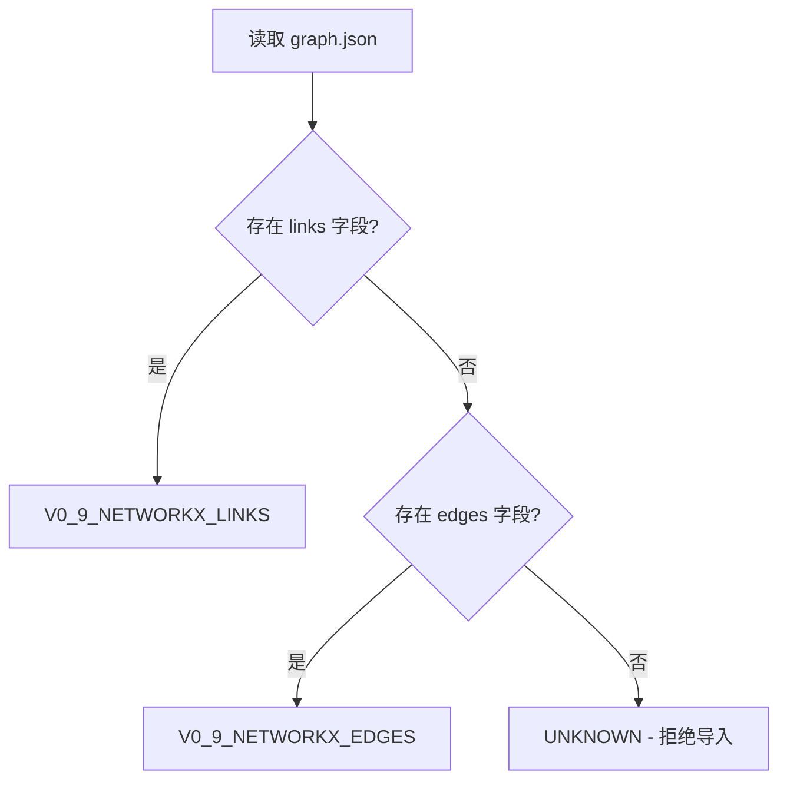
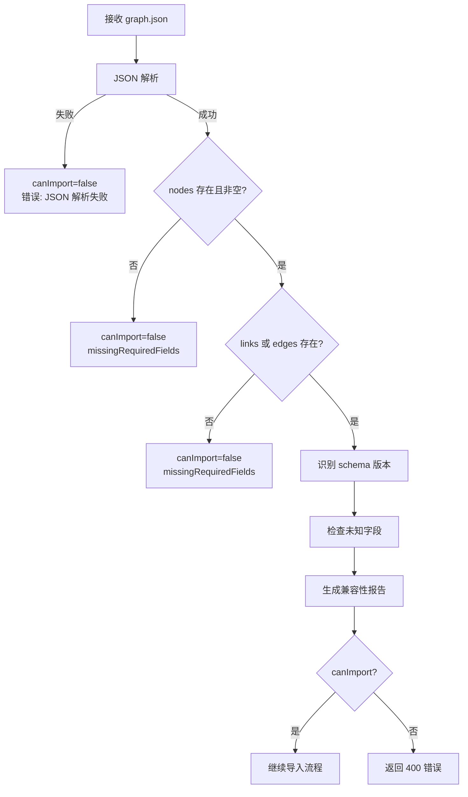

# Graphify JSON 契约规范

> **版本**: v1.0  
> **最后更新**: 2026-07-06  
> **适用范围**: Graphify 输出与 LegacyGraph 系统的集成

## 1. 概述

本文档定义 Graphify 工具输出的 `graph.json` 文件格式规范。该文件是 Graphify 与 LegacyGraph 系统集成的核心契约，所有导入操作都必须遵循此规范。

### 1.1 设计原则

- **向后兼容**: 支持 Graphify 0.9.x 的两种边字段格式
- **严格验证**: 必需字段缺失时拒绝导入
- **宽容处理**: 未知字段记录警告但不阻断导入
- **证据追踪**: 所有节点和边必须携带来源信息

## 2. Schema 版本

LegacyGraph 支持以下 Graphify schema 版本：

| 版本标识 | 枚举值 | 边字段名 | 说明 |
|---------|--------|---------|------|
| v0.9 (links) | `V0_9_NETWORKX_LINKS` | `links` | NetworkX node-link 标准格式 |
| v0.9 (edges) | `V0_9_NETWORKX_EDGES` | `edges` | NetworkX 替代格式 |
| 未知 | `UNKNOWN` | - | 无法识别的格式，拒绝导入 |

### 2.1 版本识别规则



## 3. 顶层结构

### 3.1 必需字段

| 字段 | 类型 | 必填 | 说明 |
|------|------|------|------|
| `nodes` | `Node[]` | ✅ | 节点列表，不能为空数组 |
| `links` 或 `edges` | `Edge[]` | ✅ | 边列表，至少一个存在 |

**验证规则**:
- `nodes` 缺失或为空 → `canImport=false`, `missingRequiredFields=["nodes"]`
- `links` 和 `edges` 都缺失 → `canImport=false`, `missingRequiredFields=["links 或 edges"]`

### 3.2 可选字段

| 字段 | 类型 | 说明 |
|------|------|------|
| `directed` | `boolean` | 是否为有向图，默认 `false` |
| `multigraph` | `boolean` | 是否为多重图 |
| `hyperedges` | `Hyperedge[]` | 超边列表（多节点关系） |
| `built_at_commit` | `string` | 构建时的 Git commit hash |
| `graphify_version` | `string` | Graphify 工具版本号 |

### 3.3 未知字段处理

不在上述列表中的顶层字段**不会阻断导入**，但会：
1. 记录到 `unsupportedTopLevelFields` 列表
2. 生成警告信息到 `warnings` 字段
3. 在兼容性报告中展示

## 4. 节点结构 (Node)

```typescript
interface Node {
  id: string;              // 必需：节点唯一标识
  label: string;           // 必需：节点标签/名称
  file_type?: string;      // 可选：文件类型
  source_file?: string;    // 可选：源文件路径
  source_location?: string;// 可选：源码位置
  community?: number;      // 可选：社区编号
  community_name?: string; // 可选：社区名称
  norm_label?: string;     // 可选：归一化标签
}
```

### 4.1 字段说明

| 字段 | 类型 | 必填 | 说明 | 示例 |
|------|------|------|------|------|
| `id` | `string` | ✅ | 全局唯一标识 | `"src_user_controller"` |
| `label` | `string` | ✅ | 人类可读名称 | `"UserController"` |
| `file_type` | `string` | ❌ | 文件类型分类 | `"code"`, `"sql"`, `"vue"` |
| `source_file` | `string` | ❌ | 源文件路径（Unix 格式） | `"src/main/java/UserController.java"` |
| `source_location` | `string` | ❌ | 行号或范围 | `"L42"`, `"L42-L50"` |
| `community` | `integer` | ❌ | 社区聚类编号 | `1` |
| `community_name` | `string` | ❌ | 社区语义名称 | `"用户模块"` |
| `norm_label` | `string` | ❌ | 归一化后的标签 | `"usercontroller"` |

### 4.2 节点类型推断

LegacyGraph 根据 `file_type` 和 `label` 自动推断节点类型：

| file_type | label 特征 | 推断 NodeType |
|-----------|-----------|--------------|
| `code` | 含 `Controller` | `Controller` |
| `code` | 含 `Service` | `Service` |
| `code` | 含 `Repository`/`Mapper` | `Mapper` |
| `code` | 含 `Entity`/`Model` | `BusinessObject` |
| `code` | 含 `Config` | `ConfigItem` |
| `code` | 含 `()` | `Method` |
| `sql` | - | `Table` |
| `vue`/`jsx`/`tsx` | - | `Page` |
| 其他 | - | `Feature` |

## 5. 边结构 (Edge / Link)

```typescript
interface Edge {
  source: string;          // 必需：源节点 ID
  target: string;          // 必需：目标节点 ID
  relation: string;        // 必需：关系类型
  confidence?: string;     // 可选：置信度等级
  confidence_score?: number; // 可选：置信度分数
  source_file?: string;    // 可选：源文件路径
  source_location?: string;// 可选：源码位置
}
```

### 5.1 字段说明

| 字段 | 类型 | 必填 | 说明 |
|------|------|------|------|
| `source` | `string` | ✅ | 源节点 ID，必须在 `nodes` 中存在 |
| `target` | `string` | ✅ | 目标节点 ID，必须在 `nodes` 中存在 |
| `relation` | `string` | ✅ | 关系类型（见映射表） |
| `confidence` | `string` | ❌ | 置信度等级：`EXTRACTED`, `INFERRED`, `AMBIGUOUS` |
| `confidence_score` | `number` | ❌ | 置信度分数（0.0-1.0） |
| `source_file` | `string` | ❌ | 证据文件路径 |
| `source_location` | `string` | ❌ | 证据位置 |

### 5.2 关系类型映射

| Graphify relation | LegacyGraph EdgeType | 说明 |
|------------------|---------------------|------|
| `calls`, `invokes` | `CALLS` | 方法/函数调用 |
| `extends`, `inherits`, `implements` | `IMPLEMENTED_BY` | 继承/实现关系 |
| `imports`, `uses`, `depends_on` | `USES` | 依赖关系 |
| `reads_from`, `reads` | `READS` | 读取数据表 |
| `writes_to`, `writes`, `updates` | `WRITES` | 写入数据表 |
| `contains`, `has` | `CONTAINS` | 包含关系 |
| `references` | `REFERENCES` | 引用关系 |
| `joins` | `JOINS` | SQL JOIN |
| 其他 | `USES` | 默认映射，状态为 `PENDING_CONFIRM` |

### 5.3 置信度映射

| Graphify confidence | 默认分数 | LegacyGraph 状态 | 审核流程 |
|--------------------|---------|----------------|---------|
| `EXTRACTED` | 0.95 | `CONFIRMED` | 无需审核 |
| `INFERRED` + `confidence_score` | 原值（限制 0.55-0.95） | `PENDING_CONFIRM` | ≥0.90 可自动确认 |
| `INFERRED` 无 score | 0.75 | `PENDING_CONFIRM` | 需人工审核 |
| `AMBIGUOUS` | 0.45 | `PENDING_CONFIRM` | 强制人工审核 |
| 未指定 | 0.95 | `CONFIRMED` | 无需审核 |

## 6. 兼容性检查流程

### 6.1 检查流程



### 6.2 兼容性报告 (GraphifyCompatibilityReport)

```java
record GraphifyCompatibilityReport(
    GraphifySchemaVersion schemaVersion,  // 识别的版本
    boolean supported,                     // 是否支持
    boolean canImport,                     // 是否可以导入
    int nodeCount,                         // 节点数量
    int edgeCount,                         // 边数量
    int hyperedgeCount,                    // 超边数量
    List<String> unsupportedTopLevelFields, // 未知顶层字段
    List<String> missingRequiredFields,    // 缺失必需字段
    List<String> warnings                  // 警告信息
)
```

### 6.3 检查失败场景

| 场景 | canImport | 错误信息示例 |
|------|-----------|-------------|
| JSON 解析失败 | `false` | `兼容性检查失败: JSON 解析失败: Unexpected token` |
| `nodes` 缺失 | `false` | `兼容性检查失败: 缺失字段=[nodes]` |
| `nodes` 为空数组 | `false` | `兼容性检查失败: 缺失字段=[nodes]` |
| `links` 和 `edges` 都缺失 | `false` | `兼容性检查失败: 缺失字段=[links 或 edges]` |
| Schema 版本未知 | `false` | `兼容性检查失败: 不支持的 schema 版本` |
| 存在未知字段 | `true` | `警告: 发现未知顶层字段 [custom_field]` |

## 7. 完整示例

### 7.1 V0_9_NETWORKX_LINKS 格式

```json
{
  "directed": true,
  "multigraph": false,
  "built_at_commit": "31211a0e7c512d63972b4f0438877d3777ae0e85",
  "graphify_version": "0.9.7",
  "nodes": [
    {
      "id": "src_user_controller",
      "label": "UserController",
      "file_type": "code",
      "source_file": "backend/src/main/java/demo/UserController.java",
      "source_location": "L12-L50",
      "community": 1,
      "community_name": "用户模块",
      "norm_label": "usercontroller"
    },
    {
      "id": "src_user_service",
      "label": "UserService",
      "file_type": "code",
      "source_file": "backend/src/main/java/demo/UserService.java",
      "source_location": "L20-L80"
    },
    {
      "id": "tbl_users",
      "label": "users",
      "file_type": "sql",
      "source_file": "backend/src/main/resources/db/migration/V1__init.sql"
    }
  ],
  "links": [
    {
      "source": "src_user_controller",
      "target": "src_user_service",
      "relation": "calls",
      "confidence": "EXTRACTED",
      "confidence_score": 0.98,
      "source_file": "backend/src/main/java/demo/UserController.java",
      "source_location": "L33"
    },
    {
      "source": "src_user_service",
      "target": "tbl_users",
      "relation": "reads_from",
      "confidence": "INFERRED",
      "confidence_score": 0.85
    }
  ],
  "hyperedges": []
}
```

### 7.2 V0_9_NETWORKX_EDGES 格式

与上述示例完全相同，仅将 `links` 字段名替换为 `edges`。

## 8. 文件约束

| 约束项 | 值 | 说明 |
|--------|-----|------|
| 文件名 | `graph.json` | 固定文件名 |
| 最大文件大小 | 100 MB | 超过则拒绝导入 |
| 路径分隔符 | `/` | Unix 格式，Windows 路径需转换 |
| 编码 | UTF-8 | 标准 JSON 编码 |

## 9. 错误码参考

| 错误码 | HTTP Status | 说明 |
|--------|-------------|------|
| `GRAPHIFY_JSON_PARSE_ERROR` | 400 | JSON 格式错误 |
| `GRAPHIFY_MISSING_NODES` | 400 | 缺少 nodes 字段 |
| `GRAPHIFY_MISSING_EDGES` | 400 | 缺少 links/edges 字段 |
| `GRAPHIFY_UNSUPPORTED_VERSION` | 400 | 不支持的 schema 版本 |
| `GRAPHIFY_FILE_TOO_LARGE` | 413 | 文件超过大小限制 |
| `GRAPHIFY_INVALID_FILENAME` | 400 | 文件名不是 graph.json |

## 10. 版本演进

| 版本 | 日期 | 变更 |
|------|------|------|
| v0.9 | 2026-07 | 初始版本，支持 NetworkX node-link 格式 |
| v1.0 | 2026-07 | 正式契约文档化，增加兼容性检查 |

---

**相关文档**:
- [导入作业运维手册](../graphify-ops/import-job-runbook.md)
- [Benchmark 测试用例](../graphify-eval/benchmark-cases.md)
