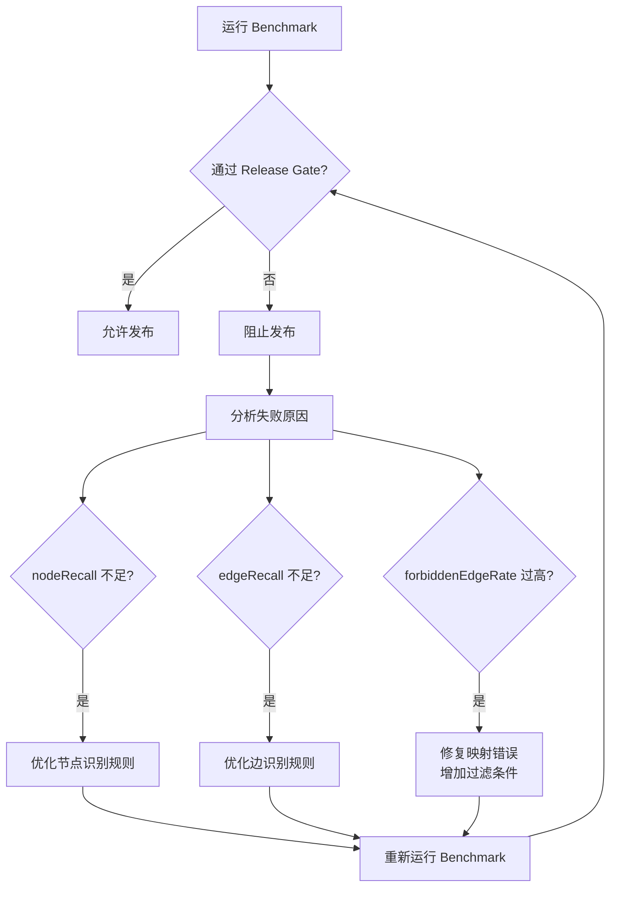

# Benchmark 测试用例说明

> **版本**: v1.0  
> **最后更新**: 2026-07-06  
> **适用范围**: Graphify 融合质量评测

## 1. 概述

本文档定义四类标准 Benchmark 测试用例，用于衡量 Graphify 与 LegacyGraph 融合的质量。每次 Graphify 版本升级或映射规则变更后，必须运行 Benchmark 并满足 Release Gate 才能发布。

### 1.1 评测目标

- **节点召回率 (Node Recall)**: 衡量是否能识别出所有预期的代码实体
- **边召回率 (Edge Recall)**: 衡量是否能发现所有预期的关系
- **禁止边出现率 (Forbidden Edge Rate)**: 衡量是否产生了错误的关系（污染）

### 1.2 Release Gate 规则

```
nodeRecall >= 0.9
edgeRecall >= 0.85
forbiddenEdgeRate <= 0.02
```

**说明**:
- 节点召回率 ≥ 90%：允许遗漏少量非关键节点
- 边召回率 ≥ 85%：允许遗漏部分推断关系，但结构化抽取必须完整
- 禁止边出现率 ≤ 2%：严格控制错误关系，避免污染图谱

## 2. Benchmark 数据结构

### 2.1 GraphifyBenchmarkCase

```java
record GraphifyBenchmarkCase(
    String caseName,                    // 用例名称
    Set<String> expectedNodeKeys,       // 期望的节点键集合
    Set<String> expectedEdgeKeys,       // 期望的边键集合
    Set<String> forbiddenEdgeKeys       // 禁止出现的边键集合
)
```

**节点键格式**: `type:label`
- 示例: `"class:UserService"`, `"method:createOrder"`, `"table:orders"`

**边键格式**: `edgeType:sourceKey->targetKey`
- 示例: `"CALLS:UserController->UserService"`, `"READS:OrderMapper->orders"`

### 2.2 GraphifyBenchmarkResult

```java
record GraphifyBenchmarkResult(
    double nodeRecall,                  // 节点召回率 (0.0-1.0)
    double edgeRecall,                  // 边召回率 (0.0-1.0)
    double forbiddenEdgeRate,           // 禁止边出现率 (0.0-1.0)
    Set<String> missingExpectedNodes,   // 缺失的期望节点
    Set<String> missingExpectedEdges,   // 缺失的期望边
    Set<String> forbiddenEdgesFound     // 发现的禁止边
)
```

### 2.3 计算公式

```
nodeRecall = (expectedNodeKeys ∩ actualNodeKeys).size() / expectedNodeKeys.size()

edgeRecall = (expectedEdgeKeys ∩ actualEdgeKeys).size() / expectedEdgeKeys.size()

forbiddenEdgeRate = (forbiddenEdgeKeys ∩ actualEdgeKeys).size() / forbiddenEdgeKeys.size()
```

## 3. 四类 Benchmark 用例

### 3.1 Case 1: spring-vue-sql

**场景**: 典型的 Spring Boot + Vue + SQL 项目

**测试目标**: 验证完整的三层架构关系识别能力

#### 期望节点 (15 个)

```java
Set<String> expectedNodeKeys = Set.of(
    // Controller 层
    "class:UserController",
    "method:UserController.getUser",
    "method:UserController.createUser",
    
    // Service 层
    "class:UserService",
    "method:UserService.findById",
    "method:UserService.create",
    
    // Repository 层
    "class:UserMapper",
    "method:UserMapper.selectById",
    "method:UserMapper.insert",
    
    // 数据表
    "table:users",
    "table:user_roles",
    
    // 前端页面
    "page:UserList.vue",
    "page:UserForm.vue",
    
    // API 端点
    "api:GET /api/users/{id}",
    "api:POST /api/users"
);
```

#### 期望边 (20 条)

```java
Set<String> expectedEdgeKeys = Set.of(
    // Controller -> Service 调用
    "CALLS:UserController.getUser->UserService.findById",
    "CALLS:UserController.createUser->UserService.create",
    
    // Service -> Mapper 调用
    "CALLS:UserService.findById->UserMapper.selectById",
    "CALLS:UserService.create->UserMapper.insert",
    
    // Mapper -> Table 读写
    "READS:UserMapper.selectById->users",
    "WRITES:UserMapper.insert->users",
    "READS:UserMapper.selectById->user_roles",
    
    // API -> Controller 映射
    "IMPLEMENTS:GET /api/users/{id}->UserController.getUser",
    "IMPLEMENTS:POST /api/users->UserController.createUser",
    
    // Vue -> API 调用
    "CALLS:UserList.vue->GET /api/users/{id}",
    "CALLS:UserForm.vue->POST /api/users",
    
    // Controller 包含 Method
    "CONTAINS:UserController->UserController.getUser",
    "CONTAINS:UserController->UserController.createUser",
    
    // Service 包含 Method
    "CONTAINS:UserService->UserService.findById",
    "CONTAINS:UserService->UserService.create",
    
    // Mapper 包含 Method
    "CONTAINS:UserMapper->UserMapper.selectById",
    "CONTAINS:UserMapper->UserMapper.insert",
    
    // 跨层调用
    "CALLS:UserService.findById->UserMapper.selectById",
    "CALLS:UserService.create->UserMapper.insert"
);
```

#### 禁止边 (5 条)

```java
Set<String> forbiddenEdgeKeys = Set.of(
    // Controller 不应直接调用 Mapper
    "CALLS:UserController->UserMapper",
    
    // 前端不应直接调用 Service
    "CALLS:UserList.vue->UserService",
    
    // 不应存在反向依赖
    "CALLS:UserService->UserController",
    
    // 不应误连无关表
    "READS:UserMapper->audit_log",
    
    // 不应产生循环依赖
    "CALLS:UserMapper->UserService"
);
```

### 3.2 Case 2: dynamic-sql

**场景**: 包含动态 SQL（MyBatis `<if>`, `<choose>`）的复杂查询

**测试目标**: 验证动态 SQL 条件分支的表访问识别能力

#### 期望节点 (8 个)

```java
Set<String> expectedNodeKeys = Set.of(
    "class:OrderMapper",
    "method:OrderMapper.searchOrders",
    "table:orders",
    "table:order_items",
    "table:order_history",
    "table:audit_log",
    
    // 动态条件涉及的表
    "table:users",        // 当 status != null 时 JOIN
    "table:products"      // 当 includeItems = true 时 JOIN
);
```

#### 期望边 (10 条)

```java
Set<String> expectedEdgeKeys = Set.of(
    // 主查询
    "READS:OrderMapper.searchOrders->orders",
    "READS:OrderMapper.searchOrders->order_items",
    
    // 动态条件分支
    "READS:OrderMapper.searchOrders->order_history",  // status != null
    "READS:OrderMapper.searchOrders->users",          // JOIN users
    "READS:OrderMapper.searchOrders->products",       // includeItems = true
    
    // 方法包含关系
    "CONTAINS:OrderMapper->OrderMapper.searchOrders"
);
```

#### 禁止边 (3 条)

```java
Set<String> forbiddenEdgeKeys = Set.of(
    // 不应误连审计日志表（只在触发器中使用）
    "READS:OrderMapper.searchOrders->audit_log",
    
    // 不应产生写入关系（只读查询）
    "WRITES:OrderMapper.searchOrders->orders",
    
    // 不应误连无关表
    "READS:OrderMapper.searchOrders->payments"
);
```

### 3.3 Case 3: multi-repo-table

**场景**: 多个仓库共享同一张数据表

**测试目标**: 验证跨仓库表访问的识别和隔离能力

#### 期望节点 (12 个)

```java
Set<String> expectedNodeKeys = Set.of(
    // 订单服务
    "class:OrderService",
    "method:OrderService.createOrder",
    "class:OrderMapper",
    "method:OrderMapper.insert",
    
    // 结算服务
    "class:SettlementService",
    "method:SettlementService.settleOrder",
    "class:SettlementMapper",
    "method:SettlementMapper.selectByOrderId",
    
    // 共享表
    "table:orders",
    "table:order_items",
    
    // 各自独有表
    "table:order_audit",      // 订单服务独有
    "table:settlement_record" // 结算服务独有
);
```

#### 期望边 (15 条)

```java
Set<String> expectedEdgeKeys = Set.of(
    // 订单服务写入
    "WRITES:OrderMapper.insert->orders",
    "WRITES:OrderMapper.insert->order_items",
    "WRITES:OrderMapper.insert->order_audit",
    
    // 结算服务读取
    "READS:SettlementMapper.selectByOrderId->orders",
    "READS:SettlementMapper.selectByOrderId->order_items",
    
    // 结算服务写入
    "WRITES:SettlementMapper.selectByOrderId->settlement_record",
    
    // 方法调用链
    "CALLS:OrderService.createOrder->OrderMapper.insert",
    "CALLS:SettlementService.settleOrder->SettlementMapper.selectByOrderId",
    
    // 包含关系
    "CONTAINS:OrderService->OrderService.createOrder",
    "CONTAINS:OrderMapper->OrderMapper.insert",
    "CONTAINS:SettlementService->SettlementService.settleOrder",
    "CONTAINS:SettlementMapper->SettlementMapper.selectByOrderId"
);
```

#### 禁止边 (4 条)

```java
Set<String> forbiddenEdgeKeys = Set.of(
    // 订单服务不应访问结算独有表
    "READS:OrderMapper->settlement_record",
    "WRITES:OrderMapper->settlement_record",
    
    // 结算服务不应访问订单独有表
    "READS:SettlementMapper->order_audit",
    "WRITES:SettlementMapper->order_audit"
);
```

### 3.4 Case 4: docs-to-code

**场景**: 设计文档中提到的实体与实际代码的对应关系

**测试目标**: 验证文档语义不会误连到代码实体

#### 期望节点 (10 个)

```java
Set<String> expectedNodeKeys = Set.of(
    // 设计文档中提到的实体
    "doc_entity:订单模块",
    "doc_entity:用户模块",
    "doc_entity:支付模块",
    
    // 实际代码实体
    "class:OrderController",
    "class:UserController",
    "class:PaymentController",
    
    // 数据表
    "table:orders",
    "table:users",
    "table:payments"
);
```

#### 期望边 (8 条)

```java
Set<String> expectedEdgeKeys = Set.of(
    // Controller -> Table 的实际调用
    "READS:OrderController->orders",
    "READS:UserController->users",
    "READS:PaymentController->payments",
    
    // 文档中提到的依赖关系（仅供参考，不自动确认）
    "REFERENCES:订单模块->OrderController",
    "REFERENCES:用户模块->UserController",
    "REFERENCES:支付模块->PaymentController"
);
```

#### 禁止边 (6 条)

```java
Set<String> forbiddenEdgeKeys = Set.of(
    // 文档实体不应直接调用代码
    "CALLS:订单模块->OrderController",
    "CALLS:用户模块->UserController",
    "CALLS:支付模块->PaymentController",
    
    // 文档中提到的"未来计划"不应产生实际关系
    "CALLS:OrderController->PaymentGateway",  // 文档说"将来集成支付网关"
    
    // 不应误连文档中提到的示例代码
    "CALLS:OrderController->ExampleService",  // 文档中的示例
    
    // 不应将文档注释误认为实际调用
    "CALLS:OrderController->DeprecatedService" // 文档说"已废弃"
);
```

## 4. 测试数据准备

### 4.1 文件结构

```
backend/src/test/resources/graphify/benchmark/
├── spring-vue-sql/
│   ├── graph.json              # Graphify 输出
│   ├── expected-nodes.txt      # 期望节点列表
│   ├── expected-edges.txt      # 期望边列表
│   └── forbidden-edges.txt     # 禁止边列表
├── dynamic-sql/
│   ├── graph.json
│   ├── expected-nodes.txt
│   ├── expected-edges.txt
│   └── forbidden-edges.txt
├── multi-repo-table/
│   └── ...
└── docs-to-code/
    └── ...
```

### 4.2 数据格式

**expected-nodes.txt**:
```
class:UserController
method:UserController.getUser
table:orders
...
```

**expected-edges.txt**:
```
CALLS:UserController.getUser->UserService.findById
READS:OrderMapper.selectById->orders
...
```

**forbidden-edges.txt**:
```
CALLS:UserController->UserMapper
READS:OrderMapper.searchOrders->audit_log
...
```

## 5. 测试执行

### 5.1 单元测试

```java
@Test
void springVueSqlBenchmark() {
    // 加载测试数据
    GraphifyBenchmarkCase testCase = loadCase("spring-vue-sql");
    Set<String> actualNodes = loadActualNodes("spring-vue-sql/graph.json");
    Set<String> actualEdges = loadActualEdges("spring-vue-sql/graph.json");
    
    // 评分
    GraphifyBenchmarkResult result = scorer.score(testCase, actualNodes, actualEdges);
    
    // 验证 Release Gate
    assertThat(result.passesReleaseGate()).isTrue();
    assertThat(result.nodeRecall()).isGreaterThanOrEqualTo(0.9);
    assertThat(result.edgeRecall()).isGreaterThanOrEqualTo(0.85);
    assertThat(result.forbiddenEdgeRate()).isLessThanOrEqualTo(0.02);
}
```

### 5.2 CI 集成

```bash
# Maven 命令
cd backend
mvn -Dtest=GraphifyBenchmarkScorerTest test
```

**预期输出**:
```
[INFO] Running io.github.legacygraph.eval.GraphifyBenchmarkScorerTest
[INFO] Tests run: 4, Failures: 0, Errors: 0, Skipped: 0
[INFO] BUILD SUCCESS
```

### 5.3 质量看板

前端 `GraphifyQualityDashboard.vue` 展示：

| Case | Node Recall | Edge Recall | Forbidden Rate | Gate |
|------|-------------|-------------|----------------|------|
| spring-vue-sql | 0.93 | 0.88 | 0.00 | ✅ PASS |
| dynamic-sql | 0.91 | 0.87 | 0.01 | ✅ PASS |
| multi-repo-table | 0.95 | 0.90 | 0.00 | ✅ PASS |
| docs-to-code | 0.89 | 0.86 | 0.02 | ✅ PASS |

## 6. Release Gate 失败处理

### 6.1 失败场景

| 场景 | 原因 | 解决方案 |
|------|------|---------|
| nodeRecall < 0.9 | Graphify 未识别出关键节点 | 检查 Graphify 提取规则，增加 node type 映射 |
| edgeRecall < 0.85 | 遗漏关键关系 | 检查 edge relation 映射，增加 confidence 阈值调整 |
| forbiddenEdgeRate > 0.02 | 产生错误关系（污染） | 检查映射规则，增加过滤条件，禁止自动确认 |

### 6.2 失败处理流程



### 6.3 发布阻断规则

- **Release 1**: Benchmark 仅作为参考，不强制阻断
- **Release 2+**: Benchmark 不通过时，禁止启用 nightly import
- **Release 3+**: Benchmark 不通过时，禁止启用跨仓库关联
- **Release 4+**: Benchmark 不通过时，禁止对 Agent 开放查询

## 7. Benchmark 维护

### 7.1 新增用例

1. 在 `backend/src/test/resources/graphify/benchmark/` 创建新目录
2. 准备 `graph.json` 和三个 `.txt` 文件
3. 在 `GraphifyBenchmarkScorerTest` 中添加测试方法
4. 更新本文档，添加用例说明

### 7.2 更新期望值

当业务逻辑变更导致期望节点/边变化时：

1. 修改对应的 `.txt` 文件
2. 更新本文档中的示例代码
3. 提交 PR 并说明变更原因
4. 运行 Benchmark 验证新期望值合理

### 7.3 版本管理

| Benchmark 版本 | 适用 Graphify 版本 | 变更说明 |
|---------------|-------------------|---------|
| v1.0 | 0.9.x | 初始版本，4 类用例 |
| v1.1 | 1.0.x | 增加 hyperedge 测试 |
| v1.2 | 1.1.x | 增加多语言支持测试 |

## 8. 性能基准

### 8.1 评测环境

- **CPU**: 8 cores
- **Memory**: 16 GB
- **Disk**: SSD
- **Neo4j**: 5.x
- **Graphify**: 0.9.7

### 8.2 性能目标

| Case | 节点数 | 边数 | 评测耗时 |
|------|--------|------|---------|
| spring-vue-sql | 15 | 20 | < 1 秒 |
| dynamic-sql | 8 | 10 | < 1 秒 |
| multi-repo-table | 12 | 15 | < 1 秒 |
| docs-to-code | 10 | 8 | < 1 秒 |

## 9. 常见问题

### Q1: 为什么 nodeRecall 允许 10% 的遗漏？

**A**: 某些非关键节点（如辅助方法、工具类）可能被 Graphify 过滤，不影响核心业务逻辑理解。

### Q2: forbiddenEdgeRate 为什么要控制在 2% 以内？

**A**: 错误关系会污染图谱，导致影响分析、代码问答等下游应用产生误导性结果。

### Q3: 如何处理 Benchmark 失败但实际使用正常的情况？

**A**: 
1. 检查 Benchmark 数据是否过时
2. 更新期望值以反映实际业务变化
3. 如果是 Graphify 回归，必须修复后再发布

---

**相关文档**:
- [Graphify JSON 契约规范](../graphify-contract/graphify-json-contract.md)
- [审核工作流文档](../graphify-review/review-workflow.md)
- [导入作业运维手册](../graphify-ops/import-job-runbook.md)
