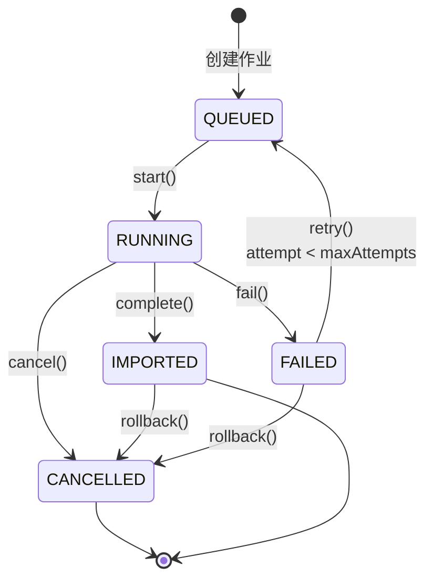
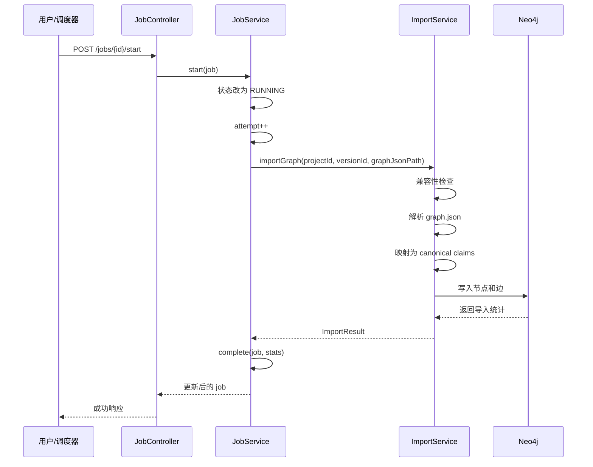

# 导入作业运维手册

> **版本**: v1.0  
> **最后更新**: 2026-07-06  
> **适用范围**: Graphify 导入作业的生产运维

## 1. 概述

本文档提供 Graphify 导入作业的完整运维指南，包括状态管理、故障处理、回滚操作和监控告警配置。

### 1.1 核心组件

- **GraphifyImportJobService**: 作业生命周期管理
- **GraphifyRollbackService**: 按 job ID 回滚导入
- **GraphifyMetrics**: Micrometer 指标收集
- **GraphifyOpsMonitor**: 定时健康检查和告警

## 2. 作业状态流转

### 2.1 状态定义

| 状态 | 说明 | 可执行操作 |
|------|------|-----------|
| `QUEUED` | 排队等待执行 | start |
| `RUNNING` | 正在执行导入 | cancel |
| `IMPORTED` | 导入成功完成 | rollback |
| `FAILED` | 导入失败 | retry, rollback |
| `CANCELLED` | 已取消 | - |

### 2.2 状态转换图



### 2.3 状态检查方法

```java
// 检查是否已终止
boolean isTerminated() {
    return status == IMPORTED || status == FAILED || status == CANCELLED;
}

// 检查是否可重试
boolean canRetry() {
    return status == FAILED && attempt < maxAttempts;
}
```

## 3. 作业生命周期管理

### 3.1 创建作业

```bash
# API 调用
POST /api/lg/projects/{projectId}/graphify/jobs

{
  "versionId": "v1.2.3",
  "projectRoot": "/path/to/project",
  "branchName": "main",
  "sourceCommit": "abc123def456"
}
```

**响应示例**:
```json
{
  "jobId": "550e8400-e29b-41d4-a716-446655440000",
  "projectId": "demo-app",
  "versionId": "v1.2.3",
  "status": "QUEUED",
  "attempt": 0,
  "createdAt": "2026-07-06T10:00:00"
}
```

### 3.2 启动作业

**触发方式**:
1. **手动触发**: 通过 Job Center 页面点击"立即执行"
2. **定时触发**: Cron 表达式 `0 0 2 * * *`（每天凌晨 2 点）
3. **Webhook 触发**: 代码提交后自动触发

**执行流程**:


### 3.3 作业字段说明

| 字段 | 类型 | 说明 |
|------|------|------|
| `jobId` | `string` | UUID 格式的作业唯一标识 |
| `projectId` | `string` | 项目 ID |
| `versionId` | `string` | 版本标识（如 v1.2.3） |
| `projectRoot` | `string` | 项目根目录路径 |
| `branchName` | `string` | Git 分支名称 |
| `sourceCommit` | `string` | 源码 Git commit hash |
| `graphifyVersion` | `string` | Graphify 工具版本 |
| `status` | `enum` | 当前状态 |
| `attempt` | `int` | 当前尝试次数（从 0 开始） |
| `maxAttempts` | `int` | 最大尝试次数（默认 3） |
| `createdAt` | `datetime` | 创建时间 |
| `startedAt` | `datetime` | 开始执行时间 |
| `finishedAt` | `datetime` | 完成时间（成功/失败/取消） |
| `errorMessage` | `string` | 失败时的错误信息 |
| `importedNodes` | `int` | 导入的节点数 |
| `importedEdges` | `int` | 导入的边数 |
| `importedEvidence` | `int` | 导入的证据数 |

## 4. 重试策略

### 4.1 重试条件

作业满足以下条件时可以重试：
- 状态为 `FAILED`
- `attempt < maxAttempts`（默认 maxAttempts=3）

### 4.2 重试流程

```bash
# API 调用
POST /api/lg/projects/{projectId}/graphify/jobs/{jobId}/retry
```

**重试操作**:
1. 状态重置为 `QUEUED`
2. 清空 `finishedAt`、`startedAt`、`errorMessage`
3. 清空导入统计字段
4. 等待下次调度或手动启动

### 4.3 重试次数限制

| 场景 | maxAttempts | 说明 |
|------|-------------|------|
| 默认配置 | 3 | 初始尝试 + 2 次重试 |
| 大型项目（>100k 行） | 5 | 增加重试容忍度 |
| 关键项目 | 1 | 失败立即告警，不自动重试 |

**配置方式**:
```yaml
legacygraph:
  graphify:
    import:
      max-attempts: 3
```

## 5. 回滚操作

### 5.1 回滚场景

| 场景 | 触发方式 | 说明 |
|------|---------|------|
| 导入后发现数据错误 | 手动回滚 | 人工发现图谱质量问题 |
| Benchmark 未通过 | 自动回滚 | Release 2+ 自动触发 |
| 紧急下线 Graphify | 批量回滚 | 禁用整个 Graphify 功能 |

### 5.2 回滚 API

```bash
POST /api/lg/projects/{projectId}/graphify/jobs/{jobId}/rollback
```

**响应示例**:
```json
{
  "jobId": "550e8400-e29b-41d4-a716-446655440000",
  "removedNodes": 1234,
  "removedEdges": 5678,
  "removedEvidence": 890
}
```

### 5.3 回滚实现原理

```java
public RollbackResult rollback(String jobId) {
    // 1. 查找作业
    GraphifyImportJob job = jobRepository.findById(jobId)
        .orElseThrow(() -> new IllegalArgumentException("作业不存在"));
    
    // 2. 检查状态（运行中不能回滚）
    if (job.getStatus() == Status.RUNNING) {
        throw new IllegalStateException("作业正在运行中，无法回滚");
    }
    
    // 3. 删除 Neo4j 中该 job 导入的所有 claims
    // Cypher 查询：
    // MATCH (n {graphifyImportJobId: $jobId}) DETACH DELETE n
    // 只删除 sourceType 为 GRAPHIFY_AST 或 GRAPHIFY_SEMANTIC 的节点
    
    // 4. 更新作业状态为 CANCELLED
    job.setStatus(Status.CANCELLED);
    jobRepository.save(job);
    
    return new RollbackResult(jobId, removedNodes, removedEdges, removedEvidence);
}
```

### 5.4 回滚安全检查

| 检查项 | 说明 |
|--------|------|
| 作业不存在 | 返回 404，提示"作业不存在" |
| 作业正在运行 | 返回 409，提示"作业正在运行中，无法回滚" |
| 作业已是 CANCELLED | 返回 200，幂等操作 |
| 删除 LegacyGraph 原生 claims | **不会发生**，只删除 Graphify 来源的 claims |

### 5.5 回滚演练

**每月回滚演练步骤**:

1. **选择演练作业**: 从最近成功导入的作业中选择一个
2. **记录当前状态**:
   ```bash
   # 查询当前 Graphify claims 数量
   MATCH (n:Claim {sourceType: 'GRAPHIFY_AST'}) 
   RETURN count(n) AS beforeCount
   ```
3. **执行回滚**:
   ```bash
   curl -X POST http://localhost:8080/api/lg/projects/demo/graphify/jobs/{jobId}/rollback
   ```
4. **验证结果**:
   ```bash
   # 验证 Graphify claims 已删除
   MATCH (n:Claim {sourceType: 'GRAPHIFY_AST', graphifyImportJobId: '{jobId}'}) 
   RETURN count(n) AS afterCount
   # 期望: afterCount = 0
   
   # 验证 LegacyGraph 原生 claims 未受影响
   MATCH (n:Claim {sourceType: 'EXTRACTED'}) 
   RETURN count(n) AS nativeCount
   # 期望: nativeCount 与回滚前相同
   ```
5. **记录演练结果**: 填写演练报告，包括耗时、删除数量、异常信息

**目标**: 回滚操作在 10 分钟内完成，且不删除 LegacyGraph 原生 claims。

## 6. 监控指标

### 6.1 Micrometer 指标

| 指标名称 | 类型 | 说明 |
|---------|------|------|
| `legacygraph.graphify.import.duration` | Timer | 导入耗时分布 |
| `legacygraph.graphify.import.success` | Counter | 导入成功次数 |
| `legacygraph.graphify.import.failures` | Counter | 导入失败次数 |
| `legacygraph.graphify.import.nodes` | Counter | 导入节点总数 |
| `legacygraph.graphify.import.edges` | Counter | 导入边总数 |
| `legacygraph.graphify.review.queue.size` | Gauge | 待审核候选数 |

### 6.2 Prometheus 查询示例

```promql
# 最近 1 小时导入成功率
rate(legacygraph_graphify_import_success_total[1h]) 
/ 
rate(legacygraph_graphify_import_success_total[1h] + legacygraph_graphify_import_failures_total[1h]) 
* 100

# P95 导入耗时
histogram_quantile(0.95, rate(legacygraph_graphify_import_duration_seconds_bucket[5m]))

# 审核队列积压趋势
legacygraph_graphify_review_queue_size
```

## 7. 告警配置

### 7.1 告警规则

| 告警名称 | 条件 | 严重级别 | 通知方式 |
|---------|------|---------|---------|
| 导入失败率过高 | 失败率 > 10% 持续 5 分钟 | Warning | 邮件 + Slack |
| 导入超时 | 单次导入 > 15 分钟 | Critical | 电话 + 短信 |
| 审核队列积压 | 待审核数 > 100 | Warning | 邮件 |
| 导入卡住 | RUNNING 状态 > 1 小时 | Critical | 电话 |
| 连续失败 | 连续 3 次失败 | Critical | 电话 + 邮件 |

### 7.2 Prometheus AlertManager 配置

```yaml
groups:
  - name: graphify_import
    rules:
      - alert: GraphifyImportHighFailureRate
        expr: |
          rate(legacygraph_graphify_import_failures_total[5m]) 
          / 
          (rate(legacygraph_graphify_import_success_total[5m]) + rate(legacygraph_graphify_import_failures_total[5m])) 
          > 0.1
        for: 5m
        labels:
          severity: warning
        annotations:
          summary: "Graphify 导入失败率过高"
          description: "过去 5 分钟失败率 {{ $value | humanizePercentage }}"

      - alert: GraphifyImportTimeout
        expr: |
          legacygraph_graphify_import_duration_seconds{quantile="0.95"} > 900
        for: 1m
        labels:
          severity: critical
        annotations:
          summary: "Graphify 导入超时"
          description: "P95 导入耗时超过 15 分钟"

      - alert: GraphifyReviewQueueBacklog
        expr: legacygraph_graphify_review_queue_size > 100
        for: 10m
        labels:
          severity: warning
        annotations:
          summary: "审核队列积压"
          description: "待审核候选数 {{ $value }} 超过阈值"

      - alert: GraphifyImportStuck
        expr: |
          legacygraph_graphify_import_in_progress == 1 
          and 
          time() - legacygraph_graphify_import_last_update_time > 3600
        for: 1m
        labels:
          severity: critical
        annotations:
          summary: "导入任务卡住"
          description: "导入任务运行超过 1 小时未完成"
```

## 8. 容量规划

### 8.1 资源需求

| 项目规模 | 代码行数 | graph.json 大小 | 导入耗时 | Neo4j 节点数 | Neo4j 边数 |
|---------|---------|----------------|---------|-------------|-----------|
| 小型 | < 10k | < 5 MB | < 2 分钟 | < 1k | < 5k |
| 中型 | 10k - 50k | 5 - 20 MB | 2 - 5 分钟 | 1k - 5k | 5k - 20k |
| 大型 | 50k - 100k | 20 - 50 MB | 5 - 10 分钟 | 5k - 10k | 20k - 50k |
| 超大 | > 100k | > 50 MB | > 10 分钟 | > 10k | > 50k |

### 8.2 Neo4j 配置建议

```properties
# 中型项目
dbms.memory.heap.initial_size=2G
dbms.memory.heap.max_size=4G
dbms.memory.pagecache.size=2G

# 大型项目
dbms.memory.heap.initial_size=4G
dbms.memory.heap.max_size=8G
dbms.memory.pagecache.size=4G

# 超大项目
dbms.memory.heap.initial_size=8G
dbms.memory.heap.max_size=16G
dbms.memory.pagecache.size=8G
```

### 8.3 并发限制

| 限制项 | 值 | 说明 |
|--------|-----|------|
| 同时运行的导入作业 | 1 | 避免 Neo4j 写入冲突 |
| 排队作业上限 | 10 | 超过则拒绝新作业 |
| graph.json 文件大小 | 100 MB | 超过则拒绝导入 |
| 单次导入超时 | 900 秒 | 超时则标记为 FAILED |

## 9. 故障排查

### 9.1 常见问题

#### 问题 1: 导入失败 - JSON 解析错误

**症状**:
```
errorMessage: "兼容性检查失败: JSON 解析失败: Unexpected token } at position 1234"
```

**排查步骤**:
1. 检查 graph.json 文件格式
   ```bash
   cat graphify-out/graph.json | jq .
   ```
2. 检查是否有特殊字符或编码问题
3. 验证 Graphify 版本是否兼容

**解决方案**: 重新运行 Graphify 提取，确保输出格式正确。

#### 问题 2: 导入超时

**症状**:
```
errorMessage: "导入超时: 超过 900 秒未完成"
```

**排查步骤**:
1. 检查 Neo4j 连接状态
   ```bash
   cypher-shell -u neo4j -p password "CALL db.stats.retrieve('GRAPH COUNTS')"
   ```
2. 检查系统资源（CPU、内存、磁盘 I/O）
3. 检查 graph.json 文件大小
4. 查看 Neo4j 日志

**解决方案**:
- 增加超时时间：`legacygraph.graphify.timeout-seconds=1800`
- 优化 Neo4j 配置（增加内存、调整事务大小）
- 拆分大型项目为多个子项目

#### 问题 3: 回滚失败

**症状**:
```
HTTP 409: 作业正在运行中，无法回滚
```

**排查步骤**:
1. 确认作业状态
   ```bash
   curl http://localhost:8080/api/lg/projects/demo/graphify/jobs/{jobId}
   ```
2. 如果状态确实是 RUNNING，等待完成或手动取消

**解决方案**:
- 等待作业完成后再回滚
- 如果作业卡住，手动更新状态为 FAILED，然后回滚

#### 问题 4: 审核队列积压

**症状**:
```
告警: 审核队列积压，待审核候选数 150
```

**排查步骤**:
1. 检查审核规则配置
   ```bash
   curl http://localhost:8080/api/lg/review/rules
   ```
2. 检查是否有新规则可以自动确认高置信度候选
3. 检查审核人员工作量

**解决方案**:
- 增加审核规则覆盖率
- 临时降低自动确认阈值（谨慎使用）
- 增加审核人员或批量处理

### 9.2 日志查看

```bash
# 查看导入作业日志
tail -f /var/log/legacygraph/graphify-import.log | grep "jobId=550e8400"

# 查看 Neo4j 查询日志
tail -f /var/log/neo4j/query.log

# 查看应用日志
journalctl -u legacygraph -f | grep Graphify
```

## 10. 运维检查清单

### 10.1 每日检查

- [ ] 检查前 24 小时导入成功率（目标 ≥ 95%）
- [ ] 检查审核队列积压（目标 < 100）
- [ ] 检查是否有卡住的导入任务
- [ ] 检查告警通知是否及时处理

### 10.2 每周检查

- [ ] 检查导入耗时趋势（P95 目标 < 15 分钟）
- [ ] 检查 Neo4j 存储空间使用率（目标 < 70%）
- [ ] 检查审核规则命中率（目标 > 80%）
- [ ] 检查 Benchmark 测试结果

### 10.3 每月检查

- [ ] 执行回滚演练
- [ ] 检查 Graphify 版本更新
- [ ] 检查容量规划是否需要调整
- [ ] 更新运维文档

## 11. API 参考

### 11.1 作业管理

| 操作 | 方法 | 路径 |
|------|------|------|
| 创建作业 | POST | `/api/lg/projects/{projectId}/graphify/jobs` |
| 查询作业 | GET | `/api/lg/projects/{projectId}/graphify/jobs/{jobId}` |
| 列出作业 | GET | `/api/lg/projects/{projectId}/graphify/jobs` |
| 启动作业 | POST | `/api/lg/projects/{projectId}/graphify/jobs/{jobId}/start` |
| 重试作业 | POST | `/api/lg/projects/{projectId}/graphify/jobs/{jobId}/retry` |
| 取消作业 | POST | `/api/lg/projects/{projectId}/graphify/jobs/{jobId}/cancel` |
| 回滚作业 | POST | `/api/lg/projects/{projectId}/graphify/jobs/{jobId}/rollback` |

### 11.2 监控指标

| 操作 | 方法 | 路径 |
|------|------|------|
| Prometheus 指标 | GET | `/actuator/prometheus` |
| 健康检查 | GET | `/actuator/health` |
| 作业统计 | GET | `/api/lg/graphify/metrics` |

---

**相关文档**:
- [Graphify JSON 契约规范](../graphify-contract/graphify-json-contract.md)
- [部署与回滚文档](./deployment-and-rollback.md)
- [Benchmark 测试用例](../graphify-eval/benchmark-cases.md)
