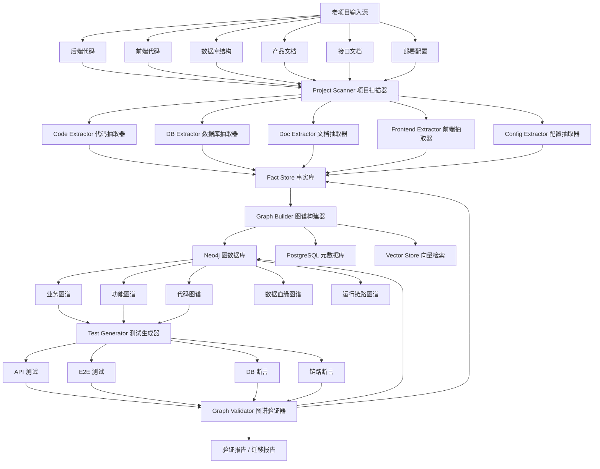
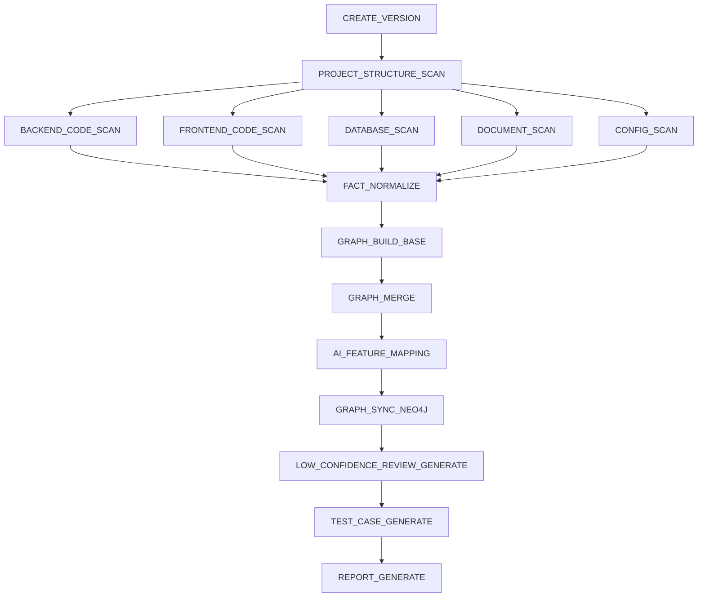

# 老项目 AI 图谱理解平台详细设计文档

> 文档版本：v1.0  
> 编写日期：2026-06-26  
> 适用范围：老项目理解、老项目迁移、新平台承接、代码资产盘点、业务知识沉淀、自动化测试验证  
> 第一版重点支持：Java Spring Boot / Spring MVC + MyBatis / MyBatis-Plus + PostgreSQL / MySQL + Vue / React 前端项目

---

## 1. 文档目标

本文档用于指导研发团队建设一个可落地的平台：**LegacyGraph 老项目 AI 图谱理解平台**。

平台目标是将老项目中的以下资料统一解析、抽取、融合、验证：

1. 后端代码
2. 前端代码
3. 数据库表结构
4. SQL 脚本 / MyBatis XML / JPA 查询
5. 产品文档 / 操作手册 / 需求文档
6. 接口文档 / Swagger / OpenAPI
7. 部署配置 / 权限配置 / 菜单配置
8. 运行日志 / 测试环境执行结果

最终形成统一项目知识图谱，并对外输出三类核心图谱：

1. **业务图谱**：说明系统有哪些业务域、业务流程、业务对象、业务规则、角色、状态流转。
2. **功能图谱**：说明系统有哪些模块、菜单、页面、按钮、接口、权限、操作用例。
3. **代码图谱**：说明接口、Controller、Service、Mapper、SQL、表、字段之间如何关联。

同时，平台需要根据图谱自动生成测试用例、接口测试、E2E 测试和数据库断言，通过测试执行结果反向验证图谱是否正确。

---

## 2. 建设原则

### 2.1 统一图谱，不做三个孤立图谱

不要分别生成三个互不关联的业务图谱、功能图谱、代码图谱。

推荐方案是：

```text
底层：统一项目知识图谱
上层：业务图谱视图、功能图谱视图、代码图谱视图、数据血缘视图、运行链路视图
```

这样可以做到：

```text
业务流程 -> 功能页面 -> 前端接口 -> 后端 Controller -> Service -> Mapper -> SQL -> 数据库表 -> 测试用例 -> 测试结果
```

### 2.2 AI 不能直接当事实来源

平台中的事实分为三类：

| 类型 | 来源 | 是否可直接入正式图谱 |
|---|---|---|
| 确定事实 | AST、SQL、数据库元数据、配置文件、接口文档 | 可以 |
| 推断事实 | 调用链推断、SQL 表关系推断、前后端接口匹配 | 可以，但必须标注置信度 |
| AI 总结 | 文档摘要、业务流程归纳、字段含义推断 | 需人工确认或测试验证 |

每一个图谱节点、每一条图谱关系都必须有：

1. evidence：证据来源
2. confidence：置信度
3. source_type：来源类型
4. project_id：项目 ID
5. version_id：扫描版本 ID

### 2.3 图谱要服务迁移，不只是展示

图谱不是为了好看，而是用于：

1. 理解老项目业务边界
2. 识别核心功能
3. 识别数据读写关系
4. 识别接口依赖
5. 识别功能迁移优先级
6. 生成迁移测试用例
7. 验证新老系统行为是否一致
8. 支撑后续平滑迁移和双写校验

---

## 3. 系统总体架构

### 3.1 架构图



### 3.2 系统分层

| 层级 | 模块 | 说明 |
|---|---|---|
| 输入层 | 项目文件、代码仓库、数据库、文档 | 原始资料输入 |
| 扫描层 | Project Scanner | 识别项目结构和技术栈 |
| 抽取层 | Code / Frontend / DB / Doc / Config Extractor | 抽取结构化事实 |
| 事实层 | Fact Store | 保存所有原始事实和证据 |
| 图谱层 | Graph Builder + Neo4j | 构建统一项目知识图谱 |
| AI 层 | Agent 编排、RAG、LLM | 辅助理解、归纳、映射、生成测试 |
| 验证层 | Test Generator / Runner / Validator | 自动测试与断言验证 |
| 展示层 | 图谱看板、人工确认页面、报告页面 | 人看得懂、可确认、可导出 |

---

## 4. 技术选型

### 4.1 平台后端

| 项目 | 推荐选型 | 说明 |
|---|---|---|
| 开发语言 | Java 21 | 平台新建项目建议使用 Java 21，但扫描目标项目可兼容 Java 8/11/17 |
| 后端框架 | Spring Boot 4.x | 如果企业环境稳定优先，建议 4.0.x |
| ORM | MyBatis-Plus + JPA 辅助 | 图谱平台元数据建议用 MyBatis-Plus |
| API 文档 | Springdoc OpenAPI | 暴露平台管理接口 |
| 任务调度 | Spring Scheduler / Quartz / PowerJob | 第一版用 Spring Scheduler，企业版可接 PowerJob |
| 权限 | Spring Security + JWT | 支持管理员、分析员、审核员、只读用户 |

### 4.2 存储

| 存储 | 推荐选型 | 用途 |
|---|---|---|
| 关系库 | PostgreSQL 18 | 项目、扫描任务、事实、测试结果、人工确认记录 |
| 图数据库 | Neo4j 5.x LTS / 2025.x | 统一知识图谱和图查询 |
| 向量库 | pgvector / Neo4j Vector Index | 文档片段、代码片段、字段语义检索 |
| 对象存储 | MinIO | 保存上传的代码包、文档、扫描产物、测试报告 |
| 缓存 | Redis | 任务状态、图谱查询缓存、会话缓存 |

### 4.3 抽取工具

| 场景 | 推荐工具 | 用途 |
|---|---|---|
| Java AST | JavaParser、Spoon | 解析 Controller、Service、方法、注解、调用关系 |
| Java 安全/依赖分析 | CodeQL、Semgrep | 增强跨文件调用、污点流、危险代码识别 |
| MyBatis XML | DOM/SAX + 自定义解析器 | 解析 mapper namespace、statement、SQL |
| SQL 解析 | JSqlParser、sqlglot | 抽取表、字段、WHERE、JOIN、INSERT、UPDATE |
| 前端 AST | ts-morph、Babel Parser、Vue Compiler | 解析路由、页面、API 调用、菜单、权限 |
| 文档解析 | Apache Tika、Apache POI、PDFBox | 解析 Word、Excel、PDF、Markdown |
| E2E 测试 | Playwright | 页面自动化、截图、前端流程验证 |
| API 测试 | REST Assured / Newman | 接口测试和断言执行 |
| 测试报告 | Allure | 自动化测试报告 |
| 容器化 | Docker + Helm | 部署平台 |

### 4.4 第一版建议技术栈

```text
后端：Java 21 + Spring Boot 4.0.x + MyBatis-Plus
数据库：PostgreSQL + pgvector
图数据库：Neo4j 5.x
缓存：Redis
对象存储：MinIO
AI 编排：LangGraph 或自研 Agent Pipeline
代码解析：JavaParser + JSqlParser + ts-morph
文档解析：Apache Tika + Apache POI
接口测试：REST Assured
E2E 测试：Playwright
部署：Docker + Helm
```

---

## 5. 核心概念模型

### 5.1 统一图谱节点类型

| 节点类型 | 名称 | 说明 |
|---|---|---|
| Project | 项目 | 一个老项目或新项目 |
| System | 系统 | 项目下的子系统 |
| BusinessDomain | 业务域 | 如流程管理、表单管理、用户中心 |
| BusinessProcess | 业务流程 | 如发起审批、处理任务、归档流程 |
| BusinessObject | 业务对象 | 如流程实例、任务、表单、用户、部门 |
| BusinessRule | 业务规则 | 如状态流转规则、权限规则、校验规则 |
| Role | 业务角色 | 如申请人、审批人、管理员 |
| FeatureModule | 功能模块 | 如流程建模、表单设计、任务中心 |
| Feature | 功能点 | 如新增流程、发布表单、提交任务 |
| Menu | 菜单 | 前端菜单节点 |
| Page | 页面 | 前端页面或路由 |
| Button | 按钮/操作 | 页面操作入口 |
| Permission | 权限 | 权限标识、角色权限、接口权限 |
| ApiEndpoint | 接口 | REST API、RPC、GraphQL 等 |
| Controller | 控制器 | 后端 Controller 类 |
| Service | 服务类 | Service 或业务类 |
| Method | 方法 | Java 方法、前端方法 |
| Mapper | Mapper | MyBatis Mapper 接口/XML |
| SqlStatement | SQL 语句 | select/insert/update/delete |
| Table | 数据库表 | 业务表、字典表、中间表 |
| Column | 数据库字段 | 字段、类型、注释 |
| ConfigItem | 配置项 | yml、properties、env、nacos 配置 |
| ScheduledJob | 定时任务 | @Scheduled、Quartz、PowerJob |
| MQConsumer | 消息消费者 | Kafka/RabbitMQ 消费者 |
| MQTopic | 消息主题 | topic/queue |
| ExternalSystem | 外部系统 | 第三方系统、接口、服务 |
| TestCase | 测试用例 | API/E2E/DB 测试用例 |
| Assertion | 断言 | 响应断言、数据库断言、链路断言 |
| Evidence | 证据 | 文件、行号、SQL、文档段落、测试结果 |

### 5.2 统一图谱关系类型

| 关系 | 起点 | 终点 | 说明 |
|---|---|---|---|
| CONTAINS | Project/System/Module | 子节点 | 包含关系 |
| IMPLEMENTED_BY | BusinessProcess/Feature | Feature/ApiEndpoint/Code | 业务由功能或代码实现 |
| USES | BusinessProcess | BusinessObject | 业务流程使用业务对象 |
| HAS_RULE | BusinessProcess/Feature | BusinessRule | 业务规则 |
| EXPOSED_BY | Feature | Page/Menu/Button | 功能由页面暴露 |
| REQUIRES_PERMISSION | Page/Button/ApiEndpoint | Permission | 权限关系 |
| CALLS | Page/Method/Controller/Service | ApiEndpoint/Method | 调用关系 |
| HANDLED_BY | ApiEndpoint | Controller/Method | 接口处理关系 |
| EXECUTES | Mapper/Method | SqlStatement | 执行 SQL |
| READS | SqlStatement/ApiEndpoint/Feature | Table | 读取表 |
| WRITES | SqlStatement/ApiEndpoint/Feature | Table | 写入表 |
| HAS_COLUMN | Table | Column | 表字段 |
| JOINS | SqlStatement | Table | SQL JOIN 表 |
| TRIGGERS | Feature/ApiEndpoint | ScheduledJob/MQTopic | 触发任务或消息 |
| CONSUMES | MQConsumer | MQTopic | 消费消息 |
| CALLS_EXTERNAL | Method/ApiEndpoint | ExternalSystem | 调用外部系统 |
| VERIFIED_BY | Feature/ApiEndpoint/BusinessProcess | TestCase | 被测试用例验证 |
| ASSERTS | TestCase | Assertion | 测试断言 |
| HAS_EVIDENCE | 任意节点/关系 | Evidence | 证据链 |

### 5.3 节点通用属性

```json
{
  "id": "node_uuid",
  "projectId": "project_uuid",
  "versionId": "scan_version_uuid",
  "type": "ApiEndpoint",
  "name": "POST /api/process/start",
  "displayName": "发起流程接口",
  "description": "用于发起流程实例",
  "sourceType": "CODE_AST",
  "sourcePath": "src/main/java/com/example/ProcessController.java",
  "startLine": 35,
  "endLine": 58,
  "confidence": 0.98,
  "status": "CONFIRMED",
  "tags": ["process", "workflow"],
  "properties": {}
}
```

### 5.4 关系通用属性

```json
{
  "id": "edge_uuid",
  "projectId": "project_uuid",
  "versionId": "scan_version_uuid",
  "fromNodeId": "api_node_uuid",
  "toNodeId": "method_node_uuid",
  "type": "HANDLED_BY",
  "sourceType": "CODE_AST",
  "confidence": 0.99,
  "evidenceId": "evidence_uuid",
  "status": "CONFIRMED",
  "properties": {}
}
```

---

## 6. 数据库详细设计

### 6.1 项目表：lg_project

```sql
CREATE TABLE lg_project (
    id              UUID PRIMARY KEY,
    project_code    VARCHAR(128) NOT NULL UNIQUE,
    project_name    VARCHAR(256) NOT NULL,
    description     TEXT,
    project_type    VARCHAR(64) NOT NULL DEFAULT 'LEGACY',
    tech_stack      JSONB,
    repo_url        TEXT,
    default_branch  VARCHAR(128),
    owner           VARCHAR(128),
    status          VARCHAR(32) NOT NULL DEFAULT 'ACTIVE',
    created_at      TIMESTAMP NOT NULL DEFAULT CURRENT_TIMESTAMP,
    updated_at      TIMESTAMP NOT NULL DEFAULT CURRENT_TIMESTAMP
);

COMMENT ON TABLE lg_project IS '项目表';
```

### 6.2 扫描版本表：lg_scan_version

```sql
CREATE TABLE lg_scan_version (
    id              UUID PRIMARY KEY,
    project_id      UUID NOT NULL REFERENCES lg_project(id),
    version_no      VARCHAR(64) NOT NULL,
    branch_name     VARCHAR(128),
    commit_id       VARCHAR(128),
    source_hash     VARCHAR(128),
    scan_scope      JSONB,
    scan_status     VARCHAR(32) NOT NULL DEFAULT 'CREATED',
    started_at      TIMESTAMP,
    finished_at     TIMESTAMP,
    error_message   TEXT,
    created_at      TIMESTAMP NOT NULL DEFAULT CURRENT_TIMESTAMP,
    updated_at      TIMESTAMP NOT NULL DEFAULT CURRENT_TIMESTAMP,
    UNIQUE(project_id, version_no)
);

COMMENT ON TABLE lg_scan_version IS '项目扫描版本表';
```

### 6.3 扫描任务表：lg_scan_task

```sql
CREATE TABLE lg_scan_task (
    id              UUID PRIMARY KEY,
    project_id      UUID NOT NULL REFERENCES lg_project(id),
    version_id      UUID NOT NULL REFERENCES lg_scan_version(id),
    task_type       VARCHAR(64) NOT NULL,
    task_name       VARCHAR(256) NOT NULL,
    task_status     VARCHAR(32) NOT NULL DEFAULT 'PENDING',
    input_params    JSONB,
    output_summary  JSONB,
    error_message   TEXT,
    retry_count     INT NOT NULL DEFAULT 0,
    started_at      TIMESTAMP,
    finished_at     TIMESTAMP,
    created_at      TIMESTAMP NOT NULL DEFAULT CURRENT_TIMESTAMP,
    updated_at      TIMESTAMP NOT NULL DEFAULT CURRENT_TIMESTAMP
);

CREATE INDEX idx_lg_scan_task_project_version ON lg_scan_task(project_id, version_id);
CREATE INDEX idx_lg_scan_task_status ON lg_scan_task(task_status);
```

### 6.4 原始事实表：lg_fact

```sql
CREATE TABLE lg_fact (
    id              UUID PRIMARY KEY,
    project_id      UUID NOT NULL REFERENCES lg_project(id),
    version_id      UUID NOT NULL REFERENCES lg_scan_version(id),
    fact_type       VARCHAR(128) NOT NULL,
    fact_key        VARCHAR(512) NOT NULL,
    fact_name       VARCHAR(512),
    source_type     VARCHAR(64) NOT NULL,
    source_path     TEXT,
    start_line      INT,
    end_line        INT,
    raw_content     TEXT,
    normalized_data JSONB NOT NULL,
    confidence      NUMERIC(5,4) NOT NULL DEFAULT 1.0000,
    status          VARCHAR(32) NOT NULL DEFAULT 'EXTRACTED',
    created_at      TIMESTAMP NOT NULL DEFAULT CURRENT_TIMESTAMP,
    updated_at      TIMESTAMP NOT NULL DEFAULT CURRENT_TIMESTAMP,
    UNIQUE(project_id, version_id, fact_type, fact_key)
);

CREATE INDEX idx_lg_fact_project_version ON lg_fact(project_id, version_id);
CREATE INDEX idx_lg_fact_type ON lg_fact(fact_type);
CREATE INDEX idx_lg_fact_key ON lg_fact(fact_key);
CREATE INDEX idx_lg_fact_data_gin ON lg_fact USING GIN(normalized_data);
```

### 6.5 图谱节点表：lg_graph_node

```sql
CREATE TABLE lg_graph_node (
    id              UUID PRIMARY KEY,
    project_id      UUID NOT NULL REFERENCES lg_project(id),
    version_id      UUID NOT NULL REFERENCES lg_scan_version(id),
    node_type       VARCHAR(128) NOT NULL,
    node_key        VARCHAR(1024) NOT NULL,
    node_name       VARCHAR(512) NOT NULL,
    display_name    VARCHAR(512),
    description     TEXT,
    source_type     VARCHAR(64),
    source_path     TEXT,
    start_line      INT,
    end_line        INT,
    confidence      NUMERIC(5,4) NOT NULL DEFAULT 1.0000,
    status          VARCHAR(32) NOT NULL DEFAULT 'PENDING_CONFIRM',
    properties      JSONB,
    created_at      TIMESTAMP NOT NULL DEFAULT CURRENT_TIMESTAMP,
    updated_at      TIMESTAMP NOT NULL DEFAULT CURRENT_TIMESTAMP,
    UNIQUE(project_id, version_id, node_type, node_key)
);

CREATE INDEX idx_lg_graph_node_project_version ON lg_graph_node(project_id, version_id);
CREATE INDEX idx_lg_graph_node_type ON lg_graph_node(node_type);
CREATE INDEX idx_lg_graph_node_properties ON lg_graph_node USING GIN(properties);
```

### 6.6 图谱关系表：lg_graph_edge

```sql
CREATE TABLE lg_graph_edge (
    id              UUID PRIMARY KEY,
    project_id      UUID NOT NULL REFERENCES lg_project(id),
    version_id      UUID NOT NULL REFERENCES lg_scan_version(id),
    from_node_id    UUID NOT NULL REFERENCES lg_graph_node(id),
    to_node_id      UUID NOT NULL REFERENCES lg_graph_node(id),
    edge_type       VARCHAR(128) NOT NULL,
    edge_key        VARCHAR(1024) NOT NULL,
    source_type     VARCHAR(64),
    confidence      NUMERIC(5,4) NOT NULL DEFAULT 1.0000,
    status          VARCHAR(32) NOT NULL DEFAULT 'PENDING_CONFIRM',
    properties      JSONB,
    created_at      TIMESTAMP NOT NULL DEFAULT CURRENT_TIMESTAMP,
    updated_at      TIMESTAMP NOT NULL DEFAULT CURRENT_TIMESTAMP,
    UNIQUE(project_id, version_id, edge_key)
);

CREATE INDEX idx_lg_graph_edge_from ON lg_graph_edge(from_node_id);
CREATE INDEX idx_lg_graph_edge_to ON lg_graph_edge(to_node_id);
CREATE INDEX idx_lg_graph_edge_type ON lg_graph_edge(edge_type);
```

### 6.7 证据表：lg_evidence

```sql
CREATE TABLE lg_evidence (
    id              UUID PRIMARY KEY,
    project_id      UUID NOT NULL REFERENCES lg_project(id),
    version_id      UUID NOT NULL REFERENCES lg_scan_version(id),
    evidence_type   VARCHAR(64) NOT NULL,
    source_path     TEXT,
    start_line      INT,
    end_line        INT,
    content_hash    VARCHAR(128),
    content_excerpt TEXT,
    metadata        JSONB,
    created_at      TIMESTAMP NOT NULL DEFAULT CURRENT_TIMESTAMP
);

CREATE INDEX idx_lg_evidence_project_version ON lg_evidence(project_id, version_id);
```

### 6.8 节点证据关联表：lg_node_evidence

```sql
CREATE TABLE lg_node_evidence (
    id              UUID PRIMARY KEY,
    node_id         UUID NOT NULL REFERENCES lg_graph_node(id),
    evidence_id     UUID NOT NULL REFERENCES lg_evidence(id),
    relation_type   VARCHAR(64) NOT NULL DEFAULT 'DERIVED_FROM',
    created_at      TIMESTAMP NOT NULL DEFAULT CURRENT_TIMESTAMP,
    UNIQUE(node_id, evidence_id)
);
```

### 6.9 关系证据关联表：lg_edge_evidence

```sql
CREATE TABLE lg_edge_evidence (
    id              UUID PRIMARY KEY,
    edge_id         UUID NOT NULL REFERENCES lg_graph_edge(id),
    evidence_id     UUID NOT NULL REFERENCES lg_evidence(id),
    relation_type   VARCHAR(64) NOT NULL DEFAULT 'DERIVED_FROM',
    created_at      TIMESTAMP NOT NULL DEFAULT CURRENT_TIMESTAMP,
    UNIQUE(edge_id, evidence_id)
);
```

### 6.10 测试用例表：lg_test_case

```sql
CREATE TABLE lg_test_case (
    id              UUID PRIMARY KEY,
    project_id      UUID NOT NULL REFERENCES lg_project(id),
    version_id      UUID NOT NULL REFERENCES lg_scan_version(id),
    case_code       VARCHAR(128) NOT NULL,
    case_name       VARCHAR(512) NOT NULL,
    case_type       VARCHAR(64) NOT NULL,
    target_node_id  UUID REFERENCES lg_graph_node(id),
    priority        VARCHAR(32) NOT NULL DEFAULT 'P2',
    preconditions   JSONB,
    steps           JSONB NOT NULL,
    expected_result JSONB NOT NULL,
    generated_by    VARCHAR(64) NOT NULL,
    confidence      NUMERIC(5,4) NOT NULL DEFAULT 0.8000,
    status          VARCHAR(32) NOT NULL DEFAULT 'GENERATED',
    created_at      TIMESTAMP NOT NULL DEFAULT CURRENT_TIMESTAMP,
    updated_at      TIMESTAMP NOT NULL DEFAULT CURRENT_TIMESTAMP,
    UNIQUE(project_id, version_id, case_code)
);

CREATE INDEX idx_lg_test_case_target ON lg_test_case(target_node_id);
```

### 6.11 测试断言表：lg_test_assertion

```sql
CREATE TABLE lg_test_assertion (
    id              UUID PRIMARY KEY,
    test_case_id    UUID NOT NULL REFERENCES lg_test_case(id),
    assertion_type  VARCHAR(64) NOT NULL,
    assertion_name  VARCHAR(512) NOT NULL,
    expression      TEXT NOT NULL,
    expected_value  JSONB,
    actual_value    JSONB,
    status          VARCHAR(32) NOT NULL DEFAULT 'CREATED',
    created_at      TIMESTAMP NOT NULL DEFAULT CURRENT_TIMESTAMP,
    updated_at      TIMESTAMP NOT NULL DEFAULT CURRENT_TIMESTAMP
);
```

### 6.12 测试结果表：lg_test_result

```sql
CREATE TABLE lg_test_result (
    id              UUID PRIMARY KEY,
    project_id      UUID NOT NULL REFERENCES lg_project(id),
    version_id      UUID NOT NULL REFERENCES lg_scan_version(id),
    test_case_id    UUID NOT NULL REFERENCES lg_test_case(id),
    execution_id    VARCHAR(128) NOT NULL,
    result_status   VARCHAR(32) NOT NULL,
    request_data    JSONB,
    response_data   JSONB,
    db_snapshot     JSONB,
    assertion_result JSONB,
    error_message   TEXT,
    duration_ms     BIGINT,
    executed_at     TIMESTAMP NOT NULL DEFAULT CURRENT_TIMESTAMP
);

CREATE INDEX idx_lg_test_result_case ON lg_test_result(test_case_id);
CREATE INDEX idx_lg_test_result_execution ON lg_test_result(execution_id);
```

### 6.13 人工确认表：lg_review_record

```sql
CREATE TABLE lg_review_record (
    id              UUID PRIMARY KEY,
    project_id      UUID NOT NULL REFERENCES lg_project(id),
    version_id      UUID NOT NULL REFERENCES lg_scan_version(id),
    target_type     VARCHAR(64) NOT NULL,
    target_id       UUID NOT NULL,
    review_status   VARCHAR(32) NOT NULL,
    reviewer        VARCHAR(128) NOT NULL,
    review_comment  TEXT,
    before_data     JSONB,
    after_data      JSONB,
    created_at      TIMESTAMP NOT NULL DEFAULT CURRENT_TIMESTAMP
);
```

---

## 7. Neo4j 图数据库设计

### 7.1 节点标签

```cypher
(:Project)
(:System)
(:BusinessDomain)
(:BusinessProcess)
(:BusinessObject)
(:BusinessRule)
(:Role)
(:FeatureModule)
(:Feature)
(:Menu)
(:Page)
(:Button)
(:Permission)
(:ApiEndpoint)
(:Controller)
(:Service)
(:Method)
(:Mapper)
(:SqlStatement)
(:Table)
(:Column)
(:TestCase)
(:Assertion)
(:Evidence)
```

### 7.2 约束设计

```cypher
CREATE CONSTRAINT project_key IF NOT EXISTS
FOR (n:Project) REQUIRE n.nodeKey IS UNIQUE;

CREATE CONSTRAINT api_key IF NOT EXISTS
FOR (n:ApiEndpoint) REQUIRE n.nodeKey IS UNIQUE;

CREATE CONSTRAINT table_key IF NOT EXISTS
FOR (n:Table) REQUIRE n.nodeKey IS UNIQUE;

CREATE CONSTRAINT method_key IF NOT EXISTS
FOR (n:Method) REQUIRE n.nodeKey IS UNIQUE;
```

### 7.3 常用查询

#### 7.3.1 查询某个接口完整调用链

```cypher
MATCH p = (api:ApiEndpoint {nodeKey: $apiKey})-[:HANDLED_BY|CALLS|EXECUTES|READS|WRITES*1..8]->(n)
RETURN p;
```

#### 7.3.2 查询某张表被哪些接口写入

```cypher
MATCH p = (api:ApiEndpoint)-[:HANDLED_BY|CALLS|EXECUTES|WRITES*1..8]->(t:Table {name: $tableName})
RETURN api, p;
```

#### 7.3.3 查询某个功能对应页面、接口、表

```cypher
MATCH p = (f:Feature {nodeKey: $featureKey})-[:EXPOSED_BY|CALLS|HANDLED_BY|EXECUTES|READS|WRITES*1..10]->(n)
RETURN p;
```

#### 7.3.4 查询缺少测试验证的核心接口

```cypher
MATCH (api:ApiEndpoint)
WHERE api.priority IN ['P0', 'P1']
AND NOT (api)-[:VERIFIED_BY]->(:TestCase)
RETURN api.name, api.path, api.method;
```

---

## 8. 项目接入设计

### 8.1 接入输入清单

每个老项目接入平台时，需要准备：

| 类型 | 是否必需 | 示例 |
|---|---|---|
| 后端代码 | 必需 | Spring Boot、Spring MVC、Java Web |
| 前端代码 | 必需 | Vue、React、Angular、JSP |
| 数据库结构 | 必需 | pg_dump、mysqldump、DDL、information_schema |
| 产品文档 | 建议 | Word、PDF、Markdown、Excel |
| 接口文档 | 建议 | Swagger、OpenAPI、Postman Collection |
| 菜单权限配置 | 建议 | sys_menu、sys_permission、前端路由配置 |
| 测试环境地址 | 建议 | dev/test 环境 baseUrl |
| 测试账号 | 建议 | 管理员、普通用户、审批人 |
| 部署配置 | 可选 | Dockerfile、Helm、K8s YAML、application.yml |

### 8.2 project-manifest.json

每个项目接入时生成一个 manifest 文件。

```json
{
  "projectCode": "legacy-bpm-platform",
  "projectName": "老流程平台",
  "description": "老项目流程、表单、任务迁移分析",
  "source": {
    "backend": [
      {
        "name": "bpm-server",
        "type": "spring-boot",
        "path": "/data/projects/bpm-server",
        "language": "java",
        "jdkVersion": "11",
        "buildTool": "maven"
      }
    ],
    "frontend": [
      {
        "name": "bpm-web",
        "type": "vue",
        "path": "/data/projects/bpm-web",
        "nodeVersion": "16"
      }
    ],
    "database": [
      {
        "name": "bpm_db",
        "type": "postgresql",
        "host": "127.0.0.1",
        "port": 5432,
        "schema": "public",
        "ddlPath": "/data/projects/sql/schema.sql"
      }
    ],
    "documents": [
      {
        "name": "产品说明书",
        "type": "docx",
        "path": "/data/projects/docs/product.docx"
      }
    ],
    "apiDocs": [
      {
        "name": "Swagger",
        "type": "openapi",
        "path": "/data/projects/docs/openapi.json"
      }
    ]
  },
  "runtime": {
    "baseUrl": "http://legacy-test.example.com",
    "loginApi": "/api/auth/login",
    "accounts": [
      {
        "role": "admin",
        "username": "admin",
        "secretRef": "legacy.admin.password"
      }
    ]
  },
  "scanOptions": {
    "enableBackendScan": true,
    "enableFrontendScan": true,
    "enableDbScan": true,
    "enableDocScan": true,
    "enableTestGeneration": true,
    "enableRuntimeValidation": false
  }
}
```

### 8.3 接入流程

```text
1. 创建项目
2. 上传代码包或配置 Git 仓库
3. 上传数据库 DDL 或配置数据库连接
4. 上传产品文档 / 接口文档
5. 配置测试环境地址和测试账号
6. 生成 project-manifest.json
7. 创建扫描版本
8. 执行扫描任务
9. 生成初版图谱
10. 人工确认低置信度节点
11. 生成测试用例
12. 执行自动化测试
13. 生成验证报告
```

---

## 9. 后端代码抽取详细设计

### 9.1 抽取目标

后端抽取需要识别：

1. Spring Boot 启动类
2. Controller 类
3. RequestMapping / GetMapping / PostMapping 等接口路径
4. 请求参数 DTO
5. 响应 DTO
6. Service 注入关系
7. Controller -> Service 调用关系
8. Service -> Service 调用关系
9. Service -> Mapper 调用关系
10. Mapper 接口和 XML SQL 映射关系
11. SQL 读写表关系
12. 权限注解
13. 事务注解
14. 定时任务
15. MQ 消费者
16. 外部系统调用
17. 异常处理和返回码

### 9.2 Controller 抽取规则

扫描注解：

```text
@RestController
@Controller
@RequestMapping
@GetMapping
@PostMapping
@PutMapping
@DeleteMapping
@PatchMapping
```

抽取字段：

| 字段 | 说明 |
|---|---|
| className | Controller 类名 |
| packageName | 包名 |
| basePath | 类级 RequestMapping |
| methodPath | 方法级 Mapping |
| httpMethod | GET/POST/PUT/DELETE |
| methodName | Java 方法名 |
| requestParams | 请求参数 |
| requestBody | 请求体 |
| responseType | 返回类型 |
| annotations | 注解列表 |
| permissions | 权限标识 |
| sourcePath | 文件路径 |
| startLine/endLine | 代码行号 |

### 9.3 Controller 抽取伪代码

```java
public List<ApiFact> extractControllerApis(Path javaFile) {
    CompilationUnit cu = javaParser.parse(javaFile);
    List<ApiFact> result = new ArrayList<>();

    for (ClassOrInterfaceDeclaration clazz : cu.findAll(ClassOrInterfaceDeclaration.class)) {
        if (!hasAnnotation(clazz, "RestController", "Controller")) {
            continue;
        }

        String basePath = resolveClassRequestMapping(clazz);

        for (MethodDeclaration method : clazz.getMethods()) {
            Optional<MappingInfo> mapping = resolveMethodMapping(method);
            if (mapping.isEmpty()) {
                continue;
            }

            ApiFact fact = new ApiFact();
            fact.setHttpMethod(mapping.get().getHttpMethod());
            fact.setPath(joinPath(basePath, mapping.get().getPath()));
            fact.setControllerClass(clazz.getNameAsString());
            fact.setMethodName(method.getNameAsString());
            fact.setRequestParams(resolveParameters(method));
            fact.setResponseType(method.getTypeAsString());
            fact.setPermissions(resolvePermissionAnnotations(method));
            fact.setSourcePath(javaFile.toString());
            fact.setStartLine(method.getBegin().map(p -> p.line).orElse(null));
            fact.setEndLine(method.getEnd().map(p -> p.line).orElse(null));
            result.add(fact);
        }
    }

    return result;
}
```

### 9.4 Service 调用关系抽取

识别方式：

1. 字段注入：`@Autowired private XxxService xxxService;`
2. 构造器注入：`public AService(XxxService xxxService)`
3. Lombok 构造器注入：`@RequiredArgsConstructor`
4. 方法内调用：`xxxService.method()`
5. 同类方法调用：`this.method()` 或直接 `method()`
6. 静态工具类调用：`XxxUtil.method()`

输出关系：

```text
ControllerMethod -CALLS-> ServiceMethod
ServiceMethod -CALLS-> ServiceMethod
ServiceMethod -CALLS-> MapperMethod
```

### 9.5 Mapper 抽取规则

扫描对象：

```text
@Mapper
@Repository
BaseMapper<T>
MyBatis XML mapper namespace
```

抽取内容：

| 类型 | 抽取内容 |
|---|---|
| Mapper 接口 | interfaceName、methodName、参数、返回值 |
| XML namespace | namespace 对应接口 |
| XML statement | select/insert/update/delete id |
| SQL 内容 | 原始 SQL、动态 SQL 片段 |
| 表关系 | READS/WRITES/JOIN |

### 9.6 MyBatis XML 解析规则

识别标签：

```text
<select>
<insert>
<update>
<delete>
<sql>
<include>
<if>
<choose>
<foreach>
<where>
<set>
<trim>
```

解析步骤：

```text
1. 读取 mapper XML
2. 解析 namespace
3. 解析 statement id
4. 展开 include 片段
5. 保留动态 SQL 标签结构
6. 将动态 SQL 转换为可解析的近似 SQL
7. 使用 SQL Parser 提取表名和字段名
8. 建立 MapperMethod -> SqlStatement 关系
9. 建立 SqlStatement -> Table 读写关系
```

### 9.7 SQL 读写判断规则

| SQL 类型 | 关系 |
|---|---|
| SELECT | READS |
| INSERT | WRITES |
| UPDATE | WRITES，同时 WHERE 子句中的表也视为 READS |
| DELETE | WRITES |
| JOIN | JOINS，同时 READS |
| INSERT INTO ... SELECT | 目标表 WRITES，来源表 READS |

### 9.8 权限抽取规则

识别注解：

```text
@PreAuthorize
@Secured
@RolesAllowed
@RequiresPermissions
@RequiresRoles
自定义 @Permission
自定义 @Auth
```

示例：

```java
@PreAuthorize("hasAuthority('process:start')")
@PostMapping("/process/start")
public Result start(@RequestBody StartProcessReq req) {}
```

生成关系：

```text
ApiEndpoint -REQUIRES_PERMISSION-> Permission(process:start)
```

### 9.9 定时任务抽取规则

识别方式：

```text
@Scheduled
Quartz Job
PowerJob Processor
XXL-JOB @XxlJob
```

抽取内容：

| 字段 | 说明 |
|---|---|
| jobName | 任务名称 |
| cron | cron 表达式 |
| className | 类名 |
| methodName | 方法名 |
| writesTables | 写入表 |
| callsExternal | 外部调用 |

---

## 10. 前端代码抽取详细设计

### 10.1 抽取目标

前端抽取需要识别：

1. 前端框架类型：Vue / React / Angular / JSP
2. 路由配置
3. 菜单配置
4. 页面组件
5. 页面标题
6. 页面表单字段
7. 页面表格字段
8. 按钮和操作
9. API 调用
10. 权限标识
11. 页面跳转关系
12. 状态管理中的业务对象

### 10.2 Vue 路由抽取

扫描文件：

```text
src/router/index.ts
src/router/index.js
src/router/modules/*.ts
src/permission.ts
```

抽取字段：

| 字段 | 说明 |
|---|---|
| path | 路由路径 |
| name | 路由名称 |
| component | 组件路径 |
| meta.title | 页面标题 |
| meta.permission | 权限标识 |
| meta.icon | 图标 |
| children | 子路由 |

### 10.3 API 调用抽取

识别方式：

```text
axios.get/post/put/delete
request({ url, method })
fetch(url)
api.xxx()
封装的 request.ts / http.ts / service.ts
```

抽取规则：

```text
1. 找到统一 request 封装文件
2. 识别 baseURL
3. 扫描 api 目录下所有接口定义
4. 提取 url、method、params、data
5. 反向查找页面组件中引用了哪些 api 方法
6. 建立 Page -> ApiEndpoint 关系
```

示例：

```ts
export function startProcess(data) {
  return request({
    url: '/api/process/start',
    method: 'post',
    data
  })
}
```

生成节点：

```text
ApiEndpoint: POST /api/process/start
```

生成关系：

```text
Page(process/start.vue) -CALLS-> ApiEndpoint(POST /api/process/start)
```

### 10.4 页面功能抽取

从 Vue / React 组件中识别：

| 元素 | 抽取内容 |
|---|---|
| form | 表单字段、校验规则、默认值 |
| table | 表格列、操作列、数据源 API |
| button | 按钮文本、点击方法、权限标识 |
| modal/dialog | 弹窗功能 |
| upload | 文件上传接口 |
| tree | 树形数据接口 |
| select | 字典接口 / 枚举值 |

### 10.5 按钮和权限抽取

识别方式：

```text
v-permission
v-auth
hasPermi
hasPermission
按钮上的 disabled / visible 条件
React 中的 PermissionButton / AuthWrapper
```

生成关系：

```text
Page -CONTAINS-> Button
Button -REQUIRES_PERMISSION-> Permission
Button -CALLS-> ApiEndpoint
```

---

## 11. 数据库抽取详细设计

### 11.1 抽取目标

数据库抽取需要识别：

1. schema
2. 表
3. 字段
4. 字段类型
5. 字段注释
6. 主键
7. 外键
8. 唯一约束
9. 索引
10. 默认值
11. 是否可空
12. 字典字段
13. 状态字段
14. 逻辑删除字段
15. 审计字段
16. 表之间关系

### 11.2 PostgreSQL 元数据 SQL

```sql
SELECT
    c.table_schema,
    c.table_name,
    obj_description(('"' || c.table_schema || '"."' || c.table_name || '"')::regclass) AS table_comment,
    c.column_name,
    c.data_type,
    c.character_maximum_length,
    c.numeric_precision,
    c.numeric_scale,
    c.is_nullable,
    c.column_default,
    col_description(('"' || c.table_schema || '"."' || c.table_name || '"')::regclass, c.ordinal_position) AS column_comment
FROM information_schema.columns c
WHERE c.table_schema = :schema
ORDER BY c.table_name, c.ordinal_position;
```

### 11.3 字段语义识别规则

| 规则 | 示例 | 识别结果 |
|---|---|---|
| 字段名以 `_id` 结尾 | user_id、dept_id | 可能是外键 |
| 字段名包含 status/state | status、flow_state | 状态字段 |
| 字段名包含 type/category | process_type | 类型/字典字段 |
| 字段名包含 deleted/del_flag | is_deleted、del_flag | 逻辑删除字段 |
| 字段名包含 created/updated | created_at、update_time | 审计字段 |
| 注释包含 枚举/字典/状态 | 状态：0草稿1发布 | 枚举字段 |

### 11.4 表关系推断规则

优先级从高到低：

1. 数据库真实外键
2. 字段命名匹配：`xxx_id` -> `xxx.id`
3. SQL JOIN 条件：`a.user_id = u.id`
4. MyBatis ResultMap 关联
5. 文档中描述的关联
6. AI 基于表名字段名推断

置信度规则：

| 来源 | 置信度 |
|---|---|
| 真实外键 | 1.00 |
| SQL JOIN | 0.95 |
| ResultMap | 0.90 |
| 字段命名 | 0.75 |
| 文档描述 | 0.70 |
| AI 推断 | 0.50 |

---

## 12. 文档抽取详细设计

### 12.1 抽取目标

从产品文档、需求文档、操作手册中抽取：

1. 系统名称
2. 模块名称
3. 功能清单
4. 操作步骤
5. 业务流程
6. 业务角色
7. 业务对象
8. 业务规则
9. 状态流转
10. 异常场景
11. 页面名称
12. 字段说明

### 12.2 文档处理流程

```text
1. 文件上传到 MinIO
2. 使用 Tika / POI / PDFBox 提取文本
3. 文档切片，按标题、段落、表格切分
4. 对每个片段计算 embedding
5. 保存到文档片段表和向量库
6. 使用 LLM 抽取结构化业务事实
7. 将业务事实写入 lg_fact
8. Graph Builder 将业务事实转换为图谱节点和关系
9. 低置信度内容进入人工确认
```

### 12.3 文档片段表：lg_doc_chunk

```sql
CREATE TABLE lg_doc_chunk (
    id              UUID PRIMARY KEY,
    project_id      UUID NOT NULL REFERENCES lg_project(id),
    version_id      UUID NOT NULL REFERENCES lg_scan_version(id),
    doc_name        VARCHAR(512) NOT NULL,
    doc_path        TEXT,
    chunk_index     INT NOT NULL,
    title_path      TEXT,
    content         TEXT NOT NULL,
    token_count     INT,
    metadata        JSONB,
    embedding_id    VARCHAR(128),
    created_at      TIMESTAMP NOT NULL DEFAULT CURRENT_TIMESTAMP
);

CREATE INDEX idx_lg_doc_chunk_project_version ON lg_doc_chunk(project_id, version_id);
```

### 12.4 业务流程抽取 Prompt 模板

```text
你是一个老系统业务分析专家。
请从以下文档片段中抽取业务事实。

要求：
1. 只能基于给定内容抽取，不要编造。
2. 每个事实必须给出证据原文。
3. 如果不确定，confidence 不要超过 0.6。
4. 输出 JSON。

需要抽取：
- businessDomains
- businessProcesses
- businessObjects
- businessRules
- roles
- statusTransitions
- features

文档片段：
{{chunk_content}}

输出格式：
{
  "businessDomains": [],
  "businessProcesses": [],
  "businessObjects": [],
  "businessRules": [],
  "roles": [],
  "statusTransitions": [],
  "features": [],
  "evidence": []
}
```

---

## 13. 图谱构建详细设计

### 13.1 构建流程

```text
1. 读取 lg_fact 中的确定事实
2. 生成基础节点：Project、Table、Column、ApiEndpoint、Controller、Method
3. 生成代码关系：HANDLED_BY、CALLS、EXECUTES、READS、WRITES
4. 读取前端事实，生成 Page、Menu、Button、Permission
5. 匹配前后端 API，生成 Page -> ApiEndpoint 关系
6. 读取文档事实，生成 BusinessDomain、BusinessProcess、BusinessObject、BusinessRule
7. 根据名称、接口、页面、文档上下文做功能映射
8. 生成 Feature -> Page -> ApiEndpoint -> Code -> Table 链路
9. 计算每个节点和关系的置信度
10. 写入 PostgreSQL 图谱表
11. 同步写入 Neo4j
12. 生成图谱快照
```

### 13.2 节点去重规则

| 节点类型 | node_key 规则 |
|---|---|
| ApiEndpoint | `METHOD + 空格 + normalized_path` |
| Controller | `packageName + className` |
| Method | `classFullName + methodName + parameterTypes` |
| Table | `schema + tableName` |
| Column | `schema + tableName + columnName` |
| Page | `frontendModule + routePath + componentPath` |
| Permission | `permissionCode` |
| Feature | `moduleName + featureName` |
| BusinessObject | `businessObjectName` |

### 13.3 API 路径归一化

```text
/api/user/{id}
/api/user/:id
/api/user/${id}
/api/user/123
```

统一归一化为：

```text
/api/user/{id}
```

### 13.4 前后端 API 匹配规则

| 条件 | 分数 |
|---|---|
| HTTP Method 完全一致 | +0.3 |
| Path 完全一致 | +0.5 |
| Path 参数归一后匹配 | +0.4 |
| request 参数字段相似 | +0.1 |
| response 字段相似 | +0.1 |
| baseURL 匹配 | +0.1 |

匹配分数 >= 0.8：确认关系  
匹配分数 0.6 - 0.8：待人工确认  
匹配分数 < 0.6：不建立正式关系

---

## 14. AI Agent 设计

### 14.1 Agent 列表

| Agent | 职责 |
|---|---|
| CodeFactAgent | 从代码事实中总结功能含义、补充方法说明 |
| DBFactAgent | 根据表和字段推断业务对象、状态字段、字典字段 |
| DocUnderstandingAgent | 从文档抽取业务流程、业务对象、业务规则 |
| FeatureMappingAgent | 将文档功能、前端页面、后端接口进行映射 |
| GraphMergeAgent | 合并重复节点、解决冲突、计算置信度 |
| TestCaseAgent | 根据功能图谱和代码图谱生成测试用例 |
| AssertionAgent | 根据 SQL 读写关系生成数据库断言 |
| ReviewAgent | 找出低置信度节点并生成审核建议 |
| MigrationAgent | 基于图谱生成迁移范围、风险和优先级 |

### 14.2 Agent 执行原则

1. Agent 只能处理已抽取的事实。
2. Agent 输出必须保留输入事实 ID。
3. Agent 输出必须包含 confidence。
4. Agent 不能覆盖确定事实，只能新增推断事实或建议。
5. 低于 0.7 置信度的 AI 事实必须进入人工确认。

### 14.3 Agent 输出格式

```json
{
  "agentName": "FeatureMappingAgent",
  "projectId": "project_uuid",
  "versionId": "version_uuid",
  "outputs": [
    {
      "type": "EDGE_CANDIDATE",
      "from": {
        "nodeType": "Feature",
        "nodeKey": "流程管理/发起流程"
      },
      "to": {
        "nodeType": "ApiEndpoint",
        "nodeKey": "POST /api/process/start"
      },
      "edgeType": "IMPLEMENTED_BY",
      "confidence": 0.86,
      "reason": "文档中的发起流程功能与接口路径、方法名称、请求对象语义一致",
      "evidenceFactIds": ["fact_001", "fact_102", "fact_203"]
    }
  ]
}
```

---

## 15. 测试用例生成详细设计

### 15.1 生成目标

根据图谱自动生成：

1. 接口测试用例
2. 页面 E2E 测试用例
3. 数据库断言
4. 权限断言
5. 状态流转断言
6. 新老系统对比断言

### 15.2 测试用例生成来源

| 来源 | 生成内容 |
|---|---|
| ApiEndpoint | API 请求方式、路径、参数、响应断言 |
| DTO | 请求参数、必填字段、边界值 |
| SQL READS/WRITES | DB 前置查询、执行后断言 |
| BusinessRule | 业务规则断言 |
| Permission | 权限测试用例 |
| Page/Button | E2E 操作步骤 |
| StatusTransition | 状态流转测试 |

### 15.3 API 测试用例 JSON

```json
{
  "caseCode": "API_PROCESS_START_001",
  "caseName": "发起流程成功",
  "caseType": "API",
  "targetApi": "POST /api/process/start",
  "priority": "P0",
  "preconditions": [
    {
      "type": "LOGIN",
      "role": "admin"
    },
    {
      "type": "DB_EXIST",
      "table": "act_process_definition",
      "where": "status = 'PUBLISHED'"
    }
  ],
  "request": {
    "method": "POST",
    "url": "/api/process/start",
    "headers": {
      "Authorization": "Bearer ${token}"
    },
    "body": {
      "processDefinitionId": "${publishedProcessId}",
      "businessKey": "AUTO_${timestamp}",
      "formData": {}
    }
  },
  "assertions": [
    {
      "type": "HTTP_STATUS",
      "expected": 200
    },
    {
      "type": "JSON_PATH",
      "expression": "$.code",
      "expected": 0
    },
    {
      "type": "JSON_PATH_NOT_NULL",
      "expression": "$.data.processInstanceId"
    },
    {
      "type": "DB_EXISTS",
      "table": "act_process_instance",
      "where": "id = ${response.data.processInstanceId}"
    }
  ]
}
```

### 15.4 数据库断言生成规则

| SQL 关系 | 断言 |
|---|---|
| INSERT table | 执行后表中新增记录 |
| UPDATE table | 执行后指定记录字段变化 |
| DELETE table | 执行后记录不存在或逻辑删除字段变化 |
| SELECT table | 接口返回数据与表中数据一致 |
| 状态字段变化 | 状态值符合状态机规则 |

### 15.5 REST Assured 测试代码模板

```java
@Test
void startProcessSuccess() {
    String token = loginAs("admin");

    Response response = given()
        .header("Authorization", "Bearer " + token)
        .contentType(ContentType.JSON)
        .body(buildStartProcessRequest())
    .when()
        .post("/api/process/start")
    .then()
        .statusCode(200)
        .body("code", equalTo(0))
        .body("data.processInstanceId", notNullValue())
        .extract()
        .response();

    String processInstanceId = response.jsonPath().getString("data.processInstanceId");

    Integer count = jdbcTemplate.queryForObject(
        "select count(1) from act_process_instance where id = ?",
        Integer.class,
        processInstanceId
    );

    assertEquals(1, count);
}
```

### 15.6 Playwright E2E 测试模板

```ts
import { test, expect } from '@playwright/test';

test('发起流程成功', async ({ page }) => {
  await page.goto('/login');
  await page.fill('[name=username]', 'admin');
  await page.fill('[name=password]', process.env.ADMIN_PASSWORD!);
  await page.click('button[type=submit]');

  await page.goto('/process/start');
  await page.click('text=选择流程');
  await page.click('text=请假流程');
  await page.fill('[name=reason]', '自动化测试');
  await page.click('text=提交');

  await expect(page.locator('text=提交成功')).toBeVisible();
});
```

---

## 16. 图谱验证器详细设计

### 16.1 验证目标

验证器要回答三个问题：

1. 图谱中的接口是否真实可调用？
2. 图谱中的表读写关系是否真实发生？
3. 图谱中的业务功能和状态流转是否符合运行结果？

### 16.2 验证流程

```text
1. 读取待验证的 Feature / ApiEndpoint / BusinessProcess
2. 找到对应测试用例
3. 准备测试数据
4. 执行 API 或 E2E 测试
5. 采集响应数据
6. 采集数据库前后快照
7. 执行断言
8. 将结果写入 lg_test_result
9. 更新 TestCase 状态
10. 更新图谱节点和关系置信度
11. 生成验证报告
```

### 16.3 置信度更新规则

| 验证结果 | 更新规则 |
|---|---|
| 测试通过 | 相关关系 confidence + 0.05，最高 1.0 |
| 测试失败但接口存在 | ApiEndpoint 保持，业务映射关系降低 0.1 |
| 接口 404 | ApiEndpoint 标记为 INVALID_CANDIDATE |
| DB 断言失败 | SQL -> Table 关系降低 0.15 |
| 权限断言失败 | Permission 关系降低 0.2 |
| 人工确认正确 | status = CONFIRMED，confidence = 1.0 |
| 人工否定 | status = REJECTED |

---

## 17. 平台接口设计

### 17.1 项目管理接口

#### 创建项目

```http
POST /api/lg/projects
Content-Type: application/json
```

请求：

```json
{
  "projectCode": "legacy-bpm-platform",
  "projectName": "老流程平台",
  "description": "老项目迁移理解"
}
```

响应：

```json
{
  "code": 0,
  "data": {
    "projectId": "uuid"
  }
}
```

#### 查询项目列表

```http
GET /api/lg/projects?page=1&pageSize=20&keyword=流程
```

### 17.2 项目接入接口

#### 上传 manifest

```http
POST /api/lg/projects/{projectId}/manifest
Content-Type: application/json
```

#### 上传文件

```http
POST /api/lg/projects/{projectId}/files
Content-Type: multipart/form-data
```

### 17.3 扫描接口

#### 创建扫描版本

```http
POST /api/lg/projects/{projectId}/scan-versions
```

#### 启动扫描

```http
POST /api/lg/scan-versions/{versionId}/start
```

#### 查询扫描进度

```http
GET /api/lg/scan-versions/{versionId}/progress
```

响应：

```json
{
  "code": 0,
  "data": {
    "versionId": "uuid",
    "status": "RUNNING",
    "progress": 65,
    "tasks": [
      {
        "taskType": "BACKEND_SCAN",
        "status": "SUCCESS",
        "factCount": 1200
      },
      {
        "taskType": "FRONTEND_SCAN",
        "status": "RUNNING",
        "factCount": 300
      }
    ]
  }
}
```

### 17.4 图谱查询接口

#### 查询接口调用链

```http
GET /api/lg/graph/api-chain?versionId={versionId}&api=POST%20/api/process/start
```

#### 查询表影响范围

```http
GET /api/lg/graph/table-impact?versionId={versionId}&tableName=act_process_instance
```

#### 查询功能图谱

```http
GET /api/lg/graph/feature-view?versionId={versionId}&module=流程管理
```

#### 查询业务图谱

```http
GET /api/lg/graph/business-view?versionId={versionId}&domain=流程中心
```

### 17.5 人工确认接口

#### 查询待确认节点

```http
GET /api/lg/reviews/pending?versionId={versionId}&minConfidence=0.7
```

#### 确认节点

```http
POST /api/lg/reviews/confirm
```

请求：

```json
{
  "targetType": "NODE",
  "targetId": "uuid",
  "reviewStatus": "CONFIRMED",
  "comment": "确认该接口属于发起流程功能"
}
```

### 17.6 测试接口

#### 生成测试用例

```http
POST /api/lg/test-cases/generate
```

请求：

```json
{
  "versionId": "uuid",
  "scope": {
    "nodeTypes": ["ApiEndpoint", "Feature"],
    "priority": ["P0", "P1"]
  }
}
```

#### 执行测试用例

```http
POST /api/lg/test-runs/start
```

请求：

```json
{
  "versionId": "uuid",
  "caseIds": ["uuid1", "uuid2"],
  "environment": "test"
}
```

---

## 18. 任务编排设计

### 18.1 扫描任务 DAG



### 18.2 任务状态

```text
CREATED
PENDING
RUNNING
SUCCESS
FAILED
CANCELLED
SKIPPED
```

### 18.3 失败重试策略

| 任务类型 | 重试次数 | 说明 |
|---|---|---|
| 文件解析 | 1 | 文档损坏通常重试无意义 |
| 代码扫描 | 2 | 可能因为临时 IO 问题 |
| 数据库扫描 | 3 | 可能因为连接抖动 |
| AI 抽取 | 3 | 可能因为模型超时 |
| Neo4j 同步 | 3 | 可能因为网络或事务冲突 |
| 测试执行 | 1 | 防止重复写入业务数据 |

---

## 19. 前端页面设计

### 19.1 页面列表

| 页面 | 说明 |
|---|---|
| 项目列表 | 查看所有接入项目 |
| 项目详情 | 查看项目基础信息、技术栈、扫描版本 |
| 接入配置 | 上传代码、文档、DDL、manifest |
| 扫描任务 | 查看扫描进度和错误 |
| 事实列表 | 查看抽取的原始事实 |
| 业务图谱 | 展示业务域、流程、对象、规则 |
| 功能图谱 | 展示模块、菜单、页面、按钮、接口 |
| 代码图谱 | 展示接口到表的完整调用链 |
| 表影响分析 | 查看表被哪些功能、接口、SQL 使用 |
| 接口影响分析 | 查看接口对应前端页面、后端代码、表 |
| 人工确认 | 处理低置信度节点和关系 |
| 测试用例 | 查看和编辑生成的测试用例 |
| 测试执行 | 执行测试并查看报告 |
| 迁移报告 | 输出迁移范围、风险、优先级 |

### 19.2 代码图谱页面交互

功能：

1. 输入接口路径，展示完整链路。
2. 点击节点查看证据。
3. 点击关系查看置信度。
4. 支持高亮低置信度关系。
5. 支持导出 Mermaid / PNG / Markdown。
6. 支持一键生成测试用例。

### 19.3 人工确认页面

列表字段：

| 字段 | 说明 |
|---|---|
| 类型 | NODE / EDGE |
| 名称 | 节点或关系名称 |
| 来源 | CODE / DB / DOC / AI / TEST |
| 置信度 | 当前置信度 |
| 证据 | 文件、行号、文档段落 |
| AI 原因 | AI 推断说明 |
| 操作 | 确认 / 驳回 / 修改 / 合并 |

---

## 20. 安全设计

### 20.1 代码和文档安全

1. 上传文件存储到 MinIO 私有桶。
2. 文件路径不能直接暴露真实服务器路径。
3. 下载文件需要鉴权。
4. 代码内容默认只展示片段，不展示完整敏感配置。
5. 自动识别 secret，如 password、token、accessKey，并脱敏。

### 20.2 AI 安全

1. 不把敏感配置传给模型。
2. 发送给模型的代码片段需要做脱敏。
3. 模型输出不能直接执行。
4. AI 生成的 SQL 只能进入测试环境执行。
5. AI 生成测试前需要有人确认测试环境和账号。

### 20.3 测试执行安全

1. 默认禁止在生产环境执行测试。
2. 测试执行需要配置环境白名单。
3. 写操作测试必须支持回滚或测试数据隔离。
4. 数据库断言账号只给必要权限。
5. E2E 测试账号不得使用真实管理员生产账号。

---

## 21. 部署设计

### 21.1 部署组件

```text
legacy-graph-api       平台后端服务
legacy-graph-worker    扫描和测试任务执行器
legacy-graph-web       前端页面
postgresql             元数据库 + pgvector
neo4j                  图数据库
redis                  缓存
minio                  对象存储
playwright-runner      E2E 测试执行容器
```

### 21.2 Docker Compose MVP 部署

```yaml
version: '3.8'
services:
  postgres:
    image: postgres:18
    environment:
      POSTGRES_DB: legacy_graph
      POSTGRES_USER: legacy_graph
      POSTGRES_PASSWORD: legacy_graph
    ports:
      - "5432:5432"

  neo4j:
    image: neo4j:5
    environment:
      NEO4J_AUTH: neo4j/password
    ports:
      - "7474:7474"
      - "7687:7687"

  redis:
    image: redis:7
    ports:
      - "6379:6379"

  minio:
    image: minio/minio
    command: server /data --console-address ":9001"
    environment:
      MINIO_ROOT_USER: minio
      MINIO_ROOT_PASSWORD: minio123456
    ports:
      - "9000:9000"
      - "9001:9001"

  legacy-graph-api:
    image: legacy-graph-api:1.0.0
    depends_on:
      - postgres
      - neo4j
      - redis
      - minio
    ports:
      - "8080:8080"
```

### 21.3 Helm 部署目录建议

```text
helm/legacy-graph
├── Chart.yaml
├── values.yaml
├── templates
│   ├── api-deployment.yaml
│   ├── api-service.yaml
│   ├── worker-deployment.yaml
│   ├── web-deployment.yaml
│   ├── web-service.yaml
│   ├── configmap.yaml
│   ├── secret.yaml
│   └── ingress.yaml
```

---

## 22. MVP 开发计划

### 22.1 第一阶段：2 周，建立基础扫描能力

目标：完成后端接口、Mapper SQL、数据库表结构抽取。

任务：

1. 创建 Spring Boot 项目。
2. 建立 PostgreSQL 元数据表。
3. 实现项目管理和扫描版本接口。
4. 实现代码文件上传或本地目录扫描。
5. 实现 Java Controller 抽取。
6. 实现 Service / Mapper 简单调用关系抽取。
7. 实现 MyBatis XML 解析。
8. 实现 SQL 表读写解析。
9. 实现 PostgreSQL / MySQL 表结构抽取。
10. 生成第一版代码图谱。

验收标准：

```text
输入一个 Spring Boot + MyBatis 项目后，能输出：
1. 接口列表
2. Controller 方法列表
3. Service/Mapper 调用关系
4. SQL 列表
5. SQL 读写表关系
6. 接口 -> Controller -> Service -> Mapper -> SQL -> Table 链路
```

### 22.2 第二阶段：2 周，建立功能图谱能力

目标：完成前端页面、路由、API 调用、权限抽取。

任务：

1. 实现 Vue 路由扫描。
2. 实现前端 API 文件扫描。
3. 实现页面引用 API 关系分析。
4. 实现菜单配置抽取。
5. 实现按钮和权限标识抽取。
6. 实现前后端 API 匹配。
7. 生成第一版功能图谱。

验收标准：

```text
输入 Vue 项目后，能输出：
1. 菜单树
2. 页面列表
3. 按钮列表
4. 页面调用接口列表
5. 页面 -> 接口 -> 后端代码 -> 数据库表链路
```

### 22.3 第三阶段：2 周，建立业务图谱能力

目标：从文档和代码事实中生成业务图谱。

任务：

1. 实现 Word/PDF/Markdown 文档解析。
2. 实现文档切片和向量化。
3. 实现 DocUnderstandingAgent。
4. 抽取业务域、业务流程、业务对象、业务规则。
5. 实现 FeatureMappingAgent。
6. 建立业务流程 -> 功能 -> 页面 -> 接口映射。
7. 实现人工确认页面。

验收标准：

```text
输入产品文档后，能输出：
1. 业务域列表
2. 业务流程列表
3. 业务对象列表
4. 业务规则列表
5. 每个业务流程对应哪些功能、页面、接口、表
6. 低置信度内容可人工确认
```

### 22.4 第四阶段：2 周，建立测试验证闭环

目标：根据图谱生成并执行测试，验证图谱正确性。

任务：

1. 实现 TestCaseAgent。
2. 根据接口生成 API 测试用例。
3. 根据 SQL 写关系生成 DB 断言。
4. 实现 REST Assured 测试执行器。
5. 实现 Playwright E2E 测试模板生成。
6. 保存测试结果。
7. 回写图谱置信度。
8. 生成验证报告。

验收标准：

```text
对一个核心功能，系统能完成：
1. 自动生成接口测试用例
2. 自动生成数据库断言
3. 执行测试
4. 输出测试结果
5. 标记图谱关系是否验证通过
```

---

## 23. 第一版开发任务拆分

### 23.1 后端任务

| 编号 | 任务 | 优先级 | 预计人天 |
|---|---|---|---|
| BE-001 | 项目脚手架搭建 | P0 | 1 |
| BE-002 | 元数据库表设计和初始化 | P0 | 2 |
| BE-003 | 项目管理接口 | P0 | 1 |
| BE-004 | 文件上传和 MinIO 集成 | P0 | 2 |
| BE-005 | 扫描版本和任务管理 | P0 | 2 |
| BE-006 | Java Controller 抽取器 | P0 | 4 |
| BE-007 | Java 调用关系抽取器 | P0 | 6 |
| BE-008 | MyBatis XML 抽取器 | P0 | 4 |
| BE-009 | SQL 表读写解析器 | P0 | 4 |
| BE-010 | 数据库元数据抽取器 | P0 | 3 |
| BE-011 | 图谱节点关系生成器 | P0 | 5 |
| BE-012 | Neo4j 同步模块 | P0 | 3 |
| BE-013 | 前端 API 查询接口 | P1 | 3 |
| BE-014 | 测试用例生成器 | P1 | 5 |
| BE-015 | 测试执行器 | P1 | 5 |

### 23.2 前端任务

| 编号 | 任务 | 优先级 | 预计人天 |
|---|---|---|---|
| FE-001 | 前端项目搭建 | P0 | 1 |
| FE-002 | 项目列表页面 | P0 | 2 |
| FE-003 | 项目详情页面 | P0 | 2 |
| FE-004 | 扫描任务页面 | P0 | 3 |
| FE-005 | 接口列表页面 | P0 | 2 |
| FE-006 | 代码图谱页面 | P0 | 5 |
| FE-007 | 表影响分析页面 | P1 | 3 |
| FE-008 | 功能图谱页面 | P1 | 5 |
| FE-009 | 业务图谱页面 | P1 | 5 |
| FE-010 | 人工确认页面 | P1 | 4 |
| FE-011 | 测试用例页面 | P1 | 4 |
| FE-012 | 测试报告页面 | P1 | 3 |

### 23.3 AI / 算法任务

| 编号 | 任务 | 优先级 | 预计人天 |
|---|---|---|---|
| AI-001 | 文档切片策略 | P0 | 2 |
| AI-002 | 文档业务事实抽取 Prompt | P0 | 3 |
| AI-003 | 业务对象识别规则 | P0 | 3 |
| AI-004 | 功能映射 Agent | P1 | 5 |
| AI-005 | 图谱合并和置信度算法 | P1 | 5 |
| AI-006 | 测试用例生成 Prompt | P1 | 4 |
| AI-007 | DB 断言生成算法 | P1 | 4 |

---

## 24. 验收指标

### 24.1 抽取准确率

| 指标 | MVP 目标 | 企业版目标 |
|---|---|---|
| Controller 接口识别率 | >= 95% | >= 98% |
| MyBatis SQL 识别率 | >= 90% | >= 95% |
| SQL 表读写识别率 | >= 85% | >= 93% |
| 数据库表字段识别率 | >= 98% | >= 99% |
| 前端页面识别率 | >= 85% | >= 95% |
| 页面 API 调用识别率 | >= 80% | >= 90% |
| 业务流程抽取准确率 | >= 65% | >= 85% |
| 功能到接口映射准确率 | >= 70% | >= 88% |

### 24.2 图谱可用性指标

| 指标 | 目标 |
|---|---|
| 核心功能链路完整率 | >= 80% |
| P0/P1 接口测试覆盖率 | >= 70% |
| 图谱节点可追溯证据比例 | 100% |
| 低置信度节点人工确认闭环 | 100% |
| 测试结果回写比例 | >= 90% |

---

## 25. 风险和应对

| 风险 | 影响 | 应对 |
|---|---|---|
| 老项目代码不规范 | 调用链抽取不完整 | AST + 正则 + Semgrep + 人工确认结合 |
| MyBatis 动态 SQL 复杂 | SQL 表关系解析不准 | 保留动态 SQL 结构，必要时运行时采样 |
| 前端 API 封装复杂 | 页面接口关系缺失 | 识别统一 request 封装，并结合浏览器网络录制 |
| 产品文档过旧 | 业务图谱不准确 | 文档事实置信度降低，必须结合代码和测试验证 |
| 测试数据难准备 | 自动测试跑不通 | 建立测试数据工厂和环境快照 |
| 老系统权限复杂 | 权限测试困难 | 先做接口可达性验证，再逐步补权限矩阵 |
| AI 幻觉 | 生成错误业务关系 | 所有 AI 输出必须有证据和置信度 |
| 大项目扫描慢 | 用户体验差 | 分模块扫描、增量扫描、异步任务 |

---

## 26. 增量扫描设计

### 26.1 文件 Hash

每次扫描计算文件 hash：

```text
file_path + file_size + last_modified + sha256(content)
```

如果 hash 未变化，则跳过该文件抽取。

### 26.2 增量更新策略

| 变化类型 | 处理方式 |
|---|---|
| 新增文件 | 新增事实、节点、关系 |
| 修改文件 | 删除旧版本相关事实，重新抽取 |
| 删除文件 | 将相关节点关系标记为 DELETED |
| 数据库新增字段 | 新增 Column 节点 |
| 数据库删除字段 | Column 标记为 DELETED |
| 文档修改 | 重新切片，重新抽取业务事实 |

---

## 27. 新老系统迁移场景扩展

### 27.1 迁移分析链路

```text
老项目图谱 -> 新项目目标模型 -> 差异分析 -> 迁移任务 -> 测试验证 -> 平滑切换
```

### 27.2 迁移报告内容

1. 老系统模块清单
2. 老系统核心业务流程
3. 老系统数据表清单
4. 老系统接口清单
5. 新系统承接模块建议
6. 可直接复用功能
7. 需要重构功能
8. 废弃功能
9. 数据迁移规则
10. 风险点
11. 测试覆盖情况
12. 平滑升级建议

### 27.3 与新平台标准模块映射

| 老项目内容 | 新平台承接模块 |
|---|---|
| 用户、组织、角色、权限 | 基础数据库 |
| 流程定义、流程实例、任务 | BPMN 引擎 / 流程控制 |
| 决策规则、条件判断 | DMN 引擎 |
| 案件、非固定流程任务 | CMMN 引擎 |
| 动态表单、字段配置 | 表单引擎 / 表单标准化 |
| 任务合并、流程融合 | 流程融合和升级 |
| 老表到新表映射 | 数据融合 / 迁移 |
| 日志、指标、链路 | 监控 |
| 模拟执行和回放 | 孪生 / 沙箱 |
| 双写、灰度、回滚 | 平滑升级 |

---

## 28. 最小可运行版本验收场景

### 28.1 输入

```text
一个 Spring Boot + MyBatis + PostgreSQL + Vue 的老项目
```

### 28.2 操作

```text
1. 创建项目
2. 上传后端代码
3. 上传前端代码
4. 上传数据库 DDL
5. 启动扫描
6. 查看代码图谱
7. 查看功能图谱
8. 生成接口测试用例
9. 执行测试
10. 查看验证报告
```

### 28.3 输出

```text
1. 接口清单
2. 表结构清单
3. 页面清单
4. 接口到表的调用链
5. 页面到接口的调用链
6. 初版功能图谱
7. API 测试用例
8. DB 断言
9. 测试执行结果
10. 图谱置信度报告
```

---

## 29. 开发顺序建议

强烈建议按以下顺序开发，不要一开始就做完整 AI 业务图谱：

```text
第 1 步：后端接口扫描
第 2 步：MyBatis XML SQL 扫描
第 3 步：数据库表结构扫描
第 4 步：接口 -> Controller -> Service -> Mapper -> SQL -> 表 调用链
第 5 步：Neo4j 代码图谱展示
第 6 步：前端路由和 API 调用扫描
第 7 步：页面 -> 接口 -> 表 功能链路
第 8 步：文档解析和业务事实抽取
第 9 步：AI 生成业务图谱
第 10 步：人工确认低置信度节点
第 11 步：生成接口测试用例
第 12 步：生成数据库断言
第 13 步：执行测试并回写图谱
第 14 步：生成迁移报告
```

---

## 30. 结论

该平台的核心不是“让 AI 看懂所有代码”，而是建立一套可验证的工程化机制：

```text
代码 / 数据库 / 文档 / 前端页面
        ↓
结构化事实
        ↓
统一项目知识图谱
        ↓
业务图谱 / 功能图谱 / 代码图谱
        ↓
自动生成测试用例和断言
        ↓
运行验证
        ↓
提高或修正图谱置信度
```

第一版不要追求一次性完整理解老项目，而要先做到：

1. 接口能识别
2. SQL 能识别
3. 表能识别
4. 页面调用接口能识别
5. 接口读写哪些表能识别
6. 图谱节点有证据
7. 低置信度内容能人工确认
8. 核心接口能自动测试
9. 测试结果能回写图谱

做到这 9 点后，这个平台就具备了真正理解老项目、辅助迁移、辅助重构、辅助测试的基础能力。

