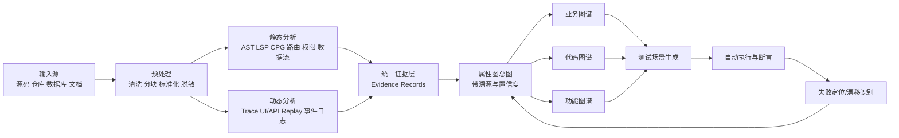
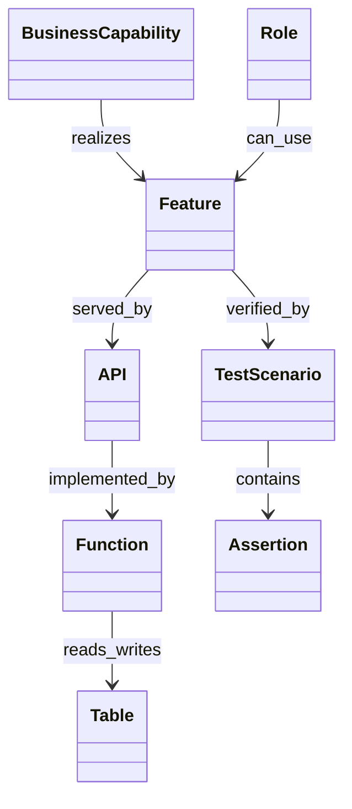

# 面向老项目的三类图谱自动生成与自动验证方法论

## 执行摘要

对于“从一个老项目自动生成业务图谱、代码图谱、功能图谱，并再基于图谱自动生成测试、执行测试、用断言反向验证图谱正确性”这类任务，最稳妥、可复用的做法不是把整个仓库直接丢给单一大模型，而是建立一条**证据驱动的图谱流水线**：先把源码、数据库、文档、接口契约、运行时轨迹分别抽取成结构化证据，再把证据统一落入一个带溯源与置信度的属性图模型中，最后从这张“总图”投影出业务图谱、代码图谱、功能图谱，并由图谱自动派生测试场景、断言规则和回写闭环。这样做的技术基础是：Tree-sitter 可提供多语言增量语法树，LSP 可提供定义/引用等符号导航能力，Joern 的 Code Property Graph 能把 AST、控制流和数据依赖并入统一图，Semgrep 可提供跨文件与 taint 数据流分析，SchemaCrawler 能以厂商无关方式抽取数据库元数据，Apache Tika 能从大量文档格式中统一提取文本与元数据，OpenTelemetry 能记录请求级 trace/spans，OpenAPI 能作为语言无关的 API 契约，Neo4j 则适合承载带属性和关系的图数据。

这套方法的关键不是“先做图，再做测试”，而是“**图谱与测试互为校验器**”。业务图谱给出业务能力、角色、流程与规则；代码图谱给出模块、类、函数、接口、路由、调用、读写表与权限点；功能图谱把用户入口、页面、接口、业务规则、数据状态迁移和测试场景串起来。动态执行产生的 traces、接口响应、数据库状态、UI 轨迹再反过来对三类图谱做一致性检验，并把“文档有但代码没有”“代码能跑但文档未描述”“静态分析有边但运行时未观测到”这三类差异清楚地区分出来。PROV-O 很适合记录图谱节点与边的来源、生成活动和责任主体；PM4Py 又可以把事件日志转换为流程模型并做 conformance checking，因此很适合承接“业务流程是否真的按图谱执行”的验证。

结论上，**推荐的落地策略**是：以“统一证据模型 + 属性图总图 + 三类投影图 + 图驱动测试 + 动态回流校准”为核心架构；以“先支持最常见老项目栈、再用适配器扩展”为工程策略；以“高风险流程人工复核、低风险流程自动化回归”为质量策略。这样既能跨项目复用，也能把 AI 放在“归纳、命名、补全、生成”的位置，而不是让 AI 成为唯一事实来源。

## 适用范围与总体架构

如果用户没有指定语言/框架，建议在报告和实现中明确标注：**代码语言/框架：无特定约束**。但工程上，最好要求至少满足以下之一：存在可用的 Tree-sitter grammar、存在成熟 LSP、可被 Semgrep/Joern 解析、或项目本身已经暴露 OpenAPI 等契约。Tree-sitter 作为增量解析器适合多语言 AST 抽取；LSP 适合拿“定义—引用—调用”符号关系；Semgrep 当前支持 35+ 语言并提供跨文件数据流与 taint；Joern 提供语言无关的 CPG 规范与多语言前端，但不同语言成熟度并不完全相同，因此它更适合作为“深度代码图层”，而不是唯一抽取器。

数据库侧建议标注：**数据库类型：无特定约束；一等支持优先放在关系型数据库**。原因不是因为非关系型不能做，而是因为关系型数据库更容易通过 JDBC/元数据统一抽取模式对象、主外键、索引和视图。SchemaCrawler 明确提供了规范化、厂商无关的 schema 视图，并支持几乎所有有 JDBC 驱动的数据库；它还能把元数据序列化为 JSON/YAML，也能输出 HTML5 与 DOT，方便后续进入图谱和可视化链路。对于 MongoDB、Elasticsearch、Cassandra 这类非关系型库，建议单独做 adapter，把 collection、index、document schema inference 也规范化成同一份 `schema.json`，但同时把关系边的 `confidence` 降低。

文档侧建议标注：**文档格式：Markdown、HTML、PDF、DOCX、PPTX、XLSX、RTF 等均可；无特定约束**。Apache Tika 能从一千多种文件类型中统一提取文本与元数据，适合用来做产品文档、设计文档、接口说明、需求历史和发布记录的清洗入口。对老项目而言，文档常常分散在 wiki 导出、Office 文件、PDF、README 和邮件导出的 HTML 中，因此 Tika 先做统一解析，再由后续规则或 LLM 做术语标准化，是比直接对原始附件逐个定制解析器更稳妥的路线。

访问权限与安全上，推荐默认使用**只读 Git 权限、只读数据库元数据权限、只读文档权限**，动态测试则使用单独的测试环境与最小权限测试账号。OWASP 将最小权限视为基础安全原则；过程挖掘宣言也明确强调事件日志必须具有良好语义，并且要满足隐私与安全要求。因此，图谱流水线应在进入持久层之前就完成密钥脱敏、PII 标签化、日志最小化保留，并把任何可执行测试都限制在 staging/sandbox，而不是直接连生产。



上图中的“统一证据层”是整套方法是否可复用的分水岭。它把不同项目的差异压缩到“抽取器适配层”，而把后续的图谱、测试、可视化、回写逻辑保持稳定。属性图模型适合承载这种带关系、带属性、带来源的多源证据；运行时 trace 又能把静态图难以完全还原的真实调用路径补回来。

## 输入接入与预处理

真正落地时，预处理要做成**可重复、可审计、可缓存**的标准步骤，而不是临时脚本。建议固定为下面这组步骤清单：

1. **资产盘点**：识别 Git 仓库、分支、提交号、后端/前端子目录、数据库连接信息、文档目录、API 契约文件、CI 配置、包管理文件。  
2. **源分类与指纹化**：对每个输入源生成 `source_id`、`source_type`、`commit_sha/version`、`hash`、`last_seen_at`。  
3. **文档清洗**：用 Tika 提取正文、标题、章节、表格元数据；再切分为“段落/章节/术语表/流程描述”粒度。  
4. **数据库归一化**：用 SchemaCrawler 导出统一 schema 元数据，并映射为 `table/column/pk/fk/index/view/procedure`。  
5. **代码归一化**：按语言和框架分类，识别构建工具、依赖清单、入口文件、路由配置、ORM 映射、UI 路由。  
6. **安全前置**：对 `.env`、密钥文件、连接串、token、用户数据、日志样本做脱敏与隔离；保留 provenance，但不把高敏感明文沉淀到图谱。

推荐把预处理后的中间产物统一落成一个“证据目录”，例如：

```text
evidence/
  inventory.json
  docs/
    chunks.jsonl
    glossary.json
  db/
    schema.json
  code/
    ast/
    symbols.jsonl
    routes.jsonl
    permissions.jsonl
    dataflows.jsonl
  runtime/
    traces.jsonl
    ui_events.jsonl
    api_calls.jsonl
```

这样做的好处是：图谱构建、测试生成、失败复盘都不必重新扫整个仓库，而是对中间证据做增量处理。SchemaCrawler 可以直接输出 JSON；Joern 可产出可查询的 CPG，并能导出 DOT 表示；Graphviz 又可以把 DOT 转成 SVG，因此这套目录天然支持“先抽取、后拼图、再可视化”。

下面给一个最小可用的命令行示意。这里的关键不是参数名，而是把“同一种输入总是变成同一种结构化证据”这件事固定下来：

```bash
# 数据库元数据导出
schemacrawler ... --output-format=json > evidence/db/schema.json

# 代码 CPG 生成
joern-parse ./repo/backend --language JAVASRC
joern-export --repr pdg --out evidence/code/pdg

# 图可视化
dot -Tsvg evidence/graph/code-graph.dot -o deliverables/code-graph.svg

# 自动测试
pytest -q tests/generated/api
npx playwright test tests/generated/e2e
```

上面的 `--output-format=json`、`joern-parse`、`joern-export --repr pdg --out ...`、`dot -Tsvg` 都是官方文档可对应到的能力；其中 Joern 支持在无法完整构建的情况下也做鲁棒解析，这对老项目尤其重要。Playwright 既可做 UI，也可做 API 测试，并能记录 trace 便于失败反查。

## 静态与动态分析设计

静态分析层建议采用“**通用解析器 + 框架适配器 + 深度图分析器**”三层叠加法。通用层用 Tree-sitter 做 AST 和局部结构抽取，用 LSP 做符号定义/引用/跳转关系；深度层用 Joern 形成 CPG，用 Semgrep 做模式和 taint 数据流分析。这样能兼顾广覆盖与深分析：Tree-sitter 和 LSP 解决“覆盖面”，Joern 和 Semgrep 解决“调用链、数据流、危险点、跨文件关系”。原始的 CPG 论文也表明，把 AST、CFG、PDG 合并成统一图，对发现真实程序模式非常有效；Joern 文档则把 CPG 明确定义为带属性的多重图并提供统一前端。

在实体抽取上，建议把“抽什么”拆成固定清单，而不是按项目临时决定。表、列、主外键、索引、视图从数据库元数据来；模型、类、函数、包、模块、import、调用链从 AST/LSP/CPG 来；接口、路由、请求方法、参数、响应模型从 OpenAPI 或框架路由定义来；权限点从安全注解、守卫、依赖注入、安全依赖和中间件配置里抽；读写表和数据流从 ORM 映射、SQL 字符串、repository 调用、taint/PDG 分析里抽。OpenAPI 规范把 path/operation 作为语言无关接口描述；Joern 和 Semgrep 分别提供查询型 CPG 与 taint/dataflow 支持，所以这几类实体可以形成比较稳定的抽取套路。

在常见框架上，建议优先实现一批**高价值适配器**。后端可从 Spring `@RequestMapping`、Express Router、FastAPI path operation decorators、Django URLconf、ASP.NET Core routing、NestJS controllers 中抽路由；权限点可从 Spring Security `@PreAuthorize`、ASP.NET `[Authorize]`、NestJS Guards、FastAPI `Security/Depends` 中抽；前端入口可从 React Router `<Routes>/<Route>` 或 route config、Vue Router route records、Angular routes 中抽“URL→页面/组件”映射。这些都来自各自官方文档定义的框架元数据，因此比单纯依赖正则更稳定。

动态分析层要解决两件静态分析天然做不好的事：**真实执行路径**与**业务实际流程**。OpenTelemetry 的 traces/spans 很适合记录请求进入、服务调用、数据库访问等运行时行为；Playwright 的 UI 自动化、APIRequestContext 和 trace viewer 适合记录页面行为、断言、网络请求和失败证据；PM4Py 则能把事件日志转成流程图、Petri net 或 BPMN，并做 conformance checking。对老项目来说，这三者联动的收益很高：静态层告诉你“应该能怎么走”，动态层告诉你“实际上怎么走”，过程挖掘则告诉你“真实流程偏离了多少”。

一个实用的抽取矩阵如下：

| 抽取对象 | 首选证据 | 推荐工具 | 备注 |
|---|---|---|---|
| 表、列、约束、视图 | DB 元数据 | SchemaCrawler | 关系型优先，天然结构化 |
| 类、函数、模块、调用 | 语法/符号/CPG | Tree-sitter、LSP、Joern | 老项目可先宽后深 |
| 路由、接口参数、响应 | OpenAPI、框架元数据 | OpenAPI、Spring/Express/FastAPI/Django/ASP.NET/Nest 抽取器 | 契约优先，代码兜底 |
| 数据流、输入输出传播 | 程序依赖图、taint | Joern、Semgrep | 找“接口→服务→SQL/表”路径 |
| UI 入口、页面跳转 | 前端路由与运行时回放 | React Router/Vue Router/Angular + Playwright | 静态入口 + 动态证据 |
| 业务流程 | 文档、trace、审计日志 | Tika、OpenTelemetry、PM4Py | 文档表意，日志校验 |
| 权限点 | 注解、guard、依赖、安全配置 | Spring Security、ASP.NET、NestJS、FastAPI | 用于图谱与测试同时生成 |

表中的工具能力均来自官方或原始资料，尤其适合作为“先搭通，再逐步加深”的组合。

## 三类图谱建模与可视化

推荐先建立一张**属性图总图**，再从总图投影出三类视图，而不是为三类图谱分别做三套存储。Neo4j 的 property graph 模型天然支持“节点—关系—属性”表达；PROV-O 又能为每个节点/边附加 `wasDerivedFrom`、`wasGeneratedBy`、`wasAttributedTo` 一类溯源信息，因此总图可以同时承载事实、来源、置信度和时间版本。

三类图谱的建议定义如下。**业务图谱**描述“系统是为谁解决什么问题、以什么流程和规则工作”；核心节点建议包括 `BusinessCapability`、`Process`、`Role`、`Policy`、`DomainEntity`、`KPI`、`BusinessRule`。**代码图谱**描述“系统由哪些代码与数据对象构成、它们如何依赖与调用”；核心节点建议包括 `Repo`、`Service`、`Module`、`Package`、`File`、`Class`、`Function`、`API`、`Table`、`Column`、`SQL`、`UIComponent`。**功能图谱**描述“用户从哪个入口触发哪些页面、接口、规则、状态迁移与测试场景”；核心节点建议包括 `Feature`、`UseCase`、`Page`、`Action`、`API`、`ValidationRule`、`State`、`TestScenario`、`Assertion`。这些节点最终都落在同一张总图里，只是三类视图的投影规则不同。

建议所有节点都带以下元数据字段：`id`、`type`、`name`、`namespace`、`source_system`、`source_ref`、`extractor`、`extractor_version`、`commit_sha/version`、`env`、`confidence`、`provenance_refs[]`、`first_seen_at`、`last_seen_at`、`owner`、`privacy_level`。边则至少带：`type`、`direction`、`evidence_count`、`confidence`、`observed_runtime`、`source_priority`。这不是为了“学术上完整”，而是为了后面测试失败时能准确定位到“哪条边是从哪段文档、哪次 trace、哪条规则得来的”。PROV-O 的价值就在这里：它把“图谱不是拍脑袋画的”这件事变成可追溯事实。

下面这个对比表是最值得固定下来的，因为它决定后续测试生成与人工复核的边界：

| 维度 | 业务图谱 | 代码图谱 | 功能图谱 | 三者交叉关系 |
|---|---|---|---|---|
| 关注对象 | 能力、角色、流程、规则 | 模块、函数、接口、表、调用 | 用户入口、页面、接口、状态、场景 | `BusinessCapability -> Feature -> API -> Function -> Table` |
| 主要来源 | 产品文档、流程文档、事件日志 | 源码、构建文件、DB schema、OpenAPI | 前端路由、接口契约、业务规则、回放脚本 | 文档给意图，代码给实现，运行时给真实执行 |
| 主要问题 | 这个系统“做什么” | 这个系统“怎么做” | 用户“如何触发并看到结果” | 功能图谱是业务与代码之间的桥 |
| 典型节点 | Capability、Process、Role、Rule | Service、Class、Method、API、Table | Feature、Page、Action、Assertion | `realizes / served_by / implemented_by / reads_writes` |
| 主要验证方式 | 流程一致性、角色权限一致性 | 调用与数据流一致性、死链/漂移 | 端到端行为一致性、状态迁移与断言 | 一条关键路径应能贯穿三图 |
| 漂移表现 | 文档流程过时 | 路由/表/调用变更 | 页面流程变了但测试/文档没更新 | 差异必须回写总图并标记来源 |

这个表本身是方法论定义，但它建立在属性图、API 契约、运行时 trace 和过程一致性检查这些已有成熟模型之上。

知识融合建议采用“**来源优先级 + 证据计数 + 时间新鲜度 + 运行时校验**”四因素规则。一个可落地的优先级是：  
**运行时观测 > 可执行代码结构 > API 契约 > 数据库元数据 > 产品文档 > 注释/命名推断**。  
例如：文档说有 `POST /orders/confirm`，但代码和运行时都没有，则标记为 `planned_or_stale`；代码有某边但运行时长期未观测到，则标记为 `static_only_candidate`；运行时出现某 SQL 或某服务调用链，但静态图没有，则标记为 `dynamic_only_candidate`，通常意味着反射、动态 SQL、插件式调用或抽取器漏检。这样的冲突处理，本质上是在利用 PROV 溯源和 OTel/PM4Py 的运行时证据，把“冲突”显式化，而不是偷偷覆盖。



可视化输出建议分三层。第一层是**面向人沟通的小图**，优先 Mermaid 流程图、类图、journey 图；第二层是**可发布的静态图**，优先 Graphviz 转 SVG；第三层是**可探索的交互图**，优先 HTML + Cytoscape.js。Mermaid 适合“文档即图”；Graphviz 适合批量导出 SVG；Cytoscape.js 适合在浏览器里做筛选、布局和点击下钻。对于数据库 schema，本身也可以直接用 SchemaCrawler 的 HTML5、DOT 与图形输出衔接到最终交付物。

## 自动测试与图谱验证闭环

测试生成推荐从**功能图谱**出发，因为它最接近可执行场景。一个稳定的生成链是：先从业务图谱中挑出关键能力与流程，再在功能图谱中把它们展开成“入口—动作—接口—状态—断言”，再借助代码图谱补齐“落到哪个 handler、哪个 service、哪张表、哪个权限点”。最后针对同一个场景同时生成四类测试：接口测试、端到端 UI 测试、数据库断言测试、图谱结构断言测试。OpenAPI + Schemathesis 非常适合接口层的自动派生；它明确是基于 Hypothesis 的 property-based API testing。对 UI 与 API 联合场景，Playwright 既能做浏览器自动化，也能做 API 测试，还能录制 trace；对运行环境，Testcontainers 适合起临时数据库、消息队列、浏览器或其他依赖。

测试数据生成建议采用“三层策略”。第一层是**确定性样本**，覆盖 happy path、主要异常路径、典型边界值；第二层是**属性测试/模糊生成**，覆盖参数组合、非法输入、类型边界、空值和顺序变体；第三层是**关系型数据装配**，按图谱里的实体关系成批生成彼此一致的对象。Faker 支持可复现 seed，适合生成稳定的假数据；Hypothesis 则适合搜索边界输入，并在发现错误时尽量缩减成最小失败样例。

断言一定要分层，而不是只断言 HTTP 200。推荐至少有四层：  
其一，**协议断言**，如状态码、header、body schema、错误码。  
其二，**业务断言**，如订单状态是否从 `DRAFT` 变到 `CREATED`、角色是否被拒绝。  
其三，**数据库断言**，如目标表是否新增记录、关联表是否同步更新。  
其四，**图谱断言**，如本次执行是否命中功能图谱预测的 API、函数、表和权限边。  
Playwright 的 web-first assertions、API 测试能力和 trace viewer 很适合做前两层与 UI 证据采集；数据库断言则可直接由测试脚本连到隔离数据库；图谱断言则由 trace/span 与图谱节点对齐完成。

一个建议的自动生成测试用例表示如下：

```yaml
id: FG_ORDER_CREATE_HAPPY_PATH
business_capability: 订单创建
feature: 订单创建表单提交
entry:
  page: /orders/new
actor:
  role: sales
preconditions:
  - customer exists
  - product exists
steps:
  - ui.fill customerId = C1001
  - ui.fill productCode = P2001
  - ui.click submit
expected:
  api:
    - POST /api/orders -> 201
  db:
    - table orders has row where customer_id=C1001 and status=CREATED
  graph:
    - observed path matches Feature->API->Function->Table
  auth:
    - role sales is allowed
```

这类中间表示的意义在于：它既能生成 Playwright/pytest 代码，也能生成对业务方友好的“测试场景卡片”。pytest 原生支持参数化和 fixtures，Playwright 也提供 pytest plugin 或其自有测试框架，因此批量生成和共享上下文都比较顺手。

下面给一个简化的测试代码样例，展示“图谱断言 + API 断言 + DB 断言”三者如何合在一起：

```python
import pytest

@pytest.mark.parametrize("customer_id, product_code", [
    ("C1001", "P2001"),
    ("C1002", "P2003"),
])
def test_order_create(api_client, db, graph_assert, customer_id, product_code):
    res = api_client.post("/api/orders", json={
        "customerId": customer_id,
        "productCode": product_code,
        "quantity": 1
    })
    assert res.status_code == 201

    row = db.fetch_one(
        "select status from orders where customer_id=%s order by created_at desc limit 1",
        [customer_id],
    )
    assert row["status"] == "CREATED"

    graph_assert.path_exists(
        feature="订单创建",
        api="POST /api/orders",
        table="orders"
    )
```

批量测试生成时，推荐把 `api_client`、`db`、`graph_assert` 都做成 fixture，把“输入组合”做成参数化，这样便于按图谱节点做筛选和增量运行。

覆盖度度量不要只盯代码覆盖率，至少要同时看四种覆盖：  
**图谱节点覆盖率** = 已被至少一个测试命中的节点 / 应验证节点；  
**图谱边覆盖率** = 已被至少一个测试验证过的关键边 / 关键边总数；  
**关键路径覆盖率** = 关键业务路径中已被端到端验证的路径 / 总关键路径；  
**代码覆盖率** = 行覆盖、分支覆盖、函数覆盖。  
Java 可用 JaCoCo，Python 可用 coverage.py，JS/TS 可用 Istanbul/nyc。code coverage 不是图谱正确性的充分条件，但它是“测试是否真的把实现跑起来了”的重要辅助指标。citeturn5search0turn5search6turn5search4turn5search1turn5search5turn5search2

失败定位与回写要做成闭环。最佳做法是把每次测试执行都带上 `scenario_id`、`trace_id`、`graph_version`、`commit_sha`。当测试失败时，利用 OpenTelemetry 的 span 链路、Playwright trace、数据库快照和图谱 provenance，自动把失败归因到以下几类之一：`contract_mismatch`、`missing_route_edge`、`wrong_table_mapping`、`permission_graph_error`、`ui_flow_drift`、`stale_doc_rule`。若 PM4Py 的 conformance checking 发现活动序列偏离预期流程，则将偏离变成新的“候选修正边”或“待人工判定差异”。

## 工程化落地与端到端示例

工程化上，最重要的是把项目差异收敛进**配置与适配器**，而不是把差异散落在业务代码里。建议至少暴露以下可配置参数：仓库路径、语言列表、框架适配器开关、文档目录模式、数据库连接方式、是否启用 OTel、测试环境地址、需要验证的关键业务能力列表、低置信度阈值、图谱导出格式、CI 门禁阈值。这样，同一套流水线才能在不同项目中靠配置复用，而不是靠复制脚本复用。

分阶段可交付物建议如下：

| 阶段 | 目标 | 主要交付物 |
|---|---|---|
| 资产接入 | 把源统一纳管 | `inventory.json`、权限清单、脱敏规则 |
| 证据抽取 | 产出结构化证据 | `schema.json`、`routes.jsonl`、`symbols.jsonl`、`doc_chunks.jsonl` |
| 图谱构建 | 形成总图和三类投影 | `graph.db`、`business.graph.json`、`code.graph.json`、`feature.graph.json` |
| 可视化发布 | 面向人阅读与下钻 | `*.svg`、`*.html`、`*.mmd` |
| 测试生成与执行 | 验证图谱正确性 | `tests/generated/*`、覆盖率报告、trace 包 |
| 闭环修正 | 处理差异与漂移 | `graph-drift-report.html`、待复核队列、修正规则库 |

这张表是实践建议，但其背后的输出能力都能直接对应到官方工具：SchemaCrawler 可出 JSON/HTML5/DOT，Joern 可导出图表示，Graphviz 可出 SVG，Cytoscape.js 可承载交互 HTML，Playwright 可保存 traces。

CI/CD 集成建议做成两级。**PR 级**只跑增量：受影响模块的证据重抽、受影响子图重建、关键场景 smoke tests、图谱漂移检测；**夜间/发布级**再跑全量：全库抽取、全量子图导出、完整 E2E、流程 conformance checking、覆盖率汇总。对于大项目，视图化时不要尝试渲染全图，而是按业务能力、领域边界、服务边界或单场景做切片。Tree-sitter 的增量解析和 LSP/索引式符号导航都适合支撑增量处理；Playwright 与 Testcontainers 则适合把执行环境也做成流水线资产。

下面给出一个端到端示例，假设项目是 **Spring Boot + React + PostgreSQL**，目标是自动还原“创建订单”能力并验证图谱：

1. 用 Tika 解析产品文档与历史需求，提取“订单创建”“销售角色”“草稿到创建状态”这些业务术语。
2. 用 SchemaCrawler 导出 PostgreSQL schema，获得 `orders`、`order_items`、`customers` 表及外键关系。
3. 用 Spring `@RequestMapping` 和 Spring Security `@PreAuthorize` 抽出 `POST /api/orders` 与角色约束；用 React Router 抽出 `/orders/new` 页面入口。
4. 用 Joern/Tree-sitter/LSP 抽出 `OrderController -> OrderService -> OrderRepository` 的实现链；用 Semgrep/Joern 识别请求参数流向持久化逻辑。
5. 在总图中形成链路：`业务能力 订单创建 -> 功能 订单创建表单 -> API POST /api/orders -> Function createOrder -> Table orders/order_items`。
6. 由功能图谱生成测试：Playwright 打开 `/orders/new`，填写表单；接口层调用 `POST /api/orders`；数据库层断言 `orders.status=CREATED`；图谱层断言链路完整。
7. 执行时开启 OTel tracing，把 trace 中观测到的 service/span 与图谱边对齐；再把事件日志送入 PM4Py 做流程一致性检查。
8. 如果测试失败，例如 UI 成功、API 返回 201，但数据库没有记录，就把差异标记为 `db_write_missing`，并把 `Function->Table` 边降级为待复核；如果 trace 里出现了文档未描述的新服务调用，则标记为 `undocumented_runtime_path`。

这一端到端链路的价值在于：它不是“自动画一张图”，而是把“图—测试—运行时—回写”串成了持续演化系统。老项目第一次上线时，图谱难免不完整；但只要闭环存在，第二轮、第三轮之后，图谱与测试会越来越准。

## 风险、局限与人工复核策略

最大的风险不是工具本身，而是把 AI 当成单一事实来源。更稳妥的做法是：**AI 只负责归纳、命名、补全与生成，不负责越过证据替代证据**。图谱中的每一条关键边都要能追溯到文档片段、代码位置、OpenAPI 操作、数据库对象或运行时 trace；没有来源的边应标记为 `inferred_only`，默认不进入高风险测试与自动门禁。PROV-O 对此非常关键，因为它为“图谱中的结论来自哪里”提供了可交换模型。

第二类风险是**注释缺失、文档老旧、命名混乱**。这在老项目里几乎是常态，因此不能把文档当绝对真相；应采用“运行时与代码优先、文档表意辅助”的策略。过程挖掘宣言强调事件日志应完整、可信且语义明确，而实际上很多老项目日志做不到这一点，所以建议只把日志和 trace 作为高价值补证，而不是孤证。

第三类风险是**多语言混合、反射、动态 SQL、插件装配、闭源依赖**。Joern 官方文档明确提示不同语言前端成熟度不同、并非所有语言都支持；如果语言不在支持列表里，应回退到 Tree-sitter/LSP 的浅层结构图，再在运行时用 OTel/Playwright/接口回放补足。对闭源依赖，则建议把它们建模为 `ExternalService` 或 `OpaqueLibrary` 节点，只保留“调用方向、输入输出、运行时证据、失败症状”，不要伪造内部实现图。这样虽然图不够“细”，但比编造更可靠。citeturn10search0turn10search2turn0search0turn6search0turn0search2turn14search2

第四类风险是**安全与合规**。图谱系统会聚合源码、数据库与文档，因此它本身可能变成高敏感资产。OWASP 对最小权限原则的要求很明确：只给完成任务所需的最小权限。因此，建议把“图谱构建权限”和“图谱浏览权限”拆开；默认只允许查看脱敏后的字段、元数据和测试痕迹，对生产数据值一律采用哈希、范围或标签化显示。

人工复核策略最好写成明确门槛，而不是口头要求。一个可执行的建议是：  
- 关键业务域，如登录、支付、下单、退款、删除数据、权限管理，**首次建图必须人工复核**。  
- `confidence < 0.60` 的节点/边默认进入人工待办。  
- “仅文档存在”或“仅运行时存在”的关键路径必须复核。  
- 多语言边界、动态 SQL、反射调用、闭源依赖边界默认高风险。  
- PR 级只允许自动阻断已人工确认过规则的回归错误；新发现差异先入待办，不立刻一刀切阻断。  

这样做的目的，是把人工成本集中到真正高风险的地方，同时让自动化在低风险、高重复度的区域持续放大收益。整套方法论真正落地以后，图谱不是一次性交付物，而会成为老项目持续治理、知识沉淀、回归测试与变更评估的共同底座。