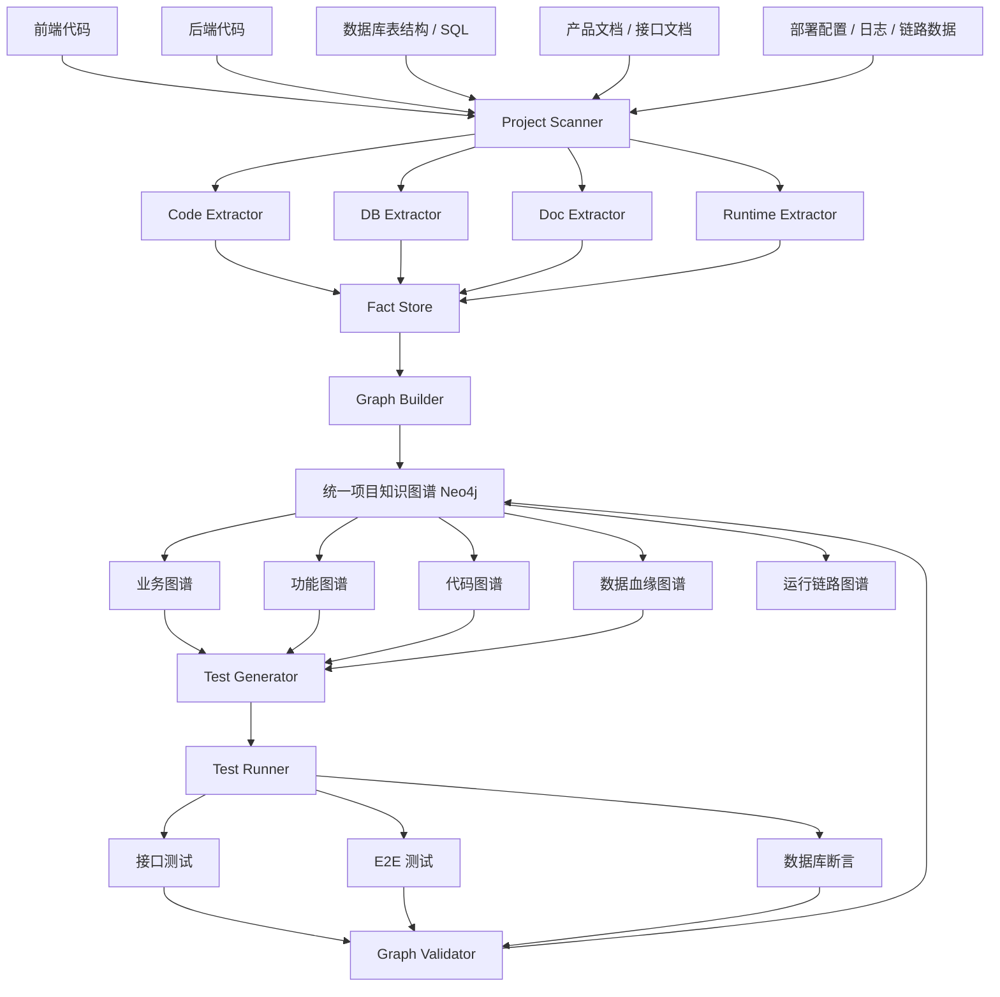

# 老项目 AI 图谱理解平台落地方案

> 目标：通过输入老项目的前后端代码、数据库表结构、SQL、产品文档、接口文档和运行配置，自动抽取项目事实，构建统一项目知识图谱，并输出业务图谱、功能图谱、代码图谱。再基于图谱生成测试用例、自动测试和断言，用测试结果反向验证图谱正确性。

---

## 1. 背景与目标

老项目迁移或重构时，最难的问题通常不是代码能不能跑，而是：

1. 不知道系统到底有哪些业务。
2. 不知道一个功能背后调用了哪些接口、服务、SQL 和表。
3. 不知道页面、接口、权限、数据表之间的真实关系。
4. 文档过期，代码没人敢改。
5. 测试用例缺失，迁移后无法证明新系统与老系统行为一致。

因此，本方案建议建设一个内部工具平台：

## `LegacyGraph 老项目理解平台`

平台的核心思想是：

> 不要直接生成三个孤立图谱，而是先构建一个统一项目知识图谱，再从统一图谱中派生出业务图谱、功能图谱和代码图谱三个视图。

---

## 2. 总体结论

仅依赖 AI 阅读代码和文档，不能完全可靠地理解老项目。

更可落地的方式是：

1. 用静态分析工具抽取确定事实。
2. 用数据库元数据抽取数据结构事实。
3. 用文档解析和 AI 抽取业务语义。
4. 用图数据库统一存储关系。
5. 用测试用例和断言验证图谱是否正确。
6. 用人工审核低置信度节点。
7. 用持续扫描机制保持图谱随代码变化而更新。

最终形成如下闭环：

```text
代码 / 数据库 / 文档
        ↓
事实抽取
        ↓
统一项目知识图谱
        ↓
业务图谱 / 功能图谱 / 代码图谱
        ↓
自动生成测试用例
        ↓
接口测试 / E2E 测试 / 数据库断言
        ↓
测试结果回写图谱
        ↓
提升或降低图谱置信度
```

---

## 3. 目标产物

最终平台需要产出以下内容：

| 产物 | 说明 |
|---|---|
| 业务图谱 | 描述业务域、业务流程、业务对象、业务规则、角色、状态流转 |
| 功能图谱 | 描述系统模块、菜单、页面、按钮、接口、权限、用户操作路径 |
| 代码图谱 | 描述后端接口、Controller、Service、Mapper、SQL、表、字段、外部系统调用 |
| 数据血缘图谱 | 描述接口、SQL、表、字段之间的读写关系 |
| 运行链路图谱 | 描述请求运行时经过的接口、服务、数据库、缓存、消息队列等链路 |
| 测试用例库 | 根据图谱自动生成接口测试、E2E 测试和数据库断言 |
| 证据链 | 每个节点和关系都能追溯到代码文件、行号、SQL、表字段或文档段落 |
| 置信度体系 | 标记每个图谱事实的可信程度，支持人工确认和自动测试回写 |

---

## 4. 总体架构



---

## 5. 平台模块设计

## 5.1 Project Scanner：项目扫描器

### 作用

统一接入项目输入源，并生成项目清单。

### 输入

1. 后端代码仓库。
2. 前端代码仓库。
3. 数据库 DDL。
4. 初始化 SQL。
5. MyBatis XML。
6. JPA Repository。
7. 产品文档。
8. 接口文档。
9. 部署配置。
10. 测试环境地址。
11. 测试账号。

### 输出

`project-manifest.json`

示例：

```json
{
  "projectCode": "legacy-oa",
  "projectName": "老 OA 系统",
  "backend": {
    "language": "Java",
    "framework": "Spring Boot",
    "path": "./backend"
  },
  "frontend": {
    "framework": "Vue",
    "path": "./frontend"
  },
  "database": {
    "type": "PostgreSQL",
    "ddlPath": "./db/schema.sql"
  },
  "documents": [
    "./docs/product.md",
    "./docs/api.md"
  ],
  "testEnv": {
    "baseUrl": "http://test.example.com",
    "accountProfile": "test-user"
  }
}
```

---

## 5.2 Code Extractor：代码事实抽取器

### 作用

从前后端代码中抽取确定事实。

### 后端抽取内容

| 抽取对象 | 示例 |
|---|---|
| Controller | `@RestController`、`@RequestMapping` |
| API 接口 | URL、HTTP Method、入参、出参 |
| Service | Service 类和方法 |
| 方法调用关系 | Controller 调用 Service，Service 调用 Mapper |
| MyBatis Mapper | Mapper 接口、XML SQL、动态 SQL |
| JPA Repository | `@Query`、方法名查询 |
| SQL | SELECT、INSERT、UPDATE、DELETE |
| 表读写关系 | SQL 读写哪些表 |
| 事务 | `@Transactional` |
| 权限 | `@PreAuthorize`、自定义权限注解 |
| 定时任务 | `@Scheduled`、PowerJob、XXL-Job |
| MQ 消费者 | Kafka、RabbitMQ、RocketMQ 消费逻辑 |
| 外部系统调用 | Feign、RestTemplate、WebClient、HTTP Client |

### 前端抽取内容

| 抽取对象 | 示例 |
|---|---|
| 路由 | Vue Router、React Router |
| 页面 | `.vue`、`.tsx`、`.jsx` 页面组件 |
| 菜单 | 菜单配置、动态路由 |
| 按钮 | 新增、编辑、删除、提交、审批 |
| 表单字段 | input、select、date-picker、upload |
| 表格字段 | table columns |
| API 调用 | axios、fetch、request 封装 |
| 权限标识 | `v-permission`、按钮权限码 |
| 状态管理 | Vuex、Pinia、Redux |
| 页面跳转 | router.push、navigate |

### 推荐工具

| 场景 | 工具 |
|---|---|
| Java AST 解析 | JavaParser、Spoon |
| Java 安全/数据流分析 | CodeQL |
| 通用代码规则扫描 | Semgrep |
| SQL 解析 | JSqlParser、sqlglot |
| MyBatis XML 解析 | DOM4J、MyBatis XML Parser |
| JS/TS AST 解析 | ts-morph、Babel Parser |
| Vue 解析 | Vue Compiler、ESLint AST |
| 自动重构辅助 | OpenRewrite |

---

## 5.3 DB Extractor：数据库事实抽取器

### 作用

从数据库结构中抽取表、字段、关系和业务含义。

### 抽取内容

| 抽取对象 | 说明 |
|---|---|
| 表 | 表名、表注释、表类型 |
| 字段 | 字段名、字段类型、字段注释、是否必填 |
| 主键 | 主键字段 |
| 外键 | 显式外键或通过命名规则推断 |
| 索引 | 普通索引、唯一索引、组合索引 |
| 字典字段 | status、type、category、state 等 |
| 审计字段 | created_by、created_time、updated_by、updated_time |
| 逻辑删除字段 | deleted、is_deleted、del_flag |
| 租户字段 | tenant_id、org_id、company_id |
| 状态字段 | status、process_status、audit_status |
| 关联关系 | 一对一、一对多、多对多 |

### 推荐工具

| 数据库 | 工具 |
|---|---|
| PostgreSQL | `information_schema`、`pg_catalog`、`pg_dump` |
| MySQL | `information_schema`、`SHOW CREATE TABLE` |
| Oracle | `ALL_TABLES`、`ALL_TAB_COLUMNS` |
| SQL 解析 | JSqlParser、sqlglot |
| 迁移脚本 | Liquibase、Flyway |

---

## 5.4 Doc Extractor：文档事实抽取器

### 作用

从产品文档、需求文档、接口文档、操作手册中抽取业务语义。

### 抽取内容

| 抽取对象 | 示例 |
|---|---|
| 业务域 | 采购管理、合同管理、流程审批 |
| 业务流程 | 创建申请、提交审批、审核通过、归档 |
| 业务对象 | 订单、合同、申请单、任务 |
| 业务规则 | 金额大于 10 万需要二级审批 |
| 角色 | 申请人、审批人、管理员 |
| 页面说明 | 页面名称、字段说明、操作说明 |
| 异常规则 | 驳回、撤回、超时、作废 |
| 状态流转 | 草稿 -> 待审批 -> 已通过 -> 已归档 |

### 推荐工具

| 文档类型 | 工具 |
|---|---|
| Word / Excel / PPT | Apache POI |
| PDF / Word / HTML | Apache Tika |
| Markdown | Markdown Parser |
| 图片文档 | OCR |
| 业务语义抽取 | LLM |

---

## 5.5 Graph Builder：图谱构建器

### 作用

把代码、数据库、文档、运行日志中的事实合并为统一项目知识图谱。

### 核心原则

1. AI 不能直接作为事实来源。
2. AI 可以做归纳、命名、聚类和推断。
3. 每一个节点和关系必须有证据。
4. 没有证据的内容只能进入待确认区。
5. 所有关系都要有置信度。
6. 测试验证通过后才能提升置信度。

---

## 5.6 Test Generator：测试用例生成器

### 作用

根据图谱自动生成测试用例。

### 生成类型

| 类型 | 说明 |
|---|---|
| API 测试 | 根据接口、入参、出参、表读写关系生成接口测试 |
| E2E 测试 | 根据页面、按钮、表单和接口关系生成端到端测试 |
| DB 断言 | 根据 SQL 和表读写关系生成数据库状态断言 |
| 业务状态断言 | 验证业务状态流转是否符合业务规则 |
| 权限测试 | 验证不同角色是否能访问对应功能 |
| 异常测试 | 验证必填、非法值、权限不足、状态不允许等场景 |

---

## 5.7 Graph Validator：图谱验证器

### 作用

执行测试并把结果回写图谱。

### 验证方式

| 验证内容 | 验证方式 |
|---|---|
| 页面是否调用该接口 | E2E 测试抓取网络请求 |
| 接口是否写入该表 | 执行接口后查询数据库变化 |
| 接口是否读取该表 | SQL 日志、链路追踪、数据库审计 |
| 业务状态是否正确 | 测试前后查询状态字段 |
| 权限是否正确 | 不同角色执行同一操作 |
| 图谱关系是否正确 | 测试结果反向确认关系 |

---

## 6. 统一项目知识图谱设计

## 6.1 节点类型

| 节点类型 | 含义 |
|---|---|
| Project | 项目 |
| System | 系统 |
| BusinessDomain | 业务域 |
| BusinessProcess | 业务流程 |
| BusinessObject | 业务对象 |
| BusinessRule | 业务规则 |
| Role | 角色 |
| State | 状态 |
| FeatureModule | 功能模块 |
| Feature | 功能点 |
| Menu | 菜单 |
| Page | 页面 |
| Button | 按钮 |
| FormField | 表单字段 |
| Permission | 权限 |
| ApiEndpoint | 接口 |
| Controller | Controller 类 |
| Service | Service 类 |
| Method | 方法 |
| Mapper | Mapper 接口 |
| SqlStatement | SQL 语句 |
| Table | 数据库表 |
| Column | 数据库字段 |
| ExternalSystem | 外部系统 |
| MQTopic | 消息主题 |
| Job | 定时任务 |
| TestCase | 测试用例 |
| Assertion | 断言 |
| Evidence | 证据 |

---

## 6.2 关系类型

| 关系 | 含义 |
|---|---|
| `CONTAINS` | 包含 |
| `USES` | 使用业务对象 |
| `IMPLEMENTED_BY` | 业务由功能实现 |
| `EXPOSED_BY` | 功能由页面暴露 |
| `HAS_BUTTON` | 页面包含按钮 |
| `HAS_FIELD` | 页面包含字段 |
| `REQUIRES_PERMISSION` | 功能需要权限 |
| `CALLS_API` | 页面调用接口 |
| `HANDLED_BY` | 接口由 Controller 处理 |
| `CALLS` | 方法调用方法 |
| `EXECUTES` | Mapper 执行 SQL |
| `READS` | SQL 读取表 |
| `WRITES` | SQL 写入表 |
| `HAS_COLUMN` | 表包含字段 |
| `PUBLISHES` | 发布消息 |
| `CONSUMES` | 消费消息 |
| `CALLS_EXTERNAL` | 调用外部系统 |
| `VERIFIED_BY` | 被测试用例验证 |
| `ASSERTS` | 测试用例包含断言 |
| `HAS_EVIDENCE` | 节点或关系有证据 |

---

## 6.3 图谱关系示例

```text
业务域：合同管理
  -> 包含业务流程：合同创建流程
  -> 使用业务对象：合同
  -> 实现功能：合同新增
  -> 暴露页面：合同新增页面
  -> 页面调用接口：POST /contract/create
  -> 接口处理类：ContractController.create
  -> 调用服务：ContractService.create
  -> 调用 Mapper：ContractMapper.insert
  -> 执行 SQL：insert into contract ...
  -> 写入表：contract
  -> 被测试用例验证：test_create_contract_success
```

---

## 7. 图谱数据结构设计

## 7.1 节点属性

```json
{
  "id": "api:POST:/contract/create",
  "type": "ApiEndpoint",
  "name": "创建合同接口",
  "properties": {
    "method": "POST",
    "path": "/contract/create",
    "controller": "ContractController",
    "methodName": "create"
  },
  "confidence": 0.95,
  "status": "CONFIRMED",
  "evidenceIds": ["ev-001", "ev-002"],
  "createdBy": "CodeExtractor",
  "updatedAt": "2026-06-26T00:00:00+08:00"
}
```

---

## 7.2 关系属性

```json
{
  "id": "edge-001",
  "from": "page:contract-create",
  "to": "api:POST:/contract/create",
  "type": "CALLS_API",
  "confidence": 0.92,
  "status": "CONFIRMED",
  "evidenceIds": ["ev-101"],
  "verifiedBy": ["test_create_contract_success"]
}
```

---

## 7.3 证据结构

```json
{
  "id": "ev-001",
  "sourceType": "CODE",
  "sourcePath": "src/main/java/com/example/ContractController.java",
  "startLine": 32,
  "endLine": 45,
  "content": "@PostMapping(\"/contract/create\")",
  "extractor": "CodeExtractor",
  "confidence": 1.0
}
```

---

## 8. 核心数据库表设计

## 8.1 项目表：`lg_project`

```sql
create table lg_project (
    id              varchar(64) primary key,
    project_code    varchar(128) not null,
    project_name    varchar(256) not null,
    repo_url        text,
    project_type    varchar(64),
    tech_stack      jsonb,
    created_at      timestamp,
    updated_at      timestamp
);
```

---

## 8.2 事实表：`lg_fact`

```sql
create table lg_fact (
    id              varchar(64) primary key,
    project_id      varchar(64) not null,
    fact_type       varchar(64) not null,
    source_type     varchar(64) not null,
    source_path     text,
    start_line      int,
    end_line        int,
    content         text,
    structured_data jsonb,
    confidence      numeric(5, 4),
    status          varchar(32),
    created_at      timestamp
);
```

---

## 8.3 图谱节点表：`lg_graph_node`

```sql
create table lg_graph_node (
    id              varchar(64) primary key,
    project_id      varchar(64) not null,
    node_type       varchar(64) not null,
    node_key        varchar(512) not null,
    node_name       varchar(512),
    properties      jsonb,
    confidence      numeric(5, 4),
    status          varchar(32),
    created_by      varchar(64),
    created_at      timestamp,
    updated_at      timestamp
);
```

---

## 8.4 图谱关系表：`lg_graph_edge`

```sql
create table lg_graph_edge (
    id              varchar(64) primary key,
    project_id      varchar(64) not null,
    from_node_id    varchar(64) not null,
    to_node_id      varchar(64) not null,
    edge_type       varchar(64) not null,
    properties      jsonb,
    confidence      numeric(5, 4),
    status          varchar(32),
    created_by      varchar(64),
    created_at      timestamp,
    updated_at      timestamp
);
```

---

## 8.5 测试用例表：`lg_test_case`

```sql
create table lg_test_case (
    id              varchar(64) primary key,
    project_id      varchar(64) not null,
    case_code       varchar(128) not null,
    case_name       varchar(512),
    case_type       varchar(64),
    target_node_id  varchar(64),
    request_data    jsonb,
    expected_data   jsonb,
    assertions      jsonb,
    generated_by    varchar(64),
    confidence      numeric(5, 4),
    status          varchar(32),
    created_at      timestamp,
    updated_at      timestamp
);
```

---

## 8.6 测试结果表：`lg_test_result`

```sql
create table lg_test_result (
    id              varchar(64) primary key,
    project_id      varchar(64) not null,
    test_case_id    varchar(64) not null,
    run_id          varchar(64) not null,
    result_status   varchar(32),
    request_log     jsonb,
    response_log    jsonb,
    db_before       jsonb,
    db_after        jsonb,
    assertion_log   jsonb,
    error_message   text,
    started_at      timestamp,
    finished_at     timestamp
);
```

---

## 9. 三类图谱生成方式

## 9.1 代码图谱

### 目标

回答下面的问题：

1. 一个接口在哪个 Controller？
2. Controller 调用了哪个 Service？
3. Service 调用了哪个 Mapper？
4. Mapper 执行了哪条 SQL？
5. SQL 读写了哪些表？
6. 表有哪些字段？
7. 这个接口是否调用外部系统、缓存或 MQ？

### 生成链路

```text
Controller
  -> ApiEndpoint
  -> Service Method
  -> Mapper Method
  -> SQL Statement
  -> Table
  -> Column
```

### 示例

```text
POST /contract/create
  -> ContractController.create
  -> ContractService.create
  -> ContractMapper.insert
  -> INSERT INTO contract
  -> contract 表
  -> id, contract_no, contract_name, status, created_time
```

---

## 9.2 功能图谱

### 目标

回答下面的问题：

1. 系统有哪些模块？
2. 模块下有哪些菜单？
3. 菜单对应哪些页面？
4. 页面有哪些按钮和表单？
5. 按钮调用哪些接口？
6. 接口对应哪些后端代码？
7. 这个功能需要哪些权限？

### 生成链路

```text
System
  -> FeatureModule
  -> Menu
  -> Page
  -> Button
  -> ApiEndpoint
  -> Permission
```

### 示例

```text
合同管理
  -> 合同列表菜单
  -> 合同列表页面
  -> 新增按钮
  -> POST /contract/create
  -> 权限码：contract:create
```

---

## 9.3 业务图谱

### 目标

回答下面的问题：

1. 系统支撑哪些业务域？
2. 每个业务域有哪些业务流程？
3. 每个业务流程涉及哪些角色？
4. 每个流程使用哪些业务对象？
5. 每个流程有哪些状态流转？
6. 每个业务规则由哪些功能和代码实现？

### 生成链路

```text
BusinessDomain
  -> BusinessProcess
  -> BusinessObject
  -> BusinessRule
  -> Role
  -> State
  -> Feature
  -> ApiEndpoint
```

### 示例

```text
合同管理
  -> 合同创建流程
  -> 申请人创建合同
  -> 提交审批
  -> 审批人审核
  -> 合同状态从 DRAFT 变为 APPROVING
  -> 对应功能：合同新增、合同提交、合同审批
```

---

## 10. 自动化抽取执行步骤

## 10.1 第一步：项目接入

### 输入材料

| 材料 | 是否必须 | 说明 |
|---|---|---|
| 后端代码 | 必须 | 用于生成代码图谱 |
| 前端代码 | 必须 | 用于生成功能图谱 |
| 数据库表结构 | 必须 | 用于生成数据图谱和断言 |
| MyBatis XML / SQL | 强烈建议 | 用于接口到表的映射 |
| 产品文档 | 建议 | 用于业务图谱 |
| 接口文档 | 建议 | 用于补全接口语义 |
| 测试环境 | 建议 | 用于执行测试验证 |
| 测试账号 | 建议 | 用于权限和 E2E 测试 |
| 日志 / 链路追踪 | 可选 | 用于运行链路图谱 |

### 产出

1. 项目清单。
2. 技术栈识别结果。
3. 文件索引。
4. 初始扫描报告。

---

## 10.2 第二步：后端代码扫描

### 扫描内容

1. 扫描 Controller。
2. 识别接口路径和 HTTP 方法。
3. 识别请求参数和响应对象。
4. 识别 Controller 调用的 Service 方法。
5. 识别 Service 调用的 Mapper 方法。
6. 识别 Mapper 对应的 XML SQL。
7. 解析 SQL 读写表。
8. 识别事务边界。
9. 识别权限注解。
10. 识别定时任务和 MQ 消费者。

### 产出

1. 接口清单。
2. 方法调用链。
3. SQL 清单。
4. 表读写关系。
5. 权限清单。
6. 定时任务清单。
7. 外部系统调用清单。

---

## 10.3 第三步：前端代码扫描

### 扫描内容

1. 扫描路由配置。
2. 扫描菜单配置。
3. 扫描页面组件。
4. 扫描按钮和操作事件。
5. 扫描表单字段。
6. 扫描表格字段。
7. 扫描 API 调用。
8. 识别页面与接口关系。
9. 识别按钮权限。
10. 识别页面跳转关系。

### 产出

1. 页面清单。
2. 菜单清单。
3. 按钮清单。
4. 表单字段清单。
5. 页面接口调用关系。
6. 前端权限清单。
7. 页面跳转关系。

---

## 10.4 第四步：数据库结构扫描

### 扫描内容

1. 表名。
2. 表注释。
3. 字段名。
4. 字段类型。
5. 字段注释。
6. 主键。
7. 外键。
8. 索引。
9. 唯一约束。
10. 字典字段。
11. 状态字段。
12. 审计字段。
13. 逻辑删除字段。
14. 表关系推断。

### 产出

1. 表结构图谱。
2. 表字段字典。
3. 表关系推断报告。
4. 字典字段识别结果。
5. 状态字段识别结果。

---

## 10.5 第五步：产品文档解析

### 扫描内容

1. 模块名称。
2. 功能名称。
3. 页面说明。
4. 操作步骤。
5. 业务流程。
6. 业务规则。
7. 角色权限。
8. 状态流转。
9. 异常分支。
10. 审批规则。

### 产出

1. 业务域清单。
2. 业务流程清单。
3. 业务对象清单。
4. 业务规则清单。
5. 角色清单。
6. 状态流转图。
7. 文档证据链。

---

## 10.6 第六步：统一事实入库

所有抽取结果先进入 `Fact Store`，不要直接进入正式图谱。

### 事实分类

| 类型 | 说明 | 是否可直接确认 |
|---|---|---|
| 确定事实 | 代码、SQL、数据库元数据直接抽取 | 是 |
| 推断事实 | 根据命名、调用关系、相似度推断 | 否 |
| AI 总结 | LLM 根据文档和代码总结 | 否 |
| 测试验证事实 | 测试执行后确认 | 是 |
| 人工确认事实 | 人工审核通过 | 是 |

---

## 10.7 第七步：构建统一图谱

### 处理逻辑

1. 合并同名或同义节点。
2. 处理前后端接口路径映射。
3. 处理 Service / Mapper / SQL / Table 关系。
4. 处理文档功能与前端页面匹配。
5. 处理业务流程与功能模块匹配。
6. 给每个关系计算置信度。
7. 低置信度内容进入人工审核队列。

### 置信度建议

| 来源 | 初始置信度 |
|---|---:|
| 代码 AST 直接抽取 | 0.95 |
| 数据库元数据直接抽取 | 0.95 |
| SQL 解析读写表 | 0.90 |
| 前端 API 调用匹配 | 0.85 |
| 文档明确描述 | 0.80 |
| AI 语义推断 | 0.50 |
| 测试验证通过 | +0.10 |
| 人工确认 | 1.00 |
| 测试失败 | -0.20 |

---

## 11. AI Agent 分工

| Agent | 职责 |
|---|---|
| CodeFactAgent | 抽取代码事实，包括接口、方法、调用链、SQL、权限 |
| DBFactAgent | 抽取数据库事实，包括表、字段、索引、关系 |
| DocUnderstandingAgent | 抽取文档中的业务流程、业务对象、业务规则 |
| FeatureMappingAgent | 匹配文档功能、前端页面、后端接口 |
| GraphMergeAgent | 合并节点、去重、计算置信度 |
| TestCaseAgent | 根据图谱生成测试用例 |
| AssertionAgent | 生成接口断言、数据库断言、业务状态断言 |
| ReviewAgent | 找出低置信度节点，生成待人工确认列表 |

---

## 12. Prompt 模板

## 12.1 业务流程抽取 Prompt

```text
你是企业应用系统分析专家。
请从下面的产品文档中抽取业务流程。

要求：
1. 只抽取文档中明确出现的内容。
2. 不要编造不存在的功能。
3. 每个业务流程必须包含：流程名称、参与角色、业务对象、前置条件、主要步骤、异常步骤、状态变化、业务规则。
4. 每一项都要给出原文证据。
5. 无法确定的内容标记为 UNKNOWN。

输出 JSON：
{
  "businessProcesses": [
    {
      "name": "",
      "roles": [],
      "businessObjects": [],
      "preconditions": [],
      "steps": [],
      "exceptions": [],
      "stateTransitions": [],
      "rules": [],
      "evidences": []
    }
  ]
}

文档内容：
{{document_content}}
```

---

## 12.2 功能映射 Prompt

```text
你是老系统迁移分析专家。
请根据产品文档功能、前端页面、后端接口，判断它们之间的映射关系。

要求：
1. 只能基于给定证据判断。
2. 如果只是名称相似，置信度不能超过 0.6。
3. 如果前端页面实际调用接口，置信度可以超过 0.85。
4. 如果接口又能追踪到 SQL 和表，说明该功能数据链路完整。
5. 输出每个映射关系的原因、证据和置信度。

输入：
业务功能：{{feature}}
前端页面列表：{{pages}}
接口列表：{{apis}}
SQL 表关系：{{sql_table_relations}}

输出 JSON：
{
  "mappings": [
    {
      "feature": "",
      "page": "",
      "api": "",
      "tables": [],
      "confidence": 0.0,
      "reason": "",
      "evidenceIds": []
    }
  ]
}
```

---

## 12.3 测试用例生成 Prompt

```text
你是企业系统测试架构师。
请根据下面的图谱事实生成接口测试用例和数据库断言。

要求：
1. 每个测试用例必须对应一个功能或接口。
2. 必须包含正常场景、必填校验、权限校验、状态校验、异常场景。
3. 如果接口会写数据库，必须生成数据库断言。
4. 如果接口会改变状态，必须生成状态流转断言。
5. 不要假设不存在的字段。
6. 测试数据必须可重复执行，避免污染正式数据。

输入图谱事实：
{{graph_facts}}

输出 JSON：
{
  "testCases": [
    {
      "caseName": "",
      "targetApi": "",
      "method": "",
      "request": {},
      "expectedResponse": {},
      "dbAssertions": [],
      "stateAssertions": [],
      "negativeCases": []
    }
  ]
}
```

---

## 13. 自动测试闭环

## 13.1 测试链路

```text
图谱事实
  -> 生成测试用例
  -> 准备测试数据
  -> 调用接口 / 操作页面
  -> 记录响应
  -> 查询数据库
  -> 执行断言
  -> 生成测试报告
  -> 回写图谱关系置信度
```

---

## 13.2 API 测试

### 推荐技术

| 场景 | 工具 |
|---|---|
| Java 项目接口测试 | REST Assured + JUnit 5 |
| 快速接口测试 | Postman Collection + Newman |
| Mock 外部系统 | WireMock |
| 测试环境隔离 | Testcontainers |
| 测试报告 | Allure |

### 示例

```java
@Test
void testCreateContractSuccess() {
    given()
        .contentType(ContentType.JSON)
        .body(requestBody)
    .when()
        .post("/contract/create")
    .then()
        .statusCode(200)
        .body("code", equalTo(0));
}
```

---

## 13.3 数据库断言

### 断言内容

| 类型 | 示例 |
|---|---|
| 新增断言 | 调用新增接口后，目标表新增一条记录 |
| 更新断言 | 调用修改接口后，目标字段发生变化 |
| 删除断言 | 调用删除接口后，逻辑删除字段变为 true |
| 状态断言 | 提交审批后，状态从 DRAFT 变为 APPROVING |
| 关联断言 | 主表和明细表同时写入 |
| 幂等断言 | 重复提交不会产生重复数据 |

### 示例

```sql
select count(*)
from contract
where contract_no = :contractNo
  and deleted = false;
```

---

## 13.4 E2E 测试

### 推荐技术

| 场景 | 工具 |
|---|---|
| 浏览器自动化 | Playwright |
| 页面录制 | Playwright Codegen |
| 网络请求捕获 | Playwright Route / Request Listener |
| 截图对比 | Playwright Screenshot |

### 验证目标

1. 页面是否存在。
2. 菜单是否可访问。
3. 按钮是否显示。
4. 表单是否可填写。
5. 点击按钮是否调用预期接口。
6. 接口返回后页面状态是否正确。
7. 数据库是否产生预期变化。

---

## 14. 人工审核机制

AI 和静态分析无法保证所有内容 100% 正确，因此必须加入人工审核。

## 14.1 需要人工审核的内容

| 内容 | 原因 |
|---|---|
| AI 推断出的业务流程 | 可能理解错误 |
| 文档和代码不一致的功能 | 需要确认以代码为准还是以文档为准 |
| 低置信度页面接口映射 | 可能只是名称相似 |
| 表关系推断 | 老系统可能没有外键 |
| 状态流转 | 代码里可能隐藏分支 |
| 权限关系 | 可能在网关、前端或数据库中控制 |

## 14.2 审核页面建议

每个待审核项展示：

1. 图谱节点。
2. 关系类型。
3. 置信度。
4. 推断理由。
5. 代码证据。
6. SQL 证据。
7. 文档证据。
8. 测试结果。
9. 操作按钮：确认、驳回、修改、补充说明。

---

## 15. MVP 落地计划

## 15.1 MVP 范围

第一版不要追求覆盖所有技术栈，建议先支持：

1. Java Spring Boot 后端。
2. MyBatis / MyBatis-Plus。
3. PostgreSQL / MySQL。
4. Vue 前端。
5. REST API。
6. Markdown / Word / PDF 产品文档。
7. REST Assured 或 Newman 接口测试。
8. Playwright E2E 测试。

---

## 15.2 四周实施计划

### 第 1 周：代码图谱基础版

#### 目标

打通后端接口到数据库表的链路。

#### 工作内容

1. 搭建项目扫描器。
2. 扫描 Spring Controller。
3. 抽取接口路径、请求方法、入参、出参。
4. 抽取 Controller -> Service 调用关系。
5. 抽取 Service -> Mapper 调用关系。
6. 解析 MyBatis XML。
7. 解析 SQL 读写表。
8. 扫描数据库表结构。
9. 生成代码图谱。

#### 产出

1. API 清单。
2. 方法调用链。
3. SQL 清单。
4. 表读写关系。
5. 初版代码图谱。

---

### 第 2 周：功能图谱基础版

#### 目标

打通前端页面到后端接口的链路。

#### 工作内容

1. 扫描 Vue 路由。
2. 扫描菜单配置。
3. 扫描页面组件。
4. 抽取按钮和表单字段。
5. 抽取 axios / request API 调用。
6. 建立页面 -> 接口关系。
7. 建立按钮 -> 接口关系。
8. 建立菜单 -> 页面关系。
9. 生成初版功能图谱。

#### 产出

1. 页面清单。
2. 菜单清单。
3. 按钮清单。
4. 表单字段清单。
5. 页面接口调用关系。
6. 初版功能图谱。

---

### 第 3 周：业务图谱基础版

#### 目标

通过文档和已有功能图谱生成业务视图。

#### 工作内容

1. 解析产品文档。
2. 抽取业务域。
3. 抽取业务流程。
4. 抽取业务对象。
5. 抽取业务规则。
6. 抽取角色和状态流转。
7. 将文档功能匹配到前端页面。
8. 将业务流程匹配到功能模块。
9. 生成待人工确认清单。
10. 提供人工审核页面。

#### 产出

1. 业务域清单。
2. 业务流程清单。
3. 业务对象清单。
4. 业务规则清单。
5. 初版业务图谱。
6. 低置信度审核清单。

---

### 第 4 周：测试闭环基础版

#### 目标

用测试验证图谱正确性。

#### 工作内容

1. 根据接口图谱生成 API 测试。
2. 根据表读写关系生成 DB 断言。
3. 根据页面图谱生成 Playwright 脚本。
4. 执行测试。
5. 记录请求响应。
6. 记录数据库前后变化。
7. 生成测试报告。
8. 将测试结果回写图谱。
9. 更新节点和关系置信度。

#### 产出

1. 测试用例库。
2. API 测试脚本。
3. E2E 测试脚本。
4. DB 断言脚本。
5. 测试报告。
6. 图谱验证报告。

---

## 16. 技术选型建议

## 16.1 MVP 技术栈

| 层级 | 技术 |
|---|---|
| 后端服务 | Spring Boot |
| 图数据库 | Neo4j |
| 关系数据库 | PostgreSQL |
| 向量检索 | pgvector |
| Java 代码解析 | JavaParser、Spoon |
| 通用代码扫描 | Semgrep |
| 复杂代码查询 | CodeQL |
| SQL 解析 | JSqlParser、sqlglot |
| 前端 AST | ts-morph、Babel Parser |
| Vue 解析 | Vue Compiler |
| 文档解析 | Apache Tika、Apache POI |
| AI 编排 | LangGraph |
| 图谱展示 | Neo4j Browser、自研前端、Mermaid |
| 接口测试 | REST Assured、Postman Newman |
| E2E 测试 | Playwright |
| Mock | WireMock |
| 测试报告 | Allure |
| CI/CD | GitLab CI、Jenkins |

---

## 16.2 企业级增强工具

| 能力 | 工具 |
|---|---|
| 代码安全和数据流 | CodeQL |
| 规则扫描 | Semgrep |
| 自动重构 | OpenRewrite |
| 代码搜索 | Sourcegraph |
| 测试覆盖率 | JaCoCo |
| 容器化测试 | Testcontainers |
| 图可视化 | D2、Graphviz |
| 链路追踪 | OpenTelemetry、Jaeger |
| 日志分析 | ELK / OpenSearch |

---

## 17. 关键算法和实现思路

## 17.1 接口到 SQL 的调用链识别

### 输入

1. Controller 方法。
2. Service 方法。
3. Mapper 方法。
4. MyBatis XML。
5. SQL。

### 算法步骤

1. 解析 Controller 方法体。
2. 找到 Service 方法调用。
3. 解析 Service 方法体。
4. 找到 Mapper 方法调用。
5. 根据 Mapper 接口方法名找到 XML 中的 SQL。
6. 解析 SQL 中的表名。
7. 生成链路：API -> Controller -> Service -> Mapper -> SQL -> Table。

---

## 17.2 页面到接口的映射

### 输入

1. 路由配置。
2. 页面组件。
3. API 封装文件。
4. axios / fetch 调用。
5. 菜单配置。

### 算法步骤

1. 解析路由文件，得到 path 和 component。
2. 解析页面组件，识别 import 的 API 方法。
3. 追踪 API 方法到 request 封装。
4. 解析请求 URL 和 Method。
5. 生成关系：Page -> Button -> ApiEndpoint。
6. 如果按钮事件调用 API，则生成 Button -> ApiEndpoint。
7. 如果页面初始化调用 API，则生成 Page -> ApiEndpoint。

---

## 17.3 文档功能到页面的匹配

### 输入

1. 文档中的功能名称。
2. 前端页面标题。
3. 菜单名称。
4. 接口名称。
5. 表名和字段名。

### 匹配策略

| 策略 | 说明 |
|---|---|
| 精确匹配 | 功能名和菜单名完全一致 |
| 同义词匹配 | 合同新增 = 新建合同 |
| 路径匹配 | `/contract/create` 对应合同新增 |
| 接口语义匹配 | createContract 对应合同创建 |
| 表名匹配 | contract 表对应合同业务对象 |
| AI 辅助判断 | 生成匹配理由和置信度 |

---

## 17.4 置信度计算

示例公式：

```text
confidence = source_weight * 0.5
           + evidence_count_score * 0.2
           + cross_validation_score * 0.2
           + test_result_score * 0.1
```

### 示例

```text
页面调用接口：
- 前端 AST 发现 axios 调用：+0.5
- 路由页面与菜单匹配：+0.2
- 接口名称与按钮语义匹配：+0.1
- E2E 测试捕获到真实请求：+0.2
最终置信度：1.0
```

---

## 18. 图谱验证报告模板

```markdown
# 图谱验证报告

## 项目信息

- 项目名称：{{projectName}}
- 扫描时间：{{scanTime}}
- 代码分支：{{branch}}
- 数据库环境：{{dbEnv}}

## 图谱统计

| 类型 | 数量 |
|---|---:|
| 业务域 | {{businessDomainCount}} |
| 业务流程 | {{businessProcessCount}} |
| 功能模块 | {{featureModuleCount}} |
| 页面 | {{pageCount}} |
| 接口 | {{apiCount}} |
| 表 | {{tableCount}} |
| 字段 | {{columnCount}} |
| 图谱关系 | {{edgeCount}} |

## 验证统计

| 类型 | 数量 |
|---|---:|
| 生成测试用例 | {{testCaseCount}} |
| 执行成功 | {{successCount}} |
| 执行失败 | {{failCount}} |
| 待人工确认 | {{reviewCount}} |

## 高置信度链路

{{confirmedChains}}

## 低置信度链路

{{lowConfidenceChains}}

## 测试失败链路

{{failedChains}}

## 建议处理

{{suggestions}}
```

---

## 19. 最小可落地版本

第一版只做 8 件事：

1. 扫描 Java Spring Boot 后端接口。
2. 扫描 Service 和 Mapper 调用关系。
3. 解析 MyBatis XML SQL。
4. 扫描 PostgreSQL / MySQL 表结构。
5. 生成 `接口 -> Service -> Mapper -> SQL -> 表` 代码图谱。
6. 扫描 Vue 页面和 API 调用。
7. 生成 `菜单 -> 页面 -> 按钮 -> 接口` 功能图谱。
8. 基于接口和表关系生成接口测试和 DB 断言。

### 第一版不要做的内容

1. 不要一开始就支持所有语言。
2. 不要一开始就做全量业务理解。
3. 不要一开始就做复杂流程挖掘。
4. 不要一开始就追求图谱 100% 正确。
5. 不要让 AI 直接生成最终结论。
6. 不要忽略人工审核。

---

## 20. 推荐开工顺序

```text
1. 后端接口扫描
2. MyBatis SQL 扫描
3. 数据库表结构扫描
4. 接口 -> Service -> Mapper -> SQL -> 表 调用链
5. 生成代码图谱
6. 扫描前端页面和 API 调用
7. 生成功能图谱
8. 导入产品文档
9. AI 生成业务图谱
10. 人工确认业务图谱
11. 根据功能图谱生成接口测试
12. 执行 API 测试和 DB 断言
13. 测试结果回写图谱
```

---

## 21. 风险与应对

| 风险 | 表现 | 应对方式 |
|---|---|---|
| 文档过期 | 文档描述和代码不一致 | 以代码事实为准，文档进入待确认 |
| 老系统无外键 | 表关系不明确 | 通过 SQL JOIN、字段命名、接口读写关系推断 |
| 动态 SQL 复杂 | 无法准确解析表关系 | 静态解析 + 运行时 SQL 日志补充 |
| 反射调用 | 静态分析断链 | 结合运行日志和链路追踪 |
| 前端接口封装复杂 | 页面到接口映射困难 | AST 解析 request 封装层 |
| 权限分散 | 前后端、网关、数据库都有权限 | 多来源抽取，按证据拆分权限关系 |
| AI 幻觉 | 生成不存在的流程 | 所有 AI 输出必须绑定证据和置信度 |
| 测试数据污染 | 自动测试影响环境 | 使用测试租户、事务回滚、数据清理脚本 |
| 老接口不稳定 | 测试结果不稳定 | 加重试、隔离外部依赖、Mock 外部系统 |

---

## 22. 判断是否真正理解老项目的标准

不能只看图谱是否画出来，而要看下面的问题是否能被回答：

1. 任意一个页面，能否知道它调用了哪些接口？
2. 任意一个接口，能否知道它读写了哪些表？
3. 任意一个表，能否知道哪些功能在使用它？
4. 任意一个业务流程，能否知道它由哪些页面和接口实现？
5. 任意一个状态字段，能否知道它有哪些流转路径？
6. 任意一个权限码，能否知道它控制哪些菜单、按钮和接口？
7. 任意一个功能，能否自动生成测试用例？
8. 自动测试能否证明这个功能链路是正确的？
9. 迁移到新系统时，能否知道哪些功能、表、接口必须保留？
10. 修改某张表或某个接口时，能否知道影响范围？

如果以上问题大部分可以回答，说明平台已经具备老项目理解能力。

---

## 23. 最终建议

建设老项目 AI 图谱理解平台时，建议遵循以下原则：

1. 底层先做统一项目知识图谱，不要直接做三个孤立图谱。
2. 代码、SQL、数据库元数据是第一事实来源。
3. 产品文档用于补充业务语义，但不能无条件相信。
4. AI 负责归纳、匹配和推断，不负责直接拍板。
5. 每个节点和关系都必须有证据链。
6. 每个图谱事实都必须有置信度。
7. 低置信度内容必须进入人工审核。
8. 测试结果必须回写图谱。
9. 第一版先打通代码图谱和功能图谱，再增强业务图谱。
10. 图谱的最终目标不是展示，而是支撑迁移、重构、测试、影响分析和新系统建设。

---

## 24. 一句话总结

> 可落地的方法是：用静态分析和数据库元数据抽取确定事实，用 AI 抽取和归纳业务语义，用 Neo4j 构建统一项目知识图谱，再从中派生业务图谱、功能图谱和代码图谱，最后通过自动测试和数据库断言反向验证图谱正确性。
