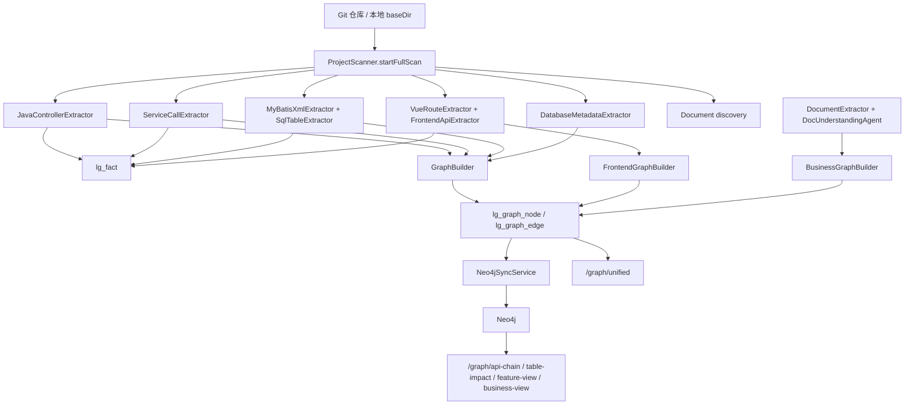

# 三类图谱获取实现说明

> 本文以当前代码为准，说明 LegacyGraph 里业务图谱、功能图谱、代码图谱是如何接入资料、扫描代码、保存结果、补充外部信息并对外查询的。

## 1. 总体结论

当前实现不是直接生成三个互相独立的图谱，而是先把源码、数据库、文档、运行时链路等信息转成统一节点和关系，再从统一图谱里按不同查询口径取出三类视图：

| 图谱 | 主要节点 | 主要关系 | 主要生成来源 | 主要查询入口 |
|---|---|---|---|---|
| 代码图谱 | `ApiEndpoint`、`Controller`、`Method`、`Service`、`Mapper`、`SqlStatement`、`Table`、`Column` | `HANDLED_BY`、`CALLS`、`EXECUTES`、`READS`、`WRITES`、`HAS_COLUMN` | Java Controller、Service/Mapper、MyBatis XML、SQL、数据库元数据 | `/api/lg/projects/{projectId}/graph/api-chain`、`/graph/table-impact`、`/graph/unified` |
| 功能图谱 | `Menu`、`Page`、`Button`、`Permission`、`ApiEndpoint`、`Feature` | `CONTAINS`、`CALLS`、`REQUIRES_PERMISSION`、`EXPOSED_BY`、`IMPLEMENTED_BY` | Vue/JSX/TSX 页面、前端 API 调用、文档功能映射 | `/api/lg/projects/{projectId}/graph/feature-view`、`/graph/unified` |
| 业务图谱 | `BusinessDomain`、`BusinessProcess`、`BusinessObject`、`BusinessRule`、`Role`、`Feature` | `CONTAINS`，后续可扩展 `USES`、`HAS_RULE`、`IMPLEMENTED_BY` | 文档解析 + LLM 业务事实抽取 | `/api/lg/projects/{projectId}/extract/facts/doc`、`/graph/business-view`、`/graph/unified` |

核心实现文件：

| 模块 | 文件 |
|---|---|
| 资料接入 | `backend/src/main/java/io/github/legacygraph/controller/SourceController.java` |
| 扫描编排 | `backend/src/main/java/io/github/legacygraph/task/ProjectScanner.java` |
| 代码/数据库图谱构建 | `backend/src/main/java/io/github/legacygraph/builder/GraphBuilder.java` |
| 前端功能图谱构建 | `backend/src/main/java/io/github/legacygraph/builder/FrontendGraphBuilder.java` |
| 业务图谱构建 | `backend/src/main/java/io/github/legacygraph/builder/BusinessGraphBuilder.java` |
| Neo4j 同步 | `backend/src/main/java/io/github/legacygraph/service/Neo4jSyncService.java` |
| 图谱查询 | `backend/src/main/java/io/github/legacygraph/service/GraphQueryService.java` |

## 2. 源码和资料怎么进入系统

### 2.1 代码仓库配置

代码仓库通过 `SourceController.createRepo` 创建：

```http
POST /api/lg/projects/{projectId}/sources/repos
```

仓库配置保存到 `lg_code_repo`，实体是 `CodeRepo`。主要字段包括：

| 字段 | 说明 |
|---|---|
| `project_id` | 所属项目 |
| `repo_name` | 仓库名称 |
| `repo_type` | 仓库类型，例如后端、前端、全栈 |
| `git_url` | Git 地址 |
| `branch_name` | 分支，默认 `main` |
| `include_pattern` / `exclude_pattern` | 预留的扫描过滤配置 |
| `backend_sub_path` / `frontend_sub_path` | 全栈仓库的前后端子目录 |
| `local_path` | 本地源码目录 |
| `status`、`last_pull_status`、`last_scan_time` | 拉取和扫描状态 |

### 2.2 代码保存到哪里

远程 Git 仓库通过 `SourceController.pullRepo` 拉到本机：

```http
POST /api/lg/projects/{projectId}/sources/repos/{repoId}/pull
```

保存路径是：

```text
$HOME/.legacygraph/repos/{projectId}/{repoId}
```

拉取成功后，这个路径会写回 `lg_code_repo.local_path`。如果本地目录已有 `.git`，执行 `git pull`；否则执行 `git clone -b {branchName} {gitUrl} {localPath}`。

注意：源码正文不会整体复制进数据库。数据库保存的是仓库元数据、扫描出的结构化事实、图谱节点/边，以及每个事实/节点对应的 `source_path`、`start_line`、`end_line`。

### 2.3 启动代码扫描

扫描仓库通过 `SourceController.scanRepo` 触发：

```http
POST /api/lg/projects/{projectId}/sources/repos/{repoId}/scan
```

它会：

1. 从 `lg_code_repo.local_path` 取本地源码目录；为空时回退到 `$HOME/.legacygraph/repos/{projectId}/{repoId}`。
2. 创建扫描版本，保存到 `lg_scan_version`。
3. 调用 `ProjectScanner.startFullScan(projectId, versionId, baseDir)` 异步扫描。
4. 更新 `lg_code_repo.last_scan_time`。

也可以绕过仓库记录，直接从扫描接口传入 `baseDir`：

```http
POST /api/lg/projects/{projectId}/scan-versions/{versionId}/start?baseDir=/path/to/code
```

## 3. 完整扫描流程

`ProjectScanner.startFullScan` 是主编排入口，执行顺序如下：

```text
1. DB_DISCOVERY         从 application*.yml/properties 自动发现数据库连接
2. PATH_DISCOVERY       自动检测全栈仓库 backend/frontend 子路径
3. DOC_DISCOVERY        自动发现仓库内文档
4. BACKEND_SCAN         扫描 Java Controller，生成 API/Controller/Method 节点
5. SERVICE_CALL_SCAN    扫描 Service/Mapper/Dao 调用关系
6. MAPPER_SCAN          扫描 MyBatis XML，解析 SQL 与读写表
7. FRONTEND_SCAN        扫描前端页面、按钮、权限、API 调用
8. DATABASE_SCAN        扫描已配置数据库表和字段
9. GRAPH_BUILD          将 PostgreSQL 中 CONFIRMED 图谱同步到 Neo4j
```

每一步都会创建 `lg_scan_task` 记录，扫描版本状态写入 `lg_scan_version.scan_status`。

## 4. 扫描代码的实现细节

### 4.1 后端 API 扫描

入口方法是 `ProjectScanner.scanJavaControllers`。

扫描方式：

1. `Files.walk(Paths.get(baseDir))` 递归遍历本地源码目录。
2. 只保留 `.java` 文件。
3. `isControllerFile` 只匹配文件名以 `Controller.java` 结尾或包含 `Controller` 的文件。
4. 每个候选文件交给 `JavaControllerExtractor.extractFromFile`。

`JavaControllerExtractor` 使用 JavaParser 解析源码，抽取：

| 信息 | 来源 |
|---|---|
| Controller 类 | `@RestController`、`@Controller` 等注解 |
| 类级路径 | 类上的 `@RequestMapping` |
| 方法级 API | `@GetMapping`、`@PostMapping`、`@PutMapping`、`@DeleteMapping`、`@RequestMapping` |
| 入参 | 方法参数、`@RequestParam`、`@PathVariable` 等 |
| 请求体 | `@RequestBody` |
| 返回类型 | 方法返回类型 |
| 权限 | 方法注解中解析出的权限标识 |
| 证据 | 源文件路径、开始行、结束行 |

保存逻辑：

1. `saveFact` 写入 `lg_fact`，`fact_type = API`，`fact_key = fullPath`，`normalized_data` 保存 `ApiFact` JSON。
2. `GraphBuilder.buildApiNodes` 创建：
   - `Controller`
   - `ApiEndpoint`
   - `Method`
   - `Permission`
3. 创建关系：
   - `ApiEndpoint -HANDLED_BY-> Method`
   - `Controller -CONTAINS-> Method`
   - `ApiEndpoint -REQUIRES_PERMISSION-> Permission`

### 4.2 Service / Mapper 调用关系扫描

入口方法是 `ProjectScanner.scanServiceCalls`。

扫描方式：

1. 递归遍历 `.java` 文件。
2. `isServiceOrMapperFile` 匹配文件名包含或结尾为 `Service`、`Mapper`、`Dao`。
3. `ServiceCallExtractor.extractFromFile` 使用 JavaParser：
   - 收集注入的 service/mapper 依赖。
   - 遍历方法内的 `MethodCallExpr`。
   - 生成 `CallRelation`。

保存逻辑：

1. 写 `lg_fact`，`fact_type = SERVICE_CALL`。
2. `GraphBuilder.buildServiceCallGraph` 查找或创建调用方/被调用方节点。
3. 如果能解析出 `targetClass`，创建 `CALLS` 边。

当前限制：方法调用只拿到方法名时，`targetClass` 可能为空；`GraphBuilder.buildServiceCallGraph` 会跳过这类无法定位目标类的关系。因此当前 Service 调用链是轻量级静态分析，不是完整跨文件调用解析。

### 4.3 MyBatis XML 和 SQL 扫描

入口方法是 `ProjectScanner.scanMyBatisXml`。

扫描方式：

1. 递归遍历 `.xml` 文件。
2. `isMyBatisMapperFile` 匹配 `Mapper.xml` 或文件名包含 `Mapper/mapper` 的 XML。
3. `MyBatisXmlExtractor.extractFromFile` 使用 DOM 解析 XML，并关闭外部 DTD 和外部实体加载，避免离线环境卡住和 XXE 风险。
4. 抽取：
   - `namespace`
   - `<select>`、`<insert>`、`<update>`、`<delete>`
   - `<sql id="...">` 片段并展开 `<include refid="...">`
   - SQL 起止行、SQL 文本、读表、写表
5. `SqlTableExtractor.extractTables` 使用 JSqlParser 解析 `SELECT/INSERT/UPDATE/DELETE`，得到 read/write/join tables。

保存逻辑：

1. 写 `lg_fact`，`fact_type = MAPPER`。
2. `GraphBuilder.buildMapperSqlGraph` 创建：
   - `Mapper`
   - `SqlStatement`
   - `Table`
3. 创建关系：
   - `Mapper -CONTAINS-> SqlStatement`
   - `Mapper -EXECUTES-> SqlStatement`
   - `SqlStatement -READS-> Table`
   - `SqlStatement -WRITES-> Table`
   - `SqlStatement -JOINS-> Table`

### 4.4 前端页面和 API 调用扫描

入口方法是 `ProjectScanner.scanFrontendFiles`。

扫描方式：

1. 递归遍历本地目录。
2. `isVueFile` 匹配 `.vue`、`.jsx`、`.tsx`。
3. `VueRouteExtractor.extractFromFile` 从路由或页面文件中解析页面路由。
4. `FrontendApiExtractor.extractFromFile` 按文本模式扫描：
   - `axios.get/post/put/delete`
   - `request({ url, method })`
   - `api.xxx()`
   - `fetch(url)`

保存逻辑：

1. 页面事实写入 `lg_fact`，`fact_type = FRONTEND_PAGE`。
2. API 调用事实写入 `lg_fact`，`fact_type = FRONTEND_API`。
3. `FrontendGraphBuilder.buildFrontendGraph` 创建：
   - `Page`
   - `Menu`
   - `Button`
   - `Permission`
4. `FrontendGraphBuilder.buildFrontendApiGraph` 创建 `frontend:{apiKey}` 形式的前端 API 节点，并按规范化 URL/Method 匹配后端 `ApiEndpoint`。
5. 创建关系：
   - `Menu -CONTAINS-> Page`
   - `Page -CONTAINS-> Button`
   - `Page/Button -REQUIRES_PERMISSION-> Permission`
   - `Page/Button/frontend ApiEndpoint -CALLS-> backend ApiEndpoint`

前后端 API 匹配会计算分数。分数高于阈值时可标记为 `CONFIRMED`，否则进入 `PENDING_CONFIRM`。

## 5. 其他信息怎么获取

### 5.1 数据库连接和表结构

数据库连接有两种来源。

第一种是手工配置：

```http
POST /api/lg/projects/{projectId}/sources/databases
```

保存到 `lg_db_connection`，实体是 `DbConnection`。包含数据库类型、主机、端口、库名、schema、用户名、密码、include/exclude 表、状态、表数量等字段。

第二种是自动发现。`ProjectScanner.discoverDbConnections` 会扫描 `application*.yml`、`application*.yaml`、`application*.properties`，解析 `spring.datasource` 或 JDBC URL，并写入 `lg_db_connection`。

表结构扫描：

1. `SourceController.scanSchema` 可单独连接数据库，统计表数量并更新 `lg_db_connection.table_count`。
2. 完整扫描中的 `ProjectScanner.scanDatabaseMetadata` 会读取所有 `status = READY` 的数据库连接。
3. `DatabaseMetadataExtractor.extractFromSchema` 通过 JDBC `DatabaseMetaData` 获取表、列、主键、注释，并做字段语义识别。
4. `GraphBuilder.buildDatabaseGraph` 创建：
   - `Table`
   - `Column`
   - `Table -HAS_COLUMN-> Column`

### 5.2 文档上传、解析和业务事实抽取

文档上传入口：

```http
POST /api/lg/projects/{projectId}/sources/documents/upload
```

上传文件保存到：

```text
${java.io.tmpdir}/legacygraph/uploads/{projectId}/{uuid}_{originalFileName}
```

文档元信息保存到 `lg_document`，文件实际路径保存到 `file_path`。

文档解析入口：

```http
POST /api/lg/projects/{projectId}/sources/documents/{documentId}/parse
```

解析流程：

1. `DocumentExtractor.extractText` 支持 PDF、Word、Markdown、TXT，其他格式交给 Tika。
2. `DocumentExtractor.chunkDocument` 按标题和段落切片，默认每片约 500 token。
3. 切片保存到 `lg_doc_chunk`。

业务事实抽取入口：

```http
POST /api/lg/projects/{projectId}/extract/facts/doc
```

`DocUnderstandingAgent.extractBusinessFacts` 调用 LLM 模板 `doc-understanding`，返回：

| 类型 | 对应图节点 |
|---|---|
| 业务域 | `BusinessDomain` |
| 业务流程 | `BusinessProcess` |
| 业务对象 | `BusinessObject` |
| 业务规则 | `BusinessRule` |
| 角色 | `Role` |
| 流程步骤 | `Feature` |

`FactController.extractDocFacts` 会调用 `BusinessGraphBuilder.buildBusinessGraph`，把这些结果写入 `lg_graph_node/lg_graph_edge`。

### 5.3 代码片段 LLM 事实抽取

代码片段抽取入口：

```http
POST /api/lg/projects/{projectId}/extract/facts/code
```

`CodeFactAgent.extractFacts` 调用 LLM 模板 `code-fact-extraction`，返回结构化事实。目前这个接口只返回抽取结果，没有像文档抽取那样自动落到图谱节点。

### 5.4 运行时链路

运行时 span 上报入口：

```http
POST /api/lg/projects/{projectId}/traces/ingest
```

`TraceIngestionService.ingest` 把 span 保存到 `lg_runtime_trace`。字段包括 `trace_id`、`span_id`、`parent_span_id`、`service_name`、`operation_name`、`span_kind`、`duration_ms`、`status`。

运行时拓扑查询入口：

```http
GET /api/lg/projects/{projectId}/traces/topology?versionId={versionId}
```

`TraceIngestionService.getTopology` 按服务名聚合节点，并根据 parent span 构建服务间调用边。该数据可作为运行时验证证据，和三类核心图谱互补。

## 6. 图谱保存在哪里

当前有两层存储。

### 6.1 PostgreSQL 元数据库

PostgreSQL 是主存储。

| 表 | 作用 |
|---|---|
| `lg_code_repo` | 代码仓库配置和本地路径 |
| `lg_scan_version` | 扫描版本 |
| `lg_scan_task` | 每个扫描步骤的任务状态 |
| `lg_fact` | 原始结构化事实 |
| `lg_graph_node` | 统一图谱节点 |
| `lg_graph_edge` | 统一图谱关系 |
| `lg_db_connection` | 数据库连接配置 |
| `lg_document` | 文档元信息和文件路径 |
| `lg_doc_chunk` | 文档解析后的文本切片 |
| `lg_runtime_trace` | 运行时 span |

`lg_fact` 保存的是扫描出的事实 JSON，例如 API、Mapper、前端 API 调用等。`lg_graph_node` 和 `lg_graph_edge` 保存最终统一图谱。节点/边里会保存 `project_id`、`version_id`、`source_type`、`source_path`、`start_line`、`end_line`、`confidence`、`status`。

### 6.2 Neo4j 图数据库

`GraphBuilder.syncToNeo4j` 调用 `Neo4jSyncService.syncGraph(projectId, versionId)`。

同步逻辑：

1. 删除该 `projectId/versionId` 的旧 Neo4j 图数据。
2. 从 `lg_graph_node` 查询 `status = CONFIRMED` 的节点，按 1000 条批量写入 Neo4j。
3. 从 `lg_graph_edge` 查询 `status = CONFIRMED` 的关系，按 1000 条批量写入 Neo4j。

因此：PostgreSQL 中可能有 `PENDING_CONFIRM` 节点/边，但 Neo4j 查询接口默认看不到它们。

## 7. 三类图谱怎么生成和获取

### 7.1 代码图谱

生成链路：

```text
Java Controller
  -> ApiFact
  -> lg_fact(API)
  -> ApiEndpoint / Controller / Method / Permission
  -> HANDLED_BY / CONTAINS / REQUIRES_PERMISSION

Service / Mapper Java
  -> CallRelation
  -> lg_fact(SERVICE_CALL)
  -> Service / Mapper / Method
  -> CALLS

MyBatis XML
  -> MapperSqlFact
  -> lg_fact(MAPPER)
  -> Mapper / SqlStatement / Table
  -> EXECUTES / READS / WRITES / JOINS

DatabaseMetaData
  -> TableMetadata
  -> Table / Column
  -> HAS_COLUMN
```

获取方式：

```http
GET /api/lg/projects/{projectId}/graph/api-chain?versionId={versionId}&api={apiKey}
GET /api/lg/projects/{projectId}/graph/table-impact?versionId={versionId}&tableName={tableName}
GET /api/lg/projects/{projectId}/graph/unified?versionId={versionId}&minConfidence=0.0
```

`getApiCallChain` 使用 Neo4j Cypher，从 `ApiEndpoint {nodeKey: apiKey}` 出发，沿 `HANDLED_BY|CALLS|EXECUTES|READS|WRITES` 最多 8 层取路径。

`getTableImpact` 从 `ApiEndpoint` 反向找能通过 `HANDLED_BY|CALLS|EXECUTES|WRITES` 到达指定 `Table` 的接口。

`getUnifiedGraph` 直接查 PostgreSQL 的 `lg_graph_node/lg_graph_edge`，按 `versionId` 和最低置信度过滤。

### 7.2 功能图谱

生成链路：

```text
Vue / JSX / TSX
  -> FrontendPageFact
  -> lg_fact(FRONTEND_PAGE)
  -> Menu / Page / Button / Permission
  -> CONTAINS / REQUIRES_PERMISSION

前端 API 调用
  -> FrontendApiCall
  -> lg_fact(FRONTEND_API)
  -> frontend ApiEndpoint
  -> CALLS backend ApiEndpoint

文档流程步骤
  -> Feature
  -> 后续可通过 mapFeaturesToCode 建 EXPOSED_BY / IMPLEMENTED_BY
```

获取方式：

```http
GET /api/lg/projects/{projectId}/graph/feature-view?versionId={versionId}&module={module}
GET /api/lg/projects/{projectId}/graph/unified?versionId={versionId}&minConfidence=0.0
```

`getFeatureView` 使用 Neo4j 查询带 `module` 属性的 `Feature/ApiEndpoint/Service/Repository` 节点，再沿 `EXPOSED_BY|CALLS|HANDLED_BY|EXECUTES|READS|WRITES` 展开。

### 7.3 业务图谱

生成链路：

```text
上传/发现文档
  -> DocumentExtractor 文本抽取
  -> lg_doc_chunk
  -> DocUnderstandingAgent
  -> BusinessFactExtraction
  -> BusinessGraphBuilder
  -> BusinessDomain / BusinessProcess / BusinessObject / BusinessRule / Role / Feature
  -> CONTAINS
```

获取方式：

```http
POST /api/lg/projects/{projectId}/extract/facts/doc
GET /api/lg/projects/{projectId}/graph/business-view?versionId={versionId}&domain={domain}
GET /api/lg/projects/{projectId}/graph/unified?versionId={versionId}&minConfidence=0.0
```

`BusinessGraphBuilder.buildBusinessGraph` 会：

1. 根据 LLM 返回结果创建业务域、流程、对象、规则、角色节点。
2. 把业务流程按顺序关联到业务域。
3. 把流程步骤创建为 `Feature` 节点，并由 `BusinessProcess -CONTAINS-> Feature` 连接。

`BusinessGraphBuilder.mapFeaturesToCode` 负责把 `DOC_AI` 来源的 `Feature` 按名称相似度映射到 `Page` 和 `ApiEndpoint`，创建：

| 映射 | 关系 |
|---|---|
| Feature -> Page | `EXPOSED_BY` |
| Feature -> ApiEndpoint | `IMPLEMENTED_BY` |

但当前代码里 `mapFeaturesToCode` 没有入站调用，需要后续接到文档抽取或扫描完成流程里。

## 8. 当前实现注意点

这些是阅读当前代码时需要特别注意的实现差距：

1. `saveFact` 里 `source_type` 固定写成 `CODE_AST`，即便保存的是 `MAPPER`、`FRONTEND_PAGE`、`FRONTEND_API` 事实。图节点的 `source_type` 是分别由 builder 正确设置的。
2. Neo4j 同步只同步 `status = CONFIRMED` 的节点和边。文档 AI 生成的业务节点当前默认是 `PENDING_CONFIRM`，所以业务图谱可能存在于 PostgreSQL，但不会出现在 Neo4j 查询结果中。
3. `getApiCallChain` 和 `getTableImpact` 方法参数里有 `versionId`，但 Cypher 当前没有按 `versionId` 过滤，存在跨版本命中风险。
4. `getFeatureView` 查询要求节点有 `module` 属性，但当前前端/代码 builder 没有系统性写入 `module`，因此该接口可能返回空；`/graph/unified` 更能反映当前真实落库结果。
5. `getBusinessView` 查询要求业务节点有 `businessDomain` 或 `domain` 属性，但 `BusinessGraphBuilder` 主要写的是 `nodeKey/nodeName/description`，没有显式设置这两个属性，因此该接口也可能返回空。
6. `discoverDocuments` 自动发现文档时创建 `lg_document` 记录，但没有写入 `file_path`；而 `parseDocument` 依赖 `doc.filePath` 打开文件。自动发现的文档要能解析，需要补齐路径保存逻辑。
7. Service 调用扫描目前是轻量级 JavaParser 提取，无法完整解析所有动态调用、反射调用、链式调用和跨文件类型归属。
8. `include_pattern`、`exclude_pattern`、`backend_sub_path`、`frontend_sub_path` 已保存，但 `startFullScan` 当前直接扫描 `baseDir`，没有严格按这些字段裁剪扫描范围。
9. `CodeFactAgent.extractFacts` 只返回 LLM 抽取结果，不会自动写入 `lg_fact` 或图谱。
10. 运行时 `markRuntimeVerified` 会设置 `GraphNode.verifiedScore`，但该字段在实体里是 `@TableField(exist = false)`，当前数据库更新不一定能持久化这个验证分数。

## 9. 推荐排查路径

如果要确认某个图谱为什么没有数据，可以按下面顺序查：

1. `lg_code_repo.local_path`：代码是否已 pull 到本地，扫描用的 `baseDir` 是否正确。
2. `lg_scan_version`：扫描版本是否为 `SUCCESS` 或至少已启动。
3. `lg_scan_task`：具体卡在哪个任务，例如 `BACKEND_SCAN`、`MAPPER_SCAN`、`FRONTEND_SCAN`、`DATABASE_SCAN`。
4. `lg_fact`：是否已有 `API`、`SERVICE_CALL`、`MAPPER`、`FRONTEND_PAGE`、`FRONTEND_API` 事实。
5. `lg_graph_node/lg_graph_edge`：节点和关系是否生成，`status/confidence/source_type` 是否符合预期。
6. Neo4j：是否已执行 `GRAPH_BUILD`，并且节点/边是否是 `CONFIRMED`。
7. 查询接口：如果业务/功能视图为空，先用 `/graph/unified` 看 PostgreSQL 中是否有对应节点，再判断是不是 Neo4j 同步或查询属性过滤问题。

## 10. 简化流程图



