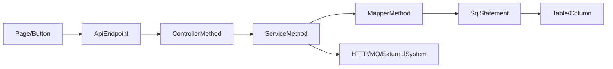

# 代码图谱建设完整性与准确性优化方案

> 结论先行：当前 LegacyGraph 已经把 Java `Controller -> Service -> Mapper -> SqlStatement -> Table` 链路中最关键的 `Service -> Mapper` 断点补上了第一阶段能力，但图谱质量仍主要靠“边数变化”和人工 spot check 判断。下一阶段优化重点应从“再多抽一些边”升级为“可解释、可度量、可回归的精确图谱生产线”：每一条边要有来源、置信、解析策略、失败原因；每一次扫描要产出覆盖率、误连风险和完整链路指标。

## 1. 当前状态判断

### 1.1 已具备的基础

1. `JavaMemberCallResolver` 已在 `ADAPTER_SCAN` 后运行二次解析，模式接近 Graphify 的语言 resolver：先全量建索引，再用 god-node guard 只补确定性 `CALLS` 边。
2. `GraphBuilder.buildServiceCallGraph` 已改成目标 find-only，避免因简单名/FQN 不一致创建重复节点。
3. `ServiceCallExtractor` 已能收集字段注入、构造器注入、Lombok `final` 字段、方法参数和本地变量类型，并能生成部分被调方法签名。
4. MyBatis XML 链路已经有 `Mapper -EXECUTES-> SqlStatement -READS/WRITES-> Table`，`buildMapperSqlGraph` 会优先解析展开 include 后的 SQL。
5. 项目已有 Graphify 外部分析入口、Graphify canonical mapper、质量报告、Gap 扫描、工具运行新鲜度检查等基础设施。

### 1.2 仍然影响完整性/准确性的核心缺口

| 缺口 | 现状 | 风险 |
|---|---|---|
| 接收者类型没有作为一等证据保存 | `CallRelationDto` 只保存 caller/targetClass/method/signature，缺少 receiver、receiverKind、receiverTypeSource、候选数、失败原因 | 后续无法区分“未解析”“歧义跳过”“方法重载回退类级”，质量报告只能看结果边数 |
| `collectMethodVarTypes` 未用于 targetClass 解析 | 方法参数/本地变量类型表用于实参签名推断，但 `scope -> targetClass` 仍只查 `injectedVarToType` | `localMapper.findById()`、`paramService.call()`、`var repo = ...; repo.save()` 长尾仍漏 |
| FQN 消歧只靠简单名唯一 | 当前 `simpleNameToClassNodes` 多候选即跳过 | 同名类较多的老系统会大量漏边；不能利用 import、包路径、字段声明 FQN、Spring bean 名称进一步消歧 |
| 方法签名归一规则分散 | `JavaStructureExtractor`、`ServiceCallExtractor`、`MethodSignatureSupport` 存在重复归一逻辑 | 泛型、数组、可变参数、内部类、基础类型装箱等场景容易出现 method nodeKey 漂移 |
| 缺少端到端图谱质量门禁 | 现有质量报告看总节点、总边、平均置信度、孤立节点、低置信节点 | 无法回答“Controller 到 Table 完整链路覆盖多少”“CALLS 误连风险多少”“本次比上次少了哪些关键边” |
| 外部工具更多是可选导入 | `GRAPHIFY_ANALYZE` 是独立分支，Graphify 输出被映射成独立 `graphify:` nodeKey | Graphify/SCIP/CodeQL 等外部图谱还没有成为 LegacyGraph 自身抽取质量的交叉校验层 |

## 2. 对标开源项目后的可借鉴点

| 项目/体系 | 关键做法 | 对 LegacyGraph 的启发 |
|---|---|---|
| Graphify-Labs/graphify | `detect -> extract -> build -> cluster -> analyze -> report -> export` 分层；语言 resolver 以 `(per_file, all_nodes, all_edges) -> None` 纯增量运行；关系区分 `EXTRACTED/INFERRED/AMBIGUOUS`；内置 dangling/self-loop/collapsed edge 诊断 | 保留当前二次解析方向，但把 resolver registry、诊断报告和置信分层搬进扫描主链路 |
| Graphify Ruby/C# resolver | typed receiver member call 只在“唯一类 + 唯一方法”时建边；未知/歧义不猜；测试覆盖字段、参数、本地变量、跨文件、this/static、动态类型跳过 | Java resolver 应按 receiver 证据分层，不再只依赖简单名；未解析要记录 skip reason |
| Sourcegraph SCIP / scip-java | scip-java 作为 Java compiler plugin 运行，使用编译器语义和构建环境；每个源文件产出 shard，最后合并；支持定义、引用、实现等代码导航语义 | 引入“可选精确索引层”：构建可用时用 compiler/scip-java，构建不可用时保留 JavaParser 快速层 |
| JavaParser JavaSymbolSolver | JavaParser 生成 AST，JavaSymbolSolver 可把 AST 元素解析到声明、类型、位置等语义 | 当前已用 JavaParser，最小升级路径是接入 JavaSymbolSolver 解析 `MethodCallExpr.resolve()` 和 scope 类型 |
| Joern CPG | 用 Code Property Graph 统一 AST、CFG、PDG 等视图，适合跨语言静态分析、数据流和漏洞模式查询 | LegacyGraph 可先补局部 `DATA_FLOWS` 和控制/数据影响边，不急于全量替换为 Joern |
| CodeQL Java/Kotlin data flow | 区分 local/global data flow：local 更快更准，global 更强但成本更高；支持 taint tracking/source/sink 建模 | 图谱数据流先做方法内和 Mapper 参数级，再做跨方法/跨服务；把数据流边置信度和成本分层 |

参考链接：
- Graphify-Labs/graphify: https://github.com/Graphify-Labs/graphify
- Graphify architecture: https://github.com/Graphify-Labs/graphify/blob/v8/ARCHITECTURE.md
- Graphify diagnostics: https://github.com/Graphify-Labs/graphify/blob/v8/graphify/diagnostics.py
- Graphify Ruby resolver: https://github.com/Graphify-Labs/graphify/blob/v8/graphify/ruby_resolution.py
- Sourcegraph SCIP: https://github.com/sourcegraph/scip
- scip-java design: https://github.com/sourcegraph/scip-java/blob/main/docs/design.md
- JavaParser / JavaSymbolSolver: https://github.com/javaparser/javaparser
- Joern CPG docs: https://docs.joern.io/code-property-graph/
- CodeQL Java data flow: https://codeql.github.com/docs/codeql-language-guides/analyzing-data-flow-in-java/

## 3. 优化目标

### 3.1 完整性目标

1. Java 调用链覆盖：`ControllerMethod -> ServiceMethod -> MapperMethod -> SqlStatement -> Table` 在可解析样本上的完整链路覆盖率达到 80%+，核心业务包达到 90%+。
2. SQL 数据链覆盖：Mapper XML、注解 SQL、JdbcTemplate/MyBatis-Plus/JPA repository 至少能产出同类 `EXECUTES/READS/WRITES` 关系。
3. 前后端链路覆盖：`Page/Button -> ApiEndpoint -> ControllerMethod` 路径覆盖主流 Axios/fetch/request 封装和 baseURL 配置。
4. 跨系统边覆盖：HTTP、MQ、定时任务、外部系统调用统一进入 `CALLS_EXTERNAL/HTTP_CALLS/ASYNC_CALLS` 或等价边。

### 3.2 准确性目标

1. 所有自动边必须有 `sourceType`、`confidence`、`status`、`strategy`、`sourcePath/sourceLine`、`resolverVersion`。
2. 所有跳过的候选调用要保存可聚合原因：`NO_RECEIVER_TYPE`、`AMBIGUOUS_CLASS`、`AMBIGUOUS_METHOD_OVERLOAD`、`MISSING_TARGET_METHOD`、`DYNAMIC_RECEIVER`、`PARSE_FAILED`。
3. `EXTRACTED` 只给显式语义证据：编译器/JavaSymbolSolver 解析、字段/参数/本地变量声明类型、XML namespace/id、明确注解。
4. `INFERRED` 用于命名约定、唯一候选、框架默认规则；默认 `PENDING_CONFIRM` 或在报告中单独暴露。
5. `AMBIGUOUS` 不直接写主链路边，进入候选表/Gap/质量报告，避免误连污染影响分析。

## 4. 分阶段实施方案

### P0：补质量度量与回归样本（优先级最高）

先不要继续盲目扩边。先加一个扫描后只读质量门禁，产出可追踪指标。

#### P0.1 新增 `GraphCompletenessAuditService`

输入：`projectId/versionId`。

输出：
- `serviceCallFacts`: `SERVICE_CALL` fact 总数。
- `resolvedCallEdges`: resolver 新增 `CALLS` 边数。
- `methodLevelCallRatio`: 方法级 `CALLS` / 全部 `CALLS`。
- `classFallbackRatio`: 回退到类级的比例。
- `unresolvedByReason`: 按 skip reason 聚合。
- `ambiguousClassCount` / `ambiguousMethodCount`。
- `duplicateSimpleNameNodeCount`。
- `danglingEdgeCount` / `selfLoopCount` / `missingEndpointCount`。
- `controllerToTablePathCount`。
- `coreChainCoverage`: `Controller/Service/Mapper/SqlStatement/Table` 分段覆盖率。

落点：
- 后端 service：`service.graph` 或 `builder.audit` 包。
- 报告：扩展 `ReportingService.generateGraphQualityReport`。
- 任务：扫描后新增 `GRAPH_COMPLETENESS_AUDIT` 子任务，失败非阻塞但必须在报告里显示。

#### P0.2 建黄金 fixture 项目

在测试资源下构造最小 Java/Maven 样本，覆盖：
- 字段注入、构造器注入、Lombok `@RequiredArgsConstructor`。
- `this.mapper.find()`。
- 方法参数 receiver：`service.handle(paramMapper)` / `paramMapper.find()`。
- 本地变量 receiver：`OrderMapper mapper = this.mapper; mapper.find()`。
- `var mapper = getMapper()` 不确定时跳过。
- 同名 Service/Mapper 多包歧义。
- 重载方法：精确签名命中、无法推断回退类级。
- interface -> implementation。
- MyBatis XML include、resultMap、动态 SQL、schema.table。
- 注解 SQL：`@Select/@Update`。

验收：每次改 resolver 都跑黄金 fixture，比较 expected graph JSON，不只比较测试是否通过。

### P1：把 Java member call resolver 升级为“证据驱动”

#### P1.1 扩展 `CallRelation`

建议新增字段：

| 字段 | 用途 |
|---|---|
| `receiverExpression` | 原始 scope，例如 `this.mapper`、`mapper`、`OrderMapper` |
| `receiverName` | 归一后的变量/类型名 |
| `receiverKind` | `THIS_FIELD`、`FIELD`、`PARAM`、`LOCAL_VAR`、`STATIC_TYPE`、`UNKNOWN` |
| `receiverType` | 推断出的简单名或 FQN |
| `receiverTypeSource` | `FIELD_DECL`、`CONSTRUCTOR_PARAM`、`METHOD_PARAM`、`LOCAL_DECL`、`IMPORT_FQN`、`SYMBOL_SOLVER` |
| `argumentTypes` | 实参类型列表 |
| `resolutionStatus` | `RESOLVED`、`SKIPPED`、`AMBIGUOUS` |
| `skipReason` | 可聚合失败原因 |
| `candidateCount` | class/method 候选数量 |

这一步的价值比直接多建边更高：它让“为什么没边”可见。

#### P1.2 用 `methodVarToType` 解析接收者

当前 `methodVarToType` 已存在，但 `targetClass` 仍只用 `injectedVarToType`。应改为：

1. scope 为 `this.x`：先查字段/构造注入表。
2. scope 为 `x`：先查 `methodVarToType`，再查 `injectedVarToType`。
3. scope 首字母大写：按静态类型或类名处理。
4. scope 为链式调用 `factory.getMapper().find()`：Phase 1 跳过，记录 `CHAIN_RECEIVER`；Phase 2 用返回类型解析。
5. scope 为 `new Type().method()`：可直接识别 `ObjectCreationExpr`，置信 `EXTRACTED`。

#### P1.3 引入 import/package 消歧

在 `ServiceCallExtractor` 阶段保存：
- 当前包名。
- `import` 列表。
- import alias/静态 import。
- class 内字段声明的原始 type string。

resolver 侧候选顺序：
1. receiverType 已是 FQN，精确命中。
2. import 中有唯一 `*.TargetClass`，优先。
3. 同包 `package + "." + TargetClass`。
4. Spring stereotypes/Mapper namespace 与包路径匹配。
5. 全局 simpleName 唯一。
6. 仍多候选则 `AMBIGUOUS_CLASS`，不建主边。

这对应 Graphify C# resolver 的思路：不是简单名撞运气，而是利用 lexical scope/import facts，最后仍由 god-node guard 守住误连风险。

#### P1.4 统一方法签名归一

把 `JavaStructureExtractor`、`ServiceCallExtractor` 都切到 `MethodSignatureSupport.build(...)` 或同一个新工具类，覆盖：
- 泛型擦除：`List<String>` -> `List`。
- 数组：`String[]`。
- 可变参数：`String...` 与 `String[]` 策略固定。
- 内部类：`Outer.Inner`。
- 包名剥离。
- primitive/boxed 类型是否等价要明确。

验收：同一方法在结构抽取和调用抽取生成完全相同的 `Method nodeKey`。

### P2：引入“构建感知”的精确语义层

这层不替代当前快速扫描，而是作为增强层：

#### 方案 A：JavaSymbolSolver 内嵌

适用：源码能解析、依赖可部分配置，但不一定能完整 Maven/Gradle 编译。

实现：
- 新增 `JavaTypeResolutionService`。
- 构造 `CombinedTypeSolver`：`ReflectionTypeSolver + JavaParserTypeSolver(sourceRoot) + JarTypeSolver(dependencies?)`。
- 在 `ServiceCallExtractor` 可选调用 `methodCall.resolve()` 和 `scope.calculateResolvedType()`。
- 成功时 `receiverTypeSource=SYMBOL_SOLVER`，置信 `EXTRACTED`。
- 失败时回退现有 AST 规则，并记录异常分类。

#### 方案 B：scip-java 外部索引

适用：Maven/Gradle 项目可构建，追求最高准确性。

实现：
- 新增扫描类型 `SCIP_INDEX` 或 `CODE_SCAN_PRECISE`。
- 按 repo root 执行 `scip-java index`，生成 `index.scip`。
- 导入 SCIP symbol/occurrence/document：
  - definitions -> Class/Method nodes 的稳定 externalSymbolId。
  - references/calls -> 候选 `CALLS/USAGE`。
  - implementation -> `IMPLEMENTS/OVERRIDES`。
- 与 LegacyGraph 原生节点按 FQN + range + symbolId 对齐。

注意：scip-java 会触发构建工具，可能清理编译缓存或下载依赖，必须作为显式可选增强，不应默认阻塞基础扫描。

### P3：补 SQL/数据流链路

#### P3.1 注解 SQL 与 Java SQL API

新增 extractor：
- MyBatis annotation：`@Select/@Insert/@Update/@Delete`。
- MyBatis-Plus：`BaseMapper<T>`、`LambdaQueryWrapper`、`QueryWrapper`。
- JPA Repository：`findByXxx` 命名查询、`@Query`。
- JdbcTemplate/MyBatis `SqlSession`：字符串字面量和简单拼接。

统一输出：
- `Method/MapperMethod -EXECUTES-> SqlStatement`。
- `SqlStatement -READS/WRITES/JOINS-> Table`。
- 动态不可解析时保留 `SqlStatement`，`READS/WRITES` 置信降低或进入 `AMBIGUOUS_SQL_TABLE`。

#### P3.2 局部数据流

先做方法内和 Mapper 参数级，不急于全局污点：
- Controller 参数 -> Service 参数。
- Service 参数 -> Mapper 参数。
- Mapper 参数 -> SQL 占位符。
- SQL 占位符 -> Table/Column。

边类型建议：
- `DATA_FLOWS`：值保持。
- `TAINT_FLOWS`：字符串拼接、格式化、JSON 转换等非值保持。
- `BINDS_TO`：方法参数/对象字段绑定 SQL 参数。

这借鉴 CodeQL 的 local/global data flow 分层：local 快且准，global 强但更贵。

### P4：把 Graphify 从“导入工具”升级为“交叉校验工具”

当前 Graphify import 会生成 `graphify:` 前缀节点，适合保留外部图谱，但不直接提升 LegacyGraph 原生图谱质量。建议增加三种用法：

1. **Graphify health check**：导入前先运行 dangling/missing/self-loop/collapsed edge 诊断，结果写入 `ToolRunEntity` 和质量报告。
2. **Resolver 对照**：对同一 repo 运行 Graphify，比较 `calls/imports/references` 与 LegacyGraph 原生边：
   - LegacyGraph 有、Graphify 无：可能是业务框架增强或误连。
   - Graphify 有、LegacyGraph 无：候选漏边。
   - 双方有但端点不同：高风险冲突。
3. **置信合并**：Graphify `EXTRACTED` 与 LegacyGraph `EXTRACTED` 同向命中时提升可信；冲突时降级为 `CONFLICTED` 或进入 Gap。

### P5：前后端与跨服务端到端链路

完整性不只在 Java 后端。建议把端到端链路拆成标准段：

优化点：
- 前端 request wrapper 识别：axios instance、baseURL、拦截器、环境变量。
- API path normalize：`/api/user/{id}`、`/api/user/:id`、模板字符串统一。
- Spring mapping 合并：class-level + method-level mapping、profile/context-path。
- Feign/RestTemplate/WebClient/OkHttp 识别为 `HTTP_CALLS`。
- MQ producer/consumer/topic/channel 识别为 `ASYNC_CALLS/HANDLES`。

### P6：增量、版本和可观测性

1. `resolverVersion` 写入边 properties，算法变更后可区分旧边。
2. 保存每次扫描的 extraction manifest：文件 hash、解析器版本、Java version、classpath digest。
3. 增量扫描时只重解变更文件，但二次 resolver 必须在全局索引上运行。
4. 关键指标做版本 diff：
   - 完整链路数下降超过 10% 报警。
   - `AMBIGUOUS_CLASS` 激增报警。
   - `CALLS` 方法级比例下降报警。
   - `Table READS/WRITES` 下降报警。

## 5. 建议排期

| 阶段 | 周期 | 产出 | 验收 |
|---|---:|---|---|
| P0 质量门禁 + 黄金 fixture | 2-3 天 | `GraphCompletenessAuditService`、质量报告扩展、fixture graph expected | 不改生产解析也能输出完整性/失败原因指标 |
| P1 证据驱动 Java resolver | 3-5 天 | `CallRelation` 扩字段、receiver 类型解析、import 消歧、签名统一 | 黄金 fixture 覆盖率提升，误连用例保持 0 |
| P2 JavaSymbolSolver 增强层 | 4-6 天 | 可选精确解析服务，失败回退 AST | 构建不可用时不阻塞；构建可用样本上方法级命中率提升 |
| P3 SQL/数据流补齐 | 5-8 天 | 注解 SQL/JdbcTemplate/JPA/MyBatis-Plus extractor，局部 `DATA_FLOWS` | 端到端链路覆盖率提升，SQL 表误解析可解释 |
| P4 Graphify/SCIP 交叉校验 | 4-6 天 | 外部图谱 diff、冲突报告、工具健康指标 | Graphify 缺失/冲突边进入质量报告 |
| P5 前后端/跨服务链路 | 5-8 天 | API normalize、HTTP/MQ extractor | Page 到 Table/ExternalSystem 链路可查询 |

## 6. 立即可执行的任务清单

1. 新建 `GraphCompletenessAuditService`，先只读 Neo4j 和 `lg_fact`，不改现有边。
2. 扩 `GraphQualityReport`：加入 `callChainCoverage`、`unresolvedCallReasons`、`classFallbackRatio`、`methodLevelCallRatio`。
3. 扩 `ServiceCallExtractor.CallRelation` 和 `JavaMemberCallResolver.CallRelationDto`，保存 receiver 证据与 skip reason。
4. 把 targetClass 解析从 `injectedVarToType` 扩到 `methodVarToType`。
5. 把方法签名生成统一到一个工具类，并补泛型/数组/可变参数单测。
6. 加黄金 fixture，不依赖真实保证金库即可验证 `Controller -> Service -> Mapper -> SQL -> Table`。
7. 把 Graphify diagnostics 的同类检查搬进 LegacyGraph：dangling endpoint、missing endpoint、self-loop、同端点多关系 collapse risk。

## 7. 推荐验收指标

| 指标 | 第一阶段目标 | 长期目标 |
|---|---:|---:|
| Java 文件 parse success | >= 98% | >= 99.5% |
| `SERVICE_CALL` fact 可解释率 | >= 95% | >= 99% |
| 方法级 `CALLS` 占比 | >= 60% | >= 80% |
| 类级 fallback 占比 | <= 35% | <= 15% |
| `AMBIGUOUS_CLASS` / fact | <= 10% | <= 3% |
| 重复简单名节点 | 0 | 0 |
| dangling/missing endpoint edge | 0 | 0 |
| 核心链路 `Controller -> Table` 覆盖率 | >= 70% | >= 90% |
| 黄金 fixture 误连数 | 0 | 0 |

## 8. 关键原则

1. 宁可漏边，也不要错边。错边会污染影响分析，漏边至少能通过 Gap/质量报告暴露。
2. 所有推断都要有证据字段。不能只写最终 `CALLS`，还要记录为什么这么连、为什么没连。
3. 快速 AST 层和精确编译层并存。老系统经常无法干净构建，不能把 compiler indexer 作为唯一入口。
4. 外部工具用于交叉校验，不直接压过原生事实。Graphify/SCIP/CodeQL/Joern 的结果应进入 evidence/claim/conflict 流程。
5. 完整性要按端到端链路衡量，不按单类节点/边数量自我感觉良好。
