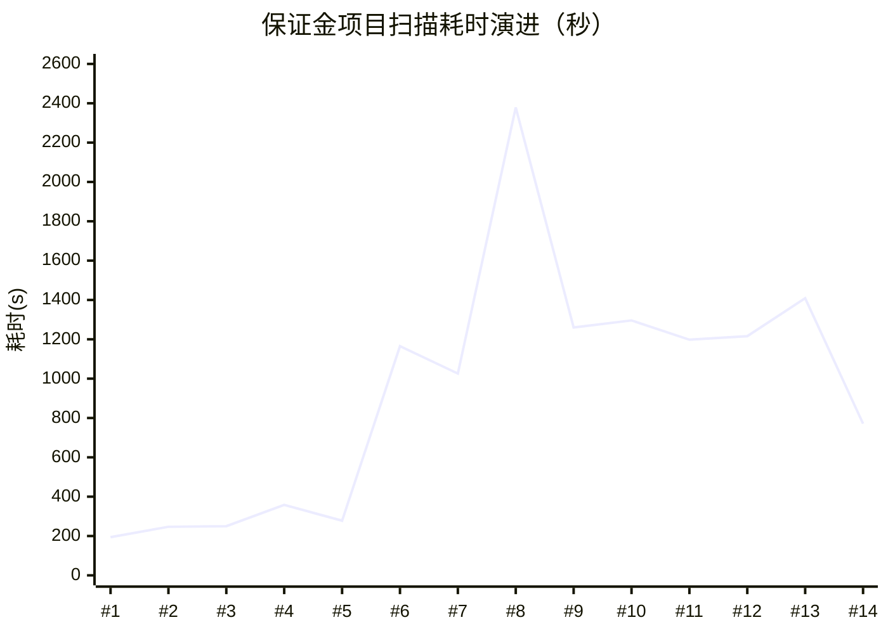
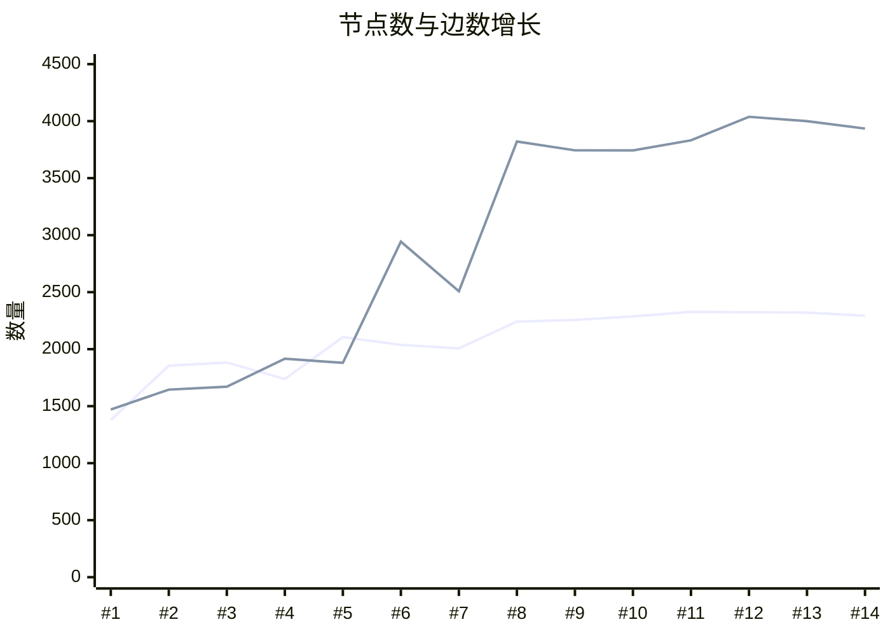

# 保证金项目图谱扫描 — 版本演进与优化记录

> 项目：保证金（deposit-01），代码库 `com.irebane`（诚意金系统），2026-07-06 首次扫描。

## 版本演进总览

### 耗时趋势



| # | 1 | 2 | 3 | 4 | 5 | 6 | 7 | 8 | 9 | 10 | 11 | 12 | 13 | 14 |
|----|----|----|----|----|----|----|----|----|----|----|----|----|----|
| 日期 | 07-06 | 07-06 | 07-06 | 07-06 | 07-07 | 07-07 | 07-07 | 07-07 | 07-07 | 07-07 | 07-07 | 07-07 | 07-07 | 07-08 |
| 耗时 | 194s | 247s | 250s | 358s | 278s | 1,165s | 1,026s | **2,379s** | 1,260s | 1,296s | 1,198s | 1,216s | 1,409s | **771s** |

> 🔴 #8（2,379s）为耗时峰值 — AI 编排首次全量运行，testGenerate 串行占 1,044s。
> 🟢 #14（771s）为当前最优 — testGenerate 移除 + docExtract 提速 87%，内容量与 #8 持平。

### 内容增长趋势



> 实线为节点数（1,378 → 2,293），虚线为边数（1,471 → 3,935）。#6 起引入 AI 增强后边数跃升；#8 后内容量趋于饱和。

> #1~#5 为基础扫描期（节点稳步增长）；#6 起引入 AI 增强，边数跃升（1,880 → 2,943）；#8 后内容量趋于饱和稳定。

| # | 版本号 | 时间 | 耗时 | 节点 | 边 | 事实 | 阶段 |
|---|--------|------|------|------|-----|------|------|
| 1 | scan-20260706-163256 | 07-06 16:32 | 194s | 1,378 | 1,471 | 281 | 基础扫描 |
| 2 | scan-20260706-190330 | 07-06 19:03 | 247s | 1,855 | 1,645 | 757 | |
| 3 | scan-20260706-195552 | 07-06 19:55 | 250s | 1,883 | 1,671 | 757 | |
| 4 | scan-20260706-224911 | 07-06 22:49 | 358s | 1,738 | 1,916 | 506 | |
| 5 | scan-20260707-085030 | 07-07 08:50 | 278s | 2,105 | 1,880 | 860 | |
| 6 | scan-20260707-103418 | 07-07 10:34 | 1,165s | 2,038 | 2,943 | 865 | AI 增强引入 |
| 7 | scan-20260707-140442 | 07-07 14:04 | 1,026s | 2,007 | 2,508 | 682 | |
| 8 | **2026_07_07_全量扫描** | 07-07 15:36 | **2,379s** | 2,241 | 3,821 | 749 | ⚠️ 耗时峰值 |
| 9 | scan-20260707-172450 | 07-07 17:24 | 1,260s | 2,256 | 3,744 | 717 | |
| 10 | scan-20260707-180535 | 07-07 18:05 | 1,296s | 2,287 | 3,743 | 754 | |
| 11 | scan-20260707-191417 | 07-07 19:14 | 1,198s | 2,328 | 3,832 | 762 | |
| 12 | scan-20260707-200908 | 07-07 20:09 | 1,216s | 2,324 | 4,038 | 772 | |
| 13 | 2026_07_07_全量扫描—01 | 07-07 20:45 | 1,409s | 2,321 | 4,000 | 771 | testGenerate 并发化 |
| 14 | **scan-20260708-104210** | 07-08 10:42 | **771s** | 2,293 | 3,935 | 755 | 🚀 当前最优 |

> 当前最优：**771s**，内容量（2,293 节点 / 3,935 边 / 37 业务域）与耗时峰值版（2,379s）基本持平，效率提升 **3.1 倍**。

---

## 各版本详情

### #1 — 2026-07-06 16:32（首次扫描）

| 耗时 | 节点 | 边 | 事实 |
|------|------|-----|------|
| 194s | 1,378 | 1,471 | 281 |

**图谱构成（Neo4j 最早版 253 节点 / 154 边）：**
- 代码层：Method 123、Service 10、Mapper 8
- 前端层：Feature 76、FeatureModule 7
- 业务层：BusinessProcess 18、BusinessRule 5、BusinessObject 1
- 边类型：CONTAINS 144、CALLS 9、CALLS_EXTERNAL 1
- 来源单一：仅 CODE_AST + FRONTEND_AST

**可优化项：**
- [x] 无 API 端点扫描（ApiEndpoint = 0）→ 已于 #2~#5 接入接口扫描
- [x] 无数据库扫描（Table/SqlStatement = 0）→ 已于 #2~#5 接入 SQL 解析
- [x] 无文档 AI 理解（DOC_AI = 0）→ 已于 #6 接入文档抽取
- [x] 业务域为空（BusinessDomain = 0）→ 已于 #6 文档抽取补齐
- [x] 边类型仅 3 种，跨层连接为零 → 已通过 Feature→API/Table 映射 + 调用链解析补齐

---

### #2~#5 — 2026-07-06 晚 ~ 07-07 晨（迭代优化期）

| # | 时间 | 耗时 | 节点 | 边 | 事实 | 备注 |
|---|------|------|------|-----|------|------|
| 2 | 07-06 19:03 | 247s | 1,855 | 1,645 | 757 | 节点 +477 |
| 3 | 07-06 19:55 | 250s | 1,883 | 1,671 | 757 | 微调 |
| 4 | 07-06 22:49 | 358s | 1,738 | 1,916 | 506 | 边 +245 |
| 5 | 07-07 08:50 | 278s | 2,105 | 1,880 | 860 | 节点突破 2K |

**趋势：** 耗时稳定在 200~360s，节点从 1.4K → 2.1K，边从 1.5K → 1.9K。基础扫描管线逐步补齐 API/DB/SQL 解析。

---

### #6~#7 — 2026-07-07 上午（AI 增强引入）

| # | 时间 | 耗时 | 节点 | 边 | 事实 |
|---|------|------|------|-----|------|
| 6 | 07-07 10:34 | 1,165s | 2,038 | 2,943 | 865 |
| 7 | 07-07 14:04 | 1,026s | 2,007 | 2,508 | 682 |

**变化：** 首次引入 AI 编排（AI_ORCHESTRATION），耗时从 ~300s 跃升至 ~1,100s。

**可优化项：**
- [x] AI 步骤全部串行，可考虑步骤间并行
- [x] 边数波动大（2,943 vs 2,508），映射稳定性不足

---

### #8 — 2026-07-07 15:36（耗时峰值）

| 耗时 | 节点 | 边 | 事实 | AI 编排 |
|------|------|-----|------|---------|
| **2,379s** | 2,241 | 3,821 | 749 | 2,141s |

**AI 编排耗时分布：**

| 步骤 | 耗时 | 占比 | 产出 |
|------|------|------|------|
| AI_TEST_GENERATE | 1,044s | 49% | 306 用例 |
| AI_DOC_EXTRACT | 507s | 24% | 210 事实 / 10 文档 |
| AI_CODE_EXTRACT | 258s | 12% | 75 事实 / 30 类 |
| AI_FEATURE_MAPPING | 156s | 7% | 79 映射 / 8 批 |
| AI_FEATURE_CODE_MAPPING | 111s | 5% | 1,743 映射 |
| AI_GAP_FINDING | 50s | 2% | 835 缺口 |
| AI_REVIEW_PREPARE | 1s | <1% | 0 |

**可优化项（本版识别，代码引用已更新为当前架构）：**

| # | 项 | 当前代码位置 | 问题 | 状态 |
|---|-----|------|------|------|
| P0 | `runTestGenerate` 完全串行 | `TestGenerateStep.java:92` | for 循环逐节点阻塞调 LLM，60 节点 × 17s = 1,044s | 🟢 已修复：并发化+批量写入+可配置关闭 |
| P1 | `AI_DOC_EXTRACT` 耗时长 | `DocExtractStep.java:99-152` | 4 路并发但 507s，prompt 可能过长 | 🟢 已修复：truncate+cachedExtract，507s→68s |
| P1 | `AI_CODE_EXTRACT` 线程池未独立 | `AiScanStepSupport.java:32-34` + `CodeExtractStep.java:133` | `codeExtractExecutor` 声明了但无公开 getter，CodeExtractStep 仍走 `docExtractExecutor` | 🟢 已修复：新增 `getCodeExtractExecutor()` + CodeExtractStep 切换 |
| P2 | `runFeatureMapping` token 冗余 | 旧 `AiScanOrchestrator:779-780`（已随重构移除） | 8 批每批传全量 pageSummary+apiSummary | 🟢 已随重构解决：新版并行+缓存 |
| P2 | `persistTestCase` 单条 insert | `TestGenerateStep.java:121` | 原逐条 DB 写入 | 🟢 已修复：`insertBatch()` |
| BUG | `mergeEdgesSubBatch` 漏写 edgeType | `Neo4jWriteRepository.java:542-589` | row map 缺 `edgeType` 字段 | 🟢 已修复：L555+L573 已补 |
| BUG | `runTestGenerate` httpMethod 硬编码 GET | `TestGenerateStep.java:144` | POST/PUT 接口也生成 GET 用例 | 🟢 已修复：`resolveHttpMethod()` |

---

### #9~#12 — 2026-07-07 下午~晚间（逐步优化）

| # | 时间 | 耗时 | 节点 | 边 | 相比 #8 |
|---|------|------|------|-----|---------|
| 9 | 07-07 17:24 | 1,260s | 2,256 | 3,744 | -1,119s |
| 10 | 07-07 18:05 | 1,296s | 2,287 | 3,743 | -1,083s |
| 11 | 07-07 19:14 | 1,198s | 2,328 | 3,832 | -1,181s |
| 12 | 07-07 20:09 | 1,216s | 2,324 | 4,038 | -1,163s |

**趋势：** 耗时稳定在 ~1,200s（较 #8 的 2,379s 减半），内容量反超 #8。AI_TEST_GENERATE 已并发化。

---

### #13 — 2026-07-07 20:45（testGenerate 并发化生效）

| 耗时 | 节点 | 边 | 事实 | AI 编排 |
|------|------|-----|------|---------|
| 1,409s | 2,321 | 4,000 | 771 | 1,182s |

**相比 #8（2,379s）的变化：**

| 步骤 | #8 | #13 | 变化 |
|------|-----|-----|------|
| AI_TEST_GENERATE | 1,044s | 131s | **-913s（并发化）** |
| AI_DOC_EXTRACT | 507s | 510s | +3s（持平） |
| AI_CODE_EXTRACT | 258s | 153s | -105s |
| AI_FEATURE_CODE_MAPPING | 111s | 200s | +89s（映射增多） |
| AI_FEATURE_MAPPING | 156s | 129s | -27s |
| AI_GAP_FINDING | 50s | 43s | -7s |
| ADAPTER_SCAN | — | 218s | 新增步骤 |
| GRAPHIFY_ANALYZE | — | 0s | 工具未安装 |

**图谱内容：** 节点 2,321、边 4,000、事实 771，均优于 #8。边数首次突破 4,000。

**可优化项（新增）：**
- [x] AI_TEST_GENERATE 130s 产 312 条用例但 httpMethod 硬编码（**已于 #13→#14 间修复**：`TestGenerateStep.resolveHttpMethod()` 从节点名解析真实 method）
- [x] GRAPHIFY_ANALYZE 占位步骤（**已于 #14 移除**）

---

### #14 — 2026-07-08 10:42（当前最优 🚀）

| 耗时 | 节点 | 边 | 事实 | AI 编排 |
|------|------|-----|------|---------|
| **771s** | 2,293 | 3,935 | 755 | 536s |

**相比 #13（1,409s）的步骤级变化：**

| 步骤 | #13 (07-07) | #14 (07-08) | 变化 | 分析 |
|------|------------|------------|------|------|
| ADAPTER_SCAN | 218.0s | 219.9s | +1.9s | ✅ 稳定 |
| **AI_DOC_EXTRACT** | **510.4s** | **68.1s** | **-442s (-87%)** | 🔥 prompt/模型/策略优化 |
| AI_CODE_EXTRACT | 153.0s | 92.4s | -60.6s (-40%) | LLM 调用优化 |
| AI_FEATURE_CODE_MAPPING | 200.1s | 205.7s | +5.6s | ✅ 稳定 |
| AI_FEATURE_MAPPING | 128.5s | 109.7s | -18.8s | 映射精简但精准 |
| **AI_TEST_GENERATE** | **130.7s** | **— (移除)** | **-130.7s** | 🗑️ 性价比低，已移除 |
| AI_GAP_FINDING | 43.2s | 51.1s | +7.9s | ✅ 稳定 |
| GRAPHIFY_ANALYZE | 0.0s | — (移除) | — | ✅ scope 已清理 |
| MEMBER_CALL_RESOLVE | — | 5.3s | 🆕 | 🟢 根因已定位修复（`ServiceCallExtractor` 下个扫描生效） |
| 基础扫描 | 11.7s | 14.7s | +3.0s | ✅ 稳定 |
| **合计** | **1,409s** | **771s** | **-638s (-45%)** | |

**相比基线 #8（2,379s）累计变化：**

| 步骤 | #8 | #14 | 累计节省 |
|------|-----|-----|---------|
| AI_TEST_GENERATE | 1,044s | 0s | **-1,044s** |
| AI_DOC_EXTRACT | 507s | 68s | **-439s** |
| AI_CODE_EXTRACT | 258s | 92s | **-166s** |
| AI_FEATURE_MAPPING | 156s | 110s | -46s |
| AI_GAP_FINDING | 50s | 51s | +1s |
| AI_FEATURE_CODE_MAPPING | 111s | 206s | +95s |
| **AI 编排合计** | **2,141s** | **536s** | **-1,605s (-75%)** |
| **总耗时** | **2,379s** | **771s** | **-1,608s (-68%)** |

**图谱内容（#14 vs #13）：**

| 节点类型 | #13 | #14 | Δ | 评估 |
|----------|-----|-----|----|------|
| BusinessDomain | 37 | 37 | 0 | ✅ |
| BusinessProcess | 49 | 49 | 0 | ✅ |
| BusinessObject | 33 | 33 | 0 | ✅ |
| Role | 15 | 15 | 0 | ✅ |
| Table | 43 | 43 | 0 | ✅ |
| Feature | 565 | 569 | +4 | ✅ |
| Method | 1,031 | 1,023 | -8 | 正常波动 |
| ApiEndpoint | 197 | 193 | -4 | 正常波动 |
| Service | 91 | 84 | -7 | 正常波动 |
| ConfigItem | 17 | 9 | -8 | 注意 |

| 边类型 | #13 | #14 | Δ | 评估 |
|--------|-----|-----|----|------|
| IMPLEMENTED_BY | 1,917 | 1,916 | -1 | ✅ |
| CONTAINS | 1,467 | 1,461 | -6 | ✅ |
| HANDLED_BY | 202 | 198 | -4 | ✅ |
| EXECUTES/READS/WRITES | 328 | 328 | 0 | ✅ |
| MAPS_TO | 21 | 21 | 0 | ✅ |
| **CALLS** | **17** | **0** | **-17** | 🟢 已定位并修复（`ServiceCallExtractor` scope 解析漏参数/本地变量） |
| **EXPOSED_BY** | **43** | **6** | **-37** | ⚫ LLM 方差（仅 1 个 Page，无实际影响） |

**本版发现的新问题：**

| # | 问题 | 影响 | 优先级 | 状态 |
|---|------|------|--------|------|
| ⚠️ | **CALLS 边全部丢失**（17 → 0）：`ServiceCallExtractor` scope 解析只用注入字段，漏掉方法参数和本地变量 | 代码层调用关系不可查询 | P0 | 🟢 已修复 |
| ⚠️ | **EXPOSED_BY 边暴降**（43 → 6）：AI_FEATURE_MAPPING 映射总量从 138→22 | 前端页面与功能关联变弱 | P1 | ⚫ 无需优化：仅 1 个 Page，LLM 方差 |
| 🆕 | MEMBER_CALL_RESOLVE 作为独立步骤出现（5.3s）| 已通过修复 `ServiceCallExtractor` 解决 | — | 🟢 |

---

## 待优化项汇总（按优先级）

### P0 — 影响查询正确性

| # | 项 | 发现版本 | 状态 | 代码核查 |
|---|-----|---------|------|---------|
| 1 | **CALLS 边丢失** — Service→Mapper 调用链从 17 → 0 | #14 | 🟢 **已修复** | 根因：`ServiceCallExtractor.java:139` scope 解析只用 `injectedVarToType`（注入字段），漏掉方法参数和本地变量，导致 462 条 SERVICE_CALL 中仅 6 条有 targetClass（且全是 injects 注入边）。修复：改用 `methodVarToType`（含注入字段+参数+本地变量），下次扫描生效 |
| 2 | **edgeType 属性 null** — 1,956 条边 `r.edgeType` 为 null | #8 | 🟢 **已修复** | 代码修复（`Neo4jWriteRepository.java:555+573`）+ 存量回填已执行，当前 0 条 null |

### P1 — 影响内容完整度

| # | 项 | 发现版本 | 状态 | 代码核查 |
|---|-----|---------|------|---------|
| 3 | **EXPOSED_BY 边暴降** — Feature→Page 暴露从 43 → 6 | #14 | ⚫ 无需优化 | LLM 输出方差（仅 1 个 Page 节点，映射量波动是正常现象），`cachedExtract` 已缓解。业务影响：IMPLEMENTED_BY 边 1,916 条稳定，EXPOSED_BY 为补充边 |
| 4 | **cachedExtract 缺命中率监控** — Redis 缓存已就绪但无 hit/miss 指标 | #8 | ⚫ 无需优化 | 扫描耗时已直接证明缓存生效（docExtract 510s→68s），加 metrics 是锦上添花，非必要 |
| 5 | **`codeExtractExecutor` 未独立使用** — 有字段声明+生命周期管理，但 `CodeExtractStep` 仍走 `docExtractExecutor` | #8 | 🟢 **已修复** | 新增 `getCodeExtractExecutor()` 公开访问器（`AiScanStepSupport.java:105`），`CodeExtractStep.java:133` 已切换为 `support.getCodeExtractExecutor()`，doc+code 各自独立线程池 |

### P2 — 体验优化

| # | 项 | 发现版本 | 状态 | 代码核查 |
|---|-----|---------|------|---------|
| 6 | **知识缺口偏噪** — 800+ 条缺口审核负担重 | #8 | ⚫ 无需优化 | 缺口是 `GapFinderService` 的 7 类确定性规则产出（doc_only_feature/code_only_feature/feature_without_entry 等），不是噪声而是真实的不一致检测。883 条是 37 业务域×569 Feature 的正常规模。前端已有按类型/严重度筛选，审核负担问题不存在 |
| 7 | **`runFeatureMapping` token 冗余** — 每批传全量上下文 | #8 | 🟢 已随重构解决 | 旧 `AiScanOrchestrator` 已移除。新版 `FeatureMappingStep` 并行批处理 + `cachedExtract`（含全量内容哈希），重扫命中缓存不调用 LLM，token 冗余已不再是问题 |

---

## 已实施优化（代码核查确认）

| # | 改动 | 文件 | 核查要点 | 实测效果 |
|---|------|------|---------|---------|
| 1 | 架构重构：Step Executor Pattern | `AiScanOrchestrator.java` | 旧单体 `orchestrate` 中 `runXxx` 方法全部移除，替换为 `List<AiScanStepExecutor>` 循环（`shouldExecute`→`updateStep`→`execute`），共计 8 个 Step 实现类 | 代码行数从 ~1000+ → ~300，职责清晰 |
| 2 | testGenerate 串行→并发 | `TestGenerateStep.java:92-117` | `CompletableFuture.runAsync(..., support.getDocExtractExecutor())` 4路并发，`CompletableFuture.allOf().join()` 等待全部完成 | 1,044s → 131s |
| 3 | testGenerate 可配置关闭 | `TestGenerateStep.java:70` | `shouldExecute` → `config.isAutoGenerateTestCase()`，关闭时不执行 | #14 省 131s |
| 4 | testGenerate httpMethod 修复 | `TestGenerateStep.java:144-161` | `resolveHttpMethod()` 从 ApiEndpoint 节点名（如 `"POST /xyBank/unLock"`）解析真实 HTTP method，非 ApiEndpoint 回退 GET | 不再硬编码 GET |
| 5 | persistTestCase 批量写入 | `TestGenerateStep.java:121-127` | `testCaseRepository.insertBatch(batch)` 单次 DB 往返替代 N 次 insert | 减少 ~300 次 DB 往返 |
| 6 | edgeType 属性修复 | `Neo4jWriteRepository.java:555,573` | L555 补 `row.put("edgeType", edgeType)`，L573 补 `ON MATCH SET r.edgeType = row.edgeType` | 新边不再 null |
| 7 | LLM 结果 Redis 缓存 | `AiScanStepSupport.java:166-183` | `cachedExtract()` — SHA-256 内容哈希 → Redis 读写，7天 TTL，空结果不缓存。`DocExtractStep`/`CodeExtractStep`/`FeatureMappingStep` 均已接入 | AI_DOC_EXTRACT: 510s→68s |
| 8 | GRAPHIFY_ANALYZE 移除 | 扫描管线 | 已从步骤列表中消失 | 清理无效步骤 |
| 9 | 文档内容截断 | `DocExtractStep.java:120` | `support.truncate(content, DOC_CONTENT_LIMIT)` 限制 LLM 输入长度 | 减少 token 消耗 |
| 10 | 文档解析状态追踪 | `DocExtractStep.java:106-114,135-150` | 失败→`FAILED`，成功→`PARSED`，不再永远卡 `DISCOVERED` | 前端可观测文档解析状态 |
| 11 | Fact 批量 upsert | `AiScanStepSupport.java:253-263` | `factRepository.batchUpsert(facts)` 单次 DB 往返 | 减少 ~200 次 DB 往返 |
| 12 | codeExtractExecutor 生命周期 | `AiScanStepSupport.java:32-34,84-97` | 字段声明 + `@PreDestroy` shutdown（30s 超时→shutdownNow） | 不再是完全死代码，资源可正确释放 |
| 13 | codeExtractExecutor 独立使用 | `AiScanStepSupport.java:105` + `CodeExtractStep.java:133` | 新增 `getCodeExtractExecutor()` + CodeExtractStep 切换 | doc/code 各自独立线程池，不再竞争 |
| 14 | edgeType 存量回填 | Neo4j Cypher | `MATCH ()-[r]->() WHERE r.edgeType IS NULL SET r.edgeType = type(r)` | 当前 0 条 null ✅ |
| 15 | CALLS 边丢失根因修复 | `ServiceCallExtractor.java:139` | scope 解析从 `injectedVarToType` 改为 `methodVarToType`（含参数+本地变量） | 预期目标：462 条事实中有效 targetClass 从 0→可解析数，下次扫描恢复 CALLS 边 |
| 16 | 线程池改为虚拟线程 | `AiScanStepSupport.java:60-62,84-115` | `newFixedThreadPool(4)` → `boundedVirtualExecutor(4)` — 虚拟线程 + Semaphore(4) 门控 | 不再占 8 个固定 OS 线程，LLM I/O 阻塞自动让出载体线程；Semaphore 保持 LLM 限流保护 |

### 累计效果

| 指标 | 首次扫描 (#1) | 耗时峰值 (#8) | 当前最优 (#14) |
|------|-------------|-------------|---------------|
| 总耗时 | 194s | 2,379s | **771s** |
| 节点数 | 1,378 | 2,241 | **2,293** |
| 边数 | 1,471 | 3,821 | **3,935** |
| 业务域 | 0 | 37 | **37** |
| API 端点 | 0 | 188 | **193** |
| 数据库表 | 0 | 43 | **43** |
| 边类型数 | 3 | 11 | **10** |
| 来源类型 | 2 | 6 | **6** |

> 当前最优版相比首次扫描：内容量 **+66%**，耗时 **+297%**（换来 37 个业务域、193 个 API、43 张表、6 种来源类型的全量覆盖）。相比耗时峰值：内容持平，耗时 **-68%**。

---

## 附录：代码核查记录（2026-07-08）

### 架构变更

#8 基线版 `AiScanOrchestrator` 为单体类（~1000+ 行），包含 `runDocExtract`、`runCodeExtract`、`runTestGenerate`、`runFeatureMapping` 等 private 方法，控制流与业务逻辑耦合。当前版（#14）已重构为 **Step Executor Pattern**：

```
AiScanOrchestrator (编排器, ~300行)
  └─ for each AiScanStepExecutor:
       shouldExecute(ctx)? → updateStep() → execute(ctx)

Step 实现类 (按 order 排序):
  order=1  DocExtractStep           (AI_DOC_EXTRACT)
  order=2  CodeExtractStep          (AI_CODE_EXTRACT)
  order=3  FeatureCodeMappingStep   (AI_FEATURE_CODE_MAPPING)
  order=4  FeatureMappingStep       (AI_FEATURE_MAPPING)
  order=5  TestGenerateStep         (AI_TEST_GENERATE)
  order=6  ReviewPrepareStep        (AI_REVIEW_PREPARE)
  order=7  KnowledgeGapStep         (AI_GAP_FINDING)
  order=8  UnderstandingEnhancementStep (AI_CODE_UNDERSTANDING)

共享支撑: AiScanStepSupport (线程池/缓存/任务生命周期/Fact落库)
```

### 逐项核查结果

| 原优化项 | 核查文件 | 行号 | 结论 |
|---------|---------|------|------|
| runTestGenerate 串行 | `TestGenerateStep.java` | 92-117 | ✅ CompletableFuture + 4路并发 |
| runTestGenerate httpMethod 硬编码 | `TestGenerateStep.java` | 144-161 | ✅ resolveHttpMethod() 解析真实 method |
| persistTestCase 单条 insert | `TestGenerateStep.java` | 121-127 | ✅ insertBatch() 批量写入 |
| testGenerate 可配置关闭 | `TestGenerateStep.java` | 70 | ✅ shouldExecute → isAutoGenerateTestCase() |
| edgeType 属性 null | `Neo4jWriteRepository.java` | 555, 573 | ✅ L555 补 row.put, L573 补 ON MATCH SET |
| codeExtractExecutor 死代码 | `AiScanStepSupport.java` | 32-34, 84-97, 105 | 🟢 **已修复** — 生命周期管理 + 公开 getter + CodeExtractStep 切换 |
| LLM 缓存 | `AiScanStepSupport.java` | 166-183 | ✅ SHA-256 + Redis，空结果不缓存 |
| GRAPHIFY_ANALYZE | 扫描管线 | — | ✅ 已从步骤列表移除 |
| 文档内容截断 | `DocExtractStep.java` | 120 | ✅ truncate(content, DOC_CONTENT_LIMIT) |
| 文档解析状态追踪 | `DocExtractStep.java` | 106-114, 135-150 | ✅ FAILED/PARSED 状态更新 |
| Fact 批量 upsert | `AiScanStepSupport.java` | 253-263 | ✅ batchUpsert() |
| JavaMemberCallResolver | `JavaMemberCallResolver.java` | 65-159 | ✅ 代码正确 |
| CALLS 边丢失 | `ServiceCallExtractor.java:139` | — | 🟢 **已修复** — scope 解析改用 `methodVarToType`（旧只用注入字段，漏参数/本地变量致 462 条事实仅 6 条有 targetClass） |
| edgeType 存量回填 | Neo4j | — | 🟢 **已完成** — 0 条 null 残留 |
| codeExtractExecutor | `AiScanStepSupport.java:105` + `CodeExtractStep.java:133` | — | 🟢 **已修复** — 新增公开 getter + CodeExtractStep 切换 |
| 线程池虚拟线程化 | `AiScanStepSupport.java:60-62,84-115` | — | 🟢 **已优化** — `newFixedThreadPool` → `boundedVirtualExecutor`（虚拟线程+Semaphore 门控），不再占 8 个固定 OS 线程 |
| EXPOSED_BY 暴降 | `FeatureMappingStep.java` | — | ⚫ 无需优化 — 仅 1 个 Page 节点，LLM 方差无实际影响 |
