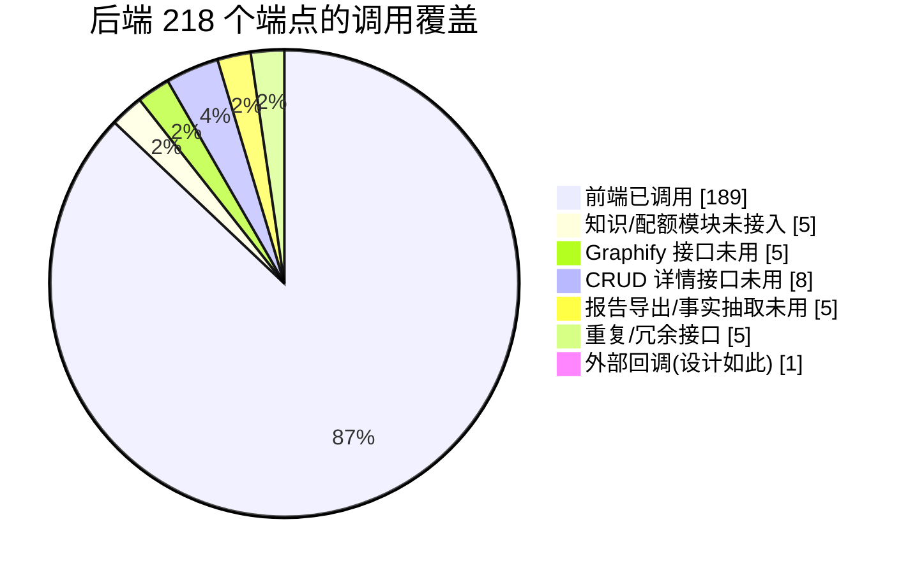

# 前后端接口一致性检查报告

> 检查日期：2026-07-06
> 检查范围：后端 `backend/src/main/java/io/github/legacygraph/controller/`（35 个 Controller）与前端 `frontend/src/`（19 个 API 模块 + 视图直接调用）
> 目的：找出「前端有调用、后端未实现」与「后端已实现、前端未调用」的接口偏差

---

## 1. 检查方法

1. 用脚本从后端每个 Controller 提取所有 `@*Mapping` 端点（含 `value=`/`path=` 形式，如 SSE 的 `@GetMapping(value="/stream", produces=...)`），得到 **218 个端点**。
2. 用脚本从前端所有 `.ts`/`.vue` 提取 API 调用（`get/post/put/del/upload/downloadFile/request.*/fetch`），归一化路径参数（`${x}` 与 `{x}` 统一为 `{}`），得到 **187 个调用点**。
3. 对两端做集合差集：
   - **A = 前端调用 − 后端端点**：前端有、后端没有。
   - **B = 后端端点 − 前端调用**：后端有、前端没有。
4. 对所有歧义项（变量拼接 URL、`fetch(baseUrl+...)`、`@GetMapping(value=...)` 等）逐一用 grep 验证，剔除假阳性。

> 结论速览：**A 类（前端有/后端缺）1 处，是真实 Bug**；**B 类（后端有/前端缺）29 处**，其中 1 处为外部回调（设计如此），其余为前端缺功能入口或 CRUD 详情接口未单独拉取。

---

## 2. A 类：前端有调用、后端未实现（1 处，真实 Bug）

| 前端调用 | 前端位置 | 问题 |
|---|---|---|
| `GET /lg/projects/{projectId}/graphify/quality` | `frontend/src/api/graphify.api.ts:99` `getQuality()`；由 `frontend/src/views/graphify/GraphifyQualityDashboard.vue:157` 调用 | 后端**没有** `/graphify/quality`。后端只有 `GET /lg/projects/{projectId}/graph/quality`（`backend/.../controller/GraphQueryController.java:258`，是 `graph` 不是 `graphify`）。该「Graphify 质量仪表盘」页面一打开即 404。**疑似前端路径拼写错误**（`graphify` 应为 `graph`），或后端缺少该端点。 |

**建议**：二选一——
- 改前端 `graphify.api.ts:99` 路径为 `/lg/projects/${projectId}/graph/quality`（若质量仪表盘本意是展示图谱质量）；或
- 后端新增 `GET /lg/projects/{projectId}/graphify/quality` 端点（若该仪表盘确为 Graphify 专属质量视图）。

---

## 3. B 类：后端已实现、前端未调用（29 处）

### B1. 整块后端模块，前端无任何 UI（影响最大）

| 端点 | Controller | 说明 |
|---|---|---|
| `GET /lg/projects/{projectId}/knowledge/claims` | KnowledgeController | 知识断言列表 |
| `GET /lg/projects/{projectId}/knowledge/claims/{id}` | KnowledgeController | 断言详情 |
| `GET /lg/projects/{projectId}/knowledge/gaps` | KnowledgeController | 知识缺口列表 |
| `POST /lg/projects/{projectId}/knowledge/gaps/{id}/resolve` | KnowledgeController | 标记缺口已解决 |
| `GET /lg/quota/{projectId}` | QuotaController | 租户配额查询 |

> 后端已建 `lg_knowledge_claim`/`lg_gap_task` 表并实现 KnowledgeController 4 个接口、QuotaController 配额接口，但前端**无 `knowledge.api.ts`、无配额相关调用**，全仓 grep 0 命中。**知识断言/缺口/配额功能后端完整、前端完全未接入。**

### B2. Graphify 接口前端未调用

| 端点 | 说明 |
|---|---|
| `POST /lg/projects/{projectId}/graphify/analyze` | 同步分析；前端用 `import`/`run` 代替 |
| `GET /lg/projects/{projectId}/graphify/status` | Graphify CLI 可用性检查 |
| `POST /lg/projects/{projectId}/graphify/jobs` | 创建导入作业 |
| `GET /lg/projects/{projectId}/graphify/jobs/{jobId}` | 单作业详情 |
| `POST /lg/projects/{projectId}/graphify/jobs/{jobId}/cancel` | 取消作业 |

> `GraphifyJobCenterView.vue` 只用了 `getJobs` / `retryJob` / `rollbackJob`，**没有「创建作业 / 查看详情 / 取消」的入口**。

### B3. CRUD 详情（get-by-id）接口前端未用

前端列表接口普遍返回完整对象，故未单独拉取详情：

| 端点 | 说明 |
|---|---|
| `GET /lg/projects/{projectId}/sources/databases/{id}` | 数据库连接详情 |
| `GET /lg/projects/{projectId}/sources/documents/{id}` | 文档详情 |
| `GET /lg/projects/{projectId}/sources/repos/{id}` | 代码仓库详情 |
| `GET /lg/system/configs/{id}` | 系统配置详情 |
| `GET /lg/system/dicts/{id}` | 字典类型详情 |
| `GET /lg/system/users/{id}` | 用户详情 |
| `GET /lg/projects/{projectId}/evidence/{id}/related` | 证据关联节点（前端用 `/facts/{id}/related-nodes` 代替） |
| `DELETE /lg/audit/{id}` | 删除单条审计日志（前端只有 `/lg/audit/clear` 全清） |

### B4. 报告导出 / 事实抽取接口未用

| 端点 | 说明 |
|---|---|
| `GET /reports/code-understanding/{projectId}/{versionId}` | 代码理解报告导出 |
| `GET /reports/scan-research/{projectId}/{versionId}` | 扫描研究报告导出 |
| `POST /lg/projects/{projectId}/extract/facts/code` | LLM 代码事实抽取 |
| `POST /lg/projects/{projectId}/extract/facts/doc` | LLM 文档事实抽取 |
| `GET /lg/projects/{projectId}/scan-versions/{versionId}/performance-report` | 扫描性能报告 |

### B5. 重复 / 冗余接口

| 端点 | 说明 |
|---|---|
| `GET /agents/graph/merge/candidates` | 与 `/lg/projects/{projectId}/graph/merge/candidates` 重复，前端用后者 |
| `POST /agents/graph/merge/decide` | 同上重复 |
| `POST /agents/graph/merge/execute` | 同上重复 |
| `GET /lg/system/users/all` | 与 `/lg/system/users/list` 重复，前端用 `list` |
| `POST /change-tasks/{id}/register-gates` | 变更任务注册验证门禁，前端未用 |

### B6. 外部回调（设计如此，无需前端）

| 端点 | 说明 |
|---|---|
| `POST /lg/projects/{projectId}/tests/results/callback` | 外部测试执行器结果回调，本就无前端调用方 |

---

## 4. 已排除的假阳性

以下差集项是解析器未跟上前端特殊写法，**经 grep 验证前端确有调用，不算缺口**：

| 差集项 | 实际调用方式 |
|---|---|
| `GET /lg/projects/{projectId}/reports/insights` | `report.api.ts:110` 用 `const url = \`...\` + ?versionId=...` 变量拼接再 `get(url, config)` |
| `POST /qa/ask/stream` | `qa.api.ts:85` 用 `fetch((VITE_API_BASE_URL\|\|'/api') + '/qa/ask/stream', ...)` |
| `GET /lg/projects/{projectId}/sources/documents/{id}/download` | `DocumentList.vue:219/335` 用 `fetch(\`${apiBaseUrl}/.../download\`)` |
| `GET /lg/notifications/stream` | 后端**有**实现：`NotificationController.java:41` `@GetMapping(value="/stream", produces="text/event-stream")`，是 SSE，非缺口 |

> 另：首个子代理曾误报 `POST /qa`（EnhancedQaController）为端点，实际 `EnhancedQaController` 只有 `/ask/stream`、`/conversations*`、`/feedback`，**无 bare `POST /qa`**。本报告以直接代码提取的 218 端点为准。

---

## 5. 结论与建议

| 优先级 | 项 | 建议 |
|---|---|---|
| 🔴 高 | A：`/graphify/quality` 前端调用 404 | 立即修：改前端路径为 `/graph/quality` 或后端补端点 |
| 🟡 中 | B1：知识断言/缺口/配额整块未接入前端 | 评估是否补前端 API 模块与页面；若为预留能力则在文档标注 |
| 🟡 中 | B2：Graphify 作业创建/详情/取消缺前端入口 | 作业中心补「新建作业 / 查看详情 / 取消」按钮与调用 |
| 🟢 低 | B3：CRUD 详情 get-by-id 未用 | 多数因列表已返回全量字段，可保留备用；如需详情页再接入 |
| 🟢 低 | B4：报告导出/事实抽取未用 | 按需在报告页/事实页接入导出与 LLM 抽取按钮 |
| 🟢 低 | B5：重复/冗余接口 | 评估是否下线 `/agents/graph/merge/*`、`/system/users/all`、`register-gates` |
| — | B6：外部回调 | 设计如此，无需处理 |

### 数据汇总

| 指标 | 数量 |
|---|---:|
| 后端 Controller | 35 |
| 后端端点总数 | 218 |
| 前端调用点（去重 method+path） | 187 |
| A 类（前端有/后端缺） | 1 |
| B 类（后端有/前端缺） | 29 |
| 其中外部回调（设计如此） | 1 |

---

## 6. 版本历史

| 版本 | 日期 | 说明 |
|------|------|------|
| 1.0 | 2026-07-06 | 首次输出；基于 218 后端端点与 187 前端调用点的路径差集，逐项 grep 验证 |
