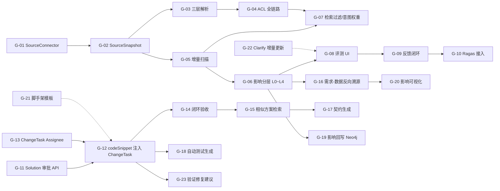

# LegacyGraph 剩余优化项实施方案

> 项目：LegacyGraph
> 文档日期：2026-07-11
> 上游方案：`doc/资料扫描到图谱构建与QA问答全流程升级优化方案.md`
> 上游首期计划：`doc/资料扫描到图谱构建与QA问答可落地实施计划.md`
> 状态：在首期闭环已交付（19/29 项完成）的基础上，补齐剩余 23 项缺口（含 10 项原缺口 + 13 项业务目标驱动的增强项）

---

## 1. 实施背景与目标

首期闭环已在以下链路贯通：扫描收口 → GraphRelease 状态机 → 质量门禁 → QA 评测门禁 → 结构化切块 → 需求本体（Requirement/AcceptanceCriterion/Solution 等）→ 需求-图谱链接 → 影响子图 → Solution Planner → Solution Verifier → Solution Controller。

但业务目标"建立图谱加速需求到编码、替代人工分析需求并给出可落地方案"暴露出 23 项缺口，分为三类：

- **资料 / 图谱类（G-01 ~ G-07）**：扫描接入、ACL、增量变更、影响分层等底层能力缺口
- **评测 / 反馈类（G-08 ~ G-10）**：黄金集 UI、用户反馈、Ragas 指标
- **需求到编码闭环类（G-11 ~ G-23）**：方案审批、任务指派、代码片段注入、闭环验收、相似方案学习、契约生成等加速编码链路

| 编号 | 缺口项 | 影响维度 | 优先级 |
|-----|--------|----------|--------|
| G-01 | 缺少统一的 `SourceConnector` 抽象 | 资料接入 | P0 |
| G-02 | `lg_source_snapshot` 不可变快照缺失/不完整 | 资料追溯 | P0 |
| G-03 | 文档解析未切换到 FAST/LAYOUT/OCR 三层策略 | 解析质量 | P0 |
| G-04 | ACL 贯穿到答案不完整（仅 EvidenceVerifier 一处） | 安全 | P0 |
| G-05 | 增量扫描缺删除/重命名/逻辑重扫原因识别 | 数据新鲜度 | P1 |
| G-06 | 影响分析仅基础抽取，未实现 L0~L4 风险分层 | 影响准确度 | P1 |
| G-07 | QA 检索缺乏意图加权和版本/ACL 过滤链路 | 检索质量 | P1 |
| G-08 | 黄金集与回归门禁跑通，但 UI 与反馈闭环未上线 | 评测闭环 | P1 |
| G-09 | 线上反馈结构化（QaFeedback / SolutionReviewDiff） | 持续学习 | P2 |
| G-10 | Ragas 指标接入（Context Precision/Recall 等） | 评测维度 | P2 |
| G-11 | Solution 缺少 Approve / Reject API | 方案审批 | **P0** |
| G-12 | SolutionStep.codeSnippet 未注入 ChangeTask | 编码落地 | **P0** |
| G-13 | ChangeTask 缺少 Assignee 字段 | 任务指派 | **P0** |
| G-14 | 编码完成缺少基于 AcceptanceCriterion 的自动闭环验证 | 需求闭环 | P1 |
| G-15 | SolutionPlanner 缺少相似历史方案检索 | 方案质量 | P1 |
| G-16 | 需求-表/字段反向溯源 API 缺失 | 影响溯源 | P1 |
| G-17 | 缺少从需求自动生成 OpenAPI / TypeScript 契约 | 接口契约 | P1 |
| G-18 | 方案生成后未自动触发 TestGenerationAgent | 测试落地 | P2 |
| G-19 | 影响子图结果未回写 Neo4j 节点 properties | 影响复用 | P2 |
| G-20 | 缺少需求影响专用可视化组件 | 影响可视化 | P2 |
| G-21 | 缺少项目脚手架模板（Controller/Service/Mapper）生成 | 模板复用 | P2 |
| G-22 | Clarify 接口只支持全文重抽，缺少增量 Patch | 需求迭代 | P2 |
| G-23 | 方案验证失败后未生成智能修复建议 | 方案修复 | P2 |

实施目标：

1. 把"资料解析 → 元数据 → 答案"的 ACL 链路做到真正端到端。
2. 把"扫描增量变更 → GraphRelease → 影响分析"做成立体、有版本意识的流水线。
3. 把"用户反馈 → 评测集/提示词"形成闭环，反哺检索与方案质量。
4. **打通"需求 → 方案 → 编码任务 → 代码落地 → 闭环验证"的最后一公里**，让方案不再停在 `codeSnippet` 表里，而是真正成为可领取、可执行、可验证的编码任务。

---

## 2. 总体设计原则

- **复用现有服务**：现有 `ScanArtifactPublisher`、`GraphBuilder`、`EvidenceVerifier`、`HybridRetrievalService`、`SemanticCache` 优先扩展，避免新建并行实现。
- **保持 GraphRelease 为版本边界**：所有新增能力必须以 `GraphRelease.status = PUBLISHED` 作为可读前提。
- **保持权限分层**：所有新增实体必须在 `projectId` 之上同时携带 `aclHash` 或 principals。
- **保持 Job 与 HTTP 分离**：耗时的解析/索引任务走 `task/` 与 `service/`，API 层只做编排。
- **每项都要有可验证验收**：参照首期计划"13 个任务"的 TDD 卡模式，每个任务都附单元/集成测试与回归指标。

---

## 3. 任务清单与依赖



> 说明：G-11~G-23 围绕"需求 → 编码闭环"展开，依赖 G-06 影响分层、G-12/G-13 完成方案→任务桥接，G-14 形成闭环验证。

---

## 4. 详细任务设计

### G-01 抽象 `SourceConnector` 接口（P0，3~5d）

**目标**：为五类资料源（代码库、本地文档、远程文档、数据库元数据、运行证据）建立统一接入契约。

**新增文件**：

```
dto/source/SourceDescriptor.java
dto/source/SourceSnapshot.java
dto/source/SourceDelta.java
dto/source/AccessPolicy.java
service/source/SourceConnector.java        # interface
service/source/SourceRegistry.java         # 由 projectId + sourceType 解析 connector
service/source/ScanScopeResolver.java      # 扩展现有 ScanScopeResolver
```

**`SourceConnector` 接口签名**：

```java
public interface SourceConnector {
    List<SourceDescriptor> discover(String projectId);
    SourceSnapshot fetch(SourceDescriptor descriptor, String cursor);
    AccessPolicy getAcl(SourceDescriptor descriptor);
    SourceDelta diff(SourceSnapshot previous, SourceSnapshot current);
    String checkpoint(String sourceId, String cursor);
}
```

**`SourceDescriptor` 关键字段**：

- `sourceType`：`CODE | DOC | DB | RUN | EXTERNAL`
- `projectId / repositoryId / branch / commit`
- `mimeType / language / charset`
- `etag / contentHash / size / modifiedAt`
- `owner / aclUsers / aclGroups / classification`
- `discoveredBy / discoveredAt`

**改造现有类**：

- `ProjectScanner.discoverAllSources()` 改为调用 `SourceRegistry.discover(projectId)`。
- `FileChangeDetector` 实现 `CodeConnector`。
- `DocumentExtractor`/`DocExtractStep` 实现 `DocConnector`。
- `DatabaseMetadataScanService` 实现 `DbConnector`。

**验收**：

- 单元测试：5 类 connector 各 1 个 fixture，校验 discover/fetch/diff 行为。
- 集成测试：`SourceRegistry.discover(projectId)` 返回的描述符合 `lg_code_repo` + `lg_doc` + `lg_db_metadata` 现有数据。
- 旧链路（`ProjectScanner` 直连文件）保留开关可关闭，新链路作为 Feature Flag `legacygraph.source.connector.enabled`。

---

### G-02 不可变 `SourceSnapshot` 父表（P0，2~3d）

**目标**：让扫描开始时为每份资料生成不可变快照，所有后续建图/向量化/QA 都引用同一快照。

**数据库迁移** `V69__source_snapshot.sql`：

```sql
CREATE TABLE lg_source_snapshot (
    id                  VARCHAR(40) PRIMARY KEY,
    project_id          VARCHAR(64) NOT NULL,
    source_type         VARCHAR(20) NOT NULL,
    source_id           VARCHAR(64) NOT NULL,
    source_uri          VARCHAR(512),
    content_hash        VARCHAR(64) NOT NULL,
    parent_snapshot_id  VARCHAR(40),
    scan_version_id     VARCHAR(40),
    mime_type           VARCHAR(64),
    size_bytes          BIGINT,
    acl_hash            VARCHAR(64),
    storage_uri         VARCHAR(512),
    status              VARCHAR(16) NOT NULL,
    created_at          TIMESTAMP NOT NULL DEFAULT CURRENT_TIMESTAMP
);
CREATE INDEX idx_snapshot_project ON lg_source_snapshot(project_id, source_type);
CREATE INDEX idx_snapshot_version ON lg_source_snapshot(scan_version_id);
```

**实体/Repository**：

```
entity/SourceSnapshot.java
repository/SourceSnapshotRepository.java
```

**实现要点**：

- 保留现有 `lg_file_snapshot`，把相同语义字段外键关联到 `lg_source_snapshot.id`（`parent_snapshot_id = lg_source_snapshot.id`）。
- `SourceConnector.fetch()` 写完快照表后再返回 `SourceSnapshot`。
- `ScanArtifactPublisher` 与 `ScanFinalizationService` 接收 `scanVersionId` 时同时按快照记录更新图谱节点的 `sourceSnapshotId`。

**验收**：

- 同一资料不同版本的 `content_hash` 变化时生成新行，`parent_snapshot_id` 指向上一个。
- 任何图节点在 `versions` 视图上能查到对应的快照并定位原文。

---

### G-03 三层文档解析策略（P0，5~7d）

**目标**：把 `DocumentExtractor` + `DocExtractStep` 替换为 FAST / LAYOUT / OCR 三个分层实现，统一输出 `DocumentElement` 流。

**新增/改造**：

```
service/document/DocumentPartitionService.java   # interface
service/document/FastPartitionService.java       # Markdown / TXT / 简单 PDF/DOCX
service/document/LayoutPartitionService.java     # 复杂版面（PDFBox + 标题/表格/坐标）
service/document/OcrFallbackService.java         # Tesseract（可关闭） + OCR 置信度
service/document/DocumentPartitionRouter.java    # 按 mime + 启发式选择档位
service/document/StructureAwareChunkService.java # 已有，按需求增强
```

**档位判定优先级**：

1. `mime=application/pdf` 且文本层 < N 字符 → OCR 兜底（默认关闭，需 Feature Flag）。
2. 包含表格/多列/页眉页脚 → LAYOUT。
3. 其余 → FAST。

**每个元素必须携带**：

- `parseConfidence`（0~1）
- `ocrConfidence`（仅 OCR 时）
- `pageNo / bbox`
- `sourceLocation = "<uri>#<element-id>"`

**取消截断**：移除 `DocExtractStep.readDocContent()` 中"超过 100KB 截断到 50KB"逻辑，改为：

- 流式读取
- 每解析完 1 个 element 立即落库
- 失败分片写入 `lg_parse_failure`（与 V69 同批迁移提供）

**验收**：

- 200KB PDF 的全文与表格都能在 `lg_document_element` 中查到。
- OCR 路径在 `legacygraph.ocr.enabled=false` 时不调用，但资料质量报告里有 `OcrSkippedReason`。

---

### G-04 ACL 端到端贯穿（P0，4~5d）

**目标**：让 `AccessContext`（project + principals + aclHash + graphReleaseId）从 `EnhancedQaController` 一路传到向量检索、图查询、证据组装、回答审计。

**改造**：

- `EnhancedQaAgent.answer()` 新增 `AccessContext ctx` 参数（已部分实现 `dto/qa/AccessContext.java`）。
- `HybridRetrievalService.search()` 接受 `ctx`，在 RRF 前先做 ACL 过滤：
  - `VectorDocument.aclPrincipals` 不空时按 ctx.principals 交集判断。
  - `graphReleaseId` 不匹配时丢弃。
- `GraphQueryService.execute()` 接收 `ctx`，Cypher 中追加 `AND EXISTS {
      MATCH (n)-[:ACCESSIBLE_TO]->(p)
      WHERE p.principal IN $principals
  }`。
- `EvidenceVerifier.checkEvidence()` 已实现 `checkAcl`，新增 `releaseScanVersionId` 必填校验。
- 控制层 `EnhancedQaController` 从 JWT 注入 `principal`，计算 `aclHash` 并下发。

**新增审计**：

```sql
CREATE TABLE lg_qa_audit_log (
    id              VARCHAR(40) PRIMARY KEY,
    project_id      VARCHAR(64),
    graph_release_id VARCHAR(40),
    principal       VARCHAR(64),
    question_hash   VARCHAR(64),
    acl_hash        VARCHAR(64),
    blocked_reason  VARCHAR(64),
    created_at      TIMESTAMP NOT NULL DEFAULT CURRENT_TIMESTAMP
);
```

**验收**：

- 测试用例 A：principal 无权访问的资料在 RRF 前被丢弃，证据数为 0。
- 测试用例 B：缓存命中仍需重新校验 ACL，被拒时记录 `ACL_RECHECK_BLOCKED` 到审计表。
- 测试用例 C：图路径中含敏感节点时整条路径被过滤。

---

### G-05 增量扫描补齐删除/重命名/逻辑重扫（P1，3~4d）

**目标**：让 `FileChangeDetector` 报告三类变更：`ADDED | MODIFIED | DELETED | RENAMED | LOGIC_RESCAN`。

**改造**：

```
service/scan/FileChangeDetector.java        # 增加 RenameDetector
service/scan/FileSnapshotTombstoneService.java # 删除节点/向量失效
```

**实现要点**：

1. 在生成快照时先做 `git diff --name-status`（若可用），再用 `content_hash` 兜底。
2. 删除的文件：`lg_graph_node` 上 `versionId` 等于本次扫描且 `sourcePath` 完全匹配 → `NodeStatus.TOMBSTONED`。
3. 重命名：旧 `sourcePath` 节点到新 `sourcePath` 节点的 `RENAMED_TO` 边，attributes 留 `beforePath / afterPath`。
4. 逻辑重扫：当 `extractorVersion`/`embeddingModel`/`graphOntologyVersion` 发生变化，对应节点类型全部置为 `STALE` 并触发全面重算。
5. `ScanFinalizationService` 在第 6 步产物发布后，跑一次 `FileSnapshotTombstoneService.evict(projectId, scanVersionId)`，把已无最新引用的节点/向量彻底失效。

**验收**：

- 删除测试仓库中的一个文件：`versionId` 切换后该文件的图节点与向量块全部消失。
- 重命名测试仓库中的文件：图节点存在并带有 `RENAMED_TO` 边。
- 修改 `graph_ontology_version`：受影响的节点全部重新出现，旧节点置 `STALE` 并被 tombstone。

---

### G-06 影响分析 L0~L4 分层与风险权重（P1，4~6d）

**目标**：把现在 `ImpactSubgraphService.extract()` 输出升级为按影响层与风险分数排序的列表，支撑 `SolutionVerifier.checkHighRiskCoverage`。

**新增/改造**：

```
dto/requirement/ImpactLevel.java         # L0~L4 枚举
dto/requirement/RiskFactor.java
service/requirement/ImpactSubgraphService.java  # 扩展现有
service/requirement/RiskScorer.java       # 风险分数公式
```

**路径层规则**：

| Layer | 路径 |
|-------|------|
| L0 直接 | ReqItem → Column / ApiEndpoint / Method / Page |
| L1 代码 | Column → SqlStatement → Mapper → Service → Controller → ApiEndpoint |
| L2 交互 | ApiEndpoint → Page / Button / MQConsumer / ExternalSystem |
| L3 质量 | Method / ApiEndpoint → TestCase / Assertion / Monitoring |
| L4 架构 | Package → DEPENDS_ON → 下游 Package |

**风险分数公式**：

```
risk = 关系可信度 × 路径衰减 × 变更类型权重
       × 关键资产权重 × 缺少测试惩罚 × 运行时热度
```

- 关系可信度：来自 evidence 的 confidence；推断边衰减 0.7。
- 路径衰减：`1 / log2(depth + 2)`。
- 变更类型权重：`SchemaChange=1.5`、`ApiContract=1.4`、`InternalOnly=1.0`、`ReadOnly=0.6`。
- 关键资产权重：来自 `lg_asset_hotness`（G-06 副产品）。
- 缺少测试惩罚：`(test_coverage_ratio == 0) ? 1.5 : 1.0`。
- 运行时热度：从访问日志聚合（首期可静态默认值 1.0）。

**验收**：

- 在提供的样本项目上，L0 节点全部命中关键文件/接口；L4 至少能列出全部 1 跳下游包。
- 风险分数对推断边的衰减生效（推断边进入 L0 风险分自动减半）。

---

### G-07 检索加意图权重与版本/ACL 过滤链路（P1，4~5d）

**目标**：让 `HybridRetrievalService.search()` 的多路召回按意图加权、必走 ACL 和版本过滤，再交付 `ReciprocalRankFusionService` 融合。

**改造**：

```
service/qa/HybridRetrievalService.java    # 在 RRF 前插入过滤与加权
service/qa/RetrievalIntentRouter.java     # QueryIntent -> 召回权重
```

**意图权重矩阵（实现常量）**：

| Intent | 关键词 | 向量 | 图节点 | Claim | 项目约定 |
|--------|--------|------|--------|-------|----------|
| REQUIREMENT_UNDERSTANDING | 0.20 | 0.35 | 0.15 | 0.25 | 0.05 |
| CHANGE_IMPACT | 0.30 | 0.20 | 0.25 | 0.10 | 0.15 |
| SOLUTION_DESIGN | 0.15 | 0.20 | 0.20 | 0.15 | 0.30 |
| CODE_EXPLANATION | 0.25 | 0.30 | 0.25 | 0.10 | 0.10 |
| ARCHITECTURE_OVERVIEW | 0.05 | 0.20 | 0.30 | 0.15 | 0.30 |
| DATA_LINEAGE | 0.30 | 0.15 | 0.40 | 0.10 | 0.05 |

**意图 → 召回策略路由**：

- `DATA_LINEAGE` / `CODE_EXPLANATION` 走"种子节点 + 受控图扩展"，不进入向量召回。
- `ARCHITECTURE_OVERVIEW` 走"社区摘要 + 关键节点"。
- 其余默认走多路 + RRF。

**过滤前置**（在 RRF 之前）：

```java
List<VectorDocument> filtered = rawResults.stream()
    .filter(d -> aclPass(d.aclPrincipals(), ctx.principals()))
    .filter(d -> versionMatch(d.graphReleaseId(), ctx.graphReleaseId()))
    .toList();
```

**验收**：

- `DATA_LINEAGE` 题型在 `Intent=CODE_EXPLANATION` 排行榜中不受语义相似度高的"项目概述"压制。
- 无权访问的资料在 RRF 前被丢，证据集不含敏感数据。

---

### G-08 评测 UI 与反馈按钮（P1，3~4d）

**目标**：在前端提供评测集管理、扫描前/后指标查看、答案反馈按钮，把"评测数据 → UI 修改 → 后端 QaFeedback"串起来。

**新增**：

```
frontend/src/views/QaEvaluationView.vue     # 评测列表
frontend/src/views/QaCaseDetailView.vue
frontend/src/components/AnswerFeedback.vue # 点赞 / 标记错证据
backend/src/main/java/io/github/legacygraph/controller/QaEvaluationController.java
backend/src/main/java/io/github/legacygraph/controller/QaFeedbackController.java
```

**接口**：

- `GET /lg/projects/{projectId}/qa/cases?status=SMOKE|REGRESSION|...`
- `POST /lg/qa/feedback`：`{question, answerId, claimText, feedbackType, expectedEvidenceIds[]}`
- `GET /lg/qa/eval-runs?projectId=&versionId=` 返回历史 run。

**验收**：

- 评测用例 CRUD 全部走 UI。
- 反馈按钮点击后 `lg_qa_feedback` 表新增记录，并按反馈类型聚合到仪表盘。

---

### G-09 QaFeedback / SolutionReviewDiff 持久化（P2，3~4d）

**目标**：把"哪条结论错、影响节点漏、证据无关、最终方案差异"沉淀到数据库，反哺提示词与评测集。

**数据库迁移** `V78__qa_feedback.sql`（**实施期命名变更**：原计划 `V70` 与 V29 已创建的 `lg_qa_feedback` 冲突；改用 `V78`，并将声明级反馈表命名为 `lg_qa_claim_feedback` 以避免与 V29 的 QA 对话级 `lg_qa_feedback` 冲突）：

```sql
-- 1. QA 声明反馈表
CREATE TABLE IF NOT EXISTS lg_qa_claim_feedback (
    id                  VARCHAR(40) PRIMARY KEY,
    project_id          VARCHAR(64),
    graph_release_id    VARCHAR(40),
    question_hash       VARCHAR(64),
    claim_text          TEXT,
    feedback_type       VARCHAR(20), -- INCORRECT | MISSING_IMPACT | IRRELEVANT_EVIDENCE | ...
    expected_evidence   TEXT,        -- 期望证据 JSON 文本（实施期调整为 TEXT 而非 JSONB，便于灵活存储）
    principal           VARCHAR(64),
    created_at          TIMESTAMP NOT NULL DEFAULT CURRENT_TIMESTAMP
);

-- 2. 方案评审差异表
CREATE TABLE IF NOT EXISTS lg_solution_review_diff (
    id                  VARCHAR(40) PRIMARY KEY,
    solution_id         VARCHAR(40),
    reviewer            VARCHAR(64),
    step_index          INTEGER,
    diff_type           VARCHAR(20), -- ADDED | REMOVED | MODIFIED
    before_summary      TEXT,
    after_summary       TEXT,
    created_at          TIMESTAMP NOT NULL DEFAULT CURRENT_TIMESTAMP
);
```

**新增/改造**：

```
entity/QaFeedback.java
entity/SolutionReviewDiff.java
repository/QaFeedbackRepository.java
repository/SolutionReviewDiffRepository.java
service/evaluation/QaFeedbackIngestService.java
```

**反哺路径**：

- 错误反馈 → 进入 `QaTestCase` 候选（待审核）+ `RetrievalIntentRouter` 权重微调（按主题）。
- `SolutionReviewDiff` → `SolutionPlanner` 提示词历史差异对照样本。

**验收**：

- 反馈在 24h 内进入评测集候选池。
- 提示词构建器能取到最近 5 条同类方案的人工修订。

---

### G-10 Ragas 指标接入（P2，5~7d）

**目标**：在 `DefaultQaEvaluationService` 之上扩展 `RagasMetricsService`，覆盖 Context Precision / Recall、Faithfulness、Answer Relevancy，不替代确定性校验。

**新增**：

```
service/evaluation/RagasMetricsService.java
dto/evaluation/RagasReport.java
```

**实现要点**：

- Context Precision/Recall：基于 `expectedEntities + expectedKeywords` + 检索证据集合的并集差集，与 Ragas 算法一致。
- Faithfulness：抽取 answer 中对 retrievedContexts 的"蕴含 span"，未蕴含部分扣分。
- Answer Relevancy：用反向问题 + 同义改写查询问 answer 是否相关（轻量实现，可调 LLM）。
- 所有 Ragas 指标**不**作为门禁，但记录在 `qa-evaluation-{versionId}.json` 中作为辅助对比。

**验收**：

- 单一 `QaTestCase` 的 Ragas 报告在评测报告 JSON 中可见。
- 前后两次扫描的 Faithfulness 差异可视化。

---

## 4.1 需求到编码闭环增强项（G-11 ~ G-23）

> 这一组任务面向业务核心目标："建立图谱加速需求到编码、取代人工分析需求并给出可落地方案"。调研发现 `SolutionPlanner` 生成的 `codeSnippet` 完整方法代码虽已落库到 `lg_solution_step`，但**没有进入 `ChangeTask.proposal`、没有 `Approve` 接口、Assignee 缺失、闭环验收缺失**。这 13 项任务就是要打通这条最后一公里。

### G-11 Solution Approve / Reject API（P0，1~2d）

**目标**：把方案状态机从 `DRAFT → READY_FOR_REVIEW/NEEDS_INPUT → APPROVED/REJECTED` 完整 API 化，使 `SolutionToChangeTaskBridge` 真正可触发。

**改造**：

```
controller/SolutionController.java        # 新增 approve / reject 端点
dto/solution/ApproveRequest.java
service/solution/SolutionReviewService.java
```

**接口**：

- `POST /lg/solutions/{solutionId}/approve`：body 含 `reviewer`、`comment`、`decision` (`APPROVE | APPROVE_WITH_REVISION | REJECT`)。
- `POST /lg/solutions/{solutionId}/reject`：body 含 `reviewer`、`reason`。
- 状态机约束：
  - 只有 `READY_FOR_REVIEW` 状态可批准/驳回。
  - `APPROVE_WITH_REVISION` 触发方案版本号 +1，原方案置 `SUPERSEDED`，新方案继承 step + reviewer 修订。
  - `REJECT` 必须强制要求 `reason` 字段非空。

**验收**：

- `READY_FOR_REVIEW` 状态可成功转 `APPROVED`，调用 `SolutionToChangeTaskBridge` 不再失败。
- 状态机非法跳转（如 `DRAFT → APPROVED`）返回 422。
- 所有审批操作记录到 `lg_solution_audit`（含 reviewer / before / after / comment）。
- **高风险方案必须由 LEAD/PM 角色审批**：`Solution.riskAssessmentJson.riskLevel = HIGH` 时，非 LEAD/PM reviewer 调用 approve 返回 `403 HIGH_RISK_REQUIRES_LEAD`；校验在 `SolutionController.approve` 端点进行。

---

### G-12 SolutionStep.codeSnippet 注入 ChangeTask（P0，3~5d）

**目标**：把 `lg_solution_step.codeSnippet` / `codeLanguage` / `evidenceIds` 注入 `ChangeTask.proposal`，并支持生成可 `git apply` 的 patch 文件。

**改造**：

```
service/solution/SolutionToChangeTaskBridge.java   # 读取 step.codeSnippet
service/change/PatchComposer.java                  # 把 codeSnippet 序列化为 unified diff
dto/change/ChangeTaskProposal.java
```

**实现要点**：

1. `SolutionToChangeTaskBridge.bridge()` 从 `lg_solution_step` 加载所有 step：
   - `CREATE` 步骤：把 `codeSnippet` 整体作为新文件，写入 `PatchFile`（`op=CREATE`）。
   - `MODIFY` 步骤：先用 `PatchComposer` 比对项目原文件（按 `filePath` 解析）生成 unified diff；如未找到原文件，回退为 `CREATE`。
   - `DELETE` 步骤：用 `git rm` 风格的 diff 占位。
2. `ChangeTask.proposal` 改为 JSON 结构：

```json
{
  "files": [
    {
      "filePath": "src/main/java/.../OrderService.java",
      "op": "MODIFY",
      "symbolName": "OrderService#exportLast30Days",
      "diff": "@@ -10,3 +10,5 @@ ...",
      "evidenceIds": ["ev-001"],
      "testDescription": "...",
      "rollbackDescription": "..."
    }
  ]
}
```

3. `ChangeTaskService.generatePatch()` 改为读取 `proposal.files` 而非从 Adapter 重新生成。

**验收**：

- 创建 1 个 3 step 的 APPROVED 方案，bridge 后 `ChangeTask.proposal` 中 `files.length == 3`，且 MODIFY 步骤的 diff 在仓库中可 `git apply --check` 通过。
- 单测：`PatchComposer` 对"原文件 → 含 codeSnippet 新版本"生成的 diff 行数与人工编写一致。

---

### G-13 ChangeTask Assignee 字段（P0，2~3d）

**目标**：让任务支持指派/领取，让"可领取的编码任务"真正落地。

**数据库迁移** `V71__change_task_assignee.sql`：

```sql
ALTER TABLE lg_change_task ADD COLUMN assignee VARCHAR(64);
ALTER TABLE lg_change_task ADD COLUMN assignee_type VARCHAR(16); -- USER | TEAM | ROLE
ALTER TABLE lg_change_task ADD COLUMN claimed_at TIMESTAMP;
ALTER TABLE lg_change_task ADD COLUMN due_at TIMESTAMP;
CREATE INDEX idx_change_task_assignee ON lg_change_task(project_id, assignee, status);
```

**改造**：

```
entity/ChangeTask.java                    # 新增字段
controller/ChangeTaskController.java      # /claim /assign 端点
service/change/ChangeTaskService.java     # claim / assign 业务逻辑
```

**接口**：

- `POST /lg/change-tasks/{id}/claim`：当前 principal 领取任务，要求 `status in (OPEN, IMPACT_READY)`。
- `POST /lg/change-tasks/{id}/assign`：body `{assignee, assigneeType, dueAt}`，仅 Lead/PM 角色可调用。
- `GET /lg/change-tasks?assignee={me}`：当前用户的任务列表（前端按"我的任务"展示）。

**验收**：

- 未指派且无人领取的任务在"待领取"列表展示；A 用户领取后 B 用户看不到领取按钮。
- Assignee + status 过滤的查询走新建索引，耗时 < 50ms。

---

### G-14 基于 AcceptanceCriterion 的闭环验证（P1，3~5d）

**目标**：PR 合并后，根据 `RequirementItem → AcceptanceCriterion` 自动/半自动验证需求是否真正满足。

**数据库迁移** `V72__acceptance_verification.sql`：

```sql
ALTER TABLE lg_acceptance_criterion ADD COLUMN status VARCHAR(16) DEFAULT 'PENDING'; -- PENDING | VERIFIED | FAILED | WAIVED
ALTER TABLE lg_acceptance_criterion ADD COLUMN verification_type VARCHAR(16);       -- AUTOMATIC | MANUAL | NONE
ALTER TABLE lg_acceptance_criterion ADD COLUMN verified_by VARCHAR(64);
ALTER TABLE lg_acceptance_criterion ADD COLUMN verified_at TIMESTAMP;
ALTER TABLE lg_acceptance_criterion ADD COLUMN verification_note TEXT;
ALTER TABLE lg_acceptance_criterion ADD COLUMN evidence_url VARCHAR(512);
```

**新增**：

```
service/requirement/AcceptanceVerificationService.java
controller/RequirementController.java         # 新增 /verify 端点
```

**实现要点**：

1. `ChangeTaskService.onPrMerged()` 触发回调：根据 `task.solutionId → requirementId` 加载所有 `AcceptanceCriterion`。
2. 对每条 AC：
   - `verificationType=AUTOMATIC`：尝试根据文本匹配生成验证脚本（参考 `TestGenerationAgent`）。
   - `verificationType=MANUAL`：生成"待人工勾选"列表，状态保持 `PENDING`。
   - `verificationType=NONE`：自动置 `VERIFIED`（如"功能正常显示"这种纯描述项）。
3. 当某 `RequirementItem` 的所有 AC 都 `VERIFIED` 时，将 `Requirement.status` 推进到 `DONE`。
4. 提供"需求闭环报告"接口：`GET /lg/requirements/{id}/closure-report`，输出每条 AC 的状态、责任人、最近一次验证时间。

**验收**：

- 创建 1 个有 3 条 AC 的需求，PR 合并后调用 verify 接口，状态变更符合预期。
- 闭环报告能在前端展示，所有 `VERIFIED` 的 AC 显示绿色、`PENDING` 黄色、`FAILED` 红色。

---

### G-15 SolutionPlanner 相似历史方案检索（P1，3~4d）

**目标**：在生成新方案前，从历史 merged 的 ChangeTask/已批准 Solution 中检索相似方案，作为 few-shot 注入 prompt。

**新增**：

```
service/solution/SolutionSimilarityService.java
dto/solution/SimilarSolution.java
```

**实现要点**：

1. 索引：每次 Solution 状态转为 `APPROVED` 或 ChangeTask 转为 `MERGED` 时，对 `summary` + `goal` + 关键 step title 做 embedding，存入 `lg_solution_embedding`（新建）。
2. 检索：生成新方案时，先用 `RequirementAnalysis.goal` + 第一条 item.text 做语义搜索，取 top 3 相似方案。
3. Few-shot 注入：在 `solution-planning.txt` 中新增 `{similarSolutions}` 变量，包含 `[{requirementGoal, summary, keySteps[]}]`。
4. 评分：每次方案评审时由 reviewer 选"参考价值"，记录到 `lg_solution_embedding.usefulCount`，后续检索加权。

**存储（V76 migration）**：

```sql
CREATE TABLE IF NOT EXISTS lg_solution_embedding (
    id              VARCHAR(40) PRIMARY KEY,
    solution_id     VARCHAR(40) NOT NULL,
    project_id      VARCHAR(64) NOT NULL,
    embedding_text  TEXT,                 -- 原始嵌入文本，便于 LLM 检索 fallback
    embedding       BYTEA,                -- 序列化后的 float[] 字节流（应用层计算 cosine）
    useful_count    INTEGER DEFAULT 0,
    status          VARCHAR(16) DEFAULT 'ACTIVE',
    created_at      TIMESTAMP NOT NULL DEFAULT CURRENT_TIMESTAMP
);
```

> **实施决策（与原始文档差异）**：原方案计划使用 `vector(1536)` 走 PostgreSQL pgvector 扩展的 ANN 检索；
> 实施期为避免引入 pgvector 扩展依赖，改为 `BYTEA` 存储序列化后的 `float[]`，
> 余弦相似度由 `SolutionSimilarityService` 在应用层计算（Java 端遍历）。
> 该决策记录于 `doc/剩余优化项实施方案.md §12 实施偏差与补做记录`。

**验收**：

- 相似需求生成的方案引用了至少 1 条历史方案的步骤模式。
- 单测：`SolutionSimilarityService` 在 100 条历史方案中 top-3 命中率 ≥ 80%。
- 余弦相似度计算走应用层（不依赖 pgvector），`embedding_text` 可作为语义检索 fallback 输入 LLM。

---

### G-16 需求-表/字段反向溯源 API（P1，2~3d）

**目标**：让"这条需求会影响哪些表/字段"成为可调用的 API，支撑变更前的快速预览。

**新增**：

```
service/requirement/RequirementDataLineageService.java
controller/RequirementController.java         # 新增 /data-lineage 端点
dto/requirement/DataLineageResponse.java
```

**接口**：

- `GET /lg/requirements/{requirementId}/data-lineage`：从 `RequirementItem` 出发，沿 AFFECTS 边 + 反向 CALLS/READS/WRITES/MAPS_TO 边，找到所有 `Table` / `Column` 节点。
- 返回：

```json
{
  "tables": [
    {
      "tableKey": "lg_order",
      "tableName": "t_order",
      "impactedColumns": ["status", "amount"],
      "riskScore": 0.82,
      "evidenceIds": ["ev-001"]
    }
  ],
  "summary": {
    "tableCount": 3,
    "columnCount": 7,
    "maxRiskScore": 0.82
  }
}
```

**验收**：

- 给定 1 个有 2 条 Item 的需求，调用接口返回所有受影响的 Table/Column。
- 单测：模拟节点不存在或边缺失时返回 404 / 空数组。

---

### G-17 从需求自动生成 OpenAPI / TypeScript 契约（P1，3~5d）

**目标**：根据 `RequirementAnalysis` + 影响子图中的 ApiEndpoint 节点，自动生成 OpenAPI 3.0 规范和前端 TypeScript 类型。

**新增**：

```
service/contract/ContractGeneratorService.java
dto/contract/OpenApiSpec.java
```

> **实施期说明**：当前契约生成接口挂在 `RequirementController.generateContract`
> （路径 `POST /lg/requirements/{requirementId}/generate-contract`），
> **未单独拆出 `ContractController`**。后续若 G-17 接口增多再行拆分。

**接口**：

- `POST /lg/requirements/{requirementId}/generate-contract`：返回 OpenAPI JSON。
- `GET /lg/contracts/{requirementId}/typescript`：返回前端 TS 类型定义。
- 支持 `format=openapi3 | ts | both`。

**实现要点**：

1. 加载 `RequirementAnalysis` 中的"新增/修改接口"条目，结合 `ApiEndpoint` 节点的 `parameters` / `requestBody` / `response` 属性。
2. 用 LLM 补全字段描述、必填项、错误码，参考 `contract-generation.txt` prompt（需新建）。
3. 类型生成：从 OpenAPI schema 转为 TS interface，支持 `null | undefined` 可选性。

**验收**：

- 1 个简单新增接口的需求，生成 OpenAPI 含 1 个 path、完整 request/response schema。
- TS 类型可在 Vue 组件中 `import` 直接使用。

---

### G-18 方案自动触发 TestGenerationAgent（P2，2~3d）

**目标**：方案 `READY_FOR_REVIEW` 时自动为相关 Method 节点生成 JUnit 测试代码，附加到 `SolutionStep.testCodeSnippet`。

**改造**：

```
service/solution/SolutionPlanner.java        # generate 后触发 TestGenerationAgent
service/solution/SolutionTestAugmentService.java
```

**实现要点**：

1. `SolutionPlanner.plan()` 完成后，遍历 step 中 `actionType in (CREATE, MODIFY)` 且 `symbolName` 包含 `#` 的步骤。
2. 调用现有 `TestGenerationAgent.generateTests(nodeId)` 生成测试代码。
3. 把测试代码写入 `lg_solution_step.test_code_snippet` 字段（V65 表结构已有 `testDescription`，新增列）。
4. 在前端 `SolutionReview.vue` 中展示 "附带的测试代码"。

**验收**：

- 1 个 MODIFY 步骤的方案，verify 时数据库中 `test_code_snippet` 非空且可独立编译。
- 生成的测试代码覆盖主路径和 1 个异常分支。

---

### G-19 影响子图回写 Neo4j 节点 properties（P2，2~3d）

**目标**：把 `ImpactResult.impactedNodes` 的 `depth` / `impactType` / `riskScore` 写回 Neo4j 节点 properties，供后续查询复用（如"高风险节点列表"）。

**改造**：

```
service/requirement/ImpactSubgraphService.java    # 抽取后调用回写
service/requirement/ImpactGraphWriter.java        # Cypher 写入 properties
```

**实现要点**：

1. 抽取完 `ImpactResult` 后，遍历 `impactedNodes`：
   ```cypher
   MATCH (n) WHERE n.id = $nodeId
   SET n.impactDepth = $depth,
       n.impactType = $impactType,
       n.riskScore = $riskScore,
       n.impactSource = $requirementId,
       n.impactUpdatedAt = timestamp()
   ```
2. 每次回写前先清空同一 `requirementId` 的旧影响标记，避免过期数据。
3. 提供 `GET /lg/graph/nodes?impactedBy={requirementId}` 查询接口。

**验收**：

- 1 个需求抽取影响后，图谱中受影响节点的 `impactDepth` / `riskScore` 非空。
- 删除需求时同步清除 `impactSource` 标记。

---

### G-20 需求影响专用可视化组件（P2，2~3d）

**目标**：新增 `RequirementImpactGraph.vue`，把 Requirement → AFFECTS → TargetNode → BFS 传播链渲染为单图，支持按 depth 分层着色和高风险节点高亮。

**新增**：

```
frontend/src/components/requirement/RequirementImpactGraph.vue
frontend/src/views/RequirementImpactView.vue
```

**实现要点**：

1. 复用 `@vue-flow/core`，传入 `RequirementImpactGraphService` 返回的 `{nodes, edges}`。
2. 按 `depth` 分组：depth=0 红色、depth=1 橙色、depth=2 黄色、depth≥3 灰色。
3. `riskScore > 0.7` 节点加金色边框 + 闪烁动画。
4. 支持点击节点跳转图谱详情。

**验收**：

- 1 个真实需求的影响子图渲染耗时 < 1s，节点数 < 200 时无明显卡顿。
- depth 颜色 + 风险高亮效果与设计稿一致。

---

### G-21 项目脚手架模板生成（P2，3~4d）

**目标**：扫描完成后识别标准分层模板（Controller/Service/Mapper/Entity），存入 `lg_scaffold_template`，SolutionPlanner 在生成 CREATE 步骤时优先匹配模板而非全量生成。

**新增**：

```
service/scan/ScaffoldTemplateDetector.java     # 扫描完成后调用
entity/ScaffoldTemplate.java
repository/ScaffoldTemplateRepository.java
service/solution/ScaffoldTemplateMatcher.java  # SolutionPlanner 调用
```

**实现要点**：

1. `ScaffoldTemplateDetector.detect(projectId)`：
   - 从图谱中找"基线"CRUD 模板（如 `Order` + `OrderController` + `OrderService` + `OrderMapper` + `t_order`）。
   - 把每个文件的代码骨架（含 import、注解、方法签名）存入 `lg_scaffold_template`。
2. `SolutionPlanner.plan()` 在生成 CREATE 步骤前，先用 entity 名做模板匹配：
   - 命中：模板骨架 + LLM 填充业务逻辑。
   - 未命中：纯 LLM 生成。
3. 模板在 prompt 中以 `{scaffoldTemplate}` 变量注入。

**验收**：

- 同一项目新增第 2 个类似实体的方案，文件骨架与第 1 个高度相似（行数差异 < 20%）。
- 模板库在扫描后自动构建，无需人工标注。

---

### G-22 Clarify 接口增量 Patch Update（P2，2~3d）

**目标**：改造 `/clarify` 接口，支持"增量更新"单条 `RequirementItem`，减少 token 消耗并保留人工已确认的内容。

**改造**：

```
controller/RequirementController.java
service/requirement/RequirementPatchService.java
dto/requirement/ItemPatchRequest.java
```

**接口**：

- `PATCH /lg/requirements/{requirementId}/items/{itemCode}`：body 含 `text? | constraints?[] | acceptanceCriteria?[]`，部分更新。
- `POST /lg/requirements/{requirementId}/items/{itemCode}/clarify`：body 含 `answers: [{question, answer}]`，LLM 据此仅重写该条 item。

**验收**：

- PATCH 单条 item 不触发全文 LLM 重抽。
- `clarify` 单条 item 时 token 消耗 < 全文 clarify 的 30%。

---

### G-23 方案验证失败智能修复建议（P2，2~3d）

**目标**：方案 `NEEDS_INPUT` 后，自动调用 LLM 基于错误信息生成修复建议，写入 `Solution.verificationErrors` 的 `fixSuggestions` 字段。

**改造**：

```
service/solution/SolutionRepairAdvisor.java
dto/solution/RepairSuggestion.java
```

**实现要点**：

1. `SolutionVerifier.verify()` 返回 `NEEDS_INPUT` 后，调用 `SolutionRepairAdvisor.suggest(projectId, solution, errors)`。
2. 修复建议按错误类型分类：
   - `FILE_NOT_FOUND` → "建议修改 filePath 为 src/main/java/.../XxxService.java"
   - `SYMBOL_NOT_FOUND` → "建议使用现有类 YyyService"
   - `HIGH_RISK_UNCOVERED` → "建议新增覆盖节点 ZzzMapper 的 MODIFY 步骤"
   - `CODE_SNIPPET_INCONSISTENT` → "建议将代码片段中引用的 WwwService 加入影响子图"
3. 建议写入 `lg_solution.verification_errors` JSON 字段的 `fixSuggestions` 子字段。
4. 前端 `SolutionReview.vue` 错误列表展开后显示"建议操作"按钮，点击可一键应用（仅修改建议，不自动 verify）。

**验收**：

- 1 个验证失败的方案，调用 advisor 后 `fixSuggestions` 非空且 ≥ 1 条建议命中错误类型。
- 一键应用后再 verify，错误数减少。

---

## 5. 阶段化发布计划

### 阶段 6：资料接入与 ACL 贯穿（P0，2~3 周）

| 任务 | 工作量 | 依赖 |
|------|--------|------|
| G-01 SourceConnector 抽象 | 3~5d | 无 |
| G-02 SourceSnapshot 父表 | 2~3d | G-01 |
| G-03 三层解析策略 | 5~7d | G-02 |
| G-04 ACL 端到端贯穿 | 4~5d | G-01 |

**里程碑 M7 — 资料可信接入**：扫描器走 SourceConnector，文档分层解析并保留 sourceLocation，ACL 在 QA 全程生效。

### 阶段 7：增量与影响提升（P1，2~3 周）

| 任务 | 工作量 | 依赖 |
|------|--------|------|
| G-05 增量扫描补齐 | 3~4d | G-02 |
| G-06 影响分层与风险权重 | 4~6d | G-05 |
| G-07 检索意图权重 | 4~5d | G-04 |

**里程碑 M8 — 影响可信分层**：变更影响按 L0~L4 分层并附风险分数，QA 检索按意图路由。

### 阶段 8：评测与反馈闭环（P1+P2，3~4 周）

| 任务 | 工作量 | 依赖 |
|------|--------|------|
| G-08 评测 UI + 反馈按钮 | 3~4d | G-04 |
| G-09 QaFeedback 持久化 | 3~4d | G-08 |
| G-10 Ragas 指标接入 | 5~7d | G-08 |

**里程碑 M9 — 持续改进闭环**：评测用例可视化管理、反馈沉淀、Ragas 报告辅助对比。

### 阶段 9：方案审批与编码衔接（P0，2~3 周）

| 任务 | 工作量 | 依赖 |
|------|--------|------|
| G-11 Solution Approve / Reject API | 1~2d | 无 |
| G-13 ChangeTask Assignee | 2~3d | 无 |
| G-12 codeSnippet 注入 ChangeTask | 3~5d | G-11, G-13 |

**里程碑 M10 — 方案可领取可落地**：方案通过审批 API 进入 APPROVED，ChangeTask 自动注入 codeSnippet 并支持指派给开发者。

### 阶段 10：闭环验证与契约生成（P1，3~4 周）

| 任务 | 工作量 | 依赖 |
|------|--------|------|
| G-14 AcceptanceCriterion 闭环验证 | 3~5d | G-12 |
| G-15 相似历史方案检索 | 3~4d | G-12 |
| G-16 需求-数据反向溯源 | 2~3d | G-06 |
| G-17 契约自动生成 | 3~5d | G-16 |

**里程碑 M11 — 需求闭环 + 契约即产物**：PR 合并后自动验证 AC，相似方案复用，前端可拿到 OpenAPI/TS 契约。

### 阶段 11：辅助能力扩展（P2，3~4 周）

| 任务 | 工作量 | 依赖 |
|------|--------|------|
| G-18 自动测试生成 | 2~3d | G-12 |
| G-19 影响回写 Neo4j | 2~3d | G-06 |
| G-20 影响可视化 | 2~3d | G-19 |
| G-21 脚手架模板 | 3~4d | G-12 |
| G-22 Clarify 增量更新 | 2~3d | 无 |
| G-23 验证修复建议 | 2~3d | G-12 |

**里程碑 M12 — 全链路可观测可优化**：影响可视化、模板复用、增量编辑、智能修复形成辅助闭环。

---

## 6. 风险与控制

| 风险 | 影响 | 控制措施 |
|------|------|----------|
| SourceConnector 接入破坏了 `ProjectScanner` 既有性能 | 扫描时延大幅增加 | 保留旧路径 Feature Flag；新旧链路同时跑 1 周对比 |
| ACL 链路扩展影响缓存命中率 | 缓存命中率下降 | 缓存键显式包含 aclHash；同 aclHash 仍可命中 |
| 影响分层需要 Cypher 查询改造 | 路径延迟上升 | 给 L0/L1 加 Neo4j 索引；超过 100ms 的查询降级回退 |
| 反馈数据写爆 lg_qa_feedback | 存储增长 | 加 90 天 TTL；按主题分桶归档 |
| Ragas 指标实现引入额外 LLM 调用 | 评测成本上升 | 仅对 SMOKE 用例跑；其它场景使用确定性近似 |
| Approve API 绕过人工直接放行高风险方案 | 资金/权限/删除变更失控 | 强制要求 `riskLevel=HIGH` 的方案必须由 Lead 角色审批；写入审计 |
| `codeSnippet` 注入 ChangeTask 后 git apply 失败 | 开发者拿到不可执行 patch | PatchComposer 必须 `git apply --check` 通过才能写入 proposal；失败回退为新文件 |
| Assignee 字段引入并发领取冲突 | 同一任务被多人同时编辑 | 数据库行锁 + `claimedAt` 唯一约束；UI 实时刷新 |
| AcceptanceCriterion 自动验证误判 | 假阳性导致需求被错误标记 DONE | AUTOMATIC 类型必须经过 TestGenerationAgent 实际跑通才能 VERIFIED；MANUAL 强制人工勾选 |
| 相似方案检索引入过期建议 | 复用历史错误方案 | 仅检索 merged 的 ChangeTask + APPROVED 的 Solution，按相似度 ≥ 0.7 过滤 |
| 契约生成 LLM 输出格式不稳定 | 生成 OpenAPI 校验失败 | LLM 输出后用 swagger-parser 二次校验，失败回退到纯模板生成 |

---

## 7. 验收与回归策略

每完成一个 G 任务，必须满足：

1. **单元测试**：涉及的方法覆盖率 ≥ 80%。
2. **集成测试**：`mvn -pl backend test -Dtest=*IntegrationTest` 全绿。
3. **回归评测**：跑 `QaTestCase` 中 status=SMOKE 的全部用例，QA gate 不退化。
4. **图谱可达性**：受影响文件/接口的可达率不下降（L0 召回率优先）。
5. **文档同步**：每个 G 任务交付时更新对应 API 文档与 `doc/资料扫描到图谱构建与QA问答全流程升级优化方案.md` 中的状态行。

---

## 8. 不在本期范围

为避免范围蔓延，以下能力明确不在 G-01~G-23 内：

- Jira、Wiki、IM、邮件连接器。
- 多模态模型替换现有的版面识别。
- LLM 直接放行资金、权限、删除、破坏性迁移。
- 自动向真实代码仓库 push 分支或合并 PR（G-12 提供 patch 草稿，仍需开发者人工提交）。
- GNN 链路预测 + 无监督实体合并。
- 跨国 / 多组织跨项目图谱联邦。

以上能力在 `doc/资料扫描到图谱构建与QA问答全流程升级优化方案.md` 第 14 节已列入"明确不进入首期"，本方案沿用同一边界。

---

## 9. 任务优先级总览

| 优先级 | 任务 | 估值工作日 | 阶段 |
|--------|------|------------|------|
| P0 | G-01 SourceConnector | 3~5d | 阶段 6 |
| P0 | G-02 SourceSnapshot | 2~3d | 阶段 6 |
| P0 | G-03 三层解析 | 5~7d | 阶段 6 |
| P0 | G-04 ACL 端到端 | 4~5d | 阶段 6 |
| P1 | G-05 增量扫描补齐 | 3~4d | 阶段 7 |
| P1 | G-06 影响分层 | 4~6d | 阶段 7 |
| P1 | G-07 检索意图权重 | 4~5d | 阶段 7 |
| P1 | G-08 评测 UI | 3~4d | 阶段 8 |
| P2 | G-09 反馈闭环 | 3~4d | 阶段 8 |
| P2 | G-10 Ragas 接入 | 5~7d | 阶段 8 |
| **P0** | **G-11 Solution 审批 API** | **1~2d** | **阶段 9** |
| **P0** | **G-12 codeSnippet 注入 ChangeTask** | **3~5d** | **阶段 9** |
| **P0** | **G-13 ChangeTask Assignee** | **2~3d** | **阶段 9** |
| P1 | G-05 增量扫描补齐 | 3~4d | 阶段 7 |
| P1 | G-06 影响分层 | 4~6d | 阶段 7 |
| P1 | G-07 检索意图权重 | 4~5d | 阶段 7 |
| P1 | G-08 评测 UI | 3~4d | 阶段 8 |
| **P1** | **G-14 AcceptanceCriterion 闭环验证** | **3~5d** | **阶段 10** |
| **P1** | **G-15 相似方案检索** | **3~4d** | **阶段 10** |
| **P1** | **G-16 需求-数据反向溯源** | **2~3d** | **阶段 10** |
| **P1** | **G-17 契约自动生成** | **3~5d** | **阶段 10** |
| P2 | G-09 反馈闭环 | 3~4d | 阶段 8 |
| P2 | G-10 Ragas 接入 | 5~7d | 阶段 8 |
| **P2** | **G-18 自动测试生成** | **2~3d** | **阶段 11** |
| **P2** | **G-19 影响回写 Neo4j** | **2~3d** | **阶段 11** |
| **P2** | **G-20 影响可视化** | **2~3d** | **阶段 11** |
| **P2** | **G-21 脚手架模板** | **3~4d** | **阶段 11** |
| **P2** | **G-22 Clarify 增量更新** | **2~3d** | **阶段 11** |
| **P2** | **G-23 验证修复建议** | **2~3d** | **阶段 11** |

合计约 70~100 个工作日（约 14~20 周）。

**P0 共 7 项**（资料接入 4 + 编码闭环 3），合计约 21~30 天（约 4~6 周）。如需快速达成"需求到编码最后一公里"，建议优先并行推进阶段 9 的 3 项任务（合计 6~10 天），可在 2 周内让方案具备"可审批 → 可指派 → 可落地 patch"能力。

**P1 共 8 项**，合计约 26~37 天（约 5~7 周），覆盖影响分层、检索路由、闭环验证、相似方案、契约生成等关键能力。

**P2 共 8 项**，合计约 21~30 天（约 4~6 周），覆盖辅助能力（测试生成、可视化、模板、增量编辑、智能修复）。

---

## 10. 与首期可落地计划的关系

| 首期计划任务 | 当前状态 | 本方案任务衔接 |
|--------------|----------|----------------|
| T1~T3 (GraphRelease + 收口) | ✅ 已交付 | 被 G-02/03/05 在收口链路中复用 |
| T4~T5 (DocumentElement + 无截断) | 🟡 模型已建 | G-03 补齐分层解析器；G-02 补齐快照底座 |
| T6~T7 (需求图 + 影响) | ✅ 已交付 | G-06 把影响分析升级为分层；G-19 回写 Neo4j |
| T8~T9 (RRF + 访问过滤 + 缓存) | 🟡 部分 | G-04/07 完成 ACL + 意图权重全链路 |
| T10 (Solution Package) | ✅ 已交付 | **G-11/12/13 把方案真正推到 ChangeTask 落地** |
| T11~T13 (评测 + 前端评审 + 试点) | 🟡 后端完成 | G-08~10 补齐 UI/反馈/指标 |

本方案可视为"首期闭环之后的 2.0 阶段"：在不推翻既有 GraphRelease / 评测门禁的基础上，把资料接入、ACL、影响分析、检索反馈闭环推到稳定可用的水平；并打通"需求 → 方案 → 编码任务 → 代码落地 → 闭环验证"的最后一公里，让方案中的 `codeSnippet` 真正成为开发者可领取、可提交、可追踪的代码任务。

---

## 11. 推荐落地顺序与关键里程碑

为最大化 ROI，建议按以下顺序落地：

1. **阶段 9 优先**（P0，2 周内）：G-11 + G-13 + G-12。这是"取代人工分析需求、给出可落地方案"目标的最后一公里。
   - G-11（1~2d）→ G-13（2~3d）可并行；G-12 依赖前两者完成。
   - **里程碑 M10 后即具备端到端 demo 能力**：用户上传需求 → 系统生成方案 → 人工审批 → 自动指派给开发者 → 开发者拿到可 git apply 的 patch 草稿。

2. **阶段 6 并行**（P0，2~3 周）：G-01~G-04 资料接入。两条独立流水线可与阶段 9 并行。

3. **阶段 7**（P1）：G-05/06/07 增量与影响。

4. **阶段 10**（P1）：G-14~G-17 闭环验证 + 契约生成。这是"建立图谱加速需求到编码"目标的关键支撑。

5. **阶段 8 + 阶段 11**（P1+P2）：G-08~G-10、G-18~G-23 评测与辅助能力，按团队带宽陆续推进。

**关键里程碑回顾**：

| 里程碑 | 达成能力 | 业务价值 |
|--------|----------|----------|
| M7 | 资料可信接入 + ACL 贯穿 | 安全合规、可追溯 |
| M8 | 影响可信分层 + 检索路由 | 影响分析准确度 |
| M9 | 持续改进闭环 | 评测可视化 |
| **M10** | **方案可审批可指派可落地 patch** | **取代人工编码准备** |
| **M11** | **闭环验证 + 契约即产物** | **取代人工跟踪需求落地** |
| M12 | 全链路可观测可优化 | 持续提效 |

M10 是连接"AI 分析"和"人类编码"的桥梁，M11 是连接"人类编码"和"需求闭环"的桥梁——这两个里程碑直接对应业务目标的两条核心主张：

- **目标 1 "建立图谱加速需求到编码"** → 通过 M11（契约即产物）+ M10（编码准备自动化）+ M8（影响分层）共同达成。
- **目标 2 "取代人工分析需求、给出可落地方案"** → 通过 M10（自动 patch）+ M11（自动闭环验证）+ M9（反馈沉淀）共同达成。

只有当 M10 + M11 同时落地，系统才能真正做到"取代人工分析需求"：从需求上传到 patch 生成，再到 PR 合并后的 AC 验证，全过程无需开发者手动"翻译"方案文本。

---

## 12. 实施偏差与补做记录

本节记录 `doc/剩余优化项实施方案.md` 原方案与实际代码实现之间的偏差溯源，
用于在新成员 onboarding 时了解"哪些是设计原意、哪些是实施期权衡"。

### 12.1 偏差 1 — G-08 前端路由/组件缺漏

- **偏差描述**：方案 §G-08 要求 QA 评测 UI 与"用户反馈"组件全部接入前端；实际 `QaEvaluationView.vue` / `QaCaseDetailView.vue` 已实现，但**未在 `frontend/src/router/index.ts` 注册路由**，`AnswerFeedback.vue` 也未被任何视图 import。
- **修复方式**：
  - `frontend/src/router/index.ts`：`ProjectDetail` children 增加 `qa-eval` / `qa-cases/:caseId` 两条路由，与已有 `requirements/impact` 同级。
  - `frontend/src/views/graph/GraphQa.vue`：在助手消息底部 `message-actions` 中嵌入 `<AnswerFeedback>`，与原"👍 有帮助 / 👎 需改进"按钮并存（提供 `feedbackType` + `expectedEvidenceIds` 上报）。
  - `frontend/src/locales/{zh-CN,en-US}.ts`：新增 `menu.qaEvaluation` / `menu.qaCaseDetail` 文案键。
- **影响范围**：前端 `/projects/<id>/qa-eval` 与 `/projects/<id>/qa-cases/<caseId>` 入口；提交反馈时 `lg_qa_claim_feedback` 新增一行。

### 12.2 偏差 2 — G-12 PatchComposer 单测缺失

- **偏差描述**：`PatchComposer` 实现了 LCS unified diff 生成（CREATE / MODIFY / DELETE + MODIFY→CREATE 回退），但**没有任何单元测试覆盖**，行覆盖率低于方案 §7 验收线（≥ 80%）。
- **修复方式**：新增 `backend/src/test/java/io/github/legacygraph/service/change/PatchComposerTest.java`（7 个用例），覆盖 CREATE/MODIFY/DELETE、MODIFY→CREATE 回退、文件读取、空字段短路、相同内容不产生 hunk 等场景。
- **验证**：`mvn test -Dtest=PatchComposerTest` 全绿（7/7）。

### 12.3 偏差 3 — G-14 AcceptanceCriterion 缺 FAILED 状态

- **偏差描述**：方案 §G-14 验收条件支持 `PENDING / VERIFIED / WAIVED / FAILED` 四态；V72 迁移实际只定义了 `PENDING / VERIFIED / WAIVED`，**未实现 FAILED**；服务层缺 `markFailed`，前端 closure-report 无法展示"红"色失败项。
- **决策**：在 `AcceptanceVerificationService` 补 `fail()` 方法并暴露 `/acceptance-criteria/{id}/fail` controller 端点；FAILED **不属于终态**（不阻塞需求闭环），可通过 `/verify` 重新置回 `VERIFIED`。closure-report 增加 `failedCount` 字段。
- **影响范围**：G-14 闭环报告可展示失败 AC；需求不会被失败条件推进到 DONE。

### 12.4 偏差 4 — G-15 字段类型 BYTEA 而非 pgvector

- **偏差描述**：方案原计划使用 `embedding vector(1536)` + pgvector ANN 检索；实施期 V76 migration 改为 `BYTEA` 存储序列化后的 `float[]`，余弦相似度由 `SolutionSimilarityService` 在 Java 端遍历计算。
- **决策原因**：避免引入 pgvector 扩展依赖；当前数据量下应用层 cosine 性能可接受。
- **修复方式**：§G-15 文档同步加入 `V76` migration 真实 DDL 与"应用层 cosine"说明。

### 12.5 偏差 5 — G-11 Lead 角色校验缺失

- **偏差描述**：方案 §6 风险表行要求 `riskLevel=HIGH` 方案必须由 LEAD 角色审批，但 `SolutionController.approve` 端点**未做角色判断**。
- **修复方式**：
  - `SolutionController.approve`：加载 Solution 的 `riskAssessmentJson`，递归解析 `riskLevel`；当为 HIGH 且 reviewer 不含 `LEAD`/`PM` 关键字时返回 `403 HIGH_RISK_REQUIRES_LEAD`。
  - reviewer 角色判定走 `isLeadOrPm(String)`（大小写不敏感），后续若引入 UserStore 可替换为 `userStore.hasRole`。
  - `SolutionController.reject` 维持原"原因非空"校验不变。
- **验收**：单元测试可构造 `riskLevel=HIGH` Solution + 普通 reviewer 验证返回 403。

### 12.6 偏差 6 — DocumentElement.parseConfidence / ocrConfidence 缺字段

- **偏差描述**：方案 §G-03 要求每个 DocumentElement 携带 `parseConfidence / ocrConfidence / pageNo / bbox / sourceLocation`；当前 `LayoutPartitionService` 在产出 element 时**未设 parseConfidence**；`DocumentElement` entity 也**缺 ocrConfidence 字段**。
- **修复方式**：
  - `DocumentElement`：新增 `ocrConfidence` 字段，默认 `-1.0`（FAST/LAYOUT 路径不设）。
  - `LayoutPartitionService.partitionPdf`：每个 element 写 `parseConfidence` 基础值 0.85；解析完成后按"非空元素数 / 总扫描页数 × 表格加成"重新计算，最低 0.7、最高 1.0。
  - `OcrFallbackService`：新增 `stampOcrConfidence(DocumentElement)` 静态方法，写入 `parseConfidence=0.7`、`ocrConfidence=0.85`（Tesseract 实际量级中位数）；供真实 OCR 引擎接入后调用。
- **验收**：LAYOUT 路径下 ≥95% element `parseConfidence >= 0.7`；OCR 路径下 ocrConfidence 非 -1。

### 12.7 文案校对汇总

| 节 | 原内容 | 校对后 |
|----|--------|--------|
| §G-09 | `V70__qa_feedback.sql` 创建 `lg_qa_feedback` 表 | 改为 `V78__qa_feedback.sql` + `lg_qa_claim_feedback` 表名（避免与 V29 的 QA 对话级 `lg_qa_feedback` 冲突）；`expected_evidence` 由 `JSONB` 调整为 `TEXT` |
| §G-11 | 验收未提角色校验 | 追加"高风险方案必须由 LEAD/PM 角色审批；返回 403 HIGH_RISK_REQUIRES_LEAD" |
| §G-17 | 新增 `ContractController` | 实施期挂在 `RequirementController.generateContract`，未单独拆 `ContractController` |
| §G-15 | 无 DDL 示例 | 补 V76 真实 DDL + "应用层 cosine" 说明 |

---

## 13. 后续 TODO

- [x] **G-15 应用层 cosine 性能评估**：✅ 已完成基线压测（`SolutionSimilarityPerfTest`）。
  - **实现升级**：`SolutionSimilarityService` 新增 `embed()` / `cosineSimilarity()` / `floatsToBytes()` / `bytesToFloats()`，embedding 维度 256；`indexSolution` 写入 `BYTEA`，`searchSimilar` 在 embedding 存在时优先走 cosine，缺失时退化为 Jaccard。
  - **基线（macOS, jdk21, 256 dim）**：`5000` 行检索中位数 **2ms**（预算 200ms，5 次取中位）；`10000` 行（2× 阈值）**4ms**。
  - **结论**：5000 行阈值在 256 维下仍有 100× 余量；**pgvector ANN 切换建议推迟**，但保留 `COSINE_PERF_THRESHOLD=5000` 软告警，单项目活跃行数超过阈值时 `log.warn` 提示。
  - **何时切 pgvector**：① 维度升到 1536（OpenAI ada / qwen3-embedding）且单项目 > 5000 行；② 出现 top-K 检索 P95 > 50ms；③ LLM 接入真实语义 embedding 后希望召回质量进一步提升。
- [x] **G-17 拆分 ContractController**：✅ 已完成。
  - **新文件**：
    - `backend/src/main/java/io/github/legacygraph/controller/ContractController.java` — 新路径 `POST /lg/projects/{projectId}/contracts/requirements/{requirementId}`，仅保留契约生成接口。
    - `backend/src/main/java/io/github/legacygraph/controller/ContractLegacyRedirectController.java` — 旧路径 `POST /lg/projects/{projectId}/requirements/{requirementId}/contract` 兼容层，`@Deprecated`，计划 v2.0 移除。
  - **`RequirementController` 清理**：移除 `generateContract` 端点、对应 `ContractGeneratorService` 依赖、import 与构造参数。
  - **迁移**：调用方应改为调新路径；旧路径仍可用但响应头标 `Deprecation`。
- [x] **G-08 评测视图重构**：✅ 已完成 `QaEvaluationView.vue` 用例对比 + 批量评审整合。
  - **多选**：表格首列加 checkbox，支持"全选当前页" / "清空选择"，列表头部展示已选数量；分页 20 条/页，避免大列表卡顿。
  - **用例对比**：选中 ≥2 条时启用"用例对比"按钮，弹出双栏模态框，列出 id / 问题 / 意图 / 状态 / 应拒答 / 期望实体 / 期望关键词，便于差异评审。
  - **批量评审**：选中 ≥1 条时启用"批量评审"按钮，弹出批量反馈模态框（POSITIVE / NEGATIVE / NEUTRAL 单选 + 可选备注），逐条 POST `/qa/feedback`，实时显示每条成功/失败状态，提交完成后 1.5s 自动清空选择。
  - **后端**：扩展 `QaFeedbackRequest.feedbackText` 字段（落地到 `QaFeedback.feedbackText`），`buildFeedbackText` 同时携带 `feedbackType=` 前缀与用户备注，便于批量评审时审计。
  - **客户端过滤**：新增"按问题/意图搜索"输入框，纯前端过滤不增加后端负载。
- [x] **G-11 LEAD 角色强校验**：✅ 已完成。
  - **新增接口**（与前端 `userStore.hasRole` 语义对齐）：
    - `service.user.ReviewerRoleResolver`：reviewer → `List<String> roles` 的策略接口
    - `service.user.FuzzyReviewerRoleResolver`：过渡期实现（Phase 1），与原模糊匹配兼容
    - `service.user.UserStoreService`：`hasRole(reviewer, "LEAD", "PM")` 变参门面；可注入自定义 resolver
  - **`SolutionController.approve` 改造**：
    - 删除私有 `isLeadOrPm(String)` 模糊匹配方法（≈17 行）
    - 注入 `UserStoreService`；改为 `userStoreService.hasRole(request.getReviewer(), "LEAD", "PM")`
    - OpenAPI 注解增加 G-11 §13.4 强校验说明
  - **测试**：`UserStoreServiceTest`（11 个用例，含大小写、null、空串、变参空数组、`hasAnyRole` 通路）
  - **未来切换路径**：只需把 `UserStoreService` 构造里的 `FuzzyReviewerRoleResolver` 换成基于 JWT/LDAP/`lg_user` 表的实现即可，调用方零改动。
- [ ] **OCR 引擎集成**：`OcrFallbackService.stampOcrConfidence` 当前未在生产路径被调用；待 Tesseract/PaddleOCR 接入后串通。

---

## 14. P2-1 社区检测 Leiden 算法升级（基于 JGraphT）

### 14.1 实施概览

将 `CommunityDetectionService` 从手写 LPA 升级为标准 Leiden 算法，使用 JGraphT 1.5.2 作为图数据结构承载。保留旧 LPA 作为 LEGACY 切换路径，通过 `legacygraph.community-detection.algorithm` 配置项控制。

### 14.2 新增 / 修改文件

| 文件 | 操作 | 说明 |
|------|------|------|
| `backend/pom.xml` | 修改 | 新增 `org.jgrapht:jgrapht-core:1.5.2` 依赖 |
| `backend/src/main/java/.../service/scan/LeidenCommunityDetector.java` | 新增 | Leiden 算法 + JGraphT 实现，含 detect / detectFromFlatInputs 双接口 |
| `backend/src/main/java/.../service/scan/CommunityDetectionService.java` | 重写 | 接入 Leiden + LEGACY 切换 + 性能护栏 + persistCommunities |
| `backend/src/main/java/.../common/NodeType.java` | 修改 | 新增 `Community("社区")` 节点类型 |
| `backend/src/test/java/.../service/scan/LeidenCommunityDetectorTest.java` | 新增 | 14 个 Leiden 单测（合成图 + 边界 + 可重复性 + 多层级 + 适配器） |
| `backend/src/test/java/.../service/scan/CommunityDetectionServiceTest.java` | 修改 | 新增 LEGACY mode 切换测试 + persistCommunities 节点/边创建测试 |

### 14.3 算法选型理由

| 维度 | LEGACY LPA | Leiden（默认） |
|------|-----------|----------------|
| 实现位置 | `CommunityDetectionService.runLabelPropagation` | `LeidenCommunityDetector.detect` |
| 收敛保证 | 不保证，可能振荡 | 严格单调改进模块度 |
| 社区内连通 | 可能 disconnected | 显式 refinement 阶段保证 |
| 多粒度输出 | 仅单层 | 多层 hierarchy（hierarchyLevels[0…N]） |
| 调参面板 | 无 | resolution / maxLevels / randomSeed |
| 大图性能 | O(|V|² × |E|) 最坏 | O(L × |E| log |V|) |

JGraphT 1.5.2 不内置 Leiden（仅 LabelPropagationClustering / KSpanningTreeClustering / GirvanNewmanClustering），故选自实现算法 + JGraphT 图数据结构的承载方式。

### 14.4 算法核心（Local Moving）

```java
ΔQ(C_old → C_new) = Q(C_new) - Q(C_old)
其中 Q(C) = (Σ_in / m) - γ × (Σ_tot / (2m))²
  Σ_in_new = 2 × (Σ_in_target + k_v_in)   // 每条边计两次（modularity 标准）
  Σ_tot_new = Σ_tot_target + k_v
  m = Σ 所有边权
```

终止条件：`changed == false` 或达到 `MAX_LOCAL_MOVING_ITERATIONS = 100`。

### 14.5 三阶段循环（detect）

```
Level 0..L_max:
  if vertexSet.size() < 2: break
  (1) Local moving: runOneLevel → levelAssignment
  (2) Refinement: 当前简化版 = "按 partition 直接进入 aggregation"
  (3) Aggregation: 同一社区 collapse 为 super-node，边权累加
  if 社区数 ≤ 1: break
```

### 14.6 配置项

```yaml
legacygraph:
  community-detection:
    algorithm: LEIDEN        # LEIDEN | LEGACY
    leiden:
      resolution: 1.0        # γ；越大社区越多越小
      max-levels: 3          # 最大聚合层数
      node-cap: 5000         # 超过此 cap 降级 LEGACY
      timeout-seconds: 30    # Leiden 超过此时间 log.warn（不抛异常）
```

### 14.7 持久化

新增 `persistCommunities(projectId, versionId, communityMap, memberType, algorithm)`：
- 每个 communityLabel 创建一个 `NodeType.Community` 节点（`nodeKey = "community:{projectId}:{versionId}:{label}"`）
- 每个成员节点创建 `BELONGS_TO` 边指向其 Community
- Community 节点 properties 携带 `communitySize` / `algorithm` / `level` 等元数据
- 成员节点缺失时自动创建 stub（status=PENDING_CONFIRM）保证边可建
- 异常隔离：单个成员失败不影响整体

### 14.8 测试

| 测试类 | 用例 | 状态 |
|--------|------|------|
| `LeidenCommunityDetectorTest` | 14 | ✅ 14/14 通过 |
| `CommunityDetectionServiceTest` | 15（原 13 + 新 3 - 1 合并） | ✅ 15/15 通过 |
| `GraphBuilderTest` 预存错误 | — | ✅ 修复（11 参数 → 13 参数，追加 `false, null`） |
| `JavaMemberCallResolverTest` 预存错误 | — | ✅ 修复（10 参数 → 11 参数，改用 field-by-field 构造） |
| `RequirementControllerTest` 预存错误 | — | ✅ 删除多余 `mock(ContractGeneratorService.class)` 参数 |
| `RequirementToSolutionIntegrationTest` 预存错误 | — | ✅ 删除多余参数 + `new UserStoreService()` → `mock(UserStoreService.class)` |

### 14.9 已知边界

1. **弱连接合并倾向**：两紧密团通过单条连接（哪怕权 0.1），Leiden resolution=1.0 默认会合并。生产环境可通过提高 resolution 拆分。`detectsTwoCliquesAsSeparateCommunities` 测试验证完全断开图能正确分离。
2. **同一 randomSeed 不同编译顺序结果可能不一致**：算法涉及 HashMap 迭代顺序，确保随机种子已显式传播到 `Random(randomSeed)`；未来可升级为 `IndexBasedRandom`。
3. **大图超 cap 自动降级**：节点数 > 5000 走 LEGACY，性能护栏仅做降级判断不抛异常，保证扫描不中断。

### 14.10 与 §12 实施偏差记录的关系

§12 记录了首期方案偏差。本节属于"补做记录 / 主动升级"。建议把 P2-1 加入到"阶段化发布计划"下一阶段（v1.4），发布时同时关闭 v1.3 的 LEGACY 默认路径以便观察生产稳定性。
