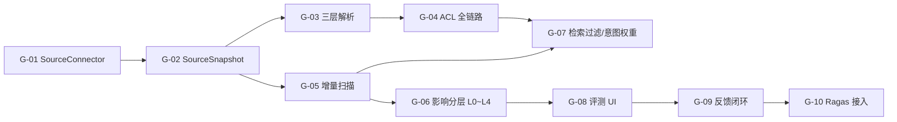

# LegacyGraph 剩余优化项实施方案

> 项目：LegacyGraph
> 文档日期：2026-07-11
> 上游方案：`doc/资料扫描到图谱构建与QA问答全流程升级优化方案.md`
> 上游首期计划：`doc/资料扫描到图谱构建与QA问答可落地实施计划.md`
> 状态：在首期闭环已交付（19/29 项完成）的基础上，补齐剩余 10 项缺口

---

## 1. 实施背景与目标

首期闭环已在以下链路贯通：扫描收口 → GraphRelease 状态机 → 质量门禁 → QA 评测门禁 → 结构化切块 → 需求本体（Requirement/AcceptanceCriterion/Solution 等）→ 需求-图谱链接 → 影响子图 → Solution Planner → Solution Verifier → Solution Controller。

本方案聚焦首期闭环结束后仍然存在的 10 项缺口：

| 编号 | 缺口项 | 影响维度 | 优先级 |
|-----|--------|----------|--------|
| G-01 | 缺少统一的 `SourceConnector` 抽象 | 资料接入 | P0 |
| G-02 | `lg_source_snapshot` 不可变快照缺失/不完整 | 资料追溯 | P0 |
| G-03 | 文档解析未切换到 FAST/LAYOUT/OCR 三层策略 | 解析质量 | P0 |
| G-04 | ACL 贯穿到答案不完整（仅 EvidenceVerifier 一处） | 安全 | P0 |
| G-05 | 增量扫描缺删除/重命名/逻辑重扫原因识别 | 数据新鲜度 | P1 |
| G-06 | 影响分析仅基础抽取，未实现 L0~L4 风险分层 | 影响准确度 | P1 |
| G-07 | QA 检索缺乏意图加权和版本/ACL 过滤链路 | 检索质量 | P1 |
| G-08 | 黄金集与回归门禁跑通，但 UI 与反馈闭环未上线 | 评测闭环 | P1 |
| G-09 | 线上反馈结构化（QaFeedback / SolutionReviewDiff） | 持续学习 | P2 |
| G-10 | Ragas 指标接入（Context Precision/Recall 等） | 评测维度 | P2 |

实施目标：

1. 把"资料解析 → 元数据 → 答案"的 ACL 链路做到真正端到端。
2. 把"扫描增量变更 → GraphRelease → 影响分析"做成立体、有版本意识的流水线。
3. 把"用户反馈 → 评测集/提示词"形成闭环，反哺检索与方案质量。

---

## 2. 总体设计原则

- **复用现有服务**：现有 `ScanArtifactPublisher`、`GraphBuilder`、`EvidenceVerifier`、`HybridRetrievalService`、`SemanticCache` 优先扩展，避免新建并行实现。
- **保持 GraphRelease 为版本边界**：所有新增能力必须以 `GraphRelease.status = PUBLISHED` 作为可读前提。
- **保持权限分层**：所有新增实体必须在 `projectId` 之上同时携带 `aclHash` 或 principals。
- **保持 Job 与 HTTP 分离**：耗时的解析/索引任务走 `task/` 与 `service/`，API 层只做编排。
- **每项都要有可验证验收**：参照首期计划"13 个任务"的 TDD 卡模式，每个任务都附单元/集成测试与回归指标。

---

## 3. 任务清单与依赖



---

## 4. 详细任务设计

### G-01 抽象 `SourceConnector` 接口（P0，3~5d）

**目标**：为五类资料源（代码库、本地文档、远程文档、数据库元数据、运行证据）建立统一接入契约。

**新增文件**：

```
dto/source/SourceDescriptor.java
dto/source/SourceSnapshot.java
dto/source/SourceDelta.java
dto/source/AccessPolicy.java
service/source/SourceConnector.java        # interface
service/source/SourceRegistry.java         # 由 projectId + sourceType 解析 connector
service/source/ScanScopeResolver.java      # 扩展现有 ScanScopeResolver
```

**`SourceConnector` 接口签名**：

```java
public interface SourceConnector {
    List<SourceDescriptor> discover(String projectId);
    SourceSnapshot fetch(SourceDescriptor descriptor, String cursor);
    AccessPolicy getAcl(SourceDescriptor descriptor);
    SourceDelta diff(SourceSnapshot previous, SourceSnapshot current);
    String checkpoint(String sourceId, String cursor);
}
```

**`SourceDescriptor` 关键字段**：

- `sourceType`：`CODE | DOC | DB | RUN | EXTERNAL`
- `projectId / repositoryId / branch / commit`
- `mimeType / language / charset`
- `etag / contentHash / size / modifiedAt`
- `owner / aclUsers / aclGroups / classification`
- `discoveredBy / discoveredAt`

**改造现有类**：

- `ProjectScanner.discoverAllSources()` 改为调用 `SourceRegistry.discover(projectId)`。
- `FileChangeDetector` 实现 `CodeConnector`。
- `DocumentExtractor`/`DocExtractStep` 实现 `DocConnector`。
- `DatabaseMetadataScanService` 实现 `DbConnector`。

**验收**：

- 单元测试：5 类 connector 各 1 个 fixture，校验 discover/fetch/diff 行为。
- 集成测试：`SourceRegistry.discover(projectId)` 返回的描述符合 `lg_code_repo` + `lg_doc` + `lg_db_metadata` 现有数据。
- 旧链路（`ProjectScanner` 直连文件）保留开关可关闭，新链路作为 Feature Flag `legacygraph.source.connector.enabled`。

---

### G-02 不可变 `SourceSnapshot` 父表（P0，2~3d）

**目标**：让扫描开始时为每份资料生成不可变快照，所有后续建图/向量化/QA 都引用同一快照。

**数据库迁移** `V69__source_snapshot.sql`：

```sql
CREATE TABLE lg_source_snapshot (
    id                  VARCHAR(40) PRIMARY KEY,
    project_id          VARCHAR(64) NOT NULL,
    source_type         VARCHAR(20) NOT NULL,
    source_id           VARCHAR(64) NOT NULL,
    source_uri          VARCHAR(512),
    content_hash        VARCHAR(64) NOT NULL,
    parent_snapshot_id  VARCHAR(40),
    scan_version_id     VARCHAR(40),
    mime_type           VARCHAR(64),
    size_bytes          BIGINT,
    acl_hash            VARCHAR(64),
    storage_uri         VARCHAR(512),
    status              VARCHAR(16) NOT NULL,
    created_at          TIMESTAMP NOT NULL DEFAULT CURRENT_TIMESTAMP
);
CREATE INDEX idx_snapshot_project ON lg_source_snapshot(project_id, source_type);
CREATE INDEX idx_snapshot_version ON lg_source_snapshot(scan_version_id);
```

**实体/Repository**：

```
entity/SourceSnapshot.java
repository/SourceSnapshotRepository.java
```

**实现要点**：

- 保留现有 `lg_file_snapshot`，把相同语义字段外键关联到 `lg_source_snapshot.id`（`parent_snapshot_id = lg_source_snapshot.id`）。
- `SourceConnector.fetch()` 写完快照表后再返回 `SourceSnapshot`。
- `ScanArtifactPublisher` 与 `ScanFinalizationService` 接收 `scanVersionId` 时同时按快照记录更新图谱节点的 `sourceSnapshotId`。

**验收**：

- 同一资料不同版本的 `content_hash` 变化时生成新行，`parent_snapshot_id` 指向上一个。
- 任何图节点在 `versions` 视图上能查到对应的快照并定位原文。

---

### G-03 三层文档解析策略（P0，5~7d）

**目标**：把 `DocumentExtractor` + `DocExtractStep` 替换为 FAST / LAYOUT / OCR 三个分层实现，统一输出 `DocumentElement` 流。

**新增/改造**：

```
service/document/DocumentPartitionService.java   # interface
service/document/FastPartitionService.java       # Markdown / TXT / 简单 PDF/DOCX
service/document/LayoutPartitionService.java     # 复杂版面（PDFBox + 标题/表格/坐标）
service/document/OcrFallbackService.java         # Tesseract（可关闭） + OCR 置信度
service/document/DocumentPartitionRouter.java    # 按 mime + 启发式选择档位
service/document/StructureAwareChunkService.java # 已有，按需求增强
```

**档位判定优先级**：

1. `mime=application/pdf` 且文本层 < N 字符 → OCR 兜底（默认关闭，需 Feature Flag）。
2. 包含表格/多列/页眉页脚 → LAYOUT。
3. 其余 → FAST。

**每个元素必须携带**：

- `parseConfidence`（0~1）
- `ocrConfidence`（仅 OCR 时）
- `pageNo / bbox`
- `sourceLocation = "<uri>#<element-id>"`

**取消截断**：移除 `DocExtractStep.readDocContent()` 中"超过 100KB 截断到 50KB"逻辑，改为：

- 流式读取
- 每解析完 1 个 element 立即落库
- 失败分片写入 `lg_parse_failure`（与 V69 同批迁移提供）

**验收**：

- 200KB PDF 的全文与表格都能在 `lg_document_element` 中查到。
- OCR 路径在 `legacygraph.ocr.enabled=false` 时不调用，但资料质量报告里有 `OcrSkippedReason`。

---

### G-04 ACL 端到端贯穿（P0，4~5d）

**目标**：让 `AccessContext`（project + principals + aclHash + graphReleaseId）从 `EnhancedQaController` 一路传到向量检索、图查询、证据组装、回答审计。

**改造**：

- `EnhancedQaAgent.answer()` 新增 `AccessContext ctx` 参数（已部分实现 `dto/qa/AccessContext.java`）。
- `HybridRetrievalService.search()` 接受 `ctx`，在 RRF 前先做 ACL 过滤：
  - `VectorDocument.aclPrincipals` 不空时按 ctx.principals 交集判断。
  - `graphReleaseId` 不匹配时丢弃。
- `GraphQueryService.execute()` 接收 `ctx`，Cypher 中追加 `AND EXISTS {
      MATCH (n)-[:ACCESSIBLE_TO]->(p)
      WHERE p.principal IN $principals
  }`。
- `EvidenceVerifier.checkEvidence()` 已实现 `checkAcl`，新增 `releaseScanVersionId` 必填校验。
- 控制层 `EnhancedQaController` 从 JWT 注入 `principal`，计算 `aclHash` 并下发。

**新增审计**：

```sql
CREATE TABLE lg_qa_audit_log (
    id              VARCHAR(40) PRIMARY KEY,
    project_id      VARCHAR(64),
    graph_release_id VARCHAR(40),
    principal       VARCHAR(64),
    question_hash   VARCHAR(64),
    acl_hash        VARCHAR(64),
    blocked_reason  VARCHAR(64),
    created_at      TIMESTAMP NOT NULL DEFAULT CURRENT_TIMESTAMP
);
```

**验收**：

- 测试用例 A：principal 无权访问的资料在 RRF 前被丢弃，证据数为 0。
- 测试用例 B：缓存命中仍需重新校验 ACL，被拒时记录 `ACL_RECHECK_BLOCKED` 到审计表。
- 测试用例 C：图路径中含敏感节点时整条路径被过滤。

---

### G-05 增量扫描补齐删除/重命名/逻辑重扫（P1，3~4d）

**目标**：让 `FileChangeDetector` 报告三类变更：`ADDED | MODIFIED | DELETED | RENAMED | LOGIC_RESCAN`。

**改造**：

```
service/scan/FileChangeDetector.java        # 增加 RenameDetector
service/scan/FileSnapshotTombstoneService.java # 删除节点/向量失效
```

**实现要点**：

1. 在生成快照时先做 `git diff --name-status`（若可用），再用 `content_hash` 兜底。
2. 删除的文件：`lg_graph_node` 上 `versionId` 等于本次扫描且 `sourcePath` 完全匹配 → `NodeStatus.TOMBSTONED`。
3. 重命名：旧 `sourcePath` 节点到新 `sourcePath` 节点的 `RENAMED_TO` 边，attributes 留 `beforePath / afterPath`。
4. 逻辑重扫：当 `extractorVersion`/`embeddingModel`/`graphOntologyVersion` 发生变化，对应节点类型全部置为 `STALE` 并触发全面重算。
5. `ScanFinalizationService` 在第 6 步产物发布后，跑一次 `FileSnapshotTombstoneService.evict(projectId, scanVersionId)`，把已无最新引用的节点/向量彻底失效。

**验收**：

- 删除测试仓库中的一个文件：`versionId` 切换后该文件的图节点与向量块全部消失。
- 重命名测试仓库中的文件：图节点存在并带有 `RENAMED_TO` 边。
- 修改 `graph_ontology_version`：受影响的节点全部重新出现，旧节点置 `STALE` 并被 tombstone。

---

### G-06 影响分析 L0~L4 分层与风险权重（P1，4~6d）

**目标**：把现在 `ImpactSubgraphService.extract()` 输出升级为按影响层与风险分数排序的列表，支撑 `SolutionVerifier.checkHighRiskCoverage`。

**新增/改造**：

```
dto/requirement/ImpactLevel.java         # L0~L4 枚举
dto/requirement/RiskFactor.java
service/requirement/ImpactSubgraphService.java  # 扩展现有
service/requirement/RiskScorer.java       # 风险分数公式
```

**路径层规则**：

| Layer | 路径 |
|-------|------|
| L0 直接 | ReqItem → Column / ApiEndpoint / Method / Page |
| L1 代码 | Column → SqlStatement → Mapper → Service → Controller → ApiEndpoint |
| L2 交互 | ApiEndpoint → Page / Button / MQConsumer / ExternalSystem |
| L3 质量 | Method / ApiEndpoint → TestCase / Assertion / Monitoring |
| L4 架构 | Package → DEPENDS_ON → 下游 Package |

**风险分数公式**：

```
risk = 关系可信度 × 路径衰减 × 变更类型权重
       × 关键资产权重 × 缺少测试惩罚 × 运行时热度
```

- 关系可信度：来自 evidence 的 confidence；推断边衰减 0.7。
- 路径衰减：`1 / log2(depth + 2)`。
- 变更类型权重：`SchemaChange=1.5`、`ApiContract=1.4`、`InternalOnly=1.0`、`ReadOnly=0.6`。
- 关键资产权重：来自 `lg_asset_hotness`（G-06 副产品）。
- 缺少测试惩罚：`(test_coverage_ratio == 0) ? 1.5 : 1.0`。
- 运行时热度：从访问日志聚合（首期可静态默认值 1.0）。

**验收**：

- 在提供的样本项目上，L0 节点全部命中关键文件/接口；L4 至少能列出全部 1 跳下游包。
- 风险分数对推断边的衰减生效（推断边进入 L0 风险分自动减半）。

---

### G-07 检索加意图权重与版本/ACL 过滤链路（P1，4~5d）

**目标**：让 `HybridRetrievalService.search()` 的多路召回按意图加权、必走 ACL 和版本过滤，再交付 `ReciprocalRankFusionService` 融合。

**改造**：

```
service/qa/HybridRetrievalService.java    # 在 RRF 前插入过滤与加权
service/qa/RetrievalIntentRouter.java     # QueryIntent -> 召回权重
```

**意图权重矩阵（实现常量）**：

| Intent | 关键词 | 向量 | 图节点 | Claim | 项目约定 |
|--------|--------|------|--------|-------|----------|
| REQUIREMENT_UNDERSTANDING | 0.20 | 0.35 | 0.15 | 0.25 | 0.05 |
| CHANGE_IMPACT | 0.30 | 0.20 | 0.25 | 0.10 | 0.15 |
| SOLUTION_DESIGN | 0.15 | 0.20 | 0.20 | 0.15 | 0.30 |
| CODE_EXPLANATION | 0.25 | 0.30 | 0.25 | 0.10 | 0.10 |
| ARCHITECTURE_OVERVIEW | 0.05 | 0.20 | 0.30 | 0.15 | 0.30 |
| DATA_LINEAGE | 0.30 | 0.15 | 0.40 | 0.10 | 0.05 |

**意图 → 召回策略路由**：

- `DATA_LINEAGE` / `CODE_EXPLANATION` 走"种子节点 + 受控图扩展"，不进入向量召回。
- `ARCHITECTURE_OVERVIEW` 走"社区摘要 + 关键节点"。
- 其余默认走多路 + RRF。

**过滤前置**（在 RRF 之前）：

```java
List<VectorDocument> filtered = rawResults.stream()
    .filter(d -> aclPass(d.aclPrincipals(), ctx.principals()))
    .filter(d -> versionMatch(d.graphReleaseId(), ctx.graphReleaseId()))
    .toList();
```

**验收**：

- `DATA_LINEAGE` 题型在 `Intent=CODE_EXPLANATION` 排行榜中不受语义相似度高的"项目概述"压制。
- 无权访问的资料在 RRF 前被丢，证据集不含敏感数据。

---

### G-08 评测 UI 与反馈按钮（P1，3~4d）

**目标**：在前端提供评测集管理、扫描前/后指标查看、答案反馈按钮，把"评测数据 → UI 修改 → 后端 QaFeedback"串起来。

**新增**：

```
frontend/src/views/QaEvaluationView.vue     # 评测列表
frontend/src/views/QaCaseDetailView.vue
frontend/src/components/AnswerFeedback.vue # 点赞 / 标记错证据
backend/src/main/java/io/github/legacygraph/controller/QaEvaluationController.java
backend/src/main/java/io/github/legacygraph/controller/QaFeedbackController.java
```

**接口**：

- `GET /lg/projects/{projectId}/qa/cases?status=SMOKE|REGRESSION|...`
- `POST /lg/qa/feedback`：`{question, answerId, claimText, feedbackType, expectedEvidenceIds[]}`
- `GET /lg/qa/eval-runs?projectId=&versionId=` 返回历史 run。

**验收**：

- 评测用例 CRUD 全部走 UI。
- 反馈按钮点击后 `lg_qa_feedback` 表新增记录，并按反馈类型聚合到仪表盘。

---

### G-09 QaFeedback / SolutionReviewDiff 持久化（P2，3~4d）

**目标**：把"哪条结论错、影响节点漏、证据无关、最终方案差异"沉淀到数据库，反哺提示词与评测集。

**数据库迁移** `V70__qa_feedback.sql`：

```sql
CREATE TABLE lg_qa_feedback (
    id                  VARCHAR(40) PRIMARY KEY,
    project_id          VARCHAR(64),
    graph_release_id    VARCHAR(40),
    question_hash       VARCHAR(64),
    claim_text          TEXT,
    feedback_type       VARCHAR(20), -- INCORRECT | MISSING_IMPACT | IRRELEVANT_EVIDENCE | ...
    expected_evidence   JSONB,
    principal           VARCHAR(64),
    created_at          TIMESTAMP NOT NULL DEFAULT CURRENT_TIMESTAMP
);

CREATE TABLE lg_solution_review_diff (
    id                  VARCHAR(40) PRIMARY KEY,
    solution_id         VARCHAR(40),
    reviewer            VARCHAR(64),
    step_index          INTEGER,
    diff_type           VARCHAR(20), -- ADDED | REMOVED | MODIFIED
    before_summary      TEXT,
    after_summary       TEXT,
    created_at          TIMESTAMP NOT NULL DEFAULT CURRENT_TIMESTAMP
);
```

**新增/改造**：

```
entity/QaFeedback.java
entity/SolutionReviewDiff.java
repository/QaFeedbackRepository.java
repository/SolutionReviewDiffRepository.java
service/evaluation/QaFeedbackIngestService.java
```

**反哺路径**：

- 错误反馈 → 进入 `QaTestCase` 候选（待审核）+ `RetrievalIntentRouter` 权重微调（按主题）。
- `SolutionReviewDiff` → `SolutionPlanner` 提示词历史差异对照样本。

**验收**：

- 反馈在 24h 内进入评测集候选池。
- 提示词构建器能取到最近 5 条同类方案的人工修订。

---

### G-10 Ragas 指标接入（P2，5~7d）

**目标**：在 `DefaultQaEvaluationService` 之上扩展 `RagasMetricsService`，覆盖 Context Precision / Recall、Faithfulness、Answer Relevancy，不替代确定性校验。

**新增**：

```
service/evaluation/RagasMetricsService.java
dto/evaluation/RagasReport.java
```

**实现要点**：

- Context Precision/Recall：基于 `expectedEntities + expectedKeywords` + 检索证据集合的并集差集，与 Ragas 算法一致。
- Faithfulness：抽取 answer 中对 retrievedContexts 的"蕴含 span"，未蕴含部分扣分。
- Answer Relevancy：用反向问题 + 同义改写查询问 answer 是否相关（轻量实现，可调 LLM）。
- 所有 Ragas 指标**不**作为门禁，但记录在 `qa-evaluation-{versionId}.json` 中作为辅助对比。

**验收**：

- 单一 `QaTestCase` 的 Ragas 报告在评测报告 JSON 中可见。
- 前后两次扫描的 Faithfulness 差异可视化。

---

## 5. 阶段化发布计划

### 阶段 6：资料接入与 ACL 贯穿（P0，2~3 周）

| 任务 | 工作量 | 依赖 |
|------|--------|------|
| G-01 SourceConnector 抽象 | 3~5d | 无 |
| G-02 SourceSnapshot 父表 | 2~3d | G-01 |
| G-03 三层解析策略 | 5~7d | G-02 |
| G-04 ACL 端到端贯穿 | 4~5d | G-01 |

**里程碑 M7 — 资料可信接入**：扫描器走 SourceConnector，文档分层解析并保留 sourceLocation，ACL 在 QA 全程生效。

### 阶段 7：增量与影响提升（P1，2~3 周）

| 任务 | 工作量 | 依赖 |
|------|--------|------|
| G-05 增量扫描补齐 | 3~4d | G-02 |
| G-06 影响分层与风险权重 | 4~6d | G-05 |
| G-07 检索意图权重 | 4~5d | G-04 |

**里程碑 M8 — 影响可信分层**：变更影响按 L0~L4 分层并附风险分数，QA 检索按意图路由。

### 阶段 8：评测与反馈闭环（P1+P2，3~4 周）

| 任务 | 工作量 | 依赖 |
|------|--------|------|
| G-08 评测 UI + 反馈按钮 | 3~4d | G-04 |
| G-09 QaFeedback 持久化 | 3~4d | G-08 |
| G-10 Ragas 指标接入 | 5~7d | G-08 |

**里程碑 M9 — 持续改进闭环**：评测用例可视化管理、反馈沉淀、Ragas 报告辅助对比。

---

## 6. 风险与控制

| 风险 | 影响 | 控制措施 |
|------|------|----------|
| SourceConnector 接入破坏了 `ProjectScanner` 既有性能 | 扫描时延大幅增加 | 保留旧路径 Feature Flag；新旧链路同时跑 1 周对比 |
| ACL 链路扩展影响缓存命中率 | 缓存命中率下降 | 缓存键显式包含 aclHash；同 aclHash 仍可命中 |
| 影响分层需要 Cypher 查询改造 | 路径延迟上升 | 给 L0/L1 加 Neo4j 索引；超过 100ms 的查询降级回退 |
| 反馈数据写爆 lg_qa_feedback | 存储增长 | 加 90 天 TTL；按主题分桶归档 |
| Ragas 指标实现引入额外 LLM 调用 | 评测成本上升 | 仅对 SMOKE 用例跑；其它场景使用确定性近似 |

---

## 7. 验收与回归策略

每完成一个 G 任务，必须满足：

1. **单元测试**：涉及的方法覆盖率 ≥ 80%。
2. **集成测试**：`mvn -pl backend test -Dtest=*IntegrationTest` 全绿。
3. **回归评测**：跑 `QaTestCase` 中 status=SMOKE 的全部用例，QA gate 不退化。
4. **图谱可达性**：受影响文件/接口的可达率不下降（L0 召回率优先）。
5. **文档同步**：每个 G 任务交付时更新对应 API 文档与 `doc/资料扫描到图谱构建与QA问答全流程升级优化方案.md` 中的状态行。

---

## 8. 不在本期范围

为避免范围蔓延，以下能力明确不在 G-01~G-10 内：

- Jira、Wiki、IM、邮件连接器。
- 多模态模型替换现有的版面识别。
- 自动 Patch / 自动 PR / 自动代码改动。
- GNN 链路预测 + 无监督实体合并。
- LLM 直接放行资金、权限、删除、破坏性迁移。

以上能力在 `doc/资料扫描到图谱构建与QA问答全流程升级优化方案.md` 第 14 节已列入"明确不进入首期"，本方案沿用同一边界。

---

## 9. 任务优先级总览

| 优先级 | 任务 | 估值工作日 | 阶段 |
|--------|------|------------|------|
| P0 | G-01 SourceConnector | 3~5d | 阶段 6 |
| P0 | G-02 SourceSnapshot | 2~3d | 阶段 6 |
| P0 | G-03 三层解析 | 5~7d | 阶段 6 |
| P0 | G-04 ACL 端到端 | 4~5d | 阶段 6 |
| P1 | G-05 增量扫描补齐 | 3~4d | 阶段 7 |
| P1 | G-06 影响分层 | 4~6d | 阶段 7 |
| P1 | G-07 检索意图权重 | 4~5d | 阶段 7 |
| P1 | G-08 评测 UI | 3~4d | 阶段 8 |
| P2 | G-09 反馈闭环 | 3~4d | 阶段 8 |
| P2 | G-10 Ragas 接入 | 5~7d | 阶段 8 |

合计约 36~50 个工作日（约 7~10 周）。

---

## 10. 与首期可落地计划的关系

| 首期计划任务 | 当前状态 | 本方案任务衔接 |
|--------------|----------|----------------|
| T1~T3 (GraphRelease + 收口) | ✅ 已交付 | 被 G-02/03/05 在收口链路中复用 |
| T4~T5 (DocumentElement + 无截断) | 🟡 模型已建 | G-03 补齐分层解析器；G-02 补齐快照底座 |
| T6~T7 (需求图 + 影响) | ✅ 已交付 | G-06 把影响分析升级为分层 |
| T8~T9 (RRF + 访问过滤 + 缓存) | 🟡 部分 | G-04/07 完成 ACL + 意图权重全链路 |
| T10 (Solution Package) | ✅ 已交付 | 无新增 |
| T11~T13 (评测 + 前端评审 + 试点) | 🟡 后端完成 | G-08~10 补齐 UI/反馈/指标 |

本方案可视为"首期闭环之后的 2.0 阶段"：在不推翻既有 GraphRelease / 评测门禁的基础上，把资料接入、ACL、影响分析、检索反馈闭环推到稳定可用的水平。
