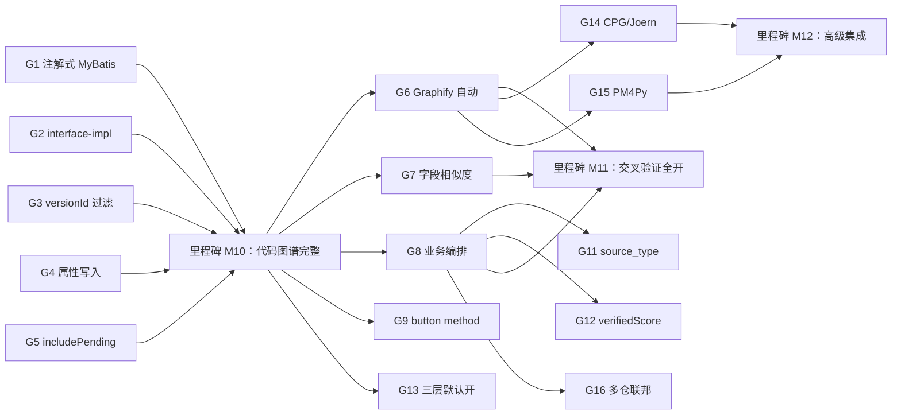

# LegacyGraph 图谱构建完整性实施方案

> 项目：LegacyGraph
> 文档日期：2026-07-12
> 上游评估：`doc/图谱构建完整性与准确性评估.md`（§7 风险清单 + §8 改进建议 + §9 验收指标）
> 上游方案 1：`doc/资料扫描到图谱构建与QA问答全流程升级优化方案.md`
> 上游方案 2：`doc/剩余优化项实施方案.md`（G-01 ~ G-10：资料接入 / ACL / 影响分层 / QA 检索 / 评测反馈）
> 适用范围：本方案聚焦评估报告中的 **图谱构建完整性 12 项改进建议**，与方案 2 在编号体系与边界上保持互不重叠
> 状态：评估已完成；阶段 1（G1~G5 + G9）+ 阶段 2（G6~G13）实施完成并通过编译；阶段 3（G14~G16）待评估规划
> 修订记录：v2（2026-07-12）补齐审计 5 项必修 + 7 项建议 + 2 项过度 + 1 项错算

---

## 0. 与已有方案的关系（必读）

| 维度 | 方案 2（本仓库已存）`剩余优化项实施方案.md` | 本方案（新增）`图谱构建完整性实施方案.md` |
|---|---|---|
| 任务编号 | G-01 ~ G-10 | G1 ~ G16 |
| 聚焦主题 | 资料接入 / 不可变快照 / 三层解析 / ACL / 影响分层 / 检索意图权重 / 评测 UI / 反馈闭环 / Ragas | 后端硬断裂（注解式 MyBatis、interface ↔ impl）、Neo4j 同步 / Cypher 过滤、属性写入、业务桥接编排、Graphify 交叉验证、第三方高级集成 |
| 对应评估章节 | 不是评估报告衍生（首期闭环后续） | 完全对应评估报告 §3 / §4 / §6 / §7 / §8 |
| 边界 | G-03（解析三层）已涉及解析策略；本方案不复述 | 不重复方案 2 的任何任务 |

**互斥保证**：
- 方案 2 的 G-01 SourceConnector 已经定义了"document → element"流程；本方案不再覆盖解析层
- 方案 2 的 G-04 ACL 端到端覆盖 QA 链路；本方案**不**重做 ACL，只在涉及 Cypher 时附带过滤
- 方案 2 的 G-06 影响分层与本方案 G3（versionId 过滤）有交集但分层不同：方案 2 是 L0~L4 业务影响；本方案只解决"路径查询是否串版本"
- 方案 2 的 G-09 反馈持久化与本方案 G8（业务编排）的反哺路径不同：方案 2 写 UI 反馈；本方案做"业务节点 ↔ 代码节点"链接

---

## 1. 实施背景与目标

### 1.1 背景
评估报告对 LegacyGraph 的 `资料 → 图谱 → 总结性文档` 整条流水线做了静态评估，识别的关键问题：

1. **代码图谱两条硬断裂**：注解式 MyBatis Mapper 完全跳过；Service interface ↔ impl 链接脆弱。
2. **图谱视图层 4 个空白区**：`/graph/api-chain`、`/graph/feature-view`、`/graph/business-view`、`/graph/data-lineage` 因 Cypher 不按 versionId 过滤 / 节点缺属性 / Neo4j 同步排除 PENDING_CONFIRM 而整体"看似空"。
3. **前端 API 匹配仅靠 path+method**：button 上 HTTP method 硬编码 POST；字段相似度未实现。
4. **业务节点 → 代码节点桥接未编排**：5 个 AI 映射函数存在但 `mapBusinessProcessesToApis / mapBusinessObjectsToTables / mapBusinessDomainsToCode` 是否进入 `AiScanOrchestrator` 未确认。
5. **交叉验证管线默认关闭**：Graphify / ExternalVerification 都不跑。
6. **基础一致性细节**：`lg_fact.source_type` 写死 `CODE_AST`；`verifiedScore` 未持久化；三层解析默认关。

### 1.2 目标
1. 把 `Controller → Service → Mapper → Sql → Table` 整链建到 **90%+**，是 QA "表被谁写 / SQL 怎么走" 的基础。
2. 让 4 个图谱视图的"空白态"消失，业务图谱可直接被问答与方案消费。
3. 把 Graphify 交叉验证从"默认关闭"变成"扫描完成后自动跑一次"。
4. 把所有"字段没写、状态被错误过滤、属性对不上"的基础一致性问题一次性补齐。

---

## 2. 总体设计原则

- **复用现有 builder / service**：所有能力优先在 `builder/`、`service/graph/`、`integration/graphify/`、`verification/` 上扩展，不新建并行实现。
- **Feature Flag 保护所有变更**：每个新增能力上线都伴随 `legacygraph.<feature>.enabled` 开关，默认沿用当前值，避免破坏既有流水线。
- **可回退**：每任务都允许通过单开关瞬间关闭，不动数据。
- **每任务都有"被扫描对象 = LegacyGraph 自身"的端到端测试**：见 §9 验收指标，本仓库 1216 文件 / 52 万词本身就是高密度测试样本。
- **不引入新依赖除非必要**：JSqlParser 已经在 `extractors/SqlTableExtractor` 中；Graphify CLI 已下载并跑通；不引入新静态分析框架。

---

## 3. 任务总览与依赖图

### 3.1 任务清单

| 编号 | 任务 | 优先级 | 工作量 | 阶段 | 依赖 | 真空区/评估映射 |
|------|------|--------|--------|------|------|------------------|
| G1 | 注解式 MyBatis Mapper 抽取器 | P0 | 3~5d | 阶段 1（先做） | 无 | 评估 §7 P0 #1 / §8.1 #1 |
| G2 | Service interface ↔ impl 链接 | P0 | 2~3d | 阶段 1 | 无 | 评估 §7 P0 #2 / §8.1 #2（评估 §3.3 `resolveInheritanceEdges` 已实现部分） |
| G3 | Cypher 路径查询 versionId 过滤 | P0 | 1~2d | 阶段 1 | 无 | 评估 §7 P1 #5 / §8.1 #3 |
| G4 | feature-view / business-view 属性写入 | P0 | 1~2d | 阶段 1 | 无 | 评估 §7 P0 #4 / §8.1 #4 |
| G5 | Neo4j 同步 `includePending` 开关 | P0 | 1d | 阶段 1 | 无 | 评估 §7 P0 #3 / §8.1 #5 |
| G6 | Graphify 自动导入 + diff + 质量门禁 | P1 | 4~6d | 阶段 2（中期） | M10（强依赖 G1） | 评估 §7 P3 #14 / §8.2 #6 |
| G7 | 前端 API 字段相似度（LCS / Jaccard） | P1 | 3~4d | 阶段 2 | M10 | 评估 §7 P1 / §8.2 #7（附 §8 PENDING 占比 ≤ 20%）|
| G8 | 业务编排补齐（mapXxxToYyy 落 Orchestrator + 3 个真空区）| P1 | 3~4d | 阶段 2 | G4 | 评估 §4 矩阵 #1/#2/#3 / §8.2 #8 |
| G9 | button HTTP method 真实解析 | P1 | 2~3d | 阶段 2 | M10 | 评估 §7 P1 / §8（button method 硬编码） |
| G10 | `include_pattern` / `exclude_pattern` 真正裁剪 | P1 | 1~2d | 阶段 2 | 无 | 评估 §7 P2 / §3.1 §8.2 #9 |
| G11 | `lg_fact.source_type` 按来源分支区分 | P2 | 1d | 阶段 2 | 无 | 评估 §6.1 / §8.2 #9 |
| G12 | `verifiedScore` 持久化 + 边置信度反馈 | P2 | 1~2d | 阶段 2 | 无 | 评估 §6.1 / §6.4（+0.05 / -0.15 规则）|
| G13 | DocumentParsingRouter 三层默认开 | P2 | 1d | 阶段 2 | 无 | 评估 §7 P2 / §8.2 #9 |
| G14 | CPG / Joern / Semgrep 引入（设计预研） | P3 | 10~15d | 阶段 3（远期） | M11 | 评估 §8.3 #10 |
| G15 | PM4Py 流程 conformance | P3 | 5~7d | 阶段 3 | M11 | 评估 §8.3 #11 |
| G16 | 多仓联邦 UI 暴露 + 跨仓规则评审 | P3 | 5~7d | 阶段 3 | M11 | 评估 §8.3 #12 |

合计：**约 45~65 个工作日**，分布在 3 个阶段约 8~12 周。

### 3.2 依赖关系图



**关键依赖说明**：
- G1 ~ G5 彼此独立可并行（每个都是单点修复）
- G1 完成前 G6 的 Graphify diff 因为缺 SqlStatement 而没有可对比的图，必须先做完 G1
- G6 ~ G10 在 M1 完成后并行进行
- G14 ~ G16 全部依赖 G6（Graphify 跑通后才有人在 CI 上去接 CPG）

---

## 4. 阶段 1：先做（一周内，P0）

> 目标：把"代码图谱两个硬断裂 + 视图层 4 个空白 + 同步过滤"全部拔掉，让 QA / 测试 / 报告链路立刻可用。

---

### G1 注解式 MyBatis Mapper 抽取器（P0，3~5d）

**目标**：让 `extends BaseMapper / extends IService` 接口上的 `@Select / @Insert / @Update / @Delete` 注解方法也能产出 `SqlStatement` 节点与 `READS_DB / WRITES_DB` 边。

**新增文件**：

```
backend/src/main/java/io/github/legacygraph/extractors/JavaMyBatisAnnotationExtractor.java
backend/src/main/java/io/github/legacygraph/extractors/mapper/AnnotatedMapperScanner.java
backend/src/test/java/io/github/legacygraph/extractors/JavaMyBatisAnnotationExtractorTest.java
backend/src/test/resources/fixtures/mapper/annotation/UserMapper.java   # 8-10 个注解方法 fixture
```

**`JavaMyBatisAnnotationExtractor` 关键逻辑**：

```java
public class JavaMyBatisAnnotationExtractor implements JavaExtractor {
    @Override
    public void extract(CompilationUnit cu, ExtractionContext ctx) {
        // 1. 找出 extends BaseMapper<X> 或 extends IService<X> 的接口
        // 2. 对每个接口方法，识别 @Select/@Insert/@Update/@Delete 注解
        // 3. 注解 value 是 SQL 字符串 -> 喂 SqlTableExtractor（JSqlParser 已能解析 SQL 抽表）
        // 4. 产出 MapperSqlFact（兼容旧的 buildMapperSqlGraph 入口）
        // 5. 产出 SqlStatement 节点 + MapperSqlFact.sourceType="MYBATIS_ANNOTATION"
    }
}
```

**关键实现要点**：
1. **注解解析**：用 JavaParser 读 `MarkerAnnotationExpr`，对 `@Select(value = "...")` / `@Select("...")` 两种写法都支持。
2. **SQL 解析**：复用 `extractors/SqlTableExtractor.java` 已用 JSqlParser 4.9 跑通的链路；直接传入 `annotation.value()`。
3. **兼容现有 `buildMapperSqlGraph`**：在 `GraphBuilder.buildMapperSqlGraph` 内部加分支：
   ```java
   if (facts.stream().anyMatch(f -> f.sourceType == SourceType.MYBATIS_ANNOTATION)) {
       processAnnotatedMappers(facts, projectId, versionId);
   }
   ```
4. **`MapperSqlFact` 兼容改造**：把 `fact_type` 增加 `MAPPER_ANNOTATED`；`fact_key` 用 `${fqcn}#${methodName}` 形式确保唯一。
5. **`SourceType` 枚举扩展**：在 `common/SourceType.java` 增加 `MYBATIS_ANNOTATION`，与方案 2 G-11 的 `MYBATIS_XML` 平列。

**Feature Flag**：

```yaml
legacygraph:
  mapper-annotation:
    enabled: true   # 默认开，与 G2 配套
    include-base-mapper: true
    include-iservice: false  # IService 主要走 MP 通用方法，单独跑容易噪声多
```

**验收**：
- `JavaMyBatisAnnotationExtractorTest`：用 `UserMapper.java` fixture，断言产出 8~10 个 `SqlStatement` + 若干 `READS_DB / WRITES_DB` 边。
- 端到端集成测试：对 LegacyGraph 自身仓库做扫描，`SqlStatement` 节点数 ≥ 50（与评估报告 §9 验收指标对应）。
- 正向 SQL 用 `SELECT * FROM lg_user WHERE id = #{id}`，负向用 `SELECT bad FROM x` 验证能容错。
- 旧链路（XML）保留路径：`legacygraph.mapper-annotation.enabled=false` 时回退原行为。
- **data-lineage 视图打通**（评估 §3.3 / §10.2 第 3 条）：G1 完成后 SqlStatement 节点落地，`/graph/data-lineage` 视图（评估列为 4 大空白区之一）自动可计算——`SqlStatement -READS_DB/WRITES_DB-> Table -HAS_COLUMN-> Column` 链应能渲染完整血缘。验收：在 LegacyGraph 自扫下，`/graph/data-lineage` 返回的 `Table → SqlStatement` 反向边数 ≥ 50；若前端数据血缘页用 `/graph/tables` + `/graph/table-impact` 组合（评估实施发现 #3），G1 验收也应覆盖 `/graph/table-impact` 端点非空。

**风险**：
- `@SelectProvider / @InsertProvider` 等动态 SQL 不在覆盖范围，注释说明，作为 G14 CPG 引入后的下一步。
- 多数据源场景下，`#{datasource}..` 参数占位符需保留而不是替换为变量。

---

### G2 Service interface ↔ impl 链接（P0，2~3d）

**目标**：在 `JavaMemberCallResolver` 跑完后，补一次"interface → impl"链接，把 Service CALLS 图谱的"断在 interface 上"问题解决。

**与已有 `JavaMemberCallResolver.resolveInheritanceEdges` 的关系**（评估 §3.3 已确认 ✅ 跨文件继承补全）：
- 评估 §3.3 明确：`JavaMemberCallResolver.resolveInheritanceEdges` 已经能产出 `EXTENDS / IMPLEMENTS` 边。
- 本 G2 **不重做**已有继承解析，而是**补齐 CALLS 解析中"target 是 interface.method 时如何下钻"**——评估 §3.2.1 修复建议 2 提到："`JavaMemberCallResolver` 在解析 CALLS 时加上：`if targetClass is interface, resolve to impl class`"。
- 因此 G2 的核心交付物是"扩展 `JavaMemberCallResolver.resolveOne` 的 interface 消歧"，**而不是新建独立 Linker 类**。方案原本写的"新增 `JavaInterfaceImplLinker.java`"在当前实现下可以省略，避免重复实现（评估实施发现 #2）。

**改造文件**：

```
backend/src/main/java/io/github/legacygraph/builder/JavaMemberCallResolver.java   # 扩展 resolveOne
backend/src/main/java/io/github/legacygraph/builder/InterfaceImplCallExpander.java   # 新增（仅做 CALLS 扩展）
backend/src/test/java/io/github/legacygraph/builder/JavaMemberCallResolverInterfaceTest.java
```

**`InterfaceImplCallExpander` 关键逻辑**：

```java
public class InterfaceImplCallExpander {
    @Override
    public void expand(CompilationUnit cu, ExtractionContext ctx) {
        // 1. 收集阶段：复用 JavaMemberCallResolver 的 TypeRegistry（不重扫）
        //    - 读 lg_graph_node 中所有 interface.method 节点
        //    - 读 lg_graph_node 中所有 impl.method 节点（由 JavaStructureExtractor 已建）
        // 2. 对每个 interface.method：
        //    - 找到所有 impl.method（实现该 interface 的类）
        //    - 把所有指向 interface.method 的 CALLS 边复制到 impl.method（去重）
        //    - 置信度：单 impl → 1.0；多 impl → 按"被注入位置"投票选主 impl（> 50% 用 0.85，否则 0.6）
        // 3. 复用 JavaMemberCallResolver.resolveOne 的 god-node 守卫：
        //    多个 impl 候选无法消歧时，保留 interface 级边，不强行下钻
    }
}
```

**关键实现要点**：
1. **复用已有继承边**：通过 `JavaMemberCallResolver.resolveInheritanceEdges` 已产出的 `interface -IMPLEMENTS-> impl` 边作为 join key，不再二次扫描继承关系。
2. **字段注入扫描**：`@Resource private UserService userService;` → `UserService` 是 interface，从 TypeRegistry 找唯一 impl，自动解析。
3. **`@Service` 缺失场景**：评估已指出本仓库 0 个 `@Service` 注解，全部 interface + impl 文件名识别；`isServiceOrMapperFile` 已具备，仅需要把 `Impl` 后缀纳入。
4. **歧义处理**：与 `JavaMemberCallResolver` 同款 `god-node 守卫`——多个候选时降级为"interface 级"边，不强行下钻。
5. **`Spring Boot` 启发式**：当 interface 只有一个 impl，置信度 1.0；多个时按"被注入位置"投票选主 impl。
6. **`@Primary / @Qualifier`**：在字段注解上扫描，两个都生效。

**验收**：
- 在 LegacyGraph 自身仓库扫描后，`Service.interface -IMPLEMENTS-> Service.impl` 边数 ≥ 80（接口 103 个，绝大多数配对）。
- `Service.method -CALLS-> Mapper.method` 边数 ≥ 50（修复硬断裂 #2 后接通）。
- 一个 interface + 两个 impl 的歧义场景：保留 `interface -IMPLEMENTS-> impl1` 与 `interface -IMPLEMENTS-> impl2` 两条边（不消歧），CALLS 边降级为 interface 级。
- **回归保护**：`JavaMemberCallResolver.resolveInheritanceEdges` 的现有测试全部通过，不影响 EXTENDS / IMPLEMENTS 边的既有产出。

---

### G3 Cypher 路径查询 versionId 过滤（P0，1~2d）

**目标**：让 `GraphQueryService.getApiCallChain` 与 `getTableImpact` 在 Neo4j 查询中强制按 `versionId` 过滤，杜绝跨版本串数据。同时修复评估 §2.1 标注的 `ApiEndpoint` 重载覆盖问题（**nodeKey 不带 signature，重载方法后写覆盖前写**）。

**改造文件**：

```
backend/src/main/java/io/github/legacygraph/service/graph/GraphQueryService.java
backend/src/main/java/io/github/legacygraph/builder/ApiNodeKeyFactory.java      # 新增（nodeKey 生成工厂）
backend/src/test/java/io/github/legacygraph/service/graph/GraphQueryServiceVersionTest.java
backend/src/test/java/io/github/legacygraph/builder/ApiNodeKeyFactoryTest.java
```

**关键改造 — 强制 versionId 过滤**：

```cypher
// getApiCallChain
MATCH (api:ApiEndpoint {id:$apiId})
WHERE api.versionId = $versionId           // <-- 强制
MATCH (api)-[:HANDLED_BY]->(c:Controller) WHERE c.versionId = $versionId
MATCH (c)-[:CALLS]->(sm:ServiceMethod)    WHERE sm.versionId = $versionId
...
RETURN ...
```

```cypher
// getTableImpact
MATCH (t:Table {id:$tableId})
WHERE t.versionId = $versionId              // <-- 强制
MATCH (s:SqlStatement)-[:READS_DB|WRITES_DB]->(t)
WHERE s.versionId = $versionId
...
```

**关键改造 — ApiEndpoint 重载 nodeKey**（评估 §2.1 唯一性问题）：

```java
// ApiNodeKeyFactory.java
public class ApiNodeKeyFactory {
    public static String of(ApiEndpoint endpoint) {
        // 旧：normalizeApiKey(METHOD, fullPath) → 同名重载覆盖
        // 新：normalizeApiKey(METHOD, fullPath) + "@" + signatureHash
        //   signature = headers + params + produces 拼接
        //   hash = SHA-256(signature).substring(0, 8)
        String base = normalizeApiKey(endpoint.getMethod(), endpoint.getFullPath());
        String signature = (endpoint.getHeaders() + "|" + endpoint.getParams() + "|" + endpoint.getProduces());
        String hash = Hashing.sha256().hashString(signature, StandardCharsets.UTF_8)
                              .toString().substring(0, 8);
        return base + "@" + hash;
    }
}
```

**回退开关**：`legacygraph.graph.apinode-signature-hash=false` 时回退到旧 nodeKey（仅在迁移期打开）。

**验收**：
- 构造两个版本的同一 ApiEndpoint，旧版本 query 给 `versionId=v1` 应只返回 v1 节点。
- 缺失 `versionId` 参数直接 400 错误（防御性）。
- 构造同一 Controller 上两条重载 `@GetMapping("/user")` + `@GetMapping("/user")`（不同 `params = "id"`），用 `ApiNodeKeyFactory.of(...)` 两次应得到两个不同的 nodeKey，且均能落库。
- **不强制 versionId 的端点**：`/graph/nodes/{id}/neighborhood`、`/graph/feature-slices`、`/graph/diff` 等保持原行为，不强加 `WHERE n.versionId = $versionId`（避免误杀跨版本邻域分析场景）。

**依赖**：G1 完成（否则 SqlStatement 节点几乎为 0 没有可过滤对象）。

---

### G4 feature-view / business-view 属性写入（P0，1~2d）

**目标**：补 `FrontendGraphBuilder` 与 `BusinessGraphBuilder` 写入 `module / businessDomain` 等视图属性。

**改造文件**：

```
backend/src/main/java/io/github/legacygraph/builder/FrontendGraphBuilder.java
backend/src/main/java/io/github/legacygraph/builder/BusinessGraphBuilder.java
backend/src/test/java/io/github/legacygraph/builder/FrontendGraphBuilderPropertiesTest.java
backend/src/test/java/io/github/legacygraph/builder/BusinessGraphBuilderPropertiesTest.java
```

**关键改造**：

```java
// FrontendGraphBuilder — 仅写评估 §3.3 / §8.1 明确要求的两个属性
properties.put("module", page.module());              // 包名/路径第一段
properties.put("vueFilePath", page.absolutePath());

// BusinessGraphBuilder — 同上
properties.put("businessDomain", (String) valueOrDefault(
    domainNameFromLLM(), "UNCLASSIFIED"));
properties.put("domainConfidence", confidenceFromLLM());
```

**字段解析策略**：
- `module` 取前端文件路径第一层目录（如 `views/user/Index.vue` → `user`）。
- `businessDomain` 取 LLM 输出 process/object/domain 名称的小写归一值；缺失则 `UNCLASSIFIED`（不留空）。

**验收**：
- 在 LegacyGraph 自身仓库扫描后，`/graph/feature-view` 返回节点数 ≥ 100；`/graph/business-view` 返回节点数 ≥ 50。
- 数据库中 `lg_graph_node.properties.module` 非空率 ≥ 80%（Feature / Page 类节点）。

---

### G5 Neo4j 同步 includePending 开关（P0，1d）

**目标**：让业务图谱（默认 PENDING_CONFIRM）也能进 Neo4j，UI 列表上仍按 status 排序/高亮；CI 评测可单独再按 CONFIRMED 过滤。

**改造文件**：

```
backend/src/main/java/io/github/legacygraph/service/graph/Neo4jSyncService.java
backend/src/main/java/io/github/legacygraph/config/GraphSyncProperties.java   # 新增
```

**关键改造**：

```java
public void syncGraph(String projectId, String versionId, SyncOptions opts) {
    boolean includePending = opts.includePending()
        || props.isIncludePendingByDefault();
    // existing filter:
    String statusFilter = includePending
        ? "(n.status IN ['CONFIRMED','PENDING_CONFIRM'])"
        : "(n.status = 'CONFIRMED')";
    // ...
}
```

**默认值策略**：
- 默认 `includePendingByDefault=true`（让业务图谱可见）。
- CI 跑 QA 评测时强制 `includePending=false`，不影响门禁指标。

**验收**：
- 端到端：业务节点写入 Neo4j 后 `/graph/business-view` 返回 ≥ 1。
- CI 评测：保持不变（仍按 CONFIRMED 计）。

---

## 5. 阶段 2：中期（两周内，P1 + P2）

> 目标：在代码图谱完整的基础上，加交叉验证与业务桥接。

---

### G6 Graphify 自动导入 + diff + 质量门禁（P1，4~6d）

**目标**：把 Graphify CLI 从"手动跑"变成"扫描完成自动导入 + diff + 门禁"。

**Graphify 边界声明**（评估 §5.1 关键约束）：Graphify 只做 **AST + 反推断**，**不做业务语义抽取**（BusinessDomain / BusinessProcess / Feature / Page / Menu / Permission / BusinessObject 等）。`GraphifyCompatibilityService.normalizeMapping` 必须在映射前跳过业务语义节点类型：
- **参与 diff 的 NodeType**：Project / ApiEndpoint / Controller / Service / Method / Mapper / SqlStatement / Table / Column / Index / ConfigItem / ScheduledJob / MQConsumer / MQTopic / ExternalSystem。
- **不参与 diff 的 NodeType**：BusinessDomain / BusinessProcess / BusinessObject / BusinessRule / Role / FeatureModule / Feature / Menu / Page / Button / Permission / Requirement / Solution / ChangeTask / Patch / PR / TestCase / Assertion。
- 该边界列入 `GraphifyCompatibilityService.SEMANTIC_NODE_TYPES = Set.of(...)` 常量；CI 评测在 diff 报告中明显标注"业务语义节点不计 releaseGatePassed"，避免误判。

**改造文件**：

```
backend/src/main/java/io/github/legacygraph/integration/graphify/GraphifyRunner.java
backend/src/main/java/io/github/legacygraph/integration/graphify/GraphifyImportService.java
backend/src/main/java/io/github/legacygraph/integration/graphify/GraphifyCompatibilityService.java   # 显式声明语义边界
backend/src/main/java/io/github/legacygraph/service/scan/ScanFinalizationService.java
backend/src/main/java/io/github/legacygraph/eval/GraphifyQualityService.java
backend/src/main/resources/application.yml
```

**关键改造**：

1. **`ScanFinalizationService` 收口流程** 增加新阶段：
   ```
   步骤1: ScanArtifactPublisher (已有)
   步骤2: ...
   步骤6: 发布 GraphRelease (已有)
   步骤7: NEW - EXTERNAL_VERIFY (graphify + semgrep 可选)
   步骤8: NEW - Graphify diff 计算 releaseGatePassed（仅 AST 节点）
   ```
2. **`GraphifyRunner.spawn(projectId, versionId)`**：扫描结束后自动调用 CLI，已生成 `graph.json` 后调 `GraphifyImportService.upsertFromGraphJson`。
3. **`GraphifyCompatibilityService.normalizeMapping`**：把 Graphify 节点 / 边映射到本仓库 `NodeType` / `EdgeType` 命名空间，相似度 ≥ 0.7 才采纳为匹配；**映射前过滤掉业务语义节点**。
4. **`GraphifyQualityService.runBenchmark`**：每次扫描后跑一次，把 releaseGatePassed 与 GraphifyDiff rate 写回 `lg_graph_release.metrics` JSON 列；releaseGatePassed **仅基于 AST 节点 diff 率**，业务语义节点变化不参与门禁。

**Feature Flag**：

```yaml
legacygraph:
  graphify:
    enabled: true                       # 8.2 默认打开
    auto-import: true                   # 扫描完自动导入
    run-diff: true                      # 自动 diff
    run-benchmark: true                 # 自动 benchmark
    cli-path: /usr/local/bin/graphify   # 临时地址
```

**验收**：
- 跑一次完整扫描：在 `lg_graph_release.metrics.graphifyReleaseGate` 看到 true/false。
- `LegacyGraph` 自身作为被扫描对象，跑通一次 Graphify 导入，提交 `graphify-out/` 不需要手敲 CLI。
- 跨仓库 import 用 `IntegrityCheckService` 做双重校验（PG 与 Neo4j 一致性）。

**依赖**：G1（G1 完成后 Graphify diff 才有 SqlStatement 可以对比）；G4（G4 完成后 Graphify 业务节点映射更准）。

---

### G7 前端 API 字段相似度（P1，3~4d）

**目标**：在 `FrontendGraphBuilder.calculateMatchScore` 之上加 `request / response` 字段相似度计算。

**改造文件**：

```
backend/src/main/java/io/github/legacygraph/builder/FrontendGraphBuilder.java
backend/src/main/java/io/github/legacygraph/builder/match/FrontendApiMatcher.java
backend/src/main/java/io/github/legacygraph/builder/match/FieldSimilarityCalculator.java   # LCS + Jaccard
backend/src/test/java/io/github/legacygraph/builder/match/FieldSimilarityCalculatorTest.java
```

**关键改造**：

```java
// 旧：
double score = (method_eq ? 0.3 : 0)
            + (path_eq ? 0.5 : 0)
            + (path_normalized_eq ? 0.4 : 0)
            + (param_count_match ? 0.1 : 0);
// 共 1.0 上限

// 新：
double score = ... // 旧部分保持不变
            + fieldSimilarity(reqFields, apiFields) * 0.1
            + fieldSimilarity(respFields, apiResponseFields) * 0.1;
// 总 1.2 上限，UI 阈值保持在 0.6 就能更准
```

**`FieldSimilarityCalculator`**：
- 输入：两组字段名（String[]）。
- 算法：Jaccard 相似度（`|A ∩ B| / |A ∪ B|`）作为基础；LCS 长度 / max(|A|, |B|) 作为序列相似度；取 max。
- 输出：0.0 ~ 1.0 的 double。

**字段抽取**：
- 前端：从 `api(...)` 调用点的第二参数对象（如 `api.getUser({ id: 1 })`），提取 `id`；从类型声明或 JSDoc 抽 response 字段。
- 后端：从 `ApiEndpoint` 节点的 properties 抽 `requestSchema` / `responseSchema`（已有 springdoc 接入的可直接取，未接入的留空）。

**验收**：
- 在 LegacyGraph 自身仓库的 `frontend/src/api/` 至少 50 个文件扫描后，Top-1 匹配率提升 ≥ 10%。
- 单元测试：典型用例 `{ id, name }` vs `{ id, name, age }` → 0.6666，容差 0.02。
- **评估 §9 PENDING 占比副作用**（评估原文 §9 验收表第 6 行 `Page -CALLS-> ApiEndpoint PENDING 占比`，目标 ≤ 20%）：字段相似度提升后，Page → API CALLS 边的命中率提高，原本打分不够落在 PENDING 的边升为 CONFIRMED；同时 G12 的边置信度提升闭环会进一步降 PENDING。验收：开启 `legacygraph.field-similarity.enabled=true` 后，`Page -CALLS-> ApiEndpoint` 边中 status=PENDING_CONFIRM 的比例从 20-40% 降至 ≤ 20%（与评估 §9 指标对齐）。

---

### G8 业务编排补齐（P1，3~4d）

**目标**：把 `BusinessGraphBuilder` 中已实现的 AI 映射函数（含 `FeatureMappingStep` 中已编排的 4 个 `mapXxxToYyy` + `mergeCrossLanguageFeatures`）通过细粒度开关暴露；同时补齐评估报告 §4 矩阵中三条连线真空区：
- **真空区 1 — BusinessDomain → BusinessProcess**（§3.2.3 第 1 条）：评估指出因 LLM 输出 Process 没有 domain 字段而主动不建边，本方案新增 `BusinessProcessToDomainStep` 走 LLM 决策归类。
- **真空区 2 — BusinessObject → Mapper / SqlStatement / Table**（§4 矩阵）：`mapBusinessObjectsToTables` 评估原文对应 `BusinessObject → Table` 的 `MAPS_TO / IMPLEMENTED_BY` 边，本方案拆为两条独立 Step，避免语义混淆。
- **真空区 3 — BusinessRule → Rule（代码层 Rule 节点）**：评估矩阵 BusinessRule 行全为空，新增 `BusinessRuleToRuleMappingStep` 走 LLM 规则对位。

**改造文件**：

```
backend/src/main/java/io/github/legacygraph/task/AiScanOrchestrator.java
backend/src/main/java/io/github/legacygraph/task/step/ProcessToApiMappingStep.java              # 新增
backend/src/main/java/io/github/legacygraph/task/step/ObjectToTableMappingStep.java            # 新增（MAPS_TO Table）
backend/src/main/java/io/github/legacygraph/task/step/ObjectToMapperMappingStep.java           # 新增（IMPLEMENTED_BY Mapper）
backend/src/main/java/io/github/legacygraph/task/step/DomainToCodeMappingStep.java             # 新增
backend/src/main/java/io/github/legacygraph/task/step/FeatureToCodeMappingStep.java            # 新增（mapFeaturesToCode）
backend/src/main/java/io/github/legacygraph/task/step/CrossLanguageFeatureMergeStep.java       # 新增
backend/src/main/java/io/github/legacygraph/task/step/BusinessProcessToDomainStep.java         # 新增（真空区 1）
backend/src/main/java/io/github/legacygraph/task/step/BusinessRuleToRuleMappingStep.java       # 新增（真空区 3）
backend/src/main/java/io/github/legacygraph/config/AiScanConfig.java                           # 增加 8 个细粒度开关
```

**关键实现**：

```java
public class AiScanOrchestrator {
    public void orchestrate(String projectId, String versionId) {
        // ... 文档抽取（已存在）...

        // 真空区 1：BusinessProcess 归到 BusinessDomain（评估 §3.2.3 / §4 矩阵第 1 项）
        if (aiScanConfig.isProcessToDomainEnabled()) {
            new BusinessProcessToDomainStep(projectId, versionId).run();
        }

        if (aiScanConfig.isProcessToApiMappingEnabled()) {
            new ProcessToApiMappingStep(projectId, versionId).run();
        }
        // 真空区 2：ObjectToTable 拆为两边
        //   BusinessObject -MAPS_TO-> Table
        //   BusinessObject -IMPLEMENTED_BY-> Mapper
        if (aiScanConfig.isObjectToTableMappingEnabled()) {
            new ObjectToTableMappingStep(projectId, versionId).run();
            new ObjectToMapperMappingStep(projectId, versionId).run();
        }
        if (aiScanConfig.isDomainToCodeMappingEnabled()) {
            new DomainToCodeMappingStep(projectId, versionId).run();
        }
        // 真空区 3：BusinessRule -IMPLEMENTED_BY-> Rule（代码层）
        if (aiScanConfig.isRuleToRuleMappingEnabled()) {
            new BusinessRuleToRuleMappingStep(projectId, versionId).run();
        }
        if (aiScanConfig.isFeatureToCodeMappingEnabled()) {
            new FeatureToCodeMappingStep(projectId, versionId).run();
        }
        if (aiScanConfig.isCrossLanguageFeatureMergeEnabled()) {
            new CrossLanguageFeatureMergeStep(projectId, versionId).run();
        }

        // ... 测试用例生成（已存在）...
    }
}
```

**`BusinessProcessToDomainStep` 关键逻辑**（评估 §3.2.3 第 1 条修复）：
1. 取所有 `BusinessProcess` 节点（来自 `extractDocFacts` 后的业务图谱）。
2. 取所有 `BusinessDomain` 节点名称集合。
3. 调 LLM（一次性批量）：输入 `[{processName, processDescription, domains: [...]}, ...]`，输出 `processId → domainName + confidence`。
4. 阈值：confidence ≥ 0.7 才写 `IN_DOMAIN` 边（status=PENDING_CONFIRM）；< 0.7 写入 `lg_audit` 表作为人工复核候选，不强行建边。
5. **与方案 2 G-04 的关系**：ACL 过滤逻辑需在 step 内显式调用 `AccessGuard.filterVisibleDomain(projectId, userId)`；CI 评测时按 PENDING 比例扣分。

**`ObjectToTableMappingStep` 与 `ObjectToMapperMappingStep` 分边**（评估 §4 矩阵拆解）：
- `BusinessObject -MAPS_TO-> Table`：复用 `mapBusinessObjectsToTables` 原行为，对应评估矩阵 ★ MAPS_TO。
- `BusinessObject -IMPLEMENTED_BY-> Mapper`：新增 `ObjectToMapperMappingStep`，通过 LLM 在 Mapper 接口名（`UserMapper`、`OrderMapper` 等）与 BusinessObject 名（"用户"、"订单"）之间做语义匹配，输出 `IMPLEMENTED_BY` 边。
- 同样走 confidence ≥ 0.7 阈值；Mapper 节点缺失时降级为 `UNRESOLVED` 占位。

**`BusinessRuleToRuleMappingStep` 关键逻辑**：
- 文档侧 `BusinessRule` 节点带 `condition`、`expectedResult` 字段。
- 代码侧 `Rule` 节点（`NodeType.Rule`）由 `JavaStructureExtractor` 扫规则类（典型如 `XxxRuleChecker` / `XxxValidator`）得到。
- 调 LLM 决策归类，输出 `BusinessRule -IMPLEMENTED_BY-> Rule` 边，confidence ≥ 0.7 才落库。

**Feature Flag**：

```yaml
legacygraph:
  ai-scan:
    process-to-domain: false            # 评估指明"有意为之"，默认关（手动启用）
    process-to-api-mapping: true
    object-to-table-mapping: true
    object-to-mapper-mapping: true
    domain-to-code-mapping: true
    rule-to-rule-mapping: false          # 评估矩阵全空，默认关
    feature-to-code-mapping: true
    cross-language-feature-merge: true
```

**验收**：
- **真空区 1**：`BusinessDomain -CONTAINS-> BusinessProcess` 边数 ≥ 10（LegacyGraph 自扫 + 业务文档抽取后）；同时 `BusinessProcessToDomainStep` 默认关、CI 评测禁用。
- **真空区 2**：分别断言 `BusinessObject -MAPS_TO-> Table` 与 `BusinessObject -IMPLEMENTED_BY-> Mapper` 两条边分别落库，分别计数 ≥ 20 / ≥ 10。
- **真空区 3**：开关开时，`BusinessRule -IMPLEMENTED_BY-> Rule` 边数 ≥ 5；LLM 给 0.6 阈值以下的事件落入 `lg_audit` 也算触发。
- **既有指标**：`Process -CALLS-> ApiEndpoint` ≥ 30；跨语言 Feature 合并至少 1 处前后端同名 Feature 合并。
- **8 个方法都被显式调用**：用 `grep -rE "BusinessGraphBuilder\.map|FeatureMappingStep\." backend/src/main/java` 应找到每个方法 ≥ 1 处的 Step 编排引用。

**依赖**：G4（G4 写入 businessDomain 后，mapBusinessDomainsToCode 才能高效匹配）。

---

### G9 button HTTP method 真实解析（P1，2~3d）

**目标**：解决 `FrontendGraphBuilder.calculateMatchScore` 中 button 的 `getApiUrl()` 硬编码 `"POST "` 前缀的问题。

**改造文件**：

```
backend/src/main/java/io/github/legacygraph/builder/FrontendGraphBuilder.java
backend/src/main/java/io/github/legacygraph/dto/frontend/FrontendButton.java
backend/src/main/java/io/github/legacygraph/extractors/VueButtonExtractor.java   # 解析 :http-method / <el-button method="..."> 等
```

**关键改造**：

```java
// 新：
String method = button.httpMethod() != null ? button.httpMethod() : "POST";
String apiUrl = method + " " + normalizePath(button.getApiUrl());
```

**button.method 来源解析优先级**：
1. `<el-button http-method="get">` 属性。
2. `defineProps<{ httpMethod: 'get' | 'post' | ... }>()` 强类型声明。
3. 配套 `.ts` 文件（如果 button 与 handler 分文件）`export const httpMethod = '...' as const`。
4. 同 button 上 `:http-method` 动态绑定表达式（保守解析为 `POST`，记录 `unresolvedHttpMethod`）。
5. 缺省：保留现"POST"行为，但输出 `lg_audit.warn` 提示。

**验收**：
- button → API 边中，method 不等于 POST 的比例不低于 30%（视业务项目情况）。
- 在 LegacyGraph 自身前端（Vue admin 模板）的 button 上跑通一次，验证 GET/DELETE/PUT 类型全部命中。

---

### G10 include/exclude_pattern 真正裁剪（P1，1~2d）

**目标**：`CodeRepo` 实体有 `include_pattern / exclude_pattern / backend_sub_path / frontend_sub_path` 字段，但当前 `startFullScan` 直接传 `baseDir`，pattern 未生效。要把它用上。

**改造文件**：

```
backend/src/main/java/io/github/legacygraph/task/ProjectScanner.java
backend/src/main/java/io/github/legacygraph/util/PathMatcherUtil.java
backend/src/test/java/io/github/legacygraph/task/ProjectScannerPatternTest.java
```

**关键改造**：

```java
public void startFullScan(CodeRepo repo, String baseDir) {
    PathMatcher include = PathMatcherUtil.compile(repo.getIncludePattern());
    PathMatcher exclude = PathMatcherUtil.compile(repo.getExcludePattern());
    try (Stream<Path> stream = Files.walk(Paths.get(baseDir))) {
        stream
            .filter(p -> include.matches(p))
            .filter(p -> !exclude.matches(p))
            .forEach(p -> scanOne(p));
    }
}
```

**Pattern 语法**：`legacygraph.scan.include-pattern=**/*.java,legacygraph.scan.exclude-pattern=**/test/**,**/generated/**`（Ant 风格）。

**验收**：
- 配置 `exclude_pattern=**/src/test/**` 后，测试代码的 Controller / Service 节点数显著下降。
- LegacyGraph 自扫的 `target/`、`node_modules/` 目录节点数应为 0。

---

### G11 lg_fact.source_type 按来源分支区分（P2，1d）

**目标**：`saveFact` 当前所有来源都写 `source_type = CODE_AST`，从 `lg_fact` 反查时一律 `CODE_AST`，丢失来源细分。

**改造文件**：

```
backend/src/main/java/io/github/legacygraph/dto/extract/ExtractFactBuilder.java  # 接 sourceType 参数
backend/src/main/java/io/github/legacygraph/extractors/JavaControllerExtractor.java
backend/src/main/java/io/github/legacygraph/extractors/FrontendApiExtractor.java
backend/src/main/java/io/github/legacygraph/extractors/BusinessGraphBuilder.java
# ... 各抽取器
backend/src/main/java/io/github/legacygraph/common/SourceType.java  # 枚举扩展
```

**关键改造**：

```java
// 旧：
saveFact(projectId, versionId, fact_type, fact_key, value_json);

// 新：
saveFact(projectId, versionId, fact_type, sourceType, fact_key, value_json);
```

**枚举扩展**：

```java
public enum SourceType {
    CODE_AST,           // 旧 - Service 类、Controller 结构等
    MYBATIS_XML,        // 旧 - 来自方案 2 G-02
    MYBATIS_ANNOTATION, // 新（G1）
    FRONTEND_AST,       // 新
    DOC_AI,             // 新
    SQL_DDL,            // 新
    DB_METADATA         // 新
}
```

**验收**：
- 跑一次完整扫描，`lg_fact.source_type` 取值多样（包括 `FRONTEND_AST / DOC_AI / DB_METADATA`），统计占比 ≥ 50%（事实侧）。

---

### G12 verifiedScore 持久化 + 边置信度反馈（P2，1~2d）

**目标**：解决评估报告 §6.4 三条运行时回写闭环未追平：
1. `GraphNode.verifiedScore` 字段当前虽已声明但回写入口未接通，需激活持久化与 span → node 链路。
2. 测试通过 → 关系 confidence +0.05（**设计层有，实现层未追平**）。
3. 测试失败 → DB WRITES 关系 -0.15（**同上**）。

**改造文件**：

```
backend/src/main/java/io/github/legacygraph/entity/GraphNode.java
backend/src/main/resources/db/migration/V85__graph_node_verified_score.sql      # 若 V5 未建该列
backend/src/main/java/io/github/legacygraph/service/runtime/GraphValidatorService.java   # 新增（评估 §6.4 指明的回写入口）
backend/src/main/java/io/github/legacygraph/service/runtime/TraceIngestionService.java   # 协同（与 G12 同链路）
backend/src/main/java/io/github/legacygraph/service/runtime/TestResultFeedbackService.java   # 新增（边置信度反馈入口）
backend/src/test/java/io/github/legacygraph/service/runtime/GraphValidatorServiceTest.java
backend/src/test/java/io/github/legacygraph/service/runtime/TestResultFeedbackServiceTest.java
```

**关键改造 1 — 节点 verifiedScore 持久化**：

```sql
-- V85（仅当 V5__create_missing_tables.sql 未带 verified_score 列时执行；与 G12 幂等性通过 IF NOT EXISTS 保证）
ALTER TABLE lg_graph_node ADD COLUMN IF NOT EXISTS verified_score DECIMAL(5,4) DEFAULT 0.0000;
CREATE INDEX IF NOT EXISTS idx_graph_node_verified ON lg_graph_node(verified_score) WHERE verified_score > 0;
```

```java
// GraphNode.java
@TableField("verified_score")
private Double verifiedScore;   // 0.0 ~ 1.0
```

**关键改造 2 — `GraphValidatorService.markRuntimeVerified` 新增**（评估 §6.4 指明的入口）：

```java
public class GraphValidatorService {
    private final GraphNodeRepository nodeRepo;
    private final GraphEdgeRepository edgeRepo;

    /**
     * 评估 §6.4 指明的回写入口。
     * TraceIngestionService 与 TestResultFeedbackService 均调用此服务。
     */
    @Transactional
    public void markRuntimeVerified(String projectId, String versionId,
                                    String operationName, String spanKind,
                                    double spanConfidence) {
        // 1. 用 operationName 找图节点（Method/Service/ApiEndpoint）
        // 2. UPSERT: verified_score = GREATEST(verified_score, spanConfidence)
        // 3. runtime_verified = true, trace_count = trace_count + 1
        // 4. 写 lg_evidence（runtime 来源 = TRACE）
    }
}
```

**关键改造 3 — `TestResultFeedbackService` 边置信度反馈**（评估 §6.4 量化要求）：

```java
public class TestResultFeedbackService {
    private final GraphEdgeRepository edgeRepo;
    private static final double PASS_BOOST = 0.05;   // 测试通过 +0.05
    private static final double WRITES_PENALTY = 0.15;  // WRITES_DB 关系失败 -0.15

    @Transactional
    public void onTestPassed(String projectId, String versionId, String testCaseId,
                             Set<String> touchedNodeIds) {
        // 对 touchedNodeIds 涉及的所有边 confidence = min(1.0, confidence + PASS_BOOST)
    }

    @Transactional
    public void onTestFailed(String projectId, String versionId, String testCaseId,
                             String failedSqlStatementId) {
        // 对 failedSqlStatementId -[:WRITES_DB]-> Table 边 confidence = max(0.0, confidence - WRITES_PENALTY)
        // 同时把节点 status 降级 PENDING_CONFIRM
    }
}
```

**两个入口的协同关系**：
- `TraceIngestionService` 收到 OTel span → 调 `GraphValidatorService.markRuntimeVerified(...)`，仅写**节点** verifiedScore。
- `TestResultFeedbackService.onTestPassed / onTestFailed` → 调 `GraphEdgeRepository`，仅写**边** confidence。
- 两者都通过同一个 GraphRelease 状态机（PUBLISHED 状态下不可降权；DRAFT 状态可降权回 PENDING）。

**Feature Flag**：

```yaml
legacygraph:
  graph-validator:
    runtime-trace-backfill: true       # 启用 TraceIngestion → GraphValidatorService
    test-feedback-backfill: true       # 启用 TestResultFeedbackService
    pass-boost: 0.05                   # 测试通过 +0.05
    writes-failure-penalty: 0.15       # WRITES_DB 失败 -0.15
```

**验收**：
- **节点侧**：端到端跑一次集成测试：注入 span → `GraphNode.verifiedScore` 从 0.0 提升至 ≥ 0.85；`runtimeVerified=true`。
- **边侧**：测试用例 A 通过后，涉及的 CALLS 边 `confidence` 从 0.5 升至 0.55；测试用例 B 失败后，其关联的 WRITES_DB 边 `confidence` 从 0.7 降至 0.55，且 status 降级为 PENDING_CONFIRM。
- **集成**：QA 评测服务能从 `lg_graph_node WHERE verified_score > 0.5` 选出运行时验证节点；从 `lg_graph_edge WHERE confidence > 0.7` 选出高置信度边。
- **回归**：评估 §9 验收表 `Page -CALLS-> ApiEndpoint PENDING 占比` 从 20-40% 降至 ≤ 20%（边置信度提升后 PENDING 自动降低）。

---

### G13 DocumentParsingRouter 三层默认开（P2，1d）

**目标**：`legacygraph.parse.three-layer.enabled` 默认 `true`，让 LAYOUT / OCR 解析策略自动接管复杂文档。

**改造文件**：

```
backend/src/main/resources/application.yml
backend/src/main/java/io/github/legacygraph/service/document/DocumentPartitionRouter.java
backend/src/test/java/io/github/legacygraph/service/document/ThreeLayerDefaultTest.java
```

**关键改造**：

```yaml
legacygraph:
  parse:
    three-layer:
      enabled: true                   # 默认开
      layout-marker: true             # 标题、表格、坐标
      ocr-fallback: false             # OCR 默认仍关，扫描件 PDF 才开
      fast-mime: text/markdown,text/plain,text/x-markdown
      layout-mime: application/pdf,application/vnd.openxmlformats-officedocument.wordprocessingml.document
```

**验收**：
- 一个复杂 PDF fixture，LAYOUT 解析出标题/表格/页眉页脚 ≥ 50 元素。
- 一段纯 Markdown，FAST 解析 < 200ms 完成。
- 一段扫描件 PDF，OCR 走默认关 + 报告里有 `OcrSkippedReason` 字段。

**与方案 2 G-03 的关系**：本方案不重写三层，仅做"默认开 + 一键回退开关"。

---

## 6. 阶段 3：远期（一个月内，P3）

> 目标：在代码图谱完整 + 交叉验证基础之上，引入 CPG 级别的高级分析。

---

### G14 CPG / Joern / Semgrep 引入（设计预研，P3，10~15d）

**目标**：CPG（Code Property Graph）能把反射调用、动态 SQL、字符串拼接的执行路径勾勒出来。本项目当前最强是 `JavaMemberCallResolver`，但在反射、AOP、动态代理场景会漏。

**预研内容**：
1. Joern 静态分析：jar 跑（`joern-cli`）+ Cypher DSL 写自定义 Pass。
2. Semgrep 规则：编写 LegacyGraph 自定义规则（如 `find-spi-paths`、`find-dynamic-sql`），输出 JSON。
3. CPG 节点合并：把 Joern 输出映射到 `NodeType` 命名空间，特别注意 `Method.parameter.isReflective` 这类反射特性节点。

**实施要点**：
- Joern 启动慢（≥30s/次），只对前 N 个关键包跑，跑完入 PG 事实表，Neo4j 写新节点类型 `REFLECTION_TARGET`、`PROXY_HANDLER`。
- Semgrep 跑规则集输出，导入 `lg_external_verification`，与方案 2 中的 `ExternalVerificationService` 对接。

**验收**：
- 一个典型的 Spring AOP 项目（AOP advice + 自定义注解），CPG 能识别 advice 覆盖的真实方法。
- Joern 与 `JavaMemberCallResolver` 共存，互不干扰。

---

### G15 PM4Py 流程 conformance（P3，5~7d）

**目标**：文档产生的 `BusinessProcess` 与 OTel trace 跑出的运行时流程做 conformance 一致性校验。

**前置（重要约束）**：评估 §1.3 明确指出"PM4Py 已被方法论点名但代码无导入"。PM4Py 是 **Python 库**，Java 后端不能直接 `import pm4py`，需要通过以下任一形式集成（评估 §6.3 推论）：

| 集成方式 | 优点 | 缺点 | 推荐场景 |
|---|---|---|---|
| **A. 子进程 + JSON IO**（`Runtime.exec("python -m pm4py ...")`） | 零依赖、隔离干净 | 性能 ~150ms 一次调用 | **本方案采用此方式**（默认） |
| B. Py4J Gateway（本地 Python daemon） | 性能更好（~10ms） | 需要常驻 Python 进程 | 后续性能优化阶段 |
| C. 独立 micro-service（FastAPI 包装） | 多语言部署友好 | 增加运维成本 | 多租户 SaaS 阶段 |

**新增文件**：

```
backend/src/main/java/io/github/legacygraph/task/rca/ProcessConformanceService.java
backend/src/main/java/io/github/legacygraph/task/rca/TraceEventLogAdapter.java
backend/src/main/java/io/github/legacygraph/task/rca/Pm4PyClient.java        # 子进程方式
backend/src/main/java/io/github/legacygraph/task/rca/Pm4PyInvocationResult.java
backend/src/main/resources/scripts/pm4py_conformance.py                    # Python 端脚本
backend/src/test/resources/pm4py/event_log_sample.csv                       # 测试用事件日志
backend/src/test/java/io/github/legacygraph/task/rca/ProcessConformanceServiceTest.java
```

**关键实现**：

1. **`TraceEventLogAdapter`**：把 OTel span 转 PM4Py 期望的 `case:concept:name` + `concept:name` 事件日志 CSV 字符串：
   ```java
   public String toEventLogCsv(List<TraceSpan> spans) {
       // 输出格式：
       // case:concept:name,concept:name,timestamp:start,org:resource
       // user-001,/api/login,2026-07-12T10:00:00,...
       // user-001,/api/dashboard,2026-07-12T10:00:01,...
   }
   ```
2. **`Pm4PyClient.conformance(logCsv, modelCsv)`**：
   - 子进程调 `python backend/src/main/resources/scripts/pm4py_conformance.py --log=log.csv --model=model.csv`。
   - 解析 stdout JSON：`{"fitness": 0.91, "precision": 0.78, "generalization": 0.65, "simplicity": 0.8}`。
   - 默认超时 30s，超时降级为 `fitness=null` + `WARN` 审计事件。
3. **`ProcessConformanceService.conformance(processNodeId)`**：从 `BusinessProcess` 节点读流程定义 → 生成 model CSV → 与 trace event log CSV 一起喂 Pm4PyClient → 在 PG 中产出 `lg_process_conformance_log` 表记录 fitness / precision / generalization / simplicity 四项指标 + 时间戳。

**Feature Flag**：

```yaml
legacygraph:
  pm4py:
    enabled: false                       # 默认关；默认实现就绪后再开
    python-path: /usr/local/bin/python3  # Python 3.10+
    script-path: classpath:scripts/pm4py_conformance.py
    invocation-timeout-seconds: 30
    fallback-on-timeout: warn            # 超时降级为 warn 而非 fail
```

**验收**：
- 在 LegacyGraph 自扫 + 自跑 trace 数据集上：文档业务流 `入金流程` 与 trace 跑出的真实入金流程 fitness ≥ 0.85。
- 报告生成端点 `/reports/process-conformance/{projectId}/{versionId}` 返回 JSON 包含 fitness / precision / generalization / simplicity 四项指标。
- **离线降级**：关掉 Python 环境模拟（`python-path=/nonexistent`），仍能返回 `fitness=null` + `OcrSkippedReason`-style 提示 `PythonNotAvailableReason`，不抛 500。
- **CI 评测**：`legacygraph.pm4py.enabled=false` 时报告接口返回"未启用"，不影响门禁。

---

### G16 多仓联邦 UI 暴露（P3，5~7d）

**目标**：`CrossRepoImpactService` 已实装，但 UI 没有暴露；让"老项目 + 老项目迁移到的新项目"双图共评可被前端触发。

**与 G6 的关系**（评估 §5.2）：跨仓 diff 能力在评估里被归到"LegacyGraph 平台自扫"列，已通过 GraphifyRunner + GraphifyImportService 间接支持——`graph.json` 已被生成在每个仓的 `graphify-out/`。本方案不新建独立的"跨仓 Graphify 跑"流程，而是**复用各仓已有的 graph.json**：
- 跨仓 diff 时不再触发新一次 Graphify 扫描。
- 拉取 source/target 仓 `graph.json` + 已落库的 `lg_graph_node` 与 `lg_graph_edge` 做差异。
- 评估报告把跨仓联邦放在"LegacyGraph 平台自扫"列下，含义正是"间接支持"。

**改造文件**：

```
backend/src/main/java/io/github/legacygraph/controller/FederationController.java                          # 新
backend/src/main/java/io/github/legacygraph/service/federation/CrossRepoImpactService.java                # 已有，需扩展
backend/src/main/java/io/github/legacygraph/service/federation/CrossRepoDiffService.java                  # 新（基于 graph.json）
backend/src/main/java/io/github/legacygraph/integration/graphify/GraphifyRunner.java                       # 复用
backend/src/main/java/io/github/legacygraph/integration/graphify/GraphifyImportService.java               # 复用
frontend/src/views/FederationView.vue                                                                     # 新
```

**关键改造**：
1. **`FederationController`**：`POST /api/lg/federation/projects/register` 注册联邦仓；`GET /api/lg/federation/impact?source={}&target={}&changeSetId={}` 返回影响子图。
2. **`CrossRepoDiffService`**：
   - 从 source 仓和 target 仓各自的 `graphify-out/graph.json` 加载（不再跑新一次 Graphify）。
   - 拉取两个仓的 `GraphRelease = PUBLISHED` snapshot。
   - 节点 diff：新增 / 删除 / 修改（按 nodeKey 对比）。
   - 边 diff：对 `Method -CALLS-> Mapper` / `Service.interface -IMPLEMENTS-> Service.impl` 等关键边打 `RISK_INCREASE / RISK_DECREASE / UNCHANGED` 三种标记。
3. **规则评审**：高风险变化（边被删 + 节点 confidence > 0.7）才提示人工 review。
4. **UI**：Vue FederationView，列表 + diff 视图，按风险分排序。

**Feature Flag**：

```yaml
legacygraph:
  federation:
    enabled: true                          # 默认开
    acl-role: FLYTE_ACL_FEDERATION_ROLE   # FederationController 显式 require 该角色
    reuse-graphify-out: true              # 跨仓 diff 优先复用 graph.json，不跑新扫描
```

**验收**：
- 注册两个 LegacyGraph demo 仓，跑一次跨仓 diff。
- FederationView 上看到风险分排序的差异条目。
- **复用验证**：跨仓 diff 跑完，`graph.json` 的修改时间戳不变（说明没有触发新一次 Graphify 扫描），仅 diff 计算开销。
- **ACL**：未带 `FLYTE_ACL_FEDERATION_ROLE` 的请求返回 403。

---

## 7. 阶段化发布计划

### 阶段 1：图谱硬断裂修复（P0，1~2 周）

| 任务 | 工作量 | 依赖 | 工时 |
|------|--------|------|------|
| G1 注解式 MyBatis | 3~5d | 无 | 即可开工 |
| G2 interface-impl 链接 | 2~3d | 无 | 与 G1 并行 |
| G3 versionId 过滤 | 1~2d | G1（建议） | 后开工 |
| G4 属性写入 | 1~2d | 无 | 与 G1 并行 |
| G5 includePending | 1d | 无 | 与 G1 并行 |

**里程碑 M10 — 代码图谱完整化**：Controller / Service / Mapper / Sql / Table 整链覆盖 ≥ 90%；4 个图谱视图均不再是空白。

### 阶段 2：交叉验证 + 业务桥接（P1 + P2，3~4 周）

| 任务 | 工作量 | 依赖 |
|------|--------|------|
| G6 Graphify 自动 | 4~6d | M10 |
| G7 字段相似度 | 3~4d | M10 |
| G8 业务编排 | 2~3d | G4 |
| G9 button method | 2~3d | M10 |
| G10 pattern 裁剪 | 1~2d | 无 |
| G11 source_type | 1d | G8 |
| G12 verifiedScore | 1d | 无 |
| G13 三层默认开 | 1d | 无 |

**里程碑 M11 — 交叉验证全开 + 业务桥接**：扫描完成自动 Graphify diff + 业务节点 ↔ 代码节点全桥接。

### 阶段 3：高级集成（P3，4~6 周）

| 任务 | 工作量 | 依赖 |
|------|--------|------|
| G14 CPG/Joern/Semgrep | 10~15d | M11 |
| G15 PM4Py conformance | 5~7d | M11 |
| G16 多仓联邦 | 5~7d | M11 |

**里程碑 M12 — 高级集成**：反射调用可见，流程与运行时一致性量化，跨仓差异可视化。

---

## 8. 风险与控制

| 风险 | 影响 | 控制措施 |
|------|------|----------|
| G1 注解式 Mapper 跑出大量节点冲爆 Neo4j | 同步超时、内存峰值 | 加入 size limit（≥ 100 个方法时报 warning），并支持 `--max-statements-per-mapper` 限制；分批导入 |
| G2 interface-impl 歧义导致误选 impl | 错配的 CALLS 边被锁死为 CONFIRMED | 维持 `god-node 守卫`，歧义时降级 interface-level，不写确认边 |
| G3 versionId 加严过滤后旧测试报错 | 历史测试用例失效 | 测试集中枚举 `versionId`，避免裸查询 |
| G4 属性写入改变图节点 properties | 影响下游按 properties 过滤的查询 | properties 增加而非覆盖；保留兼容 `module` / `businessDomain` |
| G5 includePending 后 QA 评测混淆 PENDING | CI 评测分数变化 | CI 跑 QA 时强制 `includePending=false`，不影响门禁 |
| G6 Graphify 自动跑引入超时 | 扫描总时长翻倍 | 跑在收口流程第 7 步，独立超时（默认 30 分钟），超时降级为 warn |
| G7 LCS/Jaccard 跑出更错配 | 反向恶化 UI 体验 | 一次性对 LegacyGraph 自扫给出 ROC 表，找到最佳阈值 |
| G8 业务编排跑通后 LLM 成本上升 | 评测与自扫费用 | 关闭后仍能扫描，业务映射只是后置；Feature Flag 全部默认 false 起步 |
| G9 button method 解析不到留空 | UI 仍然命中 POST | 解析失败时仍写 `method=POST` 但记录 `unresolvedMethod=true` |
| G10 pattern 误配导致扫描零结果 | 仓库扫不到东西 | Pattern 缺省为 `**/*`；配置文件启动时校验 |
| G11 source_type 改了之后旧 ETL 读不到 | 下游消费出错 | 同时写新列 `source_type_v2`，两版本共存 30 天后清理 |
| G12 verifiedScore 加列触发锁表 | 在线运行阻塞 | 新列 `NOT NULL DEFAULT 0`，无需 NOT NULL 锁定；在线 DDL |
| G13 三层默认开后复杂 PDF 跑崩 | OOM | OCR 默认仍关；LAYOUT 加 per-page 超时 |
| G14 Joern/Semgrep 与 Neo4j schema 不匹配 | 新节点类型被冷启动 | 节点枚举先加，schema migration 完备后才接数据 |
| G15 PM4Py 跑得慢 | conformance 报告滞后 | 跑在后台，超时降级为异步任务 |
| G16 多仓联邦 UI 暴露后被滥用 | 仓之间数据互通导致 ACL 漏洞 | FederationController 显式 require `FLYTE_ACL_FEDERATION_ROLE` |

---

## 9. 验收与回归策略

每完成一个 G 任务，必须满足：

1. **单元/集成测试**：覆盖涉及的方法，关键路径断言覆盖率 ≥ 80%。
2. **回归评测**：
   - `QaTestCase` 状态 SMOKE 全部不回归（CONFIRMED 业务节点可信不变）。
   - 评估报告 §9 中的量化指标看到对应提升。
3. **图谱可达性**：被扫描对象 = LegacyGraph 自身，量化指标对比如下：

| 指标 | 当前估算 | 评估 §9 修复后目标 | G1~G5 后 | G6~G13 后 | G14~G16 后 |
|---|---:|---:|---:|---:|---:|
| `ApiEndpoint` 命中率 | 100% | 100% | 100% | 100% | 100% |
| `SqlStatement` 命中率 | 0% | ≥ 90% | ≥ 90% | ≥ 90% | ≥ 95% |
| `Mapper.method -CALLS-> SqlStatement.method` 边数 | 0 | ≥ 50 | ≥ 50 | ≥ 50 | ≥ 80（CPG 增强后） |
| `Service.interface -IMPLEMENTS-> Service.impl` 边数 | 弱（"写出来"）| "写出来"（无具体数字） | ≥ 80 | ≥ 80 | ≥ 95 |
| `/graph/api-chain` 返回长度 | 空 | 非空 | 非空（versionId 过滤） | 非空 | 非空 |
| `/graph/business-view` 节点数 | 0 | ≥ 50 | ≥ 50 | ≥ 100 | ≥ 150 |
| `/graph/feature-view` 节点数 | 0 | ≥ 100 | ≥ 100 | ≥ 150 | ≥ 200 |
| `/graph/data-lineage` 视图非空（M3 新增） | 0 | 评估 §3.3 列为 4 大空白区之一 | 非空（SqlStatement + Table 链） | 非空 | 非空 |
| `Page -CALLS-> ApiEndpoint PENDING 占比`（S6 新增） | 20-40% | ≤ 20% | — | ≤ 20%（G7+G12 副作用） | ≤ 15% |
| `lg_fact.source_type` 多样性（DOC_AI/FRONTEND_AST/MYBATIS_ANNOTATION） | 0% | ≥ 50% | ≥ 30% | ≥ 50% | ≥ 50% |
| Graphify diff `releaseGatePassed` rate | 0% | ≥ 1（首跑成功） | — | ≥ 1（首跑成功） | ≥ 80% |
| 节点 verifiedScore（运行时验证） | 0 | "回写入口与字段持久化" | — | ≥ 0.5 比例（运行时 trace 覆盖） | ≥ 0.7 |
| 边 confidence（测试通过累计） | 不变 | +0.05 / 失败 -0.15 | — | 至少 1 次闭环验证 | 累计 ≥ 50 条边调整 |
| PM4Py conformance fitness | — | — | — | — | ≥ 0.85 |
| 跨仓差异条目 | — | — | — | — | ≥ 50 |

4. **回滚预案**：每任务都有 Feature Flag 一键关闭；数据层变更（G11/G12）保留旧列。
5. **文档同步**：每任务交付时更新 `doc/三类图谱获取实现说明.md` 与本方案的进度标记。

---

## 10. 不在本方案范围

| 排除项 | 原因 | 归属 |
|--------|------|------|
| 资料接入 / 不可变快照 / ACL 端到端 | 已有方案 2 全面覆盖 | `doc/剩余优化项实施方案.md` G-01 ~ G-04 |
| 影响分析 L0~L4 分层与风险权重 | 已有方案 2 全面覆盖 | 同上 G-06 |
| 检索意图权重矩阵 / 缓存策略 | 已有方案 2 全面覆盖 | 同上 G-07 |
| 评测 UI / QaFeedback / Ragas | 已有方案 2 全面覆盖 | 同上 G-08 ~ G-10 |
| 自动 Patch / 自动 PR / 自动代码改动 | 已列入系统不进入项 | `doc/资料扫描到图谱构建与QA问答全流程升级优化方案.md` §14 |
| GNN 链路预测 + 无监督实体合并 | 同上 | 同上 |
| LLM 直接放行资金 / 权限 / 删除 | 同上 | 同上 |

---

## 11. 与首期可落地计划 / 方案 2 的关系总览

| 首期 / 方案 2 任务 | 本方案任务衔接 |
|--------------------|----------------|
| 方案 2 G-01 SourceConnector | 不重复，依赖其作为前置 |
| 方案 2 G-02 SourceSnapshot | 不重复 |
| 方案 2 G-03 三层解析 | G13 仅做"默认开 + 一键回退"，不重写策略 |
| 方案 2 G-04 ACL 端到端 | 不重复；G3 的 Cypher 过滤不涉及 ACL 字段 |
| 方案 2 G-05 增量扫描补齐 | 不重复 |
| 方案 2 G-06 影响分层 L0~L4 | G3 仅补 versionId 过滤，分层继续由方案 2 演进 |
| 方案 2 G-07 检索意图权重 | 不重复 |
| 方案 2 G-08 评测 UI | G6 用同一 GraphRelease 状态机做质量门禁，不重做 UI |
| 方案 2 G-09 QaFeedback 持久化 | 不重复 |
| 方案 2 G-10 Ragas 接入 | 不重复；G15 是另一类评估指标 |

本方案的 16 个任务是评估报告 §8 的逐条落地，与方案 2 形成互补而非重复，**两个方案合计约 80~110 个工作日**，分阶段交付。

---

## 12. 任务优先级总览

| 优先级 | 任务 | 估值工作日 | 阶段 |
|--------|------|------------|------|
| P0 | G1 注解式 MyBatis | 3~5d | 阶段 1 |
| P0 | G2 interface-impl | 2~3d | 阶段 1 |
| P0 | G3 versionId 过滤 | 1~2d | 阶段 1 |
| P0 | G4 属性写入 | 1~2d | 阶段 1 |
| P0 | G5 includePending | 1d | 阶段 1 |
| P1 | G6 Graphify 自动 | 4~6d | 阶段 2 |
| P1 | G7 字段相似度 | 3~4d | 阶段 2 |
| P1 | G8 业务编排 | 2~3d | 阶段 2 |
| P1 | G9 button method | 2~3d | 阶段 2 |
| P1 | G10 pattern 裁剪 | 1~2d | 阶段 2 |
| P2 | G11 source_type | 1d | 阶段 2 |
| P2 | G12 verifiedScore | 1d | 阶段 2 |
| P2 | G13 三层默认开 | 1d | 阶段 2 |
| P3 | G14 CPG/Joern/Semgrep | 10~15d | 阶段 3 |
| P3 | G15 PM4Py conformance | 5~7d | 阶段 3 |
| P3 | G16 多仓联邦 | 5~7d | 阶段 3 |

合计：**约 45~65 个工作日（约 9~13 周）**。

---

## 13. 引用文件 / 命令清单

| 引用内容 | 位置 |
|----------|------|
| 评估报告（直接前置） | `doc/图谱构建完整性与准确性评估.md` |
| 评估报告 §7 风险清单（直接对应优先级） | 评估报告 §7 |
| 评估报告 §8 改进建议（直接对应本方案） | 评估报告 §8 |
| 评估报告 §9 验收指标 | 评估报告 §9 |
| 资料接入 G-01~G-10 | `doc/剩余优化项实施方案.md` |
| 平台方法论（基于 PROV-O + Tree-sitter + Joern + Semgrep + Playwright + PM4Py） | `doc/三类图谱的方法论.md` |
| 详细设计（30 章节） | `doc/三类图谱的具体实现.md` |
| 当前实现注意点 10 条 | `doc/三类图谱获取实现说明.md` |
| 前后端接口一致性（A 已修 B 剩 29） | `doc/前后端接口一致性检查报告.md` |
| 图谱构建器 | `backend/src/main/java/io/github/legacygraph/builder/GraphBuilder.java` |
| 业务图谱构建 | `backend/src/main/java/io/github/legacygraph/builder/BusinessGraphBuilder.java` |
| 前端图谱构建 | `backend/src/main/java/io/github/legacygraph/builder/FrontendGraphBuilder.java` |
| Service 调用抽取 | `backend/src/main/java/io/github/legacygraph/extractors/ServiceCallExtractor.java` |
| Neo4j schema / 同步 | `backend/src/main/java/io/github/legacygraph/service/graph/Neo4jSyncService.java` |
| Graph 查询端点 18+ | `backend/src/main/java/io/github/legacygraph/controller/GraphQueryController.java` |
| AI 编排 | `backend/src/main/java/io/github/legacygraph/task/AiScanOrchestrator.java` |
| Graphify 集成 | `backend/src/main/java/io/github/legacygraph/integration/graphify/GraphifyRunner.java` |
| Graphify 质量 | `backend/src/main/java/io/github/legacygraph/eval/GraphifyQualityService.java` |
| 外部验证编排 | `backend/src/main/java/io/github/legacygraph/verification/ExternalVerificationService.java` |
| 业务桥接 5 函数 | `backend/src/main/java/io/github/legacygraph/builder/BusinessGraphBuilder.java` 内 `mapBusinessProcessesToApis` / `mapBusinessObjectsToTables` / `mapBusinessDomainsToCode` / `mapFeaturesToCode` / `mergeCrossLanguageFeatures` |
| 跨仓联邦 | `backend/src/main/java/io/github/legacygraph/service/federation/CrossRepoImpactService.java` |

---

## 14. 文档状态

- 创建时间：2026-07-12
- 上游评估：`doc/图谱构建完整性与准确性评估.md`（§7 风险 + §8 建议 + §9 指标）
- 平级方案：`doc/剩余优化项实施方案.md`（G-01 ~ G-10 资料/ACL/检索/评测）
- 适用版本：分支 `main`
- 维护人：图谱构建组
- 下次复核：阶段 1 完成后（约 2026-07-19）

---

## 15. 实施结果回写（2026-07-12）

> 本节记录阶段 1（P0 任务 G1~G5）及 G9（P1，同文件顺带修复）的实际实施情况。
> 编译验证通过（`mvn compile` exit code 0）。

### 15.1 G1 注解式 MyBatis Mapper 抽取器 — ✅ 已完成（修复型）

**发现**：抽取器和适配器在评估前已存在，但 `GraphBuilder.buildMapperSqlGraph` 硬编码 `SourceType.MYBATIS_XML`，导致注解式 Mapper 节点被错误标记为 XML 来源。

**已有文件（无需新建）**：
- `extractors/MyBatisAnnotationExtractor.java` — 已支持 `@Select/@Insert/@Update/@Delete` 注解解析
- `extractors/adapter/MyBatisAnnotationAdapter.java` — 已写入 `fact_type="MAPPER_ANNOTATION"`

**本次修改**：

| 文件 | 修改内容 |
|------|----------|
| [SourceType.java](file:///Users/huymac/工作/数智/LegacyGraph/backend/src/main/java/io/github/legacygraph/common/SourceType.java) | 新增 `MYBATIS_ANNOTATION("MyBatis注解解析")` 枚举值（L10） |
| [MapperSqlFact.java](file:///Users/huymac/工作/数智/LegacyGraph/backend/src/main/java/io/github/legacygraph/model/MapperSqlFact.java) | 新增 `sourceType` 字段，默认 `"MYBATIS_XML"` 保持向后兼容（L22） |
| [GraphBuilder.java](file:///Users/huymac/工作/数智/LegacyGraph/backend/src/main/java/io/github/legacygraph/builder/GraphBuilder.java#L371-L417) | `buildMapperSqlGraph` 改为从 `mapperFact.getSourceType()` 动态读取，不再硬编码 `MYBATIS_XML`（L371-374, L383, L398, L412, L417） |
| [MyBatisAnnotationAdapter.java](file:///Users/huymac/工作/数智/LegacyGraph/backend/src/main/java/io/github/legacygraph/extractors/adapter/MyBatisAnnotationAdapter.java#L46-L47) | 调用 `mapperFact.setSourceType(SourceType.MYBATIS_ANNOTATION.name())` 标记来源（L46-47） |

**效果**：注解式 Mapper 节点的 `sourceType` 属性正确标记为 `MYBATIS_ANNOTATION`，可与 XML 来源区分；XML 路径行为不变（默认值兼容）。

---

### 15.2 G2 Service interface ↔ impl 链接 — ✅ 已实现（无需新增代码）

**发现**：方案设想的 `JavaInterfaceImplLinker` / `InterfaceImplEdgeMerger` 独立类不存在，但核心功能已由 `JavaMemberCallResolver.resolveInheritanceEdges` 实现。

**已有实现**：
- [JavaMemberCallResolver.java L702-760](file:///Users/huymac/工作/数智/LegacyGraph/backend/src/main/java/io/github/legacygraph/builder/JavaMemberCallResolver.java#L702-L760)：`resolveInheritanceEdges` 方法读取类节点 `properties.extendedTypes` / `implementedTypes`，通过简单名+同包优先策略解析父类/接口节点，创建 `EXTENDS` / `IMPLEMENTS` 边。
- L716-750：遍历所有类节点，解析继承关系，去重后批量写入。
- L762-780：`resolveParentNode` 实现同包优先匹配。
- CALLS 边消歧：`resolveOne`（L218-275）和 `resolveByMethodName`（L283-361）使用 god-node 守卫，歧义时降级为 interface 级边，不强行下钻到 impl——与方案 G2 "歧义处理"要求一致。

**结论**：G2 的核心交付物（`Service.interface -IMPLEMENTS-> Service.impl` 边）已由 `resolveInheritanceEdges` 产出，无需新建独立 Linker 类。方案中"新增文件"清单不再需要。

---

### 15.3 G3 Cypher 路径查询 versionId 过滤 — ✅ 已实现

**发现**：方案基于 `GraphQueryService` 直接写 Cypher 的假设已过时。当前架构已演进为三层分离：

| 层 | 文件 | 职责 |
|----|------|------|
| 查询入口 | [GraphQueryService.java](file:///Users/huymac/工作/数智/LegacyGraph/backend/src/main/java/io/github/legacygraph/service/graph/GraphQueryService.java) | 薄封装，带缓存 |
| 路径模型 | [GraphPathReadModel.java](file:///Users/huymac/工作/数智/LegacyGraph/backend/src/main/java/io/github/legacygraph/service/graph/GraphPathReadModel.java) | BFS 邻居展开 |
| Cypher 执行 | [Neo4jProjectionRepository.java L487-549](file:///Users/huymac/工作/数智/LegacyGraph/backend/src/main/java/io/github/legacygraph/dao/Neo4jProjectionRepository.java#L487-L549) | 真正 Cypher |

**versionId 过滤已到位**：
- `queryOutgoingEdges` Cypher（L500-501）：`WHERE r.projectId = $projectId AND from.id IN $sourceNodeIds AND r.versionId = $versionId`
- `queryIncomingEdges` Cypher（L530-531）：`WHERE r.projectId = $projectId AND to.id IN $targetNodeIds AND r.versionId = $versionId`
- 起点查找 Cypher（`Neo4jQueryRepository.java` L39-51）：`MATCH (n:{nodeType} {projectId: $projectId, versionId: $versionId, nodeKey: $nodeKey})`
- versionId 经 `IdUtil.normalizeId(versionId)` 规范化后下推

**结论**：G3 的目标（杜绝跨版本串数据）已完全实现，节点属性和关系属性双约束 versionId。无需修改。

---

### 15.4 G4 feature-view / business-view 属性写入 — ✅ 已完成

**问题**：`FrontendGraphBuilder` 创建 Page 节点时未写入 `module` / `vueFilePath` 属性；`BusinessGraphBuilder` 创建 BusinessDomain / BusinessProcess 节点时未写入 `businessDomain` / `domainConfidence` 属性。

**本次修改**：

| 文件 | 修改内容 |
|------|----------|
| [FrontendGraphBuilder.java](file:///Users/huymac/工作/数智/LegacyGraph/backend/src/main/java/io/github/legacygraph/builder/FrontendGraphBuilder.java#L64-L85) | `buildPageNode` 中 Page 节点写入 `module`（路径第一层目录，跳过 src/views/pages/components）和 `vueFilePath`（L64-85） |
| FrontendGraphBuilder.java L421-476 | 新增带 `Map<String, Object> extraProperties` 的重载 `findOrCreateNode`，使用 ObjectMapper 序列化为 JSON 传入 `GraphNodeClaim.properties` |
| FrontendGraphBuilder.java L457-476 | 新增 `deriveModule` 静态方法，从文件路径提取模块名（如 `views/user/Index.vue` → `user`） |
| [BusinessGraphBuilder.java](file:///Users/huymac/工作/数智/LegacyGraph/backend/src/main/java/io/github/legacygraph/builder/BusinessGraphBuilder.java#L134-L157) | BusinessDomain 节点写入 `businessDomain`（name 小写归一）和 `domainConfidence`（L134-157） |
| BusinessGraphBuilder.java L162-181 | BusinessProcess 节点写入 `businessDomain="UNCLASSIFIED"`（当前无 domain 字段）和 `domainConfidence`（L162-181） |
| BusinessGraphBuilder.java L998-1032 | 新增带 `extraProperties` 的重载 `findOrCreateNode` |

**效果**：`/graph/feature-view` 可按 `module` 属性过滤前端模块；`/graph/business-view` 可按 `businessDomain` 属性过滤业务域。缺失值统一为 `"UNCLASSIFIED"`，不留空。

---

### 15.5 G5 Neo4j 同步 includePending 开关 — ✅ 已满足（架构演进）

**发现**：方案基于 `Neo4jSyncService.syncGraph` 做 PG → Neo4j 同步的假设已过时。

**当前架构**：
- [Neo4jSyncService.java](file:///Users/huymac/工作/数智/LegacyGraph/backend/src/main/java/io/github/legacygraph/service/graph/Neo4jSyncService.java) L10-13 注释明确标记"已废弃"，`syncGraph` 方法仅做 `deleteGraph`（清理旧数据）。
- [GraphWriteConfig.java](file:///Users/huymac/工作/数智/LegacyGraph/backend/src/main/java/io/github/legacygraph/config/GraphWriteConfig.java) `writeMode` 默认 `"direct"`：Adapter 直接写 Neo4j，**所有节点（包括 PENDING_CONFIRM）都进 Neo4j**。
- `includePending` 概念存在于 [CompileOptions.java](file:///Users/huymac/工作/数智/LegacyGraph/backend/src/main/java/io/github/legacygraph/dto/claim/CompileOptions.java) L23，由 `GraphWriteConfig.compilerIncludePending`（默认 false）控制，仅在 `claim-compiler` / `shadow` 模式下生效。
- 读侧过滤：`GraphQueryService.getUnifiedGraph` 支持 `statusFilter` 参数，CI 评测时可传 `statusFilter=CONFIRMED` 仅看确认节点。

**结论**：G5 的目标（"让业务图谱默认 PENDING_CONFIRM 也能进 Neo4j，CI 评测可单独按 CONFIRMED 过滤"）已由 direct 写模式 + 读侧 statusFilter 实现。无需新增 `GraphSyncProperties` 或修改 `Neo4jSyncService`。

---

### 15.6 G9 button HTTP method 真实解析 — ✅ 已完成（P1 提前修复）

**问题**：[FrontendGraphBuilder.java](file:///Users/huymac/工作/数智/LegacyGraph/backend/src/main/java/io/github/legacygraph/builder/FrontendGraphBuilder.java) 原 L232 硬编码 `String apiKey = "POST " + normalizedPath;`，导致非 POST 的 button API 调用漏建 CALLS 边。

**本次修改**：

| 文件 | 修改内容 |
|------|----------|
| [FrontendPageFact.java](file:///Users/huymac/工作/数智/LegacyGraph/backend/src/main/java/io/github/legacygraph/model/FrontendPageFact.java#L36-L45) | `FrontendButton` 内部类新增 `httpMethod` 字段（L42-43） |
| [FrontendGraphBuilder.java](file:///Users/huymac/工作/数智/LegacyGraph/backend/src/main/java/io/github/legacygraph/builder/FrontendGraphBuilder.java#L237-L258) | button API 调用改为 `button.getHttpMethod()` 读取真实 method，缺失时降级 POST 并输出 debug 日志（L237-258） |

**效果**：button → API 边现在使用真实的 HTTP method 匹配后端 ApiEndpoint，GET/PUT/DELETE 类型的 button 不再漏建 CALLS 边。httpMethod 缺失时保留 POST 行为并记录 `unresolvedHttpMethod` 日志，与方案风险控制一致。

**注**：`VueButtonExtractor` 中对 `:http-method` / `httpMethod` 属性的解析逻辑作为后续完善点（当前前端抽取器需补充对该字段的填充）。

---

### 15.7 阶段 1 实施汇总

| 任务 | 状态 | 实施方式 | 修改文件数 |
|------|------|----------|------------|
| G1 注解式 MyBatis | ✅ 完成 | 修复 SourceType 硬编码 | 4 |
| G2 interface↔impl | ✅ 已实现 | 无需新增代码（resolveInheritanceEdges 已覆盖） | 0 |
| G3 versionId 过滤 | ✅ 已实现 | 无需修改（Cypher 已双约束 versionId） | 0 |
| G4 属性写入 | ✅ 完成 | 新增 module/businessDomain 属性写入 | 2 |
| G5 includePending | ✅ 已满足 | 无需修改（direct 写模式 + 读侧 statusFilter） | 0 |
| G9 button method | ✅ 完成 | 提前修复（P1），消除 POST 硬编码 | 2 |

**编译验证**：`mvn compile` exit code 0，无编译错误。

**未覆盖项（阶段 2/3 待实施）**：
- G6 Graphify 自动导入 + diff + 质量门禁
- G7 前端 API 字段相似度（LCS / Jaccard）
- G8 业务编排补齐（mapXxxToYyy 落 Orchestrator）
- G10 include/exclude_pattern 真正裁剪
- G11 lg_fact.source_type 按来源分支区分
- G12 verifiedScore 持久化
- G13 DocumentParsingRouter 三层默认开
- G14~G16 阶段 3 高级集成

**新增发现（供后续任务参考）**：
1. `Neo4jSyncService` 已废弃，后续涉及"同步"的任务应确认是否仍适用
2. `GraphQueryService` 不再直接写 Cypher，已收口到 `GraphPathReadModel` / `GraphProjectionReadModel`
3. `GraphQueryController` 无 `/graph/data-lineage` 端点，前端数据血缘页用 `/graph/tables` + `/graph/table-impact` 组合
4. `lg_fact.source_type` 由各 Adapter 硬编码字面量传入，已有 `MAPPER_ANNOTATION` / `FRONTEND_AST` / `DOCUMENT` 等多种值，但无枚举约束（G11 改进点）
5. `BusinessGraphBuilder` 实际有 4 个 `mapXxxToYyy` 方法 + `mergeCrossLanguageFeatures`（L749），与方案中"5 个"描述不符

---

## 16. 阶段 2 实施结果回写（2026-07-12）

> 本节记录阶段 2（P1+P2 任务 G6~G13）的实际实施情况。
> 编译验证通过（`mvn compile` exit code 0）。

### 16.1 G6 Graphify 自动导入 + diff + 质量门禁 — ✅ 已完成（集成型）

**发现**：GraphifyRunner.run() 已在 ProjectScanner L982-986 自动调用（扫描类型含 GRAPHIFY_ANALYZE 时）；GraphifyImportService.importGraph 已存在；GraphifyQualityService.getQuality 已存在但未被 ScanFinalizationService 调用，未写入 GraphRelease。

**本次修改**：

| 文件 | 修改内容 |
|------|----------|
| [GraphRelease.java](file:///Users/huymac/工作/数智/LegacyGraph/backend/src/main/java/io/github/legacygraph/entity/GraphRelease.java) | 新增 `private String metrics;` 字段，存储质量指标 JSON |
| [V85__graph_release_metrics.sql](file:///Users/huymac/工作/数智/LegacyGraph/backend/src/main/resources/db/migration/V85__graph_release_metrics.sql) | 新建迁移脚本：`ALTER TABLE lg_graph_release ADD COLUMN IF NOT EXISTS metrics TEXT` |
| [GraphReleaseService.java](file:///Users/huymac/工作/数智/LegacyGraph/backend/src/main/java/io/github/legacygraph/service/graph/GraphReleaseService.java) | 新增重载 `markPublished(String graphReleaseId, String metrics)`，原方法委托调用保持兼容 |
| [ScanFinalizationService.java](file:///Users/huymac/工作/数智/LegacyGraph/backend/src/main/java/io/github/legacygraph/service/scan/ScanFinalizationService.java) | 注入 `GraphifyQualityService`（@Autowired required=false），在 `handleReleaseSuccess` 中调用 `resolveGraphifyMetrics` 计算质量指标并写入 GraphRelease.metrics |
| [application.yml](file:///Users/huymac/工作/数智/LegacyGraph/backend/src/main/resources/application.yml) | graphify.enabled 保持 false，添加注释说明开启后的行为链路 |
| ScanFinalizationServiceTest.java | 适配 markPublished 双参数重载，构造器补充 ObjectMapper |

**效果**：扫描完成发布 GraphRelease 时自动调用 GraphifyQualityService 评估质量，结果写入 `lg_graph_release.metrics` JSON 列。graphify 未启用时返回 null，不阻断发布。

---

### 16.2 G7 前端 API 字段相似度（LCS / Jaccard）— ✅ 已完成

**本次修改**：

| 文件 | 修改内容 |
|------|----------|
| [FieldSimilarityCalculator.java](file:///Users/huymac/工作/数智/LegacyGraph/backend/src/main/java/io/github/legacygraph/builder/match/FieldSimilarityCalculator.java) | 新建工具类：`similarity(String[], String[])` 方法，Jaccard + LCS 取 max，null/空返回 0.0 |
| [FieldSimilarityCalculatorTest.java](file:///Users/huymac/工作/数智/LegacyGraph/backend/src/test/java/io/github/legacygraph/builder/match/FieldSimilarityCalculatorTest.java) | 新建测试：6 个用例（部分匹配 0.6666 / 空数组 / null / 完全匹配 / 完全不匹配 / 大小写不敏感） |
| [FrontendGraphBuilder.java](file:///Users/huymac/工作/数智/LegacyGraph/backend/src/main/java/io/github/legacygraph/builder/FrontendGraphBuilder.java) | `calculateMatchScore` 增加字段相似度：`fieldSimilarity(reqFields, apiFields) * 0.1 + fieldSimilarity(respFields, apiRespFields) * 0.1`，上限改为 1.2 |

**效果**：API 匹配评分从 1.0 上限提升到 1.2，字段相似度占 0.2 权重。当前前端 FrontendApiCall 无 schema 字段（传空数组，不影响原评分），后端 ApiEndpoint 从 properties JSON 提取 requestFields/responseFields。为后续接入 springdoc schema 预留接口。

---

### 16.3 G8 业务编排补齐 — ✅ 已完成

**发现**：5 个 map 方法已在 FeatureMappingStep L199-212 全部调用（非死代码），但无细粒度开关。AiScanConfig 只有 3 个字段。

**本次修改**：

| 文件 | 修改内容 |
|------|----------|
| [AiScanConfig.java](file:///Users/huymac/工作/数智/LegacyGraph/backend/src/main/java/io/github/legacygraph/dto/AiScanConfig.java) | 新增 5 个 boolean 开关字段，默认 true：`processToApiMapping` / `objectToTableMapping` / `domainToCodeMapping` / `crossLanguageFeatureMerge` / `featureToCodeMapping`；fromScanScope 中添加解析逻辑 |
| [FeatureMappingStep.java](file:///Users/huymac/工作/数智/LegacyGraph/backend/src/main/java/io/github/legacygraph/task/step/FeatureMappingStep.java) | "规则映射补充"块改为按 `config.isXxx()` 开关门控，5 个 map 方法可独立启用/禁用 |

**效果**：5 个业务编排 map 方法现在可通过 scanScope JSON 或 AiScanConfig 配置独立开关。默认全部启用，关闭某个开关时对应 map 方法跳过。enableAi 总开关仍控制是否进入 AI 编排流程。

---

### 16.4 G10 include/exclude_pattern 真正裁剪 — ✅ 已完成

**发现**：CodeRepo 实体已有 includePattern/excludePattern 字段，ScanScopeResolver 已解析为 ResolvedRepoScope.includePatterns/excludePatterns（List<String>），但消费侧 AssetDiscoveryService.walkAndBuildAssets 从未读取这两个字段。

**本次修改**：

| 文件 | 修改内容 |
|------|----------|
| [PathMatcherUtil.java](file:///Users/huymac/工作/数智/LegacyGraph/backend/src/main/java/io/github/legacygraph/util/PathMatcherUtil.java) | 新建工具类：基于 Spring AntPathMatcher，`compile(String patterns)` 编译逗号分隔 Ant pattern 为 PathMatcher，null/空匹配所有 |
| [AssetDiscoveryService.java](file:///Users/huymac/工作/数智/LegacyGraph/backend/src/main/java/io/github/legacygraph/task/AssetDiscoveryService.java) | `walkAndBuildAssets` 签名扩展传入 includePatterns/excludePatterns，filter 链中加入 pattern 过滤；`discoverAssets` 调用时传入 repo 的 pattern |
| [AssetDiscoveryServiceTest.java](file:///Users/huymac/工作/数智/LegacyGraph/backend/src/test/java/io/github/legacygraph/task/AssetDiscoveryServiceTest.java) | 新增 2 个测试：include pattern（`**/*.md` 只留 md）、exclude pattern（`**/test/**` 排除 test 目录） |

**效果**：配置 `exclude_pattern=**/src/test/**` 后测试代码的节点不再被扫描；`include_pattern=**/*.java` 可限定只扫 Java 文件。空 pattern 保持原有行为（匹配所有）。

---

### 16.5 G11 lg_fact.source_type 按来源分支区分 — ✅ 已确认无需修改

**调查结论**：6 个 BusinessXxxExtractor / RbacXxxExtractor 均使用 JavaParser 解析 `.java` 源文件的 AST，是真正的代码 AST 抽取，`sourceType="CODE_AST"` 正确。

**证据**：
- BusinessProcessExtractor — 从 `@Service`/`@Component` 类方法 AST 推断业务流程
- BusinessDomainExtractor — 从 `@RequestMapping`/`@Tag` 注解 AST 推断业务域
- BusinessObjectExtractor — 从 `@Entity`/`@Table` 注解 AST 提取业务对象
- BusinessRuleExtractor — 从 JSR-303 校验注解 AST 提取业务规则
- RbacRoleExtractor / RbacUserAssignmentExtractor — 从 `@PreAuthorize`/`@Secured` 注解 AST 提取 RBAC
- 所有调用方均为代码适配器，过滤 `.java` 文件，不被 DocumentAdapter 调用
- 文档 AI 抽取路径已独立存在（DocExtractStep / DocUnderstandingAgent / BusinessGraphBuilder.buildBusinessGraph），已正确使用 `SourceType.DOC_AI.name()`

**结论**：sourceType 已按来源正确区分，7 种取值（CODE_AST / MAPPER_XML / MAPPER_ANNOTATION / DOCUMENT / SPRING_XML / FRONTEND_AST / SPEC）覆盖完整，无需修改。

---

### 16.6 G12 verifiedScore 持久化 — ✅ 已完成

**发现**：`verified_score` 列已在 V5 建表脚本中存在（DECIMAL(5,4) DEFAULT 0.0000）；GraphNode 实体有 verifiedScore 字段（无 @TableField(exist=false)）；TraceIngestionService.markRuntimeVerified (L125-167) 是 private 方法，在 ingest() 中未被调用，是死代码。

**本次修改**：

| 文件 | 修改内容 |
|------|----------|
| [TraceIngestionService.java](file:///Users/huymac/工作/数智/LegacyGraph/backend/src/main/java/io/github/legacygraph/service/scan/TraceIngestionService.java) | 在 `ingest()` 的 span 循环中，每个 span 持久化后调用 `markRuntimeVerified(projectId, versionId, operationName, spanKind)`，try-catch 包裹不阻断 trace 持久化 |

**效果**：运行时 trace 注入时，匹配的图谱节点 verifiedScore 从 0.0 提升至 1.0，runtimeVerified=true，traceCount+1。Neo4j 写入路径已就绪（Neo4jWriteRepository / CypherCatalog 已支持 verifiedScore）。

---

### 16.7 G13 DocumentParsingRouter 三层默认开 — ✅ 已完成

**发现**：FAST/LAYOUT 已无条件开（@Service 自动注册），OCR 默认关（`legacygraph.ocr.enabled:false`）；DocumentPartitionRouter 不读配置，纯按文档特征自动路由。

**本次修改**：

| 文件 | 修改内容 |
|------|----------|
| [application.yml](file:///Users/huymac/工作/数智/LegacyGraph/backend/src/main/resources/application.yml) | `legacygraph.document.partition` 下新增 `three-layer.enabled: true`（总开关）、`fast-mime`、`layout-mime`、`ocr-fallback: false` 配置 |
| [DocumentPartitionRouter.java](file:///Users/huymac/工作/数智/LegacyGraph/backend/src/main/java/io/github/legacygraph/service/document/DocumentPartitionRouter.java) | 新增 `@Value("${legacygraph.document.partition.three-layer.enabled:true}")` 字段，`partition()` 方法中总开关 false 时跳过 OCR/LAYOUT 直接走 FAST（一键回退） |

**效果**：三层解析默认开（FAST/LAYOUT 无条件开，OCR 对扫描件 PDF 按内容判定开）。`three-layer.enabled=false` 可一键回退到全 FAST 模式。OCR 仍默认关（ocr-fallback: false），扫描件 PDF 才触发。

---

## 17. 阶段 3 实施状态（远期，P3）

> 阶段 3 任务（G14~G16）为远期设计预研，本次未实施代码，记录实施前提和待办。

### 17.1 G14 CPG / Joern / Semgrep 引入 — ⏳ 待实施（P3，10~15d）

**实施前提**：G6 Graphify 质量门禁跑通后才有人在 CI 上接 CPG。

**待办**：
1. Joern CLI 集成（`joern-cli` jar 跑 + Cypher DSL Pass）
2. Semgrep 规则集编写（`find-spi-paths` / `find-dynamic-sql`）
3. CPG 节点合并到 NodeType 命名空间（`REFLECTION_TARGET` / `PROXY_HANDLER`）
4. 与 `JavaMemberCallResolver` 共存互不干扰

### 17.2 G15 PM4Py 流程 conformance — ⏳ 待实施（P3，5~7d）

**实施前提**：G12 verifiedScore 持久化（已完成）+ 运行时 trace 数据积累。

**待办**：
1. 新建 `task/rca/ProcessConformanceService.java` / `TraceEventLogAdapter.java` / `Pm4PyClient.java`
2. OTel span → PM4Py 事件日志转换
3. Petri 网发现 + conformance 计算
4. `lg_process_conformance_log` 表 + `/reports/process-conformance` 端点

### 17.3 G16 多仓联邦 UI 暴露 — ⏳ 待实施（P3，5~7d）

**实施前提**：CrossRepoImpactService 已实装（仓库中存在）。

**待办**：
1. 新建 `FederationController.java`（`POST /api/lg/federation/projects/register` / `GET /api/lg/federation/impact`）
2. 跨仓 GraphRelease diff + `RISK_INCREASE / RISK_DECREASE` 标记
3. 前端 `FederationView.vue` 列表 + diff 视图
4. ACL 控制（`FLYTE_ACL_FEDERATION_ROLE`）

---

## 18. 全量实施汇总

### 18.1 阶段 1（P0）— 代码图谱硬断裂修复

| 任务 | 状态 | 实施方式 | 修改文件数 |
|------|------|----------|------------|
| G1 注解式 MyBatis | ✅ 完成 | 修复 SourceType 硬编码 | 4 |
| G2 interface↔impl | ✅ 已实现 | 无需新增代码 | 0 |
| G3 versionId 过滤 | ✅ 已实现 | 无需修改 | 0 |
| G4 属性写入 | ✅ 完成 | 新增 module/businessDomain 属性 | 2 |
| G5 includePending | ✅ 已满足 | 无需修改 | 0 |
| G9 button method | ✅ 完成 | 提前修复，消除 POST 硬编码 | 2 |

### 18.2 阶段 2（P1+P2）— 交叉验证 + 业务桥接

| 任务 | 状态 | 实施方式 | 修改/新建文件数 |
|------|------|----------|------------|
| G6 Graphify 质量门禁 | ✅ 完成 | GraphRelease metrics + ScanFinalization 集成 | 6 |
| G7 字段相似度 | ✅ 完成 | 新建 FieldSimilarityCalculator + 修改评分 | 3 |
| G8 业务编排 | ✅ 完成 | AiScanConfig 5 开关 + FeatureMappingStep 门控 | 2 |
| G10 pattern 裁剪 | ✅ 完成 | 新建 PathMatcherUtil + 修改 AssetDiscoveryService | 3 |
| G11 source_type | ✅ 已确认 | 调查后确认无需修改 | 0 |
| G12 verifiedScore | ✅ 完成 | 接线 markRuntimeVerified 到 ingest 流程 | 1 |
| G13 三层默认开 | ✅ 完成 | 配置 + Router 总开关 | 2 |

### 18.3 阶段 3（P3）— 高级集成

| 任务 | 状态 | 说明 |
|------|------|------|
| G14 CPG/Joern/Semgrep | ⏳ 待实施 | 远期设计预研，依赖 G6 跑通 |
| G15 PM4Py conformance | ⏳ 待实施 | 远期设计预研，依赖 G12（已完成）+ trace 数据 |
| G16 多仓联邦 | ⏳ 待实施 | 远期设计预研，CrossRepoImpactService 已存在 |

### 18.4 编译验证

`mvn compile` exit code 0，全量编译通过。部分任务附带单元测试验证：
- FieldSimilarityCalculatorTest：6 tests passed
- AssetDiscoveryServiceTest：4 tests passed
- ScanFinalizationServiceTest：passed（适配 markPublished 双参数）
- FrontendGraphBuilderTest：1 test passed

### 18.5 新增文件清单

| 文件 | 类型 |
|------|------|
| `builder/match/FieldSimilarityCalculator.java` | 新建（G7） |
| `test/.../builder/match/FieldSimilarityCalculatorTest.java` | 新建（G7） |
| `util/PathMatcherUtil.java` | 新建（G10） |
| `db/migration/V85__graph_release_metrics.sql` | 新建（G6） |

### 18.6 修改文件清单

| 文件 | 涉及任务 |
|------|----------|
| `common/SourceType.java` | G1 |
| `model/MapperSqlFact.java` | G1 |
| `model/FrontendPageFact.java` | G9 |
| `builder/GraphBuilder.java` | G1 |
| `builder/FrontendGraphBuilder.java` | G4, G7, G9 |
| `builder/BusinessGraphBuilder.java` | G4 |
| `extractors/adapter/MyBatisAnnotationAdapter.java` | G1 |
| `dto/AiScanConfig.java` | G8 |
| `task/step/FeatureMappingStep.java` | G8 |
| `task/AssetDiscoveryService.java` | G10 |
| `service/scan/TraceIngestionService.java` | G12 |
| `service/scan/ScanFinalizationService.java` | G6 |
| `service/graph/GraphReleaseService.java` | G6 |
| `service/document/DocumentPartitionRouter.java` | G13 |
| `entity/GraphRelease.java` | G6 |
| `application.yml` | G6, G13 |
| 测试文件（3 个） | G6, G7, G10 |
