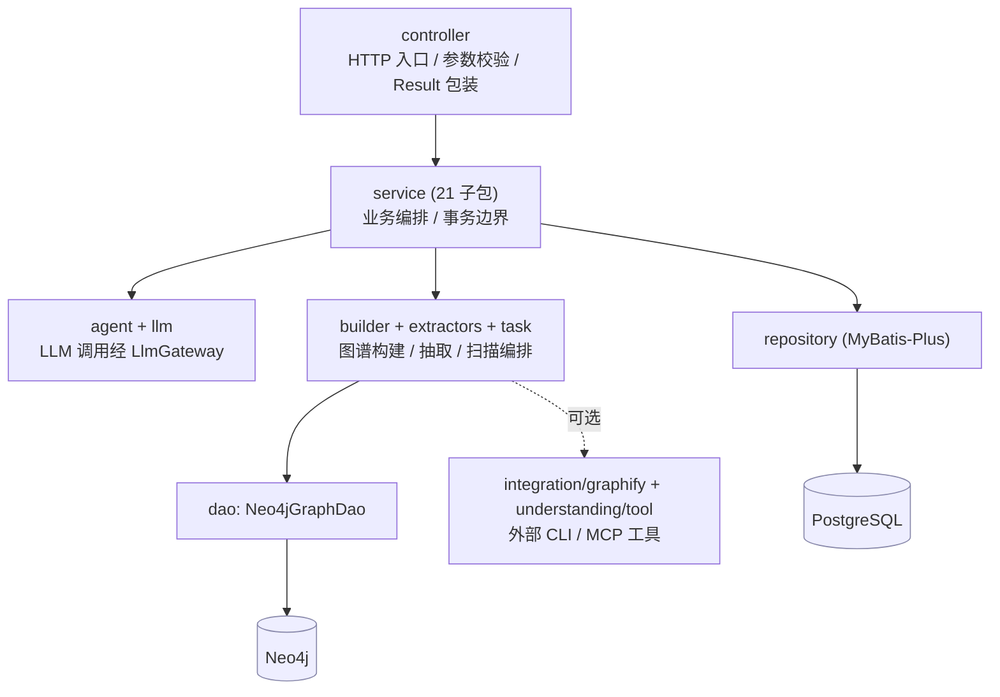

# LegacyGraph 开发规范文档

## 概述

本文档按当前代码库更新，适用于 LegacyGraph 后端 `backend/`、前端 `frontend/`、部署配置 `deploy/` 和数据库迁移脚本 `backend/src/main/resources/db/migration/`。

当前项目是 Vue 3 + Spring Boot 4 + PostgreSQL/Neo4j/Redis/MinIO 的前后端分离系统。开发时以代码和 Flyway 迁移脚本为准，文档不能反向覆盖代码事实。

---

## 后端 Java 规范

### 技术栈约定

| 项 | 当前代码 |
|----|----------|
| JDK | 21 |
| Spring Boot | 4.0.7 |
| Servlet 容器 | Jetty，已排除 Tomcat |
| ORM | MyBatis-Plus 3.5.16 |
| 数据库迁移 | Flyway，手动 `FlywayConfig` 执行（V1–V84，V70 缺失） |
| 数据库 | PostgreSQL 15+，启用 pgvector 后支持向量能力 |
| 图数据库 | Neo4j Java Driver 5.26.0 |
| AI | Spring AI 2.0.0，OpenAI 兼容 Provider 动态配置 |
| 文档解析 | Apache Tika、POI、PDFBox |
| 可观测性 | Actuator + Prometheus + Grafana |

### 包命名和职责

包名统一小写，根包为 `io.github.legacygraph`。

| 包 | 职责 |
|----|------|
| `agent` | LLM Agent 实现 + adapter（21 个 Agent） |
| `analysis` | 静态分析：AOP 代理分析、配置链接分析、控制流图、CPG 构建、数据流图、动态 SQL 分析、反射调用分析 |
| `annotation` | 自定义注解，如 `@Log` |
| `aspect` | AOP 切面，如审计日志切面 |
| `builder` | 代码/前端/业务/证据/功能切片/运行时图谱构建器 |
| `common` | 通用返回、分页、枚举（NodeType/EdgeType/NodeStatus/ScanStep/TaskStatus）、错误码 |
| `concurrency` | 并发属性抽取（ConcurrencyPropertyExtractor） |
| `config` | Spring Security、Redis、Flyway、MyBatis-Plus、Neo4j、MinIO、异步线程池、health 配置 |
| `controller` | HTTP Controller（48 个） |
| `dao` | Neo4j 访问封装（Neo4jGraphDao/Neo4jAdminRepository/Neo4jQueryRepository） |
| `deployment` | Graphify 部署健康指标、运维监控、生产配置 |
| `dto` | 请求、响应、报告、图谱、claim/gap/rag/scan/trace/understanding DTO |
| `entity` | MyBatis-Plus 表实体（73 个） |
| `eval` | Graphify 质量基准评测 |
| `event` | 领域事件与监听器 |
| `exception` | 统一异常 |
| `extractors` | Java、Vue、MyBatis XML、SQL、数据库元数据、文档抽取器 + adapter |
| `federation` | 跨仓库图谱联邦 |
| `filter` | Servlet 过滤器，如 JWT 认证 |
| `governance` | Graphify 访问策略、出处脱敏、角色 |
| `graphify` | Graphify 作业/快照/差异/回滚（作业态内存） |
| `handler` | MyBatis TypeHandler（如 FloatArrayTypeHandler） |
| `integration` | 外部集成（`integration/graphify`：CLI Runner/Parser/Import/兼容性） |
| `llm` | LLM Gateway、Prompt 加载、PII 脱敏、SecretScanService |
| `model` | 领域模型 |
| `plugin` | 插件注册表 |
| `query` | Graphify 问答服务 |
| `repository` | MyBatis-Plus Mapper，统一继承 `LegacyBaseMapper` |
| `review` | Graphify 规则化评审 |
| `security` | 出处/敏感信息脱敏 |
| `service` | 业务服务（21 个子包：acl/change/document/evaluation/feedback/graph/parse/qa/requirement/report/rerank/retrieval/scan/security/solution/source/system/systemoverview/test/user/viz） |
| `task` | 扫描编排和测试执行调度 |
| `tenant` | 多租户配额 |
| `terminology` | 术语映射服务（ConfigurableTerminologyService/TerminologyService/TerminologyProperties） |
| `test` | 后端测试执行器和断言工具 |
| `understanding` | 代码理解编排 + 工具路由 |
| `util` | JWT 等工具类 |
| `verification` | 外部验证适配器（ExternalVerificationAdapter 接口）与结果融合（ResultFusionEngine） |

新增代码优先放入已有包；只有出现清晰的新职责边界时才新增包。

### 分层依赖

依赖方向自上而下，禁止下层反向引用上层；Neo4j 访问集中在 `dao`，业务服务不得散落 Cypher。



### 类命名

| 后缀 | 用途 | 示例 |
|------|------|------|
| `Controller` | HTTP 接口 | `GraphQueryController` |
| `Service` | 业务服务 | `TraceIngestionService` |
| `Repository` | MyBatis-Plus Mapper | `GraphNodeRepository` |
| `Agent` | LLM 能力单元 | `SqlAdvisorAgent` |
| `Builder` | 图谱构建 | `EvidenceGraphWriter` |
| `Extractor` | 源码/文档/SQL 抽取 | `JavaControllerExtractor` |
| `Config` | Spring 配置 | `RedisConfig` |
| `Filter` | Servlet Filter | `JwtAuthenticationFilter` |
| `Request` / `Response` | 接口 DTO | `LoginRequest` |
| `Report` | 报告 DTO 或实体 | `MigrationReadinessReport` |
| `Test` | JUnit 测试 | `GraphMergeServiceTest` |

实体类不加 `Entity` 后缀，使用领域名并通过 `@TableName` 映射表，例如 `GraphNode -> lg_graph_node`。

### 方法和变量

- 类名使用 PascalCase。
- 方法、参数、局部变量使用 camelCase。
- 常量使用 `UPPER_SNAKE_CASE`。
- 方法名用动词开头：`create`、`update`、`delete`、`list`、`query`、`find`、`build`、`extract`、`sync`、`orchestrate`、`validate`。
- Controller 方法应返回统一 `Result<T>`，分页返回 `PageResult<T>`。

### Controller 规范

- 后端上下文路径是 `/api`，业务接口在代码里通常以 `/lg/...` 声明，因此外部访问路径是 `/api/lg/...`。
- 认证接口：`/api/lg/auth/login`、`/api/lg/auth/refresh`、`/api/lg/auth/me`、`/api/lg/auth/logout`。
- 主要业务接口以项目为边界：`/api/lg/projects/{projectId}/...`。
- 少量全局接口包括 `/api/lg/system`、`/api/lg/audit`、`/api/lg/admin/prompts`、`/api/llm/providers`、`/api/agents`、`/api/qa`、`/api/reports`。
- 新增接口必须同步更新前端 API 模块，避免在页面中直接写散落的 axios 调用。

### 数据访问规范

- 关系库访问统一使用 MyBatis-Plus Repository。
- Repository 统一继承 `LegacyBaseMapper<T>`，以适配字符串 UUID 和逻辑删除约定。
- 实体必须显式声明 `@TableName`；新增逻辑删除实体必须包含 `deleted` 字段，并确认 Flyway 脚本已建列。
- 不拼接 SQL 参数，使用 MyBatis-Plus 条件构造器、Mapper 方法参数或 XML 参数绑定。
- PostgreSQL 表结构变更必须新增 Flyway 迁移脚本，不能只改实体。
- Neo4j 访问集中在 `Neo4jGraphDao` 和同步服务中，业务服务不要直接散落 Cypher。

### 图谱开发规范

- 节点类型以 `common/NodeType.java` 为准，关系类型以 `common/EdgeType.java` 为准。
- 新增节点或关系类型时同步更新：
  - 后端枚举、构建器和查询/报告逻辑；
  - 前端 `frontend/src/types/index.ts`、图谱展示映射和筛选项；
  - 数据库脚本中对应字段长度、索引或约束，如需要。
- AI 产出的节点、关系和事实默认进入待确认状态，不应直接写为已确认。
- 静态代码/数据库解析得到的强证据可以写为已确认，但要保留 `source_type`、`source_path`、行号或证据关联。
- 图谱写入 PostgreSQL 和 Neo4j 时必须保证同一 `project_id + version_id` 下 `node_key`/`edge_key` 可重复执行。

### LLM 开发规范

- Agent 位于 `io.github.legacygraph.agent`，统一通过 `LlmGateway` 调用模型。
- Prompt 模板由 `lg_prompt_template` 管理，代码中通过 `PromptTemplateLoader` 渲染。
- LLM Provider 由 `lg_llm_provider` 管理，默认 Provider 通过 `LlmProviderService.getActiveDefault()` 获取。
- LLM 调用必须写入 `lg_prompt_run`，记录输入 hash、脱敏输入、原始输出、解析输出、状态、token 和延迟。
- 输出 DTO 解析失败时应进入显式失败或 REVIEW 状态，不能吞掉异常后返回空对象冒充成功。
- 任何包含代码、文档或业务数据的 Prompt 输出日志必须经过脱敏，不得记录密钥、Token、密码。

### 缓存规范

- Redis key 统一使用 `lg:` 前缀；认证黑名单使用 `auth:blacklist:` 子前缀。
- 声明式缓存 TTL 以 `RedisConfig` 为准：项目概览 1 分钟、验证报告 5 分钟、LLM Provider/Prompt/字典 6 小时、配置 1 小时。
- Redis 不可用时应降级回源，不应阻断核心业务。
- 影响图谱、报告、验证或向量结果的数据变更后必须调用缓存失效逻辑，例如 `GraphCacheInvalidator`。

### 异步任务规范

当前有三个线程池，全部使用 Java 21 虚拟线程（`Executors.newVirtualThreadPerTaskExecutor()`）：

| Bean | 用途 |
|------|------|
| `taskExecutor` | 扫描、报告、向量化等通用任务（`@Primary`） |
| `ioTaskExecutor` | 文件上传下载、MinIO 操作 |
| `testExecutor` | API/E2E/数据库断言测试 |

> 虚拟线程在 I/O 阻塞时自动让出 CPU，几乎无内存开销，原 corePoolSize/maxPoolSize/queueCapacity 等限流参数对虚拟线程无意义。如需限制并发数，使用 `Semaphore` 在业务层控制。

异步任务必须记录开始、完成、失败原因和可追踪 ID；扫描类任务要更新 `lg_scan_task`。

### Graphify 集成规范

- Graphify CLI 集成默认关闭（`legacygraph.graphify.enabled=false`）；启用前确认运行环境已安装 `graphify` 可执行文件。
- CLI 调用必须经 `GraphifyRunner`，由 `CliProcessRunner` 统一处理超时、字节上限和工作目录白名单；生产环境必须配置 `work-dir-whitelist`。
- 导入前必须经 `GraphifyCompatibilityService` 做 schema 版本与契约校验，不兼容时直接失败，不得跳过。
- Graphify 节点/边经 `GraphifyCanonicalMapper` 映射到 `NodeType`/`EdgeType`，再由 `EvidenceGraphWriter` 写入 Neo4j，与其他图谱写入保持一致。
- 导入作业状态保存在内存 `ConcurrentHashMap`（`GraphifyImportJobRepository`），**不落库、重启丢失**；需要持久化的产物写入 Neo4j 和快照服务。
- Graphify 相关新增能力按职责落入对应包：CLI 集成在 `integration/graphify`，作业/差异/回滚在 `graphify`，部署监控在 `deployment`，评测/联邦/治理/问答/评审/安全分别在 `eval`/`federation`/`governance`/`query`/`review`/`security`。

---

## 前端 TypeScript / Vue 规范

### 技术栈

| 项 | 当前代码 |
|----|----------|
| Vue | 3.4.21 |
| Vite | 5.1.6 |
| TypeScript | 5.4.2 |
| UI | Element Plus 2.14.2 |
| 状态管理 | Pinia 2.1.7 + pinia-plugin-persistedstate |
| 图谱 | @antv/G6 5.0.12、@vue-flow/core 1.33 |
| 国际化 | Vue I18n 9.10 |
| 测试 | Vitest 1.4、Vue Test Utils、Playwright 1.42 |
| PWA | vite-plugin-pwa |

### 目录约定

| 目录 | 职责 |
|------|------|
| `src/api` | 后端 API 封装；新增接口必须先放这里 |
| `src/components` | 可复用组件 |
| `src/composables` | 组合式函数 |
| `src/router` | 路由定义 |
| `src/stores` | Pinia store |
| `src/types` | 前端共享类型 |
| `src/utils` | 请求、下载、导出、性能等工具 |
| `src/views` | 页面 |

### 代码风格

- Vue 单文件组件使用 `<script setup lang="ts">`。
- 组件文件名使用 PascalCase，例如 `EvidenceWorkbench.vue`。
- 工具函数和 API 模块使用 kebab-case 或领域前缀，例如 `trace.api.ts`。
- CSS 类名使用 kebab-case，组件样式默认 `<style scoped>`。
- 不在页面组件里硬编码后端完整 URL，统一走 `src/utils/request.ts`。
- `request` 的 `baseURL` 是 `/api`，接口封装只写 `/lg/...` 等应用内路径。
- 请求会自动附加 `Authorization: Bearer <token>` 和 `X-Trace-Id`。

### 路由和鉴权

- 前端开发端口是 `5173`，Vite 代理 `/api` 到 `http://localhost:8080`。
- 登录页 `/login` 不需要认证，其余页面默认需要登录。
- 新页面要在 `router/index.ts` 注册，并补齐菜单、国际化标题和 API 权限入口。

---

## 数据库和迁移规范

- PostgreSQL 迁移脚本位于 `backend/src/main/resources/db/migration/`，按 `V{n}__description.sql` 命名。
- 当前迁移版本为 `V1` 到 `V84`（共 83 个脚本，`V70` 缺失）。
- Flyway 由 `config/FlywayConfig.java` 手动创建 Bean 并在应用启动时执行 `migrate()`；配置 `out-of-order: true`、`baseline-on-migrate: true`、`clean-disabled: true`、`validate-on-migrate: false`（生产关闭校验以避免 45+ migrations checksum 扫描开销）。
- `V33__unify_table_prefix.sql` 已将 `sys_*` 表统一为 `lg_sys_*`、`migration_risk` 为 `lg_migration_risk`；新增系统类实体必须使用 `lg_sys_` 前缀并同步 `@TableName`。
- 不再使用旧的 `docs/sql/init.sql` 或 `docs/sql/llm_integration.sql` 路径。
- 新表必须同步创建实体、Repository、必要 Service/Controller、测试数据和文档。
- 生产环境禁止执行 Flyway clean；不修改已执行的迁移脚本，需要修复时新增下一个 `V{n}__*.sql`。
- Graphify 导入作业（`GraphifyImportJob`）为内存态，不建表、不落库。

---

## 测试规范

### 后端

- 测试位于 `backend/src/test/java`，使用 JUnit 5 + Spring Boot Test。
- 测试环境使用 H2 PostgreSQL 模式，脚本位于 `backend/src/test/resources/schema-h2.sql` 和 `data-h2.sql`。
- Agent、Extractor、Builder、Controller、Service、Executor 都已有测试目录，新逻辑优先补对应层级测试。
- 后端命令：

```bash
cd backend
mvn test
mvn clean package -DskipTests
```

### 前端

- 单元测试位于 `frontend/tests/unit`。
- E2E 测试位于 `frontend/tests/e2e`。
- 前端命令：

```bash
cd frontend
npm run type-check
npm run test
npm run test:e2e
npm run build
```

---

## 安全规范

- 密码必须 BCrypt 存储。
- JWT 使用 `Authorization: Bearer <token>`，登出时写入 Redis 黑名单，TTL 为 Token 剩余有效期。
- `JWT_SECRET`、数据库密码、Neo4j 密码、Redis 密码、MinIO 密钥、LLM API Key 只能通过环境变量、安全配置或数据库加密配置管理。
- 不得把真实 `.env`、Token、API Key、数据库密码写入文档、测试快照或日志。
- 日志切面必须过滤密码、token、secret、key 等敏感字段。
- 生产环境应限制 CORS 来源；当前开发配置允许通配来源，不能照搬到公网。

---

## Git 和提交规范

Commit 格式：

```text
<type>(<scope>): <subject>
```

常用 type：

| type | 说明 |
|------|------|
| `feat` | 新功能 |
| `fix` | 修复 |
| `docs` | 文档 |
| `refactor` | 重构 |
| `perf` | 性能优化 |
| `test` | 测试 |
| `chore` | 构建、依赖、工具 |

常用 scope：`backend`、`frontend`、`graph`、`scan`、`agent`、`db`、`deploy`、`docs`。

---

## Code Review 检查点

- [ ] 是否新增或修改了 Flyway 脚本，并与实体字段一致。
- [ ] 是否同步更新前后端类型、API 封装和路由。
- [ ] 是否保持 AI 输出可追溯、有证据、有审计记录。
- [ ] 是否处理 Redis、Neo4j、LLM、MinIO 不可用时的降级或错误提示。
- [ ] 是否新增或更新对应测试。
- [ ] 是否没有真实密钥、Token、密码进入代码库。
- [ ] 是否通过后端测试、前端类型检查或构建。

---

## 版本历史

| 版本 | 日期 | 说明 |
|------|------|------|
| 4.0 | 2026-07-12 | Controller 34→48、Entity 52→73、Agent 16→21、Flyway V1–V36→V1–V84（V70 缺失）、Service 子包 7→21；新增包 analysis/concurrency/terminology/verification；异步线程池改为 Java 21 虚拟线程；`validate-on-migrate` 修正为 `false` |
| 2.0 | 2026-07-06 | Flyway 版本修正为 V1–V36（原误写 V1–V5）；包结构补齐 deployment/eval/event/federation/governance/graphify/handler/integration/plugin/query/review/security/tenant/understanding，移除不存在的 `graph`/`parser`；Element Plus 修正为 2.14.2；新增 Graphify 集成规范与 V33 表名前缀统一约定 |
| 1.1 | 2026-06-30 | 按当前代码更新后端包结构、Flyway、图谱、LLM、Redis、前端与测试规范 |
| 1.0 | 2026-06-27 | 初始版本 |
