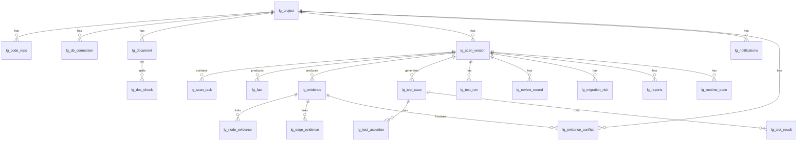

# LegacyGraph 数据库设计文档

## 概述

LegacyGraph 当前使用 PostgreSQL 作为主数据库，Neo4j 存储图谱关系并支持图遍历，Redis 用于缓存和 JWT 黑名单，MinIO 用于文件存储。

本文档按当前代码和 Flyway 脚本更新：

- 迁移脚本目录：`backend/src/main/resources/db/migration/`
- 当前迁移版本：`V1__initial_schema.sql` 到 `V84__source_snapshot.sql`（共 83 个脚本，V70 缺失）
- 实体目录：`backend/src/main/java/io/github/legacygraph/entity/`（73 个实体）
- Repository 目录：`backend/src/main/java/io/github/legacygraph/repository/`

数据库结构以 Flyway 脚本为准。旧文档中提到的 `docs/sql/init.sql`、`docs/sql/llm_integration.sql` 当前不存在；`sys_*` 与 `migration_risk` 表已在 `V33` 中统一重命名为 `lg_sys_*` 与 `lg_migration_risk`。

---

## 数据库组件

| 组件 | 用途 | 当前代码约定 |
|------|------|--------------|
| PostgreSQL 15+ | 主业务库 | Flyway 自动迁移，MyBatis-Plus 访问 |
| pgvector | 向量检索扩展 | `V1` 尝试启用 `vector` 扩展；不可用时跳过旧 `vector_document` |
| Neo4j 5.x | 图关系和图遍历 | `Neo4jGraphDao` 统一访问 |
| Redis | 缓存、LLM 结果缓存、JWT 黑名单 | key 前缀 `lg:`；黑名单前缀 `auth:blacklist:` |
| MinIO | 上传文档和导出文件存储 | 通过 `MinioConfig` 管理客户端 |

---

## Flyway 迁移版本

| 版本 | 说明 |
|------|------|
| `V1__initial_schema.sql` | 创建核心业务表、数据源表、扫描表、事实/证据表、测试表、LLM/Prompt 表、报告表、系统表、运行时链路表和初始数据 |
| `V2__llm_provider_deepseek.sql` | 为 `lg_llm_provider` 增加 `is_default`、`is_active`，插入 DeepSeek 默认 Provider |
| `V3__fix_schema_gaps.sql` | 为 `lg_code_repo` 增加 `backend_sub_path`、`frontend_sub_path`，并允许 `lg_reports.version_id` 为空 |
| `V4__add_deleted_columns.sql` | 补齐部分实体使用的 `deleted` 逻辑删除列 |
| `V5__create_missing_tables.sql` | 补建 `lg_graph_node`、`lg_graph_edge`、`lg_vector_document` |
| `V6__agent_run_and_privacy.sql` | `lg_evidence` 新增 `privacy_level`/`redaction_policy`；新建 `lg_agent_run` |
| `V7__fix_prompt_run_jsonb_to_text.sql` | `lg_prompt_run` 三列类型 JSONB → TEXT（`masked_input`/`raw_output`/`parsed_output`） |
| `V8__seed_dictionaries.sql` | 字典种子数据 |
| `V9__change_task.sql` | 新建 `lg_change_task`、`lg_patch_file`、`lg_validation_gate`、`lg_pr_task`（变更闭环） |
| `V10__evidence_dedup.sql` | 数据清理 + 新建 `content_hash` 部分唯一索引 |
| `V11__fix_llm_provider_api_config.sql` | 补齐 deepseek `api_config` JSONB |
| `V12__seed_prompt_templates.sql` | Prompt 模板种子数据 |
| `V13__scan_version_stats_cache.sql` | `lg_scan_version` 新增 8 列统计缓存字段（node_count/edge_count/fact_count/task_*/current_stage/stats_updated_at） |
| `V14__change_task_version_column.sql` | `lg_change_task` 新增 `version` 乐观锁字段 |
| `V15__knowledge_claim_and_gap_task.sql` | 新建 `lg_knowledge_claim`、`lg_gap_task` |
| `V16__domain_ontology.sql` | 新建 `lg_domain_ontology_term`、`lg_domain_ontology_relation` |
| `V17__switch_embedding_to_siliconflow.sql` | UPSERT `lg_llm_provider`：切换到 BAAI/bge-large-zh-v1.5（SiliconFlow） |
| `V18__fix_prompt_output_schemas.sql` | UPDATE 3 条 `prompt_template` 的 `output_schema` 与 Java DTO 对齐 |
| `V19__switch_embedding_to_local_ollama.sql` | UPSERT `lg_llm_provider`：切换到 bge-m3（本地 Ollama，1024 维） |
| `V20__source_asset_snapshot.sql` | 新建 `lg_source_asset_snapshot`（扫描资产快照，增量扫描） |
| `V21__graph_write_intent_outbox.sql` | 新建 `lg_graph_write_intent`（图谱写入意图 Outbox 模式） |
| `V22__understanding_tool_runs.sql` | 新建 `lg_tool_run`、`lg_tool_evidence`（工具运行记录与证据） |
| `V23__fix_vector_document_schema.sql` | DROP + 重建 `lg_vector_document`（修正 project_id 类型，新增 version_id/embedding/embedding_model/embedding_dim） |
| `V24__scan_task_progress.sql` | `lg_scan_task` 新增 `total_items`/`processed_items`/`current_item` |
| `V25__seed_doc_parse_status_dict.sql` | 纯数据：新增 `doc_parse_status` 等字典 |
| `V26__repair_scan_task_progress_columns.sql` | 幂等补丁：补齐 V24 可能被跳过的 3 列 |
| `V27__db_schema_fingerprint.sql` | `lg_db_connection` 新增 `schema_fingerprint`/`schema_fingerprint_updated_at` |
| `V28__ai_scan_job.sql` | 新建 `lg_ai_scan_job`（AI 扫描异步任务） |
| `V29__qa_conversation_tables.sql` | 新建 `lg_qa_conversation`/`lg_qa_message`/`lg_qa_feedback`（QA 对话历史） |
| `V30__semantic_cache.sql` | 新建 `lg_semantic_cache`（语义缓存，question embedding 向量索引） |
| `V31__outbox_enhance.sql` | `lg_graph_write_intent` 新增 `running_lock`/`running_lock_at`/`dead_letter`/`dead_letter_reason`/`priority` + 查询索引 |
| `V32__ai_scan_job_current_step.sql` | `lg_ai_scan_job` 新增 `current_step` 状态机字段 |
| `V33__unify_table_prefix.sql` | 统一表名前缀：`sys_*` → `lg_sys_*`，`migration_risk` → `lg_migration_risk` |
| `V34__notifications.sql` | 新建 `lg_notifications`（系统通知） |
| `V35__evidence_conflicts.sql` | 新建 `lg_evidence_conflict`（证据冲突） |
| `V36__seed_qa_agent_prompt_templates.sql` | 纯数据：补充 `qa-answer-enhanced`/`intent-classifier`/`query-rewriter`/`hyde-generator` 模板 |
| `V37__fix_qa_answer_remove_json_output.sql` | 修复 QA 答案模板移除 JSON 输出格式 |
| `V38__db_connection_source.sql` | `lg_db_connection` 新增 source 相关字段 |
| `V39__seed_add_column_dict.sql` | 字典种子数据：加列相关 |
| `V40__seed_add_column_prompts.sql` | Prompt 模板种子数据：加列相关 |
| `V41__graph_rag_planner_intent_support.sql` | GraphRAG 计划与意图支持 |
| `V42__terminology_mapping.sql` | 术语映射表 |
| `V43__seed_graph_edge_type_dict.sql` | 字典种子数据：图谱边类型 |
| `V44__extract_checkpoint.sql` | 抽取检查点 |
| `V45__seed_report_status_dict.sql` | 字典种子数据：报告状态 |
| `V46__audit_log_operation_type.sql` | 审计日志新增操作类型 |
| `V47__change_impact_layered_output.sql` | 变更影响分层输出 |
| `V48`-`V54` | 各类 Prompt 模板种子数据（实现计划/过程指南/技术债/安全审计/并发分析/可视化/测试生成） |
| `V55__create_lg_file_snapshot.sql` | 文件快照表 |
| `V56__plugin_status.sql` | 插件状态字段 |
| `V57__ai_scan_job_incremental_context.sql` | AI 扫描任务增量上下文 |
| `V58__seed_partial_document_and_candidate_edge_status.sql` | 部分文档与候选边状态字典 |
| `V59__sync_optimized_prompts.sql` | 同步优化后的 Prompt 模板 |
| `V60__graph_release.sql` | 图谱发布门禁 |
| `V61__requirement_tables.sql` | 需求结构化表（需求/条目/验收/约束/假设/开放问题） |
| `V62__vector_document_release_acl.sql` | 向量文档发布 ACL |
| `V63__semantic_cache_versioning.sql` | 语义缓存版本管理 |
| `V64__qa_test_case.sql` | QA 测试用例表 |
| `V65__solution_tables.sql` | 方案生成表 |
| `V66__solution_bridge_and_cost.sql` | 方案桥接与成本 |
| `V67__requirement_constraints.sql` | 需求约束 |
| `V68__qa_test_case_project_scope.sql` | QA 测试用例项目范围 |
| `V69__source_snapshot.sql` | 源码快照 |
| `V71__change_task_assignee.sql` | 变更任务指派人 |
| `V72__acceptance_verification.sql` | 验收验证 |
| `V73__solution_audit.sql` | 方案审核 |
| `V74__qa_audit_log.sql` | QA 审计日志 |
| `V75__node_status_tombstone.sql` | 节点状态墓碑（新增 STALE 状态） |
| `V76__solution_embedding.sql` | 方案嵌入向量 |
| `V77__scaffold_template.sql` | 脚手架模板 |
| `V78__qa_feedback.sql` | QA 反馈表 |
| `V79__db_connection_password_cipher.sql` | 数据库连接密码加密 |
| `V80__parse_failure_log.sql` | 解析失败日志 |
| `V81__file_snapshot_rescan_metadata.sql` | 文件快照重扫元数据 |
| `V82__scan_version_cumulative_stats.sql` | 扫描版本累积统计 |
| `V83__scan_checkpoint.sql` | 扫描检查点 |
| `V84__source_snapshot.sql` | 源码快照增强 |

> V70 缺失（未发现迁移脚本），Flyway `out-of-order: true` 允许跳过。

Flyway 由 `FlywayConfig` 手动执行，配置项：

```yaml
spring:
  flyway:
    enabled: true
    locations: classpath:db/migration
    baseline-on-migrate: true
    baseline-version: 1
    clean-disabled: true
    validate-on-migrate: false   # 45+ 迁移脚本 checksum 扫描需 3-5s，生产关闭
    out-of-order: true           # 允许乱序补丁
    placeholder-replacement: false
```

---

## 表总览

### 项目、数据源和扫描

| 表名 | 实体 | 说明 |
|------|------|------|
| `lg_project` | `Project` | 项目主表 |
| `lg_code_repo` | `CodeRepo` | 代码仓库配置 |
| `lg_db_connection` | `DbConnection` | 被分析系统的数据库连接配置 |
| `lg_document` | `Document` | 上传文档元数据 |
| `lg_scan_version` | `ScanVersion` | 扫描版本 |
| `lg_scan_task` | `ScanTask` | 扫描子任务 |

### 事实、证据和图谱

| 表名 | 实体 | 说明 |
|------|------|------|
| `lg_fact` | `Fact` | 原始事实和 AI 抽取事实 |
| `lg_evidence` | `Evidence` | 证据片段 |
| `lg_node_evidence` | `NodeEvidence` | 节点与证据关联 |
| `lg_edge_evidence` | `EdgeEvidence` | 关系与证据关联 |
| `lg_doc_chunk` | `DocChunk` | 文档分片 |
| `vector_document` | 无实体 | `V1` 中兼容 pgvector 的旧向量表 |
| `lg_vector_document` | `VectorDocument` | 与当前实体对齐的向量文档表 |

> **注意**：`lg_graph_node` 和 `lg_graph_edge` 表在 `V5` 迁移中存在，但自 `EvidenceGraphWriter` 引入后已不再使用。图谱节点和边统一由 `Neo4jGraphDao` 直接写入 Neo4j，PostgreSQL 不再维护图谱副本。`GraphNode` 和 `GraphEdge` 实体类保留仅为 MyBatis-Plus 与旧表兼容。

### 测试、审核、报告和风险

| 表名 | 实体 | 说明 |
|------|------|------|
| `lg_test_case` | `TestCase` | 测试用例 |
| `lg_test_assertion` | `TestAssertion` | 测试断言 |
| `lg_test_result` | `TestResult` | 测试结果 |
| `lg_test_run` | `TestRun` | 测试执行批次 |
| `lg_review_record` | `ReviewRecord` | 人工审核记录 |
| `lg_migration_risk` | `MigrationRisk` | 迁移风险（V33 由 `migration_risk` 重命名） |
| `lg_reports` | `Report` | 报告生成记录 |

### LLM 和 Prompt

| 表名 | 实体 | 说明 |
|------|------|------|
| `lg_llm_provider` | `LlmProvider` | LLM Provider 配置 |
| `lg_prompt_template` | `PromptTemplate` | Prompt 模板 |
| `lg_prompt_run` | `PromptRun` | Prompt 调用审计 |

### 变更闭环（V9）

| 表名 | 实体 | 说明 |
|------|------|------|
| `lg_change_task` | `ChangeTask` | 变更任务状态机（含乐观锁 version） |
| `lg_patch_file` | `PatchFile` | 补丁文件（unified diff） |
| `lg_validation_gate` | `ValidationGate` | 验证门禁（编译/测试/静态分析） |
| `lg_pr_task` | `PrTask` | PR 任务（分支/URL/状态/审核策略/回滚方案） |

### Agent 合约与工具运行

| 表名 | 实体 | 说明 |
|------|------|------|
| `lg_agent_run` | `AgentRun` | Agent 调用合约记录（model/tokens/cost/quality） |
| `lg_tool_run` | `ToolRun` | 工具运行记录（MCP/CLI 类工具） |
| `lg_tool_evidence` | `ToolEvidence` | 工具证据（关联 tool_run） |

### 知识断言与缺口（V15）

| 表名 | 实体 | 说明 |
|------|------|------|
| `lg_knowledge_claim` | `KnowledgeClaim` | 证据化知识断言（含 confidence/qualifiers/evidence_ids） |
| `lg_gap_task` | `GapTask` | 知识图谱缺口任务（7 类缺口类型） |

### 领域本体（V16）

| 表名 | 实体 | 说明 |
|------|------|------|
| `lg_domain_ontology_term` | `DomainOntologyTerm` | 领域本体术语（含 aliases/category） |
| `lg_domain_ontology_relation` | `DomainOntologyRelation` | 术语关系（from_term/to_term/relation_type） |

### 扫描资产与写入意图

| 表名 | 实体 | 说明 |
|------|------|------|
| `lg_source_asset_snapshot` | `SourceAssetSnapshot` | 扫描资产快照（支持增量扫描判定） |
| `lg_graph_write_intent` | `GraphWriteIntent` | 图谱写入意图（Outbox 模式，幂等+重试） |

### AI 扫描异步任务（V28）

| 表名 | 实体 | 说明 |
|------|------|------|
| `lg_ai_scan_job` | `AiScanJob` | AI 扫描异步任务（status/config_json/error_message） |

### QA 对话历史（V29）

| 表名 | 实体 | 说明 |
|------|------|------|
| `lg_qa_conversation` | `QaConversation` | QA 会话 |
| `lg_qa_message` | `QaMessage` | QA 消息（含 evidences/confidence/token_count） |
| `lg_qa_feedback` | `QaFeedback` | QA 反馈（helpful/feedback_text/used_evidence_ids） |

### 语义缓存（V30）

| 表名 | 实体 | 说明 |
|------|------|------|
| `lg_semantic_cache` | `SemanticCache` | 语义缓存（question_embedding IVFFlat 向量索引） |

### 系统通知（V34）

| 表名 | 实体 | 说明 |
|------|------|------|
| `lg_notifications` | `Notification` | 系统通知（project_id/title/content/read/created_at） |

### 证据冲突（V35）

| 表名 | 实体 | 说明 |
|------|------|------|
| `lg_evidence_conflict` | `EvidenceConflict` | 证据冲突记录（冲突类型、涉及证据、处置状态） |

### 需求结构化（V61/V67/V72）

| 表名 | 实体 | 说明 |
|------|------|------|
| `lg_requirement` | `Requirement` | 需求主表 |
| `lg_requirement_item` | `RequirementItem` | 需求条目 |
| `lg_acceptance_criterion` | `AcceptanceCriterion` | 验收条件 |
| `lg_requirement_constraint` | `RequirementConstraint` | 需求约束（V67） |
| `lg_acceptance_verification` | `AcceptanceVerification` | 验收验证（V72） |

### 方案生成（V65/V66/V73/V76）

| 表名 | 实体 | 说明 |
|------|------|------|
| `lg_solution` | `Solution` | 方案主表 |
| `lg_solution_step` | `SolutionStep` | 方案步骤 |
| `lg_solution_bridge` | `SolutionBridge` | 方案桥接（V66） |
| `lg_solution_cost` | `SolutionCost` | 方案成本（V66） |
| `lg_solution_audit` | `SolutionAudit` | 方案审核（V73） |
| `lg_solution_embedding` | `SolutionEmbedding` | 方案嵌入向量（V76） |

### 图谱发布与文件快照（V55/V60/V62/V75/V81）

| 表名 | 实体 | 说明 |
|------|------|------|
| `lg_graph_release` | `GraphRelease` | 图谱发布门禁（V60） |
| `lg_file_snapshot` | `FileSnapshot` | 文件快照（V55） |
| `lg_vector_document_release_acl` | - | 向量文档发布 ACL（V62） |
| `lg_node_tombstone` | - | 节点状态墓碑，STALE 状态支持（V75） |
| `lg_file_snapshot_rescan_metadata` | - | 文件快照重扫元数据（V81） |

### QA 测试与反馈（V64/V68/V74/V78）

| 表名 | 实体 | 说明 |
|------|------|------|
| `lg_qa_test_case` | `QaTestCase` | QA 测试用例（V64） |
| `lg_qa_audit_log` | `QaAuditLog` | QA 审计日志（V74） |
| `lg_qa_feedback` | `QaFeedback` | QA 反馈（V78，V34 已有 `lg_qa_feedback`，V78 补充） |

### 其他新增表（V42/V44/V77/V79/V80/V83）

| 表名 | 实体 | 说明 |
|------|------|------|
| `lg_terminology_mapping` | `TerminologyMapping` | 术语映射（V42） |
| `lg_extract_checkpoint` | `ExtractCheckpoint` | 抽取检查点（V44） |
| `lg_scaffold_template` | `ScaffoldTemplate` | 脚手架模板（V77） |
| `lg_parse_failure_log` | `ParseFailureLog` | 解析失败日志（V80） |
| `lg_scan_checkpoint` | `ScanCheckpoint` | 扫描检查点（V83） |

### 系统管理和运行时

| 表名 | 实体 | 说明 |
|------|------|------|
| `lg_runtime_trace` | `RuntimeTrace` | 运行时 span 链路 |
| `lg_sys_operation_log` | `AuditLog` | 操作审计日志（V33 由 `sys_operation_log` 重命名） |
| `lg_sys_user` | `SysUser` | 用户（V33 由 `sys_user` 重命名） |
| `lg_sys_role` | `SysRole` | 角色 |
| `lg_sys_user_role` | `SysUserRole` | 用户角色关联 |
| `lg_sys_dict` | `SysDict` | 字典类型 |
| `lg_sys_dict_item` | `SysDictItem` | 字典项 |
| `lg_sys_config` | `SysConfig` | 系统配置 |

> `V33__unify_table_prefix.sql` 将原 `sys_*` 表统一加上 `lg_` 前缀，`migration_risk` 重命名为 `lg_migration_risk`。实体 `@TableName` 已同步更新。

---

## 核心表字段摘要

### `lg_project`

项目最高组织单元。

关键字段：`id`、`project_code`、`project_name`、`description`、`project_type`、`tech_stack`、`repo_url`、`default_branch`、`owner`、`status`、`deleted`、`created_at`、`updated_at`。

约束和索引：

- 主键：`id`
- 唯一：`project_code`
- 逻辑删除：`deleted`

### `lg_code_repo`

项目代码仓库配置。

关键字段：`project_id`、`repo_name`、`repo_type`、`git_url`、`branch_name`、`auth_type`、`username`、`include_pattern`、`exclude_pattern`、`local_path`、`backend_sub_path`、`frontend_sub_path`、`status`、`last_pull_status`、`last_pull_time`、`last_scan_time`、`created_by`、`deleted`。

索引：`idx_lg_code_repo_project(project_id)`。

### `lg_db_connection`

被分析系统数据库连接，不是 LegacyGraph 自身主库连接。

关键字段：`project_id`、`connection_name`、`db_type`、`host`、`port`、`database_name`、`schema_name`、`username`、`password`、`readonly`、`include_tables`、`exclude_tables`、`status`、`table_count`、`last_scan_time`、`created_by`、`deleted`。

注意：`password` 字段不能在日志或接口响应中明文输出。

### `lg_document` 和 `lg_doc_chunk`

`lg_document` 保存上传文件元数据，`lg_doc_chunk` 保存文档分片。

`lg_document` 关键字段：`project_id`、`version_id`、`doc_name`、`doc_type`、`file_type`、`file_path`、`file_size`、`parse_status`、`fact_count`、`error_message`、`uploaded_by`、`uploaded_at`、`parsed_at`、`deleted`。

`lg_doc_chunk` 关键字段：`project_id`、`version_id`、`doc_name`、`doc_path`、`chunk_index`、`title_path`、`content`、`token_count`、`metadata`、`embedding_id`、`deleted`。

### `lg_scan_version` 和 `lg_scan_task`

`lg_scan_version` 表示一次扫描快照，`lg_scan_task` 表示扫描子任务。

`lg_scan_version` 关键字段：`project_id`、`version_no`、`branch_name`、`commit_id`、`source_hash`、`scan_scope`、`scan_status`、`started_at`、`finished_at`、`error_message`、`deleted`。

`lg_scan_task` 关键字段：`project_id`、`version_id`、`task_type`、`task_name`、`task_status`、`input_params`、`output_summary`、`error_message`、`retry_count`、`started_at`、`finished_at`、`deleted`。

约束和索引：

- `lg_scan_version` 唯一：`(project_id, version_no)`
- `lg_scan_task` 索引：`(project_id, version_id)`、`task_status`

### `lg_fact`

存储静态抽取和 AI 抽取事实。

关键字段：`project_id`、`version_id`、`fact_type`、`fact_key`、`fact_name`、`source_type`、`source_path`、`start_line`、`end_line`、`source_line`、`content_summary`、`raw_content`、`normalized_data`、`confidence`、`status`、`mapped_to_graph`、`related_node_count`、`created_by`、`evidence_ids`、`extractor_name`、`extractor_version`、`prompt_run_id`、`pii_masked`、`review_status`、`verified_by_test`。

约束和索引：

- 唯一：`(project_id, version_id, fact_type, fact_key)`
- 索引：`(project_id, version_id)`、`fact_type`、`fact_key`
- GIN：`normalized_data`

### `lg_evidence`

所有 AI 和图谱结论应能追溯到证据。

关键字段：`project_id`、`version_id`、`evidence_type`、`source_path`、`source_name`、`start_line`、`end_line`、`content_hash`、`content_excerpt`、`summary`、`content`、`metadata`、`ast_path`、`sql_hash`、`chunk_id`、`related_node_ids`、`deleted`。

索引：`(project_id, version_id)`。

### 图谱节点与关系（Neo4j 独占）

图谱节点和边统一存储在 Neo4j 中，由 `Neo4jGraphDao` 管理，不再使用 PostgreSQL 副本。以下 `lg_graph_node` 和 `lg_graph_edge` 表仅在 `V5` 迁移中创建作为历史兼容，**当前业务代码已不再写入**。

节点类型以 `NodeType.java` 为准，关系类型以 `EdgeType.java` 为准，节点状态以 `NodeStatus.java` 为准。

<details>
<summary>已废弃：lg_graph_node 表结构（仅供参考）</summary>

```sql
CREATE TABLE lg_graph_node (
    id              UUID PRIMARY KEY,
    project_id      VARCHAR(64) NOT NULL,
    version_id      VARCHAR(64) NOT NULL,
    node_type       VARCHAR(64) NOT NULL,
    node_key        VARCHAR(512) NOT NULL,
    -- ... 其余字段略
);
```
</details>

<details>
<summary>已废弃：lg_graph_edge 表结构（仅供参考）</summary>

```sql
CREATE TABLE lg_graph_edge (
    id              UUID PRIMARY KEY,
    from_node_id    UUID NOT NULL REFERENCES lg_graph_node(id),
    to_node_id      UUID NOT NULL REFERENCES lg_graph_node(id),
    -- ... 其余字段略
);
```
</details>

### `lg_node_evidence` 和 `lg_edge_evidence`

图谱对象和证据的关联表。

关键字段：`node_id` / `edge_id`、`evidence_id`、`relation_type`、`deleted`。

约束：

- `lg_node_evidence` 唯一：`(node_id, evidence_id)`
- `lg_edge_evidence` 唯一：`(edge_id, evidence_id)`

### `lg_vector_document` 和 `vector_document`

当前实体 `VectorDocument` 映射到 `lg_vector_document`，字段包括：`id`、`project_id`、`chunk_type`、`source_uri`、`source_hash`、`chunk_index`、`content`、`content_sha256`、`meta`、`embedding_model`、`embedding_dim`、`deleted`、`created_at`。

`V1` 另有旧表 `vector_document`，字段含 `embedding vector(768)` 和 HNSW 索引；该表无当前实体映射，保留作为历史兼容。

### 测试相关表

`lg_test_case` 关键字段：`project_id`、`version_id`、`case_code`、`case_name`、`case_type`、`scenario`、`target_node_id`、`priority`、`preconditions`、`steps`、`expected_result`、`generated_by`、`confidence`、`status`、`deleted`。

`lg_test_assertion` 关键字段：`test_case_id`、`assertion_type`、`assertion_name`、`expression`、`expected_value`、`actual_value`、`status`、`deleted`。

`lg_test_result` 关键字段：`project_id`、`version_id`、`test_case_id`、`execution_id`、`result_status`、`request_data`、`response_data`、`db_snapshot`、`assertion_result`、`error_message`、`duration_ms`、`deleted`、`executed_at`。

`lg_test_run` 关键字段：`project_id`、`version_id`、`environment`、`status`、`started_at`、`finished_at`、`total_cases`、`passed_cases`、`failed_cases`、`deleted`。

### `lg_review_record`

人工审核任务和历史。

关键字段：`project_id`、`version_id`、`target_type`、`target_id`、`target_name`、`graph_type`、`confidence`、`evidence_count`、`priority`、`status`、`assignee`、`comment`、`reviewed_by`、`reviewed_at`、`before_data`、`after_data`。

### `lg_migration_risk`

迁移风险记录（V33 由 `migration_risk` 重命名）。

关键字段：`project_id`、`version_id`、`risk_type`、`risk_name`、`description`、`affected_nodes`、`severity`、`status`、`mitigation`、`estimated_effort`。

索引：`project_id`、`severity`、`status`。

### LLM 相关表

`lg_llm_provider` 关键字段：`provider_code`、`model_id`、`endpoint`、`deployment_mode`、`api_config`、`is_default`、`is_active`。

`lg_prompt_template` 关键字段：`template_code`、`version`、`scene`、`system_prompt`、`domain_prompt`、`task_prompt`、`output_schema`、`is_active`。

`lg_prompt_run` 关键字段：`project_id`、`task_type`、`provider_code`、`model_id`、`template_code`、`template_version`、`input_hash`、`masked_input`、`raw_output`、`parsed_output`、`prompt_tokens`、`completion_tokens`、`latency_ms`、`status`、`created_by`。

### `lg_reports`

报告生成记录。

关键字段：`project_id`、`version_id`、`report_type`、`report_name`、`report_data`、`file_path`、`error_message`、`status`、`deleted`、`generated_at`、`completed_at`。

注意：`version_id` 在 `V3` 中改为可空，用于项目级报告。

### `lg_runtime_trace`

运行时 span 链路表。

关键字段：`project_id`、`version_id`、`trace_id`、`span_id`、`parent_span_id`、`service_name`、`operation_name`、`span_kind`、`duration_ms`、`status`、`started_at`、`deleted`。

索引：`(project_id, version_id)`、`trace_id`。

### 系统表

`lg_sys_user` 关键字段：`username`、`password`、`nickname`、`email`、`phone`、`avatar`、`roles`、`permissions`、`status`、`last_login_at`、`last_login_ip`。

`lg_sys_role` 关键字段：`role_code`、`role_name`、`description`、`sort_order`、`status`。

`lg_sys_user_role` 关键字段：`user_id`、`role_id`，唯一 `(user_id, role_id)`。

`lg_sys_dict`、`lg_sys_dict_item` 用于系统字典；`lg_sys_config` 用于系统参数。

`lg_sys_operation_log` 记录审计日志：`trace_id`、`operation`、`method`、`request_uri`、`request_method`、`client_ip`、`user_agent`、`operator_id`、`operator_name`、`status`、`duration_ms`、`request_params`、`response_result`、`error_stack`。

---

## 图谱类型约定

后端节点类型以 `NodeType.java` 为准（共 50 个），按功能域分组：

- **核心业务/技术节点**：`Project`、`System`、`BusinessDomain`、`BusinessProcess`、`BusinessObject`、`BusinessRule`、`Role`、`FeatureModule`、`Feature`、`Menu`、`Page`、`Button`、`Permission`、`ApiEndpoint`、`Controller`、`Service`、`Method`、`Mapper`、`SqlStatement`、`Table`、`Index`、`Column`、`ConfigItem`、`FeatureFlag`、`ScheduledJob`、`MQConsumer`、`MQTopic`、`ExternalSystem`、`TestCase`、`Assertion`、`Evidence`、`User`、`Unknown`
- **代码包**：`Package`
- **变更闭环**：`ChangeTask`、`Patch`、`PullRequest`、`Dependency`、`VersionRisk`
- **需求结构化**：`Requirement`、`RequirementItem`、`AcceptanceCriterion`、`Constraint`、`Assumption`、`OpenQuestion`
- **方案生成**：`Solution`、`SolutionStep`

关系类型以 `EdgeType.java` 为准（共 47 个），按功能域分组：

- **核心关系**：`CONTAINS`、`IMPLEMENTED_BY`、`IMPLEMENTS`、`EXTENDS`、`USES`、`HAS_RULE`、`EXPOSED_BY`、`REQUIRES_PERMISSION`、`REQUIRES`、`CALLS`、`HANDLED_BY`、`EXECUTES`、`READS`、`WRITES`、`HAS_COLUMN`、`HAS_INDEX`、`UNIQUE_ON`、`JOINS`、`TRIGGERS`、`CONSUMES`、`CALLS_EXTERNAL`、`VERIFIED_BY`、`ASSERTS`、`HAS_EVIDENCE`、`REFERENCES`、`BELONGS_TO`、`MAPS_TO`、`POSSIBLE_SAME_AS`、`APPLIES_TO`、`GRANTS`、`ASSIGNED_TO`、`DATA_FLOW`、`REQUIRES_DOCUMENT`
- **业务关键边**：`CALLS_DB`、`READS_DB`、`WRITES_DB`、`WRITES_LOG`、`READS_CONFIG`、`WRITES_CONFIG`、`EXPOSES_ENDPOINT`、`AUTHENTICATES_BY`、`AUTHORIZES_BY`
- **变更闭环**：`AFFECTS`、`FIXED_BY`、`MIGRATES_TO`、`DEPENDS_ON`
- **需求结构化**：`HAS_ITEM`、`HAS_ACCEPTANCE_CRITERION`、`HAS_CONSTRAINT`、`HAS_ASSUMPTION`、`RAISES_QUESTION`、`SATISFIES`、`DERIVED_FROM`、`VERIFIES`
- **方案生成**：`STEP_OF`、`VALIDATED_BY`、`REVISED_BY`

节点状态以 `NodeStatus.java` 为准（共 6 个）：`PENDING_CONFIRM`、`CONFIRMED`、`REJECTED`、`INVALID_CANDIDATE`、`DELETED`、`STALE`（待重扫，V75 新增）。

---

## ER 关系摘要



辅助关系（非外键，运行时引用）：

- `lg_llm_provider` → LlmGateway 运行时选择默认 Provider
- `lg_prompt_template` → PromptTemplateLoader 渲染
- `lg_prompt_run` → LLM 调用审计链路
- `lg_sys_user` ↔ `lg_sys_user_role` ↔ `lg_sys_role`
- `lg_sys_dict` → `lg_sys_dict_item`

> Graphify 导入作业（`GraphifyImportJob`）为内存态，不落库；其产物节点/边写入 Neo4j，快照由 `GraphifyImportSnapshotService` 管理。

---

## 初始化和验证

### 自动迁移

后端启动时会执行 Flyway 迁移：

```bash
cd backend
mvn spring-boot:run
```

或生产环境：

```bash
java -jar target/legacygraph-api-1.0.0-SNAPSHOT.jar
```

### 手动验证

```sql
SELECT version, description, success
FROM flyway_schema_history
ORDER BY installed_rank;

SELECT table_name
FROM information_schema.tables
WHERE table_schema = 'public'
ORDER BY table_name;

SELECT extname
FROM pg_extension
WHERE extname = 'vector';
```

### pgvector 注意事项

`V1` 会尝试 `CREATE EXTENSION IF NOT EXISTS vector`，失败时仅跳过旧 `vector_document` 的 pgvector 建表，不阻断其他表。但向量检索功能需要 PostgreSQL 已安装并启用 pgvector。

---

## 版本历史

| 版本 | 日期 | 说明 |
|------|------|------|
| 4.0 | 2026-07-12 | 迁移版本补齐至 V84（新增 V37–V84 共 48 个脚本，V70 缺失）；Entity 修正为 73；新增需求结构化表（V61/V67/V72）、方案生成表（V65/V66/V73/V76）、图谱发布门禁（V60）、文件快照（V55/V81）、QA 测试用例与反馈（V64/V74/V78）、术语映射（V42）、扫描检查点（V83）、脚手架模板（V77）等；NodeStatus 新增 STALE（V75）；NodeType 修正为 50 个、EdgeType 修正为 47 个；Flyway `validate-on-migrate` 修正为 false、补充 `out-of-order: true` |
| 3.0 | 2026-07-06 | 迁移版本补齐至 V36（新增 V31–V36：Outbox 增强、AI 扫描步骤、表名前缀统一、通知、证据冲突、QA 模板）；`sys_*`/`migration_risk` 表名更正为 `lg_sys_*`/`lg_migration_risk`（V33）；新增 `lg_notifications`、`lg_evidence_conflict`；ER 图改为 Mermaid；标注 Graphify 作业为内存态 |
| 2.0 | 2026-07-03 | 新增 V6-V30 迁移版本（16 张新表、ALTER TABLE、枚举扩展）；补充变更闭环、知识断言、领域本体、QA 对话、语义缓存等模块 |
| 1.2 | 2026-07-01 | 修正图谱存储描述：图谱仅存 Neo4j，`lg_graph_node`/`lg_graph_edge` 标注为已废弃 |
| 1.0 | 2026-06-27 | 初始版本 |
