# LegacyGraph 架构设计文档

## 概述

LegacyGraph 是面向遗留系统理解和迁移分析的知识图谱平台。系统通过静态代码解析、前端路由/API 抽取、数据库元数据扫描、文档解析、运行时链路上报和 LLM 语义增强，生成可追溯的代码图谱、业务图谱、功能图谱、数据血缘、运行时图谱和统一图谱。

当前文档按 2026-07-01 代码更新，核心依据：

- 后端源码：`backend/src/main/java/io/github/legacygraph/`
- 前端源码：`frontend/src/`
- 数据库迁移：`backend/src/main/resources/db/migration/`
- 部署配置：`deploy/docker-compose.yml`

---

## 技术栈

| 层级 | 技术 | 当前版本/实现 |
|------|------|---------------|
| 后端框架 | Spring Boot | 4.0.7 |
| Java | JDK | 21 |
| Web 容器 | Jetty | 替代 Tomcat |
| ORM | MyBatis-Plus | 3.5.16 |
| 数据库迁移 | Flyway | 手动 `FlywayConfig` 触发 |
| 主数据库 | PostgreSQL | 15+，启用 pgvector |
| 图数据库 | Neo4j | Java Driver 5.26.0 |
| 缓存 | Redis | Spring Cache + StringRedisTemplate |
| 对象存储 | MinIO | 9.0.3 SDK |
| AI | Spring AI | 2.0.0，OpenAI 兼容模型 |
| 代码解析 | JavaParser | 3.28.2 |
| SQL 解析 | JSqlParser | 4.9 |
| 文档解析 | Tika / POI / PDFBox | Tika 3.0.0 |
| 前端 | Vue | 3.4.21 |
| 构建 | Vite | 5.1.6 |
| 语言 | TypeScript | 5.4.2 |
| UI | Element Plus | 2.6.0 |
| 图谱展示 | AntV G6 / VueFlow | G6 5.0.12、VueFlow 1.33.0 |
| 状态管理 | Pinia | 2.1.7 |
| 测试 | JUnit 5 / Vitest / Playwright | 后端、前端单测和 E2E |

---

## 总体架构

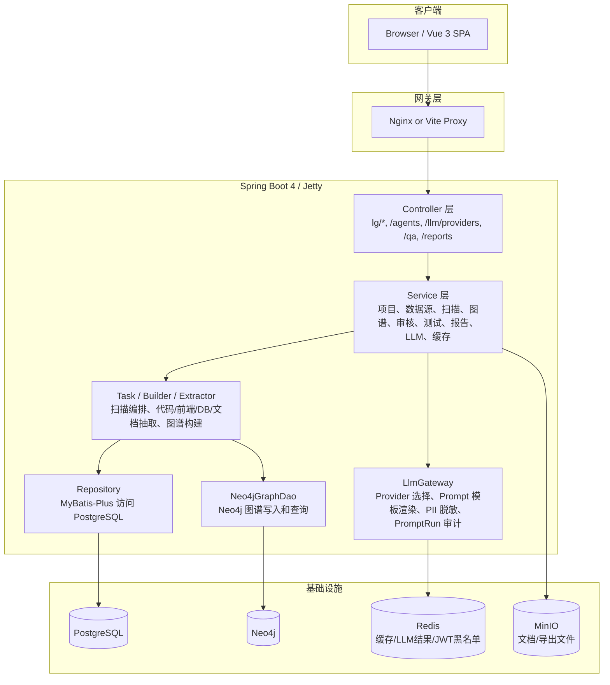

外部访问路径说明：

- 后端 context-path 是 `/api`。
- 代码中业务接口多以 `/lg/...` 声明。
- 因此前端实际请求形态通常是 `/api/lg/...`。

---

## 后端分层

### 包结构

```text
io.github.legacygraph
├── annotation        # @Log
├── aspect            # LogAspect 审计日志
├── agent             # LLM Agent
├── builder           # 图谱构建器
├── common            # Result、PageResult、NodeType、EdgeType、状态枚举
├── config            # Security、Redis、Flyway、Neo4j、MinIO、MyBatis、Async
├── controller        # HTTP API
├── dao               # Neo4jGraphDao
├── dto               # API、图谱、报告、Trace、Agent 合约 DTO
├── entity            # MyBatis-Plus 实体
├── exception         # 统一异常
├── extractors        # Java/Vue/MyBatis/SQL/DB/Document 抽取器 + adapter
├── filter            # JwtAuthenticationFilter
├── graph             # 图谱领域对象
├── llm               # LlmGateway、PromptTemplateLoader、PII 脱敏、SecretScanService
├── model             # 领域模型
├── parser            # 解析辅助
├── repository        # MyBatis-Plus Mapper
├── service           # 业务服务
├── task              # 扫描编排和测试调度
├── test              # 测试执行器
└── util              # JwtUtil 等工具
```

### 主要 Controller

| Controller | 路由前缀 | 职责 |
|------------|----------|------|
| `AuthController` | `/lg/auth` | 登录、登出、刷新、当前用户 |
| `ProjectController` | `/lg/projects` | 项目 CRUD |
| `ProjectOverviewController` | `/lg/projects/{projectId}` | 项目概览 |
| `SourceController` | `/lg/projects/{projectId}/sources` | 代码仓库、数据库连接、文档资料接入 |
| `ScanController` | `/lg/projects/{projectId}/scan-versions` | 扫描版本和扫描生命周期 |
| `GraphQueryController` | `/lg/projects/{projectId}` | 图谱查询、调用链、表影响、统一图谱、表列表 |
| `FactController` | `/lg/projects/{projectId}` | 事实和证据查询、代码/文档事实抽取 |
| `ReviewController` | `/lg/projects/{projectId}/reviews` | 人工审核 |
| `TestCaseController` | `/lg/projects/{projectId}` | 测试用例、测试运行、回调 |
| `ReportController` | `/lg/projects/{projectId}` | 报告生成和查询 |
| `ReportExportController` | `/reports` | 报告导出 |
| `ValidationController` | `/lg/validation` | 图谱验证报告和置信度更新 |
| `TraceController` | `/lg/projects/{projectId}/runtime` | 运行时 span 上报、拓扑和链路列表 |
| `VectorController` | `/lg/vector/projects/{projectId}` | 向量写入、语义检索、相似节点 |
| `GraphQaController` | `/qa` | RAG + 图邻域问答 |
| `LlmAgentController` | `/agents` | Agent 运行、合并决策、测试生成、评审建议等 |
| `LlmProviderController` | `/llm/providers` | LLM Provider 管理 |
| `PromptTemplateController` | `/lg/admin/prompts` | Prompt 模板管理 |
| `SystemController` | `/lg/system` | 用户、字典、配置 |
| `AuditLogController` | `/lg/audit` | 审计日志 |

---

## 核心流程

### 主流程：从新建项目到完整图谱

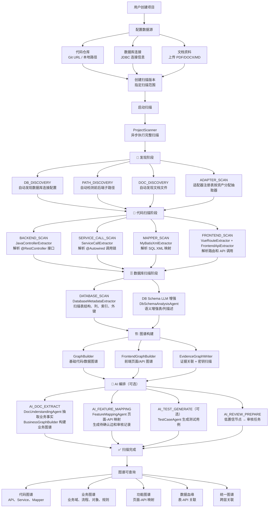

### 扫描生命周期

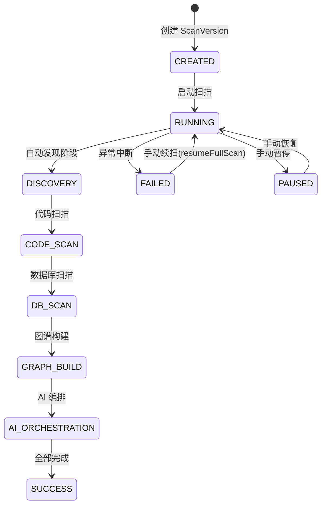

### 扫描内部执行流程（ProjectScanner）

```mermaid
flowchart TD
    START["startFullScan()<br/>@Async 异步入口"] --> INVALIDATE["失效图谱缓存<br/>graphCacheInvalidator"]
    INVALIDATE --> SET_RUNNING["设置 ScanVersion 状态为 RUNNING"]
    SET_RUNNING --> BODY["runScanBody()<br/>同步执行扫描主体"]

    BODY --> PARSE_SCOPE["解析 scanScope<br/>JSON → repoIds/dbIds/docIds/scanTypes"]
    PARSE_SCOPE --> RESOLVE_DIR["解析 baseDir<br/>从 CodeRepo 获取本地路径"]

    RESOLVE_DIR --> DISCOVERY["=== 发现阶段 ==="]
    DISCOVERY --> D1["DB_DISCOVERY<br/>扫描 application.yml/properties<br/>自动创建 DbConnection"]
    D1 --> D2["PATH_DISCOVERY<br/>检测 pom.xml/package.json<br/>回填 backend_sub_path/frontend_sub_path"]
    D2 --> D3["DOC_DISCOVERY<br/>扫描 .md/.pdf/.docx<br/>自动创建 Document 记录"]
    D3 --> D4["ADAPTER_SCAN<br/>ExtractionAdapterRegistry<br/>按资产匹配 Adapter 补充抽取"]

    D4 --> CODE_SCAN{"scanTypes<br/>包含 CODE_SCAN?"}
    CODE_SCAN -->|是| C1["BACKEND_SCAN<br/>JavaControllerExtractor<br/>扫描 Controller 接口"]
    C1 --> C2["SERVICE_CALL_SCAN<br/>ServiceCallExtractor<br/>扫描注入调用关系"]
    C2 --> C3["MAPPER_SCAN<br/>MyBatisXmlExtractor<br/>扫描 MyBatis XML"]
    C3 --> C4["FRONTEND_SCAN<br/>VueRouteExtractor + FrontendApiExtractor<br/>扫描前端路由/API"]
    C4 --> DB_SCAN
    CODE_SCAN -->|否| DB_SCAN{"scanTypes<br/>包含 DB_SCAN?"}

    DB_SCAN -->|是| DB1["遍历已配置的 DbConnection"]
    DB1 --> DB2["createDataSource()<br/>动态创建数据源连接"]
    DB2 --> DB3["DatabaseMetadataExtractor<br/>扫描表/列/索引/外键"]
    DB3 --> DB4["LLM Schema 增强<br/>DbSchemaAnalysisAgent<br/>语义增强表列描述"]
    DB4 --> GRAPH
    DB_SCAN -->|否| GRAPH

    GRAPH["=== 图谱构建 ==="]
    GRAPH --> G1["GraphBuilder<br/>构建基础代码/数据图谱"]
    G1 --> G2["EvidenceGraphWriter<br/>证据关联 + SecretScanService 密钥扫描"]
    G2 --> G3["Neo4jGraphDao<br/>写入 Neo4j 图数据库"]

    G3 --> AI{"enableAi=true?"}
    AI -->|是| A1["AiScanOrchestrator.orchestrate()"]
    A1 --> A2["AI_DOC_EXTRACT<br/>文档→业务事实→BusinessGraphBuilder"]
    A2 --> A3["AI_FEATURE_MAPPING<br/>页面-API 映射对齐"]
    A3 --> A4["AI_TEST_GENERATE<br/>可选：生成测试用例"]
    A4 --> A5["AI_REVIEW_PREPARE<br/>低置信节点→审核任务"]
    A5 --> SUCCESS
    AI -->|否| SUCCESS

    SUCCESS["设置 status=SUCCESS<br/>更新 finished_at"] --> END_SCAN["扫描结束"]

    BODY -->|异常| FAILED["设置 status=FAILED<br/>记录 errorMessage<br/>无自动重试"]
```

### AI 编排流程（AiScanOrchestrator）

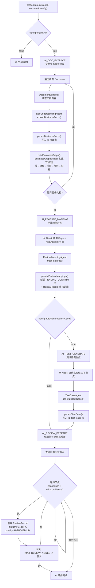

### 抽取适配器体系（ExtractionAdapter）

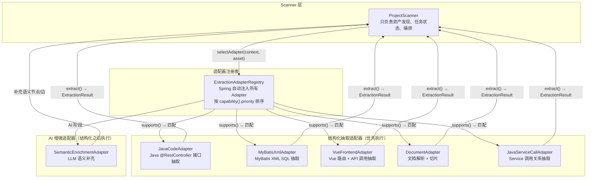

---

## 核心模块

### 项目和数据源

项目是最高组织单元，代码仓库、数据库连接、文档、扫描版本都挂在项目下。

主要类：

- `ProjectController` / `ProjectService`
- `SourceController`
- `CodeRepo`、`DbConnection`、`Document`
- `CodeRepoRepository`、`DbConnectionRepository`、`DocumentRepository`

代码仓库支持后端/前端子路径字段：`backend_sub_path`、`frontend_sub_path`。这允许同一个全栈仓库只扫描指定子目录。

### 图谱模块

图谱**写入和查询**均以 Neo4j 为主存储，PostgreSQL 仅保留证据关联和审核数据。

- **Neo4j**：所有图谱节点（GraphNode）和边（GraphEdge）的唯一读写存储。通过 Cypher MERGE 原子去重写入，Cypher MATCH 完成复杂路径、邻域、统计和拓扑查询。
- **PostgreSQL**：仅存储证据关联（`lg_evidence`、`lg_node_evidence`、`lg_edge_evidence`）和审核记录（`lg_review_record`）。`lg_graph_node` / `lg_graph_edge` 表在 `V5` 迁移中建表但**当前业务代码已不再写入**——`GraphNode` / `GraphNodeRepository` 已标记 `@deprecated`，仅保留 MyBatis-Plus Bean 定义维持 Spring 上下文兼容性。
- **`Neo4jGraphDao`**：Neo4j 唯一访问入口，提供 `mergeNode()`/`mergeEdge()`（幂等写入）、`queryNodes()`/`queryEdges()`（图谱查询）、`findNode()`/`findEdge()`（精确查找）等完整图谱操作。
- **`EvidenceGraphWriter`**：以证据为中心的统一写入器。所有 Builder 通过它调用 `Neo4jGraphDao.mergeNode()`/`mergeEdge()` 写入 Neo4j，同时在 PostgreSQL 创建证据记录（`lg_evidence` → `lg_node_evidence` / `lg_edge_evidence`），并集成 `SecretScanService` 对源码证据做密钥扫描脱敏。
- **`GraphQueryService`**：图谱查询入口，`getUnifiedGraph()` 等方法直接从 Neo4j 查询节点和边，并通过 Redis 缓存结果。
- **`Neo4jSyncService`**：已标记 `@Deprecated`，方法仅委托给 `Neo4jGraphDao`（如 `syncGraph` → `deleteGraph`），保留用于旧调用方兼容。

构建器：

| 类 | 职责 |
|----|------|
| `GraphBuilder` | 从后端代码、SQL、数据库元数据构建基础代码/数据图谱 |
| `FrontendGraphBuilder` | 从 Vue 路由和前端 API 构建页面、按钮、API 调用图谱 |
| `BusinessGraphBuilder` | 从文档理解/AI 事实构建业务域、流程、对象、规则图谱 |
| `EvidenceGraphWriter` | 以证据为中心写入节点/边并建立证据关联，集成 SecretScanService |
| `FeatureSliceBuilder` | 汇总功能切片，服务证据工作台 |
| `TraceGraphAligner` | 将运行时 Trace 对齐到静态图谱 |

图谱节点类型以 `NodeType` 为准，关系类型以 `EdgeType` 为准。

### AI 和 Agent 模块

LLM 入口是 `LlmGateway`：

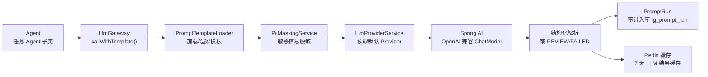

当前主要 Agent：

| Agent | 职责 |
|-------|------|
| `CodeFactAgent` | 代码事实语义理解 |
| `DocUnderstandingAgent` | 文档业务事实、角色、对象、规则、状态流转抽取 |
| `FeatureMappingAgent` | 页面、按钮、API、权限和业务动作对齐 |
| `GraphMergeAgent` | 图谱节点合并决策 |
| `TestCaseAgent` | 测试用例生成 |
| `ReviewAgent` | 人工审核建议 |
| `DbSchemaAnalysisAgent` | 数据库 Schema 语义增强 |
| `SqlAdvisorAgent` | SQL 性能优化建议 |
| `TestFailureAnalysisAgent` | 测试失败根因分析 |
| `ReportInsightAgent` | 报告洞察和行动建议 |
| `ChangeImpactAgent` | 变更影响分析 |
| `MigrationAgent` | 迁移转换建议 |
| `RefactorAgent` | 重构建议 |
| `PrDescriptionAgent` | PR 描述生成 |
| `QaAgent` | RAG + 图邻域问答 |

### 审核和证据

AI 产出的节点、边、事实默认不直接确认为真。系统通过以下数据保证可追溯：

- `lg_evidence`
- `lg_node_evidence`
- `lg_edge_evidence`
- `lg_review_record`
- `lg_prompt_run`

审核流程：

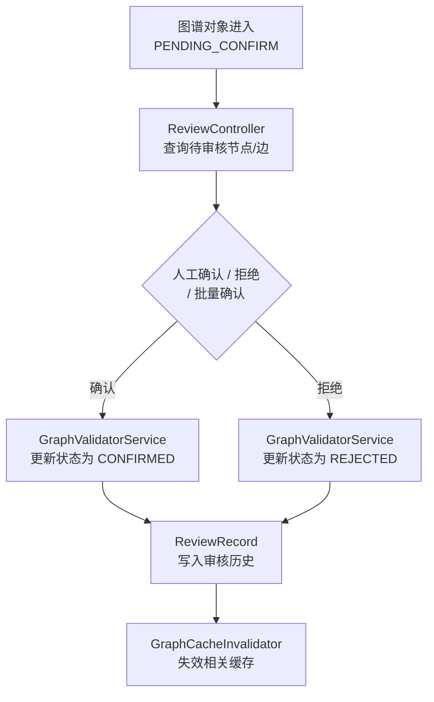

### 测试模块

测试模块包含用例管理、用例生成、执行批次、结果回调、失败分析和置信度回写。

主要类：

- `TestCaseController`
- `TestCaseService`
- `TestExecutionScheduler`
- `TestResultUpdateService`
- `ApiTestExecutor`
- `E2eTestExecutor`
- `DbAssertionExecutor`
- `TestFailureAnalysisAgent`

主要表：

- `lg_test_case`
- `lg_test_assertion`
- `lg_test_result`
- `lg_test_run`

### 报告模块

报告类型：

- 迁移就绪度报告
- 置信度趋势报告
- 测试覆盖率报告
- 图谱质量报告
- 报告洞察建议
- MD/PDF/Excel 导出

主要类：

- `ReportController`
- `ReportExportController`
- `ReportingService`
- `ReportExportService`
- `ReportInsightAgent`

### 向量和问答

向量能力由 `VectorizationService`、`VectorRetrievalService` 和 `VectorController` 提供。RAG 问答由 `GraphQaController` 和 `QaAgent` 提供，结合向量召回、图邻域和 LLM 生成回答。

### 运行时链路

运行时链路模块接收 span 上报，存入 `lg_runtime_trace`，并可查询运行时拓扑和 trace 列表。

主要类：

- `TraceController`
- `TraceIngestionService`
- `TraceGraphAligner`
- `RuntimeTrace`

运行时数据可用于：

- 标记静态节点是否被运行时验证。
- 为图谱合并和测试失败分析提供真实调用证据。
- 辅助识别 runtime-only 边和漂移队列。

---

## 数据流

### 静态扫描数据流

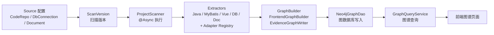

### AI 增强数据流

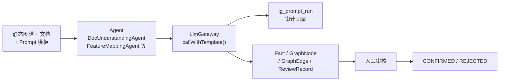

### 前端请求数据流

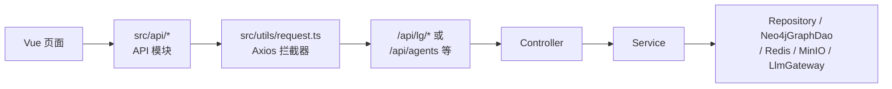

### 密钥扫描数据流（SecretScanService）

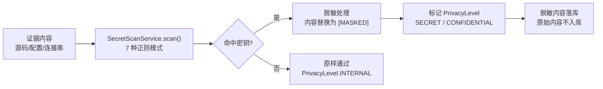

---

## 安全架构

### 认证

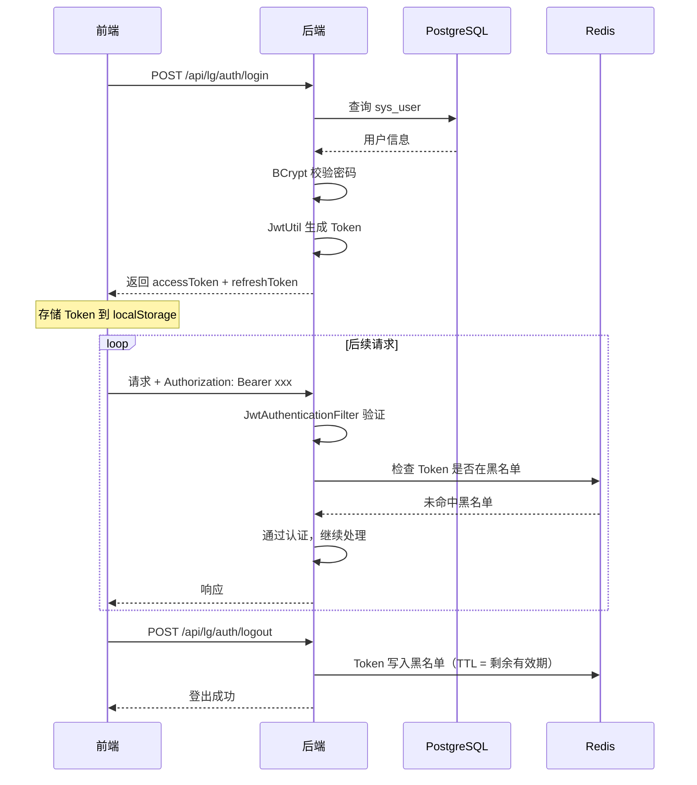

默认放行路径：

- `/lg/auth/login`
- `/lg/auth/refresh`
- `/lg/auth/me`
- `/lg/auth/logout`
- `/lg/projects/*/sources/documents/*/download`
- `/swagger-ui/**`
- `/v3/api-docs/**`
- `/swagger-ui.html`
- `/actuator/**`

### 审计

`@Log` + `LogAspect` 记录操作到 `sys_operation_log`。审计字段包含 traceId、操作名、方法、URI、请求方式、IP、操作者、耗时、请求参数、响应摘要和异常栈。

### 敏感信息

- Prompt 输入通过 `PiiMaskingService` 脱敏。
- LLM Provider API Key 存在 `lg_llm_provider.api_config` 中，日志不得明文输出。
- 数据库连接密码和 MinIO 密钥不得返回给前端。
- 源码证据入库前经 `SecretScanService` 扫描，命中密钥的内容脱敏后落库。

---

## 缓存架构

Redis 用途：

- Spring Cache。
- LLM Provider 和 Prompt 缓存。
- LLM 结果缓存，key 形态 `llm:result:{template}:{inputHash}`，TTL 7 天。
- JWT 登出黑名单。

缓存降级策略：

- Redis GET/PUT/EVICT/CLEAR 失败只记 warn，业务回源。
- 图谱、报告、验证、向量相关数据变更后使用缓存失效服务清理。

---

## 前端架构

```text
frontend/src
├── api             # API 模块
├── components      # 通用组件
├── composables     # Composition API
├── directives      # 指令
├── router          # Vue Router
├── stores          # Pinia
├── styles          # 全局样式
├── types           # TS 类型
├── utils           # request/download/export/loading 等
└── views           # 页面
```

主要页面域：

- Dashboard
- Projects / Project Detail
- Sources：Repos、Databases、Documents
- Scan Versions
- Graph：Code、Unified、Business、Feature、Lineage、Runtime
- Reviews / Review History
- Facts / Evidence
- Tests / Test Runs
- Validation / Reports
- Migration Risks
- Audit Logs
- Evidence Workbench
- System：Users、Dictionaries、Settings、LLM Provider、Prompt Templates

前端请求约定：

- `request.baseURL = '/api'`
- Vite 开发服务器端口 `5173`
- 开发代理 `/api -> http://localhost:8080`
- 页面组件不直接拼完整后端域名。

---

## 部署架构

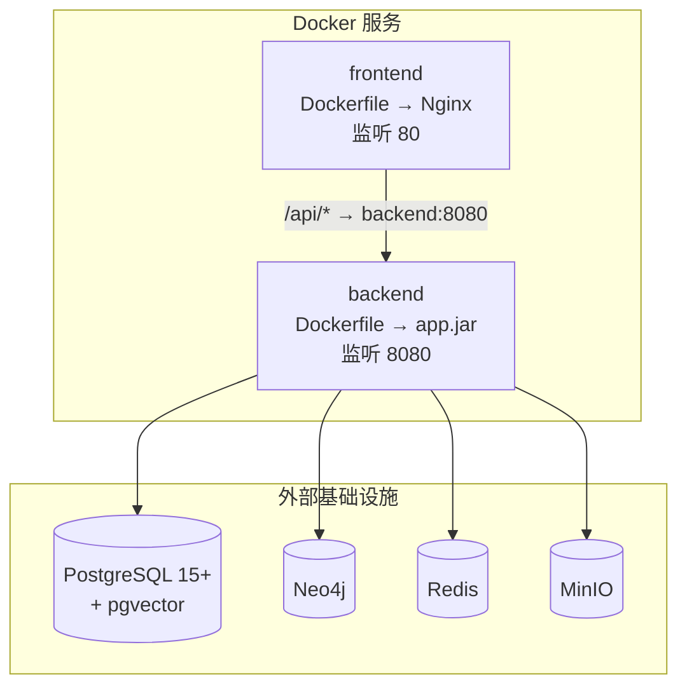

当前 `deploy/docker-compose.yml` 只包含前后端应用。PostgreSQL、Neo4j、Redis、MinIO 使用外部服务，通过 `deploy/.env` 注入连接信息。

---

## 可扩展性约定

### 新增表

1. 新增 Flyway 迁移脚本。
2. 新增实体和 Repository。
3. 如需 API，新增 Service 和 Controller。
4. 同步 H2 测试 schema/data。
5. 更新数据库设计文档。

### 新增图谱节点/关系

1. 更新 `NodeType` 或 `EdgeType`。
2. 更新构建器和 Neo4j 写入逻辑。
3. 更新前端类型、颜色、图例和筛选。
4. 增加 Builder/Service 测试。

### 新增 Agent

1. 在 `agent` 包新增 Agent 类。
2. 在 `lg_prompt_template` 增加模板。
3. 通过 `LlmGateway` 调用并写入 `lg_prompt_run`。
4. 增加结构化输出 DTO 和测试。
5. 如暴露 API，在 `LlmAgentController` 或独立 Controller 增加入口。

### 新增抽取适配器（ExtractionAdapter）

1. 实现 `ExtractionAdapter` 接口（`supports` + `extract` + `capability`）。
2. Spring 自动注入到 `ExtractionAdapterRegistry`。
3. 按 `AdapterCapability.priority` 自动排序。
4. 结构化的优先执行，AI 增强型在结构化之后执行。

---

## 版本历史

| 版本 | 日期 | 说明 |
|------|------|------|
| 1.3 | 2026-07-01 | 修正图谱存储描述：标注 PG 表已废弃（`@deprecated`），Neo4j 为唯一读写存储；补充 `GraphQueryService`、`Neo4jSyncService` 废弃状态；架构设计文档全部图表改为 Mermaid 格式 |
| 1.1 | 2026-06-30 | 按当前代码更新技术栈、模块、数据流、AI 编排、运行时链路、缓存和部署架构 |
| 1.0 | 2026-06-27 | 初始版本 |
