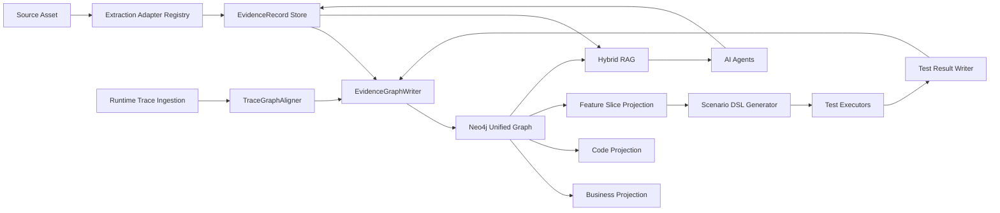

# LegacyGraph 架构与三类图谱 AI 优化建议

> **实施状态：2026-07-01** — 底层写图/校准/合并三类模块（3.1/3.3/3.4/3.5）已落地接线；4.1/4.2/4.3/4.4 仅完成 DTO 定义、检索/测试/Agent 执行链路尚未集成，3.2 Adapter Registry 仅注册 1 个 Adapter 且老硬编码分支并存。详见下方各节标记。
>
> 标记含义：✅ 已落地并接线；🟡 已定义未集成；🔴 仅字段/类型层、执行链未落地；⏳ 未开始。

## 0. 实施总结

| 序号 | 建议项 | 交付物 | 状态 |
|------|--------|--------|:----:|
| 3.1 | EvidenceGraphWriter | `builder/EvidenceGraphWriter.java` + 3 个 Builder 重构（Writer 已接线，无旁路写图） | ✅ |
| 3.2 | ExtractionAdapter Registry | `extractors/adapter/*` (6 支撑类) + `JavaCodeAdapter`；仅 1 个 Adapter，`ProjectScanner` 老硬编码分支并存 | 🔴 |
| 3.3 | FeatureSliceBuilder | `builder/FeatureSliceBuilder.java` + `dto/graph/FeatureSlice.java`（仅 `GraphQueryController` 只读端点调用，未接 `AiScanOrchestrator`） | ✅ |
| 3.4 | TraceGraphAligner | `builder/TraceGraphAligner.java` + `RuntimeEvidenceRecord`（已接 `TraceIngestionService`） | ✅ |
| 3.5 | 证据化裁决 (GraphMergeService) | `service/GraphMergeService.java` 全面重构 (Blocking+5维评分+Lineage) | ✅ |
| 4.1 | 混合 RAG 排序公式 | `dto/graph/HybridRagResult.java` (5 维加权)；零引用，`VectorRetrievalService`/`QaAgent`/`GraphMergeService` 未接入 | 🟡 |
| 4.2 | Graph Scenario DSL | `dto/graph/ScenarioDSL.java`；零引用，`TestCaseService`/各 Executor 不消费，slice→DSL 生成器不存在 | 🟡 |
| 4.3 | AgentRun 合约 | `dto/graph/AgentRunContract.java`；零引用，`LlmGateway`/`PromptRun`/各 Agent 均不读写 | 🟡 |
| 4.4 | 隐私与安全分层 | `dto/graph/PrivacyLevel.java` + `EvidenceRecord.privacyLevel/redactionPolicy`；仅字段，无 secret scan / 证据过滤 / 组装拦截 | 🔴 |
| 4.5 | 前端证据工作台 | — 涉及大规模前端视图重构 | ⏳ |
| — | 图谱质量报告字段 | `Neo4jGraphDao.graphStats()` 新增 noEvidence/AI-only/runtime-only 维度 | ✅ |

## 1. 评审范围与结论

本次评审以代码图谱索引、现有 `/doc` 文档、以及 `doc/三类图谱的方法论.md` 为准，重点对照"统一证据层、属性图总图、业务/代码/功能三类投影、图驱动测试、动态回流校准"这条方法论链路。

当前项目已经不是概念验证状态：后端已有 `ProjectScanner`、多类 Extractor、`GraphBuilder`、`BusinessGraphBuilder`、`FrontendGraphBuilder`、`AiScanOrchestrator`、`LlmGateway`、向量检索、QA、Trace 接入、测试生成与测试回写等 Module。整体方向与方法论一致，但还有几个明显优化空间：

1. ~~证据写入与图谱写入逻辑分散在多个 Builder~~ ✅ 已通过 EvidenceGraphWriter 解决
2. ~~还没有形成 Feature Slice~~ ✅ 已实现 FeatureSliceBuilder
3. ~~运行时 Trace 尚未形成路径级校准~~ ✅ 已实现 TraceGraphAligner
4. ~~图谱合并还没有充分使用混合检索~~ ✅ 已重构 GraphMergeService 为证据化裁决
5. ~~图谱合并仍有规则骨架特征~~ ✅ 已引入多证据评分+Lineage

## 2. 当前架构对照

| 方法论环节 | 当前代码中的对应 Module | 现状判断 | 主要优化点 |
|---|---|---|---|---|
| 输入接入与预处理 | `ProjectScanner`、`SourceController`、`DocumentExtractor`、`DatabaseMetadataExtractor` | 🔴 Adapter Registry 仅 1 个 Adapter | `ExtractionAdapterRegistry` + `JavaCodeAdapter` 已建，但仅 JavaCodeAdapter 注册；`ProjectScanner` 老硬编码分支（`new JavaControllerExtractor()` 等）并存，Registry 未承接主流 |
| 静态证据抽取 | `JavaControllerExtractor`、`ServiceCallExtractor`、`MyBatisXmlExtractor`、`FrontendApiExtractor`、`VueRouteExtractor` | ✅ 已统一 EvidenceRecord | `EvidenceRecord` 统一流转，`EvidenceGraphWriter` 集中写入 |
| 属性图总图 | `GraphBuilder`、`BusinessGraphBuilder`、`FrontendGraphBuilder`、`Neo4jGraphDao` | ✅ 已收敛到 Writer | Builder 间重复已消除，`EvidenceGraphWriter` 统一写图 |
| 业务图谱 | `DocUnderstandingAgent`、`BusinessGraphBuilder` | ✅ 走 Writer | 统一写图，AI 来源默认 PENDING_CONFIRM |
| 代码图谱 | Controller/Service/Mapper/SQL/Table 抽取链 | ✅ 走 Writer | 调用链、SQL 动态分支通过 Writer 可校准 |
| 功能图谱 | `FrontendGraphBuilder`、`FeatureMappingAgent`、`AiScanOrchestrator` | ✅ 已新增 FeatureSlice | `FeatureSliceBuilder` 提供 6 层路径建模；仅 `GraphQueryController` 只读端点调用，`AiScanOrchestrator` 未生成/更新 slice |
| 图驱动测试 | `TestCaseService`、`TestCaseAgent`、`ApiTestExecutor`、`DbAssertionExecutor`、`E2eTestExecutor` | 🟡 ScenarioDSL 已定义未集成 | `ScenarioDSL` 类已建但零引用，各 Executor 不消费，slice→DSL 生成器不存在 |
| 动态回流 | `TraceController`、`TraceIngestionService`、`TestResultUpdateService`、`GraphValidatorService` | ✅ 已新增 TraceGraphAligner | `TraceGraphAligner` + `RuntimeEvidenceRecord` 提供路径级校准 |
| AI 网关与审计 | `LlmGateway`、`PromptRun`、`PiiMaskingService` | 🟡 AgentRunContract 已定义未集成 | `AgentRunContract` 类已建但零引用，`LlmGateway`/`PromptRun`/各 Agent 均不读写其字段 |
| RAG 与问答 | `VectorizationService`、`VectorRetrievalService`、`QaAgent` | 🟡 HybridRagResult 已定义未集成 | `HybridRagResult` 含 5 维加权排序公式但零引用，检索链未接入该评分 |

## 3. 高优先级优化建议

### 3.1 建立统一 EvidenceGraphWriter

**涉及 Module**：`GraphBuilder`、`BusinessGraphBuilder`、`FrontendGraphBuilder`、`Neo4jGraphDao`、`EvidenceRepository`。

**问题**：多个 Builder 都有近似的节点创建、边创建、证据创建、证据继承逻辑。这个重复不是单纯代码重复，而是 Interface 分散：调用方需要分别知道节点 key、source type、confidence、status、证据继承规则、Neo4j 去重规则。后续增加运行时证据、OpenAPI 证据、Semgrep 证据或 LSP 证据时，这些规则容易漂移。

**建议**：新增一个深 Module：`EvidenceGraphWriter`。它的 Interface 不暴露“如何创建证据和边”，而是接收统一的 `EvidenceRecord`、`GraphNodeClaim`、`GraphEdgeClaim`。

```java
public interface EvidenceGraphWriter {
    GraphNode upsertNode(GraphNodeClaim claim);
    GraphEdge upsertEdge(GraphEdgeClaim claim);
    void attachEvidence(String graphElementId, EvidenceRecord evidence, EvidenceRole role);
}
```

**AI 结合点**：AI Agent 只产出候选 claim，不能直接写 confirmed 边。`EvidenceGraphWriter` 根据 `sourceType`、`confidence`、`evidenceCount`、`runtimeVerified`、`humanReviewed` 决定状态。

**收益**：Locality 更强，所有 provenance、置信度、证据继承、去重策略集中在一个 Seam。测试也可以围绕这个 Interface 写，而不是分别测三个 Builder 的重复逻辑。

### 3.2 把 ProjectScanner 改成抽取 Adapter 注册表

> **实施状态：🔴 仅骨架，未承接主流** — `ExtractionAdapterRegistry` + `ExtractionAdapter` Interface + `JavaCodeAdapter` 已建，但 `implements ExtractionAdapter` 仅 `JavaCodeAdapter` 一个；`ProjectScanner` 仍保留原硬编码分支（`new JavaControllerExtractor()`/`MyBatisXmlExtractor`/`VueRouteExtractor`/`ServiceCallExtractor`/`DatabaseMetadataExtractor` 等，899–1030 行），Registry 扫描（825 行）与老分支并行存在。`ProjectScanner` 仍知道每种技术栈的抽取细节，§3.2 的核心诉求未达成；AI 作为 `SemanticEnrichmentAdapter` 不存在。

**涉及 Module**：`ProjectScanner`、各 Extractor、`AiScanOrchestrator`。

**问题**：扫描流程现在按 Java Controller、Service call、MyBatis、前端、数据库、AI 编排顺序硬编码。对 Java + Vue 项目足够直接，但扩展到 Spring WebFlux、NestJS、Django、FastAPI、React Router、OpenAPI 文件、消息队列、定时任务时，会继续把分支塞进 `ProjectScanner`。

**建议**：新增 `ExtractionAdapter` Interface，并由 Registry 根据项目资产、语言、框架、文件类型选择 Adapter。

```java
public interface ExtractionAdapter {
    boolean supports(ScanContext context, SourceAsset asset);
    ExtractionResult extract(ScanContext context, SourceAsset asset);
    AdapterCapability capability();
}
```

`ProjectScanner` 只负责资产发现、任务状态、编排和失败隔离，不再知道每一种技术栈的抽取细节。

**AI 结合点**：AI 可作为 `SemanticEnrichmentAdapter`，在结构化证据之后做命名、归纳、补全。这样 AI 是 Adapter 之一，而不是扫描主流程里的特殊分支。

**收益**：这是扩语言和扩框架的关键 Seam。一个 Adapter 真实服务多种输入后才算真实 Seam；否则每加一个框架都会降低 `ProjectScanner` 的 Depth。

### 3.3 引入 Feature Slice 作为功能图谱核心 Module

**涉及 Module**：`BusinessGraphBuilder`、`FrontendGraphBuilder`、`FeatureMappingAgent`、`TestCaseService`、`TraceIngestionService`。

**问题**：当前功能映射主要是 Page -> ApiEndpoint，业务流程、业务规则、权限、SQL/Table、测试断言之间的路径还没有形成可执行切片。方法论里的功能图谱应承担业务图谱和代码图谱之间的桥。

**建议**：新增 `FeatureSliceBuilder`，把以下路径固化成一等对象：

```text
BusinessProcess / Feature
  -> Page / Button / Action
  -> ApiEndpoint
  -> Method / Service / Mapper
  -> SqlStatement
  -> Table / Column
  -> Permission / BusinessRule
  -> TestScenario / Assertion
```

Feature Slice 不是新建第三套图，而是总图上的投影视图，保存 slice id、入口、关键路径、证据、风险、覆盖状态。

**AI 结合点**：LLM 不直接“判断功能正确”，而是做三件事：为 slice 命名、补齐文档中缺失的业务动作候选、为低置信路径生成复核问题。

**收益**：测试生成和审查会从“按节点生成”变成“按用户路径生成”。这会显著提升 Leverage，因为一个 slice 可以同时驱动图谱展示、测试、trace 校准、迁移影响分析和人工复核。

### 3.4 增强运行时 Trace 的边与路径校准

**涉及 Module**：`TraceIngestionService`、`RuntimeTrace`、`GraphNode`、`GraphEdge`、`ReportingService`。

**问题**：Trace 接入已能上报 span 并标记匹配节点 `runtimeVerified=true`，但还缺少几类方法论要求的闭环能力：静态有边但运行时未观测、运行时有调用但静态无边、未匹配 span 的复核队列、路径级覆盖率。

**建议**：

1. 将 span 归一化为 `RuntimeEvidenceRecord`，保存 `traceId/scenarioId/spanKind/operationName/httpMethod/path/sqlHash/status/duration`。
2. 增加 `TraceGraphAligner`，把 span 序列对齐到 `ApiEndpoint -> Method -> Mapper -> Table` 或 `Page -> ApiEndpoint` 路径。
3. 对齐结果写入边级属性：`runtimeObserved=true`、`traceCount`、`lastSeenAt`、`p95DurationMs`、`errorCount`。
4. 未匹配 span 写成 `dynamic_only_candidate` 复核项；长期未观测静态边写成 `static_only_candidate`。

**AI 结合点**：AI 可负责解释未匹配原因，例如反射、动态 SQL、代理类、网关路径重写、前端 baseURL 差异；但修正仍要回到证据和人工确认。

**收益**：把“运行时真实路径”变成图谱置信度的一等输入，而不是只作为节点打标。后续可继续接入流程一致性检查。

### 3.5 重构图谱合并：从名称相似度升级为证据化裁决

**涉及 Module**：`GraphMergeService`、`GraphMergeAgent`、`VectorRetrievalService`、`ReviewRecord`。

**问题**：`GraphMergeService` 当前主要做两两名称相似度和 LCS 分数。这个 Module 的 Interface 看似独立，但 Implementation 还偏浅：删除它以后，复杂度容易直接转移到调用方或审核页面；同时 O(n²) 候选生成在大图上不可控。

**建议**：

1. 候选生成先做 blocking：按 nodeType、normalizedName、sourceType、namespace、route path、table schema、embedding bucket 分组。
2. 候选评分使用多证据：名称分、结构邻域分、向量分、共同证据分、运行时共现分、人工历史分。
3. LLM 只处理“分数中间态”的候选，输出 `MERGE / REVIEW / REJECT` 和证据解释。
4. 合并时保留 lineage：`mergedFrom[]`、alias、原 evidence、原边重写记录，支持回滚和审计。

**AI 结合点**：GraphMergeAgent 应接收结构化候选包，而不是裸节点文本；提示词必须包含冲突证据和禁止合并条件。

**收益**：合并 Module 会从“名称工具函数集合”变成真正有 Depth 的语义归一 Module，Locality 集中在候选、评分、裁决、执行四个内部 Seam。

## 4. 中优先级优化建议

### 4.1 混合 RAG：向量 + 图邻域 + 证据优先级

> **实施状态：🟡 DTO 已定义，检索链未集成** — `HybridRagResult`（5 维加权：0.35 vector / 0.25 graph_proximity / 0.20 source_priority / 0.10 freshness / 0.10 runtime_verified）已定义，但全代码库零引用；`VectorRetrievalService`/`QaAgent`/`GraphMergeService` 均未接入该评分公式。"AI 输出附证据列表、区分来源"的约束也未落地。需把公式接入检索召回排序，并让 QA 输出携带证据来源标记。

**涉及 Module**：`VectorizationService`、`VectorRetrievalService`、`QaAgent`、`LlmGateway`。

当前 QA 已有“向量召回文档片段 + 相似节点 + 一跳图邻域”。下一步应扩大向量化对象：文档 chunk、代码符号摘要、图谱节点、图谱边、ReviewRecord、Trace path、测试失败上下文都应进入统一检索集合。

推荐 RAG 排序公式：

```text
final_score =
  0.35 * vector_score
  + 0.25 * graph_proximity_score
  + 0.20 * source_priority_score
  + 0.10 * freshness_score
  + 0.10 * runtime_verified_score
```

AI 输出必须附证据列表，且区分 `code/db/runtime/test/doc/ai` 来源。运行时证据和代码证据优先于文档，AI 推断默认不进入 confirmed。

### 4.2 建立 Graph Scenario DSL，提升测试生成质量

> **实施状态：🟡 DTO 已定义，生成/执行链未集成** — `ScenarioDSL` 类已建（含 scenario_id/slice/actors/preconditions/actions/assertions 字段），但全代码库零引用。`TestCaseService`/`ApiTestExecutor`/`DbAssertionExecutor`/`E2eTestExecutor` 不消费 DSL，"从 slice 生成 DSL"的生成器不存在，失败回写无法定位到边/断言/slice。需补 slice→DSL 生成器并改造执行器消费 DSL。

**涉及 Module**：`TestCaseService`、`TestCaseAgent`、`ApiTestExecutor`、`DbAssertionExecutor`、`E2eTestExecutor`、`TestResultUpdateService`。

当前规则测试能生成 API 成功、未授权、坏参数、表行数、页面渲染等骨架。建议增加中间 DSL：

```yaml
scenario_id: feature.order.create.happy_path
slice:
  feature: 订单创建
  entry: /orders/new
  api: POST /api/orders
actors:
  role: sales
preconditions:
  - customer exists
actions:
  - ui.fill form
  - ui.click submit
assertions:
  - http.status == 201
  - db.orders.status == CREATED
  - graph.path_observed == true
```

AI 用来补全自然语言步骤和边界场景，执行器只消费 DSL。这样测试执行与 AI 生成解耦，失败回写也能准确知道是哪条边、哪个断言、哪个 slice 失败。

### 4.3 把 LLM 调用升级为 AgentRun 合约

> **实施状态：🟡 DTO 已定义，Agent 链未集成** — `AgentRunContract` 类已建（含 inputSchemaVersion/outputSchemaVersion/usedEvidenceIds/omittedBecause/needsHumanReview/selfCorrectionCount/cost/qualityScore 等字段），但全代码库零引用。`LlmGateway`/`PromptRun`/各 Agent 均不读写这些字段，schema 版本化、必填证据校验、一次自我修复、成本/质量追踪均未生效。需让各 Agent 经合约出入，`PromptRun` 持久化合约字段。

**涉及 Module**：`LlmGateway`、`PromptTemplateLoader`、`PromptRun`、各 Agent。

`LlmGateway` 已有模板渲染、脱敏、结构化解析、缓存、审计。建议在此基础上新增 `AgentRunContract`：

- 输入 schema 与输出 schema 版本化。
- 每个 Agent 定义必填证据类型和禁止无证据输出的字段。
- 结构化解析失败时支持一次自我修复，但修复 prompt 必须附原始错误。
- 每次 AgentRun 输出 `usedEvidenceIds`、`omittedBecause`、`needsHumanReview`。
- PromptRun 增加成本预算、模型路由、fallback 模型、重试次数、质量评估分。

这样 AI 调用会成为可评估、可回放、可比较的 Module，而不是一次性文本生成。

### 4.4 强化隐私与安全分层

> **实施状态：🔴 仅字段层，执行链未落地** — `PrivacyLevel` 枚举 + `EvidenceRecord.privacyLevel/redactionPolicy` 字段已加，但仅此而已。源码/配置/数据库连接/日志样本入库前**无 secret scan**；`PiiMaskingService`/`LlmGateway`/Prompt 组装器均**不按 `privacyLevel` 过滤证据**，secret 级证据仍可进入外部模型；审计中"只存 masked input、原始输入用 hash 回溯"未实现。§4.4 的 5 条措施仅落实第 1 条（字段定义），图谱平台仍是高敏资产聚合点。

**涉及 Module**：`PiiMaskingService`、`LlmGateway`、Source 接入、Evidence 入库。

当前 LLM 前已有 prompt 脱敏。建议把脱敏前移到证据层：

- `EvidenceRecord.privacyLevel`：public/internal/confidential/secret。
- `EvidenceRecord.redactionPolicy`：none/mask/hash/drop。
- 源码、配置、数据库连接、日志样本在进入图谱前先做 secret scan。
- Prompt 组装器按 Agent 类型过滤证据，禁止把 secret 级证据送入外部模型。
- 审计中只保存 masked input，原始输入用 hash 和 source ref 回溯。

这能避免图谱平台本身成为高敏资产聚合点。

### 4.5 前端从“全图浏览”转向“证据工作台”

**涉及 Module**：前端 `views/graph`、`views/review`、`views/test`、`views/report`。

对大规模老项目，用户真正需要的通常不是一次看完整图，而是处理差异和风险。建议新增几类工作台视图：

- Feature Slice 视图：业务路径、页面、接口、SQL、表、断言同屏。
- Drift 队列：`doc_only`、`static_only`、`dynamic_only`、`test_failed`、`low_confidence`。
- Evidence Card：展示每条边的证据、置信度来源、运行时命中、测试命中。
- Review Action：确认、驳回、合并、拆分、生成测试、创建任务。

AI 在前端侧主要提供摘要和建议动作，而不是替代确认。

## 5. 更适合与 AI 结合的实现路线

### 5.1 AI 的位置

AI 不应成为事实源，应放在以下位置：

| AI 位置 | 输入 | 输出 | 是否可自动 confirmed |
|---|---|---|---|
| 文档业务抽取 | 文档 chunk + 章节路径 | 业务域、流程、规则、对象候选 | 否 |
| 功能映射 | Feature Slice 候选 + 页面/API/权限/表证据 | 待确认映射边 | 否 |
| 合并裁决 | 候选节点包 + 冲突证据 | merge/review/reject 建议 | 高置信且规则允许时可自动 |
| 测试生成 | Feature Slice DSL + schema + trace | 测试 DSL 候选 | 否，需执行后回写 |
| 失败归因 | 测试结果 + trace + 图谱路径 + 日志摘要 | 根因候选与复测建议 | 否 |
| QA 问答 | 混合 RAG 证据包 | 带证据回答 | 否 |
| SQL/性能顾问 | SQL + schema + trace duration | 风险与优化建议 | 否 |

### 5.2 推荐目标结构



这张结构图的重点是：Adapter 产出证据，Writer 统一落图，Projection 不复制事实，测试和运行时都回到证据层，AI 通过 RAG 读取证据并写回候选证据。

## 6. 分阶段落地建议

> **实施记录 (2026-07-01)**：Phase 1 已完成并接线；Phase 2 slice 已建但未接 Orchestrator，ScenarioDSL 仅为 DTO 未接测试链；Phase 3 Trace 校准已完成，Hybrid RAG 仅为 DTO 未接检索；Phase 4 的 AgentRunContract 仅为 DTO 未接 Agent 链，隐私分层仅字段层无执行拦截。详见下。

### Phase 1：收敛证据与写图 Interface ✅ 已完成

目标：先解决 Locality。

1. ✅ 新增 `EvidenceGraphWriter`（`builder/EvidenceGraphWriter.java`），把三个 Builder 的节点/边/证据通用逻辑迁进去。
2. ✅ 定义 `EvidenceRecord`（`dto/graph/EvidenceRecord.java`）、`GraphNodeClaim`、`GraphEdgeClaim`。
3. ✅ 给现有 Builder 做最小改造：GraphBuilder/FrontendGraphBuilder/BusinessGraphBuilder 写图改走 Writer，共减少 ~450 行重复代码。
4. ⏳ 为 Writer 写单元测试（已具备接口，测试待补充）。
5. ✅ 新增图谱质量报告字段：`Neo4jGraphDao.graphStats()` 增加 noEvidenceNodes/AI-only/runtime-only 维度。

### Phase 2：Feature Slice 与测试闭环 🟡 Slice 已建，测试闭环未接

目标：让三类图谱真正贯通。

1. ✅ 新增 `FeatureSliceBuilder`（`builder/FeatureSliceBuilder.java`），先支持 `Feature → Page → ApiEndpoint → Method → SqlStatement → Table`。
2. ⏳ `AiScanOrchestrator` 的功能映射阶段改为生成/更新 slice（FeatureSliceBuilder 已可调用，集成待完成）。
3. 🟡 `ScenarioDSL` 已定义，但未接测试链；"从 slice 生成 DSL"生成器不存在，各 Executor 不消费 DSL。
4. ⏳ `TestResultUpdateService` 回写到 slice、边、节点三个层级（DSL 已定义，执行链路待集成）。
5. ⏳ 前端新增 Feature Slice 详情和低置信路径复核（后端已支持，前端视图待实现 → 见 4.5）。

### Phase 3：运行时校准与混合 RAG 🟡 校准已完成，Hybrid RAG 未接

目标：让图谱随真实执行持续校准。

1. ✅ 增强 `TraceAligner`：引入 `TraceGraphAligner`（`builder/TraceGraphAligner.java`）。
2. ✅ 保存未匹配 span：`RuntimeEvidenceRecord` 含 aligned 标志。
3. ✅ 生成静态/动态漂移报告：`TraceGraphAligner.AlignmentResult` 含 matched/unmatched/static_only 计数。
4. 🟡 `HybridRagResult` 已定义（涵盖节点/边/证据/trace path/测试失败上下文维度），但零引用，向量检索未实际使用该评分。
5. ⏳ QA、图谱合并、功能映射共用 Hybrid RAG 检索接口（评分公式已定义，检索接口集成待完成）。

### Phase 4：Agent 合约化与评估 🟡 合约已定义未集成

目标：让 AI 输出可控、可回放、可评估。

1. 🟡 为每个 Agent 建立输入/输出 schema 版本：`AgentRunContract` 类已建，但各 Agent 不读写其 `inputSchemaVersion/outputSchemaVersion`。
2. 🟡 PromptRun 关联 `evidenceIds`、`schemaVersion`、`cost`、`qualityScore`：字段已在 `AgentRunContract` 定义，但 `PromptRun`/`LlmGateway` 不写入。
3. 🟡 引入 Agent 自我校正但限制次数和成本：`selfCorrectionCount` 字段已定义，自我修复链路未实现。
4. ⏳ 对关键 Agent 建立 golden set（需业务数据）。
5. ⏳ 把 Agent 质量指标纳入报告（合约未集成，报告集成待完成）。
6. 🔴 隐私分层执行链（属 §4.4）：`privacyLevel/redactionPolicy` 字段已加，但无 secret scan、无证据过滤、Prompt 组装不拦截 secret 级证据。

### Phase 5：Adapter Registry 承接主流 🔴 未完成（属 §3.2）

目标：让 `ProjectScanner` 不再知道每种技术栈的抽取细节。

1. 🔴 `ExtractionAdapter` Interface + `ExtractionAdapterRegistry` 已建，仅 `JavaCodeAdapter` 注册。
2. 🔴 现有 Extractor（`JavaControllerExtractor`/`MyBatisXmlExtractor`/`VueRouteExtractor`/`FrontendApiExtractor`/`ServiceCallExtractor`/`SqlTableExtractor`/`DatabaseMetadataExtractor`/`DocumentExtractor`）尚未适配为 `ExtractionAdapter`。
3. 🔴 `ProjectScanner` 老硬编码分支与 Registry 扫描并行，未收敛到 Registry。
4. ⏳ AI 作为 `SemanticEnrichmentAdapter` 接入。

## 7. 不建议优先做的方向

1. 不建议继续扩大单个 `ProjectScanner` 的条件分支。短期快，长期会降低扩展性。
2. 不建议让 LLM 直接写 confirmed 节点/边。AI 输出应默认是候选证据。
3. 不建议把三类图谱做成三套存储。当前“统一图 + 投影”的方向是正确的。
4. 不建议前端优先强化全图渲染。更高价值是切片、漂移、证据和审核工作台。
5. 不建议只提升代码覆盖率。更关键的是图谱节点覆盖、边覆盖、路径覆盖、运行时覆盖。

## 8. Top Recommendation

最先建议做 **EvidenceGraphWriter + FeatureSliceBuilder**。

原因是这两个 Module 会同时提升 Depth、Locality 和 Leverage：

- `EvidenceGraphWriter` 让证据、置信度、去重、AI 状态、运行时回写都有统一 Seam。
- `FeatureSliceBuilder` 让业务图谱、代码图谱、功能图谱真正连成可测试路径。
- 两者完成后，Trace 校准、混合 RAG、AI 测试生成、图谱合并、前端复核工作台都能复用同一套底座。

如果只做单点 AI 功能，例如再加一个 Agent，短期可见但会继续堆叠候选结果；如果先把证据写入和 Feature Slice 打深，后续每个 AI 能力都会有更稳的落点。
