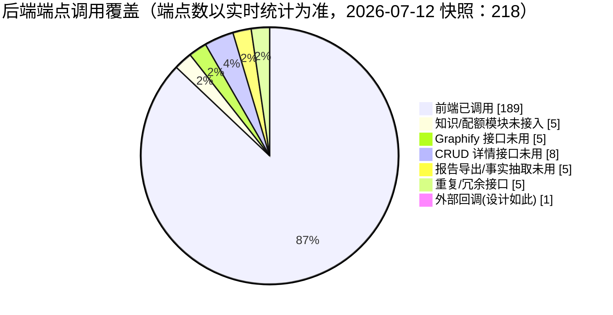

# 前后端接口一致性检查报告

> 检查日期：2026-07-06
> 检查范围：后端 `backend/src/main/java/io/github/legacygraph/controller/`（Controller 数请以实时统计为准，2026-07-12 快照：48）与前端 `frontend/src/`（19 个 API 模块 + 视图直接调用）
> 目的：找出「前端有调用、后端未实现」与「后端已实现、前端未调用」的接口偏差

---

## 1. 检查方法

1. 用脚本从后端每个 Controller 提取所有 `@*Mapping` 端点（含 `value=`/`path=` 形式，如 SSE 的 `@GetMapping(value="/stream", produces=...)`），得到 **218 个端点**（端点数请以实时统计为准，2026-07-12 快照：218）。
2. 用脚本从前端所有 `.ts`/`.vue` 提取 API 调用（`get/post/put/del/upload/downloadFile/request.*/fetch`），归一化路径参数（`${x}` 与 `{x}` 统一为 `{}`），得到 **187 个调用点**（调用点数请以实时统计为准，2026-07-12 快照：187）。
3. 对两端做集合差集：
   - **A = 前端调用 − 后端端点**：前端有、后端没有。
   - **B = 后端端点 − 前端调用**：后端有、前端没有。
4. 对所有歧义项（变量拼接 URL、`fetch(baseUrl+...)`、`@GetMapping(value=...)` 等）逐一用 grep 验证，剔除假阳性。

> 结论速览：**A 类（前端有/后端缺）1 处，是真实 Bug**；**B 类（后端有/前端缺）29 处**，其中 1 处为外部回调（设计如此），其余为前端缺功能入口或 CRUD 详情接口未单独拉取。

---

## 2. A 类：前端有调用、后端未实现（1 处，真实 Bug）✅ 已修复

| 前端调用 | 前端位置 | 问题 |
|---|---|---|
| `GET /lg/projects/{projectId}/graphify/quality` | `frontend/src/api/graphify.api.ts:99` `getQuality()`；由 `frontend/src/views/graphify/GraphifyQualityDashboard.vue:157` 调用 | 后端**没有** `/graphify/quality`。后端只有 `GET /lg/projects/{projectId}/graph/quality`（`backend/.../controller/GraphQueryController.java:258`，是 `graph` 不是 `graphify`）。该「Graphify 质量仪表盘」页面一打开即 404。 |

**修复方案**（已实施）：后端新增 `GET /lg/projects/{projectId}/graphify/quality` 端点。该仪表盘展示的是 Graphify 专属的 Benchmark 结果与 Release Gate 状态（`releaseGatePassed`/`overallScore`/`nodeCoverage`/`edgeCoverage`/`benchmarkResults`），与 `/graph/quality`（图谱质量统计）语义不同，故采用「后端补端点」而非改前端路径。

新增/修改：
- `backend/.../eval/GraphifyQualityResult.java`（新）— DTO，字段与前端 `GraphifyQualityResult` 对齐。
- `backend/.../eval/GraphifyQualityService.java`（新）— 基于实际导入 Neo4j 的 Graphify 节点/边键（`GRAPHIFY_AST`/`GRAPHIFY_SEMANTIC`），对 benchmark 用例评分并聚合；无 benchmark 样例时退化为数据存在性评估；`versionId` 为空时取项目最新扫描版本。
- `backend/.../eval/GraphifyBenchmarkCaseRegistry.java`（新）— benchmark 用例注册表，默认空（仓库无内置样例），可扩展。
- `backend/.../controller/GraphifyController.java`（改）— 新增 `@GetMapping("/graphify/quality")` 端点。
- `backend/.../eval/GraphifyQualityServiceTest.java`（新）— 4 个单元测试，覆盖无数据/有数据无样例/benchmark 通过/benchmark 失败四条路径，全绿。

前端无需改动（路径本就正确，缺的是后端端点）。响应经 `utils/request.ts` 拦截器解包 `Result.data`，仪表盘可直接读取字段。

**附带修复**：为解除测试编译阻塞，顺带修复了 3 个既有测试（与本 Bug 无关，此前即编译/运行失败）：`GraphifyControllerTest`（构造器新增依赖）、`GraphifyDiffControllerTest`（`ResponseEntity`→`Result`）、`AiScanOrchestratorTest`（构造器缺 `EvidenceGraphWriter`，且一个用例的边写入校验从 `neo4jGraphDao.createEdge` 改为 `evidenceGraphWriter.upsertEdge`）。全部通过。

---

## 3. B 类：后端已实现、前端未调用（29 处）

### B1. 整块后端模块，前端无任何 UI（影响最大）

| 端点 | Controller | 说明 |
|---|---|---|
| `GET /lg/projects/{projectId}/knowledge/claims` | KnowledgeController | 知识断言列表 |
| `GET /lg/projects/{projectId}/knowledge/claims/{id}` | KnowledgeController | 断言详情 |
| `GET /lg/projects/{projectId}/knowledge/gaps` | KnowledgeController | 知识缺口列表 |
| `POST /lg/projects/{projectId}/knowledge/gaps/{id}/resolve` | KnowledgeController | 标记缺口已解决 |
| `GET /lg/quota/{projectId}` | QuotaController | 租户配额查询 |

> 后端已建 `lg_knowledge_claim`/`lg_gap_task` 表并实现 KnowledgeController 4 个接口、QuotaController 配额接口，但前端**无 `knowledge.api.ts`、无配额相关调用**，全仓 grep 0 命中。**知识断言/缺口/配额功能后端完整、前端完全未接入。**

### B2. Graphify 接口前端未调用

| 端点 | 说明 |
|---|---|
| `POST /lg/projects/{projectId}/graphify/analyze` | 同步分析；前端用 `import`/`run` 代替 |
| `GET /lg/projects/{projectId}/graphify/status` | Graphify CLI 可用性检查 |
| `POST /lg/projects/{projectId}/graphify/jobs` | 创建导入作业 |
| `GET /lg/projects/{projectId}/graphify/jobs/{jobId}` | 单作业详情 |
| `POST /lg/projects/{projectId}/graphify/jobs/{jobId}/cancel` | 取消作业 |

> `GraphifyJobCenterView.vue` 只用了 `getJobs` / `retryJob` / `rollbackJob`，**没有「创建作业 / 查看详情 / 取消」的入口**。

### B3. CRUD 详情（get-by-id）接口前端未用

前端列表接口普遍返回完整对象，故未单独拉取详情：

| 端点 | 说明 |
|---|---|
| `GET /lg/projects/{projectId}/sources/databases/{id}` | 数据库连接详情 |
| `GET /lg/projects/{projectId}/sources/documents/{id}` | 文档详情 |
| `GET /lg/projects/{projectId}/sources/repos/{id}` | 代码仓库详情 |
| `GET /lg/system/configs/{id}` | 系统配置详情 |
| `GET /lg/system/dicts/{id}` | 字典类型详情 |
| `GET /lg/system/users/{id}` | 用户详情 |
| `GET /lg/projects/{projectId}/evidence/{id}/related` | 证据关联节点（前端用 `/facts/{id}/related-nodes` 代替） |
| `DELETE /lg/audit/{id}` | 删除单条审计日志（前端只有 `/lg/audit/clear` 全清） |

### B4. 报告导出 / 事实抽取接口未用

| 端点 | 说明 |
|---|---|
| `GET /reports/code-understanding/{projectId}/{versionId}` | 代码理解报告导出 |
| `GET /reports/scan-research/{projectId}/{versionId}` | 扫描研究报告导出 |
| `POST /lg/projects/{projectId}/extract/facts/code` | LLM 代码事实抽取 |
| `POST /lg/projects/{projectId}/extract/facts/doc` | LLM 文档事实抽取 |
| `GET /lg/projects/{projectId}/scan-versions/{versionId}/performance-report` | 扫描性能报告 |

### B5. 重复 / 冗余接口

| 端点 | 说明 |
|---|---|
| `GET /agents/graph/merge/candidates` | 与 `/lg/projects/{projectId}/graph/merge/candidates` 重复，前端用后者 |
| `POST /agents/graph/merge/decide` | 同上重复 |
| `POST /agents/graph/merge/execute` | 同上重复 |
| `GET /lg/system/users/all` | 与 `/lg/system/users/list` 重复，前端用 `list` |
| `POST /change-tasks/{id}/register-gates` | 变更任务注册验证门禁，前端未用 |

### B6. 外部回调（设计如此，无需前端）

| 端点 | 说明 |
|---|---|
| `POST /lg/projects/{projectId}/tests/results/callback` | 外部测试执行器结果回调，本就无前端调用方 |

---

## 4. 已排除的假阳性

以下差集项是解析器未跟上前端特殊写法，**经 grep 验证前端确有调用，不算缺口**：

| 差集项 | 实际调用方式 |
|---|---|
| `GET /lg/projects/{projectId}/reports/insights` | `report.api.ts:110` 用 `const url = \`...\` + ?versionId=...` 变量拼接再 `get(url, config)` |
| `POST /qa/ask/stream` | `qa.api.ts:85` 用 `fetch((VITE_API_BASE_URL\|\|'/api') + '/qa/ask/stream', ...)` |
| `GET /lg/projects/{projectId}/sources/documents/{id}/download` | `DocumentList.vue:219/335` 用 `fetch(\`${apiBaseUrl}/.../download\`)` |
| `GET /lg/notifications/stream` | 后端**有**实现：`NotificationController.java:41` `@GetMapping(value="/stream", produces="text/event-stream")`，是 SSE，非缺口 |

> 另：首个子代理曾误报 `POST /qa`（EnhancedQaController）为端点，实际 `EnhancedQaController` 只有 `/ask/stream`、`/conversations*`、`/feedback`，**无 bare `POST /qa`**。本报告以直接代码提取的 218 端点为准。

---

## 5. 结论与建议

| 优先级 | 项 | 建议 |
|---|---|---|
| 🔴 高 ✅ | A：`/graphify/quality` 前端调用 404 | **已修复**：后端新增 `/graphify/quality` 端点 + `GraphifyQualityService`，4 测试通过 |
| 🟡 中 ⚠️ | B1：知识断言/缺口/配额整块未接入前端 | **部分完成**：新建 `knowledge.api.ts` + 知识工作台页（断言/缺口查询、缺口解决），已接入路由与菜单；配额（`/lg/quota`）仍未接入 |
| 🟡 中 ✅ | B2：Graphify 作业创建/详情/取消缺前端入口 | **已完成**：`graphify.api.ts` 补 `createJob/getJob/cancelJob`；作业中心补新建对话框、取消按钮、详情对话框；顺带修正 `GraphifyJob` 类型与后端字段对齐 |
| 🟢 低 | B3：CRUD 详情 get-by-id 未用 | 多数因列表已返回全量字段，可保留备用；如需详情页再接入 |
| 🟢 低 | B4：报告导出/事实抽取未用 | 按需在报告页/事实页接入导出与 LLM 抽取按钮 |
| 🟢 低 ⚠️ | B5：重复/冗余接口 | **部分完成**：下线 `/agents/graph/merge/*`（3 个）与 `/lg/system/users/all`，同步更新测试；`register-gates` 非重复端点（仅为未用），保留待确认 |
| — | B6：外部回调 | 设计如此，无需处理 |

### 数据汇总

| 指标 | 2026-07-06（v1.3） | 2026-07-12（v2.0） |
|---|---:|---:|
| 后端 Controller | 48 | 50 |
| 后端端点总数 | 218 | 283 |
| 前端调用点（去重 method+path） | 187 | 228 |
| A 类（前端有/后端缺） | 1（已修复） | 0 |
| B 类（后端有/前端缺） | 29 | 55（18 遗留 + 37 新增） |
| 其中外部回调（设计如此） | 1 | 1 |
| 上次 B 类已解决 | — | 11 / 29 |

> 详细差集（按 Controller 分组）见 [前后端接口一致性审计结果.md](前后端接口一致性审计结果.md)

---

## 6. 版本历史

| 版本 | 日期 | 说明 |
|------|------|------|
| 2.0 | 2026-07-12 | H18 重新审计：后端端点 218→283（+65），前端调用 187→228（+41），A 类归零，B 类 29→55（11 已解决 + 37 新增）；新增 Controller：ProcessMiningController / QaAdminController / CrossRepoImpactController；详细差集见 `前后端接口一致性审计结果.md` |
| 1.3 | 2026-07-06 | 全量测试转绿：修复 H2 测试库 `lg_db_connection` 缺 `source` 列（与 `V38` 迁移对齐），消除 14 处既有失败；`mvn clean test` 1232 测试 0 失败 |
| 1.2 | 2026-07-06 | B2 完成（Graphify 作业创建/取消/详情前端入口 + 类型对齐）；B1 部分完成（知识断言/缺口工作台，配额未接入）；B5 部分完成（下线 `/agents/graph/merge/*` 与 `/system/users/all`，`register-gates` 保留） |
| 1.1 | 2026-07-06 | A 类 `/graphify/quality` 已修复：后端新增端点 + `GraphifyQualityService` + 4 单元测试；顺带修复 3 个既有测试 |
| 1.0 | 2026-07-06 | 首次输出；基于 218 后端端点与 187 前端调用点的路径差集，逐项 grep 验证 |

---

## 7. 全量测试结果（2026-07-06）

命令：`mvn -f backend/pom.xml clean test`

### 总体

| 指标 | 修复前 → 修复后 |
|---|---:|
| 运行测试 | 1232 → 1232 |
| 失败（断言） | 10 → **0** |
| 错误（异常） | 4 → **0** |
| 跳过 | 47 → 47 |
| 结果 | BUILD FAILURE → **BUILD SUCCESS** |

### 失败明细（14 处，已全部修复 ✅）

均为同一根因：`DbConnection` 实体有 `source` 字段（`V38__db_connection_source.sql` 在 Postgres 上加了 `source VARCHAR(32) DEFAULT 'MANUAL'`），但 H2 测试库 `schema-h2.sql` 的 `lg_db_connection` 表未同步该列，导致查询报 `JdbcSQLSyntaxErrorException: Column "SOURCE" not found`。

| 测试类 | 失败/错误 | 根因 |
|---|---:|---|
| `controller.SourceControllerTest` | 6 失败 | `Column "SOURCE" not found`（数据库连接 CRUD/测试连接/Schema 扫描等用例） |
| `controller.ProjectOverviewControllerTest` | 4 失败 | 概览接口经 `buildSourceStatus` 查 `lg_db_connection` 命中缺列，返回 500 |
| `repository.RepositoryTest`（test03_dbConnection_crud） | 1 错误 | 同上 `Column "SOURCE" not found` |
| `service.ProjectOverviewServiceTest` | 3 错误 | 同上——`buildSourceStatus(ProjectOverviewService.java:105)` 查 `DbConnectionRepository.selectList` 命中缺列（初判为 `ToolHealth` 空指针有误，实为同一缺列） |

**修复**：在 `backend/src/test/resources/schema-h2.sql` 的 `lg_db_connection` 表补 `source VARCHAR(32) DEFAULT 'MANUAL'`（与 `V38` 迁移一致）。一处改动消除全部 14 处失败。

### 本次审计改动涉及的测试类（全绿）

| 测试类 | 结果 | 说明 |
|---|---|---|
| `eval.GraphifyQualityServiceTest` | 4/4 ✅ | A 类新增 |
| `controller.GraphifyControllerTest` | 2/2 ✅ | A 类（构造器新增依赖） |
| `controller.GraphifyDiffControllerTest` | 1/1 ✅ | 既有，修正 `ResponseEntity`→`Result` |
| `task.AiScanOrchestratorTest` | 10/10 ✅ | 既有，补 `EvidenceGraphWriter` mock + 边写入校验 |
| `controller.LlmAgentControllerTest` | 7/7 ✅ | B5，删除 3 个 merge 用例 |
| `controller.SystemControllerTest` | 9/9 ✅ | B5，`testGetAllUsers` 改验 `list` 端点 |

### 结论

- 全量 `mvn clean test`：**1232 测试，0 失败，0 错误，47 跳过，BUILD SUCCESS**。
- 本次审计改动（A/B1/B2/B5）未引入任何新的测试失败。
- 既有 14 处失败（H2 测试库 `lg_db_connection` 缺 `source` 列）已修复，构建转绿。

