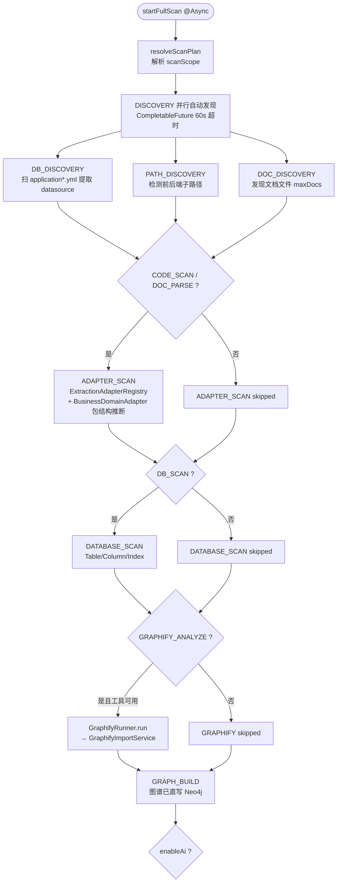
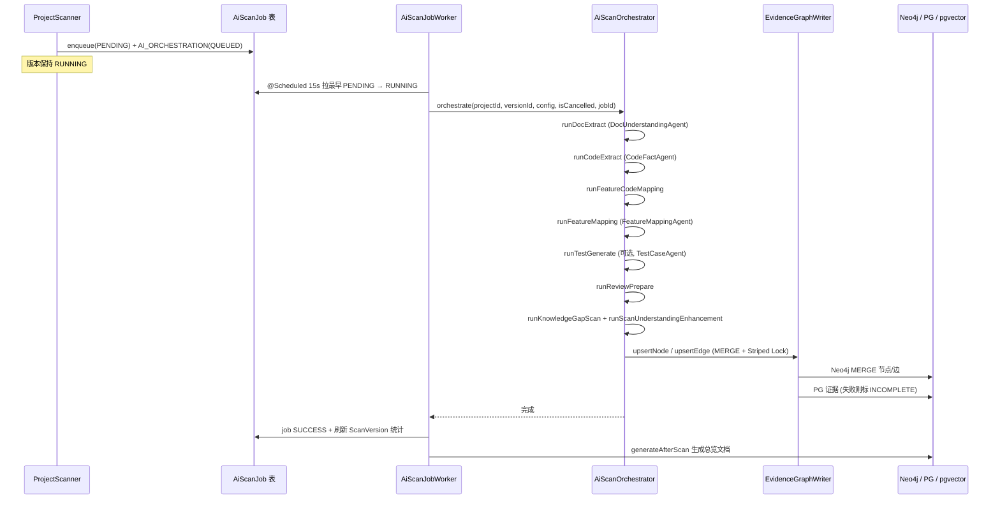
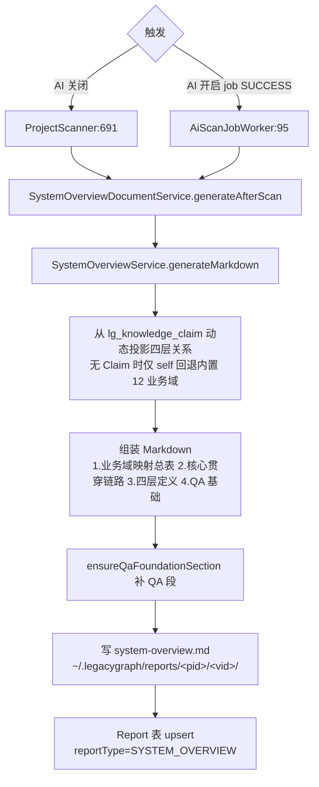
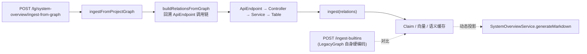
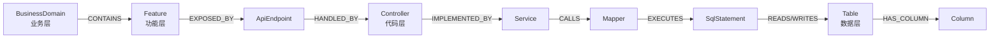

# 资料扫描到图谱与总结文档全链路

> 本文梳理 LegacyGraph 从「资料扫描 → 图谱 → 总结文档」的完整后端流程，作为后续 QA 文档与维护的事实底座。所有结论来自当前主干代码（`ProjectScanner` / `AiScanOrchestrator` / `AiScanJobWorker` / `EvidenceGraphWriter` / `SystemOverviewDocumentService` 等）。

## 总览：三段式流水线

```mermaid
flowchart LR
    subgraph S1["第一段 基础扫描"]
        A1["资料来源<br/>代码 / DB / 文档"] --> A2["ProjectScanner.runScanBody"]
        A2 --> A3["适配器直写 Neo4j"]
    end
    subgraph S2["第二段 AI 编排增强"]
        B1["AiScanOrchestrator.enqueue<br/>PENDING job"] --> B2["AiScanJobWorker 15s 轮询"]
        B2 --> B3["orchestrate 顺序编排<br/>各 LLM Agent"]
        B3 --> B4["EvidenceGraphWriter<br/>Claim+证据+向量"]
    end
    subgraph S3["第三段 总结文档"]
        C1["SystemOverviewService<br/>generateMarkdown"] --> C2["Claim 投影四层关系"]
        C2 --> C3["system-overview.md<br/>+ Report 登记"]
    end
    A3 --> B1
    B4 --> C1
```

入口是 `ProjectScanner.startFullScan()`（`@Async`，由 `ScanController` 触发），核心主体在 `runScanBody()`。

---

## 第一段：资料扫描 → 图谱（基础阶段）

`ProjectScanner.runScanBody()` 按阶段顺序执行，每阶段创建一个 `ScanTask` 供前端进度展示：

1. **DISCOVERY（并行自动发现）** — 三阶段并行（`CompletableFuture`，60s 超时）
   - `DB_DISCOVERY`：扫 `application*.yml/properties` 提取 datasource，自动建/更 `DbConnection`
   - `PATH_DISCOVERY`：检测前后端子路径
   - `DOC_DISCOVERY`：发现文档文件（受 `maxDocs` 限制）

2. **ADAPTER_SCAN（适配器抽取）** — `ExtractionAdapterRegistry` 驱动，按 scanTypes 过滤（`CODE_SCAN`/`DOC_PARSE`/`DB_SCAN`）。各 `ExtractionAdapter` 直接把节点/边写进 Neo4j，附带 `BusinessDomainAdapter` 从包结构推断业务域。

3. **DATABASE_SCAN** — 对 `READY` 状态的 DB 连接快照做元数据扫描（`DatabaseMetadataScanService`），抽 Table/Column/Index。

4. **GRAPHIFY_ANALYZE（可选）** — 仅当 scanTypes 含 `GRAPHIFY_ANALYZE` 且工具可用时，调外部 `GraphifyRunner.run()`，再用 `GraphifyImportService.importGraph()` 把 graph JSON 导入 Neo4j。

5. **GRAPH_BUILD** — 标记阶段。图谱在前几步已由各 Builder **直写 Neo4j**，无需额外同步。

关键点：**图谱在基础扫描阶段就已落库**，AI 增强只是在其上叠加业务关系与语义层。

---

## 第二段：AI 编排增强（业务图谱 / Claim / 向量）

基础扫描末尾（`ProjectScanner:661`）按 `AiScanConfig.enableAi` 分流：

- `true` → `aiScanOrchestrator.enqueue()`：插一条 `PENDING` 的 `AiScanJob` + 一个 `QUEUED` 的 `AI_ORCHESTRATION` ScanTask，**不阻塞**，版本状态保持 `RUNNING`。
- `false` → `recordSkipped()`，扫描直接置 `SUCCESS` 并立刻生成总览文档。

`AiScanJobWorker.processPendingJobs()`（`@Scheduled(fixedDelay=15s)`）拉最早的 PENDING job → 置 RUNNING → 调 `AiScanOrchestrator.orchestrate()`。编排内部**顺序执行**（注释说明曾试并发 8 路触发 DeepSeek 限流，改回顺序）：

| 步骤 (ScanStep) | 方法 | 产出 |
|---|---|---|
| INIT | `runDocExtract` | `DocUnderstandingAgent` 抽业务事实 → `BusinessGraphBuilder` 落业务节点；文档向量化入 pgvector |
| PARSE_FILES | `runCodeExtract` | `CodeFactAgent` 抽代码事实 → 落图；代码向量化 |
| EXTRACT_FACTS | `runFeatureCodeMapping` | `BusinessGraphBuilder.mapFeaturesToCode` 把功能映射到代码 |
| BUILD_GRAPH | `runFeatureMapping` | `FeatureMappingAgent` LLM 映射功能→API，产 Claim 草稿 |
| MERGE_ENTITIES | `runTestGenerate`（可选） | `TestCaseAgent` 生成测试用例 |
| WRITE_INTENT | `runReviewPrepare` | 按 `minConfidence` 准备评审记录 |
| ENHANCE | `runKnowledgeGapScan` + `runScanUnderstandingEnhancement` | GapFinder 扫知识缺口；对关键符号做深度代码理解 |

落图主路径统一走 **`EvidenceGraphWriter`**（`upsertNode` 用 MERGE 去重 + Striped Lock 防竞态；Neo4j 写成功但 PG 证据写失败则标 `INCOMPLETE` 做跨存储补偿）。`SecretScanService` 在证据入库前做密钥脱敏，命中打 `PrivacyLevel.SECRET`。LLM 调用统一走 `LlmGateway`。

---

## 第三段：系统关系总览总结文档

触发点有二，都调 `SystemOverviewDocumentService.generateAfterScan()`：

- AI 关闭：`ProjectScanner` 在置 `SUCCESS` 后直接调（`ProjectScanner:691`）
- AI 开启：`AiScanJobWorker` 在 job `SUCCESS`、刷新版本统计后调（`AiScanJobWorker:95`）

`generateAfterScan()` 流程：

1. `SystemOverviewService.generateMarkdown()` 生成 Markdown —— **从 `lg_knowledge_claim` 动态投影**业务/功能/代码/数据四层关系（无 Claim 数据时仅 `self` 项目回退到内置 12 业务域映射）。文档含：业务域映射总表、核心贯穿链路、四层定义、QA 文档基础四节。
2. `ensureQaFoundationSection()` 补齐 QA 基础段。
3. 写到 `~/.legacygraph/reports/<projectId>/<versionId>/system-overview.md`。
4. 在 `Report` 表 upsert 一条 `reportType=SYSTEM_OVERVIEW` 记录供下载/列表。

另外还有一条**从图谱直接生成总览**的旁路：`SystemOverviewIngestController` 的 `/ingest-from-graph` → `SystemOverviewIngestService.ingestFromProjectGraph()` → `buildRelationsFromGraph()` 回溯每个 `ApiEndpoint` 的 Controller→Service→Table 调用链，组装关系行写回 Claim/向量/语义缓存，让总览能动态投影真实扫描结果（区别于 `/ingest-builtins` 的硬编码 LegacyGraph 自身底座）。

---

## 四层关系模型

总结文档与 Claim 投影都围绕业务/功能/代码/数据四层关系，核心贯穿链路如下：

- **业务层**：BusinessDomain/Process/Object/Rule/Role（为什么存在）
- **功能层**：Feature/Page/Button/Permission/ApiEndpoint（如何触发）
- **代码层**：Controller/Service/Method/Mapper/SqlStatement（由什么实现）
- **数据层**：Table/Column/Index（落到什么表）

---

## 一句话串起来

`ProjectScanner` 把资料（代码/DB/文档）经适配器**直写 Neo4j** → `AiScanOrchestrator` 异步编排各 LLM Agent 抽业务事实/功能映射/测试用例，经 `EvidenceGraphWriter` 幂等落 Claim+证据+向量 → 扫描收尾时 `SystemOverviewDocumentService` 把 Claim 投影成四层关系 Markdown 并登记为可下载 Report。
