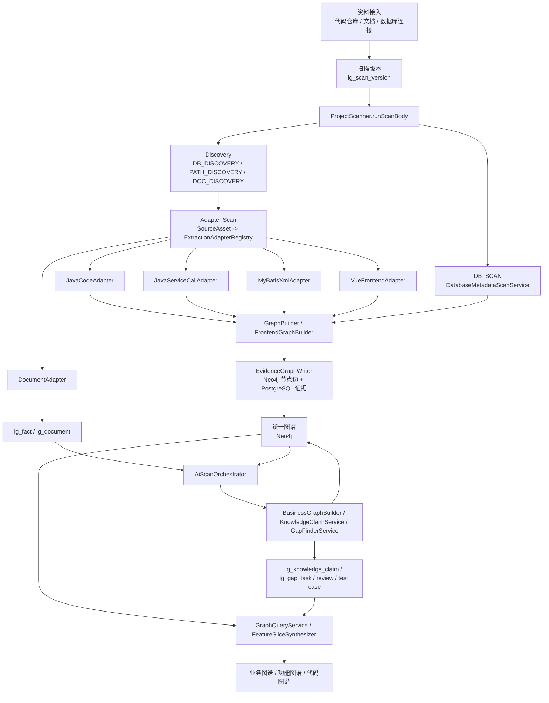
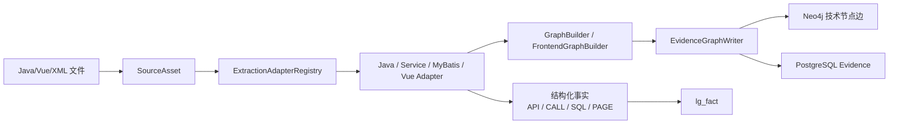
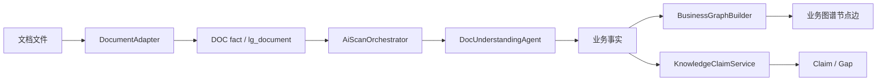
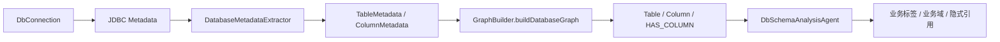
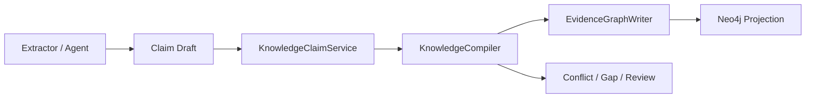
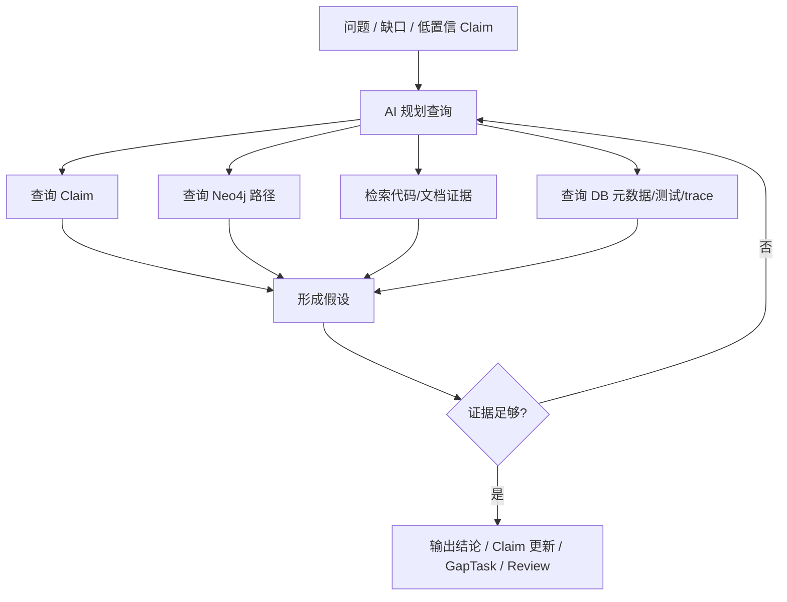
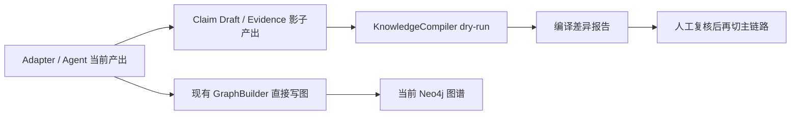
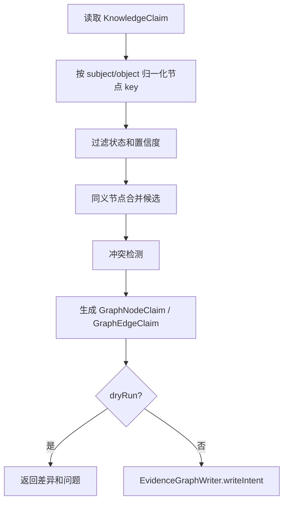

# 资料扫描到三类图谱构建流程与 AI 优化研究

> 日期：2026-07-02  
> 口径：以当前代码实现为准，结合 `/doc` 下既有设计文档复核。  
> 范围：从代码、文档、数据库资料进入 LegacyGraph，到统一图谱构建，再派生业务图谱、功能图谱、代码图谱的主流程与优化空间。

## 1. 研究结论

LegacyGraph 当前不是直接生成三张彼此隔离的图谱，而是先把代码、文档、数据库元数据、SQL、前端页面/API 调用等资料转成统一节点、关系、事实、证据和 Knowledge Claim，再通过不同查询口径投影出三类图谱：

| 图谱 | 当前定位 | 主要来源 | 典型节点/关系 |
|---|---|---|---|
| 代码图谱 | 技术结构和调用/数据访问路径 | Java Controller/Service、MyBatis XML、SQL、JDBC 元数据 | `ApiEndpoint`、`Controller`、`Method`、`Service`、`Mapper`、`SqlStatement`、`Table`、`Column`；`HANDLED_BY`、`CALLS`、`EXECUTES`、`READS`、`WRITES`、`HAS_COLUMN` |
| 功能图谱 | 用户/系统能力到入口、实现、数据和验证的切片 | 前端页面、按钮/API 调用、Controller、AI 功能映射、Knowledge Claim | `Feature`、`Page`、`Button`、`Permission`、`ApiEndpoint`、`TestCase`；`EXPOSED_BY`、`IMPLEMENTED_BY`、`CALLS`、`REQUIRES_PERMISSION`、`VERIFIED_BY` |
| 业务图谱 | 业务域、流程、对象、规则、角色和状态语义 | 文档 AI 抽取、代码 AI 抽取、数据库语义增强、业务对象映射 | `BusinessDomain`、`BusinessProcess`、`BusinessObject`、`BusinessRule`、`Role`、`Feature`；`CONTAINS`、`MAPS_TO`、`IMPLEMENTED_BY` |

当前流程已经有较完整的工程闭环：Adapter Registry 扫描、Neo4j 直写、PostgreSQL 证据/事实/断言存储、扫描后 AI 编排、缺口扫描、GraphRAG 查询规划、动态 Feature Slice。主要优化空间不在“再加一种图谱”，而在把扫描主链路、Claim 编译、证据评分、增量扫描和多步 AI 调查进一步收敛。

核心判断：

1. **确定性抽取仍应是事实基座**：AST、SQL、JDBC 元数据、运行时 trace、测试结果更适合作为强证据。
2. **AI 更适合做语义归纳、候选 Claim、缺口发现和补证规划**：AI 不应直接把推断边写成 confirmed 事实。
3. **三类图谱应继续作为统一知识图谱的投影视图**：业务图谱、功能图谱、代码图谱之间的价值来自可追溯连通，而不是各自单独完整。
4. **下一阶段重点是“知识编译器”而不是“扫描器”**：所有来源先进入 Claim/ Evidence，再统一合并、冲突检测、评分、投影。

## 2. 当前总体流程



### 2.1 资料接入

代码仓库、文档、数据库连接是三类主要输入：

- 代码仓库元数据保存在 `lg_code_repo`，包括 Git 地址、分支、本地路径、前后端子目录、include/exclude 配置。
- 数据库连接保存在 `lg_db_connection`，包括数据库类型、host、port、schema、只读标记、include/exclude tables。
- 文档元数据保存在 `lg_document`，包括文档名、类型、文件路径、解析状态、版本 ID。

扫描触发后会创建 `lg_scan_version`，所有后续事实、任务、证据、节点、边、Claim、Gap 都挂在同一个 `project_id + version_id` 下。这一点很关键：版本是图谱可追溯和可对比的边界。

### 2.2 扫描编排

当前主入口是 `ProjectScanner.startFullScan` / `resumeFullScan`，主体逻辑在 `runScanBody`。主流程按以下顺序运行：

1. 解析 `scanScope`，获得 `repoIds`、`dbIds`、`docIds`、`scanTypes` 和 AI 开关。
2. 根据仓库记录解析 `baseDir`、`backendDir`、`frontendDir`。
3. 自动发现数据库连接配置、前后端子路径、仓库内文档。
4. 将代码和文档文件包装成 `SourceAsset`，交给 `ExtractionAdapterRegistry` 选择 Adapter。
5. 执行数据库元数据扫描。
6. 由 Builder 在扫描过程中直接写 Neo4j，`GRAPH_BUILD` 阶段只记录“图谱已构建”。
7. 根据 `AiScanConfig` 执行扫描后 AI 编排。
8. 回写扫描版本统计快照：节点数、边数、事实数、任务状态等。

旧文档中提到的 `BACKEND_SCAN`、`SERVICE_CALL_SCAN`、`MAPPER_SCAN`、`FRONTEND_SCAN` 已不是当前主链路的独立阶段。当前代码以 Adapter Registry 承接结构化代码/文档抽取。

### 2.3 适配器抽取

Adapter Registry 已经注册五类主要适配器：

| Adapter | 处理对象 | 产出 |
|---|---|---|
| `JavaCodeAdapter` | 带 `@RestController` / `@Controller` 的 Java 文件 | Java 类/方法结构、API Endpoint、Controller、Method、Permission |
| `JavaServiceCallAdapter` | 非 Controller Java 文件 | Java 类/方法结构、Service/Mapper/Dao 调用关系、`SERVICE_CALL` fact |
| `MyBatisXmlAdapter` | Mapper XML | Mapper、SQL Statement、读写表、join 表 |
| `VueFrontendAdapter` | `.vue`、`.jsx`、`.tsx` | Page、Button、前端 API 调用、页面到接口关系 |
| `DocumentAdapter` | `.md`、`.pdf`、`.docx`、`.txt`、`.rst`、`.adoc` | 文本摘录型 `DOC` fact，供后续 AI 文档理解 |

结构化适配器直接调用 `GraphBuilder` / `FrontendGraphBuilder` 写图；文档适配器主要落事实，后续由 `AiScanOrchestrator` 再读取文档内容做业务事实抽取。

### 2.4 数据库元数据扫描

数据库扫描不走文件 Adapter，而是在 `DB_SCAN` 阶段读取 `READY` 状态的数据库连接：

1. 根据 `DbConnection` 构造只读 JDBC DataSource。
2. `DatabaseMetadataScanService.scan` 调用 `DatabaseMetadataExtractor.extractFromSchema`。
3. 通过 JDBC `DatabaseMetaData` 读取表、列、主键。
4. 对 PostgreSQL / MySQL 分别读取表注释、列注释。
5. 基于字段名和注释做轻量语义识别，例如 `id`、`status`、`type`、`deleted`、`audit`。
6. `GraphBuilder.buildDatabaseGraph` 创建 `Table`、`Column` 节点和 `HAS_COLUMN` 边。
7. 若表结构摘要存在，再由 `DbSchemaAnalysisAgent` 做 LLM 语义增强，补充表业务标签、业务域和隐式表关系。

数据库扫描当前偏结构元数据：表、字段、主键、命名推断。include/exclude tables 字段已经在实体和接口层存在，但需要继续确认扫描层是否完整消费。

### 2.5 统一写图和证据

当前写图主入口是 `EvidenceGraphWriter`。它提供几个核心能力：

- `upsertNode`：按 `projectId + versionId + nodeType + nodeKey` 去重写 Neo4j。
- `upsertEdge`：按 `projectId + versionId + from/to + edgeType + edgeKey` 去重写 Neo4j。
- `attachEvidence`：把证据写入 PostgreSQL，并关联到节点或边。
- `applyPrivacy`：对证据内容做 secret/PII 扫描和脱敏。
- AI 来源默认 `PENDING_CONFIRM`，代码/数据库/SQL 等确定性来源更容易成为 `CONFIRMED`。

这个模块是当前架构的正确方向：调用方不应各自实现节点创建、边创建、证据去重和置信度裁决。但这里仍有一个重要风险：一次写入同时涉及 Neo4j 和 PostgreSQL，Spring 关系库事务不能天然覆盖 Neo4j。当前代码已有 `INCOMPLETE` 标记作为补偿思路，后续应进一步产品化为 outbox + reconciliation。

### 2.6 AI 编排和 Claim 层

扫描后 AI 编排由 `AiScanOrchestrator.orchestrate` 执行，主要阶段包括：

1. `AI_DOC_EXTRACT`：读取文档，`DocUnderstandingAgent` 抽取业务域、流程、对象、规则、角色、状态流转、功能清单。
2. `AI_CODE_EXTRACT`：读取 Service/Controller 类源码，`CodeFactAgent` 抽取代码里的业务功能，让无文档项目也能生成部分业务/功能节点。
3. `AI_FEATURE_CODE_MAPPING`：用规则相似度把 Feature 映射到 Page/API，把 BusinessObject 映射到 Table/Service/Mapper/Controller。
4. `AI_FEATURE_MAPPING`：`FeatureMappingAgent` 进一步生成待确认的页面/API 映射边和审核记录。
5. `AI_TEST_GENERATE`：可选，对高价值 API 生成测试用例。
6. `AI_REVIEW_PREPARE`：为低置信节点创建审核任务。
7. `AI_GAP_FINDING`：`GapFinderService` 基于 Claim 层扫描知识缺口。

`KnowledgeClaimService` 已经提供 Claim 幂等写入能力，规则包括：

- 同一个 `subjectType + subjectKey + predicate + objectType + objectKey` 去重。
- AI 来源默认 `PENDING_CONFIRM`。
- `CODE`、`DB`、`RUNTIME`、`TEST` 等非 AI 来源且置信度足够时可成为 `CONFIRMED`。
- 重复写入会合并 evidenceIds，并取更高 confidence。

这说明项目已经开始从“直接写图”过渡到“Claim 层 + 图谱投影”。但目前仍是双轨：很多确定性抽取直接写 Neo4j，AI Agent 同时写 Fact、Graph、Claim。后续应把 Claim 编译成图谱变成主路径。

### 2.7 三类图谱查询

查询层由 `GraphQueryService`、`GraphProjectionReadModel`、`GraphPathReadModel`、`FeatureSliceBuilder` / `FeatureSliceSynthesizer` 等承担：

- 代码链路：API 到 Controller/Method/Service/Mapper/SQL/Table。
- 表影响：Table 反查被哪些接口、SQL、服务影响。
- 功能视图：按 Feature/Page/API/Service/Repository 投影。
- 业务视图：按 BusinessDomain、BusinessProcess、BusinessObject、BusinessRule 投影。
- 统一图谱：按版本、置信度、状态过滤返回全部节点边。
- 动态 Feature Slice：从 Claim 和 Neo4j 双源收集入口、实现、数据、规则、验证、缺口。

三类图谱本质是同一图谱的不同读模型：业务视图回答“为什么存在”，功能视图回答“用户/系统如何触发”，代码视图回答“具体由哪些技术单元实现和读写数据”。

## 3. 资料到图谱的关键数据流

### 3.1 代码资料



代码资料的可靠性最高，适合作为 `CONFIRMED` 基础事实。但当前静态分析仍有边界：

- Java 调用链主要基于 AST 和注入关系，不等于完整 LSP 解析。
- 动态 SQL、反射、AOP、事件、MQ、定时任务、Feign/RestTemplate 等仍需要专门抽取器。
- 前端 API 扫描包含文本模式，对封装较深的 request client 需要增强。

### 3.2 文档资料



文档资料解决“代码里看不出来为什么”的问题，尤其适合抽业务流程、角色、规则、状态流转。但文档可能过期、遗漏、与代码冲突，因此文档 AI 抽取应默认 `PENDING_CONFIRM`，需要代码、数据库、测试或人工审核补证。

### 3.3 数据库资料



数据库资料是业务对象和数据影响分析的重要锚点。当前系统已经能从表名、字段名、注释和 SQL 读写关系建立数据路径，但还有几个问题：

- 外键关系多靠命名推断，缺少真实 FK / 唯一索引 / check constraint / 枚举字典的完整抽取。
- 表注释和字段注释质量差时，LLM 语义增强可能不稳定。
- include/exclude tables、采样行、数据分布、枚举值识别尚未形成完整扫描策略。
- 数据库元数据扫描和 SQL 解析之间还需要更强的归一化，例如 `schema.table`、别名、大小写、分库分 schema。

## 4. 优化空间

### 4.1 扫描主流程模块化

当前 `ProjectScanner` 仍承担较多职责：scope 解析、路径解析、自动发现、任务记录、文件遍历、Adapter 执行、数据库扫描、AI 编排、取消控制、统计回写。建议拆成：

| 模块 | 职责 |
|---|---|
| `ScanScopeResolver` | 解析 scanScope，形成强类型扫描计划 |
| `AssetDiscovery` | 发现 repo/doc/db/source assets，统一 include/exclude 与增量判定 |
| `AdapterExecutionService` | 选择适配器、执行、隔离失败、并发控制、汇总结果 |
| `ScanTaskRecorder` | 统一任务生命周期、进度、告警、错误消息 |
| `ScanFinalizer` | 统计快照、缓存失效、终态写入 |

这样新增语言、框架、数据库类型时，只需要新增 Adapter 或 Discovery 插件，而不是改扫描主流程。

### 4.2 增量扫描和变更感知

当前扫描会 walk 整个目录，并且文档发现存在数量上限。建议引入增量扫描：

- 为每个 SourceAsset 记录 `contentHash`、mtime、size、extractorVersion。
- 只重扫变更文件和受影响的依赖路径。
- 对删除文件生成 tombstone，清理旧节点/边或标为 `STALE`。
- 对同一文件的多 Adapter 结果做批次一致性提交。
- 扫描版本之间建立 diff：新增节点、删除节点、变更边、置信度变化、缺口变化。

这会直接改善大仓库扫描耗时，也能支撑迁移评估和变更影响分析。

### 4.3 数据库扫描增强

数据库侧建议补强为“结构 + 约束 + 样本 + 语义”的四层：

1. 结构：表、列、类型、注释、主键。
2. 约束：外键、唯一索引、普通索引、check constraint、not null、默认值。
3. 样本：安全采样枚举字段、状态字段、类型字段，识别状态机候选。
4. 语义：由 LLM 归纳业务对象、同义词、隐式关系，但保持待确认。

同时应将 `DbConnection.includeTables/excludeTables` 纳入实际扫描计划，避免在大型数据库上全库扫表。

### 4.4 Claim 编译成为主路径

当前系统已经有 `lg_knowledge_claim` 和 `lg_gap_task`，但很多 Builder 仍直接写 Neo4j。更稳的路径是：



关键变化：

- Extractor 不直接决定最终图谱，只产出 Claim。
- KnowledgeCompiler 统一做实体归一、冲突检测、证据评分、投影建图。
- GraphBuilder 成为 Compiler 的投影后端，而不是每个抽取器的直接目标。
- AI 输出只能进入 Claim Draft，不能直接写 confirmed 边。

这样可以减少双写逻辑，也能更清楚地解释“某条边为什么成立”。

### 4.5 证据评分模型

建议建立统一证据评分公式，而不是由各模块固定 confidence 或让 LLM 自报：

```text
final_confidence =
  source_weight
  + agreement_bonus
  + runtime_verified_bonus
  + test_pass_bonus
  - contradiction_penalty
  - stale_penalty
  - ai_only_penalty
```

建议初始权重：

| 来源 | 建议权重 | 说明 |
|---|---:|---|
| TEST / RUNTIME | 0.90 | 真实执行或测试反证最强 |
| CODE / DB / SQL | 0.80 | 静态确定性事实 |
| DOC | 0.60 | 文档可能过期 |
| AI_INFERENCE / DOC_AI / CODE_AI | 0.40 | 只能作为候选 |
| HUMAN_REVIEW | 0.95 | 人工确认可强制升权，但需留审计 |

证据评分应在 Claim 层计算，并投影到节点/边状态。

### 4.6 图谱一致性和跨存储事务

`EvidenceGraphWriter` 同时写 Neo4j 和 PostgreSQL。建议引入 outbox 模式：

1. 先在 PostgreSQL 写 `GraphWriteIntent`，包含幂等 key、claims、evidence。
2. 后台执行器写 Neo4j 和证据关联。
3. 失败时保留 intent 状态，支持重试和人工修复。
4. Reconciler 定期检查 Neo4j 有图元素但缺证据、PG 有证据但缺图元素、状态不一致等问题。

这比把分布式事务隐藏在 `@Transactional` 里更可控。

### 4.7 Feature Slice 纳入主闭环

`FeatureSliceSynthesizer` 已经支持从 Claim 和 Neo4j 双源合成入口、实现、数据、规则、验证、缺口。下一步应把它纳入主流程：

- 扫描完成后为高价值 Feature 生成 slice 快照。
- 测试生成、变更影响、审核任务都引用 `sliceId`。
- 测试结果回写到 slice 的验证层和对应 Claim。
- 前端展示时区分固定路径切片和动态多入口切片。

这会让功能图谱从“Page/API 视图”升级为“业务能力切片”。

## 5. AI 更多介入是否有效

答案是：**会有效，但前提是 AI 从“直接生成图谱”改为“研究员 + 候选断言 + 补证规划器”。**

### 5.1 适合让 AI 深入介入的环节

| 环节 | AI 价值 | 推荐状态 |
|---|---|---|
| 文档业务抽取 | 把自然语言转成流程、对象、规则、角色、状态 | 已使用，继续增强 |
| 代码业务命名 | 解释 Service/Controller 的业务动作 | 已使用，需控制成本 |
| 数据库语义归纳 | 从表/字段/注释归纳业务域和对象 | 已使用，需证据约束 |
| Feature 映射 | 把 Feature 对齐页面、接口、权限、表 | 可用，但默认待确认 |
| 缺口优先级 | 判断哪些缺口值得先补证 | 已有 `GapFinderAgent`，应接入更多证据 |
| GraphRAG 规划 | 把问题拆成 Claim 查询和路径查询 | 已有 `GraphRagPlannerAgent`，需要执行器闭环 |
| 测试生成 | 从功能切片生成 API/E2E/DB 断言 | 可用，但断言需要强来源 |
| 冲突解释 | 解释文档、代码、DB 互相矛盾的点 | 适合新增或强化 |

### 5.2 不适合直接交给 AI 的环节

- 直接确认调用链。
- 直接确认 SQL 读写表。
- 直接确认表字段含义。
- 直接生成高置信业务规则。
- 在没有证据的情况下合并节点。

这些场景可以让 AI 提候选，但必须进入 `PENDING_CONFIRM`，并通过代码、数据库、运行时、测试或人工审核确认。

### 5.3 最优 AI 工作模式

建议采用多步调查模式：



这个模式比单次 prompt 更适合研究型问题，例如：

- “这个功能是否只有文档，没有实现？”
- “这个表被哪些业务能力读写？”
- “文档里的业务规则是否真的在代码中执行？”
- “订单状态流转来自枚举、数据库字段、代码判断还是文档？”

## 6. 推荐路线图

### 第一阶段：收敛扫描可靠性

- 拆出 `ScanScopeResolver`、`AssetDiscovery`、`AdapterExecutionService`、`ScanTaskRecorder`。
- include/exclude patterns、include/exclude tables 进入真实扫描计划。
- 文档发现不再固定只取前 50 个，改成分页/预算/优先级策略。
- 给每个 SourceAsset 记录 hash，实现增量扫描。

### 第二阶段：Claim 编译主链路

- 所有 Extractor 和 Agent 统一输出 Claim Draft。
- 建立 `KnowledgeCompiler`：合并、冲突、置信度、投影。
- GraphBuilder/FrontendGraphBuilder/BusinessGraphBuilder 收敛为投影写入器。
- `lg_graph_node/lg_graph_edge` 与 Neo4j 的关系重新明确：Neo4j 为图查询主存储，PostgreSQL 为审计/补偿/兼容快照。

### 第三阶段：AI 研究员闭环

- `GapFinderAgent` 从建议生成升级为补证规划：给出下一步应查代码、DB、文档、trace、test 的动作。
- `GraphRagPlannerAgent` 增加执行器，真正执行 ClaimQuery / PathQuery，并把结果回填到回答和 Claim。
- 增加冲突解释和反证收集：同一业务对象、规则、状态、数据表出现不同来源说法时形成 conflict set。
- 输出研究报告时强制附证据卡片和不确定性。

### 第四阶段：验证回写

- Feature Slice 成为测试生成、变更影响、审核任务的共同接口。
- 测试结果、运行时 trace、人工审核统一回写 Claim。
- 对 AI-only、doc-only、runtime-only、test-failed 的事实做持续漂移队列。

## 7. 可落地实现细节

本节把前面的优化方向压成可以直接拆任务的实现方案。落地原则是：先在现有类旁边补齐边界和数据结构，再逐步把直接写图链路迁移到 Claim 编译链路，避免一次性重构导致扫描主流程不可用。

### 7.1 最小落地边界

第一轮不要同时改三类图谱、扫描器、AI Agent 和报告系统。建议先做一个“扫描增强 + Claim 编译影子链路 + 研究报告”的 MVP：

| 模块 | 当前已有基础 | 第一轮落地点 |
|---|---|---|
| 扫描编排 | `ProjectScanner`、`AdapterExecutionService`、`ScanTaskRecorder` | 拆出 `ScanScopeResolver` 和 `AssetDiscoveryService`，保留 `ProjectScanner` 作为总入口 |
| 资产模型 | `SourceAsset` 只有 path/type/language/framework/fileSize | 增加 hash、mtime、assetKind、extractorVersion，用于增量扫描 |
| 抽取结果 | `ExtractionAdapter.extract` 返回 `ExtractionResult` | 结果中补充 `claims`、`evidenceRecords`、`graphWriteIntent`，先影子写入 |
| 图谱写入 | `EvidenceGraphWriter`、`GraphWriteIntent`、`GraphWriteReconciler` | 给 `GraphWriteIntent` 增加持久化 outbox 表，而不是只做内存 DTO |
| Claim 层 | `KnowledgeClaimService` 已支持幂等 upsert | 新增 `KnowledgeCompiler`，把 Claim 编译成图谱节点边 |
| 报告导出 | `ReportExportService`、`ReportExportController` | 新增“资料扫描研究报告/图谱构建详情报告”类型 |

第一轮目标不是替换现有路径，而是形成双轨：



验收标准：

- 原有扫描任务仍能完成，节点和边数量不出现大幅回退。
- 新增 Claim 编译结果可以和现有图谱做差异对比。
- 报告能说明“哪些事实来自确定性扫描，哪些来自 AI 候选，哪些没有证据”。

### 7.2 扫描计划对象化

`ProjectScanner.runScanBody` 当前承担 scope 解析、路径解析、发现、扫描、AI 编排和统计回写。第一步应先抽出强类型扫描计划，减少后续改动风险。

新增类：

```text
backend/src/main/java/io/github/legacygraph/task/ScanScopeResolver.java
backend/src/main/java/io/github/legacygraph/dto/scan/ResolvedScanPlan.java
backend/src/main/java/io/github/legacygraph/dto/scan/ResolvedRepoScope.java
backend/src/main/java/io/github/legacygraph/dto/scan/ResolvedDbScope.java
backend/src/main/java/io/github/legacygraph/dto/scan/ResolvedDocScope.java
```

核心 DTO：

```java
@Data
@Builder
public class ResolvedScanPlan {
    private String projectId;
    private String versionId;
    private List<ResolvedRepoScope> repos;
    private List<ResolvedDbScope> databases;
    private List<ResolvedDocScope> documents;
    private Set<String> scanTypes;
    private boolean aiEnabled;
    private boolean incremental;
    private int maxFiles;
    private int maxDocs;
    private int maxDbTables;
    private Map<String, Object> rawScope;
}
```

`ProjectScanner` 中的调用应收敛为：

```java
ResolvedScanPlan plan = scanScopeResolver.resolve(projectId, versionId, scanScope);
assetDiscoveryService.discover(plan);
adapterExecutionService.executeScan(plan, cancelChecker);
databaseScanExecutor.execute(plan, cancelChecker);
aiScanOrchestrator.orchestrate(plan, aiConfig);
scanFinalizer.finish(plan);
```

先不要删除旧方法。可以保留旧 `executeScan(projectId, versionId, baseDir, backendDir, frontendDir, cancelChecker)`，新增重载：

```java
public AdapterScanSummary executeScan(ResolvedScanPlan plan,
                                      Supplier<Boolean> cancelChecker)
```

这样 Controller、测试和旧扫描入口不用一次性同步改完。

### 7.3 资产发现和增量扫描

当前 `SourceAsset` 只包含路径和类型信息，无法判断是否需要重扫。建议扩展为：

```java
@Data
@Builder
public class SourceAsset {
    private Path file;
    private String relativePath;
    private String fileType;
    private String language;
    private String framework;
    private long fileSize;

    // 新增
    private String assetKind;          // CODE / DOC / CONFIG / SQL / FRONTEND / DB_SCHEMA
    private String contentHash;        // sha256
    private long lastModifiedMs;
    private String extractorVersion;   // adapter name + version
    private boolean deleted;
}
```

新增快照表 `lg_source_asset_snapshot`：

| 字段 | 说明 |
|---|---|
| `id` | 主键 |
| `project_id` | 项目 |
| `version_id` | 扫描版本 |
| `repo_id` | 仓库 ID，可空 |
| `asset_kind` | `CODE` / `DOC` / `CONFIG` / `SQL` / `DB_SCHEMA` |
| `relative_path` | 项目内路径 |
| `content_hash` | 内容 hash |
| `file_size` | 文件大小 |
| `last_modified_ms` | 文件修改时间 |
| `extractor_version` | 抽取器版本 |
| `scan_status` | `PENDING` / `SKIPPED` / `SCANNED` / `FAILED` / `DELETED` |
| `previous_snapshot_id` | 上一版本快照 |
| `created_at` / `updated_at` | 时间戳 |

增量判定规则：

```text
same(relativePath, contentHash, extractorVersion) -> SKIPPED
same(relativePath) but hash changed -> SCANNED
previous exists but current missing -> DELETED tombstone
new relativePath -> SCANNED
extractorVersion changed -> SCANNED
```

`AssetDiscoveryService` 的输出不要直接是 `List<Path>`，而应是 `List<SourceAsset>`。`AdapterExecutionService` 中现有 `Files.walk(root)` 可以先迁移到 Discovery 层，保留原来的候选过滤逻辑：

- 排除 `node_modules`、`.git`、`target`、`dist`、`build`、`__pycache__`、`.idea`、`.vscode`。
- 只纳入有 Adapter 支持的扩展名。
- 从 `ResolvedScanPlan` 读取 include/exclude patterns、文件预算和扫描类型。

删除处理：

1. Discovery 发现旧快照存在、新版本不存在。
2. 写入 `DELETED` snapshot。
3. 对来源为该 `sourcePath` 的节点/边标记 `STALE`，不要物理删除。
4. Feature Slice 和报告默认过滤 `STALE`，但保留迁移对比能力。

### 7.4 Adapter 结果标准化

当前 Adapter 的 `extract` 方法已经隔离了解析逻辑，但不同 Adapter 后续写图方式仍不完全统一。建议把 `ExtractionResult` 作为标准承载对象扩展：

```java
@Data
@Builder
public class ExtractionResult {
    private int processedAssets;
    private int nodeCount;
    private int edgeCount;
    private int factCount;

    // 新增
    private List<EvidenceRecord> evidenceRecords;
    private List<KnowledgeClaimDraft> claimDrafts;
    private GraphWriteIntent graphWriteIntent;
    private List<String> warnings;
}
```

落地顺序：

1. `JavaCodeAdapter`、`JavaServiceCallAdapter`、`MyBatisXmlAdapter`、`VueFrontendAdapter` 继续调用现有 Builder 写图。
2. 同时在 `ExtractionResult` 中返回等价的 Claim Draft 和 Evidence。
3. `AdapterExecutionService` 汇总这些结果，写入 `KnowledgeClaimService`，但先不驱动图谱投影。
4. 用报告比较“直接写图结果”和“Claim 编译结果”的差异。
5. 差异收敛后，再逐个 Adapter 关掉直接写图。

这样可以避免一次性把所有 Builder 改成 Claim 输出，降低风险。

### 7.5 Claim 编译器

新增：

```text
backend/src/main/java/io/github/legacygraph/service/KnowledgeCompiler.java
backend/src/main/java/io/github/legacygraph/dto/claim/CompiledGraphProjection.java
backend/src/main/java/io/github/legacygraph/dto/claim/ClaimCompileIssue.java
```

接口建议：

```java
public interface KnowledgeCompiler {
    CompiledGraphProjection compile(String projectId, String versionId, CompileOptions options);
    CompiledGraphProjection compileClaims(List<KnowledgeClaim> claims, CompileOptions options);
}
```

`CompileOptions`：

```java
@Data
@Builder
public class CompileOptions {
    private boolean dryRun;
    private boolean includePending;
    private BigDecimal minConfidence;
    private Set<String> subjectTypes;
    private Set<String> predicates;
    private boolean emitReviewTasks;
}
```

谓词到图谱边的第一版映射：

| Claim predicate | 图谱边 | 说明 |
|---|---|---|
| `EXPOSED_BY` | `Feature -> Page/ApiEndpoint` | 功能入口 |
| `IMPLEMENTED_BY` / `HANDLED_BY` | `Feature/ApiEndpoint -> Controller/Service/Method` | 实现关系 |
| `CALLS` | `Method/Page -> ApiEndpoint/Method` | 调用关系 |
| `EXECUTES` | `Mapper/Method -> SqlStatement` | SQL 执行 |
| `READS` / `WRITES` | `SqlStatement/Method -> Table` | 数据读写 |
| `HAS_COLUMN` | `Table -> Column` | 表字段 |
| `ENFORCES_RULE` / `HAS_RULE` | `Feature/Method -> BusinessRule` | 业务规则 |
| `VERIFIED_BY` | `Feature/ApiEndpoint -> TestCase` | 验证关系 |
| `MAPS_TO` | `BusinessObject -> Table/Feature` | 业务对象映射 |

编译流程：



冲突检测最小规则：

- 同一 subject + predicate 指向多个互斥 object，例如同一接口映射多个互斥 Feature。
- 文档 Claim 和代码 Claim 在状态流转、表读写、权限关系上相互矛盾。
- `PENDING_CONFIRM` 的 AI Claim 试图覆盖 `CONFIRMED` 的 CODE/DB Claim。
- 同一节点 key 出现多个类型，例如一个 key 同时被识别为 `Table` 和 `BusinessObject`。

冲突不要自动解决，输出 `ClaimCompileIssue` 并创建 Review 任务。

### 7.6 GraphWriteIntent 持久化 outbox

代码中已有 `GraphWriteIntent` DTO 和 `GraphWriteReconciler`，但还缺“意图持久化 + 后台执行 + 重试”。建议新增表 `lg_graph_write_intent`：

| 字段 | 说明 |
|---|---|
| `id` | 主键 |
| `project_id` / `version_id` | 范围 |
| `idempotency_key` | 幂等键，唯一索引 |
| `source` | `SCAN` / `AI` / `MANUAL` / `COMPILER` |
| `payload_json` | `GraphWriteIntent` JSON |
| `status` | `PENDING` / `RUNNING` / `SUCCESS` / `FAILED` / `RETRYING` |
| `retry_count` | 重试次数 |
| `last_error` | 截断错误 |
| `created_at` / `updated_at` / `finished_at` | 时间 |

新增类：

```text
backend/src/main/java/io/github/legacygraph/repository/GraphWriteIntentRepository.java
backend/src/main/java/io/github/legacygraph/entity/GraphWriteIntentEntity.java
backend/src/main/java/io/github/legacygraph/service/GraphWriteIntentService.java
backend/src/main/java/io/github/legacygraph/task/GraphWriteIntentWorker.java
```

写入顺序：

1. Adapter / Compiler 调用 `GraphWriteIntentService.enqueue(intent)`。
2. PostgreSQL 先落 outbox，确保意图可恢复。
3. Worker 拉取 `PENDING` intent。
4. Worker 调用 `EvidenceGraphWriter.writeIntent(intent)`。
5. Neo4j/证据写入全部成功后标记 `SUCCESS`。
6. 失败时标记 `FAILED` 或 `RETRYING`，不吞异常。
7. `GraphWriteReconciler` 继续负责检查 Neo4j 与 PG 证据不一致。

幂等键建议：

```text
sha256(projectId + versionId + source + sorted(nodeClaims.edgeClaims.evidenceHashes))
```

这样重试、恢复、重复扫描不会产生重复节点和边。

### 7.7 数据库扫描增强的具体改动

数据库扫描建议拆为四个子抽取器：

```text
DatabaseStructureExtractor
DatabaseConstraintExtractor
DatabaseSampleExtractor
DatabaseSemanticEnricher
```

第一版先落地结构和约束：

| 能力 | JDBC 来源 | 输出节点/边 |
|---|---|---|
| 表/列/主键 | `DatabaseMetaData#getTables/getColumns/getPrimaryKeys` | `Table`、`Column`、`HAS_COLUMN` |
| 外键 | `getImportedKeys` / `getExportedKeys` | `Table -> Table` 的 `REFERENCES` |
| 索引 | `getIndexInfo` | `Index` 节点或 `HAS_INDEX` 边 |
| 唯一约束 | index nonUnique=false | `UNIQUE_ON` |
| not null/default | columns metadata | Column 属性 |

include/exclude tables 应在扫描计划层统一生效：

```java
boolean included = includeTables.isEmpty() || wildcardMatch(includeTables, tableName);
boolean excluded = wildcardMatch(excludeTables, tableName);
if (!included || excluded) {
    return SkipReason.TABLE_FILTERED;
}
```

安全采样必须默认关闭，只允许显式开启：

```json
{
  "dbSample": {
    "enabled": false,
    "maxRowsPerTable": 20,
    "allowedColumnPatterns": ["*_status", "*_type", "status", "type"],
    "denyColumnPatterns": ["*password*", "*token*", "*secret*", "*phone*", "*email*"]
  }
}
```

采样结果不进入 `CONFIRMED` 业务规则，只用于枚举候选、状态候选和文档提示。

### 7.8 AI 研究员执行器

`GraphRagPlannerAgent` 已经能生成计划，但还需要执行器把计划落到查询动作。建议新增：

```text
backend/src/main/java/io/github/legacygraph/service/GraphRagPlanExecutor.java
backend/src/main/java/io/github/legacygraph/dto/rag/GraphRagExecutionResult.java
backend/src/main/java/io/github/legacygraph/dto/rag/GraphRagEvidenceCard.java
```

执行器职责：

1. 执行 `claimQueries`：调用 `KnowledgeClaimService.listClaims`。
2. 执行 `pathQueries`：调用 `GraphQueryService` 或 `Neo4jGraphDao`。
3. 执行 `requiredEvidenceTypes`：查 Evidence、DocChunk、DB metadata、TestResult。
4. 给每个结果生成 EvidenceCard。
5. 将证据不足的子问题转成 `GapTask`。
6. 返回给 `QaAgent` 或报告服务。

EvidenceCard 结构：

```java
@Data
@Builder
public class GraphRagEvidenceCard {
    private String evidenceId;
    private String sourceType;
    private String sourcePath;
    private Integer startLine;
    private Integer endLine;
    private String nodeKey;
    private String claimId;
    private String excerpt;
    private BigDecimal confidence;
    private String status;
}
```

AI 输出报告时只能引用 EvidenceCard 中的事实。没有 EvidenceCard 的内容必须进入“推断/待确认”章节。

### 7.9 报告导出落地

当前 `ReportExportService.ReportType` 已有 `MIGRATION_READINESS`、`CONFIDENCE_TREND`、`TEST_COVERAGE`、`GRAPH_QUALITY`、`FEATURE_SLICE`、`CHANGE_TASK`。建议新增：

```java
SCAN_RESEARCH("资料扫描与图谱构建研究报告"),
CODE_UNDERSTANDING("代码理解报告"),
GRAPH_BUILD_DETAIL("图谱构建详情报告")
```

新增服务：

```text
backend/src/main/java/io/github/legacygraph/service/ScanResearchReportService.java
backend/src/main/java/io/github/legacygraph/dto/report/ScanResearchReport.java
```

`ScanResearchReportService` 不负责 PDF/Excel，只负责生成 Markdown：

```java
public String generateMarkdown(String projectId, String versionId) {
    // 1. 读取 ScanVersion / ScanTask
    // 2. 读取节点边统计
    // 3. 读取 Claim 状态统计
    // 4. 读取 GapTask
    // 5. 读取 GraphWriteReconciler 结果
    // 6. 输出 Markdown
}
```

`ReportExportService` 增加分支：

```java
case SCAN_RESEARCH -> scanResearchReportService.generateMarkdown(projectId, versionId);
```

`ReportExportController` 增加接口：

```java
@GetMapping("/scan-research/{projectId}/{versionId}")
public ResponseEntity<byte[]> exportScanResearchReport(
        @PathVariable String projectId,
        @PathVariable String versionId,
        @RequestParam(defaultValue = "MD") String format) {
    byte[] data = reportExportService.exportReport(
            projectId, versionId, ReportType.SCAN_RESEARCH, parseFormat(format));
    return buildResponse(data, "资料扫描与图谱构建研究报告", parseFormat(format));
}
```

报告内容必须包含：

- 扫描输入：repo/db/doc 范围和过滤条件。
- Adapter 执行统计：处理文件数、跳过文件数、失败文件数。
- 数据库扫描统计：表、列、约束、过滤表数量。
- 图谱写入统计：节点、边、证据、INCOMPLETE 数量。
- Claim 统计：confirmed、pending、AI-only、conflict。
- 三类图谱覆盖：代码、功能、业务各自节点和边数量。
- 缺口清单：按风险排序。
- 不确定性声明：哪些内容来自 AI 候选。

### 7.10 接口和前端入口

后端建议新增聚合接口，不要让前端拼多个服务：

```http
GET /api/projects/{projectId}/versions/{versionId}/scan-research/summary
GET /api/projects/{projectId}/versions/{versionId}/graph-build/health
GET /api/projects/{projectId}/versions/{versionId}/claims/compile-preview
POST /api/projects/{projectId}/versions/{versionId}/claims/compile
POST /api/projects/{projectId}/versions/{versionId}/graph-write/reconcile
```

前端建议新增一个“扫描研究”页面，分五个 Tab：

| Tab | 内容 |
|---|---|
| 输入范围 | 仓库、数据库、文档、过滤条件、扫描预算 |
| 执行过程 | ScanTask 时间线、Adapter 统计、失败明细 |
| 图谱产物 | 三类图谱节点边统计、Neo4j/PG 一致性 |
| Claim 与缺口 | Claim 状态、AI-only、冲突、GapTask |
| 报告导出 | Markdown/PDF 导出、证据索引 |

第一版前端只读即可，不要直接开放“自动确认 AI Claim”。

### 7.11 测试和验收清单

单元测试：

| 测试类 | 覆盖点 |
|---|---|
| `ScanScopeResolverTest` | scanScope 解析、默认值、非法输入、预算限制 |
| `AssetDiscoveryServiceTest` | include/exclude、hash、deleted tombstone、增量跳过 |
| `AdapterExecutionServiceTest` | Adapter 选择、异常隔离、取消检查、结果汇总 |
| `KnowledgeCompilerTest` | predicate 映射、状态过滤、冲突检测、dry-run |
| `GraphWriteIntentServiceTest` | 幂等 enqueue、失败重试、状态流转 |
| `ScanResearchReportServiceTest` | Markdown 章节完整、AI 候选标注、证据索引 |

集成测试：

1. 准备一个小型样例项目：Spring Controller + Service + Mapper XML + Vue 页面 + Markdown 文档 + H2/PostgreSQL schema。
2. 执行全量扫描，断言节点、边、Evidence、Claim 都有产出。
3. 修改一个 Java 文件，执行增量扫描，断言只重扫该文件和受影响路径。
4. 删除一个文件，断言旧节点标记 `STALE`。
5. 注入一个 PG 写证据失败场景，断言 Neo4j 节点标记 `INCOMPLETE`，Reconciler 能发现。
6. 执行 Claim 编译 dry-run，断言输出图谱差异和冲突问题。
7. 导出扫描研究报告，断言包含工具状态、统计、缺口和证据引用。

验收命令建议：

```bash
rtk mvn -pl backend test -Dtest=ScanScopeResolverTest,AssetDiscoveryServiceTest,KnowledgeCompilerTest
rtk mvn -pl backend test -Dtest=AdapterExecutionServiceTest,GraphWriteIntentServiceTest
rtk mvn -pl backend test -Dtest=ScanResearchReportServiceTest
```

如果当前 Maven 模块或测试命令不同，以仓库实际 `pom.xml` 为准。验收时要区分“编译成功”和“测试确实执行”，不能只看 `BUILD SUCCESS`。

### 7.12 分阶段提交顺序

建议按以下顺序拆 PR 或任务：

1. **扫描计划对象化**：新增 DTO 和 `ScanScopeResolver`，`ProjectScanner` 调用但不改变行为。
2. **资产快照表和 Discovery**：新增 `lg_source_asset_snapshot`，实现 hash 与增量判定。
3. **Adapter 结果扩展**：`ExtractionResult` 增加 Evidence/Claim/Intent 字段，Adapter 先影子产出。
4. **Claim 编译 dry-run**：新增 `KnowledgeCompiler`，只输出差异，不写 Neo4j。
5. **GraphWriteIntent outbox**：补持久化表、worker、重试和对账入口。
6. **数据库约束增强**：抽取 FK、索引、唯一约束，接入 include/exclude tables。
7. **AI 执行器闭环**：`GraphRagPlanExecutor` 执行 Claim/Path/Evidence 查询。
8. **报告导出**：新增扫描研究报告类型和 Controller endpoint。
9. **切换主链路**：在对比稳定后，逐个 Adapter 从直接写图切到 Claim 编译投影。

每一步都要求可回滚。尤其第 9 步必须有“直接写图”和“Claim 编译写图”的开关：

```yaml
legacygraph:
  graph:
    write-mode: direct        # direct / shadow / claim-compiler
    compiler:
      include-pending: false
      min-confidence: 0.85
```

默认先用 `shadow`：直接写图仍生效，Claim 编译只生成对比报告。

## 8. 结语

LegacyGraph 当前已经具备“资料扫描 -> 统一图谱 -> 三类视图 -> AI 编排 -> 缺口发现”的基本闭环。真正的优化方向不是让 AI 替代扫描器，而是让 AI 围绕证据做研究：提出候选、发现缺口、规划补证、解释冲突、生成可验证测试。只要坚持“确定性事实优先、AI 候选待确认、测试/运行时/人工审核回写置信度”，AI 更深介入会显著提升三类图谱的业务可读性和迁移决策价值。
