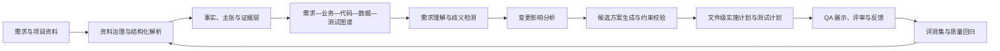
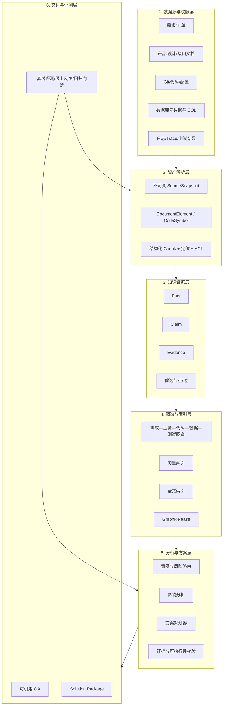
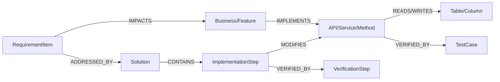
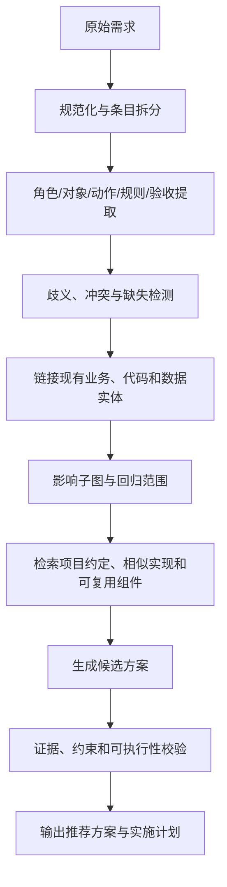

# 资料扫描到图谱构建与 QA 问答全流程升级优化方案

> 项目：LegacyGraph  
> 方案日期：2026-07-10  
> 目标定位：面向研发交付的需求分析、影响定位、方案生成与编码指导平台

## 1. 方案结论

LegacyGraph 的最终形态不应是一个“把资料放进向量库后进行问答”的通用知识库，而应成为一个**以证据图谱为底座的研发分析与方案生成系统**：输入一份需求，系统能够理解需求、识别歧义、关联现有业务与代码、计算变更影响、生成可执行方案，并用文件、符号、接口、表字段、测试和原始资料作为证据说明为什么这样改。

本项目的两个核心目标是：

1. **建立图谱，指导并加速从需求到编码的过程。**
2. **尽可能取代人工分析需求，自动给出有证据、可验证、可落地的解决方案。**

围绕这两个目标，推荐把系统主链路升级为：



升级重点不是继续堆叠节点类型、问答意图或 LLM Prompt，而是形成以下五个闭环：

- **资料闭环**：任何参与回答的内容都能回到原文件、页码、段落、表格或代码行。
- **图谱闭环**：抽取、建边、校验、补全、质量评估、发布和失效形成原子流程。
- **需求闭环**：需求条目能够追踪到业务对象、现有实现、受影响代码、方案步骤和验证用例。
- **答案闭环**：答案中的关键结论必须被证据支持，证据不足时必须降级或拒答。
- **评测闭环**：每次扫描、图谱发布、检索策略和模型变更都能用固定评测集比较前后效果。

建议采用“**在现有 Java + PostgreSQL/pgvector + Neo4j 架构上渐进升级**”的路线，不推倒重建。当前代码已经具备扫描编排、增量哈希、Blast Radius、业务/代码图谱、混合检索、GraphRAG Planner、证据卡等基础，真正缺失的是统一的数据契约、版本发布、权限贯穿、证据验证和效果评测。

---

## 2. 目标边界与成功标准

### 2.1 系统要取代哪些人工工作

系统优先取代以下高频、重复、可验证的分析工作：

1. 阅读需求、产品文档、接口文档、数据库设计和现有代码。
2. 把自然语言需求拆成业务目标、功能项、验收条件、约束和未知项。
3. 定位现有功能入口、接口、服务、方法、SQL、表字段、页面和测试。
4. 分析直接影响、间接影响、兼容性风险和回归范围。
5. 查找项目约定、相似实现和可复用组件。
6. 生成文件级实施步骤、接口/数据变更、测试计划、发布与回滚方案。
7. 对分析结论逐条给出证据并暴露不确定性。

系统不应在证据不足时伪装成已完成分析。对资金、权限、数据删除、数据库迁移、公共接口破坏性变更等高风险事项，仍应保留审批门禁。这里保留的是**责任确认**，而不是继续依赖人工完成全部资料阅读和方案分析。

### 2.2 最终输出不是一段答案，而是“解决方案包”

对“我要新增某功能”“修改某字段”“调整某流程”这类需求，系统应输出结构化解决方案包：

| 组成 | 最低要求 |
|---|---|
| 需求理解 | 目标、范围、角色、前置条件、主流程、异常流程、验收条件 |
| 歧义与假设 | 未明确事项、默认假设、需要确认的问题、假设带来的影响 |
| 现状定位 | 已有业务能力、页面、接口、服务、方法、SQL、表、配置、测试 |
| 影响分析 | 直接影响、1～N 跳间接影响、影响原因、证据和置信度 |
| 候选方案 | 至少一个推荐方案；复杂场景给出备选方案及取舍 |
| 实施计划 | 精确到仓库、模块、文件、类/方法、接口、表字段和迁移脚本 |
| 验证计划 | 单元、集成、接口、数据迁移、回归、安全和性能验证 |
| 发布计划 | 兼容策略、灰度步骤、监控指标、失败回滚 |
| 证据清单 | 每个关键结论对应的来源、版本、位置、证据类型 |
| 风险结论 | 已确认风险、待确认风险、阻塞项、是否允许进入编码 |

### 2.3 业务效果指标

首期不以“问答次数”作为成功标准，而以研发交付效果衡量：

| 指标 | 建议首期目标 | 稳定期目标 |
|---|---:|---:|
| 从收到需求到产出可评审方案的时间 | 降低 50% | 降低 70% 以上 |
| 人工资料阅读与影响排查工时 | 降低 50% | 降低 80% |
| 方案首次评审可采纳率 | ≥60% | ≥80% |
| 方案引用的文件/符号真实存在率 | 100% | 100% |
| 影响范围 Recall@K | ≥85% | ≥92% |
| 关键结论引用正确率 | ≥90% | ≥97% |
| 回答 Faithfulness | ≥0.85 | ≥0.92 |
| 高风险问题无证据拒答率 | ≥95% | ≥99% |
| 新扫描发布后知识新鲜度 P95 | <30 分钟 | <5 分钟 |

---

## 3. 当前能力重新判断

### 3.1 原评估文档应作为历史基线，而不是当前结论

[扫描任务 QA 支撑度评估与优化方案](./扫描任务QA支撑度评估与优化方案.md) 中的综合支撑度 27%，基于扫描版本 #23 和当时的代码状态。当前工作区已经出现或增强了以下能力：

- 文件 SHA-256 快照与增量变更检测。
- Blast Radius 影响传播。
- 项目约定向量化。
- 可复用组件标记。
- 图谱质量评估服务。
- 传递依赖和规则型边补全。
- Leiden 社区检测。
- 异常、安全、并发等新提取器。
- QA 意图分类、HyDE、查询改写、混合召回、重排、GraphRAG Planner、证据卡和变更影响专线。

因此，27% 只能保留为历史参考。新方案要求建立固定评测集，重新测出当前版本的扫描覆盖率、图谱连通性、影响分析召回率和 QA 忠实度。

### 3.2 当前已经具备的基础

#### 扫描与资料处理

- [ProjectScanner](../backend/src/main/java/io/github/legacygraph/task/ProjectScanner.java) 已形成发现、适配器扫描、成员调用二次解析、外部验证、数据库扫描和 AI 扫描的主编排。
- [FileChangeDetector](../backend/src/main/java/io/github/legacygraph/service/scan/FileChangeDetector.java) 已支持文件内容哈希与快照。
- [BlastRadiusAnalyzer](../backend/src/main/java/io/github/legacygraph/service/scan/BlastRadiusAnalyzer.java) 已进入增量扫描分支。
- [DocExtractStep](../backend/src/main/java/io/github/legacygraph/task/step/DocExtractStep.java) 已支持断点续扫、大文档分段、抽取缓存、向量化背压和业务事实落库。
- [ProjectConventionIngestService](../backend/src/main/java/io/github/legacygraph/service/scan/ProjectConventionIngestService.java) 与 [ReusableComponentMarker](../backend/src/main/java/io/github/legacygraph/service/scan/ReusableComponentMarker.java) 已由 `ProjectScanner` 的扫描后置流程调用。

#### 图谱构建

- [GraphBuilder](../backend/src/main/java/io/github/legacygraph/builder/GraphBuilder.java)、[BusinessGraphBuilder](../backend/src/main/java/io/github/legacygraph/builder/BusinessGraphBuilder.java)、[FrontendGraphBuilder](../backend/src/main/java/io/github/legacygraph/builder/FrontendGraphBuilder.java) 已覆盖业务、后端、前端、数据库与测试等多层实体。
- [EvidenceGraphWriter](../backend/src/main/java/io/github/legacygraph/builder/EvidenceGraphWriter.java) 已提供节点和边的证据化写入基础。
- [EdgeCompletionService](../backend/src/main/java/io/github/legacygraph/service/scan/EdgeCompletionService.java) 已把补全边标记为 `TRANSITIVE_CLOSURE + PENDING_CONFIRM + confidence=0.7`，具备区分推断事实的意识。
- [GraphQualityAssessor](../backend/src/main/java/io/github/legacygraph/service/scan/GraphQualityAssessor.java) 已覆盖节点/边分布、孤立节点、平均度和本体约束。
- [CommunityDetectionService](../backend/src/main/java/io/github/legacygraph/service/scan/CommunityDetectionService.java) 已具备社区检测实现。

#### QA 与方案生成基础

- [EnhancedQaAgent](../backend/src/main/java/io/github/legacygraph/agent/EnhancedQaAgent.java) 已形成意图分类、查询改写、HyDE、混合召回、GraphRAG、图扩展、证据组装和流式回答链路。
- [HybridRetrievalService](../backend/src/main/java/io/github/legacygraph/service/qa/HybridRetrievalService.java) 已并行执行主查询向量召回、变体召回和关键词召回。
- [GraphRagPlanExecutor](../backend/src/main/java/io/github/legacygraph/service/graph/GraphRagPlanExecutor.java) 已支持结构化图谱检索计划。
- 变更影响问题已有独立解析、子图抽取和 `ChangeImpactAgent` 分支。
- 项目已有 Implementation Plan、Procedure Guide、Tech Debt、Security、Concurrency、Test Generation 等提示词和能力入口。

### 3.3 已有代码但尚未形成闭环的关键问题

#### 问题一：扫描后置服务没有统一、可靠的发布入口

[ScanArtifactPublisher](../backend/src/main/java/io/github/legacygraph/service/scan/ScanArtifactPublisher.java) 中串联了文档发布、图质量评估、边补全和社区检测，但当前代码中未发现它的生产调用。与此同时，项目约定和可复用标记又在 `ProjectScanner.generateSystemOverviewDocument()` 中单独执行。

这会造成：

- 同步扫描与 AI 扫描可能走不同的后置步骤。
- 图质量、边补全、社区检测存在“代码已写但实际未执行”的风险。
- 扫描成功状态可能早于知识资产真正可查询。
- 失败只记录日志，没有统一的发布失败状态和重试机制。

#### 问题二：资料解析丢失结构与定位信息

[DocumentExtractor](../backend/src/main/java/io/github/legacygraph/extractors/DocumentExtractor.java) 当前主要通过 PDFBox、Word 解析和 Tika 抽取纯文本。它没有稳定保留：

- 页码和段落位置。
- 标题层级与章节路径。
- 表格、单元格和跨页表格结构。
- 图片、图注和图片中的文字。
- 扫描件 OCR 结果与 OCR 置信度。
- 原文坐标或代码行级定位。

`DocExtractStep.readDocContent()` 对超过 100KB 的内容截断到前 50KB，虽然能降低 OOM 风险，但会直接丢失后半部分需求、验收条件和附录。当前按字符和换行切块的方式也无法保证一个需求条目、表格或章节不被拆散。

#### 问题三：图质量指标尚不能代表真实准确性

当前 `GraphQualityAssessor` 的“准确率”主要检查抽样边的 `fromNodeId/toNodeId` 是否非空。这只能证明边结构完整，不能证明“这条调用、依赖或业务映射确实存在”。同时 `ScanArtifactPublisher.publish()` 的设计顺序是先评估质量、再补全边，无法直接得到最终发布图谱的质量结果。

#### 问题四：需求不是一等图谱实体

当前 [NodeType](../backend/src/main/java/io/github/legacygraph/common/NodeType.java) 已覆盖业务、代码、数据、测试、变更任务和补丁，但缺少直接服务“需求到编码”的核心实体：

- Requirement / RequirementItem。
- AcceptanceCriterion。
- Constraint / NonFunctionalRequirement。
- Assumption / OpenQuestion。
- Solution / Alternative / Decision。
- ImplementationStep / VerificationStep。

如果需求、方案和验证只存在于对话文本中，系统就无法做稳定的追踪、版本比较、复用和质量回归。

#### 问题五：QA 的检索融合和置信度仍偏启发式

`HybridRetrievalService` 当前按召回来源顺序合并、按文档 ID 去重，再交给重排器。不同召回源的排名没有通过 RRF 或校准分数融合，主查询结果天然优先，可能压制关键词精确命中或图谱证据。

`EnhancedQaAgent` 在普通回答完成时固定返回 `confidence=0.8`，缓存命中固定返回 `confidence=1.0`。这些值没有根据证据覆盖、检索分数、路径可信度、引用验证或问题风险动态计算。

#### 问题六：语义缓存会丢证据，并可能跨扫描版本返回旧答案

[SemanticCache](../backend/src/main/java/io/github/legacygraph/service/qa/SemanticCache.java) 的查询接口只返回答案文本，`EnhancedQaAgent` 在缓存命中时把证据设为空列表。缓存检索只按 `projectId + question embedding`，未绑定：

- 扫描版本或图谱发布版本。
- 用户权限范围。
- 检索策略版本。
- Prompt 和模型版本。
- 原答案依赖的节点、边和文档版本。

目前仅在字段变更校验通过后发现一个项目级缓存失效调用，新的扫描发布本身不会可靠地使缓存失效。

#### 问题七：资料权限没有贯穿到答案

QA 流式入口只传入项目、版本、问题和会话，没有把当前用户、角色、组织和可访问资源范围传递给向量检索、图查询和证据组装。即使接口已通过 JWT 鉴权，也不等于检索结果具备文档级、节点级权限隔离。

#### 问题八：缺少端到端评测与线上反馈闭环

当前已有阶段耗时日志和若干单元测试，但没有稳定回答以下问题：

- 某次扫描是否真的覆盖了目标资料和代码。
- 某类边的 Precision/Recall 是否提高。
- 某次检索调整是否提高了 Context Precision/Recall。
- 回答中的结论是否都被证据支持。
- 解决方案中的文件、类、方法和字段是否真实存在。
- 用户修改了方案的哪一部分，系统以后如何学习。

---

## 4. 市场产品与技术路线的可借鉴能力

本方案只借鉴成熟模式，不建议直接复制外部产品架构。

| 产品/技术 | 成熟做法 | LegacyGraph 应借鉴 | 不应照搬 |
|---|---|---|---|
| Microsoft GraphRAG | Local、Global、DRIFT、Basic 多种查询模式；社区报告；标准/快速/增量索引 | 按问题类型路由，区分局部影响题、全局架构题和探索题 | 全量依赖 LLM 抽实体，代码事实仍应以 AST/LSP/DB 为主 |
| Neo4j GraphRAG | 向量、全文、Cypher 和图遍历组合 | 从多路召回升级到“种子命中 + 受控图扩展” | 不把任意 Text2Cypher 直接开放给生产查询 |
| Azure AI Search | 版面感知分块、页码/坐标、混合检索 RRF、文档级 ACL | 结构化资料元素、RRF、权限在摄取时继承并在查询时过滤 | 不要求迁移到 Azure 托管服务 |
| Unstructured | 先按文档类型 partition 成元素，再按标题/语义单元 chunk | 把解析与切块分离，保留标题、表格、列表等元素 | 不必一次引入所有格式和模型 |
| Glean/Coveo | 连接器、源系统权限继承、答案引用、动态更新 | 资料连接器契约、ACL 继承、引用和新鲜度 | 不以连接器数量代替知识质量 |
| Ragas | Context Precision/Recall、Faithfulness、Answer Relevancy、Agent Tool Accuracy | 建立离线评测集和发布门禁 | LLM 指标不能替代人工抽样与确定性校验 |

主要参考资料：

- [Microsoft GraphRAG 查询模式](https://microsoft.github.io/graphrag/query/overview/)
- [Microsoft GraphRAG 索引方法](https://microsoft.github.io/graphrag/index/methods/)
- [Neo4j GraphRAG Python](https://neo4j.com/docs/neo4j-graphrag-python/current/index.html)
- [Azure AI Search 版面感知切块](https://learn.microsoft.com/en-us/azure/search/search-how-to-semantic-chunking)
- [Azure AI Search 混合检索与 RRF](https://learn.microsoft.com/en-us/azure/search/hybrid-search-ranking)
- [Azure AI Search 文档级权限](https://learn.microsoft.com/en-us/azure/search/search-document-level-access-overview)
- [Unstructured 文档切块](https://docs.unstructured.io/open-source/core-functionality/chunking)
- [Unstructured 解析策略](https://docs.unstructured.io/open-source/concepts/partitioning-strategies)
- [Coveo Generative Answering](https://docs.coveo.com/l2590456/)
- [Ragas 指标列表](https://docs.ragas.io/en/latest/concepts/metrics/available_metrics/)

---

## 5. 目标总体架构

### 5.1 六层架构



### 5.2 三类存储的职责边界

| 存储 | 主要内容 | 设计要求 |
|---|---|---|
| PostgreSQL | 项目、扫描、源快照、资料元素、事实、主张、证据、需求、方案、评测与审计 | 事务、版本、状态机和可追溯真相源 |
| pgvector/全文索引 | 文档块、Claim、项目约定、历史方案、代码说明等召回单元 | 与 GraphRelease、ACL、来源位置绑定 |
| Neo4j | 多层实体、关系、路径、社区、影响范围和版本差异 | 只发布通过质量门禁的图版本；候选/推断边显式标识 |

### 5.3 统一版本模型

新增或统一以下版本概念：

- `SourceSnapshot`：一次抓取到的原始资料或代码内容，不可变。
- `ScanVersion`：一次扫描执行，记录输入范围、配置、模型和执行结果。
- `GraphRelease`：通过质量门禁、允许 QA 使用的图谱版本。
- `SolutionVersion`：针对某个 RequirementVersion 生成的方案版本。
- `EvalRun`：某个 GraphRelease、检索配置和模型组合的评测结果。

QA 默认只能查询 `PUBLISHED` 的 GraphRelease。正在扫描或质量不达标的版本保持 `DRAFT/VALIDATING`，不能因为扫描任务状态为 SUCCESS 就自动暴露给用户。

---

## 6. 第一段升级：资料扫描与知识资产治理

### 6.1 建立统一 Source Connector 契约

当前文件、文档、代码库、数据库和运行证据的发现方式不同。建议抽象统一接口：

```text
SourceConnector
  discover(scope) -> SourceDescriptor[]
  fetch(descriptor, cursor) -> SourceSnapshot
  getAcl(descriptor) -> AccessPolicy
  diff(previous, current) -> SourceDelta
  checkpoint(cursor)
```

`SourceDescriptor` 至少包含：

- `sourceType/sourceId/sourceUri`。
- `projectId/repositoryId/branch/commit`。
- `mimeType/language/charset`。
- `etag/contentHash/size/modifiedAt`。
- `owner/aclUsers/aclGroups/classification`。
- `discoveredBy/discoveredAt`。

首期连接器范围：本地/Git 代码、产品需求文档、接口文档、数据库元数据、测试结果。工单平台、Wiki、邮件和即时通信作为后续扩展，不阻塞核心闭环。

### 6.2 用不可变快照替代“直接读当前文件”

扫描开始时为每个资料生成不可变快照，后续解析、向量化、建图和 QA 都引用同一快照，避免扫描期间文件变化导致：

- 图节点来自新版本，但向量块来自旧版本。
- 引用位置与用户打开的内容不一致。
- 失败重试无法复现。

现有 `lg_file_snapshot` 可扩展为通用 `lg_source_snapshot`，或者保留文件快照表并增加统一父表。建议字段包括：

```text
id, project_id, source_type, source_id, source_uri,
content_hash, parent_snapshot_id, scan_version_id,
mime_type, size_bytes, acl_hash, storage_uri,
status, created_at
```

### 6.3 文档解析升级为“分层策略 + 元素模型”

不要再把所有资料直接转成一个纯文本字符串。解析分三档：

| 档位 | 适用资料 | 策略 |
|---|---|---|
| FAST | Markdown、TXT、可直接提取文本的简单 PDF/DOCX | 规则解析，低成本 |
| LAYOUT | 有标题、表格、页眉页脚、图文混排的 PDF/DOCX/PPTX/XLSX | 版面模型，保留标题、表格和位置 |
| OCR | 扫描件、图片型 PDF、截图 | OCR + 版面恢复 + 置信度 |

解析输出统一为 `DocumentElement`：

```text
elementId, snapshotId, elementType,
text, headingPath, pageNo, bbox,
tableId, rowNo, colNo,
language, parseConfidence,
sourceLocation, aclHash
```

`elementType` 首期至少包括：Title、NarrativeText、ListItem、Table、TableCell、CodeBlock、ImageCaption、Header、Footer。

### 6.4 结构化切块，彻底取消大文档前置截断

推荐切块规则：

1. 先按标题层级、需求编号、表格、代码块等元素边界分段。
2. 单个元素超过模型限制时才做二次文本切分。
3. 每个 Chunk 携带完整 `headingPath`、页码范围和元素 ID。
4. 表格原则上保持整表或按行组切分，并附加表头。
5. 需求文档按“需求条目/验收条件/业务规则”优先切块，不用固定字符数破坏语义。
6. 中间章节 Chunk 补充文档标题与章节路径，避免脱离上下文。
7. Chunk 与原始元素一对多关联，可以从答案引用恢复到原文高亮。

`DocExtractStep` 中超过 100KB 截断到 50KB 的逻辑应改为：流式读取、逐元素落库、分批抽取、分批向量化、可恢复 checkpoint。资源不足时只暂停待处理分片，不能把截断内容标记为完整解析。

### 6.5 资料质量门禁

每个快照解析完成后计算：

- 解析覆盖率：已解析页数/总页数、已解析元素/预期元素。
- OCR 平均置信度与低置信度页数。
- 空白页、乱码、重复块、异常短块比例。
- 表格结构恢复率。
- 截断、跳过和失败分片数。
- ACL 获取成功率。

质量不达标的资料可以进入 `PARTIAL`，但不能静默成为完整知识源。QA 使用 PARTIAL 资料时必须在答案中提示覆盖风险。

### 6.6 增量扫描补齐删除与影响范围

当前文件哈希已能识别新增/修改文件，后续要补齐：

- 删除文件的 tombstone 和相关节点/向量失效。
- 文件重命名识别，避免先删后增造成实体重复。
- 解析器、抽取 Prompt、模型变化导致的“逻辑重扫”。
- 只重算受影响 Chunk、Fact、Node、Edge 和社区摘要。
- 记录 `changedBecause = CONTENT | ACL | PARSER | MODEL | ONTOLOGY`。

---

## 7. 第二段升级：从多层图谱到“需求—实现—验证”追踪图

### 7.1 目标本体

现有业务、代码、数据和测试节点继续保留，新增服务目标所需的最小实体：

| 新节点 | 作用 |
|---|---|
| Requirement | 一份需求或变更请求 |
| RequirementItem | 可独立分析和验收的需求条目 |
| AcceptanceCriterion | 可验证的验收条件 |
| Constraint | 技术、业务、兼容、安全、性能或时间约束 |
| Assumption | 系统为继续分析所采用的显式假设 |
| OpenQuestion | 证据不足、必须确认的问题 |
| Solution | 针对需求生成的候选或推荐方案 |
| Decision | 方案选择及取舍依据 |
| ImplementationStep | 文件/符号/数据级实施步骤 |
| VerificationStep | 测试、检查、监控和回滚验证步骤 |

新增核心关系：

```text
Requirement CONTAINS RequirementItem
RequirementItem HAS_ACCEPTANCE_CRITERION AcceptanceCriterion
RequirementItem CONSTRAINED_BY Constraint
RequirementItem IMPACTS BusinessProcess/Feature/ApiEndpoint/Method/Table/Page
RequirementItem REUSES Class/Method/ApiEndpoint/Component
Solution ADDRESSES RequirementItem
Solution HAS_DECISION Decision
Solution CONTAINS ImplementationStep
ImplementationStep MODIFIES CodeSymbol/ApiEndpoint/Table/ConfigItem/Page
ImplementationStep VERIFIED_BY VerificationStep/TestCase
Decision JUSTIFIED_BY Evidence/Claim
Assumption DERIVED_FROM Evidence
OpenQuestion BLOCKS Solution/ImplementationStep
```

这样可以形成主追踪链：



### 7.2 事实、主张、证据和推断必须分层

| 层 | 示例 | 默认是否可直接用于回答 |
|---|---|---|
| Fact | AST 明确解析到 `Service.method()` 调用 Mapper | 是 |
| Claim | 文档描述“审批通过后生成结算单” | 是，但需引用原文 |
| Inference | 名称和结构相似，推断某接口实现某业务流程 | 需要置信度阈值 |
| Hypothesis | LLM 推测可能存在兼容风险 | 否，必须标为待验证 |

所有节点和边至少记录：

```text
sourceType, sourceSnapshotId, evidenceIds,
extractor, extractorVersion, modelVersion,
confidence, status, validFrom, validTo,
createdByRunId
```

`PENDING_CONFIRM` 的补全边不应和确定性边混为一谈。普通 QA 默认只使用 `CONFIRMED`；方案探索可以使用推断边，但必须在证据卡中显示“推断”和算法来源。

### 7.3 实体对齐策略

实体对齐按优先级执行：

1. 稳定主键：仓库 + commit + FQN + signature、schema + table + column。
2. 显式声明：接口路由、注解、SQL 映射、前端调用 URL。
3. 别名词典：业务术语、简称、旧名称、表中文名。
4. 结构相似：相邻节点和调用模式。
5. 语义相似：仅作为候选，不直接合并。

所有自动合并都应保留 `alias`、`mergeReason`、`beforeIds` 和回滚能力，防止错误实体合并污染整个影响分析。

### 7.4 单一图谱收口与发布流水线

新增 `ScanFinalizationService`，替代分散的扫描后处理。同步扫描和 AI 扫描都必须调用同一入口：

```text
1. flushPendingWrites
2. ingestProjectConvention
3. markReusableComponents
4. validateDeterministicFacts
5. completeCandidateEdges
6. runPrePublishGraphQuality
7. detectCommunitiesAndSummaries
8. publishDocumentsAndVectors
9. createGraphRelease
10. invalidateAffectedCaches
11. runSmokeEvaluation
12. markReleasePublished / Failed
```

现有 `ScanArtifactPublisher` 的能力迁入或由该服务统一调用。质量评估应至少输出两份数据：

- 补全前：反映提取器真实产出。
- 补全后：反映最终可查询图谱。

补全不能掩盖提取器退化。例如直接边突然下降、推断边突然上升时，即使最终边数相同，也应阻止发布。

### 7.5 图质量指标升级

| 维度 | 指标 |
|---|---|
| 完整性 | 关键节点/边覆盖率、需求追踪链完整率、资料覆盖率 |
| 连通性 | 孤立率、最大连通子图占比、关键路径可达率、平均度 |
| 准确性 | 与 AST/LSP/SQL/接口注册表 ground truth 对比的 Precision/Recall/F1 |
| 一致性 | 本体约束、方向约束、版本一致性、重复实体率 |
| 可追溯性 | 有证据节点/边占比、可定位到页/行的证据占比 |
| 新鲜度 | 源变化到 GraphRelease 发布耗时 |
| 推断风险 | PENDING_CONFIRM 占比、低置信度边占比、推断边增长率 |

首期发布门禁建议：

```text
关键提取器无异常退化
关键节点有证据率 >= 98%
关键边有证据率 >= 95%
孤立节点率 <= 10%（稳定期 <= 5%）
确定性边抽样 Precision >= 95%
需求到代码可达率 >= 85%
无跨版本悬挂边
```

---

## 8. 第三段升级：面向需求到编码的自动分析链路

### 8.1 把“问答”升级为受控分析工作流

需求类问题不能只走一次 RAG + LLM。推荐新增 `RequirementAnalysisOrchestrator`：



每一步都产生结构化中间结果，并可失败、重试、缓存和审计。LLM 不直接拥有整条链路的自由控制权。

### 8.2 需求规范化

把输入拆成：

- 业务目标与预期价值。
- 参与角色和权限。
- 触发条件、主流程、异常流程。
- 输入、输出、状态变化和业务规则。
- 功能需求与非功能需求。
- 验收条件。
- 兼容性、安全、性能、审计和数据约束。
- 未知项、冲突项和默认假设。

如果需求只说“新增字段”而没有说明默认值、历史数据处理、接口兼容、前端展示、校验规则和权限，系统必须主动生成 OpenQuestion，不能直接伪造完整方案。

### 8.3 影响分析采用“多种子 + 多层路径 + 风险权重”

影响分析种子来自：

- 需求中明确出现的表、字段、接口、页面、角色、业务对象。
- 语义链接到的 Feature/BusinessProcess。
- 相似历史需求和 ChangeTask。

路径分层：

| 层级 | 典型路径 |
|---|---|
| L0 直接影响 | Requirement → Column/Api/Method/Page |
| L1 代码影响 | Column → SQL → Mapper → Service → Controller → API |
| L2 交互影响 | API → Page/Button/Consumer/ExternalSystem |
| L3 质量影响 | Method/API → TestCase/Assertion/Monitoring |
| L4 架构影响 | Package/Module → DEPENDS_ON → 下游模块 |

风险分数建议由确定性特征组成：

```text
risk = 关系可信度 × 路径衰减 × 变更类型权重
       × 关键资产权重 × 缺少测试惩罚 × 运行时热度
```

LLM 负责解释风险，不负责凭空计算影响路径。

### 8.4 方案生成采用“检索—规划—校验”三段式

#### 检索

优先检索：

- 当前项目编码规范和分层约定。
- 相似 Feature、接口和历史 ChangeTask。
- 可复用组件与公共基础设施。
- 受影响路径的代码片段和 API/DB 契约。
- 对应测试和运行时证据。

#### 规划

复杂需求生成 2～3 个候选方案，按以下维度比较：

- 与现有架构一致性。
- 改动范围和回归成本。
- 数据迁移与兼容风险。
- 可复用程度。
- 测试可行性。
- 发布与回滚复杂度。

#### 校验

新增 `SolutionVerifier`：

- 校验提到的仓库、文件、类、方法、接口、表和字段真实存在。
- 校验调用方向、事务边界和权限约束。
- 校验实施步骤覆盖所有受影响节点。
- 校验每个高风险步骤有测试和回滚措施。
- 校验方案与项目约定是否冲突。
- 校验引用的证据仍属于当前 GraphRelease。

校验未通过时，方案返回 `NEEDS_REVISION`，不允许包装成最终答案。

### 8.5 文件级实施计划契约

建议 Solution Package 同时保存 JSON 和 Markdown。核心 JSON 结构示例：

```json
{
  "requirementId": "req-xxx",
  "graphReleaseId": "gr-xxx",
  "status": "READY_FOR_REVIEW",
  "summary": "...",
  "assumptions": [],
  "openQuestions": [],
  "impacts": [
    {
      "nodeKey": "...",
      "risk": "HIGH",
      "reason": "...",
      "evidenceIds": []
    }
  ],
  "alternatives": [],
  "recommendedSolution": {
    "decisions": [],
    "steps": [
      {
        "repository": "...",
        "file": "...",
        "symbol": "...",
        "action": "MODIFY",
        "change": "...",
        "dependsOn": [],
        "evidenceIds": []
      }
    ],
    "tests": [],
    "deployment": [],
    "rollback": []
  },
  "confidence": 0.0,
  "qualityGate": {}
}
```

---

## 9. 第四段升级：QA 检索、证据与回答

### 9.1 意图路由重新围绕研发任务设计

建议核心意图收敛为：

| 意图 | 主要执行器 |
|---|---|
| REQUIREMENT_UNDERSTANDING | RequirementAnalysisOrchestrator |
| CHANGE_IMPACT | ChangeImpact 专用路径 |
| SOLUTION_DESIGN | SolutionPlanner |
| IMPLEMENTATION_PLAN | SolutionPlanner + SolutionVerifier |
| CODE_EXPLANATION | 图谱局部检索 + 代码证据 |
| ARCHITECTURE_OVERVIEW | 社区报告 + Global Search |
| DATA_LINEAGE | 确定性图路径 |
| SECURITY/PERMISSION | 安全与 RBAC 专用路径 |
| TEST/REGRESSION_PLAN | 影响子图 + 测试图谱 |
| COMPARATIVE/DIFF | 多 GraphRelease 比较 |

能用确定性查询回答的问题，不先调用 LLM Planner。LLM 主要用于需求理解、方案权衡和自然语言解释。

### 9.2 混合检索升级

召回源包括：

1. BM25/关键词精确召回。
2. 向量语义召回。
3. 图节点种子匹配。
4. Claim/Evidence 检索。
5. 项目约定和相似方案检索。
6. 社区摘要检索。

融合流程：

```text
多路召回
  -> ACL/版本/状态过滤
  -> RRF 融合
  -> 意图特定加权
  -> 交叉编码器或 LLM rerank
  -> 图扩展
  -> 去重与上下文预算分配
```

不要直接比较 BM25 分数和向量相似度。使用 RRF 先基于排名融合，再依据意图增加可解释权重，例如：

- 精确接口/字段问题提高关键词和图节点权重。
- 需求语义问题提高向量和 Claim 权重。
- 架构问题提高社区摘要和图路径权重。
- 实施方案提高项目约定、相似实现和测试证据权重。

### 9.3 证据卡统一格式

每条证据至少包含：

```text
evidenceId, evidenceType, sourceSnapshotId,
graphReleaseId, nodeKey/edgeKey,
sourceUri, pageNo/lineStart/lineEnd/bbox,
excerpt, relationPath,
extractor, confidence, status,
aclHash
```

答案中的每个关键主张都关联一个或多个 Evidence ID。前端点击引用可以打开原文件对应页、代码行或图路径。

### 9.4 动态置信度与拒答

回答置信度不再固定为 0.8/1.0。建议由以下因素计算：

```text
confidence = 证据覆盖率
             × 证据可靠性
             × 检索一致性
             × 图路径可信度
             × 版本新鲜度
             × 权限过滤完整性
```

分级策略：

| 级别 | 行为 |
|---|---|
| HIGH | 给出明确结论和实施步骤 |
| MEDIUM | 给出方案，但显式列出假设和待确认项 |
| LOW | 只给出发现、证据缺口和补充资料建议 |
| BLOCKED | 拒绝生成最终方案，说明阻塞原因 |

### 9.5 缓存重新设计

缓存键至少包含：

```text
projectId + graphReleaseId + aclHash
+ normalizedQuestionHash + intent
+ retrievalConfigVersion + promptVersion + modelVersion
```

缓存值保存完整 `QaResult`，而不是只有答案：

- answer。
- evidences。
- confidence breakdown。
- graphReleaseId。
- dependencyNodeKeys/dependencySnapshotIds。
- generatedAt/expiresAt。

发布新 GraphRelease 时：

- 通过依赖节点或 SourceSnapshot 做精确失效。
- 无法精确判断时，失效整个项目旧版本缓存。
- 缓存命中仍重新执行 ACL 校验和证据存在性校验。
- 不再把缓存命中等同于置信度 1.0。

### 9.6 权限贯穿

ACL 必须从源资料一直传播到答案：

```text
Source ACL
 -> SourceSnapshot ACL
 -> DocumentElement/Chunk ACL
 -> Fact/Claim/Evidence ACL
 -> Graph Node/Edge accessScope
 -> Retrieval filter
 -> Evidence assembly filter
 -> Answer audit log
```

图路径只有在路径上的所有敏感节点都允许当前用户访问时才能返回。不能先召回敏感内容，再依赖 LLM “不要输出”。

---

## 10. 第五段升级：评测、反馈与自动改进

### 10.1 建立黄金评测集

从实际项目选择 80～150 个问题，覆盖：

- 需求理解与歧义识别。
- 表/字段/API 变更影响。
- 业务流程和权限。
- 数据血缘。
- 实施方案。
- 测试与回归范围。
- 架构全局问题。
- 无答案和权限受限问题。

每个用例记录：

```text
question, intent, projectId, graphReleaseId,
expectedEntities, expectedPaths,
referenceAnswer, requiredEvidence,
forbiddenClaims, expectedAbstain,
riskLevel
```

### 10.2 分层评测

| 层 | 指标 |
|---|---|
| 资料解析 | 页/元素覆盖率、OCR 置信度、表格恢复率、定位正确率 |
| 实体抽取 | Entity Precision/Recall/F1、重复实体率 |
| 关系抽取 | Edge Precision/Recall/F1、关键路径可达率 |
| 检索 | Recall@K、MRR、Context Precision/Recall、ACL 泄露数 |
| 图推理 | 影响路径 Recall、路径解释正确率、推断边误用率 |
| 答案 | Faithfulness、Answer Relevancy、引用正确率、拒答准确率 |
| 方案 | 文件/符号存在率、影响覆盖率、步骤完整率、评审采纳率 |
| 业务 | 分析耗时、人工修订率、遗漏缺陷率、交付周期变化 |

### 10.3 发布门禁

以下变更必须跑回归评测：

- 解析器、OCR、切块策略变化。
- NodeType/EdgeType/本体变化。
- 提取器、实体对齐或边补全变化。
- Embedding、Reranker、LLM 或 Prompt 变化。
- 检索 TopK、RRF 和图扩展策略变化。

任何关键指标显著下降，都不能自动发布新的 GraphRelease 或 QA 配置。

### 10.4 线上反馈结构化

不要只记录点赞/点踩。收集：

- 哪条结论错误。
- 哪个影响节点遗漏。
- 哪条证据无关或过期。
- 哪个实施步骤不可执行。
- 用户最终采用了哪个方案。
- 人工增加、删除或修改了哪些步骤。

这些反馈进入 `QaFeedback` 和 `SolutionReviewDiff`，用于更新别名、检索权重、评测集和提示词。用户修订不能未经验证直接写成图谱事实。

---

## 11. 代码级落地建议

### 11.1 复用和改造现有类

| 领域 | 当前代码 | 建议改造 |
|---|---|---|
| 扫描编排 | `ProjectScanner`、`AiScanJobWorker` | 两条完成路径统一调用 ScanFinalizationService |
| 范围解析 | `ScanScopeResolver` | 增加 source snapshot、connector cursor、ACL 和逻辑重扫原因 |
| 文档解析 | `DocumentExtractor`、`DocumentContentService` | 返回 DocumentElement 流，不再只返回 String |
| 文档抽取 | `DocExtractStep` | 取消前置截断；分片 checkpoint；结构化切块；部分失败状态 |
| 增量扫描 | `FileChangeDetector` | 支持删除、重命名、ACL/解析器/模型变化 |
| 图构建 | `GraphBuilder`、`BusinessGraphBuilder` | 引入 Requirement/Solution/Verification 图谱构建 |
| 证据写入 | `EvidenceGraphWriter` | 强制 evidence、extractorVersion、GraphRelease 归属 |
| 边补全 | `EdgeCompletionService` | 补全边隔离；质量门禁；不覆盖确定性边退化 |
| 图质量 | `GraphQualityAssessor` | ground truth 对比、前后质量、发布阈值 |
| 扫描产物 | `ScanArtifactPublisher` | 并入统一发布流水线，避免成为无调用服务 |
| QA 编排 | `EnhancedQaAgent` | 按意图委托专用工作流；动态置信度；回答后验证 |
| 混合检索 | `HybridRetrievalService` | ACL/版本过滤、RRF、意图权重、可观测分数 |
| 缓存 | `SemanticCache` | 版本化完整结果缓存、证据保留和依赖失效 |
| 图查询 | `GraphRagPlanExecutor`、`GraphQueryService` | 查询模板白名单、风险限制、路径证据标准化 |

### 11.2 建议新增的核心服务

```text
source/
  SourceConnector
  SourceSnapshotService
  AccessPolicyResolver

document/
  DocumentPartitionService
  DocumentElementRepository
  StructureAwareChunkService
  OcrFallbackService

requirement/
  RequirementExtractionService
  RequirementLinkingService
  RequirementGraphBuilder
  RequirementAnalysisOrchestrator

solution/
  SolutionPlanner
  SolutionVerifier
  SolutionPackageService

graph/
  ScanFinalizationService
  GraphReleaseService
  GraphQualityGate

qa/
  RetrievalFusionService
  EvidenceVerifier
  ConfidenceScorer
  AccessControlledRetrievalService

evaluation/
  QaEvaluationService
  SolutionEvaluationService
  EvalDatasetService
```

### 11.3 建议新增或演进的数据表

| 表 | 用途 |
|---|---|
| `lg_source_snapshot` | 不可变资料快照和版本链 |
| `lg_document_element` | 标题、段落、表格、图片等结构化元素 |
| `lg_chunk_source_map` | Chunk 到原始元素和位置映射 |
| `lg_graph_release` | 图谱发布状态、质量分数和输入版本 |
| `lg_requirement` / `lg_requirement_item` | 需求及条目版本 |
| `lg_acceptance_criterion` | 验收条件 |
| `lg_solution` / `lg_solution_step` | 候选/推荐方案和实施步骤 |
| `lg_solution_review_diff` | 人工评审修改记录 |
| `lg_qa_trace` | 每次路由、召回、图路径、模型和证据轨迹 |
| `lg_eval_case` / `lg_eval_run` | 黄金集和回归结果 |

数据库表不是越多越好。若现有 Fact、Claim、Evidence、ChangeTask 可以承载上述字段，应优先扩展并保持兼容。

---

## 12. 分阶段实施路线

### 阶段 0：建立真实基线与发布门禁（1～2 周，P0）

目标：先消除“代码存在但链路未运行”和“指标看似正常但不可证明”的问题。

交付：

1. 建立 30～50 条首批黄金问题和 10～20 条真实需求案例。
2. 记录当前扫描、图谱、检索、答案和方案指标。
3. 新增 `ScanFinalizationService`，统一同步/AI 扫描后置路径。
4. 确认质量评估、边补全、社区检测实际执行。
5. 修复 QA retrieval 阶段耗时统计位置。
6. GraphRelease 未通过门禁时禁止 QA 切换。

验收：每一次扫描都能回答“输入是什么、执行了什么、产出是否完整、发布的是哪个版本”。

### 阶段 1：资料结构化与证据定位（2～4 周，P0）

目标：任何答案都能回到原文位置，彻底消除静默截断。

交付：

1. SourceSnapshot 和 DocumentElement 模型。
2. FAST/LAYOUT/OCR 分层解析。
3. 标题、表格、页码、段落和坐标保留。
4. 结构化切块和分片 checkpoint。
5. 大文档不截断，失败分片可重试。
6. ACL 从 SourceSnapshot 传播到 Chunk。

验收：100KB 以上文档全覆盖；PDF 答案能定位到页；表格问题能保留表头语义；低质量 OCR 明确告警。

### 阶段 2：需求追踪图与图谱质量（3～5 周，P0/P1）

目标：形成 Requirement → Business → Code → Data → Test 的可查询链路。

交付：

1. Requirement、AcceptanceCriterion、Constraint、Solution、ImplementationStep 本体。
2. 需求抽取、实体链接和图谱构建。
3. 推断边隔离与实体合并回滚。
4. Ground truth 图质量评估。
5. GraphRelease 状态机和差异报告。

验收：真实需求案例中，需求到受影响文件/接口/表/测试的可达率达到 85%，关键边抽样 Precision 达到 95%。

### 阶段 3：检索、证据和缓存升级（2～4 周，P1）

目标：让 QA 结果可引用、可解释、不会跨版本或跨权限污染。

交付：

1. 版本和 ACL 过滤。
2. RRF 融合与意图权重。
3. EvidenceVerifier 和动态置信度。
4. 完整 QaResult 缓存与 GraphRelease 失效。
5. 回答后 claim-evidence 对齐校验。

验收：缓存命中保留原证据；新图发布不返回旧版本答案；权限用例零泄露；Faithfulness ≥0.85。

### 阶段 4：自动需求分析与可落地方案（4～6 周，P1）

目标：从“回答问题”升级为“生成可评审解决方案包”。

交付：

1. RequirementAnalysisOrchestrator。
2. 歧义、假设和 OpenQuestion 检测。
3. 多层影响分析。
4. 候选方案比较与推荐。
5. 文件/符号级 ImplementationStep。
6. SolutionVerifier、测试、发布和回滚计划。

验收：引用的文件/符号存在率 100%；方案首次评审采纳率 ≥60%；真实需求分析耗时降低 50%。

### 阶段 5：编码指导与持续学习（持续演进，P2）

目标：把方案包进一步用于编码代理、测试生成和变更验证。

交付：

1. 从 SolutionStep 生成可领取的编码任务。
2. 生成 Patch 前再次校验 GraphRelease 与工作区差异。
3. 自动生成或推荐测试。
4. 代码变更后反向验证需求覆盖。
5. 采集人工方案修改和最终实现差异。

验收：方案步骤能稳定驱动编码任务；实现完成后 Requirement → Patch → Test 可追踪。

---

## 13. 风险与控制

| 风险 | 后果 | 控制措施 |
|---|---|---|
| LLM 抽取需求或关系错误 | 影响分析和方案被污染 | 确定性优先；证据必填；推断状态隔离；黄金集回归 |
| 图谱节点/边越来越多但不可用 | 查询噪声和成本上升 | 围绕需求到实现主链设计本体；删除无消费场景的类型 |
| 资料解析成本过高 | 扫描延迟和模型费用上升 | FAST/LAYOUT/OCR 分层；内容哈希缓存；只重算变化分片 |
| 自动方案看似完整但不能实施 | 误导开发和评审 | SolutionVerifier；文件/符号存在性 100% 门禁；低置信度拒绝最终化 |
| 旧缓存污染新版本 | 返回过期方案 | GraphRelease 绑定；依赖失效；证据存在性复核 |
| 权限资料泄露 | 严重安全问题 | ACL 摄取、索引过滤、图路径过滤、审计和专门攻击测试 |
| 推断边掩盖提取器退化 | 图表面健康、事实质量下降 | 记录补全前/后质量；确定性边和推断边分开统计 |
| 过度追求全自动 | 高风险变更失控 | 风险分级；高风险审批门禁；系统替代分析劳动，不取消责任确认 |

---

## 14. 首批必须优先完成的十项工作

按目标价值和依赖关系排序：

1. **统一扫描完成与 GraphRelease 发布链路**，确保图质量、边补全和社区检测真正执行。
2. **建立黄金评测集和当前能力基线**，废除无测量依据的“综合支撑度”估算。
3. **取消大文档前置截断**，引入分片 checkpoint 和部分失败状态。
4. **建立 DocumentElement + source location**，保存标题、页码、表格和代码行证据。
5. **新增 Requirement/AcceptanceCriterion/Solution/ImplementationStep 本体**。
6. **建立需求到业务、代码、数据和测试的追踪链**。
7. **把混合召回改为 ACL/版本过滤 + RRF + 意图权重 + 重排**。
8. **重构 SemanticCache**，绑定 GraphRelease、ACL 和完整证据。
9. **新增 EvidenceVerifier 与动态置信度/拒答策略**。
10. **上线 RequirementAnalysisOrchestrator + SolutionVerifier**，输出解决方案包而不是只有自然语言答案。

---

## 15. 最终目标形态

完成上述升级后，典型使用流程应为：

1. 用户上传或同步一份需求。
2. 系统解析需求条目、验收条件、约束和歧义。
3. 系统关联现有业务流程、页面、API、服务、方法、SQL、表字段和测试。
4. 系统生成直接和间接影响子图，并用证据解释每条影响路径。
5. 系统检索项目约定、相似实现和可复用组件。
6. 系统生成候选方案，比较成本、风险和兼容性。
7. 系统校验方案中的所有文件、符号、接口、字段和测试是否真实存在。
8. 系统输出推荐方案、文件级实施步骤、测试计划、发布与回滚方案。
9. 人工只处理系统明确暴露的歧义、高风险决策和责任审批。
10. 编码完成后，系统把 Patch、测试结果与原 Requirement 重新关联，验证需求是否真正闭环。

这时 LegacyGraph 才真正实现“用图谱指导需求到编码”和“自动完成需求分析、给出可落地方案”的目标。图谱不是展示层，QA 也不是聊天入口；二者共同构成一套**可追溯、可验证、可持续改进的研发决策系统**。
