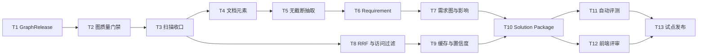
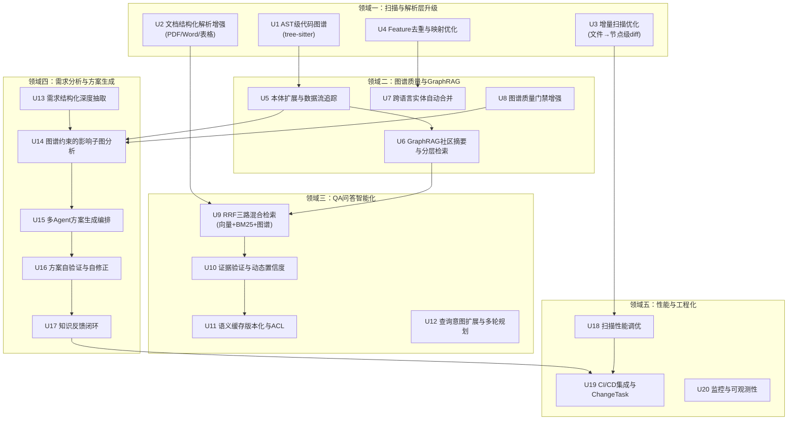

# 资料扫描到图谱构建与 QA 问答首期闭环 Implementation Plan

> **For agentic workers:** REQUIRED SUB-SKILL: Use superpowers:subagent-driven-development (recommended) or superpowers:executing-plans to implement this plan task-by-task. Steps use checkbox (`- [ ]`) syntax for tracking.

**Goal:** 在现有 LegacyGraph 架构上交付一个可运行的纵向闭环：上传需求资料后，系统基于已发布图谱完成需求结构化、影响分析和方案生成，输出带证据、文件级实施步骤、测试与回滚措施的解决方案包。

**Architecture:** 复用现有 Spring Boot、PostgreSQL/pgvector、Neo4j、Vue 3 技术栈。以不可变扫描版本和 `GraphRelease` 为一致性边界；资料解析先落结构化元素，再抽事实和向量化；Requirement、Solution 作为一等实体写入 PostgreSQL 和 Neo4j；QA 只查询已发布图谱，并经过版本/权限过滤、RRF 融合、证据验证和动态置信度计算。

**Tech Stack:** Java 21、Spring Boot 3、MyBatis-Plus、Flyway、PostgreSQL/pgvector、Neo4j Java Driver、Apache Tika、PDFBox、JUnit 5、Mockito、Vue 3、TypeScript、Pinia、Vitest、Playwright。

---

## 1. 首期范围

### 1.1 首期必须交付

1. 扫描后处理只走一个入口，图质量、边补全、社区检测和产物发布真实执行。
2. 使用 `GraphRelease` 控制 QA 可见版本，未通过门禁的扫描版本不可查询。
3. 文档不再因超过 100KB 被截断；Markdown/TXT/PDF 能保留章节或页码级来源位置。
4. Requirement、RequirementItem、AcceptanceCriterion、Constraint 成为持久化实体和图谱节点。
5. 需求能链接到业务、接口、方法、表、字段、页面和测试节点，并输出影响子图。
6. QA 混合召回使用 RRF，所有结果绑定扫描版本、GraphRelease 和访问范围。
7. 语义缓存保存完整证据并绑定 GraphRelease，不再跨版本返回旧答案。
8. 系统能够生成并验证 Solution Package：影响范围、决策、文件级步骤、测试、发布和回滚。
9. 建立最小黄金集和自动回归，GraphRelease 发布前执行 smoke evaluation。
10. 前端提供需求分析和方案评审页面。

### 1.2 明确不进入首期

- 商用 OCR/版面模型的具体供应商接入；首期只定义接口并对图片型 PDF 返回 `PARTIAL`。
- Jira、Confluence、邮件、IM 等任意外部连接器。
- 自动修改代码、自动提交或自动创建 PR。
- GNN 链路预测和无监督实体合并。
- 用 LLM 自动放行资金、权限、删除和破坏性迁移等高风险方案。

### 1.3 建议团队与周期

| 角色 | 投入 | 主要任务 |
|---|---:|---|
| 后端工程师 A | 1 人全职 | GraphRelease、扫描收口、资料元素 |
| 后端工程师 B | 1 人全职 | Requirement、检索、Solution、评测 |
| 前端工程师 | 0.5～1 人 | 需求分析和方案评审页面 |
| 测试/业务专家 | 0.5 人 | 黄金集、需求案例、验收和人工抽样 |
| 预计周期 | 8～10 周 | 13 个顺序任务，部分 UI 工作可在后端契约稳定后并行 |

---

## 2. 任务依赖与发布切片



| 里程碑 | 完成任务 | 可独立验收的软件能力 |
|---|---|---|
| M1 图谱可信发布 | T1～T3 | 扫描结束后产生可审计 GraphRelease，失败版本不进入 QA |
| M2 资料完整可引用 | T4～T5 | 大文档完整解析，引用能落到章节或 PDF 页码 |
| M3 需求影响分析 | T6～T7 | 需求条目可追踪到受影响代码、数据和测试 |
| M4 可信 QA | T8～T9 | RRF、访问过滤、版本化缓存、完整证据和动态置信度 |
| M5 可落地方案 | T10～T12 | 生成并评审文件级 Solution Package |
| M6 试点闭环 | T11～T13 | 黄金集门禁和真实需求试点 |

---

## 3. 文件责任边界

### 3.1 新增后端文件

```text
backend/src/main/java/io/github/legacygraph/
  entity/
    GraphRelease.java
    DocumentElement.java
    Requirement.java
    RequirementItem.java
    Solution.java
    SolutionStep.java
    QaEvalCase.java
    QaEvalRun.java
  repository/
    GraphReleaseRepository.java
    DocumentElementRepository.java
    RequirementRepository.java
    RequirementItemRepository.java
    SolutionRepository.java
    SolutionStepRepository.java
    QaEvalCaseRepository.java
    QaEvalRunRepository.java
  dto/document/
    ParsedDocument.java
    DocumentChunk.java
  dto/requirement/
    RequirementAnalysis.java
    RequirementCreateRequest.java
    RequirementAnalysisResponse.java
  dto/solution/
    SolutionPackage.java
    SolutionVerificationResult.java
  dto/qa/
    AccessContext.java
    CachedQaResult.java
    ConfidenceBreakdown.java
  service/scan/
    ScanFinalizationService.java
    GraphReleaseService.java
    GraphQualityGate.java
  service/document/
    DocumentPartitionService.java
    DefaultDocumentPartitionService.java
    StructureAwareChunkService.java
  service/requirement/
    RequirementExtractionService.java
    RequirementLinkingService.java
    RequirementGraphBuilder.java
    RequirementAnalysisOrchestrator.java
  service/solution/
    SolutionPlanner.java
    SolutionVerifier.java
    SolutionPackageService.java
  service/qa/
    ReciprocalRankFusionService.java
    AccessContextResolver.java
    EvidenceVerifier.java
    ConfidenceScorer.java
  service/evaluation/
    QaEvaluationService.java
    GraphReleaseSmokeEvaluator.java
  controller/
    RequirementController.java
    SolutionController.java
    QaEvaluationController.java
```

### 3.2 新增迁移

当前工作区最高迁移为 `V56`。实施时若主分支新增了迁移，先执行：

```bash
rtk ls backend/src/main/resources/db/migration
```

然后把下列 `V57～V65` 整体顺延，保证版本唯一；迁移内容和相对顺序不变。已经执行过的 Flyway 迁移不得修改，只能追加新版本。

```text
V57__graph_release.sql
V58__document_element_and_access_scope.sql
V59__requirement_model.sql
V60__seed_requirement_analysis_prompt.sql
V61__vector_access_and_release.sql
V62__semantic_cache_release_scope.sql
V63__solution_model.sql
V64__seed_solution_package_prompt.sql
V65__qa_evaluation.sql
```

### 3.3 主要修改文件

```text
backend/src/main/java/io/github/legacygraph/task/ProjectScanner.java
backend/src/main/java/io/github/legacygraph/task/AiScanJobWorker.java
backend/src/main/java/io/github/legacygraph/service/scan/ScanArtifactPublisher.java
backend/src/main/java/io/github/legacygraph/service/scan/GraphQualityAssessor.java
backend/src/main/java/io/github/legacygraph/task/step/DocExtractStep.java
backend/src/main/java/io/github/legacygraph/common/NodeType.java
backend/src/main/java/io/github/legacygraph/common/EdgeType.java
backend/src/main/java/io/github/legacygraph/entity/VectorDocument.java
backend/src/main/java/io/github/legacygraph/repository/VectorDocumentRepository.java
backend/src/main/java/io/github/legacygraph/service/qa/HybridRetrievalService.java
backend/src/main/java/io/github/legacygraph/service/qa/SemanticCache.java
backend/src/main/java/io/github/legacygraph/agent/EnhancedQaAgent.java
backend/src/main/java/io/github/legacygraph/controller/EnhancedQaController.java
frontend/src/router/index.ts
frontend/src/components/AppLayout.vue
```

---

## 4. 逐任务实施步骤

### Task 1: 建立 GraphRelease 持久化和状态机

**Files:**
- Create: `backend/src/main/resources/db/migration/V57__graph_release.sql`
- Create: `backend/src/main/java/io/github/legacygraph/entity/GraphRelease.java`
- Create: `backend/src/main/java/io/github/legacygraph/repository/GraphReleaseRepository.java`
- Create: `backend/src/main/java/io/github/legacygraph/service/scan/GraphReleaseService.java`
- Test: `backend/src/test/java/io/github/legacygraph/service/scan/GraphReleaseServiceTest.java`

- [ ] **Step 1: 写失败测试，约束状态转换和幂等行为**

```java
@ExtendWith(MockitoExtension.class)
class GraphReleaseServiceTest {
    @Mock GraphReleaseRepository repository;
    @InjectMocks GraphReleaseService service;

    @Test
    void startValidationCreatesOneReleasePerScanVersion() {
        when(repository.findByProjectAndVersion("p1", "v1")).thenReturn(null);

        GraphRelease release = service.startValidation("p1", "v1");

        assertEquals("VALIDATING", release.getStatus());
        verify(repository).insert(release);
    }

    @Test
    void publishOnlyAcceptsValidatingRelease() {
        GraphRelease release = new GraphRelease();
        release.setId("r1");
        release.setStatus("DRAFT");
        when(repository.selectById("r1")).thenReturn(release);

        assertThrows(IllegalStateException.class,
                () -> service.publish("r1", "{}", "{}"));
    }
}
```

- [ ] **Step 2: 运行测试并确认失败**

Run:

```bash
rtk mvn -f backend/pom.xml -Dtest=GraphReleaseServiceTest test
```

Expected: FAIL，提示 `GraphReleaseService`、`GraphRelease` 或 `GraphReleaseRepository` 不存在。

- [ ] **Step 3: 创建迁移**

```sql
CREATE TABLE IF NOT EXISTS lg_graph_release (
    id                VARCHAR(64) PRIMARY KEY,
    project_id        VARCHAR(64) NOT NULL,
    scan_version_id   VARCHAR(64) NOT NULL,
    status            VARCHAR(32) NOT NULL DEFAULT 'DRAFT',
    pre_quality       JSONB NOT NULL DEFAULT '{}'::JSONB,
    post_quality      JSONB NOT NULL DEFAULT '{}'::JSONB,
    failure_reason    TEXT,
    published_at      TIMESTAMP,
    created_at        TIMESTAMP NOT NULL DEFAULT CURRENT_TIMESTAMP,
    updated_at        TIMESTAMP NOT NULL DEFAULT CURRENT_TIMESTAMP,
    UNIQUE(project_id, scan_version_id)
);

CREATE INDEX IF NOT EXISTS idx_graph_release_project_status
    ON lg_graph_release(project_id, status, published_at DESC);
```

- [ ] **Step 4: 实现实体、Repository 和状态机**

`GraphReleaseRepository` 必须提供：

```java
@Mapper
public interface GraphReleaseRepository extends LegacyBaseMapper<GraphRelease> {
    @Select("SELECT * FROM lg_graph_release WHERE project_id=#{projectId} AND scan_version_id=#{versionId} LIMIT 1")
    GraphRelease findByProjectAndVersion(@Param("projectId") String projectId,
                                         @Param("versionId") String versionId);

    @Select("SELECT * FROM lg_graph_release WHERE project_id=#{projectId} AND status='PUBLISHED' ORDER BY published_at DESC LIMIT 1")
    GraphRelease findLatestPublished(@Param("projectId") String projectId);
}
```

`GraphReleaseService` 的公开契约固定为：

```java
public GraphRelease startValidation(String projectId, String versionId);
public GraphRelease publish(String releaseId, String preQualityJson, String postQualityJson);
public GraphRelease fail(String releaseId, String reason, String preQualityJson, String postQualityJson);
public GraphRelease requirePublished(String projectId, String requestedVersionId);
```

状态只允许：`DRAFT -> VALIDATING -> PUBLISHED | FAILED`。重复调用 `startValidation` 返回已有记录，不创建第二条。

- [ ] **Step 5: 运行测试并确认通过**

```bash
rtk mvn -f backend/pom.xml -Dtest=GraphReleaseServiceTest test
```

Expected: PASS，2 tests completed。

- [ ] **Step 6: 提交**

```bash
rtk git add backend/src/main/resources/db/migration/V57__graph_release.sql backend/src/main/java/io/github/legacygraph/entity/GraphRelease.java backend/src/main/java/io/github/legacygraph/repository/GraphReleaseRepository.java backend/src/main/java/io/github/legacygraph/service/scan/GraphReleaseService.java backend/src/test/java/io/github/legacygraph/service/scan/GraphReleaseServiceTest.java
rtk git commit -m "feat: add graph release lifecycle"
```

### Task 2: 让图质量评估返回可判定快照

**Files:**
- Create: `backend/src/main/java/io/github/legacygraph/dto/scan/GraphQualitySnapshot.java`
- Create: `backend/src/main/java/io/github/legacygraph/service/scan/GraphQualityGate.java`
- Modify: `backend/src/main/java/io/github/legacygraph/service/scan/GraphQualityAssessor.java:82-130`
- Test: `backend/src/test/java/io/github/legacygraph/service/scan/GraphQualityGateTest.java`
- Test: `backend/src/test/java/io/github/legacygraph/service/scan/GraphQualityAssessorTest.java`

- [ ] **Step 1: 写 GraphQualityGate 失败测试**

```java
class GraphQualityGateTest {
    private final GraphQualityGate gate = new GraphQualityGate();

    @Test
    void rejectsReleaseWhenGraphHasNoEdges() {
        GraphQualitySnapshot post = new GraphQualitySnapshot(
                100, 0, 80, 0.0, 0.0, 0, 0, 0);
        GraphQualityGate.Decision decision = gate.evaluate(post);
        assertFalse(decision.passed());
        assertTrue(decision.reasons().contains("EDGE_NODE_RATIO_BELOW_1"));
    }

    @Test
    void acceptsHealthyGraph() {
        GraphQualitySnapshot post = new GraphQualitySnapshot(
                100, 180, 4, 1.8, 3.6, 0, 96, 100);
        assertTrue(gate.evaluate(post).passed());
    }
}
```

- [ ] **Step 2: 运行并确认失败**

```bash
rtk mvn -f backend/pom.xml -Dtest=GraphQualityGateTest test
```

Expected: FAIL，新增类型不存在。

- [ ] **Step 3: 实现质量快照和门禁**

```java
public record GraphQualitySnapshot(
        long totalNodes,
        long totalEdges,
        long isolatedNodes,
        double edgeNodeRatio,
        double averageDegree,
        long constraintViolations,
        long validEvidenceEdges,
        long sampledEvidenceEdges) {

    public double isolatedRate() {
        return totalNodes == 0 ? 1.0 : (double) isolatedNodes / totalNodes;
    }

    public double evidenceRate() {
        return sampledEvidenceEdges == 0 ? 0.0
                : (double) validEvidenceEdges / sampledEvidenceEdges;
    }
}
```

```java
@Component
public class GraphQualityGate {
    public record Decision(boolean passed, List<String> reasons) {}

    public Decision evaluate(GraphQualitySnapshot snapshot) {
        List<String> reasons = new ArrayList<>();
        if (snapshot.totalNodes() == 0) reasons.add("EMPTY_GRAPH");
        if (snapshot.edgeNodeRatio() < 1.0) reasons.add("EDGE_NODE_RATIO_BELOW_1");
        if (snapshot.isolatedRate() > 0.10) reasons.add("ISOLATED_RATE_ABOVE_10_PERCENT");
        if (snapshot.constraintViolations() > 0) reasons.add("ONTOLOGY_CONSTRAINT_VIOLATION");
        if (snapshot.sampledEvidenceEdges() > 0 && snapshot.evidenceRate() < 0.95) {
            reasons.add("EVIDENCE_RATE_BELOW_95_PERCENT");
        }
        return new Decision(reasons.isEmpty(), List.copyOf(reasons));
    }
}
```

- [ ] **Step 4: 把 `GraphQualityAssessor` 拆为评估和报告两个动作**

新增公开方法：

```java
public GraphQualitySnapshot assess(String projectId, String versionId) {
    Map<String, Object> stats = graphDao.versionGraphStats(projectId, versionId);
    long nodes = toLong(stats.get("totalNodes"));
    long edges = toLong(stats.get("totalEdges"));
    long isolated = graphDao.countIsolatedNodes(projectId, versionId);
    double averageDegree = graphDao.averageNodeDegree(projectId, versionId);
    long violations = assessConstraints(projectId, versionId).stream()
            .mapToLong(ConstraintViolation::violationCount)
            .sum();
    AccuracyMetric evidence = assessAccuracy(projectId, versionId);
    return new GraphQualitySnapshot(
            nodes,
            edges,
            isolated,
            nodes == 0 ? 0.0 : (double) edges / nodes,
            averageDegree,
            violations,
            evidence.validCount(),
            evidence.sampleSize());
}
```

保留 `assessAndReport()` 兼容入口，但内部调用 `assess()`，避免现有调用方断裂。

- [ ] **Step 5: 运行相关测试**

```bash
rtk mvn -f backend/pom.xml -Dtest=GraphQualityGateTest,GraphQualityAssessorTest test
```

Expected: PASS。

- [ ] **Step 6: 提交**

```bash
rtk git add backend/src/main/java/io/github/legacygraph/dto/scan/GraphQualitySnapshot.java backend/src/main/java/io/github/legacygraph/service/scan/GraphQualityGate.java backend/src/main/java/io/github/legacygraph/service/scan/GraphQualityAssessor.java backend/src/test/java/io/github/legacygraph/service/scan/GraphQualityGateTest.java backend/src/test/java/io/github/legacygraph/service/scan/GraphQualityAssessorTest.java
rtk git commit -m "feat: add graph release quality gate"
```

### Task 3: 统一扫描后置和发布流水线

**Files:**
- Create: `backend/src/main/java/io/github/legacygraph/service/scan/ScanFinalizationService.java`
- Modify: `backend/src/main/java/io/github/legacygraph/service/scan/ScanArtifactPublisher.java:90-114`
- Modify: `backend/src/main/java/io/github/legacygraph/task/ProjectScanner.java:1034-1088`
- Modify: `backend/src/main/java/io/github/legacygraph/task/AiScanJobWorker.java:58-150`
- Modify: `backend/src/main/java/io/github/legacygraph/service/qa/SemanticCache.java:145-155`
- Test: `backend/src/test/java/io/github/legacygraph/service/scan/ScanFinalizationServiceTest.java`
- Test: `backend/src/test/java/io/github/legacygraph/task/ProjectScannerFullFlowTest.java`

- [ ] **Step 1: 写失败测试，固定后置步骤顺序**

```java
@ExtendWith(MockitoExtension.class)
class ScanFinalizationServiceTest {
    @Mock GraphReleaseService releases;
    @Mock GraphQualityAssessor assessor;
    @Mock GraphQualityGate gate;
    @Mock EdgeCompletionService edgeCompletion;
    @Mock CommunityDetectionService communities;
    @Mock ScanArtifactPublisher publisher;
    @Mock ProjectConventionIngestService conventions;
    @Mock ReusableComponentMarker reusable;
    @Mock SemanticCache cache;

    private GraphQualitySnapshot snapshot(long nodes, long edges, long isolated) {
        return new GraphQualitySnapshot(nodes, edges, isolated,
                nodes == 0 ? 0.0 : (double) edges / nodes,
                nodes == 0 ? 0.0 : (double) edges * 2 / nodes,
                0, 100, 100);
    }

    private ScanFinalizationService service() {
        return new ScanFinalizationService(releases, assessor, gate,
                edgeCompletion, communities, publisher, conventions,
                reusable, cache, new ObjectMapper());
    }

    @Test
    void publishesOnlyAfterPostQualityPasses() {
        GraphRelease release = new GraphRelease();
        release.setId("r1");
        when(releases.startValidation("p1", "v1")).thenReturn(release);
        GraphQualitySnapshot pre = snapshot(100, 120, 8);
        GraphQualitySnapshot post = snapshot(100, 160, 4);
        when(assessor.assess("p1", "v1")).thenReturn(pre, post);
        when(gate.evaluate(post)).thenReturn(new GraphQualityGate.Decision(true, List.of()));

        service().finalizeScan("p1", "v1");

        InOrder order = inOrder(conventions, reusable, assessor, edgeCompletion,
                communities, publisher, gate, releases, cache);
        order.verify(conventions).ingest("p1", "v1");
        order.verify(reusable).mark("p1", "v1");
        order.verify(assessor).assess("p1", "v1");
        order.verify(edgeCompletion).completeAll("p1", "v1");
        order.verify(assessor).assess("p1", "v1");
        order.verify(publisher).publishArtifactsOnly("p1", "v1");
        order.verify(releases).publish(eq("r1"), anyString(), anyString());
        order.verify(cache).invalidateByProject("p1");
    }
}
```

- [ ] **Step 2: 运行并确认失败**

```bash
rtk mvn -f backend/pom.xml -Dtest=ScanFinalizationServiceTest test
```

Expected: FAIL，`ScanFinalizationService` 或 `publishArtifactsOnly` 不存在。

- [ ] **Step 3: 实现 `ScanFinalizationService.finalizeScan`**

核心方法必须完整实现异常落库：

```java
@Transactional
public GraphRelease finalizeScan(String projectId, String versionId) {
    GraphRelease release = graphReleaseService.startValidation(projectId, versionId);
    GraphQualitySnapshot pre = null;
    GraphQualitySnapshot post = null;
    try {
        projectConventionIngestService.ingest(projectId, versionId);
        reusableComponentMarker.mark(projectId, versionId);
        pre = graphQualityAssessor.assess(projectId, versionId);
        edgeCompletionService.completeAll(projectId, versionId);
        Map<String, String> detected = communityDetectionService.detectCommunities(projectId);
        if (detected != null && !detected.isEmpty()) {
            communityDetectionService.writeCommunityToNodes(projectId, detected);
        }
        post = graphQualityAssessor.assess(projectId, versionId);
        GraphQualityGate.Decision decision = graphQualityGate.evaluate(post);
        if (!decision.passed()) {
            return graphReleaseService.fail(release.getId(),
                    String.join(",", decision.reasons()), json(pre), json(post));
        }
        scanArtifactPublisher.publishArtifactsOnly(projectId, versionId);
        GraphRelease published = graphReleaseService.publish(
                release.getId(), json(pre), json(post));
        semanticCache.invalidateByProject(projectId);
        return published;
    } catch (Exception e) {
        return graphReleaseService.fail(release.getId(), e.getMessage(), json(pre), json(post));
    }
}

private String json(Object value) {
    if (value == null) return "{}";
    try {
        return objectMapper.writeValueAsString(value);
    } catch (JsonProcessingException e) {
        throw new IllegalStateException("Cannot serialize graph quality", e);
    }
}
```

- [ ] **Step 4: 拆分 `ScanArtifactPublisher`**

把原 `publish()` 中只负责报告和向量化的部分移入：

```java
public void publishArtifactsOnly(String projectId, String versionId) {
    Path docsDir = resolveDocsDir(projectId);
    if (docsDir == null) {
        throw new IllegalStateException("Cannot resolve artifact directory for " + projectId);
    }
    try {
        Files.createDirectories(docsDir);
    } catch (IOException e) {
        throw new IllegalStateException("Cannot create artifact directory " + docsDir, e);
    }
    publishSystemOverview(projectId, versionId, docsDir);
    publishScanPerformanceReport(projectId, versionId, docsDir);
    publishCodeUnderstandingReport(projectId, versionId, docsDir);
    publishExternalToolEvidence(projectId, versionId, docsDir);
}
```

原 `publish()` 标记 `@Deprecated` 并只委托 `publishArtifactsOnly()`，删除其中质量、补全和社区检测调用，避免重复执行。

- [ ] **Step 5: 接入两条扫描完成路径**

`ProjectScanner` 的非 AI 完成分支和 `AiScanJobWorker` 的 AI 完成分支各调用一次：

```java
if (graphReleaseEnabled) {
    GraphRelease release = scanFinalizationService.finalizeScan(projectId, versionId);
    if (!"PUBLISHED".equals(release.getStatus())) {
        throw new IllegalStateException("Graph release failed: " + release.getFailureReason());
    }
} else {
    generateSystemOverviewDocument(projectId, versionId);
}
```

两个调用方都增加：

```java
@Value("${legacygraph.graph-release.enabled:false}")
private boolean graphReleaseEnabled;
```

默认值为 false，保证生产升级前仍能走旧路径；开发和测试环境在 T13 开启。

删除 `generateSystemOverviewDocument()` 内的 `runPostScanConventionIngest()`，避免重复执行。依靠数据库唯一键和 `startValidation()` 幂等处理重复恢复任务。

- [ ] **Step 6: 运行扫描和发布测试**

```bash
rtk mvn -f backend/pom.xml -Dtest=ScanFinalizationServiceTest,ProjectScannerFullFlowTest,AiScanOrchestratorTest test
```

Expected: PASS；失败质量门禁时 GraphRelease 为 FAILED，QA 不可见。

- [ ] **Step 7: 提交**

```bash
rtk git add backend/src/main/java/io/github/legacygraph/service/scan/ScanFinalizationService.java backend/src/main/java/io/github/legacygraph/service/scan/ScanArtifactPublisher.java backend/src/main/java/io/github/legacygraph/task/ProjectScanner.java backend/src/main/java/io/github/legacygraph/task/AiScanJobWorker.java backend/src/main/java/io/github/legacygraph/service/qa/SemanticCache.java backend/src/test/java/io/github/legacygraph/service/scan/ScanFinalizationServiceTest.java backend/src/test/java/io/github/legacygraph/task/ProjectScannerFullFlowTest.java
rtk git commit -m "feat: finalize scans through graph release gate"
```

### Task 4: 建立 DocumentElement 和结构化解析

**Files:**
- Create: `backend/src/main/resources/db/migration/V58__document_element_and_access_scope.sql`
- Create: `backend/src/main/java/io/github/legacygraph/entity/DocumentElement.java`
- Create: `backend/src/main/java/io/github/legacygraph/repository/DocumentElementRepository.java`
- Modify: `backend/src/main/java/io/github/legacygraph/entity/SourceAssetSnapshot.java`
- Modify: `backend/src/main/java/io/github/legacygraph/repository/SourceAssetSnapshotRepository.java`
- Create: `backend/src/main/java/io/github/legacygraph/dto/document/ParsedDocument.java`
- Create: `backend/src/main/java/io/github/legacygraph/service/document/DocumentPartitionService.java`
- Create: `backend/src/main/java/io/github/legacygraph/service/document/DefaultDocumentPartitionService.java`
- Test: `backend/src/test/java/io/github/legacygraph/service/document/DefaultDocumentPartitionServiceTest.java`

- [ ] **Step 1: 写 Markdown 结构解析失败测试**

```java
private final DocumentPartitionService service = new DefaultDocumentPartitionService();

@TempDir Path tempDir;

@Test
void partitionsMarkdownByHeadingAndPreservesHeadingPath() throws Exception {
    Path file = tempDir.resolve("requirement.md");
    Files.writeString(file, "# 结算需求\n概述\n## 验收条件\n1. 必须成功\n");

    ParsedDocument parsed = service.partition("snap-1", file, Set.of("PUBLIC"));

    assertEquals("COMPLETE", parsed.status());
    assertTrue(parsed.elements().stream().anyMatch(e ->
            "TITLE".equals(e.getElementType()) && "结算需求".equals(e.getTextContent())));
    assertTrue(parsed.elements().stream().anyMatch(e ->
            e.getHeadingPath().contains("验收条件") && e.getTextContent().contains("必须成功")));
}
```

- [ ] **Step 2: 运行并确认失败**

```bash
rtk mvn -f backend/pom.xml -Dtest=DefaultDocumentPartitionServiceTest test
```

Expected: FAIL，解析服务不存在。

- [ ] **Step 3: 创建迁移**

```sql
ALTER TABLE lg_source_asset_snapshot
    ADD COLUMN IF NOT EXISTS source_uri TEXT,
    ADD COLUMN IF NOT EXISTS mime_type VARCHAR(128),
    ADD COLUMN IF NOT EXISTS acl_principals JSONB NOT NULL DEFAULT '["PUBLIC"]'::JSONB,
    ADD COLUMN IF NOT EXISTS parse_status VARCHAR(32) NOT NULL DEFAULT 'PENDING';

CREATE TABLE IF NOT EXISTS lg_document_element (
    id               VARCHAR(64) PRIMARY KEY,
    snapshot_id      VARCHAR(64) NOT NULL,
    project_id       VARCHAR(64) NOT NULL,
    version_id       VARCHAR(64) NOT NULL,
    ordinal_no       INTEGER NOT NULL,
    element_type     VARCHAR(32) NOT NULL,
    text_content     TEXT NOT NULL,
    heading_path     JSONB NOT NULL DEFAULT '[]'::JSONB,
    page_no          INTEGER,
    bbox             JSONB,
    parse_confidence NUMERIC(5,4) NOT NULL DEFAULT 1.0,
    source_location  TEXT NOT NULL,
    acl_principals   JSONB NOT NULL DEFAULT '["PUBLIC"]'::JSONB,
    created_at       TIMESTAMP NOT NULL DEFAULT CURRENT_TIMESTAMP,
    UNIQUE(snapshot_id, ordinal_no)
);

CREATE INDEX IF NOT EXISTS idx_document_element_snapshot
    ON lg_document_element(snapshot_id, ordinal_no);
```

- [ ] **Step 4: 定义解析契约**

```java
public interface DocumentPartitionService {
    ParsedDocument partition(String snapshotId, Path path, Set<String> aclPrincipals)
            throws IOException;
}

public record ParsedDocument(
        String snapshotId,
        String status,
        List<DocumentElement> elements,
        List<String> warnings) {
}
```

`DocumentElementRepository` 提供幂等替换：

```java
@Mapper
public interface DocumentElementRepository extends LegacyBaseMapper<DocumentElement> {
    @Delete("DELETE FROM lg_document_element WHERE snapshot_id=#{snapshotId}")
    int deleteBySnapshotId(@Param("snapshotId") String snapshotId);

    default void replaceSnapshotElements(String snapshotId,
                                         List<DocumentElement> elements) {
        deleteBySnapshotId(snapshotId);
        for (DocumentElement element : elements) {
            insert(element);
        }
    }
}
```

`SourceAssetSnapshot` 增加 `sourceUri/mimeType/aclPrincipals/parseStatus` 字段；Repository 增加：

```java
@Select("SELECT * FROM lg_source_asset_snapshot "
        + "WHERE project_id=#{projectId} AND version_id=#{versionId} "
        + "AND relative_path=#{relativePath} LIMIT 1")
SourceAssetSnapshot findByPath(@Param("projectId") String projectId,
                               @Param("versionId") String versionId,
                               @Param("relativePath") String relativePath);
```

`DefaultDocumentPartitionService` 首期规则：

- Markdown：标题行生成 `TITLE`，普通段落生成 `NARRATIVE_TEXT`，维护标题路径。
- TXT：按空行分段，`headingPath=[]`。
- PDF：PDFBox 逐页提取，每页一个或多个 `NARRATIVE_TEXT`，`pageNo` 从 1 开始。
- PDF 所有页面都没有文本：返回 `status=PARTIAL`，warning 为 `OCR_REQUIRED`。
- 其他格式：Tika 抽取，返回 `sourceLocation=文件路径#element-N`。

- [ ] **Step 5: 运行测试并补充 PDF 空文本用例**

```bash
rtk mvn -f backend/pom.xml -Dtest=DefaultDocumentPartitionServiceTest test
```

Expected: PASS；图片型 PDF 用例返回 PARTIAL 而非 COMPLETE。

- [ ] **Step 6: 提交**

```bash
rtk git add backend/src/main/resources/db/migration/V58__document_element_and_access_scope.sql backend/src/main/java/io/github/legacygraph/entity/DocumentElement.java backend/src/main/java/io/github/legacygraph/repository/DocumentElementRepository.java backend/src/main/java/io/github/legacygraph/entity/SourceAssetSnapshot.java backend/src/main/java/io/github/legacygraph/repository/SourceAssetSnapshotRepository.java backend/src/main/java/io/github/legacygraph/dto/document/ParsedDocument.java backend/src/main/java/io/github/legacygraph/service/document/DocumentPartitionService.java backend/src/main/java/io/github/legacygraph/service/document/DefaultDocumentPartitionService.java backend/src/test/java/io/github/legacygraph/service/document/DefaultDocumentPartitionServiceTest.java
rtk git commit -m "feat: partition documents into source elements"
```

### Task 5: 取消大文档截断并按结构切块

**Files:**
- Create: `backend/src/main/java/io/github/legacygraph/dto/document/DocumentChunk.java`
- Create: `backend/src/main/java/io/github/legacygraph/service/document/StructureAwareChunkService.java`
- Modify: `backend/src/main/java/io/github/legacygraph/task/step/DocExtractStep.java:126-220,479-512`
- Modify: `backend/src/main/java/io/github/legacygraph/service/qa/VectorizationService.java`
- Test: `backend/src/test/java/io/github/legacygraph/service/document/StructureAwareChunkServiceTest.java`
- Test: `backend/src/test/java/io/github/legacygraph/task/step/DocExtractStepTest.java`

- [ ] **Step 1: 写超过 100KB 不丢尾部的失败测试**

```java
private final StructureAwareChunkService service = new StructureAwareChunkService();

@Test
void largeDocumentKeepsLastAcceptanceCriterion() {
    DocumentElement first = new DocumentElement();
    first.setSnapshotId("snap-1");
    first.setOrdinalNo(0);
    first.setElementType("NARRATIVE_TEXT");
    first.setTextContent("A".repeat(120_000));
    first.setHeadingPath("[\"需求正文\"]");
    first.setAclPrincipals("[\"PUBLIC\"]");
    DocumentElement last = new DocumentElement();
    last.setSnapshotId("snap-1");
    last.setOrdinalNo(1);
    last.setElementType("NARRATIVE_TEXT");
    last.setTextContent("最终验收条件：生成回滚记录");
    last.setHeadingPath("[\"验收条件\"]");
    last.setAclPrincipals("[\"PUBLIC\"]");

    List<DocumentChunk> chunks = service.chunk(List.of(first, last), 4_000, 400);

    assertTrue(chunks.stream().anyMatch(c -> c.content().contains("最终验收条件")));
    assertEquals(List.of(0, 1), chunks.stream()
            .flatMap(c -> c.elementOrdinals().stream())
            .distinct().sorted().toList());
}
```

- [ ] **Step 2: 运行并确认失败**

```bash
rtk mvn -f backend/pom.xml -Dtest=StructureAwareChunkServiceTest,DocExtractStepTest test
```

Expected: FAIL，`StructureAwareChunkService` 不存在或原截断断言失败。

- [ ] **Step 3: 实现结构化 Chunk 契约**

```java
public record DocumentChunk(
        String chunkKey,
        String headingPath,
        String content,
        List<Integer> elementOrdinals,
        Integer pageStart,
        Integer pageEnd,
        Set<String> aclPrincipals) {
}
```

`StructureAwareChunkService.chunk()` 必须：

1. 不跨一级标题合并。
2. `TABLE` 元素单独成块。
3. 超长单元素按 `maxChars` 切分，使用 `overlapChars` 重叠。
4. 每块前缀包含文档标题路径。
5. `chunkKey = snapshotId + ':' + firstOrdinal + ':' + partNo`，保证重试幂等。

- [ ] **Step 4: 改造 `DocExtractStep`**

删除 `readDocContent()` 中 100KB 截断逻辑。执行流程替换为：

```java
SourceAssetSnapshot snapshot = sourceAssetSnapshotRepository.findByPath(
        projectId, versionId, doc.getFilePath());
if (snapshot == null) {
    throw new IllegalStateException("Source snapshot missing for " + doc.getFilePath());
}
Set<String> principals = parsePrincipals(snapshot.getAclPrincipals());
ParsedDocument parsed = documentPartitionService.partition(
        snapshot.getId(), Path.of(doc.getFilePath()), principals);
documentElementRepository.replaceSnapshotElements(snapshot.getId(), parsed.elements());
List<DocumentChunk> chunks = structureAwareChunkService.chunk(
        parsed.elements(), DOC_CHUNK_SIZE, DOC_CHUNK_OVERLAP);

for (DocumentChunk chunk : chunks) {
    String checkpointPath = doc.getFilePath() + "#" + chunk.chunkKey();
    if (donePaths.contains(checkpointPath)) continue;
    support.markExtracting(projectId, versionId, checkpointPath, "DOC_EXTRACT");
    support.vectorizeContent(projectId, versionId, "DOC", checkpointPath, chunk.content());
    BusinessFactExtraction extraction = support.cachedExtract(
            "doc-chunk", chunk.content(),
            () -> docUnderstandingAgent.extractBusinessFacts(
                    projectId, chunk.content(), checkpointPath),
            BusinessFactExtraction.class,
            this::isEmptyExtraction);
    persistBusinessFacts(projectId, versionId, doc, extraction);
    support.markExtractDone(projectId, versionId, checkpointPath,
            "DOC_EXTRACT", "chunk=" + chunk.chunkKey());
}
doc.setParseStatus("PARTIAL".equals(parsed.status()) ? "PARTIAL" : "PARSED");

private boolean isEmptyExtraction(BusinessFactExtraction value) {
    return value == null || AiScanStepSupport.allEmpty(
            value.getBusinessDomains(), value.getBusinessProcesses(),
            value.getBusinessObjects(), value.getBusinessRules(),
            value.getRoles(), value.getFeatures(), value.getStatusTransitions());
}

private Set<String> parsePrincipals(String json) {
    if (json == null || json.isBlank()) return Set.of("PUBLIC");
    try {
        return objectMapper.readValue(json, new TypeReference<Set<String>>() {});
    } catch (JsonProcessingException e) {
        throw new IllegalStateException("Invalid snapshot ACL", e);
    }
}
```

`VectorizationService` 把 `headingPath/pageStart/pageEnd/elementOrdinals/aclPrincipals` 写入 `VectorDocument.meta`。

- [ ] **Step 5: 运行文档测试**

```bash
rtk mvn -f backend/pom.xml -Dtest=StructureAwareChunkServiceTest,DocExtractStepTest,DocumentContentServiceTest test
```

Expected: PASS；尾部验收条件可被召回；图片型 PDF 状态为 PARTIAL。

- [ ] **Step 6: 提交**

```bash
rtk git add backend/src/main/java/io/github/legacygraph/dto/document/DocumentChunk.java backend/src/main/java/io/github/legacygraph/service/document/StructureAwareChunkService.java backend/src/main/java/io/github/legacygraph/task/step/DocExtractStep.java backend/src/main/java/io/github/legacygraph/service/qa/VectorizationService.java backend/src/test/java/io/github/legacygraph/service/document/StructureAwareChunkServiceTest.java backend/src/test/java/io/github/legacygraph/task/step/DocExtractStepTest.java
rtk git commit -m "feat: extract complete documents with structured chunks"
```

### Task 6: 建立 Requirement 持久化和结构化抽取

**Files:**
- Create: `backend/src/main/resources/db/migration/V59__requirement_model.sql`
- Create: `backend/src/main/resources/db/migration/V60__seed_requirement_analysis_prompt.sql`
- Create: `backend/src/main/java/io/github/legacygraph/entity/Requirement.java`
- Create: `backend/src/main/java/io/github/legacygraph/entity/RequirementItem.java`
- Create: `backend/src/main/java/io/github/legacygraph/repository/RequirementRepository.java`
- Create: `backend/src/main/java/io/github/legacygraph/repository/RequirementItemRepository.java`
- Create: `backend/src/main/java/io/github/legacygraph/dto/requirement/RequirementAnalysis.java`
- Create: `backend/src/main/java/io/github/legacygraph/service/requirement/RequirementExtractionService.java`
- Test: `backend/src/test/java/io/github/legacygraph/service/requirement/RequirementExtractionServiceTest.java`

- [ ] **Step 1: 写结构化抽取失败测试**

```java
@ExtendWith(MockitoExtension.class)
class RequirementExtractionServiceTest {
    @Mock LlmGateway gateway;
    @InjectMocks RequirementExtractionService service;

    @Test
    void extractsItemsCriteriaAndOpenQuestions() {
        RequirementAnalysis response = new RequirementAnalysis();
        response.setGoal("新增结算单导出");
        response.setItems(List.of(new RequirementAnalysis.Item(
                "R1", "导出结算单", List.of("导出成功"), List.of("权限校验"))));
        response.setOpenQuestions(List.of("导出格式是否固定为 XLSX"));
        when(gateway.callWithTemplate(eq("p1"), eq("requirement-analysis"),
                anyMap(), eq(RequirementAnalysis.class))).thenReturn(response);

        RequirementAnalysis actual = service.extract("p1", "原始需求");

        assertEquals("新增结算单导出", actual.getGoal());
        assertEquals(1, actual.getItems().size());
        assertFalse(actual.getOpenQuestions().isEmpty());
    }
}
```

- [ ] **Step 2: 运行并确认失败**

```bash
rtk mvn -f backend/pom.xml -Dtest=RequirementExtractionServiceTest test
```

Expected: FAIL，Requirement 类型不存在。

- [ ] **Step 3: 创建需求表**

```sql
CREATE TABLE IF NOT EXISTS lg_requirement (
    id                    VARCHAR(64) PRIMARY KEY,
    project_id            VARCHAR(64) NOT NULL,
    source_snapshot_id    VARCHAR(64),
    base_graph_release_id VARCHAR(64) NOT NULL,
    title                 VARCHAR(512) NOT NULL,
    raw_text              TEXT NOT NULL,
    goal                  TEXT,
    status                VARCHAR(32) NOT NULL DEFAULT 'ANALYZING',
    created_at            TIMESTAMP NOT NULL DEFAULT CURRENT_TIMESTAMP,
    updated_at            TIMESTAMP NOT NULL DEFAULT CURRENT_TIMESTAMP
);

CREATE TABLE IF NOT EXISTS lg_requirement_item (
    id                  VARCHAR(64) PRIMARY KEY,
    requirement_id      VARCHAR(64) NOT NULL,
    item_code           VARCHAR(64) NOT NULL,
    item_text           TEXT NOT NULL,
    acceptance_criteria JSONB NOT NULL DEFAULT '[]'::JSONB,
    constraints_json    JSONB NOT NULL DEFAULT '[]'::JSONB,
    confidence          NUMERIC(5,4) NOT NULL DEFAULT 0.0,
    status              VARCHAR(32) NOT NULL DEFAULT 'EXTRACTED',
    created_at          TIMESTAMP NOT NULL DEFAULT CURRENT_TIMESTAMP,
    UNIQUE(requirement_id, item_code)
);

CREATE INDEX IF NOT EXISTS idx_requirement_project
    ON lg_requirement(project_id, created_at DESC);
```

- [ ] **Step 4: 创建实际 Prompt**

`V60` 写入 `requirement-analysis` 模板，system/user 内容必须要求只返回：

```json
{
  "goal": "业务目标",
  "actors": ["角色"],
  "businessObjects": ["业务对象"],
  "items": [
    {
      "code": "R1",
      "text": "可独立实施的需求条目",
      "acceptanceCriteria": ["可验证条件"],
      "constraints": ["权限、兼容、安全、性能或数据约束"]
    }
  ],
  "assumptions": ["为继续分析采用的显式假设"],
  "openQuestions": ["没有证据时必须确认的问题"]
}
```

模板必须包含规则：“不得补造接口、表名、默认值或验收条件；缺失信息写入 openQuestions”。

- [ ] **Step 5: 实现抽取服务**

`RequirementAnalysis` 使用 Lombok DTO，字段和 Prompt 一一对应：

```java
@Data
public class RequirementAnalysis {
    private String goal;
    private List<String> actors = new ArrayList<>();
    private List<String> businessObjects = new ArrayList<>();
    private List<Item> items = new ArrayList<>();
    private List<String> assumptions = new ArrayList<>();
    private List<String> openQuestions = new ArrayList<>();

    @Data
    @NoArgsConstructor
    @AllArgsConstructor
    public static class Item {
        private String code;
        private String text;
        private List<String> acceptanceCriteria;
        private List<String> constraints;
    }
}
```

```java
@Service
@RequiredArgsConstructor
public class RequirementExtractionService {
    private final LlmGateway llmGateway;

    public RequirementAnalysis extract(String projectId, String rawText) {
        if (rawText == null || rawText.isBlank()) {
            throw new IllegalArgumentException("requirement text must not be blank");
        }
        return llmGateway.callWithTemplate(
                projectId,
                "requirement-analysis",
                Map.of("requirement", rawText),
                RequirementAnalysis.class);
    }
}
```

- [ ] **Step 6: 运行测试并提交**

```bash
rtk mvn -f backend/pom.xml -Dtest=RequirementExtractionServiceTest test
rtk git add backend/src/main/resources/db/migration/V59__requirement_model.sql backend/src/main/resources/db/migration/V60__seed_requirement_analysis_prompt.sql backend/src/main/java/io/github/legacygraph/entity/Requirement.java backend/src/main/java/io/github/legacygraph/entity/RequirementItem.java backend/src/main/java/io/github/legacygraph/repository/RequirementRepository.java backend/src/main/java/io/github/legacygraph/repository/RequirementItemRepository.java backend/src/main/java/io/github/legacygraph/dto/requirement/RequirementAnalysis.java backend/src/main/java/io/github/legacygraph/service/requirement/RequirementExtractionService.java backend/src/test/java/io/github/legacygraph/service/requirement/RequirementExtractionServiceTest.java
rtk git commit -m "feat: extract structured requirements"
```

Expected: tests PASS；commit succeeds。

### Task 7: 构建需求图谱、实体链接和影响子图

**Files:**
- Modify: `backend/src/main/java/io/github/legacygraph/common/NodeType.java`
- Modify: `backend/src/main/java/io/github/legacygraph/common/EdgeType.java`
- Create: `backend/src/main/java/io/github/legacygraph/service/requirement/RequirementGraphBuilder.java`
- Create: `backend/src/main/java/io/github/legacygraph/service/requirement/RequirementLinkingService.java`
- Create: `backend/src/main/java/io/github/legacygraph/service/requirement/RequirementAnalysisOrchestrator.java`
- Create: `backend/src/main/java/io/github/legacygraph/controller/RequirementController.java`
- Create: `backend/src/main/java/io/github/legacygraph/dto/requirement/RequirementCreateRequest.java`
- Create: `backend/src/main/java/io/github/legacygraph/dto/requirement/RequirementAnalysisResponse.java`
- Test: `backend/src/test/java/io/github/legacygraph/service/requirement/RequirementGraphBuilderTest.java`
- Test: `backend/src/test/java/io/github/legacygraph/controller/RequirementControllerTest.java`

- [ ] **Step 1: 写图谱构建失败测试**

```java
@Test
void buildsRequirementToAcceptanceAndAffectedNodeEdges() {
    Requirement requirement = new Requirement();
    requirement.setId("req-1");
    requirement.setProjectId("p1");
    requirement.setBaseGraphReleaseId("v1");
    RequirementItem item = new RequirementItem();
    item.setId("item-1");
    item.setRequirementId("req-1");
    item.setItemCode("R1");
    item.setItemText("新增字段");
    LinkedTarget target = new LinkedTarget("column:acct.status", "Column", 0.98,
            "CONFIRMED", List.of("evidence-1"));

    builder.build(requirement, List.of(item), List.of(target));

    verify(graphWriter).upsertNode(argThat(n ->
            "Requirement".equals(n.getNodeType()) && n.getNodeKey().contains("req-1")));
    verify(graphWriter).upsertEdge(argThat(e ->
            "AFFECTS".equals(e.getEdgeType()) &&
                    "column:acct.status".equals(e.getToNodeKey())));
}
```

- [ ] **Step 2: 运行并确认失败**

```bash
rtk mvn -f backend/pom.xml -Dtest=RequirementGraphBuilderTest test
```

Expected: FAIL，新节点类型和服务不存在。

- [ ] **Step 3: 扩展本体**

`NodeType` 增加：

```java
Requirement("需求"),
RequirementItem("需求条目"),
AcceptanceCriterion("验收条件"),
Constraint("约束"),
Assumption("假设"),
OpenQuestion("待确认问题"),
Solution("解决方案"),
ImplementationStep("实施步骤"),
VerificationStep("验证步骤")
```

`EdgeType` 增加：

```java
HAS_ACCEPTANCE_CRITERION("具有验收条件"),
CONSTRAINED_BY("受约束"),
ADDRESSES("解决需求"),
MODIFIES("修改"),
BLOCKS("阻塞")
```

需求影响复用现有 `AFFECTS`，不要新增同义 `IMPACTS`。

- [ ] **Step 4: 实现确定性优先的链接策略**

`RequirementLinkingService.link()` 按顺序执行：

1. 从需求文本提取显式 `schema.table.column`、URL、Java FQN 和文件路径。
2. 使用 `Neo4jGraphDao` 精确匹配 `nodeKey/displayName`。
3. 对未命中术语查询 terminology mapping。
4. 最后使用向量相似度产生候选；相似度低于 0.80 不创建 AFFECTS 边。
5. 精确匹配状态 `CONFIRMED`；语义候选状态 `PENDING_CONFIRM`。

公开契约：

```java
public List<LinkedTarget> link(String projectId,
                               String versionId,
                               RequirementAnalysis analysis);
```

`LinkedTarget` 定义为：

```java
public record LinkedTarget(String nodeKey,
                           String nodeType,
                           double confidence,
                           String status,
                           List<String> evidenceIds) {
}
```

- [ ] **Step 5: 实现编排和接口**

`POST /lg/projects/{projectId}/requirements/analyze` 请求：

```json
{
  "title": "新增结算导出",
  "text": "需求正文",
  "baseGraphReleaseId": "release-id"
}
```

编排顺序固定为：`requirePublished -> extract -> persist -> link -> build graph -> impactSubgraph -> response`。响应必须包含 Requirement、items、openQuestions、linkedTargets、impactPaths 和 evidence IDs。

`RequirementController` 使用生产开关：

```java
@ConditionalOnProperty(prefix = "legacygraph.requirement-analysis",
        name = "enabled", havingValue = "true")
```

- [ ] **Step 6: 运行服务和 Controller 测试**

```bash
rtk mvn -f backend/pom.xml -Dtest=RequirementGraphBuilderTest,RequirementControllerTest,ImpactSubgraphServiceTest test
```

Expected: PASS；未发布版本返回 409；低置信度候选不会成为 CONFIRMED 边。

- [ ] **Step 7: 提交**

```bash
rtk git add backend/src/main/java/io/github/legacygraph/common/NodeType.java backend/src/main/java/io/github/legacygraph/common/EdgeType.java backend/src/main/java/io/github/legacygraph/service/requirement backend/src/main/java/io/github/legacygraph/controller/RequirementController.java backend/src/main/java/io/github/legacygraph/dto/requirement backend/src/test/java/io/github/legacygraph/service/requirement backend/src/test/java/io/github/legacygraph/controller/RequirementControllerTest.java
rtk git commit -m "feat: link requirements to impact graph"
```

### Task 8: 增加 GraphRelease/ACL 过滤和 RRF 融合

**Files:**
- Create: `backend/src/main/resources/db/migration/V61__vector_access_and_release.sql`
- Create: `backend/src/main/java/io/github/legacygraph/dto/qa/AccessContext.java`
- Create: `backend/src/main/java/io/github/legacygraph/service/qa/AccessContextResolver.java`
- Create: `backend/src/main/java/io/github/legacygraph/service/qa/ReciprocalRankFusionService.java`
- Modify: `backend/src/main/java/io/github/legacygraph/entity/VectorDocument.java`
- Modify: `backend/src/main/java/io/github/legacygraph/repository/VectorDocumentRepository.java:55-86`
- Modify: `backend/src/main/java/io/github/legacygraph/service/qa/VectorizationService.java`
- Modify: `backend/src/main/java/io/github/legacygraph/service/qa/HybridRetrievalService.java:41-102`
- Modify: `backend/src/main/java/io/github/legacygraph/controller/EnhancedQaController.java:42-69`
- Modify: `backend/src/main/java/io/github/legacygraph/service/scan/ScanFinalizationService.java`
- Test: `backend/src/test/java/io/github/legacygraph/service/qa/ReciprocalRankFusionServiceTest.java`
- Test: `backend/src/test/java/io/github/legacygraph/service/VectorRetrievalServiceTest.java`

- [ ] **Step 1: 写 RRF 失败测试**

```java
@Test
void documentFoundByBothRetrieversRanksFirst() {
    VectorDocument both = new VectorDocument();
    both.setId(1L);
    VectorDocument vectorOnly = new VectorDocument();
    vectorOnly.setId(2L);
    VectorDocument keywordOnly = new VectorDocument();
    keywordOnly.setId(3L);

    List<VectorDocument> result = service.fuse(
            List.of(
                    new ReciprocalRankFusionService.Ranking(
                            "vector", List.of(vectorOnly, both)),
                    new ReciprocalRankFusionService.Ranking(
                            "keyword", List.of(keywordOnly, both))),
            10);

    assertEquals(1L, result.get(0).getId());
    assertEquals(Set.of("vector", "keyword"), result.get(0).getRetrievalSources());
}
```

- [ ] **Step 2: 运行并确认失败**

```bash
rtk mvn -f backend/pom.xml -Dtest=ReciprocalRankFusionServiceTest test
```

Expected: FAIL，RRF 服务不存在。

- [ ] **Step 3: 创建向量访问字段**

```sql
ALTER TABLE lg_vector_document
    ADD COLUMN IF NOT EXISTS graph_release_id VARCHAR(64),
    ADD COLUMN IF NOT EXISTS acl_principals JSONB NOT NULL DEFAULT '["PUBLIC"]'::JSONB,
    ADD COLUMN IF NOT EXISTS document_status VARCHAR(32) NOT NULL DEFAULT 'ACTIVE';

CREATE INDEX IF NOT EXISTS idx_vector_doc_release_status
    ON lg_vector_document(project_id, graph_release_id, document_status);

CREATE INDEX IF NOT EXISTS idx_vector_doc_acl
    ON lg_vector_document USING GIN(acl_principals);
```

- [ ] **Step 4: 实现 RRF**

```java
@Service
public class ReciprocalRankFusionService {
    private static final double K = 60.0;

    public record Ranking(String source, List<VectorDocument> documents) {}

    public List<VectorDocument> fuse(List<Ranking> rankings, int topK) {
        Map<Long, Double> scores = new HashMap<>();
        Map<Long, VectorDocument> documents = new HashMap<>();
        Map<Long, Set<String>> sources = new HashMap<>();
        for (Ranking ranking : rankings) {
            for (int i = 0; i < ranking.documents().size(); i++) {
                VectorDocument document = ranking.documents().get(i);
                documents.put(document.getId(), document);
                scores.merge(document.getId(), 1.0 / (K + i + 1), Double::sum);
                sources.computeIfAbsent(document.getId(), ignored -> new LinkedHashSet<>())
                        .add(ranking.source());
            }
        }
        return scores.entrySet().stream()
                .sorted(Map.Entry.<Long, Double>comparingByValue().reversed())
                .limit(topK)
                .map(entry -> {
                    VectorDocument document = documents.get(entry.getKey());
                    document.setRetrievalScore(entry.getValue());
                    document.setRetrievalSources(Set.copyOf(sources.get(entry.getKey())));
                    return document;
                }).toList();
    }
}
```

`VectorDocument` 新增两个 `@TableField(exist=false)` 字段：`retrievalScore` 和 `retrievalSources`。

- [ ] **Step 5: 在 SQL 层执行版本和 ACL 过滤**

```java
public record AccessContext(String userId,
                            Set<String> roles,
                            Set<String> principals,
                            String aclHash) {
}
```

向量查询增加：

```sql
AND graph_release_id = #{graphReleaseId}
AND document_status = 'ACTIVE'
AND acl_principals ?| string_to_array(#{principalsCsv}, ',')
```

扫描期间 `graph_release_id` 为空；门禁通过且产物向量化完成后，由 `ScanFinalizationService` 在 publish 前绑定：

```java
@Update("UPDATE lg_vector_document SET graph_release_id=#{releaseId} "
        + "WHERE project_id=#{projectId} AND version_id=#{versionId}")
int bindGraphRelease(@Param("projectId") String projectId,
                     @Param("versionId") String versionId,
                     @Param("releaseId") String releaseId);
```

```java
scanArtifactPublisher.publishArtifactsOnly(projectId, versionId);
vectorDocumentRepository.bindGraphRelease(projectId, versionId, release.getId());
GraphRelease published = graphReleaseService.publish(
        release.getId(), json(pre), json(post));
```

`VectorizationService` 从 `DocumentChunk.aclPrincipals` 写入 `VectorDocument.aclPrincipals`；没有来源权限时只允许显式使用 `PUBLIC`，不能写空数组。

`AccessContext` 保存 `userId`、`roles`、`principals` 和稳定 `aclHash`。`EnhancedQaController` 在切换到异步线程前解析当前认证信息，并显式传给 `EnhancedQaAgent`，避免 SecurityContext 在线程切换后丢失。

- [ ] **Step 6: 替换 HybridRetrievalService 的顺序去重**

把 `Map<String, VectorDocument> merged` 替换为：

```java
List<ReciprocalRankFusionService.Ranking> rankings = new ArrayList<>();
rankings.add(new Ranking("vector-main", mainFuture.getNow(List.of())));
for (int i = 0; i < variantFutures.size(); i++) {
    rankings.add(new Ranking("vector-variant-" + i,
            variantFutures.get(i).getNow(List.of())));
}
rankings.add(new Ranking("keyword", keywordFuture.getNow(List.of())));
return fusionService.fuse(rankings, topK);
```

`HybridRetrievalService` 注入：

```java
@Value("${legacygraph.qa.rrf-enabled:false}")
private boolean rrfEnabled;
```

开关关闭时保留原顺序去重，开启时使用 RRF，便于灰度和回滚。

- [ ] **Step 7: 运行检索测试并提交**

```bash
rtk mvn -f backend/pom.xml -Dtest=ReciprocalRankFusionServiceTest,VectorRetrievalServiceTest,EnhancedQaAgentTest test
rtk git add backend/src/main/resources/db/migration/V61__vector_access_and_release.sql backend/src/main/java/io/github/legacygraph/dto/qa/AccessContext.java backend/src/main/java/io/github/legacygraph/service/qa/AccessContextResolver.java backend/src/main/java/io/github/legacygraph/service/qa/ReciprocalRankFusionService.java backend/src/main/java/io/github/legacygraph/entity/VectorDocument.java backend/src/main/java/io/github/legacygraph/repository/VectorDocumentRepository.java backend/src/main/java/io/github/legacygraph/service/qa/VectorizationService.java backend/src/main/java/io/github/legacygraph/service/qa/HybridRetrievalService.java backend/src/main/java/io/github/legacygraph/controller/EnhancedQaController.java backend/src/main/java/io/github/legacygraph/service/scan/ScanFinalizationService.java backend/src/test/java/io/github/legacygraph/service/qa/ReciprocalRankFusionServiceTest.java backend/src/test/java/io/github/legacygraph/service/VectorRetrievalServiceTest.java
rtk git commit -m "feat: secure and fuse hybrid retrieval"
```

Expected: tests PASS；没有匹配 principal 的向量文档不会进入 Java 层。

### Task 9: 版本化语义缓存、证据验证和动态置信度

**Files:**
- Create: `backend/src/main/resources/db/migration/V62__semantic_cache_release_scope.sql`
- Create: `backend/src/main/java/io/github/legacygraph/dto/qa/CachedQaResult.java`
- Create: `backend/src/main/java/io/github/legacygraph/dto/qa/ConfidenceBreakdown.java`
- Create: `backend/src/main/java/io/github/legacygraph/service/qa/EvidenceVerifier.java`
- Create: `backend/src/main/java/io/github/legacygraph/service/qa/ConfidenceScorer.java`
- Modify: `backend/src/main/java/io/github/legacygraph/entity/SemanticCacheEntry.java`
- Modify: `backend/src/main/java/io/github/legacygraph/repository/SemanticCacheRepository.java`
- Modify: `backend/src/main/java/io/github/legacygraph/service/qa/SemanticCache.java:43-139`
- Modify: `backend/src/main/java/io/github/legacygraph/agent/EnhancedQaAgent.java:99-127,280-400`
- Test: `backend/src/test/java/io/github/legacygraph/service/qa/SemanticCacheTest.java`
- Test: `backend/src/test/java/io/github/legacygraph/service/qa/ConfidenceScorerTest.java`

- [ ] **Step 1: 写缓存证据保留失败测试**

```java
@Test
void cacheHitReturnsEvidenceForSameReleaseAndAcl() {
    CachedQaResult expected = new CachedQaResult(
            "答案", "[{\"evidenceId\":\"e1\"}]", 0.88, "r1");
    SemanticCacheEntry stored = new SemanticCacheEntry();
    stored.setProjectId("p1");
    stored.setGraphReleaseId("r1");
    stored.setAclHash("acl1");
    stored.setAnswer(expected.answer());
    stored.setEvidence(expected.evidenceJson());
    stored.setConfidence(BigDecimal.valueOf(expected.confidence()));
    stored.setLastAccessAt(LocalDateTime.now());
    when(repository.findSimilar(eq("p1"), eq("r1"), eq("acl1"),
            anyString(), anyDouble(), anyInt())).thenReturn(List.of(stored));

    CachedQaResult actual = cache.get("p1", "r1", "acl1", "问题").orElseThrow();

    assertEquals(expected.evidenceJson(), actual.evidenceJson());
    assertEquals("r1", actual.graphReleaseId());
}
```

- [ ] **Step 2: 运行并确认失败**

```bash
rtk mvn -f backend/pom.xml -Dtest=SemanticCacheTest,ConfidenceScorerTest test
```

Expected: FAIL，现有 `get` 只返回 String。

- [ ] **Step 3: 创建缓存迁移**

```sql
ALTER TABLE lg_semantic_cache
    ADD COLUMN IF NOT EXISTS graph_release_id VARCHAR(64),
    ADD COLUMN IF NOT EXISTS acl_hash VARCHAR(128),
    ADD COLUMN IF NOT EXISTS intent VARCHAR(64),
    ADD COLUMN IF NOT EXISTS confidence NUMERIC(5,4),
    ADD COLUMN IF NOT EXISTS retrieval_config_version VARCHAR(64) DEFAULT 'rrf-v1',
    ADD COLUMN IF NOT EXISTS prompt_version VARCHAR(64) DEFAULT 'qa-v1',
    ADD COLUMN IF NOT EXISTS model_version VARCHAR(128);

CREATE INDEX IF NOT EXISTS idx_semantic_cache_scope
    ON lg_semantic_cache(project_id, graph_release_id, acl_hash, last_access_at);
```

- [ ] **Step 4: 修改缓存契约**

```java
public record CachedQaResult(String answer,
                             String evidenceJson,
                             double confidence,
                             String graphReleaseId) {
}

public Optional<CachedQaResult> get(String projectId,
                                    String graphReleaseId,
                                    String aclHash,
                                    String question);

public void put(String projectId,
                String graphReleaseId,
                String aclHash,
                String question,
                CachedQaResult result);
```

命中后必须反序列化原 evidence JSON；证据不存在、版本不匹配或 ACL hash 不匹配时视为 miss。

- [ ] **Step 5: 实现证据验证和置信度**

```java
public record ConfidenceBreakdown(
        double evidenceCoverage,
        double evidenceReliability,
        double retrievalAgreement,
        double pathConfidence,
        double freshness,
        double finalScore) {
}
```

`ConfidenceScorer` 使用固定公式：

```java
double finalScore = 0.30 * coverage
        + 0.25 * reliability
        + 0.20 * agreement
        + 0.15 * pathConfidence
        + 0.10 * freshness;
```

`EvidenceVerifier` 校验 evidenceId 存在、属于当前项目/GraphRelease、用户可访问、source location 非空。覆盖率低于 0.6 时返回 `LOW`，高风险意图直接拒绝最终方案。

- [ ] **Step 6: 改造 EnhancedQaAgent**

1. 缓存命中发送原证据，不再发送空数组。
2. 删除固定 `confidence=1.0/0.8`。
3. 生成完成后先验证证据并计算置信度，再保存消息和缓存。
4. 修复 retrieval timing：在 `retrievalFuture.join()` 之前记录 `stageStart`。

- [ ] **Step 7: 运行测试并提交**

```bash
rtk mvn -f backend/pom.xml -Dtest=SemanticCacheTest,ConfidenceScorerTest,EnhancedQaAgentTest test
rtk git add backend/src/main/resources/db/migration/V62__semantic_cache_release_scope.sql backend/src/main/java/io/github/legacygraph/dto/qa/CachedQaResult.java backend/src/main/java/io/github/legacygraph/dto/qa/ConfidenceBreakdown.java backend/src/main/java/io/github/legacygraph/service/qa/EvidenceVerifier.java backend/src/main/java/io/github/legacygraph/service/qa/ConfidenceScorer.java backend/src/main/java/io/github/legacygraph/entity/SemanticCacheEntry.java backend/src/main/java/io/github/legacygraph/repository/SemanticCacheRepository.java backend/src/main/java/io/github/legacygraph/service/qa/SemanticCache.java backend/src/main/java/io/github/legacygraph/agent/EnhancedQaAgent.java backend/src/test/java/io/github/legacygraph/service/qa/SemanticCacheTest.java backend/src/test/java/io/github/legacygraph/service/qa/ConfidenceScorerTest.java
rtk git commit -m "feat: version qa cache and verify evidence"
```

Expected: PASS；缓存命中保留 evidence；新 GraphRelease 不命中旧缓存。

### Task 10: 生成并验证 Solution Package

**Files:**
- Create: `backend/src/main/resources/db/migration/V63__solution_model.sql`
- Create: `backend/src/main/resources/db/migration/V64__seed_solution_package_prompt.sql`
- Create: `backend/src/main/java/io/github/legacygraph/entity/Solution.java`
- Create: `backend/src/main/java/io/github/legacygraph/entity/SolutionStep.java`
- Create: `backend/src/main/java/io/github/legacygraph/repository/SolutionRepository.java`
- Create: `backend/src/main/java/io/github/legacygraph/repository/SolutionStepRepository.java`
- Create: `backend/src/main/java/io/github/legacygraph/dto/solution/SolutionPackage.java`
- Create: `backend/src/main/java/io/github/legacygraph/dto/solution/SolutionVerificationResult.java`
- Create: `backend/src/main/java/io/github/legacygraph/service/solution/SolutionPlanner.java`
- Create: `backend/src/main/java/io/github/legacygraph/service/solution/SolutionVerifier.java`
- Create: `backend/src/main/java/io/github/legacygraph/service/solution/SolutionPackageService.java`
- Create: `backend/src/main/java/io/github/legacygraph/controller/SolutionController.java`
- Modify: `backend/src/main/java/io/github/legacygraph/dao/Neo4jGraphDao.java`
- Test: `backend/src/test/java/io/github/legacygraph/service/solution/SolutionVerifierTest.java`
- Test: `backend/src/test/java/io/github/legacygraph/controller/SolutionControllerTest.java`

- [ ] **Step 1: 写方案验证失败测试**

```java
@Test
void rejectsSolutionWhenReferencedSymbolDoesNotExist() {
    SolutionPackage.ImplementationStep step = new SolutionPackage.ImplementationStep(
            1, "MODIFY", "backend",
            "backend/src/main/java/x/Missing.java", "MissingService.run",
            "修改缺失服务", List.of("e1"), List.of("单元测试"));
    SolutionPackage solution = new SolutionPackage(
            "req-1", "r1", "实现需求", List.of(), List.of(),
            List.of(), List.of(), List.of(), List.of(step),
            List.of(), List.of(), List.of(), 0.8);
    when(graphDao.findNodesByKeys(eq("p1"), eq("v1"), anyList()))
            .thenReturn(List.of());

    SolutionVerificationResult result = verifier.verify(
            "p1", "v1", solution,
            new AccessContext("anonymous", Set.of(), Set.of("PUBLIC"), "public"));

    assertFalse(result.passed());
    assertTrue(result.errors().stream().anyMatch(e -> e.code().equals("SYMBOL_NOT_FOUND")));
}
```

- [ ] **Step 2: 运行并确认失败**

```bash
rtk mvn -f backend/pom.xml -Dtest=SolutionVerifierTest test
```

Expected: FAIL，Solution 类型不存在。

- [ ] **Step 3: 创建方案表和评测表前半部分**

`V63` 中创建：

```sql
CREATE TABLE IF NOT EXISTS lg_solution (
    id                VARCHAR(64) PRIMARY KEY,
    project_id        VARCHAR(64) NOT NULL,
    requirement_id    VARCHAR(64) NOT NULL,
    graph_release_id  VARCHAR(64) NOT NULL,
    summary           TEXT NOT NULL,
    alternatives_json JSONB NOT NULL DEFAULT '[]'::JSONB,
    decisions_json    JSONB NOT NULL DEFAULT '[]'::JSONB,
    risks_json        JSONB NOT NULL DEFAULT '[]'::JSONB,
    status            VARCHAR(32) NOT NULL DEFAULT 'DRAFT',
    confidence        NUMERIC(5,4) NOT NULL DEFAULT 0.0,
    created_at        TIMESTAMP NOT NULL DEFAULT CURRENT_TIMESTAMP,
    updated_at        TIMESTAMP NOT NULL DEFAULT CURRENT_TIMESTAMP
);

CREATE TABLE IF NOT EXISTS lg_solution_step (
    id                VARCHAR(64) PRIMARY KEY,
    solution_id       VARCHAR(64) NOT NULL,
    step_no           INTEGER NOT NULL,
    action_type       VARCHAR(32) NOT NULL,
    repository_name   VARCHAR(256),
    file_path         TEXT,
    symbol_key        TEXT,
    change_description TEXT NOT NULL,
    evidence_ids      JSONB NOT NULL DEFAULT '[]'::JSONB,
    tests_json        JSONB NOT NULL DEFAULT '[]'::JSONB,
    rollback_json     JSONB NOT NULL DEFAULT '[]'::JSONB,
    status            VARCHAR(32) NOT NULL DEFAULT 'PROPOSED',
    UNIQUE(solution_id, step_no)
);
```

- [ ] **Step 4: 固定 SolutionPackage 结构**

```java
public record SolutionPackage(
        String requirementId,
        String graphReleaseId,
        String summary,
        List<Assumption> assumptions,
        List<OpenQuestion> openQuestions,
        List<Impact> impacts,
        List<Alternative> alternatives,
        List<Decision> decisions,
        List<ImplementationStep> steps,
        List<VerificationStep> verification,
        List<String> deployment,
        List<String> rollback,
        double confidence) {
    public record Assumption(String text, List<String> evidenceIds) {}
    public record OpenQuestion(String text, String severity) {}
    public record Impact(String nodeKey, String nodeType, String risk,
                         String reason, List<String> evidenceIds) {}
    public record Alternative(String name, String summary,
                              List<String> tradeoffs) {}
    public record Decision(String decision, String rationale,
                           List<String> evidenceIds) {}
    public record ImplementationStep(int stepNo, String action,
                                     String repository, String file,
                                     String symbol, String change,
                                     List<String> evidenceIds,
                                     List<String> tests) {}
    public record VerificationStep(String type, String command,
                                   String expectedResult) {}
}
```

所有 `Impact`、`Decision` 和 `ImplementationStep` 必须带 `evidenceIds`。

```java
public record SolutionVerificationResult(boolean passed,
                                         String status,
                                         List<VerificationError> errors) {
    public record VerificationError(String code, String message,
                                    String stepId) {}
}
```

- [ ] **Step 5: 实现 Planner 和 Verifier**

`V64` 新增 `solution-package-v1` 模板，不修改已经执行过的 `V48`。`SolutionPlanner` 使用新模板，输入必须包含：需求分析 JSON、影响路径 JSON、项目约定、可复用组件和证据卡；输出类型固定为 `SolutionPackage.class`。

`Neo4jGraphDao` 新增批量存在性查询：

```java
public List<Map<String, Object>> findNodesByKeys(String projectId,
                                                  String versionId,
                                                  List<String> nodeKeys) {
    String cypher = "MATCH (n) WHERE n.projectId=$projectId "
            + "AND n.versionId=$versionId AND n.nodeKey IN $nodeKeys "
            + "RETURN n.nodeKey AS nodeKey, labels(n) AS labels";
    return executeReadQuery(cypher, Map.of(
            "projectId", projectId,
            "versionId", normalizeId(versionId),
            "nodeKeys", nodeKeys));
}
```

`SolutionVerifier` 顺序执行：

1. GraphRelease 仍为 PUBLISHED。
2. 每个 file path 在 SourceSnapshot 或仓库中存在。
3. 每个 symbolKey 在当前版本图谱中存在。
4. 每个高风险 impact 至少被一个 step 覆盖。
5. 每个 step 至少有一个 test 或 verification。
6. 每个关键结论至少一个有效 evidence。
7. 存在未解决 BLOCKING OpenQuestion 时状态为 `NEEDS_INPUT`。

验证通过才把 Solution 状态设为 `READY_FOR_REVIEW`。

- [ ] **Step 6: 增加 API**

```text
POST /lg/projects/{projectId}/requirements/{requirementId}/solutions
GET  /lg/projects/{projectId}/requirements/{requirementId}/solutions/latest
POST /lg/projects/{projectId}/solutions/{solutionId}/verify
POST /lg/projects/{projectId}/solutions/{solutionId}/review
```

review 请求只允许 `APPROVE/REQUEST_CHANGES`，并保存修改意见；不直接改写图谱事实。

- [ ] **Step 7: 运行测试并提交**

```bash
rtk mvn -f backend/pom.xml -Dtest=SolutionVerifierTest,SolutionControllerTest test
rtk git add backend/src/main/resources/db/migration/V63__solution_model.sql backend/src/main/resources/db/migration/V64__seed_solution_package_prompt.sql backend/src/main/java/io/github/legacygraph/entity/Solution.java backend/src/main/java/io/github/legacygraph/entity/SolutionStep.java backend/src/main/java/io/github/legacygraph/repository/SolutionRepository.java backend/src/main/java/io/github/legacygraph/repository/SolutionStepRepository.java backend/src/main/java/io/github/legacygraph/dto/solution backend/src/main/java/io/github/legacygraph/service/solution backend/src/main/java/io/github/legacygraph/controller/SolutionController.java backend/src/main/java/io/github/legacygraph/dao/Neo4jGraphDao.java backend/src/test/java/io/github/legacygraph/service/solution backend/src/test/java/io/github/legacygraph/controller/SolutionControllerTest.java
rtk git commit -m "feat: generate verified solution packages"
```

Expected: PASS；不存在的文件/符号会阻止 READY_FOR_REVIEW。

### Task 11: 把现有测试目录 QA 评测原型升级为正式服务

**Files:**
- Create: `backend/src/main/java/io/github/legacygraph/entity/QaEvalCase.java`
- Create: `backend/src/main/java/io/github/legacygraph/entity/QaEvalRun.java`
- Create: `backend/src/main/java/io/github/legacygraph/repository/QaEvalCaseRepository.java`
- Create: `backend/src/main/java/io/github/legacygraph/repository/QaEvalRunRepository.java`
- Create: `backend/src/main/java/io/github/legacygraph/service/evaluation/QaEvaluationService.java`
- Create: `backend/src/main/java/io/github/legacygraph/service/evaluation/GraphReleaseSmokeEvaluator.java`
- Create: `backend/src/main/java/io/github/legacygraph/controller/QaEvaluationController.java`
- Create: `backend/src/main/resources/db/migration/V65__qa_evaluation.sql`
- Modify: `backend/src/main/java/io/github/legacygraph/service/scan/ScanFinalizationService.java`
- Remove after migration: `backend/src/test/java/io/github/legacygraph/qa/evaluation/`（其中四个原型类由正式 Entity、DTO 和 Service 替代）
- Test: `backend/src/test/java/io/github/legacygraph/service/evaluation/QaEvaluationServiceTest.java`

- [ ] **Step 1: 写确定性评测失败测试**

```java
@Test
void scoresExpectedEntitiesEvidenceAndAbstention() {
    QaEvalCase evalCase = new QaEvalCase();
    evalCase.setExpectedEntities("[\"table:settlement\",\"column:settlement.status\"]");
    evalCase.setExpectedEvidence("[\"evidence:requirement:1\"]");
    evalCase.setExpectedAbstain(false);
    EvaluatedAnswer answer = new EvaluatedAnswer(
            List.of("table:settlement"),
            List.of("evidence:requirement:1"), false, "回答", 120L);

    QaEvalMetrics metrics = service.score(evalCase, answer);

    assertEquals(0.5, metrics.entityRecall());
    assertEquals(1.0, metrics.evidencePrecision());
    assertEquals(1.0, metrics.abstentionAccuracy());
}
```

- [ ] **Step 2: 运行并确认失败**

```bash
rtk mvn -f backend/pom.xml -Dtest=QaEvaluationServiceTest test
```

Expected: FAIL，正式评测服务不存在。

- [ ] **Step 3: 在 V65 创建评测表**

```sql
CREATE TABLE IF NOT EXISTS lg_qa_eval_case (
    id                    VARCHAR(64) PRIMARY KEY,
    project_id            VARCHAR(64) NOT NULL,
    name                  VARCHAR(256) NOT NULL,
    intent                VARCHAR(64) NOT NULL,
    question              TEXT NOT NULL,
    expected_entities     JSONB NOT NULL DEFAULT '[]'::JSONB,
    expected_evidence     JSONB NOT NULL DEFAULT '[]'::JSONB,
    required_keywords     JSONB NOT NULL DEFAULT '[]'::JSONB,
    expected_abstain      BOOLEAN NOT NULL DEFAULT FALSE,
    risk_level            VARCHAR(32) NOT NULL DEFAULT 'MEDIUM',
    enabled               BOOLEAN NOT NULL DEFAULT TRUE
);

CREATE TABLE IF NOT EXISTS lg_qa_eval_run (
    id                    VARCHAR(64) PRIMARY KEY,
    project_id            VARCHAR(64) NOT NULL,
    graph_release_id      VARCHAR(64) NOT NULL,
    status                VARCHAR(32) NOT NULL,
    metrics_json          JSONB NOT NULL DEFAULT '{}'::JSONB,
    failed_cases_json     JSONB NOT NULL DEFAULT '[]'::JSONB,
    started_at            TIMESTAMP NOT NULL DEFAULT CURRENT_TIMESTAMP,
    finished_at           TIMESTAMP
);
```

正式服务定义以下两个不可变结果类型：

```java
public record EvaluatedAnswer(List<String> entityKeys,
                              List<String> evidenceIds,
                              boolean abstained,
                              String answer,
                              long latencyMs) {
}

public record QaEvalMetrics(double entityRecall,
                            double evidencePrecision,
                            double requiredKeywordCoverage,
                            double abstentionAccuracy,
                            double solutionSymbolExistenceRate,
                            long latencyMs) {
}
```

- [ ] **Step 4: 迁移现有原型逻辑**

把测试目录中的关键词覆盖和单案例评估逻辑移到 main。首期正式指标：

- entityRecall。
- evidencePrecision。
- requiredKeywordCoverage。
- abstentionAccuracy。
- solutionSymbolExistenceRate。
- P50/P95 latency。

Faithfulness 通过现有 `LlmGateway` 的 evaluator 模板补充，但不能覆盖上述确定性指标。

- [ ] **Step 5: 接入 GraphRelease smoke gate**

`ScanFinalizationService` 在正式 publish 前运行启用的 `SMOKE` 用例；以下任一条件失败则 GraphRelease 为 FAILED：

Smoke evaluator 走内部只读入口，以 `scanVersionId` 查询当前 VALIDATING 图和向量数据；它不能调用要求 `PUBLISHED` 的公网 QA Controller，也不能把 VALIDATING 版本暴露给普通用户。

```text
entityRecall < 0.85
evidencePrecision < 0.90
abstentionAccuracy < 0.95
solutionSymbolExistenceRate < 1.00
```

首批录入至少 30 个用例：10 个变更影响、8 个需求理解、6 个实施方案、3 个权限拒答、3 个无答案拒答。

- [ ] **Step 6: 运行测试并提交**

```bash
rtk mvn -f backend/pom.xml -Dtest=QaEvaluationServiceTest,ScanFinalizationServiceTest test
rtk git add backend/src/main/java/io/github/legacygraph/entity/QaEvalCase.java backend/src/main/java/io/github/legacygraph/entity/QaEvalRun.java backend/src/main/java/io/github/legacygraph/repository/QaEvalCaseRepository.java backend/src/main/java/io/github/legacygraph/repository/QaEvalRunRepository.java backend/src/main/java/io/github/legacygraph/service/evaluation backend/src/main/java/io/github/legacygraph/controller/QaEvaluationController.java backend/src/main/resources/db/migration/V65__qa_evaluation.sql backend/src/main/java/io/github/legacygraph/service/scan/ScanFinalizationService.java backend/src/test/java/io/github/legacygraph/service/evaluation/QaEvaluationServiceTest.java
rtk git rm -r backend/src/test/java/io/github/legacygraph/qa/evaluation
rtk git commit -m "feat: gate graph releases with qa evaluation"
```

Expected: PASS；低于阈值的 smoke run 阻止发布。

### Task 12: 增加需求分析和方案评审前端

**Files:**
- Create: `frontend/src/api/requirement.api.ts`
- Create: `frontend/src/api/solution.api.ts`
- Create: `frontend/src/stores/requirement.ts`
- Create: `frontend/src/views/requirement/RequirementAnalysis.vue`
- Create: `frontend/src/views/requirement/SolutionReview.vue`
- Create: `frontend/tests/unit/views/RequirementAnalysis.test.ts`
- Create: `frontend/tests/unit/views/SolutionReview.test.ts`
- Create: `frontend/tests/e2e/requirement-solution.spec.ts`
- Modify: `frontend/src/router/index.ts`
- Modify: `frontend/src/components/AppLayout.vue`

- [ ] **Step 1: 写页面失败测试**

```ts
it('shows open questions and blocks solution generation until confirmed', async () => {
  vi.spyOn(requirementApi, 'analyzeRequirement').mockResolvedValue({
    requirementId: 'req-1',
    items: [{ code: 'R1', text: '导出结算单' }],
    openQuestions: ['导出格式是否固定为 XLSX'],
    impacts: [],
  })
  const wrapper = mount(RequirementAnalysis, { global: testPlugins() })
  await wrapper.get('[data-test="requirement-text"]').setValue('新增导出')
  await wrapper.get('[data-test="analyze"]').trigger('click')
  await flushPromises()

  expect(wrapper.text()).toContain('导出格式是否固定为 XLSX')
  expect(wrapper.get('[data-test="generate-solution"]').attributes('disabled')).toBeDefined()
})
```

- [ ] **Step 2: 运行并确认失败**

```bash
rtk proxy npm --prefix frontend run test -- --run tests/unit/views/RequirementAnalysis.test.ts
```

Expected: FAIL，页面和 API 不存在。

- [ ] **Step 3: 实现 API 和 Store 契约**

```ts
export interface RequirementAnalysisResult {
  requirementId: string
  graphReleaseId: string
  items: RequirementItem[]
  openQuestions: string[]
  linkedTargets: LinkedTarget[]
  impacts: ImpactPath[]
}

export function analyzeRequirement(projectId: string, request: RequirementCreateRequest) {
  return post<RequirementAnalysisResult>(
    `/lg/projects/${projectId}/requirements/analyze`, request)
}
```

文件顶部使用现有请求封装：

```ts
import { post, get } from '@/utils/request'
```

Store 状态固定为：`idle | analyzing | needs_input | ready | generating | review | failed`。

- [ ] **Step 4: 实现两个页面**

`RequirementAnalysis.vue` 必须显示：

- 基础 GraphRelease。
- 需求条目和验收条件。
- assumptions/open questions。
- 受影响节点和证据入口。
- 未解决问题存在时禁用“生成方案”。

`SolutionReview.vue` 必须显示：

- 推荐方案和备选方案。
- 文件/符号级步骤。
- 测试、发布和回滚。
- 证据抽屉。
- 校验错误。
- APPROVE/REQUEST_CHANGES。

- [ ] **Step 5: 增加路由和菜单**

```ts
{
  path: '/projects/:projectId/requirements/new',
  name: 'RequirementAnalysis',
  component: () => import('@/views/requirement/RequirementAnalysis.vue'),
  meta: { title: '需求分析', requiresAuth: true },
},
{
  path: '/projects/:projectId/solutions/:solutionId',
  name: 'SolutionReview',
  component: () => import('@/views/requirement/SolutionReview.vue'),
  meta: { title: '方案评审', requiresAuth: true },
}
```

- [ ] **Step 6: 运行单测、类型检查和 E2E**

```bash
rtk proxy npm --prefix frontend run test -- --run tests/unit/views/RequirementAnalysis.test.ts tests/unit/views/SolutionReview.test.ts
rtk proxy npm --prefix frontend run type-check
rtk proxy npm --prefix frontend run test:e2e -- requirement-solution.spec.ts
```

Expected: PASS；两个路由可访问；open question 门禁有效。

- [ ] **Step 7: 提交**

```bash
rtk git add frontend/src/api/requirement.api.ts frontend/src/api/solution.api.ts frontend/src/stores/requirement.ts frontend/src/views/requirement/RequirementAnalysis.vue frontend/src/views/requirement/SolutionReview.vue frontend/tests/unit/views/RequirementAnalysis.test.ts frontend/tests/unit/views/SolutionReview.test.ts frontend/tests/e2e/requirement-solution.spec.ts frontend/src/router/index.ts frontend/src/components/AppLayout.vue
rtk git commit -m "feat: add requirement analysis and solution review ui"
```

### Task 13: 端到端验证、灰度和首批试点

**Files:**
- Create: `backend/src/test/java/io/github/legacygraph/e2e/RequirementToSolutionE2ETest.java`
- Create: `doc/需求到方案首批黄金评测集.md`
- Create: `doc/需求分析与方案生成上线检查表.md`
- Modify: `backend/pom.xml`
- Modify: `backend/src/main/resources/application.yml`

- [ ] **Step 1: 写端到端测试**

在 `backend/pom.xml` 增加由 Spring Boot BOM 管理版本的测试依赖：

```xml
<dependency>
    <groupId>org.springframework.boot</groupId>
    <artifactId>spring-boot-testcontainers</artifactId>
    <scope>test</scope>
</dependency>
<dependency>
    <groupId>org.testcontainers</groupId>
    <artifactId>junit-jupiter</artifactId>
    <scope>test</scope>
</dependency>
<dependency>
    <groupId>org.testcontainers</groupId>
    <artifactId>postgresql</artifactId>
    <scope>test</scope>
</dependency>
<dependency>
    <groupId>org.testcontainers</groupId>
    <artifactId>neo4j</artifactId>
    <scope>test</scope>
</dependency>
```

测试固定输入一份包含需求、验收条件和表字段变更的 Markdown，执行：

```text
scan -> finalize -> publish GraphRelease
-> analyze requirement -> build impact graph
-> generate solution -> verify solution
```

测试类使用真实 PostgreSQL 和 Neo4j 容器：

```java
@Testcontainers
@SpringBootTest
class RequirementToSolutionE2ETest {
    @Container
    static final PostgreSQLContainer<?> POSTGRES =
            new PostgreSQLContainer<>("postgres:16-alpine");

    @Container
    static final Neo4jContainer<?> NEO4J =
            new Neo4jContainer<>("neo4j:5.26-community")
                    .withAdminPassword("test-password");

    @DynamicPropertySource
    static void properties(DynamicPropertyRegistry registry) {
        registry.add("spring.datasource.url", POSTGRES::getJdbcUrl);
        registry.add("spring.datasource.username", POSTGRES::getUsername);
        registry.add("spring.datasource.password", POSTGRES::getPassword);
        registry.add("spring.neo4j.uri", NEO4J::getBoltUrl);
        registry.add("spring.neo4j.authentication.username", () -> "neo4j");
        registry.add("spring.neo4j.authentication.password", () -> "test-password");
        registry.add("legacygraph.graph-release.enabled", () -> "true");
        registry.add("legacygraph.requirement-analysis.enabled", () -> "true");
        registry.add("legacygraph.qa.rrf-enabled", () -> "true");
    }
}
```

在测试方法中使用 `@TempDir` 创建最小仓库，包含 `requirement.md`、Controller、Service、Mapper 和建表 SQL；测试结束不连接开发数据库。

最终断言：

```java
assertEquals("PUBLISHED", graphRelease.getStatus());
assertFalse(analysis.items().isEmpty());
assertTrue(analysis.impacts().stream().anyMatch(i -> i.nodeType().equals("Column")));
assertEquals("READY_FOR_REVIEW", solution.status());
assertTrue(solution.steps().stream().allMatch(s -> !s.evidenceIds().isEmpty()));
assertTrue(solution.steps().stream().allMatch(s -> !s.tests().isEmpty()));
```

- [ ] **Step 2: 运行端到端测试**

```bash
rtk mvn -f backend/pom.xml -Dtest=RequirementToSolutionE2ETest test
```

Expected: PASS；Flyway、PostgreSQL、Neo4j 测试环境全部启动并完成一条真实闭环。

- [ ] **Step 3: 运行完整后端回归**

```bash
rtk mvn -f backend/pom.xml test
```

Expected: BUILD SUCCESS，且 `backend/target/surefire-reports` 中有实际报告文件。

- [ ] **Step 4: 运行完整前端回归和构建**

```bash
rtk proxy npm --prefix frontend run test -- --run
rtk proxy npm --prefix frontend run build
```

Expected: tests PASS；Vue type-check 和 Vite build 成功。

- [ ] **Step 5: 配置 Feature Flag**

```yaml
legacygraph:
  graph-release:
    enabled: true
    smoke-evaluation-enabled: true
  document-elements:
    enabled: true
  requirement-analysis:
    enabled: true
  qa:
    rrf-enabled: true
    release-scoped-cache-enabled: true
```

所有开关默认在开发和测试环境开启；生产首周只对试点项目 ID 白名单开启。

- [ ] **Step 6: 完成 10 条真实需求试点**

试点记录以下数据：

| 指标 | 放行标准 |
|---|---:|
| 文件/符号存在率 | 100% |
| 影响范围 Recall | ≥85% |
| 引用正确率 | ≥90% |
| 无证据拒答率 | ≥95% |
| 方案首次评审可采纳率 | ≥60% |
| 需求到方案耗时下降 | ≥50% |

任一安全泄露、跨版本缓存或虚构文件/符号问题立即关闭生产 Feature Flag。

- [ ] **Step 7: 提交试点资产**

```bash
rtk git add backend/pom.xml backend/src/test/java/io/github/legacygraph/e2e/RequirementToSolutionE2ETest.java backend/src/main/resources/application.yml doc/需求到方案首批黄金评测集.md doc/需求分析与方案生成上线检查表.md
rtk git commit -m "test: verify requirement to solution workflow"
```

---

## 5. 验收矩阵

| 优化方案要求 | 实施任务 | 自动化证据 |
|---|---|---|
| 统一扫描发布 | T1～T3 | GraphReleaseServiceTest、ScanFinalizationServiceTest |
| 质量门禁 | T2、T11 | GraphQualityGateTest、QaEvaluationServiceTest |
| 大文档不截断 | T4～T5 | StructureAwareChunkServiceTest、DocExtractStepTest |
| 页码/章节引用 | T4～T5 | DefaultDocumentPartitionServiceTest |
| Requirement 一等实体 | T6～T7 | RequirementExtractionServiceTest、RequirementGraphBuilderTest |
| 需求到代码影响链 | T7 | ImpactSubgraphServiceTest、RequirementToSolutionE2ETest |
| RRF 和 ACL | T8 | ReciprocalRankFusionServiceTest、VectorRetrievalServiceTest |
| 缓存版本化和证据保留 | T9 | SemanticCacheTest、EnhancedQaAgentTest |
| 动态置信度和拒答 | T9、T11 | ConfidenceScorerTest、QaEvaluationServiceTest |
| 可落地 Solution Package | T10 | SolutionVerifierTest、SolutionControllerTest |
| 自动回归 | T11、T13 | GraphRelease smoke run、完整 Maven/Vitest 回归 |
| 人工评审界面 | T12 | Vitest、Playwright |

---

## 6. 完成定义

首期只有同时满足以下条件才算完成：

- 13 个任务的测试和提交全部完成。
- GraphRelease FAILED 时 QA 无法查询该版本。
- 120KB 以上需求文档尾部内容可被抽取和召回。
- 每个 QA 证据可以打开到文件章节、PDF 页码或代码位置。
- Requirement 能追踪到至少一个业务/代码/数据节点和验证节点。
- Solution 的所有文件、符号、证据和测试通过确定性校验。
- 语义缓存命中不会丢证据，不会跨 GraphRelease 或 ACL 命中。
- 30 条黄金集通过发布阈值。
- 10 条真实需求试点达到验收矩阵标准。
- 生产功能可通过 Feature Flag 一键关闭，旧 QA 链路仍能回退使用。

---

## 7. 第二期：全流程升级优化方案

> 以下内容基于首期 13 个任务（T1-T13）的架构基础，结合代码现状审计和外部最佳实践调研，给出从资料扫描到图谱构建到 QA 问答的全流程升级优化方案。

### 7.1 升级背景

#### 7.1.1 代码现状审计结论

| 领域 | 已实现能力 | 关键缺口 |
|------|-----------|---------|
| 扫描流水线 | 8 步 AI 扫描全流程、增量扫描、8 种 ScanStep 状态机 | ScanFinalizationService/GraphRelease/GraphQualityGate 缺失；收口逻辑分散在 ProjectScanner 和 AiScanJobWorker 两处；大文档 chunk 策略导致 AI_DOC_EXTRACT 21x 回归 |
| 图谱构建 | 35 种 NodeType、37 种 EdgeType、GraphBuilder(3600+行) + BusinessGraphBuilder + FrontendGraphBuilder、边补全、社区检测、可复用组件标记 | DocumentPartitionService/StructureAwareChunkService 缺失；代码解析基于正则非 AST；GraphBuilder 单类膨胀；跨语言 Feature 仅 POSSIBLE_SAME_AS 候选不自动合并；Feature 数量膨胀(570→1346) |
| QA 问答 | EnhancedQaAgent 流式问答、HyDE+意图分类、GraphRAG Planner、变更影响专用链路、多路召回 fan-out、CrossEncoder ReRank | RRF 缺失(LinkedHashMap 去重)；SemanticCache 无版本化；EvidenceVerifier/ConfidenceScorer 缺失；QueryIntent 仅 7 个(记忆中 12 个未落地)；关键词检索是 LIKE 非 BM25 |
| 需求与方案 | 无 | 整个模块完全缺失：RequirementExtractionService/RequirementLinkingService/RequirementGraphBuilder/SolutionPlanner/SolutionVerifier/SolutionPackageService 全部未实现 |
| 向量与 LLM | VectorizationService 流式分片+OOM 保护+增量 diff、LlmGateway 模板+自校正+PII 脱敏+审计、多 provider 切换 | VectorDocument 无 GraphRelease/ACL 字段；VectorRetrievalService 无 releaseId/ACL 过滤；chunkDocument 简单字符数切块 |

#### 7.1.2 核心目标

本方案服务于两个战略目标：

1. **建立图谱，指导（加速）从需求到编码的过程**：让图谱精确到 AST 级别（类/方法/参数/调用链/数据流），开发者拿到需求后能直接定位到受影响的文件、方法、SQL、配置项，并理解上下游依赖。
2. **取代人工，自动分析需求，给出可落地方案**：从需求文本自动提取结构化需求条目，链接到图谱节点，分析影响范围，生成文件级实施步骤（含测试和回滚），并通过确定性校验验证方案可落地性。

#### 7.1.3 外部最佳实践参考

| 参考来源 | 核心思想 | 在本方案中的应用 |
|---------|---------|----------------|
| **Microsoft GraphRAG** (2024) | 文档→实体抽取→社区检测→社区摘要→分层检索(全局+局部) | U6: GraphRAG 社区摘要与分层检索 |
| **Reciprocal Rank Fusion** (RRF) | 多路检索结果按倒数排名融合，无需分数归一化 | U9: RRF 三路混合检索 |
| **Code Property Graph** (Joern/ShiftLeft) | 语言无关的代码图中间表示，AST+CFG+DDG 合一 | U1: AST 级代码图谱 |
| **CodeGraph** (tree-sitter, 50k+ stars) | tree-sitter 解析→语义知识图谱→MCP 工具供 AI 调用 | U1: tree-sitter 集成 |
| **Spring AI Hybrid Retrieval** | Query Analyze→Filter→Vector+BM25+SQL→RRF→Dedup→Rerank→Evidence Pack | U9: 检索流水线标准化 |
| **Change Impact Analysis** (RCCIA) | 依赖图+变更传播分析→受影响组件识别→测试优先级排序 | U14/U19: 影响子图与 CI/CD 集成 |
| **Evidence-Grounded QA** | 答案中的每个声明绑定证据，faithfulness 评估 | U10: 证据验证与置信度 |

---

### 7.2 升级架构总览



**与首期的关系**：首期 T1-T13 建立了 GraphRelease 门禁、文档元素解析、需求持久化、RRF 雏形、版本化缓存和 Solution Package 骨架。第二期在此基础上深化每个环节：从正则解析升级到 AST 解析、从单路检索升级到三路 RRF 融合、从单次 LLM 生成升级到多 Agent 编排、从人工评审升级到自验证自修正。

---

### 7.3 升级任务总览

| 任务 | 名称 | 优先级 | 依赖首期 | 依赖二期 |
|------|------|--------|---------|---------|
| U1 | AST 级代码图谱（tree-sitter 集成） | P0 | T4 | - |
| U2 | 文档结构化解析增强 | P0 | T4-T5 | - |
| U3 | 增量扫描优化（文件→节点级 diff） | P1 | T3 | U1 |
| U4 | Feature 去重与映射优化 | P1 | T3 | - |
| U5 | 本体扩展与数据流追踪 | P0 | T7 | U1 |
| U6 | GraphRAG 社区摘要与分层检索 | P1 | T8 | U5 |
| U7 | 跨语言实体自动合并 | P2 | T3 | U4 |
| U8 | 图谱质量门禁增强 | P1 | T2,T11 | U5 |
| U9 | RRF 三路混合检索 | P0 | T8 | U6 |
| U10 | 证据验证与动态置信度 | P0 | T9 | U9 |
| U11 | 语义缓存版本化与 ACL 隔离 | P1 | T9 | U10 |
| U12 | 查询意图扩展与多轮规划 | P1 | T9 | U9 |
| U13 | 需求结构化深度抽取 | P0 | T6 | - |
| U14 | 图谱约束的影响子图分析 | P0 | T7 | U5,U8 |
| U15 | 多 Agent 方案生成编排 | P0 | T10 | U13,U14 |
| U16 | 方案自验证与自修正 | P1 | T10 | U15 |
| U17 | 知识反馈闭环 | P2 | T10 | U16 |
| U18 | 扫描性能调优 | P1 | T3 | U3 |
| U19 | CI/CD 集成与 ChangeTask 自动化 | P2 | T10 | U17 |
| U20 | 监控与可观测性 | P1 | T11 | - |

---

### 7.4 领域一：扫描与解析层深度升级

#### U1: AST 级代码图谱（tree-sitter 集成）

**目标**：将代码解析从正则/字符串匹配升级到 AST 级精确解析，补全 Class 节点、Method 参数级别签名、精确调用边、数据流边。

**外部参考**：CodeGraph（tree-sitter → 语义知识图谱 → MCP 工具）、Code Property Graph（Joern，AST+CFG+DDG 合一）。

**现状问题**：
- GraphBuilder 用正则提取 Controller/Service/Mapper，对注解、泛型、Lambda 的解析不可靠
- 没有 Class 独立节点类型（Controller/Service/Mapper 承担），无法表达普通 Class
- CALLS 边基于方法名匹配，无法区分重载
- 没有 DATA_FLOW 边追踪变量从读入到写入的流转

**实现要点**：

1. **引入 tree-sitter-java 依赖**，新增 `AstCodeParser` 服务：

```text
backend/src/main/java/io/github/legacygraph/parser/
  AstCodeParser.java          -- tree-sitter 解析入口
  AstNodeVisitor.java         -- AST 遍历器，按节点类型分发
  MethodSignatureExtractor.java  -- 方法签名精确提取（含参数类型/返回值/注解）
  CallGraphBuilder.java       -- 精确调用图构建（基于 AST 调用表达式）
  DataFlowAnalyzer.java       -- 局部数据流分析（变量读写追踪）
```

2. **补全 NodeType**：新增 `Class`（普通 Java 类，不含 Controller/Service/Mapper 语义）、`Parameter`（方法参数）、`Variable`（局部变量）、`Annotation`。

3. **补全 EdgeType**：新增 `HAS_PARAMETER`（Method→Parameter）、`HAS_ANNOTATION`（任意节点→Annotation）、`READS_VAR`/`WRITES_VAR`（Method→Variable，数据流）、`OVERRIDES`（Method→Method，重写关系）。

4. **AstCodeParser 契约**：

```java
public interface AstCodeParser {
    AstParseResult parse(Path filePath, String sourceCode);

    record AstParseResult(
            List<GraphNode> nodes,       -- Class/Method/Parameter/Variable/Annotation
            List<GraphEdge> edges,        -- CONTAINS/CALLS/HAS_PARAMETER/HAS_ANNOTATION/READS_VAR/WRITES_VAR
            List<MethodSignature> signatures,  -- 精确方法签名
            List<String> parseErrors) {}
}
```

5. **分阶段迁移**：CodeExtractStep 先同时运行正则解析和 AST 解析，AST 结果以 `sourceType=AST` 标记；GraphBuilder 优先使用 AST 结果，正则结果作为补充（`sourceType=REGEX_FALLBACK`）。灰度后切换为 AST 优先。

6. **精确调用图**：`CallGraphBuilder` 基于 AST 的 `method_invocation` 节点，提取调用者 FQN + 被调用者 FQN + 参数表达式，生成精确 CALLS 边。重载方法通过参数类型签名消歧。

**关键文件**：
- 新增：`backend/src/main/java/io/github/legacygraph/parser/AstCodeParser.java` 等 5 个文件
- 修改：`backend/src/main/java/io/github/legacygraph/common/NodeType.java`（新增 4 个类型）
- 修改：`backend/src/main/java/io/github/legacygraph/common/EdgeType.java`（新增 5 个类型）
- 修改：`backend/src/main/java/io/github/legacygraph/task/step/CodeExtractStep.java`（集成 AST 解析）
- 修改：`backend/src/main/java/io/github/legacygraph/builder/GraphBuilder.java`（使用 AST 结果）
- 修改：`backend/pom.xml`（新增 tree-sitter-java 依赖）

**验收标准**：
- Controller/Service/Mapper 节点覆盖率 ≥ 98%（正则 ~90%）
- CALLS 边精确率 ≥ 95%（正则匹配 ~70%，误匹配重载/同名方法）
- Class 节点覆盖项目中全部 `public class` 定义
- Method 签名包含完整参数类型列表
- 扫描耗时增幅 ≤ 15%（AST 解析开销）

---

#### U2: 文档结构化解析增强

**目标**：实现 DocumentPartitionService 和 StructureAwareChunkService，支持 PDF/Word/Excel 的结构化解析，保留章节路径和页码级来源位置。

**外部参考**：Spring AI Hybrid Retrieval（Evidence Pack 绑定精确来源位置）。

**现状问题**：
- DocExtractStep 用 `DocumentContentService` 做简单文本读取，无 PDF/Word 结构化解析
- VectorizationService.chunkDocument 用字符数切块，切断代码块/SQL/表格语义
- 100KB 截断逻辑已修复但 chunk 策略仍简单

**实现要点**：

1. **DocumentPartitionService**（首期 T4 已设计，此处深化实现）：

```text
backend/src/main/java/io/github/legacygraph/service/document/
  DocumentPartitionService.java       -- 接口
  DefaultDocumentPartitionService.java -- 默认实现
  MarkdownPartitioner.java            -- Markdown 按标题层级切分
  PdfPartitioner.java                 -- PDF 按页+区域切分
  WordPartitioner.java                -- Word 按段落+样式切分
  ExcelPartitioner.java               -- Excel 按 Sheet+行范围切分
  PlainTextPartitioner.java           -- 纯文本按空行分段
```

2. **分区策略**：
   - **Markdown**：按 `#/##/###` 标题层级生成 `TITLE` 元素，维护 `headingPath`（如 `["结算需求","验收条件"]`），普通段落生成 `NARRATIVE_TEXT`，代码块生成 `CODE_BLOCK`，表格生成 `TABLE`
   - **PDF**：PDFBox 逐页提取，每页按文本块生成 `NARRATIVE_TEXT`，`pageNo` 从 1 开始，`bbox` 记录坐标
   - **Word**：Apache POI 按段落样式（Heading1/Heading2/Normal）生成对应元素
   - **Excel**：按 Sheet 名 + 行范围生成 `TABLE` 元素，`sourceLocation = file#sheet:rowStart-rowEnd`

3. **StructureAwareChunkService**（首期 T5 已设计，此处深化）：
   - 不跨一级标题合并
   - `TABLE` 元素单独成块
   - `CODE_BLOCK` 单独成块，不按字符数切分
   - 超长段落按 `maxChars` 切分时在句子边界断开
   - 每块前缀包含 `headingPath`

4. **来源位置精确化**：每个 `DocumentChunk` 携带 `sourceLocation`，格式为：
   - Markdown：`file.md#heading-path`
   - PDF：`file.pdf#page-N`
   - Word：`file.docx#heading-path`
   - Excel：`file.xlsx#sheet:rowStart-rowEnd`

5. **图片型 PDF**：检测 PDF 页面无文本时返回 `status=PARTIAL`，`warnings=["OCR_REQUIRED"]`，不阻塞扫描。

**关键文件**：
- 新增：`backend/src/main/java/io/github/legacygraph/service/document/` 下 7 个文件
- 修改：`backend/src/main/java/io/github/legacygraph/task/step/DocExtractStep.java`（替换 DocumentContentService）
- 修改：`backend/src/main/java/io/github/legacygraph/service/qa/VectorizationService.java`（使用 StructureAwareChunkService）

**验收标准**：
- 120KB 以上 Markdown 文档尾部验收条件可被召回
- PDF 文档引用精确到页码
- 表格内容不被字符数切分截断
- 图片型 PDF 返回 PARTIAL 状态不阻塞扫描

---

#### U3: 增量扫描优化（文件→节点级 diff）

**目标**：将增量扫描从文件级 diff 升级到节点级 diff，只重新解析和向量化变更部分，大幅降低重复扫描耗时。

**现状问题**：
- 增量扫描已识别变更文件（`changedFilePaths`），但对变更文件做全量重新解析和向量化
- 未变更文件的相关图谱节点不会被触碰，但变更文件的所有 chunk 都重新向量化
- AI_DOC_EXTRACT 对大文档（2 篇 124 chunks）耗时 1482s，大量 chunk 未变化但仍重新抽取

**实现要点**：

1. **文件级 diff**（已有）：基于 Git diff 或文件哈希识别变更文件。

2. **chunk 级 diff**（已有部分）：`VectorizationService.embedDocumentIncremental` 已按 `contentSha256` 对比，仅删除变更 chunk + 插入新 chunk。扩展到 DocExtractStep：对未变更 chunk 跳过 LLM 抽取。

3. **节点级 diff**（新增）：
   - 代码文件变更时，用 AST diff 识别变更的 Class/Method 节点
   - 只删除和重建变更节点的图谱边，保留未变更节点的边
   - 对受影响节点（被变更节点调用的方法）标记 `stale=true`，不删除但标记需复核

4. **增量上下文传递**：`AiScanOrchestrator.enqueue` 已传递 `changedFilePaths` 和 `affectedNodeIds`，扩展为传递 `changedNodeKeys`（变更节点的 nodeKey 列表），FeatureMappingStep 只对变更节点重新映射。

**关键文件**：
- 修改：`backend/src/main/java/io/github/legacygraph/task/step/DocExtractStep.java`（chunk 级 diff 跳过）
- 修改：`backend/src/main/java/io/github/legacygraph/task/step/CodeExtractStep.java`（节点级 diff）
- 修改：`backend/src/main/java/io/github/legacygraph/task/step/FeatureMappingStep.java`（只映射变更节点）
- 新增：`backend/src/main/java/io/github/legacygraph/service/scan/NodeDiffService.java`

**验收标准**：
- 增量扫描中未变更文档 chunk 跳过 LLM 抽取
- 增量扫描耗时相比全量降低 ≥ 60%
- 变更文件图谱节点重建后图结构一致性校验通过

---

#### U4: Feature 去重与映射优化

**目标**：解决 Feature 数量膨胀（570→1346）和 FeatureCodeMapping 边数回归（2724→17143）问题。

**现状问题**：
- Feature 从多个来源（前端 HTML 按钮、API 注解、代码注释）提取，大量重复
- FeatureCodeMappingStep 阈值 0.5 产生大量低质量边
- 82% 的扫描总时间消耗在 AI_FEATURE_CODE_MAPPING

**实现要点**：

1. **Feature 去重**：在 FeatureMappingStep 前增加 `FeatureDeduplicator`：
   - 精确去重：同名同类型 Feature 合并
   - 语义去重：向量相似度 > 0.92 的 Feature 合并为一个，保留 `aliases` 属性
   - 跨语言去重：前端 Feature 和后端 Feature 语义匹配的合并

2. **映射阈值调优**：
   - `AI_FEATURE_CODE_MAPPING` API 阈值从 0.5 提升到 0.65
   - Page 阈值从 0.60 提升到 0.70
   - 低于阈值的候选标记 `status=PENDING_CONFIRM` 而非直接创建边

3. **批量优化**：
   - Feature 映射从逐个 LLM 调用改为批量（40 个/批，已有）
   - 批次间复用 embedding 缓存
   - 映射结果缓存：相同 Feature + 相同代码上下文的映射结果缓存

4. **Feature 聚合**：将细粒度 Feature（如"导出按钮"、"导出 API"、"导出方法"）聚合为粗粒度 FeatureGroup（"导出功能"），FeatureGroup 参与映射，减少映射次数。

**关键文件**：
- 新增：`backend/src/main/java/io/github/legacygraph/service/scan/FeatureDeduplicator.java`
- 修改：`backend/src/main/java/io/github/legacygraph/builder/BusinessGraphBuilder.java`（Feature 去重 + 阈值调优）
- 修改：`backend/src/main/resources/application.yml`（阈值配置）

**验收标准**：
- Feature 去重后数量降低 ≥ 30%
- AI_FEATURE_CODE_MAPPING 边数降低 ≥ 40%
- AI_FEATURE_CODE_MAPPING 耗时降低 ≥ 50%
- 高质量边（confidence ≥ 0.8）占比 ≥ 70%

---

### 7.5 领域二：图谱质量与 GraphRAG 升级

#### U5: 本体扩展与数据流追踪

**目标**：扩展图谱本体，增加需求/方案节点类型和数据流边类型，支持从需求到代码到数据的全链路追踪。

**现状问题**：
- 没有 Requirement/Solution 节点类型（首期 T6-T7 已设计，此处深化）
- 没有 DATA_FLOW 边追踪变量读写流转
- 没有 OVERRIDE 关系

**实现要点**：

1. **NodeType 扩展**（在首期 T7 基础上追加）：

```java
// 需求层（首期 T7 已定义）
Requirement, RequirementItem, AcceptanceCriterion, Constraint, Assumption, OpenQuestion,
Solution, ImplementationStep, VerificationStep

// 代码层追加（U1 已定义）
Class, Parameter, Variable, Annotation

// 运维层追加
Deployment, Environment, ConfigProfile
```

2. **EdgeType 扩展**（在首期 T7 基础上追加）：

```java
// 数据流
DATA_FLOW, READS_VAR, WRITES_VAR

// 代码结构
HAS_PARAMETER, HAS_ANNOTATION, OVERRIDES

// 需求-方案
SATISFIES(Solution→Requirement), DERIVED_FROM(ImplementationStep→Requirement),
VERIFIES(VerificationStep→AcceptanceCriterion)

// 运维
DEPLOYED_TO(Deployment→Environment), USES_CONFIG(Service→ConfigProfile)
```

3. **数据流追踪**：`DataFlowAnalyzer`（U1）对每个 Method 体做局部数据流分析：
   - 识别变量读取（`READS_VAR`：Method→Variable）
   - 识别变量写入（`WRITES_VAR`：Method→Variable）
   - 识别 SQL 参数绑定（Method→SqlStatement，`DATA_FLOW` 边标记参数名）
   - 识别 API 返回值传递（ApiEndpoint→Method，`DATA_FLOW` 边标记返回字段）

4. **OVERRIDE 关系**：AST 解析识别 `@Override` 注解，建立 `OVERRIDES` 边（子类 Method → 父类 Method），支持多态调用链分析。

**关键文件**：
- 修改：`backend/src/main/java/io/github/legacygraph/common/NodeType.java`
- 修改：`backend/src/main/java/io/github/legacygraph/common/EdgeType.java`
- 新增：`backend/src/main/java/io/github/legacygraph/parser/DataFlowAnalyzer.java`（U1 已定义）

**验收标准**：
- 数据流边覆盖 SQL 参数绑定（Column → SqlStatement → Method）
- OVERRIDE 边覆盖所有 `@Override` 方法
- 需求→代码→数据→测试全链路可追踪

---

#### U6: GraphRAG 社区摘要与分层检索

**目标**：实现 Microsoft GraphRAG 的社区摘要和分层检索能力，增强 QA 对全局性问题的回答质量。

**外部参考**：Microsoft GraphRAG（文档→实体→社区检测→社区摘要→分层检索：全局问题用社区摘要，局部问题用实体向量检索）。

**现状问题**：
- CommunityDetectionService 已实现标签传播算法，但只检测社区不生成摘要
- QA 检索只有向量+关键词两路，没有社区摘要路
- 全局性问题（如"系统的核心业务流程是什么"）依赖 LLM 从零散证据拼凑，质量不稳定

**实现要点**：

1. **社区摘要生成**：扫描收口阶段（ScanFinalizationService），社区检测完成后对每个社区生成摘要：

```java
public class CommunitySummaryService {
    // 对每个社区：收集社区内节点和边的描述 → LLM 生成社区摘要
    public Map<String, String> generateSummaries(String projectId, String versionId,
                                                   Map<String, List<String>> communities) {
        // 每个社区：取社区内 Top-N 节点描述 + 关键边
        // LLM prompt: "以下是一个代码社区的元素，请生成 200 字以内的功能摘要"
        // 摘要写入 Package 节点 properties.communitySummary
    }
}
```

2. **社区摘要向量化**：将社区摘要文本向量化存入 pgvector，`chunkType=COMMUNITY_SUMMARY`。

3. **分层检索策略**：在 EnhancedQaAgent 中增加社区摘要检索路：

```java
// 意图分类后选择检索策略：
// - 全局性问题（EXPLANATION/STRUCTURAL）→ 社区摘要检索 + 实体检索
// - 局部性问题（FACT_LOOKUP/RELATIONAL）→ 实体检索（现有路径）
// - 变更影响问题（CHANGE_IMPACT）→ 图谱遍历（现有路径）
List<CompletableFuture<List<VectorDocument>>> futures = new ArrayList<>();
futures.add(retrieveVectorMain(query));      // 主向量检索
futures.add(retrieveKeyword(query));          // 关键词检索
if (intent.requiresGlobalContext()) {
    futures.add(retrieveCommunitySummary(query)); // 社区摘要检索
}
```

4. **社区摘要作为上下文**：在构建 LLM 上下文时，对社区摘要检索命中的结果，把对应社区摘要作为背景知识加入上下文。

**关键文件**：
- 新增：`backend/src/main/java/io/github/legacygraph/service/qa/CommunitySummaryService.java`
- 修改：`backend/src/main/java/io/github/legacygraph/service/scan/ScanFinalizationService.java`（收口阶段生成摘要）
- 修改：`backend/src/main/java/io/github/legacygraph/service/scan/CommunityDetectionService.java`（返回社区节点列表）
- 修改：`backend/src/main/java/io/github/legacygraph/agent/EnhancedQaAgent.java`（分层检索）

**验收标准**：
- 每个社区有不超过 200 字的摘要
- 全局性问题回答质量（人工评分）相比纯向量检索提升 ≥ 20%
- 社区摘要检索不影响局部问题的召回速度（并行执行）

---

#### U7: 跨语言实体自动合并

**目标**：将跨语言 Feature 合并从人工确认升级为自动合并，合并后自动迁移关系和继承证据。

**现状问题**：
- `mergeCrossLanguageFeatures` 只创建 `POSSIBLE_SAME_AS` 候选边，不自动合并
- 合并后没有关系迁移和证据继承的自动化
- 前端 Feature 和后端 Feature 重复表达同一功能

**实现要点**：

1. **自动合并策略**：
   - 向量相似度 > 0.85 + 名称 token 重叠率 > 0.5 → 自动合并
   - 向量相似度 0.78-0.85 → 创建 `POSSIBLE_SAME_AS` 候选，标记 `status=PENDING_CONFIRM`
   - 向量相似度 < 0.78 → 不合并

2. **合并后处理**：
   - `moveEdgesAndDeleteNode`（Neo4jGraphDao 已有）：将被合并节点的边全部迁移到保留节点
   - 保留节点的 `aliases` 属性追加被合并节点的名称
   - 保留节点的 `evidenceIds` 合并被合并节点的证据
   - 被合并节点标记 `mergedInto=保留节点nodeKey` 后删除

3. **合并审计**：记录合并日志（合并对、相似度、决策依据），写入 `docs/legacygraph/merge-audit-{versionId}.md`。

**关键文件**：
- 修改：`backend/src/main/java/io/github/legacygraph/builder/BusinessGraphBuilder.java`（自动合并逻辑）
- 新增：`backend/src/main/java/io/github/legacygraph/service/scan/EntityMergeService.java`

**验收标准**：
- 高置信度跨语言 Feature 自动合并率 ≥ 80%
- 合并后边完整性校验通过（无悬空边）
- 合并审计日志可追溯

---

#### U8: 图谱质量门禁增强

**目标**：增强首期 T2 的 GraphQualityGate，增加本体约束校验、证据覆盖率和数据流完整性检查。

**现状问题**：
- GraphQualityAssessor 已有 4 个准确性指标，但不阻塞发布
- 首期 T2 设计的 GraphQualityGate 只检查边/节点比、孤立率、约束违反、证据率
- 缺少数据流完整性检查（如 Column 被 READS 但没有被 WRITES 的异常）

**实现要点**：

1. **增强质量门禁规则**（在首期 T2 基础上追加）：

```java
public Decision evaluate(GraphQualitySnapshot snapshot) {
    // 首期规则（T2 已定义）
    // ...EMPTY_GRAPH, EDGE_NODE_RATIO_BELOW_1, ISOLATED_RATE_ABOVE_10_PERCENT...

    // 二期追加规则
    if (snapshot.dataFlowCoverage() < 0.60) reasons.add("DATA_FLOW_COVERAGE_BELOW_60_PERCENT");
    if (snapshot.callGraphCycles() > threshold) reasons.add("EXCESSIVE_CALL_CYCLES");
    if (snapshot.orphanedTables() > 0) reasons.add("ORPHANED_TABLES_NO_ACCESS");
    if (snapshot.unmappedFeaturesRate() > 0.30) reasons.add("UNMAPPED_FEATURES_ABOVE_30_PERCENT");
    return new Decision(reasons.isEmpty(), List.copyOf(reasons));
}
```

2. **新增质量维度**：
   - `dataFlowCoverage`：有 DATA_FLOW 边的 Method 占比
   - `callGraphCycles`：调用环数量（超过阈值说明架构耦合过重）
   - `orphanedTables`：无任何 READS/WRITES 边的 Table 数量
   - `unmappedFeaturesRate`：无 IMPLEMENTED_BY 边的 Feature 占比

3. **质量报告增强**：在 `graph-quality-report.md` 中增加二期维度的评估结果和改进建议。

**关键文件**：
- 修改：`backend/src/main/java/io/github/legacygraph/service/scan/GraphQualityGate.java`
- 修改：`backend/src/main/java/io/github/legacygraph/dto/scan/GraphQualitySnapshot.java`
- 修改：`backend/src/main/java/io/github/legacygraph/service/scan/GraphQualityAssessor.java`
- 修改：`backend/src/main/java/io/github/legacygraph/dao/Neo4jGraphDao.java`（新增统计查询）

**验收标准**：
- 质量差的图谱被 GraphQualityGate 拦截，不进入 PUBLISHED 状态
- 质量报告包含二期维度的评估结果
- 门禁规则可通过配置开关独立启停

---

### 7.6 领域三：QA 问答智能化升级

#### U9: RRF 三路混合检索

**目标**：将检索从 LinkedHashMap 去重升级为 RRF 融合排序，新增 BM25 全文检索和图谱检索两路。

**外部参考**：Spring AI Hybrid Retrieval（Query Analyze → Filter → Vector + BM25 + SQL → RRF → Dedup → Rerank → Evidence Pack）、RRF 标准算法（K=60）。

**现状问题**：
- HybridRetrievalService 用 LinkedHashMap 去重，主查询结果总是排前面
- 关键词检索是 PostgreSQL LIKE，不是 BM25 全文检索
- 没有图谱检索路（GraphRAG 已有 Planner，但召回结果没有参与 RRF 融合）

**实现要点**：

1. **BM25 全文检索**：在 PostgreSQL 中为 `lg_vector_document.content` 创建 `tsvector` 列和 GIN 索引：

```sql
ALTER TABLE lg_vector_document ADD COLUMN IF NOT EXISTS content_tsv tsvector
    GENERATED ALWAYS AS (to_tsvector('simple', content)) STORED;
CREATE INDEX IF NOT EXISTS idx_vector_doc_tsv
    ON lg_vector_document USING GIN(content_tsv);
```

替换 `keywordSearch` 方法中的 LIKE 查询为 `ts_rank` 排序的全文检索。

2. **RRF 融合**（首期 T8 已设计，此处深化为三路）：

```java
public class ReciprocalRankFusionService {
    private static final double K = 60.0;

    public List<VectorDocument> fuse(List<Ranking> rankings, int topK) {
        // 首期 T8 已定义：按 1/(K+rank) 融合
        // 二期扩展：支持加权 RRF（不同路可配不同权重）
        Map<Long, Double> weightedScores = new HashMap<>();
        for (Ranking ranking : rankings) {
            double weight = rankingWeights.getOrDefault(ranking.source(), 1.0);
            for (int i = 0; i < ranking.documents().size(); i++) {
                VectorDocument doc = ranking.documents().get(i);
                weightedScores.merge(doc.getId(),
                    weight / (K + i + 1), Double::sum);
            }
        }
        // ...排序截取...
    }
}
```

3. **三路召回**：

```java
List<Ranking> rankings = new ArrayList<>();
rankings.add(new Ranking("vector", vectorResults));      // 向量语义检索
rankings.add(new Ranking("bm25", bm25Results));           // BM25 关键词检索
rankings.add(new Ranking("graph", graphRagResults));      // 图谱检索（社区摘要/实体邻居）
List<VectorDocument> fused = fusionService.fuse(rankings, topK);
// ReRank
List<VectorDocument> reranked = rerankingService.rerank(query, fused);
```

4. **查询分析**（QueryProfile）：在检索前分析问题特点，动态决定启用哪些路：

```java
public record QueryProfile(
    boolean needsSemantic,    // 语义问题 → 向量
    boolean needsKeyword,     // 编号/专有名词 → BM25
    boolean needsGraph,       // 关系/影响问题 → 图谱
    boolean needsCommunitySummary,  // 全局问题 → 社区摘要
    Set<String> filterTags    // 过滤标签
) {}
```

5. **版本和 ACL 过滤**（首期 T8 已设计）：所有检索路统一加 `graph_release_id` 和 `acl_principals` 过滤。

**关键文件**：
- 修改：`backend/src/main/java/io/github/legacygraph/service/qa/HybridRetrievalService.java`（三路召回 + RRF）
- 修改：`backend/src/main/java/io/github/legacygraph/service/qa/ReciprocalRankFusionService.java`（加权 RRF）
- 修改：`backend/src/main/java/io/github/legacygraph/repository/VectorDocumentRepository.java`（BM25 查询）
- 新增：`backend/src/main/java/io/github/legacygraph/dto/qa/QueryProfile.java`
- 新增迁移：`V66__vector_doc_bm25_index.sql`

**验收标准**：
- BM25 检索对编号/专有名词的召回率 ≥ 95%（LIKE ~60%）
- RRF 融合后多路命中的结果排在前面
- 查询分析能正确判断问题类型并选择检索路

---

#### U10: 证据验证与动态置信度

**目标**：实现 EvidenceVerifier 和 ConfidenceScorer，让 QA 答案的每个声明绑定可验证证据，并基于证据质量动态计算置信度。

**外部参考**：Evidence-Grounded QA（faithfulness 评估，答案声明 vs 证据一致性）。

**现状问题**：
- QA 流程不验证证据与答案的一致性
- 固定 confidence=0.8，不反映证据质量

**实现要点**：

1. **EvidenceVerifier**（首期 T9 已设计，此处深化）：

```java
public class EvidenceVerifier {
    public VerificationResult verify(String projectId, String graphReleaseId,
                                      String answer, List<Evidence> evidence,
                                      AccessContext accessContext) {
        // 1. 每个 evidenceId 存在性校验
        // 2. evidence 属于当前 project/graphRelease
        // 3. 用户可访问（ACL 过滤）
        // 4. source location 非空
        // 5. 答案中的关键声明（实体引用、文件路径、方法名）与证据匹配
        // 6. 返回覆盖率：答案声明中有证据支撑的比例
    }
}
```

2. **ConfidenceScorer**（首期 T9 已设计，此处深化权重）：

```java
public class ConfidenceScorer {
    public ConfidenceBreakdown score(VerificationResult verification,
                                      RetrievalAgreement agreement,
                                      List<ImpactPath> paths,
                                      GraphRelease release) {
        double coverage = verification.evidenceCoverage();     // 证据覆盖率
        double reliability = verification.evidenceReliability(); // 证据可靠度
        double retrievalAgreement = agreement.score();           // 多路检索一致性
        double pathConfidence = avgPathConfidence(paths);        // 影响路径置信度
        double freshness = releaseFreshness(release);           // 图谱时效性

        // 动态权重：高风险意图（CHANGE_IMPACT）降低 coverage 权重，提高 pathConfidence 权重
        double finalScore = intent.isHighRisk()
            ? 0.20 * coverage + 0.20 * reliability + 0.15 * retrievalAgreement
              + 0.35 * pathConfidence + 0.10 * freshness
            : 0.30 * coverage + 0.25 * reliability + 0.20 * retrievalAgreement
              + 0.15 * pathConfidence + 0.10 * freshness;

        // 低于阈值时标记 LOW_CONFIDENCE，前端显示警告
        if (finalScore < 0.6) return withWarning("LOW_CONFIDENCE");
        return new ConfidenceBreakdown(coverage, reliability, retrievalAgreement,
                                        pathConfidence, freshness, finalScore);
    }
}
```

3. **Faithfulness 评估**：用 LLM 做答案声明 vs 证据一致性检查（可选，通过 `legacygraph.qa.faithfulness-check-enabled` 开关控制）：

```java
// Prompt: "以下答案中的每个声明是否可由给定证据支持？返回不支持声明列表"
// 不支持声明超过 20% 时降低 confidence
```

4. **拒答机制**：覆盖率 < 0.6 或高风险意图置信度 < 0.5 时，QA 返回拒答消息："基于当前图谱版本，无法找到足够证据回答此问题，建议补充以下信息后重试。"

**关键文件**：
- 新增：`backend/src/main/java/io/github/legacygraph/service/qa/EvidenceVerifier.java`
- 新增：`backend/src/main/java/io/github/legacygraph/service/qa/ConfidenceScorer.java`
- 新增：`backend/src/main/java/io/github/legacygraph/dto/qa/ConfidenceBreakdown.java`
- 修改：`backend/src/main/java/io/github/legacygraph/agent/EnhancedQaAgent.java`（集成验证和评分）

**验收标准**：
- 每个答案附带置信度分数和分解明细
- 置信度 < 0.6 时显示警告
- 高风险意图置信度 < 0.5 时拒答
- 证据覆盖率可追溯

---

#### U11: 语义缓存版本化与 ACL 隔离

**目标**：将 SemanticCache 从无版本化升级为 GraphRelease 维度缓存，支持 ACL 隔离。

**现状问题**：
- SemanticCache 没有 versionId 维度，schema 变更后只能全量失效
- 没有 ACL 隔离，不同权限用户可能命中同一缓存
- 阈值 0.95 和 TTL 24h 硬编码

**实现要点**：

1. **版本化缓存**（首期 T9 已设计，此处深化）：

```java
public class SemanticCache {
    // 缓存键：projectId + graphReleaseId + aclHash + questionEmbedding
    public Optional<CachedQaResult> get(String projectId, String graphReleaseId,
                                         String aclHash, String question) {
        // 1. 计算 question embedding
        // 2. 向量检索相似缓存（同 projectId + graphReleaseId + aclHash）
        // 3. 相似度 > threshold 且 TTL 未过期 → 命中
        // 4. 返回完整 evidence JSON
    }

    public void put(String projectId, String graphReleaseId, String aclHash,
                    String question, CachedQaResult result) {
        // 存储完整答案 + evidence JSON + confidence + intent + model version
    }
}
```

2. **ACL hash 计算**：

```java
public String computeAclHash(AccessContext context) {
    // principals 排序后 SHA-256
    String sorted = context.principals().stream().sorted().collect(joining(","));
    return DigestUtils.sha256Hex(sorted);
}
```

3. **缓存失效策略**：
   - GraphRelease 发布时：`invalidateByProject(projectId)` → 改为 `invalidateByRelease(projectId, oldReleaseId)`
   - 手动失效：`invalidateByProject(projectId)` 保留（紧急回退用）
   - 定时清理：`evictExpired()`（已有），增加 `evictByRetrievalConfigVersion()`（检索配置变更时失效）

4. **缓存命中率监控**：记录命中/未命中/失效次数，暴露 metrics。

**关键文件**：
- 修改：`backend/src/main/java/io/github/legacygraph/service/qa/SemanticCache.java`
- 修改：`backend/src/main/java/io/github/legacygraph/entity/SemanticCacheEntry.java`（新增 graphReleaseId/aclHash/intent/confidence 字段）
- 修改：`backend/src/main/java/io/github/legacygraph/repository/SemanticCacheRepository.java`
- 新增迁移：`V67__semantic_cache_release_scope.sql`（首期 V62 已设计，此处调整为实际版本号）

**验收标准**：
- 同一问题在不同 GraphRelease 下不命中旧缓存
- 同一问题不同 ACL 用户不互相命中
- 缓存命中率 ≥ 30%（重复问题场景）
- 缓存命中时返回完整证据

---

#### U12: 查询意图扩展与多轮规划

**目标**：将 QueryIntent 从 7 个扩展到 12+ 个，支持多轮对话中的上下文追踪和子查询规划。

**现状问题**：
- 代码中只有 7 个意图，项目记忆提到的 12 个（PERMISSION_LOOKUP/PROCEDURE_LOOKUP/DATA_LINEAGE/TEST_IMPACT 等）未落地
- 多轮对话中不追踪上下文实体，每次都从零解析

**实现要点**：

1. **QueryIntent 扩展**（补齐记忆中的 5 个意图）：

```java
// 现有 7 个
FACT_LOOKUP, STRUCTURAL, RELATIONAL, COMPARATIVE, TEMPORAL, EXPLANATION, CHANGE_IMPACT

// 新增 5 个
PERMISSION_LOOKUP("权限查询", depth=2),     -- 查询某角色/用户拥有哪些权限
PROCEDURE_LOOKUP("流程查询", depth=2),       -- 查询某业务流程的完整链路
DATA_LINEAGE("数据血缘", depth=3),           -- 查询某字段的数据来源和去向
TEST_IMPACT("测试影响", depth=2),            -- 查询修改某方法影响哪些测试
DEPENDENCY_LOOKUP("依赖查询", depth=2)        -- 查询某模块/方法的上下游依赖
```

2. **多轮上下文追踪**：

```java
public class ConversationContext {
    private List<String> referencedEntities;  // 对话中提及的实体 nodeKey
    private QueryIntent lastIntent;           // 上一轮意图
    private String lastAnswer;                // 上一轮答案
    private List<String> pendingQuestions;    // 待追问的问题

    // 意图分类时参考上下文：
    // "它的调用者有哪些？" → 解析"它"为上一轮提及的实体
    // "换成 B 呢？" → 继承上一轮意图，替换查询实体
}
```

3. **子查询规划器增强**：对复杂意图（CHANGE_IMPACT/DATA_LINEAGE），GraphRAG Planner 生成多步子查询计划：

```java
// DATA_LINEAGE 意图规划：
// Step 1: 查询目标 Column 节点
// Step 2: 沿 READS_VAR/WRITES_VAR 边追踪数据源
// Step 3: 沿 DATA_FLOW 边追踪数据去向
// Step 4: 汇总数据血缘路径
```

4. **意图分类器升级**：从关键词匹配升级为 LLM 分类（few-shot），支持自然语言意图识别。

**关键文件**：
- 修改：`backend/src/main/java/io/github/legacygraph/agent/QueryIntent.java`
- 新增：`backend/src/main/java/io/github/legacygraph/agent/ConversationContext.java`
- 修改：`backend/src/main/java/io/github/legacygraph/agent/EnhancedQaAgent.java`（多轮上下文 + 意图扩展）
- 修改：`backend/src/main/java/io/github/legacygraph/agent/GraphRagPlanner.java`（子查询规划）

**验收标准**：
- 12 个意图全部有对应的检索策略和 Prompt 模板
- 多轮对话中代词消解正确率 ≥ 85%
- DATA_LINEAGE 查询返回完整数据流路径

---

### 7.7 领域四：需求分析与方案生成自动化

#### U13: 需求结构化深度抽取

**目标**：从非结构化需求文本中提取结构化需求条目、验收条件、约束、假设和待确认问题，并与已有图谱节点建立链接。

**外部参考**：LLM-based requirement analysis（结构化输出 + few-shot + 自校正）。

**现状问题**：整个模块完全缺失（首期 T6 已设计骨架）。

**实现要点**：

1. **需求抽取 Prompt 设计**（首期 T6 已设计，此处深化 few-shot）：

```text
system: 你是一个需求分析专家。从需求文本中提取结构化信息。
规则：
1. 不得补造接口、表名、默认值或验收条件
2. 缺失信息写入 openQuestions
3. 每个需求条目必须有至少一条验收条件
4. 约束包括：权限、兼容性、安全、性能、数据约束

few-shot:
输入: "新增结算单导出功能，支持 Excel 格式，需要财务权限"
输出: {
  "goal": "新增结算单导出",
  "items": [{
    "code": "R1",
    "text": "结算单导出为 Excel 格式",
    "acceptanceCriteria": ["导出文件为 .xlsx 格式", "包含结算单全部字段"],
    "constraints": ["需要财务权限"]
  }],
  "openQuestions": ["导出数据量上限", "是否需要分 Sheet"]
}
```

2. **需求-图谱链接**（首期 T7 已设计，此处深化为确定性优先策略）：

```java
public class RequirementLinkingService {
    public List<LinkedTarget> link(String projectId, String versionId,
                                    RequirementAnalysis analysis) {
        List<LinkedTarget> results = new ArrayList<>();

        // 1. 确定性匹配：从需求文本提取 schema.table.column / FQN / URL / 文件路径
        results.addAll(linkByExactReference(projectId, versionId, analysis));

        // 2. 术语映射：查询 terminology mapping
        results.addAll(linkByTerminology(projectId, versionId, analysis));

        // 3. 语义匹配：向量相似度 > 0.80 的候选
        results.addAll(linkBySemantic(projectId, versionId, analysis));

        // 4. 去重和置信度标注
        return deduplicateAndScore(results);
    }
}
```

3. **需求图谱构建**：

```java
public class RequirementGraphBuilder {
    public void build(Requirement requirement, List<RequirementItem> items,
                      List<LinkedTarget> targets) {
        // Requirement 节点
        graphWriter.upsertNode(requirementNode);
        // RequirementItem 节点 + HAS_ITEM 边
        for (RequirementItem item : items) {
            graphWriter.upsertNode(itemNode);
            graphWriter.upsertEdge(requirementNode, itemNode, CONTAINS);
            // AcceptanceCriterion 节点 + HAS_ACCEPTANCE_CRITERION 边
            for (String criteria : item.getAcceptanceCriteria()) {
                graphWriter.upsertNode(criterionNode);
                graphWriter.upsertEdge(itemNode, criterionNode, HAS_ACCEPTANCE_CRITERION);
            }
        }
        // AFFECTS 边：需求条目 → 受影响图谱节点
        for (LinkedTarget target : targets) {
            graphWriter.upsertEdge(itemNode, target.nodeKey(), AFFECTS);
        }
    }
}
```

**关键文件**：
- 新增：`backend/src/main/java/io/github/legacygraph/service/requirement/RequirementExtractionService.java`
- 新增：`backend/src/main/java/io/github/legacygraph/service/requirement/RequirementLinkingService.java`
- 新增：`backend/src/main/java/io/github/legacygraph/service/requirement/RequirementGraphBuilder.java`
- 新增：`backend/src/main/java/io/github/legacygraph/controller/RequirementController.java`
- 新增迁移：`V68__requirement_model.sql`
- 新增 Prompt：`backend/src/main/resources/prompts/requirement-analysis.txt`

**验收标准**：
- 需求条目提取准确率 ≥ 85%（人工验证）
- 每个需求条目至少链接到一个图谱节点
- 确定性匹配率 ≥ 60%（不依赖 LLM 语义匹配）
- 待确认问题列表非空时不允许生成方案

---

#### U14: 图谱约束的影响子图分析

**目标**：基于图谱结构和本体约束，分析需求的影响范围，输出分层影响子图和风险评级。

**外部参考**：Change Impact Analysis（依赖图+变更传播分析→受影响组件识别）。

**现状问题**：首期 T7 设计了影响子图，但没有分层和风险评级。

**实现要点**：

1. **影响传播算法**：

```java
public class ImpactSubgraphService {
    public ImpactAnalysisResult extract(String projectId, String versionId,
                                         List<LinkedTarget> targets, int maxDepth) {
        // 从 targets 出发，沿图谱边 BFS 遍历
        // 每跳记录影响路径和影响类型
        Map<String, ImpactNode> impacted = new HashMap<>();

        // Layer 1: 直接影响（depth=1）
        // - Column → Table（HAS_COLUMN）
        // - Method → Class（BELONGS_TO）
        // - Method → Caller（CALLS 反向）
        // - ApiEndpoint → Handler（HANDLED_BY）

        // Layer 2: 间接影响（depth=2）
        // - Column → SqlStatement（READS/WRITES）→ Method → Caller
        // - Method → Service → Controller → ApiEndpoint → Page

        // Layer 3: 扩散影响（depth=3）
        // - 沿 CALLS 链传播
        // - 沿 DATA_FLOW 传播
        // - 沿 DEPENDS_ON 传播

        return new ImpactAnalysisResult(impacted, paths, riskAssessment);
    }
}
```

2. **风险评级**：

```java
public enum RiskLevel {
    CRITICAL,   // 影响核心表/核心 API/权限节点
    HIGH,       // 影响 3+ 个 Service/多个 API
    MEDIUM,     // 影响 1-2 个 Service
    LOW         // 仅影响单个方法/配置项
}

// 评级规则：
// - 影响节点包含 Permission → CRITICAL
// - 影响节点包含 Table + WRITES 边 → CRITICAL
// - 影响路径长度 ≥ 3 且包含 ApiEndpoint → HIGH
// - 影响节点数 ≥ 10 → HIGH
// - 其他 → MEDIUM/LOW
```

3. **影响子图可视化**：返回结构化影响路径，前端渲染为影响图谱：

```java
public record ImpactAnalysisResult(
    Map<String, ImpactNode> impactedNodes,   // nodeKey → 影响节点详情
    List<ImpactPath> paths,                   // 影响路径列表
    RiskAssessment riskAssessment,             // 风险评级
    List<String> recommendedTests,            // 推荐运行的测试
    List<String> rollbackCheckpoints          // 回滚检查点
) {}

public record ImpactPath(
    String startNodeKey,    // 变更起点
    String endNodeKey,       // 影响终点
    List<String> pathNodes,  // 路径上的节点序列
    String impactType,       // CALLS/DATA_FLOW/DEPENDS_ON
    int depth                // 影响深度
) {}
```

4. **测试推荐**：基于影响节点查询 `VERIFIED_BY` 边，推荐需要运行的测试用例。

**关键文件**：
- 新增：`backend/src/main/java/io/github/legacygraph/service/requirement/ImpactSubgraphService.java`
- 新增：`backend/src/main/java/io/github/legacygraph/dto/requirement/ImpactAnalysisResult.java`
- 修改：`backend/src/main/java/io/github/legacygraph/dao/Neo4jGraphDao.java`（多跳路径查询优化）

**验收标准**：
- 影响子图覆盖直接/间接/扩散三个层级
- 风险评级准确率 ≥ 80%（人工验证）
- 测试推荐覆盖率 ≥ 70%（影响节点的关联测试被推荐）
- 影响路径可视化可追溯每跳的边类型

---

#### U15: 多 Agent 方案生成编排

**目标**：从单次 LLM 生成升级为多 Agent 编排，每个 Agent 负责方案的一个维度，通过编排器协调生成高质量方案。

**外部参考**：Multi-Agent Orchestration（需求分析 Agent → 影响分析 Agent → 方案生成 Agent → 验证 Agent）。

**现状问题**：首期 T10 设计了 SolutionPlanner 单次 LLM 调用生成方案，缺乏深度推理。

**实现要点**：

1. **Agent 定义**：

```text
backend/src/main/java/io/github/legacygraph/agent/solution/
  SolutionOrchestrator.java       -- 方案编排器
  ImpactAnalysisAgent.java         -- 影响分析 Agent
  SolutionDraftingAgent.java       -- 方案起草 Agent
  TestPlanningAgent.java           -- 测试规划 Agent
  RollbackPlanningAgent.java       -- 回滚规划 Agent
  SolutionReviewAgent.java         -- 方案审查 Agent
```

2. **编排流程**：

```java
public class SolutionOrchestrator {
    public SolutionPackage orchestrate(String projectId, String graphReleaseId,
                                         RequirementAnalysis requirement,
                                         ImpactAnalysisResult impact) {
        // Step 1: 影响分析 Agent — 深化影响分析，生成影响清单
        ImpactReport impactReport = impactAnalysisAgent.analyze(impact);

        // Step 2: 方案起草 Agent — 基于需求+影响，生成实施步骤草案
        List<ImplementationStep> draftSteps = solutionDraftingAgent.draft(
            requirement, impactReport, projectConventions, reusableComponents);

        // Step 3: 测试规划 Agent — 为每个步骤生成测试计划
        List<VerificationStep> testPlan = testPlanningAgent.plan(draftSteps, impact);

        // Step 4: 回滚规划 Agent — 生成回滚步骤
        List<String> rollback = rollbackPlanningAgent.plan(draftSteps);

        // Step 5: 方案审查 Agent — 审查方案完整性和一致性
        ReviewResult review = solutionReviewAgent.review(
            draftSteps, testPlan, rollback, impact);

        // Step 6: 组装 SolutionPackage
        if (review.hasIssues()) {
            // 自动修正一轮
            draftSteps = solutionDraftingAgent.revise(draftSteps, review.issues());
        }

        return assemblePackage(requirement, impactReport, draftSteps,
                                testPlan, rollback, review);
    }
}
```

3. **方案起草 Agent Prompt**：

```text
system: 你是一个资深开发工程师。基于以下信息生成文件级实施步骤。

输入：
- 需求条目：{requirement}
- 影响范围：{impactReport}
- 项目约定：{conventions}（分层规范、命名约定、技术栈）
- 可复用组件：{reusableComponents}

规则：
1. 每个步骤必须指定文件路径和修改的符号（类/方法名）
2. 优先复用已有组件，避免重复造轮子
3. 遵循项目分层规范（Controller→Service→Mapper）
4. 每个步骤必须标注影响的证据 ID
5. 不得虚构不存在的文件或符号

输出格式：{SolutionPackage.ImplementationStep[]}
```

4. **并发优化**：Step 3（测试规划）和 Step 4（回滚规划）可以并发执行。

**关键文件**：
- 新增：`backend/src/main/java/io/github/legacygraph/agent/solution/` 下 6 个文件
- 新增 Prompt：`backend/src/main/resources/prompts/solution-drafting.txt`、`solution-test-planning.txt`、`solution-rollback.txt`、`solution-review.txt`

**验收标准**：
- 方案步骤全部包含文件路径和符号
- 每个步骤至少有一条测试
- 回滚步骤覆盖每个修改步骤
- 方案审查通过率 ≥ 70%（首次生成）
- 方案生成耗时 ≤ 60s

---

#### U16: 方案自验证与自修正

**目标**：方案生成后通过确定性校验自动验证，发现错误时自动修正，减少人工评审负担。

**外部参考**：Graph-constrained verification（基于图谱约束校验方案可行性）。

**现状问题**：首期 T10 设计了 SolutionVerifier 人工校验，但没有自动修正。

**实现要点**：

1. **确定性校验规则**（首期 T10 已设计，此处扩展）：

```java
public class SolutionVerifier {
    public SolutionVerificationResult verify(String projectId, String versionId,
                                              SolutionPackage solution,
                                              AccessContext accessContext) {
        List<VerificationError> errors = new ArrayList<>();

        // 首期规则（T10 已定义）
        errors.addAll(checkGraphReleasePublished(projectId, versionId));
        errors.addAll(checkFilePathsExist(projectId, solution.steps()));
        errors.addAll(checkSymbolsExist(projectId, versionId, solution.steps()));
        errors.addAll(checkHighRiskImpactCovered(solution));
        errors.addAll(checkStepsHaveTests(solution));
        errors.addAll(checkEvidenceValid(projectId, versionId, solution, accessContext));
        errors.addAll(checkBlockingQuestions(solution));

        // 二期追加规则
        errors.addAll(checkLayeringConvention(solution));      // 分层规范校验
        errors.addAll(checkDependencyDirection(solution));    // 依赖方向校验
        errors.addAll(checkDataFlowIntegrity(solution));      // 数据流完整性
        errors.addAll(checkNamingConvention(solution));       // 命名约定校验
        errors.addAll(checkReusableComponent(solution));      // 可复用组件优先

        return new SolutionVerificationResult(errors.isEmpty(), status(errors), errors);
    }
}
```

2. **自动修正策略**：

```java
public class SolutionAutoFixer {
    public SolutionPackage fix(SolutionPackage solution, List<VerificationError> errors) {
        // SYMBOL_NOT_FOUND → 从图谱查询相似符号，替换
        // LAYERING_VIOLATION → 调整步骤顺序（如 Controller 不能直接调用 Mapper）
        // MISSING_TEST → 自动生成测试桩
        // NAMING_VIOLATION → 按命名约定重命名
        // REUSABLE_AVAILABLE → 替换为可复用组件

        // 最多自动修正 2 轮，仍有错误则标记 NEEDS_INPUT
    }
}
```

3. **校验-修正循环**：

```java
// 编排器中：
SolutionVerificationResult result = verifier.verify(solution);
int fixRounds = 0;
while (!result.passed() && fixRounds < MAX_AUTO_FIX_ROUNDS) {
    solution = autoFixer.fix(solution, result.errors());
    result = verifier.verify(solution);
    fixRounds++;
}
if (!result.passed()) {
    solution.setStatus("NEEDS_INPUT");
    solution.setVerificationErrors(result.errors());
}
```

**关键文件**：
- 新增：`backend/src/main/java/io/github/legacygraph/service/solution/SolutionAutoFixer.java`
- 修改：`backend/src/main/java/io/github/legacygraph/service/solution/SolutionVerifier.java`
- 修改：`backend/src/main/java/io/github/legacygraph/agent/solution/SolutionOrchestrator.java`（集成校验-修正循环）

**验收标准**：
- 自动修正后方案通过率 ≥ 85%
- 每个校验错误有对应的修正策略
- 修正轮次 ≤ 2 轮
- 无法自动修正的错误标记为 NEEDS_INPUT 并给出人工建议

---

#### U17: 知识反馈闭环

**目标**：方案执行后的反馈回写图谱，持续优化图谱质量和方案生成准确率。

**现状问题**：方案生成是一次性的，执行结果不反馈到图谱。

**实现要点**：

1. **执行反馈记录**：

```java
public class SolutionExecutionFeedback {
    private String solutionId;
    private String stepId;
    private ExecutionStatus status;  // SUCCESS / FAILED / MODIFIED
    private String actualChange;     // 实际修改内容（与方案步骤对比）
    private List<String> actualFiles; // 实际修改的文件列表
    private String feedback;         // 开发者反馈
    private List<String> missingImpacts; // 方案未覆盖的实际影响
}
```

2. **图谱回写**：
   - 方案执行成功：在需求→代码之间建立 `IMPLEMENTED_BY` 边，标记实际修改的文件和方法
   - 方案执行失败：记录失败原因，影响后续方案的置信度
   - 方案修改：记录实际修改 vs 方案步骤的差异，用于优化方案生成 Prompt

3. **方案质量统计**：统计每个方案的首轮通过率、自动修正率、人工修改率、实际执行成功率，用于优化 Prompt 和校验规则。

4. **图谱增量更新**：方案执行后，扫描变更代码并增量更新图谱（U3），形成"需求→方案→编码→图谱更新→下次需求分析"闭环。

**关键文件**：
- 新增：`backend/src/main/java/io/github/legacygraph/service/solution/SolutionExecutionFeedbackService.java`
- 新增：`backend/src/main/java/io/github/legacygraph/entity/SolutionExecutionRecord.java`
- 修改：`backend/src/main/java/io/github/legacygraph/controller/SolutionController.java`（增加反馈 API）

**验收标准**：
- 方案执行后图谱自动更新
- 方案质量统计可查询
- 历史方案数据用于优化方案生成 Prompt
- 闭环后方案首轮通过率逐月提升

---

### 7.8 领域五：性能与工程化

#### U18: 扫描性能调优

**目标**：解决扫描耗时回归问题（全量扫描从 1475s 增长到 9318s，6.3x 回归）。

**现状问题**（来自最近扫描分析）：
- AI_DOC_EXTRACT 21x 回归（69s→1482s）：大文档 chunk 过多（2 篇 124 chunks）
- AI_FEATURE_CODE_MAPPING 7.3x 回归（2724→17143 edges）：Feature 膨胀（570→1346）
- ADAPTER_SCAN 4x 回归（411s→1656s）

**实现要点**：

1. **文档 chunk 策略优化**：
   - > 50KB 文档 chunk size 从 1200 提升到 2500
   - > 20KB 文档 chunk size 从 800 提升到 1800
   - 其他保持 2500
   - chunk overlap 从 400 降到 200

2. **DOC_EXTRACT 并行度提升**：
   - `DOC_EXTRACT` 并行度从 2 提升到 4
   - 使用虚拟线程（Java 21）替代平台线程池

3. **Feature 映射优化**（U4 已定义）：
   - Feature 去重后映射数量降低
   - 映射阈值提升到 0.65
   - 批量映射结果缓存

4. **ADAPTER_SCAN 性能调查**：
   - 分析 ADAPTER_SCAN 耗时翻倍原因（411s→1656s→2460s）
   - 可能原因：外部工具响应时间增长、适配器串行执行、重复扫描
   - 优化：适配器并行执行、结果缓存、超时控制

5. **内存管理**：
   - 统一内存水位阈值到 0.70
   - 大文档处理前预检查内存
   - 向量化使用流式分片处理

**关键文件**：
- 修改：`backend/src/main/java/io/github/legacygraph/task/step/DocExtractStep.java`（chunk 策略 + 并行度）
- 修改：`backend/src/main/java/io/github/legacygraph/task/AiScanOrchestrator.java`（并行度配置）
- 修改：`backend/src/main/resources/application.yml`（并行度和阈值配置）

**验收标准**：
- 全量扫描耗时降低 ≥ 50%（从 9318s 降到 ≤ 4500s）
- AI_DOC_EXTRACT 耗时降低 ≥ 60%
- AI_FEATURE_CODE_MAPPING 耗时降低 ≥ 50%
- 无 OOM 发生

---

#### U19: CI/CD 集成与 ChangeTask 自动化

**目标**：将方案步骤自动转化为 ChangeTask，集成到 CI/CD 流水线，基于影响分析驱动测试选择。

**外部参考**：Change Impact Analysis → Test Prioritization（RCCIA）。

**实现要点**：

1. **ChangeTask 自动生成**：方案评审通过后，每个 ImplementationStep 自动创建 ChangeTask：

```java
POST /lg/projects/{projectId}/solutions/{solutionId}/create-tasks
// 每个 ImplementationStep → ChangeTask
// ChangeTask 包含：文件路径、修改描述、关联测试、回滚步骤
```

2. **影响驱动测试选择**：基于 ImpactAnalysisResult 的影响节点，查询关联的 TestCase（VERIFIED_BY 边），只运行受影响测试：

```java
public class TestSelectionService {
    public List<String> selectTests(String projectId, String versionId,
                                     List<String> impactedNodeKeys) {
        // 查询影响节点的 VERIFIED_BY 关联测试
        // 扩展到 2 跳：测试的依赖测试也包含
        // 返回去重后的测试列表
    }
}
```

3. **CI/CD 集成**：
   - 提供 REST API 供 CI/CD 调用：`GET /lg/projects/{projectId}/impact?changedFiles=...`
   - 返回影响范围和推荐测试列表
   - 支持 Jenkins/GitLab CI Webhook 触发影响分析

**关键文件**：
- 新增：`backend/src/main/java/io/github/legacygraph/service/cicd/TestSelectionService.java`
- 新增：`backend/src/main/java/io/github/legacygraph/controller/ImpactAnalysisController.java`
- 修改：`backend/src/main/java/io/github/legacygraph/controller/SolutionController.java`（create-tasks API）

**验收标准**：
- 方案步骤可一键创建 ChangeTask
- 影响分析 API 返回受影响测试列表
- CI/CD 集成后测试运行数量降低 ≥ 50%（只运行受影响测试）

---

#### U20: 监控与可观测性

**目标**：建立全链路监控，覆盖扫描、图谱、QA 和方案生成的关键指标。

**实现要点**：

1. **扫描监控**：
   - 各步骤耗时和状态
   - 节点/边数量变化趋势
   - 扫描版本成功率
   - OOM/卡点告警

2. **图谱质量监控**：
   - 图谱质量评分趋势
   - 孤立节点比例
   - 证据覆盖率
   - 门禁通过率

3. **QA 监控**：
   - 查询意图分布
   - 缓存命中率
   - 平均置信度
   - 检索耗时 P50/P95
   - 拒答率

4. **方案监控**：
   - 方案生成耗时
   - 首轮通过率
   - 自动修正率
   - 人工采纳率

5. **指标暴露**：通过 Spring Boot Actuator + Micrometer 暴露 Prometheus 指标。

**关键文件**：
- 新增：`backend/src/main/java/io/github/legacygraph/monitor/LegacyGraphMetrics.java`
- 修改：`backend/src/main/resources/application.yml`（Actuator 配置）

**验收标准**：
- 关键指标可通过 Prometheus 采集
- 降级趋势可可视化告警
- 全链路追踪可从需求到方案到执行

---

### 7.9 升级验收矩阵

| 目标 | 升级任务 | 验收指标 |
|------|---------|---------|
| **目标1：图谱指导需求到编码** | | |
| 图谱精确度 | U1 | AST 覆盖率 ≥ 98%，CALLS 精确率 ≥ 95% |
| 图谱深度 | U5 | 数据流边覆盖 SQL 参数绑定 |
| 全局理解 | U6 | 全局问题回答质量提升 ≥ 20% |
| 图谱质量 | U8 | 质量差的图谱被门禁拦截 |
| **目标2：自动分析需求出方案** | | |
| 需求提取 | U13 | 条目提取准确率 ≥ 85% |
| 影响分析 | U14 | 风险评级准确率 ≥ 80%，测试推荐覆盖率 ≥ 70% |
| 方案生成 | U15 | 步骤含文件/符号/测试/回滚，耗时 ≤ 60s |
| 方案验证 | U16 | 自动修正后通过率 ≥ 85% |
| 知识闭环 | U17 | 图谱自动更新，方案质量逐月提升 |
| **跨领域** | | |
| 检索质量 | U9 | BM25 召回率 ≥ 95%，RRF 多路命中优先 |
| 答案可信度 | U10 | 置信度可分解，低置信度拒答 |
| 扫描性能 | U18 | 全量扫描耗时降低 ≥ 50%，无 OOM |
| 工程化 | U19 | CI/CD 集成，测试数量降低 ≥ 50% |

---

### 7.10 实施优先级与分期建议

| 期次 | 任务 | 预计周期 | 交付能力 |
|------|------|---------|---------|
| **二期-A：基础深化** | U1, U2, U5, U13 | 4-5 周 | AST 级代码图谱 + 文档结构化 + 需求结构化抽取 |
| **二期-B：QA 智能化** | U9, U10, U11, U12 | 3-4 周 | RRF 三路检索 + 证据验证 + 版本化缓存 + 意图扩展 |
| **二期-C：方案自动化** | U14, U15, U16 | 4-5 周 | 影响分析 + 多 Agent 方案生成 + 自验证自修正 |
| **二期-D：性能与闭环** | U3, U4, U18 | 2-3 周 | 增量扫描 + Feature 去重 + 性能调优 |
| **二期-E：增强与集成** | U6, U7, U8, U17, U19, U20 | 3-4 周 | GraphRAG + 实体合并 + 知识闭环 + CI/CD + 监控 |

**建议执行顺序**：A → B → D → C → E

- A 是基础：AST 解析和需求抽取是后续所有任务的前提
- B 紧随其后：QA 智能化能立即提升用户体验
- D 可并行：性能优化不依赖 A/B，可提前启动
- C 是核心交付：方案自动化依赖 A 的图谱深度和 B 的检索质量
- E 是增强：GraphRAG、知识闭环和 CI/CD 是锦上添花

---

### 7.11 技术选型与依赖

| 技术 | 用途 | 版本 | 引入方式 |
|------|------|------|---------|
| tree-sitter-java | AST 代码解析 | 0.21+ | Maven 依赖 |
| Apache PDFBox | PDF 结构化解析 | 3.x | 已有 |
| Apache POI | Word/Excel 解析 | 5.x | 新增 Maven 依赖 |
| pgvector | 向量检索 | 0.7+ | 已有 |
| PostgreSQL tsvector | BM25 全文检索 | 16+ | 内置 |
| Neo4j | 图数据库 | 5.x | 已有 |
| Spring Boot Actuator | 监控指标 | 3.x | 已有 |
| Micrometer | 指标暴露 | 1.x | 已有 |

---

### 7.12 风险与缓解

| 风险 | 影响 | 缓解措施 |
|------|------|---------|
| tree-sitter 解析增加扫描耗时 | 扫描时间增长 | 灰度迁移，AST 和正则并行运行，AST 结果标记后逐步切换 |
| LLM 调用次数增加（多 Agent） | 成本和延迟 | 方案生成步骤并行化（测试+回滚并发），结果缓存，按需调用 |
| BM25 索引增加存储 | 存储增长 | tsvector GENERATED 列自动维护，定期 VACUUM |
| 方案自动修正可能引入新错误 | 方案质量下降 | 最多 2 轮修正，每轮校验全部规则，无法修正标记 NEEDS_INPUT |
| 增量扫描可能遗漏跨文件影响 | 图谱不完整 | 变更节点的被调用方标记 stale，FeatureMappingStep 对 stale 节点重新映射 |
| GraphRelease 版本切换影响缓存 | 缓存全量失效 | 新版本发布后缓存预热（对高频问题预生成答案） |
