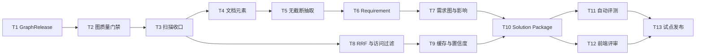

# 资料扫描到图谱构建与 QA 问答首期闭环 Implementation Plan

> **For agentic workers:** REQUIRED SUB-SKILL: Use superpowers:subagent-driven-development (recommended) or superpowers:executing-plans to implement this plan task-by-task. Steps use checkbox (`- [ ]`) syntax for tracking.

**Goal:** 在现有 LegacyGraph 架构上交付一个可运行的纵向闭环：上传需求资料后，系统基于已发布图谱完成需求结构化、影响分析和方案生成，输出带证据、文件级实施步骤、测试与回滚措施的解决方案包。

**Architecture:** 复用现有 Spring Boot、PostgreSQL/pgvector、Neo4j、Vue 3 技术栈。以不可变扫描版本和 `GraphRelease` 为一致性边界；资料解析先落结构化元素，再抽事实和向量化；Requirement、Solution 作为一等实体写入 PostgreSQL 和 Neo4j；QA 只查询已发布图谱，并经过版本/权限过滤、RRF 融合、证据验证和动态置信度计算。

**Tech Stack:** Java 21、Spring Boot 3、MyBatis-Plus、Flyway、PostgreSQL/pgvector、Neo4j Java Driver、Apache Tika、PDFBox、JUnit 5、Mockito、Vue 3、TypeScript、Pinia、Vitest、Playwright。

---

## 1. 首期范围

### 1.1 首期必须交付

1. 扫描后处理只走一个入口，图质量、边补全、社区检测和产物发布真实执行。
2. 使用 `GraphRelease` 控制 QA 可见版本，未通过门禁的扫描版本不可查询。
3. 文档不再因超过 100KB 被截断；Markdown/TXT/PDF 能保留章节或页码级来源位置。
4. Requirement、RequirementItem、AcceptanceCriterion、Constraint 成为持久化实体和图谱节点。
5. 需求能链接到业务、接口、方法、表、字段、页面和测试节点，并输出影响子图。
6. QA 混合召回使用 RRF，所有结果绑定扫描版本、GraphRelease 和访问范围。
7. 语义缓存保存完整证据并绑定 GraphRelease，不再跨版本返回旧答案。
8. 系统能够生成并验证 Solution Package：影响范围、决策、文件级步骤、测试、发布和回滚。
9. 建立最小黄金集和自动回归，GraphRelease 发布前执行 smoke evaluation。
10. 前端提供需求分析和方案评审页面。

### 1.2 明确不进入首期

- 商用 OCR/版面模型的具体供应商接入；首期只定义接口并对图片型 PDF 返回 `PARTIAL`。
- Jira、Confluence、邮件、IM 等任意外部连接器。
- 自动修改代码、自动提交或自动创建 PR。
- GNN 链路预测和无监督实体合并。
- 用 LLM 自动放行资金、权限、删除和破坏性迁移等高风险方案。

### 1.3 建议团队与周期

| 角色 | 投入 | 主要任务 |
|---|---:|---|
| 后端工程师 A | 1 人全职 | GraphRelease、扫描收口、资料元素 |
| 后端工程师 B | 1 人全职 | Requirement、检索、Solution、评测 |
| 前端工程师 | 0.5～1 人 | 需求分析和方案评审页面 |
| 测试/业务专家 | 0.5 人 | 黄金集、需求案例、验收和人工抽样 |
| 预计周期 | 8～10 周 | 13 个顺序任务，部分 UI 工作可在后端契约稳定后并行 |

---

## 2. 任务依赖与发布切片



| 里程碑 | 完成任务 | 可独立验收的软件能力 |
|---|---|---|
| M1 图谱可信发布 | T1～T3 | 扫描结束后产生可审计 GraphRelease，失败版本不进入 QA |
| M2 资料完整可引用 | T4～T5 | 大文档完整解析，引用能落到章节或 PDF 页码 |
| M3 需求影响分析 | T6～T7 | 需求条目可追踪到受影响代码、数据和测试 |
| M4 可信 QA | T8～T9 | RRF、访问过滤、版本化缓存、完整证据和动态置信度 |
| M5 可落地方案 | T10～T12 | 生成并评审文件级 Solution Package |
| M6 试点闭环 | T11～T13 | 黄金集门禁和真实需求试点 |

---

## 3. 文件责任边界

### 3.1 新增后端文件

```text
backend/src/main/java/io/github/legacygraph/
  entity/
    GraphRelease.java
    DocumentElement.java
    Requirement.java
    RequirementItem.java
    Solution.java
    SolutionStep.java
    QaEvalCase.java
    QaEvalRun.java
  repository/
    GraphReleaseRepository.java
    DocumentElementRepository.java
    RequirementRepository.java
    RequirementItemRepository.java
    SolutionRepository.java
    SolutionStepRepository.java
    QaEvalCaseRepository.java
    QaEvalRunRepository.java
  dto/document/
    ParsedDocument.java
    DocumentChunk.java
  dto/requirement/
    RequirementAnalysis.java
    RequirementCreateRequest.java
    RequirementAnalysisResponse.java
  dto/solution/
    SolutionPackage.java
    SolutionVerificationResult.java
  dto/qa/
    AccessContext.java
    CachedQaResult.java
    ConfidenceBreakdown.java
  service/scan/
    ScanFinalizationService.java
    GraphReleaseService.java
    GraphQualityGate.java
  service/document/
    DocumentPartitionService.java
    DefaultDocumentPartitionService.java
    StructureAwareChunkService.java
  service/requirement/
    RequirementExtractionService.java
    RequirementLinkingService.java
    RequirementGraphBuilder.java
    RequirementAnalysisOrchestrator.java
  service/solution/
    SolutionPlanner.java
    SolutionVerifier.java
    SolutionPackageService.java
  service/qa/
    ReciprocalRankFusionService.java
    AccessContextResolver.java
    EvidenceVerifier.java
    ConfidenceScorer.java
  service/evaluation/
    QaEvaluationService.java
    GraphReleaseSmokeEvaluator.java
  controller/
    RequirementController.java
    SolutionController.java
    QaEvaluationController.java
```

### 3.2 新增迁移

当前工作区最高迁移为 `V56`。实施时若主分支新增了迁移，先执行：

```bash
rtk ls backend/src/main/resources/db/migration
```

然后把下列 `V57～V65` 整体顺延，保证版本唯一；迁移内容和相对顺序不变。已经执行过的 Flyway 迁移不得修改，只能追加新版本。

```text
V57__graph_release.sql
V58__document_element_and_access_scope.sql
V59__requirement_model.sql
V60__seed_requirement_analysis_prompt.sql
V61__vector_access_and_release.sql
V62__semantic_cache_release_scope.sql
V63__solution_model.sql
V64__seed_solution_package_prompt.sql
V65__qa_evaluation.sql
```

### 3.3 主要修改文件

```text
backend/src/main/java/io/github/legacygraph/task/ProjectScanner.java
backend/src/main/java/io/github/legacygraph/task/AiScanJobWorker.java
backend/src/main/java/io/github/legacygraph/service/scan/ScanArtifactPublisher.java
backend/src/main/java/io/github/legacygraph/service/scan/GraphQualityAssessor.java
backend/src/main/java/io/github/legacygraph/task/step/DocExtractStep.java
backend/src/main/java/io/github/legacygraph/common/NodeType.java
backend/src/main/java/io/github/legacygraph/common/EdgeType.java
backend/src/main/java/io/github/legacygraph/entity/VectorDocument.java
backend/src/main/java/io/github/legacygraph/repository/VectorDocumentRepository.java
backend/src/main/java/io/github/legacygraph/service/qa/HybridRetrievalService.java
backend/src/main/java/io/github/legacygraph/service/qa/SemanticCache.java
backend/src/main/java/io/github/legacygraph/agent/EnhancedQaAgent.java
backend/src/main/java/io/github/legacygraph/controller/EnhancedQaController.java
frontend/src/router/index.ts
frontend/src/components/AppLayout.vue
```

---

## 4. 逐任务实施步骤

### Task 1: 建立 GraphRelease 持久化和状态机

**Files:**
- Create: `backend/src/main/resources/db/migration/V57__graph_release.sql`
- Create: `backend/src/main/java/io/github/legacygraph/entity/GraphRelease.java`
- Create: `backend/src/main/java/io/github/legacygraph/repository/GraphReleaseRepository.java`
- Create: `backend/src/main/java/io/github/legacygraph/service/scan/GraphReleaseService.java`
- Test: `backend/src/test/java/io/github/legacygraph/service/scan/GraphReleaseServiceTest.java`

- [ ] **Step 1: 写失败测试，约束状态转换和幂等行为**

```java
@ExtendWith(MockitoExtension.class)
class GraphReleaseServiceTest {
    @Mock GraphReleaseRepository repository;
    @InjectMocks GraphReleaseService service;

    @Test
    void startValidationCreatesOneReleasePerScanVersion() {
        when(repository.findByProjectAndVersion("p1", "v1")).thenReturn(null);

        GraphRelease release = service.startValidation("p1", "v1");

        assertEquals("VALIDATING", release.getStatus());
        verify(repository).insert(release);
    }

    @Test
    void publishOnlyAcceptsValidatingRelease() {
        GraphRelease release = new GraphRelease();
        release.setId("r1");
        release.setStatus("DRAFT");
        when(repository.selectById("r1")).thenReturn(release);

        assertThrows(IllegalStateException.class,
                () -> service.publish("r1", "{}", "{}"));
    }
}
```

- [ ] **Step 2: 运行测试并确认失败**

Run:

```bash
rtk mvn -f backend/pom.xml -Dtest=GraphReleaseServiceTest test
```

Expected: FAIL，提示 `GraphReleaseService`、`GraphRelease` 或 `GraphReleaseRepository` 不存在。

- [ ] **Step 3: 创建迁移**

```sql
CREATE TABLE IF NOT EXISTS lg_graph_release (
    id                VARCHAR(64) PRIMARY KEY,
    project_id        VARCHAR(64) NOT NULL,
    scan_version_id   VARCHAR(64) NOT NULL,
    status            VARCHAR(32) NOT NULL DEFAULT 'DRAFT',
    pre_quality       JSONB NOT NULL DEFAULT '{}'::JSONB,
    post_quality      JSONB NOT NULL DEFAULT '{}'::JSONB,
    failure_reason    TEXT,
    published_at      TIMESTAMP,
    created_at        TIMESTAMP NOT NULL DEFAULT CURRENT_TIMESTAMP,
    updated_at        TIMESTAMP NOT NULL DEFAULT CURRENT_TIMESTAMP,
    UNIQUE(project_id, scan_version_id)
);

CREATE INDEX IF NOT EXISTS idx_graph_release_project_status
    ON lg_graph_release(project_id, status, published_at DESC);
```

- [ ] **Step 4: 实现实体、Repository 和状态机**

`GraphReleaseRepository` 必须提供：

```java
@Mapper
public interface GraphReleaseRepository extends LegacyBaseMapper<GraphRelease> {
    @Select("SELECT * FROM lg_graph_release WHERE project_id=#{projectId} AND scan_version_id=#{versionId} LIMIT 1")
    GraphRelease findByProjectAndVersion(@Param("projectId") String projectId,
                                         @Param("versionId") String versionId);

    @Select("SELECT * FROM lg_graph_release WHERE project_id=#{projectId} AND status='PUBLISHED' ORDER BY published_at DESC LIMIT 1")
    GraphRelease findLatestPublished(@Param("projectId") String projectId);
}
```

`GraphReleaseService` 的公开契约固定为：

```java
public GraphRelease startValidation(String projectId, String versionId);
public GraphRelease publish(String releaseId, String preQualityJson, String postQualityJson);
public GraphRelease fail(String releaseId, String reason, String preQualityJson, String postQualityJson);
public GraphRelease requirePublished(String projectId, String requestedVersionId);
```

状态只允许：`DRAFT -> VALIDATING -> PUBLISHED | FAILED`。重复调用 `startValidation` 返回已有记录，不创建第二条。

- [ ] **Step 5: 运行测试并确认通过**

```bash
rtk mvn -f backend/pom.xml -Dtest=GraphReleaseServiceTest test
```

Expected: PASS，2 tests completed。

- [ ] **Step 6: 提交**

```bash
rtk git add backend/src/main/resources/db/migration/V57__graph_release.sql backend/src/main/java/io/github/legacygraph/entity/GraphRelease.java backend/src/main/java/io/github/legacygraph/repository/GraphReleaseRepository.java backend/src/main/java/io/github/legacygraph/service/scan/GraphReleaseService.java backend/src/test/java/io/github/legacygraph/service/scan/GraphReleaseServiceTest.java
rtk git commit -m "feat: add graph release lifecycle"
```

### Task 2: 让图质量评估返回可判定快照

**Files:**
- Create: `backend/src/main/java/io/github/legacygraph/dto/scan/GraphQualitySnapshot.java`
- Create: `backend/src/main/java/io/github/legacygraph/service/scan/GraphQualityGate.java`
- Modify: `backend/src/main/java/io/github/legacygraph/service/scan/GraphQualityAssessor.java:82-130`
- Test: `backend/src/test/java/io/github/legacygraph/service/scan/GraphQualityGateTest.java`
- Test: `backend/src/test/java/io/github/legacygraph/service/scan/GraphQualityAssessorTest.java`

- [ ] **Step 1: 写 GraphQualityGate 失败测试**

```java
class GraphQualityGateTest {
    private final GraphQualityGate gate = new GraphQualityGate();

    @Test
    void rejectsReleaseWhenGraphHasNoEdges() {
        GraphQualitySnapshot post = new GraphQualitySnapshot(
                100, 0, 80, 0.0, 0.0, 0, 0, 0);
        GraphQualityGate.Decision decision = gate.evaluate(post);
        assertFalse(decision.passed());
        assertTrue(decision.reasons().contains("EDGE_NODE_RATIO_BELOW_1"));
    }

    @Test
    void acceptsHealthyGraph() {
        GraphQualitySnapshot post = new GraphQualitySnapshot(
                100, 180, 4, 1.8, 3.6, 0, 96, 100);
        assertTrue(gate.evaluate(post).passed());
    }
}
```

- [ ] **Step 2: 运行并确认失败**

```bash
rtk mvn -f backend/pom.xml -Dtest=GraphQualityGateTest test
```

Expected: FAIL，新增类型不存在。

- [ ] **Step 3: 实现质量快照和门禁**

```java
public record GraphQualitySnapshot(
        long totalNodes,
        long totalEdges,
        long isolatedNodes,
        double edgeNodeRatio,
        double averageDegree,
        long constraintViolations,
        long validEvidenceEdges,
        long sampledEvidenceEdges) {

    public double isolatedRate() {
        return totalNodes == 0 ? 1.0 : (double) isolatedNodes / totalNodes;
    }

    public double evidenceRate() {
        return sampledEvidenceEdges == 0 ? 0.0
                : (double) validEvidenceEdges / sampledEvidenceEdges;
    }
}
```

```java
@Component
public class GraphQualityGate {
    public record Decision(boolean passed, List<String> reasons) {}

    public Decision evaluate(GraphQualitySnapshot snapshot) {
        List<String> reasons = new ArrayList<>();
        if (snapshot.totalNodes() == 0) reasons.add("EMPTY_GRAPH");
        if (snapshot.edgeNodeRatio() < 1.0) reasons.add("EDGE_NODE_RATIO_BELOW_1");
        if (snapshot.isolatedRate() > 0.10) reasons.add("ISOLATED_RATE_ABOVE_10_PERCENT");
        if (snapshot.constraintViolations() > 0) reasons.add("ONTOLOGY_CONSTRAINT_VIOLATION");
        if (snapshot.sampledEvidenceEdges() > 0 && snapshot.evidenceRate() < 0.95) {
            reasons.add("EVIDENCE_RATE_BELOW_95_PERCENT");
        }
        return new Decision(reasons.isEmpty(), List.copyOf(reasons));
    }
}
```

- [ ] **Step 4: 把 `GraphQualityAssessor` 拆为评估和报告两个动作**

新增公开方法：

```java
public GraphQualitySnapshot assess(String projectId, String versionId) {
    Map<String, Object> stats = graphDao.versionGraphStats(projectId, versionId);
    long nodes = toLong(stats.get("totalNodes"));
    long edges = toLong(stats.get("totalEdges"));
    long isolated = graphDao.countIsolatedNodes(projectId, versionId);
    double averageDegree = graphDao.averageNodeDegree(projectId, versionId);
    long violations = assessConstraints(projectId, versionId).stream()
            .mapToLong(ConstraintViolation::violationCount)
            .sum();
    AccuracyMetric evidence = assessAccuracy(projectId, versionId);
    return new GraphQualitySnapshot(
            nodes,
            edges,
            isolated,
            nodes == 0 ? 0.0 : (double) edges / nodes,
            averageDegree,
            violations,
            evidence.validCount(),
            evidence.sampleSize());
}
```

保留 `assessAndReport()` 兼容入口，但内部调用 `assess()`，避免现有调用方断裂。

- [ ] **Step 5: 运行相关测试**

```bash
rtk mvn -f backend/pom.xml -Dtest=GraphQualityGateTest,GraphQualityAssessorTest test
```

Expected: PASS。

- [ ] **Step 6: 提交**

```bash
rtk git add backend/src/main/java/io/github/legacygraph/dto/scan/GraphQualitySnapshot.java backend/src/main/java/io/github/legacygraph/service/scan/GraphQualityGate.java backend/src/main/java/io/github/legacygraph/service/scan/GraphQualityAssessor.java backend/src/test/java/io/github/legacygraph/service/scan/GraphQualityGateTest.java backend/src/test/java/io/github/legacygraph/service/scan/GraphQualityAssessorTest.java
rtk git commit -m "feat: add graph release quality gate"
```

### Task 3: 统一扫描后置和发布流水线

**Files:**
- Create: `backend/src/main/java/io/github/legacygraph/service/scan/ScanFinalizationService.java`
- Modify: `backend/src/main/java/io/github/legacygraph/service/scan/ScanArtifactPublisher.java:90-114`
- Modify: `backend/src/main/java/io/github/legacygraph/task/ProjectScanner.java:1034-1088`
- Modify: `backend/src/main/java/io/github/legacygraph/task/AiScanJobWorker.java:58-150`
- Modify: `backend/src/main/java/io/github/legacygraph/service/qa/SemanticCache.java:145-155`
- Test: `backend/src/test/java/io/github/legacygraph/service/scan/ScanFinalizationServiceTest.java`
- Test: `backend/src/test/java/io/github/legacygraph/task/ProjectScannerFullFlowTest.java`

- [ ] **Step 1: 写失败测试，固定后置步骤顺序**

```java
@ExtendWith(MockitoExtension.class)
class ScanFinalizationServiceTest {
    @Mock GraphReleaseService releases;
    @Mock GraphQualityAssessor assessor;
    @Mock GraphQualityGate gate;
    @Mock EdgeCompletionService edgeCompletion;
    @Mock CommunityDetectionService communities;
    @Mock ScanArtifactPublisher publisher;
    @Mock ProjectConventionIngestService conventions;
    @Mock ReusableComponentMarker reusable;
    @Mock SemanticCache cache;

    private GraphQualitySnapshot snapshot(long nodes, long edges, long isolated) {
        return new GraphQualitySnapshot(nodes, edges, isolated,
                nodes == 0 ? 0.0 : (double) edges / nodes,
                nodes == 0 ? 0.0 : (double) edges * 2 / nodes,
                0, 100, 100);
    }

    private ScanFinalizationService service() {
        return new ScanFinalizationService(releases, assessor, gate,
                edgeCompletion, communities, publisher, conventions,
                reusable, cache, new ObjectMapper());
    }

    @Test
    void publishesOnlyAfterPostQualityPasses() {
        GraphRelease release = new GraphRelease();
        release.setId("r1");
        when(releases.startValidation("p1", "v1")).thenReturn(release);
        GraphQualitySnapshot pre = snapshot(100, 120, 8);
        GraphQualitySnapshot post = snapshot(100, 160, 4);
        when(assessor.assess("p1", "v1")).thenReturn(pre, post);
        when(gate.evaluate(post)).thenReturn(new GraphQualityGate.Decision(true, List.of()));

        service().finalizeScan("p1", "v1");

        InOrder order = inOrder(conventions, reusable, assessor, edgeCompletion,
                communities, publisher, gate, releases, cache);
        order.verify(conventions).ingest("p1", "v1");
        order.verify(reusable).mark("p1", "v1");
        order.verify(assessor).assess("p1", "v1");
        order.verify(edgeCompletion).completeAll("p1", "v1");
        order.verify(assessor).assess("p1", "v1");
        order.verify(publisher).publishArtifactsOnly("p1", "v1");
        order.verify(releases).publish(eq("r1"), anyString(), anyString());
        order.verify(cache).invalidateByProject("p1");
    }
}
```

- [ ] **Step 2: 运行并确认失败**

```bash
rtk mvn -f backend/pom.xml -Dtest=ScanFinalizationServiceTest test
```

Expected: FAIL，`ScanFinalizationService` 或 `publishArtifactsOnly` 不存在。

- [ ] **Step 3: 实现 `ScanFinalizationService.finalizeScan`**

核心方法必须完整实现异常落库：

```java
@Transactional
public GraphRelease finalizeScan(String projectId, String versionId) {
    GraphRelease release = graphReleaseService.startValidation(projectId, versionId);
    GraphQualitySnapshot pre = null;
    GraphQualitySnapshot post = null;
    try {
        projectConventionIngestService.ingest(projectId, versionId);
        reusableComponentMarker.mark(projectId, versionId);
        pre = graphQualityAssessor.assess(projectId, versionId);
        edgeCompletionService.completeAll(projectId, versionId);
        Map<String, String> detected = communityDetectionService.detectCommunities(projectId);
        if (detected != null && !detected.isEmpty()) {
            communityDetectionService.writeCommunityToNodes(projectId, detected);
        }
        post = graphQualityAssessor.assess(projectId, versionId);
        GraphQualityGate.Decision decision = graphQualityGate.evaluate(post);
        if (!decision.passed()) {
            return graphReleaseService.fail(release.getId(),
                    String.join(",", decision.reasons()), json(pre), json(post));
        }
        scanArtifactPublisher.publishArtifactsOnly(projectId, versionId);
        GraphRelease published = graphReleaseService.publish(
                release.getId(), json(pre), json(post));
        semanticCache.invalidateByProject(projectId);
        return published;
    } catch (Exception e) {
        return graphReleaseService.fail(release.getId(), e.getMessage(), json(pre), json(post));
    }
}

private String json(Object value) {
    if (value == null) return "{}";
    try {
        return objectMapper.writeValueAsString(value);
    } catch (JsonProcessingException e) {
        throw new IllegalStateException("Cannot serialize graph quality", e);
    }
}
```

- [ ] **Step 4: 拆分 `ScanArtifactPublisher`**

把原 `publish()` 中只负责报告和向量化的部分移入：

```java
public void publishArtifactsOnly(String projectId, String versionId) {
    Path docsDir = resolveDocsDir(projectId);
    if (docsDir == null) {
        throw new IllegalStateException("Cannot resolve artifact directory for " + projectId);
    }
    try {
        Files.createDirectories(docsDir);
    } catch (IOException e) {
        throw new IllegalStateException("Cannot create artifact directory " + docsDir, e);
    }
    publishSystemOverview(projectId, versionId, docsDir);
    publishScanPerformanceReport(projectId, versionId, docsDir);
    publishCodeUnderstandingReport(projectId, versionId, docsDir);
    publishExternalToolEvidence(projectId, versionId, docsDir);
}
```

原 `publish()` 标记 `@Deprecated` 并只委托 `publishArtifactsOnly()`，删除其中质量、补全和社区检测调用，避免重复执行。

- [ ] **Step 5: 接入两条扫描完成路径**

`ProjectScanner` 的非 AI 完成分支和 `AiScanJobWorker` 的 AI 完成分支各调用一次：

```java
GraphRelease release = scanFinalizationService.finalizeScan(projectId, versionId);
if (!"PUBLISHED".equals(release.getStatus())) {
    throw new IllegalStateException("Graph release failed: " + release.getFailureReason());
}
```

删除 `generateSystemOverviewDocument()` 内的 `runPostScanConventionIngest()`，避免重复执行。依靠数据库唯一键和 `startValidation()` 幂等处理重复恢复任务。

- [ ] **Step 6: 运行扫描和发布测试**

```bash
rtk mvn -f backend/pom.xml -Dtest=ScanFinalizationServiceTest,ProjectScannerFullFlowTest,AiScanOrchestratorTest test
```

Expected: PASS；失败质量门禁时 GraphRelease 为 FAILED，QA 不可见。

- [ ] **Step 7: 提交**

```bash
rtk git add backend/src/main/java/io/github/legacygraph/service/scan/ScanFinalizationService.java backend/src/main/java/io/github/legacygraph/service/scan/ScanArtifactPublisher.java backend/src/main/java/io/github/legacygraph/task/ProjectScanner.java backend/src/main/java/io/github/legacygraph/task/AiScanJobWorker.java backend/src/main/java/io/github/legacygraph/service/qa/SemanticCache.java backend/src/test/java/io/github/legacygraph/service/scan/ScanFinalizationServiceTest.java backend/src/test/java/io/github/legacygraph/task/ProjectScannerFullFlowTest.java
rtk git commit -m "feat: finalize scans through graph release gate"
```

### Task 4: 建立 DocumentElement 和结构化解析

**Files:**
- Create: `backend/src/main/resources/db/migration/V58__document_element_and_access_scope.sql`
- Create: `backend/src/main/java/io/github/legacygraph/entity/DocumentElement.java`
- Create: `backend/src/main/java/io/github/legacygraph/repository/DocumentElementRepository.java`
- Create: `backend/src/main/java/io/github/legacygraph/dto/document/ParsedDocument.java`
- Create: `backend/src/main/java/io/github/legacygraph/service/document/DocumentPartitionService.java`
- Create: `backend/src/main/java/io/github/legacygraph/service/document/DefaultDocumentPartitionService.java`
- Test: `backend/src/test/java/io/github/legacygraph/service/document/DefaultDocumentPartitionServiceTest.java`

- [ ] **Step 1: 写 Markdown 结构解析失败测试**

```java
private final DocumentPartitionService service = new DefaultDocumentPartitionService();

@TempDir Path tempDir;

@Test
void partitionsMarkdownByHeadingAndPreservesHeadingPath() throws Exception {
    Path file = tempDir.resolve("requirement.md");
    Files.writeString(file, "# 结算需求\n概述\n## 验收条件\n1. 必须成功\n");

    ParsedDocument parsed = service.partition("snap-1", file, Set.of("PUBLIC"));

    assertEquals("COMPLETE", parsed.status());
    assertTrue(parsed.elements().stream().anyMatch(e ->
            "TITLE".equals(e.getElementType()) && "结算需求".equals(e.getTextContent())));
    assertTrue(parsed.elements().stream().anyMatch(e ->
            e.getHeadingPath().contains("验收条件") && e.getTextContent().contains("必须成功")));
}
```

- [ ] **Step 2: 运行并确认失败**

```bash
rtk mvn -f backend/pom.xml -Dtest=DefaultDocumentPartitionServiceTest test
```

Expected: FAIL，解析服务不存在。

- [ ] **Step 3: 创建迁移**

```sql
ALTER TABLE lg_source_asset_snapshot
    ADD COLUMN IF NOT EXISTS source_uri TEXT,
    ADD COLUMN IF NOT EXISTS mime_type VARCHAR(128),
    ADD COLUMN IF NOT EXISTS acl_principals JSONB NOT NULL DEFAULT '["PUBLIC"]'::JSONB,
    ADD COLUMN IF NOT EXISTS parse_status VARCHAR(32) NOT NULL DEFAULT 'PENDING';

CREATE TABLE IF NOT EXISTS lg_document_element (
    id               VARCHAR(64) PRIMARY KEY,
    snapshot_id      VARCHAR(64) NOT NULL,
    project_id       VARCHAR(64) NOT NULL,
    version_id       VARCHAR(64) NOT NULL,
    ordinal_no       INTEGER NOT NULL,
    element_type     VARCHAR(32) NOT NULL,
    text_content     TEXT NOT NULL,
    heading_path     JSONB NOT NULL DEFAULT '[]'::JSONB,
    page_no          INTEGER,
    bbox             JSONB,
    parse_confidence NUMERIC(5,4) NOT NULL DEFAULT 1.0,
    source_location  TEXT NOT NULL,
    acl_principals   JSONB NOT NULL DEFAULT '["PUBLIC"]'::JSONB,
    created_at       TIMESTAMP NOT NULL DEFAULT CURRENT_TIMESTAMP,
    UNIQUE(snapshot_id, ordinal_no)
);

CREATE INDEX IF NOT EXISTS idx_document_element_snapshot
    ON lg_document_element(snapshot_id, ordinal_no);
```

- [ ] **Step 4: 定义解析契约**

```java
public interface DocumentPartitionService {
    ParsedDocument partition(String snapshotId, Path path, Set<String> aclPrincipals)
            throws IOException;
}

public record ParsedDocument(
        String snapshotId,
        String status,
        List<DocumentElement> elements,
        List<String> warnings) {
}
```

`DocumentElementRepository` 提供幂等替换：

```java
@Mapper
public interface DocumentElementRepository extends LegacyBaseMapper<DocumentElement> {
    @Delete("DELETE FROM lg_document_element WHERE snapshot_id=#{snapshotId}")
    int deleteBySnapshotId(@Param("snapshotId") String snapshotId);

    default void replaceSnapshotElements(String snapshotId,
                                         List<DocumentElement> elements) {
        deleteBySnapshotId(snapshotId);
        for (DocumentElement element : elements) {
            insert(element);
        }
    }
}
```

`DefaultDocumentPartitionService` 首期规则：

- Markdown：标题行生成 `TITLE`，普通段落生成 `NARRATIVE_TEXT`，维护标题路径。
- TXT：按空行分段，`headingPath=[]`。
- PDF：PDFBox 逐页提取，每页一个或多个 `NARRATIVE_TEXT`，`pageNo` 从 1 开始。
- PDF 所有页面都没有文本：返回 `status=PARTIAL`，warning 为 `OCR_REQUIRED`。
- 其他格式：Tika 抽取，返回 `sourceLocation=文件路径#element-N`。

- [ ] **Step 5: 运行测试并补充 PDF 空文本用例**

```bash
rtk mvn -f backend/pom.xml -Dtest=DefaultDocumentPartitionServiceTest test
```

Expected: PASS；图片型 PDF 用例返回 PARTIAL 而非 COMPLETE。

- [ ] **Step 6: 提交**

```bash
rtk git add backend/src/main/resources/db/migration/V58__document_element_and_access_scope.sql backend/src/main/java/io/github/legacygraph/entity/DocumentElement.java backend/src/main/java/io/github/legacygraph/repository/DocumentElementRepository.java backend/src/main/java/io/github/legacygraph/dto/document/ParsedDocument.java backend/src/main/java/io/github/legacygraph/service/document/DocumentPartitionService.java backend/src/main/java/io/github/legacygraph/service/document/DefaultDocumentPartitionService.java backend/src/test/java/io/github/legacygraph/service/document/DefaultDocumentPartitionServiceTest.java
rtk git commit -m "feat: partition documents into source elements"
```

### Task 5: 取消大文档截断并按结构切块

**Files:**
- Create: `backend/src/main/java/io/github/legacygraph/dto/document/DocumentChunk.java`
- Create: `backend/src/main/java/io/github/legacygraph/service/document/StructureAwareChunkService.java`
- Modify: `backend/src/main/java/io/github/legacygraph/task/step/DocExtractStep.java:126-220,479-512`
- Modify: `backend/src/main/java/io/github/legacygraph/service/qa/VectorizationService.java`
- Test: `backend/src/test/java/io/github/legacygraph/service/document/StructureAwareChunkServiceTest.java`
- Test: `backend/src/test/java/io/github/legacygraph/task/step/DocExtractStepTest.java`

- [ ] **Step 1: 写超过 100KB 不丢尾部的失败测试**

```java
private final StructureAwareChunkService service = new StructureAwareChunkService();

@Test
void largeDocumentKeepsLastAcceptanceCriterion() {
    DocumentElement first = new DocumentElement();
    first.setSnapshotId("snap-1");
    first.setOrdinalNo(0);
    first.setElementType("NARRATIVE_TEXT");
    first.setTextContent("A".repeat(120_000));
    first.setHeadingPath("[\"需求正文\"]");
    first.setAclPrincipals("[\"PUBLIC\"]");
    DocumentElement last = new DocumentElement();
    last.setSnapshotId("snap-1");
    last.setOrdinalNo(1);
    last.setElementType("NARRATIVE_TEXT");
    last.setTextContent("最终验收条件：生成回滚记录");
    last.setHeadingPath("[\"验收条件\"]");
    last.setAclPrincipals("[\"PUBLIC\"]");

    List<DocumentChunk> chunks = service.chunk(List.of(first, last), 4_000, 400);

    assertTrue(chunks.stream().anyMatch(c -> c.content().contains("最终验收条件")));
    assertEquals(List.of(0, 1), chunks.stream()
            .flatMap(c -> c.elementOrdinals().stream())
            .distinct().sorted().toList());
}
```

- [ ] **Step 2: 运行并确认失败**

```bash
rtk mvn -f backend/pom.xml -Dtest=StructureAwareChunkServiceTest,DocExtractStepTest test
```

Expected: FAIL，`StructureAwareChunkService` 不存在或原截断断言失败。

- [ ] **Step 3: 实现结构化 Chunk 契约**

```java
public record DocumentChunk(
        String chunkKey,
        String headingPath,
        String content,
        List<Integer> elementOrdinals,
        Integer pageStart,
        Integer pageEnd,
        Set<String> aclPrincipals) {
}
```

`StructureAwareChunkService.chunk()` 必须：

1. 不跨一级标题合并。
2. `TABLE` 元素单独成块。
3. 超长单元素按 `maxChars` 切分，使用 `overlapChars` 重叠。
4. 每块前缀包含文档标题路径。
5. `chunkKey = snapshotId + ':' + firstOrdinal + ':' + partNo`，保证重试幂等。

- [ ] **Step 4: 改造 `DocExtractStep`**

删除 `readDocContent()` 中 100KB 截断逻辑。执行流程替换为：

```java
ParsedDocument parsed = documentPartitionService.partition(
        doc.getId(), Path.of(doc.getFilePath()), Set.of("PUBLIC"));
documentElementRepository.replaceSnapshotElements(doc.getId(), parsed.elements());
List<DocumentChunk> chunks = structureAwareChunkService.chunk(
        parsed.elements(), DOC_CHUNK_SIZE, DOC_CHUNK_OVERLAP);

for (DocumentChunk chunk : chunks) {
    String checkpointPath = doc.getFilePath() + "#" + chunk.chunkKey();
    if (donePaths.contains(checkpointPath)) continue;
    support.markExtracting(projectId, versionId, checkpointPath, "DOC_EXTRACT");
    support.vectorizeContent(projectId, versionId, "DOC", checkpointPath, chunk.content());
    BusinessFactExtraction extraction = support.cachedExtract(
            "doc-chunk", chunk.content(),
            () -> docUnderstandingAgent.extractBusinessFacts(
                    projectId, chunk.content(), checkpointPath),
            BusinessFactExtraction.class,
            this::isEmptyExtraction);
    persistBusinessFacts(projectId, versionId, doc, extraction);
    support.markExtractDone(projectId, versionId, checkpointPath,
            "DOC_EXTRACT", "chunk=" + chunk.chunkKey());
}
doc.setParseStatus("PARTIAL".equals(parsed.status()) ? "PARTIAL" : "PARSED");

private boolean isEmptyExtraction(BusinessFactExtraction value) {
    return value == null || AiScanStepSupport.allEmpty(
            value.getBusinessDomains(), value.getBusinessProcesses(),
            value.getBusinessObjects(), value.getBusinessRules(),
            value.getRoles(), value.getFeatures(), value.getStatusTransitions());
}
```

`VectorizationService` 把 `headingPath/pageStart/pageEnd/elementOrdinals/aclPrincipals` 写入 `VectorDocument.meta`。

- [ ] **Step 5: 运行文档测试**

```bash
rtk mvn -f backend/pom.xml -Dtest=StructureAwareChunkServiceTest,DocExtractStepTest,DocumentContentServiceTest test
```

Expected: PASS；尾部验收条件可被召回；图片型 PDF 状态为 PARTIAL。

- [ ] **Step 6: 提交**

```bash
rtk git add backend/src/main/java/io/github/legacygraph/dto/document/DocumentChunk.java backend/src/main/java/io/github/legacygraph/service/document/StructureAwareChunkService.java backend/src/main/java/io/github/legacygraph/task/step/DocExtractStep.java backend/src/main/java/io/github/legacygraph/service/qa/VectorizationService.java backend/src/test/java/io/github/legacygraph/service/document/StructureAwareChunkServiceTest.java backend/src/test/java/io/github/legacygraph/task/step/DocExtractStepTest.java
rtk git commit -m "feat: extract complete documents with structured chunks"
```

### Task 6: 建立 Requirement 持久化和结构化抽取

**Files:**
- Create: `backend/src/main/resources/db/migration/V59__requirement_model.sql`
- Create: `backend/src/main/resources/db/migration/V60__seed_requirement_analysis_prompt.sql`
- Create: `backend/src/main/java/io/github/legacygraph/entity/Requirement.java`
- Create: `backend/src/main/java/io/github/legacygraph/entity/RequirementItem.java`
- Create: `backend/src/main/java/io/github/legacygraph/repository/RequirementRepository.java`
- Create: `backend/src/main/java/io/github/legacygraph/repository/RequirementItemRepository.java`
- Create: `backend/src/main/java/io/github/legacygraph/dto/requirement/RequirementAnalysis.java`
- Create: `backend/src/main/java/io/github/legacygraph/service/requirement/RequirementExtractionService.java`
- Test: `backend/src/test/java/io/github/legacygraph/service/requirement/RequirementExtractionServiceTest.java`

- [ ] **Step 1: 写结构化抽取失败测试**

```java
@ExtendWith(MockitoExtension.class)
class RequirementExtractionServiceTest {
    @Mock LlmGateway gateway;
    @InjectMocks RequirementExtractionService service;

    @Test
    void extractsItemsCriteriaAndOpenQuestions() {
        RequirementAnalysis response = new RequirementAnalysis();
        response.setGoal("新增结算单导出");
        response.setItems(List.of(new RequirementAnalysis.Item(
                "R1", "导出结算单", List.of("导出成功"), List.of("权限校验"))));
        response.setOpenQuestions(List.of("导出格式是否固定为 XLSX"));
        when(gateway.callWithTemplate(eq("p1"), eq("requirement-analysis"),
                anyMap(), eq(RequirementAnalysis.class))).thenReturn(response);

        RequirementAnalysis actual = service.extract("p1", "原始需求");

        assertEquals("新增结算单导出", actual.getGoal());
        assertEquals(1, actual.getItems().size());
        assertFalse(actual.getOpenQuestions().isEmpty());
    }
}
```

- [ ] **Step 2: 运行并确认失败**

```bash
rtk mvn -f backend/pom.xml -Dtest=RequirementExtractionServiceTest test
```

Expected: FAIL，Requirement 类型不存在。

- [ ] **Step 3: 创建需求表**

```sql
CREATE TABLE IF NOT EXISTS lg_requirement (
    id                    VARCHAR(64) PRIMARY KEY,
    project_id            VARCHAR(64) NOT NULL,
    source_snapshot_id    VARCHAR(64),
    base_graph_release_id VARCHAR(64) NOT NULL,
    title                 VARCHAR(512) NOT NULL,
    raw_text              TEXT NOT NULL,
    goal                  TEXT,
    status                VARCHAR(32) NOT NULL DEFAULT 'ANALYZING',
    created_at            TIMESTAMP NOT NULL DEFAULT CURRENT_TIMESTAMP,
    updated_at            TIMESTAMP NOT NULL DEFAULT CURRENT_TIMESTAMP
);

CREATE TABLE IF NOT EXISTS lg_requirement_item (
    id                  VARCHAR(64) PRIMARY KEY,
    requirement_id      VARCHAR(64) NOT NULL,
    item_code           VARCHAR(64) NOT NULL,
    item_text           TEXT NOT NULL,
    acceptance_criteria JSONB NOT NULL DEFAULT '[]'::JSONB,
    constraints_json    JSONB NOT NULL DEFAULT '[]'::JSONB,
    confidence          NUMERIC(5,4) NOT NULL DEFAULT 0.0,
    status              VARCHAR(32) NOT NULL DEFAULT 'EXTRACTED',
    created_at          TIMESTAMP NOT NULL DEFAULT CURRENT_TIMESTAMP,
    UNIQUE(requirement_id, item_code)
);

CREATE INDEX IF NOT EXISTS idx_requirement_project
    ON lg_requirement(project_id, created_at DESC);
```

- [ ] **Step 4: 创建实际 Prompt**

`V60` 写入 `requirement-analysis` 模板，system/user 内容必须要求只返回：

```json
{
  "goal": "业务目标",
  "actors": ["角色"],
  "businessObjects": ["业务对象"],
  "items": [
    {
      "code": "R1",
      "text": "可独立实施的需求条目",
      "acceptanceCriteria": ["可验证条件"],
      "constraints": ["权限、兼容、安全、性能或数据约束"]
    }
  ],
  "assumptions": ["为继续分析采用的显式假设"],
  "openQuestions": ["没有证据时必须确认的问题"]
}
```

模板必须包含规则：“不得补造接口、表名、默认值或验收条件；缺失信息写入 openQuestions”。

- [ ] **Step 5: 实现抽取服务**

`RequirementAnalysis` 使用 Lombok DTO，字段和 Prompt 一一对应：

```java
@Data
public class RequirementAnalysis {
    private String goal;
    private List<String> actors = new ArrayList<>();
    private List<String> businessObjects = new ArrayList<>();
    private List<Item> items = new ArrayList<>();
    private List<String> assumptions = new ArrayList<>();
    private List<String> openQuestions = new ArrayList<>();

    @Data
    @NoArgsConstructor
    @AllArgsConstructor
    public static class Item {
        private String code;
        private String text;
        private List<String> acceptanceCriteria;
        private List<String> constraints;
    }
}
```

```java
@Service
@RequiredArgsConstructor
public class RequirementExtractionService {
    private final LlmGateway llmGateway;

    public RequirementAnalysis extract(String projectId, String rawText) {
        if (rawText == null || rawText.isBlank()) {
            throw new IllegalArgumentException("requirement text must not be blank");
        }
        return llmGateway.callWithTemplate(
                projectId,
                "requirement-analysis",
                Map.of("requirement", rawText),
                RequirementAnalysis.class);
    }
}
```

- [ ] **Step 6: 运行测试并提交**

```bash
rtk mvn -f backend/pom.xml -Dtest=RequirementExtractionServiceTest test
rtk git add backend/src/main/resources/db/migration/V59__requirement_model.sql backend/src/main/resources/db/migration/V60__seed_requirement_analysis_prompt.sql backend/src/main/java/io/github/legacygraph/entity/Requirement.java backend/src/main/java/io/github/legacygraph/entity/RequirementItem.java backend/src/main/java/io/github/legacygraph/repository/RequirementRepository.java backend/src/main/java/io/github/legacygraph/repository/RequirementItemRepository.java backend/src/main/java/io/github/legacygraph/dto/requirement/RequirementAnalysis.java backend/src/main/java/io/github/legacygraph/service/requirement/RequirementExtractionService.java backend/src/test/java/io/github/legacygraph/service/requirement/RequirementExtractionServiceTest.java
rtk git commit -m "feat: extract structured requirements"
```

Expected: tests PASS；commit succeeds。

### Task 7: 构建需求图谱、实体链接和影响子图

**Files:**
- Modify: `backend/src/main/java/io/github/legacygraph/common/NodeType.java`
- Modify: `backend/src/main/java/io/github/legacygraph/common/EdgeType.java`
- Create: `backend/src/main/java/io/github/legacygraph/service/requirement/RequirementGraphBuilder.java`
- Create: `backend/src/main/java/io/github/legacygraph/service/requirement/RequirementLinkingService.java`
- Create: `backend/src/main/java/io/github/legacygraph/service/requirement/RequirementAnalysisOrchestrator.java`
- Create: `backend/src/main/java/io/github/legacygraph/controller/RequirementController.java`
- Create: `backend/src/main/java/io/github/legacygraph/dto/requirement/RequirementCreateRequest.java`
- Create: `backend/src/main/java/io/github/legacygraph/dto/requirement/RequirementAnalysisResponse.java`
- Test: `backend/src/test/java/io/github/legacygraph/service/requirement/RequirementGraphBuilderTest.java`
- Test: `backend/src/test/java/io/github/legacygraph/controller/RequirementControllerTest.java`

- [ ] **Step 1: 写图谱构建失败测试**

```java
@Test
void buildsRequirementToAcceptanceAndAffectedNodeEdges() {
    Requirement requirement = new Requirement();
    requirement.setId("req-1");
    requirement.setProjectId("p1");
    requirement.setBaseGraphReleaseId("v1");
    RequirementItem item = new RequirementItem();
    item.setId("item-1");
    item.setRequirementId("req-1");
    item.setItemCode("R1");
    item.setItemText("新增字段");
    LinkedTarget target = new LinkedTarget("column:acct.status", "Column", 0.98,
            "CONFIRMED", List.of("evidence-1"));

    builder.build(requirement, List.of(item), List.of(target));

    verify(graphWriter).upsertNode(argThat(n ->
            "Requirement".equals(n.getNodeType()) && n.getNodeKey().contains("req-1")));
    verify(graphWriter).upsertEdge(argThat(e ->
            "AFFECTS".equals(e.getEdgeType()) &&
                    "column:acct.status".equals(e.getToNodeKey())));
}
```

- [ ] **Step 2: 运行并确认失败**

```bash
rtk mvn -f backend/pom.xml -Dtest=RequirementGraphBuilderTest test
```

Expected: FAIL，新节点类型和服务不存在。

- [ ] **Step 3: 扩展本体**

`NodeType` 增加：

```java
Requirement("需求"),
RequirementItem("需求条目"),
AcceptanceCriterion("验收条件"),
Constraint("约束"),
Assumption("假设"),
OpenQuestion("待确认问题"),
Solution("解决方案"),
ImplementationStep("实施步骤"),
VerificationStep("验证步骤")
```

`EdgeType` 增加：

```java
HAS_ACCEPTANCE_CRITERION("具有验收条件"),
CONSTRAINED_BY("受约束"),
ADDRESSES("解决需求"),
MODIFIES("修改"),
BLOCKS("阻塞")
```

需求影响复用现有 `AFFECTS`，不要新增同义 `IMPACTS`。

- [ ] **Step 4: 实现确定性优先的链接策略**

`RequirementLinkingService.link()` 按顺序执行：

1. 从需求文本提取显式 `schema.table.column`、URL、Java FQN 和文件路径。
2. 使用 `Neo4jGraphDao` 精确匹配 `nodeKey/displayName`。
3. 对未命中术语查询 terminology mapping。
4. 最后使用向量相似度产生候选；相似度低于 0.80 不创建 AFFECTS 边。
5. 精确匹配状态 `CONFIRMED`；语义候选状态 `PENDING_CONFIRM`。

公开契约：

```java
public List<LinkedTarget> link(String projectId,
                               String versionId,
                               RequirementAnalysis analysis);
```

`LinkedTarget` 定义为：

```java
public record LinkedTarget(String nodeKey,
                           String nodeType,
                           double confidence,
                           String status,
                           List<String> evidenceIds) {
}
```

- [ ] **Step 5: 实现编排和接口**

`POST /lg/projects/{projectId}/requirements/analyze` 请求：

```json
{
  "title": "新增结算导出",
  "text": "需求正文",
  "baseGraphReleaseId": "release-id"
}
```

编排顺序固定为：`requirePublished -> extract -> persist -> link -> build graph -> impactSubgraph -> response`。响应必须包含 Requirement、items、openQuestions、linkedTargets、impactPaths 和 evidence IDs。

- [ ] **Step 6: 运行服务和 Controller 测试**

```bash
rtk mvn -f backend/pom.xml -Dtest=RequirementGraphBuilderTest,RequirementControllerTest,ImpactSubgraphServiceTest test
```

Expected: PASS；未发布版本返回 409；低置信度候选不会成为 CONFIRMED 边。

- [ ] **Step 7: 提交**

```bash
rtk git add backend/src/main/java/io/github/legacygraph/common/NodeType.java backend/src/main/java/io/github/legacygraph/common/EdgeType.java backend/src/main/java/io/github/legacygraph/service/requirement backend/src/main/java/io/github/legacygraph/controller/RequirementController.java backend/src/main/java/io/github/legacygraph/dto/requirement backend/src/test/java/io/github/legacygraph/service/requirement backend/src/test/java/io/github/legacygraph/controller/RequirementControllerTest.java
rtk git commit -m "feat: link requirements to impact graph"
```

### Task 8: 增加 GraphRelease/ACL 过滤和 RRF 融合

**Files:**
- Create: `backend/src/main/resources/db/migration/V61__vector_access_and_release.sql`
- Create: `backend/src/main/java/io/github/legacygraph/dto/qa/AccessContext.java`
- Create: `backend/src/main/java/io/github/legacygraph/service/qa/AccessContextResolver.java`
- Create: `backend/src/main/java/io/github/legacygraph/service/qa/ReciprocalRankFusionService.java`
- Modify: `backend/src/main/java/io/github/legacygraph/entity/VectorDocument.java`
- Modify: `backend/src/main/java/io/github/legacygraph/repository/VectorDocumentRepository.java:55-86`
- Modify: `backend/src/main/java/io/github/legacygraph/service/qa/VectorizationService.java`
- Modify: `backend/src/main/java/io/github/legacygraph/service/qa/HybridRetrievalService.java:41-102`
- Modify: `backend/src/main/java/io/github/legacygraph/controller/EnhancedQaController.java:42-69`
- Modify: `backend/src/main/java/io/github/legacygraph/service/scan/ScanFinalizationService.java`
- Test: `backend/src/test/java/io/github/legacygraph/service/qa/ReciprocalRankFusionServiceTest.java`
- Test: `backend/src/test/java/io/github/legacygraph/service/VectorRetrievalServiceTest.java`

- [ ] **Step 1: 写 RRF 失败测试**

```java
@Test
void documentFoundByBothRetrieversRanksFirst() {
    VectorDocument both = new VectorDocument();
    both.setId(1L);
    VectorDocument vectorOnly = new VectorDocument();
    vectorOnly.setId(2L);
    VectorDocument keywordOnly = new VectorDocument();
    keywordOnly.setId(3L);

    List<VectorDocument> result = service.fuse(
            List.of(
                    new ReciprocalRankFusionService.Ranking(
                            "vector", List.of(vectorOnly, both)),
                    new ReciprocalRankFusionService.Ranking(
                            "keyword", List.of(keywordOnly, both))),
            10);

    assertEquals(1L, result.get(0).getId());
    assertEquals(Set.of("vector", "keyword"), result.get(0).getRetrievalSources());
}
```

- [ ] **Step 2: 运行并确认失败**

```bash
rtk mvn -f backend/pom.xml -Dtest=ReciprocalRankFusionServiceTest test
```

Expected: FAIL，RRF 服务不存在。

- [ ] **Step 3: 创建向量访问字段**

```sql
ALTER TABLE lg_vector_document
    ADD COLUMN IF NOT EXISTS graph_release_id VARCHAR(64),
    ADD COLUMN IF NOT EXISTS acl_principals JSONB NOT NULL DEFAULT '["PUBLIC"]'::JSONB,
    ADD COLUMN IF NOT EXISTS document_status VARCHAR(32) NOT NULL DEFAULT 'ACTIVE';

CREATE INDEX IF NOT EXISTS idx_vector_doc_release_status
    ON lg_vector_document(project_id, graph_release_id, document_status);

CREATE INDEX IF NOT EXISTS idx_vector_doc_acl
    ON lg_vector_document USING GIN(acl_principals);
```

- [ ] **Step 4: 实现 RRF**

```java
@Service
public class ReciprocalRankFusionService {
    private static final double K = 60.0;

    public record Ranking(String source, List<VectorDocument> documents) {}

    public List<VectorDocument> fuse(List<Ranking> rankings, int topK) {
        Map<Long, Double> scores = new HashMap<>();
        Map<Long, VectorDocument> documents = new HashMap<>();
        Map<Long, Set<String>> sources = new HashMap<>();
        for (Ranking ranking : rankings) {
            for (int i = 0; i < ranking.documents().size(); i++) {
                VectorDocument document = ranking.documents().get(i);
                documents.put(document.getId(), document);
                scores.merge(document.getId(), 1.0 / (K + i + 1), Double::sum);
                sources.computeIfAbsent(document.getId(), ignored -> new LinkedHashSet<>())
                        .add(ranking.source());
            }
        }
        return scores.entrySet().stream()
                .sorted(Map.Entry.<Long, Double>comparingByValue().reversed())
                .limit(topK)
                .map(entry -> {
                    VectorDocument document = documents.get(entry.getKey());
                    document.setRetrievalScore(entry.getValue());
                    document.setRetrievalSources(Set.copyOf(sources.get(entry.getKey())));
                    return document;
                }).toList();
    }
}
```

`VectorDocument` 新增两个 `@TableField(exist=false)` 字段：`retrievalScore` 和 `retrievalSources`。

- [ ] **Step 5: 在 SQL 层执行版本和 ACL 过滤**

```java
public record AccessContext(String userId,
                            Set<String> roles,
                            Set<String> principals,
                            String aclHash) {
}
```

向量查询增加：

```sql
AND graph_release_id = #{graphReleaseId}
AND document_status = 'ACTIVE'
AND acl_principals ?| string_to_array(#{principalsCsv}, ',')
```

扫描期间 `graph_release_id` 为空；门禁通过且产物向量化完成后，由 `ScanFinalizationService` 在 publish 前绑定：

```java
@Update("UPDATE lg_vector_document SET graph_release_id=#{releaseId} "
        + "WHERE project_id=#{projectId} AND version_id=#{versionId}")
int bindGraphRelease(@Param("projectId") String projectId,
                     @Param("versionId") String versionId,
                     @Param("releaseId") String releaseId);
```

```java
scanArtifactPublisher.publishArtifactsOnly(projectId, versionId);
vectorDocumentRepository.bindGraphRelease(projectId, versionId, release.getId());
GraphRelease published = graphReleaseService.publish(
        release.getId(), json(pre), json(post));
```

`VectorizationService` 从 `DocumentChunk.aclPrincipals` 写入 `VectorDocument.aclPrincipals`；没有来源权限时只允许显式使用 `PUBLIC`，不能写空数组。

`AccessContext` 保存 `userId`、`roles`、`principals` 和稳定 `aclHash`。`EnhancedQaController` 在切换到异步线程前解析当前认证信息，并显式传给 `EnhancedQaAgent`，避免 SecurityContext 在线程切换后丢失。

- [ ] **Step 6: 替换 HybridRetrievalService 的顺序去重**

把 `Map<String, VectorDocument> merged` 替换为：

```java
List<ReciprocalRankFusionService.Ranking> rankings = new ArrayList<>();
rankings.add(new Ranking("vector-main", mainFuture.getNow(List.of())));
for (int i = 0; i < variantFutures.size(); i++) {
    rankings.add(new Ranking("vector-variant-" + i,
            variantFutures.get(i).getNow(List.of())));
}
rankings.add(new Ranking("keyword", keywordFuture.getNow(List.of())));
return fusionService.fuse(rankings, topK);
```

- [ ] **Step 7: 运行检索测试并提交**

```bash
rtk mvn -f backend/pom.xml -Dtest=ReciprocalRankFusionServiceTest,VectorRetrievalServiceTest,EnhancedQaAgentTest test
rtk git add backend/src/main/resources/db/migration/V61__vector_access_and_release.sql backend/src/main/java/io/github/legacygraph/dto/qa/AccessContext.java backend/src/main/java/io/github/legacygraph/service/qa/AccessContextResolver.java backend/src/main/java/io/github/legacygraph/service/qa/ReciprocalRankFusionService.java backend/src/main/java/io/github/legacygraph/entity/VectorDocument.java backend/src/main/java/io/github/legacygraph/repository/VectorDocumentRepository.java backend/src/main/java/io/github/legacygraph/service/qa/VectorizationService.java backend/src/main/java/io/github/legacygraph/service/qa/HybridRetrievalService.java backend/src/main/java/io/github/legacygraph/controller/EnhancedQaController.java backend/src/main/java/io/github/legacygraph/service/scan/ScanFinalizationService.java backend/src/test/java/io/github/legacygraph/service/qa/ReciprocalRankFusionServiceTest.java backend/src/test/java/io/github/legacygraph/service/VectorRetrievalServiceTest.java
rtk git commit -m "feat: secure and fuse hybrid retrieval"
```

Expected: tests PASS；没有匹配 principal 的向量文档不会进入 Java 层。

### Task 9: 版本化语义缓存、证据验证和动态置信度

**Files:**
- Create: `backend/src/main/resources/db/migration/V62__semantic_cache_release_scope.sql`
- Create: `backend/src/main/java/io/github/legacygraph/dto/qa/CachedQaResult.java`
- Create: `backend/src/main/java/io/github/legacygraph/dto/qa/ConfidenceBreakdown.java`
- Create: `backend/src/main/java/io/github/legacygraph/service/qa/EvidenceVerifier.java`
- Create: `backend/src/main/java/io/github/legacygraph/service/qa/ConfidenceScorer.java`
- Modify: `backend/src/main/java/io/github/legacygraph/entity/SemanticCacheEntry.java`
- Modify: `backend/src/main/java/io/github/legacygraph/repository/SemanticCacheRepository.java`
- Modify: `backend/src/main/java/io/github/legacygraph/service/qa/SemanticCache.java:43-139`
- Modify: `backend/src/main/java/io/github/legacygraph/agent/EnhancedQaAgent.java:99-127,280-400`
- Test: `backend/src/test/java/io/github/legacygraph/service/qa/SemanticCacheTest.java`
- Test: `backend/src/test/java/io/github/legacygraph/service/qa/ConfidenceScorerTest.java`

- [ ] **Step 1: 写缓存证据保留失败测试**

```java
@Test
void cacheHitReturnsEvidenceForSameReleaseAndAcl() {
    CachedQaResult expected = new CachedQaResult(
            "答案", "[{\"evidenceId\":\"e1\"}]", 0.88, "r1");
    SemanticCacheEntry stored = new SemanticCacheEntry();
    stored.setProjectId("p1");
    stored.setGraphReleaseId("r1");
    stored.setAclHash("acl1");
    stored.setAnswer(expected.answer());
    stored.setEvidence(expected.evidenceJson());
    stored.setConfidence(BigDecimal.valueOf(expected.confidence()));
    stored.setLastAccessAt(LocalDateTime.now());
    when(repository.findSimilar(eq("p1"), eq("r1"), eq("acl1"),
            anyString(), anyDouble(), anyInt())).thenReturn(List.of(stored));

    CachedQaResult actual = cache.get("p1", "r1", "acl1", "问题").orElseThrow();

    assertEquals(expected.evidenceJson(), actual.evidenceJson());
    assertEquals("r1", actual.graphReleaseId());
}
```

- [ ] **Step 2: 运行并确认失败**

```bash
rtk mvn -f backend/pom.xml -Dtest=SemanticCacheTest,ConfidenceScorerTest test
```

Expected: FAIL，现有 `get` 只返回 String。

- [ ] **Step 3: 创建缓存迁移**

```sql
ALTER TABLE lg_semantic_cache
    ADD COLUMN IF NOT EXISTS graph_release_id VARCHAR(64),
    ADD COLUMN IF NOT EXISTS acl_hash VARCHAR(128),
    ADD COLUMN IF NOT EXISTS intent VARCHAR(64),
    ADD COLUMN IF NOT EXISTS confidence NUMERIC(5,4),
    ADD COLUMN IF NOT EXISTS retrieval_config_version VARCHAR(64) DEFAULT 'rrf-v1',
    ADD COLUMN IF NOT EXISTS prompt_version VARCHAR(64) DEFAULT 'qa-v1',
    ADD COLUMN IF NOT EXISTS model_version VARCHAR(128);

CREATE INDEX IF NOT EXISTS idx_semantic_cache_scope
    ON lg_semantic_cache(project_id, graph_release_id, acl_hash, last_access_at);
```

- [ ] **Step 4: 修改缓存契约**

```java
public record CachedQaResult(String answer,
                             String evidenceJson,
                             double confidence,
                             String graphReleaseId) {
}

public Optional<CachedQaResult> get(String projectId,
                                    String graphReleaseId,
                                    String aclHash,
                                    String question);

public void put(String projectId,
                String graphReleaseId,
                String aclHash,
                String question,
                CachedQaResult result);
```

命中后必须反序列化原 evidence JSON；证据不存在、版本不匹配或 ACL hash 不匹配时视为 miss。

- [ ] **Step 5: 实现证据验证和置信度**

```java
public record ConfidenceBreakdown(
        double evidenceCoverage,
        double evidenceReliability,
        double retrievalAgreement,
        double pathConfidence,
        double freshness,
        double finalScore) {
}
```

`ConfidenceScorer` 使用固定公式：

```java
double finalScore = 0.30 * coverage
        + 0.25 * reliability
        + 0.20 * agreement
        + 0.15 * pathConfidence
        + 0.10 * freshness;
```

`EvidenceVerifier` 校验 evidenceId 存在、属于当前项目/GraphRelease、用户可访问、source location 非空。覆盖率低于 0.6 时返回 `LOW`，高风险意图直接拒绝最终方案。

- [ ] **Step 6: 改造 EnhancedQaAgent**

1. 缓存命中发送原证据，不再发送空数组。
2. 删除固定 `confidence=1.0/0.8`。
3. 生成完成后先验证证据并计算置信度，再保存消息和缓存。
4. 修复 retrieval timing：在 `retrievalFuture.join()` 之前记录 `stageStart`。

- [ ] **Step 7: 运行测试并提交**

```bash
rtk mvn -f backend/pom.xml -Dtest=SemanticCacheTest,ConfidenceScorerTest,EnhancedQaAgentTest test
rtk git add backend/src/main/resources/db/migration/V62__semantic_cache_release_scope.sql backend/src/main/java/io/github/legacygraph/dto/qa/CachedQaResult.java backend/src/main/java/io/github/legacygraph/dto/qa/ConfidenceBreakdown.java backend/src/main/java/io/github/legacygraph/service/qa/EvidenceVerifier.java backend/src/main/java/io/github/legacygraph/service/qa/ConfidenceScorer.java backend/src/main/java/io/github/legacygraph/entity/SemanticCacheEntry.java backend/src/main/java/io/github/legacygraph/repository/SemanticCacheRepository.java backend/src/main/java/io/github/legacygraph/service/qa/SemanticCache.java backend/src/main/java/io/github/legacygraph/agent/EnhancedQaAgent.java backend/src/test/java/io/github/legacygraph/service/qa/SemanticCacheTest.java backend/src/test/java/io/github/legacygraph/service/qa/ConfidenceScorerTest.java
rtk git commit -m "feat: version qa cache and verify evidence"
```

Expected: PASS；缓存命中保留 evidence；新 GraphRelease 不命中旧缓存。

### Task 10: 生成并验证 Solution Package

**Files:**
- Create: `backend/src/main/resources/db/migration/V63__solution_model.sql`
- Create: `backend/src/main/resources/db/migration/V64__seed_solution_package_prompt.sql`
- Create: `backend/src/main/java/io/github/legacygraph/entity/Solution.java`
- Create: `backend/src/main/java/io/github/legacygraph/entity/SolutionStep.java`
- Create: `backend/src/main/java/io/github/legacygraph/repository/SolutionRepository.java`
- Create: `backend/src/main/java/io/github/legacygraph/repository/SolutionStepRepository.java`
- Create: `backend/src/main/java/io/github/legacygraph/dto/solution/SolutionPackage.java`
- Create: `backend/src/main/java/io/github/legacygraph/dto/solution/SolutionVerificationResult.java`
- Create: `backend/src/main/java/io/github/legacygraph/service/solution/SolutionPlanner.java`
- Create: `backend/src/main/java/io/github/legacygraph/service/solution/SolutionVerifier.java`
- Create: `backend/src/main/java/io/github/legacygraph/service/solution/SolutionPackageService.java`
- Create: `backend/src/main/java/io/github/legacygraph/controller/SolutionController.java`
- Modify: `backend/src/main/java/io/github/legacygraph/dao/Neo4jGraphDao.java`
- Test: `backend/src/test/java/io/github/legacygraph/service/solution/SolutionVerifierTest.java`
- Test: `backend/src/test/java/io/github/legacygraph/controller/SolutionControllerTest.java`

- [ ] **Step 1: 写方案验证失败测试**

```java
@Test
void rejectsSolutionWhenReferencedSymbolDoesNotExist() {
    SolutionPackage.ImplementationStep step = new SolutionPackage.ImplementationStep(
            1, "MODIFY", "backend",
            "backend/src/main/java/x/Missing.java", "MissingService.run",
            "修改缺失服务", List.of("e1"), List.of("单元测试"));
    SolutionPackage solution = new SolutionPackage(
            "req-1", "r1", "实现需求", List.of(), List.of(),
            List.of(), List.of(), List.of(), List.of(step),
            List.of(), List.of(), List.of(), 0.8);
    when(graphDao.findNodesByKeys(eq("p1"), eq("v1"), anyList()))
            .thenReturn(List.of());

    SolutionVerificationResult result = verifier.verify(
            "p1", "v1", solution,
            new AccessContext("anonymous", Set.of(), Set.of("PUBLIC"), "public"));

    assertFalse(result.passed());
    assertTrue(result.errors().stream().anyMatch(e -> e.code().equals("SYMBOL_NOT_FOUND")));
}
```

- [ ] **Step 2: 运行并确认失败**

```bash
rtk mvn -f backend/pom.xml -Dtest=SolutionVerifierTest test
```

Expected: FAIL，Solution 类型不存在。

- [ ] **Step 3: 创建方案表和评测表前半部分**

`V63` 中创建：

```sql
CREATE TABLE IF NOT EXISTS lg_solution (
    id                VARCHAR(64) PRIMARY KEY,
    project_id        VARCHAR(64) NOT NULL,
    requirement_id    VARCHAR(64) NOT NULL,
    graph_release_id  VARCHAR(64) NOT NULL,
    summary           TEXT NOT NULL,
    alternatives_json JSONB NOT NULL DEFAULT '[]'::JSONB,
    decisions_json    JSONB NOT NULL DEFAULT '[]'::JSONB,
    risks_json        JSONB NOT NULL DEFAULT '[]'::JSONB,
    status            VARCHAR(32) NOT NULL DEFAULT 'DRAFT',
    confidence        NUMERIC(5,4) NOT NULL DEFAULT 0.0,
    created_at        TIMESTAMP NOT NULL DEFAULT CURRENT_TIMESTAMP,
    updated_at        TIMESTAMP NOT NULL DEFAULT CURRENT_TIMESTAMP
);

CREATE TABLE IF NOT EXISTS lg_solution_step (
    id                VARCHAR(64) PRIMARY KEY,
    solution_id       VARCHAR(64) NOT NULL,
    step_no           INTEGER NOT NULL,
    action_type       VARCHAR(32) NOT NULL,
    repository_name   VARCHAR(256),
    file_path         TEXT,
    symbol_key        TEXT,
    change_description TEXT NOT NULL,
    evidence_ids      JSONB NOT NULL DEFAULT '[]'::JSONB,
    tests_json        JSONB NOT NULL DEFAULT '[]'::JSONB,
    rollback_json     JSONB NOT NULL DEFAULT '[]'::JSONB,
    status            VARCHAR(32) NOT NULL DEFAULT 'PROPOSED',
    UNIQUE(solution_id, step_no)
);
```

- [ ] **Step 4: 固定 SolutionPackage 结构**

```java
public record SolutionPackage(
        String requirementId,
        String graphReleaseId,
        String summary,
        List<Assumption> assumptions,
        List<OpenQuestion> openQuestions,
        List<Impact> impacts,
        List<Alternative> alternatives,
        List<Decision> decisions,
        List<ImplementationStep> steps,
        List<VerificationStep> verification,
        List<String> deployment,
        List<String> rollback,
        double confidence) {
    public record Assumption(String text, List<String> evidenceIds) {}
    public record OpenQuestion(String text, String severity) {}
    public record Impact(String nodeKey, String nodeType, String risk,
                         String reason, List<String> evidenceIds) {}
    public record Alternative(String name, String summary,
                              List<String> tradeoffs) {}
    public record Decision(String decision, String rationale,
                           List<String> evidenceIds) {}
    public record ImplementationStep(int stepNo, String action,
                                     String repository, String file,
                                     String symbol, String change,
                                     List<String> evidenceIds,
                                     List<String> tests) {}
    public record VerificationStep(String type, String command,
                                   String expectedResult) {}
}
```

所有 `Impact`、`Decision` 和 `ImplementationStep` 必须带 `evidenceIds`。

```java
public record SolutionVerificationResult(boolean passed,
                                         String status,
                                         List<VerificationError> errors) {
    public record VerificationError(String code, String message,
                                    String stepId) {}
}
```

- [ ] **Step 5: 实现 Planner 和 Verifier**

`V64` 新增 `solution-package-v1` 模板，不修改已经执行过的 `V48`。`SolutionPlanner` 使用新模板，输入必须包含：需求分析 JSON、影响路径 JSON、项目约定、可复用组件和证据卡；输出类型固定为 `SolutionPackage.class`。

`Neo4jGraphDao` 新增批量存在性查询：

```java
public List<Map<String, Object>> findNodesByKeys(String projectId,
                                                  String versionId,
                                                  List<String> nodeKeys) {
    String cypher = "MATCH (n) WHERE n.projectId=$projectId "
            + "AND n.versionId=$versionId AND n.nodeKey IN $nodeKeys "
            + "RETURN n.nodeKey AS nodeKey, labels(n) AS labels";
    return executeReadQuery(cypher, Map.of(
            "projectId", projectId,
            "versionId", normalizeId(versionId),
            "nodeKeys", nodeKeys));
}
```

`SolutionVerifier` 顺序执行：

1. GraphRelease 仍为 PUBLISHED。
2. 每个 file path 在 SourceSnapshot 或仓库中存在。
3. 每个 symbolKey 在当前版本图谱中存在。
4. 每个高风险 impact 至少被一个 step 覆盖。
5. 每个 step 至少有一个 test 或 verification。
6. 每个关键结论至少一个有效 evidence。
7. 存在未解决 BLOCKING OpenQuestion 时状态为 `NEEDS_INPUT`。

验证通过才把 Solution 状态设为 `READY_FOR_REVIEW`。

- [ ] **Step 6: 增加 API**

```text
POST /lg/projects/{projectId}/requirements/{requirementId}/solutions
GET  /lg/projects/{projectId}/requirements/{requirementId}/solutions/latest
POST /lg/projects/{projectId}/solutions/{solutionId}/verify
POST /lg/projects/{projectId}/solutions/{solutionId}/review
```

review 请求只允许 `APPROVE/REQUEST_CHANGES`，并保存修改意见；不直接改写图谱事实。

- [ ] **Step 7: 运行测试并提交**

```bash
rtk mvn -f backend/pom.xml -Dtest=SolutionVerifierTest,SolutionControllerTest test
rtk git add backend/src/main/resources/db/migration/V63__solution_model.sql backend/src/main/resources/db/migration/V64__seed_solution_package_prompt.sql backend/src/main/java/io/github/legacygraph/entity/Solution.java backend/src/main/java/io/github/legacygraph/entity/SolutionStep.java backend/src/main/java/io/github/legacygraph/repository/SolutionRepository.java backend/src/main/java/io/github/legacygraph/repository/SolutionStepRepository.java backend/src/main/java/io/github/legacygraph/dto/solution backend/src/main/java/io/github/legacygraph/service/solution backend/src/main/java/io/github/legacygraph/controller/SolutionController.java backend/src/main/java/io/github/legacygraph/dao/Neo4jGraphDao.java backend/src/test/java/io/github/legacygraph/service/solution backend/src/test/java/io/github/legacygraph/controller/SolutionControllerTest.java
rtk git commit -m "feat: generate verified solution packages"
```

Expected: PASS；不存在的文件/符号会阻止 READY_FOR_REVIEW。

### Task 11: 把现有测试目录 QA 评测原型升级为正式服务

**Files:**
- Create: `backend/src/main/java/io/github/legacygraph/entity/QaEvalCase.java`
- Create: `backend/src/main/java/io/github/legacygraph/entity/QaEvalRun.java`
- Create: `backend/src/main/java/io/github/legacygraph/repository/QaEvalCaseRepository.java`
- Create: `backend/src/main/java/io/github/legacygraph/repository/QaEvalRunRepository.java`
- Create: `backend/src/main/java/io/github/legacygraph/service/evaluation/QaEvaluationService.java`
- Create: `backend/src/main/java/io/github/legacygraph/service/evaluation/GraphReleaseSmokeEvaluator.java`
- Create: `backend/src/main/java/io/github/legacygraph/controller/QaEvaluationController.java`
- Create: `backend/src/main/resources/db/migration/V65__qa_evaluation.sql`
- Modify: `backend/src/main/java/io/github/legacygraph/service/scan/ScanFinalizationService.java`
- Remove after migration: `backend/src/test/java/io/github/legacygraph/qa/evaluation/`（其中四个原型类由正式 Entity、DTO 和 Service 替代）
- Test: `backend/src/test/java/io/github/legacygraph/service/evaluation/QaEvaluationServiceTest.java`

- [ ] **Step 1: 写确定性评测失败测试**

```java
@Test
void scoresExpectedEntitiesEvidenceAndAbstention() {
    QaEvalCase evalCase = new QaEvalCase();
    evalCase.setExpectedEntities("[\"table:settlement\",\"column:settlement.status\"]");
    evalCase.setExpectedEvidence("[\"evidence:requirement:1\"]");
    evalCase.setExpectedAbstain(false);
    EvaluatedAnswer answer = new EvaluatedAnswer(
            List.of("table:settlement"),
            List.of("evidence:requirement:1"), false, "回答", 120L);

    QaEvalMetrics metrics = service.score(evalCase, answer);

    assertEquals(0.5, metrics.entityRecall());
    assertEquals(1.0, metrics.evidencePrecision());
    assertEquals(1.0, metrics.abstentionAccuracy());
}
```

- [ ] **Step 2: 运行并确认失败**

```bash
rtk mvn -f backend/pom.xml -Dtest=QaEvaluationServiceTest test
```

Expected: FAIL，正式评测服务不存在。

- [ ] **Step 3: 在 V65 创建评测表**

```sql
CREATE TABLE IF NOT EXISTS lg_qa_eval_case (
    id                    VARCHAR(64) PRIMARY KEY,
    project_id            VARCHAR(64) NOT NULL,
    name                  VARCHAR(256) NOT NULL,
    intent                VARCHAR(64) NOT NULL,
    question              TEXT NOT NULL,
    expected_entities     JSONB NOT NULL DEFAULT '[]'::JSONB,
    expected_evidence     JSONB NOT NULL DEFAULT '[]'::JSONB,
    required_keywords     JSONB NOT NULL DEFAULT '[]'::JSONB,
    expected_abstain      BOOLEAN NOT NULL DEFAULT FALSE,
    risk_level            VARCHAR(32) NOT NULL DEFAULT 'MEDIUM',
    enabled               BOOLEAN NOT NULL DEFAULT TRUE
);

CREATE TABLE IF NOT EXISTS lg_qa_eval_run (
    id                    VARCHAR(64) PRIMARY KEY,
    project_id            VARCHAR(64) NOT NULL,
    graph_release_id      VARCHAR(64) NOT NULL,
    status                VARCHAR(32) NOT NULL,
    metrics_json          JSONB NOT NULL DEFAULT '{}'::JSONB,
    failed_cases_json     JSONB NOT NULL DEFAULT '[]'::JSONB,
    started_at            TIMESTAMP NOT NULL DEFAULT CURRENT_TIMESTAMP,
    finished_at           TIMESTAMP
);
```

正式服务定义以下两个不可变结果类型：

```java
public record EvaluatedAnswer(List<String> entityKeys,
                              List<String> evidenceIds,
                              boolean abstained,
                              String answer,
                              long latencyMs) {
}

public record QaEvalMetrics(double entityRecall,
                            double evidencePrecision,
                            double requiredKeywordCoverage,
                            double abstentionAccuracy,
                            double solutionSymbolExistenceRate,
                            long latencyMs) {
}
```

- [ ] **Step 4: 迁移现有原型逻辑**

把测试目录中的关键词覆盖和单案例评估逻辑移到 main。首期正式指标：

- entityRecall。
- evidencePrecision。
- requiredKeywordCoverage。
- abstentionAccuracy。
- solutionSymbolExistenceRate。
- P50/P95 latency。

Faithfulness 通过现有 `LlmGateway` 的 evaluator 模板补充，但不能覆盖上述确定性指标。

- [ ] **Step 5: 接入 GraphRelease smoke gate**

`ScanFinalizationService` 在正式 publish 前运行启用的 `SMOKE` 用例；以下任一条件失败则 GraphRelease 为 FAILED：

Smoke evaluator 走内部只读入口，以 `scanVersionId` 查询当前 VALIDATING 图和向量数据；它不能调用要求 `PUBLISHED` 的公网 QA Controller，也不能把 VALIDATING 版本暴露给普通用户。

```text
entityRecall < 0.85
evidencePrecision < 0.90
abstentionAccuracy < 0.95
solutionSymbolExistenceRate < 1.00
```

首批录入至少 30 个用例：10 个变更影响、8 个需求理解、6 个实施方案、3 个权限拒答、3 个无答案拒答。

- [ ] **Step 6: 运行测试并提交**

```bash
rtk mvn -f backend/pom.xml -Dtest=QaEvaluationServiceTest,ScanFinalizationServiceTest test
rtk git add backend/src/main/java/io/github/legacygraph/entity/QaEvalCase.java backend/src/main/java/io/github/legacygraph/entity/QaEvalRun.java backend/src/main/java/io/github/legacygraph/repository/QaEvalCaseRepository.java backend/src/main/java/io/github/legacygraph/repository/QaEvalRunRepository.java backend/src/main/java/io/github/legacygraph/service/evaluation backend/src/main/java/io/github/legacygraph/controller/QaEvaluationController.java backend/src/main/resources/db/migration/V65__qa_evaluation.sql backend/src/main/java/io/github/legacygraph/service/scan/ScanFinalizationService.java backend/src/test/java/io/github/legacygraph/service/evaluation/QaEvaluationServiceTest.java
rtk git rm -r backend/src/test/java/io/github/legacygraph/qa/evaluation
rtk git commit -m "feat: gate graph releases with qa evaluation"
```

Expected: PASS；低于阈值的 smoke run 阻止发布。

### Task 12: 增加需求分析和方案评审前端

**Files:**
- Create: `frontend/src/api/requirement.api.ts`
- Create: `frontend/src/api/solution.api.ts`
- Create: `frontend/src/stores/requirement.ts`
- Create: `frontend/src/views/requirement/RequirementAnalysis.vue`
- Create: `frontend/src/views/requirement/SolutionReview.vue`
- Create: `frontend/tests/unit/views/RequirementAnalysis.test.ts`
- Create: `frontend/tests/unit/views/SolutionReview.test.ts`
- Create: `frontend/tests/e2e/requirement-solution.spec.ts`
- Modify: `frontend/src/router/index.ts`
- Modify: `frontend/src/components/AppLayout.vue`

- [ ] **Step 1: 写页面失败测试**

```ts
it('shows open questions and blocks solution generation until confirmed', async () => {
  vi.spyOn(requirementApi, 'analyzeRequirement').mockResolvedValue({
    requirementId: 'req-1',
    items: [{ code: 'R1', text: '导出结算单' }],
    openQuestions: ['导出格式是否固定为 XLSX'],
    impacts: [],
  })
  const wrapper = mount(RequirementAnalysis, { global: testPlugins() })
  await wrapper.get('[data-test="requirement-text"]').setValue('新增导出')
  await wrapper.get('[data-test="analyze"]').trigger('click')
  await flushPromises()

  expect(wrapper.text()).toContain('导出格式是否固定为 XLSX')
  expect(wrapper.get('[data-test="generate-solution"]').attributes('disabled')).toBeDefined()
})
```

- [ ] **Step 2: 运行并确认失败**

```bash
rtk proxy npm --prefix frontend run test -- --run tests/unit/views/RequirementAnalysis.test.ts
```

Expected: FAIL，页面和 API 不存在。

- [ ] **Step 3: 实现 API 和 Store 契约**

```ts
export interface RequirementAnalysisResult {
  requirementId: string
  graphReleaseId: string
  items: RequirementItem[]
  openQuestions: string[]
  linkedTargets: LinkedTarget[]
  impacts: ImpactPath[]
}

export function analyzeRequirement(projectId: string, request: RequirementCreateRequest) {
  return post<RequirementAnalysisResult>(
    `/lg/projects/${projectId}/requirements/analyze`, request)
}
```

文件顶部使用现有请求封装：

```ts
import { post, get } from '@/utils/request'
```

Store 状态固定为：`idle | analyzing | needs_input | ready | generating | review | failed`。

- [ ] **Step 4: 实现两个页面**

`RequirementAnalysis.vue` 必须显示：

- 基础 GraphRelease。
- 需求条目和验收条件。
- assumptions/open questions。
- 受影响节点和证据入口。
- 未解决问题存在时禁用“生成方案”。

`SolutionReview.vue` 必须显示：

- 推荐方案和备选方案。
- 文件/符号级步骤。
- 测试、发布和回滚。
- 证据抽屉。
- 校验错误。
- APPROVE/REQUEST_CHANGES。

- [ ] **Step 5: 增加路由和菜单**

```ts
{
  path: '/projects/:projectId/requirements/new',
  name: 'RequirementAnalysis',
  component: () => import('@/views/requirement/RequirementAnalysis.vue'),
  meta: { title: '需求分析', requiresAuth: true },
},
{
  path: '/projects/:projectId/solutions/:solutionId',
  name: 'SolutionReview',
  component: () => import('@/views/requirement/SolutionReview.vue'),
  meta: { title: '方案评审', requiresAuth: true },
}
```

- [ ] **Step 6: 运行单测、类型检查和 E2E**

```bash
rtk proxy npm --prefix frontend run test -- --run tests/unit/views/RequirementAnalysis.test.ts tests/unit/views/SolutionReview.test.ts
rtk proxy npm --prefix frontend run type-check
rtk proxy npm --prefix frontend run test:e2e -- requirement-solution.spec.ts
```

Expected: PASS；两个路由可访问；open question 门禁有效。

- [ ] **Step 7: 提交**

```bash
rtk git add frontend/src/api/requirement.api.ts frontend/src/api/solution.api.ts frontend/src/stores/requirement.ts frontend/src/views/requirement/RequirementAnalysis.vue frontend/src/views/requirement/SolutionReview.vue frontend/tests/unit/views/RequirementAnalysis.test.ts frontend/tests/unit/views/SolutionReview.test.ts frontend/tests/e2e/requirement-solution.spec.ts frontend/src/router/index.ts frontend/src/components/AppLayout.vue
rtk git commit -m "feat: add requirement analysis and solution review ui"
```

### Task 13: 端到端验证、灰度和首批试点

**Files:**
- Create: `backend/src/test/java/io/github/legacygraph/e2e/RequirementToSolutionE2ETest.java`
- Create: `doc/需求到方案首批黄金评测集.md`
- Create: `doc/需求分析与方案生成上线检查表.md`
- Modify: `backend/src/main/resources/application.yml`

- [ ] **Step 1: 写端到端测试**

测试固定输入一份包含需求、验收条件和表字段变更的 Markdown，执行：

```text
scan -> finalize -> publish GraphRelease
-> analyze requirement -> build impact graph
-> generate solution -> verify solution
```

最终断言：

```java
assertEquals("PUBLISHED", graphRelease.getStatus());
assertFalse(analysis.items().isEmpty());
assertTrue(analysis.impacts().stream().anyMatch(i -> i.nodeType().equals("Column")));
assertEquals("READY_FOR_REVIEW", solution.status());
assertTrue(solution.steps().stream().allMatch(s -> !s.evidenceIds().isEmpty()));
assertTrue(solution.steps().stream().allMatch(s -> !s.tests().isEmpty()));
```

- [ ] **Step 2: 运行端到端测试**

```bash
rtk mvn -f backend/pom.xml -Dtest=RequirementToSolutionE2ETest test
```

Expected: PASS；Flyway、PostgreSQL、Neo4j 测试环境全部启动并完成一条真实闭环。

- [ ] **Step 3: 运行完整后端回归**

```bash
rtk mvn -f backend/pom.xml test
```

Expected: BUILD SUCCESS，且 `backend/target/surefire-reports` 中有实际报告文件。

- [ ] **Step 4: 运行完整前端回归和构建**

```bash
rtk proxy npm --prefix frontend run test -- --run
rtk proxy npm --prefix frontend run build
```

Expected: tests PASS；Vue type-check 和 Vite build 成功。

- [ ] **Step 5: 配置 Feature Flag**

```yaml
legacygraph:
  graph-release:
    enabled: true
    smoke-evaluation-enabled: true
  document-elements:
    enabled: true
  requirement-analysis:
    enabled: true
  qa:
    rrf-enabled: true
    release-scoped-cache-enabled: true
```

所有开关默认在开发和测试环境开启；生产首周只对试点项目 ID 白名单开启。

- [ ] **Step 6: 完成 10 条真实需求试点**

试点记录以下数据：

| 指标 | 放行标准 |
|---|---:|
| 文件/符号存在率 | 100% |
| 影响范围 Recall | ≥85% |
| 引用正确率 | ≥90% |
| 无证据拒答率 | ≥95% |
| 方案首次评审可采纳率 | ≥60% |
| 需求到方案耗时下降 | ≥50% |

任一安全泄露、跨版本缓存或虚构文件/符号问题立即关闭生产 Feature Flag。

- [ ] **Step 7: 提交试点资产**

```bash
rtk git add backend/src/test/java/io/github/legacygraph/e2e/RequirementToSolutionE2ETest.java backend/src/main/resources/application.yml doc/需求到方案首批黄金评测集.md doc/需求分析与方案生成上线检查表.md
rtk git commit -m "test: verify requirement to solution workflow"
```

---

## 5. 验收矩阵

| 优化方案要求 | 实施任务 | 自动化证据 |
|---|---|---|
| 统一扫描发布 | T1～T3 | GraphReleaseServiceTest、ScanFinalizationServiceTest |
| 质量门禁 | T2、T11 | GraphQualityGateTest、QaEvaluationServiceTest |
| 大文档不截断 | T4～T5 | StructureAwareChunkServiceTest、DocExtractStepTest |
| 页码/章节引用 | T4～T5 | DefaultDocumentPartitionServiceTest |
| Requirement 一等实体 | T6～T7 | RequirementExtractionServiceTest、RequirementGraphBuilderTest |
| 需求到代码影响链 | T7 | ImpactSubgraphServiceTest、RequirementToSolutionE2ETest |
| RRF 和 ACL | T8 | ReciprocalRankFusionServiceTest、VectorRetrievalServiceTest |
| 缓存版本化和证据保留 | T9 | SemanticCacheTest、EnhancedQaAgentTest |
| 动态置信度和拒答 | T9、T11 | ConfidenceScorerTest、QaEvaluationServiceTest |
| 可落地 Solution Package | T10 | SolutionVerifierTest、SolutionControllerTest |
| 自动回归 | T11、T13 | GraphRelease smoke run、完整 Maven/Vitest 回归 |
| 人工评审界面 | T12 | Vitest、Playwright |

---

## 6. 完成定义

首期只有同时满足以下条件才算完成：

- 13 个任务的测试和提交全部完成。
- GraphRelease FAILED 时 QA 无法查询该版本。
- 120KB 以上需求文档尾部内容可被抽取和召回。
- 每个 QA 证据可以打开到文件章节、PDF 页码或代码位置。
- Requirement 能追踪到至少一个业务/代码/数据节点和验证节点。
- Solution 的所有文件、符号、证据和测试通过确定性校验。
- 语义缓存命中不会丢证据，不会跨 GraphRelease 或 ACL 命中。
- 30 条黄金集通过发布阈值。
- 10 条真实需求试点达到验收矩阵标准。
- 生产功能可通过 Feature Flag 一键关闭，旧 QA 链路仍能回退使用。
