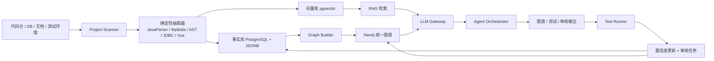

# LegacyGraph 接入LLM,Redis等改造

> 本文档由以下七份文档与代码现实深度合并而成，摒弃「本文/本文档/本报告」等指代词，统一按平台视角描述：
> 1. `LegacyGraph 项目改进总览.md`
> 2. `LegacyGraph 引入 LLM 的可实施详细设计文档.md`
> 3. `LegacyGraph 平台引入 LLM 增强的实施蓝图.md`
> 4. `LLM接入改造方案.md`
> 5. `AI 增强机会分析.md`
> 6. `Redis 应用实施方案.md`
> 7. `缓存机会深入分析.md`
>
> 最后更新：2026-07-01　|　口径：以当前源码与可验证测试结果为准

---

## 一、项目现状

### 1.1 核心结论

LegacyGraph 已完成主要工程骨架、三类图谱获取链路与核心集成验证收口。**后端 379 单测全绿、前端 type-check + build 通过**。当前处于「核心闭环打通、待真实数据与全栈部署做最终验证」的阶段。

### 1.2 门禁实测

```bash
cd backend && mvn clean test
# 通过：379 tests, 0 failures, 0 errors, 2 skipped, BUILD SUCCESS

cd frontend && npm run type-check && npm run build
# 通过：type-check exit 0，build exit 0
```

### 1.3 当前规模

| 类别 | 数量 | 说明 |
|---|---:|---|
| 后端 Controller | 17 | 项目、数据源、扫描、事实、图谱、Agent、审核、测试、报告、认证、系统、向量、运行时链路等 |
| 后端 Entity | 32 | 与 `docs/sql/init.sql` 的 32 张表对应 |
| 后端测试类 | 55 | 379 用例全绿 |
| 数据库表 | 32 | init.sql 覆盖项目/仓库/连接/文档/扫描/事实/图谱/证据/向量/测试/审核/迁移/LLM/报告/系统/运行时链路 |
| Vue 页面 | 36 | dashboard/project/source/scan/graph/fact/review/test/migration/system/audit 等 |
| Docker Compose | 2 服务 | backend、frontend；PG/Neo4j/Redis/MinIO 用外部服务器经 `.env` 注入 |
| Prompt 模板 | 13 | 生产级模板，含 7 个新增模板，全部纳入契约测试 |
| AI Agent | 15+ | 覆盖抽取、映射、合并、审核、测试、QA、SQL 分析、报告、重构、变更影响、迁移、PR 描述等 |

### 1.4 三类图谱方法论对齐

| 方法论要求 | 代码现实 | 状态 |
|---|---|---|
| 统一总图 | `GraphNode`/`GraphEdge`/`Neo4jSyncService`/`GraphQueryService.getUnifiedGraph` | ✅ |
| 代码图谱 | `startFullScan` 扫 Controller/MyBatis XML/DB 元数据/前端文件/Service 调用 | ✅ |
| 功能图谱 | `buildFrontendApiGraph` 接入扫描；参数个数相似性打分 | ✅ |
| 业务图谱 | `extractBusinessFacts → buildBusinessGraph` 接落库，触发 `mapFeaturesToCode` | ✅ |
| 证据层 | 三类 Builder 写 evidence；`getRelatedNodes` 按来源解析 | ✅ |
| 测试生成/执行 | `TestCaseAgent`/`ApiTestExecutor`（含 LOGIN 取 token）/`DbAssertionExecutor`/`E2eTestExecutor` | ✅ |
| 测试回写/审核 | `updateConfidenceByTestResults` + `ReviewController` | ✅ |
| 运行时图谱 | `TraceController` + `TraceIngestionService` + `lg_runtime_trace`；`RuntimeGraph.vue` 接真实拓扑 | ✅ |
| LLM | `LlmGateway` + Spring AI + 模板渲染 + `PromptRun` + 统一 `PiiMaskingService` 脱敏 | ✅ |
| 向量检索 | `VectorizationService`/`VectorRetrievalService` + pgvector | ✅ |
| 图谱质量度量 | `GraphMetricsReport` + `generateGraphMetrics` 五维指标 | ✅ |
| 缓存基础设施 | `RedisConfig` + `CacheService` + 声明式/编程式缓存全覆盖 | ✅ |

---

## 二、总体架构

### 2.1 四段式架构

LegacyGraph 采用「**静态事实层 → 检索增强层 → Agent 编排层 → 验证回写层**」四段式架构。**LLM 不放在最前面，而是放在事实库、向量检索与图谱构建之间**——静态分析给事实，LLM 做归纳与补全，自动测试负责反证。



### 2.2 组件职责

| 组件 | 职责 | 实现 |
|---|---|---|
| LLM Gateway | 模型路由、缓存（Redis 7d）、重试、脱敏、审计、Structured Output 校验 | `LlmGateway`（Spring AI + ChatClient） |
| Agent Orchestrator | 扫描后 AI 编排：文档抽取/功能映射/测试生成/低置信审核准备 | `AiScanOrchestrator` |
| 事实库 | 存静态分析与 LLM 输出，`jsonb` + GIN 索引 | PostgreSQL |
| 向量层 | 语义召回、ANN 检索 | `pgvector` + `VectorRetrievalService` |
| Neo4j | 统一知识图谱与三张视图，向量索引 | `Neo4jGraphDao` / `Neo4jSyncService` |
| Test Runner | 基于图谱自动执行验证 | REST Assured + JUnit + Playwright |
| 缓存层 | 全链路容错缓存：声明式 @Cacheable + 编程式 CacheService | Redis（`lg:` 前缀） |

### 2.3 关键技术栈

| 层 | 选型 |
|---|---|
| Java 后端 | Spring Boot + Spring AI + Spring Security |
| 事实库 | PostgreSQL + `jsonb` + GIN |
| 向量库 | `pgvector`（HNSW 索引） |
| 图谱库 | Neo4j（向量索引 + 全文组合检索） |
| 模型服务 | 多模型路由：Qwen3 自部署 + GLM-4/DeepSeek API 弹性 |
| 静态分析 | JavaParser / CodeQL / Semgrep |
| 测试 | JUnit + REST Assured + Playwright |
| 前端 | Vue 3 + Element Plus + G6（图可视化） |
| 缓存 | Redis（Lettuce 客户端，database: 11） |
| 观测 | Prometheus + Grafana（规划中） |

### 2.4 核心设计原则

1. **代码事实优先于模型解释**：Controller、Service、SQL、表结构等先由静态解析器产出；LLM 只在命名归一、业务解释、缺失映射、低置信关系补全中发挥作用
2. **所有 LLM 输出必须结构化**：统一 JSON Schema 输出，天然对接 Java DTO 校验
3. **所有节点和关系必须可追溯证据**：证据至少回到文件、行号、表、SQL、页面、接口或测试结果
4. **图谱置信度由多源证据与运行验证共同决定**：名称/向量/结构相似度只是候选；真正让边升级的是接口测试、DB 断言、E2E 行为和人工审核
5. **安全默认开启**：源码/配置文件脱敏后进入外部模型；敏感项目支持「本地看全量、云端看脱敏摘要」双通道
6. **缓存全程容错**：Redis 不可用时静默降级回源，绝不断业务

---

## 三、LLM 基础设施

### 3.1 LlmGateway（已落地）

`LlmGateway` 是唯一的 LLM 调用入口，所有 Agent 通过网关完成调用。

**核心能力**：

| 能力 | 实现方式 |
|---|---|
| 多模型动态路由 | `LlmProviderService.getActiveDefault()` 从 DB 读取默认提供商，支持按 `providerCode` 指定 |
| 模板渲染 | `PromptTemplateLoader` 加载 DB 模板（优先）或 classpath 回退；支持变量替换 |
| PromptRun 审计 | 每次调用写入 `lg_prompt_run`：含 `inputHash`(SHA-256)、`parsedOutput`、token 统计、`latencyMs` |
| 结构化校验 | 反序列化失败时设 `status=REVIEW` 并抛 `LlmCallException(needsReview=true)`，不再静默返回空对象 |
| 失败显式返回 | 调用异常落 `status=FAILED` 并抛出异常，附 `promptRunId` |
| PII 脱敏 | `PiiMaskingService` 统一对输入上下文脱敏 |
| LLM 结果缓存 | 调用前查 `lg:llm:result:{template}:{inputHash}`，命中跳过 LLM；成功后回填，TTL 7d |
| ChatModel 缓存 | `ConcurrentHashMap` 进程内缓存，切换提供商后 `clearCache()` |

### 3.2 Prompt 模板体系（已落地）

模板拆为四层：`system`、`domain`、`task`、`output_schema`。13 个生产模板：

| 模板 | 用途 | 输出 DTO |
|---|---|---|
| `code-fact-extraction` | 代码语义事实抽取 | `FactExtractionResult` |
| `doc-understanding` | 文档流程/规则/角色/对象抽取 | `BusinessFactExtraction` |
| `feature-mapping` | 页面/API/权限/功能映射 | `MappingResult` |
| `graph-merge-decision` | 图谱合并裁决 | `GraphMergeDecision` |
| `test-case-generation` | 测试用例生成 | `TestCaseGenerationResult` |
| `review-suggestion` | 审核建议 | `ReviewResult` |
| `qa-answer` | 自然语言问答 | `QaAnswer` |
| `sql-advisor` | SQL 性能分析 | `SqlAdvisorResult` |
| `test-failure-analysis` | 测试失败根因分析 | `TestFailureAnalysis` |
| `report-insight` | 报告洞察与行动建议 | `ReportInsight` |
| `refactor-suggestion` | 代码异味重构建议 | `RefactorSuggestion` |
| `change-impact` | 变更影响分析 | `ChangeImpactAnalysis` |
| `migration-convert` | 迁移代码转换 | `MigrationConversion` |
| `pr-description` | PR 描述生成 | `PrDescription` |

所有模板均纳入 `PromptTemplateContractTest` 契约测试：校验每个占位符可被对应 Agent 入参完整填充。

### 3.3 模型选型与路由

**双轨制**：

| 轨道 | 模型 | 适用场景 |
|---|---|---|
| 私有部署 | Qwen3（支持 vLLM/TGI/SGLang） | 高敏数据、中文理解、代码/Agent 任务 |
| 云弹性 | GLM-4.5 / DeepSeek-V4 | 复杂推理、结构化输出、大批量抽取 |

**分层路由建议**：
- 高频批量抽取：GPT-5.4 / DeepSeek-Flash / 本地开源
- 复杂歧义合并、难例审核：GPT-5.5 / GLM-4.5
- Embedding：`text-embedding-3-small`（512-768 维，约 $0.02/百万 token），疑难数据离线切 large

### 3.4 成本管理

`PromptRun` 表记录每次调用的 `promptTokens`、`completionTokens`、`latencyMs`，可按项目/Agent/模型维度统计。LLM 结果缓存（TTL 7d）是降本的核心手段——扫描闭环中重复调用率高，缓存命中可显著降低 token 成本。

---

## 四、Agent 体系

### 4.1 Agent 全景

| Agent | 核心职责 | 输入 | 输出 | 推荐模型 |
|---|---|---|---|---|
| CodeFactAgent | 代码语义事实抽取 | AST、调用链、SQL、行号 | 结构化代码事实 | Qwen 私有 / DeepSeek Flash |
| DocUnderstandingAgent | 文档流程/规则抽取 | 文档分片、术语词典 | 流程、对象、规则、别名 | GLM / Qwen |
| FeatureMappingAgent | 页面/API/权限映射 | 前端事实、后端接口、文档功能点 | 功能映射边 | DeepSeek / GLM |
| GraphMergeAgent | 去重合并、关系裁决 | 候选节点/边、相似度、图邻域 | merged / rejected | GLM / Qwen Thinking |
| TestCaseAgent | 生成测试场景 | 功能节点、状态流、接口、表 | 测试用例 JSON | GLM / Qwen |
| ReviewAgent | 审核建议与差异解释 | 低置信结论、冲突证据、失败测试 | 审核摘要、推荐动作 | GLM / Qwen Thinking |
| QaAgent | 自然语言问答 | 问题 + 向量召回 + 图邻域 | 答案 + 证据 + 置信度 | GLM / Qwen |
| SqlAdvisorAgent | SQL 性能优化建议 | MyBatis SQL、表结构 | 优化建议 + 改写 SQL | DeepSeek / Qwen |
| TestFailureAnalysisAgent | 测试失败根因分析 | 请求/响应/错误/图谱路径 | 根因 + 排查步骤 | GLM / Qwen |
| ReportInsightAgent | 报告洞察与行动建议 | 图谱指标 + 缺口摘要 | 优先级排序行动清单 | GLM / Qwen |
| RefactorAgent | 代码异味重构建议 | 目标类/方法 + 图谱邻域 | 拆分建议 + 重构骨架 | GLM / Qwen |
| ChangeImpactAgent | 变更影响分析 | diff + 图谱依赖 | 影响类型/范围/回归建议 | GLM / Qwen |
| MigrationAgent | 迁移代码转换 | 目标代码 + 迁移规则 | 转换后代码 | DeepSeek / Qwen |
| PrDescriptionAgent | PR 描述生成 | git diff | commitMessage + prBody | DeepSeek / Qwen |

### 4.2 公共契约

所有 Agent 共享统一的输入外壳与输出元数据：

**输出元数据（PublicInputEnvelope）**：
```
agent, project_id, task_id, input_payload, evidence_catalog, context
```

**输出元数据（CommonAgentOutputMeta）**：
```
agent, task_id, confidence, evidence[], needs_review, reasoning_summary, output_hash
```

所有 Agent 输出必须带 `evidence` 引用列表和 `confidence`（0-1），低置信自动进入审核。

### 4.3 扫描后 AI 编排（AiScanOrchestrator）

`ProjectScanner.startFullScan` 扫描成功后按 `enableAi/autoGenerateTestCase/minConfidence` 执行四个 AI 子任务（AI 编排失败不影响扫描 SUCCESS）：

| 子任务 | 状态标记 | 描述 |
|---|---|---|
| AI_DOC_EXTRACT | 文档提取 | 读取本版本文档 → `DocUnderstandingAgent` 抽取 → 写入 `lg_fact`（`sourceType=DOC_AI`，`PENDING_CONFIRM`）→ `BusinessGraphBuilder` 构建业务图谱 |
| AI_FEATURE_MAPPING | 功能映射 | 汇总 Page/ApiEndpoint 节点 → `FeatureMappingAgent` 生成映射 → 创建 `PENDING_CONFIRM` 的 CALLS 边 → 生成审核记录 |
| AI_TEST_GENERATE | 测试生成 | `autoGenerateTestCase` 开启时对高价值 ApiEndpoint 生成用例（上限 20 节点），含 preconditions/request/assertions/needHumanInput |
| AI_REVIEW_PREPARE | 审核准备 | 扫描节点中置信度 < `minConfidence` 者生成 ReviewRecord（PENDING，去重，上限 50） |

每个子任务以独立 `ScanTask` 记录状态（RUNNING→SUCCESS/FAILED），单步失败不中断整体。

### 4.4 QA 问答（QaAgent + GraphQaController）

五段式 RAG：向量召回（Top-5）→ 相似节点召回 → 一跳图邻域扩展 → 轻量去重 → LLM 生成。

回答强制返回：`answer`、`confidence`、`usedEvidence`（结构化证据明细：GRAPH_NODE/GRAPH_EDGE/DOC_CHUNK）、`relatedNodeKeys`。

鲁棒性：空问题短路返回；检索失败降级为「信息不足」而非抛出；无上下文时仍带占位提示调用 LLM。

### 4.5 置信度与审核闭环

**节点/边置信度更新分值规则**：

| 事件 | 置信度变化 | 说明 |
|---|---:|---|
| 静态事实存在单一强证据 | +0.05 | 明确代码行、SQL 和表绑定 |
| 跨源一致 | +0.08 | 代码、文档、SQL 三方一致 |
| API 测试通过 | +0.10 | 与功能/接口关系相关 |
| DB 断言通过 | +0.12 | 与写表/状态流相关 |
| E2E 通过 | +0.12 | 与页面/按钮/流程相关 |
| 人工审核通过 | +0.15 | 进入正式图谱 |
| 人工审核驳回 | −0.25 | 直接降级并标记冲突 |
| 自动测试失败 | −0.20 | 打回候选态 |
| 证据源失效或 hash 变化 | −0.10 | 触发重新检索和再验证 |

**展示阈值**：
- ≥ 0.90：正式图谱，默认展示
- 0.80–0.89：正式图谱，标记「已验证部分」
- 0.65–0.79：候选图谱，待核验提醒
- < 0.65：不进主视图，只进审核队列

### 4.6 图谱合并算法

三阶段：
1. **候选生成**：按 `node_type + project_id` 分桶，用规范化名称、别名、路径、主键 + 向量 ANN 召回 Top-K
2. **特征打分**：`name_score(0.30) + semantic_score(0.25) + struct_score(0.20) + neighbor_score(0.15) + evidence_score(0.10)`
3. **决策**：score ≥ 0.92 自动合并；0.75–0.92 人工审核；< 0.75 不合并

强规则合并优先（同签名、同 DB 对象、同路径+签名、同 source hash），LLM 裁决仅用于术语别名对齐、页面-功能名对齐、同名异义判定。

---

## 五、缓存体系

### 5.1 基础设施（已落地）

`RedisConfig` 为容器级配置，统一 `lg:` 前缀 + JSON 序列化 + 容错错误处理器。

`CacheService` 为编程式容错封装：`get/put/getOrLoad/evict/evictByPrefix`，所有读写 try/catch 包裹，Redis 不可用静默降级。

**双层缓存模式**：
- **声明式缓存**（`@Cacheable/@CacheEvict`）：配置/字典/提供商/模板/项目概览/验证报告/迁移报告等「读多写少」场景
- **编程式缓存**（`CacheService`）：LLM 结果、图谱视图、向量检索、节点详情、JWT 黑名单等需精确控制 TTL/前缀失效的场景

**per-cache TTL 策略**：
| 缓存名 | TTL | 原因 |
|---|---|---|
| `project-overview` | 1 min | 仪表盘可容忍轻微陈旧，写时已显式失效 |
| `validation-report` | 5 min | 审核频繁变更，TTL 兜底 |
| `llm-provider-default` | 6 h | 配置极少变更 |
| `prompt-templates` | 6 h | 模板极少变更 |
| `config-value/config-all` | 1 h | 系统配置 |
| `dict-items/dict-map` | 6 h | 字典数据稳定 |
| `report-migration-readiness` | 1 h | 报告写时失效 |
| `scan-progress` | 3 s (运行) / 30 min (终态) | 扫描进度高频轮询 |
| `llm-result` | 7 d | LLM 调用去重降本 |
| `vec:search` | 3 min | 向量检索，新扫描后失效 |
| `graph:node` | 60 s | 图谱节点，写时失效 |

### 5.2 已落地缓存场景

| 编号 | 场景 | 实现方式 | 失效机制 |
|---|---|---|---|
| A1 | LLM 默认提供商 | `LlmProviderService.getActiveDefault` @Cacheable + CRUD @CacheEvict(allEntries) | 写时全部失效 |
| A2 | Prompt 模板 | `PromptTemplateService.getActiveByCode` @Cacheable | CRUD 时 @CacheEvict |
| A3 | 项目概览 | `ProjectOverviewService.getOverview` @Cacheable TTL 1min | 扫描/审核/源 CRUD 经 `GraphCacheInvalidator` |
| B1 | 验证报告 | `GraphValidatorService.getValidationReport` @Cacheable TTL 5min | 审核确认/驳回时经 invalidator 失效 |
| B2 | 迁移就绪度报告 | `ReportingService.generateMigrationReport` @Cacheable TTL 1h | 图谱写时随 `report-` 前缀失效 |
| B3 | 向量检索结果 | `VectorRetrievalService.semanticSearch` 编程式缓存 TTL 3min | 版本级失效 |
| B4 | 节点详情 | `Neo4jGraphDao.findNodeById` 编程式缓存 TTL 60s | updateNode 时失效 |
| 1 | LLM 结果缓存 | `LlmGateway` 调用前查 `lg:llm:result:{template}:{inputHash}` TTL 7d | 自然过期 |
| 2 | JWT 登出黑名单 | `TokenBlacklistService` TTL=token 剩余有效期 | JwtAuthenticationFilter 校验 |
| 3 | 扫描进度缓存 | `ScanVersionService.getScanProgress` 缓存优先 | 状态变更即时失效 |
| 4 | 图谱/报告缓存 | `GraphQueryService` 只读视图 + `ReportingService` 报告 | `GraphCacheInvalidator` 按版本失效 |
| 5 | 配置/字典缓存 | `SysConfigService`/`SysDictService` @Cacheable | 写时 @CacheEvict |

### 5.3 GraphCacheInvalidator（失效统一入口）

所有图谱相关缓存（项目概览/验证报告/迁移报告/图谱视图/向量检索/节点详情）的失效统一经 `GraphCacheInvalidator`，接入点：
- `ProjectScanner`（重扫）
- `GraphMergeService`（合并）
- `GraphValidatorService.confirmNode/rejectNode/updateConfidenceByTestResults`
- `SourceController` 全部 8 个写端点（createRepo/updateRepo/deleteRepo/createDatabase/updateDatabase/deleteDatabase/uploadDocument/deleteDocument）

### 5.4 不做缓存 / 后置

| 场景 | 结论 | 原因 |
|---|---|---|
| DB Schema 元数据 | ❌ 不实现 | `scanSchema` 是显式刷新写操作，缓存会破坏语义 |
| 审计日志/分页列表 | ❌ 不建议 | 写入频繁、排序变化、命中率低 |
| 用户信息 | ⚠️ 后置 | 需配合 JWT 黑名单的 token-version 机制 |
| 扫描分布式锁 | ⚠️ 后置 | 单实例部署暂不需要 |
| 接口限流 | ⚠️ 后置 | 按需接入 |
| Provider 多实例一致性 | ⚠️ 后置 | 单实例暂不需要 |

---

## 六、检索增强生成（RAG）

### 6.1 分片策略

代码按 AST 语义边界切分（Controller 方法/Service 方法/Mapper 方法/Vue 组件方法），80–150 行/chunk，overlap 10–20 行；SQL 按单 statement 切分；表结构按「单表 + 字段 + 注释 + 索引 + 约束」整体成块；文档按 300–500 英文词或 500–800 中文字/chunk，overlap 80–120 中文字。

### 6.2 检索流水线

**五段式**：规则过滤（top exact 20）→ 向量召回（topK 30）→ 图邻域扩展（depth 1–2）→ 首轮融合（规则 0.45 / 向量 0.35 / 图邻域 0.20）→ 重排序（top 12 → rerank top 6）→ 传入 LLM（最多 6 个证据块）

**建议阈值**：
- 文档相似召回：cosine ≥ 0.68
- 代码语义召回：cosine ≥ 0.72
- 符号名精确/半精确：优先级高于向量分
- rerank 通过：≥ 0.55

### 6.3 向量存储

`lg_vector_document` 表（pgvector），含 `embedding vector(768)`、`meta jsonb`、`source_hash`、`chunk_type` 等字段。支持 approximate nearest neighbor 搜索 + GIN 元数据索引。

---

## 七、测试闭环

### 7.1 测试流程

从**已确认或高置信功能节点**出发，沿 `Feature → Page → API → Service → SQL → Table` 链路生成测试模板；结合业务规则补全正常、异常、权限、边界、幂等和并发场景。

**四阶段**：生成 → 执行（API 用 REST Assured，E2E 用 Playwright，隔离环境用 Testcontainers）→ 断言（HTTP + JSONPath + SQL + 状态 + UI）→ 回写（PASS 加分，FAIL 减分并生成审核任务）。

### 7.2 已实现

- `TestCaseAgent` 生成多场景（NORMAL/EXCEPTION/BOUNDARY），填充真实请求参数，不确定项放入 `needHumanInput`
- `ApiTestExecutor` 含 LOGIN 前置条件（可配 loginPath/tokenField/contextKey），支持上下文变量替换
- `DbAssertionExecutor` 执行 SQL 断言比对
- `E2eTestExecutor` 前端端到端测试
- `TestExecutionScheduler` 调度执行
- `TestResultUpdateService.onTestFail` 将 AI 根因摘要写入 `ReviewRecord.comment`

---

## 八、安全与运维

### 8.1 安全策略

**三层控制**：
1. **敏感识别**：扫描前对密钥/token/连接串/手机号/身份证等标注
2. **脱敏与最小披露**：外部模型只发送必要证据摘录，不发送整文件；高敏项目切私有模型
3. **审计与审批**：所有 LLM 请求记录 `who/when/model/prompt_version/scope/token_usage/output_hash/decision`

**PII 脱敏**：`PiiMaskingService` 在 LlmGateway 调用前统一对输入上下文脱敏。

### 8.2 权限模型

| 角色 | 权限 |
|---|---|
| PROJECT_ADMIN | 项目接入、Provider 配置、发布图谱 |
| ANALYST | 查看图谱、发起扫描、人工审核 |
| TEST_ENGINEER | 生成与执行测试、查看回写 |
| AUDITOR | 查看 PromptRun、审计日志、脱敏策略 |
| VIEWER | 只读查询与图谱浏览 |

### 8.3 关键监控指标

| 指标 | 目标 |
|---|---|
| LLM 调用成功率 | > 99% |
| P95 交互查询延迟 | < 3000ms |
| 缓存命中率 | > 60% |
| JSON Schema 合法率 | > 99% |
| 单项目月度 LLM 成本可见性 | 100% |

---

## 九、未完成与后置项

### 9.1 唯一未实跑项

| 项 | 状态 |
|---|---|
| Docker 全栈验证 | ⚠️ compose 已改为仅构建前后端，外部依赖经 `deploy/.env` 注入。在 Docker 宿主上执行 `docker compose up --build -d`；首次需手动在外部 PG 执行 `init.sql` |

### 9.2 待真实数据验证

- 运行时链路（需真实 OpenTelemetry / 日志采样）
- 跨图谱映射准确率（Feature→Page/API/Service/Mapper/Table）
- 图谱质量度量五维指标分布合理性

### 9.3 后置优化（不在基础闭环稳定前扩大复杂度）

- 图谱大数据量渲染（WebWorker、聚合节点）
- 图谱路径分析/影响分析、邻居展开收起
- 服务调用链对多 Mapper/多 Service 的精确绑定
- 前端单测环境完善（Element Plus/router/axios stub）
- 向量检索的「规则过滤/专用 reranker」（当前为轻量实现）
- 微服务拆分建议（🟡 低优先级，待图谱数据与映射准确率稳定后投入）

### 9.4 缓存后置

- 用户信息缓存（需配合 JWT token-version 强制下线）
- 扫描分布式锁（单实例暂不需要）
- 接口限流（按需接入）
- Provider 多实例一致性（单实例暂不需要）

---

## 十、演进历史

### 阶段一（6/27）：恢复构建

从「前后端都不能构建」推进到「基础构建/打包可通过」：移除无效依赖、修复前端构建错误、修 ReportingService 递归风险。

### 阶段二（6/29）：完整性核验

以代码/路由/测试结果为准重新核验，判定「核心模块覆盖较全但集成验证未收口」，定位三条断链与运行时链路缺失。

### 阶段三（6/29–30）：两条轨道并行收口

**轨道 A**：门禁收口（后端 379 全绿、前端 type-check+build 通过）、三条断链接通、运行时链路后端落地、抽取器增强、PII 脱敏接入。

**轨道 B**：图谱闭环修正（版本过滤+状态感知+空视图诊断）、业务功能自动映射、运行时验证持久化、Service 调用绑定增强。

### 阶段四（6/30）：AI 5 个 Phase 落地

Phase 0：6 模板/DTO/Agent 三方契约对齐，LlmGateway 加固（结构化校验、失败显式返回、PromptRun 审计补全）

Phase 1：AiScanOrchestrator 接入扫描后 4 个 AI 子任务，文档事实同步建业务图谱，功能映射落待确认边

Phase 2：QaAgent + GraphQaController 自然语言问答

Phase 3：SqlAdvisorAgent/TestFailureAnalysisAgent/ReportInsightAgent 接入主流程（MyBatis SQL 建图/测试失败回写/报告洞察）

Phase 4：RefactorAgent/ChangeImpactAgent/MigrationAgent/PrDescriptionAgent + 端点

### 阶段五（6/30–7/01）：缓存体系全面落地

Redis 从「已配未用」到 9 个场景全落地，含 LLM 结果/JWT 黑名单/扫描进度/图谱视图/报告/配置字典/Prompt 模板/LLM 提供商/项目概览/验证报告/迁移就绪度/向量检索/节点详情。CacheService + GraphCacheInvalidator 统一容错与失效。

> **更正记录**：早期「100% 完成/可上线」等乐观结论已被后续核验更正。92 failures/221 errors 实为 1 个 OOM 测试中断的假象。前端「大量 TS 错误」实为仅 1 处缺导入。

---

## 附录 A：关键代码路径

| 组件 | 路径 |
|---|---|
| LLM Gateway | `backend/src/main/java/io/github/legacygraph/llm/LlmGateway.java` |
| CacheService | `backend/src/main/java/io/github/legacygraph/service/CacheService.java` |
| RedisConfig | `backend/src/main/java/io/github/legacygraph/config/RedisConfig.java` |
| GraphCacheInvalidator | `backend/src/main/java/io/github/legacygraph/service/GraphCacheInvalidator.java` |
| AiScanOrchestrator | `backend/src/main/java/io/github/legacygraph/task/AiScanOrchestrator.java` |
| ProjectScanner | `backend/src/main/java/io/github/legacygraph/task/ProjectScanner.java` |
| Neo4jSyncService | `backend/src/main/java/io/github/legacygraph/service/Neo4jSyncService.java` |
| PromptTemplateLoader | `backend/src/main/java/io/github/legacygraph/llm/PromptTemplateLoader.java` |
| Agent 目录 | `backend/src/main/java/io/github/legacygraph/agent/` |
| 数据库初始化 | `docs/sql/init.sql` |
| Docker Compose | `deploy/docker-compose.yml` |

## 附录 B：被合并的原文档清单

1. `doc/LegacyGraph 项目改进总览.md` — 项目现状、门禁、改进点、缺口、演进历史
2. `doc/LegacyGraph 引入 LLM 的可实施详细设计文档.md` — 总体架构、Agent 设计、RAG、测试闭环、安全、前端
3. `doc/LegacyGraph 平台引入 LLM 增强的实施蓝图.md` — 目标架构、Agent 体系、RAG、安全合规、API、前端、里程碑
4. `doc/LLM接入改造方案.md` — 现状分析、LLM 架构、增强点、Agent 设计、质量保障、分阶段计划
5. `doc/AI 增强机会分析.md` — 现有 AI 能力、前置修复、新增建议、优先级、实施路线
6. `doc/Redis 应用实施方案.md` — Redis 现状、应用场景、分阶段实施、代码骨架
7. `doc/缓存机会深入分析.md` — 缓存热点、优先级、失效设计、汇总
