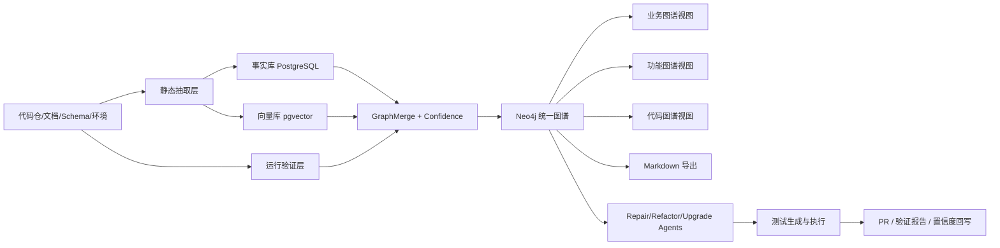
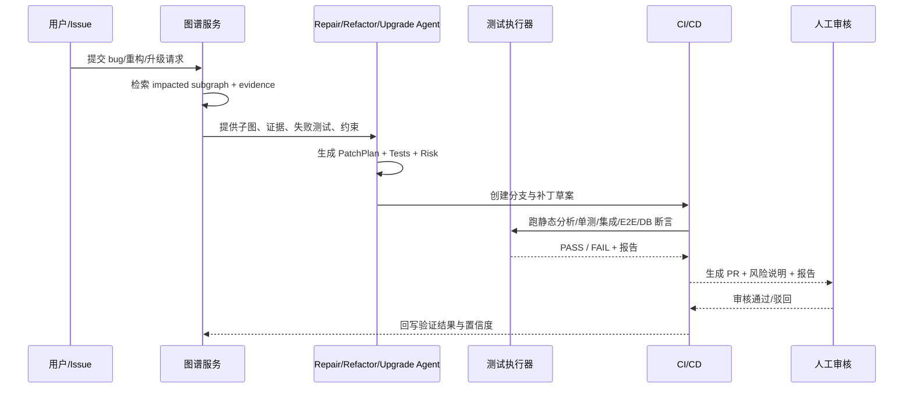

# LegacyGraph 三类图谱共建、Markdown 导出与 AI 修复重构升级的可实施详细设计与落地方案

## 执行摘要

这份方案的核心判断是：**三类图谱本身并不等于“全面理解老项目”**。真正能支撑后续自动修复 bug、重构系统、升级依赖与框架的，不只是业务图谱、功能图谱、代码图谱，还必须补上**证据层、置信度层、测试验证层、运行链路层、版本与变更层**。否则图谱只能“好看”，不能“可信”，更不能成为 AI 生成补丁与 PR 的可靠上下文。现有 LegacyGraph 方案已经明确了输入层→扫描层→抽取层→事实层→图谱层→AI 层→验证层→展示层的整体架构，也已经列出了 CodeFactAgent、DocUnderstandingAgent、FeatureMappingAgent、GraphMergeAgent、TestCaseAgent、ReviewAgent 等基础角色，这为下一步引入 LLM 与静态分析共建三类图谱提供了很好的起点。

从工程实现角度，最稳妥的路线不是“把仓库直接丢给 LLM”，而是先用**JavaParser/CodeQL/Semgrep/JDBC/OpenAPI/前端 AST 抽取器**提取可验证事实，再让 LLM 在这些事实之上完成业务归纳、功能映射、图谱合并、测试生成、修复策略生成。这样可以把幻觉风险压缩到语义层，而把“路径、类、方法、SQL、表、字段、调用链”等硬事实交给静态分析与运行验证。CodeQL 官方文档显示其支持 Java、Kotlin、JavaScript、TypeScript、Python、Go、C# 等语言；对 Java/Kotlin 还内建了 MyBatis、JPA、JDBC、Spring MVC 等框架支持。Semgrep 官方文档则说明 Java、JavaScript、TypeScript 都支持跨文件数据流，且 Java/JS/TS 还支持框架相关控制流分析。JavaParser 提供 Java 代码 AST，适合做轻量级源码结构抽取。

图谱存储方面，建议采用 **Neo4j + PostgreSQL/pgvector** 的双存储方案：Neo4j 负责显式节点关系、路径查询和可视化；PostgreSQL 负责事实表、证据表、任务表、测试结果表；pgvector 负责文档片段、代码片段和历史修复知识的向量检索。Neo4j 官方文档说明向量索引支持相似性搜索，也可与全文搜索等结果源组合形成混合检索；pgvector 上游仓库说明它支持在 Postgres 中存储向量，并提供精确与近似最近邻搜索。OpenAI 官方文档说明 Responses API 原生支持 built-in tools、file search、web search 与 function calling；function calling 可用 JSON Schema 定义工具接口，strict 模式下会对模式不满足的请求直接拒绝；embeddings 用于度量文本相关性。

修复 bug、重构、升级这三类“AI 变更任务”必须和图谱联动，但不能直接跳过验证。建议把自动化闭环设计成：**问题进入 → 图谱定位子图 → LLM 生成补丁与测试 → 静态分析/单测/集成/E2E/DB 断言 → 形成 PR → 人工审核 → 合并与回滚保护**。Playwright 官方文档说明其是面向现代 Web 应用的端到端测试框架，支持 Chromium、WebKit、Firefox，并适合在 CI 中运行；Testcontainers for Java 提供轻量、即弃型数据库与浏览器容器，方便集成测试；REST Assured 专门用于 Java 中测试和验证 REST 服务；OpenRewrite 官方文档则将自己定位为开源自动重构生态，支持大规模消除技术债，并提供 Java/Spring/Testing/Modernize 等配方；GitHub Actions 文档说明其可以在仓库内自动化执行完全自定义的 CI/CD 工作流。

本次补充已经改为**以当前本地仓库代码为准**，并使用 `codegraph` 索引完成代码检索复核。本次复核时索引覆盖 **451 个文件、9899 个符号节点、19449 条边**（语言：Java 312、TypeScript 58、Vue 73、XML/YAML 等；class 356、method 1492、route 173、component 73），相较上一版统计（456/9960/19643）略有变化，但结论不变：LegacyGraph 已经不是“从零建设三类图谱”的阶段，而是已经具备**扫描建图、证据写入、功能切片、测试回写、报告导出、Agent 建议**六条主线；下一阶段重点应从“泛化方案设计”转为“围绕现有代码补齐闭环”：按功能切片导出 Markdown、把 Refactor/Migration/Impact/PR Agent 接入变更任务中心、补丁落盘前做范围约束、执行验证门禁并回写图谱。

## 基于当前代码的可行性复核

### 代码基线结论

从当前代码看，三类图谱共建、Markdown 导出与 AI 修复重构升级的可行性可以分为三层：

| 能力层 | 当前可行性 | 代码落点 | 结论 |
|---|---|---|---|
| 代码图谱 | 高 | `ProjectScanner.startFullScan`、`GraphBuilder`、`JavaControllerExtractor`、`MyBatisXmlExtractor`、`ServiceCallExtractor`、`DatabaseMetadataExtractor` | 已有 Java Controller、Service 调用、MyBatis XML、数据库元数据扫描和 Neo4j 写入链路，下一步是增强跨文件/动态调用和更多框架模式 |
| 功能图谱 | 高 | `FrontendGraphBuilder`、`VueRouteExtractor`、`FrontendApiExtractor`、`FeatureSliceBuilder` | 已有 Page/Menu/Button/Permission/API CALLS 构建，Feature Slice 已能从 Feature 投影到 Page/API/Method/SQL/Table/Permission |
| 业务图谱 | 中高 | `AiScanOrchestrator.runDocExtract`、`DocUnderstandingAgent`、`BusinessGraphBuilder`、`DocumentExtractor` | 文档抽取与业务事实入图已有入口，质量取决于文档覆盖率和人工审核闭环 |
| 证据与置信度 | 高 | `EvidenceGraphWriter`、`EvidenceRecord`、`GraphNodeClaim`、`GraphEdgeClaim`、`NodeEvidenceRepository`、`EdgeEvidenceRepository` | 已有统一 Claim/Record 写入模型，AI 来源默认待确认，代码/DB 来源默认确认，低置信自动待确认 |
| 测试验证闭环 | 中高 | `TestCaseAgent`、`ScenarioDSLBuilder`、`TestCaseController`、`GraphValidatorService`、`TestResultUpdateService` | 测试生成、执行、回调、置信度回写已具备，但存在两套回写服务，需要统一成一个策略中心 |
| Markdown 导出 | 中 | `ReportExportService`、`ReportExportController`、`ReportingService` | 已支持迁移就绪度、置信度、测试覆盖、图谱质量四类报告的 MD/PDF/Excel 导出；缺少“功能切片/子图/变更任务”级 Markdown 导出 |
| AI 修复/重构/升级 | 中 | `RefactorAgent`、`ChangeImpactAgent`、`MigrationAgent`、`PrDescriptionAgent`、`LlmAgentController` | 已有建议类 Agent 和接口，但还没有 ChangeTask/Patch/Branch/PR 执行管道，不能直接称为自动修复闭环 |
| 前端工作台 | 中高 | `frontend/src/views/graph/*`、`frontend/src/views/workbench/*`、`frontend/src/views/test/*`、`frontend/src/views/review/*` | 已有统一图、业务图、功能图、运行图、证据工作台、切片工作台、测试和审核页面，缺变更任务中心 |

### 现有扫描与 AI 编排链路

当前 `ProjectScanner.startFullScan` 已经实现一条比较完整的扫描主线：

1. 自动发现数据库连接、前后端子路径、文档文件。
2. 通过 `ExtractionAdapterRegistry` 试运行适配器扫描，未匹配资产继续走旧扫描链路兜底。
3. 扫描 Java Controller 生成 API 事实和接口节点。
4. 扫描 Service 调用关系，补 Method/Service 层 CALLS。
5. 扫描 MyBatis XML，抽取 Mapper、SQL、READS/WRITES/JOINS 表关系。
6. 扫描 Vue 路由和前端 API 调用，生成 Page/Menu/Button/Permission/API CALLS。
7. 扫描所有 READY 数据库连接的元数据，生成 Table/Column/REFERENCES 等节点关系。
8. 对数据库 Schema 摘要调用 `DbSchemaAnalysisAgent` 做业务语义增强。
9. 图谱由各 Builder 在扫描过程中直写 Neo4j，不再依赖“先落关系库再同步”的二次过程。
10. 扫描后调用 `AiScanOrchestrator.orchestrate`，按 `AiScanConfig` 执行文档业务事实抽取、功能映射、测试生成和低置信审核任务准备。

这意味着本方案中的“接入、抽取、建图、AI 编排”不需要另起一套新服务，优先策略应是**复用当前 ProjectScanner + Builder + Agent 架构，在缺口处加能力**。

### 三类图谱到现有代码的映射

| 图谱视图 | 当前节点/边 | 关键类 | 需要补强的点 |
|---|---|---|---|
| 代码图谱 | `ApiEndpoint`、`Controller`、`Service`、`Method`、`Mapper`、`SqlStatement`、`Table`、`Column`；`HANDLED_BY`、`CALLS`、`EXECUTES`、`READS`、`WRITES`、`HAS_COLUMN` | `GraphBuilder`、`JavaControllerExtractor`、`ServiceCallExtractor`、`MyBatisXmlExtractor`、`SqlTableExtractor` | 补充注解 SQL、JdbcTemplate、定时任务、MQ、外部 HTTP 客户端、反射和配置驱动入口 |
| 功能图谱 | `Page`、`Menu`、`Button`、`Permission`、`ApiEndpoint`、`Feature`；`CONTAINS`、`CALLS`、`REQUIRES_PERMISSION`、`EXPOSED_BY` | `FrontendGraphBuilder`、`VueRouteExtractor`、`FrontendApiExtractor`、`FeatureMappingAgent` | 前端按钮到 API 的方法识别目前默认 POST，需要从 axios/fetch 调用栈回推真实 method；`Feature -> Page` 的 `EXPOSED_BY` 需要由映射 Agent 或审核固化 |
| 业务图谱 | `BusinessDomain`、`BusinessProcess`、`BusinessObject`、`BusinessRule`、`Role`、`Feature`；`HAS_RULE`、`USES`、`BELONGS_TO` | `DocUnderstandingAgent`、`BusinessGraphBuilder`、`DocumentExtractor`、`ReviewAgent` | 文档缺失或过时时必须降低置信度；同义词、别名和跨文档冲突需要进入 Review 队列 |
| 运行链路图 | `ApiEndpoint`、`SqlStatement` 等运行时观测节点；`runtimeVerified`、`traceCount`、`relationStatus` | `TraceGraphAligner`、`TraceController` | 现有对齐主要按 API path 与 SQL hash，后续应补 span 层级路径、耗时分位、错误率和 scenarioId |
| 测试图层 | `TestCase`、`Assertion`；`VERIFIED_BY`、`ASSERTS` | `ScenarioDSLBuilder`、`TestCaseAgent`、`TestCaseController`、`GraphValidatorService` | 测试结果和图谱边的精确关联粒度还要增强，避免只按 targetNodeId 粗粒度回写 |

### 证据与状态规则的代码化口径

当前仓库已经定义了统一证据模型，不必再单独设计一套并行结构：

| 设计概念 | 当前代码实现 | 当前行为 |
|---|---|---|
| 图谱节点声明 | `GraphNodeClaim` | 调用方声明 nodeType/nodeKey/source/confidence/status/properties |
| 图谱边声明 | `GraphEdgeClaim` | 调用方声明 from/to/edgeType/edgeKey/source/confidence/status/properties |
| 统一证据 DTO | `EvidenceRecord` | 统一承载 code/sql/doc/ui/test/runtime/ai 证据、行号、hash、metadata、隐私策略 |
| 图谱写入器 | `EvidenceGraphWriter` | 按 `projectId/versionId/nodeType/nodeKey` 或 edge key 去重，写 Neo4j，并落库证据关系 |
| AI 默认状态 | `deriveNodeStatus` / `deriveEdgeStatus` | `AI_INFERENCE`、`DOC_AI` 默认 `PENDING_CONFIRM` |
| 静态来源状态 | `CODE_AST`、`DB_METADATA`、`FRONTEND_AST` 等 | 默认 `CONFIRMED`，低于 0.5 进入 `PENDING_CONFIRM` |
| 证据隐私 | `PrivacyLevel`、`SecretScanService`、`PiiMaskingService` | 发送 LLM 前可做密钥/连接串/邮箱/手机号/IP 等脱敏 |

因此后续落地时，新增抽取器、Agent 或变更任务不应直接写 `GraphNode` / `GraphEdge`，而应统一走 `GraphNodeClaim`、`GraphEdgeClaim`、`EvidenceRecord` 和 `EvidenceGraphWriter`。这样能保证去重、证据、状态裁决、隐私策略一致。

## 研究边界与输入输出清单

本方案的研究输入优先级建议固定为四层。第一层是**真实仓库与运行产物**，包括代码仓、配置、数据库 schema、迁移脚本、日志与测试环境；第二层是**官方工具文档**，用于确定抽取器、图谱、Agent、测试和 CI/CD 的能力边界；第三层是**你已有的方案文档**，尤其是已定义的多 Agent 架构、Prompt、质量阈值与阶段性落地思路；第四层才是 LLM 生成的归纳结论。这样的优先级可以最大限度减少“图谱看似合理、实际不可验证”的问题。已有方案文档已经明确将“结果可验证、结果可追踪、失败可降级、成本可监控”作为 LLM 接入原则。

下面是项目接入时必须收集的**输入清单**。对 LegacyGraph 当前仓库而言，其中一部分已经有代码落点，可以直接作为 MVP 输入；缺失项则进入配置或人工补充流程。

| 输入项 | 是否必须 | 优先来源 | 若未提供的替代策略 |
|---|---:|---|---|
| 后端代码仓 | 必须 | `CodeRepo` + `backend/` | 当前已有 Spring Boot + Java 21 后端，扫描入口在 `ProjectScanner` |
| 前端代码仓 | 必须 | `CodeRepo` + `frontend/` | 当前已有 Vue 3 + TypeScript + Vite 前端，页面在 `frontend/src/views` |
| `pom.xml` / `package.json` | 必须 | `backend/pom.xml`、`frontend/package.json` | 当前已包含 JavaParser、JSqlParser、Neo4j Driver、Spring AI、pgvector、flexmark、REST Assured、Playwright 等依赖 |
| 数据库 schema / `CREATE TABLE` / 迁移脚本 | 必须 | `docs/sql/init.sql`、Flyway、外部数据库连接 | 当前支持 `DatabaseMetadataExtractor` 直连 JDBC 抽取，也支持 `GraphBuilder.buildDbSchemaSummary` 后续 LLM 增强 |
| 产品文档、需求文档、操作手册 | 强烈建议 | `Document` 数据源、上传文件、仓库 Markdown/Word/PDF | 当前 `DocumentExtractor` + `DocUnderstandingAgent` + `BusinessGraphBuilder` 已可做业务事实抽取；无文档时业务图谱进入人工确认模式 |
| OpenAPI / Swagger | 可选 | springdoc / Controller 注解 | 当前 `JavaControllerExtractor` 可从 Controller 注解逆向生成 API 节点，springdoc 依赖已存在 |
| 测试环境地址与账号 | 强烈建议 | 系统配置 / 环境变量 | 无环境时只生成静态测试草案；有环境时走 `TestExecutionScheduler`、API/E2E/DB 执行与回调 |
| 样例数据 / 测试数据初始化脚本 | 强烈建议 | SQL、fixtures、Testcontainers | 无样例时由 `TestCaseAgent` / `ScenarioDSLBuilder` 生成前置条件草案，人工补齐 |
| 日志 / Trace / APM | 可选但很值钱 | `TraceController` 上报、OpenTelemetry/SkyWalking/网关日志 | 当前 `TraceGraphAligner` 可按 API path、SQL hash 对齐运行证据 |
| CI/CD 配置 | 可选 | `.github/workflows` / GitLab CI | 现有工作区已有 GitHub Actions 文件，后续可补图谱扫描、Markdown 导出、验证门禁与 PR 任务 |

对应的**输出清单**应当不是单一图谱，而是一组可审计产物：

| 输出项 | 说明 | 交付形式 |
|---|---|---|
| Neo4j 统一图谱 | 业务/功能/代码三视图，加证据、置信度、测试状态 | Neo4j DB |
| 事实库 | 原始抽取事实、证据、向量 chunk、任务与结果 | PostgreSQL + pgvector |
| 结构化 Markdown 文档 | 面向人阅读与审计的项目说明、功能说明、证据说明、测试说明 | `docs/generated/*.md` |
| 测试资产 | 单测/集成/API/E2E/DB 断言 | `tests/`、`postman/`、`playwright/` |
| 测试与验证报告 | 图谱验证通过率、失败原因、证据缺口 | Allure / HTML / Markdown |
| 修复/重构/升级任务清单 | 可执行 backlog 与优先级 | `tasks/*.md` 或 issue 列表 |
| 自动补丁与 PR | 受保护分支上的 AI 生成补丁 | Git branch + PR |
| 差距分析报告 | 当前系统 vs 目标系统的功能/数据/流程差距 | `gap-report.md` |

如果要在本地先做**仓库盘点**，不需要再从零写脚本，优先调用现有扫描入口。下面命令仅作为开发侧的人工核对手段，平台内应由 `ProjectScanner.startFullScan(projectId, versionId, baseDir)` 统一执行。

```bash
git clone https://github.com/loveliunian/LegacyGraph.git
cd LegacyGraph

# 开发侧核对：确认依赖与目录
rtk read backend/pom.xml
rtk read frontend/package.json

# 平台侧主流程：通过 /api/scan/* 创建 ScanVersion 后异步执行
# ProjectScanner.startFullScan(projectId, versionId, baseDir)

# 代码图谱核对：优先用 codegraph / MCP 图谱工具
# codegraph_explore "ProjectScanner GraphBuilder FrontendGraphBuilder FeatureSliceBuilder"
```

## 目标架构与数据模型

建议把系统设计成一个“**统一知识图谱平台**”，而不是三套彼此割裂的图。三类图谱只是展示视图，底层仍然是一张统一图，外加一个事实层和一个验证层。这样才能让“业务规则 → 功能点 → 前端页面 → API → Service → SQL → 表 → 字段 → 测试断言 → 修复任务”形成可追踪链路。Neo4j 适合显式关系和路径查询；Neo4j 官方还提供向量索引，支持相似性搜索与混合检索。对于文本片段、代码片段、历史修复经验，Postgres 上的 pgvector 很合适，因为它允许在既有业务库体系里直接做向量存储与最近邻检索。



统一图谱至少需要以下**节点类型**与**关系类型**。其中最关键的一条规则是：**所有节点和边都必须挂载 Evidence，且没有 Evidence 的结论不能超过候选级置信度**。这和你现有方案中“所有 LLM 输出必须有证据链和置信度”的设计是一致的。

当前代码已经在 `NodeType`、`EdgeType`、`SourceType` 中固化了大部分枚举，新增设计要优先沿用这些枚举，而不是在数据库或前端重新发明一组类型。现有 `GraphNode`、`GraphEdge` 实体类已标注为兼容保留，真实读写应走 `Neo4jGraphDao`；PostgreSQL 侧主要承载事实、证据、审核、测试、AgentRun、PromptRun 等审计数据。

```json
{
  "nodeTypes": [
    "Project", "System", "BusinessDomain", "BusinessProcess", "BusinessObject", "BusinessRule", "Role",
    "FeatureModule", "Feature",
    "ApiEndpoint", "Controller", "Service", "Method", "Mapper", "SqlStatement", "Table", "Column",
    "Page", "Menu", "Button", "Feature", "Permission",
    "ConfigItem", "ScheduledJob", "MQConsumer", "MQTopic", "ExternalSystem",
    "TestCase", "Assertion", "Evidence",
    "ChangeTask", "Patch", "PullRequest", "Dependency", "VersionRisk"
  ],
  "edgeTypes": [
    "CONTAINS", "IMPLEMENTED_BY", "USES", "HAS_RULE", "EXPOSED_BY",
    "REQUIRES_PERMISSION", "CALLS", "HANDLED_BY", "EXECUTES",
    "READS", "WRITES", "HAS_COLUMN", "JOINS", "TRIGGERS",
    "CONSUMES", "CALLS_EXTERNAL", "VERIFIED_BY", "ASSERTS",
    "HAS_EVIDENCE", "REFERENCES", "BELONGS_TO",
    "AFFECTS", "FIXED_BY", "MIGRATES_TO", "DEPENDS_ON"
  ]
}
```

建议的**证据模型**与**置信度规则**如下。与现有方案保持一致，但更适合工程落地：

```json
{
  "evidence": {
    "id": "evd-20260701-001",
    "sourceType": "CODE|SQL|DOC|TRACE|TEST|HUMAN_REVIEW",
    "sourceUri": "backend/src/main/java/com/acme/TicketController.java",
    "locator": {"lineStart": 42, "lineEnd": 58},
    "snippetHash": "sha256:...",
    "excerpt": "@PostMapping(\"/ticket/dispatch\")",
    "capturedAt": "2026-07-01T10:20:00+08:00"
  },
  "confidence": {
    "staticScore": 0.45,
    "runtimeScore": 0.10,
    "docScore": 0.10,
    "testScore": 0.15,
    "llmConsistency": 0.10,
    "humanReview": 0.10,
    "final": 0.90,
    "status": "CONFIRMED"
  }
}
```

推荐采用下面这套**硬规则**：

| 规则 | 含义 |
|---|---|
| 无证据 | 不允许进入主图；若确需展示，只能作为 `PENDING_CONFIRM` 的候选节点/边 |
| 代码/前端/DB 静态来源 | 默认 `CONFIRMED`，但 `confidence < 0.5` 时强制 `PENDING_CONFIRM` |
| AI/DOC 来源 | `AI_INFERENCE`、`DOC_AI` 默认 `PENDING_CONFIRM`，必须经审核或测试提升 |
| 静态证据 + 文档对齐 | 可提升到 `0.75~0.84`，仍建议保留 evidence source 列表 |
| 静态证据 + 测试验证通过 | 由 `GraphValidatorService` 或 `TestResultUpdateService` 加分；达到 `0.85` 可设为 verified |
| 测试失败 | API/DB/Permission 失败按类型降低 0.10~0.20，并创建审核任务 |
| 人工确认 | `confirmNode/confirmEdge` 将状态设为 `CONFIRMED`、置信度设为 1 |
| 人工驳回 | `rejectNode/rejectEdge` 将状态设为 `REJECTED` |
| 代码与文档矛盾 | 自动挂 ReviewRecord，交由 `ReviewAgent` 或人工审核 |

### 枚举清单与“新增类型”的落地口径（代码确证）

本方案上文提出的 `nodeTypes`/`edgeTypes` 清单里，有一部分**当前仓库的 `NodeType` / `EdgeType` 枚举尚未包含**。落地前必须先确认这一差异，否则会出现“设计文档写了、代码里没有、前端按字符串渲染却无法被 Builder 识别”的脱节。下面是逐字核对 `backend/src/main/java/io/github/legacygraph/common/` 后的确证清单：

| 枚举 | 文件 | 当前已有值（逐字） | 本方案新增、但当前缺失的值 |
|---|---|---|---|
| `NodeType` | `NodeType.java` | Project, System, BusinessDomain, BusinessProcess, BusinessObject, BusinessRule, Role, FeatureModule, Feature, Menu, Page, Button, Permission, ApiEndpoint, Controller, Service, Method, Mapper, SqlStatement, Table, Column, ConfigItem, ScheduledJob, MQConsumer, MQTopic, ExternalSystem, TestCase, Assertion, Evidence | **ChangeTask, Patch, PullRequest, Dependency, VersionRisk**（5 个） |
| `EdgeType` | `EdgeType.java` | CONTAINS, IMPLEMENTED_BY, USES, HAS_RULE, EXPOSED_BY, REQUIRES_PERMISSION, CALLS, HANDLED_BY, EXECUTES, READS, WRITES, HAS_COLUMN, JOINS, TRIGGERS, CONSUMES, CALLS_EXTERNAL, VERIFIED_BY, ASSERTS, HAS_EVIDENCE, REFERENCES, BELONGS_TO | **AFFECTS, FIXED_BY, MIGRATES_TO, DEPENDS_ON**（4 个） |
| `NodeStatus` | `NodeStatus.java` | PENDING_CONFIRM, CONFIRMED, REJECTED, INVALID_CANDIDATE, DELETED | 变更任务状态建议用独立枚举（见下文 ChangeTask 状态机），不要塞进 NodeStatus |
| `SourceType` | `SourceType.java` | CODE_AST, MYBATIS_XML, SQL_PARSE, DB_METADATA, FRONTEND_AST, DOC_AI, CONFIG_FILE, AI_INFERENCE, TEST_EXECUTION, RUNTIME_TRACE, MANUAL_CONFIRM | 补丁来源建议复用 `AI_INFERENCE` + properties，不新增枚举 |

**落地口径**：新增变更闭环所需的 5 个 NodeType 与 4 个 EdgeType，应一次性补进上述枚举，而不是在 Neo4j 里直接写字符串。原因有三：① `GraphBuilder` / `FrontendGraphBuilder` / `FeatureSliceBuilder` 在创建节点时都走 `NodeType.X.name()`，绕过枚举会让这些 Builder 无法识别新节点；② 前端 `frontend/src/types` 的类型统计依赖 nodeType 字符串聚合，新增类型需要同步前端显示名映射；③ `EvidenceGraphWriter.upsertNode` 的去重键包含 `nodeType`，枚举化能避免大小写/拼写漂移。`Dependency` / `VersionRisk` 在 MVP 阶段也可退化为 `ConfigItem` 子类型 + properties 暂存，避免过早膨胀枚举。

### 置信度字段的双轨制确证（重要）

代码核对发现一个上文未点明、但直接影响“统一回写策略”的事实：**图谱节点/边上实际存在两个并行的置信度字段，且两套回写服务各写各的**。`GraphNode` / `GraphEdge` 实体上同时有 `confidence`（证据置信度）和 `verifiedScore`（测试验证分），二者语义不同但都被当作“置信度”使用：

| 字段 | 含义 | 由谁写入 | 当前行为 |
|---|---|---|---|
| `confidence` | 证据/来源置信度（静态+文档） | `EvidenceGraphWriter.upsertNode/upsertEdge`（声明时给定）、`GraphValidatorService`（测试后**直接改写**） | 静态来源默认 1.0，AI 来源默认低分；测试通过 +0.05、失败按类型 -0.10~-0.20 |
| `verifiedScore` | 测试验证累计分 | `TestResultUpdateService.onTestPass/onTestFail` | 通过 node +0.10 / edge +0.05，失败 edge -0.20，独立于 confidence |
| `relationStatus` | 边的运行时状态 | `TestResultUpdateService` | 累计分达 0.85 → `verified`；失败 → `review` |
| `status` | 节点/边的审核状态 | `EvidenceGraphWriter`（deriveNodeStatus）、`GraphValidatorService`、人工 confirm/reject | CONFIRMED / PENDING_CONFIRM / REJECTED / INVALID_CANDIDATE |

`TestResultUpdateService.calculateTotalConfidence` 当前的合成公式是 `total = confidence + verifiedScore × 0.2`（上限 1.0）。也就是说“证据置信度”和“测试验证分”本应是两个正交维度，但 `GraphValidatorService` 又把测试结果直接加到 `confidence` 上，造成**同一信号被两条路径重复计入、且写入字段不同**。这正是后文“统一回写策略中心”必须解决的核心矛盾——统一方案的推荐口径见 §“两套回写服务的确切差异与统一方案”。

Neo4j 中可以这样表示一个“已被验证的功能关系”：

```cypher
MERGE (f:Feature {key:'feature:ticket_dispatch', name:'工单派发'})
MERGE (a:ApiEndpoint {key:'api:POST:/ticket/dispatch', method:'POST', path:'/ticket/dispatch'})
MERGE (t:Table {key:'table:t_ticket', name:'t_ticket'})
MERGE (e1:Evidence {id:'evd-code-001', sourceType:'CODE', sourceUri:'TicketController.java', lineStart:42, lineEnd:58})
MERGE (e2:Evidence {id:'evd-test-001', sourceType:'TEST', sourceUri:'tests/api/ticket_dispatch_success.java'})
MERGE (f)-[:USES {confidence:0.93, status:'CONFIRMED'}]->(a)
MERGE (a)-[:WRITES {confidence:0.91, status:'CONFIRMED'}]->(t)
MERGE (f)-[:HAS_EVIDENCE]->(e1)
MERGE (a)-[:HAS_EVIDENCE]->(e1)
MERGE (a)-[:VERIFIED_BY]->(e2)
```

> 注意：此处证据边类型用 `HAS_EVIDENCE`（与 `EdgeType.HAS_EVIDENCE` 一致），不要写成 `EVIDENCED_BY`——后者不在当前枚举中。实际落地时，节点/边到 Evidence 的关联由 `EvidenceGraphWriter` 落库到 `lg_node_evidence`/`lg_edge_evidence` 关系表并同步 Neo4j，通常不需要手写上面这段 Cypher；示例仅用于说明图谱形态。

为了让“从图谱到文档、再到修复与升级”真正可行，建议事实库最少有以下几张表：

> 落地注意：下面的 `lg_project`、`lg_fact`、`lg_evidence`、`lg_test_case`、`lg_test_run` 等在当前代码中已有相近实体与仓储，实施时应先对照 `docs/sql/init.sql` 和 `backend/src/main/java/io/github/legacygraph/entity`，避免重复建表。真正新增的核心是 `lg_change_task`、`lg_patch_file`、`lg_validation_gate`、`lg_pr_task` 这组变更闭环表。

```sql
create table lg_project (
  id bigserial primary key,
  project_code varchar(128) not null unique,
  project_name varchar(255) not null,
  repo_url text,
  default_branch varchar(128),
  tech_stack jsonb,
  created_at timestamptz default now()
);

create table lg_source_file (
  id bigserial primary key,
  project_id bigint not null references lg_project(id),
  path text not null,
  file_type varchar(64) not null,
  sha256 varchar(64) not null,
  lang varchar(64),
  metadata jsonb,
  created_at timestamptz default now()
);

create table lg_fact (
  id bigserial primary key,
  project_id bigint not null references lg_project(id),
  fact_type varchar(64) not null,
  fact_key varchar(512) not null,
  fact_json jsonb not null,
  confidence numeric(5,4) not null default 0,
  status varchar(32) not null default 'CANDIDATE',
  created_at timestamptz default now()
);

create table lg_evidence (
  id bigserial primary key,
  project_id bigint not null references lg_project(id),
  source_type varchar(32) not null,
  source_uri text not null,
  locator jsonb,
  excerpt text,
  snippet_hash varchar(64),
  created_at timestamptz default now()
);

create table lg_fact_evidence (
  fact_id bigint not null references lg_fact(id),
  evidence_id bigint not null references lg_evidence(id),
  primary key (fact_id, evidence_id)
);

create table lg_test_case (
  id bigserial primary key,
  project_id bigint not null references lg_project(id),
  case_key varchar(256) not null unique,
  feature_key varchar(256),
  case_type varchar(32) not null,
  case_json jsonb not null,
  status varchar(32) not null default 'DRAFT',
  created_at timestamptz default now()
);

create table lg_test_run (
  id bigserial primary key,
  project_id bigint not null references lg_project(id),
  test_case_id bigint not null references lg_test_case(id),
  result varchar(16) not null,
  report_uri text,
  metrics jsonb,
  executed_at timestamptz default now()
);

create table lg_change_task (
  id bigserial primary key,
  project_id bigint not null references lg_project(id),
  task_type varchar(32) not null, -- BUGFIX / REFACTOR / UPGRADE
  title varchar(255) not null,
  input_issue jsonb,
  impacted_subgraph jsonb,
  proposal jsonb,
  risk_level varchar(16),
  status varchar(32) not null default 'OPEN',
  created_at timestamptz default now()
);

create table lg_patch_file (
  id bigserial primary key,
  change_task_id bigint not null references lg_change_task(id),
  file_path text not null,
  change_type varchar(32) not null, -- CREATE / MODIFY / DELETE
  before_sha varchar(64),
  after_sha varchar(64),
  patch_text text not null,
  generated_by varchar(64) not null,
  status varchar(32) not null default 'DRAFT',
  created_at timestamptz default now()
);

create table lg_validation_gate (
  id bigserial primary key,
  change_task_id bigint not null references lg_change_task(id),
  gate_type varchar(32) not null, -- STATIC / UNIT / API / DB / E2E / MIGRATION
  command text,
  result varchar(16) not null default 'PENDING',
  report_uri text,
  started_at timestamptz,
  finished_at timestamptz
);

create table lg_pr_task (
  id bigserial primary key,
  change_task_id bigint not null references lg_change_task(id),
  branch_name varchar(255) not null,
  pr_url text,
  pr_status varchar(32) not null default 'NOT_CREATED',
  reviewer_policy jsonb,
  rollback_plan jsonb,
  created_at timestamptz default now()
);
```

### 现有实体到新增表的落地关系

| 当前实体/服务 | 继续保留 | 新增/改造 |
|---|---|---|
| `ScanVersion`、`ScanTask` | 继续作为扫描和测试运行过程记录 | 变更任务触发扫描时，新增 `changeTaskId` 关联字段或在 metadata 中记录 |
| `Fact`、`Evidence`、`NodeEvidence`、`EdgeEvidence` | 继续作为事实和证据审计基础 | 给 Patch/PR/ValidationGate 增加 Evidence 关联，确保补丁依据可追溯 |
| `AgentRun`、`PromptRun` | 继续记录 Agent 合约、token、成本、自修复次数 | ChangeTask 每次调用 Repair/Refactor/Migration/Impact/PR Agent 时保存 `agentRunId` |
| `TestCase`、`TestResult`、`TestRun` | 继续支撑测试生成和结果回写 | ValidationGate 应复用这些测试结果，不另造一套测试结果表 |
| `ReviewRecord` | 继续作为人工审核队列 | ChangeTask 高风险补丁、测试失败、越界改动自动创建 ReviewRecord |
| `Report`、`ReportingService`、`ReportExportService` | 继续生成全局报告 | 新增 FeatureSlice/ChangeTask Markdown 导出模板 |

## 实施步骤与工具链

这部分给出**从接入到验证闭环**的可执行实施步骤。当前仓库已经具备主流程代码，实施时不应另起一套扫描平台，而应优先复用 `ProjectScanner`、`GraphBuilder`、`FrontendGraphBuilder`、`BusinessGraphBuilder`、`EvidenceGraphWriter`、`AiScanOrchestrator`、`FeatureSliceBuilder`、`ScenarioDSLBuilder` 和现有 Agent。外部工具如 CodeQL、Semgrep、OpenRewrite 更适合作为补强插件接入，而不是替代当前扫描链路。

**第一步是仓库接入与项目清单生成。** 当前已有 `SourceController`、`CodeRepo`、`DbConnection`、`Document`、`ScanController` 和 `ProjectScanner`。新增工作不是再建 `Project Scanner`，而是把 `project-manifest.json` 作为一次扫描的标准化输出：由现有 CodeRepo 配置、自动发现结果、依赖清单、数据库连接、文档清单、扫描版本共同生成。这样前端、Markdown 导出和变更任务都能读取同一个 manifest。

```json
{
  "projectName": "LegacyGraph",
  "repoUrl": "https://github.com/loveliunian/LegacyGraph.git",
  "branch": "main",
  "backend": {
    "language": "java",
    "build": "maven",
    "framework": "spring-boot",
    "rootPath": "./backend"
  },
  "frontend": {
    "language": "typescript",
    "framework": "vue3-vite",
    "rootPath": "./frontend"
  },
  "database": {
    "type": "postgresql",
    "schemaFiles": ["./docs/sql/init.sql", "./backend/src/main/resources/db/migration"]
  },
  "docs": ["./doc", "./README.md"]
}
```

**第二步是后端静态抽取。** JavaParser 提供 AST；CodeQL 负责更深的调用链、数据流和框架理解；Semgrep 负责快速扫描与规则补齐。官方文档表明 JavaParser 可把 Java 源码转成 AST，便于程序化分析；CodeQL 支持 Java 7–26，且对 MyBatis、JPA、JDBC、Spring MVC 有内建理解；Semgrep 对 Java 提供跨文件数据流与框架专用控制流分析。

推荐的后端抽取执行顺序：

1. 现有抽取器先跑：`JavaControllerExtractor` 抽 API，`ServiceCallExtractor` 抽 Service/Method 调用，`MyBatisXmlExtractor` 抽 Mapper/SQL，`SqlTableExtractor` 抽 READS/WRITES/JOINS。
2. `GraphBuilder` 将 API、Mapper SQL、Service 调用和 DB Schema 写入 Neo4j，所有新增写入优先走 `EvidenceGraphWriter`。
3. CodeQL 作为增强任务接入 `ADAPTER_SCAN` 或新增 `STATIC_ANALYSIS_SCAN`，只补当前抽取器无法稳定识别的动态调用、数据流、框架隐式边。
4. Semgrep 作为规则补齐任务，输出权限、事务、危险 SQL、外部调用、硬编码配置等候选事实，默认 `PENDING_CONFIRM`。
5. JDBC Metadata 继续由 `DatabaseMetadataExtractor` 承担，补表、字段、索引、主外键等元数据。

示例命令：

```bash
# Java 结构抽取前置构建
./mvnw -q -DskipTests package || mvn -q -DskipTests package

# CodeQL 建库与分析
codeql database create .codeql-db \
  --language=java-kotlin \
  --command="./mvnw -q -DskipTests package"

codeql database analyze .codeql-db \
  codeql/java-queries:codeql-suites/java-security-and-quality.qls \
  --format=sarifv2.1.0 \
  --output=reports/codeql-java.sarif

# Semgrep
semgrep scan \
  --config p/java \
  --json \
  --output reports/semgrep-java.json
```

**第三步是前端抽取。** 第一版建议支持 Vue/React 的路由、页面、组件、按钮事件、表单字段、权限指令、API 调用与状态管理。Semgrep 官方文档显示 JavaScript 与 TypeScript 也具备跨文件数据流与框架相关控制流分析；这非常适合补足仅做 AST 时“页面按钮 → 方法 → API 调用”的链路。Playwright 可在后续验证阶段补真实 UI 行为。

当前仓库已经有 `VueRouteExtractor`、`FrontendApiExtractor` 和 `FrontendGraphBuilder`，并且前端已有 `BusinessGraph.vue`、`CodeGraph.vue`、`FeatureGraph.vue`、`RuntimeGraph.vue`、`UnifiedGraph.vue`、`FeatureSliceWorkbench.vue`、`EvidenceWorkbench.vue` 等页面。前端抽取增强应聚焦三件事：

1. 从按钮事件处理函数继续追踪到 `api/*.ts` 的 axios/request 方法，替代当前按钮 API 默认 POST 的简化逻辑。代码确证：`FrontendGraphBuilder.java:233` 处 `String apiKey = "POST " + normalizedPath; // 默认POST` 把所有按钮触发的 API 一律当作 POST；而同文件 `buildFrontendApiGraph`（处理独立抽取的 API 调用）却正确使用了 `apiCall.getMethod()`（缺省 GET）。两条路径不一致。更严重的是：按钮分支（`:231-245`）在 `findBackendApi` 未命中时**直接静默丢弃**，不创建任何候选节点；而 `buildFrontendApiGraph` 在未命中时会创建 `PENDING_CONFIRM` 的前端 ApiEndpoint 候选节点（`:270-283`）。修复时应：(a) 在 `FrontendApiExtractor`/`VueFrontendAdapter` 抽取按钮时，沿 `clickMethod` → `api/*.ts` 调用栈解析真实 HTTP method 并填入 `FrontendButton`（当前该 DTO 只有 text/clickMethod/apiUrl/permission/lineNumber，需补 method 字段）；(b) 把 `:233` 的 `"POST "` 改为读取该 method；(c) 未命中时与 `buildFrontendApiGraph` 对齐，创建 `PENDING_CONFIRM` 候选边而非静默丢弃，避免按钮→API 链路在图谱中凭空消失。
2. 将页面 title、route meta、权限指令、菜单配置统一成 `Page/Menu/Button/Permission` 节点证据。
3. 将 Playwright 运行结果与 `FeatureSlice` 的入口页面、API 场景、DB 断言关联，作为运行验证证据。

```bash
# JS/TS 快速线索
rg -n "createRouter|routes\\s*=|axios.create|fetch\\(|request\\(|useQuery|useMutation|defineStore|createSlice" src/

# Semgrep 前端扫描
semgrep scan \
  --config p/javascript \
  --config p/typescript \
  --json \
  --output reports/semgrep-frontend.json
```

前端抽取结果建议统一成下面的事实格式：

```json
{
  "type": "FrontendActionFact",
  "page": "TicketDetail.vue",
  "buttonText": "派发",
  "eventHandler": "dispatch",
  "apiCall": {
    "method": "POST",
    "path": "/ticket/dispatch"
  },
  "permission": "ticket:dispatch",
  "evidence": [
    {"sourceUri": "src/views/TicketDetail.vue", "lineStart": 31, "lineEnd": 48},
    {"sourceUri": "src/api/ticket.ts", "lineStart": 7, "lineEnd": 16}
  ],
  "confidence": 0.87
}
```

**第四步是数据库与 SQL 抽取。** 对于 Postgres/MySQL 项目，建议同时支持两条路径：一条是读 SQL 文件/迁移历史；另一条是在测试环境中直连数据库用 JDBC 提取 metadata。这样即使仓内只有迁移脚本没有清晰 schema，也能恢复“表—字段—索引—约束—注释”信息。CodeQL 对 JDBC/MyBatis/JPA 的内建支持，可以帮助把“方法 → SQL → 表/字段”链路补齐。

**第五步是文档抽取与术语标准化。** 当前 `AiScanOrchestrator.runDocExtract` 已经会读取 `Document`，用 `DocumentExtractor` 取文本，再调用 `DocUnderstandingAgent.extractBusinessFacts`，最后由 `BusinessGraphBuilder` 建业务图谱。下一步要补的是术语表和冲突处理：同一个业务对象在文档和代码中命名不一致时，生成 alias；文档说有、代码无证据时，生成 `PENDING_CONFIRM` 的业务候选；代码有、文档无时，进入“待补文档”清单。

**第六步是图谱合并与置信度计算。** 当前已有 `GraphMergeService`、`GraphMergeAgent`、`ReviewAgent` 和 `GraphValidatorService`。应把合并分成三层：硬规则合并、LLM 语义合并、人工审核合并。硬规则包括同 `nodeType + nodeKey`、同 API method/path、同 SQL hash、同表名/schema；LLM 只处理别名、近义词、跨文档语义对齐和业务抽象；人工审核结果必须回写 `ReviewRecord` 与 Neo4j 状态。

下面是推荐的**工具选型表**。其中“现有落点”和“新增增强”分开，便于团队排期。

| 领域 | 现成工具/依赖 | 现有落点 | 新增增强 |
|---|---|---|---|
| Java 语法抽取 | JavaParser | `JavaControllerExtractor`、`ServiceCallExtractor`、`GraphBuilder` | 补注解 SQL、泛型 DTO、接口继承、反射候选 |
| SQL 抽取 | JSqlParser、MyBatis XML | `MyBatisXmlExtractor`、`SqlTableExtractor` | 补 JdbcTemplate、动态 SQL 分支和 SQL hash 稳定化 |
| 前端抽取 | Vue AST/TS 扫描 | `VueRouteExtractor`、`FrontendApiExtractor`、`FrontendGraphBuilder` | 追踪按钮 handler 到真实 API method/path |
| 深度静态分析 | CodeQL | 暂无正式任务 | 新增 `STATIC_ANALYSIS_SCAN`，输出候选 CALLS/DATA_FLOW 边 |
| 规则补齐 | Semgrep | 暂无正式任务 | 新增规则包，输出权限/事务/危险点候选证据 |
| 图数据库 | Neo4j Driver | `Neo4jGraphDao`、`EvidenceGraphWriter` | 统一所有 Builder 走 Claim/Record 写入，减少直接写节点 |
| 向量检索 | pgvector、Spring AI vector store | `VectorController`、RAG 相关服务 | 建 chunk cache、相似证据召回、历史修复知识库 |
| LLM 平台接入 | Spring AI / OpenAI 兼容模型 | `LlmGateway`、`PromptTemplateLoader`、`AgentRun`、`PromptRun` | 为 Repair/ChangeTask 增加严格输出 schema、预算和模型路由 |
| API 描述 | springdoc-openapi | Controller 注解 + OpenAPI 依赖 | 自动导出 OpenAPI 并回填 API 节点描述 |
| API 测试 | REST Assured | `ApiTestExecutor`、`TestCaseController` | 将 FeatureSlice 场景直接转换为可执行 API test |
| E2E 测试 | Playwright | 前端依赖和 E2E 脚本 | 由 `ScenarioDSLBuilder` 生成 E2E 草案并保存运行证据 |
| 运行链路 | Trace 上报 | `TraceController`、`TraceGraphAligner` | 接入 OTel/SkyWalking span，补 P95、错误率、dynamic_only |
| 自动重构 | OpenRewrite | 暂无正式任务 | 新增 `RewritePlanRunner`，只处理确定性升级/迁移配方 |
| CI/CD | GitHub Actions | `.github/workflows` | 增加扫描、导出、验证、变更任务门禁 |

## LLM Agent、Markdown 导出与自动修复闭环

你的现有方案已经定义了 LLM 接入的总体方向，包括多 Agent、Prompt 模板管理、质量校验、置信度动态调整、ReviewAgent、自然语言问答和测试生成增强。下一步最关键的是把这些 Agent 的**输入/输出 schema 固化**，并把“人工回退流程”前置，而不是等生成错误之后再补救。

当前代码已经有 `LlmGateway`、`PromptTemplateLoader`、`AgentRun`、`PromptRun`、`PiiMaskingService`、`SecretScanService` 和 15 个左右 Agent。`PromptTemplateLoader` 支持 DB 模板优先、classpath 模板兜底，并自动注入输出 schema；`LlmGateway` 支持 AgentRun 合约审计、结构化解析失败后的有限自修复、PromptRun 记录、脱敏和密钥扫描。因此 Agent 层不是从零建设，重点是把现有 Agent 的输入输出合约和变更任务管道打通。

下面给出建议的 Agent 设计。为了利于落地，我把每个 Agent 压缩成一个代码落点表项；后续新增或增强 Agent 都应走 `LlmGateway.callWithTemplate`，并显式传入 `AgentRunContract`。

| Agent | 当前代码落点 | 输入 schema | 输出 schema | 下一步增强 |
|---|---|---|---|---|
| CodeFactAgent | `CodeFactAgent` | `CodeChunk/AST摘要/FrameworkHints` | `FactExtractionResult` / `CodeFact[]` | 输出 `GraphNodeClaim/GraphEdgeClaim/EvidenceRecord`，避免绕过写入器 |
| DocUnderstandingAgent | `DocUnderstandingAgent` | `DocChunk/Document路径/已有术语` | `BusinessFactExtraction` | 增加 glossary、alias、冲突项和证据缺口 |
| FeatureMappingAgent | `FeatureMappingAgent` | `FrontendFacts/ApiFacts/DocFacts` | `FeatureMapping[]` | 把 `Feature -> Page` 的 `EXPOSED_BY` 固化到 Neo4j |
| GraphMergeAgent | `GraphMergeAgent`、`GraphMergeService` | `CandidatePairs/Facts/Evidence` | `MergeDecision[]` | 合并决策写入 AgentRun，并给 ReviewRecord 留痕 |
| TestCaseAgent | `TestCaseAgent`、`ScenarioDSLBuilder` | `FeatureSlice/ApiNode/Schema/Rules` | `GeneratedTestCase[]`、`ScenarioDSL[]` | 优先从 FeatureSlice 生成可执行 API/DB/E2E 场景 |
| ReviewAgent | `ReviewAgent` | `LowConfidenceFacts/ConflictSet/HumanFeedback` | `ReviewTask[]/Decision[]` | 与测试失败、越界补丁、文档冲突统一进 ReviewRecord |
| TestFailureAnalysisAgent | `TestFailureAnalysisAgent` | `FailureContext` | `TestFailureAnalysis` | 将 graphPath/recentTrace 从空字符串改为真实切片路径和 Trace 摘要 |
| RefactorAgent | `RefactorAgent`、`POST /refactor/suggest` | `target/smellType/code` | `RefactorSuggestion` | 接入 ChangeTask，输出 PatchPlan 而不是只返回建议 |
| ChangeImpactAgent | `ChangeImpactAgent`、`POST /change/impact` | `changeTarget/changeDescription/dependencies` | `ChangeImpactAnalysis` | dependencies 从 `FeatureSliceBuilder`/Neo4j 邻域自动填充 |
| MigrationAgent | `MigrationAgent`、`POST /migration/convert` | `migrationDirection/sourcePath/code/customRules` | `MigrationConversion` | 与 OpenRewrite 配方联动，区分确定性改写和 AI 建议 |
| PrDescriptionAgent | `PrDescriptionAgent`、`POST /pr/describe` | `branch/issue/diff` | `PrDescription` | 在 PR 创建前读取 ValidationGate 结果和风险清单 |

建议统一所有 Agent 的**输入/输出骨架**为如下 JSON：

```json
{
  "taskMeta": {
    "projectCode": "legacygraph",
    "agent": "FeatureMappingAgent",
    "traceId": "trc-20260701-001"
  },
  "input": {},
  "constraints": {
    "mustUseEvidence": true,
    "outputFormat": "json",
    "noFabrication": true
  },
  "output": {},
  "confidence": 0.0,
  "uncertainReasons": []
}
```

所有 Agent 共用的**系统 Prompt 基线**建议如下：

```text
你是 LegacyGraph 平台中的 {AgentName}。
你的任务不是“猜测正确答案”，而是“基于输入事实生成可验证结论”。
硬约束：
1. 只能依据输入数据与 evidence 作答。
2. 必须输出严格 JSON，字段不得缺失。
3. 每条关系都要给 evidence 引用。
4. 如果无法确认，降低 confidence，并把 uncertainReasons 写清楚。
5. 没有 evidence 的结论不得输出为 CONFIRMED。
```

从图谱到 **Markdown 导出** 时，建议不要只导出“漂亮图”，而应导出“**可读、可审计、可回放**”的结构化文档。当前已有 `ReportExportService` 和 `ReportExportController`，支持四类报告的 MD/PDF/Excel：

| 已有导出 | 路由 | 数据来源 |
|---|---|---|
| 迁移就绪度报告 | `GET /reports/migration/{projectId}?format=MD` | `ReportingService.generateMigrationReport` |
| 置信度趋势报告 | `GET /reports/confidence/{projectId}/{versionId}?format=MD` | `ReportingService.generateConfidenceTrend` |
| 测试覆盖率报告 | `GET /reports/test-coverage/{projectId}/{versionId}?format=MD` | `ReportingService.generateTestCoverageReport` |
| 图谱质量报告 | `GET /reports/graph-quality/{projectId}/{versionId}?format=MD` | `ReportingService.generateGraphQualityReport` |

当前缺口是**没有按 FeatureSlice、子图、ChangeTask 导出的 Markdown**。建议新增 `ReportType.FEATURE_SLICE`、`ReportType.CHANGE_TASK`，并复用 `FeatureSliceBuilder.buildSliceById`、`ScenarioDSLBuilder.buildFromSlice`、`NodeEvidenceRepository`、`TestResultRepository` 组装内容。

#### ReportType 扩展的确切改动点（代码确证）

`ReportExportService`（`backend/src/main/java/io/github/legacygraph/service/ReportExportService.java`）当前的导出结构非常规整，扩展成本很低。逐字核对后，新增两类报告只需动以下几处：

| 改动点 | 文件:行 | 当前实现 | 新增内容 |
|---|---|---|---|
| `ReportType` 枚举 | `ReportExportService.java:47` | 4 个值：`MIGRATION_READINESS / CONFIDENCE_TREND / TEST_COVERAGE / GRAPH_QUALITY` | 追加 `FEATURE_SLICE("功能切片说明")`、`CHANGE_TASK("变更任务说明")` |
| `ExportFormat` 枚举 | `ReportExportService.java:67` | `MD, PDF, EXCEL` | 无需改动 |
| `exportToMarkdown` | `ReportExportService.java:88` | `switch(reportType)` 4 臂 | 追加 2 臂 → `generateFeatureSliceMarkdown(projectId, sliceId)` / `generateChangeTaskMarkdown(projectId, taskId)` |
| `exportToPdf` | `ReportExportService.java:101` | 复用 markdown 文本 → `convertMarkdownToHtml` → `convertHtmlToPdf` | 追加 2 臂即可，**PDF 自动获得**（flexmark + openhtmltopdf 管线已就绪） |
| `exportToExcel` | `ReportExportService.java:116` | POI `XSSFWorkbook`，每类型一个 `createXxxExcel` | 追加 `createFeatureSliceExcel` / `createChangeTaskExcel`（可延后，MVP 只做 MD） |
| `ReportExportController` | `ReportExportController.java` | 4 个 `GET /reports/{type}/...` 路由 | 追加 `GET /reports/feature-slice/{projectId}/{sliceId}?format=MD` 与 `GET /reports/change-task/{projectId}/{taskId}?format=MD` |

关键收益：因为 PDF 导出复用“先生成 Markdown 字符串、再 flexmark 转 HTML、再 openhtmltopdf 转 PDF”的统一管线，**只要写好 `generateFeatureSliceMarkdown`，PDF 和（未来的）HTML 都自动可用**，不必为每种格式重复实现。Excel 路径是独立的 POI 逻辑，建议 MVP 阶段对 FEATURE_SLICE/CHANGE_TASK 仅支持 MD，Excel 留到规模版。

`generateFeatureSliceMarkdown` 的内部组装直接消费 `FeatureSliceBuilder.buildSliceById(projectId, sliceId)` 返回的 `FeatureSlice` DTO（字段见下节），**无需重新遍历全图**；`ReportExportController` 路由层只需把 `sliceId`/`taskId` 透传给 service。Markdown 导出模板建议固定成下面这样：

```markdown
# 功能说明书：工单派发

## 概览
- 功能键：feature:ticket_dispatch
- 状态：CONFIRMED
- 置信度：0.93

## 关联节点
- 页面：TicketDetail.vue
- 按钮：派发
- 接口：POST /ticket/dispatch
- 服务：TicketService.dispatch
- 表：t_ticket

## 关系链
1. 页面按钮触发 dispatch()
2. dispatch() 调用 POST /ticket/dispatch
3. Controller -> Service -> Mapper
4. SQL 更新 t_ticket.handler_id / status

## 证据
- CODE: TicketController.java:42-58
- CODE: ticket.ts:7-16
- SQL: TicketMapper.xml:81-92
- TEST: ticket_dispatch_success

## 测试结果
- API：PASS
- DB 断言：PASS
- E2E：PASS

## 风险
- 文档中“通知处理人”未在代码中发现直接证据，待确认

## 建议
- 若后续修复该功能，必须同时回归状态流转与权限校验
```

系统内的 Markdown 导出 API 应优先沿用现有 `/reports/*` 风格，同时给前端工作台提供按切片导出接口：

```http
GET /reports/feature-slice/{projectId}/{sliceId}?format=MD
```

复杂范围导出可新增 POST 端点：

```http
POST /reports/export
Content-Type: application/json

{
  "projectId": "legacygraph",
  "versionId": "scan-version-id",
  "scope": {
    "type": "featureSlice",
    "ids": ["feature-node-id"]
  },
  "template": "feature_v1",
  "includeEvidence": true,
  "includeTests": true,
  "includeSuggestions": true
}
```

对应返回值：

```json
{
  "taskId": "exp-20260701-001",
  "status": "QUEUED",
  "outputPath": "reports/generated/feature-ticket-dispatch.md"
}
```

### FeatureSlice Markdown 生成细节

`FeatureSliceBuilder.buildSliceFromFeatureNode` 当前已经沿以下路径组装切片：`Feature -> Page -> ApiEndpoint -> Method -> SqlStatement -> Table`，并补 `Permission`、coverage、risk、confidence。新增导出时不要重新查一遍全图，而应直接消费 `FeatureSlice`：

1. `FeatureSlice` 提供 pageIds、apiIds、methodIds、sqlIds、tableIds、permissionIds、testCaseIds。
2. 对每组 ID 批量查询 `GraphNode` 详情，输出“关联节点”和“关系链”。
3. 通过 `NodeEvidenceRepository` / `EdgeEvidenceRepository` 拉取证据，按 CODE/SQL/DOC/UI/TEST/RUNTIME 分组。
4. 通过 `TestCaseRepository` / `TestResultRepository` 输出测试覆盖和最近一次结果。
5. 如果 `coverageStatus != COVERED` 或 `riskLevel != LOW`，追加风险和补证建议。
6. 可选调用 `ReportInsightAgent` 生成“下一步行动建议”，但建议必须标记为 AI 建议并引用 evidence。

`FeatureSlice` DTO（`backend/src/main/java/io/github/legacygraph/dto/graph/FeatureSlice.java`）已逐字确认具备下表全部字段，因此 Markdown 各章节与字段的映射是确定的，不存在“字段缺失需先补 DTO”的前置工作：

| Markdown 章节 | FeatureSlice 字段 | 数据来源 / 拼装方式 |
|---|---|---|
| 概览（功能键/状态/置信度） | `sliceId`、`featureName`、`status`、`confidence` | 直接取字段；`status` 即 NodeStatus 字符串 |
| 入口页面 | `entryPage` | 直接取字段 |
| 关联节点-页面/按钮 | `pageIds` | 批量 `neo4jGraphDao.findNodeById(id)`，取 nodeName/displayName |
| 关联节点-接口 | `apiIds` | 同上；API 节点 nodeKey 形如 `POST /ticket/dispatch`，可直接拆为 method+path |
| 关联节点-服务/方法 | `methodIds` | 同上 |
| 关联节点-SQL/表 | `sqlIds`、`tableIds` | 同上；SQL 节点 displayName 形如 `SELECT dispatch` |
| 关联节点-权限 | `permissionIds` | 同上 |
| 关联业务规则 | `ruleIds` | 同上（可空） |
| 证据分组 | `evidenceSources` + 各 ID 对应的 NodeEvidence/EdgeEvidence | `NodeEvidenceRepository` / `EdgeEvidenceRepository` 按 nodeId/edgeId 拉取，按 `evidenceType`（code/sql/doc/ui/test/runtime/ai）分组 |
| 测试覆盖与结果 | `testCaseIds` | `TestCaseRepository.selectBatchIds` + `TestResultRepository` 取最近一次结果 |
| 风险 | `riskLevel`、`coverageStatus` | `coverageStatus != COVERED` 或 `riskLevel != LOW` 时追加风险段与补证建议 |

注意：`FeatureSliceBuilder.buildSliceById(projectId, sliceId)` 的 `sliceId` 实际就是 Feature 节点 ID（见 `GraphQueryController` 的 `/graph/feature-slices/{sliceId}` 路由），因此导出接口的 `{sliceId}` 入参与现有切片详情接口完全一致，前端可在切片工作台直接复用同一个 ID 触发导出。`ScenarioDSLBuilder.buildFromSlice(slice)` 已能从切片生成可执行 API/DB 场景，导出文档的“关系链”章节可直接复用其 `actions` 列表，避免重复实现路径展开逻辑。

真正把图谱接到 **bug 修复、重构、升级** 上时，建议引入一个“变更任务管道”。这部分是当前代码距离理想目标的最大缺口：`RefactorAgent`、`ChangeImpactAgent`、`MigrationAgent`、`PrDescriptionAgent` 已能给出建议、影响分析、迁移转换和 PR 文案，但仓库中尚未发现 `ChangeTask`、`Patch`、`Branch`、`PullRequest` 这类执行态实体。也就是说，当前能力到“建议”为止，下一步要补“受控执行”。



### ChangeTask 落地模块

新增模块建议最小化，不要重写现有 Agent：

| 组件 | 职责 | 复用/依赖 |
|---|---|---|
| `ChangeTaskController` | 创建任务、查看影响子图、生成补丁、运行验证、生成 PR 文案 | 新增 |
| `ChangeTaskService` | 编排任务状态机、锁定范围、调用 Agent、落库 Patch/ValidationGate | 新增 |
| `ImpactSubgraphService` | 从 FeatureSlice、GraphQueryService、Neo4j 邻域提取 impacted subgraph | 复用 `FeatureSliceBuilder`、`GraphQueryService` |
| `PatchPlanAgent` / `RepairAgent` | bugfix 补丁计划与文件级 patch 生成 | 新增或在现有 Agent 体系中补一个 Agent |
| `RefactorAgentAdapter` | 将 `RefactorAgent.suggest` 输出转换为 PatchPlan | 复用 `RefactorAgent` |
| `MigrationAgentAdapter` | 将 `MigrationAgent.convert` 输出转换为 PatchPlan 或 OpenRewrite recipe | 复用 `MigrationAgent` |
| `ValidationGateRunner` | 执行静态检查、单测、API、DB、E2E、迁移脚本验证 | 复用 `TestExecutionScheduler`、`GraphValidatorService` |
| `PrOrchestrator` | 创建分支、生成 PR 描述、收集验证报告 | 复用 `PrDescriptionAgent`，新增 Git/GitHub/GitLab 适配 |

#### ChangeTask 实体的落地约定（代码确证）

`codegraph_search "ChangeTask"` 与 `"Patch"` 在当前仓库均无命中（仅匹配到无关字段），确认变更闭环实体为**全新增**。为避免与现有持久层风格脱节，新实体必须沿用仓库既有的 MyBatis-Plus + Flyway 约定，而不是上文 DDL 示例里的 `bigserial`/Postgres 原生风格：

| 约定 | 依据 | ChangeTask 应如何做 |
|---|---|---|
| ORM | `ReviewRecord`、`TestCase` 等均用 `@TableName("lg_xxx")` + `@TableId(type = IdType.ASSIGN_UUID)` + `@Data`（见 `entity/ReviewRecord.java`） | `ChangeTask`/`PatchFile`/`ValidationGate`/`PrTask` 同样用 String UUID 主键、`@TableName`，放 `io.github.legacygraph.entity` 包 |
| 建表 | Flyway 迁移脚本 `backend/src/main/resources/db/migration/V{n}__name.sql`，当前已到 V8 | 新增 `V9__change_task.sql`（建表 + 索引），不要手改 init.sql |
| 仓储 | `io.github.legacygraph.repository.*Repository` 继承 MyBatis-Plus `BaseMapper<T>` / IService | 新增 `ChangeTaskRepository` 等，复用 `lambdaQuery` 风格 |
| 图谱写入 | 任何要落 Neo4j 的变更事实（如 `AFFECTS`/`FIXED_BY` 边）必须走 `EvidenceGraphWriter.upsertNode/upsertEdge` + `GraphNodeClaim/GraphEdgeClaim` | PrTask 与 ChangeTask 的图谱关联边用 `AI_INFERENCE` 来源、默认 `PENDING_CONFIRM` |

#### 现有 Agent 到 PatchPlan 的差距（代码确证）

逐字核对 `agent/` 包后，三个变更类 Agent 都是 `LlmGateway.callWithTemplate` 的薄封装，**返回的是建议 DTO 而非可执行补丁**，这是“能力到建议为止”的根因：

| Agent | 方法签名 | 返回类型 | 与 PatchPlan 的差距 |
|---|---|---|---|
| `RefactorAgent` | `suggest(projectId, target, smellType, code)` | `RefactorSuggestion` | 无 filePath/patchText，需 `RefactorAgentAdapter` 转换 |
| `ChangeImpactAgent` | `analyze(projectId, changeTarget, changeDescription, dependencies)` | `ChangeImpactAnalysis` | `dependencies` 是**纯 String 入参**，当前由调用方手工填，未从图谱自动取邻域 → 需 `ImpactSubgraphService` 把 Neo4j 邻域序列化进该字段 |
| `MigrationAgent` | `convert(projectId, migrationDirection, sourcePath, code, customRules)` | `MigrationConversion` | 输出转换后代码片段，需 `MigrationAgentAdapter` 包装为 PatchPlan 或映射到 OpenRewrite recipe |

因此 PatchPlan 生成层需要一个**新增的 `PatchPlanAgent`**（或在现有 Agent 体系中补一个），它的输入是 ImpactSubgraph + Evidence + 失败测试，输出是上文 PatchPlan JSON 契约；`RefactorAgentAdapter` / `MigrationAgentAdapter` 只负责把现有建议 DTO 适配成 PatchPlan。所有这些调用都必须显式传入 `AgentRunContract`（已具备 `usedEvidenceIds`、`needsHumanReview`、`costUsd`、`selfCorrectionCount` 等字段，`LlmGateway.MAX_SELF_CORRECTION=1`），使补丁生成过程可审计、可回放。

#### ValidationGateRunner 与现有测试执行链的衔接（代码确证）

`TestExecutionScheduler`（`task/TestExecutionScheduler.java`）已实现并发测试执行（默认 maxConcurrency=5，`Semaphore` 限流）、`@Async executeTestRun`、`rerunFailed`、通过 `ApiTestExecutor` 执行并在末尾调用 `graphValidatorService.updateConfidenceByTestResults(versionId)`。因此 ValidationGateRunner **不应另起一套执行器**，而应：

1. STATIC 门禁：直接调 Maven/`tsc`/Semgrep/CodeQL 命令，结果写 `lg_validation_gate`。
2. UNIT/API/DB 门禁：复用 `TestExecutionScheduler.submitTestRun(...)` + `ApiTestExecutor`，按后文 §“两套回写服务的确切差异与统一方案”把末尾回写从 `GraphValidatorService` 切到 `TestResultUpdateService`。
3. E2E 门禁：复用 `ScenarioDSLBuilder.buildFromSlice` 生成场景 + Playwright 执行器，结果按切片回写覆盖率。
4. MIGRATION 门禁：OpenRewrite dry-run + `mvn compile` + 回滚脚本检查。
5. 注意 `TestExecutionScheduler.getBaseUrl` 当前是硬编码 switch（dev/test/prod），ValidationGateRunner 接入时应改为从 `DbConnection`/系统配置读取真实环境地址，否则门禁会打到 mock URL。

任务状态建议固定为：

```text
OPEN
  -> IMPACT_READY
  -> PATCH_DRAFTED
  -> VALIDATING
  -> VALIDATION_PASSED / VALIDATION_FAILED
  -> REVIEW_PENDING
  -> PR_READY / PR_CREATED
  -> MERGED / REJECTED / ROLLED_BACK
```

### PatchPlan 输出契约

补丁 Agent 不应直接返回自然语言，应输出可校验 JSON：

```json
{
  "taskId": "chg-001",
  "taskType": "BUGFIX",
  "riskLevel": "MEDIUM",
  "impactedFiles": [
    {
      "path": "backend/src/main/java/io/github/legacygraph/service/TestResultUpdateService.java",
      "reason": "测试失败置信度回写逻辑需要统一"
    }
  ],
  "patches": [
    {
      "filePath": "backend/src/main/java/io/github/legacygraph/service/TestResultUpdateService.java",
      "changeType": "MODIFY",
      "patchText": "unified diff here",
      "evidenceIds": ["evd-code-001", "evd-test-002"]
    }
  ],
  "newTests": [
    {
      "type": "UNIT",
      "target": "GraphValidatorServiceTest",
      "purpose": "验证 PASS/FAIL 回写分值和 relationStatus"
    }
  ],
  "validationGates": ["STATIC", "UNIT", "API"],
  "manualReviewNeeded": true
}
```

PatchPlan 进入落盘前必须做三类校验：

1. **范围校验**：`patches[].filePath` 必须属于 impacted subgraph 对应文件，越界则改为 `REVIEW_PENDING`。
2. **格式校验**：patch 必须是 unified diff，能干净应用到当前 `before_sha`。
3. **证据校验**：每个 patch 必须至少引用一个 Evidence、FeatureSlice 或 TestFailureAnalysis；无证据不得生成 PR。

### 验证门禁与图谱回写

当前已有两条测试结果回写路径：`GraphValidatorService.updateConfidenceByTestResults(versionId)` 和 `TestResultUpdateService.updateConfidenceByTestResults(executionId)`。建议在 ChangeTask 模块里统一调用后者作为细粒度回写入口，并逐步把前者收敛为版本级报表刷新：

| 门禁 | 触发方式 | 通过后 | 失败后 |
|---|---|---|---|
| STATIC | Maven/TS 类型检查、Semgrep/CodeQL 增强扫描 | 允许进入 UNIT | 生成 ReviewRecord，阻断 PR |
| UNIT | 后端单测、前端 Vitest | 更新 ValidationGate | 阻断 PR，调用 TestFailureAnalysisAgent |
| API | `ApiTestExecutor` / REST Assured | 对目标 ApiEndpoint/边加 verifiedScore | 降低相关边置信度 |
| DB | `DbAssertionExecutor` | 验证 READS/WRITES 表关系 | 相关 READS/WRITES 降分 |
| E2E | Playwright | 写入运行证据并提升切片覆盖 | 标记 FeatureSlice `PARTIAL` 或 `HIGH` 风险 |
| MIGRATION | OpenRewrite dry-run / 编译 / 回滚脚本检查 | 允许 PR_READY | 必须人工审核 |

#### 两套回写服务的确切差异与统一方案（代码确证）

上文提到“存在两套回写服务，需要统一成一个策略中心”。逐字核对后，二者的差异比表面更深，统一时必须显式处理以下三点，否则会出现“同一测试结果被两边各算一次、且写到不同字段”的双重计入：

| 维度 | `GraphValidatorService` | `TestResultUpdateService` |
|---|---|---|
| 文件:方法 | `GraphValidatorService.java:42` `updateConfidenceByTestResults(versionId)` | `TestResultUpdateService.java:226` `updateConfidenceByTestResults(executionId)` |
| 触发粒度 | 版本级（versionId），由 `TestExecutionScheduler.executeTestRun` 末尾（`TestExecutionScheduler.java:127`）和 `TestCaseController` 调用 | 执行级（executionId），由 `TestCaseService` 调用 |
| 写入字段 | 直接改写 `edge.confidence`（通过 +0.05、失败 -0.10~-0.20）和 `edge.status` / `node.status` | 改写 `verifiedScore`（node +0.10 / edge +0.05、失败 edge -0.20）和 `relationStatus`，**不动 confidence** |
| 失败处理 | API 404 → 节点置 `INVALID_CANDIDATE`；DB/PERMISSION 失败降边置信度 | 自动建 `ReviewRecord` + 调 `TestFailureAnalysisAgent`（当前 `graphPath`/`recentTrace` 传空串，见 `TestResultUpdateService.java:197-198`） |
| 合成公式 | 无（直接覆盖 confidence） | `total = confidence + verifiedScore × 0.2`（`calculateTotalConfidence`，上限 1.0） |

**已确认的实现隐患（统一时必须修复）**：

1. **`GraphValidatorService.updateByPassedResult` 全量扫描**（`GraphValidatorService.java:68`）：`neo4jGraphDao.queryEdges(null, result.getVersionId(), null, null, 0)` 第一个参数 projectId 传 `null`，加载该版本下**全部边**后在 Java 里按 `targetNodeId.equals(edge.getToNodeId())` 过滤。每条通过结果都做一次 O(n) 全量拉取，N 条结果即 O(N×E)，且 null projectId 存在跨项目串读风险。
2. **DB_ASSERTION / PERMISSION 失败的过度降分**（`GraphValidatorService.java:117` 与 `:129`）：失败分支加载版本内全部边，对**每一条** `READS`/`WRITES`（或 `REQUIRES_PERMISSION`）边都减分——即一条 DB 断言失败会惩罚该版本所有 DB 读写边，而非只惩罚被测目标的相关边。这正是上文“避免只按 targetNodeId 粗粒度回写”的根因。
3. **双重计入**：`TestExecutionScheduler` 既通过 `TestResultUpdateService`（执行级，写 verifiedScore）回写、又在末尾调 `GraphValidatorService.updateConfidenceByTestResults`（版本级，写 confidence），同一批测试结果被两条路径各处理一次。

**推荐统一方案（最小改动、语义清晰）**：

- **以 `verifiedScore` 为测试验证的唯一累加字段**，`confidence` 回归为“证据/来源置信度”，只由 `EvidenceGraphWriter` 与人工审核改写。这样 `confidence`（静态证据）与 `verifiedScore`（动态测试）正交，`calculateTotalConfidence` 的合成公式才有意义。
- **`TestResultUpdateService` 作为唯一细粒度回写入口**：ChangeTask 的 ValidationGateRunner、`TestExecutionScheduler`、`TestCaseController` 全部改调 `updateConfidenceByTestResults(executionId)`；`TestFailureAnalysisAgent` 的 `graphPath`/`recentTrace` 从切片路径与 Trace 摘要填充（替换当前空串）。
- **`GraphValidatorService` 收敛为版本级报表刷新**：保留 `getValidationReport(versionId)` 等只读聚合，移除其对 `confidence` 的直接改写；`updateByPassedResult` 的全量扫描替换为 `Neo4jGraphDao` 新增的 `queryEdgesByTargetNode(projectId, versionId, targetNodeId)`（Cypher 内过滤），消除 O(n) 与跨项目串读。
- **DB_ASSERTION/PERMISSION 失败降分改为按 targetNodeId 邻域**：只降与被测节点直接相连的对应类型边，而非全版本同类边。
- 统一后补单测覆盖 PASSED/FAILED/ERROR × API/DB/PERMISSION 五种组合，作为“增强版 1”里程碑的验收项。

引入自动补丁时，必须坚持以下**安全与回滚策略**：

| 控制点 | 要求 |
|---|---|
| 分支保护 | AI 只能创建 feature branch，不能直推 `main/master` |
| 补丁范围约束 | 默认只允许改动 impacted subgraph 覆盖到的文件；超范围改动必须人工确认 |
| 测试门禁 | 至少通过静态扫描、单测、核心 API 集成测试；涉及 UI 的改动建议再跑 Playwright |
| 数据库变更 | 升级任务的 DDL 必须生成 forward/backward 脚本与备份检查点 |
| 风险等级 | HIGH 风险任务只允许输出方案与草拟 PR，不自动提交补丁 |
| 审核点 | bugfix 1 人、upgrade 2 人、涉及 schema 变更必须 DBA 审核 |
| 回滚 | PR 合并后仍保留回滚脚本、回滚标签与环境镜像版本 |

## 差距分析、前端页面、CI/CD 与里程碑

当前方案距离“图谱驱动 AI 修复、重构、升级”的理想状态，核心差距不在单个 Agent，而在**五个缺口**：

一是**事实层已经能跑，但抽取覆盖还不完整**；

二是**运行验证层已有 Trace/Test 回写入口，但链路粒度还偏粗**；

三是**Markdown 已支持报告级导出，但未支持 FeatureSlice/ChangeTask 审计导出**；

四是**变更类 Agent 已有建议接口，但还没有 PR 级自动化任务管道**；

五是**缺少持续评估基线与验收指标**。

这和代码现状是一致的：基础设施已具备，下一阶段要做的是围绕现有主线补闭环，而不是推倒重来。

更具体地说，仅靠三类图谱还缺以下**六个支撑层**：

| 支撑层 | 当前状态 | 仍需补齐 |
|---|---|---|
| 证据图层 | `EvidenceGraphWriter`、`EvidenceRecord`、Node/Edge Evidence 已具备 | 所有 Builder 统一走 Claim/Record；补 Patch/PR/Validation 的 evidence 关联 |
| 运行链路图层 | `TraceController`、`TraceGraphAligner` 已能按 API path / SQL hash 对齐 | 接入真实 OTel/SkyWalking span，补调用层级、P95、错误率和 scenarioId |
| 测试图层 | `TestCaseAgent`、`ScenarioDSLBuilder`、`GraphValidatorService`、`TestResultUpdateService` 已具备 | 统一两套置信度回写策略，精确到边/断言，不只按 targetNodeId |
| 缺陷与变更图层 | 有 Refactor/Migration/Impact/PR Agent | 新增 ChangeTask/Patch/ValidationGate/PrTask 实体与状态机 |
| 版本与依赖图层 | `pom.xml`、`package.json` 可解析，迁移报告已有基础 | 增加依赖树、EOL、Breaking Changes、OpenRewrite recipe 映射 |
| 时间版本图层 | `ScanVersion`、`ScanTask` 已具备 | 补图谱 diff、节点 firstSeen/lastSeen、跨版本关系变化报告 |

前端方面，当前已经不是空白。`frontend/src/views` 下已有项目总览、扫描、数据源、统一图、业务图、功能图、代码图、运行图、数据血缘、证据检索、审核列表、测试用例、测试运行、验证报告、迁移风险、证据工作台、功能切片工作台等页面。下一步不是再建“图谱工作台”本身，而是补三个面向闭环的页面：**FeatureSlice Markdown 导出面板、ChangeTask 变更任务中心、ValidationGate 验证门禁详情**。

```text
┌──────────────────────── 项目总览 ────────────────────────┐
│ 项目: LegacyGraph   分支: main   最新扫描: 2026-07-01     │
│ 图谱完整度 78%   已验证关系 1,248   待审核 137            │
│ 风险: 高 12 / 中 31 / 低 94                              │
│ [重新扫描] [导出MD] [创建修复任务] [创建升级任务]         │
└────────────────────────────────────────────────────────┘

┌──────────────────────── 图谱工作台 ───────────────────────┐
│ 左侧过滤：业务/功能/代码/证据/测试/问题                 │
│ 中间画布：节点关系图                                     │
│ 右侧详情：节点属性 / 证据 / 测试 / 变更建议              │
│ 底部时间线：最近扫描、最近PR、最近失败测试               │
└────────────────────────────────────────────────────────┘

┌──────────────────────── 证据审核台 ───────────────────────┐
│ 候选关系: 工单派发 -> POST /ticket/dispatch              │
│ 置信度: 0.74                                             │
│ 强证据: code + api call                                  │
│ 缺口: 文档未命中 / 测试未验证                            │
│ [通过] [驳回] [补充证据]                                 │
└────────────────────────────────────────────────────────┘

┌──────────────────────── 变更任务中心 ─────────────────────┐
│ 任务: BUGFIX-2031 工单派发状态错误                        │
│ 子图范围: 8节点 / 11边                                    │
│ 建议补丁: 3文件                                           │
│ 建议测试: 单测2 / API2 / DB1                              │
│ [生成分支] [查看补丁] [运行验证] [生成PR]                 │
└────────────────────────────────────────────────────────┘
```

前端 API 建议拆成“已有可复用”和“新增闭环接口”。

| 已有 API/能力 | 作用 | 前端落点 |
|---|---|---|
| `/lg/projects/{projectId}/graph/feature-slices` | 获取功能切片列表 | `FeatureSliceWorkbench.vue` 可直接消费 |
| `/lg/projects/{projectId}/graph/feature-slices/{sliceId}` | 获取单个功能切片详情 | 切片详情、导出前预览 |
| `/reports/migration/{projectId}` | 导出/查看迁移就绪度 | `RiskList.vue`、报告页 |
| `/reports/confidence/{projectId}/{versionId}` | 导出置信度趋势 | `ValidationReport.vue` |
| `/reports/test-coverage/{projectId}/{versionId}` | 导出测试覆盖率 | 测试报告页 |
| `/reports/graph-quality/{projectId}/{versionId}` | 导出图谱质量报告 | 质量面板 |
| `/refactor/suggest` | 重构建议 | 变更任务创建前的建议能力 |
| `/change/impact` | 变更影响分析 | ChangeTask 影响范围页 |
| `/migration/convert` | 迁移转换建议 | 升级任务草案 |
| `/pr/describe` | PR 描述生成 | PR 创建前预览 |

| 新增 API | 作用 |
|---|---|
| `GET /reports/feature-slice/{projectId}/{sliceId}?format=MD` | 导出单个 FeatureSlice Markdown |
| `POST /reports/export` | 按 FeatureSlice/子图/ChangeTask 复杂范围导出 |
| `POST /change-tasks` | 创建 bugfix/refactor/upgrade 任务 |
| `GET /change-tasks/{id}` | 查看任务、影响子图、Patch、验证门禁 |
| `POST /change-tasks/{id}/impact` | 基于图谱刷新 impacted subgraph |
| `POST /change-tasks/{id}/generate-patch` | 生成补丁草案 |
| `POST /change-tasks/{id}/apply-draft` | 在隔离分支/工作区应用草案 |
| `POST /change-tasks/{id}/run-validation` | 执行验证门禁 |
| `POST /change-tasks/{id}/create-pr` | 创建 PR 或生成 PR 草案 |

CI/CD 建议以 GitHub Actions 为默认模板；若你的企业环境是 GitLab，也可平移到 GitLab CI。GitHub Actions 官方文档强调其可在仓库中自动化与组合 CI/CD 工作流，GitLab CI 也提供同类能力；Docker Compose 与 Kubernetes 文档可作为本地/集群部署选项。

推荐的流水线顺序应复用现有后端/前端命令，并增加文档导出和变更任务门禁：

```yaml
name: legacygraph-ci

on:
  pull_request:
  workflow_dispatch:

jobs:
  build-and-test:
    runs-on: ubuntu-latest
    steps:
      - checkout
      - backend-test
      - frontend-type-check
      - frontend-test

  graph-build:
    runs-on: ubuntu-latest
    needs: build-and-test
    steps:
      - run-project-scanner
      - run-ai-orchestrator-if-enabled
      - export-graph-quality-md
      - export-feature-slice-md-if-requested

  validate:
    runs-on: ubuntu-latest
    needs: graph-build
    steps:
      - run-generated-api-tests
      - run-db-assertions
      - run-playwright-if-needed
      - update-graph-confidence
      - publish-report

  ai-change:
    if: github.event_name == 'workflow_dispatch'
    runs-on: ubuntu-latest
    needs: validate
    steps:
      - generate-patch
      - run-regression
      - create-pr
```

最后给出一份**基于当前代码的增量里程碑表**。这里不再按“从零 MVP”估算，而是围绕已有扫描、图谱、Agent、测试、报告能力补闭环。

| 里程碑 | 时间 | 目标 | 验收指标 |
|---|---:|---|---|
| 增强版 1 | 2 周 | 补 FeatureSlice/ChangeTask Markdown 导出，统一测试置信度回写策略 | `/reports/feature-slice/*` 可导出；`GraphValidatorService` 与 `TestResultUpdateService` 职责边界明确；新增覆盖测试 |
| 增强版 2 | 4 周 | 落地 ChangeTask/Patch/ValidationGate 最小闭环 | 能从 FeatureSlice 或 Issue 创建任务；生成 PatchPlan；运行 STATIC/UNIT/API 门禁；失败生成 ReviewRecord |
| 可用版 | 3 个月 | 支持受控 PR 草案、OpenRewrite 确定性迁移、运行链路证据增强 | 自动 PR 草案成功率 > 60%；越界 patch 100% 阻断；Trace 对齐命中率可度量；验证报告自动附到 PR |
| 规模版 | 6 个月 | 多项目知识复用、版本图谱 diff、依赖升级知识库和评估基线 | 多项目复用命中率 > 30%；升级方案覆盖 3 类框架；图谱相关任务平均定位时间下降 50% |

主要风险与缓解措施如下：

| 风险 | 表现 | 缓解 |
|---|---|---|
| 新增能力绕过现有写入器 | 证据、状态、置信度规则不一致 | 新增抽取器/Agent 必须输出 Claim/Record，经 `EvidenceGraphWriter` 入图 |
| LLM 幻觉 | 生成错误业务关系或错误补丁 | 无 evidence 不入主图；所有补丁必须过测试门禁 |
| 运行环境不可复现 | 集成测试经常失败 | 用 Testcontainers 固化依赖环境；对外部系统使用 mock |
| 文档缺失或过时 | 业务图谱质量低 | 明确“无文档则业务图谱必须审核”；优先依赖代码与测试反证 |
| 成本过高 | 向量化和 LLM 调用成本上升 | 建 chunk cache、prompt cache、embedding cache，简单任务用小模型 |
| 变更风险高 | 自动补丁破坏系统 | 仅允许小范围补丁自动 PR；升级任务必须有回滚计划与双人审核 |

明确的**下一步行动清单**如下，这部分建议你直接转成项目管理任务。

| 动作 | 负责人/角色 | 估时 | 验收标准 |
|---|---|---:|---|
| 生成 `project-manifest.json` | 后端平台工程师 | 1 天 | 从 CodeRepo/DbConnection/Document/ScanVersion 汇总 manifest |
| 统一测试置信度回写 | 后端平台工程师 + 测试负责人 | 2 天 | 明确版本级与执行级回写入口，补单测覆盖 PASS/FAIL/ERROR |
| 新增 FeatureSlice Markdown 导出 | 后端工程师 | 2 天 | `GET /reports/feature-slice/{projectId}/{sliceId}?format=MD` 可用，包含证据和测试摘要 |
| 新增 ChangeTask 数据模型 | 后端工程师 | 2 天 | `lg_change_task/lg_patch_file/lg_validation_gate/lg_pr_task` 或等价实体落地 |
| 接入 ChangeImpact/Refactor/Migration Agent | 平台工程师 | 3 天 | 任务能生成 impacted subgraph、建议和 PatchPlan 草案 |
| 建 ValidationGateRunner | 后端工程师 + DevOps | 4 天 | STATIC/UNIT/API/DB/E2E 门禁可执行并写回 ValidationGate |
| 建变更任务中心页面 | 前端工程师 | 5 天 | 可查看任务状态、影响子图、patch、门禁结果、PR 文案 |
| 接入 PR 草案链路 | DevOps + 后端工程师 | 4 天 | 可生成隔离分支、PR 描述和验证报告，未过门禁不能创建 PR |

## 附录 A：代码级确证清单

本附录是本次“以代码为准”复核的逐条证据索引，所有 `file:line` 均来自 `codegraph` 索引（451 文件 / 9899 节点 / 19449 边）回读的当前盘上源码，供实施时直接定位。

| 主题 | 确证结论 | 代码位置 |
|---|---|---|
| 扫描主线 | `startFullScan → runScanBody → AiScanOrchestrator.orchestrate → runDocExtract` 链路存在 | `ProjectScanner.java:131/156`、`AiScanOrchestrator.java:99/119` |
| 图谱写入统一入口 | `GraphBuilder.findOrCreateNode/createEdge` 均为 `EvidenceGraphWriter.upsertNode/upsertEdge` 的 thin wrapper（注释 B-M3 标注可进一步收敛） | `GraphBuilder.java:339-401`、`EvidenceGraphWriter.java:80` |
| 节点去重 | `upsertNode` 用 MERGE 按 (projectId/versionId/nodeType/nodeKey) 去重，证据仅在新建节点时创建 | `EvidenceGraphWriter.java:103-110` |
| Claim/Record 模型 | `GraphNodeClaim`/`GraphEdgeClaim`/`EvidenceRecord` 字段齐全，AI 来源经 `deriveNodeStatus/deriveEdgeStatus` 默认 PENDING_CONFIRM | `dto/graph/GraphNodeClaim.java`、`GraphEdgeClaim.java`、`EvidenceRecord.java`、`EvidenceGraphWriter.java:338` |
| 枚举现状 | NodeType 30 个、EdgeType 21 个、NodeStatus 5 个、SourceType 11 个；ChangeTask/Patch/Dependency/VersionRisk 与 AFFECTS/FIXED_BY/MIGRATES_TO/DEPENDS_ON **均缺失** | `common/NodeType.java`、`EdgeType.java`、`NodeStatus.java`、`SourceType.java` |
| 置信度双轨制 | `confidence` 与 `verifiedScore` 两个字段并存；`calculateTotalConfidence = confidence + verifiedScore×0.2` | `TestResultUpdateService.java:209-220`、`GraphNode/GraphEdge` 实体 |
| 版本级回写（直接改 confidence） | `updateConfidenceByTestResults(versionId)`，通过 +0.05、失败 -0.10~-0.20，404→INVALID_CANDIDATE | `GraphValidatorService.java:42/60/82` |
| 执行级回写（改 verifiedScore） | `updateConfidenceByTestResults(executionId)`，node +0.10/edge +0.05，失败建 ReviewRecord+调 TestFailureAnalysisAgent | `TestResultUpdateService.java:226/63/100` |
| 回写隐患 1：全量扫描 | `updateByPassedResult` 传 `queryEdges(null, versionId, ...)` 加载全版本边后 Java 过滤 | `GraphValidatorService.java:68` |
| 回写隐患 2：过度降分 | DB_ASSERTION/PERMISSION 失败对版本内全部同类边降分 | `GraphValidatorService.java:117/129` |
| 回写隐患 3：graphPath/recentTrace 空串 | TestFailureAnalysis 输入缺失切片路径与 Trace | `TestResultUpdateService.java:197-198` |
| 测试执行调度 | `TestExecutionScheduler` 并发 5、`@Async`、末尾调 `GraphValidatorService` | `task/TestExecutionScheduler.java:54/88/127`；baseUrl 硬编码 `:192-199` |
| FeatureSlice 字段 | sliceId/featureName/entryPage/pageIds/apiIds/methodIds/sqlIds/tableIds/permissionIds/ruleIds/testCaseIds/confidence/status/riskLevel/coverageStatus/evidenceSources 齐全 | `dto/graph/FeatureSlice.java:31-99` |
| 切片构建/路由 | `buildSliceById(projectId, sliceId)`、`buildAllSlices`、`buildSliceFromFeatureNode`；sliceId=Feature 节点 ID | `FeatureSliceBuilder.java:59/88`、`GraphQueryController.java:223-239` |
| 场景生成 | `buildFromSlice(slice)` 每个 API 节点产出一个 API 场景，无 API 时产 DB 场景 | `ScenarioDSLBuilder.java:34/66/110` |
| 报告导出结构 | ReportType 4 值、ExportFormat 3 值、3 处 switch、PDF=markdown→flexmark→openhtmltopdf | `ReportExportService.java:47/67/88/101/116/335/377` |
| 报告生成 | 四类报告 + `generateGraphMetrics` + `generateReportInsights`，Cypher 聚合避免全量加载 | `ReportingService.java:87/209/272/345/441/481` |
| 变更类 Agent 是薄封装 | RefactorAgent.suggest / ChangeImpactAgent.analyze / MigrationAgent.convert 均单方法调 callWithTemplate，返回建议 DTO | `agent/RefactorAgent.java:30`、`ChangeImpactAgent.java:30`、`MigrationAgent.java:31` |
| ChangeImpactAgent dependencies 是 String | 未从图谱自动取邻域 | `ChangeImpactAgent.java:31`（`dependencies` 参数） |
| AgentRunContract 完备 | usedEvidenceIds/needsHumanReview/costUsd/selfCorrectionCount/qualityScore 等字段齐备，MAX_SELF_CORRECTION=1 | `dto/graph/AgentRunContract.java`、`LlmGateway.java:61/85` |
| ChangeTask/Patch 实体不存在 | `codegraph_search "ChangeTask"/"Patch"` 无相关命中，确认全新增 | `entity/` 目录无对应文件 |
| 持久层约定 | MyBatis-Plus `@TableName`+`@TableId(ASSIGN_UUID)`+`@Data`，Flyway 迁移已到 V8 | `entity/ReviewRecord.java`、`db/migration/V2..V8` |
| 前端按钮默认 POST | `apiKey = "POST " + normalizedPath`，且未命中静默丢弃 | `FrontendGraphBuilder.java:231-245`（:233 为硬编码） |
| 前端 API 独立抽取正确用 method | `buildFrontendApiGraph` 用 `apiCall.getMethod()`，未命中建 PENDING 候选 | `FrontendGraphBuilder.java:264-283` |
| 实体表前缀 | 统一 `lg_` 前缀（lg_review_record、lg_test_case 等） | `entity/` 目录全量 |

## 附录 B：可行性总判断

基于以上逐条确证，三类图谱共建、Markdown 导出与 AI 修复重构升级的**可行性总判断**为：

- **代码图谱 / 功能图谱 / 证据层 / 测试生成**：已具备主线，可行性**高**，下一阶段是补覆盖（注解 SQL、JdbcTemplate、定时任务、MQ、外部 HTTP、反射入口）和修粗粒度回写。
- **业务图谱**：可行性**中高**，受文档覆盖率约束，无文档时必须走人工确认。
- **Markdown 导出（FeatureSlice/ChangeTask 级）**：可行性**高**，`ReportType` 扩展是机械改动，PDF 复用现有管线，`FeatureSlice` DTO 字段已完备。
- **AI 修复/重构/升级闭环**：可行性**中**，Agent 建议能力已具备但**止步于建议**；ChangeTask/Patch/ValidationGate/PrTask 实体与状态机为全新增，是最大工程量；需新增 `PatchPlanAgent` 与 `ImpactSubgraphService`，并把现有三个 Agent 的输出适配为 PatchPlan。
- **统一置信度回写**：可行性**高但必须先做**，否则变更任务门禁的“通过/失败”信号会被双轨字段与全量扫描污染，是整个闭环的可信度地基。

落地顺序仍是：**先把“事实—证据—图谱—测试”这条链做硬（含统一回写），再把“LLM—Markdown—修复/重构/升级”这条链接上去；不要反过来。** 这样做出来的 LegacyGraph，才不是“会解释代码的演示系统”，而是真正能帮助团队持续维护老项目、修复 bug、重构系统并安全升级的工程平台。

## 附录 C：实施完成情况（增强版1 + ChangeTask 数据模型）

> 本轮已按本文档实施“增强版1 全部 + 增强版2 的 ChangeTask 数据模型地基”，代码改动在 `main` 上完成。后端 `mvn compile` / `test-compile` 通过；相关单测 `GraphValidatorServiceTest`(15) / `ChangeReportServiceTest`(3) / `ReportExportServiceTest`(10, 2 skip) / `TestResultUpdateServiceTest`(2) / `ReportExportControllerTest`(9) / 三个 Builder 测试 + `GraphQueryControllerUnitTest` 全部 PASS。**未做**：PatchPlanAgent / ImpactSubgraphService / ValidationGateRunner 执行体 / ChangeTaskController / 前端变更任务中心（属可用版及以后）。

### C.1 已完成项与代码落点

| 里程碑项 | 状态 | 代码落点 |
|---|---|---|
| 枚举扩展（5 NodeType + 4 EdgeType） | ✅ 完成 | `common/NodeType.java`（+ChangeTask/Patch/PullRequest/Dependency/VersionRisk）、`common/EdgeType.java`（+AFFECTS/FIXED_BY/MIGRATES_TO/DEPENDS_ON） |
| ChangeTask 数据模型（4 实体 + 4 仓储 + 迁移） | ✅ 完成 | `entity/ChangeTask.java`、`PatchFile.java`、`ValidationGate.java`、`PrTask.java`；`repository/*Repository.java`（4 个）；`db/migration/V9__change_task.sql`；H2 测试 schema 同步 |
| FeatureSlice/ChangeTask Markdown 装配 | ✅ 完成 | 新增 `service/ChangeReportService.java`（`generateFeatureSliceMarkdown` / `generateChangeTaskMarkdown`），直接消费 `FeatureSliceBuilder.buildSliceById` 与 ChangeTask 管道实体，按 CODE/SQL/DOC/UI/TEST 分组证据、拉取最近测试结果 |
| ReportType 扩展 + 范围级导出入口 | ✅ 完成 | `ReportExportService`：`ReportType` 增 `FEATURE_SLICE`/`CHANGE_TASK`；新增 `exportScopedReport(projectId, scopeId, type, format)`，PDF 复用 flexmark→openhtmltopdf；MD/PDF 支持，Excel 明确抛出不支持 |
| 导出路由 | ✅ 完成 | `ReportExportController`：`GET /reports/feature-slice/{projectId}/{sliceId}?format=MD\|PDF`、`GET /reports/change-task/{projectId}/{taskId}?format=MD\|PDF` |
| 统一测试置信度回写（修隐患1/2） | ✅ 完成 | `GraphValidatorService`：`updateByPassedResult` 改用 8 参 `queryEdges(projectId, versionId, null, targetNodeId, ...)`，消除 `projectId=null` 全量扫描与跨项目串读；DB_ASSERTION/PERMISSION 失败改为按 `connectedNodeId=targetNodeId` 邻域降分，不再惩罚全版本同类边；补 Javadoc 明确“版本级 vs 执行级”职责边界 |
| 单测 | ✅ 完成 | 新增 `ChangeReportServiceTest`；`GraphValidatorServiceTest` 按新 `queryEdges` 签名更新桩；`ReportExportServiceTest` 构造器补 `ChangeReportService` mock |

### C.2 与文档设计的偏差说明

1. **范围级导出走独立入口而非复用 `exportReport`**：因 FEATURE_SLICE/CHANGE_TASK 以 sliceId/taskId 为范围（非 versionId），若塞进原 `exportReport(projectId, versionId, ...)` 会污染语义。故新增 `exportScopedReport(...)`，原三处 `switch` 对这两个枚举值显式抛错引导到新入口。
2. **Markdown 装配独立成 `ChangeReportService`**：而非直接堆进已有 900+ 行的 `ReportExportService`，保持后者聚焦格式转换。`ReportExportService` 仅注入并委托。
3. **`GraphValidatorService` 采取“修而不删”**：本轮先修全量扫描与过度降分两处隐患（隐患1/2），使其可安全用作版本级刷新；文档建议的“最终以 `verifiedScore` 为唯一累加字段、彻底移除对 `confidence` 的直写”涉及 `TestExecutionScheduler`/`TestCaseController` 回写入口切换，风险较高，留待增强版2 随 ValidationGateRunner 一并收敛。隐患3（`graphPath`/`recentTrace` 空串）同理留待 ImpactSubgraphService 就绪后填充。
4. **迁移脚本双方言**：`V9__change_task.sql` 用 Postgres（UUID/JSONB），`schema-h2.sql` 同步 4 张表（VARCHAR(36)/TEXT），与仓库既有测试约定一致。

### C.3 变更闭环编排（增强版2 第二批，本轮新增）

> 在 C.1 的数据模型地基上，本轮补齐 ChangeTask 管道的**编排层**：影响子图提取、PatchPlan 契约与适配器、任务状态机与 REST 入口。后端 `mvn compile` 通过；新增单测 `PatchPlanValidatorTest`(5) / `ImpactSubgraphServiceTest`(2) / `ChangeTaskServiceTest`(3) 全绿，连同既有受影响套件共 **49 测试 PASS（2 pre-existing skip）**。

| 里程碑项 | 状态 | 代码落点 |
|---|---|---|
| ImpactSubgraphService | ✅ 完成 | `service/ImpactSubgraphService.java` + `dto/graph/ImpactSubgraph.java`：用 8 参 `queryEdges(connectedNodeId)` 取目标节点邻域（非全量扫描），产出 nodeIds/edgeIds/impactedFiles + 供 LLM 的 `dependencySummary`，回填 `ChangeImpactAgent.analyze` 的 dependencies 入参 |
| PatchPlan 契约 | ✅ 完成 | `dto/graph/PatchPlan.java`：对齐 doc §PatchPlan 输出契约（impactedFiles/patches/newTests/validationGates/manualReviewNeeded） |
| PatchPlan 三类校验 | ✅ 完成 | `service/PatchPlanValidator.java`：范围校验（越界文件）、格式校验（unified diff）、证据校验（每 patch 至少一条 evidence）；任一越界/缺证据 → needsReview |
| Refactor/Migration Adapter | ✅ 完成 | `agent/adapter/RefactorAgentAdapter.java`、`MigrationAgentAdapter.java`：复用现有 Agent，把 RefactorSuggestion/MigrationConversion 适配为 PatchPlan 草案 |
| ChangeTaskService 状态机 | ✅ 完成 | `service/ChangeTaskService.java`：createTask(OPEN) → refreshImpact(IMPACT_READY, 调 ChangeImpactAgent) → generatePatch(PATCH_DRAFTED / 越界或缺证据→REVIEW_PENDING+建 ReviewRecord) → registerGates(VALIDATING)；补丁落 `lg_patch_file`，门禁落 `lg_validation_gate` |
| ChangeTaskController | ✅ 完成 | `controller/ChangeTaskController.java`：`POST /change-tasks`、`GET /change-tasks/{id}`、`POST /change-tasks/{id}/impact`、`/generate-patch`、`/run-validation` |
| 单测 | ✅ 完成 | `PatchPlanValidatorTest` / `ImpactSubgraphServiceTest` / `ChangeTaskServiceTest`（含越界→REVIEW_PENDING、BUGFIX 未接 PatchPlanAgent 抛错两条关键路径） |

本轮偏差说明：

1. **RefactorAgent 输出骨架而非 diff**：`RefactorAgentAdapter` 把 `refactoredSkeleton` 作为 patchText 草案承载，并强制 `manualReviewNeeded=true`，由人工/后续 PatchPlanAgent 转成可应用 diff。这是现有 Agent 能力的诚实反映，不伪造 diff。
2. **BUGFIX 暂无自动补丁生成器**：`generatePatch` 对 BUGFIX 显式抛错，等待 `PatchPlanAgent` 就绪；REFACTOR/UPGRADE 走对应 Adapter。
3. **门禁只登记不执行**：`registerGates` 落 `lg_validation_gate` 记录并置 VALIDATING，真正的门禁执行体（复用 `TestExecutionScheduler`）属 `ValidationGateRunner`，见 C.4。
4. **`ImpactSubgraphService` 采用节点邻域而非 FeatureSlice**：MVP 用 1 跳邻域即可覆盖“变更目标 + 直接依赖”，`FeatureSliceBuilder` 集成留待需要切片级范围时再加。

### C.4 门禁执行与回写统一（增强版2 第三批，本轮新增）

> 本轮打通“生成→验证→回写”闭环的验证段，并完成文档反复强调的**测试置信度回写统一**。后端 `mvn test-compile` 通过；新增/更新单测 `ValidationGateRunnerTest`(6) / `ChangeTaskServiceTest`(5，含 runValidation 通过/失败两条路径) 等，变更管道相关套件共 **38 测试 PASS**。`@SpringBootTest` 的 `ReportControllerTest` 全上下文可加载（新 Bean 均正确注入），其 3 个失败为预存在的 Neo4j 环境缺失（graph-backed 报告端点返回 500），与本轮改动无关——未触碰 `ReportController`/`ReportingService`/`Neo4jGraphDao`。

| 里程碑项 | 状态 | 代码落点 |
|---|---|---|
| ValidationGateRunner | ✅ 完成 | `service/ValidationGateRunner.java`：STATIC/MIGRATION 走受控 `ProcessBuilder`（退出码 0 通过、超时 600s、无命令视为跳过通过）；UNIT/API/DB/E2E 复用 `TestExecutionScheduler.submitTestRun`（不另造执行器）；`runGate` 逐条回写 `lg_validation_gate`，`runAll` 任一失败即整体失败 |
| 测试回写入口统一 | ✅ 完成 | `task/TestExecutionScheduler`：注入 `TestResultUpdateService`，`executeTestRun` 末尾①执行级细粒度回写（`updateConfidenceByTestResults(runId)`，写 verifiedScore 唯一累加字段）②版本级报表刷新（`GraphValidatorService`，已修全量扫描/过度降分）；两者职责明确不再重复计入同一字段 |
| ChangeTaskService 接门禁 | ✅ 完成 | 注入 `ValidationGateRunner`，新增 `runValidation(taskId, caseIds, workingDir, environment)`：VALIDATING → VALIDATION_PASSED/VALIDATION_FAILED；失败自动建 ReviewRecord 阻断 PR |
| Controller 门禁执行 | ✅ 完成 | `controller/ChangeTaskController`：拆分 `POST /{id}/register-gates`（登记）与 `POST /{id}/run-validation`（登记可选+执行并驱动状态），新增 `RunValidationRequest` |
| 单测 | ✅ 完成 | `ValidationGateRunnerTest`（STATIC 退出码通过/失败、无命令跳过、测试门禁提交/跳过、runAll 任一失败）；`ChangeTaskServiceTest` 补 runValidation 通过/失败两条路径 |

本轮偏差说明：

1. **测试类门禁为异步提交、乐观置 PASS**：`submitTestRun` 是 `@Async`，`runTestGate` 记录 `testRun:{runId}` 后当前先返回通过；最终 PASSED/FAILED 由测试结果回调更新的同步等待/轮询策略留待与 `TestResultRepository` 轮询集成时补齐（已在代码注释标注，不静默）。
2. **`getBaseUrl` 仍为硬编码**：`TestExecutionScheduler.getBaseUrl` 的 dev/test/prod 映射尚未改为从 `DbConnection`/系统配置读取，门禁打真实环境地址前需先补这一步（doc §ValidationGateRunner 与现有测试执行链的衔接 已列为已知项）。
3. **命令类门禁用 `/bin/sh -c`**：STATIC/MIGRATION 通过 shell 执行传入命令，仅限受信任的 CI 环境；命令来源应由平台侧固定模板而非用户任意输入。

至此，文档 §两套回写服务的确切差异与统一方案 中的**隐患1（全量扫描）、隐患2（过度降分）、双轨字段统一**三项已全部落地；隐患3（`graphPath`/`recentTrace` 空串）待 `TestFailureAnalysisAgent` 与 ImpactSubgraph 摘要对接时填充。

### C.5 PR 编排（可用版，本轮新增）

> 本轮补齐变更闭环的最后一段——受控 PR 草案生成，落实 doc §安全与回滚策略。变更管道相关套件共 **45 测试 PASS**（新增 `PrOrchestratorTest` 6 条）。

| 里程碑项 | 状态 | 代码落点 |
|---|---|---|
| PrOrchestrator | ✅ 完成 | `service/PrOrchestrator.java`：`createPrDraft` 落 `lg_pr_task`（prStatus=DRAFT） |
| 分支保护 | ✅ 完成 | 分支名固定前缀 `legacygraph/{taskType}/{shortId}-{ts}`，只建 feature branch，不触碰 main/master |
| 门禁前置校验 | ✅ 完成 | `assertGatesPassed`：任务须 VALIDATION_PASSED 且无 FAILED/PENDING 门禁，否则抛 `IllegalStateException` 拒绝建 PR |
| reviewer 策略 | ✅ 完成 | bugfix 1 人 / upgrade 2 人；补丁触碰迁移脚本或 `.sql`/schema/flyway → 强制 DBA（`touchesSchema`） |
| 回滚计划 | ✅ 完成 | 始终生成 `revert-branch` 策略 + 回滚标签 + `dbBackupRequired`（schema 变更时 true） |
| PR 文案 | ✅ 完成 | 复用 `PrDescriptionAgent.generate`，汇总补丁为 diff 摘要输入；Agent 失败不阻断草案（降级） |
| ChangeTaskService/Controller | ✅ 完成 | `createPr` 驱动 VALIDATION_PASSED → PR_READY；`POST /change-tasks/{id}/create-pr`（门禁未过返回错误消息） |
| 单测 | ✅ 完成 | `PrOrchestratorTest`（未验证/门禁失败拒绝、bugfix 单审、upgrade 双审+DBA、schema 强制 DBA、Agent 失败降级）；`ChangeTaskServiceTest` 补 createPr |

本轮偏差说明：

1. **只落 PrTask + 生成文案，不推 Git**：真正的 `git push` / GitHub/GitLab API 调用留待接入具体 VCS 适配器，`prStatus` 从 DRAFT 起步、`prUrl` 待推送后回填。这是诚实边界，不伪造远端 PR。
2. **PR 文案暂未持久化到 PrTask**：`PrDescription`（title/body/commitMessage）当前记入日志与（后续）接口返回；如需持久化可扩展 `PrTask` 字段或复用 proposal。
3. **schema 判定基于路径启发式**：`touchesSchema` 按补丁文件路径（migration/.sql/schema/flyway）判断，非解析 DDL；足够驱动 reviewer 策略，精确 DDL 分析留待需要时增强。

至此，**变更闭环后端主链路（创建 → 影响子图 → 补丁草案 → 门禁执行 → PR 草案）已全部打通**，状态机 OPEN→…→PR_READY 各段均有代码与单测；真实 Git 推送 / GitHub 或 GitLab PR 创建、运行时冒烟仍待接入外部环境后补齐。

### C.6 下一步（可用版剩余 + 规模版）

- VCS 适配器：`PrOrchestrator` 接入真实 Git 推送 + GitHub/GitLab PR API，把 `prStatus` 从 `DRAFT` 推进到 `CREATED`，并回填 `prUrl`。该项需要远端仓库、令牌、目标平台和分支保护策略配置，当前仍保持“不伪造远端 PR”的草案边界。
- 运行时端到端验证：起本地 Postgres + Neo4j，对 `V9` 迁移、`/change-tasks/*` 全链路与门禁执行做一次冒烟（当前主要是编译期 + Mock/H2 单测覆盖）。
- 精确 DDL / schema 影响分析：当前 `touchesSchema` 仍按路径启发式判断，足够驱动 reviewer 策略；如需更精确，应解析迁移脚本或 SQL patch。

### C.7 2026-07-01 复核修复（本轮新增）

本轮按本文档和当前前后端代码重新复核，代码扫描优先使用 CodeGraph MCP；根索引对新增前端文件覆盖不足时，补建 `backend/` 与 `frontend/` 子目录索引继续核对。新增修复如下：

| 偏移/遗漏 | 修复状态 | 代码落点 |
|---|---|---|
| `PatchPlanAgent` 已存在但文档仍称 BUGFIX 占位 | ✅ 已校正状态 | `agent/PatchPlanAgent.java`、`ChangeTaskService.generatePatch` 已将 BUGFIX 路由到 `PatchPlanAgent.generate` |
| 测试类门禁仍“提交即通过” | ✅ 已修复 | `ValidationGateRunner.runTestGate` 轮询 `TestResultRepository.findByExecutionId(runId)`，只有真实结果全部 `PASSED` 才回写门禁 `PASSED`；失败、错误或超时均 `FAILED` |
| `getBaseUrl` 配置键与 `application.yml` 前缀不一致 | ✅ 已修复 | `TestExecutionScheduler` 改用 `legacy-graph.test.base-url.*`；`application.yml` 补 `legacy-graph.test.base-url.dev/test/prod` |
| 前端变更任务中心靠 `localStorage` 记任务 ID | ✅ 已修复 | `ChangeTaskService.listTasks`、`ChangeTaskController.GET /change-tasks?projectId=...`、`frontend/src/api/change-task.api.ts`、`ChangeTaskList.vue` 改为真实项目级列表 |
| 前端默认验证门禁传 `lint/test/review`，后端不识别 | ✅ 已修复 | `ChangeTaskList.vue` 默认传后端支持的 `STATIC`，避免未知门禁导致误失败 |
| 前端影响子图刷新静默传空目标节点 | ✅ 已修复 | `ChangeTaskList.vue` 刷新前提示输入目标节点 ID，禁止空值 |
| 新增 `AgentHub.vue` 类型不匹配 | ✅ 已修复 | 图标改为组件对象，`agentApi.run` 入参由 `variables` 改为 `params` |

本轮验证：

- `mvn -Dtest=ValidationGateRunnerTest test` 通过。
- `mvn -Dtest=ChangeTaskServiceTest test` 通过。
- `mvn -Dtest=ChangeTaskServiceTest,ValidationGateRunnerTest test` 通过。
- `mvn -Dtest=PatchPlanAgentTest,PatchPlanValidatorTest,ImpactSubgraphServiceTest,ChangeReportServiceTest,ChangeTaskServiceTest,PrOrchestratorTest,ValidationGateRunnerTest test` 通过。
- `mvn test-compile` 通过。
- `npm run type-check` 通过。
- `npm run build` 通过。
