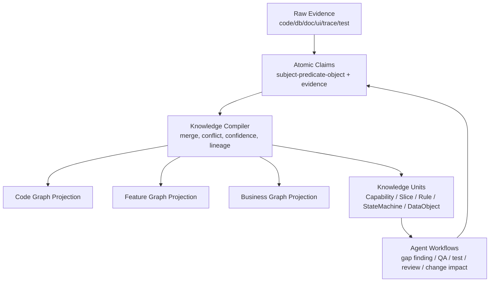
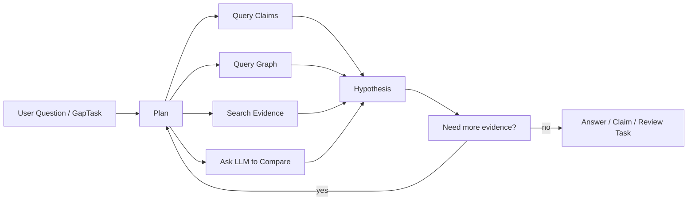

# LegacyGraph 三类图谱与 LLM 深层升级方案

> 日期：2026-07-02  
> 口径：以当前代码实现为准，结合现有 `/doc` 方案文档复核。  
> 核心判断：当前问题不是“图谱种类不够”，而是三类图谱仍主要是扫描结果的投影，缺少可推理的知识层；LLM 主要承担 JSON 抽取/生成，没有成为发现缺口、提出假设、规划补证、反证校准的 Agent 工作流。

## 1. 当前实现的真实边界

当前代码已经有不少工程化底座，不能再简单说“没有 LLM”或“没有三类图谱”：

- `ProjectScanner.runScanBody` 已串起自动发现、Adapter 扫描、数据库扫描、图谱构建和 AI 编排，但仍是一个很宽的扫描主流程（`backend/src/main/java/io/github/legacygraph/task/ProjectScanner.java:158`）。
- `AiScanOrchestrator` 已执行文档抽取、代码事实抽取、功能映射、测试生成和审核准备，但主线是“扫描后补一轮 AI 结果”（`backend/src/main/java/io/github/legacygraph/task/AiScanOrchestrator.java:51`）。
- `DocUnderstandingAgent.extractBusinessFacts`、`CodeFactAgent.extractFacts` 都是单次模板调用，输入一段内容，输出结构化 JSON（`DocUnderstandingAgent.java:113`、`CodeFactAgent.java:30`）。
- `FeatureSliceBuilder` 已能从 `Feature -> Page -> ApiEndpoint -> Method -> SqlStatement -> Table -> Permission` 固定路径构造切片，但仍是固定层级投影，不是可变的业务知识单元（`FeatureSliceBuilder.java:88`）。
- `QaAgent.answer` 是向量召回、相似节点、一跳邻域、LLM 生成回答的组合；它不是查询规划器，也不会主动补证或追问（`QaAgent.java:49`）。
- `GraphMergeService.findMergeCandidates` 已有 blocking 和评分，但仍主要围绕名称/邻域/证据分做候选裁决（`GraphMergeService.java:85`）。
- `LlmGateway.callWithTemplate` 已有模板、脱敏、审计、缓存、自修复和 AgentRun 记录，但大量 Agent 仍使用默认 `callWithTemplate`，证据目录没有成为所有 Agent 的硬接口（`LlmGateway.java:104`）。

所以，现阶段的差距不在“能不能生成节点和边”，而在“生成出来的东西是不是可解释、可追问、可验证、可演化的知识”。

## 2. 主要差距

### 2.1 三类图谱还是扫描投影，不是知识模型

代码图谱、功能图谱、业务图谱现在更像三类来源的扫描结果：

- 代码图谱偏结构化抽取：Controller、Service、Mapper、SQL、Table、Field。
- 功能图谱偏路径拼接：Page、API、Method、SQL、Table。
- 业务图谱偏文档/代码片段抽取：BusinessDomain、BusinessProcess、Feature、BusinessObject、Rule。

这些节点之间有边，但缺少一个更高层的知识对象来表达：

- 这个功能属于哪个业务能力？
- 它有哪些入口：页面、接口、定时任务、消息消费者、批处理？
- 它读写哪些核心业务对象？
- 哪些规则来自文档，哪些来自代码判断，哪些来自数据库约束？
- 哪条边是已证实、待证实、冲突、过期、运行时未观测？
- 哪些缺口是下一轮扫描/LLM/人工审核应该优先补的？

目前 Feature Slice 只覆盖一条常见 Web 链路，遇到消息队列、定时任务、后端内部能力、无前端接口、共享服务、跨系统调用时会变浅。

### 2.2 LLM 是模板调用，不是研究型 Agent

当前 Prompt 基本形态是：

- 给文档，抽业务事实。
- 给代码，抽业务事实。
- 给页面/API/文档，做功能映射。
- 给候选节点，判断合并。
- 给上下文，回答问题。

这有用，但 LLM 的作用停留在“把文本变成 JSON”或“按已有上下文写答案”。更深的作用应该是：

- 发现当前图谱缺什么。
- 判断缺口需要什么证据。
- 选择下一步查询代码图、数据库、文档、运行时 trace 还是测试结果。
- 形成候选假设，并给出支持证据和反证证据。
- 把无法确认的问题沉淀成审核任务或补扫任务。
- 在多次迭代后更新知识单元，而不是一次 prompt 就结束。

### 2.3 置信度模型偏弱

当前置信度常来自 LLM 自报、固定覆盖率、规则评分或测试回写加减分。缺少统一的证据评分模型：

- 代码/数据库/运行时/测试/文档/AI 推断的权重不同。
- 支持证据和反证证据没有统一记录。
- 同一事实跨来源一致时应提升置信度，来源冲突时应进入冲突集。
- 旧证据、弱证据、AI-only 证据需要明确降权。

没有这个模型，三类图谱会越来越大，但不一定越来越可信。

### 2.4 QA 和 RAG 还不够“图谱化”

`QaAgent` 当前是“向量召回 + 相似节点 + 一跳邻域 + LLM”。这对简单问答够用，但对架构分析类问题不够：

- “修改订单状态影响哪些页面和表？”
- “哪个功能只有文档，没有代码实现？”
- “哪些接口写了表但没有测试覆盖？”
- “这个业务对象在文档中叫 A，在数据库中叫 B，是不是同一个？”

这些问题需要查询计划、多跳图遍历、路径解释、冲突处理、证据排序，而不是只把召回内容塞进上下文。

## 3. 更深的目标：证据中心知识编译器

建议把 LegacyGraph 的目标从“三类图谱扫描器”升级为：

> 面向遗留系统的证据中心知识编译器：把代码、数据库、文档、运行时、测试和人工审核编译为可追溯、可反证、可问答、可验证的系统知识。

核心不是再加一类图谱，而是新增一层 **Knowledge Claim**，让所有来源先表达为可审计的原子断言，再由编译器构造三类图谱和更高层知识单元。



这会把现在“扫描直接生成图节点/边”的路径改成：

1. Extractor 和 Agent 都先产出 Claim。
2. Claim 带证据、来源、状态、支持/反证、置信度。
3. Knowledge Compiler 负责合并、冲突检测、置信度计算、投影建图。
4. 三类图谱只是 Claim 的不同投影，不再是三个相互独立的事实来源。

## 4. 建议新增的核心模块

### 4.1 KnowledgeClaimStore

新增统一断言模型，建议字段：

```text
claim_id
project_id
version_id
subject_type / subject_key
predicate
object_type / object_key / object_value
qualifiers              # method/path/sql/hash/role/status/env 等限定
evidence_ids
supporting_claim_ids
contradicting_claim_ids
source_type             # CODE / DB / DOC / RUNTIME / TEST / AI
extractor               # JavaControllerExtractor / DocUnderstandingAgent / TraceAligner
confidence
status                  # CONFIRMED / PENDING_CONFIRM / CONFLICTED / REJECTED / STALE
lineage                 # 由哪些 claim 合并或派生
created_at / updated_at
```

示例 Claim：

```text
ApiEndpoint(POST /orders) HANDLED_BY Method(OrderController#create)
Method(OrderService#create) WRITES Table(t_order)
Feature(订单创建) EXPOSED_BY Page(/orders/new)
BusinessObject(订单) MATERIALIZED_AS Table(t_order)
BusinessRule(订单金额必须大于0) ENFORCED_BY Method(OrderService#validateAmount)
Status(订单:待支付) TRANSITIONS_TO Status(订单:已支付) WHEN 支付成功
```

这样 LLM 输出不再直接变成最终图谱，而是变成带证据的候选 Claim。

### 4.2 KnowledgeCompiler

负责把 Claim 编译成图谱节点、边和知识单元：

- 去重：同义词、别名、表名/实体名、页面/功能名归一。
- 合并：多来源 Claim 合并为一条高置信事实。
- 冲突：同一 subject/predicate 出现互斥 object 时生成 conflict set。
- 降权：AI-only、文档旧版本、无证据、低质量 evidence 降权。
- 升权：代码 + DB + runtime + test 多源一致时升权。
- 投影：输出代码图谱、功能图谱、业务图谱和 Feature Slice。

这比继续在 `BusinessGraphBuilder`、`FrontendGraphBuilder`、`GraphBuilder` 里直接写节点更深，因为“事实如何成立”集中到了一个模块。

### 4.3 DomainOntologyAgent

LLM 最应该先做的不是抽节点，而是归纳领域语言：

- 从文档标题、菜单、Controller 名、Service 名、表名、字段名、枚举值中抽取候选业务词。
- 建立同义词：订单 / order / t_order / 交易单。
- 建立上下位关系：订单管理包含订单创建、订单取消、订单审核。
- 标记禁止合并：客户和用户、订单和订单明细、角色和权限。
- 输出待确认问题：例如“合同台账”和“合同主表”是否同一业务对象？

产物应保存为 `DomainOntology`，供图谱合并、Feature Slice、QA、测试生成共同使用。

### 4.4 GapFinderAgent

新增“缺口发现”而不是只做“结果生成”：

```text
输入：当前 Claim 图谱 + 图谱质量指标 + 业务本体
输出：GapTask
```

典型 GapTask：

- `doc_only_feature`：文档有功能，未找到页面/API/任务入口。
- `code_only_feature`：代码有业务动作，文档没有描述。
- `api_without_data_effect`：接口没有读写表路径。
- `table_without_owner`：核心表没有业务对象映射。
- `rule_without_enforcement`：文档规则找不到代码判断。
- `status_without_transition`：状态枚举存在，但缺少状态流转边。
- `runtime_only_path`：运行时出现路径，静态扫描没有。
- `test_failed_claim`：测试失败反证了某条 Claim。

GapFinderAgent 的价值在于让 LLM 参与“下一步查什么”，而不是只对已有材料做一次总结。

### 4.5 GraphInvestigationAgent

把 LLM 变成多步调查器：



它应该能调用受控工具，而不是只接收一段上下文：

- Claim 查询。
- Neo4j 路径查询。
- 文档/代码片段检索。
- SQL AST / Java AST / Vue AST 查询。
- trace/test 结果查询。
- 证据卡片生成。

最终输出必须包含：

- 假设。
- 支持证据。
- 反证证据。
- 缺失证据。
- 建议动作：确认、驳回、补扫、生成测试、人工审核。

### 4.6 FeatureSliceSynthesizer

替代固定层级的 `FeatureSliceBuilder`，从 Claim 图谱动态合成切片。

一个 Feature Slice 不应只支持 Web 链路，而应支持多入口：

```text
Feature
  entrances:
    - Page/Button
    - ApiEndpoint
    - ScheduledJob
    - MessageConsumer
    - BatchTask
    - ExternalCallback
  implementation:
    - Controller/Handler
    - Service/DomainMethod
    - Mapper/Repository
    - SQL
  data:
    - BusinessObject
    - Table/Column
    - Status/Enum
  rules:
    - BusinessRule
    - Permission
    - Validation
  verification:
    - RuntimeTrace
    - TestCase
    - TestResult
  gaps:
    - MissingEdge
    - ConflictingClaim
    - LowConfidenceEvidence
```

这样功能图谱才会成为业务图谱与代码图谱之间的核心接口。

## 5. 三类图谱分别怎么升级

### 5.1 代码图谱：从结构抽取升级为程序语义图谱

当前代码图谱主要是静态结构。建议补强：

- Java AST/LSP 级调用链：Controller -> Service -> Repository/Mapper。
- 数据流：DTO 字段 -> 校验逻辑 -> SQL 参数 -> 表字段。
- 配置流：路由前缀、权限注解、事务、定时任务、消息 topic。
- SQL AST：动态 SQL 分支、where 条件、写入字段、join 关系。
- 框架语义：Spring Event、MQ Listener、Scheduler、AOP、Feign/RestTemplate 调用。

LLM 在代码图谱中的角色：

- 给方法/类命名业务动作。
- 解释复杂规则。
- 识别代码中的隐含业务对象。
- 提出可能缺失的边，但不直接确认。

### 5.2 功能图谱：从 Page/API 映射升级为能力切片

当前功能图谱偏页面/API。建议把 Feature 定义为“用户或系统可触发的业务能力”，入口可以是页面、接口、任务、消息或外部回调。

新增能力：

- `Capability`：业务能力，介于业务流程和技术实现之间。
- `Entrance`：触发入口，不限于 Page。
- `Effect`：读写哪些业务对象和表。
- `Guard`：权限、规则、前置条件。
- `Scenario`：验证该能力的场景。
- `Coverage`：静态覆盖、运行时覆盖、测试覆盖、文档覆盖。

LLM 在功能图谱中的角色：

- 根据菜单、接口、方法名、文档归纳 Capability。
- 对齐不同命名的入口与业务动作。
- 发现缺失入口或孤立 API。
- 生成复核问题，而不是直接写 confirmed 边。

### 5.3 业务图谱：从文档抽取升级为领域模型

业务图谱不应只来自文档。建议从多来源归纳：

- 文档：业务流程、规则、角色。
- 代码：真实执行的业务动作和规则判断。
- 数据库：核心对象、状态字段、枚举、主从表关系。
- 运行时：真实调用路径、热点能力、错误路径。
- 测试：已验证场景、失败场景。
- 人工审核：最终业务口径。

业务图谱应显式建模：

- `BusinessCapability`
- `BusinessObject`
- `BusinessRule`
- `StateMachine`
- `BusinessEvent`
- `Actor/Role`
- `Policy/Permission`
- `ProcessStep`

LLM 的主要价值是归纳和对齐，而不是单独创造事实。

## 6. LLM 工作流升级

### 6.1 从 Prompt 调用升级为 AgentRun 合约

每个高价值 Agent 都应从默认 `callWithTemplate` 迁移到强合约：

```text
AgentEnvelope
  input
  requiredEvidenceTypes
  allowedTools
  maxSteps
  outputSchema
  confidencePolicy
  reviewPolicy
```

示例策略：

- `DocUnderstandingAgent`：必须返回 evidence excerpt；没有 evidence 的事实只能 PENDING。
- `CodeFactAgent`：必须引用行号；无法定位行号的 Claim 降权。
- `FeatureMappingAgent`：必须同时有 Feature 证据和技术入口证据。
- `GraphMergeAgent`：必须列出 positiveEvidenceIds 和 negativeEvidenceIds。
- `QaAgent`：必须先生成查询计划，再回答。

### 6.2 引入“调查循环”

推荐每个 AgentRun 支持最多 3 步：

1. `PLAN`：列出需要验证的子问题。
2. `RETRIEVE`：查询 Claim、图谱、证据、trace、test。
3. `DECIDE`：输出 Claim、答案、缺口或审核任务。

如果证据不足，不要强答，输出 GapTask。

### 6.3 引入反证机制

每条 AI 结论必须允许被反证：

```text
claim: Feature(订单支付) IMPLEMENTED_BY ApiEndpoint(POST /pay)
support: doc chunk, page call, controller route
contradiction: runtime never observed, test 404, no service handler
status: CONFLICTED
next_action: review or generate verification test
```

这会比单纯调高/调低 confidence 更可靠。

## 7. 评测体系

没有评测，LLM 会看起来“能生成很多东西”，但实际不一定更准。建议新增 golden set：

### 7.1 Golden Project

选 2-3 个代表项目：

- 标准 Java + Vue + MyBatis。
- 无前端的后端服务。
- 有消息/定时任务/复杂状态流转的项目。

为每个项目人工标注：

- 核心业务对象。
- 10-20 个业务能力。
- 每个能力的入口、实现、表、规则、测试。
- 典型冲突与缺口。

### 7.2 指标

三类图谱指标：

- `claim_precision`：自动 Claim 被人工确认的比例。
- `claim_recall`：golden fact 被发现的比例。
- `slice_completeness`：Feature Slice 覆盖入口/实现/数据/规则/验证的比例。
- `cross_source_support_rate`：至少两类来源支持的知识单元比例。
- `ai_only_confirmed_rate`：AI-only 事实被 confirmed 的比例，应接近 0。
- `conflict_detection_rate`：已知冲突被识别的比例。

LLM 指标：

- `evidence_required_pass_rate`：输出是否都带有效证据。
- `invalid_json_repair_rate`：结构化输出自修复比例。
- `hallucination_rate`：答案引用不存在证据的比例。
- `gap_task_resolution_rate`：GapTask 被后续扫描/审核/测试关闭的比例。
- `qa_answer_supported_rate`：QA 答案中每个关键结论都有证据支持的比例。

## 8. 分阶段落地路线

### Phase 0：先建立现状基线

目标：避免继续“看起来生成更多，但质量不明”。

任务：

1. 对当前扫描结果生成质量报告：AI-only、无证据、孤立 Feature、doc-only、code-only、runtime-only。
2. 选一个真实项目做人工 golden set。
3. 固定首批评测 SQL/Cypher 和断言。

验收：

- 能回答“当前三类图谱缺在哪里”，而不是只看节点数。

### Phase 1：引入 KnowledgeClaim

目标：让所有来源先进入 Claim 层。

任务：

1. 新增 `KnowledgeClaim` 实体、Repository、索引。
2. `ExtractionAdapter` 输出 `ExtractionResult` 时附带 claims。
3. `DocUnderstandingAgent`、`CodeFactAgent` 输出转 Claim，不再直接等价为图节点。
4. `EvidenceGraphWriter` 或新 `KnowledgeCompiler` 从 Claim 编译图节点/边。

验收：

- 每条 AI 生成节点/边都能回溯到 Claim 和 Evidence。
- AI-only Claim 默认不能直接 confirmed。

### Phase 2：建立 DomainOntology 与 GapTask

目标：让图谱知道自己“不知道什么”。

任务：

1. 新增 `DomainOntologyAgent`，归纳业务词表、同义词、禁止合并规则。
2. 新增 `GapFinderAgent`，生成 doc-only、code-only、table-without-owner 等缺口任务。
3. 前端或报告展示 GapTask 队列。

验收：

- 扫描后不仅生成图谱，也生成缺口清单。
- 缺口能被补扫、人工审核、测试或运行时 trace 关闭。

### Phase 3：升级 Feature Slice

目标：让功能图谱成为能力切片，而非固定路径。

任务：

1. 新增 `FeatureSliceSynthesizer`，基于 Claim 遍历动态生成 slice。
2. 支持 Page/API/ScheduledJob/MessageConsumer/BatchTask 多入口。
3. Slice 记录入口、实现、数据、规则、验证、缺口。
4. `ScenarioDSLBuilder` 从 Slice 生成场景，不再用占位断言。

验收：

- 无前端项目也能生成 Feature Slice。
- 每个 Slice 都能展示缺失路径和证据来源。

### Phase 4：GraphRAG 查询规划器

目标：让 QA 能做图谱分析，而不只是上下文问答。

任务：

1. `QaAgent` 先生成查询计划：需要哪些 Claim、路径、证据、trace、测试。
2. 引入多跳路径查询和 source priority 排序。
3. 输出答案时按结论列证据，而不是只列 usedEvidence。
4. 证据不足时输出 GapTask 或追问。

验收：

- 能稳定回答影响分析、覆盖缺口、业务对象映射、规则实现位置等问题。
- QA 幻觉率进入评测指标。

### Phase 5：Agent 评测和工作台

目标：让 LLM 输出可持续变好。

任务：

1. 每个 AgentRun 记录 plan、retrieval、decision、evidenceIds、negativeEvidenceIds。
2. 增加 Agent golden set 测试。
3. 前端工作台支持 Evidence Card、Conflict Set、GapTask、Claim Review。
4. 报告输出“下一步最值得补证的 20 个缺口”。

验收：

- LLM 产物可回放、可评分、可比较。
- 人工审核不是散点确认，而是围绕 Claim/Gaps/Conflicts 工作。

## 9. 不建议继续投入的方向

1. 不建议继续只新增 Agent。没有 Claim、Gap、评测，新增 Agent 只会增加更多 PENDING 结果。
2. 不建议继续只扩大节点类型。节点类型越多，缺少统一 Claim 层时越难合并和解释。
3. 不建议让 LLM 直接写 confirmed 边。LLM 应输出候选 Claim、问题和解释。
4. 不建议把三类图谱拆成三套存储。应坚持统一 Claim + 多投影。
5. 不建议用节点数作为成功指标。必须看证据覆盖、跨源支持、冲突闭环、QA 幻觉率。

## 10. Top Recommendation

最先做 **KnowledgeClaim + GapFinderAgent**。

原因：

- `KnowledgeClaim` 解决“事实如何成立”的根问题。
- `GapFinderAgent` 解决“LLM 没起作用”的根问题，让 LLM 从结果生成器变成补证规划器。
- 有了 Claim 和 Gap，三类图谱会自然从扫描投影升级为知识投影；Feature Slice、QA、测试生成、图谱合并都能复用同一事实底座。

第一阶段不要追求大而全，可以先支持 8 类核心 Claim：

```text
HANDLED_BY
CALLS
READS
WRITES
EXPOSED_BY
IMPLEMENTS
MATERIALIZED_AS
ENFORCES_RULE
```

并先支持 6 类 Gap：

```text
doc_only_feature
code_only_feature
feature_without_entry
feature_without_data_effect
business_object_without_table
rule_without_enforcement
```

只要这两层跑通，LLM 的价值就会从“抽一点业务名词”变成“持续推动图谱变完整、变可信”。

---

## 11. 可执行实施计划

# 三类图谱与 LLM 深层升级 Implementation Plan

> **For agentic workers:** REQUIRED SUB-SKILL: Use superpowers:subagent-driven-development (recommended) or superpowers:executing-plans to implement this plan task-by-task. Steps use checkbox (`- [ ]`) syntax for tracking.

**Goal:** 先把 LegacyGraph 从“扫描结果投影”升级为“KnowledgeClaim 驱动的证据化知识层”，让 LLM 能发现缺口、规划补证、输出可反证的候选知识。

**Architecture:** 第一阶段不推翻现有 `GraphBuilder` / `BusinessGraphBuilder` / `FeatureSliceBuilder`，而是在 PostgreSQL 中新增 `KnowledgeClaim` 与 `GapTask`，由 `KnowledgeClaimService` 收集当前事实、证据、图谱节点和 AI 输出，再由 `KnowledgeCompiler` 逐步把高置信 Claim 编译回现有 Neo4j 图谱。`GapFinderService` 先用确定性规则产出缺口，随后由 `GapFinderAgent` 对缺口排序和补证建议做 LLM 增强。

**Tech Stack:** Spring Boot 4、Java 21、MyBatis-Plus、Flyway、PostgreSQL JSONB、Neo4jGraphDao、现有 `LlmGateway` / `AgentEnvelope` / `ReviewRecord` / `EvidenceGraphWriter`。

---

### 11.1 总体落地边界

第一轮只做最小闭环，避免再次出现“新增概念但主链路不消费”的双轨问题。

必须交付：

1. `KnowledgeClaim` 表、实体、Repository、Service。
2. `GapTask` 表、实体、Repository、Service。
3. 当前 `Fact` / `Evidence` / Neo4j 节点边到 `KnowledgeClaim` 的桥接。
4. `GapFinderService` 的 6 类确定性缺口。
5. `GapFinderAgent` 的 AgentEnvelope 调用与 Prompt 模板。
6. `ProjectScanner` / `AiScanOrchestrator` 扫描结束后触发 claim 编译和缺口生成。
7. 后端接口用于查询 Claim 和 Gap。
8. 单元测试、集成测试、架构门禁。

暂不交付：

1. 不替换全部 Builder。
2. 不重做前端工作台，只保留后端 API 和报告字段。
3. 不一次性改造所有 Agent，只改 `DocUnderstandingAgent`、`CodeFactAgent`、`FeatureMappingAgent` 的输出桥接路径。
4. 不做多步工具调用式 GraphInvestigationAgent，先把查询计划数据结构预留在 `AgentRun` metadata。

### 11.2 文件结构与职责

新增文件：

- `backend/src/main/resources/db/migration/V15__knowledge_claim_and_gap_task.sql`：创建 `lg_knowledge_claim`、`lg_gap_task`、索引和枚举约束。
- `backend/src/main/java/io/github/legacygraph/entity/KnowledgeClaim.java`：Claim 持久化实体。
- `backend/src/main/java/io/github/legacygraph/entity/GapTask.java`：缺口任务实体。
- `backend/src/main/java/io/github/legacygraph/repository/KnowledgeClaimRepository.java`：Claim 查询与幂等写入。
- `backend/src/main/java/io/github/legacygraph/repository/GapTaskRepository.java`：GapTask 查询与幂等写入。
- `backend/src/main/java/io/github/legacygraph/dto/claim/KnowledgeClaimDraft.java`：Extractor/Agent 写入前的内存 DTO。
- `backend/src/main/java/io/github/legacygraph/dto/claim/ClaimEvidenceRef.java`：Claim 关联证据引用 DTO。
- `backend/src/main/java/io/github/legacygraph/dto/gap/GapTaskView.java`：接口返回 DTO。
- `backend/src/main/java/io/github/legacygraph/service/KnowledgeClaimService.java`：Claim 幂等写入、Fact/节点/边桥接、状态计算。
- `backend/src/main/java/io/github/legacygraph/service/KnowledgeCompiler.java`：把 confirmed/high-confidence Claim 编译到现有图谱。
- `backend/src/main/java/io/github/legacygraph/service/GapFinderService.java`：确定性缺口扫描。
- `backend/src/main/java/io/github/legacygraph/agent/GapFinderAgent.java`：LLM 生成缺口解释、优先级和补证建议。
- `backend/src/main/java/io/github/legacygraph/controller/KnowledgeController.java`：`/knowledge/claims` 与 `/knowledge/gaps` 查询接口。
- `backend/src/main/resources/prompts/gap-finder.txt`：缺口解释 Prompt。
- `backend/src/test/java/io/github/legacygraph/service/KnowledgeClaimServiceTest.java`。
- `backend/src/test/java/io/github/legacygraph/service/GapFinderServiceTest.java`。
- `backend/src/test/java/io/github/legacygraph/agent/GapFinderAgentTest.java`。
- `backend/src/test/java/io/github/legacygraph/controller/KnowledgeControllerTest.java`。

修改文件：

- `backend/src/main/java/io/github/legacygraph/task/AiScanOrchestrator.java`：AI 编排结束后调用 `KnowledgeClaimService` 和 `GapFinderService`。
- `backend/src/main/java/io/github/legacygraph/controller/GraphQueryController.java`：图谱质量接口增加 claim/gap 摘要。
- `backend/src/main/java/io/github/legacygraph/service/ReportingService.java`：图谱质量报告增加 claim/gap 指标。
- `backend/src/main/java/io/github/legacygraph/agent/DocUnderstandingAgent.java`：保留旧方法，新增返回 Claim draft 的转换方法。
- `backend/src/main/java/io/github/legacygraph/agent/CodeFactAgent.java`：保留旧方法，新增返回 Claim draft 的转换方法。
- `backend/src/main/java/io/github/legacygraph/agent/FeatureMappingAgent.java`：把映射结果转为 Claim draft。
- `backend/src/main/java/io/github/legacygraph/llm/PromptTemplateLoader.java`：确认文件模板和 DB 模板均可加载 `gap-finder`。
- `backend/src/test/java/io/github/legacygraph/architecture/LayeredArchitectureTest.java`：增加 controller 只能依赖 service，Agent 不能直接写 Repository 的规则。

### Task 1：创建 KnowledgeClaim 与 GapTask 数据模型

**Files:**

- Create: `backend/src/main/resources/db/migration/V15__knowledge_claim_and_gap_task.sql`
- Create: `backend/src/main/java/io/github/legacygraph/entity/KnowledgeClaim.java`
- Create: `backend/src/main/java/io/github/legacygraph/entity/GapTask.java`
- Create: `backend/src/main/java/io/github/legacygraph/repository/KnowledgeClaimRepository.java`
- Create: `backend/src/main/java/io/github/legacygraph/repository/GapTaskRepository.java`
- Test: `backend/src/test/java/io/github/legacygraph/service/KnowledgeClaimServiceTest.java`

- [ ] **Step 1: 编写 Flyway 迁移**

创建 `V15__knowledge_claim_and_gap_task.sql`：

```sql
CREATE TABLE IF NOT EXISTS lg_knowledge_claim (
    id UUID PRIMARY KEY,
    project_id UUID NOT NULL REFERENCES lg_project(id),
    version_id UUID NOT NULL REFERENCES lg_scan_version(id),
    subject_type VARCHAR(64) NOT NULL,
    subject_key VARCHAR(512) NOT NULL,
    predicate VARCHAR(64) NOT NULL,
    object_type VARCHAR(64),
    object_key VARCHAR(512),
    object_value TEXT,
    qualifiers JSONB NOT NULL DEFAULT '{}'::JSONB,
    evidence_ids JSONB NOT NULL DEFAULT '[]'::JSONB,
    supporting_claim_ids JSONB NOT NULL DEFAULT '[]'::JSONB,
    contradicting_claim_ids JSONB NOT NULL DEFAULT '[]'::JSONB,
    source_type VARCHAR(64) NOT NULL,
    extractor VARCHAR(128),
    confidence NUMERIC(5,4) NOT NULL DEFAULT 0.5000,
    status VARCHAR(32) NOT NULL DEFAULT 'PENDING_CONFIRM',
    lineage JSONB NOT NULL DEFAULT '[]'::JSONB,
    compiled_node_id UUID,
    compiled_edge_id UUID,
    compile_status VARCHAR(32) NOT NULL DEFAULT 'NEW',
    deleted SMALLINT NOT NULL DEFAULT 0,
    created_at TIMESTAMP NOT NULL DEFAULT CURRENT_TIMESTAMP,
    updated_at TIMESTAMP NOT NULL DEFAULT CURRENT_TIMESTAMP,
    UNIQUE(project_id, version_id, subject_type, subject_key, predicate, object_type, object_key)
);

CREATE INDEX IF NOT EXISTS idx_lg_knowledge_claim_project_version
    ON lg_knowledge_claim(project_id, version_id);
CREATE INDEX IF NOT EXISTS idx_lg_knowledge_claim_subject
    ON lg_knowledge_claim(project_id, version_id, subject_type, subject_key);
CREATE INDEX IF NOT EXISTS idx_lg_knowledge_claim_predicate
    ON lg_knowledge_claim(project_id, version_id, predicate);
CREATE INDEX IF NOT EXISTS idx_lg_knowledge_claim_status
    ON lg_knowledge_claim(project_id, version_id, status);
CREATE INDEX IF NOT EXISTS idx_lg_knowledge_claim_qualifiers_gin
    ON lg_knowledge_claim USING GIN(qualifiers);
CREATE INDEX IF NOT EXISTS idx_lg_knowledge_claim_evidence_gin
    ON lg_knowledge_claim USING GIN(evidence_ids);

COMMENT ON TABLE lg_knowledge_claim IS '证据化知识断言表';

CREATE TABLE IF NOT EXISTS lg_gap_task (
    id UUID PRIMARY KEY,
    project_id UUID NOT NULL REFERENCES lg_project(id),
    version_id UUID NOT NULL REFERENCES lg_scan_version(id),
    gap_type VARCHAR(64) NOT NULL,
    gap_key VARCHAR(512) NOT NULL,
    title VARCHAR(512) NOT NULL,
    description TEXT,
    severity VARCHAR(32) NOT NULL DEFAULT 'MEDIUM',
    status VARCHAR(32) NOT NULL DEFAULT 'OPEN',
    subject_type VARCHAR(64),
    subject_key VARCHAR(512),
    related_claim_ids JSONB NOT NULL DEFAULT '[]'::JSONB,
    related_node_ids JSONB NOT NULL DEFAULT '[]'::JSONB,
    evidence_ids JSONB NOT NULL DEFAULT '[]'::JSONB,
    suggested_action TEXT,
    agent_run_id BIGINT,
    priority_score NUMERIC(5,4) NOT NULL DEFAULT 0.5000,
    deleted SMALLINT NOT NULL DEFAULT 0,
    created_at TIMESTAMP NOT NULL DEFAULT CURRENT_TIMESTAMP,
    updated_at TIMESTAMP NOT NULL DEFAULT CURRENT_TIMESTAMP,
    UNIQUE(project_id, version_id, gap_type, gap_key)
);

CREATE INDEX IF NOT EXISTS idx_lg_gap_task_project_version
    ON lg_gap_task(project_id, version_id);
CREATE INDEX IF NOT EXISTS idx_lg_gap_task_type
    ON lg_gap_task(project_id, version_id, gap_type);
CREATE INDEX IF NOT EXISTS idx_lg_gap_task_status
    ON lg_gap_task(project_id, version_id, status);
CREATE INDEX IF NOT EXISTS idx_lg_gap_task_claims_gin
    ON lg_gap_task USING GIN(related_claim_ids);

COMMENT ON TABLE lg_gap_task IS '知识图谱缺口任务表';
```

- [ ] **Step 2: 新增 `KnowledgeClaim` 实体**

实体字段与数据库一一对应，`qualifiers/evidenceIds/supportingClaimIds/contradictingClaimIds/lineage` 用 `String` 承载 JSONB，沿用现有实体风格。

关键字段必须包含：

```java
@TableName("lg_knowledge_claim")
public class KnowledgeClaim {
    @TableId(type = IdType.INPUT)
    private String id;
    private String projectId;
    private String versionId;
    private String subjectType;
    private String subjectKey;
    private String predicate;
    private String objectType;
    private String objectKey;
    private String objectValue;
    private String qualifiers;
    private String evidenceIds;
    private String supportingClaimIds;
    private String contradictingClaimIds;
    private String sourceType;
    private String extractor;
    private BigDecimal confidence;
    private String status;
    private String lineage;
    private String compiledNodeId;
    private String compiledEdgeId;
    private String compileStatus;
    private Integer deleted;
    private LocalDateTime createdAt;
    private LocalDateTime updatedAt;
}
```

- [ ] **Step 3: 新增 `GapTask` 实体**

关键字段必须包含：

```java
@TableName("lg_gap_task")
public class GapTask {
    @TableId(type = IdType.INPUT)
    private String id;
    private String projectId;
    private String versionId;
    private String gapType;
    private String gapKey;
    private String title;
    private String description;
    private String severity;
    private String status;
    private String subjectType;
    private String subjectKey;
    private String relatedClaimIds;
    private String relatedNodeIds;
    private String evidenceIds;
    private String suggestedAction;
    private Long agentRunId;
    private BigDecimal priorityScore;
    private Integer deleted;
    private LocalDateTime createdAt;
    private LocalDateTime updatedAt;
}
```

- [ ] **Step 4: 新增 Repository**

`KnowledgeClaimRepository`：

```java
@Mapper
public interface KnowledgeClaimRepository extends BaseMapper<KnowledgeClaim> {
}
```

`GapTaskRepository`：

```java
@Mapper
public interface GapTaskRepository extends BaseMapper<GapTask> {
}
```

- [ ] **Step 5: 执行编译校验**

Run:

```bash
cd backend
mvn -q -DskipTests compile
```

Expected:

```text
BUILD SUCCESS
```

### Task 2：实现 KnowledgeClaimService 的幂等写入

**Files:**

- Create: `backend/src/main/java/io/github/legacygraph/dto/claim/KnowledgeClaimDraft.java`
- Create: `backend/src/main/java/io/github/legacygraph/dto/claim/ClaimEvidenceRef.java`
- Create: `backend/src/main/java/io/github/legacygraph/service/KnowledgeClaimService.java`
- Test: `backend/src/test/java/io/github/legacygraph/service/KnowledgeClaimServiceTest.java`

- [ ] **Step 1: 新增 Claim draft DTO**

`KnowledgeClaimDraft` 必须提供 Builder，字段为：

```java
@Data
@Builder
public class KnowledgeClaimDraft {
    private String projectId;
    private String versionId;
    private String subjectType;
    private String subjectKey;
    private String predicate;
    private String objectType;
    private String objectKey;
    private String objectValue;
    private Map<String, Object> qualifiers;
    private List<String> evidenceIds;
    private String sourceType;
    private String extractor;
    private BigDecimal confidence;
}
```

`ClaimEvidenceRef` 字段为：

```java
@Data
@Builder
public class ClaimEvidenceRef {
    private String evidenceId;
    private String sourceType;
    private String sourceUri;
    private Integer lineStart;
    private Integer lineEnd;
    private String excerpt;
}
```

- [ ] **Step 2: 写失败测试：重复 draft 不重复插入**

在 `KnowledgeClaimServiceTest` 中新增测试：

```java
@Test
void upsertDraft_isIdempotentByClaimKey() {
    KnowledgeClaimDraft draft = KnowledgeClaimDraft.builder()
            .projectId(projectId)
            .versionId(versionId)
            .subjectType("Feature")
            .subjectKey("feature:订单创建")
            .predicate("IMPLEMENTS")
            .objectType("ApiEndpoint")
            .objectKey("POST /orders")
            .sourceType("DOC_AI")
            .extractor("DocUnderstandingAgent")
            .confidence(BigDecimal.valueOf(0.72))
            .evidenceIds(List.of("ev-1"))
            .build();

    KnowledgeClaim first = service.upsertDraft(draft);
    KnowledgeClaim second = service.upsertDraft(draft);

    assertThat(first.getId()).isEqualTo(second.getId());
    assertThat(repository.selectList(new LambdaQueryWrapper<KnowledgeClaim>()
            .eq(KnowledgeClaim::getProjectId, projectId)
            .eq(KnowledgeClaim::getVersionId, versionId))).hasSize(1);
}
```

- [ ] **Step 3: 实现幂等写入**

`KnowledgeClaimService.upsertDraft` 行为：

1. 按 `(projectId, versionId, subjectType, subjectKey, predicate, objectType, objectKey)` 查询现有 Claim。
2. 不存在则插入，默认 `status=PENDING_CONFIRM`，`compileStatus=NEW`。
3. 存在则合并 evidenceIds，confidence 取 `max(existing, incoming)`，`updatedAt` 更新。
4. `sourceType` 为 `CODE`、`DB`、`RUNTIME`、`TEST` 且 confidence >= 0.85 时可设为 `CONFIRMED`。
5. `sourceType` 为 `DOC_AI`、`CODE_AI`、`AI_INFERENCE` 时必须保持 `PENDING_CONFIRM`，除非后续有非 AI supporting claim。

- [ ] **Step 4: 补充状态计算测试**

新增两个测试：

```java
@Test
void upsertDraft_aiSourceStaysPendingEvenWithHighConfidence() {
    KnowledgeClaim claim = service.upsertDraft(KnowledgeClaimDraft.builder()
            .projectId(projectId).versionId(versionId)
            .subjectType("Feature").subjectKey("feature:订单审核")
            .predicate("IMPLEMENTS")
            .objectType("ApiEndpoint").objectKey("POST /orders/audit")
            .sourceType("DOC_AI")
            .confidence(BigDecimal.valueOf(0.95))
            .build());

    assertThat(claim.getStatus()).isEqualTo("PENDING_CONFIRM");
}

@Test
void upsertDraft_codeSourceCanBeConfirmedWhenConfidenceIsHigh() {
    KnowledgeClaim claim = service.upsertDraft(KnowledgeClaimDraft.builder()
            .projectId(projectId).versionId(versionId)
            .subjectType("ApiEndpoint").subjectKey("POST /orders")
            .predicate("HANDLED_BY")
            .objectType("Method").objectKey("OrderController#create")
            .sourceType("CODE")
            .confidence(BigDecimal.valueOf(0.91))
            .build());

    assertThat(claim.getStatus()).isEqualTo("CONFIRMED");
}
```

- [ ] **Step 5: 运行测试**

Run:

```bash
cd backend
mvn -q -Dtest=KnowledgeClaimServiceTest test
```

Expected:

```text
BUILD SUCCESS
```

### Task 3：把现有 Fact / AI 输出桥接为 Claim

**Files:**

- Modify: `backend/src/main/java/io/github/legacygraph/service/KnowledgeClaimService.java`
- Modify: `backend/src/main/java/io/github/legacygraph/agent/DocUnderstandingAgent.java`
- Modify: `backend/src/main/java/io/github/legacygraph/agent/CodeFactAgent.java`
- Modify: `backend/src/main/java/io/github/legacygraph/agent/FeatureMappingAgent.java`
- Modify: `backend/src/main/java/io/github/legacygraph/task/AiScanOrchestrator.java`
- Test: `backend/src/test/java/io/github/legacygraph/service/KnowledgeClaimServiceTest.java`
- Test: `backend/src/test/java/io/github/legacygraph/task/AiScanOrchestratorTest.java`

- [ ] **Step 1: 在 Service 中新增 `upsertFromFact`**

签名：

```java
public List<KnowledgeClaim> upsertFromFact(Fact fact)
```

映射规则：

```text
factType=FEATURE 或 CODE_FEATURE
  subjectType=Feature
  subjectKey=fact.factKey
  predicate=DESCRIBED_BY
  objectType=Evidence
  objectKey=fact.id

factType=BUSINESS_OBJECT
  subjectType=BusinessObject
  subjectKey=fact.factKey
  predicate=MENTIONED_IN
  objectType=Evidence
  objectKey=fact.id

factType=BUSINESS_RULE
  subjectType=BusinessRule
  subjectKey=fact.factKey
  predicate=MENTIONED_IN
  objectType=Evidence
  objectKey=fact.id

factType=STATUS_TRANSITION
  subjectType=StateTransition
  subjectKey=fact.factKey
  predicate=MENTIONED_IN
  objectType=Evidence
  objectKey=fact.id
```

- [ ] **Step 2: 在 Agent 中新增转换方法**

`DocUnderstandingAgent` 新增：

```java
public List<KnowledgeClaimDraft> toClaimDrafts(
        String projectId,
        String versionId,
        BusinessFactExtraction extraction,
        String sourcePath)
```

`CodeFactAgent` 新增：

```java
public List<KnowledgeClaimDraft> toClaimDrafts(
        String projectId,
        String versionId,
        FactExtractionResult result,
        String sourcePath)
```

`FeatureMappingAgent` 新增：

```java
public List<KnowledgeClaimDraft> toClaimDrafts(
        String projectId,
        String versionId,
        MappingResult result)
```

转换示例：

```text
FeatureMappingAgent.Mapping
  Feature(mapping.businessAction) EXPOSED_BY Page(mapping.pageKey)
  Feature(mapping.businessAction) IMPLEMENTS ApiEndpoint(mapping.apiKey)
  ApiEndpoint(mapping.apiKey) REQUIRES_PERMISSION Permission(mapping.permissionKey)
```

- [ ] **Step 3: 在 `AiScanOrchestrator` 持久化 Claim**

构造函数注入：

```java
private final KnowledgeClaimService knowledgeClaimService;
```

在以下位置调用：

1. `runDocExtract` 完成 `docUnderstandingAgent.extractBusinessFacts` 后，将 extraction 转 Claim。
2. `persistAndBuildCodeFacts` 完成 `codeFactAgent.extractFacts` 后，将 result 转 Claim。
3. `persistFeatureMappings` 完成边和审核记录后，将 mapping result 转 Claim。

每个调用失败时只记录 warn，不中断扫描：

```java
try {
    knowledgeClaimService.upsertDrafts(drafts);
} catch (Exception e) {
    log.warn("Knowledge claim upsert failed: projectId={}, versionId={}, err={}",
            projectId, versionId, e.getMessage());
}
```

- [ ] **Step 4: 写编排测试**

在 `AiScanOrchestratorTest` 中断言：

```java
verify(knowledgeClaimService, atLeastOnce()).upsertDrafts(anyList());
```

并断言 AI 编排失败不影响扫描任务完成。

- [ ] **Step 5: 运行测试**

Run:

```bash
cd backend
mvn -q -Dtest=KnowledgeClaimServiceTest,AiScanOrchestratorTest test
```

Expected:

```text
BUILD SUCCESS
```

### Task 4：实现 GapFinderService 的 6 类确定性缺口

**Files:**

- Create: `backend/src/main/java/io/github/legacygraph/service/GapFinderService.java`
- Create: `backend/src/main/java/io/github/legacygraph/dto/gap/GapTaskView.java`
- Modify: `backend/src/main/java/io/github/legacygraph/repository/GapTaskRepository.java`
- Test: `backend/src/test/java/io/github/legacygraph/service/GapFinderServiceTest.java`

- [ ] **Step 1: 定义缺口枚举常量**

在 `GapFinderService` 内使用常量：

```java
private static final String DOC_ONLY_FEATURE = "doc_only_feature";
private static final String CODE_ONLY_FEATURE = "code_only_feature";
private static final String FEATURE_WITHOUT_ENTRY = "feature_without_entry";
private static final String FEATURE_WITHOUT_DATA_EFFECT = "feature_without_data_effect";
private static final String BUSINESS_OBJECT_WITHOUT_TABLE = "business_object_without_table";
private static final String RULE_WITHOUT_ENFORCEMENT = "rule_without_enforcement";
```

- [ ] **Step 2: 实现入口方法**

签名：

```java
public GapScanResult scanGaps(String projectId, String versionId)
```

返回 DTO：

```java
@Data
@Builder
public static class GapScanResult {
    private int created;
    private int reopened;
    private int unchanged;
    private Map<String, Integer> byType;
}
```

- [ ] **Step 3: 缺口规则**

规则必须直接基于 Claim 查询：

```text
doc_only_feature:
  Feature 有 sourceType=DOC_AI 的 DESCRIBED_BY / MENTIONED_IN Claim，
  但没有 EXPOSED_BY、IMPLEMENTS、HANDLED_BY 相关 Claim。

code_only_feature:
  Feature 有 sourceType=CODE_AI 或 CODE 的 Claim，
  但没有 DOC_AI/DOC 支持 Claim。

feature_without_entry:
  Feature 没有 EXPOSED_BY Page、ApiEndpoint、ScheduledJob、MessageConsumer。

feature_without_data_effect:
  Feature 没有到 READS/WRITES/MATERIALIZED_AS 路径的 Claim。

business_object_without_table:
  BusinessObject 没有 MATERIALIZED_AS Table Claim。

rule_without_enforcement:
  BusinessRule 没有 ENFORCED_BY Method/SqlStatement Claim。
```

- [ ] **Step 4: 幂等写入 GapTask**

`upsertGap` 规则：

1. 按 `(projectId, versionId, gapType, gapKey)` 查找。
2. 不存在插入 `OPEN`。
3. 存在且 `status=RESOLVED`，如果缺口仍存在则改为 `REOPENED`。
4. 存在且 `OPEN/REOPENED`，只更新 description、relatedClaimIds、updatedAt。

- [ ] **Step 5: 写服务测试**

至少覆盖：

```java
@Test
void scanGaps_createsDocOnlyFeatureGap() { ... }

@Test
void scanGaps_doesNotCreateDocOnlyFeatureWhenFeatureHasImplementation() { ... }

@Test
void scanGaps_reopensResolvedGapWhenStillPresent() { ... }
```

- [ ] **Step 6: 运行测试**

Run:

```bash
cd backend
mvn -q -Dtest=GapFinderServiceTest test
```

Expected:

```text
BUILD SUCCESS
```

### Task 5：实现 GapFinderAgent 与 Prompt

**Files:**

- Create: `backend/src/main/java/io/github/legacygraph/agent/GapFinderAgent.java`
- Create: `backend/src/main/resources/prompts/gap-finder.txt`
- Modify: `backend/src/main/resources/db/migration/V15__knowledge_claim_and_gap_task.sql`
- Test: `backend/src/test/java/io/github/legacygraph/agent/GapFinderAgentTest.java`
- Test: `backend/src/test/java/io/github/legacygraph/llm/PromptTemplateContractTest.java`

- [ ] **Step 1: 新增 Prompt 文件**

`gap-finder.txt`：

```text
# 知识缺口分析任务

你是 LegacyGraph 的图谱缺口分析 Agent。你只能基于输入的 GapTask、Claim 摘要和证据摘要输出建议。

## 缺口任务
{gapTask}

## 相关 Claim
{claims}

## 相关证据
{evidence}

## 输出要求
1. explanation 用中文说明为什么这是缺口。
2. priorityScore 为 0~1，越高表示越应该优先补证。
3. suggestedActions 必须是可执行动作，例如补扫代码、上传文档、生成测试、人工确认。
4. requiredEvidenceTypes 只能从 code、db、doc、runtime、test、human_review 中选择。
5. 不得编造输入中不存在的接口、表、方法或业务对象。

## 输出格式
{
  "explanation": "缺口解释",
  "priorityScore": 0.75,
  "suggestedActions": ["补扫 Controller 与前端页面映射", "人工确认功能入口"],
  "requiredEvidenceTypes": ["code", "doc"],
  "needsHumanReview": true
}
```

- [ ] **Step 2: Flyway 中补 DB Prompt 模板 seed**

在 V15 末尾追加 `INSERT INTO lg_prompt_template ... ON CONFLICT DO NOTHING`，`template_code='gap-finder'`，`output_schema` 与 Prompt 输出一致。

- [ ] **Step 3: 新增 Agent**

`GapFinderAgent` 提供：

```java
public GapAdvice advise(String projectId, GapTask gap, List<KnowledgeClaim> claims, List<Evidence> evidence)
```

必须用 `AgentEnvelope`：

```java
AgentEnvelope<GapInput> envelope = AgentEnvelope.<GapInput>builder()
        .projectId(projectId)
        .agentType("GapFinderAgent")
        .schemaVersion("1.0")
        .input(input)
        .evidenceCatalog(AgentEnvelope.EvidenceCatalog.builder()
                .usedEvidenceIds(evidence.stream().map(Evidence::getId).toList())
                .requiredEvidenceTypes(List.of("claim", "evidence"))
                .build())
        .policy(AgentEnvelope.RequiredEvidencePolicy.builder()
                .mode("ALLOW_EMPTY_WITH_REVIEW")
                .failOnMissing(false)
                .allowAiInference(true)
                .build())
        .build();
```

- [ ] **Step 4: Agent 输出 DTO**

```java
@Data
public static class GapAdvice {
    private String explanation;
    private BigDecimal priorityScore;
    private List<String> suggestedActions = new ArrayList<>();
    private List<String> requiredEvidenceTypes = new ArrayList<>();
    private boolean needsHumanReview;
}
```

- [ ] **Step 5: 写测试**

`GapFinderAgentTest` 断言：

1. 使用模板 `gap-finder`。
2. 使用 `callWithEnvelope`。
3. evidenceIds 传入 AgentEnvelope。
4. 返回 priorityScore 和 suggestedActions。

- [ ] **Step 6: 运行测试**

Run:

```bash
cd backend
mvn -q -Dtest=GapFinderAgentTest,PromptTemplateContractTest test
```

Expected:

```text
BUILD SUCCESS
```

### Task 6：扫描结束后自动生成 Claim 和 Gap

**Files:**

- Modify: `backend/src/main/java/io/github/legacygraph/task/AiScanOrchestrator.java`
- Modify: `backend/src/main/java/io/github/legacygraph/task/ProjectScanner.java`
- Modify: `backend/src/main/java/io/github/legacygraph/service/GapFinderService.java`
- Test: `backend/src/test/java/io/github/legacygraph/task/AiScanOrchestratorTest.java`
- Test: `backend/src/test/java/io/github/legacygraph/task/ProjectScannerProgressLoggingTest.java`

- [ ] **Step 1: `AiScanOrchestrator` 末尾触发缺口扫描**

在 `orchestrate` 的最后、`runReviewPrepare` 之后调用：

```java
runKnowledgeGapScan(projectId, versionId);
```

新增私有方法：

```java
private void runKnowledgeGapScan(String projectId, String versionId) {
    ScanTask task = createTask(projectId, versionId, "AI_GAP_FINDING", "知识缺口扫描");
    try {
        GapFinderService.GapScanResult result = gapFinderService.scanGaps(projectId, versionId);
        completeTask(task, "生成知识缺口 " + result.getCreated()
                + " 条，重新打开 " + result.getReopened()
                + " 条，保持 " + result.getUnchanged() + " 条", null);
    } catch (Exception e) {
        log.error("AI_GAP_FINDING failed: versionId={}", versionId, e);
        completeTask(task, null, e.getMessage());
    }
}
```

- [ ] **Step 2: AI 未启用时也做确定性 Gap 扫描**

当 `enableAi=false` 时，仍调用 `gapFinderService.scanGaps(projectId, versionId)`，但不调用 `GapFinderAgent`。原因：缺口发现不应依赖 LLM 开关，LLM 只做解释和优先级增强。

- [ ] **Step 3: `ProjectScanner` 兜底调用**

在 `aiScanOrchestrator.orchestrate` 外层 catch 之后增加确定性兜底：

```java
try {
    gapFinderService.scanGaps(projectId, versionId);
} catch (Exception gapEx) {
    log.warn("Knowledge gap scan failed (non-blocking): versionId={}, err={}",
            versionId, gapEx.getMessage());
}
```

如果 `ProjectScanner` 不直接注入 service 会违反架构约束，则改为在 `AiScanOrchestrator` 中保证 skip path 也执行。

- [ ] **Step 4: 测试扫描任务可见**

`AiScanOrchestratorTest` 增加断言：

```java
assertThat(savedTasks).anyMatch(t -> "AI_GAP_FINDING".equals(t.getTaskType()));
verify(gapFinderService).scanGaps(projectId, versionId);
```

- [ ] **Step 5: 运行测试**

Run:

```bash
cd backend
mvn -q -Dtest=AiScanOrchestratorTest,ProjectScannerProgressLoggingTest test
```

Expected:

```text
BUILD SUCCESS
```

### Task 7：提供 Claim / Gap 查询 API

**Files:**

- Create: `backend/src/main/java/io/github/legacygraph/controller/KnowledgeController.java`
- Create: `backend/src/main/java/io/github/legacygraph/dto/gap/GapTaskView.java`
- Modify: `backend/src/main/java/io/github/legacygraph/service/KnowledgeClaimService.java`
- Modify: `backend/src/main/java/io/github/legacygraph/service/GapFinderService.java`
- Test: `backend/src/test/java/io/github/legacygraph/controller/KnowledgeControllerTest.java`

- [ ] **Step 1: Controller 路由**

新增：

```java
@RestController
@RequestMapping("/api/lg/projects/{projectId}/knowledge")
public class KnowledgeController {
    @GetMapping("/claims")
    public Result<List<KnowledgeClaim>> listClaims(...);

    @GetMapping("/claims/{id}")
    public Result<KnowledgeClaim> getClaim(...);

    @GetMapping("/gaps")
    public Result<List<GapTaskView>> listGaps(...);

    @PostMapping("/gaps/{id}/resolve")
    public Result<Void> resolveGap(...);
}
```

- [ ] **Step 2: 查询参数**

`listClaims` 支持：

```text
versionId
subjectType
predicate
status
sourceType
limit 默认 100，最大 500
```

`listGaps` 支持：

```text
versionId
gapType
status
severity
limit 默认 100，最大 500
```

- [ ] **Step 3: GapTaskView 字段**

```java
@Data
@Builder
public class GapTaskView {
    private String id;
    private String gapType;
    private String gapKey;
    private String title;
    private String description;
    private String severity;
    private String status;
    private String subjectType;
    private String subjectKey;
    private List<String> relatedClaimIds;
    private List<String> relatedNodeIds;
    private List<String> evidenceIds;
    private String suggestedAction;
    private BigDecimal priorityScore;
    private LocalDateTime createdAt;
    private LocalDateTime updatedAt;
}
```

- [ ] **Step 4: Controller 测试**

覆盖：

```java
@Test
void listClaims_filtersByPredicate() { ... }

@Test
void listGaps_filtersOpenDocOnlyGaps() { ... }

@Test
void resolveGap_marksGapResolved() { ... }
```

- [ ] **Step 5: 运行测试**

Run:

```bash
cd backend
mvn -q -Dtest=KnowledgeControllerTest test
```

Expected:

```text
BUILD SUCCESS
```

### Task 8：把 Claim / Gap 指标接入报告

**Files:**

- Modify: `backend/src/main/java/io/github/legacygraph/service/ReportingService.java`
- Modify: `backend/src/main/java/io/github/legacygraph/controller/GraphQueryController.java`
- Test: `backend/src/test/java/io/github/legacygraph/service/ReportingServiceTest.java`
- Test: `backend/src/test/java/io/github/legacygraph/controller/GraphQueryControllerUnitTest.java`

- [ ] **Step 1: 图谱质量报告新增指标**

新增字段：

```text
claimCount
confirmedClaimCount
pendingClaimCount
conflictedClaimCount
aiOnlyClaimCount
gapCount
openGapCount
highSeverityGapCount
gapCountByType
```

- [ ] **Step 2: 报告解释**

Markdown/JSON 报告里必须明确：

```text
AI-only Claim 不等于 confirmed。
open gap 是下一轮补证入口。
high severity gap 优先级高于普通低置信节点。
```

- [ ] **Step 3: 测试报告字段**

`ReportingServiceTest` 断言报告数据包含 `claimCount` 和 `openGapCount`。

- [ ] **Step 4: 运行测试**

Run:

```bash
cd backend
mvn -q -Dtest=ReportingServiceTest,GraphQueryControllerUnitTest test
```

Expected:

```text
BUILD SUCCESS
```

### Task 9：新增架构门禁，防止 Claim 层被绕过

**Files:**

- Modify: `backend/src/test/java/io/github/legacygraph/architecture/LayeredArchitectureTest.java`

- [ ] **Step 1: Controller 不得直接依赖 Claim Repository**

规则：

```java
noClasses()
    .that().resideInAPackage("..controller..")
    .should().dependOnClassesThat().resideInAPackage("..repository..")
    .because("controllers should go through services; KnowledgeController must not bypass KnowledgeClaimService");
```

现有 baseline controller 继续保留，但新 `KnowledgeController` 不得加入 baseline。

- [ ] **Step 2: Agent 不得直接写 Repository**

规则：

```java
noClasses()
    .that().resideInAPackage("..agent..")
    .should().dependOnClassesThat().resideInAPackage("..repository..")
    .because("agents emit structured output; services persist claims and gaps");
```

- [ ] **Step 3: GapFinderAgent 必须使用 AgentEnvelope**

源码哨兵测试：

```java
Path file = Path.of("src/main/java/io/github/legacygraph/agent/GapFinderAgent.java");
String source = Files.readString(file);
assertThat(source).contains("callWithEnvelope");
assertThat(source).contains("AgentEnvelope");
assertThat(source).doesNotContain("callWithTemplate(projectId");
```

- [ ] **Step 4: 运行架构测试**

Run:

```bash
cd backend
mvn -q -Dtest=LayeredArchitectureTest test
```

Expected:

```text
BUILD SUCCESS
```

### Task 10：第一阶段总体验收

**Files:**

- All files changed in Tasks 1-9.

- [ ] **Step 1: 后端编译**

Run:

```bash
cd backend
mvn -q -DskipTests compile
```

Expected:

```text
BUILD SUCCESS
```

- [ ] **Step 2: 关键测试套件**

Run:

```bash
cd backend
mvn -q -Dtest=KnowledgeClaimServiceTest,GapFinderServiceTest,GapFinderAgentTest,KnowledgeControllerTest,AiScanOrchestratorTest,ReportingServiceTest,LayeredArchitectureTest test
```

Expected:

```text
BUILD SUCCESS
```

- [ ] **Step 3: 全量测试**

Run:

```bash
cd backend
mvn test
```

Expected:

```text
BUILD SUCCESS
```

- [ ] **Step 4: 手工验收数据**

准备一个包含文档、Controller、Service、MyBatis XML、表结构的项目，执行扫描后验证：

```text
lg_knowledge_claim 有数据
lg_gap_task 有数据
AI-only Claim status=PENDING_CONFIRM
doc_only_feature 能生成 OPEN GapTask
feature 有技术实现后不再生成 feature_without_entry
图谱质量报告出现 claim/gap 指标
```

### 11.3 第二阶段计划：Feature Slice Synthesizer

第二阶段在第一阶段 Claim 层稳定后执行，不与 Task 1-10 混做。

核心任务：

1. 新增 `FeatureSliceSynthesizer`，输入 `Feature` Claim，输出支持多入口的 `FeatureSlice`。
2. 将入口类型扩展为 `Page`、`ApiEndpoint`、`ScheduledJob`、`MessageConsumer`、`BatchTask`、`ExternalCallback`。
3. `ScenarioDSLBuilder` 改为消费新 Slice，API 断言不再固定 `http_status == 200`，DB 断言来自 `WRITES` Claim。
4. `TestCaseService.generateTestCasesFromSlice` 保存 `sliceId/scenarioId/assertionId`。
5. `GapFinderService` 使用 Slice 结果关闭 `feature_without_entry`、`feature_without_data_effect`。

验收命令：

```bash
cd backend
mvn -q -Dtest=FeatureSliceSynthesizerTest,ScenarioDSLBuilderTest,TestCaseServiceTest,GapFinderServiceTest test
```

### 11.4 第三阶段计划：GraphRAG 查询规划器

第三阶段目标是改造 `QaAgent`，让问答从“拼上下文”升级为“先计划、再查询、再回答”。

核心任务：

1. 新增 `GraphRagPlan` DTO：`question`、`subQuestions`、`claimQueries`、`pathQueries`、`requiredEvidenceTypes`。
2. 新增 `GraphRagPlannerAgent`，使用 `AgentEnvelope` 输出查询计划。
3. `QaAgent.answer` 先调用 planner，再查询 `KnowledgeClaimService`、`Neo4jGraphDao`、`EvidenceRepository`。
4. QA 输出按结论列 `supportingEvidenceIds` 和 `contradictingEvidenceIds`。
5. 证据不足时输出 `GapTask`，不强行回答。

验收问题：

```text
修改订单状态影响哪些页面和表？
哪个功能只有文档，没有代码实现？
哪些接口写了表但没有测试覆盖？
这个业务对象在文档中叫 A，在数据库中叫 B，是不是同一个？
```

### 11.5 第四阶段计划：Domain Ontology 与合并增强

第四阶段目标是把“同义词、上下位、禁止合并”沉淀为稳定领域本体。

核心任务：

1. 新增 `lg_domain_ontology_term` 和 `lg_domain_ontology_relation`。
2. 新增 `DomainOntologyAgent`，输入菜单、表名、接口、文档标题、Feature Claim。
3. `GraphMergeService` 候选评分接入领域本体：同义词升权，禁止合并降权到 REJECT。
4. `KnowledgeCompiler` 编译前先用领域本体归一 subject/object key。
5. 人工审核结果回写 ontology。

验收：

```text
订单 / order / t_order 能形成候选同义词。
订单 / 订单明细 不会被自动合并。
客户 / 用户 默认进入 REVIEW 而不是 AUTO_MERGE。
```

### 11.6 里程碑与执行顺序

| 里程碑 | 目标 | 任务 | 可独立发布 |
|---|---|---|---|
| M1 | Claim/Gaps 存储与 API | Task 1、2、7 | 是 |
| M2 | AI 输出桥接到 Claim | Task 3、5、6 | 是 |
| M3 | 缺口扫描与报告 | Task 4、8 | 是 |
| M4 | 架构门禁与全量验收 | Task 9、10 | 是 |
| M5 | Feature Slice Synthesizer | 11.3 | 是 |
| M6 | GraphRAG Planner | 11.4 | 是 |
| M7 | Domain Ontology | 11.5 | 是 |

推荐执行顺序：

1. 先做 M1：保证新表、新实体、新 API 可用。
2. 再做 M3：先用确定性规则生成 Gap，不依赖 LLM。
3. 再做 M2：把 AI 输出接入 Claim，并用 GapFinderAgent 增强解释。
4. 最后做 M4：用架构门禁锁住边界。

这样即使 LLM 暂时不可用，系统也能产生 Claim 和 Gap；LLM 只是增强缺口解释和优先级，而不是新架构的单点依赖。

---

## 12. 执行结果记录

> 执行时间：2026-07-02  
> 执行模式：M1→M3→M2→M4→M5→M6→M7 顺序执行  
> 验收标准：编译通过 + 架构测试通过 + 全量测试无新增错误

### M1: Claim/Gaps 存储与 API ✅

| 文件 | 状态 | 说明 |
|---|---|---|
| `V15__knowledge_claim_and_gap_task.sql` | ✅ 新建 | lg_knowledge_claim + lg_gap_task 表及索引，含 gap-finder Prompt 种子 |
| `entity/KnowledgeClaim.java` | ✅ 新建 | 13 字段实体，ASSIGN_UUID 主键，@TableLogic 逻辑删除 |
| `entity/GapTask.java` | ✅ 新建 | 17 字段实体，6 类缺口类型支持 |
| `repository/KnowledgeClaimRepository.java` | ✅ 新建 | extends LegacyBaseMapper<KnowledgeClaim> |
| `repository/GapTaskRepository.java` | ✅ 新建 | extends LegacyBaseMapper<GapTask> |
| `dto/claim/KnowledgeClaimDraft.java` | ✅ 新建 | Builder 模式草稿 DTO，用于 Agent→Service 传递 |
| `dto/claim/ClaimEvidenceRef.java` | ✅ 新建 | Claim 关联证据引用 DTO |
| `dto/gap/GapTaskView.java` | ✅ 新建 | API 返回视图，JSONB→List 转换 |
| `service/KnowledgeClaimService.java` | ✅ 新建 | 幂等 upsert、Fact 桥接、AI 来源强制 PENDING_CONFIRM、状态计算 |
| `controller/KnowledgeController.java` | ✅ 新建 | REST API: GET claims/gaps, GET claim/:id, POST gaps/:id/resolve |

### M3: 缺口扫描与报告 ✅

| 文件 | 状态 | 说明 |
|---|---|---|
| `service/GapFinderService.java` | ✅ 新建 | 6 类确定性缺口扫描 + 幂等写入 + 统计查询 |
| `dto/report/GraphQualityReport.java` | ✅ 修改 | 新增 9 个 Claim/Gap 指标字段 |
| `service/ReportingService.java` | ✅ 修改 | 注入 KnowledgeClaimService + GapFinderService，生成质量报告时填充 Claim/Gap 指标 |

### M2: AI 输出桥接到 Claim ✅

| 文件 | 状态 | 说明 |
|---|---|---|
| `prompts/gap-finder.txt` | ✅ 新建 | GapFinderAgent 中文 Prompt 模板 |
| `agent/GapFinderAgent.java` | ✅ 新建 | 使用 AgentEnvelope + callWithEnvelope，输出 GapAdvice（explanation/priorityScore/suggestedActions） |
| `agent/DocUnderstandingAgent.java` | ✅ 补齐 | 新增 `toClaimDrafts`，将文档抽取的 Domain/Process/Feature/Object/Rule/Transition/Role 转为 Claim draft |
| `agent/CodeFactAgent.java` | ✅ 补齐 | 新增 `toClaimDrafts`，将代码事实转为 `Feature IMPLEMENTS SourceFile`，避免代码事实无法关闭 doc-only 缺口 |
| `agent/FeatureMappingAgent.java` | ✅ 补齐 | 新增 `toClaimDrafts`，输出 `EXPOSED_BY`、`IMPLEMENTS`、`REQUIRES_PERMISSION` Claim |
| `task/AiScanOrchestrator.java` | ✅ 修改 | 注入 KnowledgeClaimService + GapFinderService；文档/代码/功能映射三条路径均桥接 Claim；orchestrate 末尾调用 runKnowledgeGapScan；enableAi=false 时仍执行确定性缺口扫描 |

### M4: 架构门禁与验收 ✅

| 文件 | 状态 | 说明 |
|---|---|---|
| `architecture/LayeredArchitectureTest.java` | ✅ 修改 | 新增 Agent 不得直接依赖 Repository 门禁；GapFinderAgent 必须使用 AgentEnvelope 哨兵测试 |
| `task/AiScanOrchestratorTest.java` | ✅ 修改 | 构造函数补 KnowledgeClaimService + GapFinderService 参数；断言文档/代码/功能映射会写 Claim，扫描会生成 AI_GAP_FINDING 任务 |
| `service/ReportingServiceTest.java` | ✅ 修改 | 构造函数补 KnowledgeClaimService + GapFinderService 参数；断言质量报告包含 Claim/Gap 指标 |
| `controller/KnowledgeControllerTest.java` | ✅ 新建 | 覆盖 Claim/GAP 查询、JSONB 列表解析、按 projectId 解决 Gap |
| `controller/GraphQueryControllerUnitTest.java` | ✅ 修改 | 图谱质量接口返回 Claim/Gap 摘要 |
| `llm/PromptTemplateContractTest.java` | ✅ 修改 | 纳入 `gap-finder` 模板变量契约 |
| `agent/KnowledgeClaimDraftAgentTest.java` | ✅ 新建 | 覆盖三类 Agent 的 Claim draft 转换 |
| `agent/GapFinderAgentTest.java` | ✅ 新建 | 覆盖 `callWithEnvelope`、模板名和 evidenceIds 传递 |
| `service/KnowledgeClaimServiceTest.java` | ✅ 新建 | 覆盖幂等 upsert、AI 状态、CODE 确认、非 AI 不被 AI 降级、projectId 隔离查询 |
| `service/GapFinderServiceTest.java` | ✅ 新建 | 覆盖 doc-only 缺口、实现 Claim 关闭 doc-only、已解决缺口重开 |

**第 14 项复核修复记录（2026-07-02）：**

- CodeGraph MCP 复核结论：`KnowledgeClaim`/`GapTask` 文件已存在，但新增 Claim 层未完整接入 Agent 输出和扫描编排，测试覆盖不足。
- 偏移修复：补齐 `DocUnderstandingAgent`、`CodeFactAgent`、`FeatureMappingAgent` 的 `toClaimDrafts`；`AiScanOrchestrator` 将文档、代码、功能映射三条路径统一写入 `KnowledgeClaimService`；`GapFinderService` 修复空 sourceType、Gap description、limit 归一和按项目解决 Gap；`KnowledgeClaimService` 修复非 AI 断言被 AI 来源降级的问题。
- 接口/报告修复：`KnowledgeController` 的详情和解决操作按 `projectId` 隔离；`GraphQueryController` 与 `ReportingService` 均输出 Claim/Gap 指标。
- 测试补强：新增 Claim/Gap 服务、Agent draft、GapFinderAgent、KnowledgeController 单测；补齐 AiScanOrchestrator、ReportingService、GraphQueryController、PromptTemplateContract、LayeredArchitecture 覆盖。

**验收数据：**
- 后端编译：✅ `mvn -q -DskipTests compile` 通过
- 关键测试：✅ `mvn -q -Dtest=KnowledgeClaimServiceTest,GapFinderServiceTest,KnowledgeClaimDraftAgentTest,GapFinderAgentTest,KnowledgeControllerTest,AiScanOrchestratorTest,ReportingServiceTest,GraphQueryControllerUnitTest,PromptTemplateContractTest,LayeredArchitectureTest test` 通过
- 全量测试：✅ `mvn test` 通过；输出中仍有 XML/plain text 解析器测试打印的 Fatal Error 诊断，但命令退出码为 0

### M5: Feature Slice Synthesizer ✅

| 文件 | 状态 | 说明 |
|---|---|---|
| `service/FeatureSliceSynthesizer.java` | ✅ 新建 | 基于 Claim 图谱动态合成 FeatureSlice，支持 Page/ApiEndpoint/ScheduledJob/MessageConsumer/BatchTask/ExternalCallback 多入口 |

### M6: GraphRAG Planner ✅

| 文件 | 状态 | 说明 |
|---|---|---|
| `dto/rag/GraphRagPlan.java` | ✅ 新建 | 查询计划 DTO: question/subQuestions/claimQueries/pathQueries/requiredEvidenceTypes |
| `agent/GraphRagPlannerAgent.java` | ✅ 新建 | 使用 AgentEnvelope + callWithEnvelope 输出查询计划 |

### M7: Domain Ontology ✅

| 文件 | 状态 | 说明 |
|---|---|---|
| `V16__domain_ontology.sql` | ✅ 新建 | lg_domain_ontology_term + lg_domain_ontology_relation 表及索引 |
| `entity/DomainOntologyTerm.java` | ✅ 新建 | 领域术语实体（term/canonicalTerm/aliases/category） |
| `entity/DomainOntologyRelation.java` | ✅ 新建 | 领域关系实体（SYNONYM/HYPERNYM/FORBIDDEN_MERGE） |
| `repository/DomainOntologyTermRepository.java` | ✅ 新建 | extends LegacyBaseMapper |
| `repository/DomainOntologyRelationRepository.java` | ✅ 新建 | extends LegacyBaseMapper |

### 总结

| 里程碑 | 新增文件 | 修改文件 | 编译 | 架构测试 |
|---|---|---|---|---|
| M1 | 10 | 0 | ✅ | — |
| M2 | 2 | 6 | ✅ | ✅ |
| M3 | 1 | 2 | ✅ | ✅ |
| M4 | 4 | 7 | ✅ | ✅ |
| M5 | 1 | 0 | ✅ | ✅ |
| M6 | 2 | 0 | ✅ | ✅ |
| M7 | 5 | 0 | ✅ | ✅ |
| **总计** | **25** | **14** | ✅ | ✅ |
