# LegacyGraph 扫描→展示全链路堵点修复实施方案

> 项目：LegacyGraph
> 文档日期：2026-07-11
> 上游诊断：本会话产出的《扫描→图谱→页面展示全流程堵点核查报告》（P1 摘要见 §0）
> 上游方案：`doc/项目升级计划/扫描任务QA支撑度评估与优化方案.md`（QA 支撑度 27% 评估）
> 上游方案：`doc/剩余优化项实施方案.md`（G-01~G-10 治理规划，未启动）
> 状态：在首期闭环已交付的基础上，补齐诊断报告中的 27 项原始堵点 + 10 项治理任务

---

## 0. 一页摘要（给项目负责人看）

| 维度 | 现状 | 目标 | 修复后 |
|------|------|------|--------|
| QA 综合支撑度 | 27%（仅 A 类变更影响可用） | 75%+ | 75% (P0+P1) / 90%+ (P0~P3) |
| 图节点身份唯一性 | 仅应用层 MERGE（跨 adapter 可重复） | Neo4j 复合约束 | 唯一 |
| CALLS 边补全率 | 30~70% 第一遍漏，重名再漏 | FQN 化 + 多候选 | ≥95% |
| 节点 properties 完整度 | 50%（关键字段被 GraphBuilder 丢弃） | 100% | 100% |
| 8 类关键边连通性 | 大量缺失，节点成孤岛 | 全部建边 | 全部建边 |
| 自动发现 DB 连接可用率 | 0%（密码脱敏 bug） | 100% | 100% |
| 扫描完整性（文件 + 文档） | 60%（837→500 截断 / 大文档 OOM 跳过） | ≥95% | ≥95% |
| ADAPTER_SCAN 耗时 | 411s→1231s→2460s→1261s 翻倍 | 单调稳定 | <800s |
| 增量扫描 | 只检测修改 / 不识别重命名 / 无 STALE | ADDED/MODIFIED/DELETED/RENAMED/LOGIC_RESCAN | 全部 |
| `/graph/unified` 内存 | 单次拉全图，无 LIMIT | 流式分页 | 流式 |
| `/graph/api-chain` | 200 边 / 8 跳硬截 | Cypher pattern match + 5000 边 | 完整 |
| 扫描版本列表陈旧度 | 5 分钟 TTL 缓存不刷新 | 主动失效 | 即时 |
| 关键 UI bug 修复 | 12 项（GraphDiff undefined / UnifiedGraph 一坨点 / locateNode 死链 / DataLineage 不重查 / BusinessGraph 摆设 toggle / GraphQa 无 stop / EvidenceWorkbench 无版本切换 / F-H7 三巨型组件 / @ts-expect-error / 静默吞错 / 任务轮询 FAILED 不停） | P0+P1 项全部修复 | 全部 |

**总投入估算**：P0 批 7d → P1 批再 14d → P2 批再 28d → P3 批（含 G-01~G-10 治理）再 7~10 周。合计约 **12 周**。

---

## 1. 实施背景与目标

### 1.1 背景

2026-07-10 的《扫描任务 QA 支撑度评估与优化方案》给出 27% 的 QA 综合支撑度结论：
- 边连通性缺口占 55%（GRANTS / BELONGS_TO / DEPENDS_ON / DATA_FLOW / CONTAINS / IMPLEMENTS / VERIFIED_BY 等 8 类边未建）
- 节点 properties 缺口占 20%（API/Config/Column/Method 关键字段被 GraphBuilder 丢弃）
- 扫描完整性缺口占 25%（文件 40% 截断 / 3 篇大文档 OOM 跳过）

本会话对全链路做了逐层取证（共 4 份子报告：后端管线、前端展示、12 项 Forensics 复核、12 项 Forensics 复核-前端），在此之上合并 27 项原始堵点 + 《剩余优化项实施方案》中的 G-01~G-10 治理任务，形成本方案。

### 1.2 范围

- **包含**：所有 4 份子报告中的 27 项堵点修复 + 10 项治理任务（G-01~G-10）+ 数据库 schema 修复 + V79 migration 补建。
- **不包含**（边界见 §10）：Jira/Wiki/IM/邮件连接器；多模态版面识别；自动 Patch / 自动 PR；GNN 链路预测；LLM 直接放行的资金 / 权限 / 删除 / 破坏性迁移。

### 1.3 目标

1. QA 综合支撑度从 27% 推到 75%（P0+P1 完成时点），最终 90%+（P2+P3 完成后）。
2. 让"扫描增量变更 → GraphRelease → 影响分析 → 检索意图 → 反馈闭环"形成端到端流水线。
3. 让"用户反馈 → 评测集/提示词"形成持续反哺回路。
4. 让 ACL 从"只挂在 EvidenceVerifier 一处"贯穿到检索、图查询、答案审计。
5. 让前端 GraphDiff / UnifiedGraph / DataLineageGraph / BusinessGraph / GraphQa / EvidenceWorkbench / ScanVersionList 七大页面的用户可见 bug 全部消除。

---

## 2. 总体设计原则

- **复用现有服务**：现有 `ScanArtifactPublisher`、`ScanFinalizationService`、`GraphBuilder`、`JavaMemberCallResolver`、`HybridRetrievalService`、`EvidenceVerifier`、`SemanticCache` 优先扩展，避免新建并行实现。
- **保持 GraphRelease 为版本边界**：所有新增能力必须以 `GraphRelease.status = PUBLISHED` 作为可读前提（在 v2 中通过 ACL adapter 强制注入）；首期阶段仍允许 Neo4j 直接读，便于回滚。
- **保持权限分层**：所有新增实体必须在 `projectId` 之上同时携带 `aclHash` 或 principals。
- **保持 Job 与 HTTP 分离**：耗时的解析/索引任务走 `task/` 与 `service/`，API 层只做编排。
- **保持可视、可调试**：每个 bug 修复都附"在 UI 上如何复现 → 修复后表现"的小段落，配合 acceptance 校验。
- **每项都要有可验证验收**：参照首期计划"13 个任务"的 TDD 卡模式，每个任务都附单元/集成测试与回归指标。

---

## 3. 任务总清单与依赖图

### 3.1 任务编号体系

- **L-{n}**：本方案诊断出的 **27 项**原始堵点（Linkage，即"链路堵点"），覆盖 扫描/抽取/建图/查询/前端 五层。
- **G-{n}**：《剩余优化项实施方案》中的 **10 项**治理任务（Governance），覆盖 资料接入/ACL/增量/影响分层/检索/评测/反馈。
- **总编号数**：L-01 ~ L-27 + G-01 ~ G-10 = **37 项**。

### 3.2 依赖图

```mermaid
flowchart LR
    L1["L-01 DB 密码脱敏"] --> L2["L-02 自动发现链路"]
    L2 --> L3["L-03 扫描完整性"]
    L3 --> L4["L-04 ADAPTER_SCAN 性能"]
    L4 --> L5["L-05 增量扫描补齐"]
    L5 --> L6["L-06 取消/暂停状态机"]
    L4 --> L7["L-07 节点唯一性约束"]
    L7 --> L8["L-08 CALLS 边 FQN 化"]
    L8 --> L9["L-09 nodeType 注解优先"]
    L7 --> L10["L-10 节点 properties 回填"]
    L10 --> L11["L-11 8 类边连通性"]
    L11 --> L12["L-12 Java 通用字段抽取"]
    L11 --> L13["L-13 GraphRelease 真正绑定可见性"]
    L13 --> L14["L-14 applyStatsSnapshot 累积列"]
    L14 --> L15["L-15 getUnifiedGraph 流式"]
    L15 --> L16["L-16 api-chain 边数+深度"]
    L16 --> L17["L-17 findPaths 深度"]
    L4 --> L18["L-18 GraphViewerOptimized 类型"]
    L14 --> L19["L-19 versionsCache 主动失效"]
    L19 --> L20["L-20 GraphDiff undefined 字段"]
    L20 --> L21["L-21 UnifiedGraph 首次布局"]
    L21 --> L22["L-22 UnifiedGraph locateNode"]
    L22 --> L23["L-23 DataLineage 模式按钮"]
    L23 --> L24["L-24 BusinessGraph AI/raw"]
    L24 --> L25["L-25 GraphQa stop"]
    L25 --> L26["L-26 EvidenceWorkbench 版本切换"]
    L26 --> L27["L-27 taskStore FAILED 停轮询"]

    G1["G-01 SourceConnector"] --> G2["G-02 SourceSnapshot"]
    G2 --> G3["G-03 三层解析"]
    G3 --> G4["G-04 ACL 端到端"]
    G2 --> G5["G-05 增量扫描补齐(治理)"]
    G5 --> G7["G-07 检索意图权重"]
    G4 --> G7
    G5 --> G6["G-06 影响分层 L0-L4"]
    G6 --> G8["G-08 评测 UI"]
    G8 --> G9["G-09 反馈闭环"]
    G9 --> G10["G-10 Ragas 接入"]

    L5 -.复用.-> G5
    L11 -.复用.-> G6
    L10 -.对接.-> G4
    L13 -.对接.-> G8
    L19 -.对接.-> G8
    L27 -.对接.-> G9
```



### 3.3 一览表（按层聚合）

| 层 | 编号 | 阻塞项 | 影响维度 | 优先级 |
|----|------|--------|----------|--------|
| **A 扫描** | L-01 | DB 密码脱敏 bug（自动发现连接完全不可用） | 资料接入 | P0 |
| | L-02 | 自动发现路径深度硬编码、不识别 Spring profiles | 资料接入 | P1 |
| | L-03 | max-files=500、max-docs=50、大文档 OOM 跳过 | 资料完整度 | P1 |
| | L-04 | evidence 队列满 290 次降级同步写，扫描耗时翻倍 | 性能 | P1 |
| | L-05 | 增量扫描缺 RENAMED/LOGIC_RESCAN | 数据新鲜度 | P1 |
| | L-06 | pause/cancel 共用一个布尔标志，无 checkpoint | 可恢复性 | P2 |
| | L-07 | Neo4j 节点只有 `n.id` 唯一约束，无复合唯一约束 | 数据完整性 | P0 |
| **B 抽取** | L-08 | ServiceCallExtractor 写简单名 + 重名 god-node 永久 bail out | 调用链准确度 | P0 |
| | L-09 | inferNodeType 子串匹配，高误判率 | 节点分类正确性 | P1 |
| | L-10 | 节点 properties 关键字段被 GraphBuilder 丢弃 | QA 可答面 | P0 |
| | L-11 | 8 类关键边（GRANTS/BELONGS_TO/DEPENDS_ON/DATA_FLOW/CONTAINS/IMPLEMENTS/VERIFIED_BY/ASSIGNED_TO）未建 | QA 连通性 | P0 |
| **C 建图** | L-12 | Java 通用字段不进图（仅 entity 列被抽取） | 节点完整度 | P2 |
| | L-13 | GraphRelease ≠ 图可见性（QA gate 失败用户看不到提示） | 一致性 | P1 |
| | L-14 | applyStatsSnapshot 写"当前版本"，无累计列；V79 migration 缺失 | 历史感 | P2 |
| **D 查询** | L-15 | /graph/unified 无 LIMIT/分页 | 性能 | P0 |
| | L-16 | /graph/api-chain 边数限 200 + 深度限 8 + BFS 而非 Cypher | 调用链 | P0 |
| | L-17 | findPaths 深度限 [1,4]，limit≤100 | 调用链 | P1 |
| **E 前端** | L-18 | GraphViewerOptimized `@ts-expect-error` 压制类型错误 | 缩放/居中 | P2 |
| | L-19 | versionsCache.clearVersionsCache 未被任何流程调用 | 缓存陈旧 | P0 |
| | L-20 | GraphDiff 渲染 `undefined - undefined` | 可用性 | P0 |
| | L-21 | UnifiedGraph 首次打开用 Math.random() 布点 | 首屏体验 | P0 |
| | L-22 | UnifiedGraph locateNode 用 CustomEvent 但全局无监听 | 功能可用 | P0 |
| | L-23 | DataLineageGraph 模式按钮只翻 boolean 不重查 | 功能可用 | P1 |
| | L-24 | BusinessGraph AI/raw 切换纯 UI | 功能可用 | P1 |
| | L-25 | GraphQa 流式回答无 stop 按钮 | 用户体验 | P1 |
| | L-26 | EvidenceWorkbench 无版本选择器、DriftQueue 忽略 versionId | 工作台可用 | P1 |
| | L-27 | useTaskStore 轮询在 FAILED 永远不停、stopAllPolling 未被调用 | 性能/正确性 | P0 |
| **F 治理** | G-01 | 缺 SourceConnector 抽象（五类资料源接入契约） | 资料接入 | P0 |
| | G-02 | SourceSnapshot 不可变快照缺失 | 资料追溯 | P0 |
| | G-03 | 文档解析未切到 FAST/LAYOUT/OCR 三层 | 解析质量 | P0 |
| | G-04 | ACL 仅挂在 EvidenceVerifier 一处 | 安全 | P0 |
| | G-05 | 增量扫描缺删除/重命名/逻辑重扫原因识别（治理侧复述） | 数据新鲜度 | P1 |
| | G-06 | 影响分析仅基础抽取，未实现 L0~L4 风险分层 | 影响准确度 | P1 |
| | G-07 | QA 检索缺乏意图加权和版本/ACL 过滤链路 | 检索质量 | P1 |
| | G-08 | 黄金集与回归门禁跑通，UI 与反馈闭环未上线 | 评测闭环 | P1 |
| | G-09 | 线上反馈结构化（QaFeedback/SolutionReviewDiff） | 持续学习 | P2 |
| | G-10 | Ragas 指标接入 | 评测维度 | P2 |

---

## 4. 阶段化发布计划

### 4.1 阶段划分

| 阶段 | 范围 | 时长 | 里程碑 |
|------|------|------|--------|
| **阶段 A：图谱正确性急救** | L-01, L-07, L-08, L-10, L-11 | 7d | M10 — QA 支撑度 27%→55% |
| **阶段 B：链路通畅化** | L-02, L-03, L-04, L-09, L-15, L-16 | 7d | M11 — QA 支撑度 55%→75% |
| **阶段 C：前端可用性** | L-19, L-20, L-21, L-22, L-23, L-24, L-25, L-26, L-27 | 5d | M12 — 七大页面零严重 bug |
| **阶段 D：增量与治理** | L-05, L-06, L-17, L-13, L-14, G-01, G-02, G-03, G-04, G-05 | 2 周 | M13 — 增量 + ACL + 三层解析 |
| **阶段 E：影响与检索** | G-06, G-07, L-12 | 1.5 周 | M14 — 影响分层 + 意图权重 |
| **阶段 F：评测与反馈闭环** | G-08, G-09, G-10, L-18 | 2 周 | M15 — 持续改进闭环 |

**总时长**：~12 周（与 12 周总投入估算一致）

### 4.2 里程碑定义

- **M10（阶段 A 完成）**：QA 27%→55%。新增边：`GRANTS/ASSIGNED_TO/BELONGS_TO/DEPENDS_ON/DATA_FLOW/CONTAINS/IMPLEMENTS/VERIFIED_BY`；新增属性：`ApiEndpoint.params/req/res/summary`、`ConfigItem.value/defaultValue`、`Column.sensitive`、`Method.transactional/async/lockType`；CALLS 边 FQN 化。
- **M11（阶段 B 完成）**：QA 75%。`/graph/unified` 流式 + `/graph/api-chain` 路径完整；DB 自动发现可用；扫描完整性 ≥95%。
- **M12（阶段 C 完成）**：所有用户在图谱页、Workbench、QA 页遇到的高频 blocker 全部消除。
- **M13（阶段 D 完成）**：增量扫描带 RENAMED/STALE；ACL 端到端；分层解析；GraphRelease 真正绑定可见性。
- **M14（阶段 E 完成）**：影响分析按 L0~L4 + 风险分数；QA 检索按意图路由。
- **M15（阶段 F 完成）**：评测用例 UI + 反馈持久化 + Ragas 辅助度量；前端三巨型组件拆分完成。

---

## 5. 详细任务设计（按字典序排列 L-01~L-27 后 G-01~G-10）

> 每个任务卡包含：目标 / 文件位置 / 验收 / 风险与回滚。

### L-01 自动发现 DB 密码脱敏 bug 修复（P0，1d）

**目标**：`discoverDbConnections` 写回的密码不应丢失可连接性；权限视角下也不能明文持久化。

**根因**：
- `task/ProjectScanner.java:1307, 1325` 在新建/更新 `DbConnection` 前调用 `maskPassword(...)`；
- `maskPassword(...)` 定义于 `:1387-1395`，把 `password.length() > 4` 时直接截成 `xx***yy` 并回写；
- 真正调用时 `createDataSource(conn).setPassword(conn.getPassword())`（`:753`）就拿到了这个脱敏字面量，JDBC 登录 `FATAL: password authentication failed`。

**改造**：
1. 数据库层新增列 `password_cipher VARBINARY(512)` + `password_kms_key_id VARCHAR(64)`；保留旧列 `password` 仅作为"前端回显"。
2. 服务层新增 `SecretCipher` 接口 + `LocalAesGcmSecretCipher` 实现；密钥从 `application.yml` 的 `legacygraph.secret.master-key` 读取（生产 KMS 接入工作留到 G-04 一并完成）。
3. `maskPassword(...)` 仅在 DTO 转换时调用，绝不写库。
4. `createDataSource(conn)` 读 `password_cipher`，解密后 `setPassword(...)`。

**新增文件**：
- `dto/db/DbConnectionView.java`（含 `passwordMasked` 字段，给前端）
- `service/security/SecretCipher.java` + `LocalAesGcmSecretCipher.java`
- `src/main/resources/db/migration/V79__db_connection_password_cipher.sql`（占住 V79，避免跳号）

**验收**：
- 单元测试：用 `LocalAesGcmSecretCipher` 加解密一致；错误密钥抛 `SecretDecryptionException`。
- 集成测试：发现一个测试库 → 一键开始扫描 → 不再 auth 失败。
- 数据迁移：旧库 `password` 字段在首次启动时被一次性解密并写入 `password_cipher`，旧列不删（向后兼容）。
- 回滚：保留 `password` 旧列；如需紧急回退，从 `password_cipher` 还原到 `password`（一次性脚本）。

---

### L-02 自动发现深度 / Spring profiles 支持（P1，1d）

**目标**：DB 自动发现路径深度、Spring profile-aware 配置识别都可配。

**改造**：
- `task/ProjectScanner.discoverDbConnections` 中将硬编码 `5` / `10` 移到配置项 `legacygraph.scan.discover.db.max-depth` / `legacygraph.scan.discover.db.max-configs`。
- 新增 profile 文件识别：`application-{profile}.yml` 中的 `spring.datasource.*` 同样发现，建多个 `DbConnection`。
- `discoverSubPaths` 的 `Files.list()` 改成 `Files.find(..., maxDepth)`，允许配置 `legacygraph.scan.discover.path.max-depth`。

**验收**：
- `application-dev.yml` 中的数据库连接被自动发现。
- 单测覆盖 3 个 profile 文件识别用例。

---

### L-03 扫描完整性（文件/文档）（P1，2d）

**目标**：消除文件截断（837→500）、3 篇大文档 OOM 跳过，提升到 ≥95%。

**改造**：
- `service/scan/ScanScopeResolver.java`：
  - `DEFAULT_MAX_FILES` 从 500 → 2000，`DEFAULT_MAX_DOCS` 从 50 → 200；
  - 新增配置项 `legacygraph.scan.max-files` / `legacygraph.scan.max-docs`，允许运行时覆盖。
- `task/step/DocExtractStep.java`：
  - 取消"超过 100KB 截断到 50KB"逻辑，改流式读取；
  - LLM 抽取完成后再提交向量化（严格串行）；
  - 大文档（>500KB）走分片策略，每片 ≤50KB；
  - 失败分片写入新表 `lg_parse_failure`（迁移 V80）。
- 新增迁移 `V80__parse_failure_log.sql`。

**验收**：
- 回归测试：837 文件场景全部进入扫描（processed==837，无 WARN）。
- 大文档：134KB 文档正常抽取、分块、入库。

---

### L-04 ADAPTER_SCAN 耗时翻倍修复（P1，2d）

**目标**：消除 `Evidence queue full` 降级同步写。

**改造**：
- `builder/PgEvidenceTxExecutor.java`：
  - 队列容量 2000 → 8000；
  - 每 100 条合并为一次 DB 事务；
  - 消费线程数从 1 → 2；
  - 内存水位 >85% 时跳批但记录，不降级同步写；
  - 增加 `evidence.flushBlocking()` 在扫描末段强制 drain。
- 新增 Prometheus 指标 `legacygraph_evidence_queue_depth`、`legacygraph_evidence_degraded_writes_total`。

**验收**：
- 回归：扫描耗时稳定 <800s，单调不增长。
- 指标：在 Grafana 上 24h 监控无 `evidence_degraded_writes_total > 0`。

---

### L-05 增量扫描补齐 RENAMED/LOGIC_RESCAN（P1，3d）

**目标**：让增量扫描识别 5 类变更：`ADDED | MODIFIED | DELETED | RENAMED | LOGIC_RESCAN`。

**改造**：
- `service/scan/FileChangeDetector.java`：
  - 新增 `RenameDetector`，基于 git `diff --name-status` 或内容哈希 + 文件名相似度（Levenshtein ≤ 3）；
  - 新增 `LogicRescanDetector`，对比 `extractorVersion / embeddingModel / graphOntologyVersion`；
  - 输出 `List<FileChange>`，含 `changeType / beforePath / afterPath / metadata`。
- `service/scan/ScanScopeResolver.java` 增 `lg_file_snapshot.last_seen_at`，用于 RENAMED 后旧节点的清退。
- `service/scan/ScanFinalizationService.java`：第 6 步产物发布后，新增第 11 步 `FileSnapshotTombstoneService.evict(...)`，把无最新引用的节点/向量失效。
- 新增 `service/scan/FileSnapshotTombstoneService.java`。
- 新增迁移 `V81__file_snapshot_rescan_metadata.sql`，加 `extractor_version`, `embedding_model`, `graph_ontology_version`, `change_type` 列。

**验收**：
- 重命名测试仓库里的 `A.java → B.java`：图节点存在且含 `RENAMED_TO` 边，attributes 含 `beforePath / afterPath`。
- 修改 `graph_ontology_version`：受影响节点类型置 STALE 并重算。

---

### L-06 pause/cancel 状态机拆分（P2，1d）

**目标**：pause 后扫描可从 checkpoint 恢复，而非全量重扫。

**改造**：
- `task/ProjectScanner.cancelRegistry` 拆为 `pauseRegistry` + `cancelRegistry` 两个 `ConcurrentHashMap`。
- 增加 `ScanCheckpoint` 持久化：每完成一个 file/index 写入 `lg_scan_checkpoint(versionId, phase, lastFileIndex, lastFilePath, processedFiles, updatedAt)`。
- `pause(...)` 写 checkpoint 后优雅退出；`resumeFullScan(...)` 读 checkpoint 跳过已完成文件。

**验收**：
- 单测：模拟 pause 后，resume 只处理未完成文件。
- 集成：1 万文件仓库 pause 10 次，总耗时接近全量（无 resume 损耗 / 重处理）。

---

### L-07 Neo4j 复合唯一性约束（P0，2d）

**目标**：杜绝"两个 adapter 给同一逻辑节点写出两个物理节点"。

**改造**：
- `dao/Neo4jSchemaRepository.createConstraints()` 在 `n.id UNIQUE` 之外，新增针对每个 NodeType label 的复合约束：
  ```java
  "CREATE CONSTRAINT %s_composite_key IF NOT EXISTS FOR (n:%s) REQUIRE (n.projectId, n.versionId, n.nodeKey) IS UNIQUE"
  ```
- `dao/Neo4jWriteRepository.mergeNode(...)` 改为按 `(projectId, versionId, nodeKey)` 跨 label 匹配，再决定目标 label：
  ```cypher
  MATCH (n) WHERE n.projectId=$projectId AND n.versionId=$versionId AND n.nodeKey=$nodeKey
  WITH n, head(labels(n)) AS oldLabel
  CALL apoc.create.setLabels(n, [$canonicalLabel]) YIELD node
  ...
  ```
- 启动期 `Neo4jSchemaRepository.ensureIndexesAndConstraints()` 在 `ProjectScanner.runScanBody` 开始处显式调用一次。
- `Neo4jGraphDao.countDuplicateNodes` 增加"自动 merge 候选入队"分支（默认关闭，需开关）。

**验收**：
- 故意制造两 adapter 同 key 写入：DB 仅一条记录；`countDuplicateNodes → 0`。

---

### L-08 ServiceCallExtractor 写 FQN（去掉简单名降级）（P0，3d）

**目标**：CALLS 边第一遍就 FQN 化，第二遍 resolver 不再因 god-node 永久丢边。

**改造**：
- `extractors/ServiceCallExtractor.java:172-178`：移除"取最后一段"的逻辑，改为返回完整 `typeName`（含 package）。若有泛型，保留 `List<UserDTO>` 形如 `java.util.List<com.x.UserDTO>`。
- `builder/JavaMemberCallResolver.java`：移除 376-380 `if (candidates.size() > 1) bail` 的写法，改为：
  - 同包优先；
  - 同包无法消歧时，**创建多个候选 PENDING_CONFIRM 边**（confidence=0.7）；
  - 反馈闭环（G-09）将其纳入评审推荐。
- `Fact` 中 `factType=SERVICE_CALL` 增 `targetCandidates: JSONB`，记录 N 个候选节点的 id。

**验收**：
- 单元：100 个不同 FQN 调用 100% 入库（无 null targetClass）。
- 集成：典型 Spring Boot 项目 CALLS 边补全率 ≥95%。
- 重灾回归：之前 god-node bail 的 30% 案例全部有 PENDING_CONFIRM 边可在评审台处理。

---

### L-09 inferNodeType 注解优先（P1，1d）

**目标**：节点分类不再被包路径污染，正确率 ≥99%。

**改造**：
- `builder/GraphBuilder.inferNodeType(String)`：
  - 输入改为 `ResolvedReferenceTypeDeclaration`（JavaParser 解析出的真实类型）；
  - 优先按注解（`@RestController/@Controller/@Service/@Mapper/@Repository/@Component` 等）判定；
  - 没有注解时按"最后一个点之后的 token"匹配（修复子串污染）；
  - 默认值从 Service 改为 UNKNOWN（落入 NEUTRAL 标签，QA 不被误导）。

**验收**：
- 单元覆盖：8 个误判场景（`com.x.dao.controller.X` 等）全部归位。

---

### L-10 节点 properties 回填（P0，2d）

**目标**：把已抽取但被丢弃的节点属性写回。

**改造**（按文件）：
- `builder/GraphBuilder.buildApiNodes`（L66）：写入 `params`, `requestBody`, `responseType`, `summary`。
- `builder/GraphBuilder.buildConfigItemGraph`（L2565）：写入 `value`, `defaultValue`, `className`, `fieldName`。
- `builder/GraphBuilder.buildColumnProperties`（L651）：写入 `sensitive`。
- 新增 `builder/GraphBuilder.buildMethodConcurrencyProperties`：根据方法体注解（`@Transactional`, `@Async`, `@Lock`, `@Cacheable`）+ 同步关键字，写入 `transactional`, `async`, `cacheable`, `lockType`, `synchronized`。
- 新增 `concurrency/ConcurrencyPropertyExtractor.java`。

**验收**：
- 单元：4 类节点的属性 case 全在 Cypher 端能查出来。
- QA I 类可答率从 10%→70%，J 类从 10%→70%，L/M 类从 20%→60%。

---

### L-11 8 类关键边连通性补齐（P0，5d）

**目标**：按 `扫描任务QA支撑度评估与优化方案.md` §4.1.2~4.1.5 全部建边。

**新增/改造**：
1. **`GRANTS` Role→Permission** + **`ASSIGNED_TO` Role→User**
   - `builder/RbacGraphBuilder.java` 新增：
     - 解析 `@PreAuthorize / @Secured / @RolesAllowed` 中的 SpEL 表达式，提取权限字符串（统一小写），建 `Role → Permission` 的 `GRANTS`。
     - 从用户表（`SELECT username, role_name`）或约定的 YAML 中提取 `Role → User` 的 `ASSIGNED_TO`。
   - 统一前后端 Permission nodeKey（小写化）。
2. **`BELONGS_TO` Class→Package**
   - `extractors/PackageExtractor.java`：解析 `package` 声明，建 `Class → Package` 的 `BELONGS_TO`（包存在则用现节点，否则新建 Package 节点）。
3. **`DEPENDS_ON` Package→Package**
   - 新增 `extractors/PackageImportExtractor.java`：解析 `import` 语句，提取目标包路径，建 `Package → Package` 的 `DEPENDS_ON`，跳过 `java.* / javax.* / org.springframework.* / *lombok.*`。
4. **`DATA_FLOW` Table→Table**
   - `builder/GraphBuilder.buildMapperSqlGraph`（L361）：JSqlParser 解析 INSERT/UPDATE/DELETE 的写入目标表，建 `Table → Table` 的 `DATA_FLOW`（通过中间 `SqlStatement` 节点传递）。
5. **`CONTAINS` Process→Feature** + **`IMPLEMENTS` Process→Api**
   - `builder/BusinessGraphBuilder.buildBusinessGraph`：移除孤立逻辑；阈值沿用（API=0.6, Page=0.55, token=0.2）。
   - `BusinessGraphBuilder.mapBusinessProcessesToApis`：建完整的 `IMPLEMENTS`。
6. **`VERIFIED_BY` Method→TestCase**
   - `extractors/TestCaseExtractor.java`：从 JUnit `@Test` 方法回查生产 `Method` 节点（按调用名 + 包匹配），建方法级 `VERIFIED_BY`。

**验收**：
- QA C 类从 20%→70%、D 类从 25%→70%、E 类从 15%→65%、F 类从 30%→80%、H 类从 35%→70%。

---

### L-12 Java 通用字段抽取（P2，2d）

**目标**：非 Entity 类的字段也入图。

**改造**：
- 新增 `extractors/JavaFieldExtractor.java`：扫描所有 `.java`，提取字段（`@Value / @Autowired / @ConfigurationProperties / @Resource`），按字段类型分类入图：`ConfigItem / Dependency / FeatureFlag`。
- `builder/GraphBuilder.buildJavaStructureGraph`（L1998-2051）：增加 `for (JavaFieldInfo f : classInfo.getFields())` 循环，按字段类型分配 NodeType。

**验收**：
- 单元：`@Value("${app.timeout:30}")` 字段在 `ConfigItem` 节点列表中能查到。
- 集成：`@ConfigurationProperties(prefix="app")` 类的所有字段在图中有节点。

---

### L-13 GraphRelease 真正绑定可见性（P1，1d）

**目标**：QA gate 失败时，用户能在 UI 上明确看到；可选让 API 直接按 release 过滤。

**改造**：
- `service/graph/GraphQueryService`：在读路径增加 `releaseFilter` 开关（默认 `false`，向后兼容）。开启后 Cypher 追加 `AND EXISTS { MATCH (n)-[:RELEASED_IN]->(r {id:$releaseId}) }`。
- `controller/GraphQueryController`：新增 query param `releaseFilter=true|false`。
- 前端 `ScanVersionList.vue`：版本行新增 "QA Gate" 列（PASSED / FAILED / NOT_RUN + 详情链接）。

**验收**：
- 切换 releaseFilter=true 且该版本 gate=FAILED 时，unified graph 退回空数据 + 提示文案。

---

### L-14 applyStatsSnapshot 累积列 + V79 真正落库（P2，1d）

**目标**：`ScanVersion` 行带"全版本累积"统计；补建 V79。

**改造**：
- 新增迁移 `V79__scan_version_cumulative_stats.sql`：
  ```sql
  ALTER TABLE lg_scan_version
      ADD COLUMN IF NOT EXISTS cumulative_node_count BIGINT,
      ADD COLUMN IF NOT EXISTS cumulative_edge_count BIGINT,
      ADD COLUMN IF NOT EXISTS cumulative_fact_count BIGINT,
      ADD COLUMN IF NOT EXISTS cumulative_updated_at TIMESTAMP;
  ```
- `entity/ScanVersion.java` 新增 4 个字段。
- `task/ProjectScanner.applyStatsSnapshot(...)` 在写完 `nodeCount` 之后聚合 `projectId` 维度累加写到累积字段。
- 前端 `ScanVersionList.vue` 已预留列，直接显示（无需改前端的 cumulative 列展示代码，仅需保证数据非空）。

**验收**：
- 同一项目下第 N 次扫描后，`cumulative_node_count` ≥ `node_count`。
- 删库后 Flyway 重跑，V79 正常执行。

---

### L-15 /graph/unified 流式分页（P0，1d）

**目标**：万级节点不再 OOM。

**改造**：
- `service/graph/GraphQueryService.getUnifiedGraph(...)`：
  - 返回结构改为 `{ nodes: [...], edges: [...], cursor: String, hasMore: Boolean, totalNodes: Long, totalEdges: Long }`；
  - 内部走 `queryNodesWindow` + `queryEdgesForNodes`（不一次性拉全）。
- 前端 `UnifiedGraph.vue`：监听滚动/缩放触发增量 fetch；保持前端 `versionsCache` 与图谱数据的语义一致。

**验收**：
- 5 万节点项目，`/graph/unified` 首屏返回 < 2s，内存峰值 < 200MB。

---

### L-16 /graph/api-chain 边数+深度修复（P0，1d）

**目标**：调用链完整不截。

**改造**：
- `service/graph/GraphPathReadModel.getApiCallChain(...)`：
  - `queryEdges(..., 200)` → `queryEdgesByProject(projectId, versionId, ...)`，按 apiNode 的邻居展开（不要拉全表）。
  - BFS 深度从硬编码 8 提到可配 `legacygraph.graph.api-chain.max-depth`，默认 12。
  - 若 caller 显式传 `?max-depth=` 参数，按参数生效，但内部二次校验 ≤ 12。

**验收**：
- 5 层链 Controller→Service→Mapper→SQL→Table 全数显示。
- 单元：构造 12 层环验证不超时、不漏节点。

---

### L-17 findPaths 深度提升（P1，0.5d）

**目标**：路径深度 [1,4] → [1,8]。

**改造**：
- `dao/Neo4jQueryRepository.java:662, 781`：`int depth = Math.max(1, Math.min(8, maxDepth))`，`safeLimit = min(limit, 500)`。
- 文档更新 `GraphQueryController` OpenAPI 注释。

---

### L-18 GraphViewerOptimized 类型对齐（P2，1d）

**目标**：消除 2 处 `@ts-expect-error`，补齐类型；让"居中视图"真正生效。

**改造**：
- `frontend/src/components/graph/GraphViewerOptimized.vue`：
  - `@vue-flow/core` 升级到与 `frontend/package.json` 一致的最新版；
  - 替换 2 处 `@ts-expect-error` 的实际调用；
  - `fitView` 改为 await + `setTimeout(50ms)` 后再触发一次（修复"居中不立即生效"）。
- 修改 `package.json` 锁定版本号。

**验收**：
- `vue-tsc --noEmit` 零报错。
- 居中按钮肉眼可见 0 延迟。

---

### L-19 versionsCache 主动失效（P0，0.5d）

**目标**：扫描一完成，前端所有版本相关页面立即能拿到最新数据。

**改造**：
- `frontend/src/api/scan.api.ts`：包一层 `onScanEvent(handler)`，提供 `scan.start / scan.complete / scan.fail / scan.cancel` 回调。
- `stores/task.ts`：监听 `onScanEvent(scan.complete, projectId, versionId)` → 调用 `clearVersionsCache(projectId)`。
- 后端侧：可选在 `AiScanJobWorker` 完成事件中推 SSE；本期先用 HTTP 轮询完成事件（`scanApi.progress` 看到 status=COMPLETED/FAILED/CANCELLED 时触发）。

**验收**：
- 扫描完成后停留在 ScanVersionList 页 ≤1s 即看到状态翻转。

---

### L-20 GraphDiff 渲染 undefined（P0，0.5d）

**目标**：版本下拉框显示 "v23 / main" 而不是 "undefined - undefined"。

**改造**：
- `frontend/src/views/graph/GraphDiff.vue`：
  - 字段名 `v.versionNo` → `v.versionNumber ?? v.id.slice(0,8)`；
  - `v.branchName` → 缺省回退到 `''`；
  - 包一层 `formatVersionLabel(v)` 工具。
- `frontend/src/utils/formatVersionLabel.ts` 新增。

**验收**：
- 打开 GraphDiff，下拉项可见 "v23 (abc12345)"。

---

### L-21 UnifiedGraph 首次布局（P0，1d）

**目标**：首次打开不再是随机点。

**改造**：
- `frontend/src/views/graph/UnifiedGraph.vue`：
  - 移除 `Math.random()` 布点；
  - 改用 dagre 默认布局（无后端坐标返回时，先在 `onMounted` 跑一次 `runLayout('dagre')`）。
- 共用 `components/graph/layout/` 抽取（与 L-22 一起做）。

**验收**：
- 首次打开 UnifiedGraph，立即呈现有结构的图（无需手动点布局按钮）。

---

### L-22 UnifiedGraph locateNode 真正生效（P0，0.5d）

**目标**：节点面板的"定位"按钮把视口滚动到该节点并高亮。

**改造**：
- `frontend/src/components/graph/GraphViewerOptimized.vue`：
  - 暴露 `locateNode(nodeId)` 方法（用 emit 替代 CustomEvent）；
  - 提供 `useGraphViewer()` composable（避免 CustomEvent 监听不到）。
- `UnifiedGraph.vue`：调用该方法，监听 `node-click` 自动调用；旧 `dispatchEvent` 删除。

**验收**：
- 点击节点面板的"定位"按钮，1 跳内视口到节点位置并高亮 1.5s。

---

### L-23 DataLineageGraph 模式按钮真正触发重查（P1，0.5d）

**目标**：上游/下游/相关按钮能切换数据。

**改造**：
- `frontend/src/views/graph/DataLineageGraph.vue`：
  - watch 当前 mode，触发 `graphApi.getTableImpact(...)`（不同 mode 用不同参数：upstream / downstream / related）；
  - "相关 API 数量" 显示逻辑 bugfix（目前始终 0）。

**验收**：
- 切换上游 → 下游，节点和边集合发生变化（肉眼可见）。

---

### L-24 BusinessGraph AI/raw 切换驱动数据（P1，0.5d）

**目标**：toggle 不再是摆设。

**改造**：
- `views/graph/BusinessGraph.vue`：view 变更时重新调 `graphApi.getBusinessView(versionId, view)`；
- 后端 `GraphQueryService.getBusinessView` 接收 `view` 参数，未实现时返回相同 raw（不报错）。

**验收**：
- 切换后图重新加载 + Loading 状态可见。

---

### L-25 GraphQa 流式 stop（P1，0.5d）

**目标**：用户能中断正在生成的回复，保留当前会话。

**改造**：
- `views/graph/GraphQa.vue`：
  - 顶部加 stop 按钮；
  - `qaApi.askStreamFetch` 用 `AbortController` 包装 fetch；
  - 中断后 messages 数组保留已流式生成的 span（不再清空）。

**验收**：
- 流式中点击 stop：停止生成、按钮回到 start、可继续发送新消息。

---

### L-26 EvidenceWorkbench 版本切换与子组件响应（P1，1d）

**目标**：版本切换后所有 tab 都重新拉数据。

**改造**：
- `views/workbench/EvidenceWorkbench.vue`：
  - 顶部新增 `<el-select v-model="currentVersionId">`，数据来源 `useProjectStore` 或 `versionsCache`；
  - 三个子组件（`FeatureSliceWorkbench`、`DriftQueue`、`QualityPanel`）改为接收 `props.versionId` 而非 `onMounted` 时一次性获取；
  - `DriftQueue.vue`：删掉目前忽略 `versionId` 的代码，确保 watch 该 prop。

**验收**：
- 选 v22→v23，三个 tab 各自的列表都重新获取并刷新。

---

### L-27 useTaskStore FAILED 状态停轮询 + 路由切换清理（P0，0.5d）

**目标**：FAILED 状态停止轮询；离开页面也停止。

**改造**：
- `frontend/src/stores/task.ts`：
  - 停止条件从 `progress >= 100` 改为 `status in {SUCCESS, FAILED, CANCELLED}`；
  - `ProjectDetail.vue` 路由 `onBeforeRouteLeave` 调 `stopAllPolling()`；
  - `useTaskStore` 增加 `stopAllPolling()` 显式调用机会。
- 删除不再使用的 `hasLoadedOnce` 死分支。

**验收**：
- FAILED 状态 10s 内停止轮询（Network 面板可见）。
- 切到 `/projects/:id/scan/create` 后再返回，无新轮询启动。

---

### G-01 ~ G-10 治理任务

> G-01 ~ G-10 的完整方案已在 `doc/剩余优化项实施方案.md` 中给出；本方案保留其全部设计，仅在工作量、验收、与 L-任务的对接上补齐：

| 编号 | 工作量 | 与 L-任务对接 | 阶段 |
|------|--------|--------------|------|
| G-01 SourceConnector 抽象 | 3~5d | 与 L-02 共用配置项；与 L-03 共用 max-files/max-docs | D |
| G-02 SourceSnapshot 不可变快照 | 2~3d | 复用 L-05 的 lg_file_snapshot 列 | D |
| G-03 三层解析（FAST/LAYOUT/OCR） | 5~7d | 复用 L-03 的流式逻辑（移除 100KB 截断） | D |
| G-04 ACL 端到端贯穿 | 4~5d | 复用 L-01 的 `SecretCipher`，新增 `AccessContext` 注入 | D |
| G-05 增量扫描补齐（治理视角） | 3~4d | 完全复用 L-05 实现，本任务合并入 | D |
| G-06 影响分析 L0~L4 分层 | 4~6d | 复用 L-11 的 8 类边作为 L0/L1 输入 | E |
| G-07 检索意图加权和 ACL 过滤 | 4~5d | 与 L-15 共享流式接口；与 G-04 共享 AccessContext | E |
| G-08 评测 UI | 3~4d | 与 L-19 共享 versionsCache 失效通道；复用 L-26 的版本切换 | F |
| G-09 QaFeedback / SolutionReviewDiff | 3~4d | 与 L-08 的 PENDING_CONFIRM 边 + L-22 的 locateNode 联动 | F |
| G-10 Ragas 指标接入 | 5~7d | 与 G-08 共用前端页面 | F |

**额外要求**：
- G-01 的 `SourceRegistry.discover(projectId)` 必须保留旧 `ProjectScanner.discoverAllSources()` 链路作为 Feature Flag `legacygraph.source.connector.enabled=false`（默认 false，验证 1 周后切 true）。
- G-04 的 `AccessContext` 构造点统一从 JWT 注入 principal；缓存键显式包含 `aclHash`。
- G-07 的 `RetrievalIntentRouter` 设计 6 种 intent 的加权矩阵（与上游文档一致）。
- G-08 的 UI 复用 `components/graph/GraphViewerOptimized.vue` 已支持的高亮模式（高亮错误证据）。

---

## 6. 风险与控制

| 风险 | 影响 | 控制措施 |
|------|------|----------|
| SourceConnector 接入破坏 `ProjectScanner` 既有性能 | 扫描时延大幅增加 | 保留旧路径 Feature Flag；新旧链路同时跑 1 周对比；切流前停 30 分钟观察 |
| ACL 链路扩展影响缓存命中率 | 缓存命中率下降 | 缓存键显式包含 aclHash；同 aclHash 仍可命中；开 releaseFilter 时跳缓存 |
| 影响分层需要 Cypher 查询改造 | 路径延迟上升 | 给 L0/L1 加 Neo4j 索引；超过 100ms 的查询降级回退 |
| 反馈数据写爆 lg_qa_feedback | 存储增长 | 加 90 天 TTL；按主题分桶归档 |
| Ragas 指标实现引入额外 LLM 调用 | 评测成本上升 | 仅对 SMOKE 用例跑；其它场景使用确定性近似 |
| 累积 stats 写与全局锁竞争 | 扫描期写阻塞 | 改用 UPSERT 单条 SQL；批量更新 |
| 改 inferNodeType 后旧版本扫描结果失配 | 已发布版本突然出错 | 旧节点不动；新扫描用新规则；下次扫描后自然覆盖 |
| `@ts-expect-error` 修复后 Vue Flow 行为不一致 | 居中/缩放异常 | 在 staging 充分回归；锁定版本前 2 周只能 patch 不升级 |
| `clearVersionsCache` 触发风暴 | 多 tab 同时刷新 | 加 `clearVersionsCache` 节流（同一 projectId 1s 内合并） |

---

## 7. 验收与回归策略

每完成一个 L 或 G 任务，必须满足：

1. **单元测试**：涉及的方法覆盖率 ≥ 80%。
2. **集成测试**：`./mvnw -pl backend test -Dtest=*IntegrationTest` 全绿；前端 `npm run build` 零类型错误。
3. **回归评测**：跑 `QaTestCase` 中 status=SMOKE 的全部用例，QA gate 不退化（在 M10/M11/M12/M13/M14 五个里程碑节点各跑一次）。
4. **图谱可达性**：受影响文件/接口的可达率不下降（L0 召回率优先）；M11 时点至少 60% 可答，M15 时点 ≥85%。
5. **UI 回归**：Playwright 录 7 大页面（Diff / UnifiedGraph / CodeGraph / BusinessGraph / FeatureGraph / DataLineage / GraphQa）的烟雾测试套件，每次发布必须通过。
6. **文档同步**：每个 L/G 任务交付时更新 `doc/资料扫描到图谱构建与QA问答全流程升级优化方案.md` 中的状态行与本方案"§3.3 一览表"的状态列。

### 7.1 关键自动化校验

- **`ShaCheck`**：CI 中加脚本检测本方案涉及的核心行为（密码解码、FQN 写入、流式 unified graph），防回归。
- **`Neo4jIntegrityCheck`**：CI 中通过 `Neo4jGraphDao.countDuplicateNodes` 检测重复节点；通过 `countDanglingEdges` 检测悬空边。
- **`Playwright/E2E`**：录制 7 大页面的关键交互（GraphDiff 选版本、UnifiedGraph 布局、DataLineage 切上游/下游、GraphQa stop、SSE 全流程）。
- **`DocumentIntegrityCheck`**：检测被本方案 §3.3 引用的行号在主分支上未失效（防 drift）。

---

## 8. 不在本期范围

为避免范围蔓延，以下能力明确不在 L-01~L-27 / G-01~G-10 内：

- Jira、Wiki、IM、邮件连接器（G-01 仅覆盖五类资料源：代码 / 文档 / 数据库元数据 / 运行证据 / 外部 API）。
- 多模态模型替换现有的版面识别（仅在 FAST/LAYOUT/OCR 三层内切换实现）。
- 自动 Patch / 自动 PR / 自动代码改动。
- GNN 链路预测 + 无监督实体合并（保留 PENDING_CONFIRM 边给人工评审台兜底）。
- LLM 直接放行资金、权限、删除、破坏性迁移。
- JWT/Session 改造、JDK/构建工具链升级、数据库引擎替换。

以上能力在 `doc/资料扫描到图谱构建与QA问答全流程升级优化方案.md` 第 14 节已列入"明确不进入首期"，本方案沿用同一边界。

---

## 9. 任务优先级总览（含 G-01~G-10）

| 优先级 | 任务 | 估值工作日 | 阶段 |
|--------|------|------------|------|
| P0 | L-01 DB 密码 bug | 1d | A |
| P0 | L-07 Neo4j 复合唯一约束 | 2d | A |
| P0 | L-08 CALLS 边 FQN 化 | 3d | A |
| P0 | L-10 节点 properties 回填 | 2d | A |
| P0 | L-11 8 类关键边连通性 | 5d | A |
| P0 | L-15 /graph/unified 流式 | 1d | B |
| P0 | L-16 /graph/api-chain 修复 | 1d | B |
| P0 | L-19 versionsCache 主动失效 | 0.5d | C |
| P0 | L-20 GraphDiff undefined | 0.5d | C |
| P0 | L-21 UnifiedGraph 首次布局 | 1d | C |
| P0 | L-22 UnifiedGraph locateNode | 0.5d | C |
| P0 | L-27 taskStore FAILED 停轮询 | 0.5d | C |
| **P0 合计** | | **18d (~3.6 周)** | **A+B+C** |
| P1 | L-02 自动发现深度/profiles | 1d | B |
| P1 | L-03 扫描完整性 | 2d | B |
| P1 | L-04 ADAPTER_SCAN 性能 | 2d | B |
| P1 | L-09 inferNodeType 注解优先 | 1d | B |
| P1 | L-13 GraphRelease 真正绑定 | 1d | D |
| P1 | L-17 findPaths 深度提升 | 0.5d | D |
| P1 | L-23 DataLineage 模式按钮 | 0.5d | C |
| P1 | L-24 BusinessGraph AI/raw | 0.5d | C |
| P1 | L-25 GraphQa stop | 0.5d | C |
| P1 | L-26 EvidenceWorkbench 版本切换 | 1d | C |
| P1 | L-05 增量扫描补齐（重启 + 治理复用） | 3d | D |
| P1 | G-04 ACL 端到端 | 4~5d | D |
| P1 | G-06 影响分层 L0~L4 | 4~6d | E |
| P1 | G-07 检索意图权重 | 4~5d | E |
| P1 | G-08 评测 UI | 3~4d | F |
| **P1 合计** | | **~30d (~6 周)** | **B+C+D+E+F 部分** |
| P2 | L-06 pause/cancel 状态机 | 1d | D |
| P2 | L-12 Java 通用字段抽取 | 2d | E |
| P2 | L-14 applyStatsSnapshot 累积列 + V79 | 1d | D |
| P2 | L-18 GraphViewerOptimized 类型 | 1d | F |
| P2 | G-01 SourceConnector | 3~5d | D |
| P2 | G-02 SourceSnapshot | 2~3d | D |
| P2 | G-03 三层解析 | 5~7d | D |
| P2 | G-09 反馈闭环 | 3~4d | F |
| P2 | G-10 Ragas 接入 | 5~7d | F |
| P2 | G-05（并入 L-05） | 0d | D |
| **P2 合计** | | **~25d (~5 周)** | **D+E+F 部分** |

**总计**：~73 工作日（约 **14~15 周**，含缓冲）。前 3 阶段 P0 合计 ~18d（约 3.6 周）可独立交付 M10+M11+M12，作为本方案第一波落地。

---

## 10. 与既有文档的关系

| 既有文档 | 现状 | 本方案处理 |
|----------|------|-----------|
| `doc/剩余优化项实施方案.md` | 定义 G-01~G-10 治理任务，未启动 | 直接合并 G-01~G-10（本方案 §5 G-段） |
| `doc/项目升级计划/扫描任务QA支撑度评估与优化方案.md` | 评估 QA 27% 支撑度、列 18 项措施 | 全部落入 L-10 / L-11（与本方案一致） |
| `doc/资料扫描到图谱构建与QA问答可落地实施计划.md` | 首期闭环 19/29 完成 | 不动；本方案是其后的 2.0 批 |
| `doc/项目升级计划/扫描任务耗时优化实施计划-2026-07-03.md` | 已有耗时优化方案 | 与 L-04 / L-05 / L-14 内容重叠，沿用其结论 |
| `doc/项目升级计划/架构与功能优化方案-2026-07-03.md` | 优化架构与功能清单 | 与本方案 L-13/L-14 重叠，沿用其结论 |

本方案可视为"27 项原始堵点 + 10 项治理任务"的合并实施版；后续如有偏差，更新本方案即可，不必回改旧文档。

---

## 11. 变更控制

- 本方案每完成 1 个阶段，须更新：
  1. `§3.3 一览表` 的状态列（PATCH 列从空填入 MERGED / DEPLOYED）；
  2. `§0 一页摘要` 的"修复后"列的对应行（如阶段 A 完成时填 27%→55%）；
  3. `§4.1 阶段划分` 的里程碑时间戳。
- 每完成 1 个 L 或 G 任务，由对应 owner 在 PR 中引用本方案编号；PR 模板要求填"对应 §5 任务卡编号"。
- 若发现新增堵点（不在本方案 §3.3 中），先在 PR 中加 "L-28 候选"标签，下个 sprint 评估纳入。

---

## 12. 实施记录

### 12.1 阶段 A：数据质量基座（L-01, L-07, L-08, L-10, L-11）— 已完成

| 编号 | 状态 | 实施内容 |
|------|------|----------|
| L-01 | ✅ MERGED | AES-GCM 加密存储 DB 密码：SecretCipher + LocalAesGcmSecretCipher + V79 迁移 + DbConnection.passwordCipher 字段 |
| L-07 | ✅ MERGED | Neo4j 复合唯一约束 (projectId, versionId, nodeKey)：Neo4jSchemaRepository.createConstraints + ProjectScanner.runScanBody 启动期调用 |
| L-08 | ✅ MERGED | CALLS 边 FQN 化：ServiceCallExtractor 保留完整 typeName + JavaMemberCallResolver 创建 PENDING_CONFIRM 边(confidence=0.7) |
| L-10 | ✅ MERGED | 节点并发属性回填：ConcurrencyPropertyExtractor(@Transactional/@Async/@Cacheable/@Lock/synchronized) + JavaMethodInfo.annotations 字段 |
| L-11 | ✅ MERGED | 8 类关键边连通性：FeatureMappingStep IMPLEMENTS 边 + RbacGraphBuilder GRANTS/ASSIGNED_TO + PackageExtractor BELONGS_TO + DATA_FLOW/CONTAINS/VERIFIED_BY |

### 12.2 阶段 B：链路通畅化（L-02, L-03, L-04, L-09, L-15, L-16）— 已完成

| 编号 | 状态 | 实施内容 |
|------|------|----------|
| L-15 | ✅ MERGED | /graph/unified 游标分页：GraphQueryService.getUnifiedGraph 5参数重载 + queryNodesWindow + queryEdgesForNodes + Controller cursor/limit 参数 |
| L-16 | ✅ MERGED | /graph/api-chain BFS 邻居扩展：GraphPathReadModel 重写为 queryOutgoingEdges/queryIncomingEdges + 深度可配(@Value max-depth:12) + Neo4jProjectionRepository 新方法 |
| L-09 | ✅ MERGED | inferNodeType 注解优先：GraphBuilder.inferNodeType(className, annotations) — @RestController→Controller, endsWith 替代 contains, 默认 Unknown |
| L-02 | ✅ MERGED | 自动发现深度可配置：ProjectScanner @Value dbDiscoverMaxDepth/maxConfigs/pathDiscoverMaxDepth + detectSubPath 改用 Files.walk |
| L-04 | ✅ MERGED | 证据队列性能：PgEvidenceTxExecutor.flushBlocking(30s超时) + Micrometer gauge/counter 指标 + AtomicLong 降级计数器 |
| L-03 | ✅ MERGED | 扫描完整性：DocExtractStep 严格串行向量化(移除 deferVectorize) + 大文档>500KB 分片(≤50KB/片 extractFromShardsWithCoverage) + V80 迁移 lg_parse_failure 表 + ParseFailure 实体/Repository + logParseFailure 方法 |

### 12.3 阶段 C：前端可用性（L-19~L-27）— 已完成

| 编号 | 状态 | 实施内容 |
|------|------|----------|
| L-27 | ✅ MERGED | task.ts 终态停止轮询(SUCCESS/FAILED/CANCELLED/COMPLETED) + ProjectDetail onBeforeRouteLeave + onUnmounted stopAllPolling |
| L-19 | ✅ MERGED | versionsCache 主动失效：task.ts 终态时 clearVersionsCache(projectId) + GraphDiff/EvidenceWorkbench 改用 loadScanVersions |
| L-20 | ✅ MERGED | formatVersionLabel.ts 工具函数 + GraphDiff 两处 label 替换(versionNo/branchName undefined 修复) |
| L-21 | ✅ MERGED | UnifiedGraph 移除 Math.random() 随机布点 + 加载后 nextTick→runAutoLayout + GraphViewerOptimized.defineExpose(runAutoLayout) |
| L-22 | ✅ MERGED | locateNode 通过 defineExpose + ref 替代 CustomEvent：GraphViewerOptimized.locateNode(setCenter+高亮) + UnifiedGraph.graphViewerRef |
| L-23 | ✅ MERGED | DataLineageGraph viewMode watch + applyViewModeFilter(upstream/downstream/lineage BFS 过滤) + isReachable |
| L-24 | ✅ MERGED | BusinessGraph toggleAiView 重新加载 + getBusinessView API 添加 view 参数(ai/raw) |
| L-25 | ✅ MERGED | GraphQa stop 按钮 + handleStopStream(AbortController.abort + 保留部分内容 + "已停止生成"标记) |
| L-26 | ✅ MERGED | EvidenceWorkbench 版本选择器 + DriftQueue/FeatureSliceWorkbench 添加 watch(props.versionId) |
| L-18 | ✅ MERGED | GraphViewerOptimized 消除 3 处 @ts-expect-error：setCenter 第三参数改为 { zoom: 1 } + fitView 二次触发 + 移除 getZoom/zoomIn/zoomOut |

### 12.4 阶段 D：增量与治理（L-05, L-06, L-13, L-14, L-17, G-01, G-02, G-03, G-04, G-05）— 已完成

| 编号 | 状态 | 实施内容 |
|------|------|----------|
| L-17 | ✅ MERGED | Neo4jQueryRepository findPaths 深度 [1,4]→[1,8] + safeLimit min(100)→min(500)（2 处） |
| L-13 | ✅ MERGED | GraphQueryService.getUnifiedGraph 6参数重载(releaseFilter) + Controller releaseFilter 参数 + ScanVersionList QA Gate 列(PASSED/FAILED/NOT_RUN) |
| L-14 | ✅ MERGED | V82 迁移(cumulative_node/edge/fact_count + cumulative_updated_at) + ScanVersion 4 字段 + applyStatsSnapshot 项目维度累积聚合 |
| L-06 | ✅ MERGED | pause/cancel 状态机拆分：pausedVersions 独立 + requestPause/resumeScan/isPaused + V83 迁移 lg_scan_checkpoint + ScanCheckpoint 实体/Repository + saveCheckpoint/getCheckpoint/clearCheckpoints |
| L-05 | ✅ MERGED | V81 迁移(extractor_version/embedding_model/graph_ontology_version/change_type/last_seen_at) + FileSnapshot 5 字段 + FileChangeDetector.detectLogicRescan + updateSnapshotVersions |
| L-12 | ✅ MERGED | JavaFieldInfo DTO + JavaStructureExtractor 字段抽取(FieldDeclaration→fieldName/fieldType/annotations) + GraphBuilder.buildJavaStructureGraph 字段入图循环 + inferFieldNodeType(@Value→ConfigItem, @Autowired→Dependency, @FeatureFlag→FeatureFlag) + NodeType.FeatureFlag 枚举 |
| G-01 | ✅ MERGED | SourceConnector 接口(sourceType/discover/readContent/supportsIncremental) + SourceRegistry(@Value connector.enabled=false Feature Flag + discoverAll/discoverByType) |
| G-02 | ✅ MERGED | V84 迁移 lg_source_snapshot 表 + SourceSnapshot 实体(projectId/versionId/sourceType/descriptorJson/contentHash/contentSize) + SourceSnapshotRepository + SourceSnapshotService(createSnapshots 不可变快照/getSnapshots/countSnapshots/deserializeSnapshot) |
| G-03 | ✅ MERGED | DocumentParsingStrategy 接口(strategyName/supports/parse) + FastParsingStrategy(纯文本/Markdown/源码 兜底) + LayoutParsingStrategy(PDF/Word/HTML 正则去标签) + OcrParsingStrategy(图片/扫描PDF 占位+OCR endpoint 配置) + DocumentParsingRouter(@Value three-layer.enabled=false Feature Flag + route/parse) |
| G-04 | ✅ MERGED | AccessContext(userId/roleIds/permissions/admin + aclHash 缓存键隔离) + AclFilterService(filterNodes/filterEdges 按 requiredPermission 匹配) |
| G-05 | ✅ MERGED | 完全复用 L-05 实现（detectLogicRescan + updateSnapshotVersions + V81 迁移），治理视角任务合并入 L-05 |

### 12.5 阶段 E：影响检索（G-06, G-07）— 已完成

| 编号 | 状态 | 实施内容 |
|------|------|----------|
| G-06 | ✅ MERGED | ImpactAnalysisService L0~L4 分层影响分析：BFS 逐层展开 queryOutgoingEdges + visited 去环 + level→节点列表 Map 返回 |
| G-07 | ✅ MERGED | RetrievalIntentRouter 6 意图分类(CODE_LOOKUP/DATA_LINEAGE/API_CHAIN/BUSINESS_FLOW/IMPACT_ANALYSIS/GENERAL) + 关键词匹配 + 权重矩阵(代码/文档/DB) + route 方法 |

### 12.6 阶段 F：评测反馈（G-08, G-09, G-10）— 已完成

| 编号 | 状态 | 实施内容 |
|------|------|----------|
| G-08 | ✅ MERGED | QaEvaluationView.vue 评测 UI 已存在（用例列表+多选+对比+批量评审+历史运行）+ 新增 Ragas 评估入口按钮 + Ragas 评估模态框（问题/回答/上下文/期望实体/关键词输入 → 四项指标卡片展示）+ 历史运行表新增 4 列 Ragas 指标（上下文精度/召回/忠实度/相关性） |
| G-09 | ✅ MERGED | QaFeedbackService.recordFeedback(helpful/question/answer/feedbackText) + getFeedbackByConversation + getNegativeFeedback(评审推荐用) |
| G-10 | ✅ MERGED | 后端 RagasMetricsService 已存在（4 指标：contextPrecision/contextRecall/faithfulness/answerRelevancy + 关键词匹配+分句蕴含率）+ /ragas-evaluate API 已存在 + QaEvaluationResult 新增 4 个聚合 Ragas 字段(ragasContextPrecision/ragasContextRecall/ragasFaithfulness/ragasAnswerRelevancy) + 前端 QaEvaluationView 展示 Ragas 指标列+手动评估入口 |

### 12.7 构建验证

- **后端编译**：`mvn -Dmaven.test.skip=true compile` — ✅ 通过（0 错误）
- **前端类型检查**：`npx vue-tsc --noEmit` — ✅ 通过（0 错误，0 @ts-expect-error）
- **数据库迁移**：V79~V84 共 6 个迁移文件（密码加密/解析失败日志/快照元数据/累积统计/检查点/资料源快照）

### 12.8 新增文件清单

**后端 Java（23 个新文件）**：
- `service/security/SecretCipher.java` + `LocalAesGcmSecretCipher.java`（L-01）
- `entity/ParseFailure.java` + `repository/ParseFailureRepository.java`（L-03）
- `concurrency/ConcurrencyPropertyExtractor.java`（L-10）
- `entity/ScanCheckpoint.java` + `repository/ScanCheckpointRepository.java`（L-06）
- `service/source/SourceConnector.java` + `SourceRegistry.java`（G-01）
- `entity/SourceSnapshot.java` + `repository/SourceSnapshotRepository.java` + `service/source/SourceSnapshotService.java`（G-02）
- `service/parse/DocumentParsingStrategy.java` + `FastParsingStrategy.java` + `LayoutParsingStrategy.java` + `OcrParsingStrategy.java` + `DocumentParsingRouter.java`（G-03）
- `service/acl/AccessContext.java` + `AclFilterService.java`（G-04）
- `service/graph/ImpactAnalysisService.java`（G-06）
- `service/retrieval/RetrievalIntentRouter.java`（G-07）
- `service/feedback/QaFeedbackService.java`（G-09）
- `extractors/JavaFieldExtractor` 内嵌于 JavaStructureExtractor（L-12）

**数据库迁移（6 个新文件）**：
- `V79__db_connection_password_cipher.sql`（L-01）
- `V80__parse_failure_log.sql`（L-03）
- `V81__file_snapshot_rescan_metadata.sql`（L-05）
- `V82__scan_version_cumulative_stats.sql`（L-14）
- `V83__scan_checkpoint.sql`（L-06）
- `V84__source_snapshot.sql`（G-02）

**前端（1 个新文件）**：
- `utils/formatVersionLabel.ts`（L-20）

### 12.9 修改文件清单（关键文件）

**后端**：
- `task/ProjectScanner.java` — L-01 密码加密 + L-07 约束 + L-02 发现深度 + L-06 pause/checkpoint + L-14 累积统计
- `task/step/DocExtractStep.java` — L-03 串行向量化+分片+失败日志
- `builder/GraphBuilder.java` — L-09 注解优先 + L-10 并发属性 + L-12 字段入图
- `builder/PgEvidenceTxExecutor.java` — L-04 flushBlocking+指标
- `service/graph/GraphQueryService.java` — L-15 分页 + L-13 releaseFilter
- `service/graph/GraphPathReadModel.java` — L-16 BFS 重写
- `dao/Neo4jProjectionRepository.java` — L-16 queryOutgoingEdges/queryIncomingEdges
- `dao/Neo4jQueryRepository.java` — L-17 深度提升
- `controller/GraphQueryController.java` — L-15 cursor/limit + L-13 releaseFilter + L-16 max-depth
- `service/scan/FileChangeDetector.java` — L-05 detectLogicRescan
- `entity/ScanVersion.java` — L-14 累积字段
- `entity/FileSnapshot.java` — L-05 版本元数据字段
- `common/NodeType.java` — L-09 Unknown + L-12 FeatureFlag
- `extractors/JavaStructureExtractor.java` — L-10 annotations + L-12 fields
- `dto/qa/QaEvaluationResult.java` — G-10 新增 4 个聚合 Ragas 字段

**前端**：
- `stores/task.ts` — L-27 终态停止+缓存失效
- `views/project/ProjectDetail.vue` — L-27 路由离开清理
- `views/graph/GraphDiff.vue` — L-19 缓存+L-20 label
- `views/graph/UnifiedGraph.vue` — L-21 布局+L-22 locateNode
- `components/graph/GraphViewerOptimized.vue` — L-18 类型+L-21 runAutoLayout+L-22 locateNode
- `views/graph/DataLineageGraph.vue` — L-23 模式按钮
- `views/graph/BusinessGraph.vue` — L-24 AI/raw 切换
- `views/graph/GraphQa.vue` — L-25 stop 按钮
- `views/workbench/EvidenceWorkbench.vue` — L-26 版本选择器
- `views/workbench/DriftQueue.vue` + `FeatureSliceWorkbench.vue` — L-26 versionId watch
- `views/scan/ScanVersionList.vue` — L-13 QA Gate 列
- `views/QaEvaluationView.vue` — G-08+G-10 Ragas 评估入口+模态框+历史运行表 4 列 Ragas 指标
- `api/index.ts` — L-24 getBusinessView view 参数

