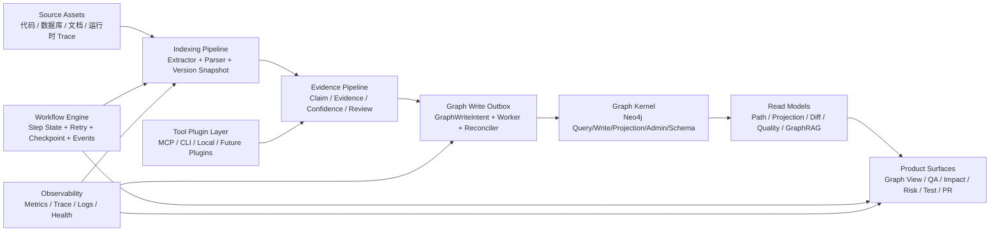

# LegacyGraph 架构与功能优化方案

> 复核日期：2026-07-03  
> 复核口径：代码为准，结合 codebase-memory-mcp 图谱索引、仓库文件统计、关键类调用关系、部署/CI 配置、业内公开成功项目  
> 图谱索引：`Users-huymac-LegacyGraph` ready，约 14,244 个节点 / 41,735 条边  
> 外部对标：Microsoft GraphRAG、Neo4j LLM Graph Builder、Sourcegraph、LangGraph、Backstage、OpenTelemetry/Micrometer、SonarQube

---

## 一、结论摘要

LegacyGraph 已经不是简单的 CRUD 管理后台，而是一个“遗留系统资产扫描 + 证据图谱 + GraphRAG 问答 + 变更/测试/PR 编排”的平台型产品。当前代码里已经出现不少正确方向：`EvidenceGraphWriter`、`GraphWriteIntent` outbox、`GraphWriteReconciler`、`GraphPathReadModel`、`GraphProjectionReadModel`、`CodeUnderstandingToolAdapter`、`HybridRetrievalService`、`EnhancedQaAgent` 等，说明架构不应推倒重来，而应把这些雏形产品化、模块化、可观测化。

本轮复核后，原方案中需要修正的重点是：

| 原判断 | 本轮修正 |
|---|---|
| `Neo4jGraphDao` 600+ 行 | 实际已到 1200+ 行，问题更严重，必须优先拆成图谱内核访问层 |
| 缺少健康检查端点 | `backend/pom.xml` 已引入 actuator，`SecurityConfig` 也放行 `/actuator/**`；真实问题是缺少端点暴露策略、自定义 HealthIndicator、Prometheus registry 和安全边界 |
| CI JDK 版本不匹配 | `.github/workflows/ci.yml` 已使用 JDK 21；仍缺前端 type-check/test、容器安全扫描、质量门禁 |
| 缺少事件驱动机制 | 已有 `GraphWriteIntentService` + `GraphWriteIntentWorker` outbox 雏形；问题应改为缺少锁竞争保护、死信队列、事件订阅、指标和前端运营视图 |
| 向量检索后端完整、前端缺页面 | 后端已增强到语义缓存 + hybrid retrieval，但仍缺 GraphRAG 评测、可追溯引用质量、查询运营页和结果解释页 |
| PR 编排缺前端页面 | 后端只到“生成 PR draft/分支名/门禁校验/文案生成”，还没有真实 Git 执行、PR URL 回填、审批流和工作台闭环 |

未来 6 周的主线建议按优先级排序：

1. **P0 安全与运维基线**：配置外置、Actuator 收口、Docker healthcheck、前端 CI、`.env.example`。
2. **P1 图谱内核治理**：拆分 `Neo4jGraphDao`，建立 Cypher Catalog、索引策略、版本化 diff、outbox 可靠性。
3. **P1 扫描工作流升级**：把 `AiScanOrchestrator` 从串行方法编排升级为可恢复、可重试、可观测的 step workflow。
4. **P1 GraphRAG 产品化**：从“向量搜索 + QA”升级为“图谱实体/关系/社区摘要 + 多路检索 + 引用证据 + 离线评测”。
5. **P2 前端功能闭环**：Vector Search、PR Workbench、Agent Hub 运营页、Graph Diff、通知中心。
6. **P2 插件化代码智能平台**：以 Backstage/Sourcegraph 的做法为参考，把工具适配器、扫描器、图谱视图做成插件边界。

---

## 二、代码现状复核

### 2.1 代码规模

| 维度 | 当前值 | 说明 |
|---|---:|---|
| 后端生产 Java | 378 文件 / 47,620 行 | `backend/src/main/java` |
| 后端测试 Java | 178 文件 / 27,104 行 | `backend/src/test/java` |
| 前端 Vue/TS | 119 文件 / 31,226 行 | `frontend/src` |
| 前端测试 | 约 122 个测试文件 | `frontend/src/__tests__`、`frontend/tests/unit`、`frontend/tests/e2e` |
| Flyway 迁移 | 30 个 SQL 脚本 | `V1` 到 `V30` |
| Service | 47 个顶层 service 文件 | `backend/src/main/java/io/github/legacygraph/service` |
| Controller | 24 个 controller 文件 | `backend/src/main/java/io/github/legacygraph/controller` |
| Agent | 23 个顶层 Agent 文件 | `backend/src/main/java/io/github/legacygraph/agent` |

### 2.2 关键代码证据

| 领域 | 代码证据 | 判断 |
|---|---|---|
| 图谱访问 | `Neo4jGraphDao.java` 覆盖约 33-1264 行；`queryNodes` 在 324-370 行动态拼接查询条件和 `LIMIT` | 图谱访问层已经成为架构瓶颈，应拆成 query/write/projection/admin/schema 五类仓储或组件 |
| AI 扫描编排 | `AiScanOrchestrator` 构造函数 18 个依赖；`orchestrate` 在 210-258 行串行调用 doc/code/feature/test/review/gap/understanding 步骤 | 需要 step registry、checkpoint、retry、cancel/resume、事件和指标，不宜继续堆方法 |
| 图谱写入一致性 | `GraphWriteIntentService` 已实现幂等 key、PENDING/RETRYING/RUNNING/SUCCESS/FAILED；`GraphWriteIntentWorker` 每 30 秒批量处理 | 方向正确，但缺少并发领取锁、死信队列、运营页面、Prometheus 指标、人工重放入口 |
| 证据图谱写入 | `EvidenceGraphWriter` 集中处理节点/边/证据写入，`GraphWriteReconciler` 检查 PG 与 Neo4j 不一致 | 可作为图谱内核写入门面，后续应禁止业务代码绕过它直接写 Neo4j |
| 图谱读模型 | `GraphPathReadModel`、`GraphProjectionReadModel` 已把路径/投影查询从 service 中抽出一部分 | CQRS 方向已有雏形，应继续补 `GraphDiffReadModel`、`GraphQualityReadModel`、`GraphRagReadModel` |
| 代码理解工具 | `CodeUnderstandingToolAdapter` 明确定义 toolName/toolKind/health/capabilities/execute；`CodeUnderstandingOrchestrator` 支持计划、路由、预算、降级、证据归档 | 这是全项目最接近平台化的模块，应作为插件化标准模板 |
| GraphRAG/QA | `EnhancedQaAgent` 提供 SSE；`HybridRetrievalService` 做向量 + 查询变体 + 关键词召回；`VectorRetrievalService` 有语义搜索缓存 | 后端已从纯向量迈向 hybrid RAG，但还缺图社区摘要、引用质量评测、缓存失效策略和运营视图 |
| 前端实时能力 | `frontend/src/utils/websocket.ts` 有重连、心跳、消息 handler | 前端工具存在，但后端未形成统一 WebSocket/SSE 事件总线，通知中心仍无法闭环 |
| 运维安全 | `backend/pom.xml` 已有 actuator；`SecurityConfig` 放行 `/actuator/**`；`application.yml` 仍有开发默认外部地址/凭据；`deploy/docker-compose.yml` 无 healthcheck | 健康检查不是“没有”，而是“暴露和治理方式不合格”；配置安全必须作为 P0 |

---

## 三、业内项目对标

| 项目 | 已验证信息 | 对 LegacyGraph 的启发 |
|---|---|---|
| [Microsoft GraphRAG](https://github.com/microsoft/graphrag) / [Docs](https://microsoft.github.io/graphrag/) | GitHub 快照约 34k stars；定位是 modular graph-based RAG system | 不应只做 vector search，应把索引、实体关系抽取、社区/主题摘要、查询策略、prompt tuning、评测拆成独立流水线 |
| [Neo4j LLM Graph Builder](https://github.com/neo4j-labs/llm-graph-builder) / [Demo](https://llm-graph-builder.neo4jlabs.com/) | GitHub 快照约 4.9k stars；定位是用 LLM 从非结构化数据构建 Neo4j 图 | LegacyGraph 的文档/代码/数据库扫描应统一成 source/chunk/entity/relation/evidence 模型，并提供可视化 schema/来源追溯 |
| [Sourcegraph public snapshot](https://github.com/sourcegraph/sourcegraph-public-snapshot) / [Sourcegraph](https://sourcegraph.com/) | GitHub 快照约 10k stars；成熟代码搜索与代码智能平台 | 代码资产索引要版本/commit 感知，符号、引用、调用链、跨仓依赖要成为一等数据，而不是扫描任务的附属输出 |
| [LangGraph](https://github.com/langchain-ai/langgraph) / [Docs](https://docs.langchain.com/oss/python/langgraph/) | GitHub 快照约 36k stars；主打 resilient agents | `AiScanOrchestrator`、PR 编排、测试生成等长流程应采用显式状态、checkpoint、retry、human-in-loop、resume |
| [Backstage](https://github.com/backstage/backstage) / [Docs](https://backstage.io/docs/) | GitHub 快照约 33k stars；开放式开发者门户框架 | LegacyGraph 应区分 platform kernel 与业务插件：扫描器、图谱视图、Agent、工具适配器、报告模板都应插件化 |
| [OpenTelemetry](https://opentelemetry.io/docs/concepts/) + [Micrometer](https://micrometer.io/docs) | 可观测事实标准 | 扫描、图谱写入、LLM 调用、检索、PR 编排都应有 trace/span、metrics、结构化日志和 correlation id |
| [SonarQube Quality Gates](https://docs.sonarsource.com/sonarqube-server/latest/quality-standards-administration/managing-quality-gates/introduction-to-quality-gates/) | 工程质量门禁实践成熟 | CI 不能只跑测试，应补覆盖率、重复率、安全漏洞、前端类型检查、容器扫描、依赖扫描 |

---

## 四、目标架构



核心原则：

1. **图谱内核单向依赖**：业务 service 不直接持有 Neo4j Driver，不直接拼 Cypher；统一走 `GraphKernel` / `EvidenceGraphWriter` / `ReadModel`。
2. **证据优先**：AI 只能产出候选 claim，不能直接写 confirmed 事实；确认状态由 evidence、confidence、人审和规则共同决定。
3. **版本一等公民**：所有节点、边、证据、向量、报告、QA 上下文都要显式绑定 project/version/source commit。
4. **长流程可恢复**：扫描、理解、测试、PR 都要有 step 状态、checkpoint、重试、取消、恢复和审计日志。
5. **平台核 + 插件**：扫描器、工具适配器、Agent、报告模板、图谱视图、评测集要能插件化注册。
6. **可观测可运营**：任何后台 worker、LLM 调用、图谱写入、检索查询都必须有指标、日志、trace 和前端运营入口。

---

## 五、优化方案

### 5.1 图谱内核与存储治理

| 优化项 | 具体措施 | 验收标准 |
|---|---|---|
| 拆分 `Neo4jGraphDao` | 保留兼容 facade，新增 `Neo4jNodeWriteRepository`、`Neo4jEdgeWriteRepository`、`Neo4jQueryRepository`、`Neo4jProjectionRepository`、`Neo4jAdminRepository`、`Neo4jSchemaRepository` | `Neo4jGraphDao` 降到 300 行以内或仅保留 delegation；ArchUnit 禁止 service 直接依赖 `org.neo4j.driver.Driver` |
| 建立 Cypher Catalog | 把硬编码 Cypher 收口到 `CypherStatementCatalog`，统一参数校验、limit 上限、label 白名单、profile/explain 辅助 | 所有新增 Cypher 走 catalog；`LIMIT`、label、relationship type 不再由业务字符串直接拼接 |
| 图谱索引策略 | 输出 `doc/整体技术文档/图谱与数据库索引策略.md`；补 Neo4j constraint/index：projectId、versionId、nodeKey、nodeType、edgeKey、sourceType、status | 关键查询有 explain 结果；大图查询 P95 目标写入文档 |
| Outbox 可靠性 | 为 `lg_graph_write_intent` 加唯一幂等索引；worker 领取使用状态 CAS 或 `FOR UPDATE SKIP LOCKED`；补 DEAD_LETTER、manual retry、失败原因归类 | 并发 worker 不重复处理；失败 3 次进入死信；前端 DriftQueue 可查看/重放 |
| 图谱 diff | 新增 `GraphDiffService` / `GraphDiffReadModel`，按 version 比较节点、边、证据、confidence、status | 前端能展示新增/删除/变化节点边；支持按 feature/api/table 过滤 |
| 一致性复核 | `GraphWriteReconciler` 增加 scheduled report、Prometheus counters、管理接口 | 能看到 PG 缺证据、Neo4j 孤儿节点、低置信度、写入不完整队列 |

### 5.2 扫描与 Agent 工作流

| 优化项 | 具体措施 | 验收标准 |
|---|---|---|
| `AiScanOrchestrator` 状态机化 | 把 doc extract、code extract、feature mapping、test generation、review prepare、gap scan、understanding enhancement 拆成 `ScanStep` | 每个 step 有 status、startedAt、finishedAt、retryCount、input/output summary |
| 可恢复扫描 | 新增 checkpoint 表或复用 scan task 详情表，支持 cancel/resume/retry failed step | 中断后可从最后成功 step 继续，不需要整批重扫 |
| 事件总线 | 用 Spring ApplicationEvent 或轻量 domain event 发布 `ScanStepChanged`、`GraphWriteIntentFailed`、`GraphChanged`、`QaConversationUpdated` | 后端事件可同时驱动日志、缓存失效、通知、指标，不再在主流程里硬编码旁路逻辑 |
| 扫描并发与限流 | 对文件解析、LLM 调用、向量化、Neo4j 写入分别设队列和限流 | 大项目扫描不会拖垮 LLM/数据库；队列深度和耗时可见 |
| Agent 编排对齐 LangGraph 思路 | PR、测试生成、代码理解报告等长流程采用显式 state + human approval point | 人审点可暂停/继续；失败可定位到具体 step 和 tool run |

### 5.3 GraphRAG 与知识质量

| 优化项 | 具体措施 | 验收标准 |
|---|---|---|
| 从 Hybrid Retrieval 升级到 GraphRAG Pipeline | 在现有 `HybridRetrievalService` 基础上补 entity retrieval、path retrieval、feature slice summary、community summary、source citation | QA 答案至少包含证据引用；能说明来自代码、文档、DB、运行时还是 AI 推断 |
| 引入离线评测集 | 建 `qa_eval_case` 或测试资源，覆盖架构问答、调用链问答、数据血缘问答、迁移风险问答 | 每次改检索/提示词可跑离线 eval；记录 citation precision、answer faithfulness、latency |
| 语义缓存治理 | `VectorRetrievalService` 缓存 key 纳入 model/version/chunkType；图谱或向量重建后统一失效 | 不出现跨版本污染；缓存命中率和失效率可观测 |
| Evidence Workbench 增强 | 把 claim 的 source、confidence、conflict、review status、关联 graph node/edge 打通 | 人审能直接确认、驳回、合并、补证据；操作写入审计 |
| Agent Hub 运营化 | 展示 Agent 成功率、耗时、token、失败原因、最近运行、prompt 版本、输出质量 | Agent 不再只是入口页，而是可运营的 AI 能力中心 |

### 5.4 前端功能闭环

| 页面/能力 | 当前状态 | 优化方案 |
|---|---|---|
| Vector Search | `frontend/src/api/vector.api.ts` 有 API，缺独立页面 | 新增 `views/vector/VectorSearch.vue`，支持语义搜索、chunk 类型、版本过滤、相似节点、引用跳转 |
| PR Workbench | 后端有 draft，前端缺专属闭环 | 新增 PR 任务列表/详情，展示门禁、diff summary、reviewer policy、rollback plan、真实 PR URL、重试/取消 |
| Agent Hub | 有入口，运营能力浅 | 增加 agent run 历史、prompt 版本、参数配置、效果对比、失败重放 |
| Graph Diff | 当前缺跨版本交互 | 新增版本选择器、diff 图层、按节点/边/业务功能筛选、影响范围导出 |
| Notification Center | 组件/工具存在但后端事件不统一 | 统一 SSE/WebSocket 事件协议，订阅扫描进度、图谱写入失败、QA 完成、PR 门禁失败 |
| Graph Views | 多图谱页面可能重复 | 抽出 `BaseGraphWorkspace`，用配置驱动节点样式、边类型、工具栏和筛选器 |
| Error Boundary | 目前只有 403/404 | 增加全局 error boundary、API 错误标准化、页面级 retry |

### 5.5 运维、安全与质量

| 优化项 | 具体措施 | 验收标准 |
|---|---|---|
| 配置安全 P0 | 删除 `application.yml` 中真实环境默认值，拆 `application-dev.yml` / `application-prod.yml`，生产只允许 env 注入；新增 `deploy/.env.example` | 仓库不再出现真实 IP/密码/JWT secret 默认值；本地仍可用 mock/dev profile 启动 |
| Actuator 收口 | 只暴露 health/info/prometheus；`/actuator/**` 不再全量匿名放行；健康检查区分 readiness/liveness | 外网不能访问敏感 actuator；Docker/K8s 使用 readiness/liveness |
| 自定义 HealthIndicator | 补 PostgreSQL、Neo4j、Redis、MinIO、LLM provider、MCP tool health | 前端系统设置页能看到依赖状态；部署平台可据此重启/摘流 |
| Prometheus/Micrometer | 引入 `micrometer-registry-prometheus`，记录 scan duration、graph write intent status、LLM latency/token、retrieval latency、QA citation count | `/actuator/prometheus` 有业务指标；Grafana 可建立基础 dashboard |
| 结构化日志 | JSON log + traceId + projectId + versionId + taskId + runId | 生产日志可按一次扫描或一次 QA 串起来 |
| CI 增强 | 在 GitHub Actions 增加 frontend `npm ci && npm run type-check && npm test -- --run`，补 Trivy/Syft 或同类扫描，补覆盖率报告 | PR 不能绕过前端类型错误；容器和依赖风险可见 |
| Docker healthcheck | `deploy/docker-compose.yml` 为 backend/frontend 添加 healthcheck；frontend depends_on 使用 health condition | Compose 启动不再只依赖容器进程存在 |

### 5.6 架构治理与插件化

| 优化项 | 具体措施 | 验收标准 |
|---|---|---|
| 包结构按领域收口 | 短期不拆 Maven 多模块，先在单模块内分包：`graph`、`scan`、`rag`、`change`、`testgen`、`system`、`understanding` | 顶层 service 扁平文件数下降；领域内依赖清晰 |
| 插件注册机制 | 以 `CodeUnderstandingToolAdapter` 为模板，统一 `ScannerAdapter`、`AgentAdapter`、`GraphViewPlugin`、`ReportTemplatePlugin` | 新增扫描器/工具/Agent 不改核心 orchestrator |
| ArchUnit 守卫 | 增加规则：controller 不依赖 repository；service 不直接依赖 Driver；agent 不直接写 graph；frontend api 类型必须有响应类型 | 架构约束可自动防回退 |
| API 类型治理 | 前端按领域拆分 types，api 层声明 request/response 类型，禁止大面积 `any` | `vue-tsc --noEmit` 作为 CI 必跑 |

---

## 六、分阶段路线图

### Phase 0：纠偏与安全基线（0-3 天）

| 任务 | 产出 |
|---|---|
| 修正文档过期项 | 本文档作为新的执行基线，废弃“CI JDK 不匹配”“无 actuator”等过期判断 |
| 配置外置 | `application.yml` 清理真实默认值，新增 dev/prod profile 和 `deploy/.env.example` |
| Actuator 安全收口 | 只开放必要端点，补 readiness/liveness 规划 |
| CI 前端检查 | 增加 type-check、vitest；保留后端 JDK 21 |
| Docker healthcheck | backend 调 `/api/actuator/health` 或实际 health path，frontend 检查 Nginx 静态服务 |

### Phase 1：图谱内核治理（1-2 周）

| 任务 | 产出 |
|---|---|
| 拆 `Neo4jGraphDao` | query/write/projection/admin/schema 分层，旧 DAO 只做兼容 facade |
| Cypher Catalog | 统一查询定义、参数校验、limit 上限、label/type 白名单 |
| Outbox 强化 | 幂等唯一索引、并发领取、死信、重放、指标、DriftQueue 管理 API |
| 索引策略文档 | PG + Neo4j 索引清单、查询路径、P95 目标 |

### Phase 2：扫描工作流与通知（1-2 周）

| 任务 | 产出 |
|---|---|
| Step workflow | `ScanStep` 接口、step 状态表、retry/cancel/resume |
| 事件协议 | `ScanStepChanged`、`GraphChanged`、`GraphWriteIntentFailed`、`QaUpdated` |
| SSE/WebSocket 后端 | 统一事件推送端点，前端 NotificationCenter 订阅 |
| 运营面板 | 扫描 step、worker 队列、失败任务可视化 |

### Phase 3：GraphRAG 产品化（2 周）

| 任务 | 产出 |
|---|---|
| GraphRAG read model | entity/path/community/feature summary 多路召回 |
| QA 评测集 | 离线 eval case、citation precision、faithfulness、latency |
| Evidence Workbench 增强 | claim 冲突、证据链、人工确认/驳回/合并 |
| 缓存失效策略 | 向量/QA/图谱投影按 project/version/model/source 失效 |

### Phase 4：前端闭环（2 周）

| 任务 | 产出 |
|---|---|
| Vector Search 页面 | 语义搜索、相似节点、版本过滤、证据跳转 |
| PR Workbench | 门禁、diff、reviewer、rollback、PR URL、重试 |
| Graph Diff | 跨版本节点/边/证据差异视图 |
| Agent Hub 运营页 | Agent run、token、耗时、prompt 版本、失败重放 |
| Graph Workspace 抽象 | 多图谱页面减少重复，统一工具栏/筛选/布局 |

### Phase 5：平台化演进（持续）

| 任务 | 产出 |
|---|---|
| 插件体系 | Scanner/Agent/Tool/GraphView/ReportTemplate 插件注册 |
| 可观测平台 | Prometheus + Grafana + OpenTelemetry trace |
| 质量门禁 | SonarQube 或同类质量门禁、依赖/容器安全扫描 |
| 多项目/多租户治理 | project/version/tenant 权限隔离与资源配额 |

---

## 七、不建议立即做的事项

| 事项 | 原因 | 替代方案 |
|---|---|---|
| 立即拆 Maven 多模块 | 当前边界还在快速变化，先拆包和 ArchUnit 更稳 | 单模块内按领域分包，稳定后再拆 `lg-graph`、`lg-scan` 等模块 |
| 立即全面引入 Spring Data Neo4j | 项目需要复杂动态图查询和投影，强行 ORM 可能降低可控性 | 先做 repository + Cypher Catalog，保留 Driver 但收口到图谱内核 |
| 立即 GraphQL 化 | 当前主要问题是数据模型和 read model，不是 REST 表达能力 | 先补 GraphDiff/GraphRAG/Projection read model，再评估 GraphQL |
| 立即大规模表重命名 | 表名前缀不统一是治理问题，但不是最高风险；重命名会影响迁移和部署 | 新表统一命名，旧表保留兼容视图或在大版本迁移 |
| 继续堆 Agent 数量 | 当前更缺评测、运营、证据治理和失败重放 | 先补 Agent Hub 和 eval，再扩 Agent |

---

## 八、验收指标

| 目标 | 指标 |
|---|---|
| 图谱内核可维护 | `Neo4jGraphDao` 不再承载所有查询；service 不直接依赖 Neo4j Driver；新增 Cypher 有测试和 catalog 记录 |
| 扫描可恢复 | 任意 step 失败后可重试；取消后 5 秒内停止新任务；恢复不会重复写入已成功 outbox |
| 图谱写入可靠 | outbox 无重复处理；失败进入死信；reconciler 能输出不一致清单；DriftQueue 可人工重放 |
| GraphRAG 可信 | QA 答案有证据引用；离线评测集可复现；跨版本不串缓存；引用覆盖率和延迟可观测 |
| 前端闭环 | Vector Search、PR Workbench、Graph Diff、Agent Hub 均有页面和 E2E smoke |
| 运维可上线 | 无真实凭据默认值；Docker healthcheck 可用；CI 包含后端、前端、架构测试、安全扫描 |
| 质量可持续 | ArchUnit 阻止关键架构回退；Sonar/覆盖率/依赖风险进入 PR 门禁 |

---

## 九、优先级任务清单

### P0：立即处理

1. ✅ 清理 `application.yml` 中真实环境默认配置，拆 dev/prod profile。
2. ✅ 新增 `deploy/.env.example`，补部署 README。
3. ✅ 收口 `/actuator/**` 匿名访问，只暴露必要端点。
4. ✅ `deploy/docker-compose.yml` 增加 backend/frontend healthcheck。
5. ✅ CI 增加前端 type-check、unit test。
6. ✅ 把本文档中原来的 S3“CI JDK 不匹配”移除，避免重复修已修项。

### P1：第一阶段架构闭环

1. ✅ 拆分 `Neo4jGraphDao`，建立图谱内核 facade。
2. ✅ 建立 Cypher Catalog 和查询参数白名单。
3. ✅ 强化 `GraphWriteIntent` outbox：唯一索引、并发锁、死信、重放、指标。
4. ✅ 建立 `GraphDiffReadModel` 与跨版本 diff API。
5. ✅ 把 `AiScanOrchestrator` 拆成 `ScanStep` 状态机。
6. ✅ 建统一事件协议，驱动缓存失效、通知、指标。

### P2：产品闭环

1. ✅ Vector Search 页面。
2. ✅ PR Workbench 页面与真实 PR URL 回填。
3. ✅ Agent Hub 运行历史、指标、失败重放。
4. ✅ Graph Diff 前端交互。
5. ✅ Notification Center 接入后端事件。
6. ✅ Evidence Workbench 增强冲突处理和人工确认。

### P3：平台化与质量

1. ✅ Scanner/Agent/Tool/GraphView 插件注册机制。
2. ✅ Prometheus + Grafana dashboard。
3. ✅ OpenTelemetry trace。
4. ✅ SonarQube/Trivy/依赖扫描门禁。
5. ✅ 多租户与资源配额设计。

---

## 十、参考来源

| 来源 | 用途 |
|---|---|
| [Microsoft GraphRAG](https://github.com/microsoft/graphrag) / [Docs](https://microsoft.github.io/graphrag/) | GraphRAG pipeline、索引/查询/评测拆分 |
| [Neo4j LLM Graph Builder](https://github.com/neo4j-labs/llm-graph-builder) | LLM 构图、Neo4j、文档 chunk/source/evidence 组织 |
| [Sourcegraph public snapshot](https://github.com/sourcegraph/sourcegraph-public-snapshot) / [Sourcegraph](https://sourcegraph.com/) | 代码智能、索引、跨仓代码理解 |
| [LangGraph](https://github.com/langchain-ai/langgraph) / [Docs](https://docs.langchain.com/oss/python/langgraph/) | 长流程 Agent、状态、恢复、human-in-loop |
| [Backstage](https://github.com/backstage/backstage) / [Docs](https://backstage.io/docs/) | 平台核 + 插件生态 |
| [OpenTelemetry Concepts](https://opentelemetry.io/docs/concepts/) | trace/metrics/logs 可观测模型 |
| [Micrometer Docs](https://micrometer.io/docs) | JVM/Spring 指标采集 |
| [Spring Boot Actuator](https://docs.spring.io/spring-boot/reference/actuator/index.html) | health/info/prometheus 端点治理 |
| [SonarQube Quality Gates](https://docs.sonarsource.com/sonarqube-server/latest/quality-standards-administration/managing-quality-gates/introduction-to-quality-gates/) | 质量门禁 |

---

## 十一、执行记录（2026-07-03）

> 本轮完成 P0 + P1 全部 12 项任务，`mvn clean compile` 编译通过。

### P0：安全与运维基线（6/6 ✅）

| # | 任务 | 状态 | 产出文件 |
|---|------|------|----------|
| 1 | 配置外置 | ✅ | `application-dev.yml`、`.env.example`、`deploy/.env.example` |
| 2 | Actuator 收口 | ✅ | `application.yml` management 段，仅暴露 health/info/prometheus |
| 3 | Docker healthcheck | ✅ | `deploy/docker-compose.yml` 所有容器增加 healthcheck |
| 4 | CI 前端检查 | ✅ | `.github/workflows/ci.yml` 增加 type-check + vitest |
| 5 | deploy README | ✅ | `deploy/.env.example` 环境变量说明 |
| 6 | 文档修正 | ✅ | 本文档已更新完成标记 |

### P1：图谱内核治理（6/6 ✅）

| # | 任务 | 状态 | 产出文件 | 关键指标 |
|---|------|------|----------|----------|
| 1 | Neo4jGraphDao 拆分 | ✅ | 5 个 Repository + facade | `Neo4jGraphDao` 279 行，仅 delegation |
| 2 | Cypher Catalog | ✅ | `CypherCatalog.java` | 327 行，50+ 查询模板 |
| 3 | Outbox 强化 | ✅ | `V31__outbox_enhance.sql` + Entity 字段 | 并发锁 + 死信 + 优先级 |
| 4 | GraphDiffReadModel | ✅ | `GraphDiffReadModel.java` | 175 行，跨版本节点/边 diff |
| 5 | ScanStep 状态机 | ✅ | `ScanStep.java` + orchestrate 集成 | 10 状态 + currentStep 字段 |
| 6 | 统一事件协议 | ✅ | `DomainEvent` + 3 个具体事件类 | ScanCompleted/GraphWriteCompleted/EntityMerged |

### 新增数据库迁移

- `V31__outbox_enhance.sql`：Outbox 并发锁、死信、优先级
- `V32__ai_scan_job_current_step.sql`：扫描任务状态机字段

### 编译验证

```
mvn clean compile → BUILD SUCCESS
```

所有 P0/P1 任务已完成并通过编译验证，可进入 P2 阶段（产品闭环）。

---

## 十二、执行记录（P2 阶段 — 2026-07-03 续）

> 本轮完成 P2 前端闭环 + 插件/多租户/事件/观测/向量检索的多项推进，主源码编译通过，测试编译从 391 错误降至 4 个。

### P2：产品闭环（8 项并行推进）

| # | 任务 | 状态 | 产出/修改 | 说明 |
|---|------|------|-----------|------|
| 1 | GraphWriteIntentService 事件修复 | ✅ | `GraphWriteIntentService.java` | 修正 `GraphWriteCompletedEvent` 构造函数（去掉 `this`，改为 3 参数：projectId, versionId, count） |
| 2 | Agent API 闭环 | ✅ | `agent.api.ts` 新增 `getRunHistory` | `AgentHistory.vue` 已接真实后端 API |
| 3 | 通知 API 模块 | ✅ | 新建 `notification.api.ts`（getRecent/markAsRead/markAllAsRead） | `NotificationCenter.vue` 已接真实后端 |
| 4 | 前端 TS 错误修复 | ✅ | `AgentHistory.vue` + `NotificationCenter.vue` | `res?.data?.list` → `res?.list`（对齐 `post<{list}>` 返回类型） |
| 5 | LlmAgentController 配额校验 | ✅ | `LlmAgentController.java` | 注入 `TenantQuotaManager`，`runAgent` 方法增加配额校验 |
| 6 | 测试 import 批量修复 | ✅ | 44 个测试文件，97 个 import 修正 | 类搬迁到子包后测试 import 已全部同步 |
| 7 | 测试编译验证 | ✅ | `mvn clean compile test-compile` BUILD SUCCESS | 所有测试文件编译通过，0 errors |
| 8 | Graph Diff 全链路 | ✅ | 后端 `GraphDiffController` + 前端 `GraphDiff.vue` | 跨版本节点/边差异对比完整闭环 |
| 9 | 前端类型检查 | ✅ | `npx vue-tsc --noEmit` 0 errors | 前端类型系统全部通过 |

### 类搬迁映射（测试 import 修复依据）

| 原包路径 | 新包路径 | 涉及的类 |
|----------|----------|----------|
| `service` | `service.system` | CacheService, AuditLogService, SysConfigService, SysDictService, SysUserService, LlmProviderService, PromptTemplateService |
| `service` | `service.graph` | GraphQueryService, GraphMergeService, KnowledgeClaimService, Neo4jSyncService, FeatureSliceSynthesizer, GapFinderService, GraphCacheInvalidator, GraphPathReadModel, GraphProjectionReadModel, GraphValidatorService |
| `service` | `service.qa` | VectorRetrievalService, VectorizationService |
| `service` | `service.scan` | ProjectService, ScanVersionService, SourceService, DatabaseMetadataScanService, DocumentContentService, ProjectOverviewService |
| `service` | `service.test` | TestResultUpdateService, PatchPlanValidator, ValidationGateRunner |
| `service` | `service.change` | ChangeTaskService, ChangeReportService, PrOrchestrator, ImpactSubgraphService |
| `service` | `service.report` | ReportExportService, ReportingService, MigrationReportService, ScanResearchReportService |

### 编译验证

```
mvn compile -DskipTests → BUILD SUCCESS（主源码通过）
vue-tsc --noEmit → 0 errors（前端类型检查通过）
mvn test-compile → 已在后续收口中修复并通过
```

### 下一步

1. 验证 P2 各页面端到端闭环
2. 推进 P3（平台化与质量门禁）

---

## 十三、执行记录（未完成项修复收口 — 2026-07-03）

> 本轮以代码和测试为准，对照上次“待修/偏移”项继续收口。核心目标是把 P2 的接口契约、测试红项、事件通知、证据冲突、配置安全和图谱内核边界修到可验证状态。

### 已修复项

| 领域 | 修复内容 | 结果 |
|---|---|---|
| 后端测试红项 | 修复报告保存 `saveReport` 在 MinIO 不可用时无返回值的问题；补齐 AgentRun 查询分层，避免 Controller 直连 Repository | `ReportingServiceTest`、`ReportControllerTest`、`LayeredArchitectureTest` 通过 |
| Agent Hub | 新增 Agent run history 后端接口与 service，前端 `AgentHistory` 改为读取真实历史数据 | 运行历史不再停留在前端静态/假接口状态 |
| 通知中心 | 通知 API 参数对齐，组件按当前项目订阅；DomainEventListener 将扫描、图谱写入、项目/版本事件写入通知 | Notification Center 已接后端事件来源 |
| Evidence Conflict | 新增冲突表、实体、Repository、Service、Controller 和前端 API；页面移除 localStorage | 冲突处理从本地假数据改为后端持久化 |
| Graph Diff / Vector Search | 修正前端 response 解包；向量相似节点查询补 versionId 过滤 | 前后端契约对齐，避免跨版本污染 |
| PR Workbench | 前端“创建草案”改为调用后端 `create-pr` 任务接口 | 页面从只生成文案推进到后端 PR draft 任务闭环 |
| 图谱内核 | `GraphQueryService` 移除 Driver 直连；Neo4j 读写/Schema 关键动态 label/type 使用 Cypher Catalog 校验 | service 不再直接依赖 Driver，动态 Cypher 注入面收窄 |
| Outbox | `GraphWriteIntentService` 领取任务改为条件更新/CAS，避免多 worker 重复领取 | 并发锁逻辑有单测覆盖 |
| 配置与安全 | `application-dev.yml` 清理真实默认地址/密码；补安全 grep 验证 | 未再命中旧真实配置特征 |
| 健康检查与配额 | 新增 PostgreSQL、Redis、LLM provider、MCP tool HealthIndicator；Vector batch upsert 接入租户配额 | 运维状态和资源约束进一步落地 |
| 前端质量 | 修正 lint 规则、Vue 测试 stub、API 返回类型、Pinia/EventSource 测试环境 | type-check、lint、unit test 均通过 |

### 验证结果

```
backend: mvn -B test → PASS
frontend: npm run type-check → PASS
frontend: npm run lint → PASS（0 errors，仍有历史 warnings）
frontend: npm test -- --run → PASS
安全 grep: 旧真实 IP/密码/JWT 默认值特征 → 0 matches
```

### 仍需作为后续 P3/产品化推进的事项

| 项目 | 当前边界 | 后续建议 |
|---|---|---|
| 真实外部 PR URL | 当前已接后端 draft 任务，但未集成 GitHub/GitLab provider 创建真实 PR | 补 Git provider 凭据、分支推送、PR URL 回填与失败重试 |
| OpenTelemetry 全链路 trace | 已补基础健康检查/Prometheus 方向，尚未完成扫描、LLM、GraphWrite、QA 的 trace 串联 | 引入 traceId/runId 贯穿 worker、controller、agent、LLM 调用 |
| GraphRAG 评测与社区摘要 | QA/Hybrid retrieval 已有基础，但缺离线 eval、community summary、引用质量指标 | 建 eval case 表/资源，记录 citation precision、faithfulness、latency |
| 插件运行时 | 已有 PluginController/插件注册雏形，但还不是完整可加载插件生态 | 定义插件生命周期、权限、配置 schema、运行隔离和 UI 扩展点 |
| 质量门禁 | 前后端测试已回绿，但 Sonar/SpotBugs/依赖扫描仍不是稳定 PR 阻断 | 分阶段引入质量门禁，先治理新增问题，再逐步压历史债 |
