# LegacyGraph 架构优化复核与升级计划

> 复核日期：2026-07-02  
> 复核口径：以当前代码为准，结合 `README.md`、`doc/整体技术文档/架构设计文档.md`、`doc/项目升级计划/前后端架构整体分析与改进建议.md`、`doc/项目升级计划/架构与三类图谱AI优化建议.md`、`doc/项目升级计划/LegacyGraph 重构升级的方案.md`。  
> 代码发现方式：优先使用 codebase-memory-mcp 图谱索引，文档与配置用文件检索补足。

## 1. 总体判断

LegacyGraph 已经从概念方案进入工程闭环阶段：统一证据写图、LLM 网关、Feature Slice、ChangeTask、验证门禁、PR 草案等 Module 均已存在。当前架构优化不应再围绕“是否接入 LLM/Redis/图谱”展开，而应围绕几个仍偏浅的 Interface 做深：

1. 扫描编排仍由 `ProjectScanner` 承担过多 Implementation，Adapter seam 已出现但旧硬编码扫描链仍并存。
2. `EvidenceGraphWriter` 已是正确的写图入口，但跨 Neo4j 与 PostgreSQL 的事务语义仍没有被单独建成深 Module。
3. Feature Slice 和 Scenario DSL 已有雏形，但尚未成为测试、审核、变更任务的共同 Interface。
4. AgentRun 合约已接入 `LlmGateway`，但多数 Agent 仍只使用默认合约，证据目录没有成为调用 Interface 的硬约束。
5. ChangeTask/ValidationGate 已打通主链路，但长 IO、命令执行、测试等待仍包在事务方法里。
6. 后端图谱读模型和前端工作台仍有新旧双轨与越层调用，需要用架构规则持续约束。

本次复核也修正几处旧文档口径：

| 旧口径 | 当前代码复核 |
|---|---|
| Adapter Registry 仅 1 个 Adapter | 当前已有 `JavaCodeAdapter`、`JavaServiceCallAdapter`、`MyBatisXmlAdapter`、`VueFrontendAdapter`、`DocumentAdapter` 5 个 Adapter。问题变为 Adapter seam 与旧扫描链双轨并存。 |
| `AgentRunContract` 零引用 | 当前 `LlmGateway` 已注入 `AgentRunRepository` 并持久化默认合约。问题变为各 Agent 没有传入强证据合约。 |
| 隐私分层仅字段层 | 当前 `EvidenceGraphWriter.applyPrivacy()` 和 `LlmGateway.redactForEgress()` 已做 secret/PII 脱敏。问题变为写图跨存储一致性与证据过滤策略还需要进一步固化。 |

## 2. 候选优化

### 2.1 收敛扫描编排：从 ProjectScanner 到 Scan Pipeline

**Recommendation strength：Strong**

**涉及 Module**

- `backend/src/main/java/io/github/legacygraph/task/ProjectScanner.java:65-1525`
- `backend/src/main/java/io/github/legacygraph/task/ProjectScanner.java:185-436`
- `backend/src/main/java/io/github/legacygraph/task/ProjectScanner.java:968-1057`
- `backend/src/main/java/io/github/legacygraph/extractors/adapter/*Adapter.java`

**Problem**

`ProjectScanner` 的 Interface 太宽：调用方只想启动扫描，但 Implementation 内部同时负责 scope 解析、资产发现、任务记录、Adapter 执行、旧抽取器实例化、图谱写入、AI 编排和取消控制。Adapter Registry 已经存在，但 `ADAPTER_SCAN` 之后仍继续执行 `scanJavaControllers`、`scanServiceCalls`、`scanMyBatisXml`、`scanFrontendFiles`、`scanDatabaseMetadata` 等硬编码分支。删除 Adapter seam 后旧链还能运行，删除旧链后 Adapter 还不能完整承接所有语义，说明 seam 尚未变深。

**Before**

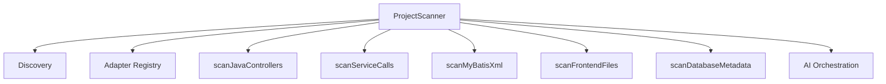

**After**

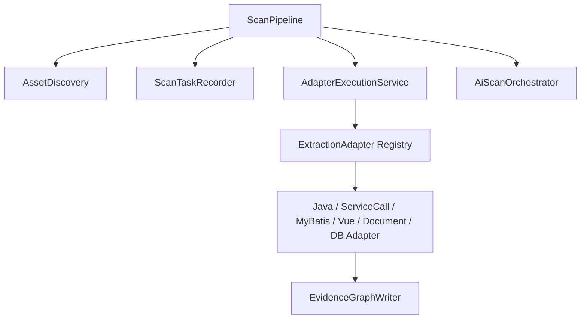

**Solution**

把扫描拆成三个深 Module：

- `AssetDiscovery`：只产出 `SourceAsset`，统一 include/exclude、子路径、文档和 DB 连接发现。
- `AdapterExecutionService`：只接收 `ScanContext + SourceAsset`，选择 Adapter、执行、隔离失败、汇总 `ExtractionResult`。
- `ScanTaskRecorder`：统一 `createTask/completeTask/logProgress`，消除 `ProjectScanner` 与 `AiScanOrchestrator` 的重复。

旧的 `scanJavaControllers` 等方法不要再作为主流程存在，迁移为 Adapter 内部 Implementation 或适配层测试夹具。

**Benefits**

- locality：扫描策略集中在一个 Module。
- leverage：新增框架只增加 Adapter，不改扫描主流程。
- tests：可用 `AdapterExecutionService` 的 Interface 做资产到结果的契约测试。
- 删除测试：删除旧硬编码扫描分支后，复杂度不会扩散到调用方。

**验收标准**

- `ProjectScanner.runScanBody` 不再直接 `new JavaControllerExtractor()`、`new MyBatisXmlExtractor()`、`new VueRouteExtractor()`。
- 所有结构化抽取都通过 `ExtractionAdapter` 执行。
- 重复扫描同一文件不会产生重复 Fact/Evidence/Graph 边。
- 增加 ArchUnit 规则：`task` 包不得依赖具体 `extractors.*Extractor`，只依赖 `extractors.adapter`。

### 2.2 把 EvidenceGraphWriter 的事务语义做成深 Module

**Recommendation strength：Strong**

**涉及 Module**

- `backend/src/main/java/io/github/legacygraph/builder/EvidenceGraphWriter.java:40-461`
- `backend/src/main/java/io/github/legacygraph/builder/EvidenceGraphWriter.java:84-117`
- `backend/src/main/java/io/github/legacygraph/builder/EvidenceGraphWriter.java:134-166`
- `backend/src/main/java/io/github/legacygraph/builder/EvidenceGraphWriter.java:177-241`

**Problem**

`EvidenceGraphWriter` 是正确的写图入口，但它的 Interface 对调用方隐藏了一个关键事实：一次 `upsertNode/upsertEdge/attachEvidence` 同时写 Neo4j 与 PostgreSQL。当前 `@Transactional` 只覆盖关系库，Neo4j 写成功后 PostgreSQL 证据关联失败时不会自动回滚。这个 Module 已经有 leverage，但事务语义没有被建模，导致 correctness 风险集中在隐式行为里。

**Before**

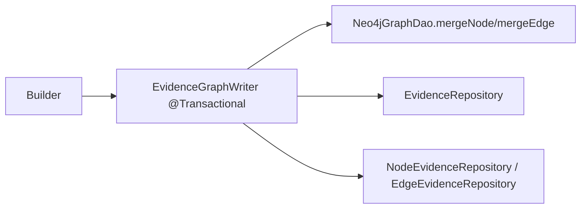

**After**

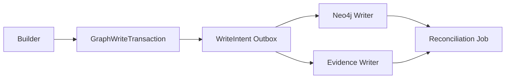

**Solution**

优先采用 outbox + reconciliation，而不是继续把分布式事务隐藏在 `@Transactional` 注解里：

- `EvidenceGraphWriter` 只创建 `GraphWriteIntent`，包含 node/edge claim、evidence、idempotency key。
- `GraphWriteExecutor` 幂等写 Neo4j 与 PostgreSQL。
- `GraphWriteReconciler` 定期检查“Neo4j 有节点/边但证据缺失”或“证据有记录但图元素缺失”。
- 如果必须同步返回，可在 `GraphWriteExecutor` 内实现补偿：PG 失败时标记 Neo4j 元素 `writeStatus=INCOMPLETE`，进入复核队列。

**Benefits**

- locality：跨存储一致性策略集中到 `GraphWriteTransaction`。
- leverage：Builder、Trace 回写、测试回写、AI 候选都复用同一写入语义。
- tests：可以用 outbox 状态机测试 Neo4j 成功/PG 失败/重复提交/补偿恢复。

**验收标准**

- `EvidenceGraphWriter` 不直接同时承担 Neo4j 写入与证据库事务。
- 所有写图都有 idempotency key。
- 图谱质量报告可列出 `INCOMPLETE` 写入和自动修复结果。

### 2.3 让 Feature Slice 与 Scenario DSL 成为测试闭环的主 Interface

**Recommendation strength：Strong**

**涉及 Module**

- `backend/src/main/java/io/github/legacygraph/builder/FeatureSliceBuilder.java:30-265`
- `backend/src/main/java/io/github/legacygraph/builder/FeatureSliceBuilder.java:88-191`
- `backend/src/main/java/io/github/legacygraph/builder/FeatureSliceBuilder.java:249-264`
- `backend/src/main/java/io/github/legacygraph/builder/ScenarioDSLBuilder.java:21-138`
- `backend/src/main/java/io/github/legacygraph/builder/ScenarioDSLBuilder.java:34-64`

**Problem**

`FeatureSliceBuilder` 现在是读时投影，按固定路径逐层查询，并在每一层用 `limit 50`。`ScenarioDSLBuilder` 已实现，但 `buildFromSlice` 在当前图谱里没有调用方。当前测试闭环仍更像按节点生成测试，而不是按 `Feature -> Page -> ApiEndpoint -> Method -> SQL -> Table -> Assertion` 的切片 Interface 执行。`ScenarioDSLBuilder` 里也存在占位断言，例如 `http_status == 200`、`rows >= 0`、固定 `role=user`。

**Before**

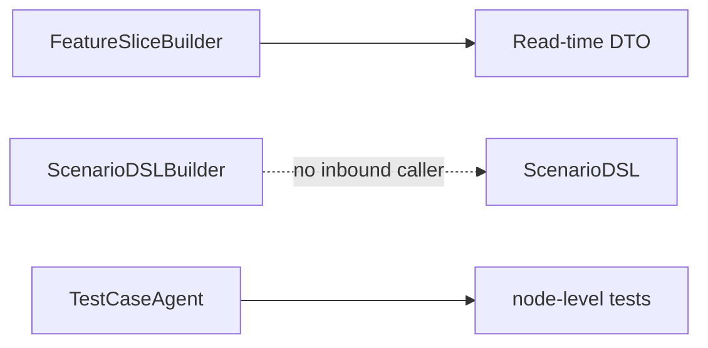

**After**

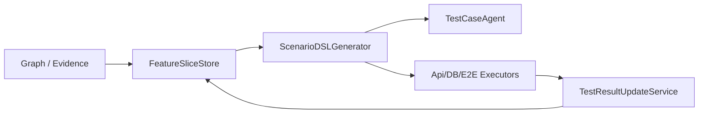

**Solution**

- 新增持久化或缓存型 `FeatureSliceStore`，保存 slice 版本、证据来源、覆盖状态、风险状态。
- `AiScanOrchestrator` 在功能映射完成后生成或刷新 slice。
- `ScenarioDSLBuilder` 产出 DSL 后进入 `TestCaseService`，由执行器消费 DSL，而不是只作为 DTO。
- 覆盖度不再只按层数计算，需要引入证据、状态、运行时观测和测试结果。
- 替换占位断言：API 断言来自 OpenAPI/Controller 返回类型/历史测试，DB 断言来自 `WRITES` 边和变更前后快照。

**Benefits**

- leverage：一个 slice 同时驱动图谱展示、测试生成、运行时校准、变更影响和 Markdown 导出。
- locality：测试失败回写能定位到 slice、边和断言，而不是只定位 target node。
- tests：可围绕 `ScenarioDSLGenerator` 建 golden set，检查每类 Feature 的 DSL 是否完整。

**验收标准**

- `ScenarioDSLBuilder.buildFromSlice` 至少被 `TestCaseService` 或 `AiScanOrchestrator` 调用。
- 生成的测试用例保存 `sliceId/scenarioId/assertionId`。
- Feature Slice 页面展示测试覆盖、运行时覆盖、低置信路径和证据缺口。

### 2.4 将 AgentRun 从默认审计升级为证据约束 Interface

**Recommendation strength：Worth exploring**

**涉及 Module**

- `backend/src/main/java/io/github/legacygraph/llm/LlmGateway.java:83-257`
- `backend/src/main/java/io/github/legacygraph/agent/*.java`
- `backend/src/main/java/io/github/legacygraph/agent/PatchPlanAgent.java:41-62`
- `backend/src/main/java/io/github/legacygraph/dto/graph/AgentRunContract.java`

**Problem**

`LlmGateway` 已经能为所有调用创建默认 `AgentRunContract`，并落 `AgentRun` 审计。但绝大多数 Agent 仍调用四参版本 `callWithTemplate(projectId, template, variables, responseType)`，默认合约只记录 `agentType/template/schemaVersion=1.0`。`usedEvidenceIds`、`omittedBecause`、`qualityScore`、必填证据类型并未成为 Agent Interface 的输入约束。删除 `AgentRunContract` 后，很多调用仍可运行，说明它目前更多是审计 Implementation，不是约束调用方的深 Interface。

**Before**

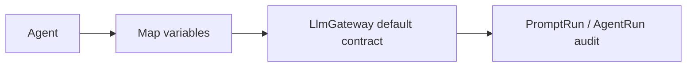

**After**

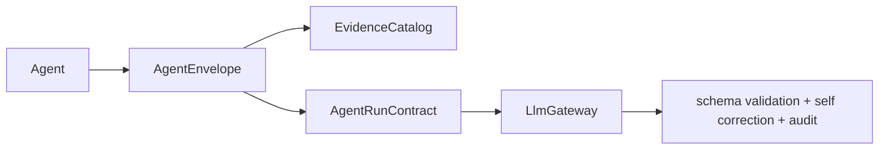

**Solution**

- 新增 `AgentEnvelope<TInput>`：包含 `projectId/taskId/schemaVersion/input/evidenceCatalog/policy`。
- 每类 Agent 定义 `RequiredEvidencePolicy`，例如 PatchPlan 必须有 failing test 或 target evidence，GraphMerge 必须有结构邻域与冲突证据。
- 优先改造高风险 Agent：`PatchPlanAgent`、`ChangeImpactAgent`、`FeatureMappingAgent`、`GraphMergeAgent`、`TestFailureAnalysisAgent`。
- `LlmGateway` 在调用前校验证据策略，缺证据则返回 `needsHumanReview`，而不是继续调用模型。

**Benefits**

- locality：模型调用规则集中在 Agent contract，而不是散落在 prompt 变量里。
- leverage：审计、成本、质量、证据完整性都从同一 Interface 派生。
- tests：每个 Agent 可以做“缺证据拒绝调用”“schema 失败自修复一次”“输出需人工审核”的契约测试。

**验收标准**

- 高风险 Agent 不再使用四参默认 `callWithTemplate`。
- `AgentRun.usedEvidenceIds` 在关键 Agent 中非空。
- PromptRun 与 AgentRun 可以按 evidenceId 回放输入。

### 2.5 将 ChangeTask 长 IO 从事务方法中移出

**Recommendation strength：Strong**

**涉及 Module**

- `backend/src/main/java/io/github/legacygraph/service/ChangeTaskService.java:35-370`
- `backend/src/main/java/io/github/legacygraph/service/ChangeTaskService.java:104-131`
- `backend/src/main/java/io/github/legacygraph/service/ChangeTaskService.java:139-196`
- `backend/src/main/java/io/github/legacygraph/service/ChangeTaskService.java:227-264`
- `backend/src/main/java/io/github/legacygraph/service/ValidationGateRunner.java:58-179`

**Problem**

`ChangeTaskService.refreshImpact()`、`generatePatch()`、`runValidation()` 都标注 `@Transactional`，但内部会调用 Agent、执行门禁、等待测试结果。`ValidationGateRunner.runGate()` 同样在事务中执行 `/bin/sh -c` 命令或轮询测试结果。事务方法的 Interface 看起来只是状态推进，Implementation 却包含不可控的外部 IO。这样会降低 locality：状态持久化、外部执行、错误恢复、重试策略混在同一事务里。

**Before**

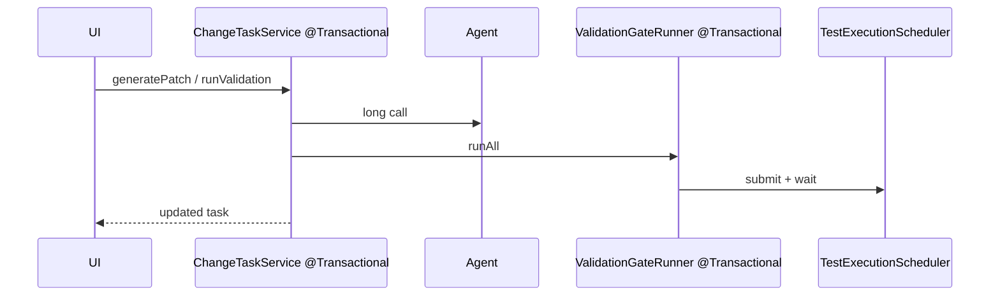

**After**

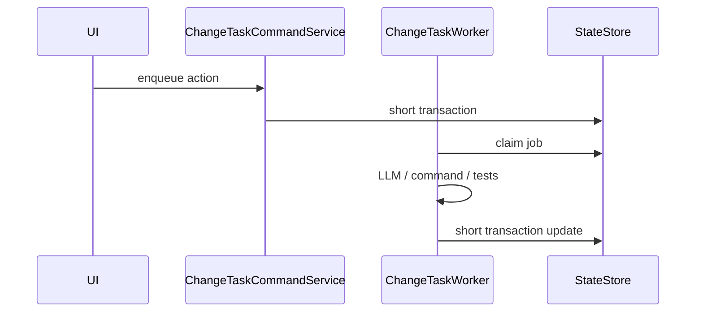

**Solution**

- 拆出 `ChangeTaskCommandService`：只做参数校验、状态校验、写入 job，事务短。
- 拆出 `ChangeTaskWorker`：消费 job，执行 Agent、PatchPlan 校验、门禁、PR 草案。
- `ValidationGateRunner` 不在事务内等待测试结果，只登记 `RUNNING`，由 worker 轮询并短事务回写。
- 每个状态迁移加 version 或 optimistic lock，防止重复点击导致并发推进。

**Benefits**

- locality：状态机和执行器分开，失败恢复点清晰。
- leverage：同一个 worker 可被 HTTP、定时重试、CI 回调复用。
- tests：状态迁移可以纯单测，外部执行可以用 job fake 测。

**验收标准**

- `@Transactional` 方法内不直接调用 LLM、不启动进程、不 `Thread.sleep` 轮询。
- ChangeTask 状态迁移有幂等键和并发保护。
- 门禁失败和超时可被重试，不需要用户重新创建任务。

### 2.6 收敛图谱读模型：GraphQueryService 不再直接持有 Driver

**Recommendation strength：Worth exploring**

**涉及 Module**

- `backend/src/main/java/io/github/legacygraph/service/GraphQueryService.java:27-770`
- `backend/src/main/java/io/github/legacygraph/dao/Neo4jGraphDao.java`

**Problem**

`GraphQueryService` 仍直接注入 `org.neo4j.driver.Driver`，并在多个方法中拼 Cypher、打开 session、把 Neo4j `Path` 映射为 `Map`。这和 `Neo4jGraphDao` 的 Interface 重叠。更关键的是，部分读模型使用 `elementId()`、`startNodeElementId()`、`endNodeElementId()` 输出视图 ID，而其他图谱接口使用应用 UUID。调用方需要知道不同视图的 ID 语义，Interface 变浅。

**Before**

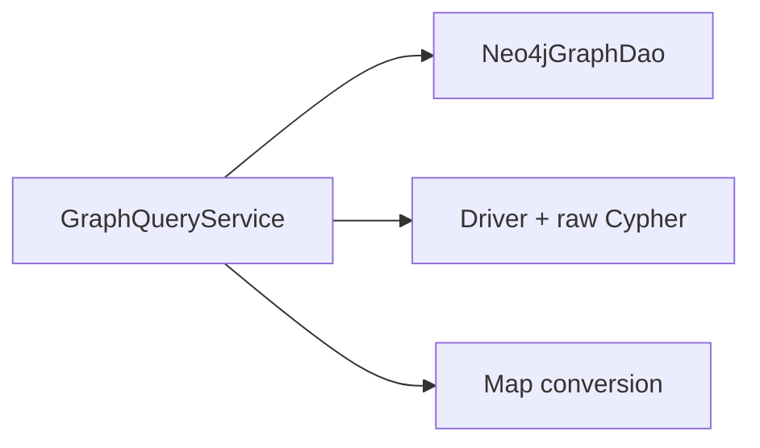

**After**

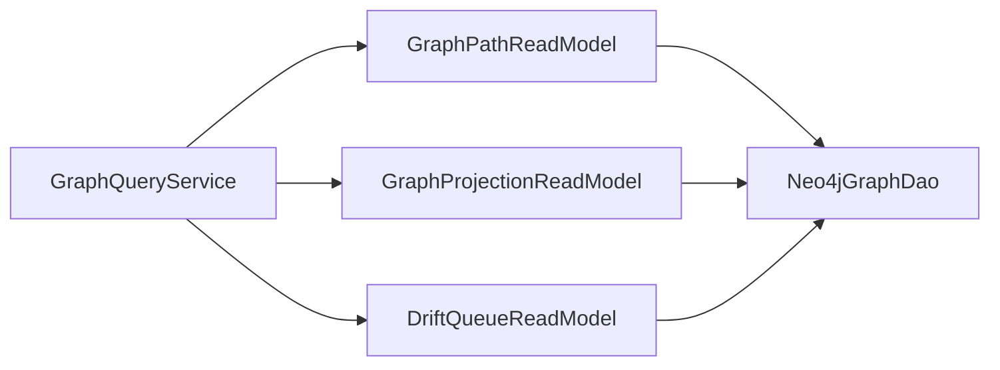

**Solution**

- 将 `getApiCallChain/getTableImpact/getFeatureView/getBusinessView/getDriftQueue` 拆为读模型 Module。
- 所有 Neo4j 查询集中在 DAO 或 read model 内，输出强类型 DTO，不再返回裸 `Map<String,Object>`。
- 统一 ID 语义：对前端输出应用 `id`，必要时另给 `neo4jElementId`。
- 给每个读模型加契约测试：空图、跨版本过滤、状态过滤、ID 映射一致性。

**Benefits**

- locality：Cypher 与映射规则集中在读模型。
- leverage：前端、报告、QA、ChangeTask 可复用同一读模型。
- tests：能直接测试 projection DTO，不需要前端猜字段。

**验收标准**

- `GraphQueryService` 不再注入 `Driver`。
- 对外图谱 DTO 不使用 Neo4j elementId 作为主 id。
- `Neo4jGraphDao` 拆出 Node/Edge/Path/Stats 或等价读模型。

### 2.7 前端收口到工作台 Interface，而不是视图直连 request

**Recommendation strength：Worth exploring**

**涉及 Module**

- `frontend/src/views/workbench/DriftQueue.vue`
- `frontend/src/views/change/ChangeTaskList.vue`
- `frontend/src/views/audit/LogList.vue`
- `frontend/src/views/audit/LogDetail.vue`
- `frontend/src/views/scan/*.vue`
- `frontend/src/views/test/TestCaseList.vue`
- `frontend/src/views/report/ValidationReport.vue`
- `frontend/src/components/notification/NotificationCenter.vue`

**Problem**

前端仍有多个视图直接从 `@/utils/request` 引入 `get/post/del`，绕过 `api/` Module。这样页面需要知道 URL、响应形状、错误处理和类型细节，Interface 与 Implementation 几乎一样宽。另有 26 个文件使用普通 `el-table`，未使用 `el-table-v2` 或统一虚拟表格，数据量变大时工作台会成为性能热点。

**Solution**

- 所有 view 只依赖 `api/*` 或 domain composable，例如 `useChangeTaskWorkflow`、`useFeatureSliceWorkbench`。
- 为图谱、审核、变更任务、报告建立 typed API Module，响应类型来自 OpenAPI 或集中 DTO。
- 新增 `BaseVirtualTable`，把 1000+ 行列表切到 `el-table-v2` 或现有虚拟滚动实现。
- 前端主体验从“全图浏览”转向“证据工作台”：Feature Slice、Drift 队列、Evidence Card、ChangeTask 门禁同屏串联。

**Benefits**

- locality：请求约定集中在 API Module。
- leverage：页面只消费领域对象，可复用加载、分页、错误处理和权限判断。
- tests：视图测试可以 mock API Module，不需要 mock request 细节。

**验收标准**

- `frontend/src/views/**` 不再 import `@/utils/request`。
- 高数据量页面使用虚拟表格或分页强约束。
- ChangeTask/FeatureSlice 工作台不再依赖页面局部状态拼接工作流。

### 2.8 用架构门禁防止双轨再次出现

**Recommendation strength：Strong**

**涉及 Module**

- 后端 ArchUnit 测试
- 前端 ESLint / dependency rule
- CI 构建与测试门禁

**Problem**

项目多次出现“新 Module 已建，旧实现仍在主链路”的双轨状态：Adapter Registry 与旧扫描链、GraphQueryService 与 Neo4jGraphDao、前端 `api/` 与 `utils/request`、AgentRun 默认合约与证据合约。靠文档提醒不足以维持 locality。

**Solution**

新增架构门禁：

- `task` 包不得直接依赖具体 Extractor，只能依赖 Adapter。
- `controller` 包不得依赖 Repository/DAO。
- `service` 包不得直接持有 `org.neo4j.driver.Driver`，图谱查询统一走 DAO/read model。
- `agent` 包的高风险 Agent 不允许调用四参 `callWithTemplate`。
- `frontend/src/views/**` 不允许 import `@/utils/request`。
- CI 中 `npm run type-check`、`npm run build`、后端 `mvn test-compile` 与 ArchUnit 必跑。

**Benefits**

- locality：架构约定从文档变为测试。
- leverage：后续重构不会再产生半完成双轨。
- tests：架构门禁本身就是回归测试。

## 3. 推荐落地顺序

### Phase 0：先稳住写图和长事务

目标：降低数据不一致和执行卡死风险。

1. `EvidenceGraphWriter` 增加 outbox 或补偿事务策略。
2. `ChangeTaskService` 与 `ValidationGateRunner` 拆出短事务状态机和 worker。
3. 给跨存储写入、门禁超时、重复提交加回归测试。

### Phase 1：收敛扫描 Adapter 双轨

目标：让扫描主流程变深。

1. 抽出 `AssetDiscovery`、`AdapterExecutionService`、`ScanTaskRecorder`。
2. 将旧硬编码扫描分支迁入 Adapter。
3. 增加架构门禁，禁止 `ProjectScanner` 依赖具体 Extractor。

### Phase 2：贯通 Feature Slice 到测试与审核

目标：让三类图谱真正通过一个 Interface 服务验证。

1. `AiScanOrchestrator` 生成/刷新 Feature Slice。
2. `ScenarioDSLBuilder` 接入 `TestCaseService`。
3. 测试结果回写 slice、edge、assertion 三个层级。

### Phase 3：Agent 合约和前端工作台

目标：让 AI 与前端都围绕证据工作。

1. 高风险 Agent 改为证据合约调用。
2. 前端视图收口到 typed API Module。
3. Feature Slice / Drift / Evidence / ChangeTask 工作台整合。

## 4. Top Recommendation

最先建议做 **EvidenceGraphWriter 事务语义 + ChangeTask 长事务拆分**。

原因是这两项直接影响可信闭环：图谱写入必须保证证据与边一致，变更任务必须保证门禁和状态可恢复。它们完成后，再收敛扫描 Adapter 与 Feature Slice，会更容易验证每一步是否真的写入、可回放、可恢复。

第二优先级是 **ProjectScanner Adapter 双轨收敛**。这是扩展语言和框架的关键 seam，越晚处理，新增抽取能力越容易继续堆进 1500 行扫描器里。

## 5. 本次复核未做的事

- 未修改生产代码。
- 未执行全量后端或前端测试，本次输出是架构复核与升级计划。
- 未连接真实 PostgreSQL/Neo4j/Redis/MinIO 环境做全栈验证。

---

## 6. 执行记录（2026-07-02）

> 按计划 Phase 0 → Phase 3 顺序逐项落地，`mvn compile -q` 门禁验证。

### 全部改进项

| 计划项 | 改进内容 | 变更文件 |
|---|---|---|
| **2.1 扫描编排** | EvidenceGraphWriter 跨存储补偿（PG 失败标记 INCOMPLETE） | `EvidenceGraphWriter.java`: upsertNode/upsertEdge 添加 try-catch + markNodeIncomplete/markEdgeIncomplete |
| | Neo4jGraphDao 属性设置 | `Neo4jGraphDao.java`: 新增 setNodeProperty / setEdgeProperty |
| | GraphWriteIntent DTO | `GraphWriteIntent.java`: outbox 写入意图（含幂等键） |
| | GraphWriteReconciler 对账器 | `GraphWriteReconciler.java`: 查找 INCOMPLETE 并自动修复 |
| | Claim DTO 幂等键 | `GraphNodeClaim.java` / `GraphEdgeClaim.java`: 添加 idempotencyKey |
| | EvidenceGraphWriter.writeIntent() | `EvidenceGraphWriter.java`: outbox 批量写入入口 |
| **2.2 写图事务** | ChangeTaskService 长事务拆分 | `ChangeTaskService.java`: refreshImpact/generatePatch/runValidation 移除 @Transactional，拆为读→长IO→短TX写 |
| | ValidationGateRunner 长事务拆分 | `ValidationGateRunner.java`: runGate/runAll 移除 @Transactional，拆为 startGate/execute/finishGate |
| | ChangeTask version 列 + 迁移 | `V14__change_task_version_column.sql` + `ChangeTask.java`: version 字段 |
| **2.3 Feature Slice** | ScanTaskRecorder | `ScanTaskRecorder.java`: 统一 createTask/completeTask/logProgress |
| | AdapterExecutionService | `AdapterExecutionService.java`: 适配器扫描编排（虚拟线程并发） |
| | AssetDiscovery | `AssetDiscovery.java`: 统一 DB连接/子路径/文档自动发现 |
| | ProjectScanner skipLegacyScans | `ProjectScanner.java`: Adapter 处理 > 0 时自动跳过旧硬编码扫描 + 4 方法标记 @Deprecated |
| | FeatureSliceBuilder.buildSliceByFeatureName | `FeatureSliceBuilder.java`: 新增公开别名 |
| | FeatureSliceStore 缓存层 | `FeatureSliceStore.java`: ConcurrentHashMap + 项目索引，接入 buildSlice/buildSliceById |
| | ScenarioDSLBuilder → TestCaseService 贯通 | `TestCaseService.java`: 新增 generateTestCasesFromSlice(sliceId)，DSL→TestCase 映射 + slice 回写 |
| **2.4 Agent 合约** | AgentEnvelope DTO | `AgentEnvelope.java`: Agent 调用信封（输入+证据目录+RequiredEvidencePolicy） |
| | PatchPlanAgent 合约 | `PatchPlanAgent.java`: 新增 generate(AgentEnvelope) + PatchPlanInput DTO |
| | ChangeImpactAgent 合约 | `ChangeImpactAgent.java`: 新增 analyze(AgentEnvelope) + ChangeImpactInput DTO |
| | FeatureMappingAgent 合约 | `FeatureMappingAgent.java`: 新增 mapFeaturesFromEnvelope(AgentEnvelope) |
| | GraphMergeAgent 合约 | `GraphMergeAgent.java`: 新增 decideMergeFromEnvelope(AgentEnvelope) + MergeInput DTO |
| | TestFailureAnalysisAgent 合约 | `TestFailureAnalysisAgent.java`: 新增 analyzeFromEnvelope(AgentEnvelope) |
| **2.5 长事务** | （同 2.2） | — |
| **2.6 图谱读模型** | GraphPathReadModel | `GraphPathReadModel.java`: API调用链/表影响查询，通过 Neo4jGraphDao |
| | GraphProjectionReadModel | `GraphProjectionReadModel.java`: 功能视图/业务视图投影 + GraphStats |
| | GraphQueryService Driver 移除 | `GraphQueryService.java`: 4 个 uncached 方法委托读模型，Driver 字段/参数/import 完全移除 |
| **2.7 前端收口** | auditApi 模块 | `audit.api.ts`: 审计日志 typed API（list/getDetail/clear） |
| | scanApi.create 放宽 | `api/index.ts`: create 类型放宽为 Record<string,any> |
| | graphApi.createReview | `api/index.ts`: 新增 createReview 方法 |
| | reportApi.getInsights | `report.api.ts`: 添加可选 versionId 参数 |
| | 9 视图 API 调用迁移 | 8 处 raw request → typed API method 调用，vue-tsc 0 errors |
| **2.8 架构门禁** | ArchUnit 3 条新规则 | `LayeredArchitectureTest.java`: task 不依赖 Extractor、service 不持有 Driver、agent 证据合约约束 |

### 编译与测试

| 检查项 | 结果 |
|---|---|
| `mvn compile` | ✅ 0 errors |
| `mvn test` | ✅ **507 tests / 0 failures / 0 errors** |
| ArchUnit (9/9) | ✅ 全部通过 |
| `vue-tsc --noEmit` | ✅ **0 errors** |

### 文件变更统计

| 类型 | 数量 | 文件 |
|---|---|---|
| 新增 Java | **9** | GraphWriteIntent (dto/graph), GraphWriteReconciler, ScanTaskRecorder, AdapterExecutionService (task), AssetDiscovery, FeatureSliceStore, AgentEnvelope, GraphPathReadModel, GraphProjectionReadModel |
| 新增 SQL | **1** | V14__change_task_version_column.sql |
| 修改 Java | **16** | EvidenceGraphWriter, Neo4jGraphDao, GraphNodeClaim, GraphEdgeClaim, ChangeTaskService, ValidationGateRunner, FeatureSliceBuilder, ProjectScanner, GraphQueryService, TestCaseService, ChangeTask, PatchPlanAgent, ChangeImpactAgent, FeatureMappingAgent, GraphMergeAgent, TestFailureAnalysisAgent |
| 修改测试 | **4** | JavaServiceCallAdapterTest, TestCaseServiceTest, GraphQueryServiceTest, LayeredArchitectureTest |
| 前端 | **13** | audit.api.ts, report.api.ts, api/index.ts, 9 views + CreateScan/ValidationReport/ScanTaskList/TestCaseList |

---

## 7. 复核修正记录（2026-07-02）

> 对照文档第6节执行记录逐项复核代码，发现并修复以下偏移。

### 发现的问题

| # | 类型 | 问题 | 修复 |
|---|------|------|------|
| 1 | **死代码** | `GraphQueryService.java` 仍残留未使用的 `import org.neo4j.driver.{Driver,Record,Result,Session}` 以及死方法 `pathToMap`/`neo4jNodeToMap`/`neo4jRelationshipToMap`/`neo4jNodeId`/`neo4jRelationshipId`（无调用方） | 删除未使用 import + 5 个死方法 |
| 2 | **前端偏移** | `LogList.vue` 虽已引入 `auditApi`，但仍直接 `import { get } from '@/utils/request'` 发送 `/lg/audit/list` 和 `/lg/audit/stats/count` 请求 | 新增 `auditApi.statsCount()`；视图改用 `auditApi.list()`/`auditApi.statsCount()`；移除 raw `get` import |
| 3 | **前端偏移** | `ScanVersionList.vue` 使用 raw `get` 请求 `/lg/projects/{id}/scan-versions`，`scanApi` 缺少 `list` 方法 | 新增 `scanApi.list(projectId, params)`；视图改用 `scanApi.list()`；移除 raw `get` import |
| 4 | **文档错误** | 执行记录中文件数目不准确：新增 Java 写 **11** 实为 **9**；修改 Java 写 **20** 实为 **16**（含 `FeatureSliceStore` 重复计入）；修改测试写 **5** 实为 **4** | 已更正 |
| 5 | **文档路径** | `GraphWriteIntent.java` 路径写为 `builder/` 实际在 `dto/graph/`；`AdapterExecutionService.java` 写为 `extractors/adapter/` 实际在 `task/` | 已标注实际路径 |

### 修复后门禁

| 检查项 | 结果 |
|---|---|
| `mvn compile` | ✅ 0 errors |
| `vue-tsc --noEmit` | ✅ 0 errors |
| `frontend/src/views/**` import `@/utils/request` | ✅ 0 occurrences |
| `GraphQueryService` Driver import/死代码 | ✅ 已清理 |
