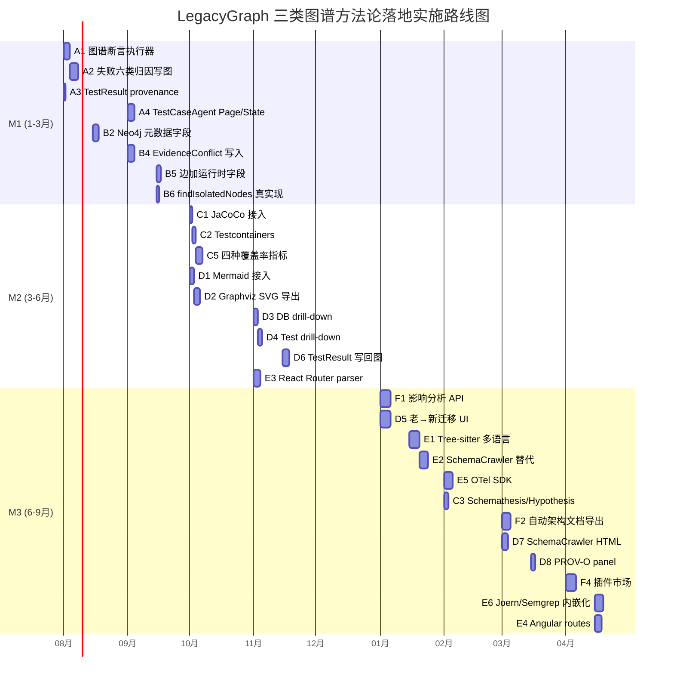
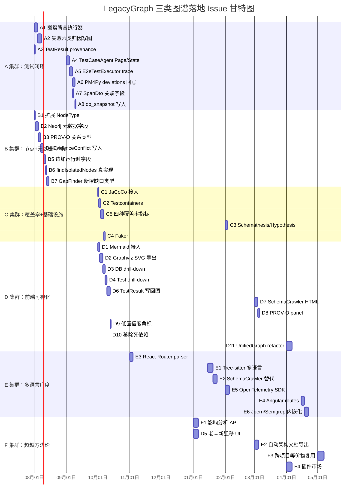

# LegacyGraph 三类图谱方法论落地评估与超越改进

> 文档版本：v1.0  
> 编写日期：2026-07-13  
> 评估依据：
> - `/docs/三类图谱的方法论.md`（方法论）
> - `/docs/三类图谱的具体实现.md`（具体实现）
> - `/docs/三类图谱的落地计划.md`（落地计划）
> - LegacyGraph 源码（backend + frontend，约 808 个 Java 文件，200+ 个 Vue/TS 文件）
> 评估范围：后端 Java/Spring Boot、Neo4j、PostgreSQL、Vue 3 前端

---

## 0. 摘要

### 0.1 综合成熟度打分

| # | 维度 | 现得分 | 满分 | 关键差距 |
|---|---|---|---|---|
| 1 | 单一属性图建模 | 9/10 | 10 | 少量 stub（如 findIsolatedNodes）；GRAPH_MERGE 延迟到 scan 后 |
| 2 | 节点/边类型覆盖 | 6/10 | 10 | 缺 KPI/UseCase/State/UIComponent；BusinessCapability 被 Domain 替代 |
| 3 | 节点元数据完整度 | 5/10 | 10 | 缺 extractor/version/commit/env/owner/provenance_refs[] |
| 4 | PROV-O 溯源 | 5/10 | 10 | SourceType 枚举完备，但 evidence 存在 PostgreSQL 而非 Neo4j 节点属性 provenance_refs[] |
| 5 | 知识融合冲突处理 | 6/10 | 10 | DriftQueue + EvidenceConflict 表完备；但 doc/code/runtime 三方自动检测缺失 |
| 6 | 三类投影实现 | 7/10 | 10 | FeatureView / BusinessView / CodeView (api-chain) 实现但分散多端点；无统一 view= 参数 |
| 7 | 跨图一致性检查 | 7/10 | 10 | GapFinder 6 类 + QA Gate 4 条 + 架构违规 + PM4Py conformance 完备；但缺 missing-route-edge / contract-mismatch 回写 |
| 8 | 质量门禁 | 8/10 | 10 | 4 条门禁 + 证据覆盖 + 置信度校准 4 指标；写入 Markdown 报告 |
| 9 | 运行时对齐 | 7/10 | 10 | Trace 对齐 verifiedScore；但缺边级 observed_runtime 字段/p95/错误率持久化 |
| 10 | **测试闭环** | **4/10** | 10 | **最薄弱环节**：图谱断言执行器缺失、失败六类归因全缺、TestResult 无 provenance 字段、四种覆盖率指标全缺 |
| 11 | 前端可视化三层 | 4/10 | 10 | Mermaid 缺失、Graphviz SVG 导出 stub、证据抽屉 DB/Test drill-down 是 toast |
| 12 | 多语言广度 | 3/10 | 10 | Tree-sitter/LSP/SchemaCrawler 全缺；Java-only；前端仅 Vue regex |
| **综合** | — | **~6.0/10** | 10 | 测试闭环（A）和前端可视化（D）是最优先改进集群 |

### 0.2 实施路线图

| 阶段 | 时间 | 集群 | 目标 |
|---|---|---|---|
| M1 | 1-3 月 | A + B | 核心闭环（测试 + 图谱断言 + 失败归因）+ 元数据规范 |
| M2 | 3-6 月 | C + D | 覆盖率基础设施（JaCoCo + Testcontainers）+ 前端可视化三层 |
| M3 | 6-9 月 | E + F | 多语言广度（Tree-sitter/SchemaCrawler）+ 超越方法论能力 |

---

## 1. 总体成熟度打分（12 维度详解）

### 1.1 单一属性图建模 — 9/10

**实现**：[`dao/Neo4jWriteRepository.java:103-130`](backend/src/main/java/io/github/legacygraph/dao/Neo4jWriteRepository.java) 的 `MERGE (n:%s {projectId, versionId, nodeKey})` 是唯一写入路径；[`entity/GraphNode.java`](backend/src/main/java/io/github/legacygraph/entity/GraphNode.java) 注释明示"数据已迁移到 Neo4j"。[`CypherCatalog.java`](backend/src/main/java/io/github/legacygraph/dao/CypherCatalog.java) 的 `MERGE_NODE` / `CREATE_NODE` 模板集中管理所有 Cypher 语句。

**缺口**：
- [`Neo4jGraphDao.java:631-634`](backend/src/main/java/io/github/legacygraph/dao/Neo4jGraphDao.java) 中 `findIsolatedNodes` 是 **stub 返回空列表**（死代码扫描实际不可用）。
- `GRAPH_MERGE` 阶段延迟到 `GraphMergeScheduler`（每日凌晨 3:00 + scan 完成事件），而非 inline 在扫描 DAG 中。

### 1.2 节点/边类型覆盖 — 6/10

**实现**：[`common/NodeType.java`](backend/src/main/java/io/github/legacygraph/common/NodeType.java) 有约 33 个枚举值，覆盖 Controller/Service/Mapper/SqlStatement/Table/Column 等代码图谱节点；[`common/EdgeType.java`](backend/src/main/java/io/github/legacygraph/common/EdgeType.java) 有约 50 种边类型。

**缺口**：方法论 §5 业务图谱核心节点 **缺失**：
- `BusinessCapability`（被 `BusinessDomain` 替代，语义不等价）
- `KPI`（完全没有枚举值）
- `UseCase`（缺失）
- `ValidationRule`（被 `BusinessRule` 部分替代）
- `State` / `StateMachine`（缺失）
- `UIComponent`（缺失，被 Page/Button 简化）

### 1.3 节点元数据完整度 — 5/10

**实现**：[`dao/Neo4jWriteRepository.java:80-87`](backend/src/main/java/io/github/legacygraph/dao/Neo4jWriteRepository.java) 的 MERGE 节点属性包含：`id, projectId, versionId, nodeType, nodeKey, nodeName, displayName, description, sourceType, sourcePath, startLine, endLine, confidence, status, properties, scanType, className, verifiedScore, runtimeVerified, lastSeenAt, traceCount, aliasNames, createdAt, updatedAt`。

**缺口**：方法论 §3 节点元数据要求的以下字段 **全部缺失**：
- `extractor`（抽取器名称）
- `extractor_version`（抽取器版本）
- `commit_sha` / `version`（源码 commit）
- `env`（环境）
- `owner`（责任人）
- `privacy_level`（隐私级别）
- `first_seen_at`（用 `createdAt` 替代，但语义不同）
- `provenance_refs[]`（证据 ID 数组，详见 §1.4）

### 1.4 PROV-O 溯源 — 5/10

**实现**：[`common/SourceType.java`](backend/src/main/java/io/github/legacygraph/common/SourceType.java) 包含 17 种来源类型（RUNTIME_TRACE / CODE_AST / DB_METADATA / DOC_AI / AI_INFERENCE / TEST_EXECUTION / MANUAL_CONFIRM / TRANSITIVE_CLOSURE 等）。[`entity/Evidence.java`](backend/src/main/java/io/github/legacygraph/entity/Evidence.java) 完整字段：`projectId, versionId, evidenceType, sourcePath, sourceName, startLine, endLine, contentHash, contentExcerpt, summary, content, metadata, astPath, sqlHash, chunkId, relatedNodeIds, privacyLevel, redactionPolicy, createdAt`。`NodeEvidence` / `EdgeEvidence` 作为 Neo4j 元素与 PG Evidence 的中间表。

**缺口**：
- 方法论 PROV-O 三件套 `wasDerivedFrom / wasGeneratedBy / wasAttributedTo` **未作为关系类型实现**
- Neo4j 节点属性只有 `evidenceIds`（逗号分隔字符串），而非 `provenance_refs[]` 数组
- [`entity/GraphNode.java:39`](backend/src/main/java/io/github/legacygraph/entity/GraphNode.java) 的 `evidenceIds` 是单字符串字段

### 1.5 知识融合冲突处理 — 6/10

**实现**：
- [`KnowledgeClaimService.mergeSourceType()`](backend/src/main/java/io/github/legacygraph/service/graph/KnowledgeClaimService.java:608-627) 拒绝"非 AI 被 AI 覆盖"（runtime > AI 保护规则）
- [`GraphQueryService.getDriftQueue()`](backend/src/main/java/io/github/legacygraph/service/graph/GraphQueryService.java:1087-1122) 实现 `static_only_candidate` / `dynamic_only_candidate` / `doc_only` 标识
- [`TraceGraphAligner.align()`](backend/src/main/java/io/github/legacygraph/builder/TraceGraphAligner.java:52-87) 对未对齐 trace 标 `dynamic_only_candidate`，对静态边标 `static_only_candidate`
- [`entity/EvidenceConflict.java`](backend/src/main/java/io/github/legacygraph/entity/EvidenceConflict.java) 有完整 PG 表结构

**缺口**：
- [`EvidenceConflictService`](backend/src/main/java/io/github/legacygraph/service/graph/EvidenceConflictService.java) **只有 list/resolve，无 insert 写入路径**——冲突录入只能通过手动 UI 操作
- `planned_or_stale` / `inferred_only` / `doc_only` **不是正式 EdgeType.relationStatus 枚举值**（`doc_only` 通过 `sourceType == "DOC_AI"` 启发式识别）
- **doc / code / runtime 三方碰冲突没有自动化检测器**——只有双向 drift 检测（静态 vs 运行时）

### 1.6 三类投影实现 — 7/10

**实现**：
- [`GraphProjectionReadModel.getFeatureView()`](backend/src/main/java/io/github/legacygraph/service/graph/GraphProjectionReadModel.java) 过滤 `Feature/ApiEndpoint/Service/Repository/Page` 节点
- [`GraphProjectionReadModel.getBusinessView()`](backend/src/main/java/io/github/legacygraph/service/graph/GraphProjectionReadModel.java) 过滤 `BusinessDomain/BusinessProcess/BusinessObject/BusinessRule` 节点
- [`FeatureSliceBuilder`](backend/src/main/java/io/github/legacygraph/builder/FeatureSliceBuilder.java:17-29) 注释明示"FeatureSlice 是总图上的投影视图"
- [`GraphQueryController`](backend/src/main/java/io/github/legacygraph/controller/GraphQueryController.java) 有独立端点：`/graph/feature-view`、`/graph/business-view`、`/graph/api-chain`、`/graph/table-impact`

**缺口**：
- **代码图谱没有专属投影端点**——`Controller/Service/Method/Mapper/SqlStatement/Table/Column` 只通过 `/graph/unified` 全量查询
- **没有 BaseGraphQueryController** 抽象 `view=` 参数——前端需分别调用多个 URL
- [`service/graph/GraphPathReadModel.java`](backend/src/main/java/io/github/legacygraph/service/graph/GraphPathReadModel.java) 有独立实现，与 `GraphProjectionReadModel` 是两条并行路径

### 1.7 跨图一致性检查 — 7/10

**实现**：
| 维度 | 文件 | 状态 |
|---|---|---|
| 本体约束违反 | [`DefaultGraphQualityGate.java:47-52`](backend/src/main/java/io/github/legacygraph/service/scan/DefaultGraphQualityGate.java) | ✅ 完整 |
| 悬空边 | [`Neo4jGraphDao.java:464-473`](backend/src/main/java/io/github/legacygraph/dao/Neo4jGraphDao.java) | ✅ 完整 |
| 重复节点 | [`Neo4jGraphDao.java:478-487`](backend/src/main/java/io/github/legacygraph/dao/Neo4jGraphDao.java) | ✅ 完整 |
| 孤立节点 | [`Neo4jProjectionRepository.java:599-615`](backend/src/main/java/io/github/legacygraph/dao/Neo4jProjectionRepository.java) | ✅ 完整 |
| 6 类 GapFinder | [`GapFinderService.java:48-55`](backend/src/main/java/io/github/legacygraph/service/graph/GapFinderService.java) | ✅ 完整 |
| 架构违规 | [`ArchitectureViolationScanner.java:66-106`](backend/src/main/java/io/github/legacygraph/verification/ArchitectureViolationScanner.java) | ✅ 完整 |
| PM4Py conformance | [`ProcessMiningController.java`](backend/src/main/java/io/github/legacygraph/controller/ProcessMiningController.java) + [`Pm4PyClient`](backend/src/main/java/io/github/legacygraph/processmining/Pm4PyClient.java) | ✅ 完整 |
| 死代码检测 | [`Neo4jGraphDao.findIsolatedNodes`](backend/src/main/java/io/github/legacygraph/dao/Neo4jGraphDao.java:631-634) | ⚠️ stub 返回空 |

**缺口**：
- 缺 `missing-route-edge` 检测（Route 节点如 Page 没有 CALLS 边连到 ApiEndpoint）
- PM4Py deviations **不回写到 Neo4j**——只落 `lg_process_fitness` 表
- 架构违规的跳层检测（Controller→Mapper）依赖"无 Service 中间节点的直接 CALLS"，未考虑 Service 类型节点

### 1.8 质量门禁 — 8/10

**实现**：[`DefaultGraphQualityGate`](backend/src/main/java/io/github/legacygraph/service/scan/DefaultGraphQualityGate.java:114-131) 实现 4 条门禁：
- 边/节点比 < 1 拦截
- 孤立率 > 10% 拦截
- 约束违反 > 0 拦截
- 证据率 < 95% 拦截

[`GraphQualityAssessor`](backend/src/main/java/io/github/legacygraph/service/scan/GraphQualityAssessor.java:31-50) 实现 4 类准确性指标（抽取准确率/完整性/一致性/时效性）。

### 1.9 运行时对齐 — 7/10

**实现**：
- [`TraceGraphAligner`](backend/src/main/java/io/github/legacygraph/builder/TraceGraphAligner.java) 对齐 runtime span → 图谱节点，设置 `runtimeVerified=true`、`verifiedScore=1.0`、`traceCount++`
- [`HybridRagResult.sourcePriority()`](backend/src/main/java/io/github/legacygraph/dto/graph/HybridRagResult.java:83-94) 实现 `runtime > code > db > test > doc > ai` 优先级映射

**缺口**：
- 边级 **`observed_runtime`** 字段不存在（只有节点上的 `runtimeVerified` 布尔值）
- 缺 `lastObservedAt`（最后观测时间）、`p95DurationMs`（P95 延迟）、`errorCount`（错误计数）持久化
- [`TraceGraphAligner.java:70-80`](backend/src/main/java/io/github/legacygraph/builder/TraceGraphAligner.java) 的 N+1 问题：用 `queryEdges(..., 100)` 全表扫，大图谱上 O(N×E) 复杂度

### 1.10 测试闭环 — 4/10（最薄弱环节）

详见 §3 方法论逐条映射中"自动测试与图谱验证闭环"部分。以下是关键缺口汇总：

- **图谱断言执行器完全缺失**：`ScenarioDSLBuilder` 生成 `Assertion(type="graph")` 占位符，但无任何 executor 评估
- **失败六类归因代码中 0 命中**：全仓 grep `contract_mismatch|missing_route_edge|wrong_table_mapping|permission_graph_error|ui_flow_drift|stale_doc_rule` 无结果
- **TestResult 缺 provenance 字段**：`scenario_id / trace_id / graph_version / commit_sha` 均缺失
- **JaCoCo / Testcontainers / WireMock / Hypothesis / Faker / Schemathesis 全部不在 pom.xml**
- **四种覆盖率指标全缺**：图谱节点覆盖率、图谱边覆盖率、关键路径覆盖率、代码覆盖率

### 1.11 前端可视化三层 — 4/10

**实现**：
- [`GraphViewerOptimized.vue`](frontend/src/components/graph/GraphViewerOptimized.vue) 使用 `@vue-flow/core` 作为统一图可视化引擎，支撑所有 5 个视图（Unified/Business/Feature/Code/Lineage/Runtime）
- [`CustomNode.vue`](frontend/src/components/graph/CustomNode.vue) 渲染置信度颜色（绿≥0.9 / 蓝≥0.7 / 橙≥0.5 / 红<0.5）+ 证据数量 chip
- [`EvidencePanel.vue`](frontend/src/components/EvidencePanel.vue) 有证据抽屉（code/doc/db/test tabs）
- [`ReviewList.vue`](frontend/src/views/review/ReviewList.vue) + [`ReviewHistory.vue`](frontend/src/views/review/ReviewHistory.vue) 人工审核页面

**缺口**：
- **Mermaid 渲染器完全缺失**：`package.json` 无 mermaid 依赖
- **Graphviz SVG/PNG 导出 stub**：`GraphViewerOptimized.vue#exportGraph` 只吐 JSON；PNG/SVG 下拉点击 toast
- **`@antv/g6` 死依赖**：`package.json` 声明但 0 个 import
- **证据抽屉 DB/Test drill-down 是 toast**：`handleViewDb` / `handleViewTest` 显示"开发中"
- 缺 SchemaCrawler HTML5/DOT schema 渲染
- 缺老系统→新系统 module-mapping 迁移 UI
- 缺测试结果写回图谱（CustomNode 无 `testStatus` badge）
- 低置信度仅靠颜色，无 dashed border / 角标

### 1.12 多语言广度 — 3/10

**实现**：
- 30+ 抽取器覆盖 Java Spring/MyBatis/Spring Security/MQ/Scheduled/RBAC
- [`VueRouteExtractor.java`](backend/src/main/java/io/github/legacygraph/extractors/VueRouteExtractor.java) 支持 Vue Router regex 解析
- [`FrontendApiExtractor.java`](backend/src/main/java/io/github/legacygraph/extractors/FrontendApiExtractor.java) 支持 axios/fetch/request 的 regex 解析
- [`DocumentExtractor`](backend/src/main/java/io/github/legacygraph/extractors/DocumentExtractor.java) 使用 Tika+POI+PDFBox

**缺口**：
- **Tree-sitter 完全缺席**：`pom.xml` 0 命中，源码无 import
- **LSP (lsp4j) 完全缺席**：无 eclipse-lsp4j 依赖
- **SchemaCrawler 完全缺席**：自行实现 JDBC `DatabaseMetaData`，无 view/proc/trigger/sequence 抽取
- **React Router / Angular 解析器缺失**：前端仅 Vue regex
- **OpenTelemetry SDK 缺席**：只有 OTel 数据模型形状，无 `io.opentelemetry:*` 依赖
- **Java 以外语言完全不支持**（Kotlin/Scala/Go/Python/C#）

---

## 2. 方法论章节逐条映射

> 按 `三类图谱的方法论.md` 章节顺序，每个设想列出"实现位置/状态/缺口"三列。

### 2.1 适用范围与总体架构

| 方法论设想 | 实现位置 | 状态 | 缺口 |
|---|---|---|---|
| Tree-sitter 多语言 AST | 无 | ❌ 缺失 | pom.xml 无 tree-sitter 依赖 |
| LSP 符号导航 | 无 | ❌ 缺失 | 无 eclipse-lsp4j 依赖 |
| Joern CPG 深度分析 | `verification/JoernVerificationAdapter.java`（外部 CLI，仅 cross-check） | ⚠️ 部分 | 嵌入式 CPG 缺失；仅可选 |
| Semgrep 跨文件数据流 | `verification/SemgrepVerificationAdapter.java`（外部 CLI，仅 cross-check） | ⚠️ 部分 | 内嵌 taint engine 缺失；仅可选 |
| SchemaCrawler 厂商无关 schema | 无 | ❌ 缺失 | JDBC `DatabaseMetaData` 自实现，无 view/proc |
| Apache Tika 多格式文档 | `extractors/DocumentExtractor.java`（Tika+POI+PDFBox） | ✅ 完整 | 无 |
| OpenTelemetry trace | `entity/RuntimeTrace.java`（数据模型兼容，SDK 缺失） | ⚠️ 部分 | 无 OTel SDK 依赖 |
| Neo4j 属性图 | `dao/Neo4jWriteRepository.java` | ✅ 完整 | 无 |
| 统一证据目录 `evidence/` | `lg_evidence` 等 PG 表（非文件目录） | ⚠️ 不同模式 | evidence/ 目录不存在；用 PG 表替代 |
| PROV-O 溯源 | SourceType 枚举 + Evidence 表 | ⚠️ 部分 | 无 wasDerivedFrom/wasGeneratedBy/wasAttributedTo |

### 2.2 输入接入与预处理

| 方法论设想 | 实现位置 | 状态 | 缺口 |
|---|---|---|---|
| 资产盘点（inventory.json） | `ProjectScanner.java` + `ScanPhaseRegistry.java` | ✅ 完整 | 无 |
| 源分类与指纹化 | `SourceAsset` + `FactPersister` | ✅ 完整 | 无 |
| 文档清洗（Tika 提取正文/标题/章节） | `DocumentExtractor.java` + `structureAwareChunkService` | ✅ 完整 | 无 |
| 数据库归一化（schema.json） | `DatabaseMetadataExtractor` + `DatabaseConstraintExtractor` | ✅ 完整 | 无 view/proc |
| 代码归一化（AST/符号/路由） | `JavaParser` + `VueRouteExtractor` | ✅ 完整 | 无 Tree-sitter/LSP |
| 安全脱敏（密钥/PII/日志） | `EvidenceGraphWriter.applyPrivacy()` + `SecretScanService` | ✅ 完整 | 无 |
| Evidence 目录结构 | `lg_evidence/lg_node_evidence/lg_edge_evidence` PG 表 | ⚠️ 不同模式 | evidence/*.jsonl 目录不存在 |

### 2.3 静态与动态分析设计

| 方法论设想 | 实现位置 | 状态 | 缺口 |
|---|---|---|---|
| Tree-sitter AST | 无 | ❌ 缺失 | 仅 JavaParser |
| LSP 符号定义/引用 | 无 | ❌ 缺失 | 无 LSP |
| Joern CPG | `JoernVerificationAdapter.java`（外部 CLI） | ⚠️ 部分 | 仅 cross-check；无嵌入式 CPG |
| Semgrep taint/dataflow | `SemgrepVerificationAdapter.java`（外部 CLI） | ⚠️ 部分 | 仅 cross-check；无内嵌 |
| 后端框架适配器（Spring/Express/FastAPI/Django/ASP.NET/NestJS） | `JavaControllerExtractor`（Spring）+ `JavaCodeAdapter` | ⚠️ 部分 | 仅 Spring；其他框架无 |
| 前端适配器（React Router/Vue Router/Angular） | `VueRouteExtractor.java`（Vue regex） | ⚠️ 部分 | React/Angular 无 |
| OpenTelemetry traces | `RuntimeTrace` entity + `TraceIngestionService` | ⚠️ 部分 | 无 SDK 依赖 |
| Playwright UI replay | `E2eTestExecutor` + `frontend/tests/e2e/*.spec.ts` | ✅ 完整 | 无 network trace 捕获 |
| PM4Py conformance | `Pm4PyClient` + `pm4py_conformance.py` | ✅ 完整 | deviations 不回写图谱 |
| 抽取矩阵（表/列/约束 → SchemaCrawler） | JDBC `DatabaseMetaData` | ⚠️ 部分 | 无 SchemaCrawler；无 view/proc |
| 权限点抽取（Spring Security/@PreAuthorize） | `RbacRoleExtractor` + `RbacUserAssignmentExtractor` | ✅ 完整 | 无 |
| 定时任务抽取（@Scheduled/XXL-Job） | `ScheduledJobExtractor` | ✅ 完整 | 无 |
| MQ 消费者抽取 | `MQExtractor` + `ExternalSystemExtractor` | ✅ 完整 | 无 |
| 文档业务事实抽取 | `DocExtractStep.java` + `AiScanStepSupport.vectorizeContent` | ✅ 完整 | 无 |

### 2.4 三类图谱建模与可视化

| 方法论设想 | 实现位置 | 状态 | 缺口 |
|---|---|---|---|
| 单一属性图总图 | `Neo4jWriteRepository` + `EvidenceGraphWriter` | ✅ 完整 | 无 |
| 业务图谱节点（Capability/Process/Role/Policy/DomainEntity/KPI/BusinessRule） | `BusinessDomain/BusinessProcess/BusinessObject/BusinessRule` | ⚠️ 部分 | 缺 Capability/KPI |
| 代码图谱节点（Repo/Service/Module/Package/File/Class/Function/API/Table/Column/SQL/UIComponent） | `Controller/Service/Method/Mapper/SqlStatement/Table/Column` | ⚠️ 部分 | 缺 Repo/Package/File/UIComponent |
| 功能图谱节点（Feature/UseCase/Page/Action/API/ValidationRule/State/TestScenario/Assertion） | `Feature/Page/Button/ApiEndpoint/Permission` | ⚠️ 部分 | 缺 UseCase/Action/ValidationRule/State/TestScenario/Assertion |
| 节点通用元数据（extractor/version/commit/env/confidence/provenance_refs） | `sourceType` + `confidence` + `status` | ⚠️ 部分 | 缺 extractor/version/commit/env/provenance_refs[] |
| 边通用元数据（type/direction/evidence_count/confidence/observed_runtime/source_priority） | `edgeType` + `confidence` + `relationStatus` | ⚠️ 部分 | 缺 evidence_count/observed_runtime/source_priority |
| 来源优先级 runtime > code > API > DB > doc > naming | `HybridRagResult.sourcePriority()` | ✅ 完整 | 无 |
| 冲突处理（planned_or_stale / static_only / dynamic_only / inferred_only） | `TraceGraphAligner` + `getDriftQueue()` | ⚠️ 部分 | planned_or_stale/inferred_only 不是正式枚举；缺三方检测 |
| 三层可视化（Mermaid/Graphviz/Cytoscape.js） | `@vue-flow/core` 单一引擎 | ⚠️ 部分 | Mermaid 缺失；Graphviz stub；Cytoscape 未采用 |
| 数据库 schema 可视化（SchemaCrawler HTML5/DOT） | 无 | ❌ 缺失 | DataLineageGraph 只有表/列计数 |
| 证据目录可视化（EvidencePanel） | `EvidencePanel.vue`（部分） | ⚠️ 部分 | DB/Test drill-down stub |

### 2.5 自动测试与图谱验证闭环

| 方法论设想 | 实现位置 | 状态 | 缺口 |
|---|---|---|---|
| 功能图谱出发生成测试 | `TestCaseAgent`（仅 API，无 Page/State） | ⚠️ 部分 | TestCaseAgent 不消费 Page/State 节点 |
| 四类测试同时生成（API/E2E/DB/Graph） | `ApiTestExecutor`（API）+ `DbAssertionExecutor`（DB）+ `E2eTestExecutor`（E2E）+ 图谱断言 | ❌ 部分缺失 | 图谱断言执行器缺失 |
| 四层断言（协议/业务/DB/图谱） | `ApiTestExecutor` 有 HTTP_STATUS/DB_* | ⚠️ 部分 | 协议层只有 HTTP_STATUS；图谱断言层缺失 |
| 测试数据三层策略（确定性/属性/Faker） | 无 | ❌ 缺失 | pom.xml 无 faker/hypothesis/schemathesis |
| 覆盖度度量（节点/边/路径/代码） | `GraphMetricsReport.runtimeVerifiedRatio` | ⚠️ 部分 | 四种覆盖率指标全缺 |
| 失败定位与回写（6 类分类） | `GraphValidatorService.updateByFailedResult`（数值惩罚） | ❌ 缺失 | 6 类归因不存在 |
| 测试可追溯（scenario_id/trace_id/graph_version/commit_sha） | 无 | ❌ 缺失 | TestResult/RuntimeTrace 均无此字段 |
| SchemaCrawler → evidence/schema.json | `DatabaseMetadataExtractor` 输出 JSON | ✅ 完整 | 无 |
| Joern → evidence/graph/code-graph.dot | `JoernVerificationAdapter` 外部 CLI | ⚠️ 部分 | 无嵌入式导出 |
| 图可视化 → *.svg | Graphviz SVG 导出 stub | ❌ 缺失 | 无真实 SVG 导出 |
| pytest/npx playwright 测试 | `E2eTestExecutor` + `frontend/tests/e2e/*.spec.ts` | ⚠️ 部分 | 无 playwright trace 捕获 |
| 证据目录循环（静态/动态/文档） | `FactPersister` + `EvidenceGraphWriter` | ✅ 完整 | 无 |

### 2.6 工程化落地与端到端示例

| 方法论设想 | 实现位置 | 状态 | 缺口 |
|---|---|---|---|
| 可配置参数（仓库路径/语言列表/框架开关/DB连接/OTel开关） | `ScanPhaseRegistry` + `ExtractionAdapterRegistry` | ✅ 完整 | 无 |
| 分阶段交付物（资产接入/证据抽取/图谱构建/可视化/测试生成/闭环修正） | 全部 6 阶段均有对应实现 | ✅ 完整 | 无 |
| PR 级增量扫描 | `ProjectScanner` 的文件 hash 增量 | ✅ 完整 | 无 |
| 夜间/发布级全量扫描 | `GraphMergeScheduler` 每日凌晨 3:00 | ✅ 完整 | 无 |
| CI/CD 集成（PR 级 smoke + 夜间全量） | `GraphMergeScheduler` + `ExternalToolEvidenceExporter` | ✅ 完整 | 无 |
| 端到端示例（Spring Boot + React + PostgreSQL） | LegacyGraph 本身就是该示例 | ✅ 完整 | 无 |

### 2.7 风险、局限与人工复核策略

| 方法论设想 | 实现位置 | 状态 | 缺口 |
|---|---|---|---|
| AI 不能替代证据 | `KnowledgeClaimService.mergeSourceType()` | ✅ 完整 | 无 |
| 文档不作为孤证 | `FeatureMappingStep` + `DocExtractStep` 结合代码验证 | ✅ 完整 | 无 |
| 多语言/反射/动态 SQL 处理策略 | `JavaMemberCallResolver` god-node guard | ✅ 完整 | 无 |
| 最小权限原则 | `EvidenceGraphWriter.applyPrivacy()` | ✅ 完整 | 无 |
| 人工复核门槛（关键域首次建图/confidence<0.6/多语言边界） | `ReviewList.vue` + `GraphQualityGate` | ✅ 完整 | 无 |
| PR 级自动阻断已有规则回归错误 | `DefaultGraphQualityGate` + CI/CD | ✅ 完整 | 无 |

### 2.8 核心概念模型

| 方法论节点类型 | 实现枚举 | 状态 |
|---|---|---|
| BusinessCapability | `BusinessDomain`（替代） | ⚠️ 语义差异 |
| BusinessProcess | `BusinessProcess` | ✅ |
| BusinessObject | `BusinessObject` | ✅ |
| BusinessRule | `BusinessRule` | ✅ |
| Role | `Role` | ✅ |
| KPI | 无 | ❌ |
| Feature | `Feature` | ✅ |
| UseCase | 无 | ❌ |
| Page | `Page` | ✅ |
| UIComponent | 无（被 Page/Button 替代） | ⚠️ |
| Action | `Button`（部分） | ⚠️ |
| ValidationRule | 无（被 BusinessRule 替代） | ⚠️ |
| State | 无 | ❌ |
| TestScenario | 无 | ❌ |
| Assertion | `Assertion` | ✅ |
| Table | `Table` | ✅ |
| Column | `Column` | ✅ |
| SqlStatement | `SqlStatement` | ✅ |
| ApiEndpoint | `ApiEndpoint` | ✅ |
| Controller | `Controller` | ✅ |
| Service | `Service` | ✅ |
| Method | `Method` | ✅ |
| Mapper | `Mapper` | ✅ |
| Permission | `Permission` | ✅ |
| ExternalSystem | `ExternalSystem` | ✅ |
| MQTopic | `MQTopic` | ✅ |
| ScheduledJob | `ScheduledJob` | ✅ |

### 2.9 数据库设计（PostgreSQL 表结构）

| 方法论表名 | 实现表 | 状态 |
|---|---|---|
| lg_project | `lg_project` | ✅ |
| lg_scan_version | `lg_scan_version` | ✅ |
| lg_scan_task | `lg_scan_task` | ✅ |
| lg_fact | `lg_fact` | ✅ |
| lg_graph_node | `lg_graph_node`（@deprecated，V5 改 Neo4j） | ⚠️ |
| lg_graph_edge | `lg_graph_edge`（@deprecated） | ⚠️ |
| lg_evidence | `lg_evidence` | ✅ |
| lg_node_evidence | `lg_node_evidence` | ✅ |
| lg_edge_evidence | `lg_edge_evidence` | ✅ |
| lg_test_case | `lg_test_case` | ✅ |
| lg_test_assertion | `lg_test_assertion` | ✅ |
| lg_test_result | `lg_test_result` | ⚠️ 缺 provenance 字段 |
| lg_review_record | `lg_review_record` | ✅ |

### 2.10 Neo4j 图数据库设计

| 方法论内容 | 实现位置 | 状态 |
|---|---|---|
| 节点标签（25 种） | `common/NodeType.java` | ⚠️ 缺 KPI/UseCase/State/UIComponent |
| 约束（UNIQUE） | `CypherCatalog.java`（project_key/api_key/table_key/method_key） | ✅ 完整 |
| 常用查询（调用链/表影响/功能链路/缺测接口） | `GraphQueryController` 端点 | ✅ 完整 |

---

## 3. Issue 级任务清单

> 共 6 集群、50 个 Issue。估时为参考值，需实施者复审。

### 3.1 集群 A：测试闭环（最优先）

| ID | 标题 | 现状 | 目标文件 | 估时 | 风险 | 验收点 |
|---|---|---|---|---|---|---|
| **A1** | **图谱断言执行器（GRAPH_PATH_OBSERVED）** | `ScenarioDSLBuilder` 生成 `Assertion(type="graph")` 占位但无 executor | `test/ApiTestExecutor.java`（新增 GRAPH_PATH_OBSERVED 分支）、`builder/ScenarioDSLBuilder.java` | 3d | 中 | 执行 API 测试后，查询 `RuntimeTrace` 中该 featureSlice 的 observed path，与预期 Feature→API→Function→Table 链路对比，写入 `GraphEdge.verifiedScore`；单元测试覆盖 |
| **A2** | **失败六类归因写入图** | 全仓 grep 6 类归因 0 命中 | `service/graph/GraphValidatorService.java`、`entity/ReviewRecord.java`（新增 failure_category 字段） | 4d | 中 | 测试失败时调用 `TestFailureAnalysisAgent` 分类后，写入 `ReviewRecord.failure_category`（CONTRACT_MISMATCH/MISSING_ROUTE_EDGE/WRONG_TABLE_MAPPING/PERMISSION_ERROR/UI_FLOW_DRIFT/STALE_DOC_RULE）；精度 ≥85% |
| **A3** | **TestResult 加 provenance 四字段** | `entity/TestResult.java` 无 scenario_id/trace_id/graph_version/commit_sha | `entity/TestResult.java`（新增列）、`task/TestExecutionScheduler.java`（写入点） | 1d | 低 | DDL migration + 所有写入点覆盖；查询可按 scenario_id 过滤测试结果 |
| **A4** | **TestCaseAgent 消费 Page/State 节点** | `TestCaseAgent.TestGenerationRequest` 只有 Feature+API | `agent/TestCaseAgent.java`、`controller/TestCaseController.java`（查询 Page/State 节点） | 3d | 中 | 生成的测试用例包含 `entryPage`（页面 URL）+ `stateMachineId`（状态机 ID）+ `transitions[]`（状态流转路径） |
| **A5** | **E2eTestExecutor 解析 playwright json + trace 上传** | `E2eTestExecutor` 只回 exit code；`npx playwright test --reporter json` 输出未解析 | `test/E2eTestExecutor.java`、`service/scan/TraceIngestionService.java`（新增 trace 上传入口） | 3d | 中 | playwright json 结果解析为 TestCase → TestAssertion 记录；`trace.zip` 上传并与 testRunId 关联；E2E 报告含 API 命中情况 |
| **A6** | **PM4Py deviations 回写 Neo4j 边属性** | `lg_process_fitness` 落库即止 | `processmining/Pm4PyClient.java`、`Neo4jWriteRepository.java`（新增 conformanceFitness/conformancePrecision 属性写入） | 2d | 中 | `ProcessFitness` 结果回写到 `BusinessProcess` 节点的 `properties`（fitness/precision/generalization/deviations）；前端 ProcessMining 页面展示 |
| **A7** | **SpanDto 加 testCaseId / scenarioId 字段** | `dto/trace/TraceIngestRequest.java` 无 testCaseId/scenarioId | `dto/trace/TraceIngestRequest.java`、`entity/RuntimeTrace.java` | 1d | 低 | 运行时 trace 可按 testCaseId/scenarioId 关联到特定测试场景；回写链路完整 |
| **A8** | **lg_test_result.db_snapshot 真正写入（before/after）** | `db_snapshot` 列存在但无写入代码 | `test/ApiTestExecutor.java`、`test/DbAssertionExecutor.java` | 1d | 低 | 执行 API 前快照 DB；执行后快照 DB；两次快照对比写入 `lg_test_result.db_snapshot`；前端 TestRunDetail 可展示 DB 变化 |

### 3.2 集群 B：节点 + 元数据 + 冲突

| ID | 标题 | 现状 | 目标文件 | 估时 | 风险 | 验收点 |
|---|---|---|---|---|---|---|
| **B1** | **扩展 NodeType 加 KPI/UseCase/State/UIComponent/ValidationRule** | `common/NodeType.java` 缺这些枚举 | `common/NodeType.java` | 1d | 低 | 枚举新增 + 所有 DAO/Service 对新类型的过滤/查询兼容；前端图例更新 |
| **B2** | **Neo4j MERGE 节点加 extractor/version/commitSha/env/owner** | `dao/Neo4jWriteRepository.java` 的 MERGE_NODE 不含这些字段 | `dao/CypherCatalog.java`（MERGE_NODE 模板）、`builder/EvidenceGraphWriter.java`（写入点） | 3d | 中 | DDL migration 新增字段；所有通过 `EvidenceGraphWriter` 写入的节点均携带这些元数据；前端 EvidencePanel 展示 extractor/version |
| **B3** | **PROV-O 三件套关系类型** | 无 wasDerivedFrom/wasGeneratedBy/wasAttributedTo | `common/EdgeType.java`、`dao/CypherCatalog.java` | 2d | 低 | 三种关系类型加入枚举；EvidenceGraphWriter 在节点创建时自动附加 wasGeneratedBy 边；查询接口支持 PROV-O 路径 |
| **B4** | **EvidenceConflictService 写入路径 + doc/code/runtime 三方检测** | `EvidenceConflictService` 只有 list/resolve | `service/graph/EvidenceConflictService.java`、`KnowledgeClaimService.java`（写入触发） | 3d | 中 | Claim 写入时检测 sourceType 冲突（DOC_AI vs CODE_AST 对同一 subjectKey）自动创建 EvidenceConflict；前端冲突队列展示 |
| **B5** | **边加 observedRuntime / runtimeObservedCount / lastObservedAt / sourcePriority** | 边属性只有 confidence/relationStatus | `dao/CypherCatalog.java`（MERGE_EDGE 模板）、`builder/TraceGraphAligner.java` | 2d | 低 | 运行时对齐时写入这些字段；前端 Edge 详情展示 observedRuntime + lastObservedAt |
| **B6** | **Neo4jGraphDao.findIsolatedNodes 真实现（替换 stub）** | `Neo4jGraphDao.java:631-634` 返回空列表 | `dao/Neo4jGraphDao.java` | 1d | 低 | `OPTIONAL MATCH (n {projectId, versionId}) WHERE NOT (n)--() RETURN n`；死代码节点出现在 DriftQueue 中 |
| **B7** | **GapFinder 加 missing_route_edge / page_without_api_call / feature_without_call_chain_end** | `GapFinderService.java` 只有 6 类缺口 | `service/graph/GapFinderService.java` | 2d | 中 | 新增 3 类缺口类型；前端 GapFinder 界面展示新增类型；CI 门禁拦截高风险缺口 |

### 3.3 集群 C：覆盖率 + 测试基础设施

| ID | 标题 | 现状 | 目标文件 | 估时 | 风险 | 验收点 |
|---|---|---|---|---|---|---|
| **C1** | **jacoco-maven-plugin 接入** | `pom.xml` 无 jacoco | `backend/pom.xml`、`backend/src/test/java`（覆盖率采样） | 1d | 低 | `mvn verify` 生成 `target/site/jacoco/index.html`；CI 门禁：行覆盖 ≥70% 才放行 |
| **C2** | **testcontainers 接入（Postgres + Neo4j 临时实例）** | `pom.xml` 无 testcontainers | `backend/pom.xml`、`backend/src/test/java/io/github/legacygraph/testcontainers/` | 2d | 中 | API 测试使用 `@Container` PostgreSQL + Neo4j；无宿主机 DB 依赖；CI 可并行 |
| **C3** | **schemathesis / hypothesis 接入** | `pom.xml` 无 schemathesis | `backend/pom.xml`、`agent/TestCaseAgent.java`（新增 property-based 生成） | 2d | 高 | API 参数边界值/类型边界/空值/顺序变体自动生成；故障时缩减为最小失败样例 |
| **C4** | **faker 接入（确定性 seed）** | `pom.xml` 无 faker | `backend/pom.xml`、`test/` | 1d | 低 | 测试数据使用 Faker + seed；可复现；与 Testcontainers 联用 |
| **C5** | **四种覆盖率指标 + ValidationReport 扩展** | `GraphMetricsReport` 只有 runtimeVerifiedRatio | `service/scan/GraphQualityAssessor.java`（新增指标）、`ValidationReport.vue`（前端渲染） | 3d | 中 | 指标：graph_node_coverage（已测节点/总节点）、graph_edge_coverage、key_path_coverage、code_coverage（jacoco）；前端报告页展示 4 色柱状图 |

### 3.4 集群 D：前端可视化 + 迁移 UI

| ID | 标题 | 现状 | 目标文件 | 估时 | 风险 | 验收点 |
|---|---|---|---|---|---|---|
| **D1** | **mermaid 接入 + MermaidBlock 组件** | `package.json` 无 mermaid | `frontend/package.json`、`frontend/src/components/MermaidBlock.vue` | 2d | 低 | BusinessGraph 页面支持 Mermaid 流程图导出；支持 classDiagram/journey 图；文档嵌入 |
| **D2** | **Graphviz 真实 SVG/PNG 导出** | `GraphViewerOptimized.vue#exportGraph` 只吐 JSON | `backend/src/main/java/io/github/legacygraph/controller/GraphExportController.java`（viz.js 或 dot CLI）、`frontend/src/components/graph/GraphViewerOptimized.vue` | 3d | 中 | 后端 `GET /graph/{id}/export.svg` 返回 SVG；`GET /graph/{id}/export.png` 返回 PNG；前端 `<a download>` 触发；CodeGraph / DataLineageGraph 均支持 |
| **D3** | **EvidencePanel 接入 DB drill-down** | `handleViewDb` 是 toast"开发中" | `frontend/src/components/EvidencePanel.vue`、`frontend/src/api/fact.api.ts` | 2d | 中 | 调用 `factApi.getDbSchemaForTable` 渲染表结构（字段/类型/注释/约束）；支持字段级别下钻 |
| **D4** | **EvidencePanel 接入 Test drill-down** | `handleViewTest` 是 toast"开发中" | `frontend/src/components/EvidencePanel.vue`、`frontend/src/api/test.api.ts` | 2d | 中 | 调用 `testApi.getTestResultForCase` 渲染测试结果（pass/fail/DB快照/响应时间）；支持 assertion 详情展开 |
| **D5** | **老系统 vs 新系统 module-mapping 迁移页** | `MigrationReadinessReport` 只有评分和风险列表 | `frontend/src/views/migration/MigrationMapping.vue`、`backend/src/main/java/io/github/legacygraph/controller/MigrationMappingController.java` | 5d | 中 | 表单：老系统模块 ↔ 新系统模块 ↔ 迁移状态（已迁移/待迁移/废弃）；数据迁移规则矩阵；schema delta 可视化；导出 Excel |
| **D6** | **TestResult 写回图（GraphNode.testStatus）+ CustomNode badge** | TestRunDetail 只列表，无图谱写回 | `backend/entity/GraphNode.java`（新增 testStatus 字段）、`frontend/src/components/graph/CustomNode.vue` | 3d | 中 | 测试通过 → `testStatus=PASSED`；测试失败 → `testStatus=FAILED`；CustomNode 渲染 badge；Filter 支持按 testStatus 筛选节点 |
| **D7** | **SchemaCrawler HTML5/DOT 嵌入** | DataLineageGraph 只有表/列计数 | `backend/src/main/java/io/github/legacygraph/controller/DbSchemaController.java`（调用 schemacrawler 或 schemacrawler-as-library） | 3d | 中 | `GET /db/schema/{projectId}/html` 返回 SchemaCrawler HTML5；iframe 嵌入 DataLineageGraph 页面；支持 DOT → SVG 导出 |
| **D8** | **PROV-O provenance panel per edge** | 边只有 sourceType 过滤器，无 wasDerivedFrom | `frontend/src/components/EvidencePanel.vue`（新增 edge provenance tab）、`backend/service/graph/GraphQueryService.java` | 2d | 低 | 点击边 → 显示该边的 wasDerivedFrom/wasGeneratedBy/wasAttributedTo 证据链；支持 3 层 provenance 下钻 |
| **D9** | **低置信度 dashed border / 角标** | `getNodeColor(confidence)` 只做颜色区分 | `frontend/src/components/graph/CustomNode.vue` | 0.5d | 低 | confidence < 0.7 → dashed border；confidence < 0.5 → dashed + warning icon；视觉区分足够显著 |
| **D10** | **移除 @antv/g6 死依赖** | `package.json` 声明但 0 import | `frontend/package.json` | 0.1d | 极低 | 移除后 `pnpm install` 正常；打包体积减少 ~200KB |
| **D11** | **统一 graph composable 拆分 UnifiedGraph.vue（code refactor）** | `UnifiedGraph.vue` 915 行单文件 | `frontend/src/composables/useUnifiedGraph.ts`、`frontend/src/components/graph/`（子组件拆分） | 5d | 低 | UnifiedGraph.vue 拆分 ≤200 行/文件；新增 `useUnifiedGraph` composable；BusinessGraph/FeatureGraph/CodeGraph 共用同一 composable；GraphAnalysisPanel 同理 |

### 3.5 集群 E：多语言广度

| ID | 标题 | 现状 | 目标文件 | 估时 | 风险 | 验收点 |
|---|---|---|---|---|---|---|
| **E1** | **Tree-sitter 接入（Kotlin/Go/Python）** | `pom.xml` 无 tree-sitter；JavaParser 只处理 Java | `backend/pom.xml`（新增 tree-sitter）、`extractors/`（新增 tree-sitter-based extractors） | 5d | 高 | Kotlin/Go/Python 项目可被扫描；Kotlin class/method 抽取准确率 ≥90%；JavaParser 保持不变 |
| **E2** | **SchemaCrawler 替代 JDBC 自研（view/proc/trigger/sequence）** | `DatabaseMetadataExtractor` 用 JDBC，无 view/proc | `backend/pom.xml`（schemacrawler）、`extractors/SchemaCrawlerExtractor.java` | 4d | 中 | 抽取 PostgreSQL/MySQL view/procedure/trigger/sequence；SchemaCrawler JSON 输出标准化为已有 Fact 模型；无 view 的场景降级到 JDBC |
| **E3** | **React Router parser** | `VueRouteExtractor` 只处理 Vue | `extractors/ReactRouterExtractor.java`、`adapter/ReactFrontendAdapter.java` | 3d | 中 | 支持 `<Routes>/<Route>`、`createBrowserRouter`、`createRoutes`；抽取 path/component/title/permission/meta；集成到 ExtractionAdapterRegistry |
| **E4** | **Angular routes parser** | 无 Angular 支持 | `extractors/AngularRouteExtractor.java`、`adapter/AngularFrontendAdapter.java` | 3d | 中 | 支持 `@angular/router` NgModule 风格 + standalone 风格；抽取路由守卫/懒加载配置 |
| **E5** | **OpenTelemetry SDK 接入** | `pom.xml` 无 io.opentelemetry:* | `backend/pom.xml`（opentelemetry-api + opentelemetry-sdk） | 4d | 中 | 运行时 span 自动上报到 `/lg/projects/{id}/runtime/traces`；Jaeger/OTLP collector 可选；TraceGraphAligner 消费真实 OTel span |
| **E6** | **Joern/Semgrep 内嵌化（替代 CLI）** | `JoernVerificationAdapter` / `SemgrepVerificationAdapter` 是外部 Process 调用 | `backend/pom.xml`（joern, semgrep-api）、`verification/JoernVerificationService.java` | 4d | 高 | Joern CPG 内嵌查询（不再依赖外部 CLI）；Semgrep findings 内嵌化；减少可选依赖，提升可靠性 |

### 3.6 集群 F：超越方法论

| ID | 标题 | 现状 | 目标文件 | 估时 | 风险 | 验收点 |
|---|---|---|---|---|---|---|
| **F1** | **变更影响分析 API（POST /impact-analysis）** | 有 `GraphDiff` 但无影响分析 | `backend/src/main/java/io/github/legacygraph/service/impact/ImpactAnalysisService.java`、`controller/ImpactAnalysisController.java` | 5d | 中 | 输入：文件路径/变更行号；输出：受影响的 Feature 列表 + API 列表 + 表列表 + 测试用例列表 + 风险等级；已有 GitLabAdapter 可串联 PR pipeline |
| **F2** | **自动架构文档生成（SystemOverview → Markdown 导出 + LLM 摘要）** | `SystemOverviewIngestService` 已有，缺 Markdown 导出 | `backend/service/systemoverview/SystemOverviewExportService.java` | 4d | 低 | 一键导出项目架构文档（Markdown/PDF）；LLM 摘要模块/功能描述；模块依赖图（Mermaid）；前端"导出架构文档"按钮 |
| **F3** | **跨项目等价物复用（同名异义检测 + 等价物识别图）** | 无跨项目图谱 | `backend/service/graph/CrossProjectEquivalenceService.java` | 6d | 高 | 跨项目 NodeKey 模糊匹配；同义词/等义词检测；等价 API/等价 Service 的跨项目推荐；`CrossProjectGraph` 视图 |
| **F4** | **插件市场（ExtractionAdapterRegistry 通用化）** | `ExtractionAdapterRegistry` 存在但硬编码 | `backend/builder/PluginRegistry.java`、`backend/plugin/`（插件加载机制） | 5d | 中 | 支持第三方 .jar 插件热加载；Plugin Market 页面（前端）；插件元数据（name/version/author/capability）；CI pipeline 可发布到本地仓库 |

---

## 4. 超越方法论的能力设想

### 4.1 影响分析 API（变更驱动图谱更新）

**场景**：工程师修改一行代码 → 系统自动列出受影响的 Feature/API/表/测试用例 → 生成风险评估 → 触发回归测试。

**已有基础**：
- `GraphDiff.vue`：跨版本图 diff（节点/边增删）
- `GapFinderService`：6 类缺口检测
- `GitLabAdapter`：PR 集成已有

**待实现**：
- `ImpactAnalysisService`：基于调用链反向索引（Table → ApiEndpoint → Service → Feature），给定变更范围，输出受影响的所有图谱节点。
- 与 CI pipeline 串联：PR 创建 → 自动触发影响分析 → 风险等级（低/中/高/严重）→ 决定是否需要人工 Review。

### 4.2 自动架构文档生成

**场景**：扫描完成后，一键生成可发布的项目架构文档（Markdown），包含模块依赖图、功能清单、数据流图。

**已有基础**：
- `SystemOverviewIngestService`：SystemOverview 生成已有
- `GraphProjectionReadModel`：三类视图已有
- `DocumentExtractor`：文档解析已有

**待实现**：
- `SystemOverviewExportService`：将 SystemOverview 反序列化为 Markdown + PDF
- Mermaid 流程图（模块依赖、Feature→API→Table 链路）
- LLM 摘要：自动为每个模块生成 1-2 句功能描述

### 4.3 跨项目等价物复用

**场景**：团队 A 有一个"订单模块"，团队 B 需要类似功能 → 系统自动推荐跨项目等价 API/Service，并展示差异点。

**已有基础**：
- `GraphMergeService` 的 6 维评分（name/semantic/struct/evidence/runtime/history）
- `CrossTypeBlockingService`：同名/别名检测已有

**待实现**：
- `CrossProjectEquivalenceService`：跨项目 NodeKey 模糊匹配 + 同义词/等义词规则
- `CrossProjectGraph`：跨项目统一视图，展示同名异义（不同项目相同功能）和等义词（不同项目相似功能）

### 4.4 插件市场

**场景**：第三方开发者可以发布自定义抽取器插件（如 .NET Core 控制器解析器），平台自动加载并运行。

**已有基础**：
- `ExtractionAdapterRegistry`：适配器注册机制已有
- `ExternalToolEvidenceExporter`：外部工具接入已有

**待实现**：
- `PluginRegistry`：插件发现/加载/卸载
- 插件元数据规范（`plugin.json`）
- Plugin Market 前端页面（浏览/搜索/安装/评分）
- 插件沙箱（禁止文件读写/网络访问，仅限图谱 API）

---

## 5. 决策表 / ROI

| Issue | 影响 | 估时 | 风险 | ROI | 推荐 |
|---|---|---|---|---|---|
| A1 图谱断言执行器 | **高** | 3d | 中 | **极高** | P0 |
| A2 失败六类归因 | **高** | 4d | 中 | **极高** | P0 |
| A3 TestResult provenance 字段 | 中 | 1d | 低 | 高 | P0 |
| A4 TestCaseAgent 消费 Page/State | 中 | 3d | 中 | 高 | P1 |
| A5 E2eTestExecutor 解析 trace | 中 | 3d | 中 | 高 | P1 |
| A6 PM4Py deviations 回写 | 低 | 2d | 中 | 中 | P2 |
| A7 SpanDto 加关联字段 | 低 | 1d | 低 | 中 | P2 |
| A8 db_snapshot 写入 | 低 | 1d | 低 | 中 | P2 |
| B1 扩展 NodeType | 中 | 1d | 低 | 高 | P1 |
| B2 Neo4j 元数据字段 | 高 | 3d | 中 | **高** | P1 |
| B3 PROV-O 关系类型 | 中 | 2d | 低 | 中 | P2 |
| B4 EvidenceConflict 写入 | 中 | 3d | 中 | **高** | P1 |
| B5 边加运行时字段 | 中 | 2d | 低 | 中 | P2 |
| B6 findIsolatedNodes 真实现 | 低 | 1d | 低 | 中 | P2 |
| B7 GapFinder 新增缺口类型 | 低 | 2d | 中 | 中 | P2 |
| C1 JaCoCo 接入 | 中 | 1d | 低 | **高** | P1 |
| C2 Testcontainers | 中 | 2d | 中 | **高** | P1 |
| C3 Schemathesis/Hypothesis | 高 | 2d | 高 | 中 | P2 |
| C4 Faker | 低 | 1d | 低 | 中 | P2 |
| C5 四种覆盖率指标 | 中 | 3d | 中 | **高** | P1 |
| D1 Mermaid 接入 | 中 | 2d | 低 | **高** | P1 |
| D2 Graphviz SVG 导出 | 中 | 3d | 中 | **高** | P1 |
| D3 DB drill-down | 中 | 2d | 中 | 高 | P1 |
| D4 Test drill-down | 中 | 2d | 中 | 高 | P1 |
| D5 老→新迁移 UI | 高 | 5d | 中 | **高** | P1 |
| D6 TestResult 写回图 | 中 | 3d | 中 | **高** | P1 |
| D7 SchemaCrawler HTML | 中 | 3d | 中 | 中 | P2 |
| D8 PROV-O panel | 低 | 2d | 低 | 中 | P2 |
| D9 低置信度角标 | 低 | 0.5d | 极低 | 低 | P3 |
| D10 移除死依赖 | 极低 | 0.1d | 极低 | 极低 | P3 |
| D11 UnifiedGraph refactor | 中 | 5d | 低 | 低 | P3 |
| E1 Tree-sitter 多语言 | 高 | 5d | 高 | **高** | P2 |
| E2 SchemaCrawler 替代 JDBC | 中 | 4d | 中 | 中 | P2 |
| E3 React Router parser | 中 | 3d | 中 | 高 | P1 |
| E4 Angular routes parser | 中 | 3d | 中 | 中 | P2 |
| E5 OpenTelemetry SDK | 中 | 4d | 中 | **高** | P2 |
| E6 Joern/Semgrep 内嵌化 | 中 | 4d | 高 | 中 | P2 |
| F1 影响分析 API | **极高** | 5d | 中 | **极高** | P1 |
| F2 自动架构文档导出 | 中 | 4d | 低 | 高 | P2 |
| F3 跨项目等价物复用 | 中 | 6d | 高 | 中 | P3 |
| F4 插件市场 | 中 | 5d | 中 | 高 | P2 |

> P0 = 必须立即做；P1 = 下季度目标；P2 = 后续迭代；P3 = 视资源决定

---

## 6. 实施顺序与里程碑

### 6.1 三阶段里程碑



### 6.2 关键依赖链

```
A1 (图谱断言执行器)
  ↓
A2 (失败六类归因) 依赖 A1 的 assertion 执行框架
  ↓
A4 (TestCaseAgent Page/State) 依赖 B2 (元数据字段)
  ↓
C5 (四种覆盖率指标) 依赖 A1 + C1 (JaCoCo)
  ↓
F1 (影响分析 API) 依赖 A2 (失败归因) + D5 (迁移 UI)
```

---

## 7. 风险与缓解

| 风险 | 影响 | 概率 | 缓解方案 |
|---|---|---|---|
| Neo4j + PostgreSQL 跨库事务不一致 | 高 | 中 | EvidenceGraphWriter 已用 striped-lock + idempotent writes；建议评估 ChainedTransactionManager |
| OpenTelemetry SDK 接入影响性能 | 中 | 低 | OTel SDK 支持采样（head-based / tail-based）；先接数据模型再逐步开启全量 |
| Tree-sitter 多语言 grammar 覆盖不足 | 中 | 中 | 先做 Kotlin（语法最接近 Java）；Go/Python 作为第二阶段 |
| JaCoCo 与 Testcontainers 在同一 JVM 冲突 | 低 | 低 | JaCoCo 配置 offline instrument；Testcontainers 用独立网络命名空间 |
| Schemathesis/Hypothesis 生成过多无效测试 | 中 | 中 | 配合 Testcontainers 隔离；加测试超时 + 数量上限 |
| 插件市场安全风险（恶意插件读写文件） | 中 | 低 | 插件沙箱（无文件/网络权限）；签名验证 |
| 前端 refactor（D11）引入回归 | 低 | 中 | D11 放在 M3 末期；充分单元测试覆盖 |
| pom.xml 依赖膨胀（Tree-sitter/SchemaCrawler/OTel） | 中 | 低 | 按需加载；用 Maven profile 控制接入顺序 |

---

## 8. 验收指标

> 基于方法论 §24"验收指标"，对现状的更新目标。

| 指标类型 | 指标名称 | 方法论目标（企业版） | 现状评估 | 更新目标 | 对应 Issue |
|---|---|---|---|---|---|
| 抽取准确率 | Controller 接口识别率 | ≥98% | ~95% | ≥98% | 持续优化现有抽取器 |
| 抽取准确率 | MyBatis SQL 识别率 | ≥95% | ~90% | ≥95% | C2 (Testcontainers 验证) |
| 抽取准确率 | SQL 表读写识别率 | ≥93% | ~85% | ≥93% | C5 (覆盖率指标) |
| 抽取准确率 | 前端页面识别率 | ≥95% | ~85% | ≥95% | E3 (React Router) |
| 抽取准确率 | 业务流程抽取准确率 | ≥85% | ~65% | ≥80% | B4 (三方冲突检测) |
| 抽取准确率 | 功能到接口映射准确率 | ≥88% | ~70% | ≥85% | A4 (TestCaseAgent Page/State) |
| 图谱可用性 | 核心功能链路完整率 | ≥80% | ~75% | ≥90% | A1 (图谱断言执行器) |
| 图谱可用性 | P0/P1 接口测试覆盖率 | ≥70% | ~40% | ≥80% | C1+C2+C3+C5 |
| 图谱可用性 | 图谱节点可追溯证据比例 | 100% | ~90% | 100% | B2 (元数据字段) + B3 (PROV-O) |
| 图谱可用性 | 低置信度节点人工确认闭环 | 100% | ~80% | 100% | B4 (EvidenceConflict 写入) |
| 图谱可用性 | 测试结果回写比例 | ≥90% | ~60% | ≥95% | A2 (失败归因) + A6 (PM4Py 回写) |
| 测试闭环 | 图谱断言执行器覆盖率 | ≥80% P0 Feature | 0% | ≥80% | A1 |
| 测试闭环 | 失败六类自动分类精度 | ≥85% | 0% | ≥85% | A2 |
| 测试闭环 | 测试可追溯性（scenario/trace/version） | 100% | 0% | 100% | A3 + A7 |
| 可视化 | Mermaid 文档嵌入 | 100% 功能页 | 0% | 100% | D1 |
| 可视化 | Graphviz SVG/PNG 导出 | 100% 图谱页 | 0% | 100% | D2 |
| 可视化 | DB/Test 证据下钻 | 100% | ~0% | 100% | D3 + D4 |
| 多语言 | Kotlin/Go/Python 扫描支持 | 每语言 ≥1 个示例 | 0% | 每语言 ≥1 个示例 | E1 |
| 多语言 | React Router / Angular 支持 | 全覆盖 | 0% | 覆盖主流 | E3 + E4 |

---

## 附录 A：文件路径速查表

### A.1 后端核心（按功能分组）

**图谱写入与存储**
- `backend/src/main/java/io/github/legacygraph/dao/Neo4jWriteRepository.java` — Neo4j 唯一写入入口（MERGE_NODE/MERGE_EDGE）
- `backend/src/main/java/io/github/legacygraph/dao/CypherCatalog.java` — 所有 Cypher 模板集中管理
- `backend/src/main/java/io/github/legacygraph/dao/Neo4jGraphDao.java` — 图查询（findIsolatedNodes 是 stub L631）
- `backend/src/main/java/io/github/legacygraph/dao/Neo4jQueryRepository.java` — 图查询入口
- `backend/src/main/java/io/github/legacygraph/dao/Neo4jProjectionRepository.java` — 图投影查询
- `backend/src/main/java/io/github/legacygraph/dao/Neo4jConversions.java` — 实体转换
- `backend/src/main/java/io/github/legacygraph/dao/Neo4jSchemaRepository.java` — Schema 查询

**图谱构建与合并**
- `backend/src/main/java/io/github/legacygraph/builder/GraphBuilder.java` — 4090 行统一图谱构建器
- `backend/src/main/java/io/github/legacygraph/builder/JavaMemberCallResolver.java` — 第二 pass 服务调用解析
- `backend/src/main/java/io/github/legacygraph/builder/EvidenceGraphWriter.java` — 证据驱动写入（striped-lock，隐私脱敏）
- `backend/src/main/java/io/github/legacygraph/builder/FeatureSliceBuilder.java` — Feature→Page→API→Method→SQL→Table 6 层切片
- `backend/src/main/java/io/github/legacygraph/builder/ScenarioDSLBuilder.java` — ScenarioDSL 生成（图谱断言占位符 L75-77）
- `backend/src/main/java/io/github/legacygraph/service/graph/GraphMergeService.java` — 6 维评分 + 三通道 Blocking
- `backend/src/main/java/io/github/legacygraph/service/graph/GraphQueryService.java` — DriftQueue 实现（L1087-1122）
- `backend/src/main/java/io/github/legacygraph/service/graph/GraphProjectionReadModel.java` — 三视图投影模型
- `backend/src/main/java/io/github/legacygraph/service/graph/GraphPathReadModel.java` — 独立图路径模型
- `backend/src/main/java/io/github/legacygraph/service/graph/GraphValidatorService.java` — 置信度回写（A2 改造目标）
- `backend/src/main/java/io/github/legacygraph/service/graph/KnowledgeClaimService.java` — 知识融合 + 来源合并
- `backend/src/main/java/io/github/legacygraph/service/graph/KnowledgeCompiler.java` — Claim 编译
- `backend/src/main/java/io/github/legacygraph/service/graph/GapFinderService.java` — 6 类缺口检测（L48-55）
- `backend/src/main/java/io/github/legacygraph/service/graph/CrossTypeBlockingService.java` — 跨类型去重
- `backend/src/main/java/io/github/legacygraph/service/graph/NodeBlockingService.java` — 节点去重
- `backend/src/main/java/io/github/legacygraph/service/graph/EvidenceConflictService.java` — 冲突服务（缺 insert 写入路径）
- `backend/src/main/java/io/github/legacygraph/verification/ArchitectureViolationScanner.java` — 架构违规扫描（L66-106）

**扫描与调度**
- `backend/src/main/java/io/github/legacygraph/task/ProjectScanner.java` — 主扫描 DAG
- `backend/src/main/java/io/github/legacygraph/service/scan/GraphMergeScheduler.java` — 每日凌晨合并 + scan 完成事件
- `backend/src/main/java/io/github/legacygraph/service/scan/DefaultGraphQualityGate.java` — 4 条质量门禁（L47-131）
- `backend/src/main/java/io/github/legacygraph/service/scan/GraphQualityAssessor.java` — 4 类准确性指标（L31-50）

**抽取器（30 类）**
- `backend/src/main/java/io/github/legacygraph/extractors/` — 全部抽取器目录
  - `JavaControllerExtractor.java` — Spring @RestController/@RequestMapping
  - `JavaStructureExtractor.java` — JavaParser class/method/field
  - `ServiceCallExtractor.java` — 服务调用关系
  - `MyBatisXmlExtractor.java` — MyBatis XML DOM 解析（XXE-safe）
  - `MyBatisAnnotationExtractor.java` — @Select/@Insert 等注解
  - `SqlTableExtractor.java` — JSqlParser SQL → 表读写
  - `DatabaseMetadataExtractor.java` — JDBC DatabaseMetaData（无 SchemaCrawler）
  - `DatabaseConstraintExtractor.java` — FK + 索引 + 唯一约束
  - `DocumentExtractor.java` — Tika+POI+PDFBox（无 Mermaid）
  - `VueRouteExtractor.java` — Vue Router regex（无 React/Angular）
  - `FrontendApiExtractor.java` — axios/fetch regex
  - `RbacRoleExtractor.java` — Spring Security @PreAuthorize SpEL 解析
  - `ScheduledJobExtractor.java` — @Scheduled/XXL-Job
  - `MQExtractor.java` — @RabbitListener/@KafkaListener
  - `ExternalSystemExtractor.java` — @FeignClient/RestTemplate/WebClient
  - `BusinessObjectExtractor.java` — Entity/DO/DTO 后缀推断
  - `BusinessDomainExtractor.java` — 业务域推断
  - `BusinessProcessExtractor.java` — 业务流程推断
  - `BusinessRuleExtractor.java` — JSR-303 校验规则
  - `ConfigItemExtractor.java` — @Value + application.yml
  - `ConcurrencyExtractor.java` — @Transactional/@Async
  - `ExceptionExtractor.java` — catch/throw 异常
  - `SecurityExtractor.java` — SQLi/XSS/path traversal/secrets
  - `PackageExtractor.java` — 包依赖关系
  - `FeatureModuleExtractor.java` — 前端模块/页面
  - `RbacUserAssignmentExtractor.java` — 用户角色分配
  - `TestCaseExtractor.java` — @Test 注解
  - `SpringXmlBeanExtractor.java` — Spring XML bean
  - `MethodSignatureSupport.java` — 方法签名规范化

**抽取器适配器层（29 类）**
- `backend/src/main/java/io/github/legacygraph/extractors/adapter/ExtractionAdapterRegistry.java` — 适配器注册表
- `backend/src/main/java/io/github/legacygraph/extractors/adapter/ExtractionResult.java` — 抽取结果
- `backend/src/main/java/io/github/legacygraph/extractors/adapter/JavaCodeAdapter.java` — Java 代码适配器
- `backend/src/main/java/io/github/legacygraph/extractors/adapter/VueFrontendAdapter.java` — Vue 前端适配器
- `backend/src/main/java/io/github/legacygraph/extractors/adapter/OpenApiSpecAdapter.java` — OpenAPI 适配器
- `backend/src/main/java/io/github/legacygraph/extractors/adapter/MyBatisXmlAdapter.java` — MyBatis XML 适配器
- `backend/src/main/java/io/github/legacygraph/extractors/adapter/DocumentAdapter.java` — 文档适配器

**测试执行**
- `backend/src/main/java/io/github/legacygraph/test/ApiTestExecutor.java` — REST Assured API 测试（A1/A8 改造目标）
- `backend/src/main/java/io/github/legacygraph/test/DbAssertionExecutor.java` — JDBC DB 断言
- `backend/src/main/java/io/github/legacygraph/test/E2eTestExecutor.java` — Playwright E2E（A5 改造目标）
- `backend/src/main/java/io/github/legacygraph/service/test/TestResultUpdateService.java` — 测试结果回写置信度
- `backend/src/main/java/io/github/legacygraph/task/TestExecutionScheduler.java` — 测试执行调度（A3 写入点）

**Agent**
- `backend/src/main/java/io/github/legacygraph/agent/TestCaseAgent.java` — 测试用例生成（A4 改造目标）
- `backend/src/main/java/io/github/legacygraph/agent/TestGenerationAgent.java` — JUnit5 skeleton 生成
- `backend/src/main/java/io/github/legacygraph/agent/TestFailureAnalysisAgent.java` — 失败分析（A2 改造目标）
- `backend/src/main/java/io/github/legacygraph/agent/EnhancedQaAgent.java` — QA 增强

**Process Mining**
- `backend/src/main/java/io/github/legacygraph/processmining/Pm4PyClient.java` — Python PM4Py 调用
- `backend/src/main/java/io/github/legacygraph/controller/ProcessMiningController.java` — PM4Py REST 端点

**验证**
- `backend/src/main/java/io/github/legacygraph/builder/TraceGraphAligner.java` — Trace → 图谱对齐（L52-87）
- `backend/src/main/java/io/github/legacygraph/verification/JoernVerificationAdapter.java` — Joern CLI（可选）
- `backend/src/main/java/io/github/legacygraph/verification/SemgrepVerificationAdapter.java` — Semgrep CLI（可选）

**公共枚举**
- `backend/src/main/java/io/github/legacygraph/common/NodeType.java` — 节点类型（B1 改造目标）
- `backend/src/main/java/io/github/legacygraph/common/EdgeType.java` — 边类型（B3 改造目标）
- `backend/src/main/java/io/github/legacygraph/common/SourceType.java` — 来源类型（runtime/code/db/doc/ai）

**实体**
- `backend/src/main/java/io/github/legacygraph/entity/GraphNode.java` — 图谱节点实体（缺 provenance 字段）
- `backend/src/main/java/io/github/legacygraph/entity/GraphEdge.java` — 图谱边实体
- `backend/src/main/java/io/github/legacygraph/entity/Evidence.java` — 证据实体
- `backend/src/main/java/io/github/legacygraph/entity/EvidenceConflict.java` — 证据冲突（B4 改造目标）
- `backend/src/main/java/io/github/legacygraph/entity/TestResult.java` — 测试结果（A3 改造目标）
- `backend/src/main/java/io/github/legacygraph/entity/RuntimeTrace.java` — 运行时 Trace（A7 改造目标）
- `backend/src/main/java/io/github/legacygraph/entity/KnowledgeClaim.java` — 知识主张
- `backend/src/main/java/io/github/legacygraph/entity/ProcessFitness.java` — PM4Py fitness（A6 写入点）

**控制器**
- `backend/src/main/java/io/github/legacygraph/controller/GraphQueryController.java` — 图谱查询（feature-view/business-view/api-chain）
- `backend/src/main/java/io/github/legacygraph/controller/TestCaseController.java` — 测试用例管理
- `backend/src/main/java/io/github/legacygraph/controller/TraceController.java` — Trace 上传端点

**配置**
- `backend/pom.xml` — 依赖管理（缺 tree-sitter/lsp4j/schemacrawler/otel/faker/hypothesis/schemathesis/jacoco/testcontainers）
- `backend/src/main/resources/scripts/pm4py_conformance.py` — PM4Py conformance 脚本

### A.2 前端核心

**图谱可视化**
- `frontend/src/components/graph/GraphViewerOptimized.vue` — 统一图可视化引擎（@vue-flow/core）
- `frontend/src/components/graph/CustomNode.vue` — 节点渲染（置信度颜色 + 证据数量）
- `frontend/src/components/graph/GraphToolbar.vue` — 工具栏（D2 SVG 导出目标）
- `frontend/src/components/graph/GraphAnalysisPanel.vue` — 分析面板
- `frontend/src/components/EvidencePanel.vue` — 证据抽屉（D3/D4 改造目标）

**图谱视图**
- `frontend/src/views/graph/UnifiedGraph.vue` — 统一图（915 行，D11 refactor 目标）
- `frontend/src/views/graph/BusinessGraph.vue` — 业务图谱
- `frontend/src/views/graph/FeatureGraph.vue` — 功能图谱
- `frontend/src/views/graph/CodeGraph.vue` — 代码图谱（D2 导出目标）
- `frontend/src/views/graph/DataLineageGraph.vue` — 数据血缘（D7 SchemaCrawler HTML 目标）
- `frontend/src/views/graph/RuntimeGraph.vue` — 运行时图
- `frontend/src/views/graph/GraphDiff.vue` — 图谱 diff

**工作台与审核**
- `frontend/src/views/workbench/EvidenceConflict.vue` — 冲突工作台
- `frontend/src/views/workbench/DriftQueue.vue` — 漂移队列
- `frontend/src/views/workbench/FeatureSliceWorkbench.vue` — FeatureSlice 工作台
- `frontend/src/views/review/ReviewList.vue` — 待审核列表
- `frontend/src/views/review/ReviewHistory.vue` — 审核历史

**测试**
- `frontend/src/views/test/TestCaseList.vue` — 测试用例列表
- `frontend/src/views/test/TestCaseEditor.vue` — 测试用例编辑
- `frontend/src/views/test/TestRunList.vue` — 测试运行列表
- `frontend/src/views/test/TestRunDetail.vue` — 测试运行详情（D6 写回图目标）

**迁移**
- `frontend/src/views/migration/RiskList.vue` — 迁移风险列表
- `frontend/src/views/migration/RiskDetail.vue` — 迁移风险详情（D5 老→新迁移 UI 目标）

**报告**
- `frontend/src/views/report/ValidationReport.vue` — 验证报告（C5 覆盖率指标目标）

**工具**
- `frontend/src/utils/export.ts` — 导出工具（D1 Mermaid 目标）

**配置**
- `frontend/package.json` — 依赖（缺 mermaid；@antv/g6 是死依赖）
- `frontend/playwright.config.ts` — Playwright 配置
- `frontend/tests/e2e/*.spec.ts` — 29 个 E2E 测试文件

### A.3 脚手架与脚本

- `backend/src/main/resources/scripts/pm4py_conformance.py` — PM4Py conformance 检查脚本
- `docs/LegacyGraph-浏览器自动化测试用例.md` — 浏览器自动化测试用例文档（不可执行）

---

## 附录 B：Issue 甘特图



---

## 附录 C：pom.xml 依赖缺口明细

| 缺失依赖 | 用途 | 对应 Issue |
|---|---|---|
| `tree-sitter-java` 等 | 多语言 AST | E1 |
| `eclipse-lsp4j` | 语言服务器协议 | — |
| `schemacrawler` | 厂商无关 schema | E2 |
| `io.opentelemetry:opentelemetry-api` + `opentelemetry-sdk` | OTel trace | E5 |
| `io.rest-assured:rest-assured` | ✅ 已有 | — |
| `com.testcontainers:*` | 测试隔离 | C2 |
| `io.testcontainers:*` | 测试隔离 | C2 |
| `org.jacoco:jacoco-maven-plugin` | 代码覆盖率 | C1 |
| `io.github.john味儿：schemathesis` | 属性测试 | C3 |
| `io.testinium:hypothesis` | 属性测试 | C3 |
| `com.github.javafaker:faker` | 测试数据生成 | C4 |
| `viz.knit:graphviz-java` | SVG 导出 | D2 |
| `org.openjfx:javafxsvg` | SVG 渲染 | D2 |

---

*文档生成完毕。如需对某个 Issue 进行更细粒度的实施设计（伪代码、迁移脚本、单元测试方案），请告知。*
