# LegacyGraph 架构设计文档

## 概述

LegacyGraph 是面向遗留系统理解和迁移分析的知识图谱平台。系统通过静态代码解析、前端路由/API 抽取、数据库元数据扫描、文档解析、运行时链路上报和 LLM 语义增强，生成可追溯的代码图谱、业务图谱、功能图谱、数据血缘、运行时图谱和统一图谱；并可选集成外部 Graphify CLI 做代码图谱分析、版本差异、跨仓联邦与质量评测。

当前文档按 2026-07-13 代码更新，核心依据：

- 后端源码：`backend/src/main/java/io/github/legacygraph/`（34+ 个一级子包）
- 前端源码：`frontend/src/`（64 个页面）
- 数据库迁移：`backend/src/main/resources/db/migration/`（V1–V94，共 93 个脚本）
- 部署配置：`deploy/docker-compose.yml`（前后端 + Prometheus + Grafana）

---

## 技术栈

| 层级 | 技术 | 当前版本/实现 |
|------|------|---------------|
| 后端框架 | Spring Boot | 4.0.7 |
| Java | JDK | 21 |
| Web 容器 | Jetty | 替代 Tomcat |
| ORM | MyBatis-Plus | 3.5.16 |
| 数据库迁移 | Flyway | 手动 `FlywayConfig` 触发，V1–V84 |
| 主数据库 | PostgreSQL | 15+，启用 pgvector |
| 图数据库 | Neo4j | Java Driver 5.26.0 |
| 缓存 | Redis | Spring Cache + StringRedisTemplate，默认 database=11 |
| 对象存储 | MinIO | 9.0.3 SDK |
| AI | Spring AI | 2.0.0，OpenAI 兼容模型 |
| 异步任务 | Java 21 虚拟线程 | taskExecutor / ioTaskExecutor / testExecutor |
| 代码解析 | JavaParser | 3.28.2 |
| SQL 解析 | JSqlParser | 4.9 |
| 文档解析 | Tika / POI / PDFBox | Tika 3.0.0、POI 5.5.1、PDFBox 3.0.7 |
| 前端 | Vue | 3.4.21 |
| 构建 | Vite | 5.1.6 |
| 语言 | TypeScript | 5.4.2 |
| UI | Element Plus | 2.14.2 |
| 图谱展示 | AntV G6 / VueFlow | G6 5.0.12、VueFlow 1.33.0 |
| 状态管理 | Pinia | 2.1.7 + pinia-plugin-persistedstate |
| 国际化 | Vue I18n | 9.10.2 |
| PWA | vite-plugin-pwa | 0.19.8（仅生产构建启用） |
| 可观测性 | Prometheus + Grafana | compose 内置 |
| 测试 | JUnit 5 / Vitest / Playwright | 后端、前端单测和 E2E |

---

## 总体架构

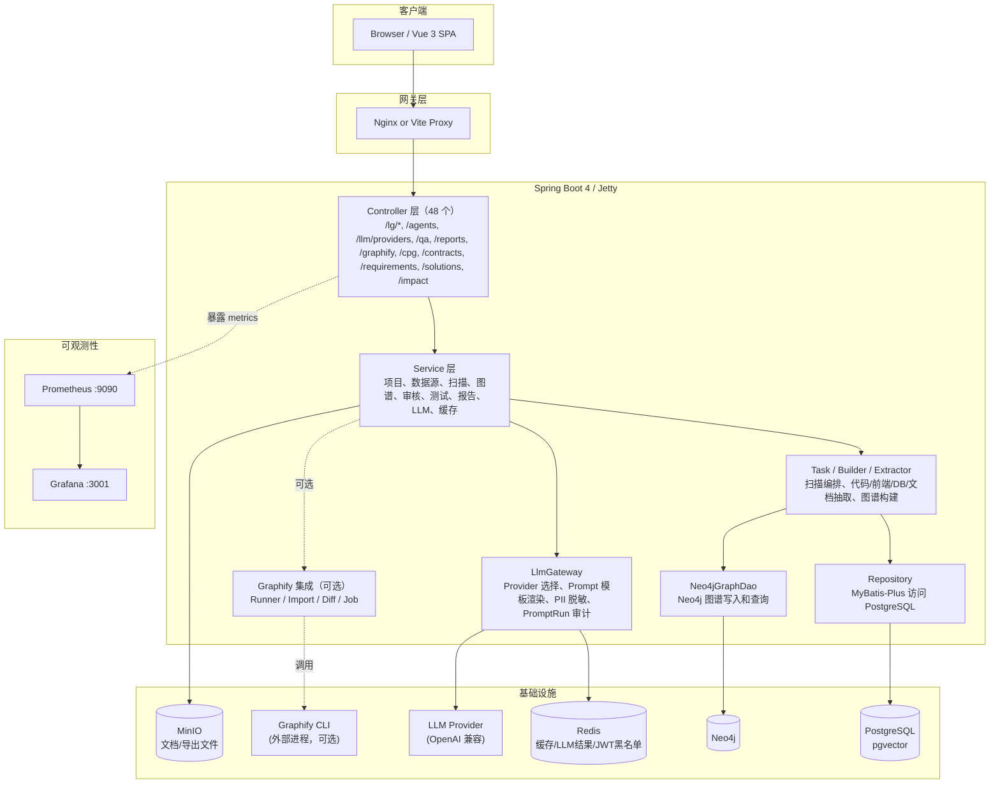

外部访问路径说明：

- 后端 context-path 是 `/api`。
- 代码中业务接口多以 `/lg/...` 声明，少量全局接口为 `/qa`、`/agents`、`/llm/providers`、`/reports`、`/cpg`、`/contracts`、`/requirements`、`/solutions`、`/impact`。
- 因此前端实际请求形态通常是 `/api/lg/...`。
- Graphify 相关接口前缀为 `/api/lg/projects/{projectId}/graphify/...`（作业/差异/问答）与 `/lg/projects/{projectId}/graphify/...`（分析/导入/运行/状态）。
- Actuator 暴露 `health`、`info`、`prometheus` 三个端点供监控采集；`/actuator/health` 和 `/actuator/info` 放行，`/actuator/prometheus` 需认证。

---

## 后端分层

### 包结构

```text
io.github.legacygraph
├── agent             # LLM Agent + adapter（21 个 Agent 类）
├── analysis          # 静态分析（CPG/CFG/DFG/AOP 代理/反射调用）
├── annotation        # @Log
├── aspect            # LogAspect 审计日志
├── builder           # 图谱构建器（GraphBuilder/FrontendGraphBuilder/EvidenceGraphWriter）
├── common            # Result、PageResult、NodeType、EdgeType、NodeStatus、ScanStep、TaskStatus、ErrorCode、GraphReleaseStatus、FlowDirection、TraversalDirection、SourceType
├── concurrency       # 并发属性抽取（ConcurrencyPropertyExtractor）
├── config            # Security、Redis、Flyway、Neo4j、MinIO、MyBatis、Async、health 配置
├── controller        # HTTP API（48 个）
├── dao               # Neo4jGraphDao / Neo4jAdminRepository / Neo4jQueryRepository / CypherCatalog
├── deployment        # Graphify 部署健康指标、运维监控、生产配置
├── dto               # API、图谱、报告、Trace、Agent、claim/gap/rag/scan/trace/understanding DTO
├── entity            # MyBatis-Plus 实体（73 个）
├── eval              # Graphify 质量基准评测（BenchmarkCase/Result/Scorer）
├── event             # 领域事件与监听器（GraphUpdated/ScanCompleted/ProjectCreated 等）
├── exception         # 统一异常
├── extractors        # Java/Vue/MyBatis/SQL/DB/Document/BPMN 抽取器 + adapter
│   └── bpmn          # BPMN 2.0 流程解析（Camunda/Flowable/Activiti 兼容）
├── federation        # 跨仓库图谱联邦（CrossRepositoryLinker/FederatedGraphScope）
├── filter            # JwtAuthenticationFilter
├── governance        # Graphify 访问策略、出处脱敏、角色
├── graphify          # Graphify 作业/快照/差异/回滚/指标（作业态为内存态）
├── handler           # MyBatis TypeHandler（FloatArrayTypeHandler，pgvector 向量）
├── integration       # 外部集成（integration/graphify: CLI Runner/Parser/Import/兼容性）
├── llm               # LlmGateway、PromptTemplateLoader、PII 脱敏、SecretScanService
├── model             # 领域模型
├── plugin            # 插件注册表（PluginRegistry/PluginInvocationService/McpPluginAdapter）
├── query             # Graphify 问答服务（GraphifyQuestionService）
├── repository        # MyBatis-Plus Mapper，统一继承 LegacyBaseMapper
├── review            # Graphify 规则化评审（ReviewRuleEngine）
├── security          # 出处/敏感信息脱敏
├── service           # 业务服务（21 个子包：acl/change/document/evaluation/feedback/graph/parse/qa/report/requirement/retrieval/scan/security/solution/source/system/systemoverview/test/user/viz）
├── task              # 扫描编排和测试调度（含 step 子包）
├── tenant            # 多租户配额（TenantQuotaManager）
├── terminology       # 术语映射（TerminologyService/ConfigurableTerminologyService）
├── test              # 测试执行器和断言工具
├── understanding     # 代码理解编排 + 工具路由（ToolRouter/ToolRunRecorder/ScanUnderstandingEnhancer）
└── util              # JwtUtil 等工具
```

> 说明：`lg_change_task`/`lg_knowledge_claim`/`lg_qa_*`/`lg_semantic_cache`/`lg_requirement_*`/`lg_solution_*` 等表对应的 Service 分别落在 `service/change`、`service/graph`、`service/qa`、`service/requirement`、`service/solution` 等子包。Graphify 相关能力分散在 `integration/graphify`、`graphify`、`deployment`、`eval`、`federation`、`governance`、`query`、`review`、`security` 等包。

### 主要 Controller

当前共 48 个 Controller（路由前缀为代码中 `@RequestMapping` 声明值，外部访问需再加 `/api` 前缀）：

| Controller | 路由前缀 | 职责 |
|------------|----------|------|
| `AuthController` | `/lg/auth` | 登录、登出、刷新、当前用户 |
| `ProjectController` | `/lg/projects` | 项目 CRUD |
| `ProjectOverviewController` | `/lg/projects/{projectId}` | 项目概览 |
| `SourceController` | `/lg/projects/{projectId}/sources` | 代码仓库、数据库连接、文档资料接入 |
| `ScanController` | `/lg/projects/{projectId}/scan-versions` | 扫描版本和扫描生命周期 |
| `GraphQueryController` | `/lg/projects/{projectId}` | 图谱查询、调用链、表影响、统一图谱、表列表 |
| `GraphDiffController` | `/lg/graph/diff` | 图谱版本差异 |
| `GraphifyController` | `/lg/projects/{projectId}` | Graphify 分析/导入/运行/状态 |
| `GraphifyJobController` | `/api/lg/projects/{projectId}/graphify/jobs` | Graphify 作业 CRUD、重试、取消、回滚 |
| `GraphifyDiffController` | `/api/lg/projects/{projectId}/graphify/diff` | Graphify 版本差异 |
| `GraphifyQuestionController` | `/api/lg/projects/{projectId}/graphify/questions` | Graphify 问答 |
| `FactController` | `/lg/projects/{projectId}` | 事实和证据查询、代码/文档事实抽取 |
| `KnowledgeController` | `/lg/projects/{projectId}/knowledge` | 知识断言、缺口、领域本体 |
| `ReviewController` | `/lg/projects/{projectId}/reviews` | 人工审核 |
| `EvidenceConflictController` | `/lg/evidence-conflicts` | 证据冲突管理 |
| `TestCaseController` | `/lg/projects/{projectId}` | 测试用例、测试运行、回调 |
| `TestGenerationController` | `/lg/projects/{projectId}/test-generation` | AI 测试用例生成 |
| `ReportController` | `/lg/projects/{projectId}` | 报告生成和查询 |
| `ReportExportController` | `/reports` | 报告导出 |
| `ValidationController` | `/lg/validation` | 图谱验证报告和置信度更新 |
| `TraceController` | `/lg/projects/{projectId}/runtime` | 运行时 span 上报、拓扑和链路列表 |
| `VectorController` | `/lg/vector/projects/{projectId}` | 向量写入、语义检索、相似节点 |
| `GraphQaController` | `/qa` | RAG + 图邻域问答 |
| `EnhancedQaController` | `/qa` | 增强问答（含 `/qa/ask/stream` 流式） |
| `QaEvaluationController` | `/qa/evaluations` | QA 评测管理 |
| `QaFeedbackController` | `/qa/feedbacks` | QA 反馈管理 |
| `LlmAgentController` | `/agents` | Agent 运行入口 |
| `AgentRunController` | `/agents/runs` | Agent 运行合约记录查询 |
| `CodeUnderstandingController` | `/lg/projects/{projectId}/understanding` | 代码理解报告、工具健康检查 |
| `ChangeTaskController` | `/change-tasks` | 变更任务 CRUD、状态流转 |
| `RequirementController` | `/requirements` | 需求结构化（需求/条目/验收/约束/假设/开放问题） |
| `SolutionController` | `/solutions` | 方案生成与审核 |
| `ContractController` | `/contracts` | 契约管理与导出 |
| `ContractLegacyRedirectController` | `/contracts` | 旧版契约路径重定向 |
| `CpgController` | `/cpg` | 代码属性图查询（CPG/CFG/DFG） |
| `ImpactGraphController` | `/impact` | 变更影响图谱 |
| `ImpactVisualizationController` | `/impact` | 影响可视化 |
| `CrossRepoImpactController` | `/cross-repo/impact` | 跨仓库影响传播 |
| `SystemOverviewController` | `/lg/system-overview` | 系统概览查询 |
| `SystemOverviewIngestController` | `/lg/system-overview` | 系统概览摄入（部分需 ADMIN） |
| `SelfAnalysisController` | `/lg/self-analysis` | 自分析引导（需 ADMIN） |
| `LlmProviderController` | `/llm/providers` | LLM Provider 管理 |
| `PromptTemplateController` | `/lg/admin/prompts` | Prompt 模板管理 |
| `SystemController` | `/lg/system` | 用户、字典、配置 |
| `AuditLogController` | `/lg/audit` | 审计日志 |
| `NotificationController` | `/lg/notifications` | 系统通知 |
| `PluginController` | `/lg/plugins` | 插件管理 |
| `QuotaController` | `/lg/quota` | 租户配额 |

---

## 核心流程

### 主流程：从新建项目到完整图谱

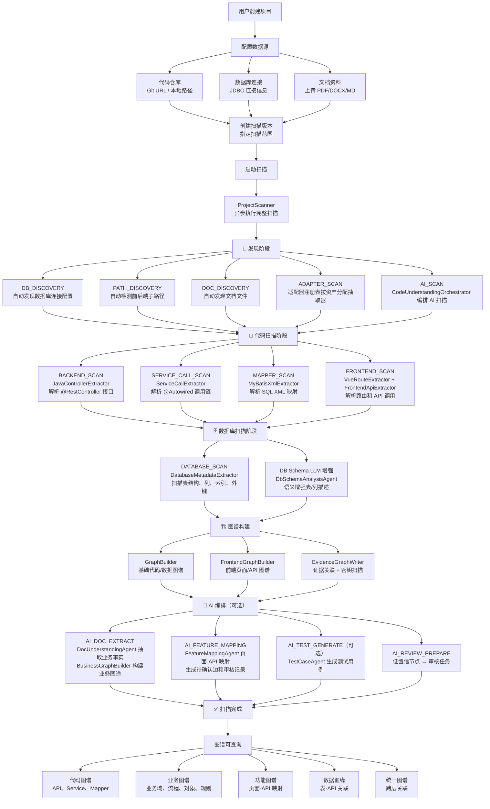

### 扫描生命周期

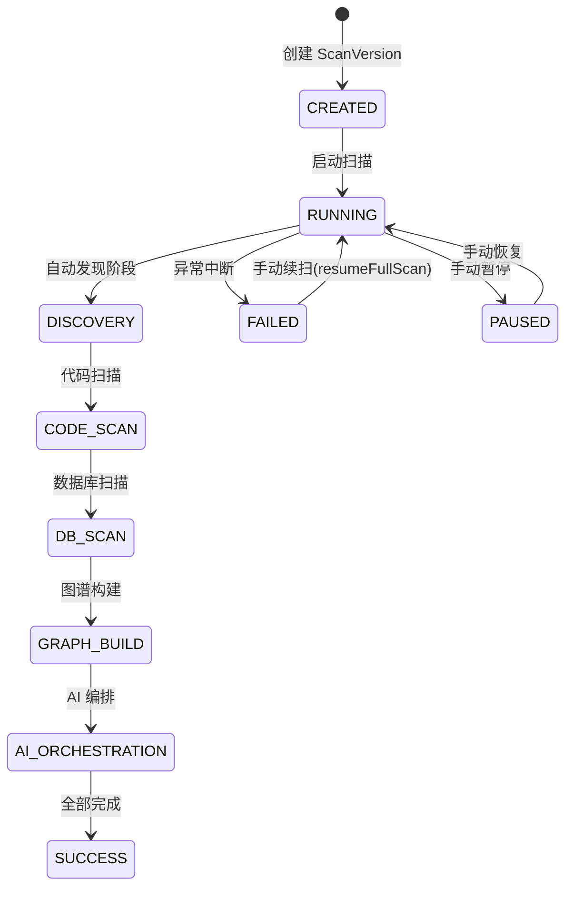

### 扫描内部执行流程（ProjectScanner）

```mermaid
flowchart TD
    START["startFullScan()<br/>@Async 异步入口"] --> INVALIDATE["失效图谱缓存<br/>graphCacheInvalidator"]
    INVALIDATE --> SET_RUNNING["设置 ScanVersion 状态为 RUNNING"]
    SET_RUNNING --> BODY["runScanBody()<br/>同步执行扫描主体"]

    BODY --> PARSE_SCOPE["解析 scanScope<br/>JSON → repoIds/dbIds/docIds/scanTypes"]
    PARSE_SCOPE --> RESOLVE_DIR["解析 baseDir<br/>从 CodeRepo 获取本地路径"]

    RESOLVE_DIR --> DISCOVERY["=== 发现阶段 ==="]
    DISCOVERY --> D1["DB_DISCOVERY<br/>扫描 application.yml/properties<br/>自动创建 DbConnection"]
    D1 --> D2["PATH_DISCOVERY<br/>检测 pom.xml/package.json<br/>回填 backend_sub_path/frontend_sub_path"]
    D2 --> D3["DOC_DISCOVERY<br/>扫描 .md/.pdf/.docx<br/>自动创建 Document 记录"]
    D3 --> D4["ADAPTER_SCAN<br/>ExtractionAdapterRegistry<br/>按资产匹配 Adapter 补充抽取"]

    D4 --> CODE_SCAN{"scanTypes<br/>包含 CODE_SCAN?"}
    CODE_SCAN -->|是| C1["BACKEND_SCAN<br/>JavaControllerExtractor<br/>扫描 Controller 接口"]
    C1 --> C2["SERVICE_CALL_SCAN<br/>ServiceCallExtractor<br/>扫描注入调用关系"]
    C2 --> C3["MAPPER_SCAN<br/>MyBatisXmlExtractor<br/>扫描 MyBatis XML"]
    C3 --> C4["FRONTEND_SCAN<br/>VueRouteExtractor + FrontendApiExtractor<br/>扫描前端路由/API"]
    C4 --> DB_SCAN
    CODE_SCAN -->|否| DB_SCAN{"scanTypes<br/>包含 DB_SCAN?"}

    DB_SCAN -->|是| DB1["遍历已配置的 DbConnection"]
    DB1 --> DB2["createDataSource()<br/>动态创建数据源连接"]
    DB2 --> DB3["DatabaseMetadataExtractor<br/>扫描表/列/索引/外键"]
    DB3 --> DB4["LLM Schema 增强<br/>DbSchemaAnalysisAgent<br/>语义增强表列描述"]
    DB4 --> GRAPH
    DB_SCAN -->|否| GRAPH

    GRAPH["=== 图谱构建 ==="]
    GRAPH --> G1["GraphBuilder<br/>构建基础代码/数据图谱"]
    G1 --> G2["EvidenceGraphWriter<br/>证据关联 + SecretScanService 密钥扫描"]
    G2 --> G3["Neo4jGraphDao<br/>写入 Neo4j 图数据库"]

    G3 --> AI{"enableAi=true?"}
    AI -->|是| A1["AiScanOrchestrator.orchestrate()"]
    A1 --> A2["AI_DOC_EXTRACT<br/>文档→业务事实→BusinessGraphBuilder"]
    A2 --> A3["AI_CONTRACT_SCAN<br/>CodeUnderstandingOrchestrator 契约扫描"]
    A3 --> A4["AI_FEATURE_MAPPING<br/>页面-API 映射对齐"]
    A4 --> A5["AI_TEST_GENERATE<br/>可选：生成测试用例"]
    A5 --> A6["AI_REVIEW_PREPARE<br/>低置信节点→审核任务"]
    A6 --> SUCCESS
    AI -->|否| SUCCESS

    SUCCESS["设置 status=SUCCESS<br/>更新 finished_at"] --> END_SCAN["扫描结束"]

    BODY -->|异常| FAILED["设置 status=FAILED<br/>记录 errorMessage<br/>无自动重试"]
```

### AI 编排流程（AiScanOrchestrator）

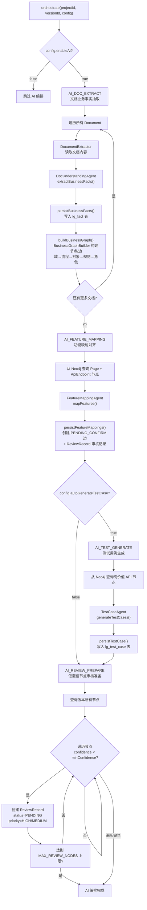

### 抽取适配器体系（ExtractionAdapter）

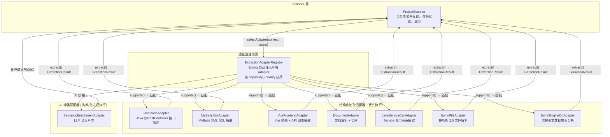

### BPMN 流程引擎解析

系统支持 Camunda/Flowable/Activiti 等主流 BPMN 2.0 流程引擎的代码图谱关联：

- **`BpmnModelParser`**：解析 BPMN 2.0 XML 文件/流，提取流程定义、用户任务、服务任务、网关节点及流转关系
- **`BpmnFileAdapter`**：适配器封装，扫描 `.bpmn` 文件并构建 BPMN 图谱节点和边
- **`BpmnEngineDbAdapter`**：适配器封装，分析流程引擎数据库表（如 `act_ru_*`），提取运行时流程实例信息
- **`ProcessEngineConfigExtractor`**：从应用配置文件（application.yml/properties）中识别流程引擎连接信息
- **`ProcessRuntimeAnalyzer`**：运行时分析，建立 BPMN 节点与代码 Service/Listener 方法的关联

支持的引擎类型：`CAMUNDA`、`FLOWABLE`、`ACTIVITI`、`CUSTOM`（自研流程引擎）。

图谱节点类型：`ProcessDefinition`、`UserTask`、`ServiceTask`、`Gateway`
图谱关系类型：`FLOW_TO`、`RUNTIME_FLOW_TO`、`HAS_FLOW_NODE`、`EXECUTES_BY`、`LISTENED_BY`、`DEPLOYED_TO`


---

## 核心模块

### 项目和数据源

项目是最高组织单元，代码仓库、数据库连接、文档、扫描版本都挂在项目下。

主要类：

- `ProjectController` / `ProjectService`
- `SourceController`
- `CodeRepo`、`DbConnection`、`Document`
- `CodeRepoRepository`、`DbConnectionRepository`、`DocumentRepository`

代码仓库支持后端/前端子路径字段：`backend_sub_path`、`frontend_sub_path`。这允许同一个全栈仓库只扫描指定子目录。

### 图谱模块

图谱**写入和查询**均以 Neo4j 为主存储，PostgreSQL 仅保留证据关联和审核数据。

- **Neo4j**：所有图谱节点（GraphNode）和边（GraphEdge）的唯一读写存储。通过 Cypher MERGE 原子去重写入，Cypher MATCH 完成复杂路径、邻域、统计和拓扑查询。
- **PostgreSQL**：仅存储证据关联（`lg_evidence`、`lg_node_evidence`、`lg_edge_evidence`）和审核记录（`lg_review_record`）。`lg_graph_node` / `lg_graph_edge` 表在 `V5` 迁移中建表但**当前业务代码已不再写入**——`GraphNode` / `GraphNodeRepository` 已标记 `@deprecated`，仅保留 MyBatis-Plus Bean 定义维持 Spring 上下文兼容性。
- **`Neo4jGraphDao`**：Neo4j 唯一访问入口，提供 `mergeNode()`/`mergeEdge()`（幂等写入）、`queryNodes()`/`queryEdges()`（图谱查询）、`findNode()`/`findEdge()`（精确查找）等完整图谱操作。
- **`EvidenceGraphWriter`**：以证据为中心的统一写入器。所有 Builder 通过它调用 `Neo4jGraphDao.mergeNode()`/`mergeEdge()` 写入 Neo4j，同时在 PostgreSQL 创建证据记录（`lg_evidence` → `lg_node_evidence` / `lg_edge_evidence`），并集成 `SecretScanService` 对源码证据做密钥扫描脱敏。
- **`GraphQueryService`**：图谱查询入口，`getUnifiedGraph()` 等方法直接从 Neo4j 查询节点和边，并通过 Redis 缓存结果。
- **`Neo4jSyncService`**：已标记 `@Deprecated`，方法仅委托给 `Neo4jGraphDao`（如 `syncGraph` → `deleteGraph`），保留用于旧调用方兼容。

构建器：

| 类 | 职责 |
|----|------|
| `GraphBuilder` | 从后端代码、SQL、数据库元数据构建基础代码/数据图谱 |
| `FrontendGraphBuilder` | 从 Vue 路由和前端 API 构建页面、按钮、API 调用图谱 |
| `BusinessGraphBuilder` | 从文档理解/AI 事实构建业务域、流程、对象、规则图谱 |
| `EvidenceGraphWriter` | 以证据为中心写入节点/边并建立证据关联，集成 SecretScanService |
| `FeatureSliceBuilder` | 汇总功能切片，服务证据工作台 |
| `TraceGraphAligner` | 将运行时 Trace 对齐到静态图谱 |

图谱节点类型以 `NodeType` 为准，关系类型以 `EdgeType` 为准。

### AI 和 Agent 模块

LLM 入口是 `LlmGateway`：

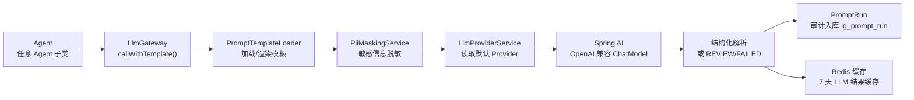

当前主要 Agent（共 21 个）：

| Agent | 职责 |
|-------|------|
| `CodeFactAgent` | 代码事实语义理解 |
| `DocUnderstandingAgent` | 文档业务事实、角色、对象、规则、状态流转抽取 |
| `FeatureMappingAgent` | 页面、按钮、API、权限和业务动作对齐 |
| `GraphMergeAgent` | 图谱节点合并决策 |
| `TestCaseAgent` | 测试用例生成 |
| `TestGenerationAgent` | AI 测试生成增强 |
| `ReviewAgent` | 人工审核建议 |
| `DbSchemaAnalysisAgent` | 数据库 Schema 语义增强 |
| `SqlAdvisorAgent` | SQL 性能优化建议 |
| `TestFailureAnalysisAgent` | 测试失败根因分析 |
| `ReportInsightAgent` | 报告洞察和行动建议 |
| `ChangeImpactAgent` | 变更影响分析 |
| `MigrationAgent` | 迁移转换建议 |
| `RefactorAgent` | 重构建议 |
| `PrDescriptionAgent` | PR 描述生成 |
| `QaAgent` | RAG + 图邻域问答 |
| `EnhancedQaAgent` | 增强流式问答 |
| `GraphRagPlannerAgent` | GraphRAG 计划与意图支持 |
| `GapFinderAgent` | 知识图谱缺口发现 |
| `PatchPlanAgent` | 补丁方案规划 |
| `AddColumnPatchAgent` | 加列补丁生成 |

> 辅助类：`ChangeImpactQuestionParser`、`HyDEGenerator`、`QueryIntentClassifier`、`QueryRewriter`、`QueryIntent`、`QaAnswerResult`。适配器位于 `agent/adapter` 子包（`AddColumnPatchAgentAdapter`、`MigrationAgentAdapter`、`RefactorAgentAdapter`）。

### 核心 Service

按 `service/` 子包分组（21 个子包 + 4 个根级 Service，仅列关键服务）：

| 子包 | Service | 职责 |
|------|---------|------|
| `scan` | `ProjectService` / `ScanVersionService` / `SourceService` | 项目、扫描版本、数据源管理 |
| | `DatabaseMetadataScanService` | 数据库元数据扫描 |
| | `TraceIngestionService` | 运行时 span 上报 |
| | `ProjectOverviewService` | 项目概览聚合 |
| | `ScanFinalizationService` / `IncrementalScanService` | 扫描收尾与增量扫描 |
| | `CommunityDetectionService` / `EdgeCompletionService` | 社区发现与边补全 |
| | `FileSnapshotTombstoneService` / `ProjectConventionIngestService` | 文件快照墓碑与项目约定摄入 |
| | `DocumentContentService` | 文档内容服务 |
| `graph` | `GraphQueryService` | 图谱查询（代码/业务/统一图谱，Redis 缓存） |
| | `GraphMergeService` | 节点合并决策 |
| | `GraphValidatorService` | 节点/边状态与置信度更新 |
| | `GraphWriteIntentService` | 图谱写入意图（Outbox 模式，幂等+重试+死信，V31 增强） |
| | `GraphReleaseService` | 图谱发布门禁 |
| | `KnowledgeClaimService` | 知识断言、缺口发现 |
| | `EvidenceConflictService` | 证据冲突检测与处置 |
| | `GapFinderService` / `ImpactAnalysisService` | 缺口发现与影响分析 |
| | `Neo4jSyncService` | `@Deprecated`，委托 `Neo4jGraphDao` |
| `qa` | `HybridRetrievalService` | 混合检索（向量 + 图邻域） |
| | `VectorizationService` / `VectorRetrievalService` | 向量化与向量检索 |
| | `ReRankingService` | 重排序（CrossEncoder/Keyword/Document） |
| | `ReciprocalRankFusionService` | RRF 混合检索融合 |
| | `DefaultQaEvaluationService` / `QaEvaluationService` | QA 评测 |
| `change` | `ChangeTaskService` | 变更任务状态机 |
| | `ColumnIngestService` | 列摄入服务 |
| | `ImpactSubgraphService` / `ChangeReportService` | 影响子图与变更报告 |
| `report` | `ReportingService` / `ReportExportService` | 报告生成与导出 |
| | `MigrationReportService` / `ScanPerformanceReportService` / `ScanResearchReportService` | 专项报告 |
| `system` | `SysUserService` / `SysDictService` / `SysConfigService` | 用户/字典/配置 |
| | `LlmProviderService` / `PromptTemplateService` | LLM Provider 与 Prompt 模板 |
| | `AuditLogService` / `TokenBlacklistService` / `CacheService` | 审计/Token 黑名单/缓存 |
| | `AuthSessionService` | 认证会话管理 |
| `test` | `TestCaseService` / `TestResultUpdateService` | 测试用例与结果回写 |
| `document` | `DocumentPartitionService` / `StructureAwareChunkService` | 文档分区与结构感知切块 |
| | `FastPartitionService` / `LayoutPartitionService` / `OcrFallbackService` | 快速分区/布局分区/OCR 降级 |
| `requirement` | `RequirementExtractionService` / `RequirementLinkingService` | 需求抽取与关联 |
| | `AcceptanceVerificationService` / `RequirementPatchService` | 验收验证与需求补丁 |
| | `ContractGeneratorService` / `RequirementDataLineageService` / `ImpactSubgraphService` | 契约生成与数据血缘 |
| `solution` | `SolutionQueryService` / `SolutionReviewService` / `SolutionSimilarityService` | 方案查询/审核/相似度 |
| `systemoverview` | `SystemOverviewService` / `SystemOverviewIngestService` | 系统概览与摄入 |
| | `SystemOverviewDocumentService` / `SelfAnalysisBootstrapService` | 概览文档与自分析引导 |
| `evaluation` | `RagasMetricsService` / `RagasScoringService` / `QaFeedbackIngestService` | RAGAS 评测与反馈摄入 |
| `feedback` | `QaFeedbackService` | QA 反馈管理 |
| `acl` | `AclFilterService` | 访问控制过滤 |
| `source` | `SourceSnapshotService` | 源码快照 |
| `user` | `UserStoreService` | 用户存储 |
| 根 | `AgentRunService` / `NotificationService` / `IncrementalScanService` / `PluginTestService` | Agent 运行记录、通知、增量扫描、插件测试 |

> 扫描生命周期编排由 `task/ProjectScanner` 与 `task/AiScanOrchestrator`（含 `step` 子包）承担（不在 `service` 包）；代码理解编排由 `understanding/CodeUnderstandingOrchestrator` + `CodeUnderstandingReportService` 承担。`parse`、`rerank`、`retrieval`、`security`、`viz` 子包为策略/工具类，无 `*Service` 类。

### 审核和证据

AI 产出的节点、边、事实默认不直接确认为真。系统通过以下数据保证可追溯：

- `lg_evidence`
- `lg_node_evidence`
- `lg_edge_evidence`
- `lg_review_record`
- `lg_prompt_run`
- `lg_tool_run` + `lg_tool_evidence`（工具运行证据）
- `lg_knowledge_claim`（证据化知识断言）

审核流程：

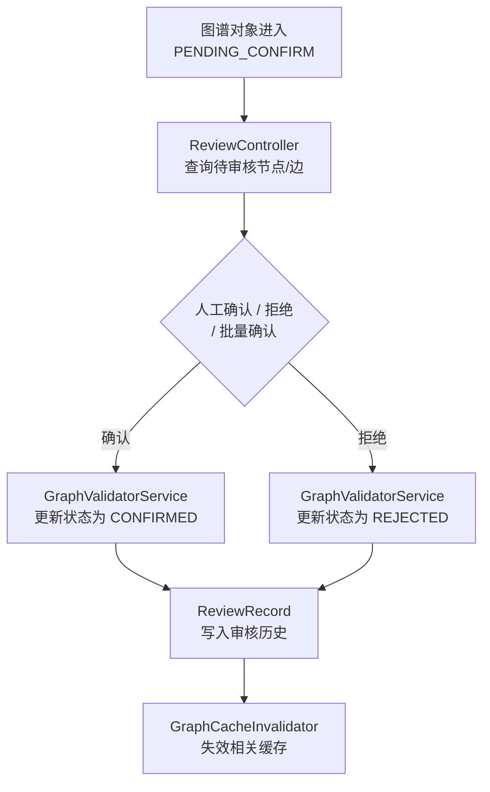

### 测试模块

测试模块包含用例管理、用例生成、执行批次、结果回调、失败分析和置信度回写。

主要类：

- `TestCaseController`
- `TestCaseService`
- `TestExecutionScheduler`
- `TestResultUpdateService`
- `ApiTestExecutor`
- `E2eTestExecutor`
- `DbAssertionExecutor`
- `TestFailureAnalysisAgent`

主要表：

- `lg_test_case`
- `lg_test_assertion`
- `lg_test_result`
- `lg_test_run`

### 报告模块

报告类型：

- 迁移就绪度报告
- 置信度趋势报告
- 测试覆盖率报告
- 图谱质量报告
- 报告洞察建议
- MD/PDF/Excel 导出

主要类：

- `ReportController`
- `ReportExportController`
- `ReportingService`
- `ReportExportService`
- `ReportInsightAgent`

### 向量和问答

向量能力由 `VectorizationService`、`VectorRetrievalService` 和 `VectorController` 提供。RAG 问答由 `GraphQaController` 和 `QaAgent` 提供，结合向量召回、图邻域和 LLM 生成回答。

### 运行时链路

运行时链路模块接收 span 上报，存入 `lg_runtime_trace`，并可查询运行时拓扑和 trace 列表。

主要类：

- `TraceController`
- `TraceIngestionService`
- `TraceGraphAligner`
- `RuntimeTrace`

运行时数据可用于：

- 标记静态节点是否被运行时验证。
- 为图谱合并和测试失败分析提供真实调用证据。
- 辅助识别 runtime-only 边和漂移队列。

---

## Graphify 集成

Graphify 是一个外部代码图谱分析 CLI。LegacyGraph 通过进程调用方式集成它，把其产物 `graph.json` 规范化映射后导入 Neo4j，并围绕它构建作业调度、版本差异、回滚、质量评测、跨仓联邦与规则化评审能力。集成默认关闭（`legacygraph.graphify.enabled=false`）。

### 配置

`backend/src/main/resources/application.yml`：

```yaml
legacygraph:
  graphify:
    enabled: false
    executable: graphify          # CLI 可执行文件路径
    timeout-seconds: 900          # 单次执行超时
    max-output-bytes: 500000
    output-dir-name: graphify-out # 输出目录名（位于源码目录下）
    keep-temp-files: false
    work-dir-whitelist: []        # 工作目录白名单，生产必须配置
    extra-args:
      - --no-viz
      - --timing
```

### 核心类

| 包 | 类 | 职责 |
|----|----|------|
| `integration/graphify` | `GraphifyProperties` | 配置属性绑定（`legacygraph.graphify`） |
| | `GraphifyCommandBuilder` | 构建分析命令与版本探测命令 |
| | `GraphifyRunner` | 执行 CLI、管理临时输出目录、解析 `graph.json` |
| | `GraphifyGraphParser` / `GraphifyGraphJson` | 解析产物为节点/边结构 |
| | `GraphifyCanonicalMapper` | 将 Graphify 节点/边规范化映射到 `NodeType`/`EdgeType` |
| | `GraphifyCompatibilityService` / `GraphifySchemaVersion` / `GraphifyCompatibilityReport` | 导入前契约与 schema 版本兼容性检查 |
| | `GraphifyImportService` | 把 `graph.json` 经 `EvidenceGraphWriter` 导入 Neo4j |
| `graphify` | `GraphifyImportJob` / `GraphifyImportJobRepository` | 导入作业实体与仓储（**内存态**，`ConcurrentHashMap`，不落库） |
| | `GraphifyImportJobService` / `GraphifyImportJobScheduler` | 作业生命周期：创建/启动/完成/失败/重试/取消 |
| | `GraphifyImportSnapshot` / `GraphifyImportSnapshotService` | 导入快照，供版本差异 |
| | `GraphifyDiff` / `GraphifyDiffService` | 两版本图谱差异 |
| | `GraphifyRollbackService` | 回滚一次导入 |
| | `GraphifyMetrics` | 导入指标 |
| `deployment` | `GraphifyHealthIndicator` / `GraphifyOpsMonitor` / `GraphifyProdConfig` | 健康检查、运维指标、生产配置 |
| `eval` | `GraphifyBenchmarkCase` / `Result` / `Scorer` | 质量基准评测 |
| `federation` | `CrossRepositoryLinker` / `FederatedGraphScope` | 跨仓库图谱关联与联邦范围 |
| `governance` | `GraphifyAccessPolicy` / `GraphifyProvenanceRedactor` | 访问策略、出处脱敏 |
| `query` | `GraphifyQuestionService` | 基于 Graphify 产物的问答 |
| `review` | `GraphifyReviewRuleEngine` / `ReviewRule` / `ReviewAudit` | 规则化评审与审计 |

### 端到端流程

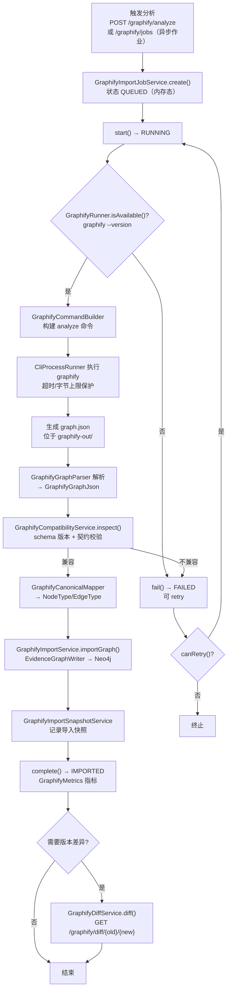

### REST 端点

| 控制器 | 方法 + 路径 | 说明 |
|--------|------------|------|
| `GraphifyController` | `POST /lg/projects/{projectId}/graphify/analyze` | 同步分析源码目录 |
| | `POST /lg/projects/{projectId}/scan-versions/{versionId}/graphify/import` | 导入已生成的 `graph.json` |
| | `POST /lg/projects/{projectId}/scan-versions/{versionId}/graphify/run` | 分析 + 导入一体 |
| | `GET /lg/projects/{projectId}/graphify/status` | 查询集成状态与 CLI 可用性 |
| `GraphifyJobController` | `POST /api/lg/projects/{projectId}/graphify/jobs` | 创建异步导入作业 |
| | `GET .../jobs` `GET .../jobs/{jobId}` | 列表 / 详情 |
| | `POST .../jobs/{jobId}/retry` `/cancel` `/rollback` | 重试 / 取消 / 回滚 |
| `GraphifyDiffController` | `GET /api/lg/projects/{projectId}/graphify/diff/{oldVersionId}/{newVersionId}` | 版本差异 |
| `GraphifyQuestionController` | `POST /api/lg/projects/{projectId}/graphify/questions` | 问答 |

> 注意：Graphify 作业状态（`GraphifyImportJob`）保存在内存 `ConcurrentHashMap` 中，**应用重启后丢失**，不持久化到 PostgreSQL；导入产物本身（节点/边）写入 Neo4j，快照由 `GraphifyImportSnapshotService` 管理。

---

## 数据流

### 静态扫描数据流

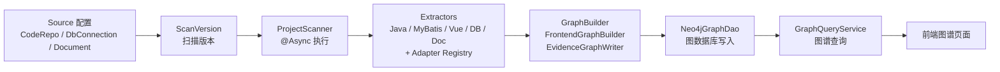

### AI 增强数据流

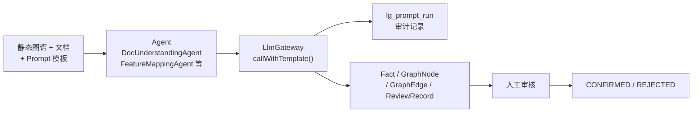

### 前端请求数据流

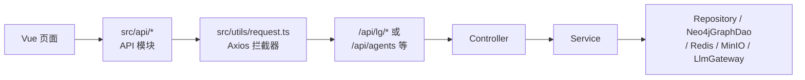

### 密钥扫描数据流（SecretScanService）

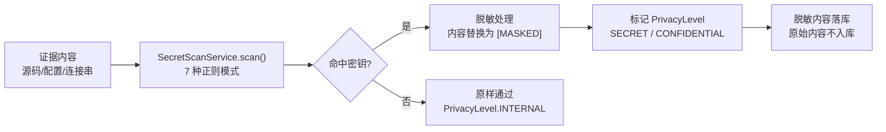

---

## 安全架构

### 认证

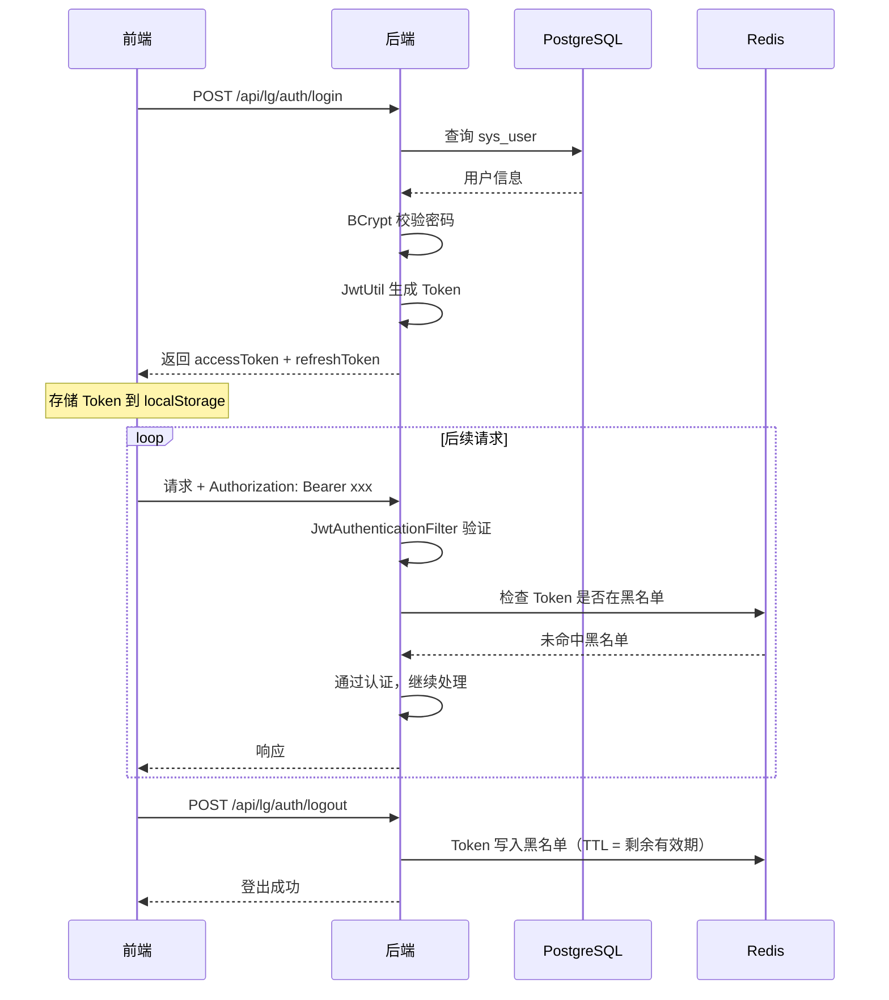

默认放行路径（`SecurityConfig` 中 `permitAll`）：

- `/lg/auth/login`
- `/lg/auth/refresh`
- `/lg/auth/me`
- `/lg/auth/logout`
- `/lg/projects/*/sources/documents/*/download`
- `/lg/projects/*/sources/browse-directory`
- `/lg/plugins`
- `/qa/ask/stream`（流式问答）
- `/swagger-ui/**`
- `/v3/api-docs/**`
- `/swagger-ui.html`
- `/actuator/health`、`/actuator/info`（健康检查放行）

其余 `/actuator/**`（含 `/actuator/prometheus`）与所有业务接口均需认证。

需 ADMIN 角色的路径（非 permitAll，但属于重要授权规则）：

- `/lg/plugins/register`
- `/lg/system-overview/ingest`、`/lg/system-overview/ingest-builtins`、`/lg/system-overview/clear`
- `/lg/self-analysis/bootstrap`

其他关键安全设置：CSRF 禁用、会话策略 `STATELESS`、CORS 允许通配来源（生产环境应限制）、`JwtAuthenticationFilter` 在 `AuthorizationFilter` 之前、`PasswordEncoder` 使用 `BCryptPasswordEncoder`。该 `SecurityFilterChain` 标注 `@ConditionalOnMissingBean(name = "testSecurityFilterChain")`，允许测试环境覆盖。

### 审计

`@Log` + `LogAspect` 记录操作到 `lg_sys_operation_log`。审计字段包含 traceId、操作名、方法、URI、请求方式、IP、操作者、耗时、请求参数、响应摘要和异常栈。

### 敏感信息

- Prompt 输入通过 `PiiMaskingService` 脱敏。
- LLM Provider API Key 存在 `lg_llm_provider.api_config` 中，日志不得明文输出。
- 数据库连接密码和 MinIO 密钥不得返回给前端。
- 源码证据入库前经 `SecretScanService` 扫描，命中密钥的内容脱敏后落库。

---

## 缓存架构

Redis 用途（默认 database=11，可通过 `REDIS_DATABASE` 环境变量覆盖）：

- Spring Cache。
- LLM Provider 和 Prompt 缓存。
- LLM 结果缓存，key 形态 `llm:result:{template}:{inputHash}`，TTL 7 天。
- JWT 登出黑名单（前缀 `auth:blacklist:`）。
- 向量检索缓存、图谱视图/报告缓存。

Lettuce 连接池：`max-active=16`、`max-wait=2000ms`、`max-idle=8`、`min-idle=4`、`timeout=5000ms`、`connect-timeout=3000ms`。

缓存降级策略：

- Redis GET/PUT/EVICT/CLEAR 失败只记 warn，业务回源。
- 图谱、报告、验证、向量相关数据变更后使用缓存失效服务清理。

---

## 前端架构

```text
frontend/src
├── api             # API 模块（24 个 .ts）
├── components      # 通用组件
├── composables     # 组合式函数
├── constants       # 常量
├── locales         # 中/英国际化
├── router          # Vue Router（单一 index.ts）
├── stores          # Pinia + pinia-plugin-persistedstate
├── styles          # 全局样式
├── types           # TS 类型
├── utils           # request/download/export/loading 等工具
└── views           # 页面（63 个 .vue，23 个子目录 + 根目录散落 2 个）
```

主要页面域（`views/` 下目录）：

- `dashboard` 仪表盘
- `project` 项目列表 / 详情 / 概览
- `source` 代码仓库 / 数据库 / 文档
- `scan` 创建扫描 / 任务列表 / 版本列表
- `graph` 代码 / 统一 / 业务 / 功能 / 数据血缘 / 运行时 / 图谱差异 / 图谱问答（8 个页面）
- `fact` 事实列表 / 证据搜索
- `review` 审核列表 / 历史
- `test` 用例编辑 / 列表 / 运行详情 / 运行列表
- `report` 验证报告
- `migration` 风险列表 / 详情
- `system` 用户 / 字典 / 设置 / LLM Provider / Prompt / 插件（6 个页面）
- `audit` 审计日志
- `agent` Agent Hub / 历史
- `change` 变更任务 / PR 工作台
- `understanding` 代码理解报告
- `vector` 向量检索
- `workbench` 证据工作台 / 质量面板 / 漂移队列 / 证据冲突 / 功能切片 / 知识工作台 / 系统概览工作台（7 个页面）
- `graphify` 作业中心 / 版本差异 / 质量仪表盘 / 跨仓影响
- `requirement` 需求分析 / 需求影响
- `solution` 方案审核
- `settings` 主题设置
- `login` / `error`
- 根目录散落：`QaCaseDetailView.vue`、`QaEvaluationView.vue`

前端请求约定：

- `request.baseURL` = `import.meta.env.VITE_API_BASE_URL || '/api'`
- Vite 开发服务器端口 `5173`，`open: true`
- 开发代理 `/api` → `http://localhost:8080/api`（target 末尾含 `/api`，rewrite 剥离前端 `/api` 前缀）
- 请求拦截器自动附加 `Authorization: Bearer <token>` 和 `X-Trace-Id`（基于时间戳+随机数生成）
- 401 处理双重机制：`handleUnauthorized()`（清除鉴权+跳转登录，防重入 3s 重置）+ `handleTokenExpired()`（refreshToken 刷新+队列挂起重试+15s 超时保护）
- 页面组件不直接拼完整后端域名

---

## 部署架构

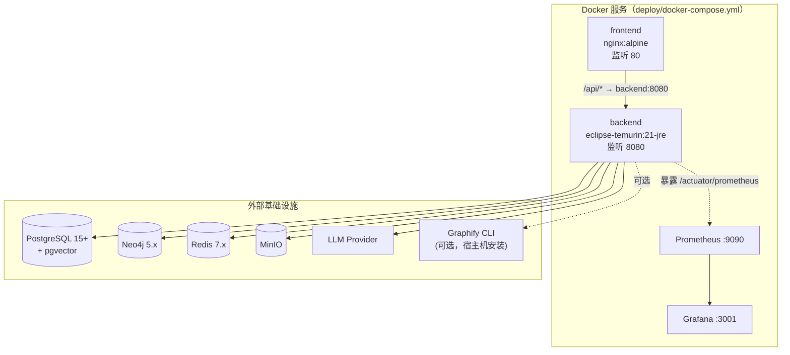

`deploy/docker-compose.yml` 启动四个服务：`legacygraph-backend`、`legacygraph-frontend`、`lg-prometheus`、`lg-grafana`。PostgreSQL、Neo4j、Redis、MinIO、LLM Provider 均使用外部服务，连接信息通过 `deploy/.env` 注入。Graphify CLI 为可选宿主机依赖，需在运行后端的环境上单独安装 `graphify` 可执行文件。Prometheus 采集后端 `/api/actuator/prometheus`，Grafana 仪表盘配置在 `deploy/monitoring/`。

---

## 可扩展性约定

### 新增表

1. 新增 Flyway 迁移脚本。
2. 新增实体和 Repository。
3. 如需 API，新增 Service 和 Controller。
4. 同步 H2 测试 schema/data。
5. 更新数据库设计文档。

### 新增图谱节点/关系

1. 更新 `NodeType` 或 `EdgeType`。
2. 更新构建器和 Neo4j 写入逻辑。
3. 更新前端类型、颜色、图例和筛选。
4. 增加 Builder/Service 测试。

### 新增 Agent

1. 在 `agent` 包新增 Agent 类。
2. 在 `lg_prompt_template` 增加模板。
3. 通过 `LlmGateway` 调用并写入 `lg_prompt_run`。
4. 增加结构化输出 DTO 和测试。
5. 如暴露 API，在 `LlmAgentController` 或独立 Controller 增加入口。

### 新增抽取适配器（ExtractionAdapter）

1. 实现 `ExtractionAdapter` 接口（`supports` + `extract` + `capability`）。
2. Spring 自动注入到 `ExtractionAdapterRegistry`。
3. 按 `AdapterCapability.priority` 自动排序。
4. 结构化的优先执行，AI 增强型在结构化之后执行。

---

## 版本历史

| 版本 | 日期 | 说明 |
|------|------|------|
| 5.0 | 2026-07-13 | 新增 BPMN 2.0 流程引擎解析模块（`extractors/bpmn` + `BpmnFileAdapter`/`BpmnEngineDbAdapter`）；NodeType 新增 `ProcessDefinition`/`UserTask`/`ServiceTask`/`Gateway`（共 55 个）；EdgeType 新增 `FLOW_TO`/`RUNTIME_FLOW_TO`/`HAS_FLOW_NODE`/`EXECUTES_BY`/`LISTENED_BY`/`DEPLOYED_TO`（共 68 个）；前端页面修正为 64 个；迁移版本补充至 V94（新增 V85–V94 共 10 个脚本：graph_release_metrics、file_snapshot_archive_view、qa_evaluation_run、seed_missing_edge_type_dict、neo4j_orphan_cleanup、process_fitness、solution_step_enhance、patch_draft、code_repo_pr_extension、change_task_sandbox_and_repo_token） |
| 4.0 | 2026-07-12 | 按 V1–V84 迁移脚本更新；Controller 总数修正为 48（新增 Contract/Cpg/Impact/CrossRepo/QaEvaluation/QaFeedback/Requirement/Solution/SystemOverview/SelfAnalysis/TestGeneration 等 14 个）；Entity 修正为 73；Agent 修正为 21（新增 TestGeneration/GraphRagPlanner/GapFinder/PatchPlan/AddColumnPatch）；Service 子包修正为 21 个；补充 analysis/concurrency/terminology 等新包；缓存补充 Redis database=11 与 Lettuce 连接池参数；SecurityConfig 放行路径补充 browse-directory/plugins 与 ADMIN 角色路径；前端 API 模块修正为 24、页面修正为 63；补充 PWA 配置与 request.ts 401 双重处理机制；补充虚拟线程异步任务说明 |
| 3.0 | 2026-07-06 | 新增 Graphify CLI 集成（`integration/graphify`、`graphify`、`deployment`、`eval`、`federation`、`governance`、`query`、`review`、`security` 包）及 4 个 Graphify Controller；Controller 总数修正为 34；部署架构补充 Prometheus/Grafana 可观测性栈；修正包结构（移除不存在的 `parser`/`change`/`knowledge`/`ontology`/`qa`/`cache`/`tool`/`async` 顶层包，补充实际新包）；修正 SecurityConfig 放行路径（新增 `/qa/ask/stream`，`/actuator/**` 改为认证）；Element Plus 版本修正为 2.14.2；前端目录与页面域对齐实际代码 |
| 2.0 | 2026-07-03 | 新增代码理解、变更闭环、知识断言、领域本体、QA 对话、语义缓存、AI 扫描异步任务等模块；补充新 Controller 和 Service |
| 1.3 | 2026-07-01 | 修正图谱存储描述：标注 PG 表已废弃（`@deprecated`），Neo4j 为唯一读写存储；补充 `GraphQueryService`、`Neo4jSyncService` 废弃状态；架构设计文档全部图表改为 Mermaid 格式 |
| 1.1 | 2026-06-30 | 按当前代码更新技术栈、模块、数据流、AI 编排、运行时链路、缓存和部署架构 |
| 1.0 | 2026-06-27 | 初始版本 |
