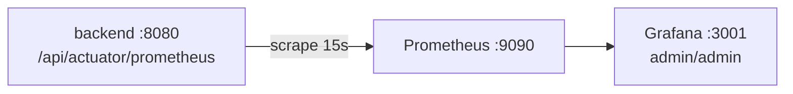

# LegacyGraph 运维手册

## 概述

本文档面向 LegacyGraph 运行维护，按当前代码和部署配置更新。系统由前端 Nginx 静态服务、后端 Spring Boot 应用和外部 PostgreSQL、Neo4j、Redis、MinIO、LLM Provider 组成。

当前部署约定：

- 后端监听：`8080`
- 后端 context-path：`/api`
- 前端生产服务：Nginx `80`
- 前端开发服务：Vite `5173`
- `deploy/docker-compose.yml` 启动四个服务：`legacygraph-backend`、`legacygraph-frontend`、`lg-prometheus`（`:9090`）、`lg-grafana`（`:3001`）；不启动数据库、中间件和对象存储。
- Graphify CLI 为可选宿主机依赖，启用 `legacygraph.graphify.enabled=true` 时需要。

---

## 环境要求

| 软件 | 建议版本 | 说明 |
|------|----------|------|
| JDK | 21+ | 后端运行 |
| Maven | 3.8+，Docker 构建使用 3.9.9 | 后端构建 |
| Node.js | 20+，Docker 构建使用 22-alpine | 前端构建 |
| PostgreSQL | 15+ | 主数据库 |
| pgvector | 与 PostgreSQL 匹配 | 向量检索 |
| Neo4j | 5.x | 图数据库 |
| Redis | 7.x | 缓存和 JWT 黑名单 |
| MinIO | 当前稳定版 | 文档和导出文件 |
| Docker | 20.10+ | 容器运行 |
| Docker Compose | 2.x | 应用编排 |

---

## 日常启动

### Docker Compose 启动前后端

`deploy/docker-compose.yml` 读取 `deploy/.env`。该文件应只保存在目标环境，不要提交真实密钥。

```bash
cd deploy
docker compose up --build -d
docker compose ps
```

查看日志：

```bash
cd deploy
docker compose logs -f backend
docker compose logs -f frontend
```

访问：

- 前端：`http://<host>:${FRONTEND_PORT:-80}`
- 后端健康检查：`http://<host>:${BACKEND_PORT:-8080}/api/actuator/health`
- Swagger：`http://<host>:${BACKEND_PORT:-8080}/api/swagger-ui.html`

### 本地后端启动

```bash
cd backend
mvn spring-boot:run
```

或：

```bash
cd backend
mvn clean package -DskipTests
java -jar target/legacygraph-api-1.0.0-SNAPSHOT.jar
```

### 本地前端启动

```bash
cd frontend
npm install
npm run dev
```

Vite 默认端口是 `5173`，`/api` 会代理到 `http://localhost:8080`。

---

## 配置项

### 必填外部依赖变量

| 变量 | 说明 |
|------|------|
| `POSTGRES_URL` | LegacyGraph 主库 JDBC URL |
| `POSTGRES_USERNAME` | PostgreSQL 用户 |
| `POSTGRES_PASSWORD` | PostgreSQL 密码 |
| `NEO4J_URI` | Neo4j Bolt 地址 |
| `NEO4J_USERNAME` | Neo4j 用户 |
| `NEO4J_PASSWORD` | Neo4j 密码 |
| `REDIS_HOST` | Redis 主机 |
| `REDIS_PORT` | Redis 端口 |
| `REDIS_PASSWORD` | Redis 密码，可按环境为空 |
| `MINIO_ENDPOINT` | MinIO/S3 兼容 endpoint |
| `MINIO_ACCESS_KEY` | MinIO Access Key |
| `MINIO_SECRET_KEY` | MinIO Secret Key |

> `JWT_SECRET` 未在 `deploy/.env.example` 中声明，`application.yml` 有开发默认值 `legacygraph-dev-secret-key-2024-very-long-for-jwt-hmac`，**生产环境必须通过环境变量或配置覆盖**。

### LLM 变量

当前代码支持两种配置来源：

- `lg_llm_provider` 表：运行时默认 Provider、模型、endpoint、api_config。
- Spring AI 配置：`spring.ai.openai.*`，作为框架初始化和兼容占位。

建议：

- 默认 Provider 在系统页面或数据库中维护。
- DeepSeek/OpenAI 等 API Key 不写入代码库。
- 实际运行时以 `lg_llm_provider.api_config` 中的 API Key 为准；如需通过环境变量占位，可配置 `OPENAI_API_KEY`。

### 关键 application 配置

`backend/src/main/resources/application.yml` 中的关键配置：

```yaml
server:
  port: 8080
  servlet:
    context-path: /api
    engine: jetty

spring:
  datasource:
    url: ${POSTGRES_URL:}
    username: ${POSTGRES_USERNAME:}
    password: ${POSTGRES_PASSWORD:}
  flyway:
    enabled: true
    locations: classpath:db/migration
    baseline-on-migrate: true
    baseline-version: 1
    clean-disabled: true
    # 生产关闭校验：45+ migrations checksum 扫描需 3-5s，已在 CI/开发阶段校验
    validate-on-migrate: false
    out-of-order: true              # 允许乱序补丁
    placeholder-replacement: false
  data:
    redis:
      host: ${REDIS_HOST:}
      port: ${REDIS_PORT:6379}
      password: ${REDIS_PASSWORD:}
      database: ${REDIS_DATABASE:11}
  neo4j:
    uri: ${NEO4J_URI:}
    authentication:
      username: ${NEO4J_USERNAME:}
      password: ${NEO4J_PASSWORD:}

management:                         # Actuator 端点收口
  endpoints:
    web:
      exposure:
        include: health,info,prometheus

minio:
  bucket-name: legacy-graph

jwt:
  secret: ${JWT_SECRET}
  expiration: 86400000

legacygraph:
  graphify:                         # 可选，默认关闭
    enabled: false
    executable: graphify
    timeout-seconds: 900
```

> `spring.ai.openai.api-key` 占位读取 `DEEPSEEK_API_KEY`；实际运行时以 `lg_llm_provider.api_config` 为准。Redis 默认使用 `database=11`，可用 `REDIS_DATABASE` 覆盖。

---

## 数据库运维

### 初始化方式

数据库初始化由 Flyway 自动完成，脚本位于：

```text
backend/src/main/resources/db/migration/
```

应用启动时 `FlywayConfig` 会执行 `migrate()`。不再使用旧的 `docs/sql/init.sql`。

### 首次部署前检查

```sql
-- 确认 PostgreSQL 可连接
SELECT version();

-- 建议预先启用 pgvector
CREATE EXTENSION IF NOT EXISTS vector;

-- 检查扩展
SELECT extname FROM pg_extension WHERE extname = 'vector';
```

如果生产账号没有创建扩展权限，需要 DBA 预先执行扩展创建。

### 迁移状态检查

```sql
SELECT installed_rank, version, description, success, installed_on
FROM flyway_schema_history
ORDER BY installed_rank;
```

当前应看到 `V1` 到 `V94`（共 93 个脚本）。

### 表结构检查

```sql
SELECT table_name
FROM information_schema.tables
WHERE table_schema = 'public'
ORDER BY table_name;
```

重点表：

- `lg_project`
- `lg_code_repo`
- `lg_db_connection`
- `lg_document`
- `lg_scan_version`
- `lg_scan_task`
- `lg_scan_checkpoint`
- `lg_fact`
- `lg_evidence`
- `lg_node_evidence`
- `lg_edge_evidence`
- `lg_evidence_conflict`
- `lg_vector_document`
- `lg_change_task`
- `lg_patch_file`
- `lg_validation_gate`
- `lg_pr_task`
- `lg_agent_run`
- `lg_tool_run`
- `lg_tool_evidence`
- `lg_knowledge_claim`
- `lg_gap_task`
- `lg_domain_ontology_term`
- `lg_domain_ontology_relation`
- `lg_terminology_mapping`
- `lg_source_asset_snapshot`
- `lg_source_snapshot`
- `lg_file_snapshot`
- `lg_graph_write_intent`
- `lg_graph_release`
- `lg_ai_scan_job`
- `lg_extract_checkpoint`
- `lg_parse_failure`
- `lg_qa_conversation`
- `lg_qa_message`
- `lg_qa_feedback`
- `lg_qa_claim_feedback`
- `lg_qa_test_case`
- `lg_qa_audit_log`
- `lg_requirement`
- `lg_requirement_item`
- `lg_acceptance_criterion`
- `lg_solution`
- `lg_solution_step`
- `lg_solution_audit`
- `lg_solution_review_diff`
- `lg_solution_embedding`
- `lg_scaffold_template`
- `lg_semantic_cache`
- `lg_notifications`
- `lg_runtime_trace`
- `lg_llm_provider`
- `lg_prompt_template`
- `lg_prompt_run`
- `lg_sys_user`
- `lg_sys_role`
- `lg_sys_user_role`
- `lg_sys_dict`
- `lg_sys_dict_item`
- `lg_sys_config`
- `lg_sys_operation_log`
- `lg_migration_risk`

> `V33` 已将原 `sys_*` 表统一为 `lg_sys_*`、`migration_risk` 为 `lg_migration_risk`；若历史库仍存在旧表名，确认 V33 已成功执行。

### 备份

```bash
pg_dump -h <PG_HOST> -p 5432 -U <PG_USER> -Fc legacy_graph > legacy_graph_$(date +%Y%m%d).dump
```

恢复：

```bash
pg_restore -h <PG_HOST> -p 5432 -U <PG_USER> -d legacy_graph --clean --if-exists legacy_graph_YYYYMMDD.dump
```

生产恢复前必须先在独立环境演练。

---

## Neo4j 运维

### 连通性检查

```bash
nc -zv <NEO4J_HOST> 7687
```

### 常见检查

在 Neo4j Browser 中执行：

```cypher
MATCH (n) RETURN labels(n), count(*) ORDER BY count(*) DESC;
MATCH ()-[r]->() RETURN type(r), count(*) ORDER BY count(*) DESC;
```

### 备份

Neo4j 5 建议使用数据库 dump 或企业版备份工具，按部署方式选择：

```bash
neo4j-admin database dump neo4j --to-path=/backup
```

---

## Redis 运维

Redis 用途：

- Spring Cache
- Prompt/LLM Provider 缓存
- LLM 结果缓存
- JWT 登出黑名单

关键前缀：

- `lg:`：Spring Cache 统一前缀
- `auth:blacklist:`：Token 黑名单
- `llm:result:`：LLM 结果缓存逻辑 key

检查：

```bash
redis-cli -h <REDIS_HOST> -p <REDIS_PORT> ping
redis-cli -h <REDIS_HOST> -p <REDIS_PORT> -n 11 keys 'lg:*'
```

Redis 不可用时，当前代码会尽量降级回源，但以下能力会受影响：

- 登出黑名单失效，旧 Token 可能在过期前仍可用。
- 缓存命中下降，查询和 LLM 调用变慢。

---

## MinIO 运维

MinIO 用于文档上传和导出文件存储。后端配置项：

```yaml
minio:
  endpoint: ${MINIO_ENDPOINT:http://localhost:9000}
  access-key: ${MINIO_ACCESS_KEY}
  secret-key: ${MINIO_SECRET_KEY}
  bucket-name: legacy-graph
```

检查：

```bash
mc alias set legacygraph <MINIO_ENDPOINT> <MINIO_ACCESS_KEY> <MINIO_SECRET_KEY>
mc ls legacygraph/legacy-graph
```

如 bucket 不存在，需要提前创建或确认应用初始化逻辑已创建。

---

## 监控

### 健康检查

```http
GET /api/actuator/health
```

建议把该端点接入负载均衡或监控系统。

### Prometheus / Grafana

`deploy/docker-compose.yml` 内置可观测性栈：



- Prometheus 采集配置：`deploy/prometheus.yml`，抓取后端 `/api/actuator/prometheus`（该端点需认证，生产环境需配置 scrape basic_auth 或在内网放行）。
- Grafana 仪表盘：`deploy/monitoring/grafana-dashboard.json`，通过 `grafana-dashboard-provider.yml` 自动加载。
- 访问 Grafana：`http://<host>:3001`，默认账号 `admin/admin`（生产环境首次登录后必须改密）。
- Actuator 暴露端点仅 `health`、`info`、`prometheus`，其余未暴露。

### Swagger

```http
GET /api/swagger-ui.html
GET /api/v3/api-docs
```

生产公网环境建议限制 Swagger 访问。

### 关键日志

后端容器：

```bash
cd deploy
docker compose logs -f backend
```

重点关键词：

| 关键词 | 含义 |
|--------|------|
| `Flyway` | 数据库迁移执行 |
| `ERROR` | 应用异常 |
| `LLM call failed` | LLM 调用失败 |
| `marked REVIEW` | LLM 输出结构化解析失败 |
| `Cache GET error` | Redis 读失败并降级 |
| `Unable to connect to Neo4j` | Neo4j 连接失败 |
| `Token blacklisted` | 登出黑名单写入 |

### 业务审计

审计日志写入 `lg_sys_operation_log`，可通过前端审计页面或 SQL 查询：

```sql
SELECT operation, request_uri, status, duration_ms, created_at
FROM lg_sys_operation_log
ORDER BY created_at DESC
LIMIT 50;
```

---

## 故障排查

### 后端启动失败

检查顺序：

1. JDK 是否为 21+。
2. `POSTGRES_URL`、账号、密码是否正确。
3. Flyway 是否迁移失败。
4. `JWT_SECRET`、MinIO、Neo4j、Redis 等环境变量是否完整。
5. 端口 8080 是否被占用。

命令：

```bash
java -version
lsof -i :8080
```

数据库：

```bash
psql "<POSTGRES_URL>" -U <POSTGRES_USERNAME>
```

### Flyway 迁移失败

查看后端日志中的 Flyway 错误，并查询：

```sql
SELECT *
FROM flyway_schema_history
ORDER BY installed_rank DESC
LIMIT 5;
```

处理原则：

- 生产环境不要删除 `flyway_schema_history`。
- 不要手工改已执行的迁移脚本。
- 新增修复脚本使用下一个版本号。

### pgvector 不可用

症状：

- 向量表或向量索引创建失败。
- 语义检索不可用。

处理：

```sql
CREATE EXTENSION IF NOT EXISTS vector;
```

如果无权限，让 DBA 安装/启用 pgvector。`V1` 对扩展失败有容错，但向量能力仍依赖扩展。

### 登录失败

检查：

1. `lg_sys_user` 是否有用户。
2. 用户 `status` 是否为 `ACTIVE`。
3. 密码是否 BCrypt。
4. JWT 密钥是否稳定，重启前后不要频繁变化。
5. Redis 不可用通常不影响登录，但影响登出黑名单。

SQL：

```sql
SELECT username, status, roles, permissions, last_login_at
FROM lg_sys_user
ORDER BY created_at DESC;
```

### 前端 404

Vue Router 使用 history 模式，Nginx 必须配置：

```nginx
location / {
    try_files $uri $uri/ /index.html;
}
```

### 前端 API 502 或网络错误

检查：

1. 后端是否启动。
2. 前端 Nginx 是否把 `/api/` 代理到 `backend:8080` 或实际后端地址。
3. 后端 context-path 是否仍为 `/api`。
4. 浏览器请求路径是否为 `/api/lg/...`。

容器内 Nginx 当前配置：

```nginx
location /api/ {
    proxy_pass http://backend:8080;
}
```

### LLM 调用失败

检查：

1. `lg_llm_provider` 是否存在可用默认 Provider。
2. `is_default=true` 且 `is_active=true`。
3. `api_config` 中 API Key 是否已替换占位符。
4. endpoint 是否可访问。
5. `lg_prompt_template` 是否有对应模板。
6. `lg_prompt_run.status` 是否为 `FAILED` 或 `REVIEW`。

SQL：

```sql
SELECT provider_code, model_id, endpoint, is_default, is_active
FROM lg_llm_provider
ORDER BY id;

SELECT task_type, provider_code, model_id, status, latency_ms, created_at
FROM lg_prompt_run
ORDER BY created_at DESC
LIMIT 20;
```

### Graphify 集成问题

检查：

1. `legacygraph.graphify.enabled` 是否为 `true`。
2. 运行环境是否安装 `graphify` CLI 且在后端进程的 PATH 中：`graphify --version`。
3. `work-dir-whitelist` 是否包含被分析的源码目录（生产环境空列表可能拒绝执行）。
4. 后端日志中的 `Graphify` 关键词：`Graphify 集成已禁用`、`Graphify 执行超时`、`Graphify 未生成 graph.json`、`Graphify 解析错误`。
5. Graphify 作业状态为内存态，应用重启后丢失；产物节点/边在 Neo4j，可用 Cypher 核对：

```cypher
MATCH (n) WHERE n.sourceType = 'GRAPHIFY' OR n.importedBy CONTAINS 'graphify'
RETURN n.nodeType, count(*) ORDER BY count(*) DESC;
```

### Neo4j 查询为空

检查：

1. 扫描是否成功完成。
2. Neo4j 中是否有对应节点和关系（图谱仅存 Neo4j，不再使用 PostgreSQL 副本）。
3. `Neo4jGraphDao` 写入是否报错。
4. 项目 ID 和版本 ID 是否一致。

SQL：

```cypher
MATCH (n)
WHERE n.projectId = '<project_id>' AND n.versionId = '<version_id>'
RETURN n.nodeType AS node_type, count(*) AS cnt
ORDER BY cnt DESC;
```

### 扫描卡住

检查：

```sql
SELECT task_type, task_name, task_status, error_message, started_at, finished_at
FROM lg_scan_task
WHERE version_id = '<version_id>'
ORDER BY created_at;
```

常见原因：

- 代码仓库本地路径不可访问。
- 数据库连接信息错误。
- 文档文件路径不存在或 MinIO 不可访问。
- LLM Provider 不可用导致 AI 编排失败。

### 审计日志为空

检查：

1. `lg_sys_operation_log` 是否存在。
2. Controller 方法是否加了 `@Log`。
3. 用户是否实际调用了被审计接口。

```sql
SELECT count(*) FROM lg_sys_operation_log;
```

---

## 安全操作

- 生产环境必须修改默认 admin 密码。
- 生产环境必须设置强 `JWT_SECRET`。
- 数据库、Neo4j、Redis、MinIO 不要暴露公网。
- API Key、数据库密码和对象存储密钥不得写入仓库。
- `deploy/.env` 应作为目标环境私有文件管理。
- Swagger 和 Actuator 在公网环境应限制来源或加网关鉴权。
- 定期轮换 LLM API Key、数据库密码、MinIO 密钥。

---

## 性能和容量

### 后端

Dockerfile 默认 JVM 参数：

```text
-Xms1g -Xmx2g -XX:+UseG1GC -XX:MaxGCPauseMillis=200
```

高并发扫描或大项目建议增大堆内存。

### 数据库

建议重点关注：

- Neo4j 节点索引：`(project_id, version_id)` 由应用层保证
- `lg_fact(project_id, version_id, fact_type, fact_key)`
- `lg_prompt_run(input_hash, status)`
- `lg_runtime_trace(trace_id)`

定期执行：

```sql
VACUUM ANALYZE;
```

### Neo4j

大图谱项目需要调优 heap 和 page cache，并避免一次性返回全量图谱。

### Redis

监控内存、key 数和 evicted keys。LLM 结果缓存 TTL 为 7 天，长时间高频 AI 调用会增加 Redis 内存占用。

---

## 前端 PWA / Service Worker

前端通过 `vite-plugin-pwa`（底层是 Workbox）生成 Service Worker。为避免开发阶段 SW 缓存干扰调试，`vite.config.ts` 已按 Vite `command` 区分环境：

- **开发环境（`vite dev` / `npm run dev`，`command === 'serve'`）**：不加载 `VitePWA` 插件，不生成 `sw.js`、不注册 Service Worker，接口和静态资源始终走网络。
- **生产环境（`vite build` / `npm run build`，`command === 'build'`）**：启用 `VitePWA`，产物包含 `sw.js`、`workbox-*.js`、`manifest.webmanifest`，`registerType: 'autoUpdate'` 会在用户下次访问时自动替换旧的 SW。

### 生产环境 SW 行为

- 预缓存：`**/*.{js,css,html,ico,png,svg}`，用于离线打开和秒开。
- 运行时缓存：`/api/*` 使用 `NetworkFirst`，缓存名 `api-cache`，最多 100 条、TTL 24 小时，仅缓存 `status 0/200`。
- 应用满足安装条件时浏览器会展示 PWA 安装入口（图标见 `public/pwa-192x192.png` 与 `public/pwa-512x512.png`）。

### 灰度与回滚

- 发布新版本后，用户端在下次打开时 SW 自动检测并静默更新，无需手动刷新。
- 如需强制立即失效旧版：Nginx 上给 `sw.js` 与 `index.html` 配置 `Cache-Control: no-cache`（避免 CDN/浏览器长缓存住 SW 脚本本身）。
- 紧急回滚：在版本发布中如需彻底禁用 SW，可临时发布一个空的 `sw.js`（内容只包含 `self.registration.unregister()`）覆盖线上文件，让所有客户端在下次访问时自我注销。

### 常见问题

- **接口拿到旧数据**：多半是 SW 的 `api-cache` 命中。DevTools → Application → Service Workers 勾选 "Bypass for network"，或在 Cache Storage 中删除 `api-cache`。
- **变更任务卡住**：检查 `lg_change_task.status` 和 `lg_validation_gate`，确认验证门禁是否通过。
- **PR 创建失败**：检查 `lg_pr_task.error_message`，确认 Git 分支权限和 CI/CD 配置。
- **AI 扫描任务超时**：检查 `lg_ai_scan_job.status` 和 `error_message`，查看后端日志中的 LLM 调用错误。
- **改代码不生效**：DevTools → Application → Service Workers 点 **Unregister**，再清 Cache Storage 里所有条目，最后硬刷新（Cmd/Ctrl+Shift+R）。
- **本地开发看到 SW 注册记录**：来自旧版本残留（此前 `devOptions.enabled: true` 曾开启过 dev SW），执行上一条清理即可。

---

## 常用 SQL

### 查看最近扫描版本

```sql
SELECT id, project_id, version_no, scan_status, started_at, finished_at, error_message
FROM lg_scan_version
ORDER BY created_at DESC
LIMIT 20;
```

### 查看低置信待审核节点

在 Neo4j Browser 或 Cypher Shell 中执行：

```cypher
MATCH (n)
WHERE n.status = 'PENDING_CONFIRM'
RETURN n.id, n.nodeType, n.nodeName, n.confidence, n.status
ORDER BY n.confidence ASC
LIMIT 50;
```

### 查看失败任务

```sql
SELECT project_id, version_id, task_type, task_name, task_status, error_message
FROM lg_scan_task
WHERE task_status = 'FAILED'
ORDER BY updated_at DESC
LIMIT 50;
```

### 查看变更任务状态

```sql
SELECT id, project_id, task_type, status, version, created_at, updated_at
FROM lg_change_task
WHERE status != 'completed'
ORDER BY created_at DESC
LIMIT 50;
```

### 查看 PR 任务状态

```sql
SELECT id, change_task_id, branch_name, pr_url, status, review_strategy, created_at
FROM lg_pr_task
WHERE status NOT IN ('merged', 'closed')
ORDER BY created_at DESC
LIMIT 50;
```

### 查看 AI 扫描异步任务

```sql
SELECT id, project_id, version_id, status, error_message, created_at, updated_at
FROM lg_ai_scan_job
WHERE status NOT IN ('completed', 'failed')
ORDER BY created_at DESC
LIMIT 50;
```

### 查看图谱写入意图

```sql
SELECT id, intent_type, status, retry_count, error_message, created_at
FROM lg_graph_write_intent
WHERE status != 'completed'
ORDER BY created_at DESC
LIMIT 50;
```

### 查看 LLM REVIEW 输出

```sql
SELECT id, task_type, provider_code, model_id, status, created_at
FROM lg_prompt_run
WHERE status IN ('FAILED', 'REVIEW')
ORDER BY created_at DESC
LIMIT 50;
```

---

## 版本历史

| 版本 | 日期 | 说明 |
|------|------|------|
| 5.0 | 2026-07-13 | 迁移版本补充至 V94（V85–V94：质量指标/归档视图/QA评测/边缘类型字典/孤立节点清理/流程一致性/方案步骤增强/补丁草稿/PR扩展/沙箱Token）；NodeType 新增 BPMN 节点；EdgeType 新增 BPMN 关系；前端页面修正为 64 个；表检查清单新增 lg_process_fitness、lg_qa_evaluation_run 等表 |
| 4.0 | 2026-07-12 | 迁移版本补齐至 V84（V37–V84，V70 缺失）；表检查清单新增需求结构化（lg_requirement/lg_requirement_item/lg_acceptance_criterion）、方案生成（lg_solution/lg_solution_step/lg_solution_audit/lg_solution_review_diff/lg_solution_embedding）、图谱发布与文件快照（lg_graph_release/lg_file_snapshot/lg_source_snapshot）、QA 测试与反馈（lg_qa_test_case/lg_qa_audit_log/lg_qa_claim_feedback）、其他新增表（lg_terminology_mapping/lg_extract_checkpoint/lg_parse_failure/lg_scan_checkpoint/lg_scaffold_template）；`validate-on-migrate` 修正为 `false`；`.env` 变量说明对齐实际 `.env.example`（移除 JWT_SECRET 必填项，补充开发默认值说明） |
| 3.0 | 2026-07-06 | 迁移版本补齐至 V36；表检查清单更正为 `lg_sys_*`/`lg_migration_risk`（V33）并新增 `lg_notifications`/`lg_evidence_conflict`；application 配置补充 `out-of-order`/`prometheus`/`graphify`；新增 Prometheus/Grafana 监控章节与 Graphify 故障排查 |
| 2.0 | 2026-07-03 | 新增 V6-V30 迁移版本检查；补充变更闭环、AI 扫描、图谱写入意图等新表检查项和常用 SQL；更新表结构检查清单 |
| 1.3 | 2026-07-02 | 新增「前端 PWA / Service Worker」章节：开发环境关闭 Workbox，仅生产构建启用 SW；补充灰度、回滚与常见问题排查 |
| 1.2 | 2026-07-01 | 修正图谱存储描述：图谱仅存 Neo4j，移除 PostgreSQL 副本相关描述；SQL 查询替换为 Cypher |
| 1.0 | 2026-06-27 | 初始版本 |
